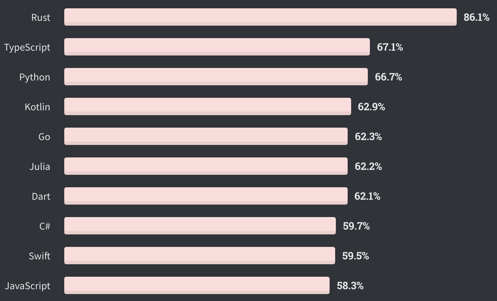
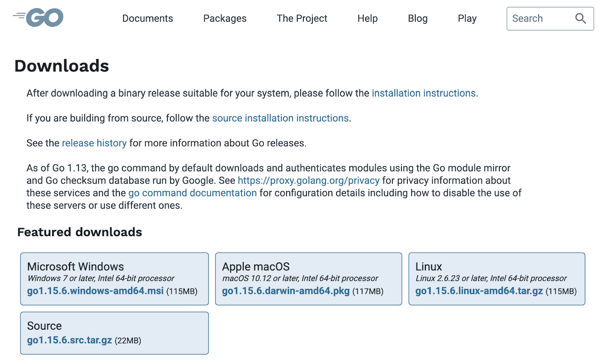
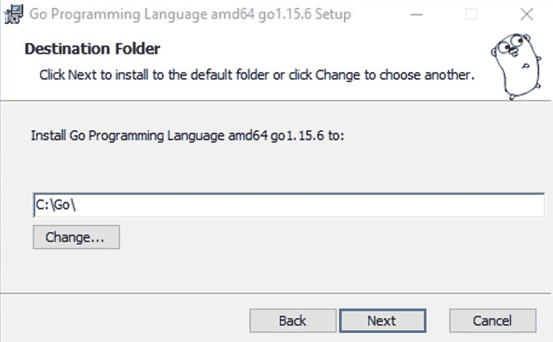
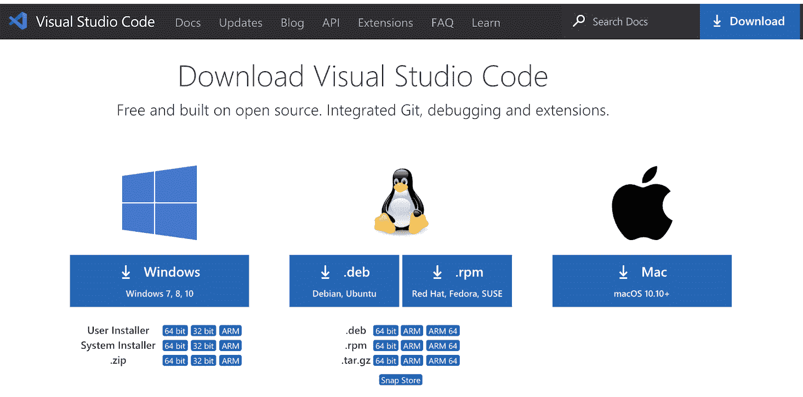
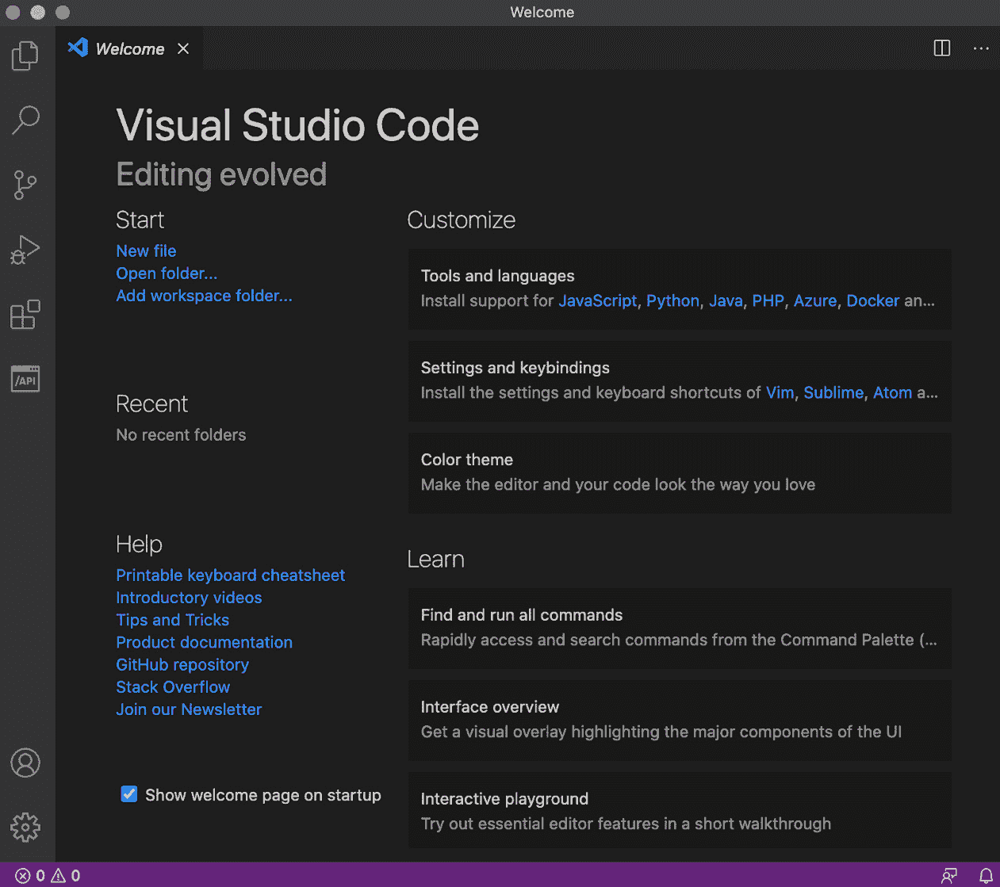
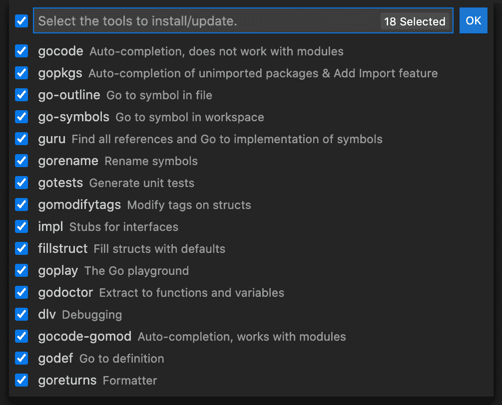
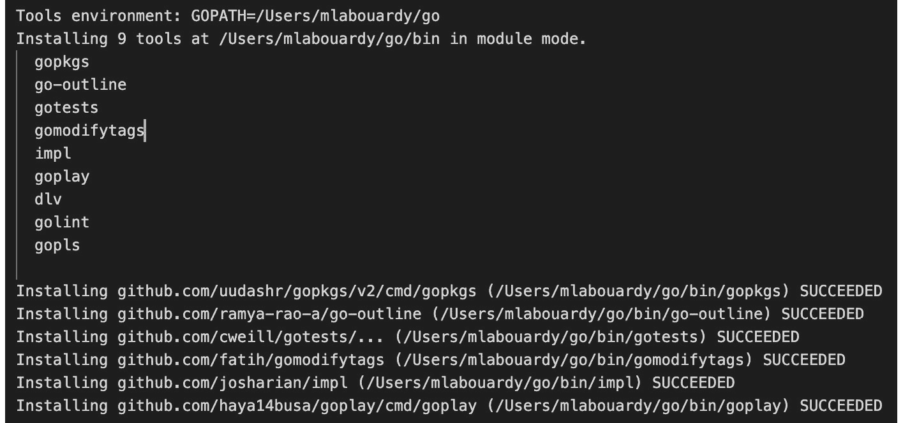
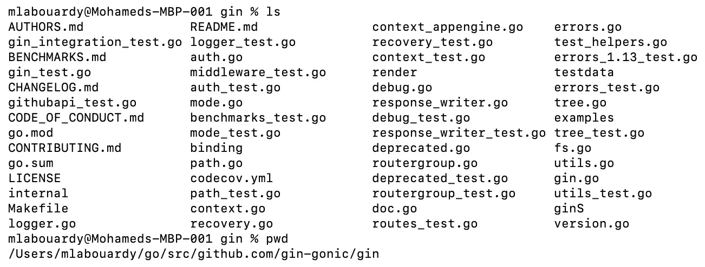
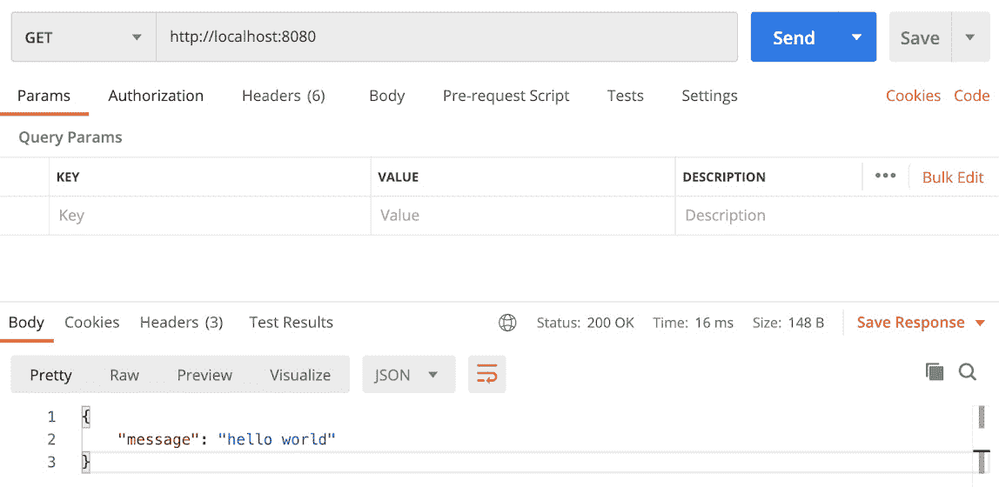
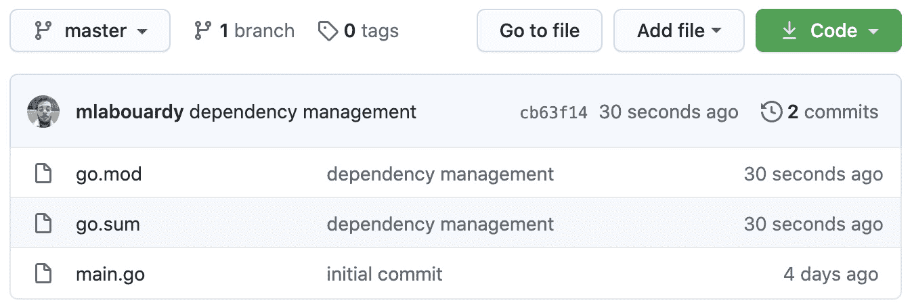

# 第一章：Gin 入门

本章将为您提供一个关于 Gin 框架的基础理解，包括它是如何工作的以及其特性。我们还将提供设置 Go 运行时和开发环境的指南。此外，我们将讨论使用 Gin 作为构建分布式应用程序的 Web 框架的优势。我们将通过学习编写第一个基于 Gin 的 Web 应用程序来结束本章。

在本章中，我们将涵盖以下主题：

+   什么是 Gin？

+   Go 运行时和 **集成开发环境**（**IDE**）

+   Go 模块和依赖管理

+   编写 Gin Web 应用程序

到本章结束时，您将能够使用 Gin Web 框架构建一个基本的 HTTP 服务器。

# 技术要求

为了跟随本章内容，您需要以下内容：

+   一些编程经验。本章中的代码相当简单，但了解一些 Go 知识会有所帮助。

+   一个用于编辑代码的工具。您拥有的任何文本编辑器都可以正常工作。大多数文本编辑器都具有良好的 Go 支持。最受欢迎的是 **Visual Studio Code (VSCode)**（免费）、GoLand（付费）和 Vim（免费）。

+   命令行终端。Go 在 Linux 和 Mac 上的任何终端以及 Windows 上的 PowerShell 或 CMD 中都能很好地工作。

本章的代码包托管在 GitHub 上，网址为 [`github.com/PacktPublishing/Building-Distributed-Applications-in-Gin/tree/main/chapter01`](https://github.com/PacktPublishing/Building-Distributed-Applications-in-Gin/tree/main/chapter01)。

# 什么是 Gin？

在深入探讨 Gin 网络框架之前，我们需要了解为什么 Go 是构建可扩展和分布式应用程序时的首选。

Go（也称为 Golang）是一种开源编程语言，由罗伯特·格里泽默、罗布·派克和肯·汤普森于 2007 年在谷歌开发。它是一种编译型、静态类型语言，旨在使用户能够轻松编写可靠、可扩展和高度高效的应用程序。Go 的关键特性如下：

+   **简单且一致**：Go 拥有一套丰富的库包，包括强大的标准库，用于测试、错误管理和并发。

+   函数前的 `go` 关键字。

+   **高效**：Go 提供高效的执行和编译。Go 还进行静态链接，这意味着编译器在最后一步调用链接器，解决所有库引用。这意味着在编译 Go 程序后，我们将得到一个没有外部依赖的二进制可执行文件。此外，它还提供了内置的垃圾回收器，以实现高效的内存利用（Go 与底层编程语言（如 C 或 C++）有许多相似之处）。

+   **社区和支持**：Go 由谷歌支持，并拥有不断增长的生态系统和众多在 GitHub 上对语言做出贡献的贡献者。此外，还有许多在线资源（教程、视频和书籍）可供入门学习 Go。

Go 在企业和开源社区中变得非常受欢迎。根据 2020 年 StackOverflow 开发者调查（[`insights.stackoverflow.com/survey/2020`](https://insights.stackoverflow.com/survey/2020)），Go 是最受欢迎的编程语言前五名之一：




图 1.2 – 由 Go 驱动的开源工具

如我们所见，Go 是一种适合分布式系统和基础设施工具的稳健语言。Docker、Kubernetes、Prometheus 等都是使用 Go 构建的。

Go 还因其构建各种规模和形状的 Web 应用程序而闻名。这部分得益于对标准库的出色工作，使其清洁、一致且易于使用。对于任何有抱负的 Go Web 开发者来说，最重要的包之一可能是 `net/http` 包。此包允许您使用其强大的组合结构在 Go 中构建 HTTP 服务器。

要构建 Web 应用程序，您需要构建一个 HTTP 服务器。客户端（例如，浏览器）会携带一些信息发出 HTTP 请求；然后服务器处理该请求并返回响应。响应可以是 JSON、XML 或 HTML 格式：


图 1.3 – HTTP 客户端-服务器通信

这种请求-响应模式是构建 Go 中 Web 应用程序的关键焦点之一。

虽然 `net/http` 包允许您轻松构建 Web 应用程序，但其路由机制并不那么强大，特别是对于复杂的应用程序。这就是 Web 框架发挥作用的地方。以下表格列出了顶级 Golang Web 框架：


Gin 可能是使用最广泛且运行最大的 Go 网络框架。该框架已经在 GitHub 上获得了 48,210 个星标和 5,100 个分支，这表明该框架非常受欢迎。这个模块化框架可以轻松扩展，几乎无需麻烦。它非常适合使用，因为许多组件可以直接通过 `net/http` 包重用。

重要提示

另一个强大但保守的框架是 Gorilla/Mux。它拥有最大的在线社区之一，互联网上有许多资源教你如何构建端到端网络应用程序。

根据官方文档 [`gin-gonic.com/docs/`](https://gin-gonic.com/docs/)，Gin 被描述如下：

"Gin 是一个用 Go (Golang) 编写的 HTTP 网络框架。它具有类似 Martini 的 API，但性能更好——快 40 倍。如果你需要惊人的性能，就试试 Gin 吧。"

Gin 是一个简约的 Web 框架，适合构建 Web 应用程序、微服务和 RESTful API。它通过创建可重用和可扩展的代码片段来减少样板代码：你可以编写一个中间件，可以插入一个或多个请求处理器。此外，它还具备以下关键特性：

+   **文档完善**：Gin 的文档广泛且全面。大多数与路由相关的工作都可以在文档中轻松找到。

+   **简洁性**：Gin 是一个非常简约的框架。只包含最基本的功能和库，几乎没有样板代码来启动应用程序，这使得 Gin 成为开发高度可用的 REST API 的优秀框架。

+   **可扩展性**：Gin 社区已经创建了众多经过良好测试的中间件，使得为 Gin 开发变得非常愉快。功能包括使用 GZip 进行压缩、使用授权中间件进行身份验证以及使用外部解决方案（如 Sentry）进行日志记录。

+   **性能**：Gin 比 Martini 快 40 倍，与其他 Golang 框架相比表现良好。以下是我对多个 Go 库进行的基准测试结果：

![图 1.4 – Golang 网络框架基准测试]


图 1.4 – Golang 网络框架基准测试

重要提示

这个基准测试是在 macOS High Sierra、2.7 GHz Intel Core i7、16 GB DDR3 计算机上进行的，运行环境为 Go 1.15.6。

话虽如此，在你能够编写第一行 Go 代码之前，你需要设置环境。让我们从安装 Go 开始。

# 设置 Go 环境

在撰写本书时，Go 的最新版本是 Go 1.15.6。要安装 Go，你可以下载或使用官方的二进制发行版，或者你可以从源代码安装 Go ([`github.com/golang/go`](https://github.com/golang/go))。

重要提示

官方的二进制发行版适用于 FreeBSD（版本 8 及以上）、Linux（2.6.23 及以上）、macOS（Snow Leopard 及以上）和 Windows（XP 及以上）。支持 32 位（386）和 64 位（amd64）x86 处理器架构。对于 FreeBSD 和 Linux，也支持 ARM 处理器架构。

要安装 Go，请从[`golang.org/dl/`](https://golang.org/dl/)网页下载分发包，如下所示，并选择适合您平台的文件：



图 1.5 – Golang 可用包

一旦您有了分发包，请根据您选择的平台安装 Go。我们将在以下章节中介绍这一点。

## Linux/FreeBSD

要在 Linux 或 FreeBSD 上安装 Go，您必须下载`go.-.tar.gz`。64 位架构上的最新 Linux Go 是`go1.15.6.linux-amd64.tar.gz`：

```go
wget -c https://golang.org/dl/go1.15.6.linux-amd64.tar.gz   //64bit
wget -c https://golang.org/dl/go1.15.6.linux-386.tar.gz     //32bit
```

下载存档并将其提取到`/usr/local`文件夹中。然后，以 root 用户或通过 sudo 运行以下命令：

```go
tar -C /usr/local -xzf go1.15.6.linux-amd64.tar.gz
```

将`/usr/local/go/bin`添加到`PATH`环境变量中。您可以通过将以下行添加到`$HOME/.profile`或`/etc/profile`（对于系统级安装）来实现：

```go
export PATH=$PATH:/usr/local/go/bin
```

通过打开命令提示符并输入以下命令来验证您已安装 Go：

```go
go version
```

此命令应显示已安装的 Go 版本：


图 1.6 – 已安装的 Go 版本

让我们继续看看如何在 Windows 上设置 Go 环境。

## Windows

要在 Windows 上安装 Go，您可以使用 MSI 安装程序或 ZIP 存档。使用 MSI 安装更简单。64 位架构上的最新 Windows Go 是`go1.15.6.windows-amd64.msi`。然后您需要根据您的系统执行以下命令之一：

```go
wget -c https://golang.org/dl/go1.15.6.windows-amd64.msi   //64bit
wget -c https://golang.org/dl/go1.15.6.windows-386.msi     //32bit
```

打开您下载的 MSI 文件，按照提示安装 Go。默认情况下，安装程序会将 Go 放置在`C:\Go`，并将`C:\Go\bin`设置到您的`PATH`环境变量中。您可以根据需要更改位置：



图 1.7 – Golang 安装向导

安装 Go 后，您需要关闭并重新打开任何打开的命令提示符，以便安装程序所做的环境更改反映在命令提示符中。

重要提示

使用 ZIP 存档同样简单。将文件提取到目录中（例如，`C:\Go`）并将`bin`子目录添加到您的`PATH`变量中。

安装完成后，点击`cmd`。然后按*Enter*键。在出现的命令提示符窗口中，输入`go version`命令，如下所示：


图 1.8 – 已安装的 Go 版本

您将看到**go version go1.15.6 windows/amd64**，如前述截图所示。这样，您就设置好了！

## MacOS

对于 MacOS，您可以下载适当的 PKG 文件；即 `go1.15.6.darwin-amd64.pkg`（在撰写本书时）。下载完成后，运行安装向导。该包将安装分发到 `/usr/local/go`，并将 `/usr/local/go/bin` 目录放置在您的 `PATH` 环境变量中：


图 1.9 – 在 MacOS 上安装 Go

您需要重新启动您的终端，或者在您的终端中运行此命令：

```go
source ~/.profile
```

或者，您可以使用 Homebrew 安装 Go。这可以像以下这样做：

```go
brew install golang@1.15.6
```

终端窗口将提供有关 Go 安装过程的反馈。安装完成可能需要几分钟。通过在命令提示符中打开并输入 `go version` 命令来验证您已安装 Go。

重要提示

在未来，要更新 Go，您可以运行以下命令来更新 Homebrew，然后更新 Go。您现在不需要这样做，因为您刚刚安装了最新版本：

```go
brew update
brew upgrade golang
```

现在您已安装 Go，您需要正确设置它。Go 开发工具旨在与维护在公共仓库中的代码一起工作，并且模型是相同的，无论您是在开发开源程序还是其他内容。Go 代码在开发空间中开发。开发空间由三个目录组成，具体如下：

+   `bin`：这将包含您所有的 Go 可执行二进制文件。

+   `src`：这将存储您的源文件，这些文件按包组织，`src` 目录中的一个子目录代表一个包。

+   `pkg`：这将存储您的包对象。

Go 开发空间的默认目录是带有 `go` 子目录的家目录或 `$HOME/go`。使用以下命令创建您的 Go 开发空间的目录结构：

```go
mkdir -p $HOME/go/{bin,src,pkg}
```

`-p` 选项告诉 `mkdir` 在目录中创建所有父目录，即使它们目前不存在。使用 `{bin, src, pkg}` 为 `mkdir` 创建一组参数，并告诉它创建 `bin`、`src` 和 `pkg` 目录。这将确保以下目录结构现在已就绪：

```go
The go, bin and  src folders should be at the same level (remove extra spaces from go and src folders, so the folders are aligned with bin folder)
$HOME 
 └── go 
 ├── bin 
 └── src 
```

接下来，您需要设置 `GOPATH` 环境变量，如下所示：

```go
export GOPATH=$HOME/go
export PATH=$PATH:$GOPATH/bin
```

您可以通过使用 `echo` 命令并检查输出，来验证您的 `$PATH` 是否已更新：

```go
echo $PATH
```

您应该在您的家目录中看到 `$GOPATH/bin`。如果您以 `USER` 身份登录，您将在路径中看到 `/Users/USER/go/bin`：

```go
/Users/USER/go/bin:/usr/local/sbin:/usr/local/bin:/usr/bin:/bin:/usr/sbin:/sbin
```

在创建 Go 开发空间和 `GOPATH` 后，我们可以继续设置开发环境。

## 集成开发环境

在本书中，我将使用 **IDE** 来编写 RESTful API 和服务。使用 IDE 可以提高您的生产力，因为它提供了丰富的功能，如自动完成、代码高亮、强大的内置调试器和自定义扩展。有许多 IDE 可用。在本书中，我将使用 **VSCode**。

要安装 VSCode，从 [`code.visualstudio.com/download`](https://code.visualstudio.com/download) 下载适合您系统的相应包：



图 1.10 – VS Code – 可用包

注意

Mac 用户也可以使用 `Brew` 通过以下命令安装 VSCode：

`brew install --cask visual-studio-code`

下载完成后，运行设置向导并按照说明操作。安装完成后，启动 VSCode。您将看到以下启动屏幕：



图 1.11 – VSCode 用户界面

VSCode 默认支持所有流行的编程语言和 Git 集成。您还可以安装扩展来扩展 VSCode 的功能。VS Code 市场包含大量免费社区插件和扩展。要启用对 Golang 的支持，您需要通过从左侧侧边栏的 **扩展** 选项卡导航来安装名为 **Go** 的扩展：


图 1.12 – VSCode 的 Golang 扩展

点击 **安装** 按钮，然后重新启动 VSCode 以使更改生效。

## 安装 Go 工具

接下来，我们将安装以下 Go 工具，这是一组帮助改进您编码过程中的开发工作流程和整体体验的包：


重要提示

可用的 Go 工具的完整列表可以在 [`pkg.go.dev/golang.org/x/tools`](https://pkg.go.dev/golang.org/x/tools) 找到。

要安装这些工具，请点击 `goinstall update/tools`：



图 1.13 – VSCode 上可用的 Go 工具

检查所有依赖项并点击 **确定**。下载所有依赖项可能需要一些时间：



图 1.14 – Go 工具安装

在您的计算机上安装并配置好 Go 后，现在您可以安装 Gin 框架了。

# 安装和配置 Gin

Gin 是一个第三方包。要在 Go 项目中安装 Gin，我们需要使用 `go get` 命令。该命令将安装包的 URL 作为参数。运行以下命令从 GitHub 安装 `gin` 包：

```go
go get github.com/gin-gonic/gin
```

注意

如果您正在运行 Go 1.16 及以上版本，您需要通过 `GO111MODULE=off` 选项禁用 Go 模块。

当检出 `gin` 包时，`go get` 命令会在 `$GOPATH/src` 路径下创建一个 Gin 目录。该目录将包含 Gin 框架的源代码：



图 1.15 – Gin 包源代码

在 `$GOHOME/src/hello-world` 或任何合适的目录下创建 `hello-world` 项目目录：

```go
mkdir -p $GOHOME/src/hello-world 
cd $GOHOME/src/hello-world
```

使用 VSCode 打开文件夹，并在项目文件夹内创建一个名为 `main.go` 的文件，其内容如下：

```go
package main
import "github.com/gin-gonic/gin"
func main() {
   router := gin.Default()
   router.GET("/", func(c *gin.Context) {
       c.JSON(200, gin.H{
           "message": "hello world",
       })
   })
   router.Run()
}
```

第一行，`package main`，表示这是本项目的主模块。`import` 部分用于导入 `gin` 包。此包为我们提供了 `router` 变量，该变量声明在 `import` 下方，以及我们在 `main` 函数中发送响应时使用的 API 上下文。

接下来，我们在根 (`/`) 资源上创建一个 HTTP `GET` 方法，并定义一个当 HTTP 请求击中根端点时要调用的函数。该函数发送一个状态码为 200（OK）的 JSON 响应，正文为 `"message": "test successful"`。

最后，我们必须使用 `router.Run()` 方法在端口 `8080` 上部署路由器。以下图表总结了 Gin 中 HTTP 请求的处理方式：


图 1.16 – 使用 Gin 解析传入的 HTTP 请求

要运行应用程序，请在终端会话中执行以下命令：

```go
go run main.go
```

从此以后，所有文件和执行的命令都将在此目录下。如果您遵循了设置过程，您应该在您的终端中看到以下输出：


图 1.17 – Gin 服务器日志

将您喜欢的浏览器指向 `http://localhost:8080`。您应该看到一个 `"hello world"` 消息：


图 1.18 – Hello world 示例

太棒了 – 你已经成功使用 Gin 框架在 Go 中启动了一个 HTTP 服务器。

返回终端，Gin 将跟踪 HTTP 请求：


图 1.19 – 跟踪传入的 HTTP 请求

您可以使用 `cURL` 命令发送 HTTP 请求：

```go
curl -X GET http://localhost:8080
```

或者，您可以使用高级 REST 客户端，如 Postman。您可以从以下网址根据您的平台下载正确的版本：[`www.getpostman.com/apps`](https://www.getpostman.com/apps)。

一旦下载完成，运行向导并打开 Postman。设置字段如下：

+   HTTP 方法: `GET`

+   URL: `http://localhost:8080`

+   头部：将 `Content-Type` 设置为 `application/json`

请求应配置如下：



图 1.20 – 使用 Postman 客户端发起 GET 请求

值得注意的是，默认情况下，HTTP 服务器正在监听端口 `8080`。但是，如果端口已被其他应用程序使用，您可以通过向 `Run` 方法添加参数来定义不同的端口：

```go
r.Run(":5000")
```

此命令将在端口 `5000` 上运行服务器，如下面的截图所示：


图 1.21 – 在端口 5000 上运行 Gin 服务器

注意，`port` 参数需要以冒号标点符号开头作为字符串传递。

你现在应该熟悉构建和运行简单 Web 应用程序的基础知识。在接下来的几节中，我们将介绍如何使用第三方包增强这些功能。但在我们这样做之前，让我们先了解如何管理 Go 依赖项。

# Golang 的依赖项管理

目前，代码是本地存储的。然而，建议将源代码存储在远程仓库中以进行版本控制。这就是 GitHub 等解决方案发挥作用的地方。在 [`github.com`](https://github.com) 上注册一个免费账户。然后，创建一个名为 `hello-world` 的新 GitHub 仓库：


图 1.22 – 新的 GitHub 仓库

接下来，使用以下命令初始化仓库：

```go
git init 
git remote add origin https://github.com/mlabouardy/hello-world.git
```

通过执行以下命令将 `main.go` 文件提交到远程仓库：

```go
git add . 
git commit -m "initial commit" 
git push origin master
```

你的仓库现在应该看起来像这样：


图 1.23 – 在 Git 中版本控制 main.go

我们可以在这里停止。但是，如果你在一个团队中工作，你需要确保所有团队成员都使用相同的 Go 版本和包。这就是 Go 模块出现的地方。Go 模块于 2018 年引入，以使依赖项管理变得更加容易。

注意

从 Go 1.16 开始，Go 模块是管理外部依赖项的默认方式。

在项目文件夹中，运行以下命令以创建一个新的模块：

```go
go mod init hello-world
```

此命令将创建一个包含以下内容的 `go.mod` 文件。该文件定义了项目需求并锁定依赖项到它们的正确版本（类似于 Node.js 中的 `package.json` 和 `package-lock.json`）：

```go
module github.com/mlabouardy/hello-world
go 1.15
```

要添加 Gin 包，我们可以发出 `go get` 命令。现在，我们的 `go.mod` 文件将如下所示：

```go
module github.com/mlabouardy/hello-world
go 1.15
require github.com/gin-gonic/gin v1.6.3
```

在添加 Gin 框架（输出因简洁而被裁剪）后，将生成一个名为 `go.sum` 的新文件。你可以假设它是一个锁文件。但实际上，`go.mod` 已经提供了足够的信息来实现 100% 可重复构建。另一个文件只是为了验证目的：它包含特定模块版本内容的预期加密校验和。你可以将其视为一个额外的安全层，以确保你的项目所依赖的模块不会意外更改，无论是出于恶意还是意外的原因：

```go
github.com/davecgh/go-spew v1.1.0/go.mod h1:J7Y8YcW2NihsgmVo/mv3lAwl/skON4iLHjSsI+c5H38=
github.com/davecgh/go-spew v1.1.1/go.mod h1:J7Y8YcW2NihsgmVo/mv3lAwl/skON4iLHjSsI+c5H38=
github.com/gin-contrib/sse v0.1.0 h1:Y/yl/+YNO8GZSjAhjMsSuLt29uWRFHdHYUb5lYOV9qE=
github.com/gin-contrib/sse v0.1.0/go.mod h1:RHrZQHXnP2xjPF+u1gW/2HnVO7nvIa9PG3Gm+fLHvGI=
github.com/gin-gonic/gin v1.6.3 h1:ahKqKTFpO5KTPHxWZjEdPScmYaGtLo8Y4DMHoEsnp14=
github.com/gin-gonic/gin v1.6.3/go.mod h1:75u5sXoLsGZoRN5Sgbi1eraJ4GU3++wFwWzhwvtwp4M=
github.com/go-playground/assert/v2 v2.0.1/go.mod h1:VDjEfimB/XKnb+ZQfWdccd7VUvScMdVu0Titje2rxJ4=
github.com/go-playground/locales v0.13.0 h1:HyWk6mgj5qFqCT5fjGBuRArbVDfE4hi8+e8ceBS/t7Q=
github.com/go-playground/locales v0.13.0/go.mod
```

你可以使用以下命令列出你的依赖项：

```go
go list -m all
```

输出如下：

```go
github.com/mlabouardy/hello-world
github.com/davecgh/go-spew v1.1.1
github.com/gin-contrib/sse v0.1.0
github.com/gin-gonic/gin v1.6.3
github.com/go-playground/assert/v2 v2.0.1
github.com/go-playground/locales v0.13.0
github.com/go-playground/universal-translator v0.17.0
github.com/go-playground/validator/v10 v10.2.0
github.com/golang/protobuf v1.3.3
github.com/google/gofuzz v1.0.0
github.com/json-iterator/go v1.1.9
github.com/leodido/go-urn v1.2.0
github.com/mattn/go-isatty v0.0.12
github.com/modern-go/concurrent v0.0.0-20180228061459
e0a39a4cb421
github.com/modern-go/reflect2 v0.0.0-20180701023420
4b7aa43c6742
github.com/pmezard/go-difflib v1.0.0
github.com/stretchr/objx v0.1.0
github.com/stretchr/testify v1.4.0
github.com/ugorji/go v1.1.7
github.com/ugorji/go/codec v1.1.7
golang.org/x/sys v0.0.0-20200116001909-b77594299b42
golang.org/x/text v0.3.2
golang.org/x/tools v0.0.0-20180917221912-90fa682c2a6e
gopkg.in/check.v1 v0.0.0-20161208181325-20d25e280405
gopkg.in/yaml.v2 v2.2.8
```

重要提示

要删除未使用的依赖项，可以使用 `go mod tidy` 命令。

最后，使用以下命令将 `go.mod` 和 `go.sum` 文件添加到远程仓库：

```go
git add .
git commit -m "dependency management"
git push origin master
```

更新后的仓库将如下所示：



图 1.24 – 使用 Go 模块管理依赖项

值得注意的是，下载的模块存储在您的 `$GOPATH/pkg/mod` 目录中。然而，有时将项目所依赖的模块或第三方包存储在本地并放置在一个文件夹中是有用的，这样它们就可以被纳入版本控制。幸运的是，Go 模块支持 vendoring：

```go
go mod vendor
```

此命令将在您的项目文件夹中创建一个包含所有第三方依赖的 `vendor` 目录。现在，您可以提交此文件夹到您的远程 Git 仓库，以确保未来构建的稳定性，而无需依赖外部服务：


图 1.25 – 供应商依赖

有时，您可能会想知道为什么某个特定包是依赖项。您可以通过分析或可视化项目依赖来回答这个问题。为此，我们可以使用 `go mod graph` 命令来显示 `go.mod` 文件中的模块列表：

```go
go mod graph | sed -Ee 's/@[^[:blank:]]+//g' | sort | uniq >unver.txt
```

此命令将生成一个名为 `unver.txt` 的新文件，其中包含以下内容（输出已被裁剪以节省空间）：

```go
github.com/gin-contrib/sse github.com/stretchr/testify
github.com/gin-gonic/gin github.com/gin-contrib/sse
github.com/gin-gonic/gin github.com/go-playground/validator/v10
github.com/gin-gonic/gin github.com/golang/protobuf
github.com/gin-gonic/gin github.com/json-iterator/go
github.com/gin-gonic/gin github.com/mattn/go-isatty
github.com/gin-gonic/gin github.com/stretchr/testify
github.com/gin-gonic/gin github.com/ugorji/go/codec
github.com/gin-gonic/gin gopkg.in/yaml.v2
```

然后，创建一个包含以下内容的 `graph.dot` 文件：

```go
digraph {
    graph [overlap=false, size=14];
    root="$(go list -m)";
    node [ shape = plaintext, fontname = "Helvetica", 
          fontsize=24];
    "$(go list -m)" [style = filled, 
                     fillcolor = "#E94762"];
```

此内容将使用 DOT 语言生成一个图结构。我们可以使用 DOT 来描述图（有向或无向）。换句话说，我们将使用以下命令将 `unvert.txt` 的输出注入到 `graph.dot` 文件中：

```go
cat unver.txt | awk '{print "\""$1"\" -> \""$2"\""};' >>graph.dot
echo "}" >>graph.dot
sed -i '' 's+\("github.com/[^/]*/\)\([^"]*"\)+\1\\n\2+g' graph.dot
```

这将生成一个模块依赖图：


图 1.26 – 模块依赖图

我们现在可以使用 Graphviz 渲染结果。此工具可以根据您的操作系统使用以下命令安装：

+   **Linux**：您可以根据您的包管理器下载官方包。对于 Ubuntu/Debian，使用以下命令：

    ```go
    apt-get install graphviz
    ```

+   **MacOS**：您可以使用 MacOS 的 Homebrew 工具：

    ```go
    brew install graphviz
    ```

+   **Windows**：您可以使用 Windows 的 Chocolatey ([`chocolatey.org/install`](https://chocolatey.org/install)) 软件包管理器：

    ```go
    choco install graphviz.portable
    ```

一旦安装了 Graphviz，执行以下命令将 `graph.dot` 文件转换为 `.svg` 格式：

```go
sfdp -Tsvg -o graph.svg graph.dot
```

将生成一个 `graph.svg` 文件。使用以下命令打开文件：

```go
open graph.svg
```

这将生成以下有向图：


图 1.27 – 可视化分析模块依赖

此图完美地展示了 *hello-world* 项目模块/包之间的依赖关系。

注意

生成依赖关系图的另一种方法是使用 `modgv` 工具 ([`github.com/lucasepe/modgv`](https://github.com/lucasepe/modgv))。此工具使用单个命令将 `go mod graph` 输出转换为 GraphViz 的 DOT 语言。

现在源代码已在 GitHub 中进行版本控制，我们可以进一步探索如何为 Gin 路由编写自定义函数处理器。

# 编写自定义 HTTP 处理器

你可以创建一个接受 `*gin.Context` 作为参数的处理函数，并返回状态码为 200 的 JSON 响应。然后，你可以使用 `router.Get()` 函数注册处理函数：

```go
package main
import "github.com/gin-gonic/gin"
func IndexHandler(c *gin.Context){
   c.JSON(200, gin.H{
       "message": "hello world",
   })
}
func main() {
   router := gin.Default()
   router.GET("/", IndexHandler)
   router.Run()
}
```

重要提示

在本书的高级章节中，当处理单元测试时，将处理函数与路由器分离将非常有用。

Gin 框架最大的优势是它能够从请求 URL 中提取段。考虑以下示例：

```go
/users/john
/hello/mark
```

此 URL 有一个动态段：

+   用户名：Mark，John，Jessica 等等

你可以使用以下 `:variable` 模式实现动态段：

```go
func main() {
   router := gin.Default()
   router.GET("/:name", IndexHandler)
   router.Run()
}
```

我们必须做的最后一件事是从变量中获取数据。`gin` 包自带了 `c.Params.ByName()` 函数，它接受参数名称并返回值：

```go
func IndexHandler(c *gin.Context) {
   name := c.Params.ByName("name")
   c.JSON(200, gin.H{
       "message": "hello " + name,
   })
}
```

使用 `go run` 命令重新运行应用程序。在浏览器中点击 `http://localhost:8080/mohamed` 链接；用户将被返回：


图 1.28 – 路径参数示例

现在，我们知道每次我们点击 `GET /user` 路由时，我们都会得到 "hello user" 的响应。如果我们点击任何其他路由，它应该返回一个 404 错误消息：


图 1.29 – Gin 中的错误处理

Gin 还可以处理 XML 格式的 HTTP 请求和响应。为此，定义一个包含 `firstName` 和 `lastName` 作为属性的 user struct。然后，使用 `c.XML()` 方法来渲染 XML：

```go
func main() {
   router := gin.Default()
   router.GET("/", IndexHandler)
   router.Run()
}
type Person struct {
     XMLName xml.Name `xml:"person"`
     FirstName     string   `xml:"firstName,attr"`
     LastName     string   `xml:"lastName,attr"`
}
func IndexHandler(c *gin.Context) {
     c.XML(200, Person{FirstName: "Mohamed", 
                       LastName: "Labouardy"})
}
```

现在，重新运行应用程序。如果你导航到 [`localhost:8080`](http://localhost:8080)，服务器将返回以下 XML 响应：


图 1.30 – XML 响应

恭喜！到这一点，你已经在本地机器上设置了 Go 编程工作区，并且已经配置了 Gin。现在，你可以开始一个编码项目了！

# 摘要

在本章中，我们为您介绍了 Go 编程语言。我们学习了如何设置运行时和开发环境。我们还了解了 GOPATH 环境变量，它是 Go 中的工作空间定义，现在我们知道所有包和项目都位于该路径上。

之后，我们探讨了不同的 Go Web 框架，并了解了为什么 Gin 是构建分布式 Web 应用程序中最受欢迎的。最后，我们学习了如何从头开始使用 Gin 编写我们的第一个 hello world 项目。

在下一章中，我们将动手实践，开始使用 Gin 框架构建分布式 RESTful API。

# 问题

1.  为什么 Golang 流行？

1.  最好的 Golang Web 开发框架有哪些？

1.  什么是 Go 模块？

1.  使用 Gin 框架编写的 HTTP 服务器默认端口是什么？

1.  使用什么方法来渲染 JSON 和 XML 响应？

# 进一步阅读

+   《*用 Go 实践无服务器应用程序*》，作者 Mohamed Labouardy，由 Packt Publishing 出版

+   《*用 Go 实践 RESTful Web 服务（第二版）*》，作者 Naren Yellavula，由 Packt Publishing 出版
