# 第五章：在 Gin 中提供静态 HTML

在本章中，你将学习如何构建一个消费基于 Gin 的**API**响应的**静态 Web 应用**。在这个过程中，你将学习如何使用 Gin 提供 Web 资源（JavaScript、**层叠样式表**（**CSS**）和图片）以及渲染**HTML**模板。最后，你将了解如何使用 Go 构建一个自包含的 Web 应用，并使用 Gin 中间件解决**跨源资源共享**（**CORS**）策略错误。

在本章中，我们将关注以下主题：

+   提供静态文件

+   渲染 HTML 模板

+   构建自包含的 Web 应用

+   构建**单页应用**（**SPA**）

到本章结束时，你将能够使用 React 构建 SPA 以消费你的 RESTful API 端点。

# 技术要求

要遵循本章的说明，你需要以下内容：

+   完全理解前一章的内容——本章是前一章的后续，它将使用相同的源代码。因此，一些代码片段将不会解释，以避免重复。

+   具备前端开发经验，理想情况下了解 Angular、React 或 Vue.js 等 Web 框架。

本章的代码包托管在 GitHub 上，网址为[`github.com/PacktPublishing/Building-Distributed-Applications-in-Gin/tree/main/chapter05`](https://github.com/PacktPublishing/Building-Distributed-Applications-in-Gin/tree/main/chapter05)。

# 提供静态文件

在前面的章节中，你已经看到了如何在`index.html`文件中渲染 API 响应，然后转到提供来自文件系统的静态文件，如 JavaScript、CSS 文件和图片，并最终渲染 HTML 模板。

要开始提供静态文件，请按照以下步骤操作：

1.  创建一个新的项目文件夹，并使用`index.html`文件打开它，以显示带有`<h2>`标签的`Hello world`消息，如下所示：

    ```go
    <html>
    <head>
       <title>Recipes Platform</title>
    </head>
    <body>
       <h2>Hello world</h2>
    </body>
    </html>
    ```

1.  接下来，使用`go get`命令安装`github.com/gin-gonic/gin`，编写一个`main.go`文件，并使用`gin.Default()`方法定义一个路由器。然后，为`index`页面定义一个路由，并在其上注册一个`IndexHandler`处理器。路由处理器将使用`c.File`方法提供`index.html`文件。完整的`main.go`文件如下所示：

    ```go
    package main
    import "github.com/gin-gonic/gin"
    func IndexHandler(c *gin.Context) {
       c.File("index.html")
    }
    func main() {
       router := gin.Default()
       router.GET("/", IndexHandler)
       router.Run()
    }
    ```

1.  使用以下命令运行应用程序：

    ```go
    localhost and serves on port 8080 by default, as illustrated in the following screenshot: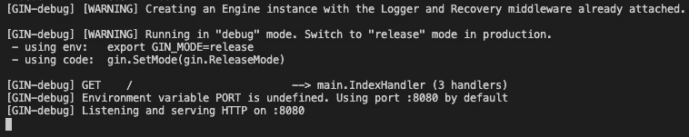Figure 5.1 – Server logs
    ```

1.  使用你喜欢的浏览器，转到[`localhost:8080`](http://localhost:8080)，你应该看到一条**Hello world**消息，如下所示：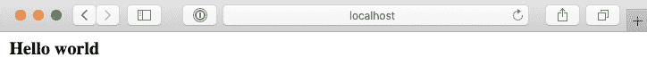

    图 5.2 – 提供 index.html

1.  接下来，更新`index.html`文件以显示一些使用以下代码的食谱。它引用了页面样式的静态资源（`app.css`）和食谱图片（`burger.jpg`和`pizza.jpg`）：

    ```go
    <html>
    <head>
       <title>Recipes Platform</title>
       <link rel="stylesheet" href="assets/css/app.css">
    </head>
    <body>
       <div class="recipes">
           <div class="recipe">
               <h2>Pizza</h2>
               
           </div>
           <div class="recipe">
               <h2>Burger</h2>
               
           </div>
       </div>
    </body>
    </html>
    ```

1.  静态文件存储在项目根存储库下的`assets`文件夹中。创建一个具有以下结构的`assets`文件夹：

    ```go
    .
    ├── css
    │   └── app.css
    └── images
        ├── burger.jpg
        └── pizza.jpg
    .recipes {
       width: 100%;
    }
    .recipe {
       width: 50%;
       float: left;
    }
    .recipe img {
       height: 320px;
    }
    ```

1.  为了能够从 `index.html` 加载这些资产，服务器也应该提供它们。这就是 `router.Static` 方法发挥作用的地方。添加以下指令以在 `/assets` 路由下提供 `assets` 文件夹：

    ```go
    router.Static("/assets", "./assets")
    ```

1.  重新运行应用程序——图片和 CSS 文件现在应该可以从 http://localhost:8080/assets/PATH 访问，如下截图所示：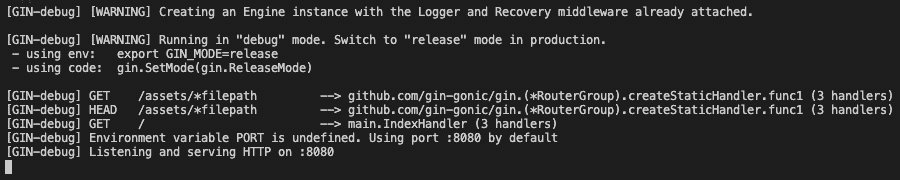

    

    Figure 5.3 – 提供资产

1.  返回浏览器并刷新页面——现在应该会显示以下结果：

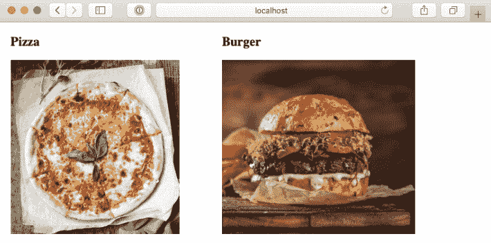


Figure 5.4 – 使用 Gin 提供 CSS 和图片

从你所能看到的，页面相当基础！现在你可以使用 Gin 提供静态资源了。

到目前为止，你已经看到了如何在 Gin 应用程序中提供 HTML 和静态文件。在下一节中，我们将介绍如何创建 HTML 模板并渲染动态内容。

# 渲染 HTML 模板

在本节中，你将添加功能以通过从服务器端生成 `index.html` 文件来动态显示食谱列表。Gin 框架在后台使用 Go 标准的 `text/template` 和 `html/template` 包来生成文本和 HTML 输出。

要开始，请按照以下步骤操作：

1.  创建一个 `Recipe` 结构体。该结构体将只包含两个字段：名称和图片。这可以表示如下：

    ```go
    type Recipe struct {
       Name    string `json:"name"`
       Picture string `json:"picture"`
    }
    ```

1.  接下来，更新 `IndexHandler` 处理器以创建一个 `recipes` 切片。然后，通过传递 `recipes` 切片调用 `c.HTML` 方法来渲染 `index.tmpl` 文件。为了简化问题，我们将食谱列表保存在内存中，因此我们将使用两个硬编码的食谱初始化 `recipes` 切片，如下所示：

    ```go
    func IndexHandler(c *gin.Context) {
       recipes := make([]Recipe, 0)
       recipes = append(recipes, Recipe{
           Name:    "Burger",
           Picture: "/assets/images/burger.jpg",
       })
       recipes = append(recipes, Recipe{
           Name:    "Pizza",
           Picture: "/assets/images/pizza.jpg",
       })
      recipes = append(recipes, Recipe{
           Name:    "Tacos",
           Picture: "/assets/images/tacos.jpg",
       })
       c.HTML(http.StatusOK, "index.tmpl", gin.H{
           "recipes": recipes,
       })
    }
    ```

    注意

    `.tmpl` 扩展名不是必需的；然而，为了清晰起见，建议在项目内保持一致性。

1.  在项目文件夹的根目录下创建一个 `templates` 文件夹，并编写一个 `index.tmpl` 文件，内容如下：

    ```go
    <html>
    <head>
       <title>Recipes</title>
       <link rel="stylesheet" href="assets/css/app.css">
    </head>
    <body>
       <div class="recipes">
           {{range .recipes}}
           <div class="recipe">
               <h2>{{ .Name }}</h2>
               
           </div>
           {{end}}
       </div>
    </body>
    </html>
    ```

1.  `range` 关键字用于遍历 `recipes` 切片中的所有食谱。对于食谱范围内的每个食谱，显示其图片和名称。在范围内，每个食谱变为 `{{.}}`，因此食谱属性变为 `{{.Name}}` 或 `{{.Picture}}`。

1.  接下来，告诉 Gin 从 `templates` 目录加载模板。模板将在服务器启动时从磁盘加载一次；因此，应用程序将更快地提供 HTML 页面。以下代码片段展示了如何实现：

    ```go
    router.LoadHTMLGlob("templates/*")
    ```

1.  重新运行应用程序，再次访问 `localhost:8080`。将显示一个食谱列表，如下截图所示：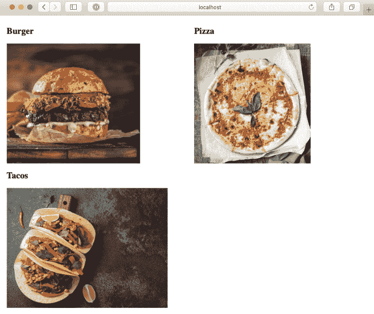

    

    ```go
    [
       {
           "name": "Crock Pot Roast",
           "ingredients": [
               {
                   "quantity": "1",
                   "name": "beef roast",
                   "type": "Meat"
               },
               {
                   "quantity": "1 package",
                   "name": "brown gravy mix",
                   "type": "Baking"
               },
               {
                   "quantity": "1 package",
                   "name": "dried Italian salad 
                            dressing mix",
                   "type": "Condiments"
               },
               {
                   "quantity": "1 package",
                   "name": "dry ranch dressing mix",
                   "type": "Condiments"
               },
               {
                   "quantity": "1/2 cup",
                   "name": "water",
                   "type": "Drinks"
               }
           ],
           "steps": [
               "Place beef roast in crock pot.",
               "Mix the dried mixes together in a bowl 
                    and sprinkle over the roast.",
               "Pour the water around the roast.",
               "Cook on low for 7-9 hours."
           ],
           "imageURL": "/assets/images/
                        crock-pot-roast.jpg"
       }
    ]
    ```

1.  将 `Recipe` 结构体更新为与 `recipe` 字段相对应，如下所示：

    ```go
    type Recipe struct {
       Name        string       `json:"name"`
       Ingredients []Ingredient `json:"ingredients"`
       Steps       []string     `json:"steps"`
       Picture     string       `json:"imageURL"`
    }
    type Ingredient struct {
       Quantity string `json:"quantity"`
       Name     string `json:"name"`
       Type     string `json:"type"`
    }
    var recipes []Recipe
    ```

1.  在 `init()` 方法中，读取 JSON 文件并使用 `json.Unmarshal` 方法将其内容编码到 `recipes` 切片中，如下所示：

    ```go
    func init() {
       recipes = make([]Recipe, 0)
       file, _ := ioutil.ReadFile("recipes.json")
       _ = json.Unmarshal([]byte(file), &recipes)
    }
    ```

1.  然后，更新`IndexHandler`处理器，将`recipes`切片传递给名为`recipes`的变量，并在`index.tmpl`模板中使用，如下所示：

    ```go
    func IndexHandler(c *gin.Context) {
       c.HTML(http.StatusOK, "index.tmpl", gin.H{
           "recipes": recipes,
       })
    }
    ```

1.  最后，自定义模板文件，使用`range`关键字显示食谱的成分和步骤。使用字段名（`{{ .FieldName }}`）的点操作符访问食谱属性，如下面的代码片段所示：

    ```go
    <html>
    <head>
       <title>Recipes</title>
       <link rel="stylesheet" href="assets/css/app.css">
       <link href="https://cdn.jsdelivr.net/npm/bootstrap@5.0.0-beta2/dist/css/bootstrap.min.css" rel="stylesheet">
    </head>
    <body class="container">
       <div class="row">
           {{range .recipes}}
           <div class="col-md-3">
               <div class="card" style="width: 18rem;">
                   
                   <div class="card-body">
                       <h5 class="card-title">{{ 
                           .Name }}</h5>
                       {{range $ingredient := 
                           .Ingredients}}
                       <span class="badge bg-danger 
                           ingredient">
                           {{$ingredient.Name}}
                       </span>
                       {{end}}
                       <ul class="steps">
                           {{range $step := .Steps}}
                           <li>{{$step}}</li>
                           {{end}}
                       </ul>
                   </div>
               </div>
           </div>
           {{end}}
       </div>
    </body>
    <script src="img/bootstrap.bundle.min.js"></script>
    </html>
    ```

    注意

    关于高级模板操作符和运算符的进一步说明，请参阅 Go 官方文档[`golang.org/pkg/text/template/`](https://golang.org/pkg/text/template/)。

1.  重新运行应用程序，并在浏览器中刷新页面。这次，将显示一个美观的**用户界面**（**UI**），如下面的屏幕截图所示：

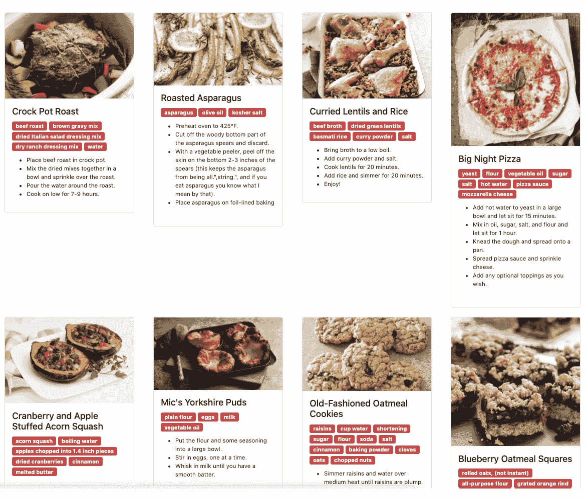

图 5.6 – 使用 Go 模板渲染数据

如您所见，您的应用程序看起来更加美观。您所做的只是添加了一些 Bootstrap 框架的 CSS（要了解更多关于框架的信息，请参阅[`getbootstrap.com/`](https://getbootstrap.com/)); 因此，从功能角度来看，没有任何变化。

如果您回到终端，您会注意到图像和其他资源是从 HTTP 服务器提供的，如下所示：

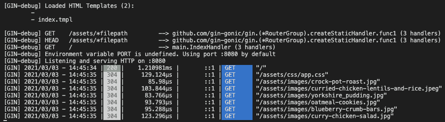

图 5.7 – 服务器图像

太好了！资源是从 Gin 服务器提供的，现在您可以构建一个动态网页。

## 创建视图模板

目前，我们构建的应用程序显示了一个食谱列表。您可以进一步创建一个食谱页面，让用户可以看到完整的食谱。为此，您需要为每个食谱创建一个唯一的标识符；这样，您就可以有一个唯一的 URL 来访问每个食谱。

要开始，请按照以下步骤操作：

1.  在`recipes.json`文件中的食谱项中添加一个`id`属性，如下所示，或者您可以从书籍 GitHub 仓库中的`chapter05`文件夹下载`recipes.json`文件：

    ```go
    [
       {
           "id": "603fa0f0b39c47f0e40659c2",
           "name": "Crock Pot Roast",
           "ingredients": [...],
           "steps": [...],
           "imageURL": "/assets/images/
                        crock-pot-roast.jpg"
       }
    ]
    ```

1.  然后，将`ID`字段添加到`Recipe`结构体中，如下所示：

    ```go
    type Recipe struct {
       ID          string       `json:"id"`
       Name        string       `json:"name"`
       Ingredients []Ingredient `json:"ingredients"`
       Steps       []string     `json:"steps"`
       Picture     string       `json:"imageURL"`
    }
    ```

1.  要能够导航到食谱页面，请在`index.tmpl`文件中的每个食谱项中添加一个按钮。当点击按钮时，用户将被重定向到目标食谱页面。`{{ .ID }}`表达式将被评估并替换为食谱 ID。代码如下所示：

    ```go
    <section class="container">
           <div class="row">
               {{range .recipes}}
               <div class="col-md-3">
                   <div class="card" style="width: 
                    18rem;">
                       
                       <div class="card-body">
                           <h5 class="card-title">{{ 
                               .Name }}</h5>
                           {{range $ingredient := 
                               .Ingredients}}
                           <span class="badge bg-danger 
                               ingredient">
                               {{$ingredient.Name}}
                           </span>
                           {{end}}
                           <ul class="steps">
                               {{range $step := .Steps}}
                               <li>{{$step}}</li>
                               {{end}}
                           </ul>
                           <a href="/recipes/{{ .ID }}" 
                               class="btn btn-primary btn-
                               sm">See recipe</a>
                       </div>
                   </div>
               </div>
               {{end}}
           </div>
    </section>
    ```

1.  话虽如此，在`/recipes/:id`上提供食谱页面。请注意此路由中的`:id`部分。开头的两个*点*表示这是一个动态路由。该路由将存储食谱`id`属性在名为`ID`的路由参数中，我们可以在`RecipeHandler`处理器中访问它。以下是您需要的代码：

    ```go
    router.GET("/recipes/:id", RecipeHandler)
    ```

    以下代码片段包含路由处理程序代码，内容自解释。它遍历 `recipes` 切片，寻找与请求参数中给出的 ID 匹配的食谱。如果找到匹配项，则将使用食谱的数据渲染 `recipe.tmpl` 文件。如果没有找到，用户将被重定向到 `404.html` 错误页面，该页面将简单地显示一个 404 插图和“食谱未找到”的消息。这可以通过以下代码实现：

    ```go
    <html>
    <head>
       <title>Recipe not found</title>
       <link rel="stylesheet" href="/assets/css/app.css">
       <link href="https://cdn.jsdelivr.net/npm/ 	    bootstrap@5.0.0-beta2/dist/css/bootstrap.min.css"  	    rel="stylesheet">
    </head>
    <body>
       <section class="container not-found">
           <h4>Recipe not found /h4>
           
       </section>
    </body>
    <script src="img/bootstrap.bundle.min.js"></script>
    </html>
    ```

1.  要测试新更改，重新运行服务器，然后返回浏览器并刷新页面。将返回食谱列表，但这次我们有一个 **查看食谱** 按钮，如图所示：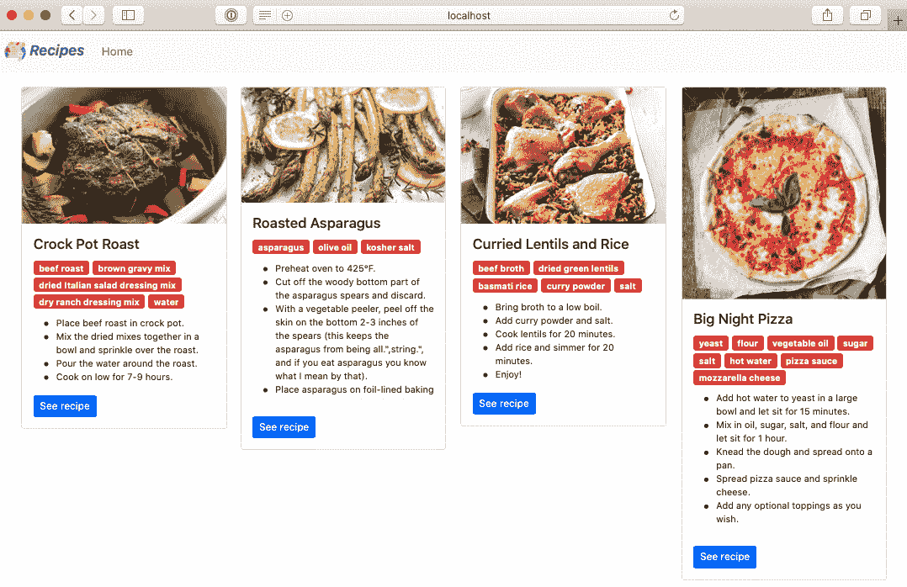

    图 5.8 – 首页

1.  点击 **查看食谱** 按钮。

    您将被重定向到 **食谱** 页面，在那里您可以查看完整的食谱成分和说明，如图所示：

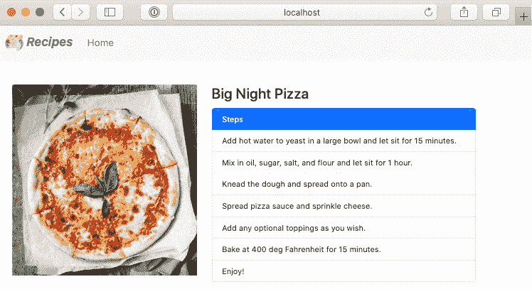

图 5.9 – 食谱页面

您也可以通过与朋友分享它们的 URL 来分享您最喜欢的食谱。如果某个食谱不再存在或您分享了一个错误的食谱 ID，则将显示 404 页面，如下所示：

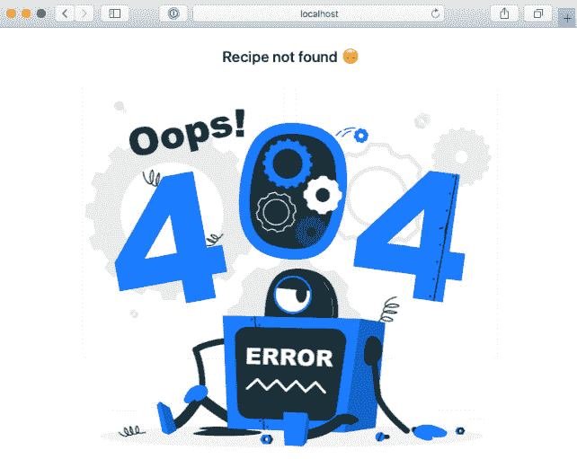

图 5.10 – 404 错误页面

您可能已经注意到，您使用了一个导航栏来能够轻松地在首页（显示食谱列表的页面）和食谱页面之间切换。相同的代码被用于两个不同的模板文件。为了避免代码重复，您可以创建 **可重用模板**。

## 创建可重用模板

**导航栏** 是将在我们应用程序的多个页面中重用的常见功能。为了创建一个可重用模板，请按照以下步骤操作：

1.  在 `templates` 文件夹中创建一个 `navbar.tmpl` 文件，并将导航栏代码放入其中，如下所示：

    ```go
    <nav class="container-fluid navbar navbar-expand-lg navbar-light bg-light">
       <a class="navbar-brand" href="#">
           <div class="logo">
               
               <span>Recipes</span>
           </div>
       </a>
       <button class="navbar-toggler" type="button" data-toggle="collapse" data-target="#navbarSupportedContent"
           aria-controls="navbarSupportedContent" aria-expanded="false" aria-label="Toggle navigation">
           <span class="navbar-toggler-icon"></span>
       </button>
       <div class="collapse navbar-collapse" 
          id="navbarSupportedContent">
           <ul class="navbar-nav mr-auto">
               <li class="nav-item active">
                   <a class="nav-link" href="/">Home</a>
               </li>
           </ul>
       </div>
    </nav>
    ```

1.  接下来，从 `index.tmpl` 和 `recipe.tmpl` 文件中删除导航栏代码，并按照以下说明从 `navbar.tmpl` 文件导入 `navbar` 模板：

    ```go
    <html>
    <head>
       <title>{{ .recipe.Name }} - Recipes</title>
       ...
    </head>
    <body>
       {{template "navbar.tmpl"}}
       <section class="container recipe">
           <div class="row">
               <div class="col-md-3">
                   
               </div>
               <div class="col-md-9">
                   <h4>{{ .recipe.Name }}</h4>
                   <ul class="list-group list-steps">
                       <li class="list-group-item 
                         active">Steps</li>
                       {{range $step := .recipe.Steps }}
                       <li class="list-group-
                           item">{{$step}}</li>
                       {{end}}
                   </ul>
               </div>
           </div>
       </section>
    </body>
    ...
    </html>
    ```

您的可重用模板已创建。

包含 `{{template "navbar.tmpl"}}` 的行用于动态加载导航栏。与导航栏一样，您可以从应用程序的常见部分（如页眉、页脚、表单等）创建可重用模板。在此阶段，您项目的目录结构应如下所示：

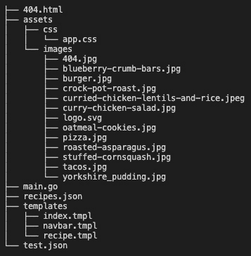

图 5.11 – 项目结构

到目前为止，您已经看到了如何通过编译源代码在本地运行应用程序。但如果我们想构建 Web 应用程序的二进制文件以便远程部署或与他人共享呢？让我们看看如何做这件事。

# 构建自包含的 Web 应用程序

幸运的是，Go 是一种编译型语言，这意味着您可以使用单个命令创建包含所需依赖项的可执行文件或二进制文件，如下所示：

```go
go build -o app main.go
```

备注

您可以使用 `GOOS` 和 `GOARCH` 环境变量为不同的架构或平台（Windows、macOS、Linux 等）构建可执行文件。

该命令将在您的当前目录中创建一个名为 `app` 的可执行文件。默认情况下，Go 使用应用程序目录的名称来命名可执行文件。但是，您可以使用 `-o` 标志指定不同的名称或位置。

您现在可以使用以下命令执行二进制文件：

```go
./app
```

服务器将像往常一样在端口 `8080` 上启动，您可以从 `localhost:8080` 访问网络应用程序，如下面的截图所示：

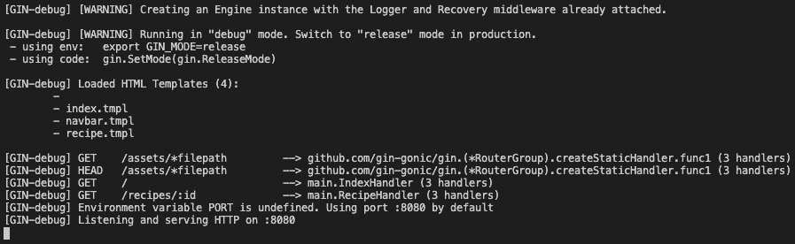

图 5.12 – 运行可执行文件

应用程序按预期工作，因为 HTML 模板和资源位于正在执行可执行文件的同一文件夹中。

如果您从不同的目录运行二进制文件，那么您需要遵循以下步骤：

1.  使用以下命令将可执行文件复制到您的主目录：

    ```go
    mv app $HOME
    cd $HOME
    ```

1.  重新运行应用程序——它应该立即崩溃，因为找不到 `templates` 文件夹。您将看到类似以下的内容：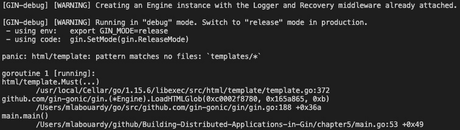

    图 5.13 – 应用程序堆栈跟踪

    您可以将 `templates` 和 `assets` 文件夹复制到主目录。然而，在升级或将二进制文件移动到新位置时，记住更新所有文件引用通常很麻烦。更好的解决方案是将所有静态文件嵌入到一个单独的二进制文件中。

1.  `go-assets-builder` 是一个工具，可以将任何文本或二进制文件转换为 Go 源代码，使其成为将资源嵌入 Go 应用程序的完美选择。使用以下命令安装 `go-assets-builder` 包：

    ```go
    go get github.com/jessevdk/go-assets-builder
    ```

1.  然后，调用 `go-assets-builder` 命令从静态文件生成 Go 代码，如下所示：

    ```go
    assets.go source file. The resulting code will look like this:

    ```

    var Assets = assets.NewFileSystem(map[string][]string{

    "/": []string{"assets", "templates", "404.html",

    "recipes.json"}, "/assets/css":

    []string{"app.css"}, "/assets/images":

    []string{"stuffed-cornsquash.jpg", "curry-chicken-

    salad.jpg"}, "/templates": []string{"navbar.tmpl",

    "index.tmpl", "recipe.tmpl"}},

    map[string]*assets.File{

    "/": &assets.File{

    路径:     "/",

    FileMode: 0x800001ed,

    Mtime:    time.Unix(1615118299,

    1615118299722824447),

    数据:     nil,

    },  "/templates/navbar.tmpl": &assets.File{

    路径:     "/templates/navbar.tmpl",

    FileMode: 0x1a4,

    Mtime:    time.Unix(1614862865,

    1614862865957528581),

    数据:     []byte(_Assets9a0a5c784c66e5609ac

    d084702e97a6a733e0d56),

    }, "/recipes.json": &assets.File{

    路径:     "/recipes.json",

    FileMode: 0x1a4,

    Mtime:    time.Unix(1614782782,  	 	 	 	                           1614782782296236029),

    数据:     []byte(_Assets142ce9f9ba8b43eeb97b8

    3c79ea872ed40e6cba1),

    }, "")

    ```go

    ```

1.  接下来，更新`main.go`以加载 HTML 文件。模板可通过`Assets.Files`映射结构访问。确保导入`html/template`库。代码在以下代码片段中说明：

    ```go
    func loadTemplate() (*template.Template, error) {
       t := template.New("")
       for name, file := range Assets.Files {
           if file.IsDir() || !strings.HasSuffix(name, 
                   ".tmpl") {
               continue
           }
           h, err := ioutil.ReadAll(file)
           if err != nil {
               return nil, err
           }
           t, err = t.New(name).Parse(string(h))
           if err != nil {
               return nil, err
           }
       }
       return t, nil
    }
    ```

1.  然后，更新 HTTP 路由器，当服务器被要求提供`index.tmpl`、`recipe.tmpl`或`navbar.tmpl`模板时，调用`loadTemplate`方法，如下所示：

    ```go
     func main() {
       t, err := loadTemplate()
       if err != nil {
           panic(err)
       }
       router := gin.Default()
       router.SetHTMLTemplate(t)
       router.GET("/", IndexHandler)
       router.GET("/recipes/:id", RecipeHandler)
       router.GET("/assets/*filepath", StaticHandler)
       router.Run()
     }
    ```

1.  对于资产文件（CSS 和图像），定义一个自定义 HTTP 处理器，根据`filepath`参数提供正确的资产，如下所示：

    ```go
    func StaticHandler(c *gin.Context) {
       filepath := c.Param("filepath")
       data := Assets.Files["/assets"+filepath].Data
       c.Writer.Write(data)
    }
    ```

1.  接下来，为`assets`文件夹定义一个带有`filepath`参数的路由，如下所示：

    ```go
    router.GET("/assets/*filepath", StaticHandler)
    ```

1.  同时更新`recipes.json`文件，从`Assets.Files`映射中加载它，如下所示：

    ```go
    func init() {
       recipes = make([]Recipe, 0)
       json.Unmarshal(Assets.Files["/recipes.json"].Data, 
          &recipes)
    }
    ```

1.  确保更新`index.tmpl`和`recipe.tmpl`中的`navbar`引用，如下所示：

    ```go
    {{template "/templates/navbar.tmpl"}}
    ```

1.  最后，在`RecipeHandler`和`IndexHandler`处理器中修复`templates`路径。

1.  现在，使用以下命令构建应用程序，应用新更改：

    ```go
    go build -o app
    mv app $HOME
    cd $HOME
    ./app
    ```

这次，应用程序将是功能性的，所有资产都将从二进制文件中加载。你可以在这里看到结果：

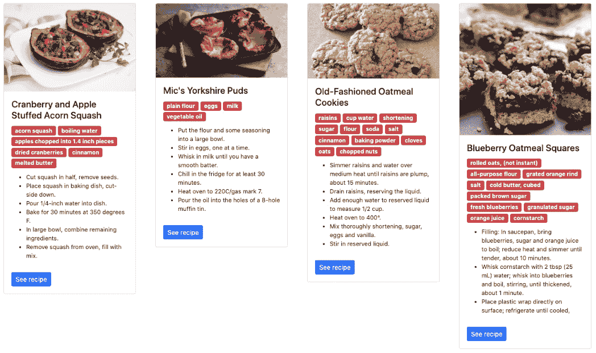

图 5.14 – 嵌入 Web 应用程序资源

你现在可以与你的朋友分享这个二进制文件，并轻松地在远程服务器上部署它。

注意

在*第八章**，在 AWS 上部署应用程序*中，我们将探讨如何使用 Docker 和 Kubernetes 在云上部署你的分布式 Web 应用程序。

## 静态文件打包

在本章中，我们使用 Go 1.16，它带来了新的功能和改进，例如支持嵌入式文件，无需使用像`go-assets-builder`这样的外部包。

注意

你可以使用`gvm install go1.16`命令。

Go 1.16 引入了`//go:embed`指令，允许你在 Go 应用程序中包含文件和目录的内容。你可以通过实现以下操作来完成：

1.  在`main.go`中，定义一个`embed.FS`变量来保存一组文件。然后，在变量声明上方定义一个注释，如下所示：

    ```go
    //go:embed assets/* templates/* 404.html recipes.json
    var f embed.FS
    ```

1.  更新`init()`函数，从`FS`变量中读取`recipes.json`文件，如下所示：

    ```go
    func init() {
       recipes = make([]Recipe, 0)
       data, _ := f.ReadFile("recipes.json")
       json.Unmarshal(data, &recipes)
    }
    ```

1.  然后，使用`http.FS`文件创建一个 HTTP 文件系统来提供`assets`文件，如下所示：

    ```go
    func main() {
       templ := template.Must(template.New("").ParseFS(f, "templates/*.tmpl"))
       fsys, err := fs.Sub(f, "assets")
       if err != nil {
           panic(err)
       }
       router := gin.Default()
       router.SetHTMLTemplate(templ)
       router.StaticFS("/assets", http.FS(fsys))
       router.GET("/", IndexHandler)
       router.GET("/recipes/:id", RecipeHandler)
       router.Run()
    }
    ```

1.  使用`go build`命令重新构建二进制文件。

    注意

    在构建二进制文件之前，确保从 HTTP 处理器和模板文件中删除`/templates`前缀。

最终结果是单个准备分发的 Web 服务器二进制文件！

# 构建 SPA

虽然你可以通过渲染 HTML 模板和提供静态文件来使用 Gin 构建完整的 Web 应用程序，但随着应用程序的增长，维护它变得很困难。这就是为什么你可以采用流行的前端 JavaScript 框架，如 Angular、React 或 Vue.js 来构建你的 SPA。在本节中，我们将使用 React，但你也可以使用其他 JavaScript 框架获得相同的结果。

我们将要构建的应用程序将执行以下操作：

+   在主页上显示所有食谱的列表（对所有用户）。

+   允许用户使用用户名和密码登录。

+   允许用户创建新的食谱（仅限已登录用户）。

首先，我们需要确保您的系统上已安装 Node.js。您可以从[`nodejs.org/en/download/`](https://nodejs.org/en/download/)的官方网站安装**长期支持**（**LTS**）版本（14.16.0），或者您可以使用**Node 版本管理器**（**NVM**）根据您的**操作系统**（**OS**）轻松安装 Node.js。

要安装 NVM，请按照以下步骤操作：

1.  运行以下脚本：

    ```go
    curl -o- https://raw.githubusercontent.com/nvm-sh/nvm/v0.37.2/install.sh | bash
    ```

1.  这可能需要几秒钟到几分钟的时间，但一旦安装完成，请发出以下命令以安装 Node.js 的 LTS 版本：

    ```go
    nvm install 14.16.0 
    ```

在安装 Node.js 之后，我们就可以使用 React 构建我们的 Web 应用程序了。

## 开始使用 React

在本节中，您将设置 React 环境。为此，请执行以下步骤：

1.  打开您的终端并导航到您的工 作区。然后，使用以下命令安装`create react app`。**命令行界面**（**CLI**）简化了 React 环境的设置过程：

    ```go
    npm install -g create-react-app
    ```

1.  然后，使用 CRA CLI 创建一个 React 项目。项目名称为`recipes-web`，如下所示：

    ```go
    create-react-app recipes-web
    ```

    这里是命令输出：

    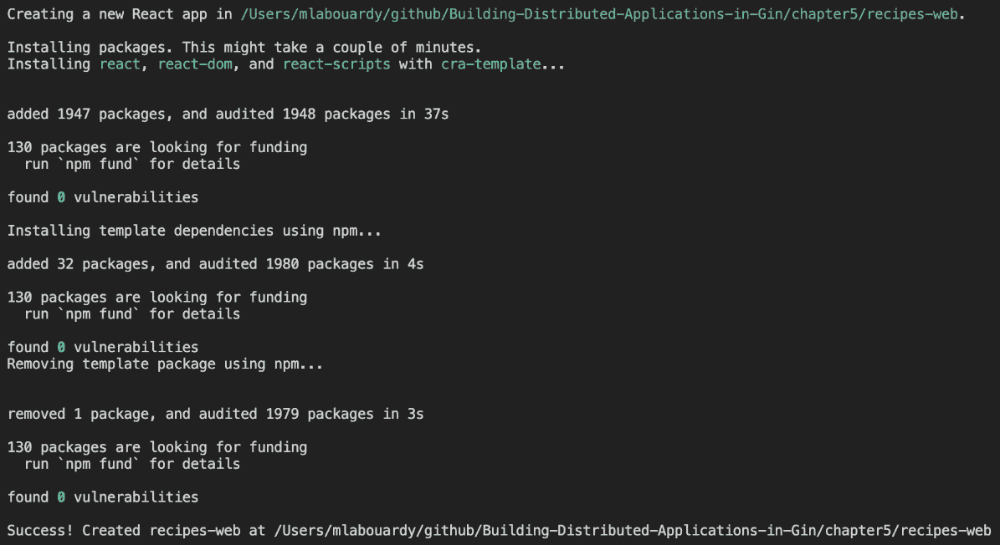

    图 5.15 – 新建 React 项目的设置

    在运行前面的命令后，项目结构将如下所示。项目会自动创建所有必要的后台配置：

    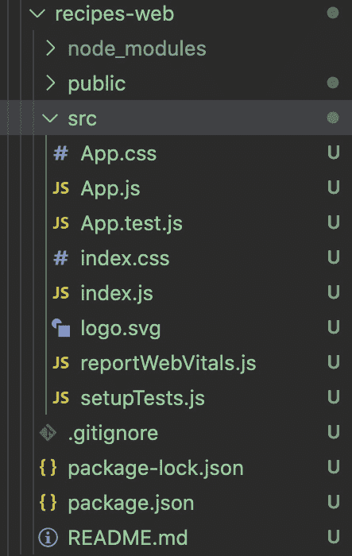

    图 5.16 – React 项目结构

    注意

    确保为您的 Web 应用程序创建一个 GitHub 仓库并将所有更改推送到远程仓库。

1.  导航到`recipes-web`文件夹并输入以下命令以启动应用程序：

    ```go
    3000, as illustrated in the following screenshot: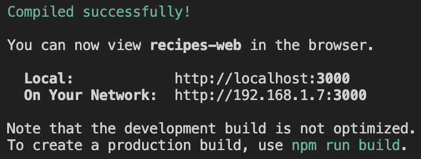Figure 5.17 – Local development server
    ```

1.  在浏览器中导航到`Localhost:3000`。`Apart` `from;`您将看到以下截图类似的内容：

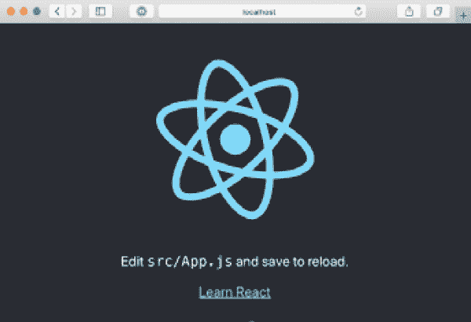

图 5.18 – React "Hello World"应用程序

目前，您的应用程序并没有做很多。它看起来也不像什么。让我们使用 React 组件构建食谱列表。

## 探索 React 组件

在构建 SPA 时的一个基本基础是组件的使用。在本节中，我们将探讨如何基于 React 组件构建**食谱**仪表板。

你将要做的第一件事是创建一个`App`组件，通过引用一个`Recipe`元素来列出`recipes`数组。为此，请按照以下步骤操作：

1.  使用以下内容更新`App.js`文件：

    ```go
    import React from 'react';
    import './App.css';
    import Recipe from './Recipe';
    class App extends React.Component {
     constructor(props) {
       super(props)
       this.state = {
         recipes: [
           {
             "name": "Oregano Marinated Chicken",
             "tags": [
               "main",
               "chicken"
             ],
             "ingredients": [],
             "instructions": []
           },
           {
             "name": "Green pea soup with cheddar 
                      scallion panini",
             "tags": [
               "soup",
               "main",
               "panini"
             ],
             "ingredients": [],
             "instructions": []
           }
         ]
       }
     }
     render() {
       return (<div>
         {this.state.recipes.map((recipe, index) => (
           <Recipe recipe={recipe} />
         ))}
       </div>);
     }
    ```

    组件构造函数在`state`对象中定义了一个`recipes`数组。该数组存储了一系列硬编码的食谱。

1.  接下来，创建一个 `Recipe` 组件来显示菜谱属性（名称、步骤、配料等）。在 `src` 目录下创建一个名为 `Recipe.js` 的新文件，并将以下内容添加到其中：

    ```go
    import React from 'react';
    import './Recipe.css';
    class Recipe extends React.Component {
       render() {
           return (
               <div class="recipe">
                   <h4>{this.props.recipe.name}</h4>
                   <ul>
                       {this.props.recipe.ingredients &&
                        this.props.recipe.ingredients.map(
                        (ingredient, index) => {
                           return <li>{ingredient}</li>
                       })}
                   </ul>
               </div>
           )
       }
    }
    export default Recipe;
    ```

1.  创建一个名为 `Recipe.css` 的样式表，并添加适当的样式规则以改善 UI 元素的视觉效果。然后，在 `Recipe.js` 中导入样式表。

1.  完成这些操作后，保存所有更改并在浏览器中预览，你应该会看到如下所示的内容：

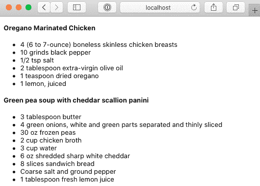

图 5.19 – 渲染 App 组件

太好了！你已经成功构建了一个用于列出菜谱的单页应用 (SPA)。

目前，菜谱列表是静态的。你将通过调用上一章中构建的 `Recipes` API 来修复这个问题。为此，请按照以下步骤操作：

1.  首先，看看你将要构建的架构：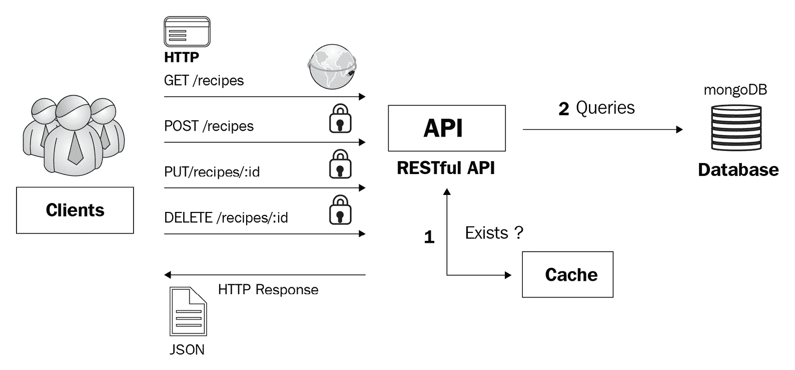

    ```go
    getRecipes() {
       fetch('http://localhost:8080/recipes')
         .then(response => response.json())
         .then(data => this.setState({ recipes: data }));
    }
    ```

1.  接下来，使用以下指令在 `App` 组件构造函数上调用方法：

    ```go
    constructor(props) {
       super(props)
       this.state = {
         recipes: []
       }
       this.getRecipes();
    }
    ```

1.  确保 API 正在端口 `8080` 上提供服务，如下所示：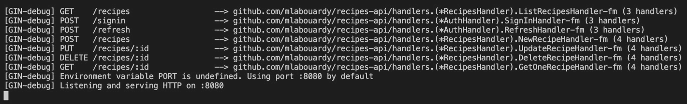

    图 5.21 – 菜谱 API 日志

1.  返回到你的浏览器，你应该会看到一个空白页面。如果你打开浏览器调试控制台，你会看到 API 调用被 CORS 策略阻止，如下面的截图所示：

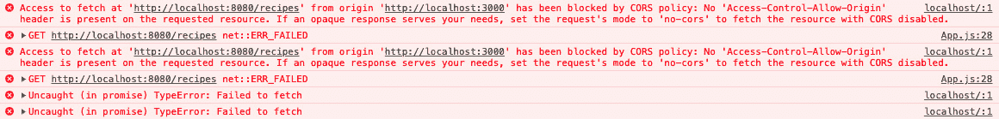

图 5.22 – CORS 错误

由于 `Recipes` API 和 Web 应用程序运行在不同的端口上，你需要在 API 上设置一些头信息以允许 **跨源资源共享 (CORS)**。

## 解决跨源请求

默认情况下，API 使用同源策略来限制 API 与源域外的资源交互的能力。我们可以通过 CORS 来绕过同源策略。

要解决 CORS 问题，请按照以下步骤操作：

1.  使用以下命令下载 Gin 官方 CORS 中间件：

    ```go
    go get github.com/gin-contrib/cors
    ```

1.  然后，更新 `Recipes` API 项目的 `main.go` 文件，通过将 `cors.Default()` 方法定义为中间件来允许所有来源，如下所示：

    ```go
    router.Use(cors.Default())
    ```

1.  中间件将在处理传入的 HTTP 请求之前执行。`cors.Default()` 方法将允许所有 HTTP 方法和服务端点，但你也可以限制请求到受信任的服务端点。使用以下代码定义服务端点并允许传入的 HTTP 方法：

    ```go
    router.Use(cors.New(cors.Config{
       AllowOrigins:     []string{"http://localhost
                          :3000"},
       AllowMethods:     []string{"GET", "OPTIONS"},
       AllowHeaders:     []string{"Origin"},
       ExposeHeaders:    []string{"Content-Length"},
       AllowCredentials: true,
       MaxAge: 12 * time.Hour,
    }))
    ```

1.  重新启动 API 服务器，并返回到你的浏览器，刷新 Web 应用程序页面。

这次，HTTP 请求应该成功，你应该会看到一个菜谱列表，如下所示：

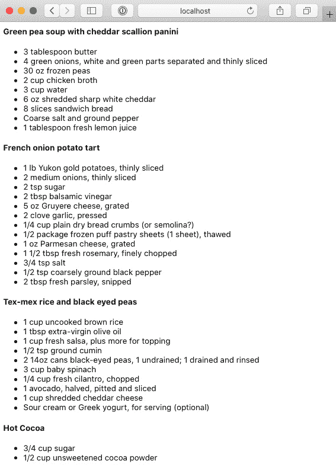

图 5.23 – 菜谱列表

现在，你可以进一步扩展项目，并添加一个使用 Auth0 的身份验证层，如下所示：

注意

要获取如何使用 Auth0 启用身份验证的逐步指南，请查看上一章。

1.  导航到**Auth0 仪表板**([`manage.auth0.com/dashboard`](https://manage.auth0.com/dashboard))，并创建一个类型为**单页 Web 应用**的应用程序，如图 5.24 所示：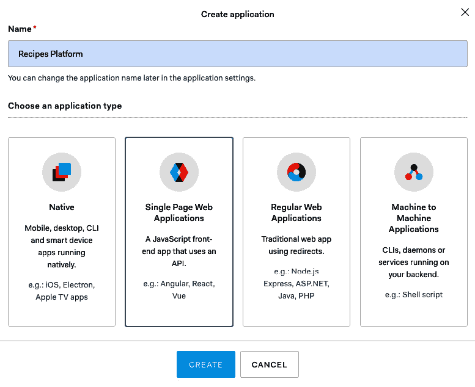

    图 5.24 – Auth0 上的 SPA

1.  接下来，点击`Localhost:3000.` `除此之外，`如图 5.25 所示。该 URL 将在用户认证后由 Auth0 用于重定向用户：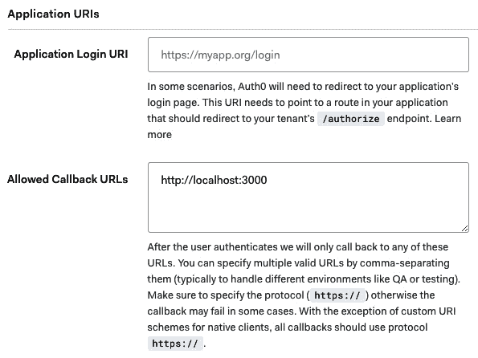

    图 5.25 – 配置允许的回调 URL

1.  将`localhost:3000`设置为授权应用程序向 Auth0 API 发起请求。

1.  现在，要将 Auth0 集成到您的 Web 应用程序中，安装 Auth0 React**软件开发工具包**（**SDK**）。在项目文件夹内运行以下命令以安装 SDK：

    ```go
    npm install @auth0/auth0-react
    ```

1.  接下来，使用`Auth0Provider`包装应用程序的根组件。更新`index.js`文件，如下所示：

    ```go
    import { Auth0Provider } from "@auth0/auth0-react";
    ReactDOM.render(
     <Auth0Provider
       domain="AUTH0_DOMAIN"
       clientId="AUTH_CLIENT_ID"
       redirectUri={window.location.origin}
     >
       <App />
     </Auth0Provider>,
     document.getElementById("root")
    );
    ```

    Auth0 组件具有以下属性：

    `a.` `domain`: Auth0 域名。该值可在`b.` `clientId`: Auth0 客户端 ID。该值也可在`c.` `redirectUri`: `ReactDOM.render`方法在`index.html`中查找根元素（位于`public`文件夹内）并在此上加载 Auth0 组件。

1.  然后，创建一个带有登录按钮的`Navbar`组件。当用户点击登录按钮时，`useAuth0()`钩子的`loginWithRedirect`方法将被调用。该方法将用户重定向到 Auth0 登录页面，在那里他们可以进行认证。认证成功后，Auth0 将根据之前定义的重定向 URL 将用户重定向回应用程序。代码如下所示：

    ```go
    import React from 'react';
    import { useAuth0 } from "@auth0/auth0-react";
    import Profile from './Profile';
    const Navbar = () => {
       const { isAuthenticated, loginWithRedirect, logout,
               user } = useAuth0();
       return (
           <nav class="navbar navbar-expand-lg navbar-
               light bg-light">
               <a class="navbar-brand" 
                   href="#">Recipes</a>
               <button class="navbar-toggler" 
               type="button" data-toggle="collapse" data-
               target="#navbarTogglerDemo02" aria-
               controls="navbarTogglerDemo02" aria-
               expanded="false" aria-label="Toggle 
               navigation">
                   <span class="navbar-toggler-
                                icon"></span>
               </button>
               <div class="collapse navbar-collapse" 
                           id="navbarTogglerDemo02">
                   <ul class="navbar-nav ml-auto">
                       <li class="nav-item">
                           {isAuthenticated ? (<Profile 
                               />) : (
                               <a class="nav-link active" 
                                         onClick={() => 
                                     loginWithRedirect()}> 
                                    Login</a>
                           )}
                       </li>
                   </ul>
               </div>
           </nav >
       )
    }
    export default Navbar;
    ```

    注意

    为了防止任何渲染错误，使用`isAuthenticated`属性检查 Auth0 是否在显示使用`Profile`组件的登录用户名和图片之前已认证用户。

1.  在代码中，我们使用 Bootstrap 框架提供的现有 UI 元素。可以使用以下命令安装该框架：

    ```go
    npm install bootstrap
    ```

1.  安装完成后，在`index.js`顶部使用`import`语句引用框架，如下所示：

    ```go
    import 'bootstrap/dist/css/bootstrap.min.css';
    import 'bootstrap/dist/js/bootstrap.min.js';
    ```

1.  然后，将`Navbar`组件添加到`App.js`中，如下所示：

    ```go
    render() {
       return (<div>
         <Navbar />
         {this.state.recipes.map((recipe, index) => (
           <Recipe recipe={recipe} />
         ))}
       </div>);
    }
    ```

1.  在此更改后预览您的应用程序，它应该看起来像这样：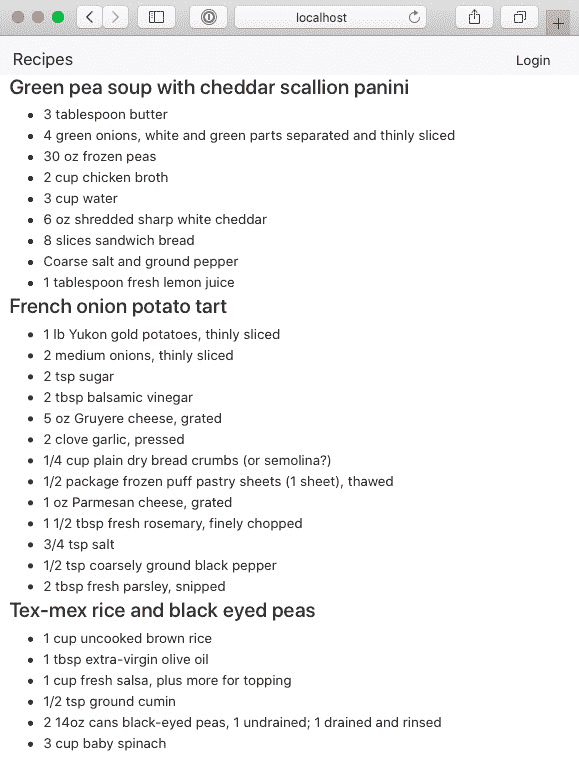

    图 5.26 – 渲染食谱列表

1.  现在，点击**登录**。您将被重定向到 Auth0 登录页面，在那里您可以注册新账户或使用现有账户登录，如图所示：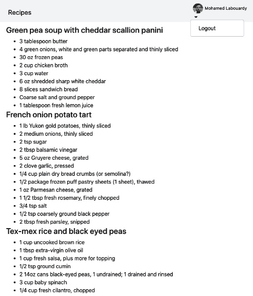

图 5.27 – Auth0 通用登录页面

您的认证已成功！您将被重定向到主页，在那里您可以浏览由`Recipes` API 返回的食谱列表，如下面的截图所示：

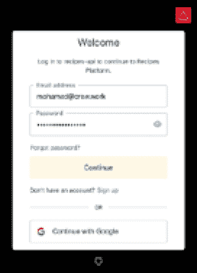

图 5.28 – 列出登录用户食谱的页面

应用程序还显示了登录用户的用户名和头像。这些信息可通过`useAuth0()`钩子暴露的`user`属性获取。你现在已经成功创建了一个 SPA。

您的 Web 应用程序在功能上相当简单，但通过从头开始构建，我们几乎涵盖了 React 带来的每一个小细节。您可以进一步实现一个新的食谱表单，供登录用户发布新食谱。

# 摘要

在本章中，我们学习了如何使用 Gin 框架提供 HTML 模板，以及如何创建可重用模板并提供静态资源。我们介绍了如何使用 React 框架实现 SPA 以消费 Gin RESTful API，以及如何使用 Gin 解决 CORS 问题。

我们还探讨了 Auth0 如何让您快速为 React 应用程序添加身份验证。最后，我们学习了如何在构建时嵌入应用程序资源来构建一个自包含的 Web 应用程序。

在下一章中，我们将探讨使用 Gin 架构一个可扩展、分布式 Web 应用的技巧和最佳实践。

# 问题

1.  你会如何创建可重用的头部和尾部模板？

1.  你会如何使用 React 创建一个`NewRecipe`组件？

1.  你会如何构建适用于 Windows、Mac 和 Linux 的自包含二进制文件？

# 进一步阅读

+   *全栈 React 项目 - 第二版*，由 Shama Hoque 著，Packt Publishing 出版

+   *全栈 React、TypeScript 和 Node*，由 David Choi 著，Packt Publishing 出版
