# 第十章：捕获 Gin 应用指标

在本章的最后一部分，你将学习如何在接近实时的情况下调试、故障排除和监控 RESTful API。你还将学习如何收集 Gin 应用指标来衡量 Gin 应用的性能，并对其异常行为进行剖析。除此之外，你还将探索如何使用 ELK 堆栈将 Gin 调试日志流式传输到集中式日志平台。

因此，我们将涵盖以下主题：

+   使用 Prometheus 暴露 Gin 应用指标

+   监控服务器端指标

+   将 Gin 日志流式传输到 ELK 平台

到本章结束时，你将能够仪表化和监控在生产中运行的 Docker 化 Gin 网络应用，并轻松调试其日志。

# 技术要求

要跟随本章的内容，你需要以下条件：

+   对前一章内容的完整理解。本章是前一章的后续，因为它将使用相同的源代码。因此，为了避免重复，一些代码片段将不会进行解释。

+   假设你已经具备 Docker 和容器化的知识。

本章的代码包托管在 GitHub 上，网址为 [`github.com/PacktPublishing/Building-Distributed-Applications-in-Gin/tree/main/chapter10`](https://github.com/PacktPublishing/Building-Distributed-Applications-in-Gin/tree/main/chapter10)。

# 使用 Prometheus 暴露 Gin 指标

在前一章中，你学习了如何自动化 Gin 应用的部署过程。然而，没有任何应用能够免疫停机或外部攻击（**DDoS**）。这就是为什么你需要设置正确的工具来持续监控你应用的性能。**Prometheus** ([`prometheus.io`](https://prometheus.io)) 是一种常见的开源监控工具。

你可以通过在终端会话中运行以下命令来安装 Go 客户端：

```go
go get github.com/prometheus/client_golang
```

接下来，更新 `main.go` 文件，使其在 `/prometheus` 路径上暴露一个 HTTP 路由。路由处理程序将调用 Prometheus HTTP 处理程序，该处理程序将返回一系列运行时和应用指标：

```go
router.GET("/prometheus", gin.WrapH(promhttp.Handler()))
```

然后，导入以下包以使用 `promhttp` 结构体：

```go
"github.com/prometheus/client_golang/prometheus/promhttp" 
```

接下来，重新部署应用。如果你导航到 [`localhost:8080/prometheus`](http://localhost:8080/prometheus)，你应该看到以下指标：

![Figure 10.1 – Prometheus 默认指标

![Figure 10.1 – Prometheus 默认指标

图 10.1 – Prometheus 默认指标

此应用仅暴露默认指标。你也可以通过仪表化 Gin 应用代码来暴露你自己的自定义指标。让我们学习如何做到这一点。

## 对 Gin 应用进行仪表化

仪表化是监控和测量性能、检测错误以及获取表示应用状态的跟踪信息的能力。Prometheus 允许我们注入代码来近距离监控 Gin 应用。

要添加一个自定义指标，例如计算传入请求数量，请按照以下步骤操作：

1.  首先，我们需要创建一个中间件来拦截传入的 HTTP 请求并增加计数器：

    ```go
    var totalRequests = prometheus.NewCounterVec(
       prometheus.CounterOpts{
           Name: "http_requests_total",
           Help: "Number of incoming requests",
       },
       []string{"path"},
    )
    ```

1.  然后，我们必须定义一个 Gin 中间件，如下所示：

    ```go
    func PrometheusMiddleware() gin.HandlerFunc {
       return func(c *gin.Context) {
           totalRequests.WithLabelValues(
              c.Request.URL.Path).Inc()
           c.Next()
       }
    }
    ```

1.  在`init()`方法体内注册`totalRequests`计数器：

    ```go
    prometheus.Register(totalRequests)
    ```

1.  然后，将`PrometheusMiddleware`中间件传递给 Gin 路由器：

    ```go
    router.Use(PrometheusMiddleware())
    ```

1.  重新启动应用程序，然后刷新`/prometheus` URL。

在响应中，您将看到每个路径的请求数量：

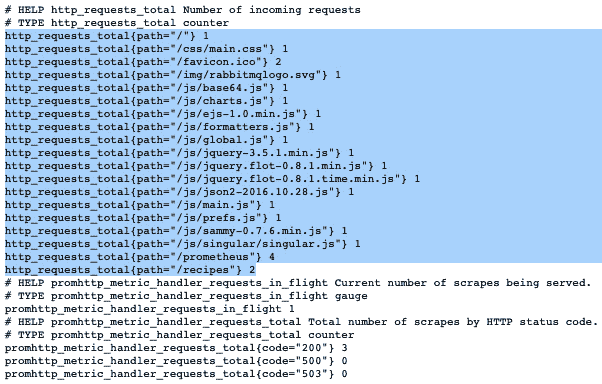

图 10.2 – 仪表化 Gin 代码

注意

您的输出可能不会显示像我那么多数据，因为您没有经常访问该应用程序。获取更多数据最好的方法是向 Recipes API 发出多个 HTTP 请求。

您还可以公开的另一个有用指标是每个 HTTP 方法接收到的 HTTP 请求数量。同样，定义一个全局计数器并为相应的 HTTP 方法增加计数器：

```go
var totalHTTPMethods = prometheus.NewCounterVec(
   prometheus.CounterOpts{
       Name: "http_methods_total",
       Help: "Number of requests per HTTP method",
   },
   []string{"method"},
)
func PrometheusMiddleware() gin.HandlerFunc {
   return func(c *gin.Context) {
       totalRequests.WithLabelValues(
          c.Request.URL.Path).Inc()
       totalHTTPMethods.WithLabelValues(
          c.Request.Method).Inc()
       c.Next()
   }
}
```

在`init()`方法体内注册`totalHTTPMethods`计数器并重新启动应用程序。

应用程序重新启动后，在响应负载中，您应该看到按 HTTP 方法分区的请求数量：

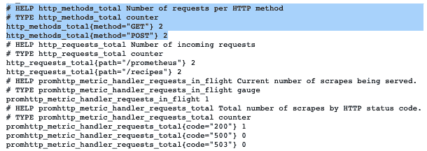

图 10.3 – 每个 HTTP 方法的请求数量

您还可以使用以下代码块记录每秒的 HTTP 请求延迟。我们使用`Histogram`而不是`Counter`来计数来自 HTTP 请求的个别观察值：

```go
var httpDuration = promauto.NewHistogramVec(
   prometheus.HistogramOpts{
       Name: "http_response_time_seconds",
       Help: "Duration of HTTP requests",
   },
   []string{"path"},
)
func PrometheusMiddleware() gin.HandlerFunc {
   return func(c *gin.Context) {
       timer := prometheus.NewTimer(httpDuration.
          WithLabelValues(c.Request.URL.Path))
       totalRequests.WithLabelValues(
          c.Request.URL.Path).Inc()
       totalHTTPMethods.WithLabelValues(
          c.Request.Method).Inc()
       c.Next()
       timer.ObserveDuration()
   }
}
```

因此，您应该有类似以下的内容：

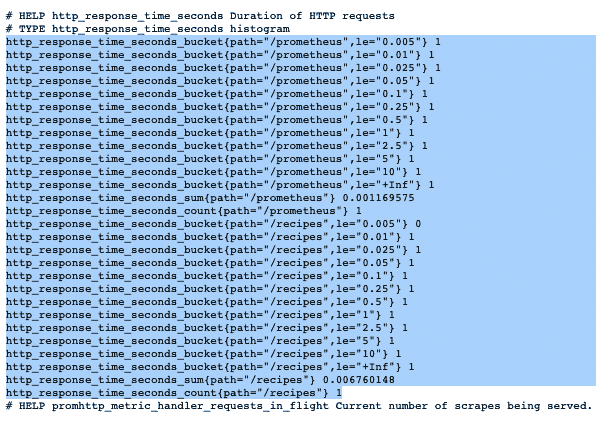

图 10.4 – HTTP 请求的持续时间

现在指标已经公开，您可以将它们存储在时间序列数据库中，并在其上构建一个交互式仪表板。定期了解应用程序的工作方式可以帮助您识别优化其性能的方法。

注意

另一个选择是使用以下由开源社区编写的 Go 库：[`github.com/zsais/go-gin-prometheus`](https://github.com/zsais/go-gin-prometheus)。它包含一组通用的指标。

要开始，请按照以下步骤操作：

1.  使用以下`docker-compose.yml`文件通过官方 Docker 镜像部署 Prometheus：

    ```go
    version: "3"
    services:
     api:
       build: .
       environment:
         - MONGO_URI=mongodb://admin:password@
                     mongodb:27017/test?authSource=admin
                     &readPreference=primary&ssl=false
         - MONGO_DATABASE=demo
         - REDIS_URI=redis:6379
         - API_VERSION=1.0.0
       ports:
         - 8080:8080
       external_links:
         - mongodb
         - redis
       restart: always
     redis:
       image: redis
       restart: always
     mongodb:
       image: mongo:4.4.3
       environment:
         - MONGO_INITDB_ROOT_USERNAME=admin
         - MONGO_INITDB_ROOT_PASSWORD=password
       restart: always
     prometheus:
       image: prom/prometheus:v2.27.0
       volumes:
         - ./prometheus.yml:/etc/prometheus/prometheus.yml
       ports:
         - 9090:9090
       restart: always
    ```

    Prometheus 容器使用一个`prometheus.yml`配置文件，它定义了一个后台作业来抓取 Golang Prometheus 指标端点：

    ```go
    global:
     scrape_interval:     15s
     evaluation_interval: 15s
    scrape_configs:
     - job_name: prometheus
       static_configs:
         - targets: ['localhost:9090']
     - job_name: recipes-api
       metrics_path: /prometheus
       static_configs:
         - targets:
           - api:8080 
    ```

1.  使用以下命令重新部署应用程序堆栈：

    ```go
    docker-compose up -d
    ```

    栈日志应类似于以下内容：

    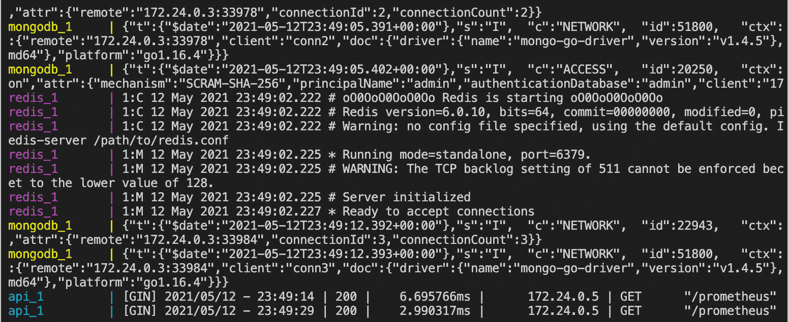

    图 10.5 – Docker 堆栈日志

1.  通过访问您最喜欢的浏览器中的`localhost:9090`导航到 Prometheus 仪表板。您可以通过使用搜索栏和编写使用**Prometheus 查询语言**（**PromQL**）的查询来探索可用的指标：![图 10.6 – 从 Prometheus 仪表板探索指标

    ![图 Figure_10.6_B17115.jpg]

    图 10.6 – 从 Prometheus 仪表板探索指标

1.  通过点击**图形**选项卡将指标转换为图表：![图 10.7 – 使用 Prometheus 内置的图形功能

    ![图片 B17115_10_07_v2.jpg]

    图 10.7 – 使用 Prometheus 内置的图形功能

    您可以使用如 Grafana 这样的可视化平台构建高级图表。它总结了 Prometheus 中存储的数据并提供了广泛的 UI 组件来构建用户友好的仪表板。监控工作流程在以下图中说明：

    ![图 10.8 – 使用 Prometheus 和 Grafana 收集 Gin 指标

    ![图 Figure_10.8_B17115.jpg]

    图 10.8 – 使用 Prometheus 和 Grafana 收集 Gin 指标

1.  使用以下代码片段在 Docker 容器中部署 Grafana：

    ```go
    grafana:
       image: grafana/grafana:7.5.6
       ports:
         - 3000:3000
       restart: always
    ```

1.  使用以下命令启动容器：

    ```go
    docker-compose up –d
    ```

1.  转到`localhost:3000`；您将被要求输入一些用户凭据。默认的用户名和密码都是 admin：![图 10.9 – Grafana 登录页面

    ![图片 Figure_10.9_B17115.jpg]

    图 10.9 – Grafana 登录页面

1.  接下来，通过创建数据源来连接到 Prometheus。点击侧边栏中的**配置**。在**数据源**选项卡中，点击**添加数据源**按钮：![图 10.10 – 添加新的数据源

    ![图 Figure_10.10_B17115.jpg]

    图 10.10 – 添加新的数据源

1.  之后，选择**Prometheus**并填写字段，如图所示。然后，点击页面底部的**保存 & 测试**按钮：

![图 10.11 – 配置 Prometheus 数据源

![图 Figure_10.11_B17115.jpg]

图 10.11 – 配置 Prometheus 数据源

您现在可以创建您的第一个 Grafana 仪表板了！

您可以通过在`legend`字段中使用`{{path}}`关键字的同时，点击`http_requests_total`表达式进入查询字段来开始。

您现在应该拥有以下图表配置，它表示每个路径随时间变化的 HTTP 请求总数：

![图 10.12 – HTTP 请求总数

![图片 B17115_10_12_v2.jpg]

图 10.12 – HTTP 请求总数

保存面板并创建一个新的面板，使用`http_response_time_seconds_sum`表达式显示随时间变化的已服务 HTTP 请求的响应时间：

![图 10.13 – HTTP 响应时间

![图 B17115_10_13_v2.jpg]

图 10.13 – HTTP 响应时间

您还可以创建一个单独的统计计数器来显示每个 HTTP 方法的总请求数，使用以下配置：

![图 10.14 – 使用 Grafana 的单统计组件

![图 B17115_10_14_v2.jpg]

图 10.14 – 使用 Grafana 的单个统计组件

您可以通过添加其他带有指标的面板并按您的喜好自定义来实验仪表板：

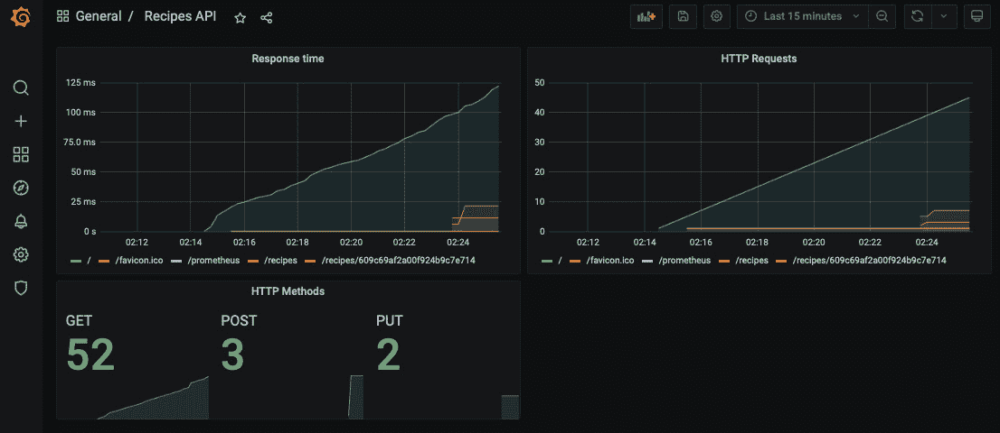

图 10.15 – 交互式和动态的 Grafana 仪表板

注意

您可以从 GitHub 仓库下的`chapter10`文件夹中下载`dashboard.json`，它包含前面仪表板的 Grafana 配置。

# 监控服务器端指标

到目前为止，您已经学习了如何通过为 Gin 应用程序代码添加工具来监控应用侧的指标。在本节中，您将学习如何暴露服务器端指标并监控运行在 Gin 分布式 Web 应用程序上的容器的整体健康状况。

要收集服务器端指标，您可以使用一个名为**Telegraf** ([`github.com/influxdata/telegraf`](https://github.com/influxdata/telegraf))的开源解决方案，这是一个**数据收集代理**（**DCA**），可以从多个输入收集指标并将它们转发到不同的来源：

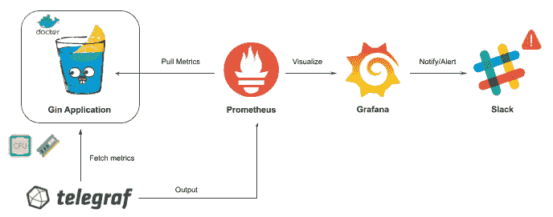

图 10.16 – 使用 Telegraf 代理收集服务器端指标

Telegraf 可以很容易地使用 Docker 部署。将以下代码块添加到`docker-compose.yml`中：

```go
telegraf:
   image: telegraf:latest
   volumes:
     - ./telegraf.conf:/etc/telegraf/telegraf.conf
     - /var/run/docker.sock:/var/run/docker.sock 
```

`telegraf.conf`包含 Telegraf 将从其中获取数据的数据源（**输入**）列表。它还包含数据将被转发到的目的地（**输出**）列表。在以下配置文件中，Telegraf 将收集关于服务器资源（内存、CPU、磁盘和网络流量）和 Docker 守护进程（每个容器的资源使用情况）的指标，然后将这些指标转发到 Prometheus 服务器：

```go
[[inputs.cpu]]
 percpu = false
 totalcpu = true
 fieldpass = [ "usage*" ]
[[inputs.disk]]
 fielddrop = [ "inodes*" ]
 mount_points=["/"]
[[inputs.net]]
 interfaces = [ "eth0" ]
 fielddrop = [ "icmp*", "ip*", "tcp*", "udp*" ]
[[inputs.mem]]
[[inputs.swap]]
[[inputs.system]]
[[inputs.docker]]
 endpoint = "unix:///var/run/docker.sock"
 container_names = []
[[outputs.prometheus_client]]
listen = "telegraf:9100"
```

注意

您还可以将这些指标转发到 InfluxDB ([`github.com/influxdata/influxdb`](https://github.com/influxdata/influxdb))，一个可扩展的时间序列数据库，并将其连接到 Grafana。

接下来，在`prometheus.yml`中定义一个新的作业以抓取 Telegraf 容器暴露的指标：

```go
global:
 scrape_interval:     15s
 evaluation_interval: 15s
scrape_configs:
 - job_name: prometheus
   static_configs:
     - targets: ['localhost:9090']
 - job_name: recipes-api
   metrics_path: /prometheus
   static_configs:
     - targets:
       - api:8080
 - job_name: telegraf
   scrape_interval: 15s
   static_configs:
     - targets: ['telegraf:9100'] 
```

完成这些后，使用以下命令重新启动堆栈：

```go
docker-compose up -d
```

然后，返回到 Prometheus 仪表板，并从**状态**下拉列表中选择**目标**。应该已经添加了一个 Telegraf 目标到列表中：

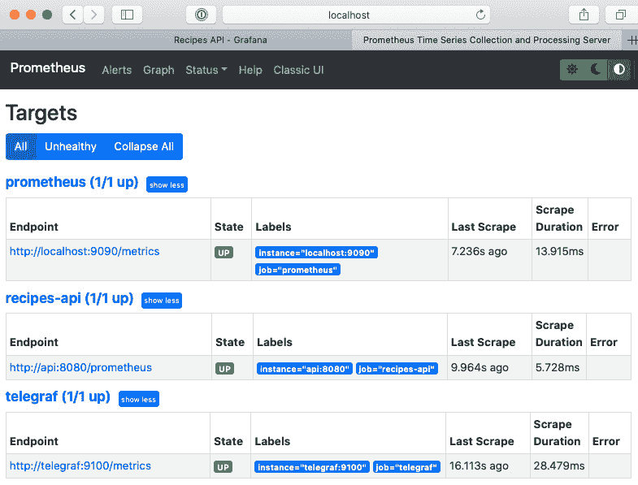

图 10.17 – Telegraf 作业正在运行

现在服务器端指标已在 Prometheus 中可用，您可以在 Grafana 中创建额外的面板。

例如，您可以从**指标**下拉菜单中选择`docker_container_mem_usage_percent`表达式来监控每个容器随时间变化的内存使用情况：

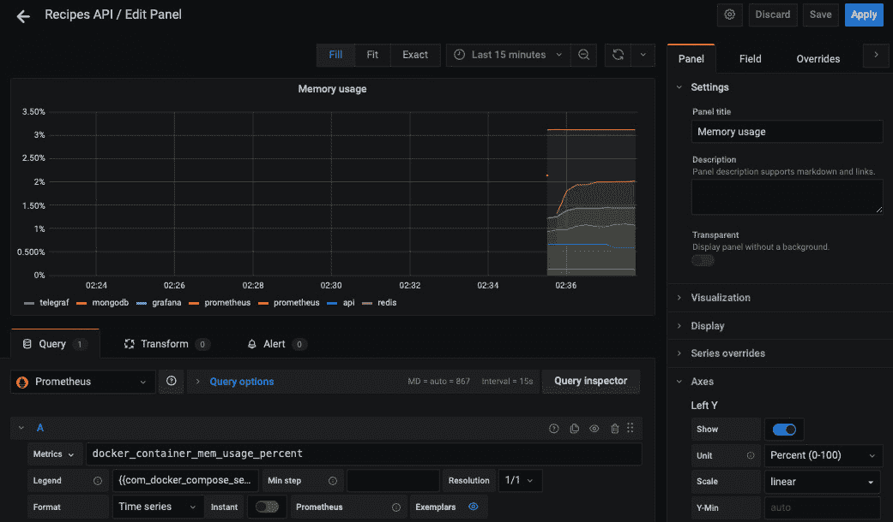

图 10.18 – 每个容器的内存使用情况

添加额外的指标，以便您可以监控 CPU、磁盘使用情况或运行容器的整体健康指标：


图 10.19 – 服务器端和应用端指标

干得好！现在，你有一个相当互动的仪表板，只需花费最少的时间。

## 创建 Grafana 通知渠道

在上一章中，你学习了如何使用 Slack 来提高团队对 CI/CD 状态的认识，以便团队可以立即采取行动。当达到某个阈值时，你可以通过在 **Grafana** 仪表板上配置 Slack 警报来监控 Gin 应用程序，采用相同的方法。

从 Grafana 仪表板中，点击 **警报** 图标，然后点击 **通知渠道**。点击 **添加渠道** 按钮，将类型更改为 **Slack**。然后输入 Webhook URL：

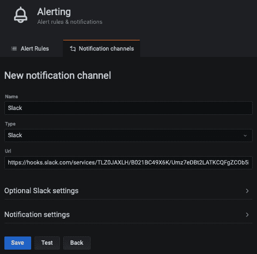

图 10.20 – 配置 Slack 通知渠道

注意

要获取如何创建 Slack 应用程序并生成 Webhook URL 的分步指南，请查看 *第九章*，*实现 CI/CD 管道*。

要测试配置，请点击 **测试** 按钮。你应该会在配置的 Slack 频道中收到类似以下的消息：

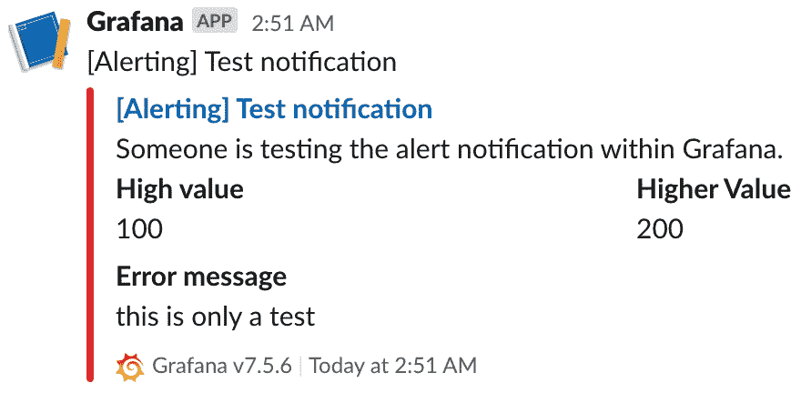

图 10.21 – 来自 Grafana 的 Slack 测试消息

现在你有了通知渠道，你可以在仪表板面板上创建一个警报规则。例如，在之前创建的 **HTTP 请求** 图表上创建一个警报规则，并在 **通知** 部分选择通知渠道。规则将如下所示：

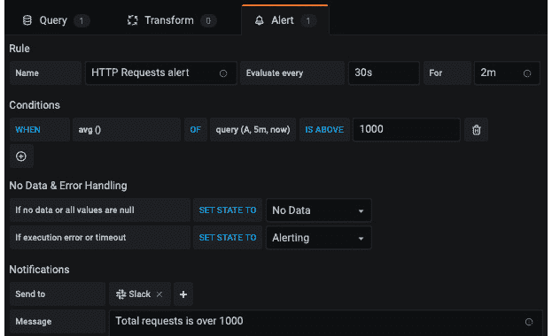

图 10.22 – 在 Grafana 中创建警报规则

每 30 秒，Grafana 将评估平均 HTTP 请求次数是否超过 1,000 次。如果指标违反此规则，Grafana 将等待 2 分钟。如果 2 分钟后指标仍未恢复，Grafana 将触发警报，并发送 Slack 通知。

要测试警报规则，你需要生成工作负载。你可以使用 **Apache Benchmark** 通过以下命令以并行方式向 Recipes API 发送 1,500 个请求：

```go
ab -n 1500 http://localhost:8080/recipes
```

在这里，`/recipes` 端点的请求数量将超过 1,000 的阈值，如下面的图表所示：

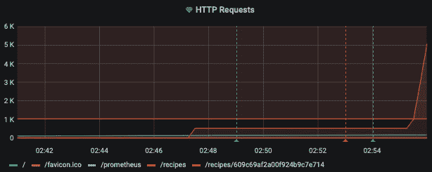

图 10.23 – 达到 1,000 请求限制

2 分钟后，警报将被触发，你将在 Slack 频道中看到以下消息：

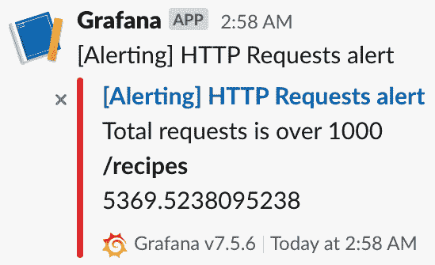

图 10.24 – 来自 Grafana 的 Slack 警报

注意

设置指标警报的另一种选项是使用 Prometheus Alertmanager ([`prometheus.io/docs/alerting/latest/alertmanager`](https://prometheus.io/docs/alerting/latest/alertmanager))。

拥有 Slack 通知可以帮助你在生产环境中事情变得非常糟糕之前立即采取行动。

# 将 Gin 日志流式传输到 ELK 平台

在部署 Gin Web 应用程序到生产环境中时，另一个需要关注的益处是**日志**。日志可以帮助你找到应用程序性能不佳或崩溃的根本原因。

然而，日志可能非常冗长且垃圾信息多 – 这就是为什么你需要一个集中式平台来应用过滤器并关注重要事件。这就是为什么需要一个像**Elasticsearch**、**Logstash**和**Kibana**（**ELK**）这样的解决方案。以下方案说明了如何实现这样的解决方案：


图 10.25 – 将 Gin 日志流式传输到 ELK

Gin 应用程序日志将通过 Docker GELF 驱动程序（[`docs.docker.com/config/containers/logging/gelf/`](https://docs.docker.com/config/containers/logging/gelf/））发送到 Logstash。从那里，Logstash 将处理传入的日志并将它们存储在 Elasticsearch 中。最后，日志可以通过 Kibana 的交互式仪表板进行可视化。

## 使用 Docker 部署 ELK 堆栈

到现在为止，你应该已经熟悉了 Docker，并且能够使用它通过 Docker Compose 部署 Docker 化的 ELK 堆栈。为此，请按照以下步骤操作：

1.  从`docker-compose.yml`开始。容器使用最新的 Docker 镜像 v7.12.1（在撰写本章时）：

    ```go
    logstash:
       image: docker.elastic.co/logstash/logstash:7.12.1
       command: logstash -f /etc/logstash/logstash.conf
       volumes:
         - ./logstash.conf:/etc/logstash/logstash.conf
       ports:
         - "5000:5000"
         - "12201:12201"
         - "12201:12201/udp"
    ```

1.  容器使用以下内容的`logstash.conf`：

    ```go
    input {
         gelf {
              type => docker
             port => 12201
           }          
    }
    output {
       elasticsearch {
          hosts => "elasticsearch:9200"
          index => "containers-%{+YYYY.MM.dd}"
       }
    }
    ```

1.  接下来，部署负责存储和索引传入日志的第二个组件。Elasticsearch 可以以单节点模式部署，以下配置：

    ```go
    elasticsearch:
       image: docker.elastic.co/elasticsearch
          /elasticsearch:7.12.1
       ports:
         - 9200:9200
       environment:
         - discovery.type=single-node
    ```

    注意

    对于生产使用，强烈建议以集群模式部署 Elasticsearch，并使用多个数据节点以实现高可用性和弹性。

1.  然后，部署第三个组件以交互式方式可视化传入的 Gin 日志。以下 YAML 块负责部署 Kibana：

    ```go
    kibana:
       image: docker.elastic.co/kibana/kibana:7.12.1
       ports:
         - 5601:5601
       environment:
         - ELASTICSEARCH_HOSTS=http://elasticsearch:9200
    ```

你的 ELK 堆栈现在已配置完成！

配置好 ELK 堆栈后，你需要将 Gin 应用程序日志流式传输到 Logstash。幸运的是，Docker 内置了支持 Logstash 的`GELF`驱动程序。要将 Gin 应用程序日志流式传输到 Logstash，请执行以下步骤：

1.  将以下`logging`部分添加到 Recipes API YAML 块中：

    ```go
    api:
       build: .
       environment:
         - MONGO_URI=mongodb://admin:password
              @mongodb:27017/test?authSource=admin
              &readPreference=primary&ssl=false
         - MONGO_DATABASE=demo
         - REDIS_URI=redis:6379
         - API_VERSION=1.0.0
       ports:
         - 8080:8080
       restart: always
       logging:
         driver: gelf
         options:
           gelf-address: "udp://127.0.0.1:12201"
           tag: "recipes-api"
    ```

1.  使用`docker-compose up –d`重新部署整个堆栈。你可以通过运行`docker-compose ps`命令来检查是否所有服务都在运行：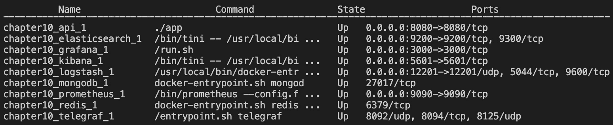

    图 10.26 – 运行中的 Docker 服务列表

    注意

    确保 Docker Engine 至少分配了 4 GiB 的内存。在 Docker Desktop 中，你可以在**首选项**中的**高级**选项卡中配置资源使用情况。

1.  然后，将你的浏览器指向`localhost:5601`。你应该会看到 Kibana 仪表板：

    图 10.27 – Kibana 欢迎页面

1.  接下来，点击**添加数据**并选择**Elasticsearch 日志**作为数据源：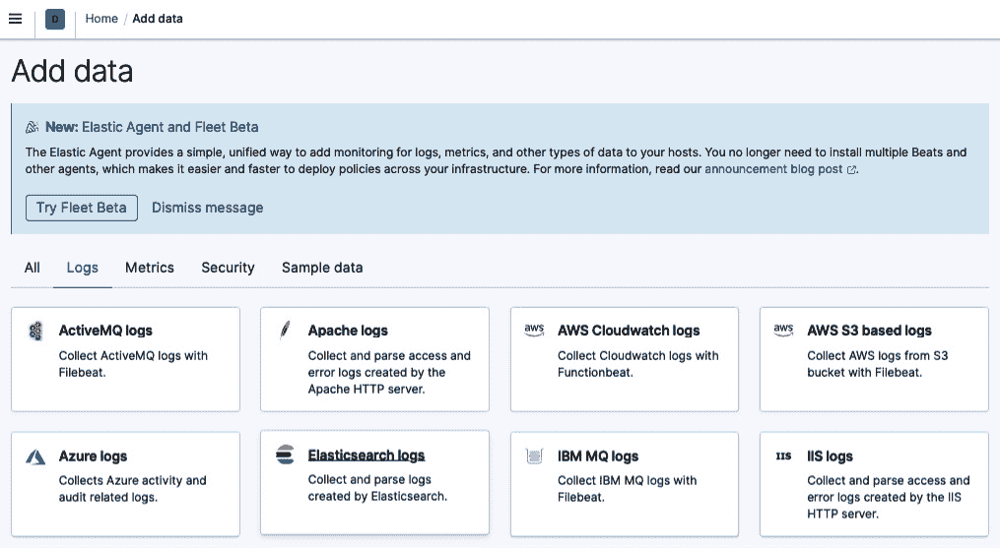

    图 10.28 – 从 Elasticsearch 添加数据

1.  在**索引模式名称**字段中点击`containers-*`。星号用于包含来自 Logstash 的所有日志。然后，点击**下一步**按钮：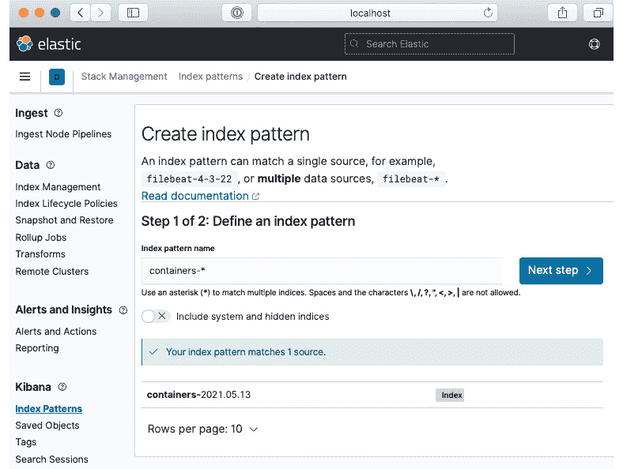

    图 10.29 – 创建索引模式

1.  选择`@timestamp`作为与全局时间过滤器一起使用的首选时间字段。然后，点击`containers`索引：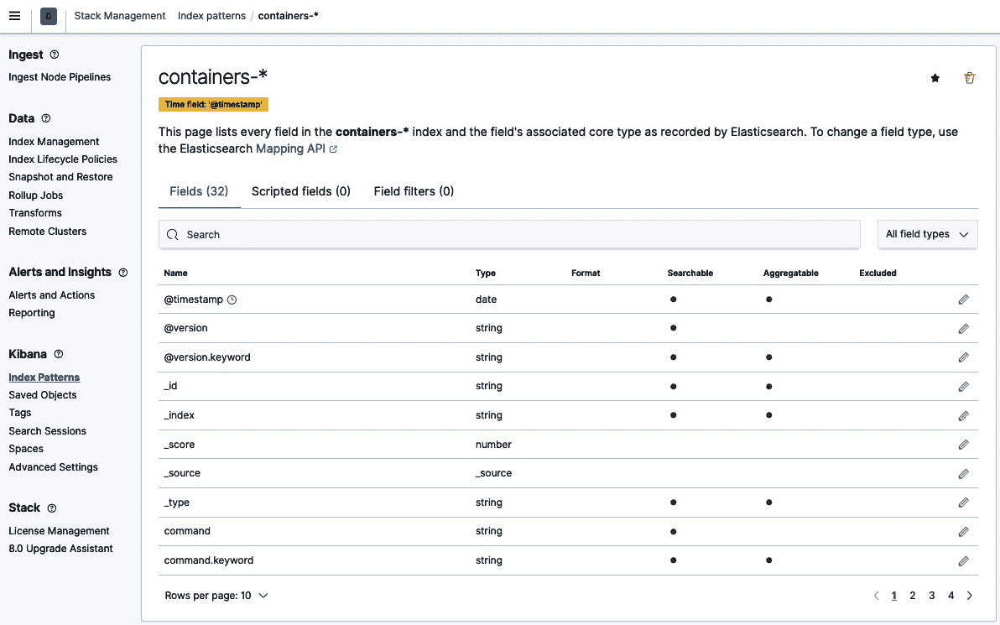

    图 10.31 – containers 索引中可用的字段列表

1.  当 Elasticsearch 与 Kibana 连接时，点击**分析**部分侧边栏中的**发现**。您应该看到来自 Gin RESTful API 的日志流：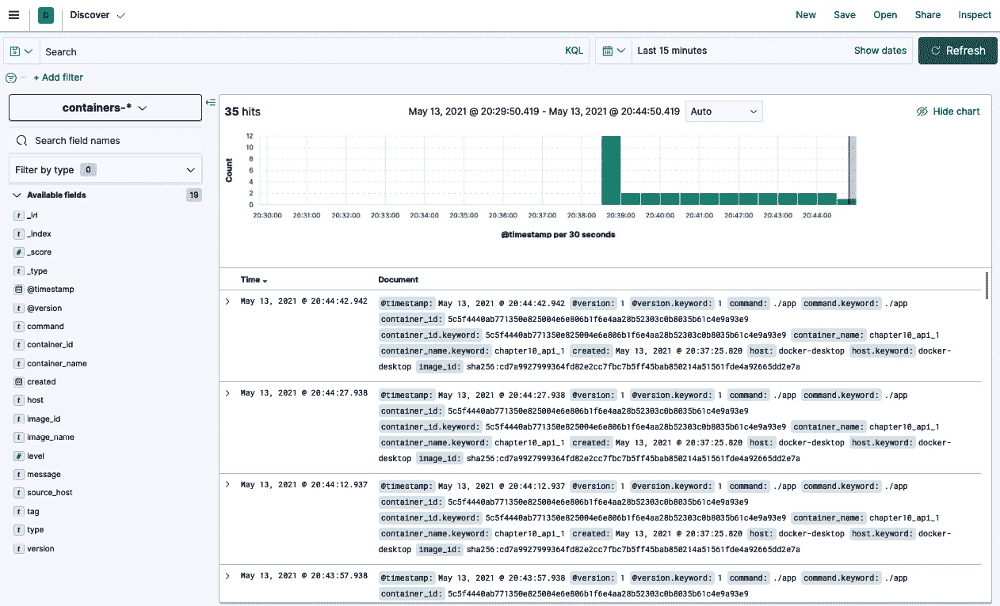

    图 10.32 – Kibana 中的 Gin 日志

    注意

    对于生产使用，您可以使用 curator 工具（[`www.elastic.co/guide/en/elasticsearch/client/curator/index.html`](https://www.elastic.co/guide/en/elasticsearch/client/curator/index.html)）从 Elasticsearch 中删除 X 天前的索引。

1.  展开日志列表中的一个行。

您应该看到 Gin 应用程序日志存储在一个名为`message`的字段中：

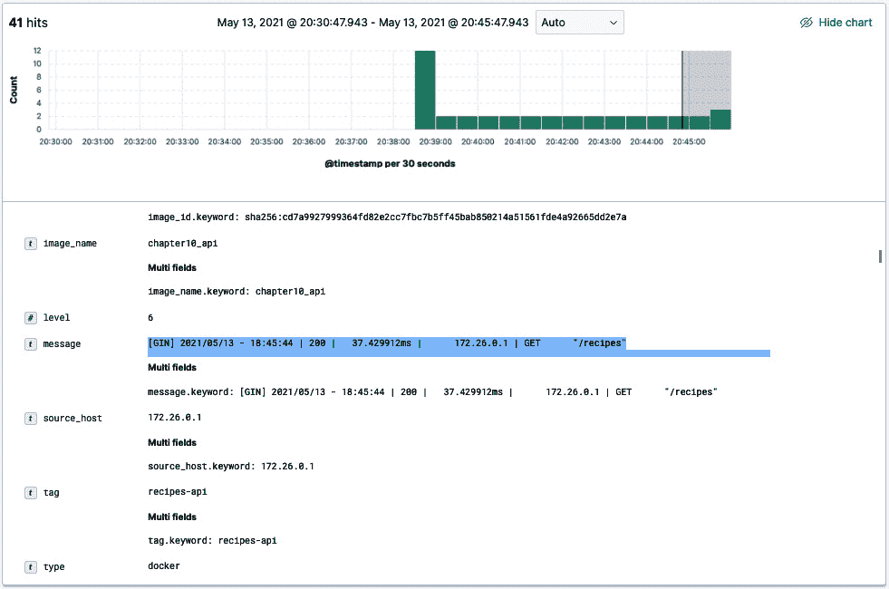

图 10.33 – 消息字段内容

现在，您有一个可以读取 Gin 日志的工作管道。然而，您会注意到日志消息的格式并不理想。您可以使用 Grok 表达式解析此字段并将重要信息拆分到多个字段中。

## 编写 Grok 表达式

Grok 表达式通过使用正则表达式解析文本模式并将它们分配给一个标识符来工作。语法是`%{PATTERN:IDENTIFIER}`。我们可以编写一系列 Grok 模式并将以下日志消息的各个部分分配给不同的标识符：

```go
[GIN] 2021/05/13 - 18:45:44 | 200 |   37.429912ms |   172.26.0.1 | GET   "/recipes" 
```

Grok 模式如下：

```go
%{DATE:date} - %{TIME:time} \| %{NUMBER:status} \| %{SPACE} %{NUMBER:requestDuration}%{GREEDYDATA:unit} \| %{SPACE} %{IP:clientIp} \| %{WORD:httpMethod} %{SPACE} %{QUOTEDSTRING:url}
```

注意

Grok 自带一组模式字典，您可以直接使用。然而，您始终可以定义自己的自定义模式。

您可以使用**Dev Tools**页面上的**Grok 调试器**功能测试模式。在**样本数据**字段中输入前面的消息，在**Grok 模式**中输入 Grok 模式。

然后，点击**模拟**；您将看到应用 Grok 模式后产生的模拟事件：

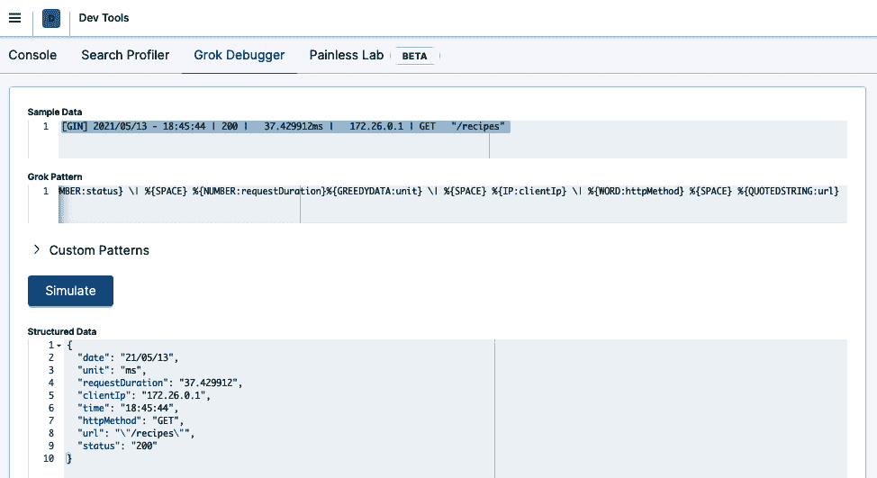

图 10.34 – 将 Grok 模式应用于样本数据

注意

如果发生错误，您可以继续迭代自定义模式，直到输出与您期望的事件匹配。

现在您已经有一个工作的 Grok 模式，您可以在 Logstash 级别应用解析。为此，更新`logstash.conf`文件，使其包括一个过滤器部分，如下所示：

```go
input {
   gelf {
       type => docker
       port => 12201
   }      
}
filter {
   grok {
       match => {"message" => "%{DATE:date} - %{TIME:time} 
                 \| %{NUMBER:status} \| %{SPACE}    
                %{NUMBER:requestDuration}%{GREEDYDATA:unit} 
                \| %{SPACE} %{IP:clientIp} 
                \| %{WORD:httpMethod} %{SPACE} 
                %{QUOTEDSTRING:url}"}
   }
}
output {
   elasticsearch {
       hosts => "elasticsearch:9200"
       index => "containers-%{+YYYY.MM.dd}"
   }
} 
```

现在，如果您重新启动 Logstash 容器，传入的日志应该被解析并分割成多个字段：

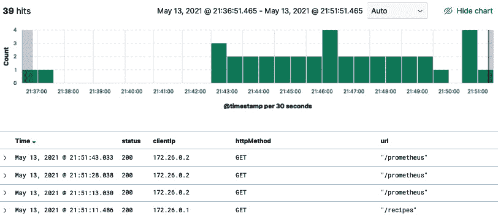

图 10.35 – 消息字段分割成多个字段

创建一个新的仪表板并单击 **创建面板** 以创建一个新的图表：

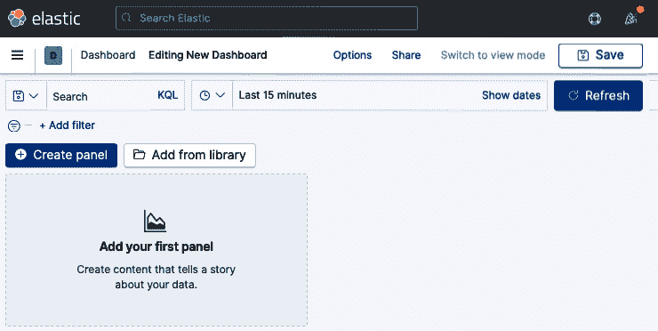

图 10.36 – 创建新的 Kibana 仪表板

将 `status.keyword` 字段拖放到面板中。然后，选择一个 **堆叠柱状图**。您应该得到以下图表，它表示每个 HTTP 状态码的请求数量：

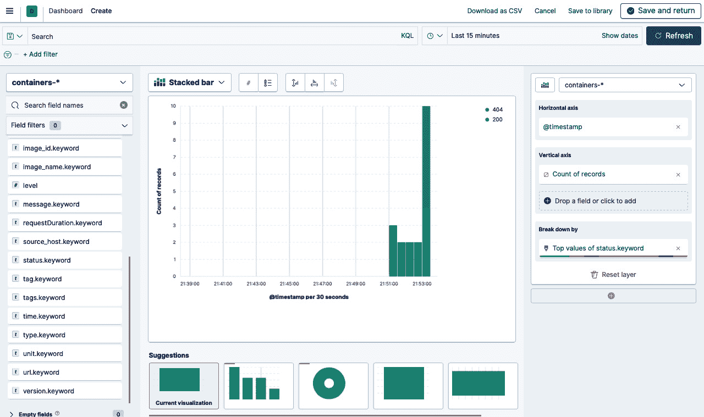

图 10.37 – 使用 Kibana 图表构建器构建图表

您可以将堆叠柱状图保存为小部件并将其导入仪表板。使用仪表板，您可以将多个可视化组合到单个页面上，然后通过提供搜索查询或通过在可视化中单击元素来选择过滤器来过滤它们。仪表板在您想要获取 Gin 应用程序日志的概览并在不同可视化之间建立关联时非常有用。

## 更新 Gin 日志格式

默认情况下，Gin 将每个请求字段记录到 **标准输出**（**stdout**），这对于故障排除和调试 HTTP 请求错误非常棒。然而，对于其他开发者来说，这可能过于冗长，他们可能会很快迷失方向并错过重要事件。幸运的是，您可以通过创建自定义日志格式来覆盖此默认行为。

要使用 Gin 创建自定义日志格式，请从以下代码块开始：

```go
router.Use(gin.LoggerWithFormatter(func(
                    param gin.LogFormatterParams) string {
       return fmt.Sprintf("[%s] %s %s %d %s\n",
           param.TimeStamp.Format("2006-01-02T15:04:05"),
           param.Method,
           param.Path,
           param.StatusCode,
           param.Latency,
       )
}))
```

代码将记录请求时间戳、HTTP 方法、路径、状态码和持续时间：

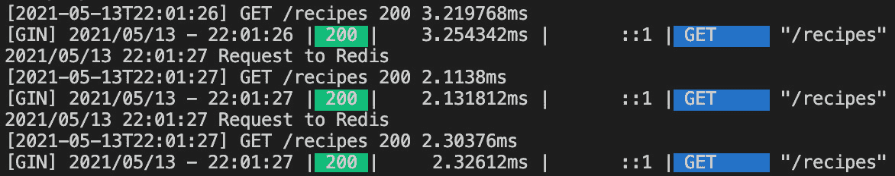

图 10.38 – Gin 自定义日志格式

默认情况下，Gin 将所有日志输出到 `stdout`，但您可以通过设置 `GIN_MODE` 为发布模式来禁用它们，以下命令：

```go
GIN_MODE=release go run main.go
```

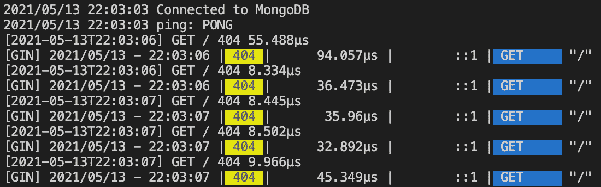

图 10.39 – 以发布模式运行 Gin

您还可以通过以下代码块覆盖日志目标，使其成为文件而不是 `stdout`：

```go
gin.DisableConsoleColor()
f, _ := os.Create("debug.log")
gin.DefaultWriter = io.MultiWriter(f)
```

因此，应该会创建一个名为 `debug.log` 的新文件，与应用程序日志一起：

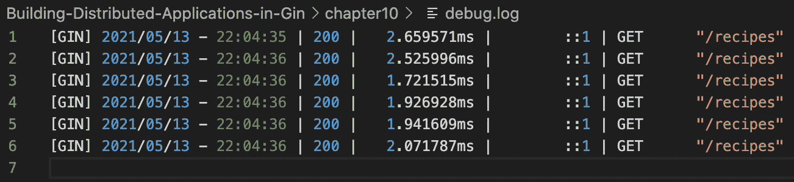

图 10.40 – 将日志流式传输到文件

您可以使用 Filebeat 将文件内容流式传输到 Elasticsearch。**Filebeat** 可以作为 Logstash 的替代品：

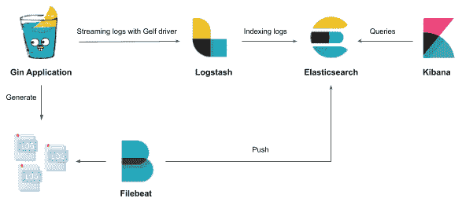

图 10.41 – 使用 Filebeat 将日志文件发送到 ELK

将以下 YAML 块添加到 `docker-compose.yml` 以基于 Filebeat v7.12.1 映像部署容器：

```go
filebeat:
   image: docker.elastic.co/beats/filebeat:7.12.1
   volumes:
     - ./filebeat.yml:/usr/share/filebeat/filebeat.yml
     - ./debug.log:/var/log/api/debug.log
```

容器将在 `/usr/share/filebeat` 中查找配置文件。配置文件通过绑定挂载提供（见 *卷* 部分）。文件的内容如下。它将监听来自 `/var/log/api/debug.log` 的日志，并将接收到的任何日志回显到 Elasticsearch：

```go
filebeat.inputs:
- type: log
  paths:
   - /var/log/api/debug.log
output.elasticsearch:
  hosts: 'http://elasticsearch:9200'
```

使用 `docker-compose up –d` 命令重新启动堆栈。正在运行的 Docker 服务列表如下：

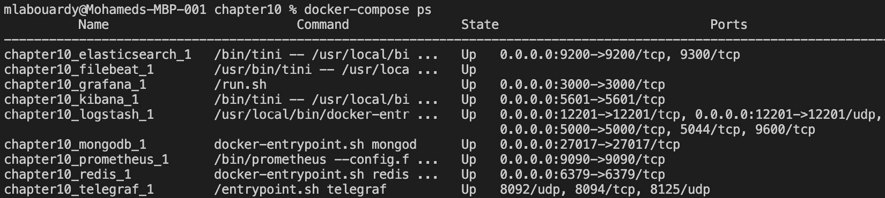

图 10.42 – 以 Docker 容器形式运行的 Filebeat

向 Recipes API 发出几项请求。此时，Gin 将将日志转发到 `debug.log`，Filebeat 将它们流式传输到 Elasticsearch。从那里，你可以在 Kibana 中实时可视化它们：

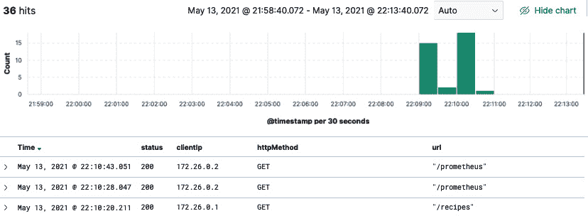

图 10.43 – 来自 Filebeat 的日志可视化

太好了！你现在可以使用 Kibana 仪表板实时分析 Gin 日志。分析这些日志可以提供大量信息，有助于解决 Gin 应用程序失败的根本原因。

# 摘要

在本章中，你学习了如何使用 Prometheus 仪器化 Gin 应用程序代码以暴露应用程序端指标。你看到了如何使用 Grafana 构建动态仪表板，以近乎实时地监控 Gin 应用程序的整体健康状况，以及当某些阈值被跨越时如何触发 Slack 警报。

然后，你学习了如何将 Gin 日志流式传输到使用开源工具（如 Logstash、Elasticsearch 和 Kibana）构建的集中式日志平台。在这个过程中，你学习了如何使用 Grok 模式解析 Gin 日志，以及如何在这些解析字段之上构建图表。

恭喜！现在，你可以从头开始设计、构建和部署分布式 Gin 应用程序。你还有一个关于如何自动化部署工作流程和在生产中监控运行中的 Gin 应用程序的良好基础。

# 进一步阅读

+   *《学习 Grafana 7.0》* 由 Eric Salituro 著，Packt 出版

+   *《使用 Prometheus 进行动手基础设施监控》* 由 Joel Bastos 和 Pedro Arajo 著，Packt 出版

# 结论

我们已经完成了这本书的旅程！你已经走到了尽头。我希望你对这段旅程感到自豪。你已经了解了 Gin 框架的方方面面，并构建了一个完全功能化的分布式 Gin 应用程序。

到现在为止，你应该已经知道如何构建一个可扩展的 Docker 化 Gin 应用程序了，从处理多个 Git 分支的 GitFlow 到在 AWS 上使用 CI/CD 管道自动化构建，再到近乎实时地故障排除和监控，以及使用 OpenAPI 生成 API 文档。

在这本书中有很多东西需要吸收和学习，尤其是如果你这是第一次接触 Gin 框架。我发现最好的学习方式是通过实践，所以请将你构建的 RESTful API 添加新功能。如果你真的构建了什么，请与我联系并告诉我你做了什么。
