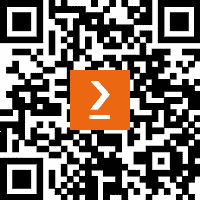
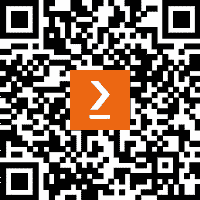

# 前言

*如果您想将您的命令行界面（CLI）应用程序开发技能提升到下一个层次，那么《使用 Go 构建 Modern CLI 应用程序》这本书就是您所需要的。本指南提供了一种全面且实用的方法，从零开始使用流行的 Go 编程语言构建 CLI 应用程序。您不仅将学习如何使用 Cobra 和 Termdash 等框架，还将发现如何整合以人为先的设计理念。本书涵盖了整个开发过程，从编译和分发您的应用程序到多个操作系统，到使用 GoReleaser 发布以及通过 Homebrew 公式扩展您的用户群。凭借清晰的解释、实用的示例和有见地的技巧，本书将使您成为一名熟练且富有创造力的 CLI 开发者，能够创建强大、直观且用户友好的应用程序，从而让您* *的用户感到愉悦。*

# 本书面向对象

*本书面向希望扩展技能集并开发强大、用户友好的命令行* *界面应用程序的中级 Go 开发者。*

# 本书涵盖内容

*第一章*，*理解 CLI 标准*，命令行界面（CLI）最初是为了在图形用户界面（GUI）发明之前与操作系统交互而创建的。尽管 GUI 和网络已经变得更加普遍，但近年来 CLI 开发又重新兴起，尤其是在公司 API 之外作为一项额外服务。在本章中，您将了解 CLI 的历史和结构，UNIX 的原则以及为什么 Go 是构建 CLI 应用程序的有力语言。

*第二章*，*为 CLI 应用程序结构化 Go 代码*，本章为那些不确定如何开始创建新的 CLI 应用程序的人提供指南。它涵盖了结构化代码的流行方式，领域驱动设计的概念，并提供了一个音频元数据 CLI 应用程序的实际用例。到本章结束时，读者将具备根据他们特定的用例和需求开发应用程序的必要技能。

*第三章*，*构建音频元数据 CLI*，本章通过引导读者从头到尾构建音频元数据 CLI 的用例来提供实践学习。代码可在网上找到，可以独立探索或与章节一起探索。此外，鼓励读者发挥想象力，考虑实现命令的替代方法。

*第四章*, *构建 CLIs 的流行框架*，本章将探讨开发现代 CLI 应用程序最流行的框架，重点关注 Cobra 及其快速生成 CLI 应用程序所需脚手架的能力。Viper 也将被讨论，它易于与 Cobra 集成，并为应用程序提供广泛的配置选项。

*第五章*, *定义命令行进程*，本章深入探讨了命令行应用程序的结构，分解了不同类型的输入，如子命令、参数和标志，以及其他输入，如 stdin、信号和控制字符。它还提供了处理每种输入类型数据的示例以及如何以易于人类和计算机解释的方式返回结果。

*第六章*, *调用外部进程，处理错误和超时*，本章将向您介绍如何调用外部进程并处理可能在与其他命令或 API 服务交互时发生的错误，包括超时。本章讨论了 os/exec 包，该包允许使用各种选项创建和运行命令，例如从标准输出和标准错误管道检索数据。此外，还探讨了 net/http 包，用于调用外部 API 服务端点，本章最后讨论了捕获和处理可能出现的错误的策略。

*第七章*, *为不同平台开发*，构建命令行应用程序强大的一个因素是能够轻松创建可以在不同机器上运行的代码，无论它们的操作系统是什么。os、time、path 和 runtime 包是帮助开发者创建平台无关代码的强大工具。在本章中，我们将通过简单的示例探讨这些包中的函数和方法，并展示如何使用构建标签指定操作系统代码。到本章结束时，您将对自己的代码能够在多个平台上运行的能力更有信心。

*第八章*, *为人类和机器构建*，考虑到最终用户来开发您的命令行应用程序是提高可用性的一个重要方面。在本章中，我们将探讨为人类和脚本构建的方法，使用 ASCII 艺术来增加信息密度，以及在不同命令和子命令之间保持一致性对于更好的导航的重要性。

*第九章*, *开发的同理心方面*，在本章中，您将学习如何通过考虑输出和错误、提供同理心文档以及为用户提供易于获取的帮助和支持，利用同理心来开发更好的命令行界面（CLI）。通过以用户易于理解的方式重写错误，提供详细的日志记录和帮助功能，如 man 页面、使用示例和错误提交选项，开发者可以创建一个符合用户视角并为他们提供保障的同理心 CLI。

*第十章*, *使用提示和终端仪表板进行交互性*，本章将向您展示如何通过添加提示或终端仪表板来提高您的命令行应用程序的可用性。通过提供创建调查和仪表板的示例和逐步说明，本章将帮助您构建一个更具吸引力和用户友好的界面。然而，当不是输出到终端时，重要的是要禁用交互性。

*第十一章*, *自定义构建和测试 CLI 命令*，为了提高不断增长的 Go 项目的稳定性和可扩展性，将布尔逻辑的构建标签纳入其中以实现有针对性的构建和测试是至关重要的。本章通过一个真实世界的例子，即 audiofile CLI，展示了构建标签和测试的使用，并涵盖了诸如集成级别、启用性能分析以及测试 HTTP 客户端等主题。

*第十二章*, *跨平台交叉编译*，本章解释了 Go 中的交叉编译，包括 Go 可以编译的不同操作系统和架构以及如何确定所需的内容。它涵盖了诸如手动编译与构建自动化工具、使用 GOOS 和 GOARCH、为 Linux、MacOS 和 Windows 编译以及为多个平台编写脚本等主题。

*第十三章*, *使用容器进行分发*，在本章中，我们将深入了解 Docker 容器以及它们在测试和共享您的 CLI 应用程序时如何为您带来好处。我们将从基础知识开始，逐渐过渡到更复杂的话题，例如使用容器进行集成测试。此外，我们还将权衡使用 Docker 的优缺点，帮助您确定它是否是您的正确选择。到本章结束时，您将具备将应用程序容器化、通过 Docker 进行测试以及通过 Docker Hub 与他人共享的能力。

*第十四章*，*使用 GoReleaser 将 Go 二进制文件作为 Homebrew Formula 发布*，在本章中，您将学习如何使用 GoReleaser 和 GitHub Actions 自动化 Go 二进制文件的发布。GoReleaser 简化了 Go 二进制文件的创建、测试和分发，GitHub Actions 是一个 CI/CD 平台，它自动化了软件开发工作流程。通过为您的应用程序创建 Homebrew tap，您可以简化 MacOS 用户的安装过程，并扩大您的受众范围。

# 为了充分利用本书

*为了充分利用本书，您应该具备中级水平的 Golang 知识。本书假设您熟悉 Go 的语法、数据类型、控制流和其他基本概念。它侧重于更高级的主题，如创建和测试 CLI 应用程序、使用外部库以及构建和分发二进制文件。如果您是 Go 的新手，可能会觉得材料具有挑战性，但如果有先前的经验，您将能够建立现有的知识并提升您的技能到*下一个层次*。**

| **本书涵盖的软件/硬件** | **操作系统要求** |
| --- | --- |
| Go 1.19 | Windows, macOS, 或 Linux |
| Cobra CLI |  |
| Docker |  |
| Docker Compose |  |
| GoReleaser CLI |  |

*安装 Cobra CLI:* [`github.com/spf13/cobra-cli`](https://github.com/spf13/cobra-cli)

*安装 Docker Desktop:* [`www.docker.com/products/docker-desktop/`](https://www.docker.com/products/docker-desktop/)

*安装 Docker Compose 插件:* [`docs.docker.com/compose/install/`](https://docs.docker.com/compose/install/)

*在[`goreleaser.com/install/`](https://goreleaser.com/install/)安装 GoReleaser 工具*

**如果您使用的是本书的数字版，我们建议您亲自输入代码或从书的 GitHub 仓库（下一节中有一个链接）获取代码。这样做将帮助您避免与代码的复制和粘贴相关的任何潜在错误。**

# 下载示例代码文件

您可以从 GitHub 下载本书的示例代码文件：[`github.com/PacktPublishing/Building-Modern-CLI-Applications-in-Go`](https://github.com/PacktPublishing/Building-Modern-CLI-Applications-in-Go)。如果代码有更新，它将在 GitHub 仓库中更新。

我们还提供了来自我们丰富的图书和视频目录中的其他代码包，可在[`github.com/PacktPublishing/`](https://github.com/PacktPublishing/)找到。查看它们吧！

# 下载彩色图像

我们还提供了一份包含本书中使用的截图和图表的彩色图像的 PDF 文件。您可以从这里下载：[`packt.link/F4Fus`](https://packt.link/F4Fus)。

# 使用的约定

本书使用了多种文本约定。

`Code in text`：表示文本中的代码单词、数据库表名、文件夹名、文件名、文件扩展名、路径名、虚拟 URL、用户输入和 Twitter 昵称。以下是一个示例：“将下载的`WebStorm-10*.dmg`磁盘映像文件作为系统中的另一个磁盘挂载。”

代码块设置如下：

```go
func init() {
    audioCmd.Flags().StringP("filename", "f", "", "audio
      file")
    uploadCmd.AddCommand(audioCmd)
}
```

当我们希望您注意代码块中的特定部分时，相关的行或项目将以粗体显示：

```go
var (
    Filename = ""
)
func init() {
    uploadCmd.PersistentFlags().StringVarP(&Filename,
      "filename", "f", "", "file to upload")
    rootCmd.AddCommand(uploadCmd)
}
```

任何命令行输入或输出都按照以下方式编写：

```go
cobra-cli add upload audio [-f|--filename]
  audio/beatdoctor.mp3
```

**粗体**：表示新术语、重要单词或屏幕上看到的单词。例如，菜单或对话框中的单词以粗体显示。以下是一个示例：“从**管理**面板中选择**系统信息**。”

小贴士或重要注意事项

看起来像这样。

# 联系我们

我们始终欢迎读者的反馈。

`customercare@packtpub.com`并在邮件主题中提及书名。

**勘误表**：尽管我们已经尽一切努力确保内容的准确性，但错误仍然可能发生。如果您在这本书中发现了错误，我们将非常感激您向我们报告。请访问[www.packtpub.com/support/errata](http://www.packtpub.com/support/errata)并填写表格。

`copyright@packt.com`，并附上材料的链接。

**如果您想成为一名作者**：如果您在某个领域有专业知识，并且对撰写或为书籍做出贡献感兴趣，请访问[authors.packtpub.com](http://authors.packtpub.com)。

# 分享您的想法

一旦您阅读了《Building Modern CLI Applications in Go》，我们非常乐意听到您的想法！扫描下面的二维码直接进入此书的亚马逊评论页面并分享您的反馈。



[`packt.link/r/1804611654`](https://packt.link/r/1804611654)

您的评论对我们和科技社区非常重要，并将帮助我们确保我们提供高质量的内容。

# 下载此书的免费 PDF 副本

感谢您购买此书！

您喜欢在路上阅读，但又无法携带您的印刷书籍到处走吗？

您的电子书购买是否与您选择的设备不兼容？

别担心，现在每购买一本 Packt 书籍，您都可以免费获得该书的 DRM 免费 PDF 版本。

在任何地方、任何设备上阅读。直接从您最喜欢的技术书籍中搜索、复制和粘贴代码到您的应用程序中。

优惠远不止于此，您还可以获得独家折扣、新闻通讯以及每天收件箱中的优质免费内容。

按照以下简单步骤获取优惠：

1.  扫描二维码或访问以下链接



[`packt.link/free-ebook/9781804611654`](https://packt.link/free-ebook/9781804611654)

1.  提交您的购买证明

1.  就这些！我们将直接将免费 PDF 和其他优惠发送到您的邮箱。

# 第一部分：从坚实基础开始

本部分涵盖了命令行界面（CLI）及其在流行度上的复兴。讨论了 CLI 的历史、结构和设计原则，重点关注 UNIX 的哲学和利用 Go 构建 CLI 的好处。指南提供了一个逐步构建新应用程序的方法，包括代码结构、领域驱动设计以及一个示例音频元数据 CLI 应用程序。通过示例音频元数据 CLI 应用程序鼓励动手学习，并探讨了如 Cobra 和 Viper 等流行框架以加快开发过程。总体而言，本部分提供了 CLI 及其在现代编程中实际应用的全面概述，为寻求构建高效且有效的 CLI 应用程序的开发者提供了宝贵的指导。

本部分包含以下章节：

+   *第一章*, *理解 CLI 标准*

+   *第二章*, *为命令行应用程序结构化 Go 代码*

+   *第三章*, *构建音频元数据 CLI*

+   *第四章*, *构建 CLIs 的流行框架*
