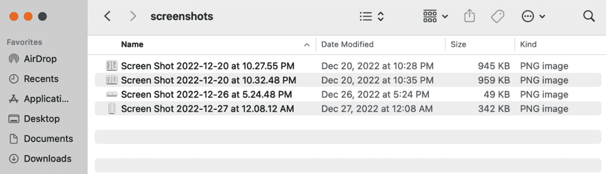
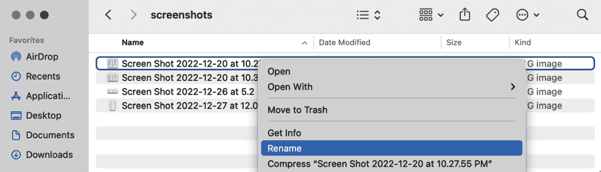
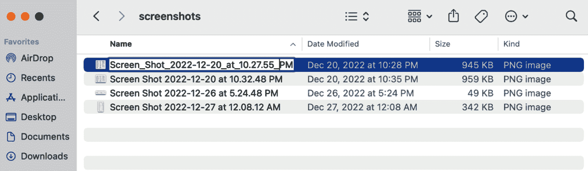

# 第一章：理解 CLI 标准

**命令行界面（CLI**）是供人类使用的基于文本的界面，计算机交互最初是为了在桌面图形界面发明之前与**操作系统（OS**）交互而设计的。正如我们所知，CLI 在 20 世纪 60 年代非常流行，直到十年后图形桌面界面被开发出来。然而，尽管大多数计算机用户习惯于**图形用户界面（GUI**）和网页，但 CLI 开发在 2017 年左右出现了复兴。复古 CLI 的流行和新用途各不相同，但最流行的用途是作为公司 API 的附加服务，以增加平台的使用。

在本章中，你将了解 CLI 的全面历史、它今天的状况以及其结构的分解。你将了解 UNIX 的哲学以及遵循其原则将如何指导你创建一个成功的 CLI。

到本章结束时，你将更深入地了解 CLI，如何最好地设计和实施经过验证、经得起时间考验的标准，以及为什么 Go 语言，它已经成为越来越受欢迎的语言，有充分的理由成为构建 CLI 的最佳语言。

在本章中，我们将涵盖以下主要主题：

+   命令行的简要介绍和历史

+   CLI 开发的哲学

+   现代 CLI 指南

+   选择 CLI

# 命令行的简要介绍和历史

命令行界面（CLI）是人类与计算机交互进化的结果，特别是通信和语言处理。让我们从第一个编译器的创建开始讲起，它使我们从使用穿孔卡片过渡到编程语言。

## 关于历史

第一台计算机编译器是由格蕾丝·霍珀编写的。编译器能够将书面代码翻译成机器代码，从而减轻了当时程序员手动编写机器代码的巨大负担。格蕾丝·霍珀还在 1959 年发明了 COBOL 编程语言。在那个时代，穿孔卡片被用于数据处理应用或控制机械。它们会包含 COBOL、Fortran 和汇编代码。编译器和新编程语言的进步简化了编程任务。

同年，杰克·基尔比和罗伯特·诺伊斯发明了微芯片。这使得小型计算机的成本大幅降低，最终实现了人机交互，即人与计算机之间的双向互动，成为可能。计算机现在可以进行多任务处理和时间共享系统。

到这一点，键盘成为了与计算机交互的主要方法。到 20 世纪 60 年代初，工程师们将阴极射线管（CRT）显示器连接到了电传打字机（TTY）机器上。这种 CRT 和 TTY 的组合被称为“玻璃 TTY”，标志着我们认为是现代显示器时代的开始。

在 1966 年，阴极射线管和电传打字机，它们结合了电报、电话和打字机的技术，即将与最后一块缺失的拼图——计算机——合并。电传计算机接口应运而生。用户会输入一条命令，按下*Enter*键，然后计算机就会响应。这些被称为*命令行界面*！

从 1963 年发明 ASCII 字符到 1969 年的互联网，1971 年的 UNIX 和 1972 年的电子邮件，再到 1975 年的词法分析解析器在编程语言发展中的重要作用，以及 1977 年基于文本的冒险游戏为技术爱好者提供娱乐，以及 1970 年代图形用户界面（GUI）的诞生，之后还有许多令人兴奋的发展。

如果没有电话的演变，这些计算机网络的建立是不可能的。在 1964 年，声学**调制解调器**（**modem**）被用来在电话线和计算机之间传输数据。声学调制解调器为我们带来了**广域网**（**WAN**）、**局域网**（**LAN**）以及我们今天所知道的宽带。局域网聚会达到顶峰是在 1990 年代，并且一直持续到 21 世纪初。

在 1978 年，第一个公开的拨号**公告板系统**（**BBS**）由沃德·克里斯滕森和兰迪·苏斯开发，他们还创建了**计算机化公告板系统**（**CBBS**）。有了调制解调器，用户可以通过终端程序拨入运行 CBBS 软件的服务器并连接。在整个 1980 年代，BBS 的普及度达到了惊人的高度，甚至在 1995 年中期，BBS 比新兴的在线服务提供商如 CompuServe 和**美国在线**（**AOL**）服务了更大的集体市场。

注意

对命令行界面历史的深入了解可能会让你更加欣赏它的本质。终端有点像一台时光机。使用许多 UNIX 和 DOS 命令感觉就像站在巨人的肩膀上，俯瞰其下的漫长计算历史。

## 命令行界面介绍

基于命令行界面的历史，很明显它是一种基于文本的界面，允许用户与计算机、计算机与计算机以及计算机与用户之间的通信。它需要与它所演变而来的早期机器相同的特定指令和清晰的语言。现在，让我们更深入地了解命令行界面，了解它们的种类、一般结构以及它们的使用方式和原因。

### 解剖学

对于任何命令行界面，无论具体类型如何，理解命令本身的解剖结构都很重要。如果没有特定的结构，计算机就无法正确解析和理解其指令。以下是一个简单的例子，我们将用它来区分命令的不同组成部分：

```go
~ cat -b transcript
```

在本例的上下文中，UNIX 命令 `cat` 用于查看文件 `transcript` 的内容。添加 `-b` 标志告诉命令在非空输出行旁边打印行号。我们将在以下小节中详细讨论命令的每个组成部分。

#### 提示符

终端上的符号指示用户计算机已准备好接收命令。前面的例子显示了 `~` 作为命令提示符；然而，这可能会根据操作系统而有所不同。

#### 命令

命令有两种类型：

+   `cd`、`date` 和 `time` 命令。它们不需要搜索 `PATH` 变量以找到可执行文件。

+   `ls` 和 `cat`。这些通常位于 UNIX 的 `/bin` 或 `/usr/bin` 中，需要搜索 `PATH` 变量以找到可执行文件。

之前的例子使用 `cat` 作为外部命令。

#### 参数和选项

命令通常接受一个或多个参数作为输入，这些参数可以是参数和/或选项：

+   参数是传递信息到命令的参数，例如，`mkdir test/`。

在前面的代码片段中，`test/` 是 `mkdir` 命令的输入参数。

+   选项是标志或开关，用于修改命令的操作，例如 `mkdir -p test/files/`。

在前面的例子中，`-p` 是一个选项，如果需要，将创建父目录。

在本节开头示例中，`-b` 是一个可选标志，简写为 `--number-nonblank`，它告诉命令在非空行旁边打印行号，而文件名 `transcript` 是传递给命令的参数。

#### 空格

为了让操作系统或应用程序正确解析这些命令、参数和选项，每个都由空格分隔。必须特别注意参数本身可能存在空格的事实。这可能会给命令行解释器带来一些歧义。

请注意，通过替换参数内的空格来解决这个问题。在以下示例中，我们用下划线替换空格：

```go
cat Screen_Shot_2021-06-05_at_10.23.16_PM.png
```

您也可以选择在参数周围放置引号，如下例所示：

```go
cat "Screen Shot 2021-06-05 at 10.23.16 PM.png"
```

最后，通过在每个空格之前添加转义字符来解决这个问题，如下例所示：

```go
cat Screen\ Shot\ 2021-06-05\ at\ 10.23.16\ PM.png
```

注意

虽然空格是最常用的分隔符，但它并不通用。

#### 语法和语义

命令行界面提供了与操作系统或应用程序通信的语言。因此，像任何语言一样，为了被正确解释，它需要语法和语义。语法是由操作系统或应用程序供应商定义的语法。语义定义了可能进行的操作。

当你查看一些命令行应用程序时，你可以看到正在使用的语言。有时，不同工具的语法有所不同；我将在本章后面详细说明具体内容，例如，`cat -b transcript` 是我们之前看过的命令。命令 `cat` 是一个动词，标志 `-b` 是一个形容词，而 `transcript` 是一个名词。这是 `cat` UNIX 命令的既定语法：动词、形容词、名词。

命令的语义由可能进行的操作定义。你可以通过查看 `cat` 命令的选项来看到这一点，这些选项通常显示在帮助页面的 **使用** 部分，当用户错误地使用应用程序时输出。

#### 帮助页面

由于 CLI 完全是基于文本的，并且缺乏视觉提示，其使用可能是不明确的或未知的。例如 `-help`、`--help` 或 `-h`。`-h` 选项是帮助命令的缩写快捷方式。

在内置帮助和 man 页面中使用的常见语法如下，遵循此标准将使用户熟悉标准，从而轻松使用您的 CLI：

+   必需参数通常用尖括号表示，例如，`ping <hostname>`

+   可选参数用方括号表示，例如，`mkdir [``option] <dirname>`

+   省略号表示重复项，例如，`cp [option]... <``source>... <directory>`

+   竖线表示项目之间的选择，例如，`netstat {-t | -``u}`

### 使用方法

命令行界面（CLI）是用户与操作系统之间的第一个接口，主要用于数值计算，但随着时间的推移，其使用方式已经扩展到更多实用和有趣的方式。

让我们看看一些用法：

+   **编辑器宏**（**Emacs**），UNIX 提供的最早的文本编辑器之一，是一种以迷你缓冲区形式的 CLI。命令和参数以按键组合的形式输入：要么是 *Ctrl* 字符加上一个键，要么是带有 *Ctrl* 字符前缀的键，输出显示在另一个缓冲区中。

+   **读取-评估-打印循环**（**REPL**）是 Python 的交互式外壳，它提供了一个 CLI，根据其名称可以读取、评估、打印和循环。它允许用户在一个游戏环境中验证 Python 命令。

+   **MajorMUD** 和 **Lunatix** 是在公告板系统上可用的几款流行游戏。一旦程序员能够将 CLI 转变为游戏，他们就做到了，虽然这些游戏完全是基于文本的，但它们绝对不乏乐趣！

+   现代视频游戏将他们的 CLI 称为游戏控制台。从控制台，模开发者可以运行命令进行调试、作弊或跳过游戏的一部分。

+   辅助程序通常接受参数以以特定方式启动程序。例如，Microsoft Visual Code 有一个命令行选项：`code <filename>`.

+   一些 CLI 集成到网络应用程序中，例如，基于网络的 SSH 程序。

+   例如，AWS 这样的公司提供 CLI，作为其 API 之外与平台交互的额外方式。

最后但同样重要的是，脚本允许工程师将他们的 CLI 带到更交互化的水平。在 shell 脚本语言中，程序员可以编写对 CLI 的调用脚本，并捕获和操作输出。一个命令的输出也可以作为输入传递给另一个命令。这使得 CLI 成为开发者非常强大的资源。

### 类型

主要有两种类型的 CLI：

+   **操作系统 CLI**

+   **应用程序 CLI**

#### 操作系统 CLI

操作系统 CLI 通常与操作系统一起提供。这种 CLI 被称为 **shell**。它是位于内核之上的一层命令行解释器，解释并处理用户输入的命令，并以基于文本的方式与操作系统交互，作为图形显示的替代方案。

#### 应用程序 CLI

第二种类型的 CLI 允许与操作系统上运行的具体应用程序进行交互。

用户可能以三种主要方式与应用程序的 CLI 交互：

+   **参数**：它们为以特定方式启动应用程序提供输入

+   **交互式命令行会话**：它们作为独立于应用程序的文本替代控制方法在应用程序之后启动

+   **进程间通信**：这允许用户将一个程序输出的数据流或管道传输到另一个程序

### 图形用户界面 (GUI) 与命令行界面 (CLI) 示例

让我们给出一个清晰的例子，看看 CLI 如何在速度上超越 GUI。假设我们有一个包含截图的文件夹。每个截图的名称都包含空格，我们希望将这些文件重命名为用下划线替换空格。

#### GUI

使用 GUI，重命名包含文件名中空格的整个截图文件夹需要几个手动步骤。让我们在 macOS 或 Darwin 中展示这些步骤：

1.  首先，我们需要打开包含所有截图的文件夹：



图 1.1 – 包含每个文件名包含多个空格的截图的文件夹

1.  第二，我们会按下控制按钮并左键点击一个文件名，然后从弹出的上下文菜单中选择 **重命名** 选项。



图 1.2 – 在上下文菜单中，点击重命名选项

1.  最后，手动将每个空格替换为下划线。



图 1.3 – 在文件名中用下划线替换了空格

对文件夹中的每个文件重复步骤 1-3。我们很幸运这个文件夹只包含四个截图。如果文件夹中有更多文件，这个过程会很快变得重复且令人疲倦。

#### CLI

让我们看看 CLI 可以有多快。让我们打开终端并导航到包含文件的文件夹：

```go
cd ~/Desktop/screenshots/
```

让我们通过输入 `ls` 命令来查看文件夹中当前存在的内容：

```go
mmontagnino@Marians-MacBook-Pro screenshots % ls
Screen Shot 2022-12-20 at 10.27.55 PM.png
Screen Shot 2022-12-20 at 10.32.48 PM.png
Screen Shot 2022-12-26 at 5.24.48 PM.png
Screen Shot 2022-12-27 at 12.08.12 AM.png
```

让我们运行一个精心设计的命令，该命令会遍历当前目录中的每个文件，并使用`mv`将其重命名（将空格转换为下划线）：

```go
for file in *; do mv "$file" `echo $file | tr ' ' '_'` ; done
```

让我们再次运行`ls`命令，看看有什么变化：

```go
mmontagnino@Marians-MacBook-Pro screenshots % ls
Screen_Shot_2022-12-20_at_10.27.55_PM.png
Screen_Shot_2022-12-20_at_10.32.48_PM.png
Screen_Shot_2022-12-26_at_5.24.48_PM.png
Screen_Shot_2022-12-27_at_12.08.12_AM.png
```

哇！我们刚刚运行了一个命令，文件就自动重命名了！这只是一个例子，展示了命令行界面（CLIs）的力量以及与 GUI 相比任务执行速度有多快。

### 复兴

近年来，命令行界面（CLI）的复兴归功于这些许多好处。图形用户界面（GUI）可能资源密集，执行重复性任务时可能繁琐，有时还可能缓慢。

在另一端，命令行界面（CLI）轻量级、可脚本化且快速。优势远不止于此。CLI 甚至可能提供 GUI 中不可用或难以想象的命令和参数。有很多值得钦佩的地方，它也有一点神秘。

我在这里对 CLI 有点小迷恋！开个玩笑，为了公平起见，对于吸引人的 GUI，它有视觉提示，使用户能够自我引导。而过于神秘的 CLI，另一方面，则需要帮助文档和 man 页面来理解其可用的参数和选项。

虽然看起来可能难以理解，但一旦理解，命令行界面的力量就会变得明显并鼓舞人心。

# 命令行界面（CLI）开发的哲学

**哲学**在计算机科学的发展中起着重要作用。历史上，许多计算机科学家通过哲学对计算机科学做出了重大贡献，部分原因是因为许多计算机科学家同时也是哲学家。每个操作系统都有自己的独特哲学，这并不奇怪。

例如，**Windows**将大部分智能硬编码在程序或操作系统中，假设用户的无知并限制了他们的灵活性。尽管理解门槛较低，但用户与程序交互时并不了解它是如何工作的。

**UNIX**的开发者持有相反的哲学：为用户提供几乎无限的选项来赋予他们权力。尽管学习曲线陡峭，但在一个不屏蔽用户对自由复杂性的环境中，可以开发出更多内容。

关于 UNIX 的哲学和将其应用于现实生活的书籍已经有很多了。因此，我相信许多人将编码视为一种手艺。尽管还有许多其他哲学需要审查，但本节的重点将放在 UNIX 的哲学上。

Go 编程语言的传奇设计师，肯·汤普森（Ken Thompson）、罗伯特·格里泽默（Robert Griesemer）和罗布·派克（Rob Pike），与 UNIX 有着悠久的历史，因此讨论其哲学时，将其置于其创造者的背景下是合适的，因为 Go 就是围绕它构建的。

**UNIX 的哲学**主张简单和模块化的设计，这些设计既可扩展又可组合。其基础是众多小型程序之间的关系比程序本身更强大。例如，许多 UNIX 程序独立处理简单任务，但当它们结合在一起时，这些简单的工具可以以非常强大的方式进行编排。

## 成功 CLI 的清单

以下是一些受 UNIX 哲学启发的原则，遵循这些原则将有助于创建一个成功的 CLI：

+   **构建模块化程序**

设计您的 CLI 时，要考虑标准化，以确保它可以轻松与其他应用程序组合。具体来说，利用标准输入和输出、标准错误、信号和退出代码有助于构建既模块化又易于组合的程序。组合性可以通过管道和 shell 脚本简单地处理，但也有一些编程语言可以帮助将程序拼接在一起。**持续集成/持续交付**（**CI/CD**）、编排和配置管理工具通常建立在命令行执行和脚本之上，以自动化代码集成或部署或配置机器。考虑您程序的数据输出以及其组合的容易程度。当需要结构时，最佳选项是纯文本或 JSON。

+   **以人为本** **构建**

最初的 CLI 命令是假设它们只会被其他程序使用而编写的。现在情况不再是这样了，因此程序应该首先以人为设计。

对话将成为人机交互的主要方法。想象一下人类对话的自然流程以及这一概念如何应用于帮助误解程序设计的用户。在自然语言中，您的程序可以建议可能的纠正，多步骤过程中的当前状态，并在继续进行有风险的操作之前请求确认。在最佳情况下，您的用户在使用您的 CLI 时感到愉快，感觉有力量去发现操作，并在需要时获得帮助。在最坏的情况下，您的用户感到被忽视和沮丧，看不到任何帮助。不要成为那样的 CLI！

最后，编写可读的代码，以便其他开发人员可以轻松地在将来维护您的程序。

+   **将接口与引擎和政策** **从机制中分离**

通过解耦这些，不同的应用程序可以通过接口使用相同的引擎，或者使用不同的策略使用相同的机制。

+   **保持简单**

只有在必要时才添加复杂性。当复杂性发生时，将其折叠到数据中而不是逻辑中。在不损害可用性的情况下，使用现有模式。

+   **保持小巧**

除非没有其他方法，否则不要编写大型程序。

+   **保持透明**

尽可能地保持透明，让用户能够理解如何使用程序以及正在发生什么。透明的程序具有全面的帮助文本，并提供大量示例，使用户能够轻松发现他们需要的参数和选项，并对其执行有信心。GUI 在透明度和可见性方面确实有优势；然而，我们可以从中学习，看看可以吸收哪些内容来使 CLI 更容易学习和使用。用户求助于 Google 或 Stack Overflow 在这里是一种反模式。

+   **保持稳健**

稳健性是前述原则的结果：透明性和简单性。程序应以用户期望的方式运行，当出现错误时，应清楚地解释正在发生的情况，并提供解决方案的建议。立即打印堆栈跟踪或不对用户进行清晰且及时的响应，会让用户感觉不稳定。

+   **没有惊喜**

通过建立在使用者现有知识的基础上来保持程序直观。例如，逻辑运算符如`+`应始终表示加法，而`-`应始终表示减法。通过保持与现有知识和行为模式的一致性，使程序直观。

+   **简洁**

不要无谓地打印输出，也不要完全沉默，让用户猜测发生了什么。在沟通中需要找到平衡，准确地说出需要说的内容；不多也不少。太多会导致一大块冗长的文本，迫使用户从中解析出有用的信息。太少则是指命令提示符在沉默中挂起，让用户猜测程序的状态。

+   **明显地失败**

修复可以修复的部分，当程序失败时，应尽快且明显地报错。这将防止错误输出破坏依赖于它的其他程序。

+   **节省你的时间**

编写代码以节省开发者的时间，而不是机器的时间，因为现在机器时间相对便宜。此外，编写生成程序的程序。对于计算机来说，生成代码比手动编写更快且错误更少。

+   **先构建原型，然后优化**

有时，程序员在早期为了微小的收益花费太多时间进行优化。首先，让它工作，然后再进行润色。

+   **构建灵活的程序**

程序可能以开发者未预料到的方式被使用。因此，使设计灵活和开放将允许程序以未预料到的方式被使用。

+   **设计可扩展性**

通过允许协议可扩展来延长你程序的使用寿命。

+   **成为一个好的 CLI 公民**

将同理心融入设计，并与 CLI 生态系统和平共处。

这种哲学直接影响了创建 CLI 的指南。在下一节中，你将清楚地看到与所讨论的哲学原则之间的联系，并且遵循这些指南将增加创建成功 CLI 的可能性。

# 指南

这些指南自第一个 CLI 以来就已经制定，并且随着多年的开发者和用户体验而不断演变。遵循这些指南将增加 CLI 成功的可能性；然而，有时你可能决定走自己的路，遵循反模式。选择非传统路线可能有多种原因。记住，这些只是指南，并没有硬性规定。

对于生活，以及构建命令行界面（CLI），要使其变得有趣，我们必须允许一点混乱和必要的自由来发挥创造力。

## 名称

CLI 的**名称**具有重大意义，因为名称可能传达超出最初意图的象征性思想。人们不喜欢无谓地思考，所以最好选择一个简单、易于记忆且易于发音的名字。令人惊讶的是，许多 CLI 程序名称被随意选择，几乎没有经过深思熟虑。

有研究表明支持语言海森堡原理：*给一个概念贴上标签会改变人们对它的感知*。

因此，让它简短且易于输入。在名称中使用完全小写的变量，并且只有在绝对必要时才使用破折号。

我最喜欢的应用程序名称之一是它们以清晰的方式直接描述了应用程序的目的。例如，`imagemagick`，这是一个命令行应用程序，让你可以神奇地读取、处理或创建图像！确实，正如亚瑟·C·克拉克写道，“*任何足够先进的技术都与魔法无法区分*。”我们熟悉的内部命令还包括`mkdir`（创建目录）、`rm`（删除）和`mv`（移动）。它们的流行部分是由于它们名称的透明性，使得它们几乎难以忘记。

## 帮助和文档

UNIX 哲学的一个原则是透明性，这主要可以通过 CLI 中的帮助和文档来实现。对于处于探索模式的 CLI 新用户，帮助和文档是他们最早访问的部分之一。有一些指南可以使帮助和文档更容易为用户访问。

### 帮助

当只输入命令名称或使用`-h`或`–help`标志时，默认显示帮助是一个好习惯。当你显示帮助文本时，确保它格式化良好且简洁，最常用的参数和标志选项放在最上面。提供使用示例，如果用户误用 CLI，程序可以猜测用户试图尝试的操作，并提供建议和下一步操作。

### 文档

提供手册页面或基于终端或基于网页的文档，这些文档可以提供 CLI 使用示例。这些类型的文档可以作为了解 CLI 工作原理的资源扩展，从帮助页面链接。

### 支持功能

通常，用户会对如何使用 CLI 提出建议或问题。提供反馈和问题的支持路径将使用户能够为 CLI 设计师提供他们 CLI 使用的新视角。在收集分析数据时，要透明，不要未经用户同意收集用户的地址、电话或使用数据。

## 输入

CLI 获取输入的方式有多种，但主要通过参数、标志和子命令。普遍倾向于使用标志而不是参数，并使默认选项对大多数用户来说都是正确的。

### 标志

标志的指南是理想情况下，所有标志都应该有一个完整版本。例如，`-h` 对应 `--help`。仅使用单个连字符 `–` 或常用标志的缩写符号，并在存在标准名称时使用标准名称。

以下是一些已存在的标准标志列表：

| **标志** | **用法** |
| --- | --- |
| `-a`, `--all` | 所有 |
| `-d`, `–debug` | 调试 |
| `-f`, `--force` | 强制 |
| `--json` | 显示 JSON 输出 |
| `-h`, `--help` | 帮助 |
| `--no-input` | 禁用提示和交互 |
| `-o`, `--output` | 输出文件 |
| `-p`, `--port` | 端口 |
| `-q`, `--quiet` | 静默模式 |
| `-u`, `--user` | 用户 |
| `--version` | 版本 |
| `-v` | 版本或详细模式 |
| `-d` | 详细模式 |

表 1.1：标准标志

### 参数

对于在多个文件上执行简单操作的情况，多个参数是可以的。例如，`rm` 命令针对多个文件运行。尽管如此，如果存在两个或更多用于不同事物的参数，可能需要重新考虑命令的结构，并选择标志选项而不是额外的参数。

### 子命令

子命令的指南是它们应保持一致且无歧义。保持子命令的结构一致；无论是名词-动词还是动词-名词顺序都适用，但名词-动词顺序更为常见。有时，程序会提供模糊的子命令，例如 `apt update` 与 `apt upgrade`，这会导致包括我自己在内的许多人感到困惑。尽量避免这种情况！

在早期验证用户的输入，如果无效，则在发生任何严重问题之前尽早失败。在本书的后续部分，我们将指导您使用 Cobra，这是一个流行的、高度推荐的 Go 语言命令行解析器，用于验证用户输入。

## 输出

因为 CLI 是为人类和机器构建的，所以我们需要考虑输出必须易于两者消费。我将为人类和机器的 `stdout` 和 `stderr` 流提供指南。标准输出 `stdout` 是进程可以写入输出的默认文件描述符，而标准错误 `stderr` 是进程可以写入错误信息的默认文件描述符：

+   **stdout**

对于人类的标准输出指南是使响应清晰、简短且易于理解。利用 ASCII 艺术、符号、表情符号和颜色来提高信息密度。最后，考虑简单的机器可读输出，以确保不会影响可用性。

对于机器的标准输出指南是从上述响应中提取任何无关物质，使其成为简单的机器可读文本，以便将其管道传输到另一个命令。当默认情况下不输出简单的机器可读文本时，使用`-q`标志来抑制非必要输出，并使用`--plain`来显示机器可读文本。通过设置`NO_COLOR`环境变量或针对您程序的特定`MYAPP_NO_COLOR`环境变量来禁用颜色。

此外，不要在`stdout`中使用动画，因为它不是一个交互式终端。

+   **stderr**

在命令执行过程中可能会出错，但不必感觉像是一场灾难性事件。有时，响亮的完整堆栈跟踪是对命令失败的响应，这可能会让人心跳加速。捕获错误，并以重写的错误消息优雅地响应用户，这些错误消息可以提供对发生情况以及下一步建议的清晰理解。确保没有无关或嘈杂的输出，考虑到我们希望它易于理解错误。此外，向用户提供额外的调试和跟踪信息，以及提交错误报告的选项。非错误消息不应发送到`stderr`，调试和警告消息应发送到`stdout`。

注意

关于 CLI 输出的通用指南，成功时返回零退出代码，失败时返回非零代码，机器可以将其解释为不仅仅是失败，甚至可以采取进一步行动的特定类型的失败。

## 配置

用户可以通过使用标志、环境变量和文件来配置他们的 CLI，以确定如何具体调用命令并在不同的用户和环境之间稳定它：

+   **标志和** **环境变量**

通过使用标志或环境变量，用户可以配置如何运行命令。

以下是一些示例：

+   指定调试输出级别

+   干运行命令

或者，它们可以用来在不同的环境中进行配置。

以下是一些示例：

+   提供程序执行所需的非默认文件路径

+   指定输出类型（文本或 JSON）

+   指定 HTTP 代理服务器以路由请求

在配置中使用环境变量时，适当地设置名称，使用全部大写文本、数字和下划线的组合，并花时间确保您没有使用已存在的环境变量的名称。

+   **XDG 规范**

通过遵循 XDG 规范（X Desktop Group，[freesdesktop.org](http://freesdesktop.org)）来配置跨多个环境的稳定性，该规范指定了配置文件可能存在的基目录的位置。这个规范得到了许多流行工具的支持，例如 Yarn、Emacs 和 tmux 等。

## 安全性

不要将机密信息和密码存储在环境变量中，也不要通过参数或标志传递它们。相反，将它们存储在文件中，并使用 `--password-file` 参数允许秘密信息被离散地传递。

## 开源社区

一旦你的 CLI 完成，准备分发，有一些指南需要遵循。如果可能，将程序作为针对用户特定平台和架构的单个二进制文件进行分发。如果用户不再需要或想要你的程序，确保它也易于卸载！

由于你将在 Go 中编写 CLI，因此鼓励对程序做出贡献将是非常好的。你可以提供一个贡献指南文档，指导用户了解提交语法、代码质量、必需的测试和其他标准。你也可以选择允许用户通过编写与你的 CLI 兼容的插件来扩展 CLI，将功能分解成更模块化的组件，并提高可组合性。

## 软件寿命和鲁棒性

为了确保你的 CLI 将来能够良好地工作，有一些特定的关于鲁棒性的指南需要遵循，以确保你的程序有一个长的寿命：

+   **未来兼容性**

当你对 CLI 进行任何更改时，随着时间的推移，最好是进行增量更改，但如果不是这样，应提醒用户更改。更改人类可读的输出通常是可以接受的，但最好保持机器可读输出的稳定性。考虑外部依赖可能缩短你的程序寿命的情况，并思考在外部依赖失败的情况下使你的应用程序保持稳定的方法。

+   **鲁棒性**

为了使命令行界面（CLI）达到最大的鲁棒性，CLI 必须以完全透明的方式进行设计。程序需要感觉对用户负责；因此，如果某项操作耗时较长，应显示进度，并确保程序不会挂起。当程序运行时间过长时，应设置超时。当用户输入命令时，应立即验证其使用情况，并在出现明显误用时提供清晰的反馈。当由于某些暂时性原因出现故障时，应立即在失败或中断时退出程序。当程序再次被调用时，它应立即从上次停止的地方继续执行。

+   **同理心**

在命令行设计中加入一些深思熟虑的细节将为用户提供愉快的体验。CLI 应该是易于使用的！即使事情出错，有了支持性的设计，用户也可以在成功使用 CLI 的道路上感到鼓舞。现代 CLI 哲学和指南已经体现了对人类的同理心，而且，感谢上帝，我们已经从最初的命令行工具走了很长的路，并将继续做得更好。

# Go for CLIs

我建议工程师学习 Go 的所有主要原因，也是我建议使用 Go 来构建你的 CLI 的原因，但现代 CLIs 的历史，始于 20 世纪 60 年代的 UNIX shell，由贝尔实验室的 Ken Thompson 发明，Golang 的共同发明者，具有很大的分量。UNIX 哲学，它启发了我们的现代 CLI 哲学和指南，已经融入了语言中，并且很明显，许多好处都源于这种思维方式：

+   **性能、可扩展性和力量**

Golang 在编译和执行方面相当快。例如，用 Go 编写的 Kubernetes，有 500 万行应用程序代码，可以在几分钟内编译完成。任何其他语言都需要 10 分钟到几个小时才能编译。Go 在其优化的编译器中将源代码转换为机器代码，这使得依赖关系管理更加容易。此外，由于 Golang 仍然是一个年轻的语言，它是为现代硬件需求而构建的。

*Goroutines* 是轻量级的线程，可以并发运行。在我的编程经验中，我没有看到简单性和多线程能够紧密结合，但 Golang 极好地实现了这一点。这个特性赢得了我的心。

Go 的性能和可扩展性对云计算社区来说是一个明显的吸引力。许多云计算 CLI 都是用 Go 编写的，包括 Docker 和 Kubernetes。任何拥有增长的用户基础或大量流量请求的应用程序都需要考虑 Golang。像 Uber 和 Comcast 这样的公司也因为这个原因选择了 Go。

+   **开发简化**

与我遇到过的任何其他语言相比，Golang 感觉更容易学习。这种语言支持一个干净、简单、快速的环境，这在考虑到 Go 创建的强大工具时是非常令人印象深刻的。Golang 还拥有许多工具，允许开发的速度和准确性，包括格式化工具、测试框架、出色的代码检查器和执行静态分析的工具。

+   **多功能性**

Go 使得交叉编译变得非常简单。你可以为许多不同的操作系统和架构构建你的应用程序，从而增加你的 CLI 的可访问性。尽管在不同的环境中执行，但如果配置得当，它将工作得非常相似。这将减轻用户的心理负担。在本书的后续部分，我们将讨论如何为不同的平台创建二进制文件。

+   **提升技能**

Golang 是学习最受欢迎的语言之一。鉴于其许多明显的优势，越来越多的初创公司和企业选择 Golang，对 Golang 开发者的需求也在增长。

+   **社区**

如果你选择 Go，你将成为一个充满热情的开源开发者社区的一员，愿意参与一个年轻编程语言的进化之旅。

对于第一次在 Go 中构建 CLI 的初学者来说，接下来的章节将展示其清晰度。Golang 是构建 CLI 的绝佳选择，当需要可扩展性、性能和交叉编译时，这个选择将对你有利。

# 摘要

在本章中，你了解了导致 CLI 创建的科学发现和发明，以及今天终端中仍然存在的过去遗留下来的痕迹。

除了将 CLI 详细分解为其各个部分之外，本章还讨论了 CLI 的整体概念及其用途。UNIX 和 Golang 的共同创造者 Ken Thompson 影响了 CLI 和编程的一般哲学。这种哲学受到了几十年来人与计算机交互的影响。与任何历史悠久的事物一样，一些祖先的负担也随之而来。我们了解到，过去 CLI 主要是为计算机编写的，而今天主要是为人类编写的。UNIX 哲学中必须添加一个新的元素：同情作为一种文化规范。

本章深入探讨了最终体现 UNIX 哲学的指南，以及为什么 Golang 是实施这种设计的最佳语言。

在*第二章*《为 CLI 应用程序结构化 Go 代码》中，我们将讨论项目创建的第一步：**文件夹结构**。

# 问题

1.  Linux 机器上的 TTY 是什么，这个命令背后的历史是什么？

1.  你最认同 UNIX 哲学的哪些核心元素？为什么？

1.  Golang 的共同创造者是谁，他们与 UNIX 操作系统有什么关系？

1.  你今天还能访问 BBS 并玩一些过去基于文本的游戏吗？

1.  哪些 CLI 指南对你来说感觉像是第二本能，哪些指南需要额外的努力？

# 答案

1.  TTY 是 UNIX 和 Linux 中的一个命令，用于显示连接到标准输入的终端名称。TTY 一词来源于电传打字机，这是与大型迷你计算机和主计算机交互的默认形式。

1.  这个答案具有主观性。然而，我喜欢先构建原型再进行优化的元素。我更喜欢构建一个简单的概念验证，它可以作为灵感的来源。优化和精炼总是可以稍后进行。

1.  Golang 是由 Robert Griesemer、Rob Pike 和 Ken Thompson 共同创建的。Ken Thompson 还创建了 UNIX 操作系统，而 Rob Pike 曾是 UNIX 团队的一员。

1.  你仍然可以通过下载 telnet 客户端，例如 CGTerm，连接到今天仍在运行的 1000 多个不同的 BBS。查看列表请访问[`www.telnetbbsguide.com/`](https://www.telnetbbsguide.com/)。

1.  这个答案具有主观性。然而，我发现投入精力构建建设性的帮助文本是自然而然的。相反，我认为编写完整且最新的文档需要额外的努力。

# 进一步阅读

+   PhiloComp.net ([`philocomp.net/`](https://philocomp.net/)) 是一个既面向计算机科学家也面向哲学家教育的网站，旨在学习学科之间的联系，拓展他们对彼此以及自身的视野

+   命令行界面指南 ([`clig.dev`](https://clig.dev)) 是一个优秀的资源，提供了大量遵循 UNIX 哲学创建 CLI 应用程序的示例
