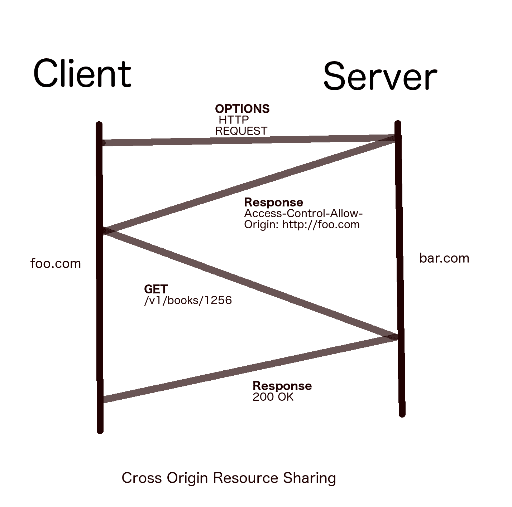
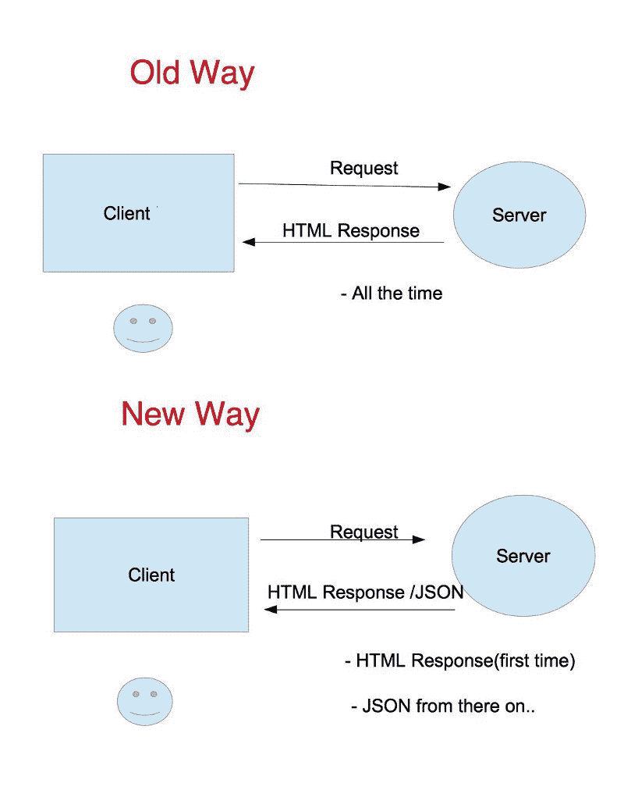
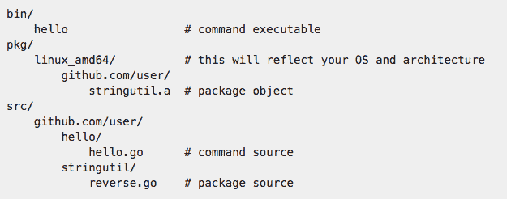
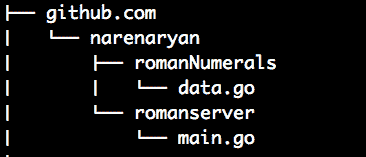
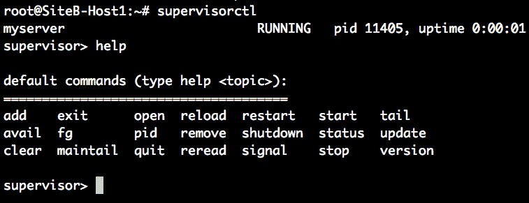
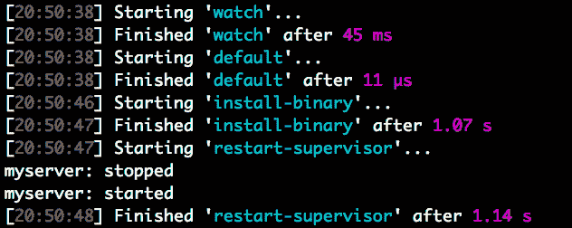

# 开始使用 REST API 开发

Web 服务是在不同计算机系统之间定义的通信机制。没有 Web 服务，自定义的点对点通信变得繁琐且特定于平台。这就像是网络需要理解和解释的一百种不同的东西。如果计算机系统与网络易于理解的协议相一致，那将是一个很大的帮助。

Web 服务是一种旨在支持网络上可互操作的机器对机器交互的软件系统，**万维网联盟**（**W3C**），[`www.w3.org/TR/ws-arch/`](https://www.w3.org/TR/ws-arch/)。

现在，简单来说，Web 服务是两个端点之间的通路，消息可以顺利传输。在这里，这种传输通常是单向的。两个独立的可编程实体也可以通过它们自己的 API 相互通信。两个人通过语言进行交流。两个应用程序通过**应用程序编程接口**（**API**）进行通信。

读者可能会想知道，在当前数字世界中 API 的重要性是什么？**物联网**（**IoT**）的兴起使 API 的使用比以往更加重要。对 API 的认识日益增长，每天都有数百个 API 在全球各地被开发和记录。一些重要的大型企业正在看到**作为服务的 API**（**AAAS**）的未来。一个明显的例子是**亚马逊网络服务**（**AWS**）。它在云世界取得了巨大的成功。开发人员使用 AWS 提供的 REST API 编写自己的应用程序。

一些更隐秘的用例来自像 Ibibo 和 Expedia 这样的旅行网站，它们通过调用第三方网关和数据供应商的 API 来获取实时价格。如今，Web 服务通常会收费。

本章将涵盖的主题包括：

+   可用的不同 Web 服务

+   详细介绍表现状态转移（REST）架构

+   介绍使用 REST 构建单页应用程序（SPA）

+   设置 Go 项目并运行开发服务器

+   为查找罗马数字构建我们的第一个服务

+   使用 Gulp 自动编译 Go 代码

# Web 服务的类型

随着时间的推移，出现了许多类型的 Web 服务。其中一些主要的是：

+   SOAP

+   UDDI

+   WSDL

+   REST

在这些中，**SOAP**在 2000 年代初变得流行，当时 XML 处于风口浪尖。各种分布式系统使用 XML 数据格式进行通信。SOAP 的实现过于复杂。SOAP 的批评者指出了 SOAP HTTP 请求的臃肿。

SOAP 请求通常由以下三个基本组件组成：

+   信封

+   头部

+   主体

仅仅执行一个 HTTP 请求和响应周期，我们就必须在 SOAP 中附加大量额外的数据。一个示例 SOAP 请求如下：

```go
POST /StockQuote HTTP/1.1
Host: www.stockquoteserver.com
Content-Type: text/xml; charset="utf-8"
Content-Length: nnnn
SOAPAction: "Some-URI"

<SOAP-ENV:Envelope
  xmlns:SOAP-ENV="http://schemas.xmlsoap.org/soap/envelope/"
  SOAP-ENV:encodingStyle="http://schemas.xmlsoap.org/soap/encoding/">
   <SOAP-ENV:Body>
       <m:GetLastTradePrice >
           <symbol>DIS</symbol>
       </m:GetLastTradePrice>
   </SOAP-ENV:Body>
</SOAP-ENV:Envelope>
```

这是来自 W3C 标准的 SOAP 的标准示例（[`www.w3.org/TR/2000/NOTE-SOAP-20000508/`](https://www.w3.org/TR/2000/NOTE-SOAP-20000508/)）。如果我们仔细观察，它是以 XML 格式呈现的，其中特殊标签指定了信封和主体。由于 XML 操作需要大量的命名空间来运行，额外的信息也会起作用。

# REST API

**表现状态转移**（**REST**）这个名字是由加利福尼亚大学的 Roy Fielding 创造的。与 SOAP 相比，它是一个非常简化和轻量级的 Web 服务。性能、可伸缩性、简单性、可移植性和可修改性是 REST 设计的主要原则。

REST API 允许不同的系统以非常简单的方式进行通信和发送/接收数据。每个 REST API 调用都与 HTTP 动词和 URL 之间存在关系。应用程序中的数据库资源可以与 REST 中的 API 端点进行映射。

当您在手机上使用移动应用时，您的手机可能会秘密地与许多云服务进行通信，以检索、更新或删除您的数据。REST 服务对我们的日常生活有着巨大的影响。

REST 是一个无状态、可缓存的、简单的架构，不是协议而是一种模式。

# REST 服务的特点

这些是使 REST 简单且与其前身相比独特的主要特性：

+   **基于客户端-服务器的架构：** 这种架构对于现代 Web 通过 HTTP 进行通信至关重要。单个客户端-服务器最初看起来可能很天真，但许多混合架构正在发展。我们将很快讨论更多这些内容。

+   **无状态：** 这是 REST 服务最重要的特点。REST HTTP 请求包含服务器理解和返回响应所需的所有数据。一旦请求被处理，服务器就不会记住请求是否在一段时间后到达。因此，操作将是无状态的。

+   **可缓存：** 许多开发人员认为技术堆栈阻碍了他们的 Web 应用程序或 API。但实际上，他们的架构才是原因。数据库可以成为 Web 应用程序中的潜在调优部分。为了很好地扩展应用程序，我们需要缓存内容并将其作为响应交付。如果缓存无效，我们有责任清除它。REST 服务应该被适当地缓存以进行扩展。

+   **按需脚本：** 您是否曾经设计过一个 REST 服务，该服务提供 JavaScript 文件并在运行时执行它们？这种按需代码也是 REST 可以提供的主要特点。从服务器请求脚本和数据更为常见。

+   **多层系统：** REST API 可以由多个服务器提供。一个服务器可以请求另一个服务器，依此类推。因此，当客户端发出请求时，请求和响应可以在多个服务器之间传递，最终向客户端提供响应。这种易于实现的多层系统对于保持 Web 应用程序松散耦合始终是一个良好的策略。

+   **资源的表示：** REST API 提供了统一的接口进行通信。它使用统一资源标识符（URI）来映射资源（数据）。它还具有请求特定数据格式作为响应的优势。互联网媒体类型（MIME 类型）可以告诉服务器请求的资源是特定类型的。

+   **实现自由：** REST 只是定义 Web 服务的一种机制。它是一种可以以多种方式实现的架构风格。由于这种灵活性，您可以按照自己的意愿创建 REST 服务。只要遵循 REST 的原则，您的服务器就有自由选择平台或技术。

周到的缓存对于 REST 服务的扩展至关重要。

# REST 动词和状态码

REST 动词指定要在特定资源或资源集合上执行的操作。当客户端发出请求时，应在 HTTP 请求中发送此信息：

+   REST 动词

+   头信息

+   正文（可选）

正如我们之前提到的，REST 使用 URI 来解码其要处理的资源。有许多 REST 动词可用，但其中六个经常被使用。它们如下：

+   `GET`

+   `POST`

+   `PUT`

+   `PATCH`

+   `DELETE`

+   `OPTIONS`

如果您是软件开发人员，您将大部分时间处理这六个。以下表格解释了操作、目标资源以及请求成功或失败时会发生什么：

| **REST 动词** | **操作** | **成功** | **失败** |
| --- | --- | --- | --- |
| `GET` | 从服务器获取记录或资源集 | 200 | 404 |
| `OPTIONS` | 获取所有可用的 REST 操作 | 200 | - |
| `POST` | 创建新的资源集或资源 | 201 | 404, 409 |
| `PUT` | 更新或替换给定的记录 | 200, 204 | 404 |
| `PATCH` | 修改给定的记录 | 200, 204 | 404 |
| `DELETE` | 删除给定的资源 | 200 | 404 |

前表中**成功**和**失败**列中的数字是 HTTP 状态码。每当客户端发起 REST 操作时，由于 REST 是无状态的，客户端应该知道如何找出操作是否成功。因此，HTTP 为响应定义了状态码。REST 为给定操作定义了前面的状态码类型。这意味着 REST API 应严格遵循前面的规则，以实现客户端-服务器通信。

所有定义的 REST 服务都具有以下格式。它由主机和 API 端点组成。API 端点是服务器预定义的 URL 路径。每个 REST 请求都应该命中该路径。

一个微不足道的 REST API URI：`http://HostName/API endpoint/Query(optional)`

让我们更详细地看一下所有的动词。REST API 设计始于操作和 API 端点的定义。在实现 API 之前，设计文档应列出给定资源的所有端点。在接下来的部分中，我们将使用 PayPal 的 REST API 作为一个用例，仔细观察 REST API 端点。

# GET

`GET`方法从服务器获取给定的资源。为了指定资源，`GET`使用了几种类型的 URI 查询：

+   查询参数

+   基于路径的参数

如果你不知道，你所有的网页浏览都是通过向服务器发出`GET`请求来完成的。例如，如果你输入[www.google.com](http://www.google.com)，你实际上是在发出一个`GET`请求来获取搜索页面。在这里，你的浏览器是客户端，而 Google 的 Web 服务器是 Web 服务的后端实现者。成功的`GET`操作返回一个 200 状态码。

路径参数的示例：

每个人都知道**PayPal**。PayPal 与公司创建结算协议。如果您向 PayPal 注册支付系统，他们会为您提供一个 REST API，以满足您所有的结算需求。获取结算协议信息的示例`GET`请求如下：`/v1/payments/billing-agreements/agreement_id`。

在这里，资源查询是通过路径参数进行的。当服务器看到这一行时，它会将其解释为*我收到了一个需要从结算协议中获取 agreement_id 的 HTTP 请求*。然后它会在数据库中搜索，转到`billing-agreements`表，并找到一个具有给定`agreement_id`的协议。如果该资源存在，它会发送详细信息以便在响应中复制（200 OK）。否则，它会发送一个响应，说明资源未找到（404）。

使用`GET`，你也可以查询资源列表，而不是像前面的例子那样查询单个资源。PayPal 的用于获取与协议相关的结算交易的 API 可以通过`/v1/payments/billing-agreements/transactions`获取。这一行获取了在该结算协议上发生的所有交易。在这两种情况下，数据以 JSON 响应的形式检索。响应格式应该事先设计好，以便客户端可以在协议中使用它。

查询参数的示例如下：

+   查询参数旨在添加详细信息，以从服务器识别资源。例如，以这个虚构的 API 为例。假设这个 API 是为了获取、创建和更新书籍的详细信息而创建的。基于查询参数的`GET`请求将采用这种格式：

```go
 /v1/books/?category=fiction&publish_date=2017
```

+   前面的 URI 有一些查询参数。该 URI 请求一本满足以下条件的书籍：

+   它应该是一本虚构的书

+   这本书应该在 2017 年出版

*获取所有在 2017 年出版的虚构书籍*是客户端向服务器提出的问题。

Path vs Query 参数——何时使用它们？一个常见的经验法则是，`Query` 参数用于基于查询参数获取多个资源。如果客户端需要具有精确 URI 信息的单个资源，可以使用 `Path` 参数来指定资源。例如，用户仪表板可以使用 `Path` 参数请求，并且可以使用 `Query` 参数对过滤数据进行建模。

在 `GET` 请求中，对于单个资源使用 `Path` 参数，对于多个资源使用 `Query` 参数。

# POST、PUT 和 PATCH

`POST` 方法用于在服务器上创建资源。在之前的书籍 API 中，此操作使用给定的详细信息创建新书籍。成功的 `POST` 操作返回 201 状态码。`POST` 请求可以更新多个资源：`/v1/books`。

`POST` 请求的主体如下：

```go
{"name" : "Lord of the rings", "year": 1954, "author" : "J. R. R. Tolkien"}
```

这实际上在数据库中创建了一本新书。为这条记录分配了一个 ID，以便当我们 `GET` 资源时，URL 被创建。因此，`POST` 应该只在开始时执行一次。事实上，*指环王* 是在 1955 年出版的。因此我们输入了错误的出版日期。为了更新资源，让我们使用 `PUT` 请求。

`PUT` 方法类似于 `POST`。它用于替换已经存在的资源。主要区别在于 `PUT` 是幂等的。`POST` 调用会创建两个具有相同数据的实例。但 `PUT` 会更新已经存在的单个资源：

```go
/v1/books/1256
```

带有如下 JSON 主体：

```go
{"name" : "Lord of the rings", "year": 1955, "author" : "J. R. R. Tolkien"}
```

`1256` 是书籍的 ID。它通过 `year:1955` 更新了前面的书籍。你注意到 `PUT` 的缺点了吗？它实际上用新的记录替换了整个旧记录。我们只需要更改一个列。但 `PUT` 替换了整个记录。这很糟糕。因此，引入了 `PATCH` 请求。

`PATCH` 方法类似于 `PUT`，只是它不会替换整个记录。`PATCH`，顾名思义，是对正在修改的列进行修补。让我们使用一个新的列名 `ISBN` 更新书籍 `1256`：

```go
/v1/books/1256
```

使用如下的 JSON 主体：

```go
{"isbn" : "0618640150"}
```

它告诉服务器，*搜索 ID 为 1256 的书籍。然后添加/修改此列的给定值*。

`PUT` 和 `PATCH` 都对成功返回 200 状态，对未找到返回 404。

# DELETE 和 OPTIONS

`DELETE` API 方法用于从数据库中删除资源。它类似于 `PUT`，但没有任何主体。它只需要资源的 ID 来删除。一旦资源被删除，后续的 `GET` 请求会返回 404 未找到状态。

对这种方法的响应*不可缓存*（如果实现了缓存），因为 `DELETE` 方法是幂等的。

`OPTIONS` API 方法是 API 开发中最被低估的。给定资源，该方法尝试了解服务器上定义的所有可能的方法（`GET`、`POST`等）。这就像在餐厅看菜单然后点菜一样（而如果你随机点一道菜，服务员会告诉你这道菜没有了）。在服务器上实现 `OPTIONS` 方法是最佳实践。从客户端确保首先调用 `OPTIONS`，如果该方法可用，然后继续进行。

# 跨域资源共享（CORS）

这个 `OPTIONS` 方法最重要的应用是**跨域资源共享**（**CORS**）。最初，浏览器安全性阻止客户端进行跨域请求。这意味着使用 URL [www.foo.com](http://www.foo.com) 加载的站点只能对该主机进行 API 调用。如果客户端代码需要从 [www.bar.com](http://www.bar.com) 请求文件或数据，那么第二个服务器 [bar.com](https://bar.com/) 应该有一种机制来识别 [foo.com](http://foo.com) 以获取其资源。

这个过程解释了 CORS：

1.  [foo.com](http://foo.com) 在 [bar.com](http://bar.com) 上请求 `OPTIONS` 方法。

1.  [bar.com](http://bar.com) 在响应客户端时发送了一个头部，如 `Access-Control-Allow-Origin: http://foo.com`。

1.  接下来，[foo.com](http://foo.com)可以访问[bar.com](https://bar.com/)上的资源，而不受任何限制，调用任何`REST`方法。

如果[bar.com](http://bar.com)感觉在一次初始请求后向任何主机提供资源，它可以将访问控制设置为*（即任何）。

以下是描述依次发生的过程的图表：



# 状态代码的类型

有几个状态代码家族。每个家族都全局解释了一个操作状态。该家族的每个成员可能有更深层的含义。因此，REST API 应该严格告诉客户端操作后到底发生了什么。有 60 多种状态代码可用。但对于 REST，我们集中在几个代码家族上。

# 2xx 家族（成功）

200 和 201 属于成功家族。它们表示操作成功。纯**200**（**操作成功**）是成功的 CRUD 操作：

+   **200**（**操作成功**）是 REST 中最常见的响应状态代码

+   **201**（**创建成功**）当`POST`操作成功在服务器上创建资源时返回

+   **204**（**无内容**）在客户端需要状态但不需要任何数据时发出

# 3xx 家族（重定向）

这些状态代码用于传达重定向消息。最重要的是**301**和**304**：

+   **301**在资源永久移动到新的 URL 端点时发出。当旧的 API 被弃用时，这是必不可少的。它返回响应中的新端点和 301 状态。通过查看这一点，客户端应该使用新的 URL 以响应实现其目标。

+   **304**状态代码表示内容已缓存，并且服务器上的资源未发生修改。这有助于在客户端缓存内容，并且仅在缓存被修改时请求数据。

# 4xx 家族（客户端错误）

这些是客户端需要解释和处理进一步操作的标准错误状态代码。这与服务器无关。错误的请求格式或格式不正确的 REST 方法可能会导致这些错误。其中，API 开发人员最常用的状态代码是**400**、**401**、**403**、**404**和**405**：

+   **400**（**错误请求**）当服务器无法理解客户端请求时返回。

+   **401**（**未经授权**）当客户端未在标头中发送授权信息时返回。

+   **403**（**禁止**）当客户端无法访问某种类型的资源时返回。

+   **404**（**未找到**）当客户端请求的资源不存在时返回。

+   **405**（**方法不允许**）如果服务器禁止资源上的一些方法，则返回。`GET`和`HEAD`是例外。

# 5xx 家族（服务器错误）

这些是来自服务器的错误。客户端请求可能是完美的，但由于服务器代码中的错误，这些错误可能会出现。常用的状态代码有**500**、**501**、**502**、**503**和**504**：

+   **500**（**内部服务器错误**）状态代码给出了由一些错误的代码或一些意外条件引起的开发错误

+   **501**（**未实现**）当服务器不再支持资源上的方法时返回

+   **502**（**错误网关**）当服务器本身从另一个服务供应商那里收到错误响应时返回

+   **503**（**服务不可用**）当服务器由于多种原因而关闭，如负载过重或维护时返回

+   **504**（**网关超时**）当服务器等待另一个供应商的响应时间过长，并且为客户端提供服务的时间太长时返回

有关状态代码的更多详细信息，请访问此链接：[`developer.mozilla.org/en-US/docs/Web/HTTP/Status`](https://developer.mozilla.org/en-US/docs/Web/HTTP/Status)

# REST API 与单页应用的崛起

您需要了解为什么**单页应用程序**（**SPA**）是当今的热门话题。这些 SPA 设计使开发人员以一种完全不同的方式编写代码，而不是以传统方式构建 UI（请求网页）。有许多 MVC 框架，如 AngularJS、Angular2、React JS、Knockout JS、Aurelia 等，可以快速开发 Web UI，但它们的本质都非常简单。所有 MVC 框架都帮助我们实现一种设计模式。这种设计模式是*不请求网页，只使用 REST API*。

自 2010 年以来，现代 Web 前端开发已经取得了很大进步。为了利用**Model-View-Controller**（**MVC**）架构的特性，我们需要将前端视为一个独立的实体，只使用 REST API（最好是 REST JSON）与后端进行通信。

# SPA 中的旧和新数据流的方式

所有网站都经历以下步骤：

1.  从服务器请求网页。

1.  验证并显示仪表板 UI。

1.  允许用户进行修改和保存。

1.  根据需要从服务器请求尽可能多的网页，以在站点上显示单独的页面。

但在 SPA 中，流程完全不同：

1.  一次性向浏览器请求 HTML 模板。

1.  然后，查询 JSON REST API 以填充模型（数据对象）。

1.  根据模型（JSON）中的数据调整 UI。

1.  当用户修改 UI 时，模型（数据对象）应该自动更改。例如，在 AngularJS 中，可以通过双向数据绑定实现。最后，可以随时进行 REST API 调用，通知服务器进行更改。

这样，通信只以 REST API 的形式进行。客户端负责逻辑地表示数据。这导致系统从**响应导向架构**（**ROA**）转移到**服务导向架构**（**SOA**）。请看下面的图表：



SPA 减少了带宽，并提高了站点的性能。

# 为什么选择 Go 进行 REST API 开发？

REST 服务在现代网络中是微不足道的。SOA（我们稍后会更详细地讨论）为 REST 服务创造了一个活动空间，将 Web 开发推向了一个新的水平。**Go**是谷歌公司推出的一种编程语言，用于解决他们所面临的更大的问题。自首次出现以来已经过去了八年多。它随着开发者社区的加入而不断成熟，并在其中创建了大规模的系统。

Go 是 Web 的宠儿。它以一种简单的方式解决了更大的问题。

人们可以选择 Python 或 JavaScript（Node）进行 REST API 开发。Go 的主要优势在于其速度和编译时错误检测。通过各种基准测试，Go 被证明在计算性能方面比动态编程语言更快。这就是公司应该使用 Go 编写其下一个 API 的三个原因：

+   为了扩展 API 以吸引更广泛的受众

+   为了使您的开发人员能够构建健壮的系统

+   为了投资未来项目的可行性

您可以查看关于 Go 的 REST 服务的不断进行的在线辩论以获取更多信息。在后面的章节中，我们将尝试构建设计和编写 REST 服务的基础知识。

# 设置项目并运行开发服务器

这是一本系列构建的书。它假设您已经了解 Go 的基础知识。如果没有，也没关系。您可以从 Go 的官方网站[`golang.org/`](https://golang.org/)快速入门并快速学习。Go 使用一种不同的开发项目的方式。编写一个独立的简单程序不会让您感到困扰。但是在学习了基础知识之后，人们会尝试进一步发展。因此，作为 Go 开发人员，您应该了解 Go 项目的布局方式以及保持代码清晰的最佳实践。

在继续之前，请确保已完成以下工作：

+   在您的计算机上安装 Go 编译器

+   设置`GOROOT`和`GOPATH`环境变量

有许多在线参考资料可以了解到前面的细节。根据你的机器类型（Windows、Linux 或 macOS X），设置一个可用的 Go 编译器。我们将在下一节中看到有关`GOPATH`的更多细节。

# 解密 GOPATH

`GOPATH`只是你的机器上当前指定的工作空间。它是一个环境变量，告诉 Go 编译器你的源代码、二进制文件和包的位置。

来自 Python 背景的程序员可能知道 Virtualenv 工具，可以同时创建多个项目（使用不同的 Python 解释器版本）。但在某个时间点，只能激活一个环境并开发自己的项目。同样，你可以在你的机器上有任意数量的 Go 项目。在开发时，将`GOPATH`设置为你的一个项目。Go 编译器现在激活了该项目。

在家目录下创建一个项目并设置`GOPATH`环境变量是一种常见的做法，就像这样：

```go
>mkdir /home/naren/myproject
export GOPATH=/home/naren/myproject
```

现在我们这样安装外部包：

```go
go get -u -v github.com/gorilla/mux
```

Go 将名为`mux`的项目复制到当前激活的项目`myproject`中。

对于 Go get，使用`-u`标志来安装外部包的更新依赖项，使用`-v`来查看安装的详细信息。

一个典型的 Go 项目具有以下结构，正如官方 Go 网站上所述：



让我们在深入研究之前先了解这个结构：

+   `bin`：存储我们项目的可运行二进制文件

+   `pkg`：包含包对象的目录；一个提供包方法的编译程序

+   `src`：项目源代码、测试和用户包的位置

在 Go 中，你导入到你的主程序中的所有包都有一个相同的结构，`github.com/user/project`。但是谁创建所有这些目录？开发者需要做吗？不需要。开发者的责任是为他/她的项目创建目录。这意味着他/她只创建`src/github.com/user/hello`目录。

当开发者运行以下命令时，如果之前不存在，将创建`bin`和`package`目录。`.bin`包含我们项目源代码的二进制文件，`.pkg`包含我们在 Go 程序中使用的所有内部和外部包：

```go
 go install github.com/user/project
```

# 构建我们的第一个服务-查找罗马数字

有了我们到目前为止建立的概念，让我们编写我们的第一个基本 REST 服务。这个服务从客户端获取数字范围（1-10），并返回其罗马字符串。非常原始，但比 Hello World 好。

**设计：**

我们的 REST API 应该从客户端获取一个整数，并返回罗马数字等价物。

API 设计文档的块可能是这样的：

| **HTTP 动词** | **路径** | **操作** | **资源** |
| --- | --- | --- | --- |
| `GET` | `/roman_number/2` | 显示 | `roman_number` |

**实施：**

现在我们将逐步实现前面的简单 API。

该项目的代码可在[`github.com/narenaryan/gorestful`](https://github.com/narenaryan/gorestful)上找到。

正如我们之前讨论的，你应该首先设置`GOPATH`。假设`GOPATH`是`/home/naren/go`。在以下路径中创建一个名为`romanserver`的目录。用你的 GitHub 用户名替换*narenaryan*（这只是属于不同用户的代码的命名空间）：

```go
mkdir -p $GOPATH/src/github.com/narenaryan/romanserver
```

我们的项目已经准备好了。我们还没有配置任何数据库。创建一个名为`main.go`的空文件：

```go
touch $GOPATH/src/github.com/narenaryan/romanserver/main.go
```

我们的 API 服务器的主要逻辑放在这个文件中。现在，我们可以创建一个作为我们主程序的数据服务的数据文件。再创建一个目录来打包罗马数字数据：

```go
mkdir $GOPATH/src/github.com/narenaryan/romanNumerals
```

现在，在`romanNumerals`目录中创建一个名为`data.go`的空文件。到目前为止，`src`目录结构看起来是这样的：



现在让我们开始向文件添加代码。为罗马数字创建数据：

```go
// data.go
package romanNumerals

var Numerals = map[int]string{
  10: "X",
  9: "IX",
  8: "VIII",
  7: "VII",
  6: "VI",
  5: "V",
  4: "IV",
  3: "III",
  2: "II",
  1: "I",
}
```

我们正在创建一个名为**Numerals**的映射。这个映射保存了将给定整数转换为其罗马等价物的信息。我们将把这个变量导入到我们的主程序中，以便为客户端的请求提供服务。

打开`main.go`并添加以下代码：

```go
// main.go
package main

import (
   "fmt"
   "github.com/narenaryan/romanNumerals"
   "html"
   "net/http"
   "strconv"
   "strings"
   "time"
)

func main() {
   // http package has methods for dealing with requests
   http.HandleFunc("/", func(w http.ResponseWriter, r *http.Request) {
       urlPathElements := strings.Split(r.URL.Path, "/")
       // If request is GET with correct syntax
       if urlPathElements[1] == "roman_number" {
           number, _ := strconv.Atoi(strings.TrimSpace(urlPathElements[2]))
           if number == 0 || number > 10 {
           // If resource is not in the list, send Not Found status
               w.WriteHeader(http.StatusNotFound)
               w.Write([]byte("404 - Not Found"))
           } else {
             fmt.Fprintf(w, "%q", html.EscapeString(romanNumerals.Numerals[number]))
           }
       } else {
           // For all other requests, tell that Client sent a bad request
           w.WriteHeader(http.StatusBadRequest)
           w.Write([]byte("400 - Bad request"))
       }
   })
 // Create a server and run it on 8000 port
   s := &http.Server{
     Addr: ":8000",
     ReadTimeout: 10 * time.Second,
     WriteTimeout: 10 * time.Second,
     MaxHeaderBytes: 1 << 20,
   }
   s.ListenAndServe()
}
```

始终使用 Go fmt 工具格式化你的 Go 代码。

用法示例：`go fmt github.com/narenaryan/romanserver`

现在，使用 Go 命令`install`安装这个项目：

```go
go install github.com/narenaryan/romanserver
```

这一步做了两件事：

+   编译包`romanNumerals`并将副本放在`$GOPATH/pkg`目录中

+   将二进制文件放入`$GOPATH/bin`

我们可以像这样运行前面的 API 服务器：

```go
$GOPATH/bin/romanserver
```

服务器正在`http://localhost:8000`上运行。现在我们可以使用像`浏览器`或`CURL`命令这样的客户端发出`GET`请求到 API。让我们用一个合适的 API`GET`请求来发出一个`CURL`命令。

请求一如下：

```go
curl -X GET "http://localhost:8000/roman_number/5" # Valid request
```

响应如下：

```go
HTTP/1.1 200 OK
Date: Sun, 07 May 2017 11:24:32 GMT
Content-Length: 3
Content-Type: text/plain; charset=utf-8

"V"
```

让我们尝试一些格式不正确的请求。

请求二如下：

```go
curl -X GET "http://localhost:8000/roman_number/12" # Resource out of range
```

响应如下：

```go
HTTP/1.1 404 Not Found
Date: Sun, 07 May 2017 11:22:38 GMT
Content-Length: 15
Content-Type: text/plain; charset=utf-8

404 - Not Found
```

请求三如下：

```go
curl -X GET "http://localhost:8000/random_resource/3" # Invalid resource
```

响应如下：

```go
"HTTP/1.1 400 Bad request
Date: Sun, 07 May 2017 11:22:38 GMT
Content-Length: 15
Content-Type: text/plain; charset=utf-8
400 - Bad request
```

我们的小罗马数字 API 正在做正确的事情。正确的状态码正在被返回。这是所有 API 开发者应该牢记的要点。客户端应该被告知为什么出了问题。

# 代码分解

我们一次性更新了空文件并启动了服务器。现在让我解释一下`main.go`文件的每一部分：

+   导入了一些包。`github.com/narenaryan/romanNumerals`是我们之前创建的数据服务。

+   `net/http`是我们用来处理 HTTP 请求的核心包，通过它的`HandleFunc`函数。该函数的参数是`http.Request`和`http.ResponseWriter`。这两个处理 HTTP 请求的请求和响应。

+   `r.URL.Path`是 HTTP 请求的 URL 路径。对于 CURL 请求，它是`/roman_number/5`。我们正在拆分这个路径，并使用第二个参数作为资源，第三个参数作为值来获取罗马数字。`Split`函数在一个名为`strings`的核心包中。

+   `Atoi`函数将字母数字字符串转换为整数。为了使用数字映射，我们需要将整数字符串转换为整数。`Atoi`函数来自一个名为`strconv`的核心包。

+   我们使用`http.StatusXXX`来设置响应头的状态码。`WriteHeader`和`Write`函数可用于在响应对象上分别写入头部和正文。

+   接下来，我们使用`&http`创建了一个 HTTP 服务器，同时初始化了一些参数，如地址、端口、超时等。

+   `time`包用于在程序中定义秒。它说，在 10 秒的不活动后，自动向客户端返回 408 请求超时。

+   `EscapeString`将特殊字符转义为有效的 HTML 字符。例如，Fran & Freddie's 变成了`Fran &amp; Freddie's&#34`。

+   最后，使用`ListenAndServe`函数启动服务器。它会一直运行你的 Web 服务器，直到你关闭它。

应该为 API 编写单元测试。在接下来的章节中，我们将看到如何对 API 进行端到端测试。

# 使用 supervisord 和 Gulp 实时重新加载应用程序

Gulp 是一个用于创建工作流的好工具。工作流是一个逐步的过程。它只是一个任务流程应用程序。你需要在你的机器上安装 NPM 和 Node。我们使用 Gulp 来监视文件，然后更新二进制文件并重新启动 API 服务器。听起来很酷，对吧？

监督程序是一个在应用程序被杀死时重新加载服务器的应用程序。一个进程 ID 将被分配给你的服务器。为了正确重新启动应用程序，我们需要杀死现有的实例并重新启动应用程序。我们可以用 Go 编写一个这样的程序。但为了不重复造轮子，我们使用一个叫做 supervisord 的流行程序。

# 使用 supervisord 监控你的 Go Web 服务器

有时，您的 Web 应用程序可能会因操作系统重新启动或崩溃而停止。每当您的 Web 服务器被终止时，supervisor 的工作就是将其重新启动。即使系统重新启动也无法将您的 Web 服务器从客户端中移除。因此，请严格使用 supervisord 来监控您的应用程序。

# 安装 supervisord

我们可以使用`apt-get`命令在 Ubuntu 16.04 上轻松安装 supervisord：

```go
sudo apt-get install -y supervisor
```

这将安装两个工具，`supervisor`和`supervisorctl`。`supervisorctl`用于控制 supervisord 并添加任务，重新启动任务等。

在 macOS X 上，我们可以使用`brew`命令安装`supervisor`：

```go
brew install supervisor
```

现在，在以下位置创建一个配置文件：

```go
/etc/supervisor/conf.d/goproject.conf
```

您可以添加任意数量的配置文件，supervisord 将它们视为独立的进程来运行。将以下内容添加到之前的文件中：

```go
[supervisord]
logfile = /tmp/supervisord.log
```

```go
[program:myserver]
command=$GOPATH/bin/romanserver
autostart=true
autorestart=true
redirect_stderr=true
```

默认情况下，我们在`/etc/supervisor/`目录下有一个名为`.supervisord.conf`的文件。查看它以获取更多参考信息。在 macOS X 中，相同的文件将位于`/usr/local/etc/supervisord.ini`。

关于之前的配置：

+   `[supervisord]`部分告诉 supervisord 的日志文件位置

+   **`[program:myserver]`**是任务块，它遍历到给定目录并执行给定的命令

现在我们可以要求我们的`supervisorctl`重新读取配置并重新启动任务（进程）。只需说：

+   `supervisorctl reread`

+   `supervisorctl update`

然后，使用以下命令启动`supervisorctl`：

```go
supervisorctl
```

您将看到类似于这样的内容：

`supervisorctl`是一个用于控制 supervisor 程序的强大工具。

由于我们在 supervisor 配置文件中将我们的 romanserver 命名为`myserver`，我们可以从`supervisorctl`启动，停止和重新启动该程序。

# 使用 Gulp 创建自动代码编译和服务器重新加载

在我们之前的章节中对 Gulp 进行了简要介绍，我们将编写一个 gulpfile 来告诉计算机执行一些任务。

我使用`npm`安装 Gulp 和 Gulp-shell：

```go
npm install gulp gulp-shell
```

之后，在项目的根目录中创建一个`gulpfile.js`。这里是`github.com/src/narenaryan/romanserver`。现在将以下内容添加到`gulpfile.js`。首先，每当文件更改时，将执行安装二进制任务。然后，supervisor 将被重新启动。监视任务会查找任何文件更改并执行之前的任务。我们还对任务进行排序，以便它们按顺序同步执行。所有这些任务都是 Gulp 任务，并且可以通过`gulp.task`函数定义。它接受两个参数，任务名称和任务。`sell.task`允许 Gulp 执行系统命令：

```go
var gulp = require("gulp");
var shell = require('gulp-shell');

// This compiles new binary with source change
gulp.task("install-binary", shell.task([
 'go install github.com/narenaryan/romanserver'
]));

// Second argument tells install-binary is a deapendency for restart-supervisor
gulp.task("restart-supervisor", ["install-binary"], shell.task([
 'supervisorctl restart myserver'
]))

gulp.task('watch', function() {
 // Watch the source code for all changes
 gulp.watch("*", ['install-binary', 'restart-supervisor']);

});

gulp.task('default', ['watch']);
```

现在，如果在`source`目录中运行`gulp`命令，它将开始监视您的源代码更改：

```go
gulp
```

现在，如果我们修改了代码，那么代码会被编译，安装，并且服务器会立即重新启动：



# 理解 gulpfile

在 gulpfile 中，我们执行以下指令：

1.  导入 Gulp 和 Gulp-shell。

1.  使用`shell.task`创建任务作为执行函数。

1.  `shell.task`可以执行命令行指令。将你的 shell 命令放在该函数内。

1.  为监视源文件添加一个监视任务。当文件被修改时，任务列表将被执行。

1.  为运行创建一个默认任务。为其添加一个监视。

Gulp 是这类用例的绝佳工具。因此，请仔细阅读 Gulp 的官方文档[`gulpjs.com/`](http://gulpjs.com/)。

# 总结

在本章中，我们介绍了 REST API。我们看到 REST 不是一个协议，而是一种架构模式。HTTP 是我们可以实现 REST 服务的实际协议。我们深入了解了 REST API 的基本原理，以便清楚地了解它们实际上是什么。然后我们探讨了 Web 服务的类型。在 REST 之前，我们有一个叫做 SOAP 的东西，它使用 XML 作为数据格式。REST 使用 JSON 作为主要格式。REST 有动词和状态码。我们了解了给定状态码指的是什么。我们构建了一个简单的服务，为给定的数字提供罗马数字。在这个过程中，我们还看到了如何打包一个 Go 项目。我们了解了 GOPATH 环境变量。它是 Go 中定义变量的工作空间。所有的包和项目都驻留在这个路径中。然后我们看到了如何使用 supervisord 和 Gulp 来实时重新加载开发项目。这些都是 Node 工具，但可以帮助我们保持我们的 Go 项目正常运行。

在下一章中，我们将深入研究 URL 路由。从内置路由器开始，我们将探索 Gorilla Mux，一个强大的 URL 路由库。
