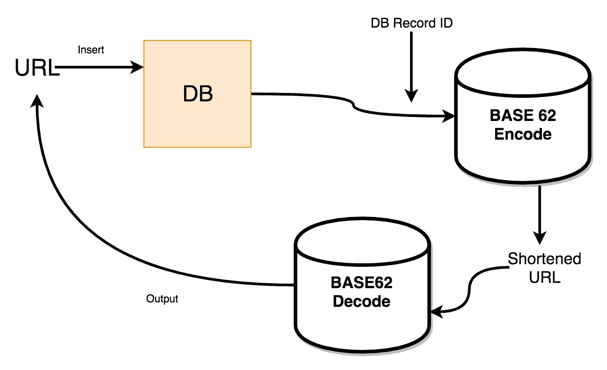

# 第二章：处理我们的 REST 服务的路由

在本章中，我们将讨论应用程序的路由。为了创建一个 API，第一步是定义路由。因此，为了定义路由，我们需要找出 Go 中可用的构造。我们从 Go 中的基本内部路由机制开始。然后，我们看看如何创建一个自定义的多路复用器。由于 ServeMux 的功能非常有限，我们将探索一些其他用于此目的的框架。本章还包括使用第三方库（如`httprouter`和`Gorilla Mux`）创建路由。我们将在整本书中构建一个 URL 缩短的 API。在本章中，我们为 API 定义路由。然后，我们讨论诸如 URL 的 SQL 注入之类的主题。Web 框架允许开发人员首先创建一个路由，然后将处理程序附加到它上。这些处理程序包含应用程序的业务逻辑。本章的关键是教会您如何使用`Gorilla Mux`在 Go 中创建 HTTP 路由。我们还讨论 URL 缩短服务的功能，并尝试设计一个逻辑实现。

我们将涵盖以下主题：

+   在 Go 中构建一个基本的 Web 服务器

+   理解 net/http 包

+   ServeMux，在 Go 中的基本路由器

+   理解 httprouter，一个路由器包

+   介绍 Gorilla Mux，一个强大的 HTTP 路由器

+   介绍 URL 缩短服务设计

# 获取代码

您可以从[`github.com/narenaryan/gorestful/tree/master/chapter2`](https://github.com/narenaryan/gorestful/tree/master/chapter2)下载本章的代码。欢迎添加评论和拉取请求。克隆代码并在`chapter2`目录中使用代码示例。

# 理解 Go 的 net/http 包

Go 的`net/http`包处理 HTTP 客户端和服务器的实现。在这里，我们主要关注服务器的实现。让我们创建一个名为`basicHandler.go`的小型 Go 程序，定义路由和一个函数处理程序：

```go
package main
import (
    "io"
    "net/http"
    "log"
)
// hello world, the web server
func MyServer(w http.ResponseWriter, req *http.Request) {
    io.WriteString(w, "hello, world!\n")
}
func main() {
    http.HandleFunc("/hello", MyServer)
    log.Fatal(http.ListenAndServe(":8000", nil))
}
```

这段代码做了以下几件事情：

1.  创建一个名为`/hello`的路由。

1.  创建一个名为`MyServer`的处理程序。

1.  每当请求到达路由（`/hello`）时，处理程序函数将被执行。

1.  向响应中写入`hello, world`。

1.  在端口`8000`上启动服务器。如果出现问题，`ListenAndServe`将返回**`error`**。因此，使用`log.Fatal`记录它。

1.  `http`包有一个名为**`HandleFunc`**的函数，使用它可以将 URL 映射到一个函数。

1.  这里，**`w`**是一个响应写入器。`ResponseWriter`接口被 HTTP 处理程序用来构造 HTTP 响应。

1.  `req`是一个请求对象，处理 HTTP 请求的所有属性和方法。

使用日志功能来调试潜在的错误。如果有错误，`ListenAndServe`函数会返回一个错误。

# 运行代码

我们可以将上述代码作为一个独立的程序运行。将上述程序命名为`basicHandler.go`。将其存储在任何您希望的位置，然后使用以下命令运行它：

```go
go run basicHandler.go
```

现在打开一个 shell 或浏览器来查看服务器的运行情况。在这里，我使用 CURL 请求：

```go
curl -X GET http://localhost:8000/hello
```

响应是：

```go
hello, world
```

Go 有一个处理请求和响应的不同概念。我们使用`io`库来写入响应。对于 Web 开发，我们可以使用模板自动填充细节。Go 的内部 URL 处理程序使用 ServeMux 多路复用器。

# ServeMux，在 Go 中的基本路由器

ServeMux 是一个 HTTP 请求多路复用器。我们在前面的部分中使用的`HandleFunc`实际上是 ServeMux 的一个方法。通过创建一个新的 ServeMux，我们可以处理多个路由。在此之前，我们还可以创建自己的多路复用器。多路复用器只是处理将路由与名为`ServeHTTP`的函数分离的逻辑。因此，如果我们创建一个具有`ServeHTTP`方法的新结构，它就可以完成这项工作。

将路由视为字典（映射）中的键，然后将处理程序视为其值。路由器从路由中找到处理程序，并尝试执行`ServeHTTP`函数。让我们创建一个名为`customMux.go`的程序，并看看这个实现的效果：

```go
package main
import (
    "fmt"
    "math/rand"
    "net/http"
)
// CustomServeMux is a struct which can be a multiplexer
type CustomServeMux struct {
}
// This is the function handler to be overridden
func (p *CustomServeMux) ServeHTTP(w http.ResponseWriter, r *http.Request) {
    if r.URL.Path == "/" {
        giveRandom(w, r)
        return
    }
    http.NotFound(w, r)
    return
}
func giveRandom(w http.ResponseWriter, r *http.Request) {
    fmt.Fprintf(w, "Your random number is: %f", rand.Float64())
}
func main() {
    // Any struct that has serveHTTP function can be a multiplexer
    mux := &CustomServeMux{}
    http.ListenAndServe(":8000", mux)
}
```

在这段代码中，我们创建了一个名为**`CustomServeMux`**的自定义结构，它将负责我们的路由。我们实现了一个名为**`ServeHTTP`**的函数，以便捕获请求并向其写入响应。通常使用`fmt`包来创建字符串。**`Fprinf`**将提供的参数组合成字符串。

在主函数中，我们创建了一个**`CustomServeMux`**的实例，并将其传递给`http`的`ListenAndServe`函数。`"math/rand"`是负责生成随机数的库。当我们讨论向 API 服务器添加身份验证时，这个基本的基础将对我们有所帮助。

# 运行代码

让我们发出一个 CURL 请求并查看各种路由的响应：

```go
go run customMux.go
```

现在，打开一个 shell 或浏览器来查看服务器的运行情况。在这里，我使用 CURL 请求：

```go
curl -X GET http://localhost:8000/
```

响应是：

```go
Your random number is: 0.096970
```

使用*Ctrl* + *C*或*Cmd* + *C*来停止您的 Go 服务器。如果您将其作为后台进程运行，请使用**`pgrep go`**来查找`processID`，然后使用`kill pid`来杀死它。

# 使用 ServeMux 添加多个处理程序

我们创建的前面的自定义 Mux 在具有不同功能的不同端点时可能会很麻烦。为了添加该逻辑，我们需要添加许多`if/else`条件来手动检查 URL 路由。我们可以实例化一个新的`ServeMux`并像这样定义许多处理程序：

```go
newMux := http.NewServeMux()

newMux.HandleFunc("/randomFloat", func(w http.ResponseWriter, r *http.Request) {
 fmt.Fprintln(w, rand.Float64())
})

newMux.HandleFunc("/randomInt", func(w http.ResponseWriter, r *http.Request) {
 fmt.Fprintln(w, rand.Int(100))
})
```

这段代码显示了如何创建一个 ServerMux 并将多个处理程序附加到它上。`randomFloat`和`randomInt`是我们为返回一个随机`float`和随机`int`创建的两个路由。现在我们可以将这个传递给`ListenAndServe`函数。`Intn(100)`从 0-100 的范围内返回一个随机整数。有关随机函数的更多详细信息，请访问[`golang.org`](http://golang.org)上的 Go 随机包页面。

```go
http.ListenAndServe(":8000", newMux)
```

完整的代码如下：

```go
package main
import (
    "fmt"
    "math/rand"
    "net/http"
)
func main() {
    newMux := http.NewServeMux()
    newMux.HandleFunc("/randomFloat", func(w http.ResponseWriter, r *http.Request) {
        fmt.Fprintln(w, rand.Float64())
    })
    newMux.HandleFunc("/randomInt", func(w http.ResponseWriter, r
*http.Request) {
        fmt.Fprintln(w, rand.Intn(100))
    })
    http.ListenAndServe(":8000", newMux)
}
```

# 运行代码

我们可以直接运行程序使用 run 命令：

```go
go run customMux.go
```

现在，让我们执行两个 CURL 命令并查看输出：

```go
curl -X GET http://localhost:8000/randomFloat
curl -X GET http://localhost:8000/randomInt
```

响应将是：

```go
0.6046602879796196
87
```

由于随机数生成器，您的响应可能会发生变化。

我们看到了如何使用基本的 Go 构造创建 URL 路由器。现在我们将看一下一些广泛被 Go 社区用于其 API 服务器的流行 URL 路由框架。

# 介绍 httprouter，一个轻量级的 HTTP 路由器

**httprouter**，顾名思义，将 HTTP 请求路由到特定的处理程序。与基本路由器相比，它具有以下特点：

+   允许在路由路径中使用变量

+   它匹配 REST 方法（`GET`，`POST`，`PUT`等）

+   不会影响性能

我们将在下一节中更详细地讨论这些特性。在那之前，有一些值得注意的点，使 httprouter 成为一个更好的 URL 路由器：

+   httprouter 与内置的`http.Handler`很好地配合

+   httprouter 明确表示一个请求只能匹配一个路由或没有

+   路由器的设计鼓励构建合理的、分层的 RESTful API

+   您可以构建高效的静态文件服务器

# 安装

要安装 httprouter，我们只需要运行`get`命令：

```go
go get github.com/julienschmidt/httprouter
```

所以，现在我们有了`httprouter`。我们可以在我们的源代码中引用这个库：

```go
import "github.com/julienschmidt/httprouter"
```

通过一个例子可以理解 httprouter 的基本用法。在这个例子中，让我们创建一个小型 API，从服务器获取有关文件和程序安装的信息。在直接进入程序之前，您应该知道如何在 Go 上执行系统命令。有一个叫做`os/exec`的包。它允许我们执行系统命令并将输出返回给程序。

```go
import "os/exec"
```

然后它可以在代码中被访问为这样：

```go
// arguments... means an array of strings unpacked as arguments in Go
cmd := exec.Command(command, arguments...)
```

**`exec.Command`**是一个接受命令和额外参数数组的函数。额外的参数是命令的选项或输入。它可以通过两种方式执行：

+   立即运行命令

+   启动并等待其完成

我们可以通过将`Stdout`附加到自定义字符串来收集命令的输出。获取该字符串并将其发送回客户端。代码在这里更有意义。让我们编写一个 Go 程序来创建一个 REST 服务，它可以做两件事：

+   获取 Go 版本

+   获取给定文件的文件内容

这个程序使用`Hhttprouter`创建服务。让我们将其命名为`execService.go`：

```go
package main
import (
        "bytes"
        "fmt"
        "log"
        "net/http"
        "os/exec"
        "github.com/julienschmidt/httprouter"
)
// This is a function to execute a system command and return output
func getCommandOutput(command string, arguments ...string) string {
        // args... unpacks arguments array into elements
        cmd := exec.Command(command, arguments...)
        var out bytes.Buffer
        var stderr bytes.Buffer
        cmd.Stdout = &out
        cmd.Stderr = &stderr
        err := cmd.Start()
        if err != nil {
                log.Fatal(fmt.Sprint(err) + ": " + stderr.String())
        }
        err = cmd.Wait()
        if err != nil {
                log.Fatal(fmt.Sprint(err) + ": " + stderr.String())
        }
        return out.String()
}
func goVersion(w http.ResponseWriter, r *http.Request, params httprouter.Params) {
        fmt.Fprintf(w, getCommandOutput("/usr/local/bin/go", "version"))
}
func getFileContent(w http.ResponseWriter, r *http.Request, params httprouter.Params) {
        fmt.Fprintf(w, getCommandOutput("/bin/cat",
params.ByName("name")))
}
func main() {
        router := httprouter.New()
        // Mapping to methods is possible with HttpRouter
        router.GET("/api/v1/go-version", goVersion)
        // Path variable called name used here
        router.GET("/api/v1/show-file/:name", getFileContent)
        log.Fatal(http.ListenAndServe(":8000", router))
}
```

# 程序解释

前面的程序试图使用`httprouter`**实现 REST 服务。**我们在这里定义了两个路由：

+   `/api/v1/go-version`

+   `/api/v1/show-file/:name`

这里的`:name`是路径参数。它表示显示名为 xyz 的文件的 API。基本的 Go 路由器无法处理这些参数，通过使用`httprouter`，我们还可以匹配 REST 方法。在程序中，我们匹配了`GET`请求。

在一个逐步的过程中，前面的程序：

+   导入了`httprouter`和其他必要的 Go 包

+   使用`httprouter`的`New()`方法创建了一个新的路由器

+   路由器有`GET`，`POST`，`DELETE`等方法

+   `GET`方法接受两个参数，`URL 路径表达式`和`处理程序函数`

+   这个路由器可以传递给 http 的`ListenAndServe`函数

+   现在，谈到处理程序，它们看起来与属于 ServeMux 的处理程序相似，但第三个参数称为**`httprouter.Params`**保存有关使用`GET`请求提供的所有参数的信息

+   我们定义了路径参数（URL 路径中的变量）称为`name`并在程序中使用它

+   `getCommandOutput`函数接受命令和参数并返回输出

+   第一个 API 调用 Go 版本并将输出返回给客户端

+   第二个 API 执行了文件的`cat`命令并将其返回给客户端

如果您观察代码，我使用了`/usr/local/bin/go`作为 Go 可执行文件位置，因为这是我 MacBook 上的 Go 编译器位置。在执行`exec.Command`时，您应该给出可执行文件的绝对路径。因此，如果您在 Ubuntu 机器或 Windows 上工作，请使用可执行文件的路径。在 Linux 机器上，您可以通过使用`$ which go`命令轻松找到。

现在在同一目录中创建两个新文件。这些文件将由我们的文件服务器程序提供。您可以在此目录中创建任何自定义文件进行测试：

`Latin.txt`：

```go
Lorem ipsum dolor sit amet, consectetuer adipiscing elit. Aenean commodo ligula eget dolor. Aenean massa. Cum sociis natoque penatibus et magnis dis parturient montes, nascetur ridiculus mus. Donec quam felis, ultricies nec, pellentesque eu, pretium quis, sem. Nulla consequat massa quis enim. Donec pede justo, fringilla vel, aliquet nec, vulputate eget, arcu.
```

`Greek.txt`：

```go
Οἱ δὲ Φοίνιϰες οὗτοι οἱ σὺν Κάδμῳ ἀπιϰόμενοι.. ἐσήγαγον διδασϰάλια ἐς τοὺς ῞Ελληνας ϰαὶ δὴ ϰαὶ γράμματα, οὐϰ ἐόντα πρὶν ῞Ελλησι ὡς ἐμοὶ δοϰέειν, πρῶτα μὲν τοῖσι ϰαὶ ἅπαντες χρέωνται Φοίνιϰες· μετὰ δὲ χρόνου προβαίνοντος ἅμα τῇ ϕωνῇ μετέβαλον ϰαὶ τὸν ϱυϑμὸν τῶν γραμμάτων. Περιοίϰεον δέ σϕεας τὰ πολλὰ τῶν χώρων τοῦτον τὸν χρόνον ῾Ελλήνων ῎Ιωνες· οἳ παραλαβόντες διδαχῇ παρὰ τῶν Φοινίϰων τὰ γράμματα, μεταρρυϑμίσαντές σϕεων ὀλίγα ἐχρέωντο, χρεώμενοι δὲ ἐϕάτισαν, ὥσπερ ϰαὶ τὸ δίϰαιον ἔϕερε ἐσαγαγόντων Φοινίϰων ἐς τὴν ῾Ελλάδα, ϕοινιϰήια ϰεϰλῆσϑαι.
```

现在使用此命令运行程序。这一次，我们不使用 CURL 命令，而是使用浏览器作为我们的`GET`输出。Windows 用户可能没有 CURL 作为首选应用程序。他们可以在开发 REST API 时使用像 postman 客户端这样的 API 测试软件。看一下以下命令：

```go
go run execService.go
```

第一个`GET`请求的输出如下：

```go
curl -X GET http://localhost:8000/api/v1/go-version
```

结果将是这样的：

```go
go version go1.8.3 darwin/amd64
```

第二个`GET`请求请求`Greek.txt`是：

```go
curl -X GET http://localhost:8000/api/v1/show-file/greek.txt
```

现在，我们将看到希腊语的文件输出如下：

```go
Οἱ δὲ Φοίνιϰες οὗτοι οἱ σὺν Κάδμῳ ἀπιϰόμενοι.. ἐσήγαγον διδασϰάλια ἐς τοὺς ῞Ελληνας ϰαὶ δὴ ϰαὶ γράμματα, οὐϰ ἐόντα πρὶν ῞Ελλησι ὡς ἐμοὶ δοϰέειν, πρῶτα μὲν τοῖσι ϰαὶ ἅπαντες χρέωνται Φοίνιϰες· μετὰ δὲ χρόνου προβαίνοντος ἅμα τῇ ϕωνῇ μετέβαλον ϰαὶ τὸν ϱυϑμὸν τῶν γραμμάτων. Περιοίϰεον δέ σϕεας τὰ πολλὰ τῶν χώρων τοῦτον τὸν χρόνον ῾Ελλήνων ῎Ιωνες· οἳ παραλαβόντες διδαχῇ παρὰ τῶν Φοινίϰων τὰ γράμματα, μεταρρυϑμίσαντές σϕεων ὀλίγα ἐχρέωντο, χρεώμενοι δὲ ἐϕάτισαν, ὥσπερ ϰαὶ τὸ δίϰαιον ἔϕερε ἐσαγαγόντων Φοινίϰων ἐς τὴν ῾Ελλάδα, ϕοινιϰήια ϰεϰλῆσϑαι.
```

# 在几分钟内构建简单的静态文件服务器

有时，作为 API 的一部分，我们应该提供静态文件。httprouter 的另一个应用是构建可扩展的文件服务器。这意味着我们可以构建自己的内容传递平台。一些客户端需要从服务器获取静态文件。传统上，我们使用 Apache2 或 Nginx 来实现这一目的。但是，从 Go 服务器内部，为了提供静态文件，我们需要通过类似这样的通用路由进行路由：

```go
/static/*
```

请参阅以下代码片段以了解我们的实现。想法是使用`http.Dir`方法加载文件系统，然后使用`httprouter`实例的**`ServeFiles` **函数。它应该提供给定公共目录中的所有文件。通常，静态文件保存在 Linux 机器上的文件夹**`/var/public/www` **中。由于我使用的是 OS X，我在我的主目录中创建了一个名为`static`的文件夹：

```go
mkdir /users/naren/static
```

现在，我复制了我们为上一个示例创建的`Latin.txt`和`Greek.txt`文件到之前的静态目录。在这样做之后，让我们为文件服务器编写程序。您会对`httprouter`的简单性感到惊讶。创建一个名为`fileserver.go`的程序：

```go
package main
import (
    "github.com/julienschmidt/httprouter"
    "log"
    "net/http"
)
func main() {
    router := httprouter.New()
    // Mapping to methods is possible with HttpRouter
    router.ServeFiles("/static/*filepath",
http.Dir("/Users/naren/static"))
    log.Fatal(http.ListenAndServe(":8000", router))
}
```

现在运行服务器并查看输出：

```go
go run fileserver.go
```

现在，让我们打开另一个终端并发送这个 CURL 请求：

```go
http://localhost:8000/static/latin.txt
```

现在，输出将是来自我们文件服务器的静态文件内容服务器：

```go
Lorem ipsum dolor sit amet, consectetuer adipiscing elit. Aenean commodo ligula eget dolor. Aenean massa. Cum sociis natoque penatibus et magnis dis parturient montes, nascetur ridiculus mus. Donec quam felis, ultricies nec, pellentesque eu, pretium quis, sem. Nulla consequat massa quis enim. Donec pede justo, fringilla vel, aliquet nec, vulputate eget, arcu.
```

# 介绍 Gorilla Mux，一个强大的 HTTP 路由器

Mux 代表多路复用器。同样，Gorilla Mux 是一个设计用于将 HTTP 路由（URL）多路复用到不同处理程序的多路复用器。处理程序是可以处理给定请求的函数。Gorilla Mux 是一个非常好的包，用于为我们的 Web 应用程序和 API 服务器编写美丽的路由。

Gorilla Mux 提供了大量选项来控制路由到您的 Web 应用程序的方式。它允许许多功能。其中一些是：

+   基于路径的匹配

+   基于查询的匹配

+   基于域的匹配

+   基于子域的匹配

+   反向 URL 生成

# 安装

安装 Mux 包非常简单。您需要在终端（Mac 和 Linux）中运行此命令：

```go
go get -u github.com/gorilla/mux
```

如果您收到任何错误，说`package github.com/gorilla/mux: cannot download, $GOPATH not set. For more details see--go help gopath`，请使用以下命令设置`$GOPATH`环境变量：

```go
export GOPATH=~/go
```

正如我们在上一章中讨论的，这意味着所有的包和程序都放在这个目录中。它有三个文件夹：`bin`，`pkg`和`src`。现在，将`GOPATH`添加到`PATH`变量中，以便使用已安装的 bin 文件作为没有`./executable`样式的系统实用程序。参考以下命令：

```go
PATH="$GOPATH/bin:$PATH"
```

这些设置会一直保留，直到您关闭计算机。因此，要使其成为永久更改，请将上述行添加到您的 bash 配置文件中：

```go
vi ~/.profile
(or)
vi ~/.zshrc 
```

现在，我们已经准备好了。假设 Gorilla Mux 已安装，请继续进行基本操作。

# Gorilla Mux 的基础知识

Gorilla Mux 允许我们创建一个新的路由器，类似于 httprouter。但是在两者之间，将处理程序函数附加到给定的 URL 路由的方式是不同的。如果我们观察一下，Mux 附加处理程序的方式类似于基本 ServeMux。与 httprouter 不同，它修改请求对象而不是使用附加参数将 URL 参数传递给处理程序函数。我们可以使用`Vars`方法访问参数。

我将从 Gorilla Mux 主页上的一个示例来解释它有多有用。创建一个名为`muxRouter.go`的文件，并添加以下代码：

```go
package main
import (
    "fmt"
    "log"
    "net/http"
    "time"
    "github.com/gorilla/mux"
)
// ArticleHandler is a function handler
func ArticleHandler(w http.ResponseWriter, r *http.Request) {
    // mux.Vars returns all path parameters as a map
    vars := mux.Vars(r)
    w.WriteHeader(http.StatusOK)
    fmt.Fprintf(w, "Category is: %v\n", vars["category"])
    fmt.Fprintf(w, "ID is: %v\n", vars["id"])
}
func main() {
    // Create a new router
    r := mux.NewRouter()
    // Attach a path with handler
    r.HandleFunc("/articles/{category}/{id:[0-9]+}", ArticleHandler)
    srv := &http.Server{
        Handler: r,
        Addr: "127.0.0.1:8000",
        // Good practice: enforce timeouts for servers you create!
        WriteTimeout: 15 * time.Second,
        ReadTimeout: 15 * time.Second,
    }
    log.Fatal(srv.ListenAndServe())
}
```

现在使用以下命令运行文件：

```go
go run muxRouter.go
```

通过以这种方式运行 CURL 命令，我们可以得到以下输出：

```go
curl http://localhost:8000/articles/books/123
Category is: books
ID is: 123
```

Mux 解析路径中的变量。通过调用`Vars`函数，可以使用解析的所有变量。不要陷入上述程序的自定义服务器细节中。只需观察 Mux 代码。我们将处理程序附加到 URL。我们将解析的变量写回 HTTP 响应。这一行很关键。在这里，`id`有一个正则表达式，表示`id`是一个数字（0-9），有一个或多个数字：

```go
r.HandleFunc("/articles/{category}/{id:[0-9]+}", ArticleHandler)
```

让我们称之为路由。有了这种模式匹配的灵活性，我们可以非常舒适地设计 RESTful API。

使用`http.StatusOK`写入响应的标头，以宣布 API 请求成功。同样，http 有许多状态代码，用于各种类型的 HTTP 请求。使用适当的状态代码传达正确的消息。例如，404 - 未找到，500 - 服务器错误，等等。

# 反向映射 URL

简单地说，反向映射 URL 就是获取 API 资源的 URL。当我们需要分享链接到我们的 Web 应用程序或 API 时，反向映射非常有用。但是为了从数据中创建 URL，我们应该将`Name`与 Mux 路由关联起来：

```go
r.HandlerFunc("/articles/{category}/{id:[0-9]+}", ArticleHandler).
  Name("articleRoute")
```

现在，如果我们有数据，我们可以形成一个 URL：

```go
url, err := r.Get("articleRoute").URL("category", "books", "id", "123")
fmt.Printf(url.URL) // prints /articles/books/123
```

Gorilla Mux 在创建自定义路由方面提供了很大的灵活性。它还允许方法链接以向创建的路由添加属性。

# 自定义路径

我们可以分两步定义前面的路由：

+   首先，在路由器上定义路径：

```go
      r := mux.NewRouter()
```

+   接下来，在路由器上定义处理程序：

```go
      r.Path("/articles/{category}/{id:[0-  9]+}").HandlerFunc(ArticleHandler) //chaining is possible
```

请注意，此处链接的方法是`HandlerFunc`而不是前面代码中显示的`HandleFunc`。我们可以使用`Subrouter`在 Mux 中轻松创建顶级路径并为不同的处理程序添加子路径：

```go
r := mux.NewRouter()
s := r.PathPrefix("/articles").Subrouter()
s.HandleFunc("{id}/settings", settingsHandler)
s.HandleFunc("{id}/details", detailsHandler)
```

因此，形式为`http://localhost:8000/articles/123/settings`的所有 URL 将重定向到`settingsHandler`，形式为`http://localhost:8000/articles/123/details`的所有 URL 将重定向到**`detailsHandler`**。当我们为特定 URL 路径创建命名空间时，这可能非常有用。

# 路径前缀

**路径前缀**是在定义路径之后进行匹配的通配符。一般用例是当我们从静态文件夹中提供文件并且所有 URL 都应该按原样提供时。从官方 Mux 文档中，我们可以用它来提供静态文件。这是使用`httprouter`在前面的程序中创建的静态文件服务器的 Mux 版本：

```go
r.PathPrefix("/static/").Handler(http.StripPrefix("/static/", http.FileServer(http.Dir("/tmp/static"))))
```

这可以提供目录中的所有类型的文件：

```go
http://localhost:8000/static/js/jquery.min.js 
```

# Strict Slash

Strict Slash 是 Mux 路由器上的一个参数，可以让路由器将带有尾随斜杠的 URL 路由重定向到没有尾随斜杠的路由。例如，**`/articles/`**可以是原始路径，但带有`/path`的路由将被重定向到原始路径：

```go
r := mux.NewRouter() 
r.StrictSlash(true)
r.Path("/articles/").Handler(ArticleHandler)
```

如果将`StrictSlash`参数设置为`true`，此 URL 将重定向到前面的`ArticleHandler`：

```go
http://localhost:8000/articles
```

# 编码路径

我们可以从一些客户端获取编码路径。为了处理这些编码路径，Mux 提供了一个名为**`UseEncodedPath`**的方法。如果我们在路由器变量上调用此方法，甚至可以匹配编码的 URL 路由并将其转发给给定的处理程序：

```go
r := NewRouter() 
r.UseEncodedPath()
r.NewRoute().Path("/category/id")
```

这可以匹配 URL：

```go
http://localhost:8000/books/1%2F2
```

`%2F`代表未编码形式中的`/`。如果不使用`UseEncodedPath`方法，路由器可能会将其理解为`/v1/1/2`。

# 基于查询的匹配

查询参数是与 URL 一起传递的参数。这是我们通常在 REST `GET`请求中看到的。Gorilla Mux 可以创建一个路由，用于匹配具有给定查询参数的 URL：

```go
http://localhost:8000/articles/?id=123&category=books
```

让我们给我们的程序添加功能：

```go
// Add this in your main program
r := mux.NewRouter()
r.HandleFunc("/articles", QueryHandler)
r.Queries("id", "category")
```

它限制了前面 URL 的查询。`id`和`category`与`Queries`列表匹配。参数允许为空值。`QueryHandler`如下所示。您可以使用`request.URL.Query()`在处理程序函数中获取查询参数：

```go
func QueryHandler(w http.ResponseWriter, r *http.Request){
  queryParams := r.URL.Query()
  w.WriteHeader(http.StatusOK)
  fmt.Fprintf(w, "Got parameter id:%s!\n", queryParams["id"])
  fmt.Fprintf(w, "Got parameter category:%s!", queryParams["category"])
}
```

# 基于主机的匹配

有时我们需要允许来自特定主机的请求。如果主机匹配，则请求将继续传递到路由处理程序。如果我们有多个域和子域并将它们与自定义路由匹配，这可能非常有用。

使用路由器变量上的`Host`方法，我们可以调节从哪些主机重定向路由：

```go
r := mux.NewRouter()
r.Host("aaa.bbb.ccc")
r.HandleFunc("/id1/id2/id3", MyHandler)
```

如果我们设置了这个，来自`aaa.bbb.ccc`主机的形式为`http://aaa.bbb.ccc/111/222/333`的所有请求将被匹配。类似地，我们可以使用`Schemes`来调节 HTTP 方案（http，https）和使用`Methods` Mux 函数来调节 REST 方法（`GET`，`POST`）。程序`queryParameters.go`解释了如何在处理程序中使用查询参数：

```go
package main
import (
    "fmt"
    "log"
    "net/http"
    "time"
    "github.com/gorilla/mux"
)
func QueryHandler(w http.ResponseWriter, r *http.Request) {
    // Fetch query parameters as a map
    queryParams := r.URL.Query()
    w.WriteHeader(http.StatusOK)
    fmt.Fprintf(w, "Got parameter id:%s!\n", queryParams["id"][0])
    fmt.Fprintf(w, "Got parameter category:%s!",
queryParams["category"][0])
}
func main() {
    // Create a new router
    r := mux.NewRouter()
    // Attach a path with handler
    r.HandleFunc("/articles", QueryHandler)
    r.Queries("id", "category")
    srv := &http.Server{
        Handler: r,
        Addr: "127.0.0.1:8000",
        // Good practice: enforce timeouts for servers you create!
        WriteTimeout: 15 * time.Second,
        ReadTimeout: 15 * time.Second,
    }
    log.Fatal(srv.ListenAndServe())
}
```

输出如下：

```go
go run queryParameters.go
```

让我们在终端中以这种格式发送一个 CURL 请求：

```go
curl -X GET http://localhost:8000/articles\?id\=1345\&category\=birds
```

我们需要在 shell 中转义特殊字符。如果在浏览器中，转义就没有问题。输出如下：

```go
Got parameter id:1345! 
Got parameter category:birds!
```

**`r.URL.Query()` **函数返回一个带有所有参数和值对的映射。它们基本上是字符串，为了在我们的程序逻辑中使用它们，我们需要将数字字符串转换为整数。我们可以使用 Go 的`strconv`包将字符串转换为整数，反之亦然。

其模式匹配功能和简单性使 Gorilla Mux 成为项目中 HTTP 路由器的热门选择。全球许多成功的项目已经在其路由需求中使用 Mux。

# URL 中的 SQL 注入及避免它们的方法

SQL 注入是使用恶意脚本攻击数据库的过程。如果我们在编写安全的 URL 路由时不小心，可能会存在 SQL 注入的机会。这些攻击通常发生在`POST`，`PUT`和`DELETE` HTTP 动词中。例如，如果我们允许客户端向服务器传递变量，那么攻击者有机会向这些变量附加一个字符串。如果我们直接将这些发送参数的用户插入到 SQL 查询中，那么它可能是可注入的。与数据库交谈的正确方式是允许驱动程序函数在插入字符串并在数据库中执行之前检查参数：

```go
username := r.Form.Get("id")
password := r.Form.Get("category")
sql := "SELECT * FROM article WHERE id='" + username + "' AND category='" + password + "'"
Db.Exec(sql)
```

在这个片段中，我们试图通过 id 和类别获取有关文章的信息。我们正在执行一个 SQL 查询。但由于我们直接附加值，我们可能在查询中包含恶意的 SQL 语句，如（`--`）注释和（`ORDER BY n`）范围子句：

```go
?category=books&id=10 ORDER BY 10--
```

这将泄漏表中的列信息。我们可以更改数字并查看我们从数据库收到错误消息的断点：

```go
Unknown column '10' in 'order clause'
```

我们将在接下来的章节中了解更多信息，我们将在其中使用其他方法构建完整的 REST 服务，如`POST`，`PUT`等：

现在，如何避免这些注入。有几种方法：

+   将用户级别权限设置为各种表

+   在使用 URL 参数时，仔细观察模式

+   使用 Go 的`text/template`包中的**`HTMLEscapeString`**函数来转义 API 参数中的特殊字符，如`body`和`path`

+   使用驱动程序代替执行原始 SQL 查询

+   停止数据库调试消息传回客户端

+   使用`sqlmap`等安全工具查找漏洞

# 为 URL 缩短服务创建基本的 API 布局

您是否曾经想过 URL 缩短服务是如何工作的？它们将一个非常长的 URL 转换为一个缩短、简洁和易记的 URL 提供给用户。乍一看，它看起来像魔术，但实际上是一个简单的数学技巧。

简而言之，URL 缩短服务建立在两个基础上：

+   一种字符串映射算法，将长字符串映射到短字符串（Base 62）

+   一个简单的 Web 服务器，将短 URL 重定向到原始 URL

URL 缩短有一些明显的优势：

+   用户可以记住 URL；易于维护

+   用户可以在文本长度有限的链接上使用，例如 Twitter

+   可预测的缩短 URL 长度

看一下下面的图表：



在 URL 缩短服务中，这些事情在幕后默默发生：

+   获取原始 URL。

+   对其应用 Base62 编码。它会生成一个缩短的 URL。

+   将该 URL 存储在数据库中。将其映射到原始 URL（`[shortened_url: orignial_url]`）。

+   每当请求到达缩短的 URL 时，只需对原始 URL 进行 HTTP 重定向。

我们将在接下来的章节中实现完整的逻辑，当我们将数据库集成到我们的 API 服务器时，但在那之前，我们应该指定 API 设计文档。让我们来做。看一下下表：

| **URL** | **REST 动词** | **动作** | **成功** | 失败 |
| --- | --- | --- | --- | --- |
| `/api/v1/new` | `POST` | 创建缩短的 URL | 200 | 500, 404 |
| `/api/v1/:url` | `GET` | 重定向到原始 URL | 301 | 404 |

作为练习，读者可以根据我们迄今为止建立的基础来实现这一点。您可以使用一个虚拟的 JSON 文件，而不是像我们在第一章中所做的那样使用数据库。无论如何，我们将在接下来的章节中实现这一点。

# 摘要

在本章中，我们首先介绍了 HTTP 路由器。我们尝试使用 Go 的 http 包构建了一个基本的应用程序。然后我们简要讨论了 ServeMux，并举例说明。我们看到了如何向多个路由添加多个处理程序。然后我们介绍了一个轻量级的路由器包，名为`httprouter`。`httprouter`允许开发人员创建可扩展的路由，还可以选择解析 URL 路径中传递的参数。我们还可以使用`httprouter`在 HTTP 上提供文件。我们构建了一个小型服务来获取 Go 版本和文件内容（只读）。该示例可以扩展到任何系统信息。

接下来，我们介绍了流行的 Go 路由库：`Gorilla Mux`。我们讨论了它与`httprouter`的不同之处，并通过实现实例来探索其功能。我们解释了如何使用`Vars`来获取路径参数和使用`r.URL.Query`来解析查询参数。然后我们讨论了 SQL 注入以及它如何在我们的应用程序中发生。我们给出了一些建议，以避免它。当我们构建一个包含数据库的完整 REST 服务时，我们将在即将到来的章节中看到这些措施。最后，我们制定了 URL 缩短的逻辑，并创建了一个 API 设计文档。

在下一章中，我们将介绍`中间件`函数，它们充当 HTTP 请求和响应的篡改者。这种现象将帮助我们即时修改 API 响应。下一章还涉及`RPC`（远程过程调用）。
