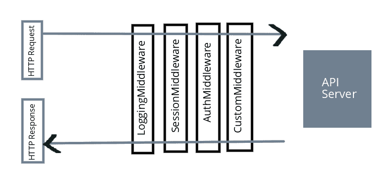
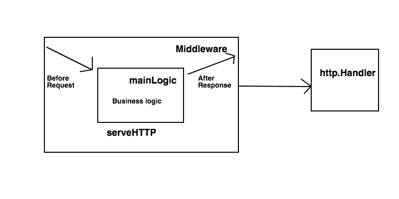
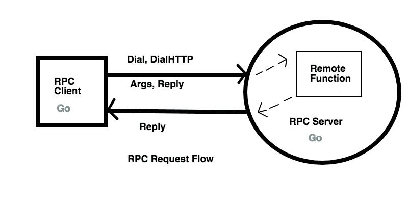

# 第三章：使用中间件和 RPC 进行工作

在本章中，我们将研究中间件功能。什么是中间件，我们如何从头开始构建它？接下来，我们将转向为我们编写的更好的中间件解决方案，称为 Gorilla Handlers。然后，我们将尝试理解中间件可以帮助的一些用例。之后，我们将开始使用 Go 的内部 RPC 和 JSON RPC 构建我们的 RPC 服务。然后我们将转向一个高级的 RPC 框架，如 Gorilla HTTP RPC。

本章涵盖的主题有：

+   什么是中间件？

+   什么是 RPC（远程过程调用）？

+   我们如何在 Go 中实现 RPC 和 JSON RPC？

# 获取代码

本章的所有代码都可以在[`github.com/narenaryan/gorestful/tree/master/chapter3`](https://github.com/narenaryan/gorestful/tree/master/chapter3)找到。请参考第一章，*开始 REST API 开发*，以设置 Go 项目并运行程序。最好从 GitHub 克隆整个`gorestful`存储库。

# 什么是中间件？

中间件是一个钩入服务器请求/响应处理的实体。中间件可以在许多组件中定义。每个组件都有特定的功能要执行。每当我们为我们的 URL 模式定义处理程序（就像在上一章中那样），请求会命中处理程序并执行业务逻辑。因此，几乎所有中间件都应按顺序执行这些功能：

1.  在命中处理程序（函数）之前处理请求

1.  处理处理程序函数

1.  在将其提供给客户端之前处理响应

我们可以看到以可视化形式呈现的先前的要点：



如果我们仔细观察图表，请求的旅程始于客户端。在没有中间件的应用程序中，请求到达 API 服务器，并将由某个函数处理程序处理。响应立即从服务器发送回来，客户端接收到它。但在具有中间件的应用程序中，它通过一系列阶段，如日志记录、身份验证、会话验证等，然后继续到业务逻辑。这是为了过滤错误的请求，防止其与业务逻辑交互。最常见的用例有：

+   使用记录器记录每个请求命中 REST API

+   验证用户会话并保持通信活动

+   如果用户未经身份验证，则对用户进行身份验证

+   编写自定义逻辑以获取请求数据

+   在为客户端提供服务时附加属性到响应

借助中间件，我们可以将诸如身份验证之类的杂务工作保持在适当的位置。让我们创建一个基本的中间件并在 Go 中篡改 HTTP 请求。

当需要为每个请求或 HTTP 请求子集执行一段代码时，应该定义中间件函数。如果没有它们，我们需要在每个处理程序中重复逻辑。

# 创建基本中间件

构建中间件简单而直接。让我们根据第二章所学的知识构建一个程序。如果您对闭包函数不熟悉，闭包函数返回另一个函数。这个原则帮助我们编写中间件。我们应该做的第一件事是实现一个满足 http.Handler 接口的函数。

一个名为`closure.go`的示例闭包如下：

```go
package main
import (
    "fmt"
)
func main() {
    numGenerator := generator()
    for i := 0; i < 5; i++ {
        fmt.Print(numGenerator(), "\t")
    }
}
// This function returns another function
func generator() func() int {
    var i = 0
    return func() int {
        i++
        return i
    }
}
```

如果我们运行这段代码：

```go
go run closure.go
```

数字将使用制表符生成并打印：

```go
1 2 3 4 5
```

我们正在创建一个名为 generator 的闭包函数，并调用它以获取一个新的数字。生成器模式根据给定条件每次生成一个新项。返回的内部函数是一个匿名函数，没有参数，一个整数类型的返回类型。在外部函数中定义的变量`i`可用于匿名函数，使其在将来计算逻辑时有用。闭包的另一个很好的示例应用是创建一个计数器。您可以通过遵循前面代码中应用的相同逻辑来实现它。

在 Go 中，外部函数的函数签名应该与匿名函数的函数签名完全匹配。在前面的例子中，`func() int`是外部和内部函数的签名。

这个例子是为了理解闭包在 Go 中是如何工作的。现在，让我们使用这个概念来组合我们的第一个中间件：

```go
package main
import (
    "fmt"
    "net/http"
)
func middleware(handler http.Handler) http.Handler {
    return http.HandlerFunc(func(w http.ResponseWriter, r *http.Request) {
        fmt.Println("Executing middleware before request phase!")
        // Pass control back to the handler
        handler.ServeHTTP(w, r)
        fmt.Println("Executing middleware after response phase!")
    })
}
func mainLogic(w http.ResponseWriter, r *http.Request) {
    // Business logic goes here
    fmt.Println("Executing mainHandler...")
    w.Write([]byte("OK"))
}
func main() {
    // HandlerFunc returns a HTTP Handler
    mainLogicHandler := http.HandlerFunc(mainLogic)
    http.Handle("/", middleware(mainLogicHandler))
    http.ListenAndServe(":8000", nil)
}
```

让我们运行代码：

```go
go run customMiddleware.go
```

如果您使用 CURL 请求或在浏览器中查看`http://localhost:8000`，控制台将收到此消息：

```go
Executing middleware before request phase!
Executing mainHandler...
Executing middleware after response phase!
```

如果您观察之前提供的中间件示意图，请求阶段由右箭头指向，响应是左箭头。这个程序实际上是最右边的矩形，也就是`CustomMiddleware`。

简单来说，前面的程序可以分解为这样：

+   通过将主处理程序函数（`mainLogic`）传递给`http.HandlerFunc()`来创建一个处理程序函数。

+   创建一个接受处理程序并返回处理程序的中间件函数。

+   方法`ServeHTTP`允许处理程序执行处理程序逻辑，即`mainLogic`。

+   `http.Handle`函数期望一个 HTTP 处理程序。考虑到这一点，我们以这样一种方式包装我们的逻辑，最终返回一个处理程序，但执行被修改了。

+   我们将主处理程序传递给中间件。然后中间件接管并返回一个函数，同时将主处理程序逻辑嵌入其中。这样，所有发送到处理程序的请求都会通过中间件逻辑。

+   打印语句的顺序解释了请求的过程。

+   最后，我们在`8000`端口上提供服务器。

像 Martini、Gin 这样的 Go Web 框架默认提供中间件。我们将在接下来的章节中了解更多关于它们的内容。对于开发人员来说，了解中间件的底层细节是很有益的。

以下的图表可以帮助您理解中间件中逻辑流程的发生：



# 多个中间件和链接

在前面的部分，我们构建了一个单个中间件，在请求到达处理程序之前或之后执行操作。也可以链接一组中间件。为了做到这一点，我们应该遵循与前一部分相同的闭包逻辑。让我们创建一个用于保存城市详细信息的城市 API。为了简单起见，API 将只有一个 POST 方法，主体包括两个字段：城市名称和城市面积。

让我们考虑一个场景，API 开发人员只允许客户端使用 JSON 媒体类型，并且需要为每个请求将服务器时间以 UTC 格式发送回客户端。使用中间件，我们可以做到这一点。

两个中间件的功能是：

+   在第一个中间件中，检查内容类型是否为 JSON。如果不是，则不允许请求继续进行。

+   在第二个中间件中，向响应 cookie 添加一个名为 Server-Time（UTC）的时间戳

首先，让我们创建`POST` API：

```go
package main

 import (
     "encoding/json"
     "fmt"
     "net/http"
 )

 type city struct {
     Name string
     Area uint64
 }

 func mainLogic(w http.ResponseWriter, r *http.Request) {
     // Check if method is POST
     if r.Method == "POST" {
         var tempCity city
         decoder := json.NewDecoder(r.Body)
         err := decoder.Decode(&tempCity)
         if err != nil {
             panic(err)
         }
         defer r.Body.Close()
         // Your resource creation logic goes here. For now it is plain print to console
         fmt.Printf("Got %s city with area of %d sq miles!\n", tempCity.Name, tempCity.Area)
         // Tell everything is fine
         w.WriteHeader(http.StatusOK)
         w.Write([]byte("201 - Created"))
     } else {
         // Say method not allowed
         w.WriteHeader(http.StatusMethodNotAllowed)
         w.Write([]byte("405 - Method Not Allowed"))
     }
 }

 func main() {
     http.HandleFunc("/city", mainLogic)
     http.ListenAndServe(":8000", nil)
 }
```

如果我们运行这个：

```go
go run cityAPI.go
```

然后给一个 CURL 请求：

```go
curl -H "Content-Type: application/json" -X POST http://localhost:8000/city -d '{"name":"New York", "area":304}'

curl -H "Content-Type: application/json" -X POST http://localhost:8000/city -d '{"name":"Boston", "area":89}'
```

Go 给了我们以下内容：

```go
Got New York city with area of 304 sq miles!
Got Boston city with area of 89 sq miles!
```

CURL 的响应将是：

```go
201 - Created
201 - Created
```

为了链接，我们需要在多个中间件之间传递处理程序。

以下是简单步骤中的程序：

+   我们创建了一个允许 POST 方法的 REST API。它还不完整，因为我们没有将数据存储到数据库或文件中。

+   我们导入了`json`包，并用它解码了客户端提供的 POST 主体。接下来，我们创建了一个映射 JSON 主体的结构。

+   然后，JSON 被解码并将信息打印到控制台。

在前面的例子中只涉及一个处理程序。但是，对于即将到来的任务，想法是将主处理程序传递给多个中间件处理程序。完整的代码看起来像这样：

```go
package main
import (
    "encoding/json"
    "log"
    "net/http"
    "strconv"
    "time"
)
type city struct {
    Name string
    Area uint64
}
// Middleware to check content type as JSON
func filterContentType(handler http.Handler) http.Handler {
    return http.HandlerFunc(func(w http.ResponseWriter, r *http.Request) {
        log.Println("Currently in the check content type middleware")
        // Filtering requests by MIME type
        if r.Header.Get("Content-type") != "application/json" {
            w.WriteHeader(http.StatusUnsupportedMediaType)
            w.Write([]byte("415 - Unsupported Media Type. Please send JSON"))
            return
        }
        handler.ServeHTTP(w, r)
    })
}
// Middleware to add server timestamp for response cookie
func setServerTimeCookie(handler http.Handler) http.Handler {
    return http.HandlerFunc(func(w http.ResponseWriter, r *http.Request) {
        handler.ServeHTTP(w, r)
        // Setting cookie to each and every response
        cookie := http.Cookie{Name: "Server-Time(UTC)", Value: strconv.FormatInt(time.Now().Unix(), 10)}
        http.SetCookie(w, &cookie)
        log.Println("Currently in the set server time middleware")
    })
}
func mainLogic(w http.ResponseWriter, r *http.Request) {
    // Check if method is POST
    if r.Method == "POST" {
        var tempCity city
        decoder := json.NewDecoder(r.Body)
        err := decoder.Decode(&tempCity)
        if err != nil {
            panic(err)
        }
        defer r.Body.Close()
        // Your resource creation logic goes here. For now it is plain print to console
        log.Printf("Got %s city with area of %d sq miles!\n", tempCity.Name, tempCity.Area)
        // Tell everything is fine
        w.WriteHeader(http.StatusOK)
        w.Write([]byte("201 - Created"))
    } else {
        // Say method not allowed
        w.WriteHeader(http.StatusMethodNotAllowed)
        w.Write([]byte("405 - Method Not Allowed"))
    }
}
func main() {
    mainLogicHandler := http.HandlerFunc(mainLogic)
    http.Handle("/city", filterContentType(setServerTimeCookie(mainLogicHandler)))
    http.ListenAndServe(":8000", nil)
}
```

现在，如果我们运行这个：

```go
go run multipleMiddleware.go
```

并为 CURL 命令运行这个：

```go
curl -i -H "Content-Type: application/json" -X POST http://localhost:8000/city -d '{"name":"Boston", "area":89}'
```

输出是：

```go
HTTP/1.1 200 OK
Date: Sat, 27 May 2017 14:35:46 GMT
Content-Length: 13
Content-Type: text/plain; charset=utf-8

201 - Created
```

但是，如果我们尝试从 CURL 命令中删除`Content-Type:application/json`，中间件会阻止我们执行主处理程序：

```go
curl -i -X POST http://localhost:8000/city -d '{"name":"New York", "area":304}' 
HTTP/1.1 415 Unsupported Media Type
Date: Sat, 27 May 2017 15:36:58 GMT
Content-Length: 46
Content-Type: text/plain; charset=utf-8

415 - Unsupported Media Type. Please send JSON
```

并且 cookie 将从另一个中间件设置。

在前面的程序中，我们使用 log 而不是`fmt`包。尽管两者都是做同样的事情，但 log 通过附加日志的时间戳来格式化输出。它也可以很容易地定向到文件。

这个程序中有一些有趣的地方。我们定义的中间件函数具有相当常见的用例。我们可以扩展它们以执行任何操作。这个程序由许多元素组成。如果逐个函数地阅读它，逻辑可以很容易地展开。看一下以下几点：

+   创建了一个名为 city 的结构体来存储城市详情，就像上一个例子中一样。

+   `filterContentType`是我们添加的第一个中间件。它实际上检查请求的内容类型，并允许或阻止请求继续进行。我们使用`r.Header.GET`（内容类型）进行检查。如果是 application/json，我们允许请求调用`handler.ServeHTTP`函数，该函数执行`mainLogicHandler`代码。

+   `setServerTimeCookie`是我们设计的第二个中间件，用于在响应中添加一个值为服务器时间的 cookie。我们使用 Go 的`time`包来找到 Unix 纪元中的当前 UTC 时间。

+   对于 cookie，我们设置了`Name`和`Value`。cookie 还接受另一个名为`Expire`的参数，用于告知 cookie 的过期时间。

+   如果内容类型不是 application/json，我们的应用程序将返回 415-不支持的媒体类型状态码。

+   在 mainhandler 中，我们使用`json.NewDecoder`来解析 JSON 并将其填充到`city`结构体中。

+   `strconv.FormatInt`允许我们将`int64`数字转换为字符串。如果是普通的`int`，那么我们使用`strconv.Itoa`。

+   当操作成功时，返回的正确状态码是 201。对于所有其他方法，我们返回 405，即不允许的方法。

我们在这里进行的链式调用对于两到三个中间件是可读的：

```go
http.Handle("/city", filterContentType(setServerTimeCookie(mainLogicHandler)))
```

如果 API 服务器希望请求通过多个中间件，那么我们如何使这种链式调用简单且可读？有一个名为 Alice 的非常好的库可以解决这个问题。它允许您按语义顺序附加中间件到主处理程序。我们将在下一章中简要介绍它。

# 使用 Alice 轻松进行中间件链

当中间件列表很大时，`Alice`库可以降低中间件链的复杂性。它为我们提供了一个清晰的 API 来将处理程序传递给中间件。为了安装它，使用`go get`命令，就像这样：

```go
go get github.com/justinas/alice
```

现在我们可以在程序中导入 Alice 包并立即使用它。我们可以修改前面程序的部分以带来改进的链式调用相同的功能。在导入部分，添加`github.com/justinas/alice`，就像以下代码片段：

```go
import (
    "encoding/json"
    "github.com/justinas/alice"
    "log"
    "net/http"
    "strconv"
    "time"
)
```

现在，在主函数中，我们可以修改处理程序部分，就像这样：

```go
func main() {
    mainLogicHandler := http.HandlerFunc(mainLogic)
    chain := alice.New(filterContentType, setServerTimeCookie).Then(mainLogicHandler)
    http.Handle("/city", chain)
    http.ListenAndServe(":8000", nil)
}
```

这些添加更改的完整代码可在书的 GitHub 存储库的`第三章`文件夹中的名为`multipleMiddlewareWithAlice.go`的文件中找到。在掌握了前面的概念之后，让我们使用 Gorilla 工具包中的 Handlers 库构建一个日志中间件。

# 使用 Gorilla 的 Handlers 中间件进行日志记录

Gorilla Handlers 包提供了各种常见任务的中间件。列表中最重要的是：

+   `LoggingHandler`：用于记录 Apache 通用日志格式

+   `CompressionHandler`：用于压缩响应

+   `RecoveryHandler`：用于从意外的 panic 中恢复

在这里，我们使用`LoggingHandler`来执行 API 范围的日志记录。首先，使用`go get`安装这个库：

```go
go get "github.com/gorilla/handlers"
```

这个日志服务器使我们能够创建一个带有时间和选项的日志服务器。例如，当你看到`apache.log`时，你会发现类似这样的内容：

```go
192.168.2.20 - - [28/Jul/2006:10:27:10 -0300] "GET /cgi-bin/try/ HTTP/1.0" 200 3395
127.0.0.1 - - [28/Jul/2006:10:22:04 -0300] "GET / HTTP/1.0" 200 2216
```

格式是`IP-Date-Method:Endpoint-ResponseStatus`。编写我们自己的这样的中间件会需要一些工作。但是 Gorilla Handlers 已经为我们实现了它。看一下以下代码片段：

```go
package main
import (
    "github.com/gorilla/handlers"
    "github.com/gorilla/mux"
    "log"
    "os"
    "net/http"
)
func mainLogic(w http.ResponseWriter, r *http.Request) {
    log.Println("Processing request!")
    w.Write([]byte("OK"))
    log.Println("Finished processing request")
}
func main() {
    r := mux.NewRouter()
    r.HandleFunc("/", mainLogic)
    loggedRouter := handlers.LoggingHandler(os.Stdout, r)
    http.ListenAndServe(":8000", loggedRouter)
}
```

现在运行服务器：

```go
go run loggingMiddleware.go
```

现在，让我们在浏览器中打开`http://127.0.0.1:8000`，或者使用 CURL，你将看到以下输出：

```go
2017/05/28 10:51:44 Processing request!
2017/05/28 10:51:44 Finished processing request
127.0.0.1 - - [28/May/2017:10:51:44 +0530] "GET / HTTP/1.1" 200 2
127.0.0.1 - - [28/May/2017:10:51:44 +0530] "GET /favicon.ico HTTP/1.1" 404 19
```

如果你观察到，最后两个日志是由中间件生成的。Gorilla `LoggingMiddleware`在响应时写入它们。

在前面的例子中，我们总是在本地主机上检查 API。在这个例子中，我们明确指定用`127.0.0.1`替换 localhost，因为前者将显示为空 IP 在日志中。

来到程序，我们正在导入 Gorilla Mux 路由器和 Gorilla handlers。然后我们将一个名为`mainLogic`的处理程序附加到路由器上。接下来，我们将路由器包装在`handlers.LoggingHandler`中间件中。它返回一个更多的处理程序，我们可以安全地传递给 http.ListenAndServe。

你也可以尝试其他中间件，比如 handlers。这一节的座右铭是向你介绍 Gorilla Handlers。Go 还有许多其他外部包可用。有一个值得一提的库，用于直接在 net/http 上编写中间件。它是 Negroni（[github.com/urfave/negroni](http://github.com/urfave/negroni)）。它还提供了 Gorilla LoggingHandler 的功能。所以请看一下。

我们可以使用一个叫做 go.uuid 的库（[github.com/satori/go.uuid](http://github.com/satori/go.uuid)）和 cookies 轻松构建基于 cookie 的身份验证中间件。

# 什么是 RPC？

远程过程调用（RPC）是在各种分布式系统之间交换信息的进程间通信。一台名为 Alice 的计算机可以以协议格式调用另一台名为 Bob 的计算机中的函数（过程），并获得计算结果。我们可以从另一个地方或地理区域的网络请求东西，而不需要在本地实现功能。

整个过程可以分解为以下步骤：

+   客户端准备要发送的函数名和参数

+   客户端通过拨号连接将它们发送到 RPC 服务器

+   服务器接收函数名和参数

+   服务器执行远程过程

+   消息将被发送回客户端

+   客户端收集请求的数据并适当使用它

服务器需要公开其服务，以便客户端连接并请求远程过程。看一下下面的图表：



Go 提供了一个库来实现 RPC 服务器和 RPC 客户端。在上图中，RPC 客户端通过包含主机和端口等详细信息拨号连接。它发送两件事以及请求。一个是参数和回复指针。由于它是一个指针，服务器可以修改它并发送回来。然后客户端可以使用填入指针的数据。Go 有两个库，net/rpc 和 net/rpc/jsonrpc，用于处理 RPC。让我们编写一个 RPC 服务器，与客户端通信并提供服务器时间。

# 创建一个 RPC 服务器

让我们创建一个简单的 RPC 服务器，将 UTC 服务器时间发送回 RPC 客户端。首先，我们从服务器开始。

RPC 服务器和 RPC 客户端应该就两件事达成一致：

1.  传递的参数

1.  返回的值

前两个参数的类型应该完全匹配服务器和客户端：

```go
package main
import (
    "log"
    "net"
    "net/http"
    "net/rpc"
    "time"
)
type Args struct{}
type TimeServer int64
func (t *TimeServer) GiveServerTime(args *Args, reply *int64) error {
    // Fill reply pointer to send the data back
    *reply = time.Now().Unix()
    return nil
}
func main() {
    // Create a new RPC server
    timeserver := new(TimeServer)
    // Register RPC server
    rpc.Register(timeserver)
    rpc.HandleHTTP()
    // Listen for requests on port 1234
    l, e := net.Listen("tcp", ":1234")
    if e != nil {
        log.Fatal("listen error:", e)
    }
    http.Serve(l, nil)
}
```

我们首先创建 Args 结构。这个结构保存了从客户端（RPC）传递到服务器的参数信息。然后，我们创建了一个`TimeServer`数字来注册到`rpc.Register`。在这里，服务器希望导出一个类型为`TimeServer(int64)`的对象。`HandleHTTP`为 RPC 消息注册了一个 HTTP 处理程序到`DefaultServer`。然后我们启动了一个监听端口 1234 的 TCP 服务器。`http.Serve`函数用于将其作为一个运行程序提供。`GiveServerTime`是客户端将调用的函数，并返回当前服务器时间。

从前面的例子中有几点需要注意：

+   `GiveServerTime`以`Args`对象作为第一个参数和一个回复指针对象

+   它设置了回复指针对象，但除了错误之外没有返回任何东西

+   这里的`Args`结构没有字段，因为此服务器不希望客户端发送任何参数

在运行此程序之前，让我们也编写 RPC 客户端。两者可以同时运行。

# 创建 RPC 客户端

现在，客户端也使用相同的 net/rpc 包，但使用不同的方法拨号到服务器并执行远程函数。获取数据的唯一方法是将回复指针对象与请求一起传递，如下面的代码片段所示：

```go
package main
import (
    "log"
    "net/rpc"
)
type Args struct {
}
func main() {
    var reply int64
    args := Args{}
    client, err := rpc.DialHTTP("tcp", "localhost"+":1234")
    if err != nil {
        log.Fatal("dialing:", err)
    }
    err = client.Call("TimeServer.GiveServerTime", args, &reply)
    if err != nil {
        log.Fatal("arith error:", err)
    }
    log.Printf("%d", reply)}
```

客户端在这里执行以下操作：

1.  进行`DialHTTP`连接到运行在本地主机端口`1234`上的 RPC 服务器。

1.  使用`Name:Function`格式调用`Remote`函数，使用`args`并回复指针对象。

1.  将收集的数据放入`reply`对象中。

1.  **`Call` **函数是顺序性的。

现在我们可以同时运行服务器和客户端来看它们的运行情况：

```go
go run RPCServer.go
```

运行服务器。现在打开另一个 shell 选项卡并运行此命令：

```go
go run RPCClient.go 
```

现在服务器控制台将输出以下 UNIX 时间字符串：

```go
2017/05/28 19:26:31 1495979791
```

看到魔术了吗？客户端作为独立程序运行。在这里，两个程序可以在不同的机器上运行，计算仍然可以共享。这是分布式系统的核心概念。任务被分割并分配给各种 RPC 服务器。最后，客户端收集结果并将其用于进一步的操作。

自定义 RPC 代码仅在客户端和服务器都是用 Go 编写时才有用。因此，为了让 RPC 服务器被多个服务使用，我们需要定义基于 HTTP 的 JSON RPC。然后，任何其他编程语言都可以发送 JSON 字符串并获得 JSON 作为结果。

RPC 应该是安全的，因为它正在执行远程函数。在从客户端收集请求时需要授权。

# 使用 Gorilla RPC 进行 JSON RPC

我们看到 Gorilla 工具包通过提供许多有用的库来帮助我们。然后，我们探索了 Mux、Handlers，现在是 Gorilla RPC 库。使用这个，我们可以创建使用 JSON 而不是自定义回复指针进行通信的 RPC 服务器和客户端。让我们将前面的示例转换为一个更有用的示例。

考虑这种情况。服务器上有一个 JSON 文件，其中包含书籍的详细信息（名称、ID、作者）。客户端通过发出 HTTP 请求来请求书籍信息。当 RPC 服务器收到请求时，它从文件系统中读取并解析文件。如果给定的 ID 与任何书籍匹配，那么服务器将以 JSON 格式将信息发送回客户端。我们可以使用以下命令安装 Gorilla RPC：

```go
go get github.com/gorilla/rpc
```

该包源自标准的`net/rpc`包，但每次调用使用单个 HTTP 请求而不是持久连接。与`net/rpc`相比的其他差异：在以下部分中进行了解释。

可以在同一个服务器中注册多个编解码器。编解码器是根据请求的`Content-Type`标头选择的。服务方法还接收`http.Request`作为参数。此包可用于 Google App Engine。现在，让我们编写一个 RPC JSON 服务器。在这里，我们正在实现 JSON1.0 规范。对于 2.0，您应该使用 Gorilla JSON2：

```go
package main
import (
    jsonparse "encoding/json"
    "io/ioutil"
    "log"
    "net/http"
    "os"
    "github.com/gorilla/mux"
    "github.com/gorilla/rpc"
    "github.com/gorilla/rpc/json"
)
// Args holds arguments passed to JSON RPC service
type Args struct {
    Id string
}
// Book struct holds Book JSON structure
type Book struct {
    Id string `"json:string,omitempty"`
    Name string `"json:name,omitempty"`
    Author string `"json:author,omitempty"`
}
type JSONServer struct{}
// GiveBookDetail
func (t *JSONServer) GiveBookDetail(r *http.Request, args *Args, reply *Book) error {
    var books []Book
    // Read JSON file and load data
    raw, readerr := ioutil.ReadFile("./books.json")
    if readerr != nil {
        log.Println("error:", readerr)
        os.Exit(1)
    }
    // Unmarshal JSON raw data into books array
    marshalerr := jsonparse.Unmarshal(raw, &books)
    if marshalerr != nil {
        log.Println("error:", marshalerr)
        os.Exit(1)
    }
    // Iterate over each book to find the given book
    for _, book := range books {
        if book.Id == args.Id {
            // If book found, fill reply with it
            *reply = book
            break
        }
    }
    return nil
}
func main() {
    // Create a new RPC server
    s := rpc.NewServer()    // Register the type of data requested as JSON
    s.RegisterCodec(json.NewCodec(), "application/json")
    // Register the service by creating a new JSON server
    s.RegisterService(new(JSONServer), "")
    r := mux.NewRouter()
    r.Handle("/rpc", s)
    http.ListenAndServe(":1234", r)
}
```

这个程序可能与前面的 RPC 服务器实现不同。这是因为包含了 Gorilla **`Mux`、**Gorilla `rpc`和`jsonrpc`包。在解释发生了什么之前，让我们运行前面的程序。使用以下命令运行服务器：

```go
go run jsonRPCServer.go
```

现在客户端在哪里？在这里，客户端可以是 CURL 命令，因为 RPC 服务器通过 HTTP 提供请求。我们需要发布 JSON 以获取详细信息。因此，打开另一个 shell 并执行此 CURL 请求：

```go
curl -X POST \
 http://localhost:1234/rpc \
 -H 'cache-control: no-cache' \
 -H 'content-type: application/json' \
 -d '{
 "method": "JSONServer.GiveBookDetail",
 "params": [{
 "Id": "1234"
 }],
 "id": "1"
}'
```

输出将是一个漂亮的 JSON，直接从 JSON RPC 服务器提供：

```go
{"result":{"Id":"1234","Name":"In the sunburned country","Author":"Bill Bryson"},"error":null,"id":"1"}
```

现在，来到程序，我们有很多需要理解的地方。创建 RPC 服务的文档非常有限。因此，我们在程序中使用的技术可以应用于各种用例。首先，我们创建了`Args`和`Book`结构体，分别用于保存传递的 JSON 参数和书籍结构的信息。我们在名为`JSONServer`的资源上定义了一个名为`GiveBookDetail`的远程函数。这个结构体是一个服务，用于在 RPC 服务器的**`RegisterService`**函数中注册。如果您注意到，我们还注册了 JSON 编解码器。

每当我们从客户端收到请求时，我们将名为**`books.json`**的 JSON 文件加载到内存中，然后使用 JSON 的**`Unmarshal`**方法加载到`Book`结构体中。`jsonparse`是给予 Go 包**`encoding/json`**的别名，因为 Gorilla 导入的 JSON 包具有相同的名称。为了消除冲突，我们使用了一个别名。

`reply`引用被传递给远程函数。在远程函数中，我们使用匹配的书籍设置了回复的值。如果客户端发送的 ID 与 JSON 中的任何书籍匹配，那么数据就会被填充。如果没有匹配，那么 RPC 服务器将发送回空数据。通过这种方式，可以创建一个 JSON RPC 以允许客户端是通用的。在这里，我们没有编写 Go 客户端。任何客户端都可以从服务中访问数据。

当多个客户端技术需要连接到您的 RPC 服务时，最好使用 JSON RPC。

# 总结

在本章中，我们首先研究了中间件的确切含义，包括中间件如何处理请求和响应。然后，我们通过一些实际示例探讨了中间件代码。之后，我们看到了如何通过将一个中间件传递给另一个中间件来链接我们的中间件。然后，我们使用了一个名为`Alice`的包来进行直观的链接。我们还研究了 Gorilla 处理程序中间件用于日志记录。接下来，我们学习了 RPC 是什么，以及如何构建 RPC 服务器和客户端。之后，我们解释了什么是 JSON RPC，并看到了如何使用 Gorilla 工具包创建 JSON RPC。我们介绍了许多第三方中间件和 RPC 包，附有示例。

在下一章中，我们将探索一些著名的 Web 框架，这些框架进一步简化了 REST API 的创建。它们具有内置的中间件和 HTTP 路由器。
