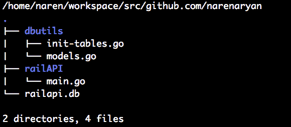
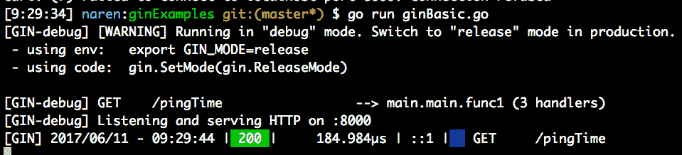
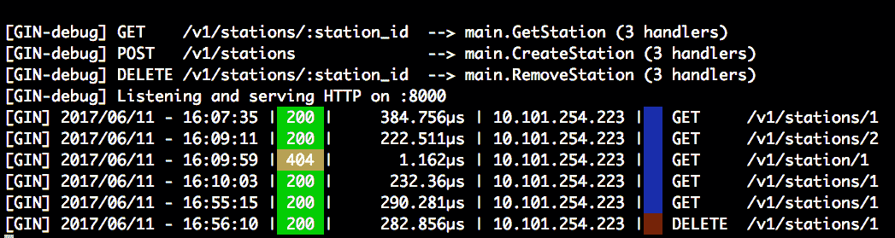

# 第四章：使用流行的 Go 框架简化 RESTful 服务

在本章中，我们将涵盖使用框架简化构建 REST 服务相关的主题。首先，我们将快速了解 go-restful，一个 REST API 创建框架，然后转向一个名为`Gin`的框架。我们将在本章尝试构建一个地铁 API。我们将讨论的框架是完整的 Web 框架，也可以用来在短时间内创建 REST API。在本章中，我们将大量讨论资源和 REST 动词。我们将尝试将一个名为`Sqlite3`的小型数据库与我们的 API 集成。最后，我们将检查`Revel.go`，看看如何用它原型化我们的 REST API。

总的来说，本章我们将涵盖的主题如下：

+   如何在 Go 中使用 SQLite3

+   使用 go-restful 包创建 REST API

+   介绍用于创建 REST API 的 Gin 框架

+   介绍 Revel.go 用于创建 REST API

+   构建 CRUD 操作的基础知识

# 获取代码

您可以从[`github.com/narenaryan/gorestful/tree/master/chapter4`](https://github.com/narenaryan/gorestful/tree/master/chapter4)获取本章的代码示例。本章的示例以项目的形式而不是单个程序的形式呈现。因此，将相应的目录复制到您的`GOPATH`中以正确运行代码示例。

# go-restful，一个用于创建 REST API 的框架

`go-restful`是一个用于在 Go 中构建 REST 风格 Web 服务的包。REST，正如我们在前面的部分中讨论的，要求开发人员遵循一组设计协议。我们已经讨论了 REST 动词应该如何定义以及它们对资源的影响。

使用`go-restful`，我们可以将 API 处理程序的逻辑分离并附加 REST 动词。这样做的好处是，通过查看代码，清楚地告诉我们正在创建什么 API。在进入示例之前，我们需要为`go-restful`的 REST API 安装一个名为 SQLite3 的数据库。安装步骤如下：

+   在 Ubuntu 上，运行以下命令：

```go
 apt-get install sqlite3 libsqlite3-dev
```

+   在 OS X 上，您可以使用`brew`命令安装 SQLite3：

```go
 brew install sqlite3
```

+   现在，使用以下`get`命令安装`go-restful`包：

```go
 go get github.com/emicklei/go-restful
```

我们已经准备好了。首先，让我们编写一个简单的程序，展示`go-restful`在几行代码中可以做什么。让我们创建一个简单的 ping 服务器，将服务器时间回显给客户端：

```go
package main
import (
    "fmt"
    "github.com/emicklei/go-restful"
    "io"
    "net/http"
    "time"
)
func main() {
    // Create a web service
    webservice := new(restful.WebService)
    // Create a route and attach it to handler in the service
    webservice.Route(webservice.GET("/ping").To(pingTime))
    // Add the service to application
    restful.Add(webservice)
    http.ListenAndServe(":8000", nil)
}
func pingTime(req *restful.Request, resp *restful.Response) {
    // Write to the response
   io.WriteString(resp, fmt.Sprintf("%s", time.Now()))
}
```

如果我们运行这个程序：

```go
go run basicExample.go
```

服务器将在本地主机的端口`8000`上运行。因此，我们可以使用 curl 请求或浏览器来查看`GET`请求的输出：

```go
curl -X GET "http://localhost:8000/ping"
2017-06-06 07:37:26.238146296 +0530 IST
```

在上述程序中，我们导入了`go-restful`库，并使用`restful.WebService`结构的新实例创建了一个新的服务。接下来，我们可以使用以下语句创建一个 REST 动词：

```go
webservice.GET("/ping")
```

我们可以附加一个函数处理程序来执行这个动词；`pingTime`就是这样一个函数。这些链接的函数被传递给`Route`函数以创建一个路由器。然后是以下重要的语句：

```go
restful.Add(webservice)
```

这将注册新创建的`webservice`到`go-restful`。如果您注意到，我们没有将任何`ServeMux`对象传递给`http.ListenServe`函数；`go-restful`会处理它。这里的主要概念是使用基于资源的 REST API 创建`go-restful`。从基本示例开始，让我们构建一些实际的东西。

假设你的城市正在建设新的地铁，并且你需要为其他开发人员开发一个 REST API 来消费并相应地创建一个应用程序。我们将在本章中创建这样一个 API，并使用各种框架来展示实现。在此之前，对于**创建、读取、更新、删除**（**CRUD**）操作，我们应该知道如何使用 Go 代码查询或将它们插入到 SQLite 数据库中。

# CRUD 操作和 SQLite3 基础知识

所有的 SQLite3 操作都将使用一个名为`go-sqlite3`的库来完成。我们可以使用以下命令安装该包：

```go
go get github.com/mattn/go-sqlite3
```

这个库的特殊之处在于它使用了 Go 的内部`sql`包。我们通常导入`database/sql`并使用`sql`在数据库（这里是 SQLite3）上执行数据库查询：

```go
import "database/sql"
```

现在，我们可以创建一个数据库驱动程序，然后使用`Query`方法在其上执行 SQL 命令：

`sqliteFundamentals.go`:

```go
package main
import (
    "database/sql"
    "log"
    _ "github.com/mattn/go-sqlite3"
)
// Book is a placeholder for book
type Book struct {
    id int
    name string
    author string
}
func main() {
    db, err := sql.Open("sqlite3", "./books.db")
    log.Println(db)
    if err != nil {
        log.Println(err)
    }
    // Create table
    statement, err := db.Prepare("CREATE TABLE IF NOT EXISTS books (id
INTEGER PRIMARY KEY, isbn INTEGER, author VARCHAR(64), name VARCHAR(64) NULL)")
    if err != nil {
        log.Println("Error in creating table")
    } else {
        log.Println("Successfully created table books!")
    }
    statement.Exec()
    // Create
    statement, _ = db.Prepare("INSERT INTO books (name, author, isbn) VALUES (?, ?, ?)")
    statement.Exec("A Tale of Two Cities", "Charles Dickens", 140430547)
    log.Println("Inserted the book into database!")
    // Read
    rows, _ := db.Query("SELECT id, name, author FROM books")
    var tempBook Book
    for rows.Next() {
        rows.Scan(&tempBook.id, &tempBook.name, &tempBook.author)
        log.Printf("ID:%d, Book:%s, Author:%s\n", tempBook.id,
tempBook.name, tempBook.author)
    }
    // Update
    statement, _ = db.Prepare("update books set name=? where id=?")
    statement.Exec("The Tale of Two Cities", 1)
    log.Println("Successfully updated the book in database!")
    //Delete
    statement, _ = db.Prepare("delete from books where id=?")
    statement.Exec(1)
    log.Println("Successfully deleted the book in database!")
}
```

这个程序解释了如何在 SQL 数据库上执行 CRUD 操作。目前，数据库是 SQLite3。让我们使用以下命令运行它：

```go
go run sqliteFundamentals.go
```

输出如下，打印所有的日志语句：

```go
2017/06/10 08:04:31 Successfully created table books!
2017/06/10 08:04:31 Inserted the book into database!
2017/06/10 08:04:31 ID:1, Book:A Tale of Two Cities, Author:Charles Dickens
2017/06/10 08:04:31 Successfully updated the book in database!
2017/06/10 08:04:31 Successfully deleted the book in database!
```

这个程序在 Windows 和 Linux 上都可以正常运行。在 Go 版本低于 1.8.1 的情况下，你可能会在 macOS X 上遇到问题，比如*Signal Killed*。这是因为 Xcode 版本的问题，请记住这一点。

关于程序，我们首先导入`database/sql`和`go-sqlite3`。然后，我们使用`sql.Open()`函数在文件系统上打开一个`db`文件。它接受两个参数，数据库类型和文件名。如果出现问题，它会返回一个错误，否则返回一个数据库驱动程序。在`sql`库中，为了避免 SQL 注入漏洞，该包提供了一个名为`Prepare`的函数：

```go
statement, err := db.Prepare("CREATE TABLE IF NOT EXISTS books (id INTEGER PRIMARY KEY, isbn INTEGER, author VARCHAR(64), name VARCHAR(64) NULL)")
```

前面的语句只是创建了一个语句，没有填充任何细节。实际传递给 SQL 查询的数据使用语句中的`Exec`函数。例如，在前面的代码片段中，我们使用了：

```go
statement, _ = db.Prepare("INSERT INTO books (name, author, isbn) VALUES (?, ?, ?)")
statement.Exec("A Tale of Two Cities", "Charles Dickens", 140430547)
```

如果你传递了不正确的值，比如导致 SQL 注入的字符串，驱动程序会立即拒绝 SQL 操作。要从数据库中获取数据，使用`Query`方法。它返回一个迭代器，使用`Next`方法返回匹配查询的所有行。我们应该在循环中使用该迭代器进行处理，如下面的代码所示：

```go
rows, _ := db.Query("SELECT id, name, author FROM books")
var tempBook Book
for rows.Next() {
     rows.Scan(&tempBook.id, &tempBook.name, &tempBook.author)
     log.Printf("ID:%d, Book:%s, Author:%s\n", tempBook.id, tempBook.name, tempBook.author)
}
```

如果我们需要向`SELECT`语句传递条件，那么你应该准备一个语句，然后将通配符(?)数据传递给它。

# 使用 go-restful 构建地铁 API

让我们利用前一节学到的知识，为我们在前一节谈到的城市地铁项目创建一个 API。路线图如下：

1.  设计 REST API 文档。

1.  为数据库创建模型。

1.  实现 API 逻辑。

# 设计规范

在创建任何 API 之前，我们应该知道 API 的规范是什么样的，以文档的形式。我们在前几章中展示了一些例子，包括 URL 缩短器 API 设计文档。让我们尝试为这个地铁项目创建一个。看一下下面的表格：

| **HTTP 动词** | **路径** | **操作** | **资源** |
| --- | --- | --- | --- |
| `POST` | `/v1/train` (details as JSON body) | 创建 | 火车 |
| `POST` | `/v1/station` (details as JSON body) | 创建 | 站点 |
| `GET` | `/v1/train/id`  | 读取 | 火车 |
| `GET` | `/v1/station/id` | 读取 | 站点 |
| `POST` | `/v1/schedule` (source and destination) | 创建 | 路线 |

我们还可以包括`UPDATE`和`DELETE`方法。通过实现前面的设计，用户可以很容易地自行实现它们。

# 创建数据库模型

让我们编写一些 SQL 字符串，为前面的火车、站点和路线资源创建表。我们将为这个 API 创建一个项目布局。项目布局将如下截图所示：



我们在`$GOPATH/src/github.com/user/`中创建我们的项目。这里，用户是`narenaryan`，`railAPI`是我们的项目源，`dbutils`是我们自己的处理数据库初始化实用函数的包。让我们从`dbutils/models.go`文件开始。我将在`models.go`文件中为火车、站点和时间表各添加三个模型：

```go
package dbutils

const train = `
      CREATE TABLE IF NOT EXISTS train (
           ID INTEGER PRIMARY KEY AUTOINCREMENT,
           DRIVER_NAME VARCHAR(64) NULL,
           OPERATING_STATUS BOOLEAN
        )
`

const station = `
        CREATE TABLE IF NOT EXISTS station (
          ID INTEGER PRIMARY KEY AUTOINCREMENT,
          NAME VARCHAR(64) NULL,
          OPENING_TIME TIME NULL,
          CLOSING_TIME TIME NULL
        )
`
const schedule = `
        CREATE TABLE IF NOT EXISTS schedule (
          ID INTEGER PRIMARY KEY AUTOINCREMENT,
          TRAIN_ID INT,
          STATION_ID INT,
          ARRIVAL_TIME TIME,
          FOREIGN KEY (TRAIN_ID) REFERENCES train(ID),
          FOREIGN KEY (STATION_ID) REFERENCES station(ID)
        )
`
```

这些都是用反引号(```go) character. The schedule holds the information of a train arriving at a particular station at a given time. Here, train and station are foreign keys to the schedule table. For train, the details related to it are columns. The package name is `dbutils`.When we mention the package names, all the Go programs in that package can share variables and functions exported without any need of actual importing.

Now, let us add code to initialize the (create tables) database in the `init-tables.go` file:

```）括起来的普通多行字符串。

package dbutils

import "log"

import "database/sql"

func Initialize(dbDriver *sql.DB) {

statement, driverError := dbDriver.Prepare(train)

if driverError != nil {

log.Println(driverError)

}

// 创建火车表

_, statementError := statement.Exec()

if statementError != nil {

log.Println("Table already exists!")

}

statement, _ = dbDriver.Prepare(station)

statement.Exec()

statement, _ = dbDriver.Prepare(schedule)

statement.Exec()

log.Println("All tables created/initialized successfully!")

}

```go

We are importing `database/sql` to pass the type of argument in the function. All other statements in the function are similar to the SQLite3 example we gave in the preceding code. It is just creating three tables in the SQLite3 database. Our main program should pass the database driver to this function. If you observe here, we are not importing train, station, and schedule. But, since this file is in the `db utils` package, variables in `models.go` are accessible here.

Now our initial package is finished. You can build the object code for this package using the following command:

```

go build github.com/narenaryan/dbutils

```go

It is not useful until we create and run our main program. So, let us write a simple main program that imports the `Initialize` function from the `dbutils` package. Let us call the file `main.go`:

```

package main

import (

"database/sql"

"log"

_ "github.com/mattn/go-sqlite3"

"github.com/narenaryan/dbutils"

)

func main() {

// 连接到数据库

db, err := sql.Open("sqlite3", "./railapi.db")

if err != nil {

log.Println("Driver creation failed!")

}

// 创建表

dbutils.Initialize(db)

}

```go

And run the program from the `railAPI` directory using the following command:

```

go run main.go

```go

The output you see should be something like the following:

```

2017/06/10 14:05:36 所有表格成功创建/初始化！

```go

In the preceding program, we added the code for creating a database driver and passed the table creation task to the `Initialize` function from the `dbutils` package. We can do that straight away in our main program, but it is good to decompose the logic into multiple packages and components. Now, we will extend this simple layout to create an API using the `go-restful` package. The API should implement all the functions of our API design document.

The `railapi.db` file from the preceding directory tree picture gets created once we run our main program. SQLite3 will take care of creating the database file if it doesn't exist. SQLite3 databases are simple files. You can enter into the SQLite shell using the `$ sqlite3 file_name` command.

Let us modify the main program into a new one. We will go step by step and understand how to build REST services using `go-restful` in this example. First, add the necessary imports to the program:

```

package main

import (

"database/sql"

"encoding/json"

"log"

"net/http"

"time"

"github.com/emicklei/go-restful"

_ "github.com/mattn/go-sqlite3"

"github.com/narenaryan/dbutils"

)

```go

We need two external packages, `go-restful` and `go-sqlite3`, for building the API logic. The first one is for handlers and the second package is for adding persistence features. `dbutils`is the one we previously created. The `time` and `net/http` packages are for general purpose tasks.

Even though concrete names are given to the columns in the SQLite database's tables, in GO programming we need a few structs to handle data coming in and out of the database. There should be data holders for all the models, so we will define them next. Take a look at the following code snippet:

```

// DB Driver visible to whole program

var DB *sql.DB

// TrainResource is the model for holding rail information

type TrainResource struct {

ID int

DriverName string

OperatingStatus bool

}

// StationResource holds information about locations

type StationResource struct {

ID int

Name string

OpeningTime time.Time

ClosingTime time.Time

}

// ScheduleResource links both trains and stations

type ScheduleResource struct {

ID int

TrainID int

StationID int

ArrivalTime time.Time

}

```go

The `DB`variable is allocated to hold the global database driver. All the above structs are exact representations of the database models in the SQL. Go's `time.Time` struct type can actually hold the `TIME` field from the database.

Now comes the actual `go-restful` implementation. We need to create a container for our API in `go-restful`. Then, we should register the web services to that container. Let us write the `Register` function, as shown in the following code snippet:

```

// Register adds paths and routes to container

func (t *TrainResource) Register(container *restful.Container) {

ws := new(restful.WebService)

ws.

Path("/v1/trains").

Consumes(restful.MIME_JSON).

Produces(restful.MIME_JSON) // you can specify this per route as well

ws.Route(ws.GET("/{train-id}").To(t.getTrain))

ws.Route(ws.POST("").To(t.createTrain))

ws.Route(ws.DELETE("/{train-id}").To(t.removeTrain))

container.Add(ws)

}

```go

Web services in `go-restful` mainly work based on resources. So here, we are defining a function called `Register` on `TrainResource`, taking containers as arguments. We create a new `WebService` and add paths to it. A path is the URL endpoint and routes are the path parameters or query parameters attached to the function handlers. `ws`is the web service created to serve the `Train` resource.We attached three REST methods, namely `GET`, `POST`, and `DELETE` to three function handlers, `getTrain`, `createTrain`, and `removeTrain` respectively:

```

Path("/v1/trains").

Consumes(restful.MIME_JSON).

Produces(restful.MIME_JSON)

```go

These statements say that API will only entertain `Content-Type` as application/JSON in the request. For all other types, it automatically returns a 415--Media Not Supported error. The returned response is automatically converted to a pretty JSON. We can also have a list of formats such as XML, JSON, and so on. `go-restful` provides this feature out of the box.

Now, let us define the function handlers:

```

// GET http://localhost:8000/v1/trains/1

func (t TrainResource) getTrain(request *restful.Request, response *restful.Response) {

id := request.PathParameter("train-id")

err := DB.QueryRow("select ID, DRIVER_NAME, OPERATING_STATUS FROM train where id=?", id).Scan(&t.ID, &t.DriverName, &t.OperatingStatus)

if err != nil {

log.Println(err)

response.AddHeader("Content-Type", "text/plain")

response.WriteErrorString(http.StatusNotFound, "Train could not be found.")

} else {

response.WriteEntity(t)

}

}

// POST http://localhost:8000/v1/trains

func (t TrainResource) createTrain(request *restful.Request, response *restful.Response) {

log.Println(request.Request.Body)

decoder := json.NewDecoder(request.Request.Body)

var b TrainResource

err := decoder.Decode(&b)

log.Println(b.DriverName, b.OperatingStatus)

// Error handling is obvious here. So omitting...

statement, _ := DB.Prepare("insert into train (DRIVER_NAME, OPERATING_STATUS) values (?, ?)")

result, err := statement.Exec(b.DriverName, b.OperatingStatus)

if err == nil {

newID, _ := result.LastInsertId()

b.ID = int(newID)

response.WriteHeaderAndEntity(http.StatusCreated, b)

} else {

response.AddHeader("Content-Type", "text/plain")

response.WriteErrorString(http.StatusInternalServerError, err.Error())

}

}

// DELETE http://localhost:8000/v1/trains/1

func (t TrainResource) removeTrain(request *restful.Request, response *restful.Response) {

id := request.PathParameter("train-id")

statement, _ := DB.Prepare("delete from train where id=?")

_, err := statement.Exec(id)

if err == nil {

response.WriteHeader(http.StatusOK)

} else {

response.AddHeader("Content-Type", "text/plain")

response.WriteErrorString(http.StatusInternalServerError, err.Error())

}

}

```go

All these REST methods are defined on the instance of the `TimeResource` struct. Coming to the `GET` handler, it is passing `Request` and `Response` as its arguments. The `path` parameters can be fetched using the `request.PathParameter`function. The argument passed to it will be in agreement with the route we added in the preceding code snippet. That is, `train-id`will be returned into the handler so that we can strip it and use it as criteria to fetch a record from our SQLite database. 

In the `POST` handler function, we are parsing the request body with the JSON package's `NewDecoder`function. `go-restful` doesn't have a function to parse raw data posted from the client. There are functions available to strip query parameters and form parameters, but this one is missing. So, we wrote our own logic to strip and parsed the JSON body, and used those results to insert data into our SQLite database. That handler is creating a `db` record for the train with the supplied details in the request.

The `DELETE` function is quite obvious if you understand the previous two handlers. We are making a `DELETE` SQL command using `DB.Prepare`and returning a 201 Status OK back, telling us the delete operation was successful. Otherwise, we are sending back the actual error as a server error. Now, let us write the main function handler, which is an entry point for our program:

```

func main() {

var err error

DB, err = sql.Open("sqlite3", "./railapi.db")

if err != nil {

log.Println("Driver creation failed!")

}

dbutils.Initialize(DB)

wsContainer := restful.NewContainer()

wsContainer.Router(restful.CurlyRouter{})

t := TrainResource{}

t.Register(wsContainer)

log.Printf("start listening on localhost:8000")

server := &http.Server{Addr: ":8000", Handler: wsContainer}

log.Fatal(server.ListenAndServe())

}

```go

The first four lines here are performing the database-related housekeeping. Then, we are creating a new container using `restful.NewContainer`.Then, we are using a router called `CurlyRouter`(which allows us to use `{train_id}` syntax in paths while setting routes) for our container. Then, we created an instance of the `TimeResource` struct and passed this container to the `Register` method. That container can indeed act as an HTTP handler; so, we can pass it to the `http.Server`easily.

Use `request.QueryParameter`to fetch the query parameters from an HTTP request in the `go-restful` handler.

This code is available in the GitHub repo. Now, when we run the `main.go` file within the `$GOPATH/src/github.com/narenaryan` directory, we see this:

```

go run railAPI/main.go

```go

And make a curl `POST` request to create a train:

```

curl -X POST \

http://localhost:8000/v1/trains \

-H 'cache-control: no-cache' \

-H 'content-type: application/json' \

-d '{"driverName": "Menaka", "operatingStatus": true}'

```go

This creates a new train with the driver and operation status details. The response is the newly created resource with the train `ID` allocated:

```

{

"ID": 1,

"DriverName": "Menaka",

"OperatingStatus": true

}

```go

Now, let us make a curl request to check the `GET`:

```

CURL -X GET "http://localhost:8000/v1/trains/1"

```go

You will see the JSON output, as follows:

```

{

"ID": 1,

"DriverName": "Menaka",

"OperatingStatus": true

}

```go

We can use the same names for both posting data and JSON returned, but in order to show the difference between two operations, different variable names are used. Now, delete the resource we created in the preceding code snippet with the `DELETE` API call:

```

CURL -X DELETE "http://localhost:8000/v1/trains/1"

```go

It won't return any response body; it returns `Status 200 ok` if the operation was successful. Now, if we try to do a `GET` on the `ID` 1 train, then it returns us this response:

```

Train could not be found.

```go

These implementations can be extended to `PUT` and `PATCH.` We need to add two more routes to the web service in the `Register` method and define respective handlers. Here, we created a web service for the `Train` resource. In a similar way, web services can be created for doing CRUD operations on the `Station`and `Schedule` tables. That task is left for the readers to explore.

`go-restful` is a lightweight library that is powerful in creating RESTful services in an elegant way. The main theme is to convert resources (models) into consumable APIs. Using other heavy frameworks may speed up the development, but the API can end up slower because of the wrapping of code. `go-restful` is a lean and low-level package for API creation.

`go-restful` also provides built-in support for documenting the REST API with **swagger**. Itis a tool that runs and generates templates for documenting the REST API we build. By integrating it with our `go-restful`-based web services, we can generate documentation on the fly. For more information, visit [`github.com/emicklei/go-restful-swagger12`](https://github.com/emicklei/go-restful-swagger12).

# Building RESTful APIs with the Gin framework

`Gin-gonic` is a framework based on the `httprouter`.We learned about the `httprouter` in Chapter 2, *Handling Routing for Our REST Services*. It is an HTTP multiplexer like Gorilla Mux, but it is faster. `Gin` allows a high-level API to create REST services in a clean way. `Gin` compares itself with another web framework called `martini`. All web frameworks allow us to do a lot more things such as templating and web server design, additional to service creation. Install the `Gin` package using the following command:

```

go get gopkg.in/gin-gonic/gin.v1

```go

Let us write a simple hello world program in `Gin` to get familiarized with the `Gin` constructs. The file is `ginBasic.go`:

```

package main

import (

"time"

"github.com/gin-gonic/gin"

)

func main() {

r := gin.Default()

/* GET takes a route and a handler function

Handler takes the gin context object

*/

r.GET("/pingTime", func(c *gin.Context) {

// JSON serializer is available on gin context

c.JSON(200, gin.H{

"serverTime": time.Now().UTC(),

})

})

r.Run(":8000") // 在 0.0.0.0:8080 上监听并提供服务

}

```go

This simple server tries to implement a service that provides the UTC server time to the clients. We implemented one such service in Chapter 3, *Working with Middleware and RPC*. But here, if you look, `Gin` allows you to do a lot of stuff with just a few lines of code; all the boilerplate details are taken away. Coming to the preceding program, we are creating a router with the `gin.Default`function. Then, we are attaching routes with REST verbs as we did in `go-restful`; a route to the function handler. Then, we are calling the `Run`function by passing the port to run. The default port will be `8080`.

`c` is the `gin.Context`that holds the information of the individual request. We can serialize data into JSON before sending it back to the client using the `context.JSON` function. Now, if we run and see the preceding program:

```

go run ginExamples/ginBasic.go

```go

Make a curl request:

```

curl -X GET "http://localhost:8000/pingTime"

Output

=======

{"serverTime":"2017-06-11T03:59:44.135062688Z"}

```go

At the same time, the console where we are running the `Gin` server is beautifully presented with debug messages:



It is Apache-style debug logging showing the endpoint, the latency of the request, and the REST method.

In order to run `Gin` in production mode, set the `GIN_MODE = release` environment variable. Then the console output will be muted and log files can be used for monitoring the logs.

Now, let us write our Rail API in `Gin` to show how to implement exactly the same thing using the `Gin` framework. I will use the same project layout, name my new project `railAPIGin`, and use the `dbutils` as it is. First, let us prepare the imports for our program:

```

package main

import (

"database/sql"

"log"

"net/http"

"github.com/gin-gonic/gin"

_ "github.com/mattn/go-sqlite3"

"github.com/narenaryan/dbutils"

)

```go

We imported `sqlite3` and `dbutils` for database-related actions. We imported `gin`for creating our API server. `net/http`is useful in providing the intuitive status codes to be sent along with the response. Take a look at the following code snippet:

```

// DB Driver visible to whole program

var DB *sql.DB

// StationResource holds information about locations

type StationResource struct {

ID int `json:"id"`

Name string `json:"name"`

OpeningTime string `json:"opening_time"`

ClosingTime string `json:"closing_time"`

}

```go

We created a database driver that is available to all handler functions. `StationResource` is the placeholder for our JSON that decoded from both request body and data coming from the database. In case you noticed, it is slightly modified from the example of `go-restful`. Now, let us write the handlers implementing `GET`, `POST`, and `DELETE`  methods for the `station` resource:

```

// GetStation returns the station detail

func GetStation(c *gin.Context) {

var station StationResource

id := c.Param("station_id")

err := DB.QueryRow("select ID, NAME, CAST(OPENING_TIME as CHAR), CAST(CLOSING_TIME as CHAR) from station where id=?", id).Scan(&station.ID, &station.Name, &station.OpeningTime, &station.ClosingTime)

if err != nil {

log.Println(err)

c.JSON(500, gin.H{

"error": err.Error(),

})

} else {

c.JSON(200, gin.H{

"result": station,

})

}

}

// CreateStation handles the POST

func CreateStation(c *gin.Context) {

var station StationResource

// Parse the body into our resrource

if err := c.BindJSON(&station); err == nil {

// Format Time to Go time format

statement, _ := DB.Prepare("insert into station (NAME, OPENING_TIME, CLOSING_TIME) values (?, ?, ?)")

result, _ := statement.</span>Exec(station.Name, station.OpeningTime, station.ClosingTime)

if err == nil {

newID, _ := result.LastInsertId()

station.ID = int(newID)

c.JSON(http.StatusOK, gin.H{

"result": station,

})

} else {

c.String(http.StatusInternalServerError, err.Error())

}

} else {

c.String(http.StatusInternalServerError, err.Error())

}

}

// RemoveStation handles the removing of resource

func RemoveStation(c *gin.Context) {

id := c.Param("station-id")

statement, _ := DB.Prepare("delete from station where id=?")

_, err := statement.Exec(id)

if err != nil {

log.Println(err)

c.JSON(500, gin.H{

"error": err.Error(),

})

} else {

c.String(http.StatusOK, "")

}

}

```go

In `GetStation`, we are using the `c.Param`to strip the `station_id` path parameter. After that, we are using that ID to fetch a database record from the SQLite3 station table. If you observed carefully, the SQL query is bit different. We are using the `CAST` method to retrieve the SQL `TIME` field as a string for Go to consume properly. If you remove the casting, a panic error will be raised because we are trying to load a `TIME` field into the Go string at runtime. To give you an idea, the `TIME` field looks like *8:00:00*, *17:31:12,* and so on. Next, we are returning back the result using the `gin.H`method if there is no error.

In `CreateStation`,we are trying to perform an insert query. But before that, in order to get data from the body of the `POST` request, we are using a function called `c.BindJSON`. This function loads the data into the struct that is passed as the argument. It means the station struct will be loaded with the data supplied from the body. That is why `StationResource` has the JSON inference strings to tell what key values are expected. For example, this is such field of `StationResource` struct with inference string.

```

ID int `json:"id"`

```go

After collecting the data, we are preparing a database insert statement and executing it. The result is the ID of the inserted record. We are using that ID to send station details back to the client. In `RemoveStation`,we are performing a `DELETE` SQL query. If the operation was successful, we return a 200 OK status back. Otherwise, we are sending the appropriate reason for a 500 Internal Server Error.

Now comes the main program, which runs the database logic first to make sure tables are created. Then, it tries to create a `Gin` router and adds routes to it:

```

func main() {

var err error

DB, err = sql.Open("sqlite3", "./railapi.db")

if err != nil {

log.Println("Driver creation failed!")

}

dbutils.Initialize(DB)

r := gin.Default()

// Add routes to REST verbs

r.GET("/v1/stations/:station_id", GetStation)

r.POST("/v1/stations", CreateStation)

r.DELETE("/v1/stations/:station_id", RemoveStation)

r.Run(":8000") // 默认监听并在 0.0.0.0:8080 上提供服务

}

```go

We are registering the `GET`, `POST`, and `DELETE` routes with the `Gin` router. Then, we are passing routes and handlers to them. Finally, we are starting the server using the `Run`function of Gin with `8000` as the port. Run the preceding program, as follows:

```

go run railAPIGin/main.go

```go

Now, we can insert a new record by performing a `POST` request:

```

curl -X POST \

http://localhost:8000/v1/stations \

-H 'cache-control: no-cache' \

-H 'content-type: application/json' \

-d '{"name":"Brooklyn", "opening_time":"8:12:00", "closing_time":"18:23:00"}'

```go

It returns:

```

{"result":{"id":1,"name":"Brooklyn","opening_time":"8:12:00","closing_time":"18:23:00"}}

```go

And now try to fetch the details using `GET`:

```

CURL -X GET "http://10.102.78.140:8000/v1/stations/1"

Output

======

{"result":{"id":1,"name":"Brooklyn","opening_time":"8:12:00","closing_time":"18:23:00"}}

```go

We can also delete the station record using the following command:

```

CURL -X DELETE "http://10.102.78.140:8000/v1/stations/1"

```go

It returns a 200 OK status, confirming the resource was successfully deleted. As we already discussed, `Gin` provides intuitive debugging on the console, showing the attached handler and highlighting the latency and REST verbs with colors:



For example, a `200` is green, a `404` is yellow, `DELETE` is red, and so on. `Gin` provides many other features such as the categorization of routes, redirects, and middleware functions. 

Use the `Gin` framework if you are quickly prototyping a REST web service. You can also use it for many other things such as static file serving and so on. Remember that it is a fully-fledged web framework. For fetching the query parameters in Gin, use the following method on the `Gin` context object: `c.Query("param")`.

# Building a RESTful API with Revel.go

Revel.go is also a fully-fledged web framework like Python's Django. It is older than Gin, and is termed as a high productivity web framework. It is an asynchronous, modular, and stateless framework. Unlike the `go-restful` and `Gin` frameworks where we created the project ourselves, Revel generates a scaffold for working directly.

Install `Revel.go` using the following command:

```

go get github.com/revel/revel

```go

In order to run the scaffold tool, we should install one more supplementary package:

```

go get github.com/revel/cmd/revel

```go

Make sure that `$GOPATH/bin` is in your `PATH` variable. Some external packages install the binary in the `$GOPATH/bin` directory. If it is in the path, we can access executables system-wide. Here, Revel installs a binary called `revel`. On Ubuntu or macOS X, you can do it using the following command:

```

export PATH=$PATH:$GOPATH/bin

```go

Add the preceding line to `~/.bashrc` to save the setting. On Windows, you need to directly call the executable by its location. Now we are ready to start with Revel. Let us create a new project called `railAPIRevel` in `github.com/narenaryan`:

```

revel new railAPIRevel

```go

This creates a project scaffold without writing a single line of code. This is how web frameworks abstract things for quick prototyping. A Revel project layout tree looks like this:

```

conf/             Configuration directory

app.conf      Main app configuration file

routes 路由定义文件

app/ 应用程序源

init.go 拦截器注册

controllers/ 这里放置应用程序控制器

views/ 模板目录

messages/ 消息文件

public/ 公共静态资产

css/ CSS 文件

js/ Javascript 文件

images/ 图像文件

tests/ 测试套件

```go

Out of all those boilerplate directories, three things are important for creating an API. Those are:

*   `app/controllers`
*   `conf/app.conf`
*   `conf/routes`

Controllers are the logic containers that execute the API logic. `app.conf` allows us to set the `host`, `port`, and `dev` mode/production mode and so on. `routes` defines the triple of the endpoint, REST verb, and function handler (here, controller's function). This means to define a function in the controller and attach it to a route in the routes file.

Let us use the same example we have seen for `go-restful`, creating an API for trains. But here, due to the redundancy, we will drop the database logic. We will see shortly how to build `GET`, `POST`, and `DELETE` actions for the API using Revel. Now, modify the routes file to this:

```

# 路由配置

#

# 此文件定义了所有应用程序路由（优先级较高的路由优先）

#

module:testrunner

# module:jobs

GET /v1/trains/:train-id App.GetTrain

POST /v1/trains App.CreateTrain

DELETE /v1/trains/:train-id App.RemoveTrain

```go

The syntax may look a bit new. It is a configuration file where we simply define a route in this format:

```

VERB END_POINT HANDLER

```go

We haven't defined handlers yet. In the endpoint, the path parameters are accessed using the `:param`notation. This means for the `GET` request in the file, `train-id` will be passed as the `path` parameter. Now, move to the `controllers` folder and modify the  existing controller in  `app.go` file to this:

```

package controllers

import (

"log"

"net/http"

"strconv"

"github.com/revel/revel"

）

type App struct {

*revel.Controller

}

// TrainResource 是用于保存铁路信息的模型

type TrainResource struct {

ID int `json:"id"`

DriverName string `json:"driver_name"`

OperatingStatus bool `json:"operating_status"`

}

// GetTrain 处理对火车资源的 GET

func (c App) GetTrain() revel.Result {

var train TrainResource

// 从路径参数中获取值。

id := c.Params.Route.Get("train-id")

// 使用此 ID 从数据库查询并填充 train 表....

train.ID，_ = strconv.Atoi（id）

train.DriverName = "Logan" // 来自数据库

train.OperatingStatus = true // 来自数据库

c.Response.Status = http.StatusOK

返回 c.RenderJSON（train）

}

// CreateTrain 处理对火车资源的 POST

func (c App) CreateTrain() revel.Result {

var train TrainResource

c.Params.BindJSON（&train）

// 使用 train.DriverName 和 train.OperatingStatus 插入到 train 表中....

train.ID = 2

c.Response.Status = http.StatusCreated

return c.RenderJSON（train）

}

// RemoveTrain 实现对火车资源的 DELETE

func (c App) RemoveTrain() revel.Result {

id := c.Params.Route.Get("train-id")

// 使用 ID 从 train 表中删除记录....

log.Println("成功删除资源：", id)

c.Response.Status = http.StatusOK

return c.RenderText("")

}

```go

We created API handlers in the file `app.go`. Those handler names should match the ones we mentioned in the routes file. We can create a Revel controller using a struct with `*revel.Controller` as its member. Then, we can attach any number of handlers to it. The controller holds the information of incoming HTTP requests so that we can use the information such as query parameters, path parameters, JSON body, form data, and so on in our handler.

We are defining `TrainResource`to work as a data holder. In `GetTrain`,we are fetching the path parameters using the `c.Params.Route.Get`function. The argument to that function is the path parameter we specified in the route file (here, `train-id`). The value will be a string. We need to convert it to `Int` type to map it with `train.ID`.Then, we are setting the response status as `200 OK` using the `c.Response.Status` variable (not function). `c.RenderJSON` takes a struct and transforms it into the JSON body. 

In `CreateTrain,`we are adding the `POST` request logic. We are creating a new `TrainResource` struct and passing it to a function called `c.Params.BindJSON`.What `BindJSON`does is it plucks the parameters from the JSON `POST` body and tries to find matching fields in the struct and fill them. When we marshal a Go struct to JSON, field names will be translated to keys as it is. But, if we attach the ``jason:"id"`` string format to any struct field, it explicitly says that the JSON that is marshaled from this struct should have the key `id`, not **ID**. This is a good practice in Go while working with JSON. Then, we are adding a status of 201 created to the HTTP response. We are returning the train struct, which will be converted into JSON internally.

The `RemoveTrain`handler logic is similar to that of `GET`. A subtle difference is that nothing is sent in the body. As we previously mentioned, database CRUD logic is omitted from the preceding example. It is an exercise for readers to try adding SQLite3 logic by observing what we have done in the `go-restful` and `Gin` sections.

Finally, the default port on which the Revel server runs is `9000`. The configuration to change the port number is in the `conf/app.conf`file. Let us follow the tradition of running our app on `8000`. So, modify the `http` port section of the file to the following. This tells the Revel server to run on a different port:

```

......

# 要监听的 IP 地址。

http.addr =

# 要监听的端口。

http.port = 8000 # 从 9000 更改为 8000 或任何端口

# 是否使用 SSL。

http.ssl = false

......

```go

Now, we can run our Revel API server using this command:

```

revel run github.com/narenaryan/railAPIRevel

```go

Our app server starts at `http://localhost:8000`. Now, let us make a few API requests:

```

CURL -X GET "http://10.102.78.140:8000/v1/trains/1"

输出

=======

{

"id": 1,

"driver_name": "Logan",

"operating_status": true

}

```go

`POST` request:

```

curl -X POST \

http://10.102.78.140:8000/v1/trains \

-H 'cache-control: no-cache' \

-H 'content-type: application/json' \

-d '{"driver_name":"Magneto", "operating_status": true}'

输出

======

{

"id": 2,

"driver_name": "Magneto",

"operating_status": true

}

```

`DELETE`与`GET`相同，但不返回主体。这里，代码是为了展示如何处理请求和响应。请记住，Revel 不仅仅是一个简单的 API 框架。它是一个类似于 Django（Python）或 Ruby on Rails 的完整的 Web 框架。我们在 Revel 中内置了模板，测试和许多其他功能。

确保为`GOPATH/user`创建一个新的 Revel 项目。否则，当运行项目时，Revel 命令行工具可能找不到项目。

我们在本章中看到的所有 Web 框架都支持中间件。 `go-restful`将其中间件命名为`Filters`，而`Gin`将其命名为自定义中间件。 Revel 将其中间件拦截器。中间件在函数处理程序之前和之后分别读取或写入请求和响应。在第三章中，*使用中间件和 RPC*，我们将更多地讨论中间件。

# 摘要

在本章中，我们尝试使用 Go 中的一些 Web 框架构建了一个地铁轨道 API。最受欢迎的是`go-restful`，`Gin Gonic`和`Revel.go`。我们首先学习了如何在 Go 应用程序中进行第一个数据库集成。我们选择了 SQLite3，并尝试使用`go-sqlite3`库编写了一个示例应用程序。

接下来，我们探索了`go-restful`，并详细了解了如何创建路由和处理程序。`go-restful`具有在资源之上构建 API 的概念。它提供了一种直观的方式来创建可以消耗和产生各种格式（如 XML 和 JSON）的 API。我们使用火车作为资源，并构建了一个在数据库上执行 CRUD 操作的 API。我们解释了为什么`go-restful`轻量级，并且可以用来创建低延迟的 API。接下来，我们看到了`Gin`框架，并尝试重复相同的 API，但是创建了一个围绕车站资源的 API。我们看到了如何在 SQL 数据库时间字段中存储时间。我们建议使用`Gin`来快速原型化您的 API。

最后，我们尝试使用`Revel.go`网络框架在火车资源上创建另一个 API。我们开始创建一个项目，检查了目录结构，然后继续编写一些服务（没有`db`集成）。我们还看到了如何运行应用程序并使用配置文件更改端口。

本章的主题是为您提供一些创建 RESTful API 的精彩框架。每个框架可能有不同的做事方式，选择您感到舒适的那个。当您需要一个端到端的网络应用程序（模板和用户界面）时，请使用`Revel.go`，当您需要快速创建 REST 服务时，请使用`Gin`，当 API 的性能至关重要时，请使用`go-rest`。
