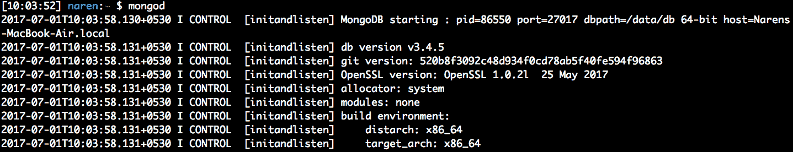
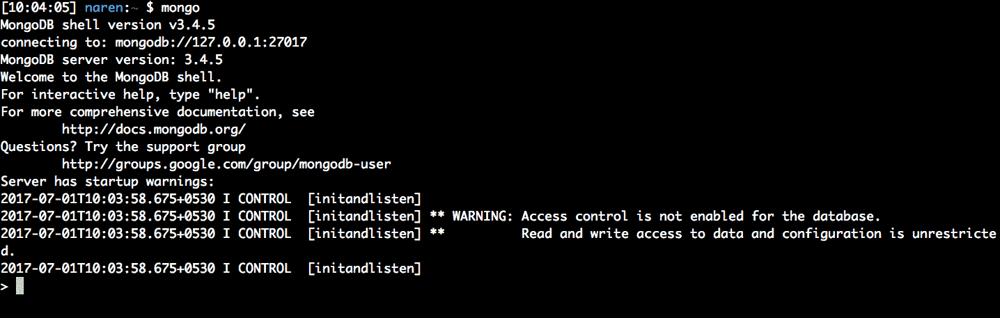
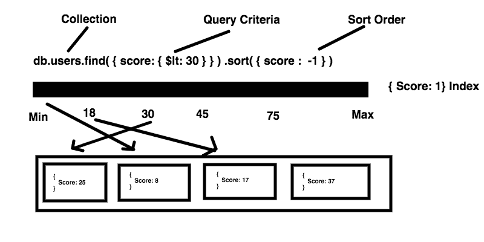

# 第五章：使用 MongoDB 和 Go 创建 REST API

在本章中，我们将介绍名为`MongoDB`的 NoSQL 数据库。我们将学习`MongoDB`如何适用于现代 Web 服务。我们将首先学习有关`MongoDB`集合和文档的知识。我们将尝试使用`MongoDB`作为数据库创建一个示例 API。在这个过程中，我们将使用一个名为`mgo`的驱动程序包。然后，我们将尝试为电子商务 REST 服务设计一个文档模型。

基本上，我们将讨论以下主题：

+   安装和使用 MongoDB

+   使用 Mongo shell

+   使用 MongoDB 作为数据库构建 REST API

+   数据库索引的基础知识

+   设计电子商务文档模型

# 获取代码

您可以从[`github.com/narenaryan/gorestful/tree/master/chapter5`](https://github.com/narenaryan/gorestful/tree/master/chapter5)获取本章的代码示例。本章的示例是单个程序和项目的组合。因此，将相应的目录复制到您的`GOPATH`中，以正确运行代码示例。

# MongoDB 简介

**MongoDB**是一种受到全球开发人员青睐的流行 NoSQL 数据库。它不同于传统的关系型数据库，如 MySQL、PostgreSQL 和 SQLite3。与其他数据库相比，MongoDB 的主要区别在于在互联网流量增加时易于扩展。它还将 JSON 作为其数据模型，这使我们可以直接将 JSON 存储到数据库中。

许多大公司，如 Expedia、Comcast 和 Metlife，都在 MongoDB 上构建了他们的应用程序。它已经被证明是现代互联网业务中的重要组成部分。MongoDB 将数据存储在文档中；可以将其视为 SQL 数据库中的行。所有 MongoDB 文档都存储在一个集合中，而集合就是表（类比 SQL）。IMDB 电影的一个示例文档如下：

```go
{
  _id: 5,
  name: 'Star Trek',
  year: 2009,
  directors: ['J.J. Abrams'],
  writers: ['Roberto Orci', 'Alex Kurtzman'],
  boxOffice: {
     budget:150000000,
     gross:257704099
  }
}
```

MongoDB 相对于关系型数据库的主要优势是：

+   易于建模（无模式）

+   可以利用查询功能

+   文档结构适合现代 Web 应用程序（JSON）

+   比关系型数据库更具可扩展性

# 安装 MongoDB 并使用 shell

MongoDB 可以轻松安装在任何平台上。在 Ubuntu 16.04 上，我们需要在运行`apt-get`命令之前执行一些进程：

```go
sudo apt-key adv --keyserver hkp://keyserver.ubuntu.com:80 --recv 0C49F3730359A14518585931BC711F9BA15703C6 
 echo "deb [ arch=amd64,arm64 ] http://repo.mongodb.org/apt/ubuntu xenial/mongodb-org/3.4 multiverse" | sudo tee /etc/apt/sources.list.d/mongodb-org-3.4.list

sudo apt-get update && sudo apt-get install mongodb-org
```

它将在最后一步要求确认安装；按*Y*。安装完成后，我们需要使用以下命令启动 MongoDB 守护进程：

```go
systemctl start mongod
```

所有前面的命令都需要由 root 用户运行。如果用户不是 root 用户，请在每个命令前使用`sudo`关键字。

我们还可以从网站手动下载 MongoDB，并使用`~/mongodb/bin/mongod/`命令运行服务器。为此，我们需要创建一个 init 脚本，因为如果关闭终端，服务器将被关闭。我们还可以使用`nohup`在后台运行服务器。通常最好使用`apt-get`进行安装。

要在 macOS X 上安装 MongoDB，请使用 Homebrew 软件。我们可以使用以下命令轻松安装它：

```go
brew install mongodb
```

之后，我们需要创建 MongoDB 存储其数据库的`db`目录：

```go
mkdir -p /data/db
```

然后，使用`chown`更改该文件的权限：

```go
chown -R `id -un` /data/db
```

现在我们已经准备好了 MongoDB。我们可以在终端窗口中使用以下命令运行它，这将启动 MongoDB 守护进程：

```go
mongod
```

请查看以下截图：



在 Windows 上，我们可以手动从网站下载安装程序二进制文件，并通过将安装的`bin`目录添加到`PATH`变量中来启动它。然后，我们可以使用`mongod`命令运行它。

# 使用 Mongo shell

每当我们开始使用 MongoDB 时，我们应该先玩一会儿。查找可用的数据库、集合、文档等可以使用一个名为 Mongo shell 的简单工具。这个 shell 是与我们在前面部分提到的安装步骤一起打包的。我们需要使用以下命令启动它：

```go
mongo
```

参考以下截图：



如果您看到这个屏幕，一切都进行得很顺利。如果您遇到任何错误，服务器没有运行或者有其他问题。对于故障排除，您可以查看官方 MongoDB 故障排除指南[`docs.mongodb.com/manual/faq/diagnostics`](https://docs.mongodb.com/manual/faq/diagnostics/)。客户端提供了有关 MongoDB 版本和其他警告的信息。要查看所有可用的 shell 命令，请使用`help`命令。

现在我们已经准备好了。让我们创建一个名为`movies`的新集合，并将前面的示例文档插入其中。默认情况下，数据库将是一个测试数据库。您可以使用`use`命令切换到一个新的数据库：

```go
> show databases
```

它显示所有可用的数据库。默认情况下，`admin`，`test`和`local`是三个可用的数据库。为了创建一个新的数据库，只需使用`use db_name`：

```go
> use appdb
```

这将把当前数据库切换到`appdb`数据库。如果您尝试查看可用的数据库，它不会显示出来，因为 MongoDB 只有在插入数据时（第一个集合或文档）才会创建数据库。因此，现在我们可以通过从 shell 中插入一个文档来创建一个新的集合。然后，我们可以使用以下命令将前面的《星际迷航》电影记录插入到名为`movies`的集合中：

```go
> db.movies.insertOne({ _id: 5, name: 'Star Trek', year: 2009, directors: ['J.J. Abrams'], writers: ['Roberto Orci', 'Alex Kurtzman'], boxOffice: { budget:150000000, gross:257704099 } } )
{ 
 "acknowledged" : true,
 "insertedId" : 5 
}
```

您插入的 JSON 具有名为`_id`的 ID。我们可以在插入文档时提供它，或者 MongoDB 可以为您自动插入一个。在 SQL 数据库中，我们使用*自动递增*以及一个`ID`模式来递增`ID`字段。在这里，MongoDB 生成一个唯一的哈希`ID`而不是一个序列。让我们再插入一个关于`黑暗骑士`的文档，但这次让我们不传递`_id`字段：

```go
> db.movies.insertOne({ name: 'The Dark Knight ', year: 2008, directors: ['Christopher Nolan'], writers: ['Jonathan Nolan', 'Christopher Nolan'], boxOffice: { budget:185000000, gross:533316061 } } )> db.movies.insertOne({ name: 'The Dark Knight ', year: 2008, directors: ['Christopher Nolan'], writers: ['Jonathan Nolan', 'Christopher Nolan'], boxOffice: { budget:185000000, gross:533316061 } } )
{ 
 "acknowledged" : true,
 "insertedId" : ObjectId("59574125bf7a73d140d5ba4a")
}
```

如果您观察到确认的 JSON 响应，`insertId`现在已经更改为非常长的`59574125bf7a73d140d5ba4a`。这是 MongoDB 生成的唯一哈希。现在，让我们看看我们集合中的所有文档。我们还可以使用`insertMany`函数一次插入一批文档：

```go
> db.movies.find()

{ "_id" : 5, "name" : "Star Trek", "year" : 2009, "directors" : [ "J.J. Abrams" ], "writers" : [ "Roberto Orci", "Alex Kurtzman" ], "boxOffice" : { "budget" : 150000000, "gross" : 257704099 } }
{ "_id" : ObjectId("59574125bf7a73d140d5ba4a"), "name" : "The Dark Knight ", "year" : 2008, "directors" : [ "Christopher Nolan" ], "writers" : [ "Jonathan Nolan", "Christopher Nolan" ], "boxOffice" : { "budget" : 185000000, "gross" : 533316061 } }
```

在 movies 集合上使用`find`函数返回集合中所有匹配的文档。为了返回单个文档，使用`findOne`函数。它从多个结果中返回最新的文档：

```go
> db.movies.findOne()

{ "_id" : 5, "name" : "Star Trek", "year" : 2009, "directors" : [ "J.J. Abrams" ], "writers" : [ "Roberto Orci", "Alex Kurtzman" ], "boxOffice" : { "budget" : 150000000, "gross" : 257704099 }}
```

我们如何根据一些条件获取文档？这意味着查询。在 MongoDB 中查询被称为过滤数据并返回结果。如果我们需要过滤发布于 2008 年的电影，那么我们可以这样做：

```go
> db.movies.find({year: {$eq: 2008}})

{ "_id" : ObjectId("59574125bf7a73d140d5ba4a"), "name" : "The Dark Knight ", "year" : 2008, "directors" : [ "Christopher Nolan" ], "writers" : [ "Jonathan Nolan", "Christopher Nolan" ], "boxOffice" : { "budget" : 185000000, "gross" : 533316061 } }
```

前面 mongo 语句中的过滤查询是：

```go
{year: {$eq: 2008}}
```

这说明搜索条件是*年份*，值应该是*2008*。`$eq`被称为过滤操作符，它有助于关联字段和数据之间的条件。它相当于 SQL 中的`=`操作符。在 SQL 中，等效的查询可以写成：

```go
SELECT * FROM movies WHERE year=2008;
```

我们可以简化上次编写的 mongo 查询语句为：

```go
> db.movies.find({year: 2008})
```

这个查询和上面的 mongo 查询是一样的，返回相同的一组文档。前一种语法使用了`$eq`，这是一个查询操作符。从现在开始，让我们简单地称之为*操作符*。其他操作符有：

| **操作符** | **功能** |
| --- | --- |
| `$lt` | 小于 |
| `$gt` | 大于 |
| `$in` | 在 |
| `$lte` | 小于或等于 |
| `$ne` | 不等于 |

现在，让我们对自己提出一个问题。我们想获取所有预算超过 1.5 亿美元的文档。我们如何使用之前获得的知识进行过滤？看一下以下代码片段：

```go
> db.movies.find({'boxOffice.budget': {$gt: 150000000}})

{ "_id" : ObjectId("59574125bf7a73d140d5ba4a"), "name" : "The Dark Knight ", "year" : 2008, "directors" : [ "Christopher Nolan" ], "writers" : [ "Jonathan Nolan", "Christopher Nolan" ], "boxOffice" : { "budget" : 185000000, "gross" : 533316061 } }
```

如果您注意到，我们使用`boxOffice.budget`在 JSON 中访问了 budget 键。MongoDB 的美妙之处在于它允许我们以很大的自由查询 JSON。在获取文档时，我们不能给条件添加两个或更多的操作符吗？是的，我们可以！让我们找到数据库中 2009 年发布的预算超过 1.5 亿美元的所有电影：

```go
> db.movies.find({'boxOffice.budget': {$gt: 150000000}, year: 2009})
```

这返回了空值，因为我们没有任何符合给定条件的文档。逗号分隔的字段实际上与`AND`操作结合在一起。现在，让我们放宽条件，找到 2009 年发布的电影或预算超过$150,000,000 的电影：

```go
> db.movies.find({$or: [{'boxOffice.budget': {$gt: 150000000}}, {year: 2009}]})

{ "_id" : 5, "name" : "Star Trek", "year" : 2009, "directors" : [ "J.J. Abrams" ], "writers" : [ "Roberto Orci", "Alex Kurtzman" ], "boxOffice" : { "budget" : 150000000, "gross" : 257704099 } }
{ "_id" : ObjectId("59574125bf7a73d140d5ba4a"), "name" : "The Dark Knight ", "year" : 2008, "directors" : [ "Christopher Nolan" ], "writers" : [ "Jonathan Nolan", "Christopher Nolan" ], "boxOffice" : { "budget" : 185000000, "gross" : 533316061 } }
```

在这里，查询有点不同。我们使用了一个称为`$or`的运算符来查找两个条件的谓词。结果将是获取文档的条件。`$or`需要分配给一个包含 JSON 条件对象列表的列表。由于 JSON 可以嵌套，条件也可以嵌套。这种查询方式对于来自 SQL 背景的人来说可能是新的。MongoDB 团队设计它用于直观地过滤数据。我们还可以使用运算符轻松地在 MongoDB 中编写高级查询，例如内连接、外连接、嵌套查询等。

不知不觉中，我们已经完成了 CRUD 中的三个操作。我们看到了如何创建数据库和集合。然后，我们使用过滤器插入文档并读取它们。现在是删除操作的时候了。我们可以使用`deleteOne`和`deleteMany`函数从给定的集合中删除文档：

```go
> db.movies.deleteOne({"_id": ObjectId("59574125bf7a73d140d5ba4a")})
{ "acknowledged" : true, "deletedCount" : 1 }
```

传递给**`deleteOne`**函数的参数是过滤条件，类似于读操作。所有匹配给定条件的文档都将从集合中删除。响应中有一个很好的确认消息，其中包含被删除的文档数量。

前面的所有部分都讨论了 MongoDB 的基础知识，但是使用的是执行 JavaScript 语句的 shell。手动从 shell 执行`db`语句并不是很有用。我们需要使用驱动程序在 Go 中调用 Mongo DB 的 API。在接下来的部分中，我们将看到一个名为`mgo`的驱动程序包。官方的 MongoDB 驱动程序包括 Python、Java 和 Ruby 等语言。Go 的`mgo`驱动程序是一个第三方软件包。

# 介绍`mgo`，一个用于 Go 的 MongoDB 驱动程序

`mgo`是一个丰富的 MongoDB 驱动程序，它方便开发人员编写应用程序，与 MongoDB 进行通信，而无需使用 Mongo shell。使用`mgo`驱动程序，Go 应用程序可以轻松地与 MongoDB 进行所有 CRUD 操作。这是一个开源实现，可以自由使用和修改。由 Labix 维护。我们可以将其视为 MongoDB API 的包装器。安装该软件包非常简单，请参考以下命令：

```go
go get gopkg.in/mgo.v2
```

这将在`$GOPATH`中安装软件包。现在，我们可以在我们的 Go 程序中引用该软件包，如下所示：

```go
import "gopkg.in/mgo.v2"
```

让我们编写一个简单的程序，与 MongoDB 通信并插入`The Dark Knight`电影记录：

```go
package main

import (
        "fmt"
        "log"

        mgo "gopkg.in/mgo.v2"
        "gopkg.in/mgo.v2/bson"
)

// Movie holds a movie data
type Movie struct {
        Name      string   `bson:"name"`
        Year      string   `bson:"year"`
        Directors []string `bson:"directors"`
        Writers   []string `bson:"writers"`
        BoxOffice `bson:"boxOffice"`
}

// BoxOffice is nested in Movie
type BoxOffice struct {
        Budget uint64 `bson:"budget"`
        Gross  uint64 `bson:"gross"`
}

func main() {
        session, err := mgo.Dial("127.0.0.1")
        if err != nil {
                panic(err)
        }
        defer session.Close()

        c := session.DB("appdb").C("movies")

        // Create a movie
        darkNight := &Movie{
                Name:      "The Dark Knight",
                Year:      "2008",
                Directors: []string{"Christopher Nolan"},
                Writers:   []string{"Jonathan Nolan", "Christopher Nolan"},
                BoxOffice: BoxOffice{
                        Budget: 185000000,
                        Gross:  533316061,
                },
        }

        // Insert into MongoDB
        err = c.Insert(darkNight)
        if err != nil {
                log.Fatal(err)
        }

        // Now query the movie back
        result := Movie{}
        // bson.M is used for nested fields
        err = c.Find(bson.M{"boxOffice.budget": bson.M{"$gt": 150000000}}).One(&result)
        if err != nil {
                log.Fatal(err)
        }

        fmt.Println("Movie:", result.Name)
}
```

如果您观察代码，我们导入了`mgo`软件包以及`bson`软件包。接下来，我们创建了模型我们的 JSON 要插入到数据库中的结构。在主函数中，我们使用**`mgo.Dial`**函数创建了一个会话。之后，我们使用链式方式的`DB`和`C`函数获取了一个集合：

```go
c := session.DB("appdb").C("movies")
```

这里，`c`代表集合。我们正在从`appdb`中获取 movies 集合。然后，我们通过填充数据创建了一个结构对象。接下来，我们在`c`集合上使用**`Insert`**函数将`darkNight`数据插入集合中。该函数还可以接受一系列结构对象，以插入一批电影。然后，我们在集合上使用**`Find`**函数来读取具有给定条件的电影。在这里，与我们在 shell 中使用的条件不同，查询条件（查询）的形成也不同。由于 Go 不是 JavaScript shell，我们需要一个可以将普通过滤查询转换为 MongoDB 可理解查询的转换器。`mgo`软件包中的**`bson.M`**函数就是为此而设计的：

```go
bson.M{"year": "2008"}
```

但是，如果我们需要使用运算符执行高级查询怎么办？我们可以通过用`bson.M`函数替换普通的 JSON 语法来实现这一点。我们可以使用以下查询从数据库中找到预算超过$150,000,000 的电影：

```go
bson.M{"boxOffice.budget": bson.M{"$gt": 150000000}}
```

如果将此与 shell 命令进行对比，我们只需在 JSON 查询前面添加`bson.M`，然后将其余查询按原样编写。操作符号应该在这里是一个字符串（`"$gt"`）。

在结构定义中还有一个值得注意的事情是，我们为每个字段添加了`bson:identifier`标签。没有这个标签，Go 会将 BoxOffice 存储为 boxoffice。因此，为了让 Go 保持 CamelCase，我们添加了这些标签。现在，让我们运行这个程序并查看输出：

```go
go run mgoIntro.go
```

输出如下：

```go
Movie: The Dark Knight
```

查询结果可以存储在一个新的结构中，并可以序列化为 JSON 供客户端使用。

# 使用 Gorilla Mux 和 MongoDB 构建 RESTful API

在之前的章节中，我们探讨了构建 RESTful API 的所有可能方式。我们首先研究了 HTTP 路由器，然后是 web 框架。但作为个人选择，为了使我们的 API 轻量化，我们更喜欢 Gorilla Mux 作为默认选择，以及`mgo`作为 MongoDB 驱动程序。在本节中，我们将构建一个完整的电影 API，其中包括数据库和 HTTP 路由器的端到端集成。我们看到了如何使用 Go 和 MongoDB 创建新资源并检索它。利用这些知识，让我们编写这个程序：

```go
package main

import (
        "encoding/json"
        "io/ioutil"
        "log"
        "net/http"
        "time"

        "github.com/gorilla/mux"
        mgo "gopkg.in/mgo.v2"
        "gopkg.in/mgo.v2/bson"
)

// DB stores the database session imformation. Needs to be initialized once
type DB struct {
        session    *mgo.Session
        collection *mgo.Collection
}

type Movie struct {
        ID        bson.ObjectId `json:"id" bson:"_id,omitempty"`
        Name      string        `json:"name" bson:"name"`
        Year      string        `json:"year" bson:"year"`
        Directors []string      `json:"directors" bson:"directors"`
        Writers   []string      `json:"writers" bson:"writers"`
        BoxOffice BoxOffice     `json:"boxOffice" bson:"boxOffice"`
}

type BoxOffice struct {
        Budget uint64 `json:"budget" bson:"budget"`
        Gross  uint64 `json:"gross" bson:"gross"`
}

// GetMovie fetches a movie with a given ID
func (db *DB) GetMovie(w http.ResponseWriter, r *http.Request) {
        vars := mux.Vars(r)
        w.WriteHeader(http.StatusOK)
        var movie Movie
        err := db.collection.Find(bson.M{"_id": bson.ObjectIdHex(vars["id"])}).One(&movie)
        if err != nil {
                w.Write([]byte(err.Error()))
        } else {
                w.Header().Set("Content-Type", "application/json")
                response, _ := json.Marshal(movie)
                w.Write(response)
        }

}

// PostMovie adds a new movie to our MongoDB collection
func (db *DB) PostMovie(w http.ResponseWriter, r *http.Request) {
        var movie Movie
        postBody, _ := ioutil.ReadAll(r.Body)
        json.Unmarshal(postBody, &movie)
        // Create a Hash ID to insert
        movie.ID = bson.NewObjectId()
        err := db.collection.Insert(movie)
        if err != nil {
                w.Write([]byte(err.Error()))
        } else {
                w.Header().Set("Content-Type", "application/json")
                response, _ := json.Marshal(movie)
                w.Write(response)
        }
}

func main() {
        session, err := mgo.Dial("127.0.0.1")
        c := session.DB("appdb").C("movies")
        db := &DB{session: session, collection: c}
        if err != nil {
                panic(err)
        }
        defer session.Close()
        // Create a new router
        r := mux.NewRouter()
        // Attach an elegant path with handler
        r.HandleFunc("/v1/movies/{id:[a-zA-Z0-9]*}", db.GetMovie).Methods("GET")
        r.HandleFunc("/v1/movies", db.PostMovie).Methods("POST")
        srv := &http.Server{
                Handler: r,
                Addr:    "127.0.0.1:8000",
                // Good practice: enforce timeouts for servers you create!
                WriteTimeout: 15 * time.Second,
                ReadTimeout:  15 * time.Second,
        }
        log.Fatal(srv.ListenAndServe())
}
```

让我们将这个程序命名为`movieAPI.go`并运行它：

```go
go run movieAPI.go
```

接下来，我们可以使用 curl 或 Postman 发出`POST` API 请求来创建一个新的电影：

```go
curl -X POST \
 http://localhost:8000/v1/movies \
 -H 'cache-control: no-cache' \
 -H 'content-type: application/json' \
 -H 'postman-token: 6ef9507e-65b3-c3dd-4748-3a2a3e055c9c' \
 -d '{ "name" : "The Dark Knight", "year" : "2008", "directors" : [ "Christopher Nolan" ], "writers" : [ "Jonathan Nolan", "Christopher Nolan" ], "boxOffice" : { "budget" : 185000000, "gross" : 533316061 }
}'
```

这将返回以下响应：

```go
{"id":"5958be2a057d926f089a9700","name":"The Dark Knight","year":"2008","directors":["Christopher Nolan"],"writers":["Jonathan Nolan","Christopher Nolan"],"boxOffice":{"budget":185000000,"gross":533316061}}
```

我们的电影已成功创建。这里返回的 ID 是由`mgo`包生成的。MongoDB 希望驱动程序提供唯一的 ID。如果没有提供，那么`Db`会自己创建一个。现在，让我们使用 curl 发出一个`GET` API 请求：

```go
curl -X GET \
 http://localhost:8000/v1/movies/5958be2a057d926f089a9700 \
 -H 'cache-control: no-cache' \
 -H 'postman-token: 00282916-e7f8-5977-ea34-d8f89aeb43e2'
```

它返回了我们在创建资源时得到的相同数据：

```go
{"id":"5958be2a057d926f089a9700","name":"The Dark Knight","year":"2008","directors":["Christopher Nolan"],"writers":["Jonathan Nolan","Christopher Nolan"],"boxOffice":{"budget":185000000,"gross":533316061}}
```

在前面的程序中发生了很多事情。我们将在接下来的章节中详细解释。

在前面的程序中，为了简单起见，`PostMovie`中跳过了为操作分配正确状态代码的微不足道的逻辑。读者可以随意修改程序，为操作添加正确的状态代码（200 OK，201 Created 等）。

首先，我们导入程序所需的必要包。我们导入了`mgo`和`bson`用于与 MongoDB 相关的实现，Gorilla Mux 用于 HTTP 路由编码/JSON，以及 ioutil 用于在 HTTP 请求的生命周期中读取和写入 JSON。

然后，我们创建了一个名为**`DB`**的结构，用于存储 MongoDB 的 session 和 collection 信息。我们需要这个结构，以便拥有全局 session，并在多个地方使用它，而不是创建一个新的 session（客户端连接）。看一下以下代码片段：

```go
// DB stores the database session imformation. Needs to be initialized once 
type DB struct {
   session *mgo.Session 
   collection *mgo.Collection 
}
```

我们需要这样做是因为 Mux 的多个 HTTP 处理程序需要这些信息。这是一种简单的将通用数据附加到不同函数的技巧。在 Go 中，我们可以创建一个结构，并向其添加函数，以便在函数中访问结构中的数据。然后，我们声明了存储电影嵌套 JSON 信息的结构。在 Go 中，为了创建嵌套的 JSON 结构，我们应该嵌套结构。

接下来，我们在`DB`结构上定义了两个函数。我们将在后面使用这两个函数作为 Gorilla Mux 路由器的处理程序。这两个函数可以访问 session 和 collection 信息，而无需创建新的 session。**`GetMovie`**处理程序从 MongoDB 读取数据，并将 JSON 返回给客户端。**`PostMovie`**在名为`moviex`的集合中在数据库中创建一个新资源（这里是电影）。

现在，来到主函数，我们在这里创建了 session 和 collection。`session`将在整个程序的生命周期内保持不变。但如果需要，处理函数可以通过使用`session`变量来覆盖 collection。这使我们能够编写可重用的数据库参数。然后，我们创建了一个新的路由器，并使用**`HandleFunc`**附加了处理函数和路由。然后，我们创建了一个在 localhost 的`8000`端口上运行的服务器。

在`PostMovie`中，我们使用`mgo`函数的**`bson.NewObjectId()`**创建一个新的哈希 ID。这个函数每次调用时都会返回一个新的哈希。然后我们将其传递给我们插入到数据库中的结构。我们使用**`collection.Insert`** moviefunction 在集合中插入一个文档。如果出现问题，这将返回一个错误。为了发送一条消息回去，我们使用`json.Marshal`对一个结构进行编组。如果你仔细观察`Movie`结构的结构，它是这样的：

```go
type Movie struct {
  ID        bson.ObjectId `json:"id" bson:"_id,omitempty"`
  Name      string        `json:"name" bson:"name"`
  Year      string        `json:"year" bson:"year"`
  Directors []string      `json:"directors" bson:"directors"`
  Writers   []string      `json:"writers" bson:"writers"`
  BoxOffice BoxOffice     `json:"boxOffice" bson:"boxOffice"`
}
```

右侧的标识符``json:"id" bson:"_id,omitempty"``是一个辅助工具，用于在对结构执行编组或解组时显示序列化的方式。`bson`标签显示了如何将字段插入到 MongoDB 中。`json`显示了我们的 HTTP 处理程序应该从客户端接收和发送数据的格式。

在`GetMovie`中，我们使用`Mux.vars`映射来获取作为路径参数传递的 ID。我们不能直接将 ID 传递给 MongoDB，因为它期望的是 BSON 对象而不是普通字符串。为了实现这一点，我们使用**`bson.ObjectIdHex`**函数。一旦我们得到了给定 ID 的电影，它将被加载到结构对象中。接下来，我们使用**`json.Marshal`**函数将其序列化为 JSON，并将其发送回客户端。我们可以很容易地向前面的代码中添加`PUT`（更新）和`DELETE`方法。我们只需要定义另外两个处理程序，如下所示：

```go
// UpdateMovie modifies the data of given resource
func (db *DB) UpdateMovie(w http.ResponseWriter, r *http.Request) {
    vars := mux.Vars(r)
    var movie Movie
    putBody, _ := ioutil.ReadAll(r.Body)
    json.Unmarshal(putBody, &movie)
    // Create an Hash ID to insert
    err := db.collection.Update(bson.M{"_id": bson.ObjectIdHex(vars["id"])}, bson.M{"$set": &movie})
    if err != nil {
      w.WriteHeader(http.StatusOK)
      w.Write([]byte(err.Error()))
    } else {
      w.Header().Set("Content-Type", "text")
      w.Write([]byte("Updated succesfully!"))
    }
}

// DeleteMovie removes the data from the db
func (db *DB) DeleteMovie(w http.ResponseWriter, r *http.Request) {
    vars := mux.Vars(r)
    // Create an Hash ID to insert
    err := db.collection.Remove(bson.M{"_id": bson.ObjectIdHex(vars["id"])})
    if err != nil {
      w.WriteHeader(http.StatusOK)
      w.Write([]byte(err.Error()))
    } else {
      w.Header().Set("Content-Type", "text")
      w.Write([]byte("Deleted succesfully!"))
    }
}
```

这种方法与`mgo`的 DB 方法完全相同。在这里，我们使用了`Update`和`Remove`函数。由于这些不重要，我们可以只向客户端发送状态而不发送正文。为了使这些处理程序处于活动状态，我们需要在前面程序的主块中添加这两行：

```go
r.HandleFunc("/v1/movies/{id:[a-zA-Z0-9]*}", db.UpdateMovie).Methods("PUT")
r.HandleFunc("/v1/movies/{id:[a-zA-Z0-9]*}", db.DeleteMovie).Methods("DELETE")
```

这些添加的完整代码可以在`chapter5/movieAPI_updated.go`文件中找到。

# 通过索引提高查询性能

我们都知道，在阅读一本书时，索引非常重要。当我们试图在书中搜索一个主题时，我们首先翻阅索引页。如果找到索引，然后我们去到该主题的具体页码。但这里有一个缺点。我们为了这种索引而使用了额外的页面。同样，当我们查询某些内容时，MongoDB 需要遍历所有文档。如果文档存储了重要字段的索引，它可以快速地将数据返回给我们。与此同时，我们浪费了额外的空间来进行索引。

在计算领域，B 树是一个重要的数据结构，用于实现索引，因为它可以对节点进行分类。通过遍历该树，我们可以在较少的步骤中找到我们需要的数据。我们可以使用 MongoDB 提供的`createIndex`函数来创建索引。让我们以学生和他们在考试中的分数为例。我们将更频繁地进行`GET`操作，并对分数进行排序。这种情况下的索引可以用以下形式来可视化。看一下下面的图表：



这是 MongoDB 网站提供的官方示例。由于频繁使用，分数是要进行索引的字段。一旦进行了索引，数据库就会在二叉树中存储每个文档的地址。每当有人查询这个字段时，它会检查范围运算符（在这种情况下是`$lt`），遍历二叉树，并以更短的步骤获取文档的地址。由于分数被索引，排序操作的成本较低。因此，数据库返回排序（升序或降序）结果所需的时间更短。

回到我们之前的电影 API 示例，我们可以为数据创建索引。默认情况下，所有`_id`字段都被索引，这里使用 mongo shell 来展示。以前，我们将年份字段视为字符串。让我们将其修改为整数并进行索引。使用`mongo`命令启动 mongo shell。使用一个新的 mongo 数据库并将一个文档插入其中：

```go
> db.movies.insertOne({ name: 'Star Trek',   year: 2009,   directors: ['J.J. Abrams'],   writers: ['Roberto Orci', 'Alex Kurtzman'],   boxOffice: {      budget:150000000,      gross:257704099   } } )
{ 
 "acknowledged" : true,
 "insertedId" : ObjectId("595a6cc01226e5fdf52026a1")
}
```

再插入一个类似的不同数据的文档：

```go
> db.movies.insertOne({ name: 'The Dark Knight ', year: 2008, directors: ['Christopher Nolan'], writers: ['Jonathan Nolan', 'Christopher Nolan'], boxOffice: { budget:185000000, gross:533316061 } } )
{ 
 "acknowledged" : true,
 "insertedId" : ObjectId("59603d3b0f41ead96110cf4f")
}
```

现在，让我们使用`createIndex`函数为年份添加索引：

```go
db.movies.createIndex({year: 1})
```

这一行为检索数据库记录添加了魔力。现在，所有与年份相关的查询都利用了索引：

```go
> db.movies.find({year: {$lt: 2010}})
{ "_id" : ObjectId("5957397f4e5c31eb7a9ed48f"), "name" : "Star Trek", "year" : 2009, "directors" : [ "J.J. Abrams" ], "writers" : [ "Roberto Orci", "Alex Kurtzman" ], "boxOffice" : { "budget" : 150000000, "gross" : 257704099 } }
{ "_id" : ObjectId("59603d3b0f41ead96110cf4f"), "name" : "The Dark Knight ", "year" : 2008, "directors" : [ "Christopher Nolan" ], "writers" : [ "Jonathan Nolan", "Christopher Nolan" ], "boxOffice" : { "budget" : 185000000, "gross" : 533316061 } }
```

查询结果没有区别。但是通过索引，`MongoDB`文档的查找机制已经发生了变化。对于大量文档，这可能会大大减少查找时间。

索引是有成本的。如果索引没有正确地进行，一些查询在不同字段上运行得非常慢。在 MongoDB 中，我们还可以有复合索引，可以索引多个字段。

为了查看查询的执行时间，请在`query`函数之后使用`explain`函数。例如，`db.movies.find({year: {$lt: 2010}}).explain("executionStats")`。这将解释查询的获胜计划，以毫秒为单位的时间，使用的索引等等。

使用`explain`函数查看索引和非索引数据的性能。

# 设计电子商务数据文档模型

到目前为止，我们已经看到了如何与 MongoDB 交互，并为我们的 REST API 执行 CRUD 操作。在这里，我们将定义一个可以由 MongoDB 实现的真实世界 JSON 文档。让我们为电子商务问题的 JSON 设计提出设计。这五个组件对于任何电子商务设计都是必不可少的：

+   产品

+   客户/用户

+   类别

+   订单

+   回顾

让我们看看每个组件的模式：

产品：

```go
{
    _id: ObjectId("59603d3b0f41ead96110cf4f"),
    sku: 1022,
    slug: "highlander-shirt-223",
    name: "Highlander casual shirt",
    description: "A nice looking casual shirt for men",
    details: {
      model_number: 235476,
      manufacturer: "HighLander",
      color: "light blue",
      mfg_date: new Date(2017, 4, 8),
      size: 40 
    },
    reviews: 3,
    pricing: {
      cost: 23,
      retail: 29
    },
    categories: {
      ObjectId("3d3b10f41efad96g110vcf4f"),
      ObjectId("603d3eb0ft41ead96110cf4f")
    },
    tags: ["shirts", "men", "clothing"],
    reviews: {
      ObjectId("3bd310f41efad96g110vcf4f"),
      ObjectId("f4e603d3eb0ft41ead96110c"),
      ObjectId("96g3bd310f41efad110vcf4g")
    }
}
```

类别：

```go
{
    _id: ObjectId("6d3b56900f41ead96110cf4f"),
    name: "Casual Shirts",
    description: "All casual shirts for men",
    slug: "casual-shirts",
    parent_categories: [{
      slug: "home"
      name: "Home",
      _id: ObjectId("3d3b10f41efad96g110vcf4f"),
    }, 
    {
      slug: "shirts"
      name: "Shirts",
      _id: ObjectId("603d3eb0ft41ead96110cf4f"),
    }]
}
```

用户：

```go
{
  _id: ObjectId("4fcf3eb0ft41ead96110"),
  username: "John",
  email_address: "john.p@gmail.com",
  password: "5kj64k56hdfjkhdfkgdf98g79df7g9dfg",
  first_name: "John",
  last_name: "Pauling",
  address_multiple: [{
    type: "home"
    street: "601 Sherwood Ave",
    city: "San Bernardino",
    state: "California",
    pincode: 94565
  }, 
  {
    type: "work"
    street: "241 Indian Spring St",
    city: "Pittsburg",
    state: "California",
    pincode: 94565
  }] ,
  payments: {
    name: "Paypal",
    auth: {
      token: "dfghjvbsclka76asdadn89"
    }
  }
}
```

顺序：

```go
{
  _id: ObjectId(),
  user: ObjectId("4fcf3eb0ft41ead96110"),
  state: "cart",
  item_queue: [{
    item: ObjectId("59603d3b0f41ead96110cf4f"),
    quantity: 1,
    cost: 23
  }],
  shipping_address: {
    type: "work"
    street: "241 Indian Spring St",
    city: "Pittsburg",
    state: "California",
    pincode: 94565
  },
  total: 23, 
}
```

回顾：

```go
{
  _id: ObjectId("5tcf3eb0ft41ead96110"),
  product: ObjectId("4fcf3eb0ft41ead96110"),
  posted_date: new Date(2017, 2, 6),
  title: "Overall satisfied with product",
  body: "The product is good and durable. After dry wash, the color hasn't changed much",
  user: ObjectId(),
  rating: 4,
  upvotes: 3,
  downvotes: 0,
  upvoters: [ObjectId("41ea5tcf3eb0ftd9233476hg"),
             ObjectId("507f1f77bcf86cd799439011"),
             ObjectId("54f113fffba522406c9cc20f")
            ],
  downvoters: []
}
```

所有前述的模式都是为了让人了解如何设计电子商务 REST 服务。最终数据中应包含所有必要的字段。

请注意，前述的 JSON 不是真正的 JSON，而是 Mongo shell 中使用的形式。在创建服务时请注意这种差异。提供模式是为了让读者看到电子商务关系数据的设计方式。

由于我们已经定义了模式，读者可以进行编码练习。您能否利用我们在本章开头部分获得的知识来创建一个符合前述模式的 REST 服务？无论如何，我们将在接下来的章节中在其他数据库中实现这个模型。

# 总结

首先，我们从介绍 MongoDB 及其如何解决现代 Web 问题开始了本章。MongoDB 是一种与传统关系数据库不同的 NoSQL 数据库。然后，我们学习了如何在所有平台上安装 MongoDB 以及如何启动 Mongo 服务器。然后我们探索了 Mongo shell 的特性。Mongo shell 是一个用于快速检查或执行 CRUD 操作以及许多其他操作的工具。我们看了查询的操作符符号。接下来我们介绍了 Go 的 MongoDB 驱动程序`mgo`并学习了它的用法。我们使用`mgo`和 MongoDB 创建了一个持久的电影 API。我们看到了如何将 Go 结构映射到 JSON 文档。

在 MongoDB 中，并非所有查询都是高效的。因此，为了提高查询性能，我们看到了通过索引机制来减少文档获取时间的方法，通过将文档按 B 树的顺序排列。我们看到了如何使用`explain`命令来测量查询的执行时间。最后，我们通过提供 BSON（Mongo shell 的 JSON）来设计了一个电子商务文档。
