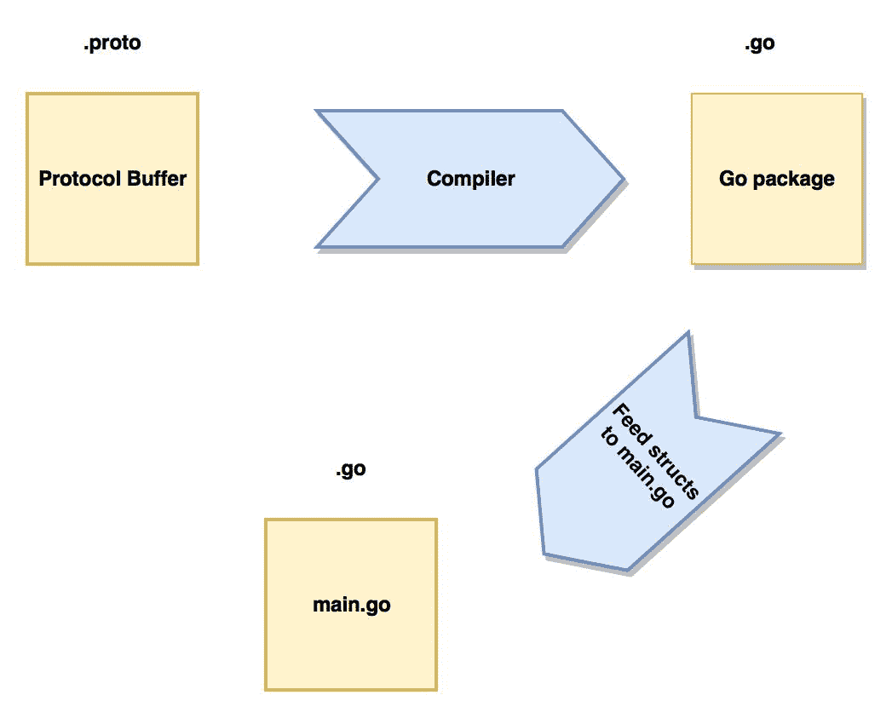
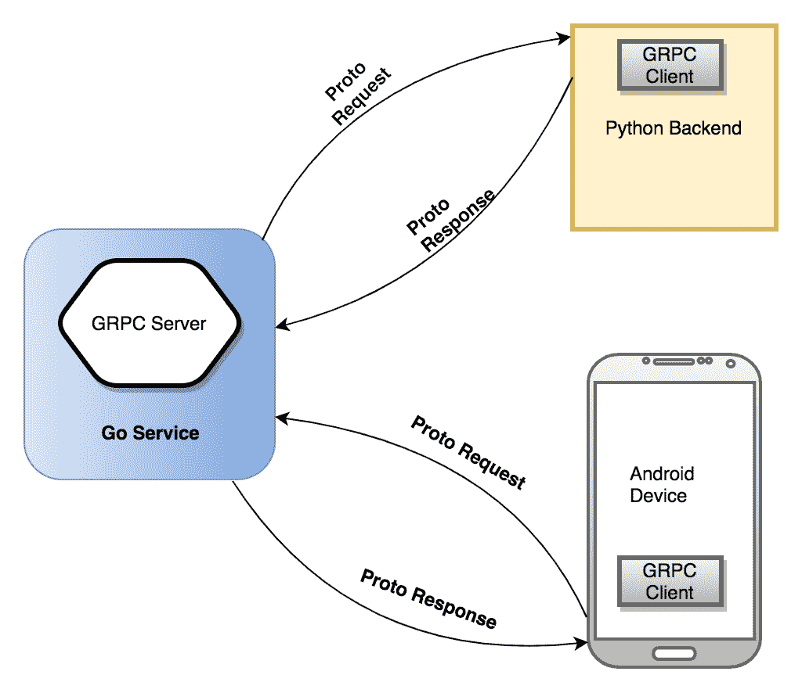

# 第六章：使用协议缓冲区和 GRPC

在本章中，我们将进入协议缓冲区的世界。我们将发现使用协议缓冲区而不是 JSON 的好处，以及何时使用两者。我们将使用 Google 的`proto`库来编译协议缓冲区。我们将尝试使用协议缓冲区编写一些可以与 Go 或其他应用程序（如 Python、NodeJS 等）通信的 Web 服务。然后，我们将解释 GRPC，一种高级简化的 RPC 形式。我们将学习 GRPC 和协议缓冲区如何帮助我们构建可以被任何客户端消费的服务。我们还将讨论 HTTP/2 及其优势，以及其在普通 HTTP/1.1 基于 JSON 的服务上的优势。

简而言之，我们将涵盖以下主题：

+   协议缓冲区介绍

+   协议缓冲区的格式

+   协议缓冲区的编译过程

+   GRPC，一个现代的 RPC 库

+   使用 GRPC 进行双向流

# 获取代码

您可以从[`github.com/narenaryan/gorestful/tree/master/chapter6`](https://github.com/narenaryan/gorestful/tree/master/chapter6)获取本章的代码示例。本章的示例是单个程序和项目的组合。因此，请将相应的目录复制到您的`GOPATH`中，以正确运行代码示例。

# 协议缓冲区介绍

HTTP/1.1 是 Web 社区采用的标准。近年来，由于其优势，HTTP/2 变得更加流行。使用 HTTP/2 的一些好处包括：

+   通过 TLS（HTTPS）加密数据

+   头部压缩

+   单个 TCP 连接

+   回退到 HTTP/1.1

+   所有主要浏览器的支持

谷歌关于协议缓冲区的技术定义是：

协议缓冲区是一种灵活、高效、自动化的序列化结构化数据的机制 - 想象一下 XML，但更小、更快、更简单。您只需定义一次您希望数据结构化的方式，然后您可以使用特殊生成的源代码轻松地将您的结构化数据写入和从各种数据流中读取，并使用各种语言。您甚至可以更新数据结构，而不会破坏针对“旧”格式编译的已部署程序。

在 Go 中，协议缓冲区与 HTTP/2 结合在一起。它们是一种类似 JSON 但严格类型化的格式，只能从客户端到服务器理解。首先，我们将了解为什么存在 protobufs（协议缓冲区的简称）以及如何使用它们。

协议缓冲区在序列化结构化数据方面比 JSON/XML 有许多优势，例如：

+   它们更简单

+   它们的大小是 JSON/XML 的 3 到 10 倍

+   它们快 20 到 100 倍

+   它们不太模棱两可

+   它们生成易于以编程方式使用的数据访问类

# 协议缓冲区语言

协议缓冲区是具有极简语法的文件。我们编译协议缓冲区，目标文件将为编程语言生成。例如，在 Go 中，编译后的文件将是一个`.go`文件，其中包含映射 protobuf 文件的结构。在 Java 中，将创建一个类文件。将协议缓冲区视为具有特定顺序的数据的骨架。在跳入实际代码之前，我们需要了解类型。为了使事情变得更容易，我将首先展示 JSON 及其在协议缓冲区中的等效内容。然后，我们将实施一个实例。

在这里，我们将使用**proto3**作为我们的协议缓冲区版本。版本之间存在细微差异，但最新版本已经发布并进行了改进。

有许多类型的协议缓冲区元素。其中一些是：

+   标量值

+   枚举

+   默认值

+   嵌套值

+   未知类型

首先，让我们看看如何在协议缓冲区中定义消息类型。在这里，我们尝试定义一个简单的网络接口消息：

```go
syntax 'proto3';

message NetworkInterface {
  int index = 1;
  int mtu = 2;
  string name = 3;
  string hardwareaddr = 4;
}
```

语法可能看起来很新。在前面的代码中，我们正在定义一个名为`NetworkInterface`的消息类型。它有四个字段：*index*、*最大传输单元（MTU）*、*名称*和*硬件地址（MAC）*。如果我们希望在 JSON 中写入相同的内容，它将如下所示：

```go
{
   "networkInterface": {
       "index" : 0,
       "mtu" : 68,
       "name": "eth0",
       "hardwareAddr": "00:A0:C9:14:C8:29"
   }
}
```

字段名称已更改以符合 JSON 样式指南，但本质和结构是相同的。但是，在 protobuf 文件中给字段分配的顺序号（1,2,3,4）是什么？它们是序列化和反序列化协议缓冲区数据在两个系统之间的顺序标签。这类似于提示协议缓冲区编码/解码系统按照特定顺序分别写入/读取数据。当上述 protobuf 文件被编译并生成编程语言目标时，协议缓冲区消息将被转换为 Go 结构，并且字段将填充为空的默认值。

# 标量值

我们为`networkInterface`消息中的字段分配的类型是标量类型。这些类型类似于 Go 类型，并且与它们完全匹配。对于其他编程语言，它们将转换为相应的类型。Protobuf 是为 Go 设计的，因此大多数类型（如`int`，`int32`，`int64`，`string`和`bool`）完全相同，但有一些不同。它们是：

| **Go 类型** | **Protobuf 类型** |
| --- | --- |
| float32 | float |
| float64 | double |
| uint32 | fixed32 |
| uint64 | fixed64 |
| []byte | bytes |

在定义 protbuf 文件中的消息时，应该牢记这些事情。除此之外，我们可以自由地使用其他 Go 类型作为普通标量类型。**默认值**是如果用户没有为这些标量值分配值，则将填充这些类型的值。我们都知道在任何给定的编程语言中，变量是被定义和赋值的。定义为变量分配内存，赋值为变量填充值。类比地，我们在前面的消息中定义的标量字段将被分配默认值。让我们看看给定类型的默认值：

| **Protobuf 类型** | **默认值** |
| --- | --- |
| 字符串 | "" |
| bytes | 空字节[] |
| bool | false |
| int，int32，int64，float，double | 0 |
| enum | 0 |

由于协议缓冲区使用数据结构在端系统之间达成协议，因此在 JSON 中不需要为键占用额外的空间。

# 枚举和重复字段

枚举为给定元素集提供数字的排序。默认值的顺序是从零到 n。因此，在协议缓冲区消息中，我们可以有一个枚举类型。让我们看一个`enum`的例子：

```go
syntax 'proto3';

message Schedule{
  enum Days{
     SUNDAY = 0;
     MONDAY = 1;
     TUESDAY = 2;
     WEDNESDAY = 3;
     THURSDAY = 4;
     FRIDAY = 5;
     SATURDAY = 6;
  }
}
```

如果我们需要为多个枚举成员分配相同的值怎么办。Protobuf3 允许使用名为**allow aliases**的选项来为两个不同的成员分配相同的值。例如：

```go
enum EnumAllowingAlias {
  option allow_alias = true;
  UNKNOWN = 0;
  STARTED = 1;
  RUNNING = 1;
}
```

在这里，`STARTED`和`RUNNING`都有一个`1`标签。这意味着数据中两者可以具有相同的值。如果我们尝试删除重复的值，我们还应该删除`allow_alias`选项。否则，proto 编译器会抛出错误（我们很快将看到 proto 编译器是什么）。

`Repeated`字段是协议缓冲区消息中表示项目列表的字段。在 JSON 中，对于给定的键，我们有一系列元素。同样，重复字段允许我们定义特定类型的元素的数组/列表：

```go
message Site{
   string url = 1;
   int latency = 2;
   repeated string proxies = 3;
}
```

在上述代码中，第三个字段是一个重复字段，这意味着它是一个代理的数组/列表。该值可以是诸如["100.104.112.10", "100.104.112.12"]之类的内容。除了重复字段，我们还可以使用其他消息作为类型。这类似于嵌套的 JSON。例如，看一下以下代码：

```go
{
  outerJSON: {
      outerKey1: val1,
      innerJSON: {
         innerKey1: val2
      }
  }
}
```

我们看到`innerJSON`嵌套在`outerJSON`的成员之一。我们如何在 protobuf 中建模相同的事物？我们可以使用嵌套消息来做到这一点，如下面的代码所示：

```go
message Site {
  string url = 1;
  int latency = 2;
  repeated Proxy proxies = 3;
}

message Proxy {
  string url = 1;
  int latency = 2;
}
```

在这里，我们将`Proxy`类型嵌套到`Site`中。我们很快将看到一个包含所有这些类型字段的真实示例。

# 使用 protoc 编译协议缓冲区

到目前为止，我们已经讨论了如何编写协议缓冲区文件，该文件以前是用 JSON 或其他数据格式编写的。但是，我们如何将其实际集成到我们的程序中呢？请记住，协议缓冲区是数据格式，不仅仅是数据格式。它们是各种系统之间的通信格式，类似于 JSON。这是我们在 Go 程序中使用 protobuf 的实际步骤：

1.  安装`protoc`命令行工具和`proto`库。

1.  编写一个带有`.proto`扩展名的 protobuf 文件。

1.  将其编译为目标编程语言（这里是 Go）。

1.  从生成的目标文件中导入结构并序列化数据。

1.  在远程机器上，接收序列化数据并将其解码为结构或类。

看一下下面的图表：



第一步是在我们的机器上安装`protobuf`编译器。为此，请从[`github.com/google/protobuf/releases`](https://github.com/google/protobuf/releases)下载`protobuf`包。在 macOS X 上，我们可以使用此命令安装`protobuf`：

```go
brew install protobuf
```

在 Ubuntu 或 Linux 上，我们可以将`protoc`复制到`/usr/bin`文件夹中：

```go
# Make sure you grab the latest version
curl -OL https://github.com/google/protobuf/releases/download/v3.3.0/protoc-3.3.0-linux-x86_64.zip
# Unzip
unzip protoc-3.3.0-linux-x86_64.zip -d protoc3
# Move only protoc* to /usr/bin/
sudo mv protoc3/bin/protoc /usr/bin/protoc
```

在 Windows 上，我们可以从[`github.com/google/protobuf/releases/download/v3.3.0/protoc-3.3.0-win32.zip`](https://github.com/google/protobuf/releases/download/v3.3.0/protoc-3.3.0-win32.zip)复制可执行文件（`.exe`）到`PATH`环境变量。让我们编写一个简单的协议缓冲区来说明如何编译和使用目标文件中的结构。使用以下命令在`$GOPATH/src/github.com/narenaryan`（这是我们 Go 项目的位置）中创建一个名为`protofiles`的文件夹：

```go
mkdir $GOPATH/src/github.com/narenaryan/protofiles
```

在这里，创建一个名为`person.proto`的文件，它模拟了一个人的信息。向其中添加一些消息，如下面的代码片段所示：

```go
syntax = "proto3";
package protofiles;

message Person {
  string name = 1;
  int32 id = 2;  // Unique ID number for this person.
  string email = 3;

  enum PhoneType {
    MOBILE = 0;
    HOME = 1;
    WORK = 2;
  }

  message PhoneNumber {
    string number = 1;
    PhoneType type = 2;
  }

  repeated PhoneNumber phones = 4;
}

// Our address book file is just one of these.
message AddressBook {
  repeated Person people = 1;
}
```

我们创建了两个主要消息，称为`AddressBook`和`Person`。`AddressBook`有一个人员列表。`Person`有`name`、`id`、`email`和`phone Number`。在第二行，我们将包声明为`protofiles`，如下所示：

```go
package protofiles;
```

这告诉编译器将生成的文件添加到给定包名称的相关位置。Go 不能直接使用这个`.proto`文件。我们需要将其编译为有效的 Go 文件。编译后，此包名称`protofiles`将用于设置输出文件（在本例中为 Go）的包。要编译此协议缓冲区文件，请转到`protofiles`目录并运行此命令：

```go
protoc --go_out=. *.proto
```

此命令将给定的协议缓冲区文件转换为具有相同名称的 Go 文件。运行此命令后，您将看到在同一目录中创建了一个新文件：

```go
[16:20:27] naren:protofiles git:(master*) $ ls -l
total 24
-rw-r--r-- 1 naren staff 5657 Jul 15 16:20 person.pb.go
-rw-r--r--@ 1 naren staff 433 Jul 15 15:58 person.proto
```

新文件名为`person.pb.go`。如果我们打开并检查此文件，它包含以下重要块：

```go
........
type Person_PhoneType int32

const (
  Person_MOBILE Person_PhoneType = 0
  Person_HOME   Person_PhoneType = 1
  Person_WORK   Person_PhoneType = 2
)

var Person_PhoneType_name = map[int32]string{
  0: "MOBILE",
  1: "HOME",
  2: "WORK",
}
var Person_PhoneType_value = map[string]int32{
  "MOBILE": 0,
  "HOME":   1,
  "WORK":   2,
}
.......
```

这只是该文件的一部分。将为给定的结构（如`Person`和`AddressBook`）创建许多 getter 和 setter 方法。此代码是自动生成的。我们需要在主程序中使用此代码来创建协议缓冲区字符串。现在，让我们创建一个名为`protobufs`的新目录。其中包含使用`person.pb.go`文件中的`Person`结构的`main.go`文件：

```go
mkdir $GOPATH/src/github.com/narenaryan/protobufs
```

现在，为了让 Go 将结构序列化为协议二进制格式，我们需要安装 Go proto 驱动程序。使用`go get`命令安装它：

```go
go get github.com/golang/protobuf/proto
```

之后，让我们编写`main.go`：

```go
package main

import (
  "fmt"

  "github.com/golang/protobuf/proto"
  pb "github.com/narenaryan/protofiles"
)

func main() {
  p := &pb.Person{
    Id:    1234,
    Name:  "Roger F",
    Email: "rf@example.com",
    Phones: []*pb.Person_PhoneNumber{
      {Number: "555-4321", Type: pb.Person_HOME},
    },
  }

  p1 := &pb.Person{}
  body, _ := proto.Marshal(p)
  _ = proto.Unmarshal(body, p1)
  fmt.Println("Original struct loaded from proto file:", p, "\n")
  fmt.Println("Marshaled proto data: ", body, "\n")
  fmt.Println("Unmarshaled struct: ", p1)
}
```

我们从`protofiles`包中导入**协议缓冲区**（**pb**）。在`proto files`中，有一些结构映射到给定的协议缓冲区。我们使用`Person`结构并对其进行初始化。然后，我们使用`proto.Marshal`函数对结构进行序列化。如果我们运行这个程序，输出如下：

```go
go run main.go
Original struct loaded from proto file: name:"Roger F" id:1234 email:"rf@example.com" phones:<number:"555-4321" type:HOME >

Marshaled proto data: [10 7 82 111 103 101 114 32 70 16 210 9 26 14 114 102 64 101 120 97 109 112 108 101 46 99 111 109 34 12 10 8 53 53 53 45 52 51 50 49 16 1]

Unmarshaled struct: name:"Roger F" id:1234 email:"rf@example.com" phones:<number:"555-4321" type:HOME >
```

序列化数据的第二个输出并不直观，因为`proto`库将数据序列化为二进制字节。协议缓冲区在 Go 中的另一个好处是，通过编译 proto 文件生成的结构体可以用于实时生成 JSON。让我们修改前面的例子。将其命名为`main_json.go`： 

```go
package main

import (
  "fmt"

  "encoding/json"
  pb "github.com/narenaryan/protofiles"
)

func main() {
  p := &pb.Person{
    Id:    1234,
    Name:  "Roger F",
    Email: "rf@example.com",
    Phones: []*pb.Person_PhoneNumber{
      {Number: "555-4321", Type: pb.Person_HOME},
    },
  }
  body, _ := json.Marshal(p)
  fmt.Println(string(body))
}
```

如果我们运行这个程序，它会打印一个 JSON 字符串，可以发送给任何能理解 JSON 的客户端：

```go
go run main_json.go

{"name":"Roger F","id":1234,"email":"rf@example.com","phones":[{"number":"555-4321","type":1}]}
```

任何其他语言或平台都可以轻松加载这个 JSON 字符串并立即使用数据。那么，使用协议缓冲区而不是 JSON 有什么好处呢？首先，协议缓冲区旨在使两个后端系统以更小的开销进行通信。由于二进制的大小比文本小，协议缓冲区序列化的数据比 JSON 的大小小。

通过使用协议缓冲区，我们可以将 JSON 和协议缓冲区格式映射到 Go 结构。这通过在转换一个格式到另一个格式时实现了两全其美。

但是，协议缓冲区只是一种数据格式。如果我们不进行通信，它们就没有任何重要性。因此，在这里，协议缓冲区用于以 RPC 的形式在两个端系统之间传递消息。我们看到了 RPC 是如何工作的，并且在前几章中还创建了 RPC 客户端和服务器。现在，我们将扩展这些知识，使用**Google 远程过程调用**（**GRPC**）与协议缓冲区来扩展我们的微服务通信。在这种情况下，服务器和客户端可以以协议缓冲区格式进行通信。

# GRPC 简介

GRPC 是一种在两个系统之间发送和接收消息的传输机制。这两个系统通常是服务器和客户端。正如我们在前几章中所描述的，RPC 可以在 Go 中实现以传输 JSON。我们称之为 JSON RPC 服务。同样，Google RPC 专门设计用于以协议缓冲区的形式传输数据。

GRPC 使服务创建变得简单而优雅。它提供了一套不错的 API 来定义服务并开始运行它们。在本节中，我们将主要关注如何创建 GRPC 服务并使用它。GRPC 的主要优势是它可以被多种编程语言理解。协议缓冲区提供了一个通用的数据结构。因此，这种组合使各种技术堆栈和系统之间能够无缝通信。这是分布式计算的核心概念。

Square、Netflix 等公司利用 GRPC 来扩展其庞大的流量服务。Google 的前产品经理 Andrew Jessup 在一次会议上表示，在 Google，每天处理数十亿次 GRPC 调用。如果任何商业组织需要采用 Google 的做法，它也可以通过对服务进行调整来处理流量需求。

在编写服务之前，我们需要安装`grpc` Go 库和`protoc-gen`插件。使用以下命令安装它们：

```go
go get google.golang.org/grpc
go get -u github.com/golang/protobuf/protoc-gen-go
```

GRPC 相对于传统的 HTTP/REST/JSON 架构具有以下优势：

+   GRPC 使用 HTTP/2，这是一种二进制协议

+   HTTP/2 中可以进行头部压缩，这意味着开销更小

+   我们可以在一个连接上复用多个请求

+   使用协议缓冲区进行数据的严格类型化

+   可以进行请求或响应的流式传输，而不是请求/响应事务

看一下下面的图表：



图表清楚地显示了任何后端系统或移动应用都可以通过发送协议缓冲区请求直接与 GRPC 服务器通信。让我们使用 GRPC 和协议缓冲区在 Go 中编写一个货币交易服务。在这里，我们将展示客户端和服务器的实现方式。步骤如下：

1.  为服务和消息创建协议缓冲区文件。

1.  编译协议缓冲区文件。

1.  使用生成的 Go 包创建一个 GRPC 服务器。

1.  创建一个与服务器通信的 GRPC 客户端。

对于这个项目，在你的 Go 工作空间中创建一个名为`datafiles`的文件夹（这里是`$GOPATH/src/github.com/narenaryan/`）：

```go
mkdir grpc_example
cd grpc_example
mkdir datafiles
```

在其中创建一个名为`transaction.proto`的文件，其中定义了消息和一个服务。我们很快将看到服务是什么：

```go
syntax = "proto3";
package datafiles;

message TransactionRequest {
   string from = 1;
   string to = 2;
   float amount = 3;
}

message TransactionResponse {
  bool confirmation = 1;
}

service MoneyTransaction {
    rpc MakeTransaction(TransactionRequest) returns (TransactionResponse) {}
}
```

这是服务器上的一个最简单的协议缓冲文件，用于货币交易。我们已经在 proto 文件中看到了关于消息关键字的信息。最后一个关键字`service`对我们来说是新的。`service`告诉 GRPC 将其视为服务，并且所有的 RPC 方法将作为实现此服务的服务器的接口。实现 Go 接口的结构体应该实现所有的函数。现在，让我们编译这个文件：

```go
protoc -I datafiles/ datafiles/transaction.proto --go_out=plugins=grpc:datafiles
```

这个命令比我们之前使用的命令稍微长一些。这是因为这里我们使用了`protoc-gen-go`插件。该命令简单地表示使用数据文件作为协议文件的输入目录，并使用相同的目录输出目标 Go 文件。现在，如果我们查看文件系统，将会有两个文件：

```go
-rw-r--r-- 1 naren staff 6215 Jul 16 17:28 transaction.pb.go
-rw-r--r-- 1 naren staff 294 Jul 16 17:28 transaction.proto
```

现在，在`$GOPATH/src/github.com/narenaryan/grpc_example`中创建另外两个目录，用于服务器和客户端逻辑。服务器实现了从 proto 文件生成的接口：

```go
mkdir grpcServer grpcClient
```

现在，将一个名为`server.go`的文件添加到`grpcServer`目录中，该文件实现了交易服务：

```go
package main

import (
  "log"
  "net"

  pb "github.com/narenaryan/grpc_example/datafiles"
  "golang.org/x/net/context"
  "google.golang.org/grpc"
  "google.golang.org/grpc/reflection"
)

const (
  port = ":50051"
)

// server is used to create MoneyTransactionServer.
type server struct{}

// MakeTransaction implements MoneyTransactionServer.MakeTransaction
func (s *server) MakeTransaction(ctx context.Context, in *pb.TransactionRequest) (*pb.TransactionResponse, error) {
  log.Printf("Got request for money Transfer....")
  log.Printf("Amount: %f, From A/c:%s, To A/c:%s", in.Amount, in.From, in.To)
  // Do database logic here....
  return &pb.TransactionResponse{Confirmation: true}, nil
}

func main() {
  lis, err := net.Listen("tcp", port)
  if err != nil {
    log.Fatalf("Failed to listen: %v", err)
  }
  s := grpc.NewServer()
  pb.RegisterMoneyTransactionServer(s, &server{})
  // Register reflection service on gRPC server.
  reflection.Register(s)
  if err := s.Serve(lis); err != nil {
    log.Fatalf("Failed to serve: %v", err)
  }
}
```

在前面的文件中发生了很多事情。首先，我们导入了所有必要的导入项。这里的新导入项是`context`和`reflection`。Context 用于创建一个`context`变量，它在 RPC 请求的整个生命周期内存在。这两个库都被 GRPC 用于其内部函数。

在解释下一节之前，如果我们打开生成的`transaction.pb.go`文件，我们可以清楚地看到有两件重要的事情：

+   `RegisterMoneyTransactionServer`函数

+   `MakeTransaction`函数作为`MoneyTransactionServer`接口的一部分。

为了实现一个服务，我们需要这两个东西：`MakeTransaction`用于实际的服务功能，以及`RegisterMoneyTransactionServer`用于注册服务（即创建一个在端口上运行的 RPC 服务器）。

`MakeTransaction`的`in`变量具有 RPC 请求的详细信息。它基本上是一个映射到我们在协议缓冲文件中定义的`TransactionRequest`消息的结构。从`MakeTransaction`返回的是`TransactionResponse`。这个函数签名与我们最初在协议缓冲文件中定义的函数签名匹配：

```go
rpc MakeTransaction(TransactionRequest) returns (TransactionResponse) {}
```

现在，让我们编写一个客户端。我们可以用任何编程语言编写客户端（或）服务器，但是在这里，我们为了理解 Go GRPC API，同时编写了一个客户端和服务器。在`grpcClient`目录中添加一个名为`client.go`的文件：

```go
package main

import (
  "log"

  pb "github.com/narenaryan/grpc_example/datafiles"
  "golang.org/x/net/context"
  "google.golang.org/grpc"
)

const (
  address = "localhost:50051"
)

func main() {
  // Set up a connection to the server.
  conn, err := grpc.Dial(address, grpc.WithInsecure())
  if err != nil {
    log.Fatalf("Did not connect: %v", err)
  }
  defer conn.Close()
  c := pb.NewMoneyTransactionClient(conn)

  // Prepare data. Get this from clients like Frontend or App
  from := "1234"
  to := "5678"
  amount := float32(1250.75)

  // Contact the server and print out its response.
  r, err := c.MakeTransaction(context.Background(), &pb.TransactionRequest{From: from,
    To: to, Amount: amount})
  if err != nil {
    log.Fatalf("Could not transact: %v", err)
  }
  log.Printf("Transaction confirmed: %t", r.Confirmation)
}
```

这个客户端也使用了`grpc`包。它使用一个名为`context.Background()`的空上下文传递给`MakeTransaction`函数。函数的第二个参数是`TransactionRequest`结构体：

```go
&pb.TransactionRequest{From: from, To: to, Amount: amount}
```

它与我们在上一节讨论的理论明显相符。现在，让我们运行它并查看输出。打开一个新的控制台，并使用以下命令运行 GRPC 服务器：

```go
go run $GOPATH/src/github.com/narenaryan/grpc_example/grpcServer/server.go
```

TCP 服务器开始监听端口`50051`。现在，打开另一个终端/Shell，并启动与该服务器通信的客户端程序：

```go
go run $GOPATH/src/github.com/narenaryan/grpc_example/grpcClient/client.go
```

它打印出成功交易的输出：

```go
2017/07/16 19:13:16 Transaction confirmed: true
```

同时，服务器将此消息记录到控制台中：

```go
2017/07/16 19:13:16 Amount: 1250.750000, From A/c:1234, To A/c:5678
```

在这里，客户端向 GRPC 服务器发出了一个请求，并传递了`From A/c`号码、`To A/c`号码和`Amount`的详细信息。服务器接收这些详细信息，处理它们，并发送一个回复，表示一切正常。

由于我在我的机器上运行代码示例，我在[github.com](https://github.com/)下有`narenaryan`作为项目目录。您可以用任何其他名称替换它。

# 使用 GRPC 进行双向流

GRPC 相对于传统的 HTTP/1.1 的主要优势在于它使用单个 TCP 连接在服务器和客户端之间发送和接收多个消息。我们之前看到了资金交易的示例。另一个现实世界的用例是出租车上安装的 GPS。在这里，出租车是客户端，它沿着路线发送其地理位置到服务器。最后，服务器可以根据点之间的时间和总距离计算总费用。

另一个这样的用例是当服务器需要在执行某些处理时通知客户端。这被称为服务器推送模型。当客户端仅请求一次时，服务器可以发送一系列结果。这与轮询不同，轮询中客户端每次都会请求。当需要执行一系列耗时步骤时，这可能很有用。GRPC 客户端可以将该作业升级到 GRPC 服务器。然后，服务器花费时间并将消息传递回客户端，客户端读取并执行有用的操作。让我们实现这个。

这个概念类似于 WebSockets，但适用于任何类型的平台。创建一个名为`serverPush`的项目：

```go
mkdir $GOPATH/src/github.com/narenaryan/serverPush
mkdir $GOPATH/src/github.com/narenaryan/serverPush/datafiles
```

现在，在`datafiles`中编写一个与之前类似的协议缓冲区：

```go
syntax = "proto3";
package datafiles;

message TransactionRequest {
   string from = 1;
   string to = 2;
   float amount = 3;
}

message TransactionResponse {
  string status = 1;
  int32 step = 2;
  string description = 3;
}

service MoneyTransaction {
    rpc MakeTransaction(TransactionRequest) returns (stream TransactionResponse) {}
}
```

在协议缓冲区文件中定义了两个消息和一个服务。令人兴奋的部分在于服务中，我们返回的是一个流而不是一个普通的响应：

```go
rpc MakeTransaction(TransactionRequest) returns (stream TransactionResponse) {}
```

该项目的用例是：*客户端向服务器发送资金转账请求，服务器执行一些任务，并将这些步骤详细信息作为一系列响应发送回服务器*。现在，让我们编译 proto 文件：

```go
protoc -I datafiles/ datafiles/transaction.proto --go_out=plugins=grpc:datafiles
```

这将在`datafiles`目录中创建一个名为`transaction.pb.go`的新文件。我们将在服务器和客户端程序中使用此文件中的定义，我们将很快创建。现在，让我们编写 GRPC 服务器代码。由于引入了流，这段代码与之前的示例有些不同：

```go
mkdir $GOPATH/src/github.com/narenaryan/serverPush/grpcServer
vi $GOPATH/src/github.com/narenaryan/serverPush/grpcServer/server.go
```

现在，将此程序添加到文件中：

```go
package main

import (
  "fmt"
  "log"
  "net"
  "time"

  pb "github.com/narenaryan/serverPush/datafiles"
  "google.golang.org/grpc"
  "google.golang.org/grpc/reflection"
)

const (
  port      = ":50051"
  noOfSteps = 3
)

// server is used to create MoneyTransactionServer.
type server struct{}

// MakeTransaction implements MoneyTransactionServer.MakeTransaction
func (s *server) MakeTransaction(in *pb.TransactionRequest, stream pb.MoneyTransaction_MakeTransactionServer) error {
  log.Printf("Got request for money transfer....")
  log.Printf("Amount: $%f, From A/c:%s, To A/c:%s", in.Amount, in.From, in.To)
  // Send streams here
  for i := 0; i < noOfSteps; i++ {
    // Simulating I/O or Computation process using sleep........
    // Usually this will be saving money transfer details in DB or
    // talk to the third party API
    time.Sleep(time.Second * 2)
    // Once task is done, send the successful message back to the client
    if err := stream.Send(&pb.TransactionResponse{Status: "good",
      Step:        int32(i),
      Description: fmt.Sprintf("Description of step %d", int32(i))}); err != nil {
      log.Fatalf("%v.Send(%v) = %v", stream, "status", err)
    }
  }
  log.Printf("Successfully transfered amount $%v from %v to %v", in.Amount, in.From, in.To)
  return nil
}

func main() {
  lis, err := net.Listen("tcp", port)
  if err != nil {
    log.Fatalf("Failed to listen: %v", err)
  }
  // Create a new GRPC Server
  s := grpc.NewServer()
  // Register it with Proto service
  pb.RegisterMoneyTransactionServer(s, &server{})
  // Register reflection service on gRPC server.
  reflection.Register(s)
  if err := s.Serve(lis); err != nil {
    log.Fatalf("Failed to serve: %v", err)
  }
}
```

`MakeTransaction`是我们感兴趣的函数。它以请求和流作为参数。在函数中，我们循环执行步骤的次数（这里是三次），并执行计算。服务器使用`time.Sleep`函数模拟模拟 I/O 或计算：

```go
stream.Send()
```

这个函数从服务器向客户端发送一个流式响应。现在，让我们编写客户端程序。这也与我们在前面的代码中看到的基本 GRPC 客户端有些不同。为客户端程序创建一个新目录：

```go
mkdir $GOPATH/src/github.com/narenaryan/serverPush/grpcClient
vi $GOPATH/src/github.com/narenaryan/serverPush/grpcClient/cilent.go
```

现在，在该文件中开始编写客户端逻辑：

```go
package main

import (
  "io"
  "log"

  pb "github.com/narenaryan/serverPush/datafiles"
  "golang.org/x/net/context"
  "google.golang.org/grpc"
)

const (
  address = "localhost:50051"
)

// ReceiveStream listens to the stream contents and use them
func ReceiveStream(client pb.MoneyTransactionClient, request *pb.TransactionRequest) {
  log.Println("Started listening to the server stream!")
  stream, err := client.MakeTransaction(context.Background(), request)
  if err != nil {
    log.Fatalf("%v.MakeTransaction(_) = _, %v", client, err)
  }
  // Listen to the stream of messages
  for {
    response, err := stream.Recv()
    if err == io.EOF {
      // If there are no more messages, get out of loop
      break
    }
    if err != nil {
      log.Fatalf("%v.MakeTransaction(_) = _, %v", client, err)
    }
    log.Printf("Status: %v, Operation: %v", response.Status, response.Description)
  }
}

func main() {
  // Set up a connection to the server.
  conn, err := grpc.Dial(address, grpc.WithInsecure())
  if err != nil {
    log.Fatalf("Did not connect: %v", err)
  }
  defer conn.Close()
  client := pb.NewMoneyTransactionClient(conn)

  // Prepare data. Get this from clients like Front-end or Android App
  from := "1234"
  to := "5678"
  amount := float32(1250.75)

  // Contact the server and print out its response.
  ReceiveStream(client, &pb.TransactionRequest{From: from,
    To: to, Amount: amount})
}
```

在这里，`ReceiveStream`是我们为了发送请求和接收一系列消息而编写的自定义函数。它接受两个参数：`MoneyTransactionClient`和`TransactionRequest`。它使用第一个参数创建一个流并开始监听它。当服务器耗尽所有消息时，客户端将停止监听并终止。然后，如果客户端尝试接收消息，将返回一个`io.EOF`错误。我们正在记录从 GRPC 服务器收集的响应。第二个参数`TransactionRequest`用于第一次向服务器发送请求。现在，运行它将使我们更清楚。在终端一上，运行 GRPC 服务器：

```go
go run $GOPATH/src/github.com/narenaryan/serverPush/grpcServer/server.go
```

它将继续监听传入的请求。现在，在第二个终端上运行客户端以查看操作：

```go
go run $GOPATH/src/github.com/narenaryan/serverPush/grpcClient/client.go
```

这将在控制台上输出以下内容：

```go
2017/07/16 15:08:15 Started listening to the server stream!
2017/07/16 15:08:17 Status: good, Operation: Description of step 0
2017/07/16 15:08:19 Status: good, Operation: Description of step 1
2017/07/16 15:08:21 Status: good, Operation: Description of step 2
```

同时，服务器还在终端一上记录自己的消息：

```go
2017/07/16 15:08:15 Got request for money Transfer....
2017/07/16 15:08:15 Amount: $1250.750000, From A/c:1234, To A/c:5678
2017/07/16 15:08:21 Successfully transfered amount $1250.75 from 1234 to 5678
```

这个过程与服务器同步进行。客户端保持活动状态，直到所有流式消息都被发送回来。服务器可以同时处理任意数量的客户端。每个客户端请求被视为一个独立的实体。这是服务器发送一系列响应的示例。还有其他情况可以使用协议缓冲区和 GRPC 实现：

+   客户端发送流式请求，以从服务器获取最终响应。

+   客户端和服务器都同时发送流式请求和响应

官方的 GRPC 团队在 GitHub 上提供了一个很好的出租车路线示例。您可以查看它以了解双向流的功能。

[`github.com/grpc/grpc-go/tree/master/examples/route_guide`](https://github.com/grpc/grpc-go/tree/master/examples/route_guide)。

# 总结

在本章中，我们从理解协议缓冲的基础知识开始我们的旅程。然后，我们遇到了协议缓冲语言，它有许多类型，如标量、枚举和重复类型。我们看到了 JSON 和协议缓冲之间的一些类比。我们了解了为什么协议缓冲比纯 JSON 数据格式更节省内存。我们通过模拟网络接口定义了一个样本协议缓冲。`message`关键字用于在协议缓冲中定义消息。

接下来，我们安装了`protoc`编译器来编译我们用协议缓冲语言编写的文件。然后，我们看到如何编译`.proto`文件以生成一个`.go`文件。这个 Go 文件包含了主程序消耗的所有结构和接口。接下来，我们为一个地址簿和人员编写了一个协议缓冲。我们看到了如何使用`grpc.Marshal`将 Go 结构序列化为二进制可传输数据。我们还发现，在 Go 中，协议缓冲与 JSON 之间的转换非常容易实现。

然后，我们转向了使用协议缓冲的谷歌 RPC 技术 GRPC。我们看到了 HTTP/2 和 GRPC 的好处。然后，我们定义了一个 GRPC 服务和协议缓冲形式的数据。接下来，我们实现了一个 GRPC 服务器和 GRPC，关于从`.proto`生成的文件。

GRPC 提供了双向和多路传输机制。这意味着它可以使用单个 TCP 连接进行所有消息传输。我们实现了一个这样的场景，客户端向服务器发送消息，服务器回复一系列消息。
