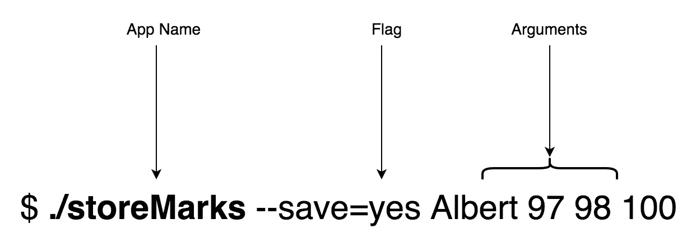
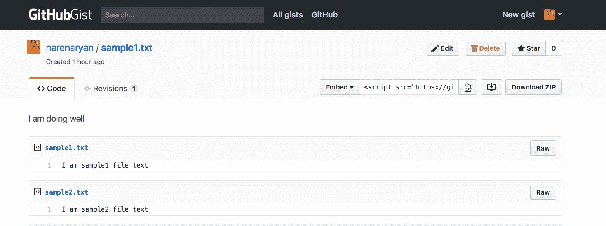
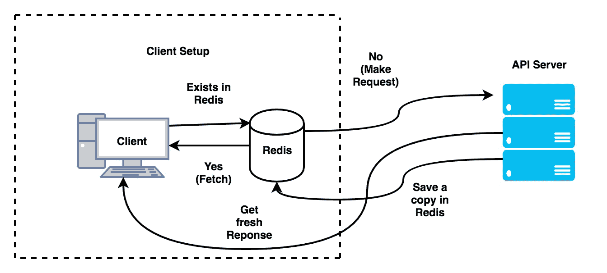

# 使用 Go 构建 REST API 客户端和单元测试

在本章中，我们将深入讨论 Go 客户端应用程序的工作原理。我们将探索`grequests`，这是一个类似 Python 请求的库，允许我们从 Go 代码中进行 API 调用。然后，我们将编写一个使用 GitHub API 的客户端软件。在此过程中，我们将尝试了解两个名为`cli`和`cobra`的出色库。在掌握了这些基础知识后，我们将尝试使用这些知识在命令行上编写 API 测试工具。然后我们将了解 Redis，这是一个内存数据库，我们可以用它来缓存 API 响应以备份数据。

在本章中，我们将涵盖以下主题：

+   什么是客户端软件？

+   Go 中编写命令行工具的基础知识

+   介绍`grequests`，Go 中类似 Python 请求的库

+   从 Go 客户端检查 GitHub REST API

+   在 Go 中创建 API 客户端

+   缓存 API 以备后用

+   为 API 创建一个单元测试工具

# 获取代码

您可以在 GitHub 存储库链接[`github.com/narenaryan/gorestful/tree/master/chapter8`](https://github.com/narenaryan/gorestful/tree/master/chapter8)中获取本章的代码示例。本章包含单个程序和项目的组合示例。因此，请将相应的目录复制到您的`GOPATH`中，以正确运行代码示例。对于 URL 缩短服务的单元测试的最后一个示例，测试可在[`github.com/narenaryan/gorestful/tree/master/chapter7`](https://github.com/narenaryan/gorestful/tree/master/chapter7)中找到。

# 构建 REST API 客户端的计划

到目前为止，我们主要关注编写服务器端 REST API。基本上，它们是服务器程序。在一些情况下，例如 GRPC，我们还需要客户端。但是真正的客户端程序会从用户那里获取输入并执行一些逻辑。要使用 Go 客户端，我们应该了解 Go 中的`flag`库。在此之前，我们应该知道如何从 Go 程序中对 API 进行请求。在之前的章节中，我们假设客户端可以是 CURL、浏览器、Postman 等。但是我们如何从 Go 中消费 API 呢？

命令行工具与 Web 用户界面一样重要，用于执行系统任务。在**企业对企业**（**B2B**）公司中，软件打包为单个二进制文件，而不是多个不同的部分。作为 Go 开发人员，您应该知道如何实现为命令行编写应用程序的目标。然后，可以利用这些知识轻松而优雅地创建与 REST API 相关的 Web 客户端。

# Go 中编写命令行工具的基础知识

Go 提供了一个名为`flag`的基本库。它指的是命令行标志。由于它已经打包在 Go 发行版中，因此无需外部安装任何内容。我们可以看到编写命令行工具的绝对基础知识。`flag`包具有多个函数，例如`Int`和`String`，用于处理作为命令行标志给定的输入。假设我们需要从用户那里获取一个名称并将其打印回控制台。我们使用`flag.String`方法，如下面的代码片段所示：

```go
import "flag"
var name = flag.String("name", "No Namer", "your wonderful name")
```

让我们写一个简短的程序以获得清晰的细节。在您的`$GOPATH/src/github.com/narenaryan`中创建一个名为`flagExample.go`的文件，并添加以下内容：

```go
package main

import (
  "flag"
  "log"
  )

var name = flag.String("name", "stranger", "your wonderful name")

func main(){
  flag.Parse()
  log.Printf("Hello %s, Welcome to the command line world", *name)
}
```

在这个程序中，我们创建了一个名为`name`的标志。它是一个字符串指针。`flag.String`接受三个参数。第一个是参数的名称。第二个和第三个是该标志的默认值和帮助文本。然后我们要求程序解析所有标志指针。当我们运行程序时，它实际上会将值从命令行填充到相应的变量中。要访问指针的值，我们使用`*`。首先构建，然后使用以下命令运行程序：

```go
go build flagExample.go
```

这将在相同的目录中创建一个二进制文件。我们可以像运行普通可执行文件一样运行它：

```go
./flagExample
```

它给出以下输出：

```go
Hello stranger, Welcome to the command line world
```

在这里，我们没有给出名为`name`的参数。但是我们已经为该参数分配了默认值。Go 的标志获取默认值并继续。现在，为了查看可用的选项并了解它们，可以请求帮助：

```go
./flagExample -h

Output
========
Usage of ./flagExample:
 -name string
 your wonderful name (default "stranger") 
```

这就是我们将帮助文本作为标志命令的第三个参数的原因。

在 Windows 中，当我们构建一个`.go`文件时，将生成`flagExample.exe`。之后，我们可以通过调用程序名称从命令行运行该程序。

现在尝试添加参数，它会打印给定的名称：

```go
./flagExample -name Albert
(or)
./flagExample -name=Albert
```

这两个参数都可以正常工作，给出输出：

```go
Hello Albert, Welcome to the command line world
```

如果我们需要收集多个参数，我们需要修改前面的程序为：

```go
package main

import (
  "flag"
  "log"
  )

var name = flag.String("name", "stranger", "your wonderful name")
var age = flag.Int("age", 0, "your graceful age")

func main(){
  flag.Parse()
  log.Printf("Hello %s (%d years), Welcome to the command line world", *name, *age)
}
```

这需要两个参数，只是另一种类型的额外添加。如果我们运行这个，我们会看到输出：

```go
./flagExampleMultiParam -name Albert -age 24

Hello Albert (24 years), Welcome to the command line world
```

这正是我们所期望的。我们可以将变量绑定到解析输出，而不是使用指针。这种绑定是通过`init()`函数完成的，无论主函数是否存在，它都会在 Go 程序中运行：

```go
var name String 
func init() {
  flag.IntVar(&name, "name", "stranger", "your wonderful name")
}
```

这样，值将直接传递并存储在变量中。使用`init()`函数完全重写前面的程序如下所示：

`initFlag.go`：

```go
package main

import (
  "flag"
  "log"
  )

var name string
var age int

func init() {
  flag.StringVar(&name, "name", "stranger", "your wonderful name")
  flag.IntVar(&age, "age", 0, "your graceful age")
}

func main(){
  flag.Parse()
  log.Printf("Hello %s (%d years), Welcome to the command line world", name, age)
}
```

输出与前面的程序完全相同。在这里，我们可以直接将数据加载到我们的变量中，而不是使用指针。

在 Go 中，执行从`main`程序开始。但是 Go 程序可以有任意数量的`init`函数。如果一个包中有`init`函数，它将被执行。

这个`flag`库非常基础。但是为了编写高级客户端应用程序，我们需要借助该库。在下一节中，我们将看看这样一个库。

# CLI - 用于构建美观客户端的库

这是在玩`flag`包后 Go 开发人员的下一步。它提供了一个直观的 API，可以轻松创建命令行应用程序。它允许我们收集参数和标志。对于设计复杂的应用程序来说，这可能非常方便。要安装该包，请使用以下命令：

```go
go get github.com/urfave/cli
```

之后，让我们编写一个与前面程序完全相同的程序：

`cli/cliBasic.go`：

```go
package main

import (
  "log"
  "os"

  "github.com/urfave/cli"
)

func main() {
  // Create new app
  app := cli.NewApp()

  // add flags with three arguments
  app.Flags = []cli.Flag {
    cli.StringFlag{
      Name: "name",
      Value: "stranger",
      Usage: "your wonderful name",
    },
    cli.IntFlag{
      Name: "age",
      Value: 0,
      Usage: "your graceful age",
    },
  }
  // This function parses and brings data in cli.Context struct
  app.Action = func(c *cli.Context) error {
    // c.String, c.Int looks for value of given flag
    log.Printf("Hello %s (%d years), Welcome to the command line world", c.String("name"), c.Int("age"))
    return nil
  }
  // Pass os.Args to cli app to parse content
  app.Run(os.Args)
}
```

这比之前的程序更长，但更具表现力。我们使用`cli.NewApp`函数创建了一个新的应用程序。它创建了一个新的结构。我们需要将一些参数附加到这个结构。它们是`Flags`结构和`Action`函数。`Flags`结构是一个列表，定义了该应用程序的所有可能的标志。`Flag`的结构来自**GoDoc** ([`godoc.org/github.com/urfave/cli#Flag`](https://godoc.org/github.com/urfave/cli#Flag))：

```go
type Flag interface {
    fmt.Stringer
    // Apply Flag settings to the given flag set
    Apply(*flag.FlagSet)
    GetName() string
}
```

内置的结构，如`StringFlag`和`IntFlag`，实现了`Flag`接口。`Name`，`Value`和`Usage`都很简单。它们类似于`flag`包中使用的那些。`Action`函数接受`cli.Context`参数。该上下文对象包含有关标志和命令行参数的所有信息。我们可以使用它们并对它们应用逻辑。`c.String`，`c.Int`和其他函数用于查找标志变量。例如，在前面的程序中，`c.String("name")`获取了一个名为`name`的标志变量。该程序与以前的程序运行相同：

```go
go build cli/cliBasic.go
```

# 在 CLI 中收集命令行参数

命令行参数和标志之间存在区别。以下图表清楚地说明了它们之间的区别：



假设我们有一个名为 storeMarks 的命令行应用程序，用于保存学生的成绩。它有一个标志（称为`save`）来指定是否应将详细信息推送到数据库。给定的参数是学生的姓名和实际成绩。我们已经看到如何在程序中收集标志值。在本节中，我们将看到如何以富有表现力的方式收集程序参数。

为了收集参数，我们使用`c.Args`函数，其中`c`是`Action`函数的`cli`上下文。创建一个名为`cli`的目录，并添加一个新程序`cli/storeMarks.go`：

```go
package main

import (
  "github.com/urfave/cli"
  "log"
  "os"
)

func main() {
  app := cli.NewApp()
  // define flags
  app.Flags = []cli.Flag{
    cli.StringFlag{
      Name:  "save",
      Value: "no",
      Usage: "Should save to database (yes/no)",
    },
  }

  app.Version = "1.0"
  // define action
  app.Action = func(c *cli.Context) error {
    var args []string
    if c.NArg() > 0 {
      // Fetch arguments in a array
      args = c.Args()
      personName := args[0]
      marks := args[1:len(args)]
      log.Println("Person: ", personName)
      log.Println("marks", marks)
    }
    // check the flag value
    if c.String("save") == "no" {
      log.Println("Skipping saving to the database")
    } else {
      // Add database logic here
      log.Println("Saving to the database", args)
    }
    return nil
  }

  app.Run(os.Args)
}
```

`c.Args`保存了我们输入的所有参数。由于我们知道参数的顺序，我们推断第一个参数是名称，其余的值是分数。我们正在检查一个名为`save`的标志，以确定是否将这些详细信息保存在数据库中（这里我们没有数据库逻辑，为简单起见）。`app.Version`设置了工具的版本。其他所有内容与上一个程序相同。

让我们运行这个程序，看看输出：

```go
go build cli/storeMarks.go
```

运行程序：

```go
./storeMarks --save=yes Albert 89 85 97

2017/09/02 21:02:02 Person: Albert
2017/09/02 21:02:02 marks [89 85 97]
2017/09/02 21:02:02 Saving to the database [Albert 89 85 97]
```

如果我们不给出任何标志，默认值是`save=no`：

```go
./storeMarks Albert 89 85 97

2017/09/02 21:02:59 Person: Albert
2017/09/02 21:02:59 marks [89 85 97]
2017/09/02 21:02:59 Skipping saving to the database
```

到目前为止一切看起来都很好。但是当用户需要时，该工具如何显示帮助？`cli`库已经为给定的应用程序创建了一个很好的帮助部分。输入任何这些命令，帮助文本将被自动生成：

+   `./storeMarks -h`（或）

+   `./storeMarks -help`（或）

+   `./storeMarks --help`

+   `./storeMarks help`

一个很好的帮助部分出现了，像这样显示版本详细信息和可用标志（全局选项）、命令和参数：

```go
NAME:
 storeMarks - A new cli application

USAGE:
 storeMarks [global options] command [command options] [arguments...]

VERSION:
 1.0

COMMANDS:
 help, h Shows a list of commands or help for one command

GLOBAL OPTIONS:
 --save value Should save to database (yes/no) (default: "no")
 --help, -h show help
 --version, -v print the version
```

这实际上使构建客户端应用程序变得更容易。它比内部的`flag`包更快、更直观。

命令行工具是在构建程序后生成的二进制文件。它们需要以选项运行。这就像任何系统程序一样，不再与 Go 编译器相关

# grequests - 用于 Go 的 REST API 包

Python 的开发人员知道`Requests`库。这是一个干净、简短的库，不包括在 Python 的标准库中。Go 包`grequests`受到该库的启发。它提供了一组简单的函数，使用这些函数我们可以从 Go 代码中进行 API 请求，如`GET`、`POST`、`PUT`和`DELETE`。使用`grequests`允许我们封装内置的 HTTP 请求和响应。要为 Go 安装`grequests`包，请运行以下命令：

```go
go get -u github.com/levigross/grequests
```

现在，看一下这个基本程序，演示了使用`grequests`库向 REST API 发出`GET`请求。在 Go 源目录中创建一个名为`grequests`的目录，并添加一个名为`basicRequest.go`的文件，如下面的代码片段所示：

```go
package main

import (
  "github.com/levigross/grequests"
  "log"
)

func main() {
  resp, err := grequests.Get("http://httpbin.org/get", nil)
  // You can modify the request by passing an optional RequestOptions struct
  if err != nil {
    log.Fatalln("Unable to make request: ", err)
  }
  log.Println(resp.String())
}
```

`grequests`包具有执行所有 REST 操作的方法。上面的程序使用了包中的`Get`函数。它接受两个函数参数。第一个是 API 的 URL，第二个是请求参数对象。由于我们没有传递任何请求参数，这里的第二个参数是`nil`。`resp`是从请求返回的，它有一个名为`String()`的函数，返回响应体：

```go
go run grequests/basicRequest.go
```

输出是`httpbin`返回的 JSON 响应：

```go
{
  "args": {},
  "headers": {
    "Accept-Encoding": "gzip",
    "Connection": "close",
    "Host": "httpbin.org",
    "User-Agent": "GRequests/0.10"
  },
  "origin": "116.75.82.9",
  "url": "http://httpbin.org/get"
}
```

# grequests 的 API 概述

在`grequests`中探索的最重要的事情不是 HTTP 函数，而是`RequestOptions`结构。这是一个非常大的结构，包含有关 API 方法类型的各种信息。如果 REST 方法是`GET`，`RequestOptions`将包含`Params`属性。如果方法是`POST`，该结构将具有`Data`属性。每当我们发出请求，我们都会得到一个响应。让我们看看响应的结构。根据官方文档，响应如下所示：

```go
type Response struct {
    Ok bool
    Error error
    RawResponse *http.Response
    StatusCode int
    Header http.Header
}
```

响应的`Ok`属性保存了有关请求是否成功的信息。如果出现问题，错误将填入`Error`属性。`RawResponse`是 Go HTTP 响应，将被`grequests`响应的其他函数使用。`StatusCode`和`Header`分别存储响应的状态代码和头部详细信息。`Response`中有一些有用的函数：

+   JSON

+   XML

+   String

+   Bytes

可以通过将空接口传递给函数来调用获取的响应，如`grequests/jsonRequest.go`：

```go
package main

import (
  "github.com/levigross/grequests"
  "log"
)

func main() {
  resp, err := grequests.Get("http://httpbin.org/get", nil)
  // You can modify the request by passing an optional RequestOptions struct
  if err != nil {
    log.Fatalln("Unable to make request: ", err)
  }
  var returnData map[string]interface{}
  resp.JSON(&returnData)
  log.Println(returnData)

}
```

我们声明了一个接口来保存 JSON 值。然后使用`resp.JSON`函数填充了`returnData`（空接口）。该程序打印地图而不是纯粹的 JSON。

# 熟悉 GitHub REST API

GitHub 提供了一个很好的 REST API 供用户使用。它通过 API 向客户端开放有关用户、存储库、存储库统计等数据。当前稳定版本为 v3。API 文档可以在[`developer.github.com/v3/`](https://developer.github.com/v3/)找到。API 的根端点是：

```go
curl https://api.github.com
```

其他 API 将添加到此基本 API 中。现在让我们看看如何进行一些查询并获取与各种元素相关的数据。对于未经身份验证的用户，速率限制为 60/小时，而对于传递`client_id`（可以从 GitHub 帐户获取）的客户端，速率限制为 5,000/小时。

如果您有 GitHub 帐户（如果没有，建议您创建一个），您可以在您的个人资料|个人访问令牌区域或通过访问[`github.com/settings/tokens`](https://github.com/settings/tokens)找到访问令牌。使用`Generate new token`按钮创建一个新的访问令牌。它要求各种权限和资源类型。全部选中。将生成一个新的字符串。将其保存到某个私人位置。我们生成的令牌可以用于访问 GitHub API（以获得更长的速率限制）。

下一步是将访问令牌保存到环境变量**`GITHUB_TOKEN`**中。为此，请打开您的**`~/.profile`**或**`~/.bashrc`**文件，并将其添加为最后一行：

```go
export GITHUB_TOKEN=YOUR_GITHUB_ACCESS_TOKEN
```

`YOUR_GITHUB_ACCESS_TOKEN`是之前从 GitHub 帐户生成并保存的。让我们创建一个程序来获取给定用户的所有存储库。创建一个名为`githubAPI`的新目录，并创建一个名为`getRepos.go`的程序文件：

```go
package main

import (
  "github.com/levigross/grequests"
  "log"
  "os"
)

var GITHUB_TOKEN = os.Getenv("GITHUB_TOKEN")
var requestOptions = &grequests.RequestOptions{Auth: []string{GITHUB_TOKEN, "x-oauth-basic"}}

type Repo struct {
  ID int `json:"id"`
  Name string `json:"name"`
  FullName string  `json:"full_name"`
  Forks int `json:"forks"`
  Private bool `json:"private"`
}

func getStats(url string) *grequests.Response{
  resp, err := grequests.Get(url, requestOptions)
  // You can modify the request by passing an optional RequestOptions struct
  if err != nil {
    log.Fatalln("Unable to make request: ", err)
  }
  return resp
}

func main() {
  var repos []Repo
  var repoUrl = "https://api.github.com/users/torvalds/repos"
  resp := getStats(repoUrl)
  resp.JSON(&repos)
  log.Println(repos)
}
```

运行程序，您将看到以下输出：

```go
2017/09/03 17:59:41 [{79171906 libdc-for-dirk torvalds/libdc-for-dirk 10 false} {2325298 linux torvalds/linux 18274 false} {78665021 subsurface-for-dirk torvalds/subsurface-for-dirk 16 false} {86106493 test-tlb torvalds/test-tlb 25 false}]
```

打印输出不是 JSON，而是 Go `Repo` `struct`的列表。前面的程序说明了我们如何查询 GitHub API 并将数据加载到我们的自定义结构中：

```go
type Repo struct {
  ID int `json:"id"`
  Name string `json:"name"`
  FullName string  `json:"full_name"`
  Forks int `json:"forks"`
  Private bool `json:"private"`
}
```

这是我们用于保存存储库详细信息的结构。返回的 JSON 有许多字段，但为简单起见，我们只是从中摘取了一些重要字段：

```go
var GITHUB_TOKEN = os.Getenv("GITHUB_TOKEN")
var requestOptions = &grequests.RequestOptions{Auth: []string{GITHUB_TOKEN, "x-oauth-basic"}}
```

在第一行，我们正在获取名为`GITHUB_TOKEN`的环境变量。`os.Getenv`函数通过给定的名称返回环境变量的值。为了使 GitHub 假定`GET`请求的来源，我们应该设置身份验证。为此，将参数传递给`RequestOptions`结构。该参数应该是用户名和密码的列表。

# 创建一个 CLI 工具作为 GitHub REST API 的 API 客户端

在查看了这个例子之后，我们能够轻松地从我们的 Go 客户端访问 GitHub API。到目前为止，我们可以结合本章学到的两种技术，来设计一个使用 GitHub API 的命令行工具。让我们创建一个新的命令行应用程序，其中：

+   提供按用户名获取存储库详细信息的选项

+   使用给定描述将任何文件上传到 GitHub gists（文本片段）

+   使用个人访问令牌进行身份验证

Gists 是 GitHub 提供的存储文本内容的片段。有关更多详细信息，请访问[`gist.github.com`](https://gist.github.com)。

在`githubAPI`目录中创建一个名为**`gitTool.go`**的程序。这将是前面程序规范的逻辑：

```go
package main

import (
  "encoding/json"
  "fmt"
  "github.com/levigross/grequests"
  "github.com/urfave/cli"
  "io/ioutil"
  "log"
  "os"
)

var GITHUB_TOKEN = os.Getenv("GITHUB_TOKEN")
var requestOptions = &grequests.RequestOptions{Auth: []string{GITHUB_TOKEN, "x-oauth-basic"}}

// Struct for holding response of repositories fetch API
type Repo struct {
  ID       int    `json:"id"`
  Name     string `json:"name"`
  FullName string `json:"full_name"`
  Forks    int    `json:"forks"`
  Private  bool   `json:"private"`
}

// Structs for modelling JSON body in create Gist
type File struct {
  Content string `json:"content"`
}

type Gist struct {
  Description string          `json:"description"`
  Public      bool            `json:"public"`
  Files       map[string]File `json:"files"`
}

// Fetches the repos for the given Github users
func getStats(url string) *grequests.Response {
  resp, err := grequests.Get(url, requestOptions)
  // you can modify the request by passing an optional RequestOptions struct
  if err != nil {
    log.Fatalln("Unable to make request: ", err)
  }
  return resp
}

// Reads the files provided and creates Gist on github
func createGist(url string, args []string) *grequests.Response {
  // get first teo arguments
  description := args[0]
  // remaining arguments are file names with path
  var fileContents = make(map[string]File)
  for i := 1; i < len(args); i++ {
    dat, err := ioutil.ReadFile(args[i])
    if err != nil {
      log.Println("Please check the filenames. Absolute path (or) same directory are allowed")
      return nil
    }
    var file File
    file.Content = string(dat)
    fileContents[args[i]] = file
  }
  var gist = Gist{Description: description, Public: true, Files: fileContents}
  var postBody, _ = json.Marshal(gist)
  var requestOptions_copy = requestOptions
  // Add data to JSON field
  requestOptions_copy.JSON = string(postBody)
  // make a Post request to Github
  resp, err := grequests.Post(url, requestOptions_copy)
  if err != nil {
    log.Println("Create request failed for Github API")
  }
  return resp
}

func main() {
  app := cli.NewApp()
  // define command for our client
  app.Commands = []cli.Command{
    {
      Name:    "fetch",
      Aliases: []string{"f"},
      Usage:   "Fetch the repo details with user. [Usage]: goTool fetch user",
      Action: func(c *cli.Context) error {
        if c.NArg() > 0 {
          // Github API Logic
          var repos []Repo
          user := c.Args()[0]
          var repoUrl = fmt.Sprintf("https://api.github.com/users/%s/repos", user)
          resp := getStats(repoUrl)
          resp.JSON(&repos)
          log.Println(repos)
        } else {
          log.Println("Please give a username. See -h to see help")
        }
        return nil
      },
    },
    {
      Name:    "create",
      Aliases: []string{"c"},
      Usage:   "Creates a gist from the given text. [Usage]: goTool name 'description' sample.txt",
      Action: func(c *cli.Context) error {
        if c.NArg() > 1 {
          // Github API Logic
          args := c.Args()
          var postUrl = "https://api.github.com/gists"
          resp := createGist(postUrl, args)
          log.Println(resp.String())
        } else {
          log.Println("Please give sufficient arguments. See -h to see help")
        }
        return nil
      },
    },
  }

  app.Version = "1.0"
  app.Run(os.Args)
}
```

在深入解释细节之前，让我们运行程序。这清楚地说明了我们如何实现该程序：

```go
go build githubAPI/gitTool.go
```

它在相同的目录中创建一个二进制文件。如果您键入`./gitTool -h`，它会显示：

```go
NAME:
 gitTool - A new cli application

USAGE:
 gitTool [global options] command [command options] [arguments...]

VERSION:
 1.0

COMMANDS:
 fetch, f Fetch the repo details with user. [Usage]: goTool fetch user
 create, c Creates a gist from the given text. [Usage]: goTool name 'description' sample.txt
 help, h Shows a list of commands or help for one command

GLOBAL OPTIONS:
 --help, -h show help
 --version, -v print the version
```

如果您查看帮助命令，有两个命令，`fetch`和`create`。`fetch`获取给定用户的存储库，`create`创建一个带有提供的文件的`gist`。让我们在程序的相同目录中创建两个示例文件，以测试`create`命令：

```go
echo 'I am sample1 file text' > githubAPI/sample1.txt
echo 'I am sample2 file text' > githubAPI/sample2.txt
```

使用第一个命令运行该工具：

```go
./gitTool f torvalds
```

它返回所有属于伟大的 Linus Torvalds 的存储库。日志消息打印填充的结构：

```go
[{79171906 libdc-for-dirk torvalds/libdc-for-dirk 10 false} {2325298 linux torvalds/linux 18310 false} {78665021 subsurface-for-dirk torvalds/subsurface-for-dirk 16 false} {86106493 test-tlb torvalds/test-tlb 25 false}]
```

现在，让我们检查第二个命令。它使用给定的描述和一组文件作为参数创建`gist`：

```go
./gitTool c "I am doing well" sample1.txt sample2.txt
```

它返回有关创建的`gist`的 JSON 详细信息。这是一个非常冗长的 JSON，所以这里跳过输出。然后，打开您的[gist.github.com](https://gist.github.com/)帐户，您将看到创建的`gist`：



现在，来解释一下，我们首先导入`grequests`以进行 API 调用和`cli`以构建命令行工具。其他导入是必要的，以便读取文件，记录到控制台和编码 JSON。然后我们定义了三个结构：`Repo`，`File`和`Gist`。GitHub 的`gists` API 需要 JSON 数据来创建：

```go
{
  "description": "the description for this gist",
  "public": true,
  "files": {
    "file1.txt": {
      "content": "String file contents"
    }
  }
}
```

`grequests`的`POST`请求使用具有`Data`作为字段的`requestOptions`。但它的签名是`Map[string]string]`，这不足以创建前面的结构。`grequests`允许我们传递任何结构的 JSON 字符串到 API。我们创建了结构，以便数据可以填充并编组成适当的 JSON 以使`POST`请求成功。

然后，我们创建了两个函数：`getStats`（返回给定用户的所有存储库详细信息）和`createGist`（使用给定的描述和文件名创建新的`gist`文件）。第二个函数更有趣。我们正在传递一个 URL 进行`POST`请求，描述和`file_names`以`args`数组的形式。然后，我们正在迭代每个文件并获取内容。我们正在调整我们的结构，以便`POST`请求的最终 JSON 主体将具有相同的结构。最后，我们使用具有我们的 JSON 的**`requestOptions`**进行`POST`请求。

这样，我们结合了两个库来构建一个可以执行任何任务的 API 客户端。Go 的美妙之处在于我们可以将最终的二进制文件中包含命令行工具的逻辑和调用逻辑的 REST API。

对于任何 Go 程序来说，要很快读懂，首先要遵循`main`函数，然后进入其他函数。这样，我们可以遇到导入的包及其 API。

# 使用 Redis 缓存 API 数据

**Redis**是一个可以存储键/值对的内存数据库。它最适合缓存使用案例，其中我们需要临时存储信息，但对于大量流量。例如，像 BBC 和 The Guardian 这样的网站在仪表板上显示最新文章。他们的流量很大，如果从数据库中获取文档（文章），他们需要一直维护一个庞大的数据库集群。由于给定的一组文章不会改变（至少几个小时），BBC 可以维护一个保存文章的缓存。当第一个客户访问页面时，从数据库中获取副本，发送到浏览器，并放入 Redis 缓存中。下次客户出现时，BBC 应用服务器从 Redis 中读取内容，而不是去数据库。由于 Redis 运行在主内存中，延迟得到减少。客户可以看到他的页面在一瞬间加载。网络上的基准测试可以更多地告诉我们网站如何有效地优化其内容。

如果 Redis 中的数据不再相关怎么办？（例如，BBC 更新了其头条新闻。）Redis 提供了一种在其中存储的`keys:values`过期的方法。我们可以运行一个调度程序，当过期时间过去时更新 Redis。

同样，我们可以为给定请求（`GET`）缓存第三方 API 的响应。我们需要这样做，因为像 GitHub 这样的第三方系统给了我们一个速率限制（告诉我们要保守）。对于给定的`GET URL`，我们可以将`URL`作为键，`Response`作为值进行存储。在下次给出相同请求时（在键过期之前），只需从 Redis 中提取响应，而不是访问 GitHub 服务器。这种方法也适用于我们的 REST API。最频繁和不变的 REST API 可以被缓存，以减少对主数据库的负载。

Go 有一个很棒的库可以与 Redis 通信。它是[`github.com/go-redis/redis`](https://github.com/go-redis/redis)。这是一个众所周知的库，许多开发人员建议您使用。下图很好地说明了这个概念：



这里需要注意的一个问题是 API 的过期。实时 API 不应该被缓存，因为它具有动态性。缓存为我们带来了性能优化，但也带来了一些麻烦。在进行缓存时要小心。全球有许多更好的实践方法。请仔细阅读它们，以了解各种架构。

# 为我们的 URL 缩短服务创建一个单元测试工具

在上一章中，我们创建了一个 URL 缩短服务。我们之前工作的 URL 缩短器项目的结构如下：

```go
├── main.go
├── models
│   └── models.go
└── utils
    └── encodeutils.go

2 directories, 3 files
```

在`main.go`文件中，我们创建了两个 API 处理程序：一个用于`GET`，一个用于`POST`。我们将为这两个处理程序编写单元测试。在项目的根目录中添加一个名为`main_test.go`的文件：

```go
touch main_test.go
```

为了测试我们的 API，我们需要测试我们的 API 处理程序：

```go
package main_test

import (
  "testing"
  "net/http"
)

func TestGetOriginalURL(t *testing.T) {
  // make a dummy reques
  response, err := http.Get("http://localhost:8000/v1/short/1")

    if http.StatusOK != response.StatusCode {
      t.Errorf("Expected response code %d. Got %d\n", http.StatusOK, response.StatusCode)
    }

    if err != nil {
      t.Errorf("Encountered an error:", err)
    }
}
```

Go 中有一个名为`testing`的测试包。它允许我们创建一些断言，并让我们进行通过或失败的测试。我们正在通过进行简单的 HTTP 请求来测试 API `TestGetOriginalURL`。确保数据库中至少插入了一条记录。数据库连接的高级测试主题超出了本书的范围。我们可以在项目目录中使用 Go test 命令进行测试。

# 摘要

我们从理解客户端软件开始我们的章节：软件客户端的工作原理以及我们如何创建一些。我们了解了编写命令行应用程序的基础知识。CLI 是一个第三方包，可以让我们创建漂亮的命令行应用程序。安装后，我们看到了如何通过工具收集命令行参数。我们还探讨了 CLI 应用程序中的命令和标志。接下来，我们研究了`grequests`，这是一个类似于 Python requests 的包，用于从 Go 代码中进行 API 请求。我们看到了如何从客户端程序中进行`GET`、`POST`等请求。

接下来，我们探讨了 GitHub API 如何获取仓库等详细信息。有了这两个概念的知识，我们开发了一个客户端，列出了给定用户的仓库，并创建了一个`gist`（GitHub 上的文本文件）。我们介绍了 Redis 架构，说明了缓存如何帮助处理速率限制的 API。最后，我们为上一章中创建的 URL 缩短服务编写了一个单元测试。
