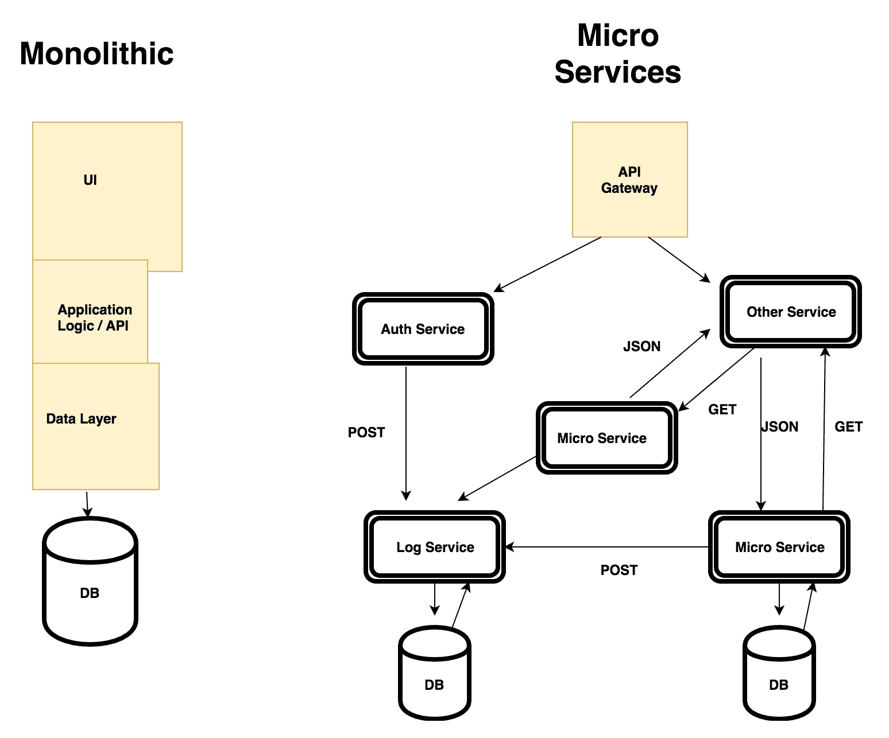

# 使用微服务扩展我们的 REST API

在概念上，构建 REST API 很容易。但是将它们扩展以接受大量流量是一个挑战。到目前为止，我们已经研究了创建 REST API 结构和示例 REST API 的细节。在本章中，我们将探索 Go Kit，这是一个用于构建微服务的精彩的、符合惯例的 Go 软件包。这是微服务时代，创业公司在短时间内就成为企业。微服务架构允许公司快速并行迭代。我们将从定义微服务开始，然后通过创建 REST 风格的微服务来了解 Go Kit。

在本章中，我们将涵盖以下主题：

+   单体和微服务之间的区别

+   微服务的需求

+   介绍 Go Kit，一个 Go 语言的微服务工具包

+   使用 Go Kit 创建 REST API

+   为 API 添加日志记录

+   为 API 添加仪表板

# 获取代码

您可以在 GitHub 存储库链接[`github.com/narenaryan/gorestful/tree/master/chapter9`](https://github.com/narenaryan/gorestful/tree/master/chapter9)中获取本章的代码示例。在上一章中，我们讨论了 Go API 客户端。在这里，我们回到了具有微服务架构的 REST API。

# 什么是微服务？

什么是微服务？这是企业世界向计算世界提出的问题。由于团队规模较大，公司准备采用微服务来分解任务。微服务架构用粒度服务取代了传统的单体，并通过某种协议相互通信。

微服务为以下方面带来了好处：

+   如果团队很大，人们可以在应用程序的各个部分上工作

+   新开发人员很容易适应

+   采用最佳实践，如**持续集成**（**CI**）和**持续交付**（**CD**）

+   易于替换的松散耦合架构软件

在单体应用程序（传统应用程序）中，一个巨大的服务器通过多路复用计算能力来服务传入的请求。这很好，因为我们在一个地方拥有一切，比如应用服务器、数据库和其他东西。但它也有缺点。当软件出现问题时，一切都会出现问题。此外，开发人员需要设置整个应用程序来开发一个小部分。

单体应用程序的缺点清单可能包括：

+   紧密耦合的架构

+   单点故障

+   添加新功能和组件的速度

+   工作的碎片化仅限于团队

+   持续部署非常困难，因为需要推送整个应用程序

查看单体应用程序时，整个堆栈被视为单个实体。如果数据库出现故障，应用程序也会出现故障。如果代码中的错误导致软件应用程序崩溃，与客户端的整个连接也会中断。这实际上导致了微服务的出现。

让我们来看一个场景。Bob 经营的公司使用传统的**面向服务的架构**（**SOA**），开发人员全天候工作以添加新功能。如果有发布，人们需要对每个小组件的代码进行全面测试。当所有更改完成时，项目从开发转移到测试。下一条街上的另一家公司由 Alice 经营，使用微服务架构。Alice 公司的所有软件开发人员都在个别服务上工作，这些服务通过连续的构建流水线进行测试，并且通知非常迅速。开发人员通过彼此的 REST/RPC API 交流以添加新功能。与 Bob 的开发人员相比，他们可以轻松地将其堆栈从一种技术转移到另一种技术。这个例子表明了 Alice 公司的灵活性和速度比 Bob 公司更大。

微服务还创建了一个允许我们使用容器（docker 等）的平台。在微服务中，编排和服务发现对于跟踪松散耦合的元素非常重要。诸如 Kubernetes 之类的工具用于管理 docker 容器。通常，为微服务拥有一个 docker 容器是一个很好的做法。服务发现是在飞行中自动检测 IP 地址和其他详细信息。这消除了硬编码微服务需要相互协商的东西的潜在威胁。

# 单体架构与微服务

行业专家建议将软件应用程序作为单体架构开始，然后逐步将其拆分为微服务。这实际上帮助我们专注于应用程序交付，而不是研究微服务模式。一旦产品稳定下来，开发人员应该找到一种松散耦合功能的方法。看一下下面的图表：



这张图描述了单体架构和微服务架构的结构。单体架构将所有内容包裹在洋葱形式中。它被称为紧密耦合的系统。相比之下，微服务是独立的，易于替换和修改。每个微服务可以通过各种传输机制（如 HTTP 和 RPC）相互通信。格式可以是 JSON 或协议缓冲区。

# Go Kit，用于构建微服务的包

在企业世界中，人们了解 Netflix 的 Eureka 和 Java 社区的 Spring Boot。在 Go 中，一个试图达到那个实现水平的包显然是**Go kit**。这是一个用于构建微服务的工具包。

它具有 Go 风格的添加服务的方式，这让我们感觉良好。它带有一个添加微服务的过程。在接下来的章节中，我们将看到如何按照 Go Kit 定义的步骤创建微服务。它主要由许多层组成。在 Go Kit 中，有三个层，请求和响应在其中流动：

+   **传输层**：这负责将数据从一个服务传输到另一个服务

+   **终端层**：这负责为给定服务构建终端

+   **服务层**：这是 API 处理程序的实际业务逻辑

使用以下命令安装 Go Kit：

```go
go get github.com/go-kit/kit
```

让我们为我们的第一个微服务制定计划。我们都知道消息的加密。可以使用密钥加密消息字符串，输出一个无意义的消息，可以通过网络传输。接收者解密消息并获得原始字符串。这个过程称为加密。我们将尝试将其作为微服务示例的一部分实现：

+   首先，开发加密逻辑

+   然后，将其与 Go Kit 集成

Go 自带了用于加密消息的包。我们需要从这些包中导入加密算法并使用它们。作为第一步，我们将编写一个使用**高级加密标准**（**AES**）的项目。

在`GOPATH/src/user`目录中创建一个名为`encryptString`的目录：

```go
mkdir $GOPATH/src/github.com/narenaryan/encryptString
cd $GOPATH/src/github.com/narenaryan/encryptString
```

现在让我们在新目录中再添加一个，名为 utils。在项目目录中添加两个文件，`main.go`和在名为`utils`的新目录中添加`utils.go`。目录结构如下：

```go
└── encryptString
    ├── main.go
    └── utils
        └── utils.go
```

现在让我们在我们的`utils.go`文件中添加加密逻辑。我们创建两个函数，一个用于加密，另一个用于解密消息，如下所示：

```go
package utils
import (
    "crypto/aes"
    "crypto/cipher"
    "encoding/base64"
)
```

AES 算法需要初始化向量。让我们首先定义它：

```go
// Implements AES encryption algorithm(Rijndael Algorithm)
/* Initialization vector for the AES algorithm
More details visit this link https://en.wikipedia.org/wiki/Advanced_Encryption_Standard */
var initVector = []byte{35, 46, 57, 24, 85, 35, 24, 74, 87, 35, 88, 98, 66, 32, 14, 05}
```

现在，让我们实现加密和解密的逻辑：

```go
// EncryptString encrypts the string with given key
func EncryptString(key, text string) string {
    block, err := aes.NewCipher([]byte(key))
    if err != nil {
        panic(err)
    }
    plaintext := []byte(text)
    cfb := cipher.NewCFBEncrypter(block, initVector)
    ciphertext := make([]byte, len(plaintext))
    cfb.XORKeyStream(ciphertext, plaintext)
    return base64.StdEncoding.EncodeToString(ciphertext)
}
```

在`EncryptString`函数中，我们正在使用密钥创建一个新的密码块。然后我们将该块传递给密码块加密器函数。该加密器接受块和初始化向量。然后我们通过在密码块上进行`XORKeyStream`来生成密文（加密消息）。它填充了密文。然后我们需要进行 Base64 编码以生成受保护的字符串：

```go
// DecryptString decrypts the encrypted string to original
func DecryptString(key, text string) string {
    block, err := aes.NewCipher([]byte(key))
    if err != nil {
        panic(err)
    }
    ciphertext, _ := base64.StdEncoding.DecodeString(text)
    cfb := cipher.NewCFBEncrypter(block, initVector)
    plaintext := make([]byte, len(ciphertext))
    cfb.XORKeyStream(plaintext, ciphertext)
    return string(plaintext)
}
```

在`DecryptString`函数中，解码 Base64 编码并使用密钥创建一个密码块。将这个密码块与初始化向量传递给`NewCFBEncrypter`。接下来，使用`XORKeyStream`将密文加载到明文中。基本上，这是一个在`XORKeyStream`中交换加密和解密消息的过程。这完成了`utils.go`文件。

现在让我们编辑`main.go`文件，以利用前面的`utils`包：

```go
package main
import (
    "log"
    "github.com/narenaryan/encryptString/utils"
)
// AES keys should be of length 16, 24, 32
func main() {
    key := "111023043350789514532147"
    message := "I am A Message"
    log.Println("Original message: ", message)
    encryptedString := utils.EncryptString(key, message)
    log.Println("Encrypted message: ", encryptedString)
    decryptedString := utils.DecryptString(key, encryptedString)
    log.Println("Decrypted message: ", decryptedString)
}
```

在这里，我们从`utils`包中导入加密/解密函数，并使用它们来展示一个例子。

如果我们运行这个程序，我们会看到以下输出：

```go
go run main.go

Original message: I am A Message
Encrypted message: 8/+JCfTb+ibIjzQtmCo=
Decrypted message: I am A Message
```

它展示了我们如何使用 AES 算法加密消息，并使用相同的秘钥将其解密。这个算法也被称为**Rijndael**（发音为 rain-dahl）算法。

# 使用 Go Kit 构建 REST 微服务

有了这些知识，我们准备构建我们的第一个提供加密/解密 API 的微服务。我们使用 Go Kit 和我们的加密`utils`来编写这个微服务。正如我们在前一节中讨论的，Go-Kit 微服务应该逐步构建。要创建一个服务，我们需要事先设计一些东西。它们是：

+   服务实现

+   端点

+   请求/响应模型

+   传输

坐稳。这个术语现在似乎很陌生。我们很快就会对它感到很舒适。让我们创建一个具有以下目录结构的目录。每个 Go Kit 项目都可以在这个项目结构中。让我们称我们的项目为`encryptService`。在`encryptService`目录中以相同的树结构创建这些文件：

```go
├── helpers
│   ├── endpoints.go
│   ├── implementations.go
│   ├── jsonutils.go
│   └── models.go
└── main.go
```

我们将逐个查看每个文件，看看应该如何构建。首先，在 Go Kit 中，创建一个接口，告诉我们的微服务执行所有功能。在这种情况下，这些功能是`Encrypt`和`Decrypt`。`Encrypt`接受密钥并将文本转换为密码消息。`Decrypt`使用密钥将密码消息转换回文本。看一下以下代码：

```go
import (
  "context"
)
// EncryptService is a blueprint for our service

type EncryptService interface {
  Encrypt(context.Context, string, string) (string, error)
  Decrypt(context.Context, string, string) (string, error)
}
```

服务需要实现这些函数以满足接口。接下来，为您的服务创建模型。模型指定服务可以接收和产生的数据。在项目的`helpers`目录中创建一个`models.go`文件：

`encryptService/helpers/models.go`

```go
package helpers

// EncryptRequest strctures request coming from client
type EncryptRequest struct {
  Text string `json:"text"`
  Key  string `json:"key"`
}

// EncryptResponse strctures response going to the client
type EncryptResponse struct {
  Message string `json:"message"`
  Err     string `json:"error"`
}

// DecryptRequest strctures request coming from client
type DecryptRequest struct {
  Message string `json:"message"`
  Key     string `json:"key"`
}

// DecryptResponse strctures response going to the client
type DecryptResponse struct {
  Text string `json:"text"`
  Err  string `json:"error"`
}
```

由于我们有两个服务函数，所以有四个函数映射到请求和响应。下一步是创建一个实现前面定义的接口`EncryptService`的结构体。因此，在以下路径中的实现文件中创建该逻辑：

`encryptService/helpers/implementations.go`

首先，让我们导入所有必要的包。同时，给出包的名称：

```go
package helpers
import (
    "context"
    "crypto/aes"
    "crypto/cipher"
    "encoding/base64"
    "errors"
)
// EncryptServiceInstance is the implementation of interface for micro service
type EncryptServiceInstance struct{}
// Implements AES encryption algorithm(Rijndael Algorithm)
/* Initialization vector for the AES algorithm
More details visit this link https://en.wikipedia.org/wiki/Advanced_Encryption_Standard */
var initVector = []byte{35, 46, 57, 24, 85, 35, 24, 74, 87, 35, 88, 98, 66, 32, 14, 05}
// Encrypt encrypts the string with given key
func (EncryptServiceInstance) Encrypt(_ context.Context, key string, text string) (string, error) {
    block, err := aes.NewCipher([]byte(key))
    if err != nil {
        panic(err)
    }
    plaintext := []byte(text)
    cfb := cipher.NewCFBEncrypter(block, initVector)
    ciphertext := make([]byte, len(plaintext))
    cfb.XORKeyStream(ciphertext, plaintext)
    return base64.StdEncoding.EncodeToString(ciphertext), nil
}
// Decrypt decrypts the encrypted string to original
func (EncryptServiceInstance) Decrypt(_ context.Context, key string, text string) (string, error) {
    if key == "" || text == "" {
        return "", errEmpty
    }
    block, err := aes.NewCipher([]byte(key))
    if err != nil {
        panic(err)
    }
    ciphertext, _ := base64.StdEncoding.DecodeString(text)
    cfb := cipher.NewCFBEncrypter(block, initVector)
    plaintext := make([]byte, len(ciphertext))
    cfb.XORKeyStream(plaintext, ciphertext)
    return string(plaintext), nil
}
var errEmpty = errors.New("Secret Key or Text should not be empty")
```

这利用了我们在前面示例中看到的相同的 AES 加密。在这个文件中，我们创建了一个名为`EncyptionServiceInstance`的结构体，它有两个方法，`Encrypt`和`Decrypt`。因此它满足了前面的接口。现在，我们如何将这些实际的服务实现与服务请求和响应联系起来呢？我们需要为此定义端点。因此，添加以下端点以将服务请求与服务业务逻辑链接起来。

我们使用`Capitalized`函数和变量名称，因为在 Go 中，任何以大写字母开头的函数或变量都是从该包名导出的。在`main.go`中，要使用所有这些函数，我们需要首先将它们导出。给予大写名称使它们对主程序可见。

在`helpers`目录中创建`endpoints.go`：

```go
package helpers
import (
    "context"
    "github.com/go-kit/kit/endpoint"
)
// EncryptService is a blueprint for our service
type EncryptService interface {
    Encrypt(context.Context, string, string) (string, error)
    Decrypt(context.Context, string, string) (string, error)
}
// MakeEncryptEndpoint forms endpoint for request/response of encrypt function
func MakeEncryptEndpoint(svc EncryptService) endpoint.Endpoint {
    return func(ctx context.Context, request interface{}) (interface{}, error) {
        req := request.(EncryptRequest)
        message, err := svc.Encrypt(ctx, req.Key, req.Text)
        if err != nil {
            return EncryptResponse{message, err.Error()}, nil
        }
        return EncryptResponse{message, ""}, nil
    }
}
// MakeDecryptEndpoint forms endpoint for request/response of decrypt function
func MakeDecryptEndpoint(svc EncryptService) endpoint.Endpoint {
    return func(ctx context.Context, request interface{}) (interface{}, error) {
        req := request.(DecryptRequest)
        text, err := svc.Decrypt(ctx, req.Key, req.Message)
        if err != nil {
            return DecryptResponse{text, err.Error()}, nil
        }
        return DecryptResponse{text, ""}, nil
    }
}
```

在这里，我们将之前的接口定义代码与端点定义代码结合在一起。端点以服务作为参数并返回一个函数。这个函数又以请求为参数并返回一个响应。这些东西与我们在`models.go`文件中定义的内容相同。我们检查错误，然后返回响应的结构体。

现在，一切都很好。在我们之前的 REST API 示例中，我们总是试图将 JSON 字符串解组为 Go 结构。对于响应，我们通过编组将结构转换回 JSON 字符串。在这里，我们分别解组和编组请求和响应。为此，我们编写一个用于编码/解码逻辑的文件。让我们称该文件为`jsonutils.go`并将其添加到`helpers`目录中：

```go
package helpers
import (
    "context"
    "encoding/json"
    "net/http"
)
// DecodeEncryptRequest fills struct from JSON details of request
func DecodeEncryptRequest(_ context.Context, r *http.Request) (interface{}, error) {
    var request EncryptRequest
    if err := json.NewDecoder(r.Body).Decode(&request); err != nil {
        return nil, err
    }
    return request, nil
}
// DecodeDecryptRequest fills struct from JSON details of request
func DecodeDecryptRequest(_ context.Context, r *http.Request) (interface{}, error) {
    var request DecryptRequest
    if err := json.NewDecoder(r.Body).Decode(&request); err != nil {
        return nil, err
    }
    return request, nil
}
// EncodeResponse is common for both the reponses from encrypt and decrypt services
func EncodeResponse(_ context.Context, w http.ResponseWriter, response interface{}) error {
    return json.NewEncoder(w).Encode(response)
}
```

`EncodeResponse`用于编组`EncyptService`和`DecryptService`的响应，但是在将 JSON 解码为结构时，我们需要两种不同的方法。我们将它们定义为`DecodeEncryptRequest`和`DecodeDecryptRequest`。这些函数使用 Go 的内部 JSON 包来编组和解组数据。

现在我们有了所有需要创建微服务的构造的辅助文件。让我们设计`main`函数，导入现有的内容并将微服务连接到服务器：

```go
package main
import (
    "log"
    "net/http"
    httptransport "github.com/go-kit/kit/transport/http"
    "github.com/narenaryan/encryptService/helpers"
)
func main() {
    svc := helpers.EncryptServiceInstance{}
    encryptHandler := httptransport.NewServer(helpers.MakeEncryptEndpoint(svc),
        helpers.DecodeEncryptRequest,\
        helpers.EncodeResponse)
    decryptHandler := httptransport.NewServer(helpers.MakeDecryptEndpoint(svc),
        helpers.DecodeDecryptRequest,
        helpers.EncodeResponse)
    http.Handle("/encrypt", encryptHandler)
    http.Handle("/decrypt", decryptHandler)
    log.Fatal(http.ListenAndServe(":8080", nil))
}
```

我们正在导入 Go Kit 的 transport/http 作为`httptransport`来创建处理程序。处理程序附加了端点、JSON 解码器和 JSON 编码器。然后，使用 Go 的 net/http，我们处理给定 URL 端点的 HTTP 请求。`httptransport.NewServer`接受一些参数：一个端点，JSON 解码器和 JSON 编码器。服务执行的逻辑在哪里？它在端点中。端点接受请求模型并输出响应模型。现在，让我们在`encryptService`目录中运行这个项目：

```go
go run main.go
```

我们可以使用 curl 进行`POST`请求来检查输出：

```go
curl -XPOST -d'{"key":"111023043350789514532147", "text": "I am A Message"}' localhost:8080/encrypt

{"message":"8/+JCfTb+ibIjzQtmCo=","error":""}
```

我们向微服务提供了密钥和消息。它返回了密文消息。这意味着服务加密了文本。通过传递相同的密钥以及密文消息，再发出一个请求来解密消息：

```go
curl -XPOST -d'{"key":"111023043350789514532147", "message": "8/+JCfTb+ibIjzQtmCo="}' localhost:8080/decrypt

{"text":"I am A Message","error":""}
```

它返回了我们最初传递的确切消息。万岁！我们编写了我们的第一个用于加密/解密消息的微服务。除了处理正常的 HTTP 请求外，Go Kit 还提供了许多其他有用的构造，例如用于中间件的：

+   传输日志

+   应用程序日志

+   应用程序仪表化

+   服务发现

在接下来的章节中，我们将讨论前面列表中的一些重要构造。

# 为您的微服务添加日志记录

在本节中，让我们学习如何向我们的 Go Kit 微服务添加传输级别日志和应用程序级别日志。我们使用上面的示例，但稍作修改。让我们称我们的新项目为`encryptServiceWithLogging`。在本书的 GitHub 项目中，您将找到这个目录。在本书中，我们多次讨论了中间件的概念。作为复习，中间件是在到达相应的请求处理程序之前/之后篡改请求/响应的函数。Go Kit 允许我们创建记录中间件，将其附加到我们的服务上。该中间件将具有记录逻辑。在这个示例中，我们尝试记录到 Stderr（控制台）。如下所示，将一个名为`middleware.go`的新文件添加到`helpers`目录中：

```go
package helpers
import (
    "context"
    "time"
    log "github.com/go-kit/kit/log"
)
// LoggingMiddleware wraps the logs for incoming requests
type LoggingMiddleware struct {
    Logger log.Logger
    Next EncryptService
}
// Encrypt logs the encyption requests
func (mw LoggingMiddleware) Encrypt(ctx context.Context, key string, text string) (output string, err error) {
    defer func(begin time.Time) {
        _ = mw.Logger.Log(
            "method", "encrypt",
            "key", key,
            "text", text,
            "output", output,
            "err", err,
            "took", time.Since(begin),
        )
    }(time.Now())
    output, err = mw.Next.Encrypt(ctx, key, text)
    return
}
// Decrypt logs the encyption requests
func (mw LoggingMiddleware) Decrypt(ctx context.Context, key string,
text string) (output string, err error) {
    defer func(begin time.Time) {
        _ = mw.Logger.Log(
            "method", "decrypt",
            "key", key,
            "message", text,
            "output", output,
            "err", err,
            "took", time.Since(begin),
        )
    }(time.Now())
    output, err = mw.Next.Decrypt(ctx, key, text)
    return
}
```

我们需要创建一个具有记录器和我们的服务实例的结构。然后，在该结构上定义一些方法，这些方法的名称与服务方法相似（在本例中，它们是`encrypt`和`decrypt`）。**Logger**是 Go Kit 的记录器，具有`Log`函数。这个`Log`函数接受一些参数。它接受一对参数。第一个和第二个是一组。第三个和第四个是另一组。请参考以下代码片段：

```go
mw.Logger.Log(
      "method", "decrypt",
      "key", key,
      "message", text,
      "output", output,
      "err", err,
      "took", time.Since(begin),
    )
```

我们需要维护日志应该打印的顺序。在记录我们的请求详细信息后，我们确保允许请求通过这个函数继续到下一个中间件/处理程序。`Next`是`EncryptService`类型，它是我们的实际实现：

```go
mw.Next.(Encrypt/Decrypt)
```

对于加密函数，中间件记录加密请求并将其传递给服务的实现。为了将创建的中间件挂接到我们的服务中，修改`main.go`如下：

```go
package main
import (
    "log"
    "net/http"
    "os"
    kitlog "github.com/go-kit/kit/log"
    httptransport "github.com/go-kit/kit/transport/http"
    "github.com/narenaryan/encryptService/helpers"
)
func main() {
    logger := kitlog.NewLogfmtLogger(os.Stderr)
    var svc helpers.EncryptService
    svc = helpers.EncryptServiceInstance{}
    svc = helpers.LoggingMiddleware{Logger: logger, Next: svc}
    encryptHandler := httptransport.NewServer(helpers.MakeEncryptEndpoint(svc),
        helpers.DecodeEncryptRequest,
        helpers.EncodeResponse)
    decryptHandler := httptransport.NewServer(helpers.MakeDecryptEndpoint(svc),
        helpers.DecodeDecryptRequest,
        helpers.EncodeResponse)
    http.Handle("/encrypt", encryptHandler)
    http.Handle("/decrypt", decryptHandler)
    log.Fatal(http.ListenAndServe(":8080", nil))
}
```

我们从 Go Kit 中导入日志作为`kitlog`。我们使用`NewLogfmtLogger(os.Stderr)`创建了一个新的记录器。这将日志附加到控制台。现在，将这个记录器和服务传递给`LoggingMiddleware`。它返回可以传递给 HTTP 服务器的服务。现在，让我们从`encryptServiceWithLogging`运行程序，看看控制台上的输出日志：

```go
go run main.go
```

它启动我们的微服务。现在，从`CURL`命令发出客户端请求：

```go
curl -XPOST -d'{"key":"111023043350789514532147", "text": "I am A Message"}' localhost:8080/encrypt

curl -XPOST -d'{"key":"111023043350789514532147", "message": "8/+JCfTb+ibIjzQtmCo="}' localhost:8080/decrypt
{"text":"I am A Message","error":""}
```

这在服务器控制台上记录以下消息：

```go
method=encrypt key=111023043350789514532147 text="I am A Message" output="8/+JCfTb+ibIjzQtmCo=" err=null took=11.32µs

method=decrypt key=111023043350789514532147 message="8/+JCfTb+ibIjzQtmCo=" output="I am A Message" err=null took=6.773µs
```

这是为了记录每个应用程序/服务的消息。系统级别的日志记录也是可用的，并且可以从 Go Kit 的文档中获取。

# 为您的微服务添加仪表

对于任何微服务，除了日志记录，仪表是至关重要的。Go Kit 的`metrics`包记录有关服务运行时行为的统计信息：计算已处理作业的数量，记录请求完成后的持续时间等。这也是一个篡改 HTTP 请求并收集指标的中间件。要定义一个中间件，只需添加一个与日志中间件类似的结构。除非我们监视，否则指标是无用的。**Prometheus**是一个可以收集延迟、给定服务的请求数等指标的指标监控工具。Prometheus 从 Go Kit 生成的指标中抓取数据。

您可以从这个网站下载最新稳定版本的 Prometheus。在使用 Prometheus 之前，请确保安装 Go Kit 需要的这些包：

```go
go get github.com/prometheus/client_golang/prometheus
go get github.com/prometheus/client_golang/prometheus/promhttp
```

安装了这些包之后，尝试将最后讨论的日志服务项目复制到一个名为`encryptServiceWithInstrumentation`的目录中。该目录与原来完全相同，只是我们在`helpers`目录中添加了一个名为`instrumentation.go`的文件，并修改了我们的`main.go`以导入仪表中间件。项目结构如下：

```go
├── helpers
│   ├── endpoints.go
│   ├── implementations.go
│   ├── instrumentation.go
│   ├── jsonutils.go
│   ├── middleware.go
│   └── models.go
└── main.go
```

仪表可以测量每个服务的请求数和延迟，以参数如`Counter`和`Histogram`为单位。我们尝试创建一个具有这两个测量（请求数、延迟）并实现给定服务的函数的中间件。在这些中间件函数中，我们尝试调用 Prometheus 客户端 API 来增加请求数、记录延迟等。核心的 Prometheus 客户端库尝试以这种方式增加请求计数：

```go
// Prometheus
c := prometheus.NewCounter(stdprometheus.CounterOpts{
    Name: "request_duration",
    ...
}, []string{"method", "status_code"})
c.With("method", "MyMethod", "status_code", strconv.Itoa(code)).Add(1)
```

`NewCounter`创建一个新的计数器结构，需要计数器选项。这些选项是操作的名称和其他细节。然后，我们需要在该结构上调用`With`函数，传入方法、方法名称和错误代码。这个特定的签名是 Prometheus 要求生成计数器指标的。最后，我们使用`Add(1)`函数调用增加计数器。

新添加的`instrumentation.go`文件的实现如下：

```go
package helpers
import (
    "context"
    "fmt"
    "time"
    "github.com/go-kit/kit/metrics"
)
// InstrumentingMiddleware is a struct representing middleware
type InstrumentingMiddleware struct {
    RequestCount metrics.Counter
    RequestLatency metrics.Histogram
    Next EncryptService
}
func (mw InstrumentingMiddleware) Encrypt(ctx context.Context, key string, text string) (output string, err error) {
    defer func(begin time.Time) {
        lvs := []string{"method", "encrypt", "error", fmt.Sprint(err != nil)}
        mw.RequestCount.With(lvs...).Add(1)
        mw.RequestLatency.With(lvs...).Observe(time.Since(begin).Seconds())
    }(time.Now())
    output, err = mw.Next.Encrypt(ctx, key, text)
    return
}
func (mw InstrumentingMiddleware) Decrypt(ctx context.Context, key string, text string) (output string, err error) {
    defer func(begin time.Time) {
        lvs := []string{"method", "decrypt", "error", "false"}
        mw.RequestCount.With(lvs...).Add(1)
        mw.RequestLatency.With(lvs...).Observe(time.Since(begin).Seconds())
    }(time.Now())
    output, err = mw.Next.Decrypt(ctx, key, text)
    return
}
```

这与日志中间件代码完全相同。我们创建了一个带有几个字段的结构体。我们附加了加密和解密服务的函数。在中间件函数内部，我们正在寻找两个指标；一个是计数，另一个是延迟。当一个请求通过这个中间件时：

```go
mw.RequestCount.With(lvs...).Add(1)
```

这一行增加了计数器。现在看看另一行：

```go
mw.RequestLatency.With(lvs...).Observe(time.Since(begin).Seconds())
```

这一行通过计算请求到达时间和最终时间之间的差异来观察延迟（由于使用了 defer 关键字，这将在请求和响应周期完成后执行）。简而言之，前面的中间件将请求计数和延迟记录到 Prometheus 客户端提供的指标中。现在让我们修改我们的`main.go`文件，使其看起来像这样：

```go
package main
import (
    "log"
    "net/http"
    "os"
    stdprometheus "github.com/prometheus/client_golang/prometheus"
    "github.com/prometheus/client_golang/prometheus/promhttp"
    kitlog "github.com/go-kit/kit/log"
    httptransport "github.com/go-kit/kit/transport/http"
    "github.com/narenaryan/encryptService/helpers"
    kitprometheus "github.com/go-kit/kit/metrics/prometheus"
)
func main() {
    logger := kitlog.NewLogfmtLogger(os.Stderr)
    fieldKeys := []string{"method", "error"}
    requestCount := kitprometheus.NewCounterFrom(stdprometheus.CounterOpts{
        Namespace: "encryption",
        Subsystem: "my_service",
        Name: "request_count",
        Help: "Number of requests received.",
    }, fieldKeys)
    requestLatency := kitprometheus.NewSummaryFrom(stdprometheus.SummaryOpts{
        Namespace: "encryption",
        Subsystem: "my_service",
        Name: "request_latency_microseconds",
        Help: "Total duration of requests in microseconds.",
    }, fieldKeys)
    var svc helpers.EncryptService
    svc = helpers.EncryptServiceInstance{}
    svc = helpers.LoggingMiddleware{Logger: logger, Next: svc}
    svc = helpers.InstrumentingMiddleware{RequestCount: requestCount, RequestLatency: requestLatency, Next: svc}
    encryptHandler := httptransport.NewServer(helpers.MakeEncryptEndpoint(svc),
        helpers.DecodeEncryptRequest,
        helpers.EncodeResponse)
    decryptHandler := httptransport.NewServer(helpers.MakeDecryptEndpoint(svc),
        helpers.DecodeDecryptRequest,
        helpers.EncodeResponse)
    http.Handle("/encrypt", encryptHandler)
    http.Handle("/decrypt", decryptHandler)
    http.Handle("/metrics", promhttp.Handler())
    log.Fatal(http.ListenAndServe(":8080", nil))
}
```

我们导入了 kit Prometheus 包来初始化指标模板，以及客户端 Prometheus 包来提供选项结构。我们创建了`requestCount`和`requestLatency`类型的指标结构，并将它们传递给我们从`helpers`导入的`InstrumentingMiddleware`。如果你看到这一行：

```go
 requestCount := kitprometheus.NewCounterFrom(stdprometheus.CounterOpts{
    Namespace: "encryption",
    Subsystem: "my_service",
    Name:      "request_count",
    Help:      "Number of requests received.",
  }, fieldKeys)
```

这就是我们如何创建一个模板，与`helpers.go`中的`InstrumentingMiddleware`结构中的`RequestCount`匹配。我们传递的选项将附加到一个字符串中，同时生成指标：

```go
encryption_my_service_request_count
```

这是一个唯一可识别的服务仪器，告诉我们，“这是一个用于名为 Encryption 的我的微服务的请求计数操作”。我们还在`main.go`的服务器部分的代码中添加了一行有趣的内容：

```go
"github.com/prometheus/client_golang/prometheus/promhttp"
...
http.Handle("/metrics", promhttp.Handler())
```

这实际上创建了一个端点，可以生成一个包含收集到的指标的页面。Prometheus 可以解析此页面以存储、绘制和显示指标。如果我们运行程序并对加密服务进行 5 次 HTTP 请求，并对解密服务进行 10 次 HTTP 请求，指标页面将记录请求的计数和它们的延迟：

```go
go run main.go # This starts the server
```

从另一个 bash shell（在 Linux 中）循环对加密服务进行 5 次 CURL 请求：

```go
for i in 1 2 3 4 5; do curl -XPOST -d'{"key":"111023043350789514532147", "text": "I am A Message"}' localhost:8080/encrypt; done

{"message":"8/+JCfTb+ibIjzQtmCo=","error":""}
{"message":"8/+JCfTb+ibIjzQtmCo=","error":""}
{"message":"8/+JCfTb+ibIjzQtmCo=","error":""}
{"message":"8/+JCfTb+ibIjzQtmCo=","error":""}
{"message":"8/+JCfTb+ibIjzQtmCo=","error":""}
```

对解密服务进行 10 次 CURL 请求（输出已隐藏以保持简洁）：

```go
for i in 1 2 3 4 5 6 7 8 9 10; do curl -XPOST -d'{"key":"111023043350789514532147", "message": "8/+JCfTb+ibIjzQtmCo="}' localhost:8080/decrypt; done
```

现在，访问 URL`http://localhost:8080/metrics`，您将看到 Prometheus Go 客户端为我们生成的页面。页面的内容将包含以下信息：

```go
# HELP encryption_my_service_request_count Number of requests received.
# TYPE encryption_my_service_request_count counter
encryption_my_service_request_count{error="false",method="decrypt"} 10
encryption_my_service_request_count{error="false",method="encrypt"} 5
# HELP encryption_my_service_request_latency_microseconds Total duration of requests in microseconds.
# TYPE encryption_my_service_request_latency_microseconds summary
encryption_my_service_request_latency_microseconds{error="false",method="decrypt",quantile="0.5"} 5.4538e-05
encryption_my_service_request_latency_microseconds{error="false",method="decrypt",quantile="0.9"} 7.6279e-05
encryption_my_service_request_latency_microseconds{error="false",method="decrypt",quantile="0.99"} 8.097e-05
encryption_my_service_request_latency_microseconds_sum{error="false",method="decrypt"} 0.000603101
encryption_my_service_request_latency_microseconds_count{error="false",method="decrypt"} 10
encryption_my_service_request_latency_microseconds{error="false",method="encrypt",quantile="0.5"} 5.02e-05
encryption_my_service_request_latency_microseconds{error="false",method="encrypt",quantile="0.9"} 8.8164e-05
encryption_my_service_request_latency_microseconds{error="false",method="encrypt",quantile="0.99"} 8.8164e-05
encryption_my_service_request_latency_microseconds_sum{error="false",method="encrypt"} 0.000284823
encryption_my_service_request_latency_microseconds_count{error="false",method="encrypt"} 5
```

如您所见，有两种类型的指标：

+   `encryption_myservice_request_count`

+   `encryption_myservice_request_latency_microseconds`

如果您看到对`encrypt`方法和`decrypt`方法的请求数，它们与我们发出的 CURL 请求相匹配。

`encryption_myservice`指标类型对加密和解密微服务都有计数和延迟指标。方法参数告诉我们这些指标是从哪个微服务中提取的。

这些类型的指标为我们提供了关键的见解，例如哪个微服务被大量使用以及延迟趋势随时间的变化等。但是，要看到数据的实际情况，您需要安装 Prometheus 服务器，并为 Prometheus 编写一个配置文件，以从 Go Kit 服务中抓取指标。有关在 Prometheus 中创建目标（生成指标页面的主机）的更多信息，请访问[`prometheus.io/docs/operating/configuration/`](https://prometheus.io/docs/operating/configuration/)。

我们还可以将来自 Prometheus 的数据传递给 Grafana，这是一个用于漂亮实时图表的图形化和监控工具。Go Kit 还提供了许多其他功能，例如服务发现。只有在系统松散耦合、监控和优化的情况下，微服务才能进行扩展。

# 总结

在本章中，我们从微服务的定义开始。单体应用程序和微服务之间的主要区别在于紧密耦合的架构是如何被分解为松散耦合的架构。微服务之间使用基于 REST 的 JSON 或基于 RPC 的协议缓冲区进行通信。使用微服务，我们可以将业务逻辑分解为多个部分。每个服务都很好地完成了一项工作。这种方法也带来了一个缺点。监控和管理微服务是痛苦的。Go 提供了一个名为 Go Kit 的精彩工具包。这是一个微服务框架，使用它我们可以为微服务生成样板代码。

我们需要在 Go Kit 中定义一些东西。我们需要为 Go-Kit 服务创建实现、端点和模型。端点接收请求并返回响应。实现具有服务的实际业务逻辑。模型是解码和编码请求和响应对象的一种好方法。Go Kit 提供了各种中间件，用于执行重要任务，如日志记录、仪表（指标）和服务发现。

小型组织可以从单体应用开始，但在规模更大的组织中，拥有庞大团队的微服务更合适。在下一章中，我们将看到如何使用 Nginx 部署我们的 Go 服务。服务需要部署才能暴露给外部世界。
