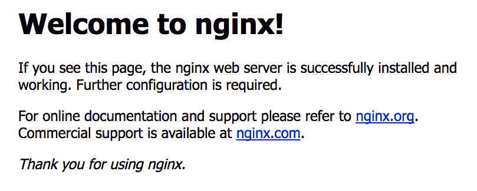
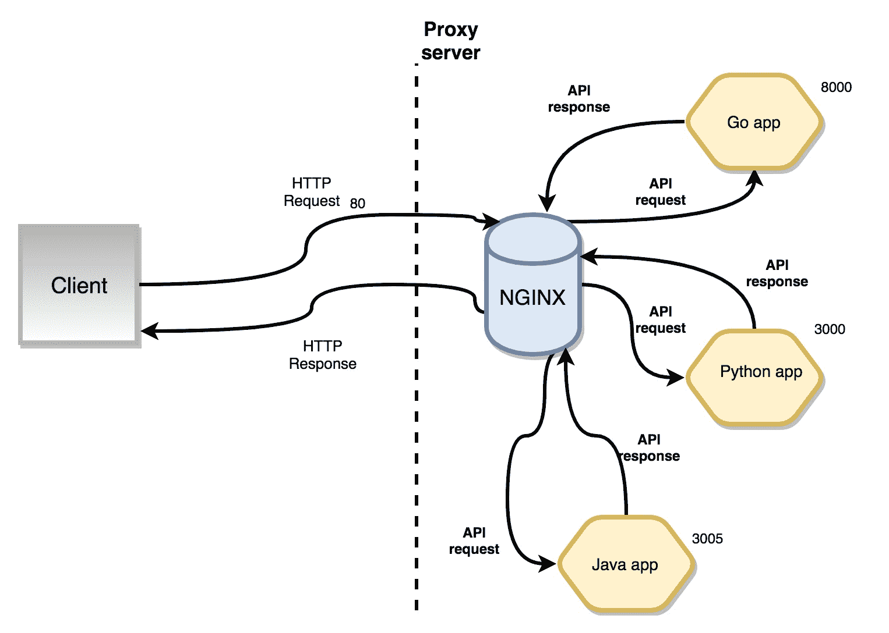
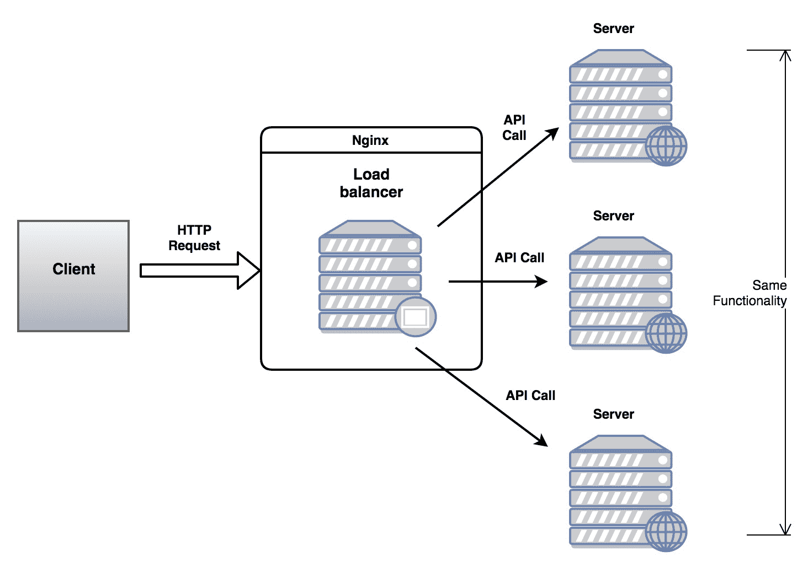
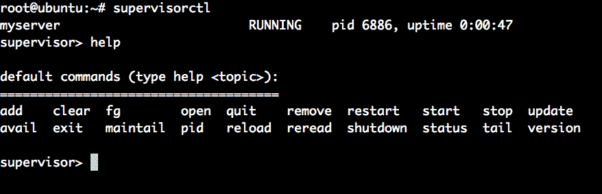
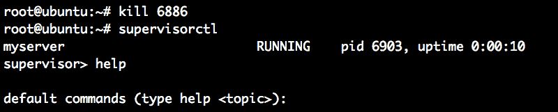

# 部署我们的 REST 服务

在本章中，我们将看到如何使用 Nohup 和 Nginx 等工具部署我们的 Go 应用程序。要使网站对互联网可见，我们需要有一个**虚拟专用服务器**（**VPS**）和部署工具。我们首先将看到如何运行一个 Go 可执行文件并使用 Nohup 将其作为后台进程。接下来，我们将安装 Nginx 并配置它以代理 Go 服务器。

在本章中，我们将涵盖以下主题：

+   什么是 Nginx 代理服务器？

+   学习 Nginx 服务器块

+   Nginx 中的负载均衡策略

+   使用 Nginx 部署我们的 Go 服务

+   限制速率和保护我们的 Nginx 代理服务器

+   使用名为 Supervisord 的工具监视我们的 Go 服务

# 获取代码

本章的代码可在[`github.com/narenaryan/gorestful/tree/master/chapter10`](https://github.com/narenaryan/gorestful/tree/master/chapter10)找到。将其复制到`GOPATH`并按照章节中给出的说明运行。

# 安装和配置 Nginx

Nginx 是一个高性能的 Web 服务器和负载均衡器，非常适合部署高流量的网站。尽管这个决定是有意见的，但 Python 和 Node 开发人员通常使用它。

Nginx 还可以充当上游代理服务器，允许我们将 HTTP 请求重定向到在同一服务器上运行的多个应用程序服务器。Nginx 的主要竞争对手是 Apache 的 httpd。Nginx 是一个出色的静态文件服务器，可以被 Web 客户端使用。由于我们正在处理 API，我们将研究处理 HTTP 请求的方面。

在 Ubuntu 16.04 上，使用以下命令安装 Nginx：

```go
sudo apt-get update
sudo apt-get install nginx
```

在 macOS X 上，您可以使用`brew`安装它：

```go
brew install nginx
```

[`brew.sh/`](https://brew.sh/)是一个非常有用的 macOS X 用户软件打包系统。我的建议是使用它来安装软件。安装成功后，您可以通过在浏览器中打开机器 IP 来检查它。在您的 Web 浏览器中打开`http://localhost/`。您将看到这个：



这意味着 Nginx 已成功安装。它正在端口`80`上提供服务并提供默认页面。在 macOS 上，默认的 Nginx 监听端口将是`8000`：

```go
sudo vi /usr/local/etc/nginx/nginx.conf
```

在 Ubuntu（Linux）上，文件将位于此路径：

```go
sudo vi /etc/nginx/nginx.conf
```

打开文件，搜索服务器并将端口`80`修改为`8000`：

```go
server {
        listen 8080; # Change this to 80 
        server_name localhost;
        #charset koi8-r;
        #access_log logs/host.access.log main;
        location / {
            root html;
            index index.html index.htm;
        }

        ... 
}
```

现在一切准备就绪。服务器在`80` HTTP 端口上运行，这意味着客户端可以使用 URL（`http://localhost/`）访问它，而不需要端口（`http://localhost:3000`）。这个基本服务器从一个名为`html`的目录中提供静态文件。`root`参数可以修改为我们放置 Web 资产的任何目录。您可以使用以下命令检查 Nginx 的状态：

```go
service nginx status
```

Windows 操作系统上的 Nginx 相当基本，实际上并不适用于生产级部署。开源开发人员通常更喜欢 Debian 或 Ubuntu 服务器来部署带有 Nginx 的 API 服务器。

# 什么是代理服务器？

代理服务器是一个保存原始服务器信息的服务器。它充当客户端请求的前端。每当客户端发出 HTTP 请求时，它可以直接进入应用服务器。但是，如果应用服务器是用编程语言编写的，您需要一个可以将应用程序响应转换为客户端可理解响应的翻译器。**通用网关接口**（**CGI**）也是这样做的。对于 Go，我们可以运行一个简单的 HTTP 服务器，它可以作为一个普通服务器运行（不需要翻译）。那么，为什么我们要使用另一个名为 Nginx 的服务器？我们使用 Nginx 是因为它将许多东西带入了视野。

拥有代理服务器（Nginx）的好处：

+   它可以充当负载均衡器

+   它可以坐在应用程序集群的前面并重定向 HTTP 请求

+   它可以以良好的性能提供文件系统

+   它可以很好地流媒体

如果同一台机器正在运行多个应用程序，那么我们可以将所有这些应用程序放在一个伞下。Nginx 也可以充当 API 网关，可以是多个 API 端点的起点。我们将在下一章中看到一个专门的 API 网关，但 Nginx 也可以起到这样的作用。参考以下图表：



如果您看到，图示客户端直接与 Nginx 通信，而不是其他应用程序运行的端口。在图表中，Go 正在`8000`端口上运行，其他应用程序正在不同的端口上运行。这意味着不同的服务器提供不同的 API 端点。如果客户端希望调用这些 API，则需要访问三个端口。相反，如果我们有 Nginx，它可以作为所有三个的代理服务器，并简化客户端的请求-响应周期。

Nginx 也被称为上游服务器，因为它为其他服务器提供请求。从图示中，Python 应用程序可以顺利地从 Go 应用程序请求 API 端点。

# 重要的 Nginx 路径

有一些重要的 Nginx 路径，我们需要了解如何使用代理服务器。在 Nginx 中，我们可以同时托管多个站点（`www.example1.com`，`www.exampl2.com`等）。看一下下表：

| **类型** | **路径** | **描述** |
| --- | --- | --- |
| 配置 | `/etc/nginx/nginx.con` | 这是基本的 Nginx 配置文件。它可以用作默认文件。 |
| 配置 | `/etc/nginx/sites-available/` | 如果我们在 Nginx 中运行多个站点，我们可以有多个配置文件。 |
| 配置 | `/etc/nginx/sites-enabled/` | 这些是当前在 Nginx 上激活的站点。 |
| 日志 | `/var/log/nginx/access.log` | 此日志文件记录服务器活动，如时间戳和 API 端点。 |
| 日志 | `/var/log/nginx/error.log` | 此日志文件记录所有与代理服务器相关的错误，如磁盘空间，文件系统权限等。 |

这些路径在 Linux 操作系统中。对于 macOS X，请使用`/usr/local/nginx`作为基本路径。

# 使用服务器块

服务器块是实际的配置部分，告诉服务器要提供什么以及在哪个端口上监听。我们可以在`sites-available`文件夹中定义多个服务器块。在 Ubuntu 上，位置将是：

```go
/etc/nginx/sites-available
```

在 macOS X 上，位置将是：

```go
/usr/local/etc/nginx/sites-avaiable
```

直到我们将`sites-available`复制到`sites-enabled`目录，配置才会生效。因此，对于您创建的每个新配置，始终为`sites-available`创建到`sites-enabled`的软链接。

# 创建一个示例 Go 应用程序并对其进行代理

现在，让我们在 Go 中创建一个简单的应用程序服务器，并记录日志：

```go
mkdir -p $GOPATH/src/github.com/narenaryan/basicServer
vi $GOPATH/src/github.com/narenaryan/basicServer/main.go
```

这个文件是一个基本的 Go 服务器，用来说明代理服务器的功能。然后，我们向 Nginx 添加一个配置，将端口`8000`（Go 运行端口）代理到 HTTP 端口（`80`）。现在，让我们编写代码：

```go
package main
import (
    "encoding/json"
    "fmt"
    "log"
    "net/http"
    "os"
    "time"
)
// Book holds data of a book
type Book struct {
    ID int
    ISBN string
    Author string
    PublishedYear string
}
func main() {
    // File open for reading, writing and appending
    f, err := os.OpenFile("app.log", os.O_RDWR|os.O_CREATE|os.O_APPEND, 0666)
    if err != nil {
        fmt.Printf("error opening file: %v", err)
    }
    defer f.Close()
    // This attache sprogram logs to file
    log.SetOutput(f)
    // Function handler for handling requests
    http.HandleFunc("/", func(w http.ResponseWriter, r *http.Request) {
        log.Printf("%q", r.UserAgent())
        // Fill the book details
        book := Book{
            ID: 123,
            ISBN: "0-201-03801-3",
            Author: "Donald Knuth",
            PublishedYear: "1968",
        }
        // Convert struct to JSON using Marshal
        jsonData, _ := json.Marshal(book)
        w.Header().Set("Content-Type", "application/json")
        w.Write(jsonData)
    })
    s := &http.Server{
        Addr: ":8000",
        ReadTimeout: 10 * time.Second,
        WriteTimeout: 10 * time.Second,
        MaxHeaderBytes: 1 << 20,
    }
    log.Fatal(s.ListenAndServe())
}
```

这是一个简单的服务器，返回书籍详细信息作为 API（这里是虚拟数据）。运行程序并在`8000`端口上运行。现在，打开一个 shell 并进行 CURL 命令：

```go
CURL -X GET "http://localhost:8000"
```

它返回数据：

```go
{
  "ID":123,
  "ISBN":"0-201-03801-3",
  "Author":"Donald Knuth",
  "PublishedYear":"1968"
}
```

但是客户端需要在这里请求`8000`端口。我们如何使用 Nginx 代理此服务器？正如我们之前讨论的，我们需要编辑默认的 sites-available 服务器块，称为`default`：

```go
vi /etc/nginx/sites-available/default
```

编辑此文件，找到服务器块，并在其中添加一行：

```go
server {
        listen 80 default_server;
        listen [::]:80 default_server ipv6only=on;

        root /usr/share/nginx/html;
        index index.html index.htm;

        # Make site accessible from http://localhost/
        server_name localhost;

        location / {
                # First attempt to serve request as file, then
                # as directory, then fall back to displaying a 404.
                try_files $uri $uri/ =404;
                # Uncomment to enable naxsi on this location
                # include /etc/nginx/naxsi.rules
                proxy_pass http://127.0.0.1:8000;
        }
}
```

`config`文件的这一部分称为服务器块。这控制了代理服务器的设置，其中`listen`表示`nginx`应该监听的位置。`root`和`index`指向静态文件，如果需要提供任何文件。`server_name`是您的域名。由于我们还没有准备好域名，它只是本地主机。`location`是这里的关键部分。在`location`中，我们可以定义我们的`proxy_pass`，它可以代理给定的`URL:PORT`。由于我们的 Go 应用程序正在`8000`端口上运行，我们在那里提到了它。如果我们在不同的机器上运行它，比如：

```go
http://example.com:8000
```

我们可以将相同的内容作为参数传递给`proxy_pass`。为了使这个配置生效，我们需要重新启动 Nginx 服务器。使用以下命令进行：

```go
service nginx restart
```

现在，进行 CURL 请求到`http://localhost`，您将看到 Go 应用程序的输出：

```go
CURL -X GET "http://localhost"
{
  "ID":123,
  "ISBN":"0-201-03801-3",
  "Author":"Donald Knuth",
  "PublishedYear":"1968"
}
```

`location`是一个指令，定义了可以代理给定`server:port`组合的**统一资源标识符**（**URI**）。这意味着通过定义各种 URI，我们可以代理在同一服务器上运行的多个应用程序。它看起来像：

```go
server {
    listen ...;
    ...
    location / {
        proxy_pass http://127.0.0.1:8000;
    }

    location /api {
        proxy_pass http://127.0.0.1:8001;
    }
    location /mail {
        proxy_pass http://127.0.0.1:8002;
    }
    ...
}
```

在这里，三个应用程序在不同的端口上运行。在将它们添加到我们的配置文件后，客户端可以访问它们：

```go
http://localhost/
http://localhost/api/
http://localhost/mail/
```

# 使用 Nginx 进行负载均衡

在实际情况下，我们使用多个服务器来处理大量的 API 请求。但是谁需要将传入的客户端请求转发到服务器实例？负载均衡是一个过程，其中中央服务器根据某些标准将负载分配给各个服务器。参考以下图表：



这些请求标准被称为负载均衡方法。让我们看看每个方法在一个简单的表中是如何工作的：

| **负载均衡方法** | **描述** |
| --- | --- |
| 轮询 | 请求均匀分布到服务器上，并且考虑服务器权重。 |
| 最少连接 | 请求被发送到当前为最少客户端提供服务的服务器。 |
| IP 哈希 | 用于将来自特定客户端 IP 的请求发送到给定服务器。只有在该服务器不可用时才会被发送到另一个服务器。 |
| 最少时间 | 客户端的请求被发送到平均延迟（为客户端提供服务的时间）最低且活动连接最少的机器。 |

我们现在看到了如何在 Nginx 中实际实现负载均衡，用于我们的 Go API 服务器。这个过程的第一步是在 Nginx 配置文件的`http`部分创建一个`upstream`：

```go
http {
    upstream cluster {
        server site1.mysite.com weight=5;
        server site2.mysite.com weight=2;
        server backup.mysite.com backup;
    }
}
```

在这里，服务器是运行相同代码的服务器的 IP 地址或域名。我们在这里定义了一个名为`backend`的`upstream`。这是一个我们可以在位置指令中引用的服务器组。权重应该根据可用资源进行分配。在前面的代码中，`site1`被赋予更高的权重，因为它可能是一个更大的实例（内存和磁盘）。现在，在位置指令中，我们可以使用`proxy_pass`命令指定服务器组：

```go
server {
    location / {
        proxy_pass http://cluster;
    }
}
```

现在，运行的代理服务器将传递所有命中`/`的 API 端点的请求到集群中的机器。默认的请求路由算法将是轮询，这意味着所有服务器的轮流将一个接一个地重复。如果我们需要更改它，我们在上游定义中提到。看一下以下代码片段：

```go
http {
    upstream cluster {
        least_conn;
        server site1.mysite.com weight=5;
        server site2.mysite.com;
        server backup.mysite.com backup;
    }
}

server {
    location / {
        proxy_pass http://cluster;
    }
}
```

前面的配置表示*创建一个由三台机器组成的集群，并添加最少连接的负载均衡方法*。`least_conn`是我们用来指定负载均衡方法的字符串。其他值可以是`ip_hash`或`least_time`。您可以通过在**局域网**（**LAN**）中拥有一组机器来尝试这个。或者，我们可以安装 Docker，并使用多个虚拟容器作为不同的机器来测试负载均衡。

我们需要在`/etc/nginx/nginx.conf`文件中添加`http`块，而服务器块在`/etc/nginx/sites-enabled/default`中。最好将这两个设置分开。

# 限制我们的 REST API 的速率

我们还可以通过速率限制来限制对 Nginx 代理服务器的访问速率。它提供了一个名为`limit_conn_zone`的指令（[`nginx.org/en/docs/http/ngx_http_limit_conn_module.html#limit_conn_zone`](http://nginx.org/en/docs/http/ngx_http_limit_conn_module.html#limit_conn_zone)）。其格式如下：

```go
limit_conn_zone client_type zone=zone_type:size;
```

`client_type`可以是两种类型：

+   IP 地址（限制来自给定 IP 地址的请求）

+   服务器名称（限制来自服务器的请求）

`zone_type`也会随着`client_type`的变化而改变。它的取值如下表所示：

| **客户端类型** | **区域类型** |
| --- | --- |
| `$binary_remote_address` | `addr` |
| `$server_name` | `servers` |

Nginx 需要将一些东西保存到内存中，以记住用于速率限制的 IP 地址和服务器。`size`是我们为 Nginx 分配的存储空间，用于执行其记忆功能。它可以取值如 8m（8MB）或 16m（16MB）。现在，让我们看看在哪里添加这些设置。前面的设置应该作为全局设置添加到`nginx.conf`文件中的`http`指令中：

```go
http {
    limit_conn_zone $server_name zone=servers:10m;
}
```

这为 Nginx 分配了用于使用的共享内存。现在，在 sites-available/default 的服务器指令中，添加以下内容：

```go
server {
   limit_conn servers 1000;
}
```

在前面的配置中，使用`limit_conn`限制给定服务器的连接总数不会超过 1K。如果我们尝试从给定 IP 地址对客户端进行速率限制，那么可以使用这个：

```go
server {
  location /api {
      limit_conn addr 1;
  }
}
```

此设置阻止客户端（IP 地址）向服务器（例如在线铁路订票）打开多个连接。如果我们有一个客户端下载文件并需要设置带宽约束，可以使用`limit_rate`：

```go
server {
  location /download {
      limit_conn addr 10;
      limit_rate 50k;
  }
}
```

通过这种方式，我们可以控制客户端与 Nginx 代理的服务的交互。如果我们直接使用 Go 二进制文件运行服务，就会失去所有这些功能。

# 保护我们的 Nginx 代理服务器

这是 Nginx 设置中最重要的部分。在本节中，我们将看到如何使用基本身份验证限制对服务器的访问。这对于我们的 REST API 服务器非常重要，因为假设我们有服务器 X、Y 和 Z 彼此通信。X 可以直接为客户端提供服务，但 X 通过调用内部 API 与 Y 和 Z 交流获取一些信息。由于我们知道客户端不应该访问 Y 或 Z，我们可以设置只允许 X 访问资源。我们可以使用`nginx`访问模块允许或拒绝 IP 地址。它看起来像这样：

```go
location /api {
    ...
    deny 192.168.1.2;
    allow 192.168.1.1/24;
    allow 127.0.0.1;
    deny all;
}
```

此配置告诉 Nginx 允许来自范围为`192.168.1.1/24`的客户端的请求，但排除`192.168.1.2`。下一行表示允许来自同一主机的请求，并阻止来自任何其他客户端的所有其他请求。完整的服务器块如下所示：

```go
server {
    listen 80 default_server;
    root /usr/share/nginx/html;

    location /api {

        deny 192.168.1.2;
        allow 192.168.1.1/24;
        allow 127.0.0.1;
        deny all;
    }
}
```

有关此更多信息，请参阅[nginx_http_access_module](http://nginx.org/en/docs/http/ngx_http_access_module.html?_ga=2.117850185.1364707364.1504109372-1654310658.1503918562)上的文档。我们还可以为 Nginx 提供的静态文件添加密码保护访问。这在 API 中通常不适用，因为在那里，应用程序负责对用户进行身份验证。

# 使用 Supervisord 监控我们的 Go API 服务器

Nginx 坐在我们的 Go API 服务器前面，只是代理一个端口，这是可以的。但是，有时 Web 应用程序可能会因操作系统重新启动或崩溃而停止。每当您的 Web 服务器被终止时，就有人的工作是自动将其恢复。Supervisord 就是这样一个任务运行程序。为了使我们的 API 服务器一直运行，我们需要对其进行监控。Supervisord 是一个可以监控运行中进程（系统）并在它们被终止时重新启动它们的工具。

# 安装 Supervisord

我们可以使用 Python 的`pip`命令轻松安装 Supervisord。在 Ubuntu 16.04 上，只需使用`apt-get`命令：

```go
sudo apt-get install -y supervisor
```

这将安装两个工具，`supervisor`和`supervisorctl`。`Supervisorctl`用于控制 supervisor 并添加任务、重新启动任务等。让我们使用我们为 Nginx 创建的`basicServre.go`程序来说明这一点。将二进制文件安装到`$GOPATH/bin`目录中。在这里，假设我的`GOPATH`是`/root/workspace`：

```go
go install github.com/narenaryan/basicServer
```

始终将当前`GOPATH`的`bin`文件夹添加到系统路径中。每当安装项目二进制文件时，它将作为普通可执行文件在整个系统环境中可用。您可以通过将以下行添加到`~/.profile`文件来实现：`export PATH=$PATH:/usr/local/go/bin`。

现在，在以下位置创建一个配置文件：

```go
/etc/supervisor/conf.d/goproject.conf
```

您可以添加任意数量的配置文件，`supervisord`将它们视为要运行的单独进程。将以下内容添加到前述文件中：

```go
[supervisord]
logfile = /tmp/supervisord.log
[program:myserver]
command=/root/workspace/bin/basicServer
autostart=true
autorestart=true
redirect_stderr=true
```

默认情况下，我们在`/etc/supervisor/`有一个名为`supervisord.conf`的文件。查看它以供参考：

+   `[supervisord]`部分提供了`supervisord`的日志文件位置。

+   `[program:myserver]`是遍历到给定目录并执行给定命令的任务块。

现在，我们可以要求我们的`supervisorctl`重新读取配置并重新启动任务（进程）。为此，只需说：

```go
supervisorctl reread
supervisorctl update
```

然后，使用以下命令启动我们的`supervisorctl`：

```go
supervisorctl
```

您将看到类似于这样的内容：



因此，我们的书籍服务正在被`Supervisor`监视。让我们试图杀死进程，看看`Supervisor`会做什么：

```go
kill 6886
```

现在，尽快，`Supervisor`通过运行二进制文件启动一个新进程（不同的`pid`）：



这在生产场景中非常有用，因为服务需要在任何崩溃或操作系统重新启动的情况下保持运行。这里有一个问题，我们如何启动/停止应用程序服务？使用`supervisorctl`的`start`和`stop`命令进行平稳操作：

```go
supervisorctl> stop myserver
supervisorctl> start myserver
```

有关 Supervisor 的更多详细信息，请访问[`supervisord.org/`](http://supervisord.org/)。

# 摘要

本章专门介绍了如何将 API 服务部署到生产环境中。一种方法是运行 Go 二进制文件，并直接从客户端访问`IP:端口`组合。该 IP 将是**虚拟专用服务器**（**VPS**）的 IP 地址。相反，我们可以注册一个域名并指向 VPS。第二种更好的方法是将其隐藏在代理服务器后面。Nginx 就是这样一个代理服务器，使用它，我们可以在一个伞下拥有多个应用服务器。

我们看到了如何安装 Nginx 并开始配置它。Nginx 提供了诸如负载平衡和速率限制之类的功能，在向客户端提供 API 时可能至关重要。负载平衡是在类似服务器之间分配负载的过程。我们看到了有哪些类型的负载均衡机制可用。其中一些是轮询、IP 哈希、最小连接等。然后，我们通过允许和拒绝一些 IP 地址集来为我们的服务器添加了认证。

最后，我们需要一个进程监视器，可以将我们崩溃的应用程序恢复过来。Supervisord 是这项工作的一个非常好的工具。我们看到了如何安装 Supervisord，以及如何启动 supervisorctl，一个用于控制运行服务器的命令行应用程序。

在下一章中，我们将看到如何使用 API 网关使我们的 API 达到生产级别。我们将深入讨论如何将我们的 API 置于一个负责认证和速率限制的实体后面。
