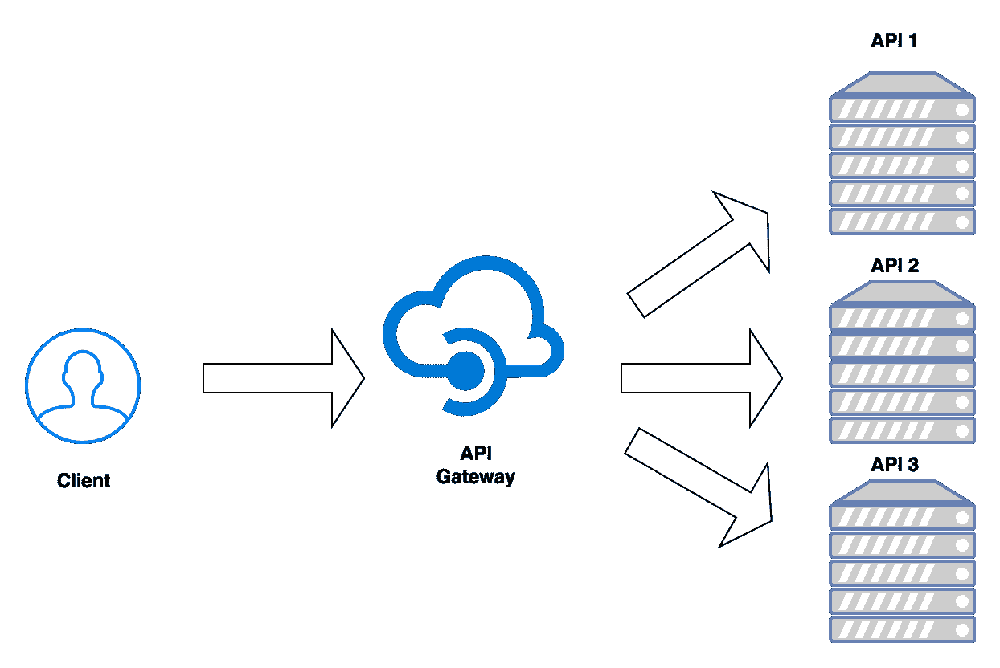
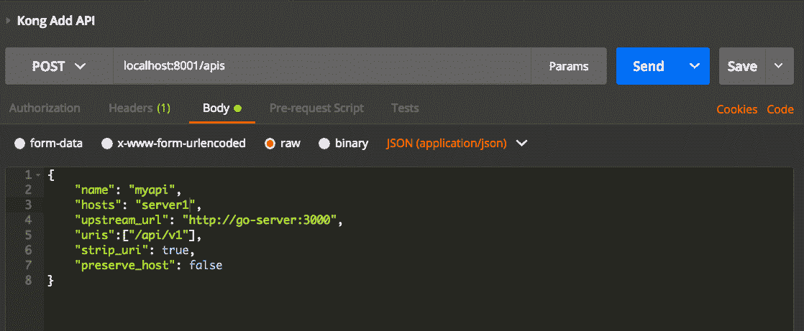
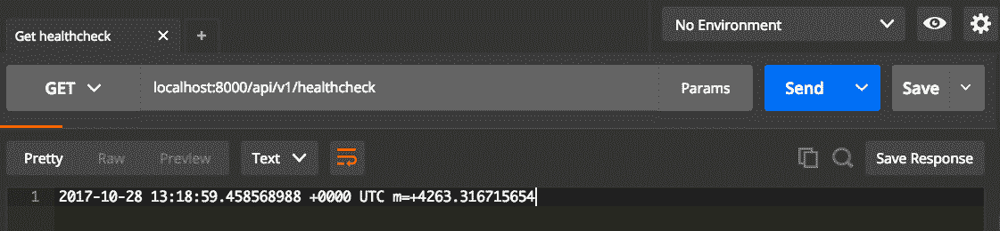
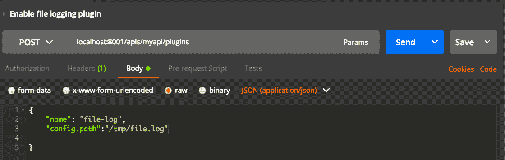
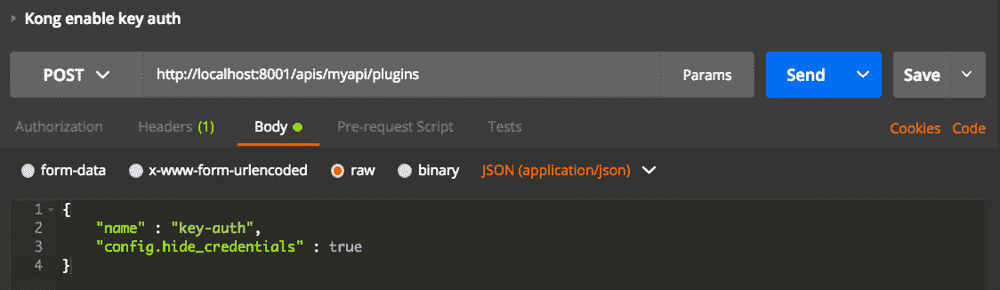
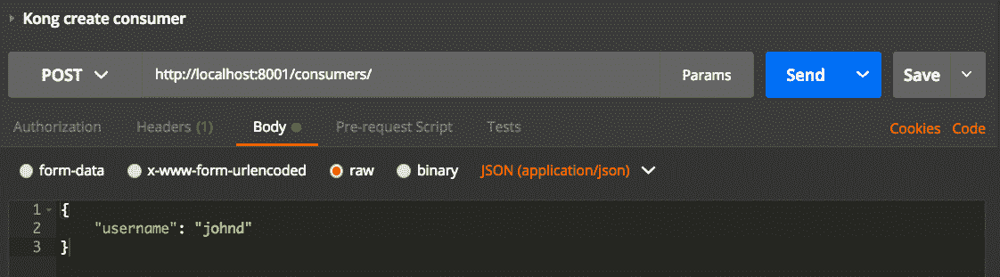
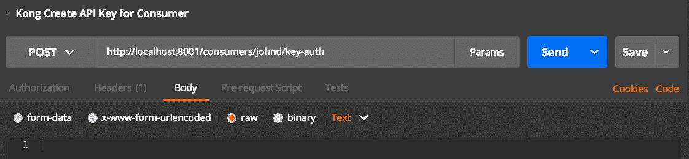
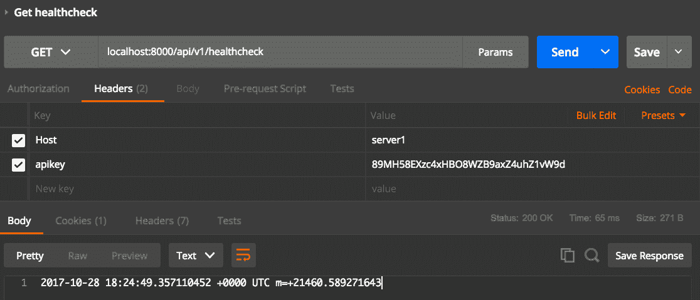
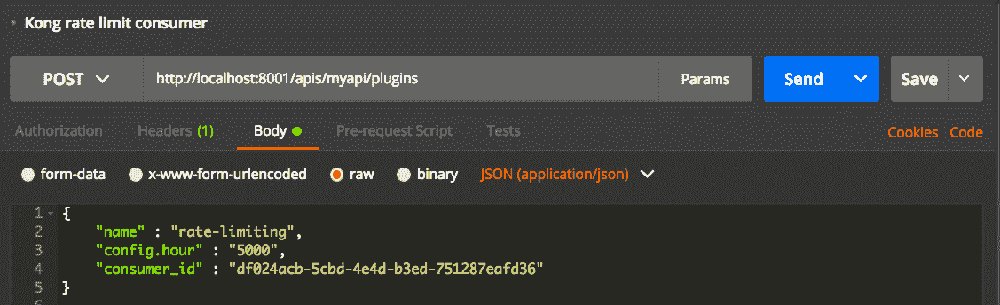

# 第十一章：使用 API 网关监视和度量 REST API

一旦我们开发了 API，我们需要将其暴露给外部世界。在这个过程中，我们部署它们。但这足够了吗？我们不需要跟踪我们的 API 吗？哪些客户端正在连接？请求的延迟是多少，等等？有许多其他的 API 开发后步骤，人们应该遵循，使其 API 达到生产级别。它们是身份验证、日志记录、速率限制等。添加这些功能的最佳方式是使用 API 网关。在本章中，我们将探索一个名为 Kong 的开源 API 网关。与云提供商相比，开源软件更可取，因为减少了供应商锁定的风险。所有 API 网关在实现上有所不同，但执行相同的任务。

在本章中，我们将涵盖以下主题：

+   为什么需要 API 网关？

+   介绍 Kong，一个开源的 API 网关

+   Docker 中的示例说明

+   将开发的 API 添加到 Kong

+   在 Kong 中登录

+   Kong 中的身份验证和速率限制

+   Kong CLI 中的重要命令

# 获取代码

您可以在以下链接找到本章的代码示例：[`github.com/narenaryan/gorestful/tree/master/chapter11`](https://github.com/narenaryan/gorestful/tree/master/chapter11)。本章中文件的用法在各自的部分中有解释。您还可以从存储库中导入 Postman 客户端集合（JSON 文件）来测试 API，我们将在本章中介绍。

# 为什么需要 API 网关？

假设一个名为 XYZ 的公司为其内部目的开发了 API。它以两种方式将 API 暴露给外部使用：

+   使用已知客户端的身份验证进行暴露

+   将其作为 API 服务公开

在第一种情况下，此 API 由公司内部的其他服务使用。由于它们是内部的，我们不限制访问。但在第二种情况下，由于 API 细节提供给外部世界，我们需要一个中间人来检查和验证请求。这个中间人就是 API 网关。API 网关是一个位于客户端和服务器之间的中间人，并在满足特定条件时将请求转发到服务器。

现在，XYZ 有一个用 Go 和 Java 编写的 API。有一些通用的事情适用于任何 API：

+   身份验证

+   请求和响应的日志记录

没有 API 网关，我们需要编写另一个跟踪请求和 API 身份验证等内容的服务器。当新的 API 不断添加到组织中时，实施和维护是繁琐的。为了处理这些基本事项，API 网关是一个很好的中间件。

基本上，API 网关会执行以下操作：

+   日志记录

+   安全

+   流量控制

+   转换

日志记录是跟踪请求和响应的方式。如果我们需要组织级别的日志记录，与 Go kit 中的应用级别日志记录相反，我们应该在 API 网关中启用日志记录。安全性是身份验证的工作方式。它可以是基本身份验证，基于令牌的身份验证，OAuth2.0 等。限制对有效客户端的 API 访问是至关重要的。

当 API 是付费服务时，流量控制就会发挥作用。当组织将数据作为 API 出售时，需要限制每个客户端的操作。例如，客户端每月可以发出 10,000 个 API 请求。速率可以根据客户选择的计划进行设置。这是一个非常重要的功能。转换就像在命中应用程序服务器之前修改请求，或者在发送回客户端之前修改响应。看一下以下图表：



我们可以看到如何将上述功能添加到我们的 Web 服务中。从图表中，API 网关可以将请求重定向到任何给定的内部服务器。客户端看到所有 API 都在组织的单个实体下。

# Kong，一个开源的 API 网关

Kong 是一个开源的 API 网关和微服务管理层，提供高性能和可靠性。它是两个值得一提的库的组合。一个是**OpenResty**，另一个是**Nginx**。Kong 是这两个主要组件的包装器。OpenResty 是一个完整的 Web 平台，集成了 Nginx 和 Lua。Lua 是一种类似于 Go 的编程语言。Kong 是用 Lua 编写的。我们使用 Kong 作为部署我们的 Go REST 服务的工具。我们要讨论的主要主题是：

+   安装 Kong 和 Kong 数据库

+   将我们的 API 添加到 Kong

+   使用插件

+   登录 Kong

+   在 Kong 中进行速率限制

Kong 需要一个数据库才能运行。它可以是 Cassandra 或 PostgreSQL。由于我们已经熟悉 PostgreSQL，我们选择了它。在哪里安装它们？为了说明问题，我们可以在本地机器上安装它们，但有一个缺点；它可能会损坏我们的机器。为了测试设置，我们将使用 Docker。Docker 可以创建容器化应用程序并在可预测的隔离环境中运行它们。

使用 Kong，我们可以将我们的 API 隐藏在一个网关下。我们可以为我们的 API 创建消费者（客户端）。Kong 通过 REST API 执行所有操作。Kong 有两种 API：

+   应用程序 API（运行在端口`8000`上）

+   管理 API（运行在端口`8001`上）

使用应用程序 API，我们可以访问我们的 Web 服务。管理 API 允许我们在网关下添加/删除 API。我们将在接下来的部分中更详细地了解这些内容。有关 Kong 的更多详细信息，请访问[`getkong.org/`](https://getkong.org/)。

# 介绍 Docker

Docker 是一个可以创建操作系统的虚拟化工具，以微小容器的形式。它就像在单个主机上有多个操作系统。开发人员通常抱怨说*在我的环境中工作*，同时面临部署问题。Docker 通过定义镜像形式的 OS 环境来消除这些情况。Docker 镜像包含了在特定时间给定 OS 的所有信息。它允许我们任意多次地复制该环境。

最初只适用于 Linux，但现在适用于 macOS X 和 Windows。要下载和安装 Docker，请访问[`docs.docker.com/engine/installation/`](https://docs.docker.com/engine/installation/)。对于 Windows 和 Mac，二进制文件可在 Docker 网站上找到并且可以轻松安装。安装后，使用以下命令验证 Docker 安装：

```go
docker -v
Docker version 17.09.0-ce, build afdb6d4
```

它将提供版本号；始终选择最新的 Docker。现在 Docker 准备就绪，让我们运行一些命令来安装 Kong。接下来的部分需要一些 Docker 知识。如果不够自信，请阅读网上关于 Docker 基础知识的精彩文章。

我们的最终目标是创建三个容器：

+   Kong 数据库

+   Go 容器

+   Kong 应用

当这三个容器运行时，它为在 API 网关后面设置 Web 服务的舞台。

# 安装 Kong 数据库和 Kong

首先，安装 PostgreSQL DB。一个条件是我们需要暴露`5432`端口。用户和数据库名称应为`kong`，并且应作为环境变量传递给容器：

```go
docker run -d --name kong-database \
 -p 5432:5432 \
 -e "POSTGRES_USER=kong" \
 -e "POSTGRES_DB=kong" \
 postgres:9.4
```

这个命令的工作方式是这样的：

1.  从 Docker 存储库获取名为`postgres:9.4`的镜像。

1.  给镜像命名为`kong-database`。

1.  在名为`POSTGRES_USER`和`POSTGRES_DB`的容器中设置环境变量。

这将通过拉取托管在**DockerHub**（[`hub.docker.com/`](https://hub.docker.com/)）存储库上的 PostgreSQL 镜像来创建一个 Docker 容器。现在，通过运行另一个 Docker 命令来应用 Kong 所需的迁移：

```go
docker run --rm \
 --link kong-database:kong-database \
 -e "KONG_DATABASE=postgres" \
 -e "KONG_PG_HOST=kong-database" \
 kong:latest kong migrations up
```

它在先前创建的 PostgreSQL DB 容器上应用迁移。该命令有一个名为`--rm`的选项，表示*一旦迁移完成，删除此容器*。在安装 Kong 容器之前，让我们准备好我们的 Go 服务。这将是一个简单的项目，其中包含一个健康检查`GET` API。

现在，转到主机上的任何目录并创建一个名为`kongExample`的项目：

```go
mkdir kongExample
```

在该目录中创建一个名为`main.go`的程序，该程序获取`GET`请求的健康检查（日期和时间）：

```go
package main
import (
    "fmt"
    "github.com/gorilla/mux"
    "log"
    "net/http"
    "time"
)
func HealthcheckHandler(w http.ResponseWriter, r *http.Request) {
    w.WriteHeader(http.StatusOK)
    fmt.Fprintf(w, time.Now().String())
}
func main() {
    // Create a new router
    r := mux.NewRouter()
    // Attach an elegant path with handler
    r.HandleFunc("/healthcheck", HealthcheckHandler)
    srv := &http.Server{
        Handler: r,
        Addr: "0.0.0.0:3000",
        // Good practice: enforce timeouts for servers you create!
        WriteTimeout: 15 * time.Second,
        ReadTimeout: 15 * time.Second,
    }
    log.Fatal(srv.ListenAndServe())
}
```

该程序在请求时返回日期和时间。现在，我们需要将这个应用程序 Docker 化。Docker 化意味着创建一个运行的容器。将 Dockerfile 添加到当前目录（在相同级别的`kongExample`中）：

```go
FROM golang
ADD kongExample /go/src/github.com/narenaryan/kongExample
RUN go get github.com/gorilla/mux
RUN go install github.com/narenaryan/kongExample
ENTRYPOINT /go/bin/kongExample
```

我们使用这个 Dockerfile 构建一个容器。它告诉我们从 DockerHub 拉取`golang`容器（自动安装 Go 编译器并设置`GOPATH`），并将这个`kongExample`项目复制到容器中。安装项目所需的必要软件包（在本例中是 Gorilla Mux），然后编译二进制文件并启动服务器。运行此命令创建容器：

```go
docker build . -t gobuild
```

注意`docker build`命令后的`.`。`-t`选项是为镜像打标签。它告诉 Docker 查看当前目录中的 Dockerfile，并根据给定的指令创建一个 Docker 镜像。我们需要实际运行这个镜像来创建一个容器：

```go
docker run  -p 3000:3000 --name go-server -dit gobuild
```

它创建一个名为`go-server`的容器，并在端口`3000`上启动 Go Web 服务器。现在安装 Kong 容器，就像这样：

```go
docker run -d --name kong \
 --link kong-database:kong-database \
 --link go-server:go-server \
 -e "KONG_DATABASE=postgres" \
 -e "KONG_PG_HOST=kong-database" \
 -e "KONG_PROXY_ACCESS_LOG=/dev/stdout" \
 -e "KONG_ADMIN_ACCESS_LOG=/dev/stdout" \
 -e "KONG_PROXY_ERROR_LOG=/dev/stderr" \
 -e "KONG_ADMIN_ERROR_LOG=/dev/stderr" \
 -p 8000:8000 \
 -p 8443:8443 \
 -p 8001:8001 \
 -p 8444:8444 \
 kong:latest
```

这个命令与第一个命令类似，只是我们暴露了许多其他端口供 Kong 使用。我们还从 DockerHub 拉取`kong:latest`镜像。其他的是 Kong 所需的环境变量。我们将`kong-database`链接到名为`kong-database`的主机名，将`go-server`链接到`go-server`。主机名是 Docker 环境中的一个有用的实体，用于从一个容器识别和访问另一个容器。Docker 维护一个内部的**域名空间**（**DNS**），用于跟踪 Docker 容器的 IP 地址到链接名称的映射。这将启动 Kong 容器并使用名为`kong.conf.default`的默认文件启动 Kong 服务。

现在，如果我们查看正在运行的容器，它列出了三个容器 ID：

```go
docker ps -q
b6cd3ad39f75
53d800fe3b15
bbc9d2ba5679
```

Docker 容器只是用于运行应用程序的隔离环境。将微服务运行在不同的容器中是最佳实践，因为它们松散耦合，一个环境不会干扰另一个环境。

这意味着我们成功地为 Kong API 网关设置了基础设施。让我们看看如何在 Kong 中添加来自`go-server`的 API。为了检查 Kong 的状态，只需向此 URL 发出`GET`请求：

```go
curl -X GET http://localhost:8001/status
```

它返回数据库的状态以及 Kong 的统计信息：

```go
{
  "database": {
    "reachable": true
  },
  "server": {
    "connections_writing": 1,
    "total_requests": 13,
    "connections_handled": 14,
    "connections_accepted": 14,
    "connections_reading": 0,
    "connections_active": 2,
    "connections_waiting": 1
  }
}
```

# 向 Kong 添加 API

Kong 提供了一个直观的 REST API 来将自定义 API 添加到网关。为了添加上述的健康检查 API，我们需要向运行在端口`8001`上的 Kong 管理 API 发出`POST`请求。从现在开始，我们使用 Postman REST 客户端来显示所有 API 请求。这些 API 请求也作为 JSON 文件集合在本章的存储库中提供，供读者下载并分别导入到他们的 Postman 客户端中。有关导出和导入 Postman 集合的更多信息，请访问[`www.getpostman.com/docs/postman/collections/data_formats`](https://www.getpostman.com/docs/postman/collections/data_formats)。

从 Postman 向 Kong 管理 URL`http://localhost:8001/apis`发出`POST`请求，并在 JSON 主体中使用这些字段：

```go
{
    "name": "myapi",
    "hosts": "server1",
    "upstream_url": "http://go-server:3000",
    "uris":["/api/v1"],
    "strip_uri": true,
    "preserve_host": false
}
```

它将我们的健康检查 API 添加到 Kong。Postman 屏幕看起来像以下截图所示，显示了所有更改。Postman 是一个很棒的工具，允许 Windows、macOS X 和 Linux 用户进行 HTTP API 请求的测试。您可以在这里下载它[`www.getpostman.com/`](https://www.getpostman.com/)。



一旦我们这样做，我们就会得到包含 API 详细信息的响应 JSON。这个新的`myapi`将被赋予一个 ID：

```go
{
  "created_at": 1509195475000,
  "strip_uri": true,
  "id": "795409ae-89ae-4810-8520-15418b96161f",
  "hosts": [
    "server1"
  ],
  "name": "myapi",
  "http_if_terminated": false,
  "preserve_host": false,
  "upstream_url": "http://go-server:3000",
  "uris": [
    "/api/v1"
  ],
  "upstream_connect_timeout": 60000,
  "upstream_send_timeout": 60000,
  "upstream_read_timeout": 60000,
  "retries": 5,
  "https_only": false
}
```

向此 URL 发出`GET`请求，`http://localhost:8001/apis/myapi`返回新添加的`myapi`的元数据。

关于我们发布到`POST` API 的字段，`name`是 API 的唯一名称。我们需要使用这个来在网关上标识 API。`hosts`是网关可以接受和转发请求的主机列表。上游 URL 是 Kong 转发请求的实际地址。由于我们在开始时链接了`go-server`容器，我们可以直接从 Kong 中引用`http://go-server:3000`。`uris`字段用于指定相对于上游代理（Go 服务器）的路径，以获取资源。

例如，如果 URI 是`/api/v1`，而 Go 服务器的 API 是`/healthcheck`，则生成的网关 API 将是：

```go
http://localhost:8000/api/v1/healthcheck
```

`preserve_host`是一个属性，它表示 Kong 是否应该将请求的主机字段更改为上游服务器的主机名。有关更多信息，请参阅[`getkong.org/docs/0.10.x/proxy/#the-preserve_host-property`](https://getkong.org/docs/0.10.x/proxy/#the-preserve_host-property)。其他设置，如`upstream_connect_timeout`，都很简单。

我们将我们的 API 添加到 Kong。让我们验证它是否将我们的健康检查请求转发到 Go 服务器。不要忘记为所有 API 请求添加一个名为`Host`值为`server1`的标头。这非常重要。API 调用如下图所示：

>

我们成功收到了响应。这是我们的`main.go`程序中的`HealthcheckHandler`返回的响应。

如果收到 404 错误，请尝试从头开始执行该过程。问题可能是容器没有运行，或者 Kong 容器无法访问上游 URL。另一个关键错误可能来自于未在请求标头中添加主机。这是在添加 API 时给出的主机。

这个健康检查 API 实际上是作为 Go 服务运行的。我们向 API 网关发出了 API 请求，它正在将其转发到 Go。这证明我们成功地将我们的 API 与 API 网关链接起来。

这是 API 的添加，只是冰山一角。其他事情呢？我们将逐个研究 API 网关的每一个功能，并尝试为我们的 API 实现它们。

在 Kong 中，除了基本路由之外，还提供了其他功能，如日志记录和速率限制。我们需要使用插件将它们启用到我们的 API 中。Kong 插件是一个内置组件，可以让我们轻松地插入任何功能。有许多类型的插件可用。其中，我们将在下一节讨论一些有趣的插件。让我们从日志记录插件开始。

# Kong 中的 API 日志记录

Kong 中有许多插件可用于将请求记录到多个目标。目标是收集日志并将其持久化的系统。以下是可用于日志记录的重要插件：

+   文件日志

+   Syslog

+   HTTP 日志

第一个是文件日志记录。如果我们需要 Kong 服务器以 JSON 格式将请求和响应日志存储到文件中，使用此插件。我们应该调用 Kong 的管理 REST API（`http://localhost:8001/apis/myapi/plugins`）来执行：



点击发送按钮，网关将返回响应，如下所示：

```go
{
  "created_at": 1509202704000,
  "config": {
    "path": "/tmp/file.log",
    "reopen": false
  },
  "id": "57954bdd-ee11-4f00-a7aa-1a48f672d36d",
  "name": "file-log",
  "api_id": "795409ae-89ae-4810-8520-15418b96161f",
  "enabled": true
}
```

它基本上告诉 Kong，对于名为`myapi`的 API，将每个请求记录到名为`/tmp/file.log`的文件中。现在，向 API 网关发出健康检查的另一个请求（`http://localhost:8000/api/v1/healthcheck`）。此请求的日志将保存在给定的文件路径中。

我们如何查看这些日志？这些日志将保存在容器的`/tmp`文件夹中。打开一个新的终端标签，并使用以下命令进入 Kong 容器：

```go
docker exec -i -t kong /bin/bash
```

这将带您进入容器的 bash shell。现在，检查日志文件：

```go
cat /tmp/file.log
```

然后你会看到一个长长的 JSON 写入文件：

```go
{"api":{"created_at":1509195475000,"strip_uri":true,"id":"795409ae-89ae-4810-8520-15418b96161f","hosts":["server1"],"name":"myapi","headers":{"host":["server1"]},"http_if_terminated":false,"https_only":false,"retries":5,"uris":["\/api\/v1"],"preserve_host":false,"upstream_connect_timeout":60000,"upstream_read_timeout":60000,"upstream_send_timeout":60000,"upstream_url":"http:\/\/go-server:3000"},"request":{"querystring":{},"size":"423","uri":"\/api\/v1\/healthcheck","request_uri":"http:\/\/server1:8000\/api\/v1\/healthcheck","method":"GET","headers":{"cache-control":"no-cache","cookie":"session.id=MTUwODY2NTE3MnxOd3dBTkZaUVNqVTBURmRTUlRSRVRsUlpRMHhGU2xkQlZVNDFVMFJNVmxjMlRFNDJUVXhDTWpaWE1rOUNORXBFVkRJMlExSXlSMEU9fNFxTxKgoEsN2IWvrF-sJgH4tSLxTw8o52lfgj2DwnHI","postman-token":"b70b1881-d7bd-4d8e-b893-494952e44033","user-agent":"PostmanRuntime\/3.0.11-hotfix.2","accept":"*\/*","connection":"keep-alive","accept-encoding":"gzip, deflate","host":"server1"}},"client_ip":"172.17.0.1","latencies":{"request":33,"kong":33,"proxy":0},"response":{"headers":{"content-type":"text\/plain; charset=utf-8","date":"Sat, 28 Oct 2017 15:02:05 GMT","via":"kong\/0.11.0","connection":"close","x-kong-proxy-latency":"33","x-kong-upstream-latency":"0","content-length":"58"},"status":200,"size":"271"},"tries":[{"balancer_latency":0,"port":3000,"ip":"172.17.0.3"}],"started_at":1509202924971}
```

这里记录的 IP 地址是 Docker 分配给容器的内部 IP。这个日志还包含有关 Kong 代理、Go 服务器等的延迟信息的详细信息。您可以在[`getkong.org/plugins/file-log/`](https://getkong.org/plugins/file-log/)了解有关记录字段格式的更多信息。Kong 管理 API 用于启用其他日志记录类型与`file-log`类似。

我们从 Postman 向管理 API 发出的`POST`请求具有`Content-Type: "application/json"`的标头。

# Kong 中的 API 身份验证

正如我们提到的，API 网关应该负责多个 API 在其后运行的身份验证。在 Kong 中有许多插件可用于提供即时身份验证。在下一章中，我们将详细了解身份验证概念。目前，使用这些插件，我们可以通过调用 Kong 管理 API 为特定 API 添加身份验证。

基于 API 密钥的身份验证如今变得很有名。Kong 提供以下身份验证模式：

+   基于 API 密钥的身份验证

+   OAuth2 身份验证

+   JWT 身份验证

为了简单起见，让我们实现基于 API 密钥的身份验证。简而言之，基于密钥的身份验证允许外部客户端使用唯一令牌消耗 REST API。为此，在 Kong 中，首先启用密钥身份验证插件。要启用插件，请向`http://localhost:8001/apis/myapi/plugins` URL 发出`POST`请求，并在 JSON 主体中包含两个内容：

1.  `name`是`key-auth`。

1.  `config.hide_credentials`是`true`。

第二个选项是剥离/隐藏凭据以传递给 Go API 服务器。看一下以下截图：



它返回 JSON 响应与创建的`api_id`：

```go
    {
      "created_at": 1509212748000,
      "config": {
        "key_in_body": false,
        "anonymous": "",
        "key_names": [
          "apikey"
        ],
        "hide_credentials": true
      },
      "id": "5c7d23dd-6dda-4802-ba9c-7aed712c2101",
      "enabled": true,
      "api_id": "795409ae-89ae-4810-8520-15418b96161f",
      "name": "key-auth"
    }
```

现在，如果我们尝试进行健康检查 API 请求，我们会收到 401 未经授权的错误：

```go
{
  "message": "No API key found in request"
}
```

那么我们如何使用 API？我们需要创建一个消费者并为他授予权限访问 API。该权限是一个 API 密钥。让我们看看如何做到这一点。

要创建一个消费者，我们需要创建一个代表使用 API 的用户的消费者。向 Kong 管理 API 的消费者发出 API 调用。URL 端点将是`http://localhost:8001/consumers`。参考以下截图：



`POST`主体应该有`username`字段。响应将是创建的消费者的 JSON：

```go
{
  "created_at": 1509213840000,
  "username": "johnd",
  "id": "df024acb-5cbd-4e4d-b3ed-751287eafd36"
}
```

现在，如果我们需要授予 API 权限给`johnd`，请向`http://localhost:8001/consumers/johnd/key-auth admin` URL 发出`POST`请求：



这将返回 API 密钥：

```go
{
  "id": "664435b8-0f16-40c7-bc7f-32c69eb6c39c",
  "created_at": 1509214422000,
  "key": "89MH58EXzc4xHBO8WZB9axZ4uhZ1vW9d",
  "consumer_id": "df024acb-5cbd-4e4d-b3ed-751287eafd36"
}
```

我们可以在随后的 API 调用中使用此 API 密钥生成。现在，在标头中使用`apikey`重新进行健康检查，其值是前面响应中的密钥，它将成功返回日期和时间以及`200 OK`。参考以下截图：



# Kong 中的 API 速率限制

我们可以限制特定消费者的 API 速率。例如，GitHub 限制客户端每小时进行 5000 次请求。之后，它会抛出 API 速率限制错误。我们可以使用 Kong 的`rate-limiting`插件为我们的 API 添加类似的速率限制约束。

我们可以使用此 API 进行启用：**`http://localhost:8001/apis/myapi/plugins`**，使用`POST` `name`、`config.hour`和`consumer_id`作为 body 参数：



这个 API 调用正在创建速率限制规则。`consumer_id`是用户名`johnd`的 ID。这个 JSON 响应有一个`ID`

```go
{
  "created_at": 1509216578000,
  "config": {
    "hour": 5000,
    "redis_database": 0,
    "policy": "cluster",
    "hide_client_headers": false,
    "redis_timeout": 2000,
    "redis_port": 6379,
    "limit_by": "consumer",
    "fault_tolerant": true
  },
  "id": "b087a740-62a2-467a-96b5-9cee1871a368",
  "enabled": true,
  "name": "rate-limiting",
  "api_id": "795409ae-89ae-4810-8520-15418b96161f",
  "consumer_id": "df024acb-5cbd-4e4d-b3ed-751287eafd36"
}
```

现在，消费者（`johnd`）在 API 上有速率限制。他每小时只能允许对我们的健康检查 API 进行 5000 次请求。如果超过，他将收到以下错误：

```go
{"message":"API rate limit exceeded"}
```

客户端应该如何知道剩余的请求次数作为速率控制的一部分？当客户端向 API 发出请求时，Kong 在响应中设置了一些标头。尝试进行 10 次健康检查请求并检查响应标头；您将在响应标头中找到以下内容，证明速率限制正在起作用：

```go
X-RateLimit-Limit-hour →5000
X-RateLimit-Remaining-hour →4990
```

通过这种方式，Kong 提供了许多优秀的功能，可以将我们的 API 提升到更高的水平。这并不意味着 API 网关是绝对必要的，但它可以让您享受许多很酷的功能，而无需编写一行代码。它是一个开源软件，旨在避免在 Web 服务业务逻辑中重新编写通用定义的 API 网关功能。有关诸如负载平衡和请求转换之类的更多功能，请查看 Kong 的文档[`konghq.com/plugins/`](https://konghq.com/plugins/)。

# Kong CLI

Kong 配备了一个命令行工具，用于更改 Kong 的行为。它有一组命令来启动、停止和修改 Kong。Kong 默认使用配置文件。如果我们需要修改它，我们需要重新启动 Kong 才能应用这些更改。因此，所有这些基本工作都已经编码到 Kong CLI 工具中。基本功能包括：

+   `kong start`：用于启动 Kong 服务器

+   `kong reload`：用于重新加载 Kong 服务器

+   `kong stop`：用于停止 Kong 服务器

+   `kong check`：用于验证给定的 Kong 配置文件

+   `kong health`：用于检查必要的服务，如数据库，是否正在运行

请查看 Kong CLI 的文档以获取更多命令[`getkong.org/docs/0.9.x/cli/`](https://getkong.org/docs/0.9.x/cli/)。

# 其他 API 网关

市场上有许多其他 API 网关提供商。正如我们之前提到的，所有网关都执行相同类型的功能。像亚马逊 API 网关这样的企业网关服务提供商与 EC2 和 Lambdas 兼容。Apigee 是另一个知名的 API 网关技术，是 Google Cloud 的一部分。云服务提供商的问题在于它们可能导致供应商锁定（无法轻松迁移到另一个平台）。因此，对于初创公司来说，开源替代方案总是不错的选择。

# 总结

在本章中，我们从 API 网关的基础知识开始。API 网关尝试做一些事情；它充当我们的 API 的代理。通过充当代理，它将请求转发到不同域的多个 API。在转发的过程中，网关可以阻止请求，对其进行速率限制，还可以转换请求/响应。

Kong 是一个适用于 Linux 平台的优秀的开源 API 网关。它具有许多功能，如身份验证、日志记录和速率限制。我们看到了如何在 Docker 容器中安装 Kong、Kong 数据库和我们的 REST 服务。我们使用 Docker 而不是主机机器，因为容器可以随意销毁和创建。这减少了损坏主机系统的机会。在了解安装后，我们了解到 Kong 有两种类型的 REST API。一种是管理 API，另一种是应用程序 API。管理 API 是我们用来将 API 添加到网关的 API。应用程序 API 是我们应用程序的 API。我们看到了如何将 API 添加到 Kong。然后，我们了解了 Kong 插件。Kong 插件是可以插入 Kong 的功能模块。日志记录插件可用。Kong 还提供身份验证插件和速率限制插件。

我们使用 Postman 客户端进行了请求，并看到了返回的示例 JSON。对于身份验证，我们使用了基于`apikey`的消费者。然后，我们使用 Kong 的`key-auth`插件模拟了 GitHub 每小时 5000 次请求。

最后，我们介绍了 Kong CLI，并检查了其他企业 API 网关，如 Apigee 和亚马逊 API 网关。在下一章中，我们将更详细地了解身份验证的工作原理，并在没有 API 网关的情况下尝试保护我们的 API。
