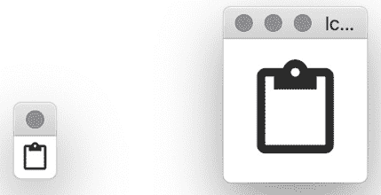

# 第三章：*第三章*：窗口、画布和绘图

我们已经探讨了图形应用程序开发的基础，并看到了从现代语言中的新设计开始如何导致更简单的开发。从现在开始，我们将更详细地探讨 Fyne 工具包旨在为所有开发者提供易于使用的 API 来构建跨平台应用程序。

在本章中，我们将研究 Fyne 应用程序的结构，它如何绘制对象，以及它们如何在容器中进行缩放和操作——以及动画。

在本章中，我们将涵盖以下主题：

+   如何构建 Fyne 应用程序及其结构以及如何开始制作您的第一个应用程序

+   探索画布包和可以绘制的对象类型

+   可扩展元素如何创建一个干净的用户界面

+   与位图和像素渲染一起工作

+   元素和属性的动画

到本章结束时，您将了解这些功能如何组合在一起创建一个图形应用程序，这将通过一个简单的游戏进行演示。

# 技术要求

在本章中，我们将编写我们的第一个 Fyne 代码，包括构建一个完整的应用程序。为此，您需要安装 **Go** 编译器以及一个代码编辑器应用程序。您可以从 [`golang.org/dl/`](https://golang.org/dl/) 的主页下载 Go。代码编辑器的选择通常是用户偏好的问题，但微软的 *Visual Studio Code* 和 JetBrain 的 *GoLand* 应用程序都强烈推荐。

由于 Fyne 在内部使用一些操作系统 API，因此您还需要安装一个 **C** 编译器。Linux 上的开发者可能已经安装了一个；macOS 用户可以从 Mac App Store 简单地安装 *Xcode*。基于 Windows 的开发者需要安装一个编译器，例如 *MSYS2*、*TDM-GCC* 或 *Cygwin*——更多详细信息可以在 *附录 A* *– 开发者工具安装* 中找到。

本章的完整源代码可以在本书的 GitHub 仓库中找到，网址为 [`github.com/PacktPublishing/Building-Cross-Platform-GUI-Applications-with-Fyne/tree/master/Chapter03`](https://github.com/PacktPublishing/Building-Cross-Platform-GUI-Applications-with-Fyne/tree/master/Chapter03)。

# Fyne 应用程序的解剖结构

正如我们在 *第二章* *《根据 Fyne 的未来》* 中所看到的，工具包抓住了从头开始的机会，摒弃了旧工具包中的一些有时令人困惑的限制。因此，API 需要定义构建图形应用程序所涉及的所有内容。在本节中，我们将探讨运行基于 Fyne 的应用程序和产生屏幕上可见组件的主要概念，从应用程序本身开始。

## 应用程序

在`fyne.App`接口中定义的应用程序，模拟了基于 Fyne 的应用程序的功能。每个使用 Fyne 的应用程序通常会在其`main()`函数内部创建并运行一个单独的`fyne.App`实例。由于图形应用程序的工作方式，它们必须从主函数启动，而不是通过 goroutine 或其他后台线程。

要创建应用程序实例，我们利用 Fyne 中的`app`包，可以使用`fyne.io/fyne/app`导入它。这个包包含了所有逻辑和驱动设置代码，允许应用程序了解其运行的平台并适当地配置自己。我们调用的函数名为`New()`，它将返回我们将在整个代码中使用的应用程序实例。要运行应用程序，我们随后调用`Run()`，应用程序将启动。

带着这些知识，我们可以运行我们的第一个 Fyne 应用程序；然而，如果不先要求它显示某些内容，很难知道它是否在正常工作！因此，我们现在将学习如何在运行第一个示例之前显示一个窗口。

## 窗口

**窗口**定义了屏幕上应用程序控制区域。在桌面环境中，这通常会在与已安装的其他应用程序匹配的窗口边框内显示。你通常可以移动和调整窗口大小，并在完成后关闭它。

在移动和其他设备上，这个概念可能定义得不太明确。例如，在 Android 和 iOS 智能手机上，应用程序窗口将占据整个屏幕，并且不会显示窗口边框。要切换应用程序，你会使用操作系统定义的手势或按下一个标准按钮，其他应用程序将出现，允许你移动。此外，平板电脑——例如 iPadOS、Android 或 Windows——将允许应用程序在屏幕的一部分显示，可能通过一个分隔符来分隔，允许用户改变使用的空间量。

在所有这些不同的展示模式中，显示的内容仍然由`fyne.Window`接口来模拟。

要在屏幕上显示内容，我们需要创建一个新的窗口并显示它。一旦定义了窗口，我们就可以运行应用程序来查看结果。让我们逐步分析我们的第一个应用程序的代码！

1.  我们打开一个新的文件，`main.go`，并将其定义为`main`包：

    ```go
    package main
    ```

1.  然后我们需要添加任何导入——在这个例子中，我们只是使用`app`包，所以以下就足够了：

    ```go
    import "fyne.io/fyne/app"
    ```

1.  要定义一个可运行的程序，我们创建一个`main()`方法。在这个函数中，我们将使用之前看到的`New()`函数创建一个新的应用程序实例：

    ```go
    func main() {
        a := app.New()
        ...
    }
    ```

1.  此外，在这个方法中，我们调用`NewWindow(string)`（在`fyne.App`中定义），这允许我们创建用于显示的窗口。我们传递一个字符串参数来设置标题（例如，如果操作系统在窗口边框或应用程序切换器中显示标题，则使用它）。将以下代码放置在前面代码片段中的`...`出现的位置：

    ```go
        w := a.NewWindow("Hello")
    ```

1.  一旦我们创建了一个窗口，我们可以使用`Show()`函数来显示它。在显示窗口之后，我们还需要在应用程序上调用`Run()`函数。由于通常同时进行这两项操作，有一个辅助函数`ShowAndRun()`，我们可以在显示应用程序的第一个窗口时使用它：

    ```go
        w.ShowAndRun()
    ```

1.  在此代码到位后，我们可以保存文件并像其他 Go 应用程序一样运行其内容：

    ```go
    Chapter03/window$ go run main.go
    ```

1.  你应该在屏幕上看到一个窗口出现。根据你的操作系统，这可能会是一个非常小的窗口，因为我们没有添加任何内容。下面的截图是在 macOS 计算机上调整空窗口大小后拍摄的：


图 3.1 – 我们的第一个窗口

如您从*图 3.1*中的窗口中看到的，窗口中没有内容，因为我们没有设置任何内容。窗口的背景不仅仅是黑色（或旧图形内存中的随机颜色）——这怎么可能呢？原因是窗口包含一个`Canvas`，这就是管理我们绘制的内容的东西。

## 画布

每个`fyne.Window`的内容都是一个`fyne.Canvas`。尽管画布内部的工作方式取决于当前系统和 Fyne 内部驱动程序包中的某些复杂代码，但它对开发者和我们的应用程序最终用户来说看起来完全一样。这个平台无关的渲染画布负责所有组合在一起创建图形输出并最终完成应用程序界面的绘制操作。

在每个画布中至少包含一个`fyne.CanvasObject`。这些对象，正如我们在*理解 CanvasObject 和画布包*部分将看到的，定义了可以绘制到画布上的操作类型。为了设置窗口的内容，我们可以使用`Window.SetContent(fyne.CanvasObject)`。这个函数将内容传递到画布，告诉它绘制这个对象，并且调整窗口大小以足够大以显示它。

当然，这仅设置内容为单个元素；我们通常希望包含许多元素，这正是`Container`类型提供的。

## 容器

`fyne.Container`扩展了简单的`fyne.CanvasObject`类型，包括管理多个子对象。容器负责控制它包含的每个元素的大小和位置。*图 3.2*显示了**画布**包含一个容器，该容器将三个**CanvasObject**元素堆叠在左侧，并在右侧还有一个额外的**Container**。这个第二个容器负责三个进一步元素，它将它们排列成一行：

![图 3.2 – 包含各种容器和 CanvasObject 元素的画布

![img/Figure_3.3_B16820.jpg]

图 3.2 – 包含各种容器和 CanvasObject 元素的画布

容器通常将定位子对象的工作委托给`fyne.Layout`。这些布局算法将在*第四章**，布局和文件处理*中进一步探讨。在当前章节中，我们将使用不带布局的容器——这些被称为*手动布局*，并使用`container.NewWithoutLayout(elements)`调用，其中`elements`参数是容器将要展示的`fyne.CanvasObject`类型列表。我们将在*组合元素*部分进一步探讨手动布局。

现在我们已经看到了应用程序的定义以及它如何处理图形元素的表现，我们应该看看 Fyne 支持哪些绘图功能，以及如何使用它们。

# 理解 CanvasObject 和画布包

`CanvasObject`定义只是一个 Go 接口，它描述了一个可以定位、调整大小并添加到 Fyne 画布中的元素。该类型不包含任何关于如何绘制的相关信息——这些信息由`canvas`包内的*具体类型*提供。这些类型定义了易于理解的图形原语，例如`Text`和`Line`。

在学习如何使用这些元素之前，我们应该看看它们在 Fyne 演示应用程序中的样子。

## 画布演示

在我们查看如何在窗口中显示形状的代码之前，我们应该看看这些功能的实际演示。使用内置的 Fyne 演示应用程序，我们可以看到`canvas`包支持什么。如果您还没有这样做，可以使用以下命令安装并运行演示应用程序：

```go
$ go get fyne.io/fyne/cmd/fyne_demo
$ ~/go/bin/fyne_demo
```

在运行演示时，点击左侧导航面板上的**画布**项。你应该看到以下屏幕：

![图 3.3 - fyne_demo 应用程序展示各种画布原语

![img/Figure_3.7_B16820.jpg]

图 3.3 - fyne_demo 应用程序展示各种画布原语

如*图 3.3*所示，该窗口展示了 Fyne 所知的几种画布类型。这里绘制的类型按以下列表顺序命名（从左到右，从上到下）：

+   图片

+   矩形

+   线

+   圆形

+   文本

+   光栅

+   线性渐变

+   径向渐变

这些元素都可以包含在我们的应用程序中，正如我们接下来将要探索的。

## 向我们的窗口添加对象

上一演示图中的每个元素，以及随后添加到`canvas`包中的任何新项目，都可以直接使用它们的`NewXxx()`构造函数创建。从这个构造函数返回的对象可以直接传递到窗口或对象容器中。

为了演示这一点，让我们向空窗口添加一些文本内容。在之前使用的`import`语句中添加`image/color`和`fyne.io/fyne/canvas`之后，我们可以将主函数更改为以下内容：

```go
func main() {
    a := app.New()
    w := a.NewWindow("Hello")
    w.SetContent(canvas.NewText("This works!", 
        color.Black))
    w.ShowAndRun()
}
```

如您所见，这次更改仅添加了一行——传递给 `w.SetContent` 的 `canvas.NewText`。文本构造函数接受两个参数，要显示的文本和要使用的颜色。如果您运行此代码，您将看到窗口现在包含文本 **This works!**，并且大小正好适合显示：


图 3.4 – 显示文本内容

如您所见，显示画布元素就像知道您想显示哪些内容一样简单。让我们看看一个稍微复杂一点的例子，使用容器中的多个画布元素。

## 元素组合

为了展示我们如何使用容器来显示多个项目并创建更吸引人的输出，我们将使用 `canvas.Circle` 和 `canvas.Rectangle` 元素在 `fyne.Container` 内复制一个道路标志。让我们看看如何进行：

1.  首先，我们将为这段代码创建一个新函数，命名为 `makeSign()`。它应该返回 `a fyne.CanvasObject`（所有图形元素都实现此接口）。我们代码的其余部分将放入此函数中：

    ```go
    func makeSign() fyne.CanvasObject {
        ...
    }
    ```

1.  然后，我们将使用 `canvas.NewCircle()` 创建一个标志的背景，并保存对其的引用，以便我们稍后可以使用它。我们传递的颜色是鲜艳的红色——红色通道的 `255`（最大值）。绿色和蓝色值是 `0`，alpha 通道（颜色看起来有多不透明）也设置为最大值，因此它是完全可见的：

    ```go
        bg := canvas.NewCircle(color.NRGBA{255, 0, 0, 255})
    ```

1.  然后，我们给这个圆添加一个白色边框。`StrokeWidth` 属性控制边框有多宽（默认为 `0` 或隐藏），我们将 `StrokeColor` 设置为白色以形成一个外圈白色：

    ```go
        bg.StrokeColor = color.White
        bg.StrokeWidth = 5
    ```

1.  接下来，我们将绘制横跨中心的条形；这只是一个白色矩形：

    ```go
        bar := canvas.NewRectangle(color.White)
    ```

1.  要组合这两个元素，我们定义一个容器。重要的是要首先传递带有圆圈（`bg`）的参数，然后是矩形（`bar`），因为它们将按此顺序绘制：

    ```go
        c := container.New(bg, bar)
    ```

1.  接下来，我们必须定位这些元素。我们将指定标志是 `100` x `100`。因为它有边框，我们将从两侧向内缩进 `10` x `10`，以便它在 120 x 120 大小的窗口中居中：

    ```go
        bg.Resize(fyne.NewSize(100, 100))
        bg.Move(fyne.NewPos(10, 10))
    ```

1.  为了定位 `bar`，我们将它设置为 `80` x `20`。为了将其定位在 60, 60 的中心点，我们将它移动到 `20`，`50`：

    ```go
        bar.Resize(fyne.NewSize(80, 20))
        bar.Move(fyne.NewPos(20, 50))
    ```

    在此代码到位后，我们通过返回我们制作的容器来结束函数：

    ```go
        return c
    ```

这完成了我们标志的定义。要显示它，我们调用 `makeSign()` 函数并将其传递给 `SetContent()`。我们还可以关闭窗口上的默认填充，因为我们的内容没有达到容器的边缘。因为我们正在使用手动布局，所以我们也需要调整窗口大小以显示我们定位的项目：

```go
    w.SetContent(makeSign())
    w.SetPadded(false)
    w.Resize(fyne.NewSize(120, 120))
```

在此代码到位后，您可以用通常的方式运行应用程序，但这次我们将强制使用深色主题，以便我们的白色边框更加突出（我们将在 *第五章*，*小部件库和主题*）中更详细地了解主题）：

```go
Chapter03/canvas$ FYNE_THEME=dark go run main.go
```

您应该看到一个带有清晰标志的窗口，背景颜色较深：

![图 3.5 – 由圆形和矩形创建的我们的路标]

](img/Figure_3.5_B16820.jpg)

图 3.5 – 由圆形和矩形创建的我们的路标

注意：手动布局不会自动调整大小

当使用手动布局，如本例中所述，当窗口大小改变时，它不会进行缩放。这种功能是通过使用布局算法实现的，我们将在*第四章*，*布局和文件处理*中探讨。

在本节中，我们探讨了画布元素及其绘制方法。它们创建出清晰、干净的输出，但我们没有探讨它是如何工作的。在下一节中，我们将探讨可缩放渲染是什么以及它是如何创建如此高质量的输出的。

# 可缩放绘图原语

如您从上一个示例中可能已经意识到的，我们迄今为止渲染的所有项目都是矢量图形。这意味着它们是由线条、曲线和高层次参数描述的，而不是像素集合。正因为如此，这些组件被称为**可缩放的**（就像在**可缩放矢量图形**（**SVG**）文件中一样），这意味着它们可以在任何比例下绘制。Fyne 工具包是一个可缩放的工具包，这意味着 Fyne 应用程序可以在任何比例下绘制并以高质量渲染。

让我们更详细地看看文本组件，例如。我们像以前一样定义一个简单的文本组件：

```go
w.SetContent(canvas.NewText("Text", color.Black))
```

然后，我们可以将这一行代码放入我们在本章第一部分“Fyne 应用程序结构”中编写的标准`main()`函数中，然后运行它。输出将如预期的那样——以正常大小绘制文本——但如果使用`FYNE_SCALE`覆盖首选比例，我们可以看到如果用户想要更大的文本，应用程序将看起来如何：

![图 3.6 – 使用 FYNE_SCALE=1（左）和 3.5（右）渲染的 canvas.Text]

](img/Figure_3.13_B16820.jpg)

图 3.6 – 使用 FYNE_SCALE=1（左）和 3.5（右）渲染的 canvas.Text

以这种方式缩放 Fyne 应用程序不仅会改变字体大小，还会缩放用户界面的每个元素。这包括所有标准图形、小部件和布局。标准主题还提供了一套图标（我们将在*第五章*，*小部件库和主题*中进一步探讨），这些图标也是可缩放的。我们可以通过使用主题资源和图标小部件类型来看到这一点：

```go
w.SetContent(widget.NewIcon(theme.ContentCopyIcon()))
```

通过将前面的行添加到同一个`main`函数中，我们可以看到图标将如何缩放以匹配前一个图中展示的文本：



图 3.7 – 使用 FYNE_SCALE=1（左）和 3.5（右）渲染的 widget.Icon

元素的大小和位置将根据画布比例进行缩放。我们现在可以看看这个坐标系是如何工作的。

## 坐标系

如您在之前的*组合元素*部分中看到的，有时需要在用户界面内定位或调整元素的大小。对于可伸缩的输出，这样做可能会有些复杂，因为我们不是用像素来衡量内容的。因此，Fyne 使用一个与设备无关的坐标系，这可能是 Android 开发者所熟悉的。

在 Fyne 中，1 x 1 的大小（写作`fyne.NewSize(1, 1)`）可能代表多于（或少于）1 个输出像素。如果缩放比例是 3（如许多现代智能手机那样），那么 1 x 1 的正方形可能会使用九个输出像素。由于工具包是为可伸缩输出设计的，所以结果不会是*像素化*的输出，就像它可能使用简单的将每个像素大小乘以的老式图形工具包那样。渲染的输出将继续看起来清晰，就像我们在*图 3.6*和*图 3.7*中看到的那样。

当与不同像素密度的显示设备一起工作时，完全可伸缩的用户界面具有巨大的好处，它允许用户为所有应用程序组件选择首选的缩放级别。然而，有时我们需要与非可伸缩的元素一起工作，例如基于像素的位图图像，或者我们的应用程序可能需要使用所有可用的像素进行高清图形输出。我们将在下一节中探讨这个问题。

# 像素输出 – 渲染图像

由于前一部分中概述的原因，建议您使用可伸缩的图形（通常是 SVG 文件）来制作图标和其他基于图像的用户界面组件。有时需要与位图图形（由像素集合定义而不是图形特征）一起工作。如果您正在加载和管理图像，或者您想使用所有可用的像素显示详细的图形元素，那么本节包含有关如何进行的重要信息。

## 图像

Fyne 中的图像内容定义了通常会根据分配给它的空间拉伸或缩小的图形内容。将具有像素尺寸定义的位图图像加载到可伸缩的输出中可能不会提供预期的结果。以像素定义的大小渲染的输出将取决于输出设备的缩放比例或用户的首选项。因此，Fyne 通常不会为正在加载的图像设置最小尺寸。

图像可以从文件、资源、数据流等加载。每个文件都应该有一个唯一的名称（或路径），这使得通过缓存进行性能改进成为可能。从文件系统加载图像应通过 Fyne 的`storage` API 进行，以避免任何特定平台的代码或假设（这在*第四章*，*布局和文件处理*中详细探讨）。如果需要，您可以使用`storage.NewFileURI`来获取文件路径的引用。例如，要从文件路径加载图像，您将调用以下代码：

```go
img := canvas.NewImageFromURI(storage.NewFileURI(path))
```

要定义加载的图像在您的应用程序中的显示方式，您可以在`canvas.Image`对象中设置`ImageFill`字段。它将是以下值之一：

+   `canvas.ImageFillStretch`: 默认值。这将调整图像尺寸以匹配图像对象大小，调整**宽高比**（宽度和高度值的比率），这可能导致图像看起来被压扁或拉伸。

+   `canvas.ImageFillContain`: 此填充选项将保留图像的宽高比，以确保图像不会被扭曲，并以尽可能大的尺寸绘制，使其适合图像大小。这通常会在两个边缘上留下空间，以便图像在可用空间中居中。

+   `canvas.ImageFillOriginal`: 在原始填充模式下，图像将使用图像中的每个像素显示一个输出像素。尽管这似乎是理想的，但重要的是要注意，由于像素密度的变化，其可见大小将根据设备而变化。使用此值还将确保为绘制所需数量的像素保留足够的空间。如果图像可能比可用空间大，请确保将其包裹在滚动容器中（在第*第五章**，小部件库和主题*）中讨论）。

如填充模式中所述，图像的输出大小不能通过查看图像文件来确定，因此您的应用程序可能需要指定图像的大小。通常，这将由布局控制——图像将根据布局类型扩展。另一种方法是调用`SetMinSize()`以确保图像永远不会小于指定的（与像素无关）值。如果您已使用`ImageFillOriginal`，则此步骤将已自动完成。

如果使用的是小图像，但它们占据了很大的空间，它们可能看起来*像素化*，这取决于它们被缩放的程度。建议您使用包含足够像素/细节的图像，这样在显示时它们会被缩小（显示得更小），而不是放大；然而，如果您想让输出看起来像素化（或复古），可以指定使用基于像素的缩放来增强这种外观：

```go
Image.ScaleMode = canvas.ImageScalePixels
```

注意，这里描述的像素化输出不适用于图像文件为`.svg`的情况。当加载可缩放图像文件时，它将始终被重新绘制到请求的大小，确保每次输出都是高质量的。

图像不是绘制位图内容的唯一方式；我们还可以使用`Raster`类型包含更多动态创建的像素内容。

## 光栅

在某些情况下，应用程序可能希望使用所有可用的像素来显示内容，以便显示高细节，例如在显示波形或 3D 渲染时。在这些情况下，我们使用`Raster`小部件。这是设计用来显示基于像素的动态计算输出，而不是从文件中加载。

光栅输出将根据其在占据空间中可用的像素数量动态确定要显示的内容。每次空间调整大小时，都会要求小部件重新绘制自己。这些内容请求由生成器函数处理。

在本例中，我们将探讨如何显示棋盘图案：

1.  首先，我们声明一个生成器函数——这将接受请求的像素的 `x`、`y` 参数以及整个区域的宽度和高度参数（以像素为单位），并返回一个颜色值，如图所示：

    ```go
    func generate(x, y, w, h int) color.Color {
        ...
    }
    ```

1.  我们接下来想确定我们的像素的颜色。以下计算将在 `x`、`y` 坐标位于左上角的 20 x 20 像素方块或任何奇数行的方块，以及下一行的相反方块时返回白色。对于这些像素，我们指定白色颜色：

    ```go
        if (x/20)%2 == (y/20)%2 {
            return color.White
        }
    ```

1.  对于任何其他像素，我们将返回黑色：

    ```go
        return color.Black
    ```

1.  生成器函数定义后，我们可以创建一个新的 `raster` 小部件，该小部件将使用它来着色输出像素：

    ```go
    w.SetContent(canvas.NewRasterWithPixels(generate))
    ```

1.  通过在先前的示例中重用相同的应用程序启动代码，我们可以加载应用程序并显示其窗口：

    ```go
    Chapter03/raster$ go run main.go
    ```

1.  这将显示以下图中的结果：


图 3.8 - 使用 `FYNE_SCALE=1`（左侧）和 `3.5`（右侧）渲染的 canvas.Raster

无论你改变比例还是调整窗口大小，你都会看到图案以相同的大小重复，始终使用宽度和高度为 20 像素的正方形。在我们完成本节之前，我们还应该看看如何在画布上处理渐变。

## 渐变

正如我们在 *图 3.3* 中所看到的，Fyne 画布也能够显示渐变。与上一节中的光栅类似，渐变将使用所有可用的像素来显示，以实现每个设备可能的最佳输出。然而，添加渐变比管理光栅内容要简单得多。

有两种类型的渐变：线性渐变和径向渐变。

### 线性渐变

`LinearGradient` 显示从一种颜色到另一种颜色的均匀过渡，通常以水平或垂直方式呈现。垂直渐变从区域顶部的起始颜色到底部的结束颜色改变颜色；每一行的像素将具有相同的颜色，从而创建一个从顶部到底部过渡的渐变区域。水平渐变执行相同的操作，但起始颜色在区域的左侧，结束颜色在右侧，这意味着每一列的像素将具有相同的颜色。

例如，以下行将分别使用提供的便利构造函数创建从白色到黑色的水平垂直渐变：

```go
canvas.NewHorizontalGradient(color.White, color.Black)
canvas.NewVerticalGradient(color.White, color.Black)
```

通过将这些传递给 `Window.SetContent`，就像我们在其他示例中所做的那样，你可以看到以下结果，左侧有一个水平渐变，右侧有一个垂直渐变：


图 3.9 – 水平和垂直渐变

也可以指定线性渐变的精确角度。`NewLinearGradient` 构造函数接受第三个参数，即用于定位的角度（以度为单位）。垂直渐变在 `0` 度，水平渐变在 `270` 度（相当于逆时针旋转 `90` 度）。因此，水平渐变辅助函数的使用也可以写成如下所示：

```go
canvas.NewLinearGradient(color.White, color.Black, 270)
```

有时，然而，需要形成一个曲线的渐变；为此，我们使用径向渐变。

### 径向渐变

径向渐变是指起始颜色位于区域的中心（尽管可以使用 `CenterOffsetX` 和 `CenterOffsetY` 来偏移），并逐渐过渡到区域的边缘的结束颜色。渐变绘制的方式是，结束颜色在从渐变中心出发的水平线和垂直线范围内完全显示。这意味着此渐变占据的区域角落将位于渐变计算之外；因此，将结束颜色设置为 `color.Transparent` 可能很有用。我们设置了一个类似于 `LinearGradient` 示例的从白色到黑色的渐变，如下所示：

```go
canvas.NewRadialGradient(color.White, color.Black)
```

当将此代码放置在窗口的内容中时，将生成以下图像：


图 3.10 – 从白色到黑色的径向渐变

我们已经看到了我们可以输出的各种方式，但也可以使内容动起来，从而使你的应用程序看起来更具交互性。我们将在下一节中了解如何做到这一点。

绘制属性的动画

Fyne 的 `canvas` 包还包括处理对象和属性动画的功能。使用这些 API 将有助于你管理平滑的过渡，以获得更好的用户体验。

## 动画过渡

在 Fyne 中，最基本的动画是一个将在每个图形帧上被调用的函数。一旦启动，它将根据 `Duration` 字段指定的时长运行。可以使用以下方式创建基本动画：

```go
anim := fyne.NewAnimation(time.Duration, func(float32))
```

从这个构造函数返回的动画可以通过调用 `anim.Start()` 来启动。当动画启动时，其结束时间将基于经过的时间长度来计算。传入的回调函数将在每次图形更新时执行。此函数的 `float32` 参数在开始时为 `0.0`，在结束前立即为 `1.0`；每次中间调用都将在这两个值之间。

为了提供更具体的说明，我们可以设置一个位置动画。这是 `canvas` 包提供的有用动画之一。它，像许多其他动画一样，需要两个额外的参数：动画的 `start` 和 `end` 值。在这种情况下，它期望一个 `start` 和 `end` `fyne.Position`。请注意，`callback` 函数将提供当前的位置值，而不是 `float32` *偏移* 参数。我们创建一个新的位置动画，它将持续一秒钟：

```go
start := fyne.NewPos(10, 10)
end := fyne.NewPos(90, 10)
anim := canvas.NewPositionAnimation(start, end,
    time.Second, callback)
```

`callback` 函数负责将位置值应用于图形对象。在这种情况下，我们将创建一个将在窗口中移动的文本对象：

```go
text := canvas.NewText("Hi", color.Black)
callback := func(p fyne.Position) {
    text.Move(p)
    canvas.Refresh(text)
}
```

然后，我们只需使用 `Start()` 方法启动此动画即可：

```go
anim.Start()
```

这些动画将只运行一次，但也可以要求它们循环。

## 循环动画

任何动画都可以设置为重复——这意味着在时间持续时间过后，它将从开始处再次开始。要请求此行为，将 `Animation` 结构体上的 `RepeatCount` 字段设置为 `fyne.AnimationRepeatForever`：

```go
anim.RepeatCount = fyne.AnimationRepeatForever
```

将 `RepeatCount` 设置为大于 `0` 的任何数字将指定此动画应重复的次数。

```go
anim.Start()
```

在重复动画开始后，它将一直运行，直到手动停止（使用 `Animation.Stop()`）或达到 `RepeatCount` 中指定的重复次数。

有许多更多的动画 API 可以用来控制图形和过渡。您可以在 `canvas` 包中查找 `NewXxxAnimation()` 构造函数来找到更多。

现在我们已经探索了 Fyne 工具包的图形功能，我们将将其组合在一个小型游戏应用程序中。

# 实现一个简单的游戏

在本书的第一个示例应用程序中，我们将通过构建 *蛇游戏* 的图形元素来了解画布元素是如何结合在一起的（关于这款游戏的历史，请参阅维基百科条目[`en.wikipedia.org/wiki/Snake_(video_game_genre)`](https://en.wikipedia.org/wiki/Snake_(video_game_genre))）。这个游戏的主要元素是蛇角色，用户将控制它在屏幕上移动。我们将从一排矩形开始构建蛇，并添加动画元素使其生动起来。让我们先绘制初始屏幕。

在屏幕上绘制蛇

要开始显示游戏画布的工作，我们将创建一个由 10 个绿色方块组成的简单蛇。让我们开始：

1.  首先，我们将创建一个设置函数，该函数将构建游戏屏幕。我们将调用此函数 `setupGame` 并创建一个空列表，我们将填充它。此方法返回的容器没有布局，这样我们就可以稍后为视觉元素手动布局：

    ```go
    func setupGame() *fyne.Container {
         var segments []fyne.CanvasObject
         ...
         return container.NewWithoutLayout(segments...)
    }
    ```

1.  为了设置图形元素，我们将遍历一个包含 10 个元素的循环（`i` 从 `0` 到 `9`），并为每个位置创建一个新的 `Rectangle`。这些元素都是 10 x 10 的大小，并使用 `Move` 函数一个接一个地放置。我们将它们全部添加到之前创建的段切片中。这完成了我们的设置代码：

    ```go
        for i := 0; i < 10; i++ {
             r := canvas.NewRectangle(&color.RGBA{G: 0x66, 
                 A: 0xff})
             r.Resize(fyne.NewSize(10, 10))
             r.Move(fyne.NewPos(90, float32(50+i*10)))
             segments = append(segments, r)
        }
    ```

    之前提到的颜色规范使用的是十六进制格式，其中 `0xff` 是通道的最大值，缺失的通道（如本代码中的红色和蓝色）默认为 `0`。结果是中等亮度的绿色。

1.  使用图形设置代码，我们可以将其包裹在通常的应用程序加载代码中，这次将 `setupGame()` 的结果传递给 `SetContent` 函数。由于这个游戏没有动态大小，我们将调用 `SetFixedSize(true)` 以确保窗口不能调整大小：

    ```go
    func main() {
        a := app.New()
        w := a.NewWindow("Snake")
        w.SetContent(setupGame())
        w.Resize(fyne.NewSize(200, 200))
        w.SetFixedSize(true)
        w.ShowAndRun()
    }
    ```

1.  现在，我们可以像往常一样构建和运行代码：

    ```go
    Chapter03/example$ go run main.go
    ```

1.  你将看到以下结果：


图 3.11 – 窗口中绘制的一个简单蛇

接下来，我们将通过一些简单的移动代码使蛇活跃起来。

## 添加计时器来移动蛇

下一步是添加一些游戏动作。我们将从一个简单的计时器开始，它将蛇重新定位在屏幕上：

1.  为了帮助管理游戏状态，我们将定义一个新的类型来存储每个蛇段 `x`、`y` 值，命名为 `snakePart`。然后我们创建一个包含所有元素的切片，这就是我们在蛇在屏幕上移动时将更新的内容。我们还将定义一个游戏变量，当需要刷新屏幕时我们将使用它：

    ```go
    type snakePart struct {
        x, y float32
    }
    var (
        snakeParts []snakePart
        game       *fyne.Container
    )
    ```

1.  在 `setupGame` 内部，我们需要创建蛇段表示，每个矩形一个。将以下行添加到循环中将设置状态：

    ```go
            seg := snakePart{9, float32(5 + i)}
            snakeParts = append(snakeParts, seg)
    ```

1.  为了确保每次移动蛇时游戏都会刷新，我们需要移动矩形并调用 `Refresh()`。我们创建一个新的函数，该函数将根据更新的蛇段信息更新我们之前创建的矩形。我们称这个函数为 `refreshGame()`：

    ```go
    func refreshGame() {
        for i, seg := range snakeParts {
            rect := game.Objects[i]
            rect.Move(fyne.NewPos(seg.x*10, seg.y*10))
        }
        game.Refresh()
    }
    ```

1.  为了运行主游戏循环，我们需要一个额外的函数来使用计时器移动蛇。我们称这个函数为 `runGame`。此代码等待 250 毫秒，然后移动蛇。为了移动它，我们复制每个元素的位置，从比它前进一步的那个元素的位置开始，从尾部到头部工作。最后，代码将头部移动到新的位置，在这种情况下是屏幕的上方（通过使用 `snakeParts[0].y--`）。请参考以下函数：

    ```go
    func runGame() {
        for {
            time.Sleep(time.Millisecond * 250)
            for i := len(snakeParts) - 1; i >= 1; i-- {
                snakeParts[i] = snakeParts[i-1]
            }
            snakeParts[0].y--
            refreshGame()
        }
    }
    ```

1.  为了启动游戏计时器，我们需要更新 `main()` 函数。它必须分配 `game` 变量，以便我们稍后可以刷新它，并且它将启动一个新的 goroutine 执行 `runGame` 代码。我们通过更改 `SetContent` 和 `ShowAndRun` 调用来这样做：

    ```go
        game = setupGame()
        w.SetContent(game)
        go runGame()
        w.ShowAndRun()
    ```

1.  运行更新后的代码最初将显示相同的屏幕，但绿色形状随后将向上移动屏幕，直到它离开窗口：

    ```go
    Chapter03/example$ go run main.go
    ```

在放置了绘制和基本运动代码之后，我们希望能够控制游戏，我们将在下一节中探讨这一点。

## 使用按键控制方向

要控制蛇的方向，我们需要处理一些键盘事件。不幸的是，这将是针对具有硬件键盘的桌面或移动设备；要添加触摸屏控制，需要使用小部件（如按钮），我们将在*第五章**，小部件库和主题*中不探讨这些内容：

1.  首先，我们定义一个新的类型（`moveType`），它将用于描述下一个移动方向。我们使用 Go 内置指令`iota`，它在其他语言中类似于`enum`。然后定义`move`变量来保存下一个移动方向：

    ```go
    type moveType int
    const (
        moveUp moveType = iota
        moveDown
        moveLeft
        moveRight
    )
    var move = moveUp
    ```

1.  接下来，我们将从按键事件转换为我们刚刚定义的运动类型。创建一个新的`keyTyped`函数，如下所示，该函数将执行键盘映射：

    ```go
    func keyTyped(e *fyne.KeyEvent) {
        switch e.Name {
        case fyne.KeyUp:
            move = moveUp
        case fyne.KeyDown:
            move = moveDown
        case fyne.KeyLeft:
            move = moveLeft
        case fyne.KeyRight:
            move = moveRight
        }
    }
    ```

1.  为了触发按键事件，我们必须指定这个键处理程序应该用于当前窗口。我们通过在窗口的画布上使用`SetOnKeyTyped()`函数来完成此操作：

    ```go
    w.Canvas().SetOnTypedKey(keyTyped)
    ```

1.  要使蛇根据这些事件移动，我们需要更新`runGame()`函数以应用正确的移动。在`snakeParts[0].y--`（在`refreshGame()`之前）的行替换以下代码，该代码将为每次新移动定位头部：

    ```go
            switch move {
            case moveUp:
                snakeParts[0].y--
            case moveDown:
                snakeParts[0].y++
            case moveLeft:
                snakeParts[0].x--
            case moveRight:
                snakeParts[0].x++
            }
            refreshGame()
    ```

1.  我们现在可以运行更新的代码示例来测试键盘处理：

    ```go
    Chapter03/example$ go run main.go
    ```

1.  在应用程序加载后，您按下左键然后按下下键，您应该看到以下内容：


Figure 3.12 – 蛇可以在屏幕上移动

尽管现在从技术上讲这是一个动画游戏，但我们仍然可以使它更加流畅。使用动画 API 将允许我们绘制更平滑的运动。

## 动画运动

上一节中我们的运行循环创建的运动为游戏提供了基础运动，但它并不非常平滑。在本节的最后，我们将通过使用动画 API 来改进运动。我们将为头部段创建一个新的矩形，该矩形将移动到蛇动画的前面，并将尾巴平滑地移动到新位置。其余元素可以保持固定。让我们看看这是如何实现的：

1.  我们首先定义一个新的矩形，代表移动的头部段：

    ```go
    var head *canvas.Rectangle
    ```

1.  我们通过在`setupGame`函数中添加以下代码来设置此功能：

    ```go
        head = canvas.NewRectangle(&color.RGBA{G: 0x66, A: 
            0xff})
        head.Resize(fyne.NewSize(10, 10))
        head.Move(fyne.NewPos(snakeParts[0].x*10,
            snakeParts[0].y*10))
        segments = append(segments, head)
    ```

1.  要在蛇当前身体位置之前开始绘制头部，我们需要在`runGame`函数的顶部添加以下代码，以便在蛇到达该位置之前计算下一个运动段：

    ```go
        nextPart := snakePart{snakeParts[0].x, 
            snakeParts[0].y - 1}
    ```

1.  我们在`runGame`函数中的`for`循环内设置动画，在计时器暂停之前。首先，我们计算头部位置及其新位置，然后设置一个新的动画来实现这个过渡：

    ```go
        oldPos := fyne.NewPos(snakeParts[0].x*10,
            snakeParts[0].y*10)
        newPos := fyne.NewPos(nextPart.x*10, next
            Part.y*10)
        canvas.NewPositionAnimation(oldPos, newPos,
            time.Millisecond*250, func(p fyne.Position) {
            head.Move(p)
            canvas.Refresh(head)
        }).Start()
    ```

1.  我们还创建另一个动画，将尾巴过渡到新的位置，如下所示：

    ```go
        end := len(snakeParts) - 1
        canvas.NewPositionAnimation(
            fyne.NewPos(snakeParts[end].x*10,
                snakeParts[end].y*10),
            fyne.NewPos(snakeParts[end-1].x*10,
                snakeParts[end-1].y*10),
            time.Millisecond*250,
            func(p fyne.Position) {
                tail := game.Objects[end]
                tail.Move(p)
                canvas.Refresh(tail)
            }).Start()
    ```

1.  在我们的游戏循环中的`time.Sleep`之后，我们需要使用新的`nextPart`变量来设置新的头部位置，如下所示：

    ```go
        snakeParts[0] = nextPart
        refreshGame()
    ```

1.  在刷新行之后，我们需要更新运动计算来设置`nextPart`以便为下一次移动做准备：

    ```go
        switch move {
        case moveUp:
            nextPart = snakePart{nextPart.x, 
                nextPart.y - 1}
        case moveDown:
            nextPart = snakePart{nextPart.x, 
                nextPart.y + 1}
        case moveLeft:
            nextPart = snakePart{nextPart.x - 1, 
                nextPart.y}
        case moveRight:
            nextPart = snakePart{nextPart.x + 1, 
                nextPart.y}
        }
    ```

1.  运行更新后的代码，你会看到这种行为，但沿着路径有一个平滑的过渡：

    ```go
    Chapter03/example$ go run main.go
    ```

对于这个示例的完整代码，你可以使用本书的 GitHub 仓库：[`github.com/PacktPublishing/Building-Cross-Platform-GUI-Applications-with-Fyne/tree/master/Chapter03/example`](https://github.com/PacktPublishing/Building-Cross-Platform-GUI-Applications-with-Fyne/tree/master/Chapter03/example)。

尽管可以给这个示例添加更多功能，但我们已经探索了构建完整游戏所需的所有应用程序和画布操作。

摘要

在本章中，我们开始了使用 Fyne 工具包的旅程，探索了它是如何组织的以及一个 Fyne 应用程序是如何运行的。我们看到了它是如何使用矢量图形在任何分辨率下创建高质量输出的，这使得它能够在桌面电脑、智能手机等设备上很好地缩放。

我们探索了 canvas 包的功能，并看到了它是如何被用来将单个元素绘制到屏幕上的。通过使用`fyne.Container`结合这些图形原语，我们能够绘制更复杂的输出到我们的窗口中。我们还看到了动画 API 是如何被用来显示对象大小、位置和其他属性的过渡效果。

为了将这些知识结合起来，我们构建了一个小型的蛇游戏，该游戏将元素显示到屏幕上并根据用户输入进行动画处理。尽管我们可以给这个游戏添加更多功能和图形润色，但我们将继续探讨其他主题。

在下一章中，我们将探讨布局算法如何管理窗口的内容以及构建图像浏览器应用程序所需的最佳文件处理实践。
