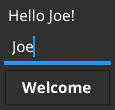

# 第八章：*第八章*：项目结构和最佳实践

Go 语言附带了一套被广泛理解的最佳实践，如风格、文档和代码结构。通常，当应用程序开始添加**图形用户界面（GUI**）元素时，这些最佳实践可能会丢失。测试单个组件并保持类型之间的清晰分离有助于我们保持代码的整洁，使其随着时间的推移更容易维护。这些概念也可以在 GUI 代码中遵循，并得到像 Fyne 这样的工具包的支持。

在本章中，我们将探讨这些概念如何应用于图形应用程序开发，以及我们如何从中学习，使我们的 GUI 随着时间的推移更容易管理。我们将涵盖以下主题：

+   组织一个结构良好的项目

+   理解关注点的分离

+   使用测试驱动开发并编写整个应用程序 GUI 的测试

+   管理特定平台的代码

让我们开始吧！

# 技术要求

本章的要求与*第三章*、“Windows、Canvas 和绘图”相同；也就是说，你必须安装 Fyne 工具包，并且 Go 和 C 编译器正在运行。更多信息，请参阅该章节。

本章的完整源代码可以在[`github.com/PacktPublishing/Building-Cross-Platform-GUI-Applications-with-Fyne/tree/master/Chapter08`](https://github.com/PacktPublishing/Building-Cross-Platform-GUI-Applications-with-Fyne/tree/master/Chapter08)找到。

本章的一些部分涉及管理特定平台的代码，因此如果你有两个不同的操作系统可供使用，可能会很有帮助。

# 组织你的项目

Go 语言的设计原则之一是你可以从简单开始，随着项目的增长，逐步构建更多的结构。遵循这个原则，你可以在为项目创建的目录中简单地启动一个 GUI 项目，其中包含一个`main.go`文件。这最初将包含你的整个应用程序，从其`main()`函数开始。

## 从简单开始

一旦你的用户界面从最基本的形式发展起来，将其拆分到一个新文件中是一个好主意，例如命名为`ui.go`。以这种方式拆分代码可以使代码更清晰，区分哪些代码仅仅是启动应用程序（`main()`函数和辅助函数）与实际构建用户界面的代码。

到目前为止，你应该开始考虑添加单元测试（如果你还没有添加的话！）。这些测试将存在于一个文件中，与你的代码一起，以`_test.go`结尾——例如，`ui_test.go`。测试所有代码是一个好习惯，并且对于你添加的每个新函数或类型，都会有新的测试来确保代码随着时间的推移正确运行。对于主函数没有测试文件是正常的，因为它的目的只是连接应用程序的组件并启动它。一个已经通过非常基础的阶段的项目可能包含以下文件：

```go
project/
    main.go
    ui.go
    ui_test.go
```

这种结构在应用程序需要添加一些自定义类型时效果很好。我们将在下一节中探讨这个问题。

## 添加新类型

由于 Fyne 应用程序的用户界面代码主要关注行为，因此通常会将应用程序的不同区域拆分为单独的区域，每个区域定义自己的类型。每个类型将定义它所代表的数据（或数据访问），以及可以操作这些信息的各种方法。这些应用程序代码的部分可能是简单的类型定义，其中可能有一个名为`makeUI()`或类似名称的 UI 创建函数。以下是一个示例：

```go
func (t *myType) makeUI() fyne.CanvasObject { … }
```

或者，它们可能是自定义小部件，在这种情况下，类型扩展`CanvasObject`，因此可以将其传递到更广泛的 GUI 结构中。在任一情况下，这些类型都值得有一个新的文件，例如`mytype.go`，以及它们自己的测试，在`mytype_test.go`中。例如，一个不断增长的应用程序可能具有以下结构：

```go
project/
    editor.go
    editor_test.go
    files.go
    files_test.go
    main.go
    status.go
    status_test.go
    ui.go
    ui_test.go
```

这是一个简单应用程序的好结构，但一旦代码库增长，特别是如果它包含不是 GUI 部分的库或支持功能，你可能会考虑使用多个包。那么会发生什么呢？让我们看看。

## 将代码拆分为包

当你需要将一些复杂的代码，例如数据访问或复杂计算的管理代码，与将要显示它的用户界面代码分离时，包就非常有用。在这些情况下，一个单独的包允许你保持清晰的分离并独立测试这些元素（参见本章后面的*理解关注点分离*部分）。如果你希望这个子包 API 对公众可用，那么你可以只为它创建一个新的文件夹（例如，`project/mylib`）。或者，你也可以选择将许多子包分组在标准的`pkg`目录下（即，`project/pkg/mylib`）。

然而，如果你希望将其 API 作为此项目的内部细节，你可以使用特殊的`internal`包作为其父包（即，`project/internal/pkg/mylib`）。

如果 GUI 代码也使用了内部结构，那么保持代码整洁也是有帮助的，这样项目的顶部就会包含更少的文件。通常，人们会使用`project/internal/app/`来实现这一点。因此，一个包含`storage`和`cache`内部库的应用程序可能看起来像这样：

```go
project/
    internal/
        app/
            editor.go
            editor_test.go
            files.go
            files_test.go
            status.go
            status_test.go
            ui.go
            ui_test.go
        pkg/
            storage/
                storage.go
                storage_test.go
            cache/
                cache.go
                cache_test.go
    main.go
```

使用此模型，库包都是自包含的，应用程序包可以依赖它们来运行。`main.go`文件可能依赖于所有这些包来准备应用程序并启动其 GUI。

上述结构对于单个应用程序存储库来说效果很好。以下命令将直接安装它（请注意，这个命令不应该包含方案前缀，如`http://`）：

```go
$ go get projectURL 
```

然而，在某些情况下，你需要在项目中使用多个可执行文件。我们将在下一节中探讨这个问题。

多个可执行文件

无论项目主要是库还是包含多个可执行文件的应用程序，都有一个名为`cmd`的标准目录，可以包含多个子目录，每个子目录对应一个可执行文件。`cmd`中的每个包都将包含它应该编译到的应用程序的名称，尽管`Go`包始终是`main`，这样它就可以被执行。

因此，如果你的项目主要是库，但包含了`mylib_gui`和`mylib_config`可执行文件，那么你的结构将如下所示（省略任何内部代码）：

```go
project/
    cmd/
        mylib_gui/
            main.go
        mylib_config/
            main.go
    lib.go
```

通过使用此格式，某人可以通过以下命令（不使用`http://`）来依赖你的库：

```go
import "projectURL"
```

他们也可以选择使用以下命令安装 GUI 二进制文件：

```go
$ go get projectURL/cmd/mylib_gui
```

这种灵活性允许仓库在保持整洁结构的同时拥有多个用途。当然，`internal/pkg/`或`internal/app/`中可能会有很多通用代码，以实现这一点。

上述示例只是例子——每个应用程序都会有不同的需求，可能希望偏离这些常见的布局。为了帮助开发者理解一个应用程序，其`main()`函数应该位于项目的根目录或`cmd/appname/`子目录中。同样，库的主要 API 应该可以从项目的根目录或`pkg/libname/`子目录导入。遵循这些提示将使你的应用程序或库对新熟悉推荐 Go 项目布局的开发者更容易上手。

在本节中，我们学习了如何将应用程序拆分为多个部分。尽管如此，这为什么很重要可能并不清楚。在下一节中，我们将探讨关注点分离，这将展示这种方法如何帮助我们保持代码的整洁和未来可维护性。

理解关注点分离

如我们本章前面所提到的，以及我们在*第二章*中讨论 Fyne 工具包 API 原则时，在*设计简洁且易于维护的 API*部分，**关注点分离**的概念如果我们要保持代码库的整洁性是非常重要的。它使我们能够将相关的代码放在一起，而不用担心在做出更改时破坏其他区域。

这个概念与罗伯特·C·马丁在其*面向对象设计原则*([`www.butunclebob.com/ArticleS.UncleBob.PrinciplesOfOod`](http://www.butunclebob.com/ArticleS.UncleBob.PrinciplesOfOod))文章中引入的单一职责原则密切相关。在这里，他提出了以下观点：

“一个类应该只有一个，并且只有一个，改变的理由。”

–罗伯特·C·马丁

在这方面，*关注点*比责任有更广泛的范围，因为它们通常影响您应用程序的设计和架构，而不是单个类或接口。在图形应用程序中，如果您希望正确地将易于测试的逻辑与处理用户交互的表示代码分离，关注点的分离是必不可少的。通过分离应用程序的关注点，我们更容易测试子组件并验证我们软件的有效性，甚至不需要运行应用程序。这样做，我们创建了更健壮的应用程序，可以适应随时间变化的需求或技术。 

例如，Fyne 小部件和 API 不应纳入或影响您的业务逻辑设计。即使是专注于行为的图形 API，如 Fyne 工具包，也只应由应用程序的表示层（项目根目录或`internal/app`包中的项目）引用。正因为如此，一个健壮的应用程序才被分割成多个区域。每个支持库都将独立于表示层或工具包的功能运行。这样，我们保持软件的开放性，使其在不影响相关区域的情况下易于更改。

在下一节中，我们将学习提供的测试实用工具如何帮助简化单元测试的创建。我们可以通过将代码分割成更小的组件来实现这一点。这对于验证我们应用程序表示代码的行为非常有用。

# 测试驱动开发

自动测试用户界面或前端软件所需的工作量通常被认为对于避免未来错误的价值太低。然而，这很大程度上取决于所使用的工具包或甚至选择的表现技术。如果没有开发工具或图形 API 对测试的全面支持，在没有投入大量努力的情况下创建简单的单元测试可能会很困难。

Fyne 工具包的设计原则之一是应用程序的 GUI 应该像其余代码一样易于测试。这部分得益于 API 的设计，但这一点通过我们可以提供的测试实用工具得到了进一步加强。我们将在本节稍后探讨这一点。通过以下方法，我们将学习 Fyne 应用程序如何遵循**测试驱动开发**（**TDD**），即使是对于用户界面组件。

## 设计用于测试

Fyne 工具包的模块化设计允许为不同的系统或目的加载不同的驱动程序。这种方法主要支持在任何操作系统上工作的 Fyne 应用程序，无需开发者修改他们的应用程序。这种方法的一个额外好处是，可以将应用程序加载到测试运行时中执行各种检查，而无需在屏幕上显示。这大大提高了测试运行的速度，同时也使你的测试更加可靠（因为用户交互不能干扰测试过程）。

通过导入`fyne.io/fyne/test`包，我们自动创建了一个内存中的应用程序，该应用程序能够创建包含实际应用程序 GUI 的虚拟窗口。这些窗口支持与常规窗口相同的 API，因此你的代码可以像之前一样运行。每个图形元素都可以通过编程方式与之交互和测试，以确认其行为和状态，甚至验证其渲染输出。

在接下来的两个例子中，我们将学习如何测试用户界面组件的行为，然后如何验证它是否正确渲染，所有这些都不需要将 GUI 显示在屏幕上。

## 测试我们的 GUI 逻辑

要测试应用程序的功能，我们必须定义一个非常简单的 GUI。它将有一个`Hello World!`标签，后面跟着一个我们可以用来指定我们名字的输入小部件。最后的组件——一个简单的按钮——将被触发，根据输入更新问候语。以下是它是如何工作的：

1.  首先，我们定义一个简单的`struct`，称为`greeter`，它将包含对这些对象的引用。在这个例子中，我们将编写以下代码到`ui.go`中：

    ```go
    type greeter struct {
        greeting       *widget.Label
        name           *widget.Entry
        updateGreeting *widget.Button
    }
    ```

1.  由于我们在这个例子中没有创建自定义小部件，我们将定义一个名为`makeUI`的小方法，该方法将构建代表此应用程序的小部件。在这种情况下，这是一个简单的垂直框容器，它结合了我们根据前面的描述创建的所有小部件。我们创建每个小部件，将它们分配给`greeter`类型的变量，然后返回一个将它们打包在一起的垂直框：

    ```go
    func (g *greeter) makeUI() fyne.CanvasObject {
        g.greeting = widget.NewLabel("Hello World!")
        g.name = widget.NewEntry()
        g.name.PlaceHolder = "Enter name"
        g.updateGreeting = widget.NewButton("Welcome", 
            g.setGreeting)
        return container.NewVBox(g.greeting, g.name, g.up
            dateGreeting)
    }
    ```

1.  要执行更新，当按钮被点击时，我们需要一个额外的函数`setGreeting`，该函数将使用`fmt.Sprintf`格式化一个替换字符串。它将当前`name`输入小部件的内容传递进去，以使问候语个性化。这看起来如下所示：

    ```go
    func (g *greeter) setGreeting() { 
        text := fmt.Sprintf("Hello %s!", g.name.Text) 
        g.greeting.SetText(text) 
    } 
    ```

1.  最后，我们创建一个简单的`main`函数，该函数将加载问候语，在窗口中显示它，并运行应用程序：

    ```go
    func main() {
         a := app.New()
         w := a.NewWindow("Hello!")
         g := &greeter{}
         w.SetContent(g.makeUI())
         w.ShowAndRun()
    }
    ```

你可以通过简单地运行它来验证应用程序是否正确工作，如下所示：

```go
$ go run ui.go
```

在本节中，我们将关注我们必须执行的测试，因此让我们编写一个单元测试来验证我们之前定义的行为：

1.  首先，创建一个测试文件，该文件将与代码一起提供；即`ui_test.go`。在这里，我们定义了一个具有标准签名的测试。它必须以`Test`开头，并接受一个参数；即一个`testing.T`指针：

    ```go
    func TestGreeter_UpdateGreeting(t *testing.T) {
        ...
    }
    ```

1.  在这个函数中，我们将创建我们问候器的全新实例并请求创建界面组件。一旦运行完成，我们断言初始状态是正确的。在这里，我们使用由`stretchr`提供的 testify 项目的`assert`包（更多信息可以在[`github.com/stretchr/testify`](https://github.com/stretchr/testify)找到）。这将使用`github.com/stretchr/testify/assert`导入路径，应该添加到文件顶部。

    通过添加以下代码，您可以设置用户界面以便进行测试并执行其第一次断言：

    ```go
        g := &greeter{}
        g.makeUI()
        assert.Equal(t, "Hello World!", g.greeting.Text)
        assert.Equal(t, "", g.name.Text)
    ```

1.  编写此测试的最后一步是执行用户步骤并检查结果变化。我们使用 Fyne 的`test`包来模拟用户在输入小部件中输入并点击按钮以确认。之后，我们确认问候文本已被更新：

    ```go
        test.Type(g.name, "Joe")
        test.Tap(g.updateGreeting)
        assert.Equal(t, "Hello Joe!", g.greeting.Text)
    ```

使用这段测试代码，我们可以确保用户界面运行正确。它可以像其他任何 go 测试一样简单地执行：

```go
$ go test .
```

通过这样，我们知道应用运行正确。然而，验证输出是否按预期渲染可能会有所帮助。让我们编写一个新的测试来做到这一点。

## 验证输出是否被渲染

在大多数情况下，应用程序可以通过行为测试来测试其正确性，就像我们之前看到的那样。然而，有时实际看到将要渲染的内容以检查结果是有用的。如果您的应用程序包含自定义绘图代码或复杂的布局，这可能很合适。

在本节中，我们将创建一个新的测试，类似于我们在上一节中创建的测试，但在这个情况下，我们将使用另一个`test`实用工具来测试渲染输出。让我们看看这是如何工作的：

1.  创建一个新的方法，如下面的代码所示。一旦设置了`greeter`类型，将`g.makeUI()`传递给`test.NewWindow()`。这将创建一个内存中的窗口，我们可以用它来捕获输出，如下所示：

    ```go
    func TestGreeter_Render(t *testing.T) {
        g := &greeter{}
        w := test.NewWindow(g.makeUI())
    }
    ```

1.  创建测试窗口后，我们可以使用`w.Canvas().Capture()`来获取其内容。这个函数将返回一个图像，界面渲染得就像它在真实窗口中运行一样。

    现在，我们可以使用`AssertImageMatches`测试实用工具，它要求测试比较此图像与命名文件，如下所示：

    ```go
        test.AssertImageMatches(t, "default.png", 
            w.Canvas().Capture())
    ```

1.  这段代码将比较默认的外观。现在，我们可以再次模拟用户操作，并将新状态与另一个具有适当名称的图像文件进行比较：

    ```go
        test.Type(g.name, "Joe")
        test.Tap(g.updateGreeting)
        test.AssertImageMatches(t, "typed_joe.png",
            w.Canvas().Capture())
    ```

您可以像之前的行测试一样运行这些测试，尽管这次测试将失败，因为与之比较的图像不存在。您将在`testdata/failed/`目录内找到两个新文件。

您应该查看这些文件以了解正在绘制的内容。如果您认为输出是正确的，那么这些文件可以被移动到`testdata/`目录。在第二次运行这些测试时，您将看到它们都按预期通过。以下截图显示了`typed_joe.png`文件的外观：




图 8.1 – 测试我们的用户界面代码生成的图像

由于对工具包设计进行更改会导致它们失败，因此此类测试可能很脆弱。然而，它们可以帮助突出显示代码更改导致意外图形变化的情况。因此，当在测试代码中适当使用时，这种方法可以成为验证过程的有价值补充。

本节中我们探讨的测试有助于验证应用程序代码的正确性，并且应该定期运行。确保这一点的最佳方法是让服务器自动运行测试。我们将在下一节探讨这一点。

## GUI 的持续集成

**持续集成**（**CI** – 以常规方式合并团队的工作进度代码，以便自动测试）已成为软件开发团队的常态。将此流程添加到团队工作流程中已被证明可以更早地突出显示开发过程中的问题，从而更快地修复问题，并最终产生高质量的软件。

这个关键部分包括自动化测试整个源代码，包括 GUI。强烈建议不仅包括整个应用程序代码的常规编译，而且在每次提交时都要运行单元测试。这样做可以帮助你快速识别损坏或行为上的意外变化。为此目的，有各种 CI 工具可用，尽管查看它们超出了本书的范围。当你配置自动化流程时，这些工具很有帮助，因为它们确保本节中探索的测试等成为你常规测试和验收检查的一部分。

我们已经看到，定期进行测试很重要，但如果我们希望为不同的平台编写略有不同的代码，情况会有所改变。在某个时候，大多数应用程序可能需要基于操作系统的系统调用。接下来，我们将探讨如何在保持易于理解的良好代码结构的同时完成这项工作。

# 管理特定平台的代码

在*第二章*“根据 Fyne 的未来”中，我们了解到 Go 编译器支持基于环境变量和构建标签的源文件条件包含。随着应用程序添加更多功能，尤其是在平台集成方面，工具包可能无法提供你所需的所有功能。当这种情况发生时，代码需要更新以处理特定平台的功能。为此，我们将使用条件构建的变体——使用命名良好的文件而不是构建标签。这在项目级别上更容易阅读，并且应该清楚地表明哪些文件将编译为哪个平台。

让我们创建一个简单的示例：我们想要大声朗读文本，但我们的代码只能在 macOS (Darwin) 上这样做。我们将在 `say_darwin.go` 文件中设置一个简单的 `say()` 函数，来完成我们想要的功能：

```go
package main
import (
    "log"
    "os/exec"
)
func say(text string) {
    cmd := exec.Command("say", text)
    err := cmd.Run()
    if err != nil {
        log.Println("Error saying text", err)
    }
}
```

这个简单的函数调用了内置的 *say* 工具，这是一个与 macOS 打包的命令行应用程序，允许文本被大声朗读。由于这个文件以 `_darwin.go` 结尾，它只会在我们为 macOS 构建时编译。为了在其他平台上正确编译，我们需要创建另一个将被加载的文件。我们将把这个文件命名为 `say_other.go`：

```go
// +build !darwin
package main
import (
    "log"
    "runtime"
)
func say(_ string) {
    log.Println("Say support is not available for", 
        runtime.GOOS)
}
```

在此文件中，我们必须指定构建条件，因为没有为所有其他平台指定特殊的文件名格式。在这里，`// +build !darwin` 表示该文件将包含在任何非 macOS 平台上。我们将在此文件中提供的简单方法只是记录该功能不受支持。最后，我们必须创建一个简单的应用程序启动器，命名为 `main.go`，它将调用 `say()` 函数：

```go
package main
func main() {
    say("Hello world!")
}
```

运行此代码（使用 `go run .`）将在 macOS 计算机上运行时大声朗读 `Hello world!`。在其他操作系统上，它将打印一个错误，表明该功能不可用：

```go
Chapter08/say> go run .
2020/10/01 16:46:32 Say support is not available for linux
Chapter08/say>
```

我们可以以这种方式处理特定平台的代码，使得任何学习当前项目并首次阅读其代码的人都能清楚地理解。另一位开发者可以决定添加一个 `say_windows.go` 文件来支持在 Windows 上读取文本。只要他们也更新 `say_other.go` 中的构建规则，应用程序将继续按预期工作，但增加了基于 Windows 的文本读取功能。这种方法的优点是，它不需要我们修改任何现有代码来简单地添加这个新功能。

# 摘要

在本章中，我们探讨了使用 Go 编写的基于 GUI 的应用程序的一些管理和技巧。通过仔细规划应用程序的模块及其交互方式，我们看到了我们可以使任何应用程序更容易测试和维护。由于更高的测试覆盖率是提高软件应用程序质量的一个因素，我们研究了如何使用这些技术来测试我们的图形代码，这是一个众所周知难以处理的话题。我们通过一个示例来编写一个简单的 GUI 应用程序的测试代码，该代码可以自动运行。

当需要适应特定的操作系统时，我们需要了解我们的代码如何适应。通过适当的抽象或编写特定平台的代码，并通过通用回退来切换，我们可以使我们的应用程序易于维护，尽管存在操作系统差异。

在整本书中，我们一直在命令行旁边运行示例代码，与它们的源代码并列。这意味着我们能够包含当前目录中存在的文件——但是当我们开始分发我们的应用程序时，这将不再可能。

在下一章中，我们将探讨如何将这些额外资源（例如图片和数据文件）包含到我们的应用程序中，为它们的发布做准备。
