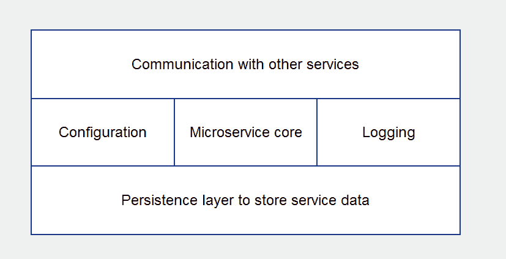

# 使用 Rest API 构建微服务

在本章中，我们将踏上学习微服务世界的旅程。我们将了解它们的结构、它们的通信方式以及它们如何持久化数据。由于今天大多数现代云应用程序在生产中都依赖微服务来实现弹性和可伸缩性，微服务的概念是一个需要涵盖的关键概念。

在本章中，我们将涵盖以下主题：

+   深入了解微服务架构

+   RESTful web API

+   在 Go 语言中构建 RESTful API

# 背景

我们在第一章中提供了微服务的实际定义。在本章中，让我们更详细地定义微服务。

为了充分理解微服务，让我们从它们崛起的故事开始。在微服务的概念变得流行之前，大多数应用程序都是单体的。单体应用程序是一个试图一次完成许多任务的单一应用程序。然后，随着需要新功能，应用程序会变得越来越庞大。这实际上会导致长期来看应用程序难以维护。随着云计算和大规模负载的分布式应用程序的出现，更灵活的应用程序架构的需求变得明显。

在第一章中，《现代微服务架构》，我们介绍了 MyEvents 应用程序，这是我们在本书中将要构建的应用程序。MyEvents 应用程序用于管理音乐会、戏剧等活动的预订。该应用程序的主要任务包括以下内容：

+   **处理预订**：例如，用户预订了下个月的音乐会。我们需要存储这个预订，确保这个活动有座位可用，并确认之前没有用相同的姓名进行过预订，等等。

+   **处理活动**：我们的应用程序需要了解我们预计要支持的所有音乐会、戏剧和其他类型的活动。我们需要知道活动地址、座位总数、活动持续时间等。

+   **处理搜索**：我们的应用程序需要能够执行高效的搜索来检索我们的预订和活动。

以下图片显示了 MyEvents 的单体应用程序设计的样子：


单体应用程序

我们将在应用程序中构建多个软件层来处理每个需要的不同任务。我们的应用程序将成为一个具有庞大代码库的程序。由于代码都是相互连接的，一个层的变化总会影响其他层的代码。

由于它是一个单一程序，要在不同的编程语言中编写一些软件层不会很容易。当你知道语言 X 中有一个非常好的库来支持特性 Y 时，这通常是一个非常好的选择，但是语言 X 对于特性 Z 并不好。

此外，随着添加新功能或层，您的单一程序将不断增长，而没有良好的可伸缩性选项。能否在不同的服务器上运行不同的软件层，以便您可以控制应用程序的负载，而不是在一两台服务器上增加更多的硬件呢？

软件工程师们长期以来一直试图解决单体应用程序的困境。微服务是解决单体应用程序带来的问题的一种方法。在微服务这个术语变得流行之前，有 SOA 的概念，原则上类似于微服务。

在我们更深入地了解微服务之前，值得一提的是，单片应用程序并不总是坏的。这一切取决于您想要实现什么。如果您试图构建一个预期具有有限任务集的应用程序，并且不预期增长很多，那么一个单一构建良好的应用程序可能就是您所需要的。另一方面，如果您试图构建一个复杂的应用程序，预期执行许多独立任务，由多人维护，同时处理大量数据负载，那么微服务架构就是您的朋友。

# 那么，什么是微服务？

简而言之，微服务是这样的理念，即不是将所有代码放在一个篮子里（单片应用程序），而是编写多个小型软件服务或*微服务*。每个服务都预期专注于一个任务并且执行得很好。这些服务的累积将构成您的应用程序。


微服务应用程序

对于 MyEvents 应用程序，单片应用程序中的每个软件层将转化为一个软件服务。然后，它们将一起通信以构成我们的应用程序。这些软件服务中的每一个实际上都是一个微服务。

由于这些服务合作构建复杂的应用程序，它们需要能够通过它们都理解的协议进行通信。使用 Web Restful API 进行通信的微服务广泛使用 HTTP 协议。我们将在本章更详细地介绍 Restful API。

# 微服务内部

要构建适当的微服务，我们需要考虑几个组件。为了理解这五个组件，让我们讨论一下微服务预期承担的主要任务：

+   微服务将需要能够与其他服务和外部世界发送和接收消息，以便任务可以和谐地进行。微服务的通信方面采取不同的形式。与外部世界互动时，Restful API 非常受欢迎，与其他服务通信时，消息队列非常有帮助。还有其他一些流行的技术也很受欢迎，比如**gRPC**。

+   微服务将需要一个配置层；这可以通过环境变量、文件或数据库来实现。这个配置层将告诉微服务如何操作。例如，假设我们的服务需要监听 TCP 地址和端口号以便接收消息；TCP 地址和端口号将是在服务启动时传递给我们的服务的配置的一部分。

+   微服务将需要记录发生在其上的事件，以便我们能够排除故障并了解行为。例如，如果在向另一个服务发送消息时发生通信问题，我们需要将错误记录在某个地方，以便我们能够识别问题。

+   微服务将需要能够通过将数据存储在数据库或其他形式的数据存储中来持久化数据；我们还需要能够在以后检索数据。例如，在 MyEvents 应用程序的情况下，我们的微服务将需要存储和检索与用户、预订和事件相关的数据。

+   最后，有核心部分，是我们微服务中最重要的部分。核心部分是负责我们微服务预期任务的代码。例如，如果我们的微服务负责处理用户预订，那么微服务的核心部分就是我们编写处理用户预订任务的代码的地方。

因此，根据前面的五点，微服务的构建模块应该是这样的：



微服务的构建模块

这些构建块为构建高效的微服务提供了良好的基础。规则并非一成不变。您可以根据您尝试构建的应用程序使您的微服务变得更简单或更复杂。

# RESTful Web API

**REST**代表**表述性状态转移**。REST 只是不同服务进行通信和交换数据的一种方式。REST 架构的核心包括客户端和服务器。服务器监听传入的消息，然后回复它，而客户端启动连接，然后向服务器发送消息。

在现代网络编程世界中，RESTful 网络应用程序使用 HTTP 协议进行通信。RESTful 客户端将是一个 HTTP 客户端，而 RESTful 服务器将是 HTTP 服务器。HTTP 协议是支持互联网的关键应用层通信协议，这就是为什么 RESTful 应用程序也可以称为网络应用程序。RESTful 应用程序的通信层通常简称为 RESTful API。

REST API 允许在各种平台上开发的应用程序进行通信。这包括在其他操作系统上运行的应用程序中的其他微服务，以及在其他设备上运行的客户端应用程序。例如，智能手机可以通过 REST 可靠地与您的 Web 服务通信。


Web RESTful API

要了解 RESTful 应用程序的工作原理，我们首先需要对 HTTP 协议的工作原理有一个相当好的理解。HTTP 是一种应用级协议，用于在整个网络、云和现代微服务世界中进行数据通信。

HTTP 是一种客户端-服务器，请求-响应协议。这意味着数据流程如下：

+   HTTP 客户端向 HTTP 服务器发送请求

+   HTTP 服务器监听传入的请求，然后在其到达时做出响应


请求和响应

HTTP 客户端请求通常是以下两种情况之一：

+   客户端正在从服务器请求资源

+   客户端正在请求在服务器上添加/编辑资源

资源的性质取决于您的应用程序。例如，如果您的客户端是尝试访问网页的 Web 浏览器，那么您的客户端将向服务器发送请求，请求 HTML 网页。HTML 页面将作为资源在 HTTP Web 服务器的响应中返回给客户端。

在通信微服务的世界中，REST 应用程序通常使用 HTTP 协议结合 JSON 数据格式来交换数据消息。

考虑以下情景：在我们的 MyEvents 应用程序中，我们的一个微服务需要从另一个微服务获取事件信息（持续时间、开始日期、结束日期和位置）。需要信息的微服务将是我们的客户端，而提供信息的微服务将是我们的服务器。假设我们的客户端微服务具有事件 ID，但需要服务器微服务提供属于该 ID 的事件的信息。

客户端将通过事件 ID 发送请求，询问有关事件信息；服务器将以 JSON 格式回复信息，如下所示：


带有响应的 JSON 文档

这个描述听起来很简单；然而，它并没有提供完整的图片。客户端的询问部分需要更多的阐述，以便我们了解 REST API 的真正工作原理。

REST API 客户端请求需要指定两个主要信息以声明其意图——*请求 URL*和*请求方法*。

请求 URL 是客户端寻找的服务器上资源的地址。URL 是一个 Web 地址，REST API URL 的一个示例是[`quotes.rest/qod.json`](http://quotes.rest/qod.json)，这是一个返回当天引用的 API 服务。

在我们的场景中，MyEvents 客户端微服务可以向[`10.12.13.14:5500/events/id/1345`](http://10.12.13.14:5500/events/id/1345) URL 发送 HTTP 请求来查询事件 ID`1345`。

请求方法基本上是我们想要执行的操作类型。这可以是从请求获取资源到编辑资源、添加资源，甚至删除资源的请求。在 HTTP 协议中，有多种类型的方法需要成为客户端请求的一部分；以下是一些最常见的方法：

+   `GET`：在 Web 应用程序中非常常见的 HTTP 方法；这是我们从 HTTP Web 服务器请求资源的方式；这是我们在场景中使用的请求类型，用于请求事件 ID`1345`的数据。

+   `POST`：我们用来更新或创建资源的 HTTP 方法。

假设我们想使用`POST`更新属于事件 ID 1345 的某些信息，那么我们将发送一个`POST`请求到相对 URL`../events/id/1345`，并在请求体中附上新的事件信息。

另一方面，如果我们想创建一个 ID 为 1346 的新事件，我们不应该发送`POST`请求到`../events/id/1346`，因为该 ID 尚不存在。我们应该只是发送一个`POST`请求到`.../events`，并在请求体中附上所有新的事件信息。

+   `PUT`：用于创建或覆盖资源的 HTTP 方法。

与`POST`不同，`PUT`请求可以通过向之前不存在的资源 ID 发送请求来创建新资源。因此，例如，如果我们想创建一个 ID 为`1346`的新事件，我们可以发送一个`PUT`请求到`../events/id/1346`，Web 服务器应该为我们创建资源。

`PUT`也可以用于完全覆盖现有资源。因此，与`POST`不同，我们不应该使用`PUT`来仅更新资源的单个信息。

+   `DELETE`：用于删除资源。例如，如果我们向 Web 服务器的相对 URL`../events/id/1345`发送删除请求，Web 服务器将从数据库中删除资源。

# Gorilla web toolkit

现在我们已经了解了 Web Restful API 的工作原理，是时候了解如何在 Go 中最佳实现它们了。Go 语言自带了一个非常强大的标准库 web 包；Go 还享受着众多第三方包的支持。在本书中，我们将使用一个非常流行的 Go web 第三方工具包，名为 Gorilla web toolkit。Gorilla web toolkit 由一系列 Go 包组成，一起帮助快速高效地构建强大的 Web 应用程序。

Gorilla web toolkit 生态系统中的关键包称为`gorilla/mux`。`mux`包在包文档中被描述为*请求路由器和调度器*。这基本上是一个软件组件，它接受传入的 HTTP 请求，然后根据请求的性质决定要做什么。例如，假设客户端向我们的 Web 服务器发送了一个 HTTP 请求。我们的 Web 服务器中的 HTTP 路由调度器组件可以检测到传入请求包含一个相对 URL 为`../events/id/1345`的`GET`方法。然后它将检索事件 ID`1345`的信息并将其发送回客户端。

# 实施 Restful API

利用该包的第一步是使用`go get`命令将包获取到我们的开发环境中：

```go
$ go get github.com/gorilla/mux
```

有了这个，`mux`包将准备就绪。在我们的代码中，我们现在可以将`mux`包导入到我们的 web 服务器代码中：

```go
import "github.com/gorilla/mux"
```

在我们的代码中，现在需要使用 Gorilla `mux`包创建一个路由器。这可以通过以下代码实现：

```go
r := mux.NewRouter()
```

有了这个，我们将得到一个名为`r`的路由器对象，帮助我们定义我们的路由并将它们与要执行的操作链接起来。

从这一点开始，代码将根据所涉及的微服务而有所不同，因为不同的服务将支持不同的路由和操作。在本章的前面，我们介绍了在 MyEvents 应用程序中使用的四种不同类型的服务——Web UI 服务、搜索微服务、预订微服务和事件微服务。让我们专注于事件微服务。

事件微服务将需要支持一个 RESTFul API 接口，能够执行以下操作：

+   通过 ID 或事件名称搜索事件

+   一次性检索所有事件

+   创建一个新事件

让我们专注于这些任务中的每一个。由于我们正在设计一个微服务的 Web RESTful API，因此每个任务都需要转换为一个 HTTP 方法，结合一个 URL 和一个 HTTP 正文（如果需要）。

以下是详细说明：

+   通过搜索事件：

+   ID：相对 URL 是`/events/id/3434`，方法是`GET`，在 HTTP 正文中不需要数据

+   名称：相对 URL 是`/events/name/jazz_concert`，方法是`GET`，在 HTTP 正文中不需要数据

+   一次性检索所有事件：相对 URL 是`/events`，方法是`GET`，在 HTTP 正文中不需要数据

+   创建一个新事件：相对 URL 是`/events`，方法是`POST`，并且 HTTP 正文中需要的数据是我们想要添加的新事件的 JSON 表示。假设我们想要添加在美国演出的“歌剧艾达”事件，那么 HTTP 正文将如下所示：


现在，如果您查看每个任务的 HTTP 翻译，您会注意到它们的相对 URL 都有一个共同的属性，即它们都以`/events`开头。在 Gorilla web 工具包中，我们可以为`/events`相对 URL 创建一个子路由器。子路由器基本上是一个对象，负责处理任何指向以`/events`开头的相对 URL 的传入 HTTP 请求。

要为以`/events`为前缀的 URL 创建一个子路由器，需要以下代码：

```go
eventsrouter := r.PathPrefix("/events").Subrouter()
```

前面的代码使用了我们之前创建的路由器对象，然后调用了`PathPrefix`方法，用于捕获以`/events`开头的任何 URL 路径。最后，我们调用了`Subrouter()`方法，这将为我们创建一个新的路由器对象，以便从现在开始处理任何以`/events`开头的 URL 的传入请求。新的路由器称为`eventsrouter`。

接下来，`eventsrouter`对象可以用来定义其余共享`/events`前缀的 URL 的操作。因此，让我们重新查看我们任务的 HTTP 翻译列表，并探索完成它们所需的代码：

1.  **任务：**通过搜索事件：

+   `id`：相对 URL 是`/events/id/3434`，方法是`GET`，在 HTTP 正文中不需要数据

+   `name`：相对 URL 是`/events/name/jazz_concert`，方法是`GET`，在 HTTP 正文中不需要数据：

```go
eventsrouter.Methods("GET").Path("/{SearchCriteria}/{search}").HandlerFunc(handler.findEventHandler)
```

前面代码中的处理程序对象基本上是实现我们期望映射到传入 HTTP 请求的功能的方法的对象。稍后再详细介绍。

1.  **任务：**一次性检索所有事件——相对 URL 是`/events`，方法是`GET`，在 HTTP 正文中不需要数据

```go
eventsrouter.Methods("GET").Path("").HandlerFunc(handler.allEventHandler)
```

1.  **任务：**创建一个新事件——相对 URL 是“/events”，方法是`POST`，并且 HTTP 正文中需要的数据是我们想要添加的新事件的 JSON 表示：

```go
eventsrouter.Methods("POST").Path("").HandlerFunc(handler.newEventHandler)
```

对于任务 2 和 3，代码是不言自明的。Gorilla `mux`包允许我们访问优雅地定义我们想要捕获的传入 HTTP 请求的属性的 Go 方法。该包还允许我们将调用链接在一起，以有效地构造我们的代码。`Methods()`调用定义了预期的 HTTP 方法，`Path()`调用定义了预期的相对 URL 路径（请注意，我们将调用放在`eventsrouter`对象上，它将在`Path()`调用中定义的相对路径后附加`/events`），最后是`HandlerFunc()`方法。

`HandlerFunc()`方法是我们将捕获的传入 HTTP 请求与操作关联的方式。`HandlerFunc()`接受一个`func(http.ResponseWriter, *http.Request)`类型的参数。这个参数基本上是一个具有两个重要参数的函数——一个 HTTP 响应对象，我们需要用我们的响应填充它，以响应传入的请求，以及一个 HTTP 请求对象，其中包含有关传入 HTTP 请求的所有信息。

在上述代码中，我们传递给`HandlerFunc()`的函数是`handler.findEventHandler`、`handler.allEventHandler`和`handler.newEventHandler`，它们都支持`func(http.ResponseWriter, *http.Request)`签名。`handler`是一个 Go 结构对象，用于承载所有这些函数。`handler`对象属于一个名为`eventServiceHandler`的自定义 Go 结构类型。

为了使`eventServiceHandler`类型支持任务 1、2 和 3 的 HTTP 处理程序，它需要定义如下：

```go
type eventServiceHandler struct {}

func (eh *eventServiceHandler) findEventHandler(w http.ResponseWriter, r *http.Request) {

}

func (eh *eventServiceHandler) allEventHandler(w http.ResponseWriter, r *http.Request) {

}

func (eh *eventServiceHandler) newEventHandler(w http.ResponseWriter, r *http.Request) {

}
```

在上述代码中，我们将`eventServiceHandler`创建为一个没有字段的结构类型，然后将三个空方法附加到它上面。每一个处理程序方法都支持成为 Gorilla `mux`包`HandlerFunc()`方法的参数所需的函数签名。在本章中，当我们讨论微服务的持久层时，将更详细地讨论`eventServiceHandler`方法的详细实现。

现在，让我们回到任务 1。我们代码中的`/{SearchCriteria}/{search}`路径代表了搜索事件 ID`2323`的等价路径`/id/2323`，或者搜索名称为`opera aida`的事件的路径`/name/opera aida`。我们路径中的大括号提醒 Gorilla `mux`包，`SearchCriteria`和`search`基本上是预期在真实传入的 HTTP 请求 URL 中用其他内容替换的变量。

Gorilla `mux`包支持 URL 路径变量的强大功能。它还支持通过正则表达式进行模式匹配。因此，例如，如果我使用一个看起来像`/{search:[0-9]+}`的路径，它将为我提供一个名为`search`的变量，其中包含一个数字。

在我们完成定义路由器、路径和处理程序之后，我们需要指定本地 TCP 地址，以便我们的 Web 服务器监听传入的 HTTP 请求。为此，我们需要 Go 的`net/http`包；代码如下：

```go
http.ListenAndServe(":8181", r)
```

在这一行代码中，我们创建了一个 Web 服务器。它将在本地端口`8181`上监听传入的 HTTP 请求，并将使用`r`对象作为请求的路由器。我们之前使用`mux`包创建了`r`对象。

现在是时候将我们到目前为止涵盖的所有代码放在一起了。假设代码位于一个名为`ServeAPI()`的函数中，该函数负责激活我们微服务的 Restful API 逻辑。

```go
func ServeAPI(endpoint string) error {
  handler := &eventservicehandler{}
  r := mux.NewRouter()
  eventsrouter := r.PathPrefix("/events").Subrouter()
  eventsrouter.Methods("GET").Path("/{SearchCriteria}/{search}").HandlerFunc(handler.FindEventHandler)
  eventsrouter.Methods("GET").Path("").HandlerFunc(handler.AllEventHandler)
  eventsrouter.Methods("POST").Path("").HandlerFunc(handler.NewEventHandler)
  return http.ListenAndServe(endpoint, r)
}
```

我们定义了`eventServiceHandler`对象如下：

```go
type eventServiceHandler struct {}

func (eh *eventServiceHandler) findEventHandler(w http.ResponseWriter, r *http.Request) {}

func (eh *eventServiceHandler) allEventHandler(w http.ResponseWriter, r *http.Request) {}

func (eh *eventServiceHandler) newEventHandler(w http.ResponseWriter, r *http.Request) {}
```

显然，下一步将是填写`eventServiceHandler`类型的空方法。我们有`findEventHandler()`、`allEventHandler()`和`newEventHandler()`方法。它们每一个都需要一个持久层来执行它们的任务。这是因为它们要么检索存储的数据，要么向存储添加新数据。

在本节中前面提到过，持久层是微服务的一个组件，负责将数据存储在数据库中或从数据库中检索数据。我们已经到了需要更详细地介绍持久层的时候了。

# 持久层

在设计持久层时需要做出的第一个决定是决定数据存储的类型。数据存储可以是关系型 SQL 数据库，如 Microsoft SQL 或 MySQL 等。或者，它可以是 NoSQL 存储，如 MongoDB 或 Apache Cassandra 等。

在高效和复杂的生产环境中，代码需要能够在不需要太多重构的情况下从一个数据存储切换到另一个。考虑以下例子——您为一家依赖 MongoDB 作为数据存储的初创公司构建了许多微服务；然后，随着组织的变化，您决定 AWS 基于云的 DynamoDB 将成为微服务更好的数据存储。如果代码不允许轻松地拔掉 MySQL，然后插入 MongoDB 层，那么我们的微服务将需要大量的代码重构。在 Go 语言中，我们将使用接口来实现灵活的设计。

值得一提的是，在微服务架构中，不同的服务可能需要不同类型的数据存储，因此一个微服务使用 MongoDB，而另一个服务可能使用 MySQL 是很正常的。

假设我们正在为事件微服务构建持久层。根据我们目前所涵盖的内容，事件微服务的持久层主要关心三件事：

+   向数据库添加新事件

+   通过 ID 查找事件

+   通过名称查找事件

为了实现灵活的代码设计，我们需要在接口中定义前面三个功能。它会是这样的：

```go
type DatabaseHandler interface {
    AddEvent(Event) ([]byte, error)
    FindEvent([]byte) (Event, error)
    FindEventByName(string) (Event, error)
    FindAllAvailableEvents() ([]Event, error)
}
```

`Event`数据类型是一个代表事件数据的结构类型，例如事件名称、位置、时间等。现在，让我们专注于`DatabaseHandler`接口。它支持四种方法，代表了事件服务持久层所需的任务。然后我们可以从这个接口创建多个具体的实现。一个实现可以支持 MongoDB，而另一个可以支持云原生的 AWS DynamoDB 数据库。

我们将在后面的章节中介绍 AWS DynamoDB。本章的重点将放在 MongoDB 上。

# MongoDB

如果您对 MongoDB NoSQL 数据库引擎还不熟悉，本节将对您非常有用。

MongoDB 是一个 NoSQL 文档存储数据库引擎。理解 MongoDB 的两个关键词是*NoSQL*和*文档存储*。

NoSQL 是软件行业中相对较新的关键词，用于指示数据库引擎不太依赖关系数据。关系数据是指数据库中不同数据之间存在关系的概念，遵循数据之间的关系将构建出数据代表的完整图景。

以 MySQL 作为关系型数据库的例子。数据存储在多个表中，然后使用主键和外键来定义不同表之间的关系。MongoDB 不是这样工作的，这就是为什么 MySQL 被认为是 SQL 数据库，而 MongoDB 被认为是 NoSQL 数据库。

如果您还不熟悉 Mongodb，或者没有本地安装可以测试。转到[`docs.mongodb.com/manual/installation/`](https://docs.mongodb.com/manual/installation/)，在那里您会找到一系列有用的链接，指导您完成在所选操作系统中安装和运行数据库的过程。通常，安装后，Mongodb 提供两个关键二进制文件：`mongod`和`mongo`。`mongod`命令是您需要执行的，以便运行您的数据库。然后编写的任何软件都将与`mongod`通信，以访问 Mongodb 的数据。另一方面，`mongo`命令基本上是一个客户端工具，您可以使用它来测试 Mongodb 上的数据，`mongo`命令与`mongod`通信，类似于您编写的任何访问数据库的应用程序。

有两种 MongoDB：社区版和企业版。显然，企业版针对更大的企业安装，而社区版是您用于测试和较小规模部署的版本。以下是涵盖三个主要操作系统的社区版指南的链接：

+   对于 Linux Mongodb 安装和部署：[`docs.mongodb.com/manual/administration/install-on-linux/`](https://docs.mongodb.com/manual/administration/install-on-linux/)

+   Windows Mongodb 安装和部署：[`docs.mongodb.com/manual/tutorial/install-mongodb-on-windows/`](https://docs.mongodb.com/manual/tutorial/install-mongodb-on-windows/)

+   对于 OS X Mongodb 安装和部署：[`docs.mongodb.com/manual/tutorial/install-mongodb-on-os-x/`](https://docs.mongodb.com/manual/tutorial/install-mongodb-on-os-x/)

总的来说，在部署 Mongodb 实例时，有三个主要步骤需要考虑：

1.  为您的操作系统安装 Mongodb，下载页面在这里：[`www.mongodb.com/download-center`](https://www.mongodb.com/download-center)

1.  确保 MongoDB 的关键二进制文件在您的环境路径中定义，以便您可以从终端运行它们，无论当前目录是什么。关键二进制文件是`mongod`和`mongo`。另一个值得一提的二进制文件是`mongos`，如果您计划使用集群，则这一点很重要

1.  运行`mongod`命令，不带任何参数，这将使用所有默认设置运行 Mongodb。或者，您可以使用不同的配置。您可以使用配置文件或运行时参数。您可以在这里找到有关配置文件的信息：[`docs.mongodb.com/manual/reference/configuration-options/#configuration-file`](https://docs.mongodb.com/manual/reference/configuration-options/#configuration-file)。要使用自定义配置文件启动`mongod`，可以使用`--config`选项，这是一个示例：`mongod --config /etc/mongod.conf`。另一方面，对于运行时参数，您可以在运行`mongod`时使用`--option`来更改选项，例如，您可以键入`mongod --port 5454`以在与默认值不同的端口上启动`mongod`

有不同类型的 NoSQL 数据库。其中一种类型是*文档存储*数据库。文档存储的概念是数据存储在许多文档文件中，堆叠在一起以表示我们要存储的内容。让我们以事件微服务所需的数据存储为例。如果我们在微服务持久层中使用文档存储，每个事件将存储在一个单独的带有唯一 ID 的文档中。假设我们有一个 Aida 歌剧事件，一个 Coldplay 音乐会事件和一个芭蕾表演事件。在 MongoDB 中，我们将创建一个名为*events*的文档集合，其中包含三个文档——一个用于歌剧，一个用于 Coldplay，一个用于芭蕾表演。

因此，为了巩固我们对 MongoDB 如何表示这些数据的理解，这里是事件集合的图表：


事件集合

在 MongoDB 中，集合和文档是重要的概念。生产环境中的 MongoDB 通常由多个集合组成；每个集合代表我们数据的不同部分。例如，我们的 MyEvents 应用程序由许多微服务组成，每个微服务关心不同的数据部分。预订微服务将在预订集合中存储数据，而事件微服务将在事件集合中存储数据。我们还需要将用户数据单独存储，以便独立管理我们应用程序的用户。这将看起来像这样：


我们的 MongoDB 数据库

您可以从以下链接下载此文件：[`www.packtpub.com/sites/default/files/downloads/CloudNativeprogrammingwithGolang_ColorImages.pdf`](https://www.packtpub.com/sites/default/files/downloads/CloudNativeprogrammingwithGolang_ColorImages.pdf)。

该书的代码包也托管在 GitHub 上：[`github.com/PacktPublishing/Cloud-Native-Programming-with-Golang`](https://github.com/PacktPublishing/Cloud-Native-programming-with-Golang)。

由于我们迄今为止专注于事件微服务作为构建微服务的展示，让我们深入了解事件集合，这将被事件微服务使用：


事件集合

事件集合中的每个文档都需要包含表示单个事件所需的所有信息。以下是事件文档应该看起来的样子：


如果你还没有注意到，前面的 JSON 文档与我们提供的 HTTP `POST`请求体示例相同，这是一个添加事件 API 的 HTTP 请求体示例。

为了编写可以处理这些数据的软件，我们需要创建模型。模型基本上是包含与我们从数据库中期望的数据匹配的字段的数据结构。在 Go 的情况下，我们将使用结构类型来创建我们的模型。以下是事件模型应该看起来的样子：

```go
type Event struct {
    ID bson.ObjectId `bson:"_id"`
    Name string
    Duration int
    StartDate int64
    EndDate int64
    Location Location
}
type Location struct {
    Name string
    Address string
    Country string
    OpenTime int
    CloseTime int
    Halls []Hall
}
type Hall struct {
    Name string `json:"name"`
    Location string `json:"location,omitempty"`
    Capacity int `json:"capacity"`
}
```

`Event struct`是我们事件文档的数据结构或模型。它包含 ID、事件名称、事件持续时间、事件开始日期、事件结束日期和事件位置。由于事件位置需要包含比单个字段更多的信息，我们将创建一个名为 location 的结构类型来模拟位置。`Location struct`类型包含位置的名称、地址、国家、开放时间和关闭时间，以及该区域的大厅。大厅基本上是位置内部的房间，活动在那里举行。

因此，例如，Mountain View，位于 Mountain View 市中心的歌剧院将是位置，而位于东侧的硅谷房间将是大厅。

反过来，大厅不能由单个字段表示，因为我们需要知道它的名称、建筑物内的位置（东南、西部等）以及其容量（它可以容纳的人数）。

事件结构中的`bson.ObjectId`类型是表示 MongoDB 文档 ID 的特殊类型。`bson`包可以在`mgo`适配器中找到，这是与 MongoDB 通信的 Go 第三方框架的选择。`bson.ObjectId`类型还提供了一些有用的方法，我们可以在代码中稍后使用这些方法来验证 ID 的有效性。

在我们开始介绍`mgo`之前，让我们花一点时间解释一下`bson`的含义。`bson`是 MongoDB 用于表示存储文档中的数据的数据格式。它可以简单地被认为是二进制 JSON，因为它是 JSON 样式文档的二进制编码序列化。规范可以在此链接找到：[`bsonspec.org/`](http://bsonspec.org/)。

现在，让我们来介绍`mgo`。

# MongoDB 和 Go 语言

mgo 是用 Go 语言编写的流行的 MongoDB 驱动程序。包页面可以在[`labix.org/mgo`](http://labix.org/mgo)找到。该驱动程序只是一些 Go 包，可以方便地编写能够与 MongoDB 一起工作的 Go 程序。

为了使用`mgo`，第一步是使用`go get`命令检索包：

```go
go get gopkg.in/mgo.v2
```

执行上述命令后，我们可以在代码中使用`mgo`。我们需要导入`mgo`包和之前讨论过的`bson`包。我们用来托管我们的 MongoDB 持久层的包名叫做`mongolayer`。

让我们来看看`mongolayer`包：

```go
package mongolayer
import (
    mgo "gopkg.in/mgo.v2"
    "gopkg.in/mgo.v2/bson"
)
```

接下来，让我们创建一些常量来表示我们的数据库名称以及我们持久层中涉及的集合的名称。MongoDB 中的数据库名称将是`myevents`。我们将使用的集合名称是`users`，用于用户集合，以及`events`，用于我们数据库中的事件集合。

```go
const (
    DB = "myevents"
    USERS = "users"
    EVENTS = "events"
)
```

为了公开`mgo`包的功能，我们需要利用属于`mgo`包的数据库会话对象，该会话对象类型称为`*mgo.session`。为了在我们的代码中使用`*mgo.session`，我们将其包装在名为`MongoDBLayer`的结构类型中，如下所示：

```go
type MongoDBLayer struct {
    session *mgo.Session
}
```

现在是时候实现我们之前讨论过的`DatabaseHandler`接口了，以构建应用程序的具体持久层。在 Go 语言中，通常首选在实现接口时使用指针类型，因为指针保留对底层对象的原始内存地址的引用，而不是在使用时复制整个对象。换句话说，`DatabaseHandler`接口的实现对象类型需要是指向`MongoDBLayer`结构对象的指针，或者简单地说是`*MongoDBLayer`。

然而，在我们开始实现接口之前，我们首先需要创建一个构造函数，返回`*MongoDBLayer`类型的对象。这在 Go 语言中是惯用的，以便我们能够在创建`*MongoDBLayer`类型的新对象时执行任何必要的初始化代码。在我们的情况下，初始化代码基本上是获取所需的 MongoDB 数据库地址的连接会话处理程序。构造函数代码如下所示：

```go
func NewMongoDBLayer(connection string) (*MongoDBLayer, error) {
    s, err := mgo.Dial(connection)
    if err!= nil{
        return nil,err
    }
    return &MongoDBLayer{
        session: s,
    }, err
}
```

在上述代码中，我们创建了一个名为`NewMongoDBLayer`的构造函数，它需要一个字符串类型的单个参数。该参数表示连接字符串，其中包含建立与 MongoDB 数据库连接所需的信息。根据`mgo`文档[`godoc.org/gopkg.in/mgo.v2#Dial`](https://godoc.org/gopkg.in/mgo.v2#Dial)，连接字符串的格式需要如下所示：


如果只是本地主机连接，连接字符串将如下所示：`mongodb://127.0.0.1`

如果连接字符串中没有提供端口号，则端口默认为`27017`。

现在，让我们看看构造函数内的代码。在第一行中，我们使用连接字符串作为参数调用`mgo.Dial()`。`mgo.Dial()`是`mgo`包中的函数，它将为我们返回一个 MongoDB 连接会话，以便稍后在我们的代码中使用。它返回两个结果——`*mgo.Session`对象和一个错误对象。我们在最后使用结构文字返回指向`MongoDBLayer`类型的新对象的指针，其中包含新创建的`*mgo.Session`对象。我们还返回错误对象，以便在初始化过程中向调用者传达任何错误。

现在，构造函数已经完成，是时候实现`DatabaseHandler`接口的方法了。到目前为止，我们有四种方法——`AddEvent(Event)`、`FindEvent([]byte)`、`FindEventByName(string)`和`FindAllAvailableEvents()`。

`AddEvent(Event)`方法的代码如下：

```go
func (mgoLayer *MongoDBLayer) AddEvent(e persistence.Event) ([]byte, error) {
    s := mgoLayer.getFreshSession()
    defer s.Close()
    if !e.ID.Valid() {
        e.ID = bson.NewObjectId()
    }
    //let's assume the method below checks if the ID is valid for the location object of the event
    if !e.Location.ID.Valid() {
        e.Location.ID = bson.NewObjectId()
    }
    return []byte(e.ID), s.DB(DB).C(EVENTS).Insert(e)
}
```

该方法接受一个类型为`persistence.Event`的参数，该类型模拟了我们之前介绍的事件所期望的信息。它返回一个字节片，表示事件 ID，以及一个错误对象，如果没有找到错误，则为 nil。

在第一行，我们调用了`getFreshSession()`方法——这是我们代码中实现的一个帮助方法，用于从连接池中检索一个新的数据库会话。该方法的代码如下：

```go
func (mgoLayer *MongoDBLayer) getFreshSession() *mgo.Session {
    return mgoLayer.session.Copy()
}
```

`session.Copy()`是每当我们从`mgo`包连接池中请求新会话时调用的方法。`mgoLayer.session`在这里基本上是我们在`MongoDBLayer`结构体中托管的`*mgo.Session`对象。在即将通过`mgo`包向 MongoDB 发出查询或命令的任何方法或函数的开头调用`session.Copy()`是惯用的。`getFreshSession()`方法只是一个帮助方法，它调用`session.Copy()`为我们返回结果的会话。

现在，让我们回到`AddEvent()`方法。我们现在有一个来自数据库连接池的工作`*mgo.Session`对象可供我们在代码中使用。首先要做的是调用`defer s.Close()`，以确保在`AddEvent()`方法退出后，该会话会返回到`mgo`数据库连接池中。

接下来，我们检查`Event`参数对象提供的事件 ID 是否有效，以及`Event`对象的 ID 字段是否是我们之前介绍的`bson.ObjectID`类型。`bson.ObjectID`支持`Valid()`方法，我们可以使用它来检测 ID 是否是有效的 MongoDB 文档 ID。如果提供的事件 ID 无效，我们将使用`bson.NewObjectID()`函数调用创建一个新的 ID。然后，我们将在事件内部嵌入的位置对象中重复相同的模式。

最后，我们将返回两个结果——第一个结果是添加事件的事件 ID，第二个结果是表示事件插入操作结果的错误对象。为了将事件对象插入 MongoDB 数据库，我们将使用`s`变量中的会话对象，然后调用`s.DB(DB).C(EVENTS)`来获取一个表示数据库中我们事件集合的对象。该对象将是`*mgo.Collection`类型。`DB()`方法帮助我们访问数据库；我们将给它`DB`常量作为参数，它包含我们的数据库名称。`C()`方法帮助我们访问集合；我们将给它`EVENTS`常量，它包含我们事件集合的名称。

`DB`和`EVENTS`常量在我们的代码中早已定义。最后，我们将调用集合对象的`Insert()`方法，并将`Event`对象作为参数传递，这就是为什么代码最终看起来像这样——`s.DB(DB).C(EVENTS).Insert(e)`。这一行是我们需要的，以便将新文档插入到使用 Go 对象和`mgo`包的 MongoDB 数据库集合中。

现在，让我们看一下`FindEvent()`的代码，我们将使用它来从数据库中根据 ID 检索特定事件的信息。代码如下：

```go
func (mgoLayer *MongoDBLayer) FindEvent(id []byte) (persistence.Event, error) {
    s := mgoLayer.getFreshSession()
    defer s.Close()
    e := persistence.Event{}
    err := s.DB(DB).C(EVENTS).FindId(bson.ObjectId(id)).One(&e)
    return e, err
}
```

请注意，ID 以字节片的形式传递，而不是`bson.ObjectId`类型。我们这样做是为了确保`DatabaseHandler`接口中的`FindEvent()`方法尽可能通用。例如，我们知道在 MongoDB 的世界中，ID 将是`bson.ObjectId`类型，但是如果我们现在想要实现一个 MySQL 数据库层呢？将 ID 参数类型传递给`FindEvent()`为`bson.ObjectId`是没有意义的。这就是为什么我们选择了`[]byte`类型来表示我们的 ID 参数。理论上，我们应该能够将字节片转换为任何其他可以表示 ID 的类型。

重要的一点是，我们也可以选择空接口类型（`interface{}`），在 Go 中可以转换为任何其他类型。

在`FindEvent（）`方法的第一行中，我们像以前一样使用`mgoLayer.getFreshSession（）`从连接池中获取了一个新的会话。然后我们调用`defer s.Close（）`确保会话在完成后返回到连接池。

接下来，我们使用代码`e：= persistence.Event{}`创建了一个空的事件对象`e`。然后我们使用`s.DB（DB）.C（EVENTS）`来访问 MongoDB 中的事件集合。有一个名为`FindId（）`的方法，它由`*mgoCollection`对象支持`mgo`。该方法以`bson.ObjectId`类型的对象作为参数，然后搜索具有所需 ID 的文档。

`FindId（）`返回`*mgo.Query`类型的对象，这是`mgo`中的常见类型，我们可以使用它来检索查询的结果。为了将检索到的文档数据提供给我们之前创建的`e`对象，我们需要调用`One（）`方法，该方法属于`*mgo.Query`类型，并将`e`的引用作为参数传递。通过这样做，`e`将获得所需 ID 的检索文档的数据。如果操作失败，`One（）`方法将返回包含错误信息的错误对象，否则`One（）`将返回 nil。

在`FindEvent（）`方法的末尾，我们将返回事件对象和错误对象。

现在，让我们来看一下`FindEventByName（）`方法的实现，该方法从 MongoDB 数据库中根据名称检索事件。代码如下所示：

```go
func (mgoLayer *MongoDBLayer) FindEventByName(name string) (persistence.Event, error) {
    s := mgoLayer.getFreshSession()
    defer s.Close()
    e := persistence.Event{}
    err := s.DB(DB).C(EVENTS).Find(bson.M{"name": name}).One(&e)
    return e, err
}
```

该方法与`FindEvent（）`方法非常相似，除了两个方面。第一个区别是`FindEvent（）`需要一个字符串作为参数，该字符串表示我们想要查找的事件名称。

第二个区别是我们查询事件名称而不是事件 ID。我们查询文档的代码行使用了一个名为`Find（）`的方法，而不是`FindId（）`，这使得代码看起来像这样：

```go
err := s.DB(DB).C(EVENTS).Find(bson.M{"name":name}).One(&e)
```

`Find（）`方法接受一个表示我们想要传递给 MongoDB 的查询的参数。`bson`包提供了一个很好的类型叫做`bson.M`，它基本上是一个我们可以用来表示我们想要查找的查询参数的映射。在我们的情况下，我们正在寻找传递给`FindEventByName`的名称。我们数据库中事件集合中的名称字段简单地编码为`name`，而传递给我们的参数并具有名称的变量称为`name`。因此，我们的查询最终变为`bson.M{"name":name}`。

最后但并非最不重要的是我们的`FindAllAvailableEvents（）`方法。该方法返回我们数据库中所有可用的事件。换句话说，它从我们的 MongoDB 数据库返回整个事件集合。代码如下所示：

```go
func (mgoLayer *MongoDBLayer) FindAllAvailableEvents() ([]persistence.Event, error) {
    s := mgoLayer.getFreshSession()
    defer s.Close()
    events := []persistence.Event{}
    err := s.DB(DB).C(EVENTS).Find(nil).All(&events)
    return events, err
}
```

代码与`FindEventByName（）`几乎相同，除了三个简单的区别。第一个区别显然是`FindAllAvailableEvents（）`不需要任何参数。

第二个区别是我们需要将查询结果提供给事件对象的切片，而不是单个事件对象。这就是为什么返回类型是`[]persistence.Event`，而不仅仅是`persistence.Event`。

第三个区别是`Find（）`方法将采用 nil 作为参数，而不是`bson.M`对象。这将导致代码如下所示：

```go
err := s.DB(DB).C(EVENTS).Find(nil).All(&events)
```

当`Find（）`方法得到一个 nil 参数时，它将返回与关联的 MongoDB 集合中找到的一切。还要注意的是，在`Find（）`之后我们使用了`All（）`而不是`One（）`。这是因为我们期望多个结果而不仅仅是一个。

有了这个，我们完成了对持久层的覆盖。

# 实现我们的 RESTful API 处理程序函数

因此，既然我们已经覆盖了我们的持久层，现在是时候返回我们的 RESTful API 处理程序并覆盖它们的实现了。在本章的前面，我们定义了`eventServiceHandler`结构类型如下：

```go
type eventServiceHandler struct {}
func (eh *eventServiceHandler) findEventHandler(w http.ResponseWriter, r *http.Request) {}
func (eh *eventServiceHandler) allEventHandler(w http.ResponseWriter, r *http.Request) {}
func (eh *eventServiceHandler) newEventHandler(w http.ResponseWriter, r *http.Request) {}
```

`eventServiceHandler`类型现在需要支持我们在本章前面创建的`DatabaseHandler`接口类型，以便能够执行数据库操作。这将使结构看起来像这样：

```go
type eventServiceHandler struct {
    dbhandler persistence.DatabaseHandler
}
```

接下来，我们需要编写一个构造函数来初始化`eventServiceHandler`对象；它将如下所示：

```go
func newEventHandler(databasehandler persistence.DatabaseHandler) *eventServiceHandler {
    return &eventServiceHandler{
        dbhandler: databasehandler,
    }
}
```

然而，我们将`eventServiceHandler`结构类型的三种方法留空。让我们逐一进行。

第一个方法`findEventHandler()`负责处理用于查询存储在我们的数据库中的事件的 HTTP 请求。我们可以通过它们的 ID 或名称查询事件。如本章前面提到的，当搜索 ID 时，请求 URL 将类似于`/events/id/3434`，并且将是`GET`类型。另一方面，当按名称搜索时，请求将类似于`/events/name/jazz_concert`，并且将是`GET`类型。作为提醒，以下是我们如何定义路径并将其链接到处理程序的方式：

```go
eventsrouter := r.PathPrefix("/events").Subrouter()
eventsrouter.Methods("GET").Path("/{SearchCriteria}/{search}").HandlerFunc(handler.findEventHandler)
```

`{SearchCriteria}`和`{Search}`是我们路径中的两个变量。`{SearchCriteria}`可以替换为`id`或`name`。

以下是`findEventHandler`方法的代码：

```go
func (eh *eventServiceHandler) findEventHandler(w http.ResponseWriter, r *http.Request) {
    vars := mux.Vars(r)
    criteria, ok := vars["SearchCriteria"]
    if !ok {
        w.WriteHeader(400)
        fmt.Fprint(w, `{error: No search criteria found, you can either search by id via /id/4
                   to search by name via /name/coldplayconcert}`)
        return
    }
    searchkey, ok := vars["search"]
    if !ok {
        w.WriteHeader(400)
        fmt.Fprint(w, `{error: No search keys found, you can either search by id via /id/4
                   to search by name via /name/coldplayconcert}`)
        return
    }
    var event persistence.Event
    var err error
    switch strings.ToLower(criteria) {
        case "name":
        event, err = eh.dbhandler.FindEventByName(searchkey)
        case "id":
        id, err := hex.DecodeString(searchkey)
        if err == nil {
            event, err = eh.dbhandler.FindEvent(id)
        }
    }
    if err != nil {
        fmt.Fprintf(w, "{error %s}", err)
        return
    }
    w.Header().Set("Content-Type", "application/json;charset=utf8")
    json.NewEncoder(w).Encode(&event)
}
```

该方法接受两个参数：`http.ResponseWriter`类型的对象，表示我们需要填充的 HTTP 响应，而第二个参数是`*http.Request`类型，表示我们收到的 HTTP 请求。在第一行，我们使用`mux.Vars()`和请求对象作为参数；这将返回一个键值对的地图，它将表示我们的请求 URL 变量及其值。因此，例如，如果请求 URL 看起来像`/events/name/jazz_concert`，我们将在我们的结果地图中有两个键值对——第一个键是`"SearchCriteria"`，值为`"name"`，而第二个键是`"search"`，值为`jazz_concert`。结果地图存储在 vars 变量中。

然后我们在下一行从我们的地图中获取标准：

```go
criteria, ok := vars["SearchCriteria"]
```

因此，如果用户发送了正确的请求 URL，标准变量现在将是`name`或`id`。`ok`变量是布尔类型；如果`ok`为 true，则我们将在我们的`vars`地图中找到一个名为`SearchCriteria`的键。如果为 false，则我们知道我们收到的请求 URL 无效。

接下来，我们检查是否检索到搜索标准；如果没有，我们报告错误然后退出。请注意这里我们如何以类似 JSON 的格式报告错误？这是因为通常首选使用 JSON 格式的 RESTful API 返回所有内容，包括错误。另一种方法是创建一个 JSONError 类型并将其设置为我们的错误字符串；但是，为简单起见，我将在这里的代码中明确说明 JSON 字符串。

```go
if !ok {
    fmt.Fprint(w, `{error: No search criteria found, you can either search by id via /id/4 to search by name via /name/coldplayconcert}`)
    return
}
```

`fmt.Fprint`允许我们直接将错误消息写入包含我们的 HTTP 响应写入器的`w`变量。`http.responseWriter`对象类型支持 Go 的`io.Writer`接口，可以与`fmt.Fprint()`一起使用。

现在，我们需要对`{search}`变量做同样的处理：

```go
searchkey, ok := vars["search"]
if !ok {
    fmt.Fprint(w, `{error: No search keys found, you can either search by id via /id/4
               to search by name via /name/coldplayconcert}`)
    return
}
```

是时候根据提供的请求 URL 变量从数据库中提取信息了；这是我们的做法：

```go
var event persistence.Event
var err error
switch strings.ToLower(criteria) {
    case "name":
    event, err = eh.dbhandler.FindEventByName(searchkey)
    case "id":
    id, err := hex.DecodeString(searchkey)

    if nil == err {
        event, err = eh.dbhandler.FindEvent(id)
    }
}
```

在名称搜索标准的情况下，我们将使用`FindEventByName()`数据库处理程序方法按名称搜索。在 ID 搜索标准的情况下，我们将使用`hex.DecodeString()`将搜索键转换为字节片——如果我们成功获得字节片，我们将使用获得的 ID 调用`FindEvent()`。

然后，我们通过检查 err 对象来检查数据库操作期间是否发生了任何错误。如果我们发现错误，我们在我们的响应中写入一个`404`错误头，然后在 HTTP 响应正文中打印错误：

```go
if err != nil {
    w.WriteHeader(404)
    fmt.Fprintf(w, "Error occured %s", err)
    return
}
```

我们需要做的最后一件事是将响应转换为 JSON 格式，因此我们将 HTTP`content-type`头更改为`application/json`；然后，我们使用强大的 Go JSON 包将从我们的数据库调用中获得的结果转换为 JSON 格式：

```go
w.Header().Set("Content-Type", "application/json;charset=utf8")
json.NewEncoder(w).Encode(&event)
```

现在，让我们来看一下`allEventHandler()`方法的代码，该方法将返回 HTTP 响应中所有可用的事件：

```go
func (eh *eventServiceHandler) allEventHandler(w http.ResponseWriter, r *http.Request) {
    events, err := eh.dbhandler.FindAllAvailableEvents()
    if err != nil {
        w.WriteHeader(500)
        fmt.Fprintf(w, "{error: Error occured while trying to find all available events %s}", err)
        return
    }
    w.Header().Set("Content-Type", "application/json;charset=utf8")
    err = json.NewEncoder(w).Encode(&events)
    if err != nil {
        w.WriteHeader(500)
        fmt.Fprintf(w, "{error: Error occured while trying encode events to JSON %s}", err)
    }
}
```

我们首先调用数据库处理程序的`FindAllAvailableEvents()`来获取数据库中的所有事件。然后检查是否发生了任何错误。如果发现任何错误，我们将写入错误头，将错误打印到 HTTP 响应中，然后从函数中返回。

如果没有发生错误，我们将`application/json`写入 HTTP 响应的`Content-Type`头。然后将事件编码为 JSON 格式并发送到 HTTP 响应写入器对象。同样，如果发生任何错误，我们将记录它们然后退出。

现在，让我们讨论`newEventHandler()`处理程序方法，它将使用从传入的 HTTP 请求中检索到的数据向我们的数据库添加一个新事件。我们期望传入的 HTTP 请求中的事件数据以 JSON 格式存在。代码如下所示：

```go
func (eh *eventServiceHandler) newEventHandler(w http.ResponseWriter, r *http.Request) {
    event := persistence.Event{}
    err := json.NewDecoder(r.Body).Decode(&event)
    if err != nil {
        w.WriteHeader(500)
        fmt.Fprintf(w, "{error: error occured while decoding event data %s}", err)
        return
    }
    id, err := eh.dbhandler.AddEvent(event)
    if nil != err {
        w.WriteHeader(500)
        fmt.Fprintf(w, "{error: error occured while persisting event %d %s}",id, err)
        return
    }
```

在第一行，我们创建了一个`persistence.Event`类型的新对象，我们将使用它来保存我们期望从传入的 HTTP 请求中解析出的数据。

在第二行，我们使用 Go 的 JSON 包获取传入 HTTP 请求的主体（通过调用`r.Body`获得）。然后解码其中嵌入的 JSON 数据，并将其传递给新的事件对象，如下所示：

```go
err := json.NewDecoder(r.Body).Decode(&event)
```

然后像往常一样检查我们的错误。如果没有观察到错误，我们调用数据库处理程序的`AddEvent()`方法，并将事件对象作为参数传递。这实际上将把我们从传入的 HTTP 请求中获取的事件对象添加到数据库中。然后像往常一样再次检查错误并退出。

为了完成我们的事件微服务的最后要点，我们需要做三件事。第一件是允许我们在本章前面介绍的`ServeAPI()`函数调用`eventServiceHandler`构造函数，该函数定义了 HTTP 路由和处理程序。代码最终将如下所示：

```go
func ServeAPI(endpoint string, dbHandler persistence.DatabaseHandler) error {
    handler := newEventHandler(dbHandler)
    r := mux.NewRouter()
    eventsrouter := r.PathPrefix("/events").Subrouter()
eventsrouter.Methods("GET").Path("/{SearchCriteria}/{search}").HandlerFunc(handler.findEventHandler)
    eventsrouter.Methods("GET").Path("").HandlerFunc(handler.allEventHandler)
    eventsrouter.Methods("POST").Path("").HandlerFunc(handler.newEventHandler)

    return http.ListenAndServe(endpoint, r)
}
```

我们需要做的第二个最后要点是为我们的微服务编写一个配置层。如本章前面提到的，一个设计良好的微服务需要一个配置层，它可以从文件、数据库、环境变量或类似的介质中读取。目前，我们需要支持我们的配置层的三个主要参数——我们微服务使用的数据库类型（MongoDB 是我们的默认值）、数据库连接字符串（本地连接的默认值是`mongodb://127.0.0.1`）和 Restful API 端点。我们的配置层最终将如下所示：

```go
package configuration
var (
    DBTypeDefault = dblayer.DBTYPE("mongodb")
    DBConnectionDefault = "mongodb://127.0.0.1"
    RestfulEPDefault = "localhost:8181"
)
type ServiceConfig struct {
    Databasetype dblayer.DBTYPE `json:"databasetype"`
    DBConnection string `json:"dbconnection"`
    RestfulEndpoint string `json:"restfulapi_endpoint"`
}
func ExtractConfiguration(filename string) (ServiceConfig, error) {
    conf := ServiceConfig{
        DBTypeDefault,
        DBConnectionDefault,
        RestfulEPDefault,
    }
    file, err := os.Open(filename)
    if err != nil {
        fmt.Println("Configuration file not found. Continuing with default values.")
        return conf, err
    }
    err = json.NewDecoder(file).Decode(&conf)
    return conf,err
}
```

第三个要点是构建一个数据库层包，作为我们微服务中持久层的入口。该包将利用工厂设计模式，通过实现一个工厂函数来制造我们的数据库处理程序。工厂函数将制造我们的数据库处理程序。这是通过获取我们想要连接的数据库的名称和连接字符串，然后返回一个数据库处理程序对象，从此时起我们可以使用它来处理数据库相关的任务。目前我们只支持 MongoDB，所以代码如下：

```go
package dblayer

import (
  "gocloudprogramming/chapter2/myevents/src/lib/persistence"
  "gocloudprogramming/chapter2/myevents/src/lib/persistence/mongolayer"
)

type DBTYPE string

const (
  MONGODB DBTYPE = "mongodb"
  DYNAMODB DBTYPE = "dynamodb"
)

func NewPersistenceLayer(options DBTYPE, connection string) (persistence.DatabaseHandler, error) {

  switch options {
  case MONGODB:
    return mongolayer.NewMongoDBLayer(connection)
  }
  return nil, nil
}
```

第四个也是最后一个要点是我们的`main`包。我们将编写主函数，利用`flag`包从用户那里获取配置文件的位置，然后使用配置文件初始化数据库连接和 HTTP 服务器。以下是生成的代码：

```go
package main
func main(){
    confPath := flag.String("conf", `.\configuration\config.json`, "flag to set
                            the path to the configuration json file")
    flag.Parse()

    //extract configuration
    config, _ := configuration.ExtractConfiguration(*confPath)
    fmt.Println("Connecting to database")
    dbhandler, _ := dblayer.NewPersistenceLayer(config.Databasetype, config.DBConnection)

    //RESTful API start
    log.Fatal(rest.ServeAPI(config.RestfulEndpoint, dbhandler, eventEmitter))
}
```

通过这段代码，我们结束了本章。在下一章中，我们将讨论如何保护我们的微服务。

# 总结

在本章中，我们涵盖了关于设计和构建现代微服务的广泛主题。现在，您应该对 RESTful Web API、像 MongoDB 这样的 NoSQL 数据存储以及用于可扩展代码的适当 Go 设计模式有实际的知识。
