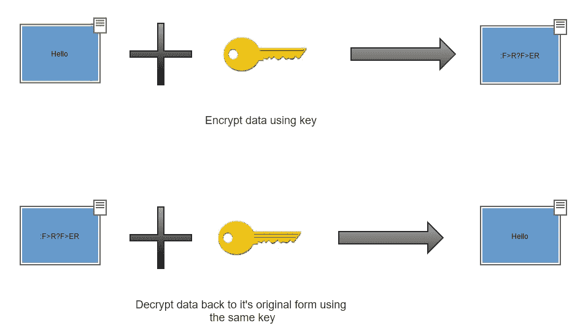
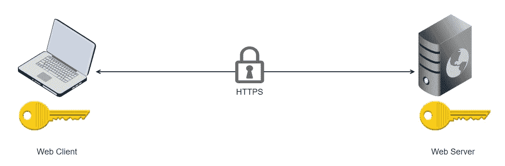
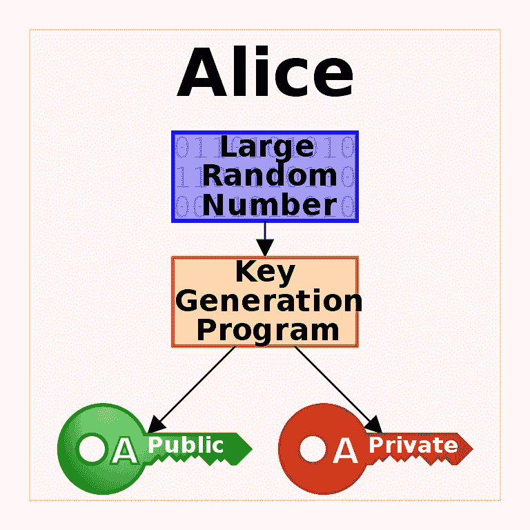
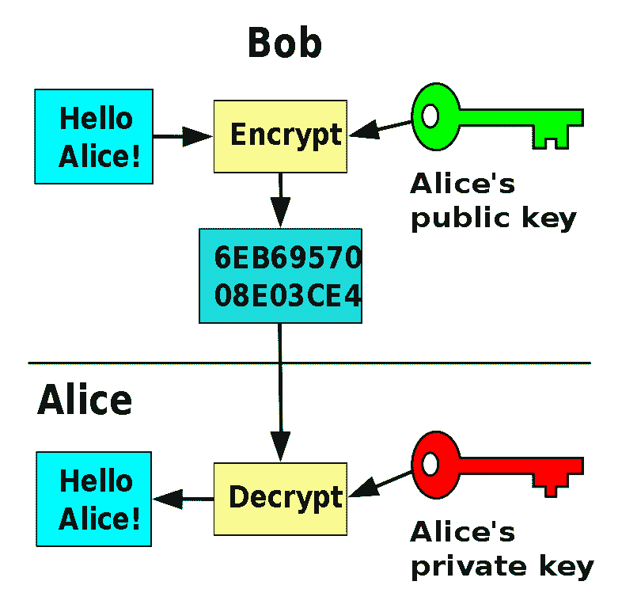
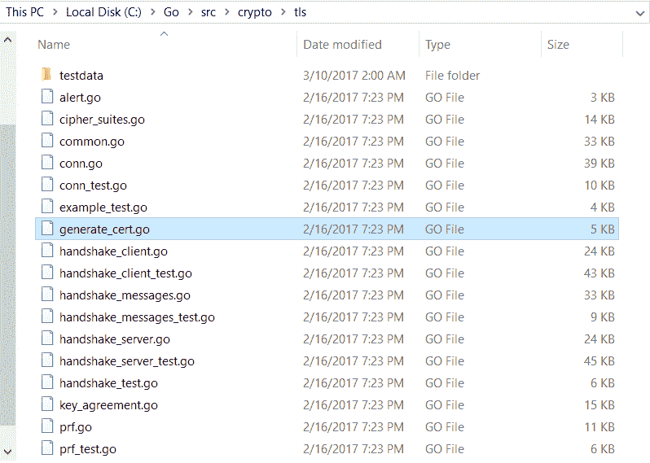
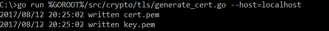

# 第三章：保护微服务

欢迎来到我们学习现代 Go 云编程的第三章。在本章中，我们将保护前一章中编写的 RESTful API 服务。

在我们开始深入编写代码之前，我们需要涵盖一些关键概念，以便提供一个良好的知识基础。

正如我们在前一章中所介绍的，Web 应用程序需要使用 HTTP（这是一个应用级协议）进行通信。HTTP 本身不安全，这意味着它会以明文发送数据。显然，如果我们试图发送信用卡信息或敏感个人数据，我们绝对不希望以明文发送。幸运的是，HTTP 通信可以通过一种称为**TLS**（**传输层安全**）的协议来保护。HTTP 和 TLS 的组合被称为 HTTPS。

在本章中，我们将涵盖以下主题：

+   HTTPS 的内部工作原理

+   在 Go 中保护微服务

# HTTPS

要实际理解 HTTPS，我们首先需要讨论 TLS 协议。TLS 是一种可用于加密计算机网络上通信数据的协议。TLS 依赖于两种类型的加密算法来实现其目标——**对称加密**和**公钥加密**。

公钥加密也被称为非对称加密。我们很快会介绍这个名字的由来。另一方面，对称加密也可以称为对称密钥算法。

# 对称加密

数据加密的核心思想是使用复杂的数学方程对数据进行编码（或加密），从而使这些数据对人类来说变得不可读。在安全软件通信领域，加密数据可以被发送到预期的接收者，预期的接收者将对数据进行解密，使其恢复到原始的可读形式。

在几乎所有情况下，要加密一段数据，你需要一个**加密密钥**。加密密钥只是用于对数据进行编码的复杂数学方程的一部分。在一些加密算法中，你可以使用相同的加密密钥将数据解密回其原始形式。在其他情况下，需要一个与加密密钥不同的**解密密钥**来执行解密。

对称加密或对称密钥算法是使用相同密钥来加密和解密数据的算法，这就是为什么它们被称为**对称**。下图显示了加密密钥用于将单词**Hello**加密成编码形式，然后使用相同的密钥与编码数据一起将其解密回单词**Hello**。



对称加密

# HTTPS 中的对称密钥算法

现在，让我们回到 Web 应用程序和 HTTP 的世界。一般来说，Web 应用程序只是使用 HTTP 协议进行通信的不同软件片段。正如本章前面提到的，为了保护 HTTP 并将其转换为 HTTPS，我们将其与另一个称为 TLS 的协议结合起来。TLS 协议利用对称密钥算法来加密客户端和服务器之间的 HTTP 数据。换句话说，Web 客户端和 Web 服务器通过协商一个共享的加密密钥（有些人称之为共享秘钥），然后使用它来保护它们之间来回传输的数据。

发送方应用程序使用密钥对数据进行加密，然后将其发送给接收方应用程序，接收方应用程序使用相同的密钥副本对数据进行解密。这个过程是 TLS 协议的对称密钥算法部分。



HTTPS 中的对称密钥算法

这听起来都很好，但是 Web 客户端和 Web 服务器如何确保在开始使用加密密钥发送加密数据之前，安全地达成对同一个加密密钥的共识呢？显然，Web 客户端不能只是以明文形式将密钥发送给 Web 服务器，然后期望这个密钥不会被未经授权的第三方捕获，然后简单地解密通过被窃取的密钥进行的任何安全通信。我们之前提到的答案是 TLS 协议依赖于不只一个，而是两种类型的加密算法来保护 HTTP。迄今为止，我们已经介绍了对称密钥算法，它们用于保护大部分通信；然而，公钥算法用于初始握手。这是客户端和服务器打招呼并相互识别，然后达成之后使用的加密密钥的地方。

# 非对称加密

与对称密钥算法不同，非对称加密或公钥算法利用两个密钥来保护数据。用于加密数据的一个密钥称为公钥，可以安全地与其他方分享。用于解密数据的另一个密钥称为私钥，不得分享。

公钥可以被任何人用来加密数据。然而，只有拥有与公钥对应的私钥的人才能将数据解密回其原始的可读形式。公钥和私钥是使用复杂的计算算法生成的。

在典型的情况下，拥有一对公私钥的人会与他们想要通信的其他人分享公钥。其他人随后会使用公钥来加密发送给密钥所有者的数据。密钥所有者反过来可以使用他们的私钥来将这些数据解密回其原始内容。

考虑一个很好的例子——维基百科提供的——展示了这个想法。假设 Alice 想要通过互联网与她的朋友安全地进行通信。为此，她使用一个生成一对公私钥的应用程序。



Alice 的公私钥

现在，Alice 的一个名叫 Bob 的朋友想要通过互联网给她发送一条安全消息。消息只是**你好，Alice！** Alice 首先需要向 Bob 发送她的公钥的副本，以便 Bob 可以使用它来加密他的消息然后发送给 Alice。然后，当 Alice 收到消息时，她可以使用她的私钥（不与任何人分享）来将消息解密回可读的文本，看到 Bob 说了你好。



Alice 和 Bob 之间的非对称加密

有了这个，你应该对公钥算法有足够的实际理解了。然而，这在 HTTPS 协议中是如何利用的呢？

# HTTPS 中的非对称加密

正如本章前面提到的，Web 客户端和 Web 服务器之间使用非对称加密来协商一个共享的加密密钥（也称为共享秘密或会话密钥），然后在对称加密中使用。换句话说，密钥被 Web 客户端和 Web 服务器同时使用来加密相互的 HTTP 通信。我们已经介绍了这种互动的对称加密部分，现在让我们深入一点了解非对称加密是如何进行的。

Web 客户端和 Web 服务器之间发生了一个**握手**，在这个握手中，客户端表示其意图向服务器开始一个安全的通信会话。通常，这涉及同意一些关于加密如何发生的数学细节。

服务器随后回复一个**数字证书**。如果您对数字证书的概念不熟悉，那么现在是时候阐明一下它是什么了。数字证书（或公钥证书）是一种证明公钥所有权的电子文档。为了理解数字证书的重要性，让我们退后几步，回想一下公钥是什么。

正如前面所述，公钥是用于非对称加密（或公钥算法）的加密密钥；该密钥只能加密数据，但永远无法解密数据，并且可以与我们希望进行通信的任何人共享。公钥的颁发者始终持有一个称为私钥的对应密钥，该私钥可以解密由公钥加密的数据。

这听起来很棒，但是如果客户端请求与服务器通信的公钥，然后一个坏的代理拦截了这个请求，并回复了自己的公钥（这被称为中间人攻击）会发生什么？客户端将继续与这个坏的代理进行通信，认为它是合法的服务器；然后客户端可能会向坏的代理发送敏感信息，例如信用卡号或个人数据。显然，如果我们寻求真正的保护和安全，我们希望尽一切可能避免这种情况，因此需要证书。

数字证书是由受信任的第三方实体颁发的数字文档。该文档包含一个公共加密密钥，该密钥所属的服务器名称，以及验证信息正确性的受信任第三方实体的名称，以及公钥属于预期密钥所有者（也称为证书颁发者）的名称。颁发证书的受信任第三方实体被称为**CA**（**证书颁发机构**）。有多个已知的 CA 颁发证书并验证企业和组织的身份。他们通常会收取一定的费用。对于较大的组织或政府机构，他们会颁发自己的证书；这个过程被称为**自签名**，因此他们的证书被称为自签名证书。证书可以有到期日期，到期后需要进行更新；这是为了在过去拥有证书的实体发生变化时提供额外的保护。

Web 客户端通常包含其所知的证书颁发机构列表。因此，当客户端尝试连接到 Web 服务器时，Web 服务器会回复一个数字证书。Web 客户端查找证书的颁发者，并将颁发者与其所知的证书颁发机构列表进行比较。如果 Web 客户端知道并信任证书颁发者，那么它将继续连接到该服务器，并使用证书中的公钥。

从服务器获取的公钥将用于加密通信，以安全地协商共享加密密钥（或会话密钥或共享密钥），然后在 Web 客户端和 Web 服务器之间的对称加密通信中使用。有许多算法可以用来生成会话密钥，但这超出了本章的范围。我们需要知道的是，一旦会话密钥达成一致，Web 客户端和 Web 服务器之间的初始握手将结束，允许实际的通信会话在共享会话密钥的保护下安全进行。

有了这些，我们现在对 Web 通信如何得到保护有了足够的实际理解。这用于安全的 Restful Web API 和安全的 Web 页面加载。要补充的另一个重要说明是，用于安全 Web 通信的 URL 以`https://`开头，而不是`http://`。这是显而易见的，因为安全的 Web 通信使用 HTTPS，而不仅仅是 HTTP。

# Go 中的安全 Web 服务

现在是时候找出如何在 Go 语言中编写安全的 Web 服务了。幸运的是，Go 是从头开始构建的，考虑到了现代软件架构，包括安全的 Web 应用程序。Go 配备了一个强大的标准库，允许从 HTTP 服务器平稳过渡到 HTTPS 服务器。在我们开始查看代码之前，让我们先回答一个简单的问题，即如何获取数字证书以在我们的 Web 服务器中使用。

# 获取证书

获取数字证书的默认方法是购买验证您的身份并从证书颁发机构提供者那里颁发证书的服务。正如我们之前提到的，有多个证书颁发机构提供者。可以在维基百科上找到最受欢迎的提供者列表：[`en.wikipedia.org/wiki/Certificate_authority#Providers`](https://en.wikipedia.org/wiki/Certificate_authority#Providers)

还有一些提供免费服务的证书颁发机构。例如，在 2016 年，**Mozilla 基金会**与**电子前沿基金会**和**密歇根大学**合作成立了一个名为*Let's Encrypt*的证书颁发机构，网址为：[`letsencrypt.org/`](https://letsencrypt.org/)。*Let's Encrypt*是一个免费服务，以自动化方式执行验证、签名和颁发证书。

听起来很不错。但是，如果我们只想测试一些本地 Web 应用程序，比如我们在前一章中构建的事件微服务，该怎么办？在这种情况下，我们需要一种更直接的方法来生成我们可以使用和测试的证书。然后，在部署到生产环境后，我们可以使用受信任的证书颁发机构为我们颁发证书，这些证书将受到 Web 浏览器和连接到互联网的客户端的尊重。

生成我们测试的证书的直接方法是手动创建我们自己的证书并进行自签名。这样做的优点是我们可以生成大量证书用于内部测试，而无需经过验证过程。然而，缺点是任何第三方网络客户端，如 Web 浏览器，尝试通过我们的自签名证书连接到我们的 Web 应用程序时，将无法识别这些证书的发行者，因此在允许我们继续之前会产生大量警告。

为了生成我们新鲜出炉的自签名数字证书，我们需要使用了解算法足够的专门工具来创建必要的输出。请记住，为了启动 HTTPS 会话，我们需要以下内容：

+   包含以下内容的数字证书：

+   一个可以与其他方共享的公钥。

+   拥有证书的服务器名称或域名。

+   证书的发行者。在自签名证书的情况下，发行者只是我们自己。在由受信任的证书颁发机构颁发的证书的情况下，发行者将是 CA。

+   我们需要保密并不与任何人分享的私钥

# OpenSSL

可以生成 TLS 数字证书的一种专门工具是非常流行的**OpenSSL**。OpenSSL 可以在以下网址找到：[`www.openssl.org/`](https://www.openssl.org/)。OpenSSL 是一个开源商业级 TLS 工具包，可用于执行各种任务；其中之一就是生成自签名数字证书。OpenSSL 组织本身并不提供该工具的预构建二进制文件。但是，有一个维基页面列出了可以下载该工具的第三方位置。维基页面可以在以下网址找到：[`wiki.openssl.org/index.php/Binaries`](https://wiki.openssl.org/index.php/Binaries)。一旦您下载了该工具，以下是如何使用它生成数字证书及其私钥的示例：

```go
openssl req -x509 -newkey rsa:2048 -keyout key.pem -out cert.pem -days 365
```

在前面的代码中，第一个单词显然是二进制文件的名称。让我们逐个讨论这些参数：

+   `req`：表示请求；它表示我们请求一个证书。

+   -x509：这将表明我们要输出一个自签名证书。在密码学世界中，`X.509`是一个定义公钥证书格式的标准。许多互联网协议中使用的数字证书都使用了这个标准。

+   `-newkey`：此选项表示我们希望一个新的带有配对私钥的证书。如前所述，证书只是一个公钥与一堆标识符的组合。因此，为了执行非对称加密，我们需要一个与这个公钥配对的私钥。

+   `rsa:2048`：这是`-newkey`选项的参数，表示我们希望使用的加密算法类型来生成密钥。

+   `-keyout`：此选项提供要将新创建的私钥写入的文件名。

+   `key.pem`：这是`-keyout`选项的参数。它表示我们希望将私钥存储在一个名为`key.pem`的文件中。正如前面提到的，这个密钥需要保持私密，不与任何人分享。

+   `-out`：此选项提供要将新创建的自签名证书写入的文件名。

+   `cert.pem`：这是`-out`选项的参数；它表示我们希望将证书保存在一个名为`cert.pem`的文件中。然后，这个证书可以与试图通过 HTTPS 与我们的网站安全通信的 Web 客户端共享。

+   `-days`：证书有效期的天数。

+   365：这是`-days`选项的参数。这只是我们说我们希望证书有效期为 365 天，或者简单地说是一年。

# generate_cert.go

在 Go 语言的世界中，除了 OpenSSL 之外，还有另一种方法可以生成用于测试的自签名证书。如果您转到`GOROOT`文件夹，这是 Go 语言安装的位置，然后转到`/src/crypto/tls`文件夹，您会发现一个名为`generate_cert.go`的文件。这个文件只是一个简单的工具，可以轻松高效地为我们生成证书。在我的计算机上，`GOROOT`文件夹位于`C:\Go`。以下是我机器上`generate_cert.go`文件的截图：



generate_cert.go 文件

`generate_cert.go`是一个独立的 Go 程序，可以通过`go run`命令简单运行。运行后，它将为您创建证书和私钥文件，并将它们放在当前文件夹中。该工具支持许多参数，但通常最常用的参数是`--host`，它表示我们要为哪个网站生成证书和密钥。以下是我们如何通过`go run`命令运行该工具的方式：

```go
go run %GOROOT%/src/crypto/tls/generate_cert.go --host=localhost
```

上述命令是在 Windows 操作系统上执行的，这就是为什么它将`GOROOT`环境路径变量表示为`%GOROOT%`。环境变量的表示方式因操作系统而异。例如，在 Linux 的情况下，环境变量将表示为`$GOROOT`。

我们现在将指示命令为名为`localhost`的服务器构建证书和私钥。该命令将为我们生成证书和密钥，然后将它们放在当前文件夹中，如前所述。以下是显示命令成功执行的屏幕截图：



generate_cert.go 命令

`generate_cert`工具支持`--host`之外的其他选项。值得覆盖其中一些：

+   --start-date：此选项表示证书的开始验证日期。此选项的参数需要格式化为 2011 年 1 月 1 日 15:04:05，例如。

+   `--duration`：此选项表示证书有效期限，以小时为单位。默认值为一年。

+   `--rsa-bits`：此选项表示在密钥的 RSA 加密中要使用的位数。默认值为 2,048。

+   `--help`：这提供了支持的选项列表及其描述。

生成证书和密钥文件后，我们可以在我们的 Web 服务器应用程序中获取并使用它们，以支持 HTTPS。我们将在下一节中看到如何做到这一点。

# 在 Go 中构建 HTTPS 服务器

现在终于是时候深入一些代码了。由于 Go 非常适合构建现代 Web 软件，编写 HTTPS Web 服务器非常容易。让我们从回顾我们在上一章中编写的代码片段开始，以建立一个 HTTP Web 服务器：

```go
 http.ListenAndServe(endpoint, r)
```

这是一行代码，一个名为`ListenAndServe()`的函数，它属于标准库中的 HTTP Go 包。`ListenAndServe()`的第一个参数是我们希望我们的 Web 服务器监听的端点。因此，例如，如果我们希望我们的 Web 服务器监听本地端口 8181，端点将是`:8181`或`localhost:8181`。第二个参数是描述 HTTP 路由及其处理程序的对象——这个对象是由 Gorilla `mux`包创建的。从上一章中创建它的代码如下：

```go
r := mux.NewRouter()
```

要将上一章的 Web 服务器从 HTTP 转换为 HTTPS，我们只需要进行一个简单的更改——而不是调用`http.ListenAndServer()`函数，我们将使用另一个名为`http.ListenAndServeTLS()`的函数。代码将如下所示：

```go
http.ListenAndServeTLS(endpoint, "cert.pem", "key.pem", r)
```

如上述代码所示，`http.ListenAndServeTLS()`函数比`原始 http.ListenAndServe()`函数接受更多的参数。额外的参数是第二个和第三个参数。它们只是数字证书文件名和私钥文件名。第一个参数仍然是 Web 服务器监听端点，而最后一个参数仍然是处理程序对象（在我们的情况下是 Gorilla `*Router`对象）。我们已经从上一步生成了证书和私钥文件，所以我们在这里需要做的就是确保第二个和第三个参数指向正确的文件。

就是这样。这就是我们需要做的一切，以便在 Go 中创建一个 HTTPS Web 服务器；Go HTTP 标准包将接收证书和私钥，并根据 TLS 协议的要求使用它们。

然而，如果我们想要在我们的微服务中同时支持 HTTP 和 HTTPS 怎么办？为此，我们需要有点创意。第一个逻辑步骤将是在我们的代码中运行`http.ListenAndServe()`和`http.ListenAndServeTLS()`函数，但是我们遇到了一个明显的挑战：这两个函数如何在同一个本地端口上监听？我们可以通过选择一个与 HTTP 监听端口不同的端口来解决这个问题。在前面的章节中，我们使用了一个名为**endpoint**的变量来保存本地 HTTP 服务器的监听地址。对于 HTTPS，让我们假设本地监听地址存储在一个名为`tlsendpoint`的变量中。有了这个，代码将如下所示：

```go
http.ListenAndServeTLS(tlsendpoint, "cert.pem", "key.pem", r)

```

听起来很棒，但现在我们面临另一个障碍，`http.ListenAndServeTLS()`和`http.ListenAndServe()`都是阻塞函数。这意味着每当我们调用它们时，它们会无限期地阻塞当前的 goroutine，直到发生错误。这意味着我们不能在同一个 goroutine 上调用这两个函数。

goroutine 是 Go 语言中的一个重要语言组件。它可以被视为轻量级线程。Go 开发人员在各处都使用 goroutines 来实现高效的并发。为了在多个 goroutines 之间传递信息，我们使用另一个 Go 语言组件，称为 Go 通道。

因此，这个问题的解决方案很简单。我们在不同的 goroutine 中调用其中一个函数。这可以通过在函数名之前加上 go 这个词来简单实现。让我们在一个不同的 goroutine 中运行`http.ListenAndServe()`函数。代码将如下所示：

```go
go http.ListenAndServe(endpoint,r)
http.ListenAndServeTLS(tlsendpoint, "cert.pem", "key.pem", r)
```

完美！有了这个，我们的 Web 服务器可以作为 HTTP 服务器为希望使用 HTTP 的客户端，或者作为 HTTPS 服务器为希望使用 HTTPS 的客户端。现在，让我们解决另一个问题：`http.ListenAndServe()`和`http.ListenAndServeTLS()`函数都会返回错误对象来报告任何失败的问题；那么，即使它们在不同的 goroutines 上运行，我们是否可以捕获任一函数产生的错误？为此，我们需要使用 Go 通道，这是 Go 语言中两个 goroutines 之间通信的惯用方式。代码将如下所示：

```go
httpErrChan := make(chan error) 
httptlsErrChan := make(chan error) 
go func() { httptlsErrChan <- http.ListenAndServeTLS(tlsendpoint, "cert.pem", "key.pem", r) }() 
go func() { httpErrChan <- http.ListenAndServe(endpoint, r) }()

```

在前面的代码中，我们创建了两个 Go 通道，一个叫做`httpErrChan`，另一个叫做`httptlsErrChan`。这些通道将保存一个错误类型的对象。其中一个通道将报告`http.ListenAndServe()`函数观察到的错误，而另一个将报告`http.ListenAndServeTLS()`函数返回的错误。然后，我们使用两个带有匿名函数的 goroutines 来运行这两个`ListenAndServe`函数，并将它们的结果推送到相应的通道中。我们在这里使用匿名函数，因为我们的代码不仅仅涉及调用`http.ListenAndServe()`或`http.ListenAndServeTLS()`函数。

你可能会注意到，我们现在在两个`ListenAndServe`函数中都使用了 goroutines，而不仅仅是一个。我们这样做的原因是为了防止它们中的任何一个阻塞代码，这将允许我们将`httpErrChan`和`httptlsErrChan`通道都返回给调用者代码。调用者代码，也就是我们的主函数，在任何错误发生时可以自行处理这些错误。

在前面的章节中，我们将这段代码放在一个名为`ServeAPI()`的函数中；现在让我们来看一下在我们的更改之后这个函数的完整代码：

```go
func ServeAPI(endpoint, tlsendpoint string, databasehandler persistence.DatabaseHandler) (chan error, chan error) { 
   handler := newEventHandler(databaseHandler)
    r := mux.NewRouter() 
    eventsrouter := r.PathPrefix("/events").Subrouter()     eventsrouter.Methods("GET").Path("/{SearchCriteria}/{search}").HandlerFunc(handler.FindEventHandler) eventsrouter.Methods("GET").Path("").HandlerFunc(handler.AllEventHandler) eventsrouter.Methods("POST").Path("").HandlerFunc(handler.NewEventHandler) 
    httpErrChan := make(chan error) 
    httptlsErrChan := make(chan error) 
    go func() { httptlsErrChan <- http.ListenAndServeTLS(tlsendpoint, "cert.pem", "key.pem", r) }() 
    go func() { httpErrChan <- http.ListenAndServe(endpoint, r) }() 
    return httpErrChan, httptlsErrChan
} 
```

该函数现在接受一个名为`tlsendpoint`的新字符串参数，它将保存 HTTPS 服务器的监听地址。该函数还将返回两个错误通道。然后，函数代码继续定义我们的 REST API 支持的 HTTP 路由。然后，它将创建我们讨论过的错误通道，调用两个单独的 goroutine 中的 HTTP 包`ListenAndServe`函数，并返回错误通道。我们下一个逻辑步骤是覆盖调用`ServeAPI（）`函数的代码，并查看它如何处理错误通道。

正如前面讨论的，我们的主函数是调用`ServeAPI（）`函数的，因此这也将使主函数承担处理返回的错误通道的负担。主函数中的代码将如下所示：

```go
//RESTful API start 
httpErrChan, httptlsErrChan := rest.ServeAPI(config.RestfulEndpoint, config.RestfulTLSEndPint, dbhandler) 
select { 
case err := <-httpErrChan: 
     log.Fatal("HTTP Error: ", err) 
case err := <-httptlsErrChan: 
     log.Fatal("HTTPS Error: ", err) 
}
```

代码将调用`ServeAPI（）`函数，然后将两个返回的错误通道捕获到两个变量中。然后我们将使用 Go 的`select`语句的功能来处理这些通道。在 Go 中，`select`语句可以阻塞当前 goroutine 以等待多个通道；无论哪个通道首先返回，都将调用与之对应的`select` case。换句话说，如果`httpErrChan`返回，将调用第一个 case，它将在标准输出中打印一条报告发生 HTTP 错误的语句，并显示错误。否则，将调用第二个 case。阻塞主 goroutine 很重要，因为如果我们不阻塞它，程序将会退出，这是我们不希望发生的事情，如果没有失败的话。过去，`http.ListenAndServe（）`函数通常会阻塞我们的主 goroutine，并防止我们的程序在没有错误发生时退出。但是，由于我们现在已经在两个单独的 goroutine 上运行了`ListenAndServe`函数，我们需要另一种机制来确保我们的程序不会退出，除非我们希望它退出。

通常，每当您尝试从通道接收值或向通道发送值时，goroutine 都会被阻塞，直到传递一个值。这意味着如果`ListenAndServe`函数没有返回任何错误，那么值将不会通过通道传递，这将阻塞主 goroutine 直到发生错误。

除了常规通道之外，Go 还有一种称为缓冲通道的通道类型，它可以允许您在不阻塞当前 goroutine 的情况下传递值。但是，在我们的情况下，我们使用常规通道。

我们需要在这里覆盖的最后一段代码是更新配置。请记住，在上一章中，我们使用配置对象来处理微服务的配置信息。配置信息包括数据库地址、HTTP 端点等。由于我们现在还需要一个 HTTPS 端点，因此我们需要将其添加到配置中。配置代码存在于`./lib/configuration.go`文件中。现在它应该是这样的：

```go
package configuration

import ( 
         "encoding/json" "fmt" 
         "gocloudprogramming/chapter3/myevents/src/lib/persistence/dblayer" 
         "os"
       )

var ( 
      DBTypeDefault       = dblayer.DBTYPE("mongodb") 
      DBConnectionDefault = "mongodb://127.0.0.1" 
      RestfulEPDefault    = "localhost:8181" 
      RestfulTLSEPDefault = "localhost:9191"
    )

type ServiceConfig struct { 
     Databasetype      dblayer.DBTYPE `json:"databasetype"` 
     DBConnection      string         `json:"dbconnection"` 
     RestfulEndpoint   string         `json:"restfulapi_endpoint"` 
     RestfulTLSEndPint string         `json:"restfulapi-tlsendpoint"`
}

func ExtractConfiguration(filename string) (ServiceConfig, error) { 
   conf := ServiceConfig{ 
               DBTypeDefault, 
               DBConnectionDefault, 
               RestfulEPDefault, 
               RestfulTLSEPDefault, 
              }
   file, err := os.Open(filename) 
   if err != nil { 
       fmt.Println("Configuration file not found. Continuing with default values.") 
       return conf, err 
    }
   err = json.NewDecoder(file).Decode(&conf) 
   return conf, err
}
```

在上述代码中，我们从上一章做了三件主要的事情：

+   我们添加了一个名为`RestfulTLSEPDefault`的常量，它将默认为`localhost:9191`。

+   我们向`ServiceConfig`结构添加了一个新字段。该字段称为`RestfulTLSEndPint`；它将期望对应于名为`restfulapi-tlsendpoint`的 JSON 字段。

+   在`ExtractConfiguration（）`函数中，我们将初始化的`ServiceConfig`结构对象的`RestfulTLSEndPint`字段的默认值设置为`RestfulTLSEPDefault`。

通过这三个更改，我们的配置层将能够从配置 JSON 文件中读取 HTTPS 端点值，如果存在配置覆盖。如果不存在配置文件，或者配置文件中没有设置`restfulapi-tlsendpoint` JSON 字段，则我们将采用默认值，即`localhost:9191`。

任何调用`ExtractConfiguration()`函数的代码都将获得对这个功能的访问权限，并能够获取 HTTPS 端点的默认值或配置值。在我们的代码中，主函数将调用`ExtractConfiguration()`函数，并获取调用`ServeAPI()`函数所需的信息，该函数将运行我们的 RESTful API。

完美！有了这最后一部分，我们结束了本章。

# 总结

在本章中，我们深入探讨了安全的 Web 软件世界以及其内部工作原理。我们探讨了 HTTPS、对称和非对称加密，以及如何在 Go 语言中保护 Web 服务。

在下一章中，我们将涵盖分布式微服务架构世界中的一个关键主题：消息队列。
