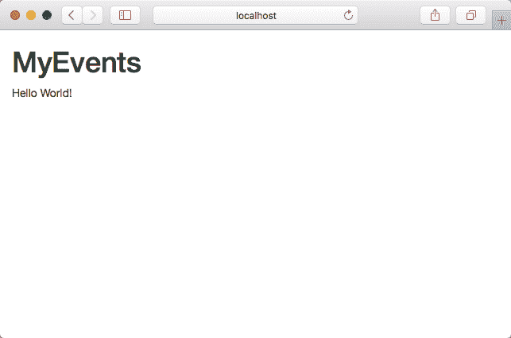
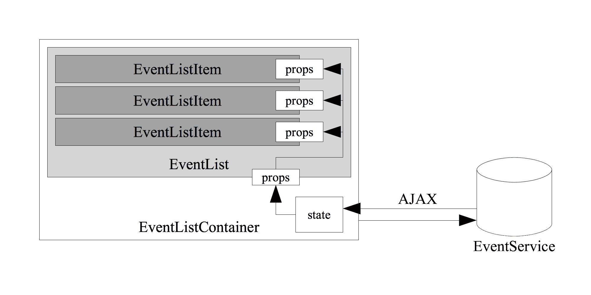
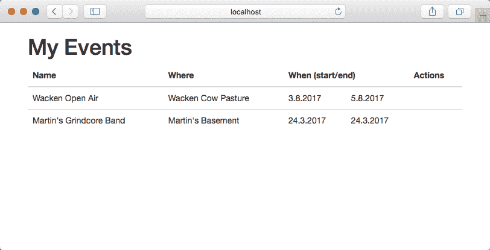
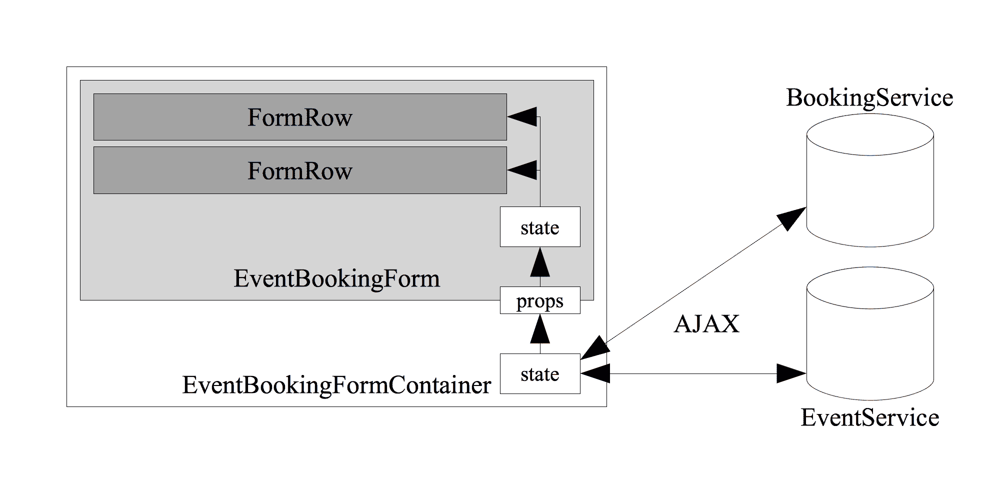
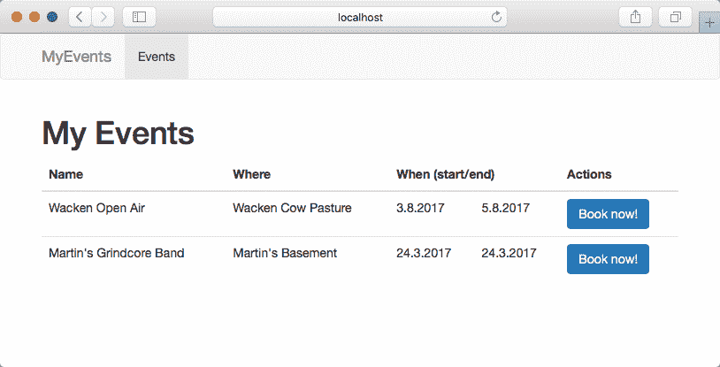
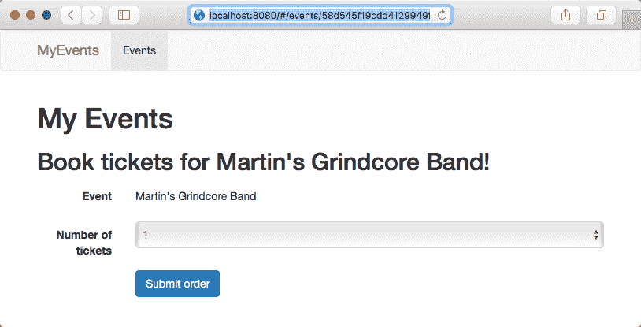

# 第五章：使用 React 构建前端

在之前的章节中，您已经使用 Go 构建了多个微服务，并使用 REST Web 服务和异步消息队列进行了集成。然而，即使是最可扩展的云应用程序，如果没有用户可以轻松交互的界面，也只有一半的用处（除非，当然，向用户提供 REST API 是您的实际产品）。为了使前几章中构建的 API 更具体，我们现在将为我们的应用程序添加一个基于 Web 的前端。

为此，我们将离开 Go 编程世界一段时间，并短暂地转向 JavaScript 编程世界。更确切地说，我们将看一下 React 框架，并将其用于为（现在几乎完成的）MyEvents 后端构建前端应用程序。

在构建前端应用程序时，我们还将接触到 JavaScript 生态系统中许多组件。例如，我们将使用 TypeScript 编译器以便以类型安全的方式进行编程。此外，我们将使用 Webpack 模块打包程序，以便轻松部署我们的 JavaScript 应用程序，以便在所有现代 Web 浏览器中轻松使用。

在本章中，我们将涵盖以下主题：

+   设置 Node.js/TypeScript/React 开发环境

+   启动一个新项目

+   React 组件

+   Webpack 模块打包程序

+   使用 RESTful 后端构建 React 应用程序

# 开始使用 React

在本章中，我们将暂时离开 Go 生态系统。要使用 React，您需要一个开发环境，其中包括 Node.js、npm 和 TypeScript 编译器，我们将在下一节中设置。

# 设置 Node.js 和 TypeScript

JavaScript 是一种动态类型语言。尽管（像 Go 一样）它确实有数据类型的概念，但 JavaScript 变量基本上可以在任何时候具有任何类型（与 Go 不同）。由于我们不希望您在我们短暂进入 JavaScript 世界的过程中开始错过 Go 编译器和 Go 的类型安全性，因此我们将在此示例中使用 TypeScript。TypeScript 是 JavaScript 的类型安全超集，它添加了静态类型和基于类的面向对象编程。您可以使用 TypeScript 编译器（或简称为*tsc*）将 TypeScript 编译为 JavaScript。

首先，除了 Go 运行时，您还需要在开发机器上设置一个可用的 Node.js 运行时。查看[`nodejs.org/en/download`](https://nodejs.org/en/download)了解如何在您的机器上设置 Node.js。如果您使用 Linux（或 macOS 使用 Homebrew 等软件包管理器），请查看[`nodejs.org/en/download/package-manager`](https://nodejs.org/en/download/package-manager)。

安装了 Node.js 后，继续使用 Node 包管理器（npm）安装 TypeScript 编译器：

```go
$ npm install -g typescript
```

这将下载并安装 TypeScript 编译器到您系统的`PATH`中。运行上述命令后，您应该能够在命令行上调用 tsc。

在这个项目中，我们还将使用 Webpack 模块打包程序。模块打包程序获取 Node.js 模块并生成静态 JavaScript 文件，可在浏览器环境中使用。您可以通过 npm 安装 Webpack，就像您为 TypeScript 编译器所做的那样：

```go
$ npm install -g webpack
```

# 初始化 React 项目

首先为您的 React 前端应用程序创建一个新目录。接下来，将该目录初始化为一个新的`npm`包：

```go
$ npm init
```

`npm init`命令将提示您输入有关您的项目的一些（多多少少）重要信息。最后，它应该会生成一个`package.json`文件，大致如下：

```go
{ 
  "name": "myevents-ui", 
  "version": "1.0.0", 
  "description": "", 
  "main": "dist/bundle.js", 
  "author": "Martin Helmich", 
  "license": "MIT" 
} 
```

一般来说，我们的应用程序将具有以下目录结构：

+   我们的 TypeScript 源文件将放在`src/`目录中。

+   编译后的 JavaScript 文件将放在`dist/`目录中。由于我们将使用 Webpack 作为模块打包程序，我们的`dist/`目录很可能只包含一个文件，其中包含整个编译后的源代码。

+   我们将通过 npm 安装的库作为依赖项安装到`node_modules/`目录中。

现在我们可以使用 npm 向我们的项目添加依赖项。让我们从安装 React 和 ReactDOM 包开始：

```go
$ npm install --save react@16 react-dom@16 @types/react@16 @types/react-dom@16
```

TypeScript 编译器需要`@types`包。由于 React 是一个 JavaScript（而不是 TypeScript）库，TypeScript 编译器将需要有关由 react 库定义的类和它们的方法签名的额外信息。例如，这些**typings**可能包含有关 React 提供的某些函数所需的参数类型和它们的返回类型的信息。

我们还需要一些开发依赖项：

```go
$ npm install --save-dev typescript awesome-typescript-loader source-map-loader
```

这些库将被 Webpack 模块捆绑器需要将我们的源文件编译为 JavaScript 文件。但是，我们只需要这些依赖项来*构建*应用程序，而不是实际*运行*它。因此，我们使用`--save-dev`标志将它们声明为开发依赖项。

接下来，我们需要配置 TypeScript 编译器。为此，在项目目录中创建一个新的`tsconfig.json`文件：

```go
{ 
  "compilerOptions": { 
    "outDir": "./dist/", 
    "module": "commonjs", 
    "target": "es5", 
    "sourceMap": true, 
    "noImplicitAny": true, 
    "jsx": "react" 
  }, 
  "include": [ 
    "./src/**/*" 
  ] 
} 
```

请注意，我们正在配置 TypeScript 编译器，使用`include`属性从`src/`目录加载其源文件，并使用`outDir`属性将编译后的输出文件保存到`dist/`。

最后，我们还需要通过创建一个`webpack.config.js`文件来配置 Webpack 模块捆绑器：

```go
module.exports = { 
  entry: "./src/index.tsx", 
  output: { 
    filename: "bundle.js", 
    path: __dirname + "/dist" 
  }, 
  resolve: { 
    extensions: [".ts", ".tsx"] 
  }, 
  module: { 
    rules: [ 
      { 
        test: /\.tsx?$/, 
        loader: "awesome-typescript-loader" 
      } 
    ] 
  }, 
  externals: { 
    "react": "React", 
    "react-dom": "ReactDOM" 
  } 
} 
```

这个文件配置 Webpack 在所有`.ts`和`.tsx`文件上使用 TypeScript 加载器，编译它们，并将所有模块捆绑到`dist/bundle.js`文件中。但在实际执行之前，您需要添加一些要编译的源文件。

在这样做之前，让我们看看 React 实际上是如何工作的。

# 基本的 React 原则

React 应用程序是由**组件**构建的。组件是一个 JavaScript 类，它接受一组值（称为属性，或简称为*props*），并返回可以由浏览器呈现的 DOM 元素树。

考虑以下简单的例子。我们将从纯 JavaScript 实现开始，然后向您展示如何使用 TypeScript 添加静态类型：

```go
class HelloWorld extends React.Component { 
  render() { 
    return <div className="greeting"> 
      <h1>Hello {this.props.name}!</h1> 
    </div>; 
  } 
} 
```

即使您习惯于 JavaScript，该语法对您来说可能会很新。从技术上讲，前面的代码示例不是纯 JavaScript（任何浏览器都会拒绝实际运行此代码），而是**JSX**。JSX 是 JavaScript 的一种特殊语法扩展，允许您直接使用它们的 HTML 表示来定义 DOM 元素。这使得定义 React 组件变得更加容易。如果不使用 JSX，前面的代码示例将需要按照以下方式编写：

```go
class HelloWorld extends React.Component { 
  render() { 
    return React.createElement("div", {class: "greeting"}, 
      React.createElement("h1", {}, `Hello ${this.props.name}!`) 
    ); 
  } 
} 
```

当实际在浏览器中运行 JSX 源代码时，它需要首先转换为普通的 JavaScript。这将在实际构建应用程序时由 Webpack 模块捆绑器完成。

还有 JSX 的 TypeScript 变体，称为**TSX**。它的工作方式完全相同，但具有静态类型。使用 TypeScript 构建 React 组件时，您还可以为组件 props 定义接口。

由于这实际上是一本 Go 书，很重要的一点是要注意 TypeScript 接口与 Go 接口相比是非常不同的。虽然 Go 接口描述了一个结构体需要实现的一组方法，但 TypeScript 接口定义了对象需要具有的属性和/或方法。

要将 React 组件与 props 接口关联起来，`React.Component`类具有一个类型参数，您可以在扩展类时指定：

```go
export interface HelloWorldProps { 
  name: string; 
} 

export class HelloWorld extends React.Component 
<HelloWorldProps, any> { 
  render() { 
    // ... 
  } 
} 
```

组件可以嵌套在彼此中。例如，您现在可以在另一个组件中重用之前的`HelloWorld`组件：

```go
import {HelloWorld} from "./hello_world"; 

class ExampleComponents extends React.Component<{}, any> { 
  render() { 
    return <div class="greeting-list"> 
      <HelloWorld name="Foo"/> 
      <HelloWorld name="Bar"/> 
    </div> 
  } 
} 
```

使用 TypeScript 的一个优点是，当您使用通过接口定义 props 的组件时，TypeScript 编译器会检查您是否实际上提供了正确的 props 给组件。例如，在前面的例子中省略`name` prop（或将其传递给另一个值而不是字符串）将触发编译错误。

传递给 React 组件的 props 被视为不可变的。这意味着当 prop 的值之一更改时，组件不会重新渲染。但是，每个 React 组件可能有一个内部状态，可以进行更新。每当组件的状态更改时，它将被重新渲染。考虑以下例子：

```go
export interface CounterState { 
  counter: number; 
} 

export class Counter extends React.Component<{}, CounterState> { 
  constructor() { 
    super(); 
    this.state = {counter: 0}; 
  } 

  render() { 
    return <div>Current count: {this.state.counter}</div>; 
  } 
} 
```

现在，我们可以使用组件的`setState()`方法随时更新此状态。例如，我们可以使用计时器每秒增加计数器：

```go
constructor() { 
  super();
   this.state = {counter: 0}; 

  setInterval(() => { 
    this.setState({counter: this.state.counter + 1}); 
  }, 1000); 
} 
```

改变组件的状态将导致重新渲染。在前面的例子中，这将导致计数器每秒可见地增加 1。

当然，我们也可以组合 props 和 state。一个常见的用例是使用传递给组件的 props 来初始化该组件的状态：

```go
export interface CounterProps { 
  start: number; 
} 

export interface CounterState { 
  counter: number 
} 

export class Counter extends React.Component<CounterProps, CounterState> { 
  constructor(props: CounterProps) { 
    super(props); 

    this.state = { 
      counter: props.start 
    }; 

    setInterval(() => { 
      // ... 
  } 
} 
```

掌握了 React 组件的知识后，我们现在可以开始构建 MyEvents 平台的前端。

# 启动 MyEvents 前端

我们将首先构建一个简单的 React 应用程序，从服务器获取可用事件列表并将其显示为简单列表。

在开始之前，我们需要引导我们的 React 应用程序。为此，我们需要构建一个可以作为应用程序入口点的`index.html`文件。通常，这个文件不会很长，因为它的大部分逻辑将以 React 组件的形式存在：

```go
<!DOCTYPE html> 
<html lang="en"> 
  <head> 
    <meta charset="UTF-8"> 
    <title>MyEvents</title> 
  </head> 
  <body> 
    <div id="myevents-app"></div> 

    <script src="img/react.production.min.js"></script> 
    <script src="img/react-dom.production.min.js"></script> 
    <script src="img/bundle.js"></script> 
  </body> 
</html> 
```

让我们更详细地看一下这个 HTML 文件。具有`myevents-app` ID 的`DIV`将成为我们的 React 应用程序将呈现的位置。然后，大部分文件由从相应的 npm 包加载 React 库和加载我们的实际应用程序包（将由 Webpack 构建）组成。

为了使我们的应用程序看起来更好一些，我们还将在前端添加 Twitter Bootstrap 框架。像往常一样，您可以使用`npm`来安装 Bootstrap：

```go
$ npm install --save bootstrap@³.3.7
```

安装 Bootstrap 后，您可以在`index.html`文件的头部部分包含相应的 CSS 文件：

```go
<!DOCTYPE html> 
<html lang="en"> 
<head> 
  <meta charset="UTF-8"> 
  <title>MyEvents</title> 
  <link rel="stylesheet" href="./node_modules/bootstrap/dist/css/bootstrap.min.css"/> 
</head> 
<body> 
  <!-- ... --> 
</body> 
</html> 
```

要开始，请现在添加一个新的 React 组件。为此，在项目目录中创建`src/components/hello.tsx`文件：

```go
import * as React from "React"; 

export interface HelloProps { 
  name: string; 
} 

export class Hello extends React.Component<HelloProps, {}> { 
  render() { 
    return <div>Hello {this.props.name}!</div>; 
  } 
} 
```

我们的 React 应用程序的实际入口点将放在`src/index.tsx`文件中。您可能还记得，这也是我们在`webpack.config.js`文件中指定为 Webpack 模块打包程序的入口点的文件：

```go
import * as React from "react"; 
import * as ReactDOM from "react-dom"; 
import {Hello} from "./components/hello"; 

ReactDOM.render( 
  <div className="container"> 
    <h1>MyEvents</h1> 
    <Hello name="World"/> 
  </div>, 
  document.getElementById("myevents-app") 
); 
```

看一下前面代码示例中的`className`属性。在 JSX 或 TSX 中使用纯 HTML 元素时，您需要使用`className`而不是`class`。这是因为`class`是 JavaScript 和 TypeScript 中的保留关键字，因此仅使用`class`会严重混淆编译器。

创建了所有这些文件后，现在可以运行 Webpack 打包程序来创建您的`bundle.js`文件：

```go
$ webpack
```

在开发过程中，您还可以让 Webpack 打包程序持续运行，每当源文件之一更改时更新您的`bundle.js`文件。只需在后台的 shell 窗口中保持启动的进程运行：

```go
$ webpack --watch
```

现在可以在浏览器中打开`index.html`文件。但是，直接在浏览器中打开本地文件将在以后向后端服务发出 HTTP 请求时引起问题。您可以使用`http-server` npm 包快速设置一个可以提供这些本地文件的 HTTP 服务器。只需通过`npm`安装它，然后在项目目录中运行它：

```go
$ npm install -g http-server
$ http-server
```

默认情况下，Node.js HTTP 服务器将在 TCP 端口`8080`上监听，因此您可以通过在浏览器中导航到`http://localhost:8080`来访问它：



输出（http://localhost:8080）

恭喜！您刚刚构建了您的第一个 React 应用程序。当然，对于 MyEvents 平台，我们将需要比 Hello World!更多。我们的第一个任务之一将是从后端服务加载可用事件并以美观的方式显示它们。

# 实现事件列表

为了显示可用事件的列表，我们将需要一个解决方案来从后端服务加载这些事件，更准确地说，是您在第二章中构建的事件服务的 REST API，*使用 Rest API 构建微服务*，以及第三章，*保护微服务*。

# 自己带来客户端

React 是一个模块化的框架。与其他 JavaScript 前端框架（如 Angular）不同，React 不提供自己的 REST 调用库，而是期望您自己带来。为了从服务器加载数据，我们将使用 fetch API。fetch API 是一个较新的 JavaScript API，用于向许多现代浏览器（主要是 Firefox 和 Chrome）中实现的后端服务进行 AJAX 调用。对于尚未实现 fetch API 的旧版浏览器，有一个`polyfill`库，您可以通过`npm`添加到您的应用程序中：

```go
$ npm install --save whatwg-fetch promise-polyfill
```

您需要在`index.html`文件中将这两个`polyfill`库与其他 JavaScript 库一起包含：

```go
<script src="img/react.min.js"></script> 
<script src="img/react-dom.min.js"></script> 
<script src="img/promise.min.js"></script> 
<script src="img/fetch.js"></script> 
<script src="img/bundle.js"></script> 
```

当浏览器的 fetch API 可用时，fetch `polyfill`库将使用浏览器的 fetch API，并在不可用时提供自己的实现。几年后，当更多的浏览器支持 fetch API 时，您将能够安全地删除`polyfill`。

# 构建事件列表组件

现在让我们考虑一下我们将需要哪些 React 组件来构建我们的事件列表。以下图表显示了我们将要构建的组件的概述：



事件列表将构建的组件概述

这些组件将有以下职责：

+   `EventListContainer`组件将负责从后端服务加载事件列表并在其自己的状态中管理事件列表。然后，它将当前的事件集传递给`EventList`组件的 props。

+   `EventList`组件将负责呈现事件列表将呈现的容器。首先，我们将选择一个简单的表格视图。然后，这个表格将被填充一个`EventListItem`集合，每个事件一个。

+   `EventListItem`组件将在事件列表中呈现单个事件项。

从技术上讲，`EventList`组件可以同时加载来自后端服务的事件并管理事件列表呈现。然而，这将违反**单一责任原则**；这就是为什么我们有两个组件的原因——一个加载事件并将其传递给另一个，另一个向用户呈现它们。

让我们首先告诉 TypeScript 编译器事件实际上是什么样子。为此，我们将定义一个 TypeScript 接口，描述后端服务在使用`GET`获取 URL`/events`时传递的 JSON 响应。创建一个新的`./src/models/event.ts`文件，内容如下：

```go
export interface Event { 
  ID string; 
  Name string; 
  Country string; 
  Location { 
    ID string; 
    Name string; 
    Address string; 
  }; 
  StartDate number; 
  EndDate number; 
  OpenTime: number; 
  CloseTime: number; 
} 
```

注意这个接口定义与事件服务代码中定义的`persistence.Event`结构是多么相似。为了使前端和后端能够良好协作，这两个定义在发生更改时需要保持同步。

现在您可以继续构建 React 组件。我们将从底部开始实现`EventListItem`。为此，请创建一个新的`src/components/event_list_item.tsx`文件：

```go
import {Event} from "../models/event"; 
import * as React from "react"; 

export interface EventListItemProps { 
  event: Event; 
} 

export class EventListItem extends React.Component<EventListItemProps, {}> { 
  render() { 
    const start = new Date(this.props.event.StartDate * 1000); 
    const end = new Date(this.props.event.EndDate * 1000); 

    return <tr> 
      <td>{this.props.event.Name}</td> 
      <td>{this.props.event.Location.Name}</td> 
      <td>{start.toLocaleDateString()}</td> 
      <td>{end.toLocaleDateString()}</td> 
      <td></td> 
    </tr> 
  } 
} 
```

接下来，在`src/components/event_list.tsx`文件中定义`EventList`组件：

```go
import {Event} from "../models/event"; 
import {EventListItem} from "./event_list_item"; 
import * as React from "react"; 

export interface EventListProps { 
  events: Event[]; 
} 

export class EventList extends React.Component<EventListProps, {}> { 
  render() { 
    const items = this.props.events.map(e => 
      <EventListItem event={e} /> 
    ); 

    return <table className="table"> 
      <thead> 
        <tr> 
          <th>Event</th> 
          <th>Where</th> 
          <th colspan="2">When (start/end)</th> 
          <th>Actions</th> 
        </tr> 
      </thead> 
      <tbody> 
        {items} 
      </tbody> 
    </table> 
  }   
} 
```

注意`EventList`组件如何使用 JavaScript 的原生`map`函数将事件对象数组转换为`EventListItem`列表（传递事件作为 prop）非常容易。`EventListItem`列表然后插入到`EventList`组件创建的表的主体中。

最后，我们可以构建`EventListContainer`组件。在这个组件中，我们将使用 fetch API 从服务器加载事件。首先，让我们在`src/components/event_list_container.tsx`文件中实现`EventListContainer`的 props 和 state 的定义：

```go
import * as React from "react"; 
import {EventList} from "./event_list"; 
import {Event} from "../models/event"; 

export interface EventListContainerProps { 
  eventListURL: string; 
} 

export interface EventListContainerState { 
  loading: boolean; 
  events: Event[] 
} 
```

接下来，我们可以实现实际的组件：

```go
export class EventListContainer extends React.Component 
<EventListContainerProps, EventListContainerState> { 
  construct(p: EventListContainerProps) { 
    super(p); 

    this.state = { 
      loading: true, 
      events: [] 
    }; 

    fetch(p.eventListURL) 
      .then<Event[]>(response => response.json()) 
      .then(events => { 
        this.setState({ 
          loading: false, 
          events: events 
        }); 
      }); 
  } 
} 
```

在构造函数中，我们将首先初始化组件的状态。在这里，重要的是要记住 JavaScript 中的 HTTP 操作通常是异步的。尽管我们在构造函数中调用`fetch`函数，但 JavaScript 运行时将异步执行此 HTTP 请求，并且即使没有加载数据（尚未），组件也将被创建。因此，我们的组件状态包括一个名为`loading`的布尔属性，指示数据是否仍在加载。稍后，组件可以根据这个状态属性调整其呈现。

`fetch`方法返回一个 promise。promise 是一个尚未可用的值的占位符。您可以在 promise 实例上使用`then(...)`函数，以便在承诺的值变为可用时立即运行代码。您还可以链接 promise；在这种情况下，`fetch`函数返回一个 HTTP 响应的 promise（即`Response`类的实例）。这个类本身有一个`json()`函数，它本身返回另一个解码后的 JSON 值的 promise。当传递给`then(...)`调用的函数返回另一个 promise 时，返回的 promise 将替换原始 promise。这意味着我们可以在链中添加另一个`then()`调用，当 HTTP 响应可用并且成功解码为 JSON 时将调用该调用。当发生这种情况时，我们将更新组件的状态，指示组件不再处于加载状态，并且包含实际事件列表的`events`属性。

最后，通过添加一个`render()`方法来完成`EventListContainer`组件：

```go
render() { 
  if (this.state.loading) { 
    return <div>Loading...</div>; 
  } 

  return <EventList events={this.state.events} />; 
} 
```

为了实际在我们的页面上显示事件列表，现在可以在`index.tsx`文件中使用`EventListContainer`：

```go
import * as React from "react"; 
import * as ReactDOM from "react-dom"; 
import {EventListContainer} from "./components/event_list_container"; 

ReactDOM.render( 
  <div className="container"> 
    <h1>MyEvents</h1> 
    <EventListContainer eventListURL="http://localhost:8181"/> 
  </div>, 
  document.getElementById("myevents-app") 
); 
```

一般来说，构建一个可以作为应用程序的单一入口点的根组件也被认为是一种良好的做法。我们可以将`ReactDOM.render`调用中的 DOM 元素提取到自己的组件中，然后在`ReactDOM.render`调用中使用它：

```go
class App extends React.Component<{}, {}> { 
  render() { 
    return <div className="container"> 
      <h1>MyEvents</h1> 
      <EventListContainer eventListURL="http://localhost:8181"/> 
    </div> 
  } 
} 

ReactDOM.render( 
  <App/> 
  document.getElementById("myevents-app") 
); 
```

# 在后端服务中启用 CORS

在测试前端应用程序之前，您需要确保后端服务（更准确地说，事件服务和预订服务）支持**跨源资源共享**（**CORS**）。否则，当前端在`http://localhost:8080`上提供，后端服务在其他 TCP 端口上运行时，浏览器将不会执行对任何后端服务的 HTTP 请求。

原则上，CORS 只是需要在 HTTP 响应中存在的一些额外标头。例如，为了允许来自另一个域的 AJAX 请求，HTTP 响应需要包含一个`Access-Control-Allow-Origin`标头。具有这样一个标头的 HTTP 响应可能如下所示：

```go
HTTP/1.1 200 OK
 Content-Type: application/json; charset=utf-8
 Content-Length: 1524
 Date: Fri, 24 Mar 2017 16:02:55 GMT
 Access-Control-Allow-Origin: http://localhost:8080 
```

由于我们在事件和预订服务中都使用 Gorilla 工具包，因此添加 CORS 功能很容易。首先，我们需要获取`github.com/gorilla/handlers`包：

```go
$ go get github.com/gorilla/handlers
```

之后，我们可以使用`handlers.CORS`函数将 CORS 功能添加到现有的 HTTP 服务器中。这允许我们调整事件服务的`rest.go`文件如下：

```go
package rest 

import ( 
  // ... 
  "github.com/gorilla/mux" 
  "github.com/gorilla/handlers" 
) 

func ServeAPI(endpoint string, dbHandler persistence.DatabaseHandler, eventEmitter msgqueue.EventEmitter) error { 
  handler := newEventHandler(dbHandler, eventEmitter) 
  r := mux.NewRouter() 

  // ... 

  server := handlers.CORS()(r) 
  return http.ListenAndServe(endpoint, server) 
} 
```

以相同的方式调整预订服务。之后，您将能够从前端应用程序无问题地与两个服务进行通信。

# 测试事件列表

为了测试你的应用程序，请确保你的事件服务实例在本地运行，并监听 TCP 端口`8181`。还要确保你已经使用事件服务的 REST API 创建了一个或两个事件。然后，在你的前端应用目录中启动 Node.js `http-server`，并在浏览器中导航到`http://localhost:8080`：



输出（http://localhost:8080）

# 添加路由和导航

在我们为前端应用添加更多功能之前，让我们花时间添加一个强大的导航和路由层。这将使我们的应用在添加更多功能时保持易于维护。

为了支持多个应用视图，我们首先将`react-router-dom`包添加到我们的应用中：

```go
$ npm install --save react-router-dom
$ npm install --save-dev @types/react-router-dom
```

`react-router-dom`包为我们的应用添加了一些新组件。我们可以在根组件中使用这些组件来轻松实现路由：

```go
import * as React from "react"; 
import * as ReactDOM from "react-dom"; 
import {HashRouter as Router, Route} from "react-router-dom"; 
// ... 

class App extends React.Component<{}, {}> { 
  render() { 
    const eventList = () => <EventListContainer eventServiceURL="http://localhost:8181"/> 

    return <Router> 
      <div className="container"> 
        <h1>My Events</h1> 

        <Route exact path="/" component={eventList}/> 
      </div> 
    </Router> 
  } 
} 
```

请注意容器中如何使用`<Route>`组件；在这一点上，我们可以稍后添加多个`Route`组件，React 路由将根据当前 URL 呈现这些组件。这允许我们的应用使用普通的旧链接将用户从一个视图引导到另一个视图。

请注意在前面的`render()`方法中声明的`eventList`常量。这是因为`Route`组件接受一个`component`属性，它引用一个组件或一个函数，每当匹配到这个`Route`时都会调用它。然而，我们无法指定应该传递给相应组件的 props。这就是为什么我们声明一个函数，用默认 props 初始化`EventListContainer`组件，允许它在`Route`组件中使用。

现在我们有了一个工作的路由层；让我们确保我们的用户始终能找到回到事件列表的方法。为此，我们将添加一个新的导航栏组件，我们可以在根组件中使用。创建一个新的`src/components/navigation.tsx`文件：

```go
import * as React from "react"; 
import {Link} from "react-router-dom"; 

export interface NavigationProps { 
  brandName: string; 
} 

export class Navigation extends React.Component<NavigationProps, {}> { 
} 
```

接下来，在新组件中添加一个`render()`方法：

```go
render() { 
  return <nav className="navbar navbar-default"> 
    <div className="container"> 
      <div className="navbar-header> 
        <Link to="/" className="navbar-brand"> 
          {this.props.brandName} 
        </Link> 
      </div> 

      <ul className="nav navbar-nav"> 
        <li><Link to="/">Events</Link></li> 
      </ul> 
    </div> 
  </nav> 
} 
```

请注意我们的`Navigation`组件如何使用`Link`组件来创建到其他 React 路由的链接，鉴于我们现在只有`/`路由，这并不复杂。

要实际使用我们的新导航组件，请将其添加到根组件的`render`方法中：

```go
// ... 
import {Navigation} from "./components/navigation"; 

class App extends React.Component<{}, {}> { 
  render() { 
    const eventList = () => <EventListContainer eventServiceURL="http://localhost:8181"/> 

    return <Router> 
      <Navigation brandName="MyEvents"/> 
      <div className="container"> 
        <h1>My Events</h1> 

        <Route exact path="/" component={eventList}/> 
      </div> 
    </Router> 
  } 
} 
```

# 实现预订流程

现在我们已经有了一个工作的路由和导航，我们可以实现下一个功能——预订流程。为了本书的目的，我们将保持预订流程简单。我们之前实现的事件列表中的每一行都应该有一个按钮，可以将用户带到预订表单。在这个表单中，他们将被要求输入他们想要预订的票数，然后可以提交表单。提交后，前端应用将执行一个 HTTP 请求到预订服务。

当然，我们将把预订表单实现为一个 React 组件。与之前一样，我们将分开职责并构建单独的组件来处理后端通信和前端呈现。`EventBookingFormContainer`将负责从事件服务加载事件记录，并将实际预订保存到预订服务。然后`EventBookingForm`将负责表单的实际前端呈现。为了使表单呈现更容易，我们还将引入一个`FormRow`组件。以下图表概述了这些组件及它们之间的关系：



组件之间的关系

`FormRow`组件将是一个纯粹的呈现组件，以便更容易使用 Bootstrap 框架的表单 CSS 类。与之前一样，我们将自下而上实现这些组件，从最内部的组件开始。为此，创建`src/components/form_row.tsx`文件：

```go
import * as React from "react"; 

export interface FormRowProps { 
  label?: string; 
} 

export class FormRow extends React.Component<FormRowProps, {}> { 
  render() { 
    return <div className="form-group"> 
      <label className="col-sm-2 control-label"> 
        {this.props.label} 
      </label> 
      <div className="col-sm-10"> 
        {this.props.children} 
      </div> 
    </div> 
  } 
} 
```

在这种情况下，我们使用了特殊的 prop`children`。虽然我们没有在`FormRowProps`接口中明确定义这个 prop，但我们可以在任何 React 组件中使用`children`prop。它将包含传递给当前组件的任何 DOM 元素的子元素。这将允许您像下面这样使用`FormRow`组件：

```go
<FormRow label="Some input field"> 
  <input className="form-control" placeholder="Some value..."/> 
</FormRow> 
```

接下来，我们可以使用`FormRow`组件来构建`EventBookingForm`组件。为此，创建一个名为`src/components/event_booking_form.tsx`的新文件：

```go
import * as React from "react"; 
import {Event} from "../model/event"; 
import {FormRow} from "./form_row"; 

export interface EventBookingFormProps { 
  event: Event; 
  onSubmit: (seats: number) => any 
} 

export interface EventBookingFormState { 
  seats: number; 
} 

export class EventBookingForm
  extends React.Component<EventBookingFormProps, EventBookingFormState> { 
  constructor(p:  EventBookingFormProps) { 
    super(p); 

    this.state = {seats: 1}; 
  } 
} 
```

`EventBookingForm`组件既有输入 props，也有内部状态。输入属性包含实际的事件，为其应该呈现预订表单，并且一个回调方法。我们稍后将配置预订表单，在表单提交时调用这个回调方法。表单的内部状态包含应该预订的门票数量的变量。

现在，为`EventBookingForm`组件添加一个`render()`方法：

```go
render() { 
  return <div> 
    <h2>Book tickets for {this.props.event.name}</h2> 
    <form className="form-horizontal"> 
      <FormRow label="Event"> 
        <p className="form-control-static"> 
          {this.props.event.name} 
        </p> 
      </FormRow> 
      <FormRow label="Number of tickets"> 
        <select className="form-control" value={this.state.seats} 
onChange={event => this.handleNewAmount(event)}> 
          <option value="1">1</option> 
          <option value="2">2</option> 
          <option value="3">3</option> 
          <option value="4">4</option> 
        </select> 
      </FormRow> 
      <FormRow> 
        <button className="btn btn-primary" 
onClick={() => this.props.onSubmit(this.state.seats)}> 
          Submit order 
        </button> 
      </FormRow> 
    </form> 
  </div> 
} 
```

这将生成一个小表单，用户将能够查看他们预订门票的事件，选择所需数量的门票，然后提交订单。请注意，`onSubmit`属性在按钮的`onClick`事件上被调用。

另外，请注意选择字段的`onChange`事件调用了一个`this.handleNewAmount`方法，我们还没有定义。现在让我们来做这个：

```go
import * as React from "react"; 
import {ChangeEvent} from "react"; 
// ... 

export class EventBookingForm extends React.Component<EventBookingFormProps, EventBookingFormState> { 
  // ... 

  private handleNewAmount(event: ChangeEvent<HTMLSelectElement>) { 
    const state: EventBookingFormState = { 
      seats: parseInt(event.target.value) 
    } 

    this.setState(state); 
  } 
} 
```

最后但并非最不重要的是，我们现在可以实现`EventBookingFormContainer`组件。这个组件将负责处理与相应后端服务的 AJAX 通信（因为我们正在处理事件预订，我们还必须与我们在第四章中构建的预订服务进行通信，*使用消息队列的异步微服务架构*）。

让我们首先定义组件的 props 和 state。为此，创建一个新的`src/components/event_booking_form_container.tsx`文件：

```go
import * as React from "react"; 
import {EventBookingForm} from "./event_booking_form"; 
import {Event} from "../model/event"; 
export class EventBookingFormContainerProps { 
  eventID: string; 
  eventServiceURL: string; 
  bookingServiceURL: string; 
} 
export class EventBookingFormContainerState { 
  state: "loading"|"ready"|"saving"|"done"|"error"; 
  event?: Event; 
} 
```

`EventBookingFormContainer`将需要对事件服务和预订服务进行 AJAX 调用。当创建这个组件的新实例时，它将通过其属性传递一个事件 ID，然后使用该 ID 从事件服务加载相应的事件数据到组件的状态中。

加载事件数据是我们可以在接下来定义的组件构造函数中做的事情：

```go
export class EventBookingFormContainer
  extends React.Component<EventBookingFormContainerProps,  EventBookingFormContainerState> { 
  constructor(p: EventBookingFormContainerProps) { 
    super(p); 

    this.state = {state: "loading"}; 

    fetch(p.eventServiceURL + "/events/" + p.eventID) 
      .then<Event>(response => response.json()) 
      .then(event => { 
        this.setState({ 
          state: "ready", 
          event: event 
        }) 
      }); 
  } 
} 
```

现在，我们可以为这个组件添加一个`render`方法，一旦事件被加载，就会呈现实际的预订表单：

```go
render() { 
  if (this.state.state === "loading") { 
    return <div>Loading...</div>; 
  } 

  if (this.state.state === "saving") { 
    return <div>Saving...</div>; 
  } 

  if (this.state.state === "done") { 
    return <div className="alert alert-success"> 
      Booking completed! Thank you! 
    </div> 
  } 

  if (this.state.state === "error" || !this.state.event) { 
    return <div className="alert alert-danger"> 
      Unknown error! 
    </div> 
  } 

  return <EventBookingForm event={this.state.event} 
onSubmit={seats => this.handleSubmit(seats)} /> 
} 
```

这个`render()`方法基本上涵盖了组件状态的所有可能变体，然后打印相应的状态消息。当事件成功加载时，实际的`EventBookingForm`就会被呈现出来。

最后，我们需要实现`handleSubmit`方法：

```go
private handleSubmit(seats: number) { 
  const url = this.props.bookingServiceURL + "/events/" + this.eventID + "/bookings"; 
  const payload = {seats: seats}; 

  this.setState({ 
    event: this.state.event, 
    state: "saving" 
  }); 

  fetch(url, {method: "POST", body: JSON.stringify(payload)}) 
    .then(response => { 
      this.setState({ 
        event: this.state.event, 
        state: response.ok ? "done" : "error" 
      }); 
    }) 
} 
```

这结束了我们对预订表单的工作。到目前为止，我们只错过了一件小事——还没有办法访问这个表单。让我们现在修正这个疏忽。

首先，在`index.tsx`文件中添加一个新的路由，更确切地说，在`App`组件的`render`方法中：

```go
render() { 
  const eventList = () => <EventListContainer eventServiceURL="http://localhost:8181" />; 
  const eventBooking = ({match}: any) => 
    <EventBookingFormContainer eventID={match.params.id} 
      eventServiceURL="http://localhost8181" 
      bookingServiceURL="http://localhost:8282" />; 

  return <Router> 
    <div className="container"> 
      <h1>My Events</h1> 

      <Route exact path="/" component={eventList} /> 
      <Route path="/events/:id/book" component={eventBooking} /> 
    </div> 
  </Router> 
} 
```

在这个代码示例中，你可以看到多个内容。首先，我们声明了一个新的本地组件`eventBooking`，它基本上返回一个带有一些默认参数的`EventBookingFormContainer`组件。这个组件将被传递一个带有`match`属性的 prop 对象（参数声明中的花括号是所谓的**解构赋值**）。这个 match 对象包含了前面示例中声明的`/events/:id/book`路由的路由参数。这允许我们将事件 ID 作为路由参数包含进去（例如，`localhost:8080/#/events/58d543209cdd4128c06e59db/book`）。

此外，为了使这段代码工作，我们假设您已经从第四章中获得了一个运行并监听在本地 TCP 端口`8282`上的预订服务的实例，*使用消息队列的异步微服务架构*。

最后，我们需要添加一个按钮，允许用户实际到达这个路由。为此，我们将修改本章前面部分中创建的`src/component/event_list_item.tsx`文件中的`EventListItem`组件。我们将使用您之前使用过的`react-router-dom`包中的`Link`组件：

```go
import {Link} from "react-router-dom"; 
// ... 

export class EventListItem extends React.Component<EventListItemProps, {}> { 
  render() { 
    const start = new Date(this.props.event.StartDate * 1000); 
    const end = new Date(this.props.event.EndDate * 1000); 

    return <tr> 
      <td>{this.props.event.Name}</td> 
      <td>{this.props.event.Location.Name}</td> 
      <td>{start.toLocaleDateString()}</td> 
      <td>{end.toLocaleDateString()}</td> 
      <td> 
        <Link to={`/events/${this.props.event.ID}/book`}> 
          Book now! 
        </Link> 
      </td> 
    </tr> 
  } 
} 
```

在您的前端应用程序中，您现在将看到一个名为“立即预订！”的额外按钮：



立即预订！按钮

活动列表中的`EventistItem`组件现在包含每个活动预订表单的链接。点击其中一个按钮后，应用程序将链接到相应活动的实际预订表单：



活动预订表单的实际操作

请注意包含活动 ID 的 URL。由于我们已经构建了`EventBookingFormContainer`，它在构建时从活动服务加载活动数据，现在甚至可以使用这个 URL 直接在浏览器中打开。React 路由将立即打开预订表单，然后从活动服务加载活动数据。这使您可以直接在 React 应用程序中打开子路由，甚至共享或收藏这些 URL。

# 摘要

在本章中，我们为您展示了使用 React 进行前端开发的一瞥。当然，我们只是触及了 React 框架可能性的冰山一角。在实际的现实世界应用中，我们仍然需要为前端应用程序添加相当多的功能，才能真正完成（例如，我们需要添加一些琐碎的东西，比如用户注册和更复杂的结账流程）。

到目前为止，我们大部分时间都在做实际的编程，既在后端使用 Go 语言，又在前端使用 TypeScript。然而，软件开发不仅仅是编程。在接下来的几章中，我们将关注应用程序的部署。这将包括后端服务（例如在之前章节中构建的活动和预订服务），还有持久性和消息服务（例如数据库或消息队列）。为此，我们将研究现代容器技术以及如何将其部署到云端。敬请关注。
