# AWS I - 基础知识，Go 的 AWS SDK 和 EC2

欢迎来到我们学习 Go 语言云编程的新阶段。在本章中，我们将开始讨论云技术，涵盖热门的亚马逊网络服务（AWS）平台。AWS 是最早提供给客户在其创业公司、企业甚至个人项目中使用的云平台之一。AWS 于 2006 年由亚马逊推出，并自那时起不断增长。由于该主题的规模较大，我们将把材料分成两章。

在本章中，我们将涵盖以下主题：

+   AWS 基础知识

+   Go 的 AWS SDK

+   如何设置和保护 EC2 实例

# AWS 基础知识

AWS 的最简单定义是，它是亚马逊提供的一项服务，您可以在其云平台上购买虚拟机、数据库、消息队列、RESTful API 端点以及各种托管的软件产品。要充分了解 AWS，我们需要涵盖平台上提供的一些主要服务。然后，我们将深入学习如何利用 Go 来构建能够利用 AWS 通过其云 API 提供的服务的应用程序的能力。

+   弹性计算云（EC2）：弹性计算云（EC2）是 AWS 提供的最受欢迎的服务之一。它可以简单地描述为在 AWS 上需要旋转新服务器实例时使用的服务。EC2 之所以特殊，是因为它使启动服务器和分配资源的过程对用户和开发人员来说几乎是轻而易举的。EC2 支持自动扩展，这意味着应用程序可以根据用户的需求自动扩展和缩减。该服务支持多种设置和操作系统。

+   简单存储服务（S3）：S3 允许开发人员存储不同类型的数据以供以后检索和数据分析。S3 是另一个全球众多开发人员使用的热门 AWS 服务。通常，开发人员在 S3 上存储图像、照片、视频和类似类型的数据。该服务可靠、扩展性好，易于使用。S3 的用例很多；它可用于网站、移动应用程序、IOT 传感器等。

+   简单队列服务（SQS）：SQS 是 AWS 提供的托管消息队列服务。简而言之，我们可以将消息队列描述为一种软件，可以可靠地接收消息、排队并在其他应用程序之间传递它们。SQS 是一种可扩展、可靠且分布式的托管消息队列。

+   亚马逊 API 网关：亚马逊 API 网关是一个托管服务，使开发人员能够大规模创建安全的 Web API。它不仅允许您创建和发布 API，还公开了诸如访问控制、授权、API 版本控制和状态监控等复杂功能。

+   DynamoDB：DynamoDB 是一种托管在 AWS 中并作为服务提供的 NoSQL 数据库。该数据库灵活、可靠，延迟仅为几毫秒。NoSQL 是用来描述非关系型且性能高的数据库的术语。非关系型数据库是一种不使用关系表来存储数据的数据库类型。DynamoDB 利用了两种数据模型：文档存储和键值存储。文档存储数据库将数据存储在一组文档文件中，而键值存储将数据放入简单的键值对中。在下一章中，您将学习如何构建能够利用 DynamoDB 强大功能的 AWS 中的 Go 应用程序。

+   Go 语言的 AWS SDK：AWS SDK for Go 是一组 Go 库，赋予开发人员编写可以与 AWS 生态系统进行交互的应用程序的能力。这些库是我们将利用的工具，用于利用我们迄今提到的不同 AWS 服务，如 EC2、S3、DynamoDB 和 SQS。

在本章和下一章中，我们将更深入地介绍这些技术。我们将在本章讨论的每个主题都是庞大的，可以用整本书来覆盖。因此，我们不会覆盖每个 AWS 服务的每个方面，而是提供对每个服务的实际见解，以及如何将它们作为一个整体来构建强大的生产级应用程序。在深入研究每个 AWS 服务之前，让我们先了解一些 AWS 世界中的一般概念。

# AWS 控制台

AWS 控制台是一个网页门户，为我们提供访问 AWS 提供的多种服务和功能。要访问该门户，您首先需要导航到[aws.amazon.com](http://aws.amazon.com)，然后选择“登录到控制台”选项，如下所示：

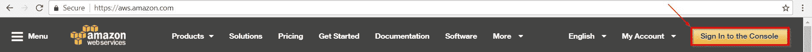

一旦您登录控制台，您将看到一个展示 AWS 提供的服务的网页：

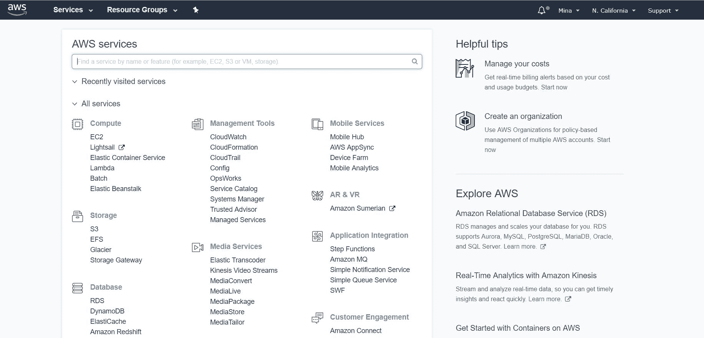

# AWS 命令行界面（CLI）

AWS CLI 是一个开源工具，提供与 AWS 服务交互的命令。AWS CLI 是跨平台的；它可以在 Linux、macOS 和 Windows 上运行。在本章中，我们将使用该工具执行某些任务，例如从`S3`文件夹复制文件到 EC2 实例。AWS CLI 可以执行类似于 AWS 控制台执行的任务；这包括 AWS 服务的配置、部署和监控。该工具可以在以下网址找到：[`aws.amazon.com/cli/`](https://aws.amazon.com/cli/)。

# AWS 区域和可用区

AWS 服务托管在世界各地的多个地理位置。在 AWS 世界中，位置包括区域和可用区。每个区域是一个独立的地理位置。每个区域包含多个隔离的内部位置，称为可用区。一些服务 —— 例如 Amazon EC2，例如 —— 让您完全控制要为您的服务部署使用哪些区域。您还可以在区域之间复制资源。您可以在以下网址找到可用的 AWS 区域列表：[`docs.aws.amazon.com/AWSEC2/latest/UserGuide/using-regions-availability-zones.html#concepts-available-regions`](http://docs.aws.amazon.com/AWSEC2/latest/UserGuide/using-regions-availability-zones.html#concepts-available-regions)。

对于在 AWS 中进行复杂应用程序部署的开发人员，他们通常将其微服务部署到多个区域。这样可以确保即使某个区域的亚马逊数据中心遭受故障，应用程序也能享受高可用性。

# AWS 标签

AWS 标签是 AWS 宇宙中的另一个重要概念。它允许您正确分类您的不同 AWS 资源。这非常有用，特别是当您为不同的事物使用多个 AWS 服务时。例如，您可以设置一个或多个标签来识别您用于移动应用程序的`S3`存储桶。然后可以使用相同的标签来识别您用于该移动应用程序后端的 EC2 实例。标签是键值对；值是可选的。

更好地理解 AWS 标签的资源可以在以下网址找到：[`aws.amazon.com/answers/account-management/aws-tagging-strategies/`](https://aws.amazon.com/answers/account-management/aws-tagging-strategies/)。

# AWS 弹性 Beanstalk

在我们开始实际深入研究 AWS 服务之前，有必要提到 AWS 生态系统中一个有用的服务，称为*弹性 Beanstalk*。该服务的目的是通过 AWS 控制台提供一个易于使用的配置向导，让您可以快速在 AWS 上部署和扩展您的应用程序。

这项服务在多种场景中都很有用，我们鼓励读者在阅读本章和本书的下一章之后探索它。然而，在本书中我们不会专注于 Elastic Beanstalk。这是因为本书在涉及 AWS 时的目的是为您提供关于主要 AWS 服务内部工作的实用基础知识。这些知识将使您不仅能够在 AWS 上部署和运行应用程序，还能够对事物的运作有很好的把握，并在必要时进行调整。这些基础知识也是您需要将技能提升到本书之外的下一个水平所需的。

涵盖 AWS Beanstalk 而不深入探讨使 AWS 成为开发人员的绝佳选择的关键 AWS 服务将不足以让您获得足够的知识以长期有效。然而，如果您在阅读本章和本书的下一章之后再看 AWS Beanstalk，您将能够理解幕后发生了什么。

该服务可以在[`aws.amazon.com/elasticbeanstalk/`](https://aws.amazon.com/elasticbeanstalk/)找到。

# AWS 服务

现在，是时候学习如何利用 Go 的力量与 AWS 交互并构建云原生应用程序了。在本节中，我们将开始实际深入一些构建现代生产级云应用程序所需的 AWS 服务。

# AWS SDK for Go

如前所述，AWS SDK for Go 是一组库，使 Go 能够展现 AWS 的强大功能。为了利用 SDK，我们首先需要了解一些关键概念。

我们需要做的第一步是安装 AWS SDK for Go；通过运行以下命令来完成：

```go
go get -u github.com/aws/aws-sdk-go/...
```

像任何其他 Go 包一样，这个命令将在我们的开发机器上部署 AWS SDK 库。

# 配置 AWS 区域

第二步是指定 AWS 区域；这有助于确定在进行调用时发送 SDK 请求的位置。SDK 没有默认区域，这就是为什么我们必须指定一个区域。有两种方法可以做到这一点：

+   将区域值分配给名为`AWS_REGION`的环境变量。区域值的示例是`us-west-2`或`us-east-2`。

+   在代码中指定它——稍后会更多。

# 配置 AWS SDK 身份验证

第三步是实现适当的 AWS 身份验证；这一步更加复杂，但非常重要，以确保我们的代码与不同的 AWS 服务进行交互时的安全性。为了做到这一点，我们需要向我们的应用程序提供安全凭据，以便对 AWS 进行安全调用。

生成您需要使代码在通过 SDK 与 AWS 通信时正常工作的凭据有两种主要方法：

+   创建用户，它只是代表一个人或一个服务的身份。您可以直接为用户分配单独的权限，或将多个用户组合成一个允许用户共享权限的组。AWS SDK for Go 要求用户使用 AWS 访问密钥来对发送到 AWS 的请求进行身份验证。AWS 访问密钥由两部分组成：访问密钥 ID 和秘密访问密钥。这是我们在本地服务器上运行应用程序时使用的内容。

+   下一种方法是创建一个角色。角色与用户非常相似，因为它是具有特定权限的身份。然而，角色不是分配给人员的；它是根据特定条件分配给需要它的人员。例如，可以将角色附加到 EC2 实例，这将允许在该 EC2 实例上运行的应用程序进行安全调用 AWS，而无需指定不同的用户。这是在 EC2 实例上运行应用程序时的推荐方法，其中预期应用程序将进行 AWS API 调用。

# 创建 IAM 用户

如果您是从自己的本地计算机运行应用程序，创建访问密钥的推荐方式是创建一个具有特定权限访问 AWS 服务的用户。这是通过在**AWS 身份和访问管理**（**IAM**）中创建用户来完成的。

要在 IAM 中创建用户，我们首先需要登录到 AWS 主要网络控制台，然后点击 IAM，它应该在“安全性、身份和合规性”类别下：

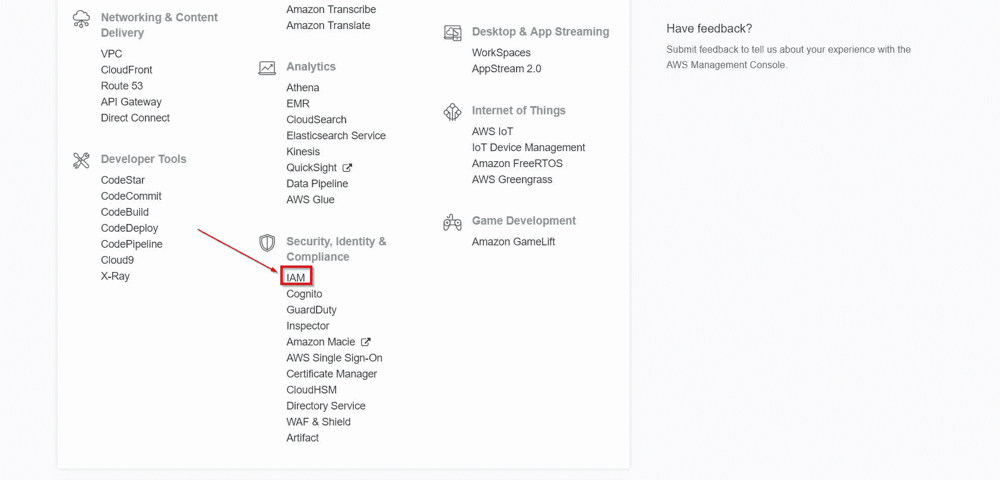

接下来，我们需要点击右侧的“用户”选项，然后点击“添加用户”来创建一个新的 IAM 用户：

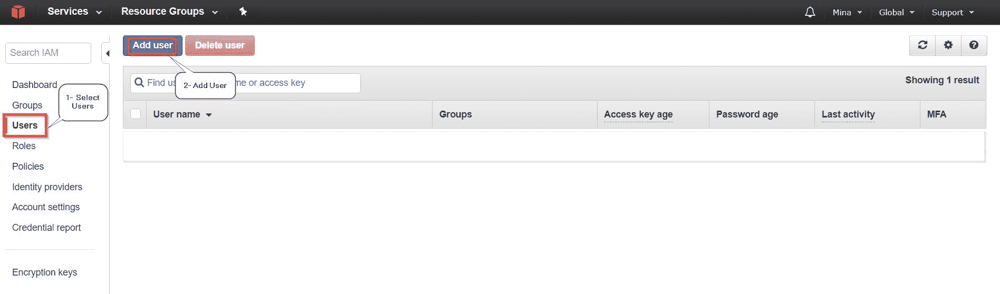

然后，您将被引导使用用户创建向导来帮助您创建用户并生成访问密钥。在此向导的第一步中，您将可以选择用户名并选择用户的 AWS 访问类型。AWS 访问类型包括两种主要类型：程序访问或 AWS 管理控制台访问。显然，为了创建可以被 AWS SDK 使用的用户，我们需要选择程序访问，如下所示：

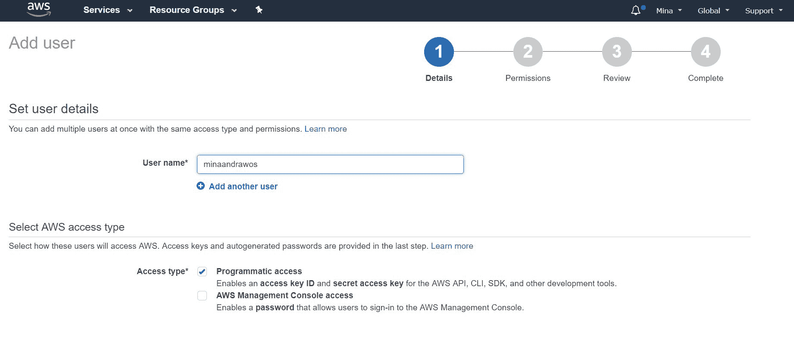

下一步将涉及将权限附加到正在创建的用户。然而，在我们讨论三种方法之前，我们首先需要了解策略的概念。策略只是定义权限的一种灵活方法。例如，可以创建一个新策略来定义对特定 S3 文件夹的只读访问权限。然后，任何获得此策略附加的用户或组将只被允许对此特定 S3 文件夹进行只读访问。AWS 提供了许多预创建的策略，我们可以在我们的配置中使用。例如，有一个名为**AmazonS3FullAccess**的策略，允许其持有者对 S3 进行完全访问。现在，让我们回到为用户分配权限的三种方法：

+   **将用户添加到组中**：组是一个可以拥有自己策略的实体。多个用户可以添加到一个或多个组中。您可以将组简单地看作是用户的文件夹。特定组下的用户将享有所述组策略允许的所有权限。在这一步中的配置向导将允许您创建一个新组并为其分配策略，如果需要的话。这通常是分配权限给用户的推荐方式。

+   **从现有用户复制权限**：这允许新用户享有已为不同用户配置的所有组和策略。例如，将用户添加到新团队中时使用。

+   **直接附加现有策略**：这允许直接将策略分配给新用户，而无需经过组或从其他用户复制。这种方法的缺点是，如果每个用户都被分配了个别的策略，而没有组提供的秩序感，随着用户数量的增加，管理用户将变得繁琐。

以下是三个选项的截图：

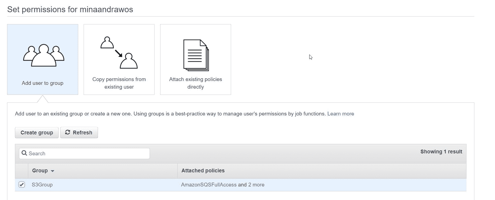

完成权限设置后，我们可以审查我们的选择并继续创建新用户。一旦创建了新用户，我们将有一个选项来下载用户的访问密钥作为 CSV 文件。我们必须这样做才能在以后的应用程序中利用这些访问密钥。访问密钥由访问密钥 ID 和秘密访问密钥值组成。

一旦您获得了访问密钥，有多种方法可以让您的代码使用它们；我们将讨论其中的三种：

**直接使用环境变量**：AWS SDK 代码将查找两个主要的环境变量，以及一个可选的第三个环境变量。我们只讨论两个主要的环境变量：

+   `AWS_ACCESS_KEY_ID`：在这里我们设置访问密钥的密钥 ID

+   `AWS_SECRET_ACCESS_KEY`：在这里我们设置访问密钥的秘密密钥值

环境变量通常在 SDK 默认情况下在移动到下一个方法之前进行检查。

**利用凭证文件**：凭证文件是一个存放访问密钥的纯文本文件。该文件必须命名为`credentials`，并且必须位于计算机主目录的`.aws/`文件夹中。主目录显然会根据您的操作系统而变化。在 Windows 中，您可以使用环境变量`%UserProfile%`指定主目录。在 Unix 平台上，您可以使用名为`$HOME`或`~`的环境变量。凭证文件是`.ini`格式的，可能如下所示：

```go
[default]
aws_access_key_id = <YOUR_DEFAULT_ACCESS_KEY_ID>
aws_secret_access_key = <YOUR_DEFAULT_SECRET_ACCESS_KEY>

[test-account]
aws_access_key_id = <YOUR_TEST_ACCESS_KEY_ID>
aws_secret_access_key = <YOUR_TEST_SECRET_ACCESS_KEY>

[prod-account]
; work profile
aws_access_key_id = <YOUR_PROD_ACCESS_KEY_ID>
aws_secret_access_key = <YOUR_PROD_SECRET_ACCESS_KEY>
```

方括号之间的名称称为**配置文件**。如前面的片段所示，您的凭证文件可以指定映射到不同配置文件的不同访问密钥。然而，接下来出现一个重要问题，那就是我们的应用程序应该使用哪个配置文件？为此，我们需要创建一个名为`AWS_PROFILE`的环境变量，该变量将指定配置文件名称和分配给其的应用程序名称。例如，假设我们的应用程序名为`testAWSapp`，我们希望它使用`test-account`配置文件，那么我们将设置`AWS_PROFILE`环境变量如下：

```go
$ AWS_PROFILE=test-account testAWSapp
```

如果未设置`AWS_PROFILE`环境变量，则默认情况下将选择*default*配置文件。

**在应用程序中硬编码访问密钥**：出于安全原因，通常不建议这样做。因此，尽管从技术上讲是可能的，但不要在任何生产系统中尝试这样做，因为任何可以访问您的应用程序代码（可能在 GitHub 中）的人都可以检索并使用您的访问密钥。

# 创建 IAM 角色

如前所述，如果您的应用程序在 Amazon EC2 实例上运行，则建议使用 IAM 角色。通过 AWS 控制台创建 IAM 角色的过程与创建 IAM 用户类似：

1.  首先登录到 AWS 控制台（[aws.amazon.com](http://aws.amazon.com)）

1.  然后我们从“安全，身份和合规性”类别下选择 IAM

从那里，我们将走另一条路。这一次，我们点击右侧的“角色”，然后选择“创建新角色”：

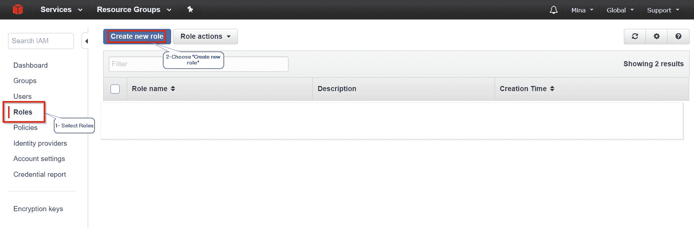

选择创建新角色后，我们将得到角色创建向导。

我们首先被要求选择角色类型。对于我们的情况，我们需要选择 EC2 服务角色，然后选择 Amazon EC2：

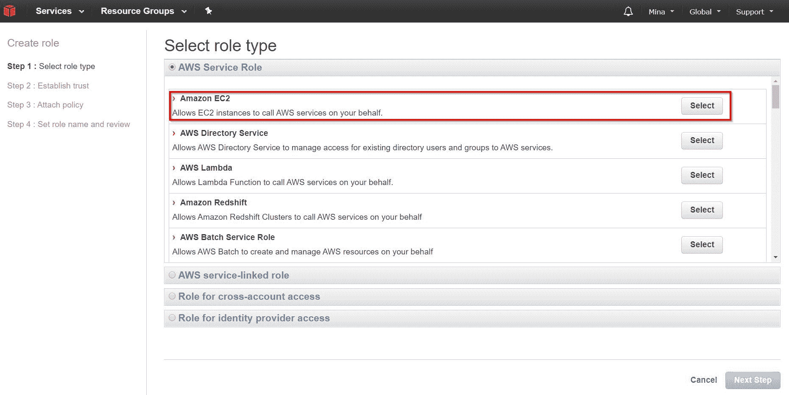

然后，我们将点击下一步。然后，我们需要选择我们的新角色将使用的策略：

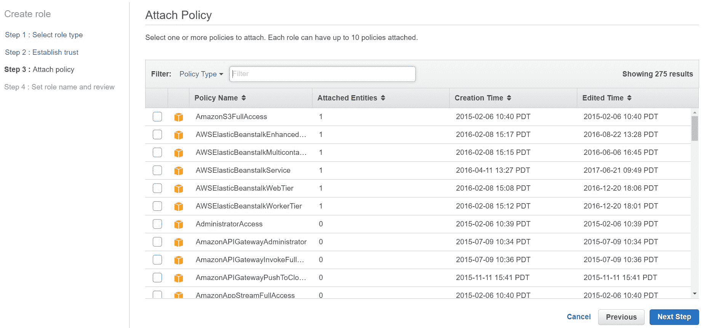

为了我们的应用程序，让我们选择以下四个策略：

+   AmazonS3FullAccess

+   AmazonSQSFullAccess

+   AmazonDynamoDBFullAccess

+   AmazonAPIGatewayAdministrator

然后，我们再次点击下一步，然后我们进入最后一步，在这一步中我们可以设置角色名称，审查我们的配置，然后点击“创建角色”来创建一个新角色。为了我们的目的，我创建了一个名为`EC2_S3_API_SQS_Dynamo`的新角色：

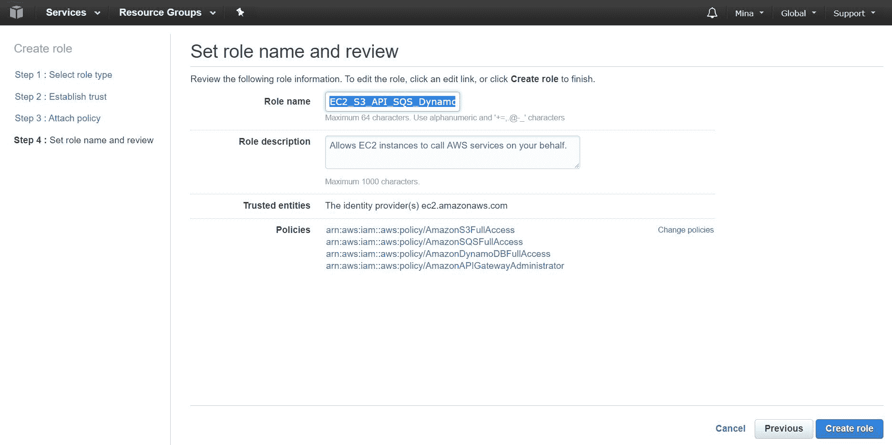

一旦我们点击“创建角色”，一个具有我们选择的策略的新角色就会被创建。

然后可以将此角色附加到 EC2 实例上，我们的应用程序代码将在其中运行。我们将在 EC2 部分探讨如何做到这一点。

# AWS SDK for Go 的基础知识

为了利用 AWS SDK for Go 的功能，我们需要掌握两个关键概念。

# 会话

第一个概念是会话的概念。会话是 SDK 中包含配置信息的对象，我们可以将其与其他对象一起使用，以与 AWS 服务进行通信。

`session`对象可以被共享并被不同的代码片段使用。应该缓存并重复使用该对象。创建新的`session`对象涉及加载配置数据，因此重用它可以节省资源。只要不被修改，`session`对象就可以安全地并发使用。

要创建一个新的`session`对象，我们可以简单地编写以下代码：

```go
session, err := session.NewSession()
```

这将创建一个新的`session`并将其存储在名为 session 的变量中。如果我们通过上述代码创建一个新的`session`，将使用默认配置。如果需要覆盖配置，可以将`aws.Config`类型结构体的对象指针作为参数传递给`NewSession()`结构体。假设我们想设置`Region`：

```go
session, err := session.NewSession(&aws.Config{
    Region: aws.String("us-east-2"),
})
```

我们可以使用另一个构造函数来创建一个新的会话，称为`NewSessionWithOptions()`；这有助于覆盖我们用于提供创建会话所需信息的一些环境变量。例如，我们之前讨论过如何定义一个配置文件来存储应用程序使用的凭据。这是它的样子：

```go
session,err := session.NewSessionWithOptions(session.Options{
   Profile: "test-account",
})
```

# 服务客户端

第二个概念是服务客户端的概念。服务客户端是一个对象，它提供对特定 AWS 服务（如 S3 或 SQS）的 API 访问。

服务客户端对象是从会话对象创建的。以下是一个利用 S3 服务客户端获取存储桶列表（S3 存储桶只是文件和文件夹的容器）并逐个打印每个存储桶名称的代码片段示例：

```go
//Don't forget to import github.com/aws/aws-sdk-go/service/s3

 sess, err := session.NewSession(&aws.Config{
    Region: aws.String("us-west-1"),
  })
  if err != nil {
    log.Fatal(err)
  }
  s3Svc := s3.New(sess)
  results, err := s3Svc.ListBuckets(nil)
  if err != nil {
    log.Fatal("Unable to get bucket list")
  }

  fmt.Println("Buckets:")
  for _, b := range results.Buckets {
    log.Printf("Bucket: %s \n", aws.StringValue(b.Name))
  }
```

只要确保不在并发代码中更改配置，服务客户端对象通常是安全的并发使用。

在底层，服务客户端使用 Restful API 调用与 AWS 进行交互。但是，它们会为您处理构建和保护 HTTP 请求所涉及的所有繁琐代码。

当我们阅读本章和下一章时，我们将创建会话和服务客户端对象，以访问不同的 AWS 服务。会话和服务客户端是我们构建适当的 AWS 云原生应用程序所需的构建代码块。SDK 允许您深入了解底层请求；如果我们想在发送请求之前执行一些操作，这通常是有帮助的。

AWS SDK 的大多数 API 方法调用都遵循以下模式：

1.  API 方法的名称通常描述某个操作。例如，假设我们有一个**简单队列服务**（**SQS**）服务客户端对象，并且我们需要获取特定队列的 URL 地址。方法名称将是`GetQueueUrl`。

1.  API 方法的输入参数通常类似于`<method name>Input`；因此，在`GetQueueUrl`方法的情况下，其输入类型是`GetQueueUrlInput`。

1.  API 方法的输出类型通常类似于<method name>Output；因此，在`GetQueueURL`方法的情况下，其输出类型是`GetQueueUrlOutput`。

# 本机数据类型

关于 SDK 方法的另一个重要说明是，几乎所有用作参数或结构字段的数据类型都是指针，即使数据类型是本机的。例如，SDK 倾向于使用`*`string 而不是使用字符串数据类型来表示字符串值，整数和其他类型也是如此。为了让开发人员的生活更轻松，AWS SDK 为 Go 提供了帮助方法，用于在确保执行 nil 检查以避免运行时恐慌的同时，在本机数据类型和它们的指针之间进行转换。

将本机数据类型转换为相同数据类型的指针的帮助方法遵循以下模式：`aws.<datatype>`。例如，如果我们调用`aws.String("hello")`，该方法将返回一个指向存储`Hello`值的字符串的指针。如果我们调用`aws.Int(1)`，该方法将返回一个值为 1 的 int 的指针。

另一方面，将指针转换回其数据类型的方法在进行 nil 检查时遵循以下模式：`aws.<datatype>Value`。例如，如果我们调用`aws.IntValue(p)`，其中`p`是值为 1 的 int 指针，返回的结果就是一个值为 1 的 int。为了进一步澄清，以下是 SDK 代码中`aws.IntValue`的实现：

```go
func IntValue(v *int) int {
  if v != nil {
    return *v
  }
  return 0
}
```

# 共享配置

由于不同的微服务可能需要在与 AWS 交互时使用相同的配置设置，AWS 提供了一种使用所谓的共享配置的选项。共享配置基本上是一个存储在本地的配置文件。文件名和路径是`.aws/config`。请记住，`.aws`文件夹将存在于操作系统的主文件夹中；在讨论凭据文件时已经涵盖了该文件夹。

配置文件应遵循类似于凭据文件的 ini 格式。它还支持与我们之前在凭据文件中介绍的方式类似的配置文件中的配置文件。以下是`.aws/config`应该是什么样子的示例：

```go
[default]
region=us-west-2
```

为了让特定服务器中的微服务能够使用该服务器的 AWS 配置文件，有两种方法：

1.  将`AWS_SDK_LOAD_CONFIG`环境变量设置为 true；这将导致 SDK 代码使用配置文件。

1.  创建会话对象时，利用`NewSessionWithOptions`构造函数来启用共享配置。代码如下：

```go
sess, err := session.NewSessionWithOptions(session.Options{
    SharedConfigState: SharedConfigEnable,
})
```

有关完整的 AWS Go SDK 文档，您可以访问[`docs.aws.amazon.com/sdk-for-go/api/`](https://docs.aws.amazon.com/sdk-for-go/api/)。

# 分页方法

一些 API 操作可能会返回大量结果。例如，假设我们需要发出 API 调用来从 S3 存储桶中检索项目列表。现在，假设 S3 存储桶包含大量项目，并且在一个 API 调用中返回所有项目是不高效的。AWS Go SDK 提供了一个名为**Pagination**的功能来帮助处理这种情况。通过分页，您可以在多个页面中获取结果。

您可以一次读取每页，然后在准备处理新项目时转到下一页。支持分页的 API 调用类似于<方法名称>Pages。例如，与`ListObjects` S3 方法对应的分页 API 方法调用是`ListObjectsPages`。`ListObjectPages`方法将迭代从`ListObject`操作结果的页面。它接受两个参数——第一个参数是`ListObjectInput`类型，它将告诉`ListObjectPages`我们要读取的 S3 存储桶的名称，以及我们希望每页的最大键数。第二个参数是一个函数，每页的响应数据都会调用该函数。函数签名如下：

```go
func(*ListObjectsOutput, bool) bool
```

此参数函数有两个参数。第一个参数携带我们操作的结果；在我们的情况下，结果将托管在`ListObjectsOutput`类型的对象中。第二个参数是`bool`类型，基本上是一个标志，如果我们在最后一页，则为 true。函数返回类型是`bool`；我们可以使用返回值来停止迭代页面。这意味着每当我们返回 false 时，分页将停止。

以下是 SDK 文档中的一个示例，完美展示了分页功能，利用了我们讨论过的方法。以下代码将使用分页功能来浏览存储在 S3 存储桶中的项目列表。我们将每页请求最多 10 个键。我们将打印每页的对象键，然后在最多浏览三页后退出。代码如下：

```go
svc, err := s3.NewSession(sess)
if err != nil {
    fmt.Println("Error creating session ", err)
}
inputparams := &s3.ListObjectsInput{
    Bucket: aws.String("mybucket"),
    MaxKeys: aws.Int64(10),
}
pageNum := 0
svc.ListObjectsPages(inputparams, func(page *s3.ListObjectsOutput, lastPage bool) bool {
    pageNum++
    for _, value := range page.Contents {
        fmt.Println(*value.Key)
    }
    return pageNum < 3
})
```

# 等待者

等待器是允许我们等待直到某个操作完成的 API 调用。大多数等待方法通常遵循 WaitUntil<action> 格式。例如，在使用 DynamoDB 数据库时，有一个名为`WaitUntilTableExists`的 API 方法调用，它将简单地等待直到满足条件。

# 处理错误

AWS Go SDK 返回`awserr.Error`类型的错误，这是 AWS SDK 中的特殊接口类型，满足通用的 Go 错误接口类型。`awserr.Error`支持三种主要方法：

+   `Code()`: 返回与问题相关的错误代码

+   `Message()`: 返回错误的字符串描述

+   `OrigErr()`: 返回包装在`awserr.Error`类型中的原始错误；例如，如果问题与网络有关，`OrigErr()`将返回原始错误，该错误可能属于 Go net 包

为了暴露和利用`awserr.Error`类型，我们需要使用 Go 语言中的类型断言功能。

让我们展示如何使用实际示例中的`awserr.Error`类型。假设在我们的应用程序中，我们使用 Dynamodb 服务客户端对象通过项目 ID 从 Dynamodb 表中检索项目。但是，我们在表名中犯了一个错误，现在它不存在，这将导致调用失败。代码如下：

```go
    result, err := dynamodbsvc.GetItem(&dynamodb.GetItemInput{
      Key: map[string]*dynamodb.AttributeValue{
        "ID": {
          N: aws.String("9485"),
        },
      },
      TableName: aws.String("bla"),
    })
    if err != nil {
      if v, ok := err.(awserr.Error); ok {
        log.Println("AWS ERROR...")
        if v.Code() == dynamodb.ErrCodeResourceNotFoundException {
          log.Println("Requested resource was not found...")
          return
        }
      }
    }
```

从上述代码中，如果`dynamodbsvc.GetItem()`方法失败并且我们无法获取该项，我们捕获错误是否发生，然后使用 Go 的类型断言从我们的错误对象中获取底层的`awserr.Error`类型。然后我们继续检查错误代码并将其与我们的 SDK 中指示资源未找到问题的错误代码进行比较。如果确实是资源未找到的问题，我们打印一条指示这样的消息然后返回。以下是前面的代码中我们进行错误检测和处理的具体代码段，如当前段落所述：

```go
    if err != nil {
      if v, ok := err.(awserr.Error); ok {
        log.Println("AWS ERROR...")
        if v.Code() == dynamodb.ErrCodeResourceNotFoundException {
          log.Println("Requested resource was not found...")
          return
        }
      }
    }
```

# 弹性计算云（EC2）

与任何其他 AWS 服务一样，我们将从 AWS 控制台开始，以便能够启动和部署 EC2 实例。如前所述，EC2 简单地可以描述为在 AWS 上需要旋转新服务器实例时使用的服务。让我们探索创建和访问 EC2 实例所需的步骤。

# 创建 EC2 实例

在 AWS 控制台的主屏幕上，我们需要选择 EC2 以启动新的 EC2 实例：

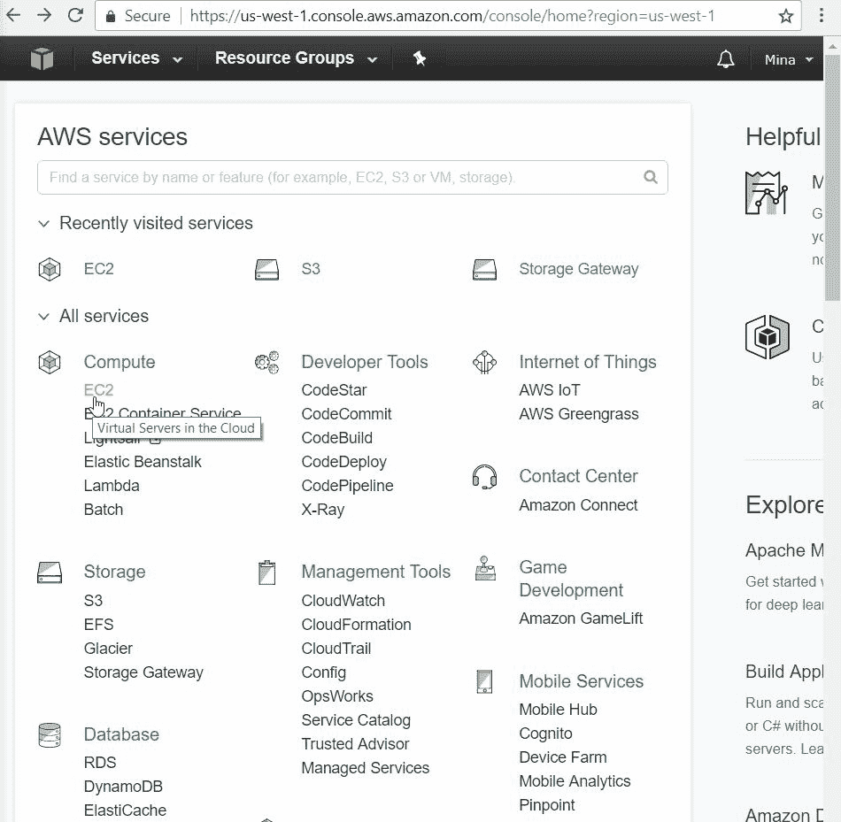

下一个屏幕将显示许多不同的选项来管理 EC2 实例。现在，我们需要做的是单击“启动实例”按钮。您会注意到 AWS 区域在这里显示：

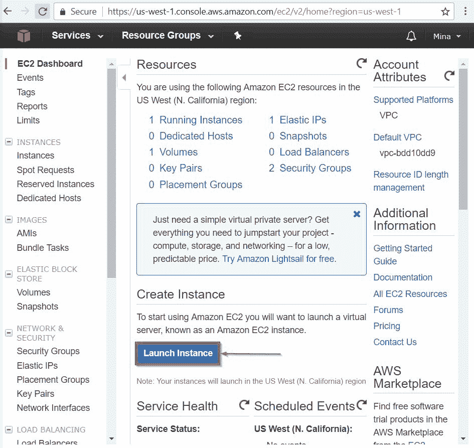

之后，我们将选择要在云上用作虚拟服务器的镜像。**Amazon Machine Image**（AMI）是一个缩写，用于描述 Amazon 虚拟服务器镜像以及启动所需的所有信息。AMI 包括一个模板，描述了操作系统、虚拟服务器中的应用程序、指定哪个 AWS 帐户可以使用 AMI 启动虚拟服务器实例的启动权限，以及指定一次启动后要附加到实例的卷的设备映射。亚马逊提供了许多现成的 AMI，我们可以立即使用。但是，您也可以创建自己的 AMI。

以下是 AWS 控制台中 AMI 选择屏幕的外观：

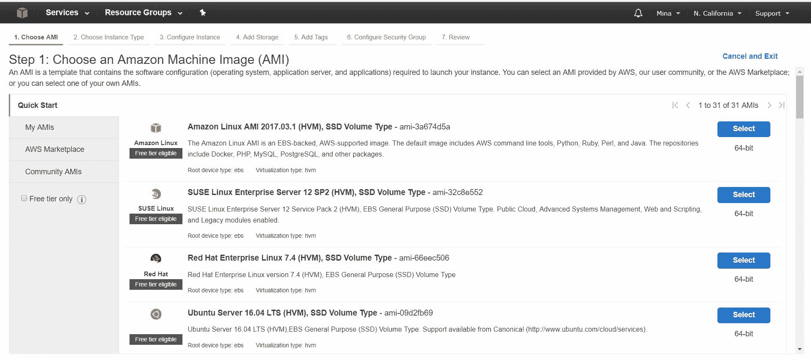

从 AMI 描述中可以看出，AMI 定义了操作系统、命令行工具、编程语言环境（如 Python、Ruby 和 Pert）。

现在，让我们选择亚马逊 Linux AMI 选项，以继续下一步。在这一步中，我们可以选择我们想要的服务器镜像。在这里，您可以选择 CPU 核心数、内存和网络性能等。您会注意到“EBS”一词位于“实例存储”下。**弹性块存储**（**EBS**）提供云托管存储卷，并提供高可用性、可扩展性和耐用性。每个 EBS 都在其可用性区域内复制。

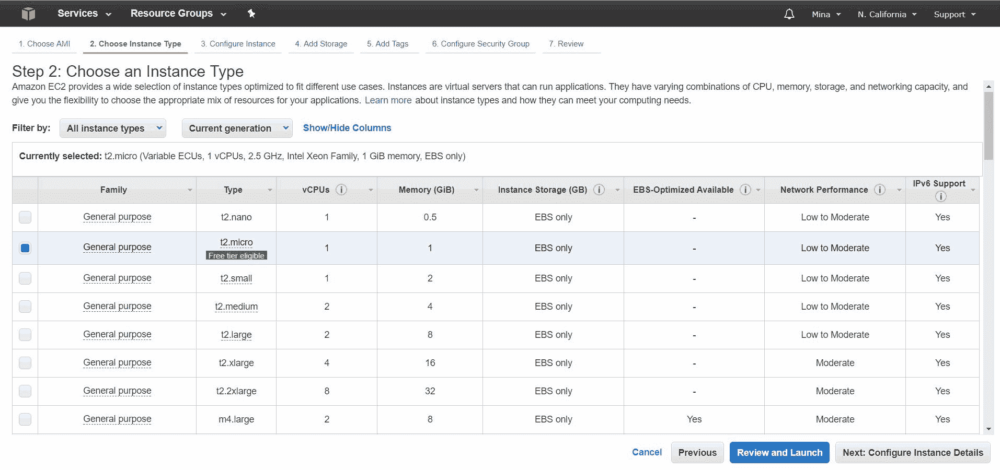

接下来，我们可以点击“审阅并启动”按钮来启动 AMI，或者点击“下一步：配置实例详细信息”按钮来深入了解实例的配置选项。更深入的配置选项包括实例数量、子网、网络地址等。

配置实例详细信息也是我们为 EC2 分配 IAM 角色（我们之前讨论过的）的地方。我们在本章前面创建的 IAM 角色名为 EC2_S3_API_SQS_Dynamo，它将允许在此 EC2 实例上运行的应用程序访问 S3 服务、API 网关服务、SQS 服务和 Dynamo 数据库。配置页面将如下所示：

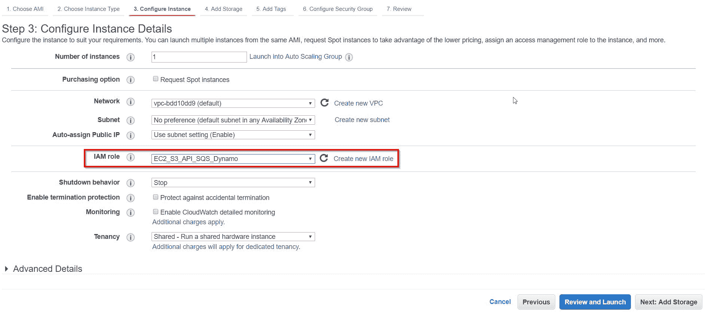

为了这一章的目的，我们将点击“审阅并启动”来审阅然后启动实例。让我们来看一下审阅页面：

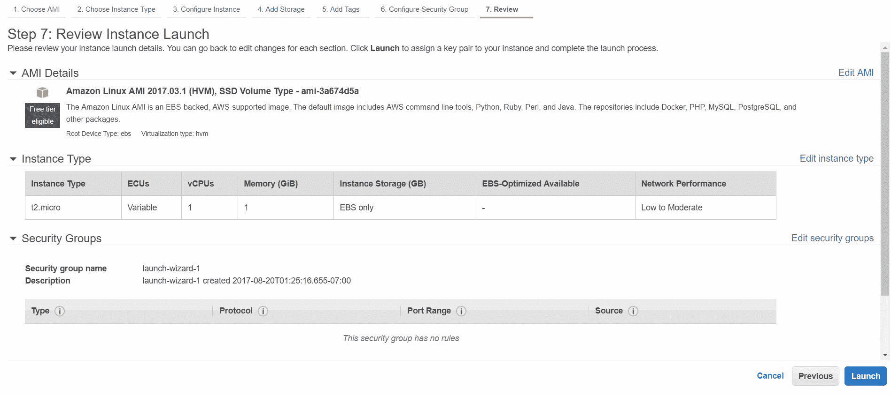

一旦我们对所有设置感到满意，我们可以继续点击“启动”。这将显示一个对话框，要求一个公钥-私钥对。公钥加密的概念在第三章中有更详细的讨论。简而言之，我们可以将公钥与其他人分享，以便他们在发送消息之前对其进行加密。加密的消息只能通过您拥有的私钥解密。

对于 AWS，为了允许开发人员安全地连接到他们的服务，AWS 要求开发人员选择公钥-私钥对以确保访问安全。公钥存储在 AWS 中，而私钥由开发人员存储。

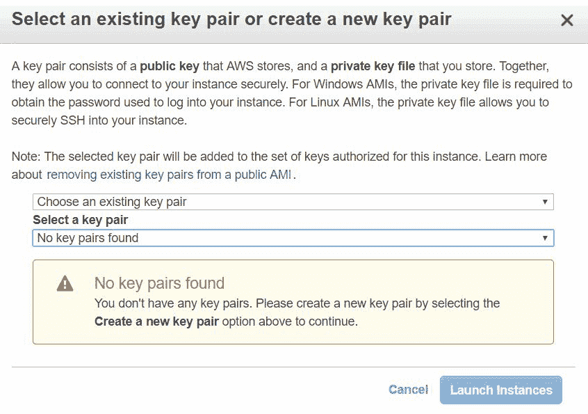

如果您还没有在 AWS 上拥有公钥-私钥对，这是我们可以创建的步骤。AWS 还允许您在不创建密钥的情况下继续，这显然会更不安全，不建议在生产应用中使用。让我们看看当我们点击第一个列表框时会得到的三个选项：

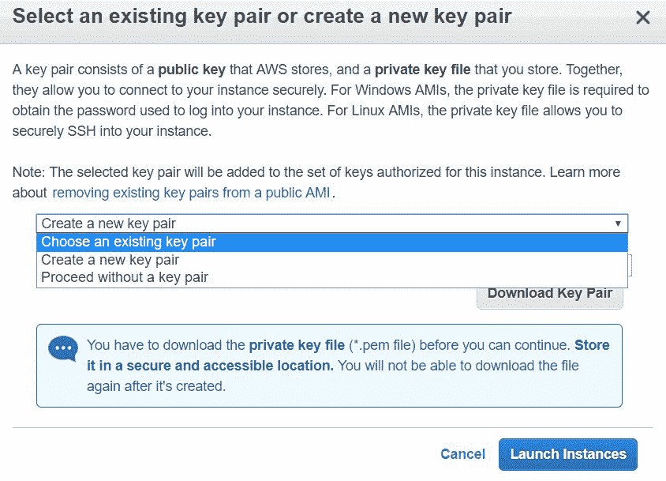

如果您选择创建新的密钥对选项，您将有机会命名您的密钥对并下载私钥。您必须下载私钥并将其存储在安全位置，以便以后使用：

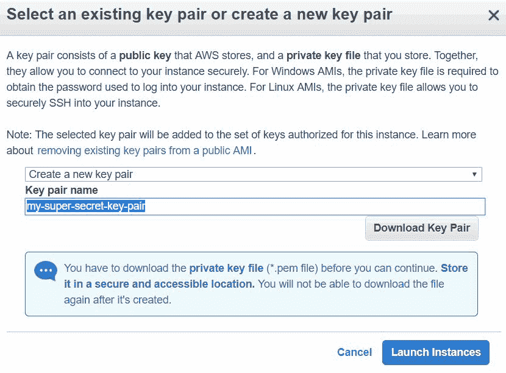

最后，在我们下载私钥并准备启动实例后，我们可以点击“启动实例”按钮。这将启动启动实例的过程，并显示状态指示。下一个屏幕通常是这样的：

>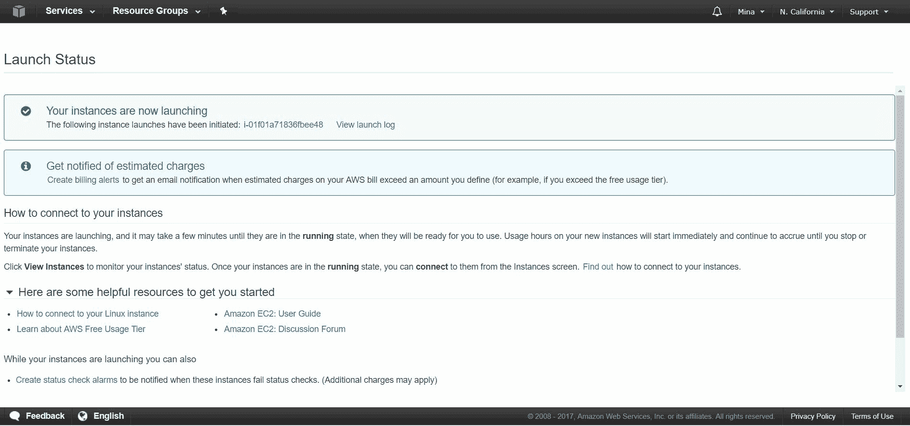

完美；通过这一步，我们在亚马逊云中拥有了我们自己的 Linux 虚拟机。让我们找出如何连接并探索它。

# 访问 EC2 实例

为了访问我们已经创建的 EC2 实例，我们需要首先登录 AWS 控制台，然后像之前一样选择 EC2。这将为您提供访问 EC2 仪表板的权限。从那里，我们需要点击实例，以访问我们帐户下当前创建的 EC2 实例。

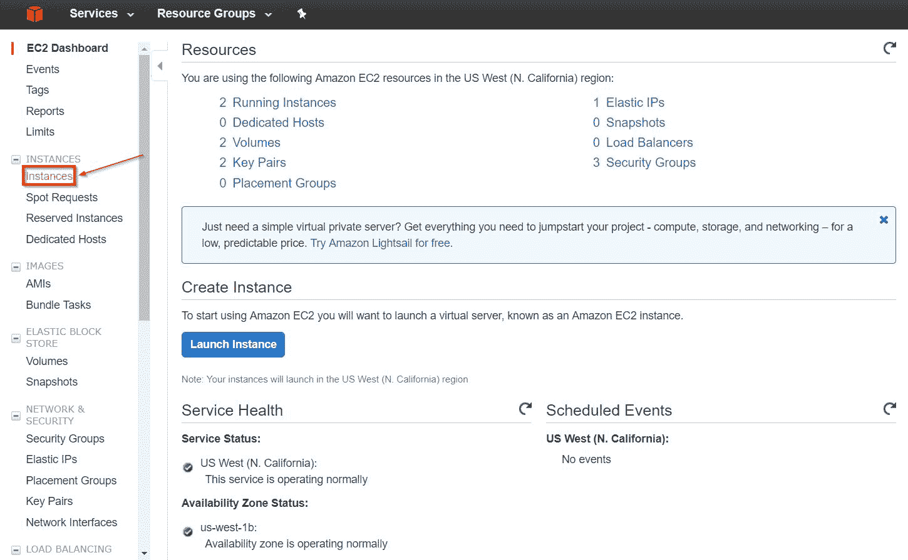

这将打开一个已经创建的 EC2 实例列表。我们刚刚创建的实例是第一个；您会注意到它的实例 ID 与我们之前创建实例时显示的实例 ID 相匹配。

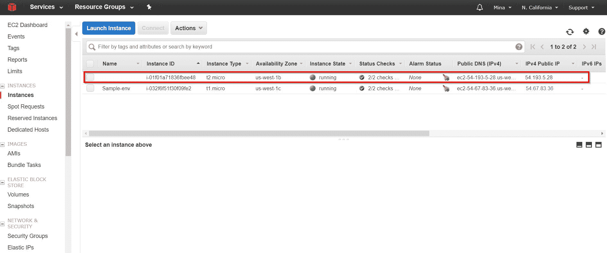

上述截图显示我们的实例目前正在 AWS 上运行。如果需要，我们可以像连接到任何远程服务器一样连接到它。让我们探讨如何做到这一点。

第一步是选择相关的实例，然后点击连接按钮。这不会直接连接到您的实例；但是，它会提供一系列有用的指令，说明如何建立与您的 EC2 实例的连接。为了建立连接，您需要使用 SSH 协议和之前下载的私人加密密钥远程登录到 EC2 虚拟服务器。**Secure Shell** (**SSH**) 是一种用户安全登录远程计算机的协议。

调用 SSH 的方法可能因操作系统而异。例如，如果您使用的是 Windows 操作系统，那么您应该使用流行的 PuTTY 工具（在 [`www.chiark.greenend.org.uk/~sgtatham/putty/latest.html`](https://www.chiark.greenend.org.uk/~sgtatham/putty/latest.html) 找到）来建立与 EC2 实例的 SSH 连接。如果您使用的是 macOS 或 Linux，您可以直接使用 SSH 命令。

# 从 Linux 或 macOS 机器访问 EC2 实例

为了从 Linux 或 macOS 机器访问在 AWS 上创建的 EC2 实例，我们需要使用 SSH 命令。

第一步是确保连接的私钥——我们在创建 EC2 实例时下载的——是安全的，不能被外部方访问。这通常是通过在终端上执行以下命令来完成的：

```go
chmod 400 my-super-secret-key-pair.pem
```

`my-super-secret-key-pair.pem` 是包含私钥的文件名。显然，如果文件名不同，那么您需要确保命令将针对正确的文件名。为了使上述命令生效，我们需要从与密钥所在的相同文件夹运行它。否则，我们需要指定密钥的路径。

在确保密钥受到公共访问的保护之后，我们需要使用 SSH 命令连接到我们的 EC2 实例。为此，我们需要三个信息：私钥文件名、EC2 镜像用户名和连接的 DNS 名称。我们已经知道了密钥文件名，这意味着我们现在需要找出连接的用户名和 DNS 名称。用户名将取决于 EC2 实例的操作系统。以下表显示了操作系统到用户名的映射：

| **操作系统** | **用户名** |
| --- | --- |
| 亚马逊 Linux | `ec2-user` |
| RHEL（Red Hat Enterprise Linux） | `ec2-user` 或 root |
| Ubuntu | ubuntu 或 root |
| Centos | centos |
| Fedora | `ec2-user` |
| SUSE | `ec2-user` 或 root |

对于其他操作系统，如果 `ec2-user` 或 root 无法使用，请与 **Amazon Machine Image** (**AMI**) 提供商确认。

现在，我们需要的剩下的信息是连接到 EC2 实例的 DNS 名称。我们可以通过简单地查看状态页面上的 EC2 实例详细信息来找到它：

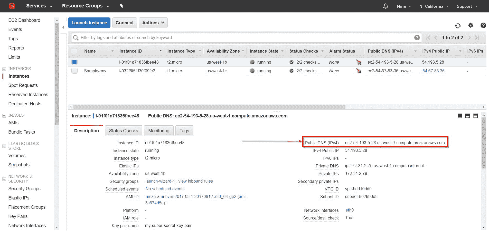

有了这个，我们就有了执行 SSH 命令访问我们的 EC2 实例所需的一切；命令如下所示：

```go
ssh -i "my-super-secret-key-pair.pem" ec2-user@ec2-54-193-5-28.us-west-1.compute.amazonaws.com
```

上述命令中的私钥名称是 `my-super-secret-key-pair.pem`，用户名是 `ec2-user`，DNS 是 `ec2-54-193-5-28.us-west-1.compute.amazonaws.com`。

这个命令将允许我们访问我们刚刚创建的 EC2 实例；屏幕上会显示如下内容：

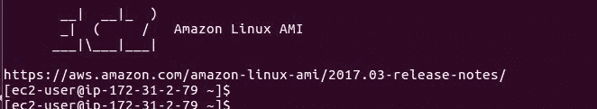

# 从 Windows 访问 EC2

要从 Windows 访问 EC2，我们可以使用我们在前一节中介绍的 SSH 工具的 Windows 版本，或者我们可以使用 PuTTY。PuTTY 是一个非常受欢迎的 SSH 和 telnet 客户端，可以在 Windows 或 Unix 上运行。要下载 PuTTY，我们需要访问[`www.chiark.greenend.org.uk/~sgtatham/PuTTY/latest.html`](https://www.chiark.greenend.org.uk/~sgtatham/putty/latest.html)。下载 PuTTY 后，安装并运行它，主屏幕将类似于这样：

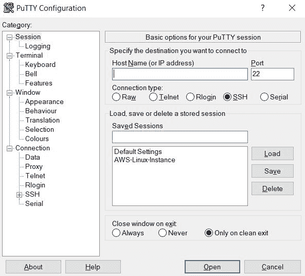

在我们可以使用 PuTTY 连接到我们的 EC2 实例之前，我们需要将之前获得的私钥文件转换为可以被 PuTTY 软件轻松消耗的不同文件类型。

要执行私钥转换，我们将需要一个名为**PuTTYgen**的工具的帮助，它随 PuTTY 一起安装。PuTTYgen 可以在所有程序>PuTTY>PuTTYgen 下找到。启动后，PuTTYgen 看起来像这样：

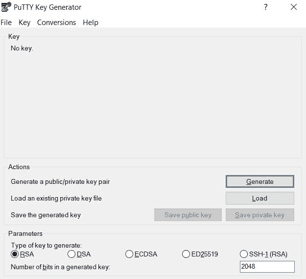

在参数下，确保选择 RSA 作为加密算法，生成的密钥中有 2048 位。

要继续，让我们点击“加载”按钮，以便能够将我们的 AWS 私钥加载到工具中。加载按钮将打开一个对话框，允许我们选择私钥文件。我们需要选择显示所有文件的选项，以便查看私钥文件：

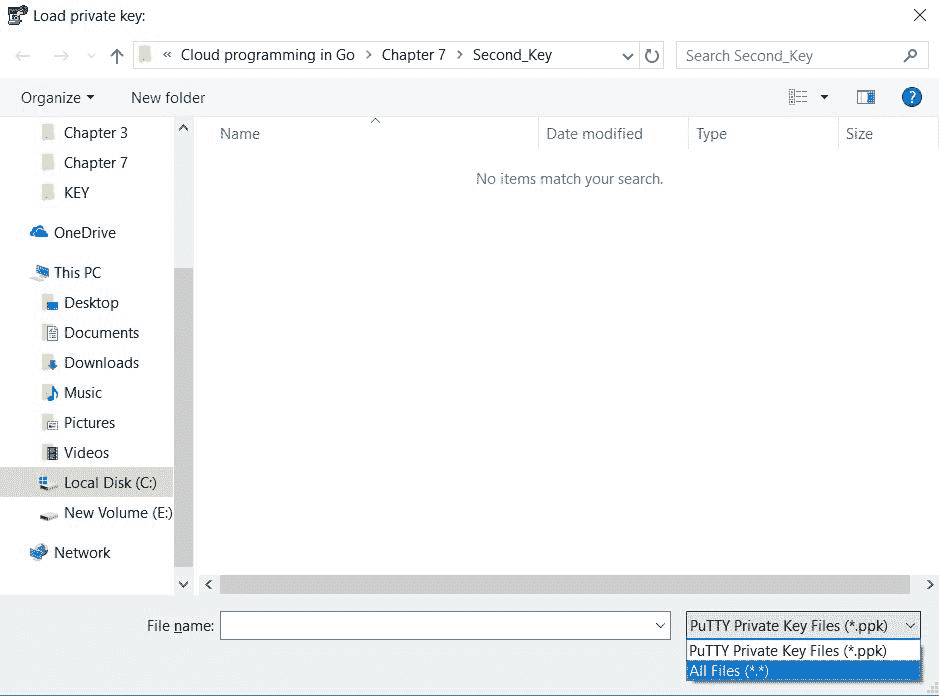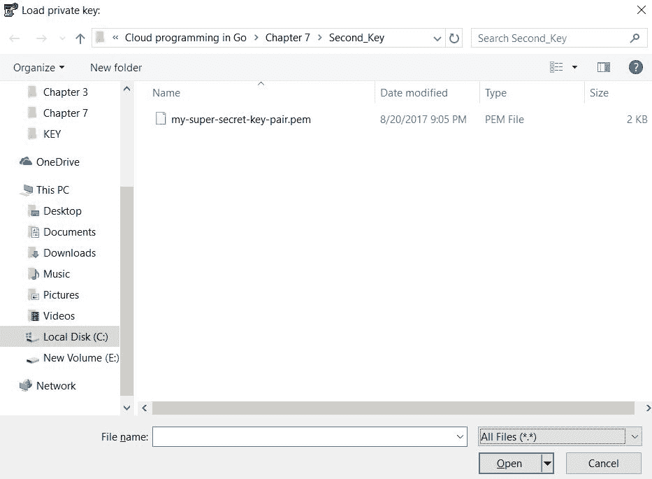

然后，我们可以选择密钥，然后点击“打开”，以便将密钥加载到 PuTTYgen 工具中。下一步是点击“保存私钥”以完成密钥转换。会出现一个警告，询问您是否确定要保存此密钥而不使用密码来保护它；点击“是”。密码是额外的保护层；但是，它需要用户输入才能工作。因此，如果我们想要自动化 SSH 连接到 EC2 实例，我们不应该启用密码。点击“是”后，我们可以选择转换文件的文件名；然后，我们点击“保存”以创建和保存文件。PuTTY 私钥是`*.ppk`类型的。

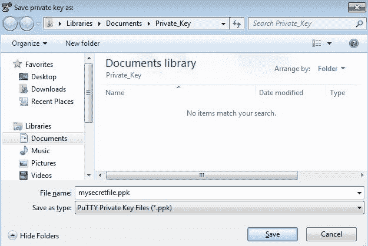

完美；我们现在有一个 PuTTY 私钥可以用于我们的用例。下一步是打开 PuTTY 工具，以使用此密钥通过 SSH 连接到 EC2 实例。

打开 PuTTY 后，我们需要转到连接类别下的 SSH 选项，然后从那里导航到 Auth 选项。在 Auth 窗口中，我们将搜索我们之前创建的 PuTTY 私钥文件的加载选项。

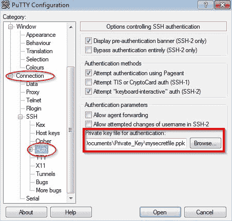

接下来，我们需要点击右侧的“会话”类别。然后，在右侧的“主机名（或 IP 地址）”字段下，我们需要输入用户名和公共 DNS 地址，格式如下：`用户名@DNS 公共`名称。在我们的情况下，看起来是这样的：`ec2-user@ec2-54-193-5-28.us-west-1.compute.amazonaws.com`：

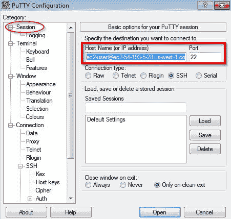

从那里，我们可以点击“打开”以打开到 EC2 实例的会话。第一次尝试打开会话时，我们会收到一条消息，询问我们是否信任我们要连接的服务器。如果我们信任它，我们需要点击“是”，这将把服务器的主机密钥缓存到注册表中。

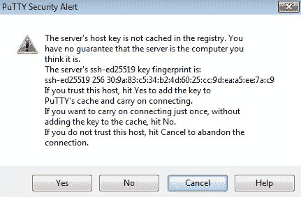

这将打开到我们的 EC2 实例的安全会话；然后我们可以随心所欲地使用它：

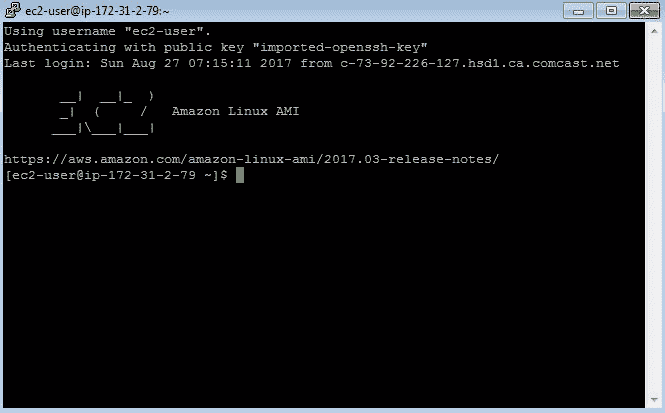

PuTTY 有保存现有会话信息的功能。完成配置后，我们可以选择一个名称，然后点击“另存为”，如下图所示，以保存会话信息：

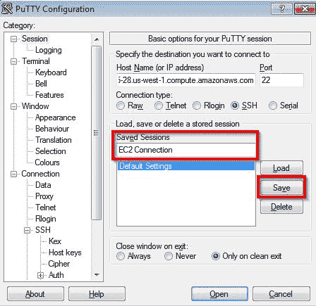

# 安全组

太好了！这足以涵盖如何在不同操作系统中配置和设置 EC2 实例的实用知识。现在，我们需要涵盖的另一个主题是安全组。您可以将安全组视为围绕您的 EC2 实例的防火墙规则集合。例如，通过添加安全规则，您可以允许在您的 EC2 上运行的应用程序接受 HTTP 流量。您可以创建规则以允许访问特定的 TCP 或 UDP 端口，以及其他更多内容。

由于我们预计将 Web 服务部署到我们的 EC2 实例上，比如*事件微服务*。我们需要创建一个允许 HTTP 流量的安全组，然后将该组分配给我们的 EC2 实例。

我们需要做的第一步是打开 EC2 仪表板，方法是转到 AWS 控制台主屏幕，然后选择 EC2，就像我们之前做的那样。一旦我们进入 EC2 仪表板，我们可以点击左侧的安全组，它将位于网络和安全类别下：

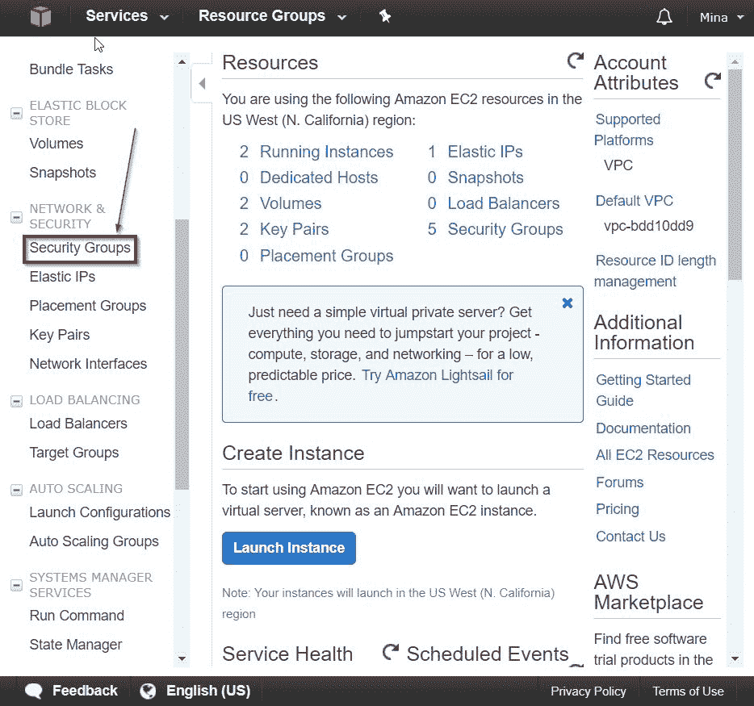

安全组仪表板将显示已经创建的所有安全组的列表。该仪表板允许我们创建新组或编辑现有组。由于在我们的情况下，我们正在创建一个新组，我们需要点击仪表板左上角的“创建安全组”。

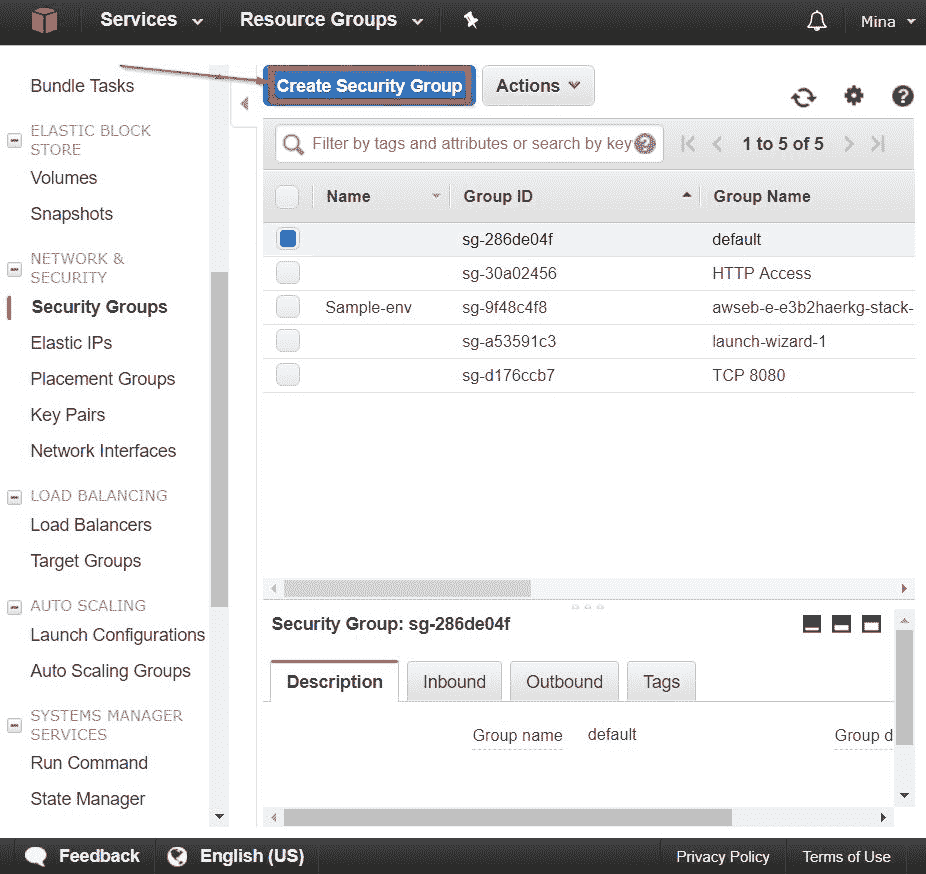

一个表单窗口将弹出，我们需要填写字段以创建我们的安全组。首先，我们需要为安全组提供一个名称，一个可选的描述，我们的安全组将应用的虚拟私有云的名称。虚拟私有云简单地定义为 AWS 云中的逻辑隔离部分；我们可以定义自己的。

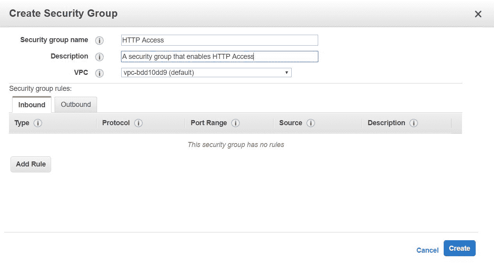

在前面的截图中，我们将我们的安全组命名为 HTTP 访问；我们将其描述为启用 HTTP 访问的安全组，然后我们选择默认 VPC。

下一步是点击“添加规则”按钮，开始定义组成我们安全组的规则。点击后，安全组规则部分将出现新行。我们需要点击“类型”列下的列表框，然后选择 HTTP。结果如下：

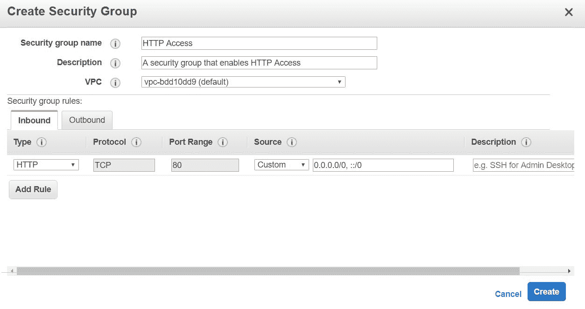

您会注意到协议、端口范围和源字段将为您填写。TCP 是 HTTP 的基础协议，端口 80 是 HTTP 端口。

如果需要，我们也可以添加一个 HTTPS 规则；我们将按照相同的步骤进行，只是在选择类型时，选择 HTTPS 而不是 HTTP。您还可以探索其他选项，以了解安全规则下可以创建哪些其他异常。

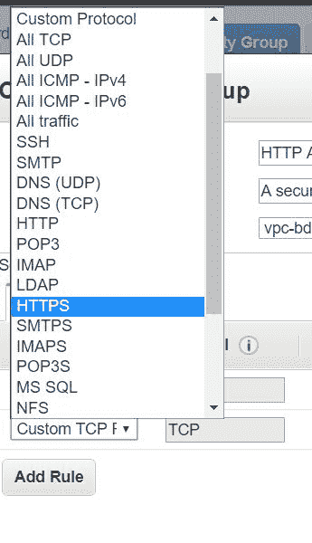

创建安全组后，我们将在我们的安全组列表中找到它：

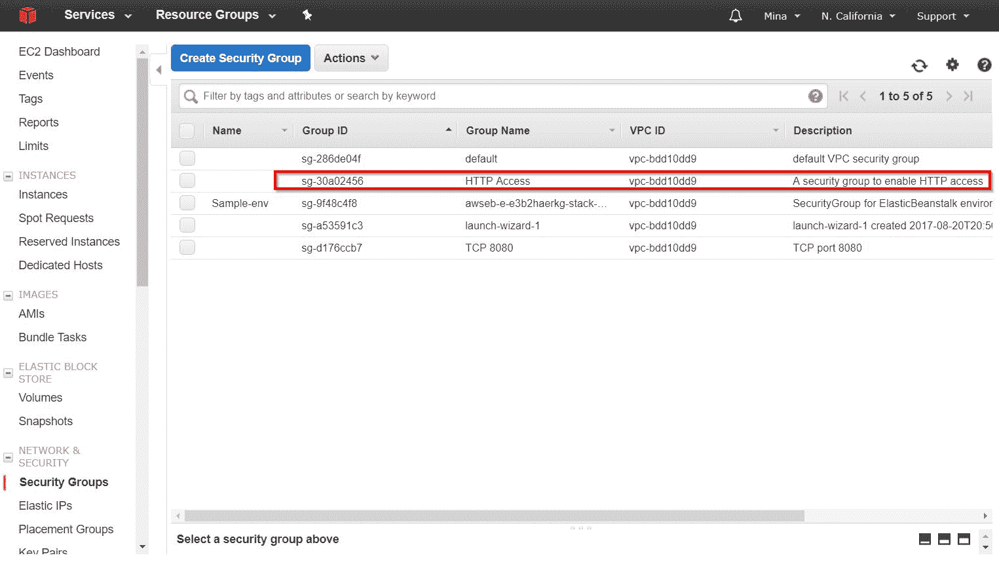

创建了安全组后，我们可以将其附加到现有的 EC2 实例。这是通过返回 EC2 仪表板，然后选择“运行中的实例”，然后从 EC2 实例列表中选择感兴趣的实例来完成的。然后，我们点击“操作”，然后“网络”，然后“更改安全组”：

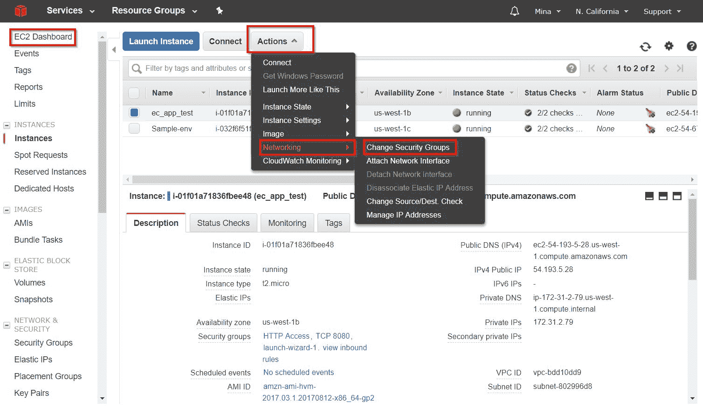

从那里，我们可以选择要附加到我们实例的安全组：

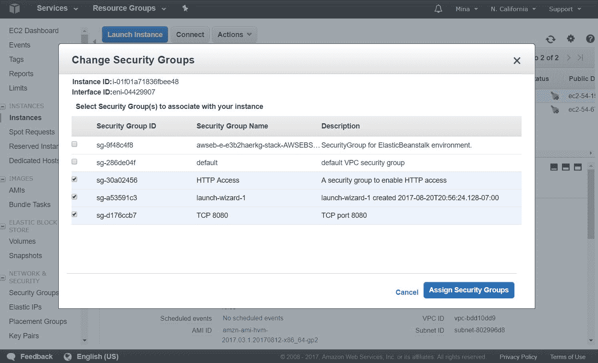

完美；有了这个，我们的 EC2 实例现在允许在其内部运行的应用程序访问 HTTP。

另一个重要的说明是，我们可以在创建 EC2 实例时将安全组分配给 EC2 实例。我们可以通过在创建新实例时点击“配置实例详细信息”，然后按照配置向导到“配置安全组”选项来访问此选项。

# 总结

在本章中，我们开始学习如何配置 EC2 以及如何使用 AWS SDK for Go。在下一章中，我们将继续深入了解 AWS，学习一些关键的 AWS 服务以及如何编写能够正确利用它们的 Go 代码。
