# AWS II–S3、SQS、API Gateway 和 DynamoDB

在本章中，我们将继续介绍亚马逊网络服务的大主题。在本章中，我们将介绍 S3 服务、SQS 服务、AWS API 网关服务和 DynamoDB 服务。这些服务中的每一个都是您在云上构建生产应用程序的强大工具。

我们将在本章中涵盖以下主题：

+   AWS S3 存储服务

+   SQS 消息队列服务

+   AWS API 网关服务

+   DynamoDB 数据库服务

# 简单存储服务（S3）

Amazon S3 是 AWS 负责存储和分析数据的服务。数据通常包括各种类型和形状的文件（包括音乐文件、照片、文本文件和视频文件）。例如，S3 可以用于存储静态数据的代码文件。让我们来看看如何在 AWS 中使用 S3 服务。

# 配置 S3

S3 服务将文件存储在存储桶中。每个存储桶可以直接保存文件，也可以包含多个文件夹，而每个文件夹又可以保存多个文件。

我们将使用 AWS Web 控制台来配置 S3，类似于我们在 EC2 中所做的。第一步是导航到 AWS Web 控制台，然后选择 S3：

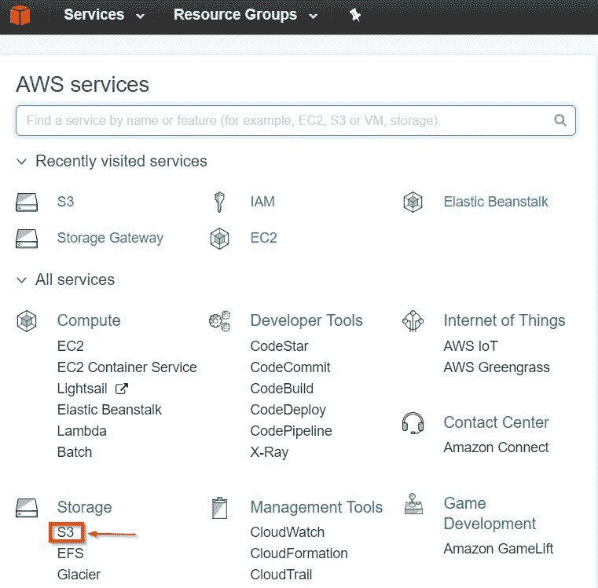

这将打开 Amazon S3 控制台；从那里，我们可以点击“创建存储桶”来创建一个新的存储桶来存储数据文件夹：

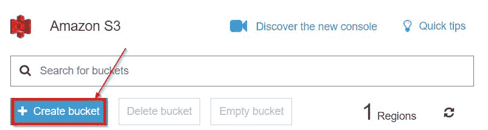

这将启动一个向导，将引导您完成创建存储桶所需的不同步骤。这将使您有权设置存储桶名称、启用版本控制或日志记录、设置标签和设置权限。完成后，将为您创建一个新的存储桶。存储桶名称必须是唯一的，以免与其他 AWS 用户使用的存储桶发生冲突。

我创建了一个名为`mnandbucket`的存储桶；它将显示在我的 S3 主网页的存储桶列表中。如果您的存储桶比页面能显示的更多，您可以在搜索栏中搜索存储桶：

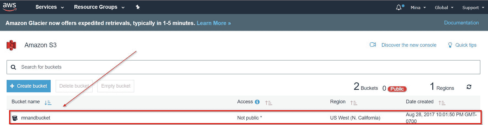

一旦进入存储桶，我们就可以创建文件夹并上传文件：

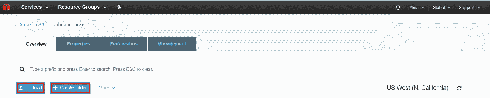

完美！通过这样，我们对 S3 是什么有了一个实际的了解。

您可以从以下网址下载此文件：[`www.packtpub.com/sites/default/files/downloads/CloudNativeprogrammingwithGolang_ColorImages.pdf`](https://www.packtpub.com/sites/default/files/downloads/CloudNativeprogrammingwithGolang_ColorImages.pdf)。

该书的代码包也托管在 GitHub 上，网址为[`github.com/PacktPublishing/Cloud-Native-Programming-with-Golang`](https://github.com/PacktPublishing/Cloud-Native-programming-with-Golang)。

S3 存储可以用于存储我们的应用程序文件以供以后使用。例如，假设我们构建了我们的`events`微服务以在 Linux 环境中运行，并且应用程序的文件名简单地是`events`。然后我们可以简单地将文件存储在 S3 文件夹中；然后，每当我们需要 EC2 实例获取文件时，我们可以使用 Ec2 实例中的 AWS 命令行工具来实现。

首先，我们需要确保 AWS 角色已经正确定义，以允许我们的 EC2 实例访问 S3 存储，就像之前介绍的那样。然后，从那里，要将文件从 S3 复制到我们的 EC2 实例，我们需要从我们的 EC2 实例中发出以下命令：

```go
aws s3 cp s3://<my_bucket>/<my_folder>/events my_local_events_copy
```

上述命令将从 S3 存储中检索`events`文件，然后将其复制到一个名为`my_local_events_copy`的新文件中，该文件将位于当前文件夹中。`<my_bucket>`和`<my_folder>`分别表示 S3 存储中事件文件所在的存储桶和文件夹。

在将可执行文件复制到 EC2 后，我们需要通过 Linux 的`chmod`命令给予它执行权限。这是通过以下命令实现的：

```go
chmod u+x <my_executable_file>
```

在上述命令中，`<my_executable_file>`是我们想要在 EC2 实例中获得足够访问权限以执行的文件。

# 简单队列服务（SQS）

如前所述，SQS 是 AWS 提供的消息队列。可以与 SQS 交互的应用程序可以在 AWS 生态系统内发送和接收消息。

让我们从讨论如何从 Amazon 控制台配置 SQS 开始。通常情况下，第一步是登录到 Amazon 控制台，然后从主仪表板中选择我们的服务。在这种情况下，服务名称将被称为简单队列服务：

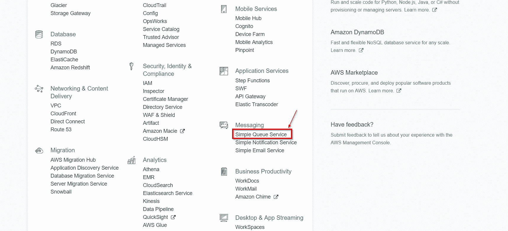

接下来，我们需要单击“入门”或“创建新队列”。队列创建页面将为我们提供配置新队列行为的能力。例如，我们可以设置允许的最大消息大小、保留消息的天数或接收消息的等待时间：

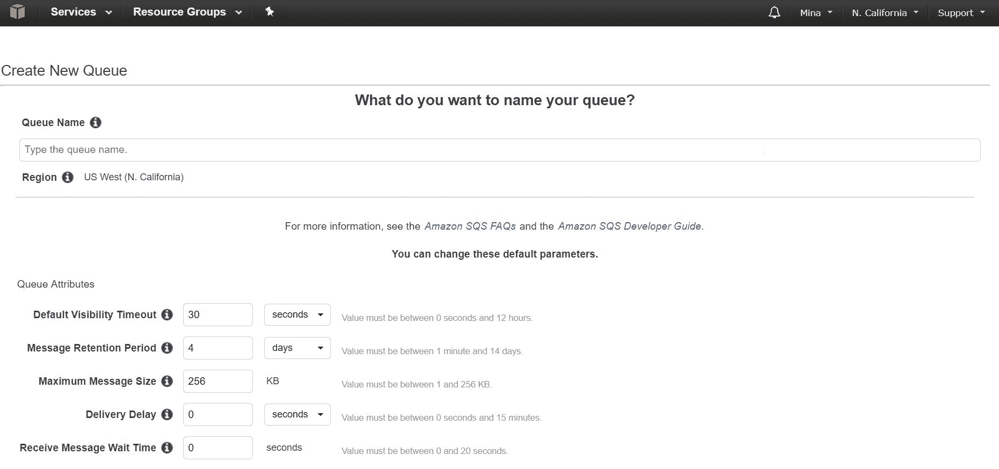

当您满意您的设置时，单击“创建队列”——我选择了名称`eventqueue`。

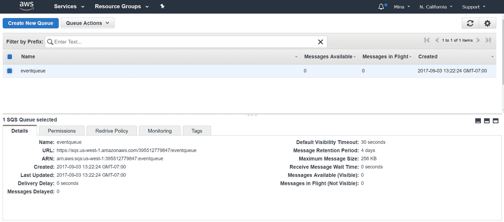

这将创建一个新的 AWS SQS 队列，我们可以在我们的代码中使用。现在，是时候讨论如何编写代码与我们的新队列进行交互了。

太好了！有了我们创建的队列，我们准备编写一些代码，通过新创建的 AWS SQS 队列发送和接收消息。让我们开始探索我们需要编写的代码，以便发送一些数据。

AWS SDK Go SQS 包的文档可以在[`godoc.org/github.com/aws/aws-sdk-go/service/sqs`](https://godoc.org/github.com/aws/aws-sdk-go/service/sqs)找到。

与任何其他 AWS 服务一样，我们需要先完成两个关键步骤：

+   获取或创建会话对象

+   为我们想要的 AWS 服务创建服务客户端

前面的步骤通过以下代码进行了覆盖：

```go
 sess, err := session.NewSession(&aws.Config{
   Region: aws.String("us-west-1"),
 })
 if err != nil {
   log.Fatal(err)
 }
 sqsSvc := sqs.New(sess)
```

在调用`NewSession()`构造函数时，前面的代码通过代码设置了区域；但是，我们也可以选择使用共享配置，如前一章所述。我在这段代码中使用了`log.Fatal()`，因为这只是测试代码，所以如果出现任何错误，我希望退出并报告错误消息。

接下来，我们需要获取消息队列的 URL。URL 很重要，因为它在 SDK 方法调用中充当消息队列的唯一标识符。我们可以通过 AWS 控制台 SQS 页面获取 URL，当选择队列时，队列的 URL 将显示在详细信息选项卡中，也可以通过使用我们创建队列时选择的队列名称来通过代码获取 URL。在我的情况下，我称我的队列为`eventqueue`；所以，让我们看看如何通过我们的代码从该名称获取 URL：

```go
  QUResult, err := sqsSvc.GetQueueUrl(&sqs.GetQueueUrlInput{
    QueueName: aws.String("eventqueue"),
  })
  if err != nil {
    log.Fatal(err)
  }
```

`QUResult`对象是`*GetQueueUrlOutput`类型的，它是指向包含`*string`类型的`QueueUrl`字段的结构体的指针。如果`GetQueueUrl()`方法成功执行，该字段应该包含我们的队列 URL。

太好了！现在我们有了队列的 URL，我们准备通过消息队列发送一些数据。但在这样做之前，我们需要了解一些重要的定义，以理解即将到来的代码。

+   **消息主体***:* 消息主体只是我们试图发送的核心消息。例如，如果我想通过 SQS 发送一个 hello 消息，那么消息主体将是 hello。

+   **消息属性***:* 消息属性是一组结构化的元数据项。您可以简单地将它们视为您可以定义并与消息一起发送的键值对列表。消息属性是可选的；但是，它们可能非常有用，因为它们允许发送比纯文本更结构化和复杂的消息。消息属性允许我们在开始处理消息主体之前了解消息可能包含的内容。我们可以在每条消息中包含多达 10 个消息属性。消息属性支持三种主要数据类型：字符串、数字和二进制。二进制类型表示二进制数据，如压缩文件和图像。

现在，让我们回到我们的示例代码；假设我们想通过 SQS 发送一条消息给我们的事件应用，表示某些音乐会的客户预订；我们的消息将具有以下属性：

+   **消息属性**：我们希望有两个消息属性：

+   `message_type`：我们尝试发送的消息类型——在我们的情况下，此属性的值将是"RESERVATION"

+   `Count`：包含在此消息中的预订数量

+   **消息正文**：这包括以 JSON 格式表示的预订数据。数据包括预订音乐会的客户姓名和事件名称（在这种情况下是音乐会）

以下是代码的样子：

```go
sendResult, err := sqsSvc.SendMessage(&sqs.SendMessageInput{
  MessageAttributes: map[string]*sqs.MessageAttributeValue{
    "message_type": &sqs.MessageAttributeValue{
      DataType: aws.String("String"),
      StringValue: aws.String("RESERVATION"),
    },
    "Count": &sqs.MessageAttributeValue{
      DataType: aws.String("Number"),
      StringValue: aws.String("2"),
    },
  },
  MessageBody: aws.String("[{customer:'Kevin S',event:'Pink Floyd Concert'},{customer:'Angela      T',event:'Cold Play Concert'}]"),
  QueueUrl: QUResult.QueueUrl,
})
```

上述代码使用`SendMessage()`方法发送消息。`SendMessage()`接受`*SendMessageInput{}`类型的参数，我们在其中定义消息属性、消息正文，并标识队列 URL。

之后，我们可以检查是否发生了任何错误。我们可以通过以下代码获取我们创建的消息的 ID：

```go
  if err != nil {
    log.Fatal(err)
  }
  log.Println("Message sent successfully", *sendResult.MessageId)
```

完美！有了这段示例代码，我们现在知道如何通过 SQS 发送消息。现在，让我们学习如何接收它们。

在我们开始查看消息接收代码之前，有一些概念需要涵盖和问题需要回答。让我们假设我们有一个微服务架构，超过一个微服务从 SQS 消息队列中读取消息。一个重要的问题是，我们的服务接收到消息后该怎么办？该消息之后是否允许其他服务接收？这两个问题的答案取决于消息的目的。如果消息应该被消费和处理一次，那么我们需要确保第一个正确接收到消息的服务应该从队列中删除它。

在 AWS SQS 的世界中，当标准队列中的消息被接收时，消息不会从队列中删除。相反，我们需要在接收消息后明确从队列中删除消息，以确保它消失，如果这是我们的意图。然而，还有另一个复杂之处。假设微服务 A 接收了一条消息并开始处理它。然而，在微服务 A 删除消息之前，微服务 B 接收了消息并开始处理它，这是我们不希望发生的。

为了避免这种情况，SQS 引入了一个叫做**可见性超时**的概念。可见性超时简单地使消息在被一个消费者接收后一段时间内不可见。这个超时给了我们一些时间来决定在其他消费者看到并处理消息之前该怎么处理它。

一个重要的说明是，并不总是能保证不会收到重复的消息。原因是因为 SQS 队列通常分布在多个服务器之间。有时删除请求无法到达服务器，因为服务器离线，这意味着尽管有删除请求，消息可能仍然存在。

在 SQS 的世界中，另一个重要概念是长轮询或等待时间。由于 SQS 是分布式的，可能偶尔会有一些延迟，有些消息可能接收得比较慢。如果我们关心即使消息接收慢也要接收到消息，那么在监听传入消息时我们需要等待更长的时间。

以下是一个示例代码片段，显示从队列接收消息：

```go
  QUResult, err := sqsSvc.GetQueueUrl(&sqs.GetQueueUrlInput{
    QueueName: aws.String("eventqueue"),
  })
  if err != nil {
    log.Fatal(err)
  }
  recvMsgResult, err := sqsSvc.ReceiveMessage(&sqs.ReceiveMessageInput{
    AttributeNames: []*string{
      aws.String(sqs.MessageSystemAttributeNameSentTimestamp),
    },
    MessageAttributeNames: []*string{
      aws.String(sqs.QueueAttributeNameAll),
    },
    QueueUrl: QUResult.QueueUrl,
    MaxNumberOfMessages: aws.Int64(10),
    WaitTimeSeconds: aws.Int64(20),
  })
```

在上述代码中，我们尝试监听来自我们创建的 SQS 队列的传入消息。我们像之前一样使用`GetQueueURL()`方法来检索队列 URL，以便在`ReceiveMessage()`方法中使用。

`ReceiveMessage()`方法允许我们指定我们想要捕获的消息属性（我们之前讨论过的），以及一般的系统属性。系统属性是消息的一般属性，例如随消息一起传递的时间戳。在前面的代码中，我们要求所有消息属性，但只要消息时间戳系统属性。

我们设置单次调用中要接收的最大消息数为 10。重要的是要指出，这只是请求的最大消息数，因此通常会收到更少的消息。最后，我们将轮询时间设置为最多 20 秒。如果我们在 20 秒内收到消息，调用将返回捕获的消息，而无需等待。

现在，我们应该怎么处理捕获的消息呢？为了展示代码，假设我们想要将消息正文和消息属性打印到标准输出。之后，我们删除这些消息。这是它的样子：

```go
for i, msg := range recvMsgResult.Messages {
    log.Println("Message:", i, *msg.Body)
    for key, value := range msg.MessageAttributes {
      log.Println("Message attribute:", key, aws.StringValue(value.StringValue))
    }

    for key, value := range msg.Attributes {
      log.Println("Attribute: ", key, *value)
    }

    log.Println("Deleting message...")
    resultDelete, err := sqsSvc.DeleteMessage(&sqs.DeleteMessageInput{
      QueueUrl: QUResult.QueueUrl,
      ReceiptHandle: msg.ReceiptHandle,
    })
    if err != nil {
      log.Fatal("Delete Error", err)
    }
    log.Println("Message deleted... ")
  }
```

请注意，在前面的代码中，我们在`DeleteMessage()`方法中使用了一个名为`msg.ReceiptHandle`的对象，以便识别我们想要删除的消息。ReceiptHandle 是我们从队列接收消息时获得的对象；这个对象的目的是允许我们在接收消息后删除消息。每当接收到一条消息时，都会创建一个 ReceiptHandle。

此外，在前面的代码中，我们接收了消息然后对其进行了解析：

+   我们调用`msg.Body`来检索我们消息的正文

+   我们调用`msg.MessageAttributes`来获取我们消息的消息属性

+   我们调用`msg.Attributes`来获取随消息一起传递的系统属性

有了这些知识，我们就有足够的知识来为我们的`events`应用程序实现一个 SQS 消息队列发射器和监听器。在之前的章节中，我们为应用程序中的消息队列创建了两个关键接口需要实现。其中一个是发射器接口，负责通过消息队列发送消息。另一个是监听器接口，负责从消息队列接收消息。

作为一个快速的复习，发射器接口的样子是什么：

```go
package msgqueue

// EventEmitter describes an interface for a class that emits events
type EventEmitter interface {
  Emit(e Event) error
}
```

此外，以下是监听器接口的样子：

```go
package msgqueue

// EventListener describes an interface for a class that can listen to events.
type EventListener interface {
 Listen(events ...string) (<-chan Event, <-chan error, error)
 Mapper() EventMapper
}
```

`Listen`方法接受一个事件名称列表，然后将这些事件以及尝试通过消息队列接收事件时发生的任何错误返回到一个通道中。这被称为通道生成器模式。

因此，为了支持 SQS 消息队列，我们需要实现这两个接口。让我们从`Emitter`接口开始。我们将在`./src/lib/msgqueue`内创建一个新文件夹；新文件夹的名称将是`sqs`。在`sqs`文件夹内，我们创建两个文件——`emitter.go`和`listener.go`。`emitter.go`是我们将实现发射器接口的地方。

我们首先创建一个新对象来实现发射器接口——这个对象被称为`SQSEmitter`。它将包含 SQS 服务客户端对象，以及我们队列的 URL：

```go
type SQSEmitter struct {
  sqsSvc *sqs.SQS
  QueueURL *string
}
```

然后，我们需要为我们的发射器创建一个构造函数。在构造函数中，我们将从现有会话或新创建的会话中创建 SQS 服务客户端。我们还将利用`GetQueueUrl`方法来获取我们队列的 URL。这是它的样子：

```go
func NewSQSEventEmitter(s *session.Session, queueName string) (emitter msgqueue.EventEmitter, err error) {
  if s == nil {
    s, err = session.NewSession()
    if err != nil {
      return
    }
  }
  svc := sqs.New(s)
  QUResult, err := svc.GetQueueUrl(&sqs.GetQueueUrlInput{
    QueueName: aws.String(queueName),
  })
  if err != nil {
    return
  }
  emitter = &SQSEmitter{
    sqsSvc: svc,
    QueueURL: QUResult.QueueUrl,
  }
  return
}
```

下一步是实现发射器接口的`Emit()`方法。我们将发射的消息应具有以下属性：

+   它将包含一个名为`event_name`的单个消息属性，其中将保存我们试图发送的事件的名称。如前所述，在本书中，事件名称描述了我们的应用程序试图处理的事件类型。我们有三个事件名称 - `eventCreated`、`locationCreated`和`eventBooked`。请记住，这里的`eventCreated`和`eventBooked`是指应用程序事件（而不是消息队列事件）的创建或预订，例如音乐会或马戏团表演。

+   它将包含一个消息正文，其中将保存事件数据。消息正文将以 JSON 格式呈现。

代码将如下所示：

```go
func (sqsEmit *SQSEmitter) Emit(event msgqueue.Event) error {
  data, err := json.Marshal(event)
  if err != nil {
    return err
  }
  _, err = sqsEmit.sqsSvc.SendMessage(&sqs.SendMessageInput{
    MessageAttributes: map[string]*sqs.MessageAttributeValue{
      "event_name": &sqs.MessageAttributeValue{
        DataType: aws.String("string"),
        StringValue: aws.String(event.EventName()),
      },
    },
    MessageBody: aws.String(string(data)),
    QueueUrl: sqsEmit.QueueURL,
  })
  return err
}
```

有了这个，我们就有了一个用于发射器接口的 SQS 消息队列实现。现在，让我们讨论监听器接口。

监听器接口将在`./src/lib/msgqueue/listener.go`文件中实现。我们从将实现接口的对象开始。对象名称是`SQSListener`。它将包含消息队列事件类型映射器、SQS 客户端服务对象、队列的 URL、从一个 API 调用中接收的消息的最大数量、消息接收的等待时间和可见性超时。这将如下所示：

```go
type SQSListener struct {
  mapper msgqueue.EventMapper
  sqsSvc *sqs.SQS
  queueURL *string
  maxNumberOfMessages int64
  waitTime int64
  visibilityTimeOut int64
}
```

我们将首先从构造函数开始；代码将类似于我们为发射器构建的构造函数。我们将确保我们有一个 AWS 会话对象、一个服务客户端对象，并根据队列名称获取我们队列的 URL：

```go
func NewSQSListener(s *session.Session, queueName string, maxMsgs, wtTime, visTO int64) (listener msgqueue.EventListener, err error) {
  if s == nil {
    s, err = session.NewSession()
    if err != nil {
      return
    }
  }
  svc := sqs.New(s)
  QUResult, err := svc.GetQueueUrl(&sqs.GetQueueUrlInput{
    QueueName: aws.String(queueName),
  })
  if err != nil {
    return
  }
  listener = &SQSListener{
    sqsSvc: svc,
    queueURL: QUResult.QueueUrl,
    mapper: msgqueue.NewEventMapper(),
    maxNumberOfMessages: maxMsgs,
    waitTime: wtTime,
    visibilityTimeOut: visTO,
  }
  return
}
```

之后，我们需要实现`listener`接口的`Listen()`方法。该方法执行以下操作：

+   它将接收到的事件名称列表作为参数

+   它监听传入的消息

+   当它接收到消息时，它会检查消息事件名称并将其与作为参数传递的事件名称列表进行比较

+   如果接收到不属于请求事件的消息，它将被忽略

+   如果接收到属于已知事件的消息，它将通过“Event”类型的 Go 通道传递到外部世界

+   通过 Go 通道传递后，接受的消息将被删除

+   发生的任何错误都会通过另一个 Go 通道传递给错误对象

让我们暂时专注于将监听和接收消息的代码。我们将创建一个名为`receiveMessage()`的新方法。以下是它的分解：

1.  首先，我们接收消息并将任何错误传递到 Go 错误通道：

```go
func (sqsListener *SQSListener) receiveMessage(eventCh chan msgqueue.Event, errorCh chan error, events ...string) {
  recvMsgResult, err := sqsListener.sqsSvc.ReceiveMessage(&sqs.ReceiveMessageInput{
    MessageAttributeNames: []*string{
      aws.String(sqs.QueueAttributeNameAll),
    },
    QueueUrl: sqsListener.queueURL,
    MaxNumberOfMessages: aws.Int64(sqsListener.maxNumberOfMessages),
    WaitTimeSeconds: aws.Int64(sqsListener.waitTime),
    VisibilityTimeout: aws.Int64(sqsListener.visibilityTimeOut),
  })
  if err != nil {
    errorCh <- err
  }
```

1.  然后，我们逐条查看接收到的消息并检查它们的消息属性 - 如果事件名称不属于请求的事件名称列表，我们将通过移动到下一条消息来忽略它：

```go
bContinue := false
for _, msg := range recvMsgResult.Messages {
  value, ok := msg.MessageAttributes["event_name"]
  if !ok {
    continue
  }
  eventName := aws.StringValue(value.StringValue)
  for _, event := range events {
    if strings.EqualFold(eventName, event) {
      bContinue = true
      break
    }
  }

  if !bContinue {
    continue
  }
```

1.  如果我们继续，我们将检索消息正文，然后使用我们的事件映射器对象将其翻译为我们在外部代码中可以使用的事件类型。事件映射器对象是在第四章中创建的，*使用消息队列的异步微服务架构*；它只是获取事件名称和事件的二进制形式，然后将一个事件对象返回给我们。之后，我们获取事件对象并将其传递到事件通道。如果我们检测到错误，我们将错误传递到错误通道，然后移动到下一条消息：

```go
message := aws.StringValue(msg.Body)
event, err := sqsListener.mapper.MapEvent(eventName, []byte(message))
if err != nil {
  errorCh <- err
  continue
}
eventCh <- event
```

1.  最后，如果我们在没有错误的情况下到达这一点，那么我们知道我们成功处理了消息。因此，下一步将是删除消息，以便其他人不会处理它：

```go
    _, err = sqsListener.sqsSvc.DeleteMessage(&sqs.DeleteMessageInput{
      QueueUrl: sqsListener.queueURL,
      ReceiptHandle: msg.ReceiptHandle,
    })

    if err != nil {
      errorCh <- err
    }
  }
}
```

这很棒。然而，你可能会想，为什么我们没有直接将这段代码放在`Listen()`方法中呢？答案很简单：我们这样做是为了清理我们的代码，避免一个庞大的方法。这是因为我们刚刚覆盖的代码片段需要在循环中调用，以便我们不断地从消息队列中接收消息。

现在，让我们看一下`Listen()`方法。该方法将需要在 goroutine 内的循环中调用`receiveMessage()`。需要 goroutine 的原因是，否则`Listen()`方法会阻塞其调用线程。这是它的样子：

```go
func (sqsListener *SQSListener) Listen(events ...string) (<-chan msgqueue.Event, <-chan error, error) {
  if sqsListener == nil {
    return nil, nil, errors.New("SQSListener: the Listen() method was called on a nil pointer")
  }
  eventCh := make(chan msgqueue.Event)
  errorCh := make(chan error)
  go func() {
    for {
      sqsListener.receiveMessage(eventCh, errorCh)
    }
  }()

  return eventCh, errorCh, nil
}
```

前面的代码首先确保`*SQSListener`对象不为空，然后创建用于将`receiveMessage()`方法的结果传递给外部世界的 events 和 errors Go 通道。

# AWS API 网关

我们深入云原生应用程序的下一步是进入 AWS API 网关。如前所述，AWS API 网关是一个托管服务，允许开发人员为其应用程序构建灵活的 API。在本节中，我们将介绍有关该服务的实际介绍以及如何使用它的内容。

与我们迄今为止涵盖的其他服务类似，我们将通过 AWS 控制台创建一个 API 网关。首先，像往常一样，访问并登录到[aws.amazon.com](http://aws.amazon.com)的 AWS 控制台。

第二步是转到主页，然后从应用服务下选择 API Gateway：

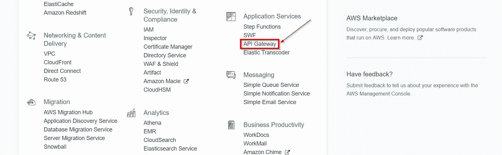

接下来，我们需要从左侧选择 API，然后点击创建 API。这将开始创建一个新的 API 供我们的应用使用的过程：

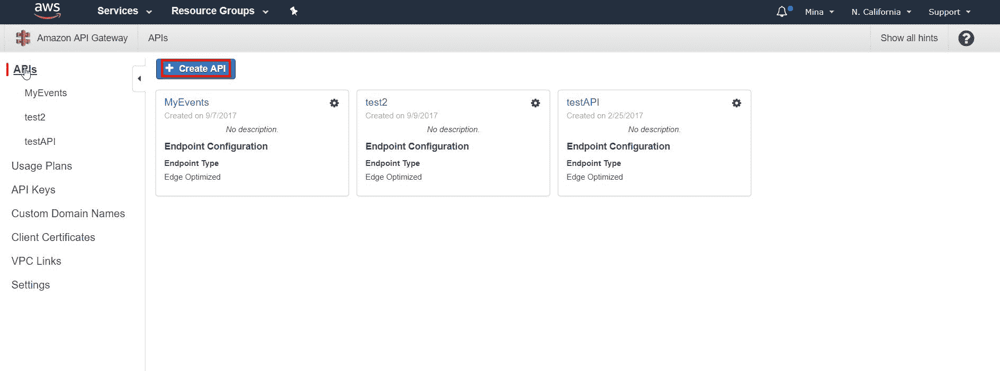

然后，我们可以选择我们的新 API 的名称，如下所示：

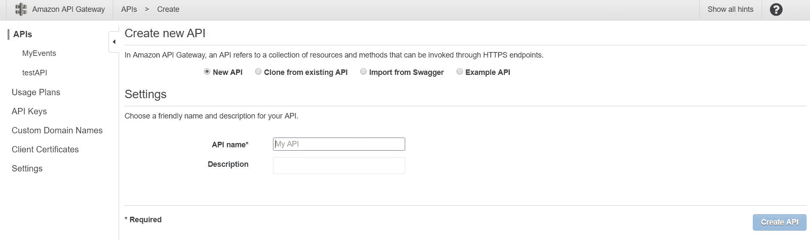

现在，在创建 API 之后，我们需要在 AWS API 网关和嵌入在我们的 MyEvents 应用程序中的 RESTful API 的地址之间创建映射。MyEvents 应用程序包含多个微服务。其中一个微服务是事件服务；它支持可以通过其 RESTful API 激活的多个任务。作为复习，这里是 API 任务的快速摘要和它们相对 URL 地址的示例：

1.  **搜索事件**：

+   **ID**：相对 URL 是`/events/id/3434`，方法是`GET`，HTTP 主体中不需要数据。

+   **名称**：相对 URL 是`/events/name/jazz_concert`，方法是`GET`，HTTP 主体中不需要数据。

1.  **一次检索所有事件**：相对 URL 是`/events`，方法是`GET`，HTTP 主体中不需要数据。

1.  **创建新事件**：相对 URL 是`/events`，方法是`POST`，HTTP 主体中期望的数据需要是我们想要添加的新事件的 JSON 表示。假设我们想要添加在美国演出的`aida 歌剧`。那么 HTTP 主体会是这样的：

```go
{
    name: "opera aida",
    startdate: 768346784368,
    enddate: 43988943,
    duration: 120, //in minutes
    location:{
        id : 3 , //=>assign as an index
        name: "West Street Opera House",
        address: "11 west street, AZ 73646",
        country: "U.S.A",
        opentime: 7,
        clostime: 20
        Hall: {
            name : "Cesar hall",
            location : "second floor, room 2210",
            capacity: 10
        }
    }
}
```

让我们逐个探索事件微服务 API 的任务，并学习如何让 AWS API 网关充当应用程序的前门。

从前面的描述中，我们有三个相对 URL：

+   `/events/id/{id}`，其中`{id}`是一个数字。我们支持使用该 URL 进行`GET` HTTP 请求。

+   `/events/name/{name}`，其中`{name}`是一个字符串。我们支持使用该 URL 进行`GET` HTTP 请求。

+   `/events`，我们支持使用此 URL 进行`GET`和`POST`请求。

为了在我们的 AWS API 网关中表示这些相对 URL 和它们的方法，我们需要执行以下操作：

1.  创建一个名为`events`的新资源。首先访问我们新创建的 API 页面。然后，通过点击操作并选择创建资源来创建一个新资源：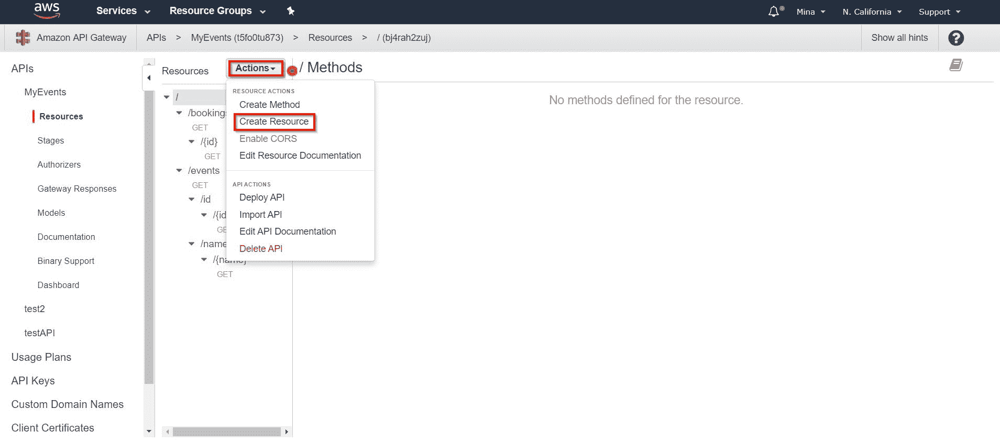

1.  确保在新资源上设置名称和路径为`events`：

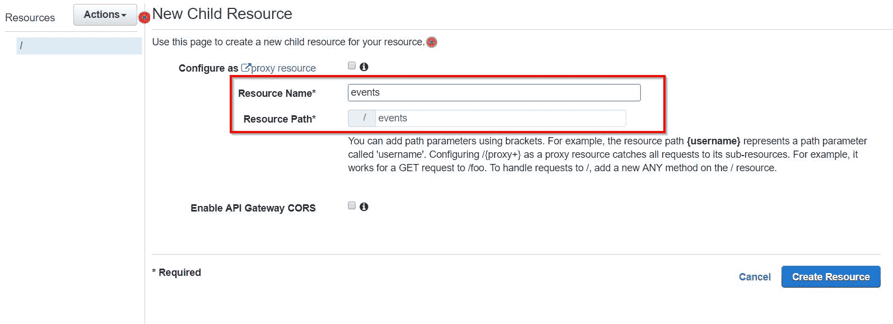

1.  然后，选择新创建的`events`资源并创建一个名为`id`的新资源。再次选择`events`资源，但这次创建一个名为`name`的新资源。这是它的样子：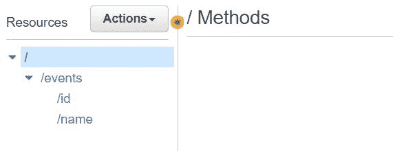

1.  选择`id`资源，然后创建一个新的资源。这一次，再次将资源名称命名为`id`；但是，资源路径需要是`{id}`。这很重要，因为它表明`id`是一个可以接受其他值的参数。这意味着这个资源可以表示一个相对 URL，看起来像这样`/events/id/3232`：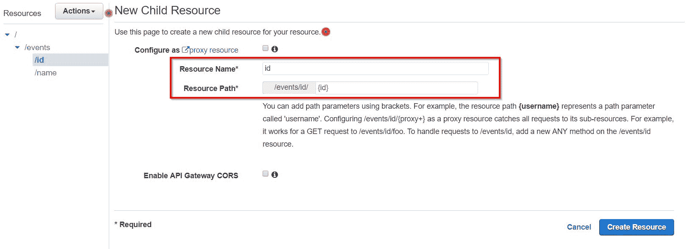

1.  与步骤 4 类似，我们将选择`name`资源，然后在其下创建另一个资源，资源名称为`name`，资源路径为`{name}`。这是最终的样子：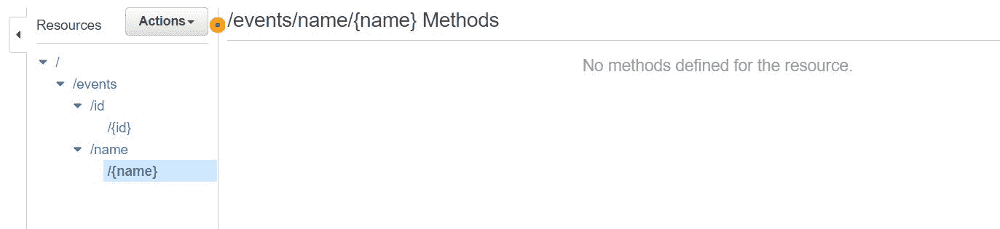

1.  现在，这应该涵盖了我们所有的相对 URL。我们需要将支持的 HTTP 方法附加到相应的资源上。首先，我们将转到`events`资源，然后将`GET`方法以及`POST`方法附加到它上面。为了做到这一点，我们需要点击 s，然后选择创建方法：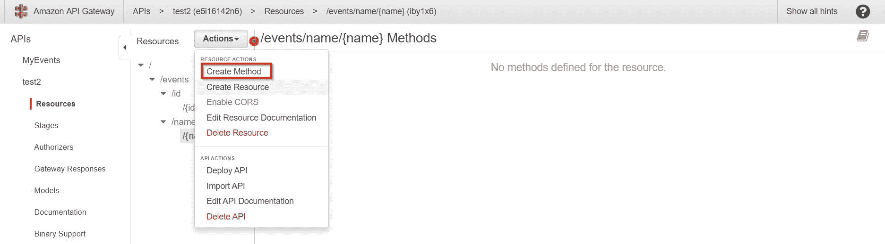

1.  然后我们可以选择 GET 作为方法类型：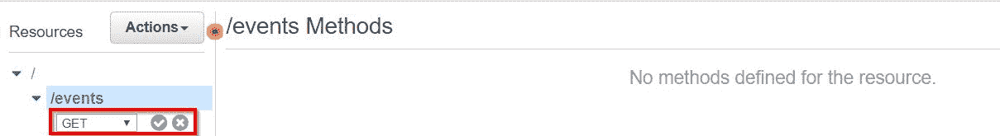

1.  然后我们选择 HTTP 作为集成类型。从那里，我们需要设置端点 URL。端点 URL 需要是与此资源对应的 API 端点的绝对路径。在我们的情况下，因为我们在'events'资源下，该资源在'events'微服务上的绝对地址将是`<EC2 DNS Address>/events`。假设 DNS 是`http://ec2.myevents.com`；这将使绝对路径为`http://ec2.myevents.com/events`。这是这个配置的样子：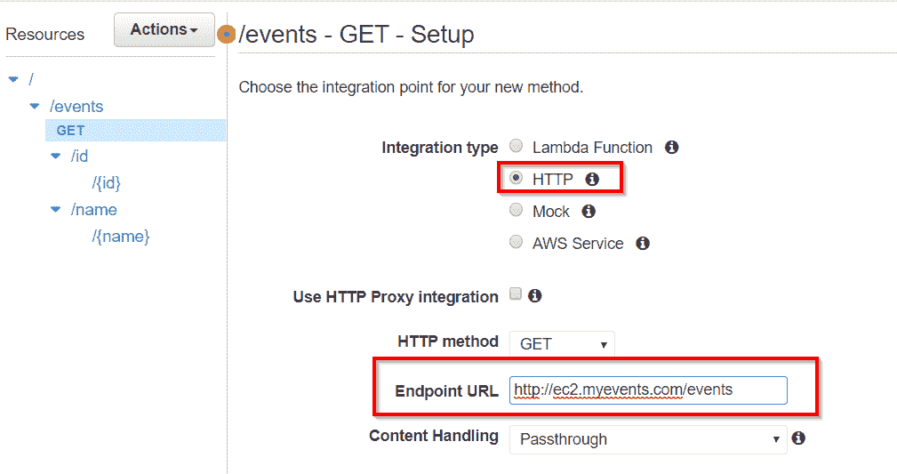

1.  我们将重复上述步骤；但是，这一次我们将创建一个`POST`方法。

1.  我们选择`{id}`资源，然后创建一个新的`GET`方法。`EndPoint` URL 需要包括`{id}`；这是它的样子：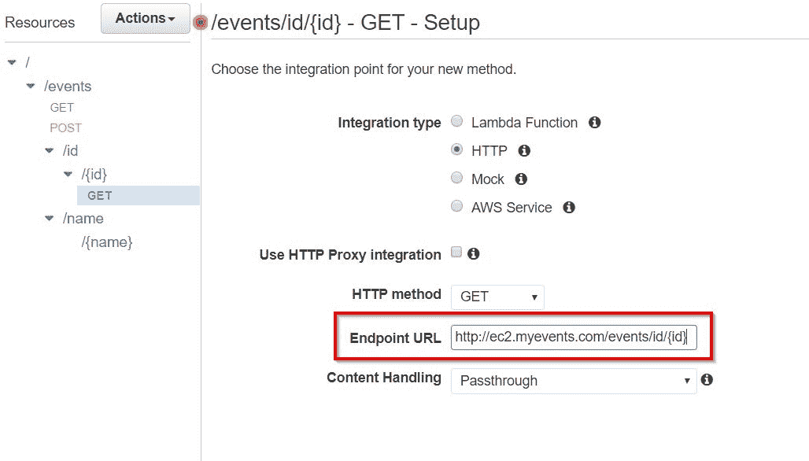

1.  我们将重复使用`{name}`资源进行相同的步骤；这是 Endpoint URL 的样子：`http://ec2.myevents.com/events/name/{name}`。

完美！通过这样，我们为我们的事件微服务 API 创建了 AWS API 网关映射。我们可以使用相同的技术在我们的 MyEvents API 中添加更多资源，这些资源将指向属于 MyEvents 应用程序的其他微服务。下一步是部署 API。我们需要做的第一件事是创建一个新的阶段。阶段是一种标识已部署的可由用户调用的 RESTful API 的方式。在部署 RESTful API 之前，我们需要创建一个阶段。要部署 API，我们需要点击操作，然后点击部署 API：

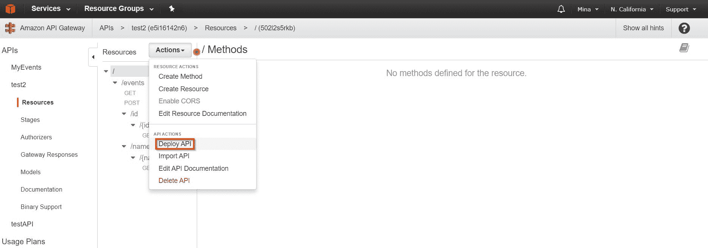

如果我们还没有阶段，我们需要选择[New Stage]作为我们的部署阶段，然后选择一个阶段名称，最后点击部署。我将我的阶段命名为`beta`：

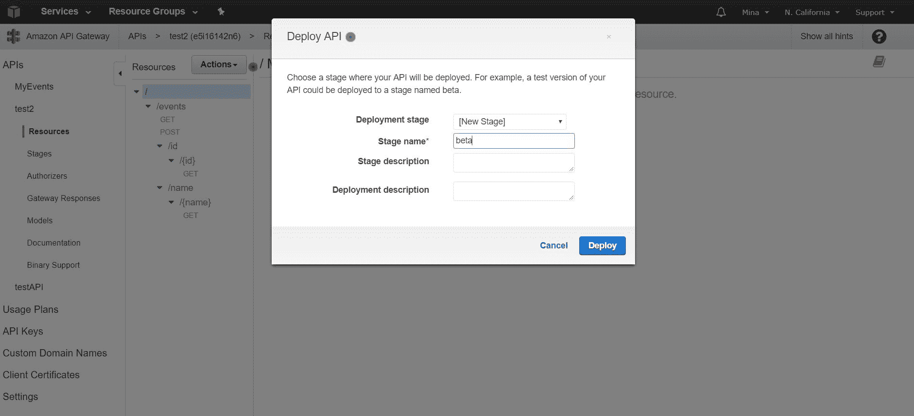

一旦我们将 RESTful API 资源部署到一个阶段，我们就可以开始使用它。我们可以通过导航到阶段，然后点击所需资源来查找我们的 AWS API 网关门到我们的事件微服务的 API URL。在下图中，我们选择了 events 资源，API URL 可以在右侧找到：

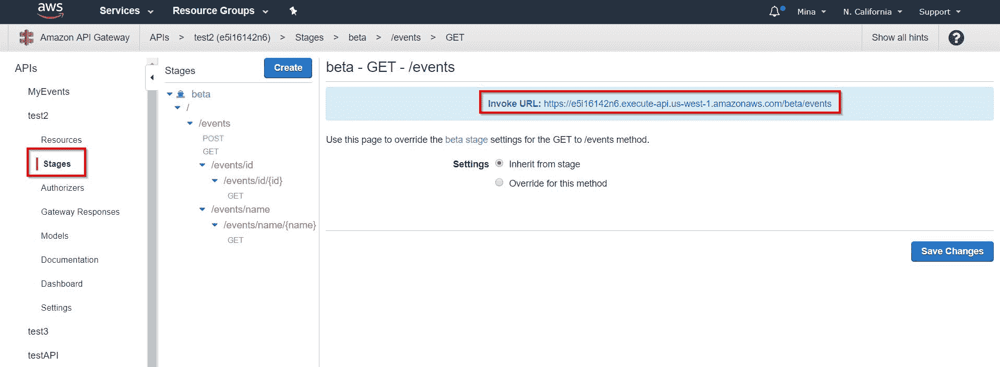

# DynamoDB

DynamoDB 是 AWS 生态系统中非常重要的一部分；它通常作为众多云原生应用程序的后端数据库。DynamoDB 是一个分布式高性能数据库，托管在云中，由 AWS 作为服务提供。

# DynamoDB 组件

在讨论如何编写可以与 DynamoDB 交互的代码之前，我们需要首先了解一些关于数据库的重要概念。DynamoDB 由以下组件组成：

+   表：与典型的数据库引擎一样，DynamoDB 将数据存储在一组表中。例如，在我们的 MyEvents 应用程序中，我们可以有一个“事件”表，用于存储诸如音乐会名称和开始日期之类的事件信息。同样，我们还可以有一个“预订”表，用于存储我们用户的预订信息。我们还可以有一个“用户”表，用于存储我们用户的信息。

+   项目：项目只是 DynamoDB 表的行。项目内的信息称为属性。如果我们以“事件”表为例，项目将是该表中的单个事件。同样，如果我们以“用户”表为例，每个项目都是一个用户。表中的每个项目都需要一个唯一标识符，也称为主键，以区分该项目与表中所有其他项目。

+   属性：如前所述，属性代表项目内的信息。每个项目由一个或多个属性组成。您可以将属性视为数据的持有者。每个属性由属性名称和属性值组成。如果我们以“事件”表为例，每个“事件”项目将具有一个`ID`属性来表示事件 ID，一个“名称”属性来表示事件名称，一个“开始日期”属性，一个“结束日期”属性等等。

项目主键是项目中必须预先定义的唯一属性。但是，项目中的任何其他属性都不需要预定义。这使得 DynamoDB 成为一个无模式数据库，这意味着在填充表格数据之前不需要定义数据库表的结构。

DynamoDB 中的大多数属性都是标量的。这意味着它们只能有一个值。标量属性的一个示例是字符串属性或数字属性。有些属性可以是嵌套的，其中一个属性可以承载另一个属性，依此类推。属性允许嵌套到 32 级深度。

# 属性值数据类型

如前所述，每个 DynamoDB 属性由属性名称和属性值组成。属性值又由两部分组成：值的数据类型名称和值数据。在本节中，我们将重点关注数据类型。

有三个主要的数据类型类别：

+   标量类型：这是最简单的数据类型；它表示单个值。标量类型类别包括以下数据类型名称：

+   `S`：这只是一个字符串类型；它利用 UTF-8 编码；字符串的长度必须在零到 400 KB 之间。

+   `N`：这是一个数字类型。它们可以是正数、负数或零。它们可以达到 38 位精度。

+   `B`：二进制类型的属性。二进制数据包括压缩文本、加密数据或图像。长度需要在 0 到 400 KB 之间。我们的应用程序必须在将二进制数据值发送到 DynamoDB 之前以 base64 编码格式对二进制数据进行编码。

+   `BOOL`：布尔属性。它可以是 true 或 false。

+   文档类型：文档类型是一个具有嵌套属性的复杂结构。此类别下有两个数据类型名称：

+   `L`：列表类型的属性。此类型可以存储有序集合的值。对可以存储在列表中的数据类型没有限制。

+   `Map`：地图类型将数据存储在无序的名称-值对集合中。

+   集合类型：集合类型可以表示多个标量值。集合类型中的所有项目必须是相同类型。此类别下有三个数据类型名称：

+   `NS`：一组数字

+   `SS`：一组字符串

+   `BS`：一组二进制值

# 主键

如前所述，DynamoDB 表项中唯一需要预先定义的部分是主键。在本节中，我们将更深入地了解 DynamoDB 数据库引擎的主键。主键的主要任务是唯一标识表中的每个项目，以便没有两个项目可以具有相同的键。

DynamoDB 支持两种不同类型的主键：

+   **分区键**：这是一种简单类型的主键。它由一个称为分区键的属性组成。DynamoDB 将数据存储在多个分区中。分区是 DynamoDB 表的存储层，由固态硬盘支持。分区键的值被用作内部哈希函数的输入，生成一个确定项目将被存储在哪个分区的输出。

+   **复合键**：这种类型的键由两个属性组成。第一个属性是我们之前讨论过的分区键，而第二个属性是所谓的'排序键'。如果您将复合键用作主键，那么多个项目可以共享相同的分区键。具有相同分区键的项目将被存储在一起。然后使用排序键对具有相同分区键的项目进行排序。排序键对于每个项目必须是唯一的。

每个主键属性必须是标量，这意味着它只能保存单个值。主键属性允许的三种数据类型是字符串、数字或二进制。

# 二级索引

DynamoDB 中的主键为我们通过它们的主键快速高效地访问表中的项目提供了便利。然而，有很多情况下，我们可能希望通过除主键以外的属性查询表中的项目。DynamoDB 允许我们创建针对非主键属性的二级索引。这些索引使我们能够在非主键项目上运行高效的查询。

二级索引只是包含来自表的属性子集的数据结构。表允许具有多个二级索引，这在查询表中的数据时提供了灵活性。

为了进一步了解二级查询，我们需要涵盖一些基本定义：

+   **基本表**：每个二级索引都属于一个表。索引所基于的表，以及索引获取数据的表，称为基本表。

+   **投影属性**：投影属性是从基本表复制到索引中的属性。DynamoDB 将这些属性与基本表的主键一起复制到索引的数据结构中。

+   **全局二级索引**：具有与基本表不同的分区键和排序键的索引。这种类型的索引被认为是`全局`的，因为对该索引执行的查询可以跨越基本表中的所有数据。您可以在创建表时或以后创建全局二级索引。

+   **本地二级索引**：一个具有与基本表相同的分区键，但不同排序键的索引。这种类型的索引是`本地`的，因为本地二级索引的每个分区都与具有相同分区键值的基本表分区相关联。您只能在创建表时同时创建本地二级索引。

# 创建表

让我们利用 AWS Web 控制台创建 DynamoDB 表，然后我们可以在代码中访问这些表。第一步是访问 AWS 管理控制台主仪表板，然后点击 DynamoDB：

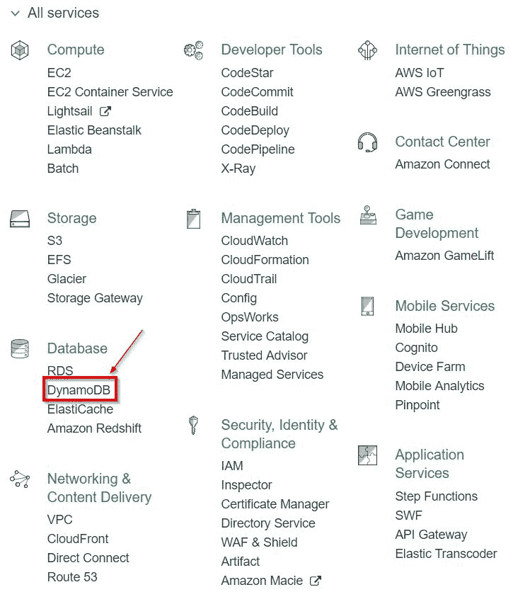

点击 DynamoDB 后，我们将转到 DynamoDB 主仪表板，在那里我们可以创建一个新表：

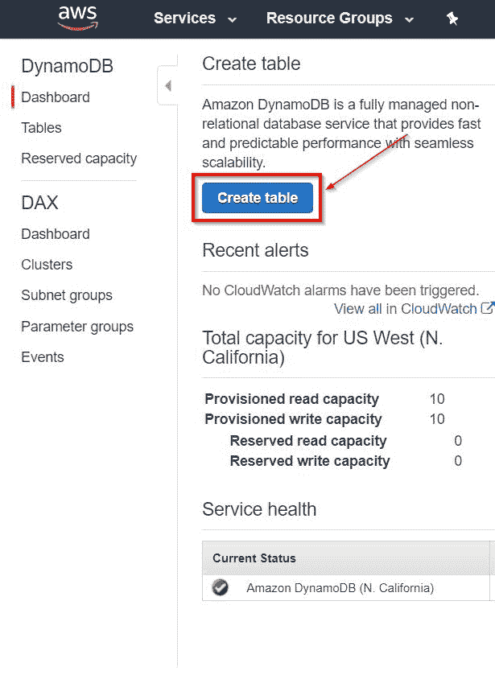

下一步是选择表名和主键。正如我们之前提到的，DynamoDB 中的主键可以由最多两个属性组成——分区键和排序键。假设我们正在创建一个名为`events`的表。让我们使用一个简单的主键，它只包含一个名为`ID`的`Binary`类型的分区键：

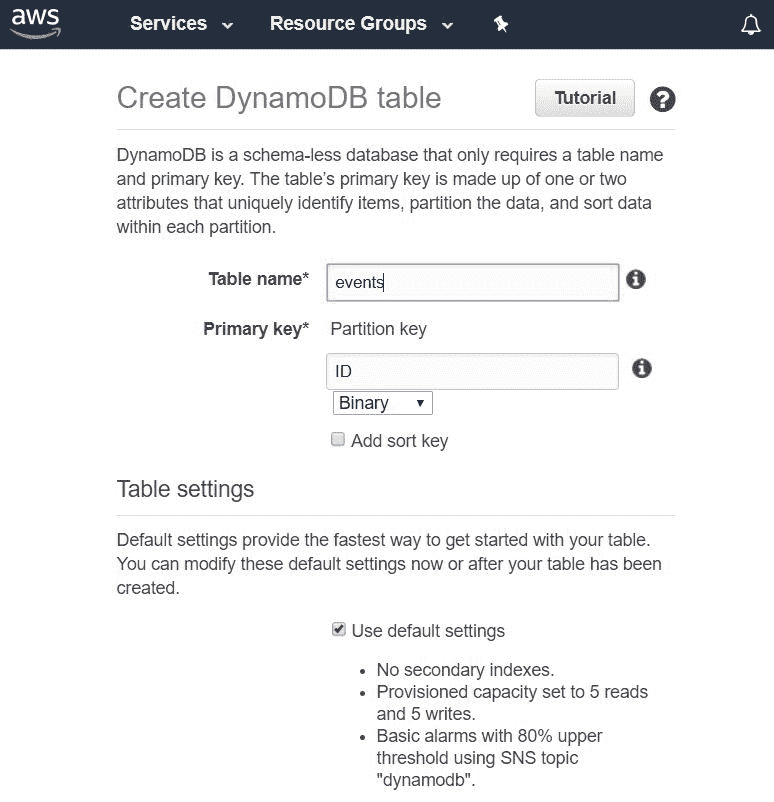

我们也将保留默认设置。稍后我们将重新访问一些设置，比如次要索引。配置完成后，我们需要点击创建来创建表格。然后我们将重复这个过程，创建所有其他我们想要创建的表格：

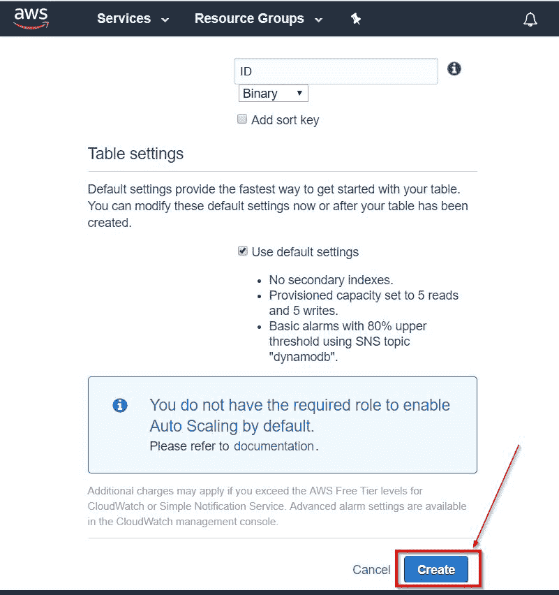

一旦表格创建完成，我们现在可以通过我们的代码连接到它，编辑它，并从中读取。但是，在我们开始讨论代码之前，我们需要创建一个次要索引。为此，我们需要首先访问我们新创建的表格，选择左侧的 Tables 选项。然后，我们将从表格列表中选择`events`表。之后，我们需要选择 Indexes 选项卡，然后点击 Create Index 来创建一个新的次要索引：

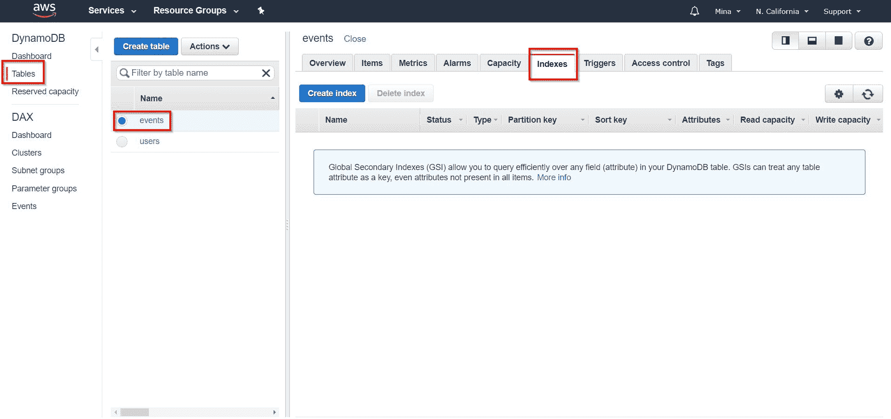

次要索引名称需要是我们表格中希望用作次要索引的属性名称。在我们的情况下，我们希望用于查询的属性是事件名称。这个属性代表了我们需要的索引，以便在查询事件时通过它们的名称而不是它们的 ID 来运行高效的查询。创建索引对话框如下所示；让我们填写不同的字段，然后点击创建索引：

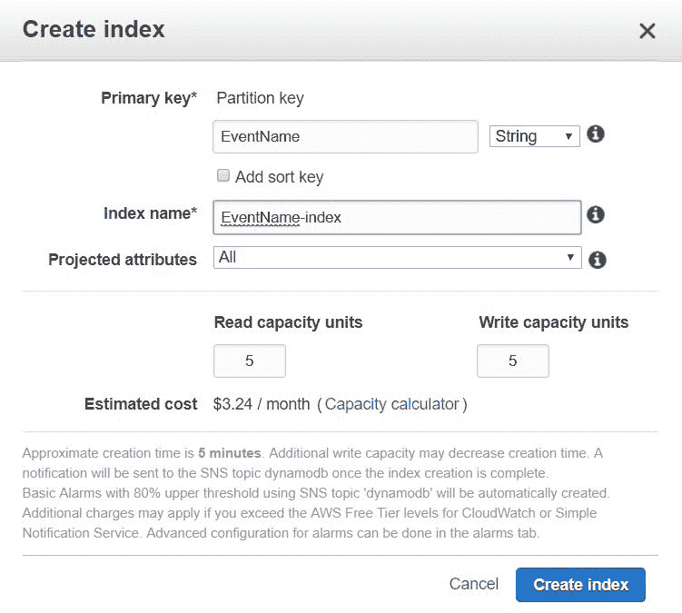

完美！通过这一步，我们现在已经准备好我们的表格了。请注意上面的屏幕截图中索引名称为`EventName-index`。我们将在后面的 Go 代码中使用该名称。

# Go 语言和 DynamoDB

亚马逊已经为 Go 语言提供了强大的包，我们可以利用它们来构建可以有效地与 DynamoDB 交互的应用程序。主要包可以在[`docs.aws.amazon.com/sdk-for-go/api/service/dynamodb/`](https://docs.aws.amazon.com/sdk-for-go/api/service/dynamodb/)找到。

在我们开始深入代码之前，让我们回顾一下我们在第二章中讨论的`DatabaseHandler`接口，*使用 Rest API 构建微服务*。这个接口代表了我们的微服务的数据库处理程序层，也就是数据库访问代码所在的地方。在`events`服务的情况下，这个接口支持了四种方法。它看起来是这样的：

```go
type DatabaseHandler interface {
  AddEvent(Event) ([]byte, error)
  FindEvent([]byte) (Event, error)
  FindEventByName(string) (Event, error)
  FindAllAvailableEvents() ([]Event, error)
}
```

在我们努力实现如何编写可以与 DynamoDB 一起工作的应用程序的实际理解的过程中，我们将实现前面的四种方法来利用 DynamoDB 作为后端数据库。

与其他 AWS 服务类似，AWS Go SDK 提供了一个服务客户端对象，我们可以用它来与 DynamoDB 交互。同样，我们需要首先获取一个会话对象，然后使用它来创建一个 DynamoDB 服务客户端对象。代码应该是这样的：

```go
  sess, err := session.NewSession(&aws.Config{
    Region: aws.String("us-west-1"),
  })
  if err != nil {
    //handler error, let's assume we log it then exit.
    log.Fatal(err)
  }
  dynamodbsvc := dynamodb.New(sess)
```

`dynamodbsvc`最终成为我们的服务客户端对象，我们可以用它来与 DynamoDB 交互。

现在，我们需要创建一个名为 dynamolayer.go 的新文件，它将存在于相对文件夹`./lib/persistence/dynamolayer`下，这是我们应用程序的一部分：

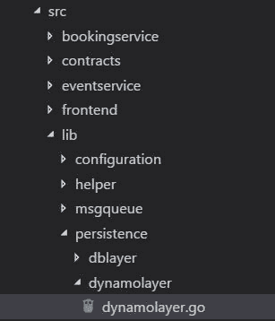

`dynamolayer.go`文件是我们的代码所在的地方。为了实现`databasehandler`接口，我们需要遵循的第一步是创建一个`struct`类型，它将实现接口方法。让我们称这个新类型为`DynamoDBLayer`；代码如下：

```go
type DynamoDBLayer struct {
  service *dynamodb.DynamoDB
}
```

`DynamoDBLayer`结构包含一个类型为`*dynamodb.DynamoDB`的字段；这个结构字段表示 DynamoDB 的 AWS 服务客户端，这是我们在代码中与 DynamoDB 交互的关键对象类型。

下一步是编写一些构造函数来初始化`DynamoDBLayer`结构。我们将创建两个构造函数——第一个构造函数假设我们没有现有的 AWS 会话对象可用于我们的代码。它将接受一个字符串参数，表示我们的 AWS 区域（例如，`us-west-1`）。然后，它将利用该区域字符串创建一个针对该区域的会话对象。之后，会话对象将用于创建一个 DynamoDB 服务客户端对象，该对象可以分配给一个新的`DynamoDBLayer`对象。第一个构造函数将如下所示：

```go
func NewDynamoDBLayerByRegion(region string) (persistence.DatabaseHandler, error) {
  sess, err := session.NewSession(&aws.Config{
    Region: aws.String(region),
  })
  if err != nil {
    return nil, err
  }
  return &DynamoDBLayer{
    service: dynamodb.New(sess),
  }, nil
}
```

第二个构造函数是我们在已经有现有的 AWS 会话对象时会使用的构造函数。它接受会话对象作为参数，然后使用它创建一个新的 DynamoDB 服务客户端，我们可以将其分配给一个新的`DynamoDBLayer`对象。代码将如下所示：

```go
func NewDynamoDBLayerBySession(sess *session.Session) persistence.DatabaseHandler {
  return &DynamoDBLayer{
    service: dynamodb.New(sess),
  }
}
```

太好了！现在，构造函数已经完成，让我们实现`DatabaseHandler`接口方法。

在我们继续编写代码之前，我们需要先介绍两个重要的概念：

+   `*dynamoDB.AttributeValue`：这是一个结构类型，位于 dynamodb Go 包内。它表示 DynamoDB 项目属性值。

+   `dynamodbattribute`：这是一个位于 dynamodb 包下的子包。该包的文档可以在以下位置找到：

`https://docs.aws.amazon.com/sdk-for-go/api/service/dynamodb/dynamodbattribute/`。该包负责在 Go 应用程序内部将 Go 类型与`dynamoDB.AttributeValues`之间进行转换。这提供了一种非常方便的方式，将我们应用程序内部的 Go 类型转换为可以被 dynamoDB 包方法理解的类型，反之亦然。`dynamodbattribute`可以利用 marshal 和 unmarshal 方法将切片、映射、结构甚至标量值转换为`dynamoDB.AttributeValues`。

我们将从现在开始利用`dynamoDB.AttributeValue`类型的强大功能，以及`dynamodbattribute`包来编写能够与 DynamoDB 一起工作的代码。

我们将要介绍的第一个`DatabaseHandler`接口方法是`AddEvent()`方法。该方法接受一个`Event`类型的参数，然后将其作为一个项目添加到数据库中的事件表中。在我们开始介绍方法的代码之前，我们需要先了解一下我们需要利用的 AWS SDK 组件：

+   `AddEvent()`将需要使用 AWS SDK 方法`PutItem()`

+   `PutItem()`方法接受一个`PutItemInput`类型的参数

+   `PutItemInput`需要两个信息来满足我们的目的——表名和我们想要添加的项目

+   `PutItemInput`类型的表名字段是*string 类型，而项目是`map[string]*AttributeValue`类型

+   为了将我们的 Go 类型 Event 转换为`map[string]*AttributeValue`，根据前面的观点，这是我们需要为`PutItemInput`使用的项目字段类型，我们可以利用一个名为`dynamodbattribute.MarshalMap()`的方法

还有一个重要的备注我们需要介绍；以下是我们的`Event`类型的样子：

```go
type Event struct {
  ID bson.ObjectId `bson:"_id"`
  Name string 
  Duration int
  StartDate int64
  EndDate int64
  Location Location
}
```

它包含了通常需要描述诸如音乐会之类的事件的所有关键信息。然而，在使用 DynamoDB 时，`Event`类型有一个问题——在 DynamoDB 世界中，关键字`Name`是一个保留关键字。这意味着如果我们保留结构体不变，我们将无法在查询中使用 Event 结构体的 Name 字段。幸运的是，`dynamodbattribute`包支持一个名为`dynamodbav`的结构标签，它允许我们用另一个名称掩盖结构字段名。这将允许我们在 Go 代码中使用结构字段 Name，但在 DynamoDB 中以不同的名称公开它。添加结构字段后，代码将如下所示：

```go
type Event struct {
  ID bson.ObjectId `bson:"_id"`
  Name string `dynamodbav:"EventName"`
  Duration int
  StartDate int64
  EndDate int64
  Location Location
}
```

在前面的代码中，我们利用了`dynamodbav`结构标签，将`Name`结构字段定义为与 DynamoDB 交互时的`EventName`。

太好了！现在，让我们看一下`AddEvent()`方法的代码：

```go
func (dynamoLayer *DynamoDBLayer) AddEvent(event persistence.Event) ([]byte, error) {
  av, err := dynamodbattribute.MarshalMap(event)
  if err != nil {
    return nil, err
  }
  _, err = dynamoLayer.service.PutItem(&dynamodb.PutItemInput{
    TableName: aws.String("events"),
    Item: av,
  })
  if err != nil {
    return nil, err
  }
  return []byte(event.ID), nil
}
```

前面代码的第一步是将事件对象编组为`map[string]*AttributeValue`。接下来是调用属于 DynamoDB 服务客户端的`PutItem()`方法。`PutItem`接受了前面讨论过的`PutItemInput`类型的参数，其中包含了我们想要添加的表名和编组的项目数据。最后，如果没有错误发生，我们将返回事件 ID 的字节表示。

我们需要讨论的下一个`DatabaseHandler`接口方法是`FindEvent()`。该方法通过其 ID 检索事件。请记住，当我们创建`events`表时，我们将 ID 属性设置为其键。以下是我们需要了解的一些要点，以了解即将到来的代码：

+   `FindEvent()`利用了一个名为`GetItem()`的 AWS SDK 方法。

+   `FindEvent()`接受`GetItemInput`类型的参数。

+   `GetItemInput`类型需要两个信息：表名和项目键的值。

+   `GetItem()`方法返回一个名为`GetItemOutput`的结构类型，其中有一个名为`Item`的字段。`Item`字段是我们检索的数据库表项目所在的位置。

+   从数据库中获取的项目将以`map[string]*AttributeValue`类型表示。然后，我们可以利用`dynamodbattribute.UnmarshalMap()`函数将其转换为`Event`类型。

代码最终将如下所示：

```go
func (dynamoLayer *DynamoDBLayer) FindEvent(id []byte) (persistence.Event, error) {
  //create a GetItemInput object with the information we need to search for our event via it's ID attribute
  input := &dynamodb.GetItemInput{
    Key: map[string]*dynamodb.AttributeValue{
      "ID": {
        B: id,
      },
    },
    TableName: aws.String("events"),
  }
  //Get the item via the GetItem method
  result, err := dynamoLayer.service.GetItem(input)
  if err != nil {
    return persistence.Event{}, err
  }
  //Utilize dynamodbattribute.UnmarshalMap to unmarshal the data retrieved into an Event object
  event := persistence.Event{}
  err = dynamodbattribute.UnmarshalMap(result.Item, &event)
  return event, err
}
```

请注意，在前面的代码中，`GetItemInput`结构体的`Key`字段是`map[string]*AttributeValue`类型。该映射的键是属性名称，在我们的情况下是`ID`，而该映射的值是`*AttributeValue`类型，如下所示：

```go
{
  B: id,
}
```

前面代码中的`B`是`AttributeValue`中的一个结构字段，表示二进制类型，而`id`只是传递给我们的`FindEvent()`方法的字节片参数。我们使用二进制类型字段的原因是因为我们的事件表的 ID 键属性是二进制类型。

现在让我们转到事件微服务的第三个`DatabaseHandler`接口方法，即`FindEventByName()`方法。该方法通过名称检索事件。请记住，当我们之前创建`events`表时，我们将`EventName`属性设置为二级索引。我们这样做的原因是因为我们希望能够通过事件名称从`events`表中查询项目。在我们开始讨论代码之前，这是我们需要了解的关于该方法的信息：

+   `FindEventByName()`利用了一个名为`Query()`的 AWS SDK 方法来查询数据库。

+   `Query()`方法接受`QueryInput`类型的参数，其中需要四个信息：

+   我们希望执行的查询，在我们的情况下，查询只是`EventName = :n`。

+   上述表达式中`:n`的值。这是一个参数，我们需要用要查找的事件的名称来填充它。

+   我们想要为我们的查询使用的索引名称。在我们的情况下，我们为 EventName 属性创建的二级索引被称为`EventName-index`。

+   我们想要运行查询的表名。

+   如果`Query()`方法成功，我们将得到我们的结果项作为 map 切片；结果项将是`[]map[string]*AttributeValue`类型。由于我们只寻找单个项目，我们可以直接检索该地图切片的第一个项目。

+   `Query()`方法返回一个`QueryOutput`结构类型的对象，其中包含一个名为`Items`的字段。`Items`字段是我们的查询结果集所在的地方。

+   然后，我们需要利用`dynamodbattribute.UnmarshalMap()`函数将`map[string]*AttributeValue`类型的项目转换为`Event`类型。

代码如下所示：

```go
func (dynamoLayer *DynamoDBLayer) FindEventByName(name string) (persistence.Event, error) {
  //Create the QueryInput type with the information we need to execute the query
  input := &dynamodb.QueryInput{
    KeyConditionExpression: aws.String("EventName = :n"),
    ExpressionAttributeValues: map[string]*dynamodb.AttributeValue{
      ":n": {
        S: aws.String(name),
      },
    },
    IndexName: aws.String("EventName-index"),
    TableName: aws.String("events"),
  }
  // Execute the query
  result, err := dynamoLayer.service.Query(input)
  if err != nil {
    return persistence.Event{}, err
  }
  //Obtain the first item from the result
  event := persistence.Event{}
  if len(result.Items) > 0 {
    err = dynamodbattribute.UnmarshalMap(result.Items[0], &event)
  } else {
    err = errors.New("No results found")
  }
  return event, err
}
```

DynamoDB 中的查询是一个重要的主题。我建议您阅读 AWS 文档，解释查询的工作原理，可以在[`docs.aws.amazon.com/amazondynamodb/latest/developerguide/Query.html`](http://docs.aws.amazon.com/amazondynamodb/latest/developerguide/Query.html)找到。

我们将在本章讨论的最后一个`DatabaseHandler`接口方法是`FindAllAvailableEvents()`方法。这个方法检索 DynamoDB 中'events'表的所有项目。在深入代码之前，我们需要了解以下内容：

+   `FindAllAvailableEvents()`需要利用一个名为`Scan()`的 AWS SDK 方法。这个方法执行扫描操作。扫描操作可以简单地定义为遍历表中的每个项目或者二级索引中的每个项目的读取操作。

+   `Scan()`方法需要一个`ScanInput`结构类型的参数。

+   `ScanInput`类型需要知道表名才能执行扫描操作。

+   `Scan()`方法返回一个`ScanOutput`结构类型的对象。`ScanOutput`结构包含一个名为`Items`的字段，类型为`[]map[string]*AttributeValue`。这就是扫描操作的结果所在的地方。

+   `Items`结构字段可以通过`dynamodbattribute.UnmarshalListofMaps()`函数转换为`Event`类型的切片。

代码如下所示：

```go
func (dynamoLayer *DynamoDBLayer) FindAllAvailableEvents() ([]persistence.Event, error) {
  // Create the ScanInput object with the table name
  input := &dynamodb.ScanInput{
    TableName: aws.String("events"),
  }

  // Perform the scan operation
  result, err := dynamoLayer.service.Scan(input)
  if err != nil {
    return nil, err
  }

  // Obtain the results via the unmarshalListofMaps function
  events := []persistence.Event{}
  err = dynamodbattribute.UnmarshalListOfMaps(result.Items, &events)
  return events, err
}
```

关于扫描操作的一个重要说明是，由于在生产环境中，扫描操作可能返回大量结果，有时建议利用我们在前一章中提到的 AWS SDK 的分页功能来进行扫描。分页功能允许您的操作结果分页显示，然后您可以进行迭代。扫描分页可以通过`ScanPages()`方法执行。

# 摘要

在本章中，我们深入了解了 AWS 世界中一些最受欢迎的服务。到目前为止，我们已经掌握了足够的知识，可以构建能够利用 AWS 为云原生应用程序提供的一些关键功能的生产级 Go 应用程序。

在下一章中，我们将进一步学习构建 Go 云原生应用程序的知识，涵盖持续交付的主题。
