# 持续交付

在之前的三章中，您了解了现代容器技术和云环境，如何从您的应用程序（或更准确地说，MyEvents 应用程序）创建容器映像，以及如何将它们部署到这些环境中。

在本章中，您将学习如何为您的应用程序采用**持续集成**（**CI**）和**持续交付**（**CD**）。CI 描述了一种实践，即您持续构建和验证您的软件项目（理想情况下，对软件的每一次更改都进行构建和验证）。CD 通过在非常短的发布周期内（在这种情况下，当然是进入云环境）不断部署您的应用程序来扩展这种方法。

这两种方法都需要高度自动化才能可靠地工作，涉及到应用程序的构建和部署过程。在之前的章节中，我们已经看过您如何使用容器技术部署您的应用程序。由于 Docker 和 Kubernetes 等技术很容易自动化，它们通常与 CD 非常好地集成。

在本章的过程中，您将学习如何为采用 CI 和 CD 设置您的项目（例如，通过设置适当的版本控制和依赖管理）。我们还将介绍一些流行的工具，您可以使用这些工具在应用程序代码更改时自动触发新的构建和发布。

我们将在本章中涵盖以下主题：

+   在版本控制中管理 Go 项目

+   使用依赖捆绑进行可重复构建

+   使用 Travis CI 和/或 GitLab 自动构建您的应用程序

+   自动将您的应用程序部署到 Kubernetes 集群

# 设置您的项目

在实际为我们的项目实施持续交付之前，让我们先做一些准备工作。稍后，这些准备工作将使我们将要使用的工具更容易地以自动化的方式构建和部署您的应用程序。

# 设置版本控制

在自动构建您的应用程序之前，您需要一个存储应用程序源代码的地方。这通常是**版本控制系统**（**VCS**）的工作。通常情况下，使您能够进行持续交付的工具与版本控制系统紧密集成，例如，通过在源代码更改时触发应用程序的新构建和部署。

如果您还没有自己做过这个，那么您现在的第一步应该是将您现有的代码库放入 VCS 中。在本例中，我们将使用当前事实上的标准 VCS，即 Git。尽管还有许多其他版本控制系统，但 Git 是最广泛采用的；您会发现许多提供商和工具为您提供 Git 存储库作为托管服务或自托管。此外，许多（如果不是大多数）CD 工具都与 Git 集成。

在本章的其余部分，我们将假设您熟悉 Git 的基本工作原理。如果您希望了解如何使用 Git，我们推荐 Packt 出版的*Git: Mastering Version Control*一书，作者是*Ferdinando Santacroce 等人*。

我们还假设您有两个远程 Git 存储库可用，您可以将 Go 应用程序源代码和前端应用程序源代码推送到这些存储库。对于我们将要使用的第一个持续交付工具，我们将假设您的存储库托管在 GitHub 的以下 URL：

+   `git+ssh://git@github.com/<user>/myevents.git`

+   `git+ssh://git@github.com/<user>/myevents-frontend.git`

当然，实际的存储库 URL 将根据您的用户名而变化。在以下示例中，我们将始终使用`<user>`作为您的 GitHub 用户名的占位符，因此请记住在必要时用您的实际用户名替换它。

您可以通过在本地机器上设置一个本地的 Git 仓库来跟踪源代码的更改。要初始化一个新的 Git 仓库，请在 Go 项目的根目录中运行以下命令（通常在 GOPATH 目录中的`todo.com/myevents`）：

```go
$ git init . 
```

这将设置一个新的 Git 存储库，但尚未将任何文件添加到版本控制中。在实际将任何文件添加到存储库之前，请配置一个`.gitignore`文件，以防止 Git 将您的编译文件添加到版本控制中：

```go
/eventservice/eventservice 
/bookingservice/bookingservice 
```

创建`.gitignore`文件后，运行以下命令将当前代码库添加到版本控制系统中：

```go
$ git add . 
$ git commit -m "Initial commit" 
```

接下来，使用`git remote`命令配置远程存储库，并使用`git push`推送您的源代码：

```go
$ git remote add origin ssh://git@github.com/<user>/myevents.git 
$ git push origin master 
```

拥有一个可工作的源代码存储库是构建持续集成/交付流水线的第一步。在接下来的步骤中，我们将配置 CI/CD 工具，以便在您将新代码推送到远程 Git 存储库的主分支时构建和部署您的应用程序。

使用相同的 Git 命令为您的前端应用程序创建一个新的 Git 存储库，并将其推送到 GitHub 上的远程存储库。

# 将您的依赖项放入 vendor 中

到目前为止，我们只是使用`go get`命令安装了 MyEvents 应用程序所需的 Go 库（例如`gopkg.in/mgo.v2`或`github.com/gorilla/mux`包）。尽管这对开发来说效果还不错，但使用`go get`安装依赖有一个显著的缺点，即每次在尚未下载的包上运行`go get`时，它将获取该库的最新版本（从技术上讲，是相应源代码库的最新*master*分支）。这可能会产生不好的后果；想象一下，您在某个时间点克隆了您的存储库，并使用`go get ./...`安装了所有依赖项。一周后，您重复这些步骤，但现在可能会得到完全不同版本的依赖项（积极维护和开发的库可能每天都会有数十个新的提交到其主分支）。如果其中一个更改改变了库的 API，这可能导致您的代码从一天到另一天无法再编译。

为了解决这个问题，Go 1.6 引入了**vendoring**的概念。使用 vendoring 允许您将项目所需的库复制到包内的`vendor/`目录中（因此，在我们的情况下，`todo.com/myevents/vendor/`将包含诸如`todo.com/myevents/vendor/github.com/gorilla/mux/`的目录）。在运行`go build`编译包时，`vendor/`目录中的库将优先于 GOPATH 中的库。然后，您可以简单地将`vendor/`目录与应用程序代码一起放入版本控制，并在克隆源代码存储库时进行可重复的构建。

当然，手动将库复制到包的`vendor/`目录中很快就变得乏味。通常，这项工作是由**依赖管理器**完成的。目前，Go 有多个依赖管理器，最流行的是**Godep**和**Glide**。这两者都是社区项目；一个官方的依赖管理器，简称为**dep**，目前正在开发中，并且已经被认为是安全的用于生产，但在撰写本书时，仍被指定为实验。

您可以在[`github.com/golang/dep`](https://github.com/golang/dep)找到有关 dep 的更多信息。

在这种情况下，我们将使用 Glide 填充我们应用程序的`vendor/`目录。首先，通过运行以下命令安装 Glide：

```go
$ curl https://glide.sh/get | sh 
```

这将在您的`$GOPATH/bin`目录中放置一个 glide 可执行文件。如果您想要全局使用 glide，可以将它从那里复制到您的路径中，如下所示：

```go
$ cp $GOPATH/bin/glide /usr/local/bin/glide 
```

Glide 的工作方式类似于您可能从其他编程语言中了解的包管理器（例如，Node.js 的 npm 或 PHP 的 Compose）。它通过从包目录中读取 `glide.yaml` 文件来操作。在此文件中，您声明应用程序的所有依赖项，并可以选择为 Glide 安装这些库提供特定版本。要从现有应用程序创建 `glide.yaml` 文件，请在包目录中运行 `glide init .` 命令：

```go
$ glide init . 
```

在初始化项目时，Glide 将检查应用程序使用的库，并尝试自动优化您的依赖声明。例如，如果 Glide 发现一个提供稳定版本（通常是 Git 标签）的库，它将提示您是否希望使用这些稳定版本的最新版本，而不是依赖项的（可能更不稳定）主分支。

运行 `glide init` 时，它将产生类似于此的输出：

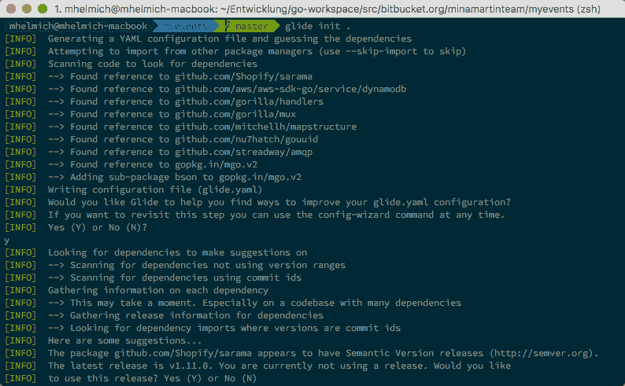

`glide init` 命令将在应用程序的根目录中创建一个 `glide.yaml` 文件，其中声明了所有必需的依赖项。对于 MyEvents 应用程序，此文件应该类似于这样：

```go
package: todo.com/myevents 
import: 
- package: github.com/Shopify/sarama 
  version: ¹.11.0 
- package: github.com/aws/aws-sdk-go 
  version: ¹.8.17 
  subpackages: 
  - service/dynamodb 
- package: github.com/gorilla/handlers 
  version: ¹.2.0 
# ... 
```

`glide.yaml` 文件声明了您的项目需要哪些依赖项。创建此文件后，您可以运行 `glide update` 命令来实际解析声明的依赖项并将它们下载到您的 `vendor/` 目录中。

如前面的屏幕截图所示，`glide update` 不仅会将 `glide.yaml` 文件中声明的依赖项下载到 `vendor/` 目录中，还会下载它们的依赖项。最终，Glide 将递归下载应用程序的整个依赖树，并将其放在 `vendor/` 目录中。

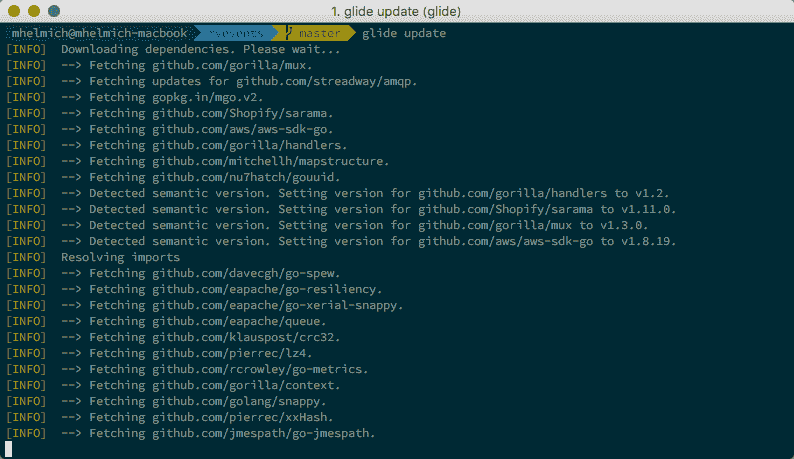

对于它下载的每个包，Glide 将精确的版本写入一个新文件 `glide.lock`（您可以通过打开它来查看此文件，但实际上不应手动编辑）。`glide.lock` 文件允许您通过运行 `glide install` 在任何以后的时间点重建这组精确的依赖项及其精确的版本。您可以通过删除您的 `vendor/` 目录然后运行 `glide install` 来验证此行为。

拥有 `vendor/` 目录和 Glide 配置文件会给您以下两个选项：

+   您可以将整个 `vendor/` 目录与实际应用程序文件一起放入版本控制。好处是，现在任何人都可以克隆您的存储库（在这种情况下，任何人都包括想要构建和部署您的代码的 CI/CD 工具），并且所有依赖项的确切所需版本都可以立即使用。这样，从头构建应用程序实际上只是一个 `git clone` 或 `go build` 命令。缺点是，您的源代码存储库会变得更大，可能需要更多的磁盘空间来存储，克隆需要更多的时间。

+   或者，您可以将 `glide.yaml` 和 `glide.lock` 文件放入版本控制，并通过将其添加到 `.gitignore` 文件中来排除 `vendor/` 目录。好处是，这样可以使您的存储库更小，克隆速度更快。但是，在克隆存储库后，用户现在需要显式运行 `glide install` 从互联网下载 `glide.lock` 文件中指定的依赖项。

这两个选项都可以很好地工作，因此最终这是个人口味的问题。由于存储库大小和磁盘空间在这些天很少被考虑，而且因为它使构建过程显着更容易，所以我个人偏好于将整个 `vendor/` 目录放入版本控制：

```go
$ git add vendor 
$ git commit -m"Add dependencies" 
$ git push 
```

这关注了我们的后端服务，但我们还需要考虑前端应用程序。由于我们在第五章中使用 npm 来安装我们的依赖项，大部分工作已经为我们完成。有趣的是，关于是否将依赖项放入版本控制的确切论点（在这种情况下，是`node_modules/`目录而不是`vendor/`）也适用于 npm。是的，就像 Go 的`vendor/`目录一样，我更喜欢将整个`node_modules/`目录放入版本控制中：

```go
$ git add node_modules 
$ git commit -m "Add dependencies" 
$ git push 
```

明确声明项目的依赖关系（包括使用的版本）是确保可重现构建的重要一步。根据您选择是否将依赖项包含在版本控制中，用户在克隆源代码存储库后要么直接获得整个应用程序源代码（包括依赖项），要么可以通过运行`glide install`或`npm install`来轻松重建它。

现在我们已经将项目放入版本控制，并明确声明了依赖关系，我们可以看一下一些最流行的 CI/CD 工具，您可以使用它们来持续构建和部署您的应用程序。

# 使用 Travis CI

**Travis CI**是一个持续集成的托管服务。它与 GitHub 紧密耦合（这就是为什么您实际上需要在 GitHub 上拥有一个 Git 存储库才能使用 Travis CI）。它对于开源项目是免费的，这与其良好的 GitHub 集成一起，使其成为许多热门项目的首选。对于构建私有 GitHub 项目，有一个付费使用模式。

Travis 构建的配置是通过一个名为`.travis.yml`的文件完成的，该文件需要存在于存储库的根级别。基本上，这个文件可以看起来像这样：

```go
language: go 
go: 
  - 1.6 
  - 1.7 
  - 1.8 
 - 1.9
env: 
  - CGO_ENABLED=0 

install: true 
script: 
  - go build 
```

`language`属性描述了您的项目所使用的编程语言。根据您在这里提供的语言，您将在构建环境中有不同的工具可用。`go`属性描述了应该为哪些 Go 版本构建您的应用程序。对于可能被多种用户在潜在非常不同的环境中使用的库来说，测试您的代码是否适用于多个 Go 版本尤为重要。`env`属性包含应该传递到构建环境中的环境变量。请注意，我们之前在第六章中使用过`CGO_ENABLED`环境变量，*在容器中部署您的应用程序*，来指示 Go 编译器生成静态链接的二进制文件。

`install`属性描述了设置应用程序依赖项所需的步骤。如果完全省略，Travis 将自动运行`go get ./...`来下载所有依赖项的最新版本（这正是我们不想要的）。`install: true`属性实际上指示 Travis 不执行任何设置依赖项的操作，这正是我们应该采取的方式，如果您的依赖项已经包含在您的源代码存储库中。

如果您决定不在版本控制中包含您的`vendor/`目录，则安装步骤需要包含 Travis 下载 Glide 并使用它来安装项目的依赖项的说明：

```go
install: 
  - go get -v github.com/Masterminds/glide 
  - glide install 
```

`script`属性包含 Travis 应该运行的命令，以实际构建您的项目。当然，构建您的应用程序的最明显的步骤是`go build`命令。当然，您可以在这里添加额外的步骤。例如，您可以使用`go vet`命令来检查您的源代码是否存在常见错误：

```go
scripts: 
  - go vet $(go list ./... | grep -v vendor)
 - cd eventservice && go build 
  - cd bookingservice && go build 
```

`$(go list ./... | grep -v vendor)`命令是一个特殊的技巧，用于指示`go vet`不要分析包目录中的`vendor/`源代码。否则，`go vet`可能会抱怨您的项目依赖项中的许多问题，您可能不想（甚至无法）修复。

创建`.travis.yml`文件后，将其添加到版本控制并将其推送到远程存储库：

```go
$ git add .travis.yml 
$ git commit -m "Configure Travis CI" 
$ git push 
```

现在您的存储库中有一个*.travis.yml*文件，您可以为该存储库启用 Travis 构建。为此，请使用 GitHub 凭据登录[`travis-ci.org`](https://travis-ci.org)（如果您打算使用付费版，则使用[`travis-ci.com`](https://travis-ci.com)），登录后，您将找到您的公开可用 GitHub 存储库列表，以及一个开关，允许您为每个存储库启用 Travis 构建（就像以下截图中一样）：

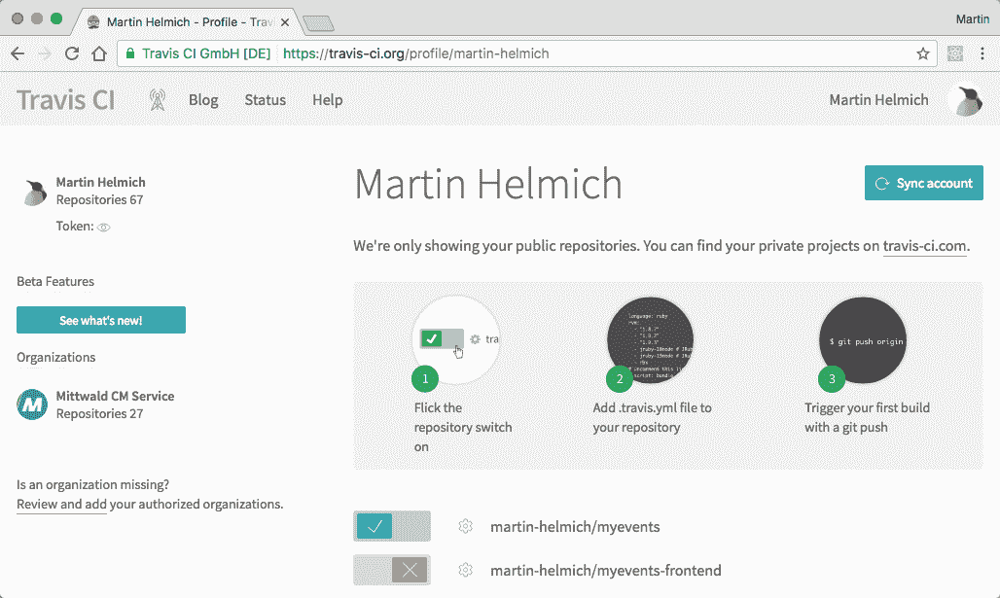

继续启用`myevents`和`myevents-frontend`存储库（如果其中一个存储库中没有`.travis.yml`文件也没关系）。

在 Travis 用户界面中启用项目后，下一次对存储库的 Git 推送将自动触发 Travis 上的构建。您可以通过对代码进行小的更改或只是在某个地方添加一个新的空文本文件并将其推送到 GitHub 来测试这一点。在 Travis 用户界面中，您会很快注意到项目的新构建弹出。

构建将运行一段时间（从计划构建到实际执行可能需要一段时间）。之后，您将看到构建是否成功完成或是否发生错误（在后一种情况下，您还将通过电子邮件收到通知），如下所示：

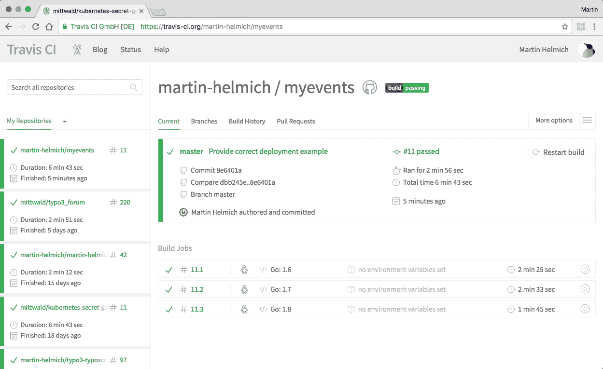

如果您已经指定了多个要测试的 Go 版本，您将注意到每个提交都有多个构建作业（就像前面的截图中一样）。单击其中任何一个以接收详细的构建输出。如果您的构建因任何原因失败（当您推送无法通过`go vet`或甚至无法编译的代码时，这是非常有用的）。

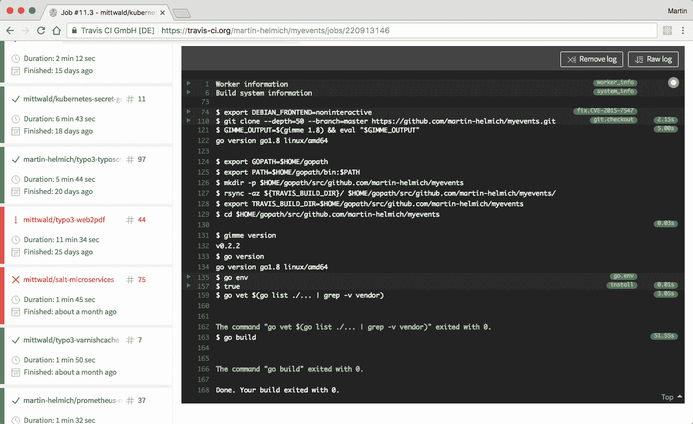

总的来说，Travis 与 GitHub 集成得非常好。在 GitHub 用户界面中，您还将看到每个提交的当前构建状态，并且还可以使用 Travis 在将其合并到主分支之前验证拉取请求。

到目前为止，我们已经使用 Travis 来验证存储库中的代码是否不包含任何错误并且可以编译（这通常是持续集成的目标）。但是，我们还没有配置应用程序的实际部署。这就是我们接下来要做的事情。

在 Travis 构建中，您可以使用 Docker 构建和运行容器映像。要启用 Docker 支持，请将以下属性添加到您的`.travis.yml`文件的顶部：

```go
sudo: required 
services: 
  - docker 
language: go 
go: 
  - 1.9 
```

由于我们实际上不想为多个不同版本的 Go 构建 Docker 映像，因此完全可以从 Travis 文件中删除 Go 版本 1.6 到 1.8。

由于我们的项目实际上由两个部署构件（事件服务和预订服务）组成，我们可以进行另一个优化：我们可以使用构建矩阵并行构建这两个服务。为此，请将`env`属性添加到您的`.travis.yml`文件，并调整`script`属性，如下所示：

```go
sudo: required 
services: 
  - docker 
language: go 
go: 1.9 
env: 
  global: 
    - CGO_ENABLED=0 
  matrix: 
    - SERVICE=eventservice 
    - SERVICE=bookingservice
 install: true 
script: 
  - go vet $(go list ./... | grep -v vendor) 
  - cd $SERVICE && go build 
```

有了这个配置，Travis 将为代码存储库中的每次更改启动两个构建作业，其中每个构建一个包含在该存储库中的两个服务之一。

之后，您可以将`docker image build`命令添加到`script`属性中，以从编译的服务构建容器映像：

```go
script: 
  - go vet $(go list ./... | grep -v vendor) 
  - cd $SERVICE && go build 
  - docker image build -t myevents/$SERVICE:$TRAVIS_BRANCH $SERVICE 
```

上述命令构建了一个名为`myevents/eventservice`或`myevents/bookingservice`的 Docker 镜像（取决于当前`$SERVICE`的值）。Docker 镜像是使用当前分支（或 Git 标签）名称作为标记构建的。这意味着对*master*分支的新推送将导致构建一个`myevents/eventservice:master`镜像。当推送名为*v1.2.3*的 Git 标签时，将创建一个`myevents/eventservice:v1.2.3`镜像。

最后，您需要将新的 Docker 镜像推送到注册表。为此，请将一个新属性`after_success`添加到您的`.travis.yml`文件中：

```go
after_success: 
  - if [ -n "${TRAVIS_TAG}" ] ; then 
      docker login -u="${DOCKER_USERNAME}" -p="${DOCKER_PASSWORD}"; 
      docker push myevents/$SERVICE:$TRAVIS_BRANCH; 
    fi 
```

在`after_success`中指定的命令将在`scripts`中的所有命令成功完成后运行。在这种情况下，我们正在检查`$TRAVIS_TAG`环境变量的内容；因此，只有为 Git 标签构建的 Docker 镜像才会实际推送到远程注册表。

如果您使用的是与 Docker Hub 不同的 Docker 镜像注册表，请记住在`docker login`命令中指定注册表的 URL。例如，当使用`quay.io`作为注册表时，命令应如下所示：`docker login -u="${DOCKER_USERNAME}" -p="${DOCKER_PASSWORD}" quay.io`。

为了使此命令工作，您需要定义环境变量`$DOCKER_USERNAME`和`$DOCKER_PASSWORD`。理论上，您可以在`.travis.yml`文件的`env`部分中定义这些变量。但是，对于诸如密码之类的敏感数据，将它们定义在公开可用的文件中供所有人查看是一个非常愚蠢的想法。相反，您应该使用 Travis 用户界面为构建配置这些变量。为此，请转到项目的设置页面，您可以在项目概述页面上单击“更多选项”按钮时找到：

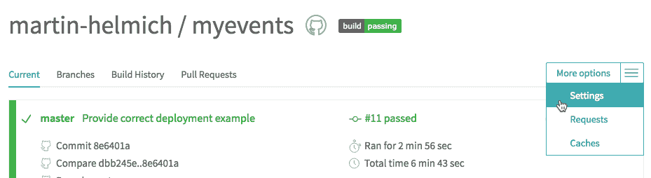

在项目设置中，您将找到一个名为环境变量的部分。通过指定`DOCKER_USERNAME`和`DOCKER_PASSWORD`变量在这里配置您的 Docker 注册表凭据：

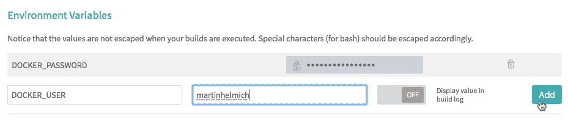

或者，您可以通过加密后将秘密变量添加到您的`.travis.yml`文件中，然后将其放置在版本控制中。为此，您将需要 Travis 命令行客户端 CLI。Travis CLI 是一个 Ruby 工具，您可以通过 Ruby 软件包管理器`gem`安装。

```go
$ gem install travis
```

之后，您可以使用 Travis CLI 对变量进行加密，并自动将其添加到您的`.travis.yml`文件中：

```go
$ travis encrypt DOCKER_PASSWORD="my-super-secret-password" --add
```

这将向您的`.travis.yml`文件添加一个新变量，看起来像这样：

```go
...
env:
 global:
 - secure: <encrypted value>
```

通过 Travis UI 添加您的秘密变量以及对其进行加密并将其添加到您的`.travis.yml`文件中，这两种方法都是处理 Travis 构建中的敏感数据的有效方法。

将新的构建配置保存在`.travis.yml`中，并将其推送到 GitHub。要构建和发布新的 Docker 镜像，现在可以推送一个新的`git`标签：

```go
$ git tag v1.0.0 
$ git push --tags 
```

此时，Travis CI 将拉取您的代码，编译所有 Go 二进制文件，并为构建配置中配置的 Docker 注册表发布两个后端服务的 Docker 镜像。

我们仍然需要为前端应用程序添加类似的构建配置。实际上，构建 Docker 镜像的步骤完全相同；但是，我们需要运行 Webpack 模块打包程序而不是`go build`。以下是一个应该涵盖整个前端构建的`.travis.yml`文件：

```go
language: node_js 
node_js: 
  - 6 
env: 
  - SERVICE=frontend 
install: 
  - npm install -g webpack typescript 
  - npm install 
script: 
  - webpack 
after_success: 
  - if [ -n "${TRAVIS_TAG}" ] ; then 
    docker login -u="${DOCKER_USERNAME}" -p="${DOCKER_PASSWORD}"; 
    docker push myevents/${SERVICE}:${TRAVIS_BRANCH}; 
    fi 
```

# 部署到 Kubernetes

使用 GitHub 和 Travis，我们现在已经自动化了从更改应用程序源代码到构建新二进制文件再到创建新的 Docker 镜像并将其推送到容器注册表的整个工作流程。这很棒，但我们仍然缺少一个关键步骤，那就是在生产环境中运行新的容器映像。

在之前的章节中，您已经使用 Kubernetes 并将容器化应用部署到 Minikube 环境中。对于本节，我们将假设您已经拥有一个正在运行的公共可访问的 Kubernetes 环境（例如，使用 AWS 中的 `kops` 提供的集群或 Azure 容器服务）。

首先，Travis CI 需要访问您的 Kubernetes 集群。为此，您可以在 Kubernetes 集群中创建一个 **服务账户**。然后，该服务账户将收到一个 API 令牌，您可以在 Travis 构建中配置为秘密环境变量。要创建服务账户，请在本地机器上运行以下命令（假设您已经设置了 `kubectl` 以与 Kubernetes 集群通信）：

```go
$ kubectl create serviceaccount travis-ci 
```

上述命令将创建一个名为 `travis-ci` 的新服务账户和一个包含该账户 API 令牌的新密钥对象。要确定密钥，现在运行 `kubectl describe serviceaccount travis-ci` 命令：

```go
$ kubectl describe serviceaccount travis-ci 
Name:        travis-ci 
Namespace:   default 
Labels:      <none> 
Annotations: <none> 

Image pull secrets: <none> 
Mountable secrets:  travis-ci-token-mtxrh 
Tokens:             travis-ci-token-mtxrh 
```

使用令牌密钥名称（在本例中为 `travis-ci-token-mtxrh`）来访问实际的 API 令牌：

```go
$ kubectl get secret travis-ci-token-mtxrh -o=yaml 
apiVersion: v1 
kind: Secret 
data: 
  ca.crt: ... 
  namespace: ZGVmYXVsdA== 
  token: ... 
# ... 
```

您将需要 `ca.crt` 和 `token` 属性。这两个值都是 BASE64 编码的，因此您需要通过 `base64 --decode` 管道传递这两个值来访问实际值：

```go
$ echo "<token from above>" | base64 --decode 
$ echo "<ca.crt from above>" | base64 --decode 
```

与 API 服务器的 URL 一起，这两个值可以用于从 Travis CI（或其他 CI/CD 工具）对 Kubernetes 集群进行身份验证。

要在 Travis CI 构建中实际配置 Kubernetes 部署，请从在 `install` 部分添加以下命令开始设置 `kubectl`：

```go
install: 
  - curl -LO https://storage.googleapis.com/kubernetes- 
release/release/v1.6.1/bin/linux/amd64/kubectl && chmod +x kubectl 
  - echo "${KUBE_CA_CERT}" > ./ca.crt 
  - ./kubectl config set-credentials travis-ci --token="${KUBE_TOKEN}" 
  - ./kubectl config set-cluster your-cluster --server=https://your-kubernetes-cluster --certificate-authority=ca.crt 
  - ./kubectl config set-context your-cluster --cluster=your-cluster --user=travis-ci --namespace=default 
  - ./kubectl config use-context your-cluster 
```

要使这些步骤生效，您需要在 Travis CI 设置中将环境变量 `$KUBE_CA_CERT` 和 `$KUBE_TOKEN` 配置为秘密环境变量，并使用从上述 `kubectl get secret` 命令中获取的值。

在配置了 `kubectl` 后，您现在可以将额外的步骤添加到您的项目的 `after_success` 命令中：

```go
after_success: 
  - if [ -n "${TRAVIS_TAG}" ] ; then 
    docker login -u="${DOCKER_USERNAME}" -p="${DOCKER_PASSWORD}"; 
    docker push myevents/${SERVICE}:$TRAVIS_BRANCH; 
    ./kubectl set image deployment/${SERVICE} api=myevents/${SERVICE}:${TRAVIS_BRANCH}; 
    fi 
```

`kubectl set image` 命令将更改应该用于给定 Deployment 对象的容器镜像（在本例中，假设您有名为 `eventservice` 和 `bookingservice` 的部署）。Kubernetes 部署控制器将继续使用新的容器镜像创建新的 Pod，并关闭运行旧镜像的 Pod。

# 使用 GitLab

GitHub 和 Travis 都是构建和部署开源项目（以及私有项目，如果您不介意为其服务付费）的优秀工具。然而，在某些情况下，您可能希望在自己的环境中托管源代码管理和 CI/CD 系统，而不是依赖外部服务提供商。

这就是 GitLab 发挥作用的地方。GitLab 是一种类似于 GitHub 和 Travis 组合的服务的软件（意味着源代码管理和 CI），您可以在自己的基础设施上托管。在接下来的部分中，我们将向您展示如何设置自己的 GitLab 实例，并构建一个类似于前一节中使用 GitLab 和其 CI 功能构建的构建和部署流水线。

GitLab 提供开源的 **社区版**（**CE**）和付费的 **企业版**（**EE**），提供一些额外的功能。对于我们的目的，CE 就足够了。

# 设置 GitLab

您可以使用供应商提供的 Docker 镜像轻松地设置自己的 GitLab 实例。要启动 GitLab CE 服务器，请运行以下命令：

```go
$ docker container run --detach \
  -e GITLAB_OMNIBUS_CONFIG="external_url 'http://192.168.2.125/';" \
  --name gitlab \
  -p 80:80 \
  -p 22:22 \
  gitlab/gitlab-ce:9.1.1-ce.0
```

注意传递到容器中的 `GITLAB_OMNIBUS_CONFIG` 环境变量。此变量可用于将配置代码（用 Ruby 编写）注入到容器中；在本例中，它用于配置 GitLab 实例的公共 HTTP 地址。在本地启动 GitLab 时，通常最容易使用您的机器的公共 IP 地址（在 Linux 或 macOS 上，使用 `ifconfig` 命令找到它）。

如果您要在服务器上为生产使用设置 GitLab（而不是在本地机器上进行实验），您可能希望为配置和存储库数据创建两个数据卷，然后可以在容器中使用。这将使您能够轻松地将 GitLab 安装升级到较新的版本：

```go
$ docker volume create gitlab-config
$ docker volume create gitlab-data
```

创建卷后，在`docker container run`命令中使用`-v gitlab-config:/etc/gitlab`和`-v gitlab-data:/var/opt/gitlab`标志，以实际为 Gitlab 实例使用这些卷。

在新创建的容器中运行的 GitLab 服务器可能需要几分钟才能完全启动。之后，您可以在`http://localhost`上访问您的 GitLab 实例：

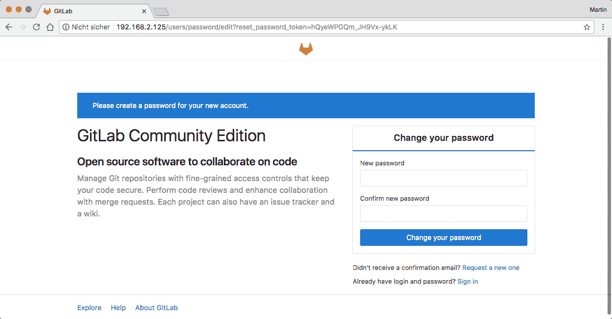

首次在浏览器中打开 GitLab 时，您将被提示为初始用户设置新密码。设置密码后，您可以使用用户名`root`和之前设置的密码登录。如果您正在设置 GitLab 的生产实例，下一步将是设置一个新用户，您可以使用该用户登录，而不是 root。出于演示目的，继续作为 root 进行工作也是可以的。

首次登录后，您将看到一个“开始”页面，您可以在该页面上创建新的组和新项目。GitLab 项目通常与 Git 源代码存储库相关联。为了为 MyEvents 应用程序设置 CI/CD 流水线，请继续创建两个名为`myevents`和`myevents-frontend`的新项目，如下所示：

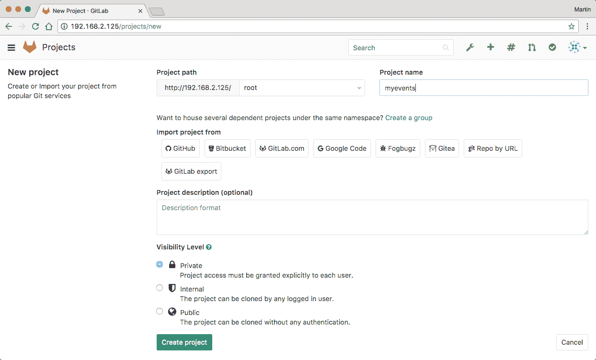

为了将代码推送到新的 GitLab 实例中，您需要提供用于身份验证的 SSH 公钥。为此，请点击右上角的用户图标，选择“设置”，然后选择 SSH 密钥选项卡。将您的 SSH 公钥粘贴到输入字段中并保存。

接下来，将您的新 GitLab 存储库添加为现有 MyEvents 存储库的远程，并推送您的代码：

```go
$ git remote add gitlab ssh://git@localhost/root/myevents.git 
$ git push gitlab master:master 
```

类似地进行前端应用程序的设置。之后，您将能够在 GitLab Web UI 中找到您的文件：

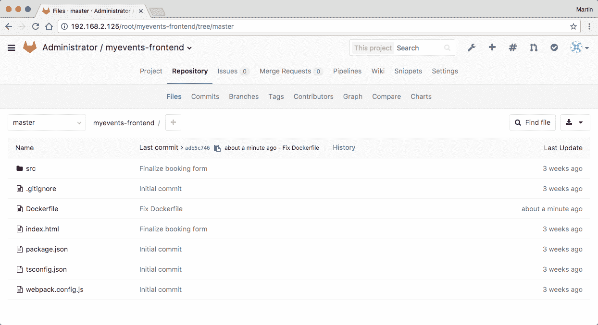

# 设置 GitLab CI

为了使用 GitLab 的 CI 功能，您需要设置一个额外的组件：GitLab CI Runner。虽然 GitLab 本身负责管理应用程序的源代码并决定何时触发新的 CI 构建，但 CI Runner 负责实际执行这些作业。将实际的 GitLab 容器与 CI Runner 分开允许您分发 CI 基础设施，并且例如在不同的机器上拥有多个 Runner。 

GitLab CI Runner 也可以使用 Docker 镜像进行设置。要设置 CI Runner，请运行以下命令：

```go
$ docker container run --detach \ 
    --name gitlab-runner \ 
    --link gitlab:gitlab \ 
    -v /var/run/docker.sock:/var/run/docker.sock \ 
    gitlab/gitlab-runner:v1.11.4 
```

启动 GitLab CI Runner 后，您需要在主 GitLab 实例上注册它。为此，您将需要 Runner 的注册令牌。您可以在 GitLab UI 的管理区域中找到此令牌。通过右上角的扳手图标访问管理区域，然后选择 Runners。您将在第一个文本段落中找到 Runner 的注册令牌：

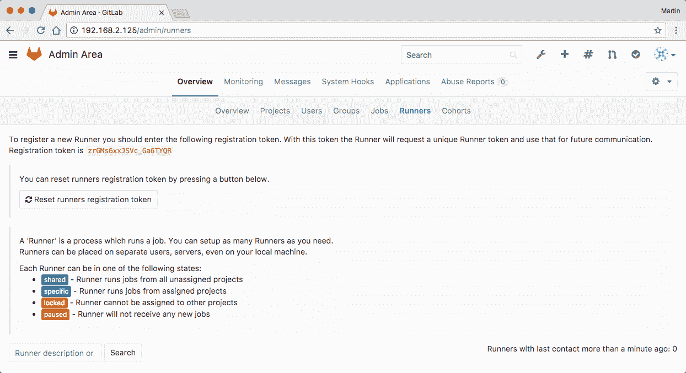

要注册您的 Runner，请运行以下命令：

```go
$ docker container exec \ 
    -it gitlab-runner \ 
    gitlab-runner register -n \ 
      --url http://gitlab \ 
      --registration-token <TOKEN> \ 
      --executor docker \ 
      --docker-image ubuntu:16.04 \ 
      --docker-volumes /var/run/docker.sock:/var/run/docker.sock \
      --description "Gitlab CI Runner" 
```

此命令在主 GitLab 实例上注册先前启动的 GitLab CI Runner。`--url`标志配置了主 GitLab 实例的可访问 URL（通常情况下，当您的 runner 在与主 Gitlab 实例相同的容器网络上时，这可以是`http://gitlab`；或者，您可以在这里使用您主机的公共 IP 地址，我的情况下是`http://192.168.2.125/`）。接下来，复制并粘贴`--registration-token`标志的注册令牌。`--executor`标志配置 GitLab CI Runner 在自己的隔离 Docker 容器中运行每个构建作业。`--docker-image`标志配置默认情况下应该用作构建环境的 Docker 镜像。`--docker-volumes`标志确保您可以在构建中使用 Docker Engine（这一点尤为重要，因为我们将在这些构建中构建我们自己的 Docker 镜像）。

将`/var/run/docker.sock`套接字挂载到您的 Gitlab Runner 中，将您主机上运行的 Docker 引擎暴露给您的 CI 系统的用户。如果您不信任这些用户，这可能构成安全风险。或者，您可以设置一个新的 Docker 引擎，它本身运行在一个容器中（称为 Docker-in-Docker）。有关详细的设置说明，请参阅 GitLab 文档[`docs.gitlab.com/ce/ci/docker/using_docker_build.html#use-docker-in-docker-executor`](https://docs.gitlab.com/ce/ci/docker/using_docker_build.html#use-docker-in-docker-executor)。

`docker exec`命令应该产生类似于以下截图的输出：

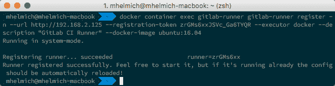

成功注册 Runner 后，您应该能够在 GitLab 管理 UI 中找到它：

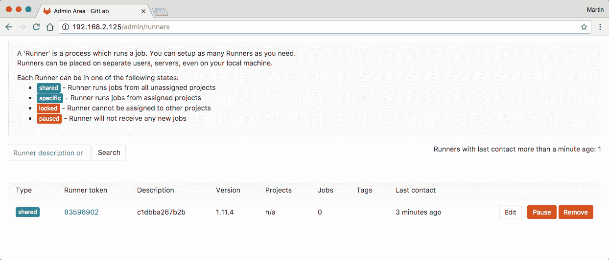

现在您已经有一个工作的 CI Runner，您可以开始配置实际的 CI 作业。与 Travis CI 类似，GitLab CI 作业是通过一个配置文件进行配置的，该文件放置在源代码存储库中。与已知的`.travis.yml`类似，该文件名为`.gitlab-ci.yml`。尽管它们的名称相似，但其格式略有不同。

每个 GitLab CI 配置由多个阶段组成（默认情况下为构建、测试和部署，尽管这是完全可定制的）。每个阶段可以包含任意数量的作业。所有阶段一起形成一个流水线。流水线中的每个作业都在自己隔离的 Docker 容器中运行。

让我们从 MyEvents 后端服务开始。在项目的根目录中放置一个新文件`.gitlab-ci.yml`：

```go
build:eventservice: 
  image: golang:1.9.2 
  stage: build 
  before_script: 
    - mkdir -p $GOPATH/src/todo.com 
    - ln -nfs $PWD $GOPATH/src/todo.com/myevents 
    - cd $GOPATH/src/todo.com/myevents/eventservice 
  script: 
    - CGO_ENABLED=0 go build 
  artifacts: 
    paths: 
      - ./eventservice/eventservice 
```

那么，这段代码实际上是做什么呢？首先，它指示 GitLab CI Runner 在基于`golang:1.9.2`镜像的 Docker 容器中启动此构建。这确保您在构建环境中可以访问最新的 Go SDK。`before_script`部分中的三个命令负责设置`$GOPATH`，`script`部分中的一个命令是实际的编译步骤。

请注意，此构建配置假定您的项目的所有依赖项都已在版本控制中进行了分发。如果您的项目中只有一个`glide.yaml`文件，那么在实际运行`go build`之前，您还需要设置 Glide 并运行`glide install`。

最后，artifacts 属性定义了由 Go `build`创建的`eventservice`可执行文件应作为构建 artifact 进行存档。这将允许用户稍后下载此构建 artifact。此外，该 artifact 将在同一流水线的后续作业中可用。

现在，将`.gitlab-ci.yml`文件添加到您的源代码存储库中，并将其推送到 GitLab 服务器：

```go
$ git add .gitlab-ci.yml 
$ git commit -m "Configure GitLab CI" 
$ git push gitlab 
```

当您推送配置文件后，转到 GitLab Web UI 中的项目页面，然后转到 Pipelines 选项卡。您将找到为您的项目启动的所有构建流水线的概述，以及它们的成功情况：

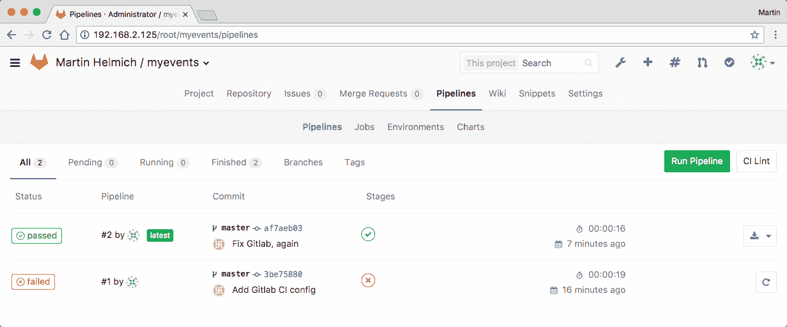

现在，我们的流水线只包括一个阶段（`build`）和一个作业（`build:eventservice`）。您可以在`Pipelines`概述的`Stages`列中看到这一点。要查看`build:eventservice`作业的确切输出，请单击流水线状态图标，然后单击`build:eventservice`作业：

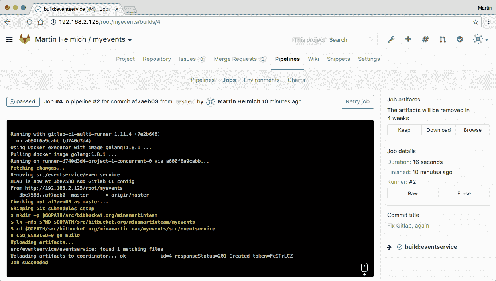

接下来，我们可以扩展我们的`.gitlab-ci.yml`配置文件，以包括预订服务的构建：

```go
build:eventservice: # ... 

build:bookingservice: 
  image: golang:1.9.2 
  stage: build 
  before_script: 
    - mkdir -p $GOPATH/src/todo.com 
    - ln -nfs $PWD $GOPATH/src/todo.com/myevents 
    - cd $GOPATH/src/todo.com/myevents/bookingservice 
  script: 
    - CGO_ENABLED=0 go build 
  artifacts: 
    paths: 
      - ./bookingservice/bookingservice 
```

当您再次推送代码时，您会注意到为您的项目启动的下一个流水线由两个作业并行运行（更多或更少，取决于 GitLab CI Runner 的配置及其当前工作负载）：

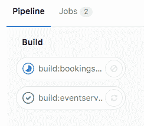

接下来，我们可以添加两个构建实际 Docker 镜像的作业。这些作业需要在已经配置的构建步骤之后执行，因为我们需要编译后的 Go 二进制文件来创建 Docker 镜像。因此，我们无法将 docker 构建步骤配置为在构建阶段运行（一个阶段内的所有作业是并行执行的，至少在潜在情况下，并且不能相互依赖）。因此，我们将首先重新配置项目的构建阶段。这也是在`.gitlab-ci.yml`文件中基于每个项目的基础上完成的：

```go
stages: 
  - build 
  - dockerbuild 
  - publish 
  - deploy 

build:eventservice: # ... 
```

接下来，我们可以在实际的构建作业中使用这些新的阶段：

```go
dockerbuild:eventservice: 
  image: docker:17.04.0-ce 
  stage: dockerbuild 
  dependencies: 
    - build:eventservice 
  script: 
    - docker container build -t myevents/eventservice:$CI_COMMIT_REF_NAME eventservice 
  only: 
    - tags 
```

`dependencies`属性声明了这一步需要先完成`build:eventservice`作业。它还使得该作业的构建产物在这个作业中可用。`script`只包含`docker container build`命令(`$CI_COMMIT_REF_NAME`)，其中包含当前 Git 分支或标签的名称。`only`属性确保只有在推送新的 Git 标签时才构建 Docker 镜像。

为构建预订服务容器镜像添加相应的构建作业：

```go
dockerbuild:bookingservice: 
  image: docker:17.04.0-ce 
  stage: dockerbuild 
  dependencies: 
    - build:bookingservice 
  script: 
    - docker container build -t myevents/bookingservice:$CI_COMMIT_REF_NAME bookingservice 
  only: 
    - tags 
```

将修改后的`.gitlab-ci.yml`文件添加到版本控制中，并创建一个新的 Git 标签来测试新的构建流水线：

```go
$ git add .gitlab-ci.yml 
$ git commit -m"Configure Docker builds" 
$ git push gitlab 

$ git tag v1.0.1 
$ git push gitlab --tags 
```

在流水线概述中，您现在会找到四个构建作业：

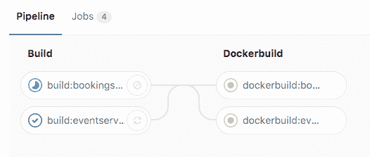

构建 Docker 镜像后，我们现在可以添加第五个构建步骤，将创建的注册表发布到 Docker 注册表中：

```go
publish: 
  image: docker:17.04.0-ce 
  stage: publish 
  dependencies: 
    - dockerbuild:eventservice 
    - dockerbuild:bookingservice 
  before_script: 
    - docker login -u ${DOCKER_USERNAME} -p ${DOCKER_PASSWORD} 
  script: 
    - docker push myevents/eventservice:${CI_COMMIT_REF_NAME} 
    - docker push myevents/bookingservice:${CI_COMMIT_REF_NAME} 
  only: 
    - tags 
```

与之前的 Travis CI 构建类似，这个构建作业依赖于环境变量`$DOCKER_USERNAME`和`$DOCKER_PASSWORD`。幸运的是，GitLab CI 提供了类似于 Travis CI 的秘密环境变量的功能。为此，在 GitLab web UI 中打开项目的设置选项卡，然后选择 CI/CD Pipelines 选项卡，搜索秘密变量部分：

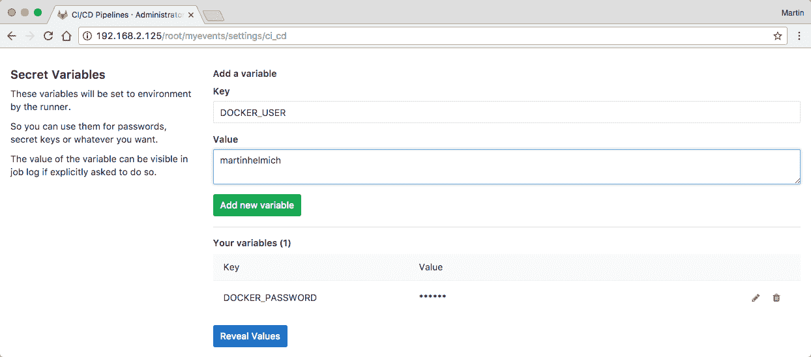

使用此功能配置您选择的容器注册表的凭据（如果您使用的是 Docker Hub 之外的注册表，请记得相应地调整前面构建作业中的`docker login`命令）。

最后，让我们为将应用程序实际部署到 Kubernetes 集群中添加最终的构建步骤：

```go
deploy: 
  image: alpine:3.5 
  stage: deploy 
  environment: production 
  before_script: 
    - apk add --update openssl 
    - wget -O /usr/local/bin/kubectl https://storage.googleapis.com/kubernetes- 
release/release/v1.6.1/bin/linux/amd64/kubectl && chmod +x /usr/local/bin/kubectl 
    - echo "${KUBE_CA_CERT}" > ./ca.crt 
    - kubectl config set-credentials gitlab-ci --token="${KUBE_TOKEN}" 
    - kubectl config set-cluster your-cluster --server=https://your-kubernetes-cluster.example --certificate-authority=ca.crt 
    - kubectl config set-context your-cluster --cluster=your-cluster --user=gitlab-ci --namespace=default 
    - kubectl config use-context your-cluster 
  script: 
    - kubectl set image deployment/eventservice api=myevents/eventservice:${CI_COMMIT_REF_NAME} 
    - kubectl set image deployment/bookingservice api=myevents/eventservice:${CI_COMMIT_REF_NAME} 
  only: 
    - tags 
```

这个构建步骤使用了`alpine:3.5`基础镜像（一个非常小的镜像大小的极简 Linux 发行版），其中我们首先下载，然后配置`kubectl`二进制文件。这些步骤与我们在前面部分配置的 Travis CI 部署类似，并且需要在 GitLab UI 中将环境变量`$KUBE_CA_CERT`和`$KUBE_TOKEN`配置为秘密变量。

请注意，在这个例子中，我们使用了一个名为`gitlab-ci`的 Kubernetes 服务账户（之前，我们创建了一个名为`travis-ci`的账户）。因此，为了使这个例子工作，您需要使用在前面部分已经使用过的命令创建一个额外的服务账户。

到目前为止，我们基于 GitLab 的构建和部署流水线已经完成。再次查看 GitLab UI 中的流水线视图，以充分了解我们的流水线：

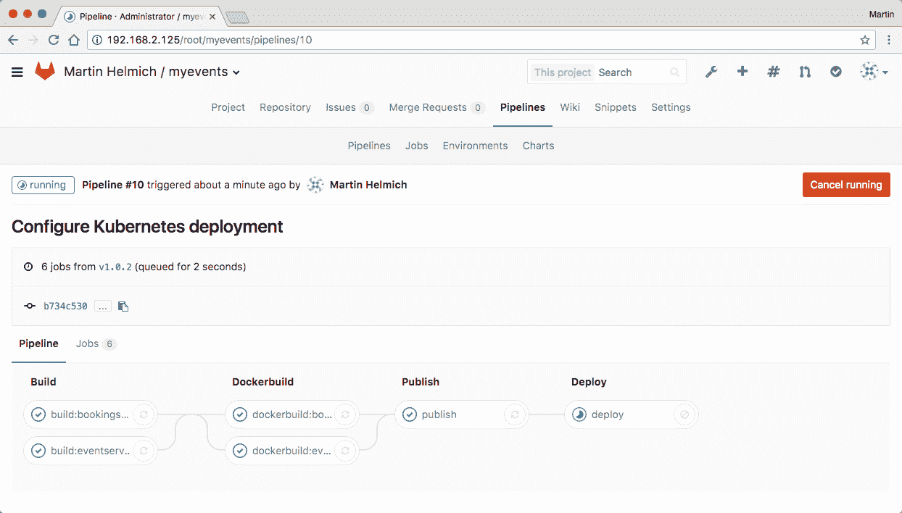

GitLab 的流水线功能几乎是实现复杂构建和部署流程的完美解决方案。而其他 CI/CD 工具会限制你只能使用一个环境进行单一构建作业，GitLab 的流水线允许你为构建的每个步骤使用一个隔离的环境，甚至在可能的情况下并行运行这些步骤。

# 总结

在本章中，你学会了如何轻松自动化应用程序的构建和部署工作流程。在微服务架构中，拥有自动化的部署工作流程尤为重要，因为你会经常部署许多不同的组件。如果没有自动化，部署复杂的分布式应用程序将变得越来越繁琐，并且会影响你的生产效率。

现在我们的应用部署问题已经解决（简而言之，容器+持续交付），我们可以将注意力转向其他事项。我们部署的应用程序在运行并不意味着它实际上在做它应该做的事情。这就是为什么我们需要监控在生产环境中运行的应用程序。监控能够让你在运行时跟踪应用程序的行为并快速发现错误，这就是为什么下一章的重点将放在监控你的应用程序上。
