# 第十章：监控您的应用程序

在之前的章节中，您学习了如何使用 Go 编程语言构建微服务应用程序，以及如何（持续）将其部署到各种环境中。

然而，我们的工作还没有完成。当您在生产环境中运行应用程序时，您需要确保它保持运行并且表现出您作为开发人员预期的行为。这就是监控的作用。

在本章中，我们将向您介绍**Prometheus**，这是一款开源监控软件，它在监控基于云的分布式应用程序方面迅速赢得了人气。它通常与**Grafana**一起使用，后者是用于可视化 Prometheus 收集的指标数据的前端。这两个应用程序都是根据 Apache 许可证授权的。您将学习如何设置 Prometheus 和 Grafana，以及如何将它们集成到您自己的应用程序中。

在本章中，我们将涵盖以下主题：

+   安装和使用 Prometheus

+   安装 Grafana

+   从您自己的应用程序向 Prometheus 导出指标

# 设置 Prometheus 和 Grafana

在我们自己的应用程序中使用 Prometheus 和 Grafana 之前，让我们先看一下 Prometheus 的工作原理。

# Prometheus 的基础知识

与其他监控解决方案不同，Prometheus 通过定期从客户端拉取数据（在 Prometheus 行话中称为**指标**）来工作。这个过程称为**抓取**。被 Prometheus 监控的客户端必须实现一个 HTTP 端点，可以被 Prometheus 定期抓取（默认为 1 分钟）。然后，这些指标端点可以以预定义的格式返回特定于应用程序的指标。

例如，一个应用程序可以在`/metrics`上提供一个 HTTP 端点，响应`GET`请求并返回以下内容：

```go
memory_consumption_bytes 6168432 
http_requests_count{path="/events",method="get"} 241 
http_requests_count{path="/events",method="post"} 5 
http_requests_count{path="/events/:id",method="get"} 125 
```

此文档公开了两个指标——`memory_consumption_bytes`和`http_requests_count`。每个指标都与一个值相关联（例如，当前内存消耗为 6,168,432 字节）。由于 Prometheus 以固定间隔从您的应用程序抓取这些指标，它可以使用这些瞬时值来构建此指标的时间序列。

Prometheus 指标也可以有标签。在前面的示例中，您可能注意到`http_request_count`指标实际上具有不同组合的`path`和`method`标签的三个不同值。稍后，您将能够使用这些标签使用自定义查询语言**PromQL**从 Prometheus 查询数据。

应用程序导出到 Prometheus 的指标可能会变得非常复杂。例如，使用标签和不同的指标名称，客户端可以导出一个直方图，其中数据聚合在不同的桶中：

```go
http_request_duration_seconds_bucket{le="0.1"} 6835 
http_request_duration_seconds_bucket{le="0.5"} 79447 
http_request_duration_seconds_bucket{le="1"} 80700 
http_request_duration_seconds_bucket{le="+Inf"} 80953 
http_request_duration_seconds_sum 46135 
http_request_duration_seconds_count 80953 
```

前面的指标描述了您的应用程序的 HTTP 响应时间的直方图。在这种情况下，处理了 6,835 个响应时间小于 0.1 秒的请求；79,447 个响应时间小于 0.5 秒的请求（包括前面的 6,835 个请求）；等等。最后两个指标导出了处理的 HTTP 请求总数和处理这些请求所需的时间总和。这两个值可以一起用于计算平均请求持续时间。

不用担心，您不需要自己构建这些复杂的直方图指标；这就是 Prometheus 客户端库的作用。然而，首先，让我们通过实际设置一个 Prometheus 实例来开始。

# 创建初始的 Prometheus 配置文件

在我们自己的应用程序中使用 Prometheus 和 Grafana 之前，我们需要先设置它。幸运的是，您可以在 Docker Hub 上找到这两个应用程序的 Docker 镜像。在启动我们自己的 Prometheus 容器之前，我们只需要创建一个配置文件，然后将其注入到容器中。

首先，在本地机器上创建一个新目录，并在其中放置一个新的`prometheus.yml`文件：

```go
global: 
  scrape_interval: 15s 

scrape_configs: 
  - job_name: prometheus 
    static_configs: 
      - targets: ["localhost:9090"] 
```

此配置定义了全局的抓取间隔为 15 秒（默认值为 1 分钟），并且已经配置了第一个抓取目标，即 Prometheus 本身（是的，您读对了；Prometheus 导出 Prometheus 指标，然后您可以使用 Prometheus 监控）。

稍后，我们将向`scape_configs`属性添加更多配置项。目前，这就足够了。

# 在 Docker 上运行 Prometheus

创建配置文件后，我们可以使用卷挂载将此配置文件注入我们即将启动的 Docker 容器中。

在此示例中，我们假设您在本地机器上的 Docker 容器中运行了 MyEvents 应用程序，并且这些容器连接到名为`myevents`的容器网络（无论您是手动创建容器还是通过 Docker Compose 创建都无关紧要）。

因此，启动这两个应用程序非常容易。我们将首先为监控组件定义一个单独的容器网络：

```go
$ docker network create monitoring 
```

接下来，创建一个新的卷，Prometheus 服务器可以在其中存储其数据：

```go
$ docker volume create prometheus-data 
```

现在，您可以使用新创建的网络和卷来创建一个 Prometheus 容器：

```go
$ docker container run \ 
    --name prometheus \ 
    --network monitoring \ 
    --network myevents \ 
    -v $PWD/prometheus.yml:/etc/prometheus/prometheus.yml 
    -v prometheus-data:/prometheus 
    -p 9090:9090 
    prom/prometheus:v1.6.1 
```

请注意，在上面的示例中，我们将`prometheus`容器连接到`myevents`和`monitoring`网络。这是因为稍后，Prometheus 服务器将需要通过网络访问 MyEvents 服务，以从中抓取指标。

启动 Prometheus 容器后，您可以通过在浏览器中导航到[`localhost:9090`](http://localhost:9090/)来打开 Prometheus Web UI：

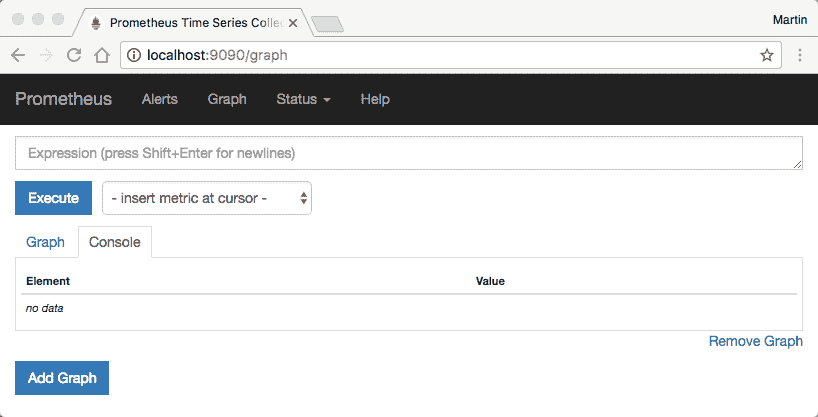

Prometheus Web UI

在我们的配置文件中，我们已经配置了第一个抓取目标——Prometheus 服务器本身。您可以通过选择“状态”菜单项，然后选择“目标”项来查看所有配置的抓取目标的概述：

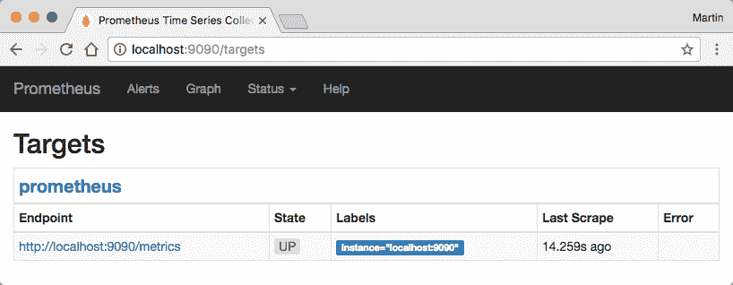

在 Prometheus Web UI 中的目标项

如前面的截图所示，Prometheus 报告了抓取目标的当前状态（在本例中为 UP）以及上次抓取的时间。

您现在可以使用“图形”菜单项来检查 Prometheus 已经收集的有关自身的指标。在那里，将`go_memstats_alloc_bytes`输入到表达式输入字段中，然后单击“执行”。之后，切换到“图形”选项卡。Prometheus 现在将打印其过去 1 小时的内存使用情况。您可以使用图表上方的控件更改观察期。默认情况下，Prometheus 将保留其时间序列数据 2 周：

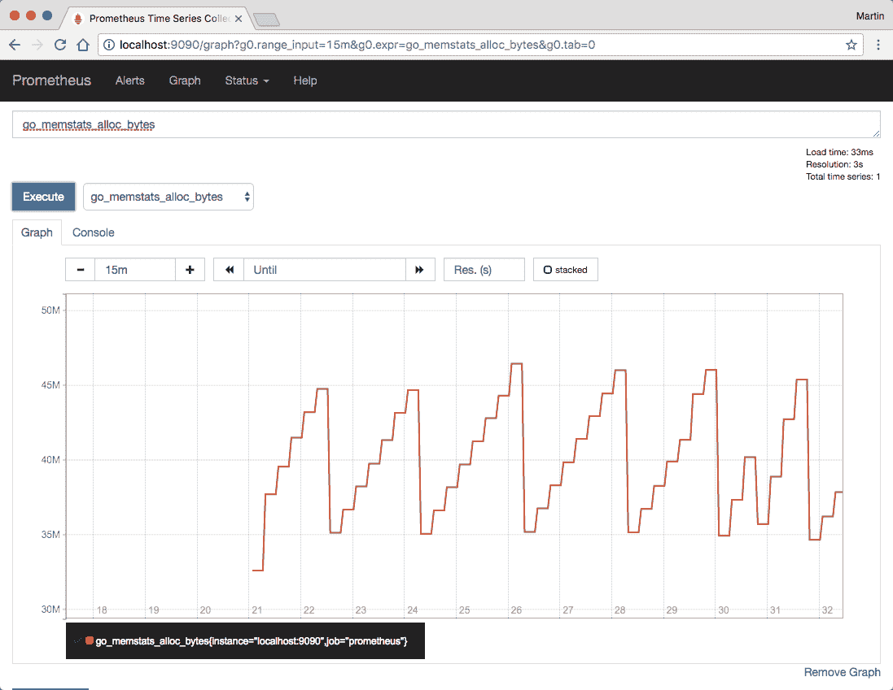

Prometheus Web UI 图形

Prometheus 还支持更复杂的表达式。例如，考虑`process_cpu_seconds_total`指标。当将其显示为图形时，您会注意到它是单调递增的。这是因为该特定指标描述了程序在其整个生命周期内使用的所有 CPU 秒数的总和（根据定义，这必须始终是递增的）。然而，出于监控目的，了解进程的当前 CPU 使用情况通常更有趣。为此，PromQL 提供了`rate()`方法，用于计算时间序列的每秒平均增加量。尝试使用以下表达式：

```go
rate(process_cpu_seconds_total[1m]) 
```

在图形视图中，您现在将找到每秒的 1 分钟平均 CPU 使用率（这可能是一个比所有已使用的 CPU 秒数总和更易理解的指标）：

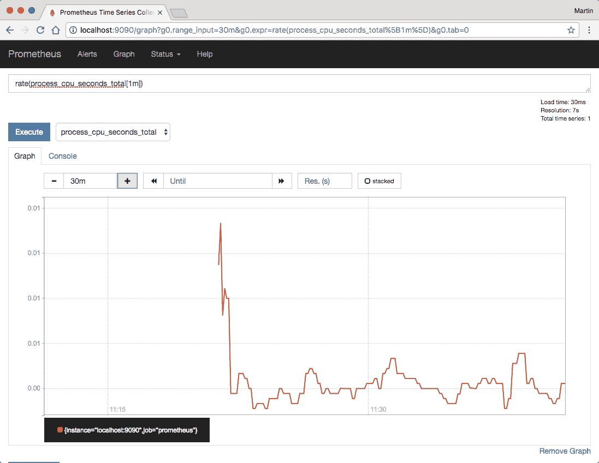

Prometheus Web UI 非常适合快速分析和临时查询。但是，Prometheus 不支持保存查询以供以后使用，也不支持在同一页上呈现多个图形。这就是 Grafana 发挥作用的地方。

# 在 Docker 上运行 Grafana

运行 Grafana 与运行 Prometheus 一样简单。首先设置一个用于持久存储的卷：

```go
$ docker volume create grafana-data 
```

然后，启动实际容器并将其附加到`monitoring`网络（而不是`myevents`网络；Grafana 需要与 Prometheus 服务器通信，但不需要直接与您的后端服务通信）：

```go
$ docker container run \ 
    -v grafana-data \ 
    -p 3000:3000 \ 
    --name grafana \ 
    --network monitoring \ 
    grafana/grafana:4.2.0 
```

之后，您将能够在浏览器中访问`http://localhost:3000`上的 Grafana。默认凭据是用户名`admin`和密码`admin`。

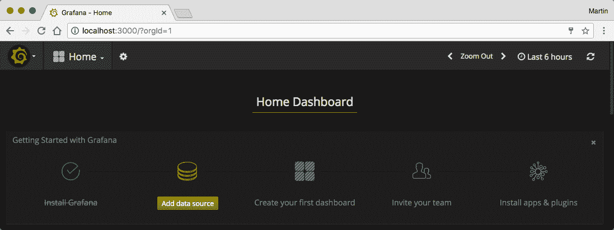

Gafana 主页

在您第一次访问时，您将被提示为 Grafana 实例配置数据源。单击“添加数据源”按钮，并在下一页配置访问您的 Prometheus 服务器。在那里，选择 Prometheus 作为*类型*，输入`http://prometheus:9090`作为 URL，并选择代理*作为*访问模式。

添加数据源后，继续创建仪表板（选择左上角的按钮，选择仪表板，然后选择新建）。然后，通过单击相应按钮向仪表板添加新图形。添加图形面板后，单击面板标题并选择编辑以编辑面板：

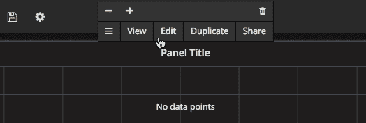

面板

然后，在指标选项卡中，将之前的 CPU 使用率查询输入到查询输入字段中。为了进一步自定义面板，您可能希望输入`{{ job }}`作为图例，以使图例更易理解，并将 Y 轴格式（在轴选项卡，左 Y 部分和单位字段）更改为百分比（0.0-1.0）：

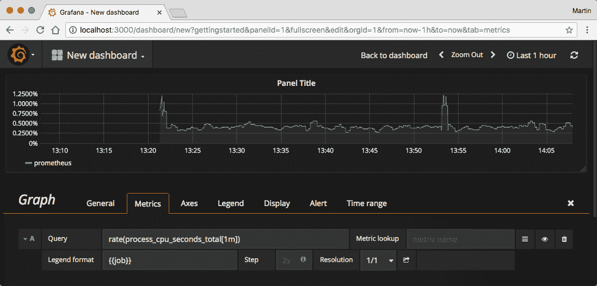

Gafana 新仪表板

关闭编辑面板，并通过单击保存按钮或按*Ctrl* + *S*保存您的仪表板。您的仪表板现在已保存。您可以在以后的时间点查看它，其中包括更新的指标，或与其他用户共享此仪表板。

您还可以通过向仪表板添加更多面板来进行实验，以可视化其他指标（默认情况下，Prometheus 已经导出了大量关于自身的指标，您可以进行实验）。有关 Prometheus 查询语言的详细参考，请参阅以下网址的官方文档：[`prometheus.io/docs/querying/basics/`](https://prometheus.io/docs/querying/basics/)。

现在我们已经有了一个正常运行的 Prometheus 和 Grafana 设置，我们可以看看如何将您自己的应用程序的指标导入到 Prometheus 中。

# 导出指标

如已经显示的那样，从您自己的应用程序导出指标在原则上是很容易的。您的应用程序只需要提供一个返回任意指标的 HTTP 端点，然后可以将这些指标保存在 Prometheus 中。实际上，这变得更加困难，特别是当您关心 Go 运行时的状态时（例如，CPU 和内存使用情况，Goroutine 计数等）。因此，通常最好使用 Go 的 Prometheus 客户端库，该库负责收集所有可能的 Go 运行时指标。

事实上，Prometheus 本身是用 Go 编写的，并且还使用自己的客户端库来导出有关 Go 运行时的指标（例如，您之前使用过的`go_memstats_alloc_bytes`或`process_cpu_seconds_total`指标）。

# 在您的 Go 应用程序中使用 Prometheus 客户端

您可以使用`go get`获取 Prometheus 客户端库，如下所示：

```go
$ go get -u github.com/prometheus/client_golang 
```

如果您的应用程序使用依赖管理工具（例如我们在前一章中介绍的 Glide），您可能还希望在您的`glide.yaml`文件中声明此新依赖项，并将稳定版本添加到应用程序的`vendor/`目录中。要一次完成所有这些操作，只需在应用程序目录中运行`glide get`而不是`go get`：

```go
$ glide get github.com/prometheus/client_golang 
$ glide update 
```

出于安全原因，我们将在与事件服务和预订服务的 REST API 不同的 TCP 端口上公开我们的指标 API。否则，意外地将指标 API 暴露给外部世界将太容易了。

让我们从事件服务开始。设置指标 API 不需要太多的代码，所以我们将直接在`main.go`文件中进行。在调用`rest.ServeAPI`方法之前，将以下代码添加到主函数中：

```go
import "net/http" 
import "github.com/prometheus/client_golang/prometheus/promhttp" 
// ... 

func main() { 
  // ... 

  go func() { 
    fmt.Println("Serving metrics API") 

    h := http.NewServeMux() 
    h.Handle("/metrics", promhttp.Handler()) 

    http.ListenAndServe(":9100", h) 
  }() 

  fmt.Println("Serving API") 
  // ... 
} 
```

现在，编译您的应用程序并运行它。尝试在浏览器中打开地址`http://localhost:9100/metrics`，您应该会看到新端点返回大量的指标：

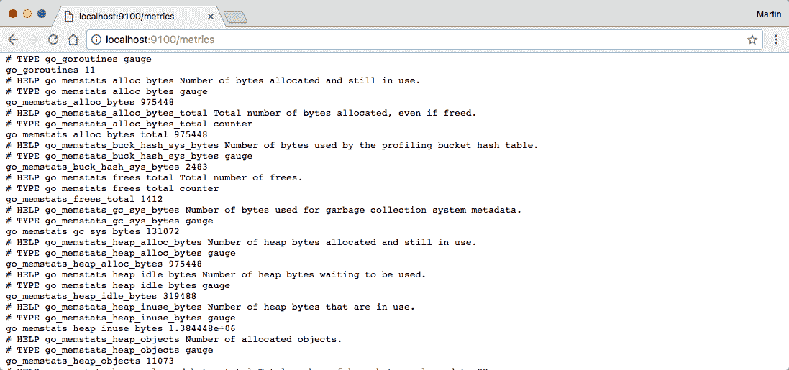

在 localhost:9100/metrics 显示的页面

现在，对预订服务进行相同的调整。还要记得在两个服务的 Dockerfile 中添加`EXPOSE 9100`语句，并使用更新后的镜像和`-p 9100:9100`标志（或`-p 9101:9100`以防止端口冲突）重新创建任何容器。

# 配置 Prometheus 抓取目标

现在我们有两个正在运行并公开 Prometheus 指标的服务，我们可以配置 Prometheus 来抓取这些服务。为此，我们可以修改之前创建的`prometheus.yml`文件。将以下部分添加到`scrape_configs`属性中：

```go
global: 
  scrape_interval: 15s 

scrape_configs: 
  - job_name: prometheus 
    static_configs: 
      - targets: ["localhost:9090"] 
  - job_name: eventservice 
    static_configs: 
      - targets: ["events:9090"] 
  - job_name: bookingservice 
    static_configs: 
      - targets: ["bookings:9090"] 
```

添加新的抓取目标后，通过运行`docker container restart prometheus`来重新启动 Prometheus 容器。之后，这两个新的抓取目标应该会显示在 Prometheus web UI 中：

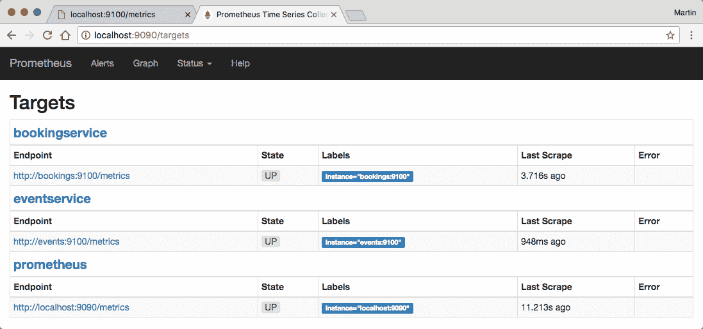

Prometheus web UI targets

现在，最好的部分——还记得之前几节创建的 Grafana 仪表板吗？现在您已经添加了两个新服务以供 Prometheus 抓取，再看一下它：

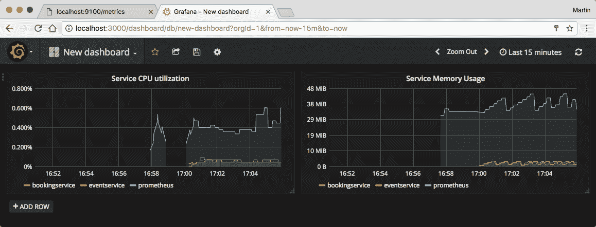

Gafana

正如您所看到的，Grafana 和 Prometheus 立即从新服务中获取指标。这是因为我们到目前为止使用的`process_cpu_seconds_total`和`go_memstats_alloc_bytes`指标实际上是由我们的三个服务中的所有服务导出的，因为它们都使用 Prometheus Go 客户端库。但是，Prometheus 为每个被抓取的指标添加了一个额外的作业标签；这允许 Prometheus 和 Grafana 区分来自不同抓取目标的相同指标并相应地呈现它们。

# 导出自定义指标

当然，您也可以使用 Prometheus 客户端库导出自己的指标。这些不需要是反映 Go 运行时某些方面的技术指标（如 CPU 使用率和内存分配），而可以是业务指标。一个可能的例子是每个事件的不同标签的预订票数。

例如，在`todo.com/myevents/bookingservice/rest`包中，您可以添加一个新文件——让我们称之为`metrics.go`*——*声明并注册一个新的 Prometheus 指标：

```go
package rest 

import "github.com/prometheus/client_golang/prometheus" 

var bookingCount = prometheus.NewCounterVec( 
  prometheus.CounterOpts{ 
    Name:      "bookings_count", 
    Namespace: "myevents", 
    Help:      "Amount of booked tickets", 
  }, 
  []string{"eventID", "eventName"}, 
) 

func init() { 
  prometheus.MustRegister(bookingCount) 
} 
```

Prometheus 客户端库在一个包中跟踪所有创建的指标对象，这是一个全局注册表，会自动初始化。通过调用`prometheus.MustRegister`函数，您可以将新的指标添加到此注册表中。当 Prometheus 服务器抓取`/metrics`端点时，所有注册的指标将自动暴露出来。

`NewCounterVec`函数创建了一个名为`myevents_bookings_count`的指标集合，但通过两个标签`eventID`和`eventName`进行区分（实际上，这些是功能相关的，您不需要两者都需要；但在 Grafana 中可视化此指标时，将事件名称作为标签非常方便）。当抓取时，这些指标可能看起来像这样：

```go
myevents_bookings_count{eventID="507...",eventName="Foo"} 251 
myevents_bookings_count{eventID="508...",eventName="Bar} 51 
```

Prometheus 客户端库知道不同类型的指标。我们在前面的代码中使用的 Counter 是其中较简单的一种。在之前的某个部分中，您看到了一个复杂的直方图是如何表示为多个不同的指标的。这在 Prometheus 客户端库中也是可能的。为了演示，让我们添加另一个指标——这次是一个直方图：

```go
var seatsPerBooking = prometheus.NewHistogram( 
  prometheus.HistogramOpts{ 
    Name: "seats_per_booking", 
    Namespace: "myevents", 
    Help: "Amount of seats per booking", 
    Buckets: []float64{1,2,3,4} 
  } 
) 

func init() { 
  prometheus.MustRegister(bookingCount) 
  prometheus.MustRegister(seatsPerBooking) 
} 
```

在被抓取时，此直方图将导出为七个单独的指标：您将获得五个直方图桶（*具有一个或更少座位的预订数量* 到*具有四个或更少座位* 和*具有无限多座位或更少*），以及一个用于所有座位和所有观察的总和的指标：

```go
myevents_seats_per_booking_bucket{le="1"} 1 
myevents_seats_per_booking_bucket{le="2"} 8 
myevents_seats_per_booking_bucket{le="3"} 18 
myevents_seats_per_booking_bucket{le="4"} 20 
myevents_seats_per_booking_bucket{le="+Inf"} 22 
myevents_seats_per_booking_sum 72 
myevents_seats_per_booking_count 22 
```

当然，我们需要告诉 Prometheus 库在被 Prometheus 服务器抓取时应该导出哪些指标值。由于这两个指标（预订数量和每个预订的座位数量）只有在进行新预订时才会改变，因此我们可以将此代码添加到处理`/events/{id}/bookings`路由上的 POST 请求的 REST 处理程序函数中。

在`booking_create.go`文件中，在原始请求处理后的某个位置添加以下代码（例如，在事件发射器上发出`EventBooked`事件之后）：

```go
h.eventEmitter.emit(&msg) 

bookingCount. 
  WithLabelValues(eventID, event.Name). 
  Add(float64(request.Seats)) 
seatsPerBooking. 
  Observe(float64(bookingRequest.Seats)) 

h.database.AddBookingForUser(
   // ... 
```

第一条语句将预订的座位数量（`request.Seats`）添加到计数器指标中。由于在`CounterVec`声明中定义了一个名为`event`的标签，因此您需要使用相应的标签值调用`WithLabelValues`方法（如果指标声明包含两个标签，则需要将两个参数传递给`WithLabelValues`）。

第二条语句向直方图添加了一个新的`observation`。它将自动找到正确的桶并将其增加一个（例如，如果使用相同预订添加了三个座位，则`myevents_seats_per_booking_bucket{le="3"}`指标将增加一个）。

现在，启动您的应用程序，并确保 Prometheus 定期对其进行抓取。花点时间向您的应用程序添加一些示例记录。还在预订服务中添加一些事件预订；确保您不是一次创建它们。之后，您可以使用`myevents_bookings_count`指标在 Grafana 仪表板中创建一个新图表：

>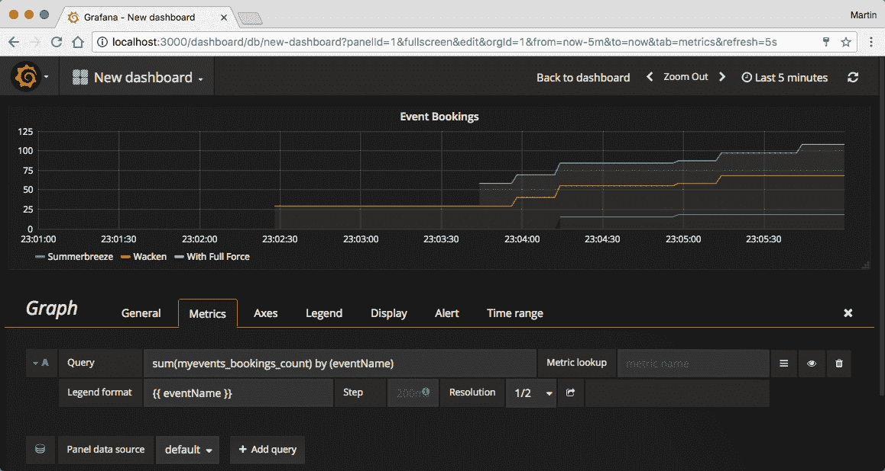

Gafana 图表

默认情况下，Prometheus 将为每个抓取实例创建一个时间序列。这意味着当您有多个预订服务实例时，您将获得多个时间序列，每个时间序列都有不同的`job`标签：

```go
myevents_bookings_count{eventName="Foo",job="bookingservice-0"} 1 
myevents_bookings_count{eventName="Foo",job="bookingservice-1"} 3 
myevents_bookings_count{eventName="Bar",job="bookingservice-0"} 2 
myevents_bookings_count{eventName="Bar",job="bookingservice-1"} 1 
```

在显示业务指标（例如，售出的门票数量）时，您可能实际上并不关心每个特定预订是在哪个实例上放置的，并且更喜欢在所有实例上使用聚合时间序列。为此，构建仪表板时可以使用 PromQL 函数`sum()`：

```go
sum(myevents_bookings_count) by (eventName) 
```

# 在 Kubernetes 上运行 Prometheus

到目前为止，我们通过将它们添加到`prometheus.yml`配置文件中手动配置了 Prometheus 的所有抓取目标。这对于测试很有效，但在更大的生产设置中很快变得乏味（并且在引入自动缩放等功能后完全没有意义）。

在 Kubernetes 集群中运行应用程序时，Prometheus 为此提供了一种一站式解决方案——使用`prometheus.yml`配置文件，您实际上可以配置 Prometheus 自动从 Kubernetes API 加载其抓取目标。例如，如果为您的预订服务定义了一个部署，Prometheus 可以自动找到由此部署管理的所有 Pod，并对它们进行抓取。如果扩展了部署，附加实例将自动添加到 Prometheus 中。

在以下示例中，我们将假设您在本地计算机上运行 Minikube VM 或在云环境中的某个 Kubernetes 集群。我们将首先部署 Prometheus 服务器。为了管理 Prometheus 配置文件，我们将使用一个以前未使用过的 Kubernetes 资源——`ConfigMap`。`ConfigMap`基本上只是一个您可以保存在 Kubernetes 中的任意键值映射。在创建 Pod（或部署或 StatefulSet）时，您可以将这些值挂载到容器中作为文件，这使得`ConfigMaps`非常适合管理配置文件：

```go
apiVersion: v1 
kind: ConfigMap 
name: prometheus-config 
data: 
  prometheus.yml: | 
    global: 
      scrape_config: 15s 

    scrape_configs: 
    - job_name: prometheus 
      static_configs: 
      - targets: ["localhost:9090"] 
```

您可以像保存其他资源一样创建`ConfigMap`，将其保存到`.yaml`文件中，然后在该文件上调用`kubectl apply -f`。当您修改了`.yaml`文件时，也可以使用相同的命令来更新`ConfigMap`。

创建了`ConfigMap`后，让我们部署实际的 Prometheus 服务器。由于 Prometheus 是一个有状态的应用程序，我们将其部署为`StatefulSet`：

```go
apiVersion: apps/v1beta1 
kind: StatefulSet 
metadata: 
  name: prometheus 
spec: 
  serviceName: prometheus 
  replicas: 1 
  template: 
    metadata: 
      labels: 
        app: prometheus 
    spec: 
      containers: 
      - name: prometheus 
        image: prom/prometheus:v1.6.1 
        ports: 
        - containerPort: 9090 
          name: http 
        volumeMounts: 
        - name: data 
          mountPath: /prometheus 
        - name: config 
          mountPath: /etc/prometheus 
      volumes: 
      - name: config 
        configMap: 
          name: prometheus-config 
  volumeClaimTemplates: 
  - metadata: 
      name: data 
      annotations: 
        volume.alpha.kubernetes.io/storage-class: standard 
    spec: 
      accessModes: ["ReadWriteOnce"] 
      resources: 
        requests: 
          storage: 5Gi 
```

还要创建相关的`Service`：

```go
apiVersion: v1 
kind: Service 
metadata: 
  name: prometheus 
spec: 
  clusterIP: None 
  selector: 
    app: prometheus 
  ports: 
  - port: 9090 
    name: http 
```

现在，您在 Kubernetes 集群内运行了一个 Prometheus 服务器；但是，目前该服务器只抓取自己的指标端点，而尚未抓取集群中运行的任何其他 Pod。

要启用对 Pod 的自动抓取，请将以下部分添加到`prometheus.yml`文件的`ConfigMap`中的`scrape_configs`部分：

```go
scrape_configs: 
  # ... 
  - job_name: kubernetes-pods 
    kubernetes_sd_configs: 
    - role: pod 
  relabel_configs: 
  - source_labels: [__meta_kubernetes_pod_annotation_prometheus_io_scrape] 
    action: keep 
    regex: true 
  - source_labels: [__meta_kubernetes_pod_annotation_prometheus_io_path] 
    action: replace 
    target_label: __metrics_path__ 
    regex: (.+) 
  - source_labels: [__address__, __meta_kubernetes_pod_annotation_prometheus_io_port] 
    action: replace 
    regex: ([^:]+)(?::\d+)?;(\d+) 
    replacement: $1:$2 
    target_label: __address__ 
  - action: labelmap 
    regex: __meta_kubernetes_pod_label_(.+) 
  - source_labels: [__meta_kubernetes_namespace] 
    action: replace 
    target_label: kubernetes_namespace 
  - source_labels: [__meta_kubernetes_pod_name] 
    action: replace 
    target_label: kubernetes_pod_name 
```

是的，这是相当多的配置，但不要惊慌。大多数这些配置是为了将已知 Kubernetes Pod 的属性（例如用户定义的 Pod 名称和标签）映射到将附加到从这些 Pod 中抓取的所有指标的 Prometheus 标签。

请注意，在更新`ConfigMap`后，您可能需要销毁您的 Prometheus Pod，以使更新后的配置生效。不用担心；即使您删除了 Pod，`StatefulSet`控制器也会立即创建一个新的：

```go
$ kubectl delete pod -l app=prometheus 
```

此配置还定义了 Prometheus 将抓取集群中具有名为`prometheus.io/scrape`的注释的所有 Pod。在定义 Pod 模板时可以设置此注释，例如在部署中。此外，您现在可以调整您的事件服务部署如下（记得将 TCP 端口`9100`添加到暴露端口列表中）：

```go
apiVersion: apps/v1beta1 
kind: Deployment 
metadata: 
  name: eventservice 
spec: 
  replicas: 2 
  template: 
    metadata: 
      labels: 
        myevents/app: events 
        myevents/tier: api 
      annotations: 
        prometheus.io/scrape: true 
        prometheus.io/port: 9100 
    spec: 
      containers: 
      - name: api 
        image: myevents/eventservice 
        imagePullPolicy: Never 
        ports: 
        - containerPort: 8181 
          name: http 
        - containerPort: 9100 
          name: metrics 
        # ... 
```

更新部署后，Kubernetes 应该会自动开始重新创建事件服务 Pod。一旦创建了带有`prometheus.io/scrape`注释的新 Pod，Prometheus 将自动捕获并抓取它们的指标。如果它们再次被删除（例如在更新或缩减部署后），Prometheus 将保留从这些 Pod 中收集的指标，但停止抓取它们。

通过让 Prometheus 根据注释自动捕获新的抓取目标，管理 Prometheus 服务器变得非常容易；在初始设置之后，您可能不需要再次编辑配置文件。

# 总结

在本章中，您学习了如何使用 Prometheus 和 Grafana 来设置监控堆栈，以监视应用程序在技术层面上的健康状况（通过关注系统指标，如 RAM 和 CPU 使用情况）以及自定义的应用程序特定指标，例如，在这种情况下，预订票数的数量。

在本书的过程中，我们几乎涵盖了典型 Go 云应用程序的整个生命周期，从架构和实际编程开始，构建容器映像，不断在各种云环境中部署它们，并监视您的应用程序。

在接下来的章节中，我们将有机会详细回顾我们迄今为止取得的成就，并指出接下来要做什么。
