# 迁移

欢迎来到我们学习云原生编程和 Go 语言世界的第十一章。在本章中，我们将涵盖一些实用的技术，以将应用程序从单片架构迁移到微服务架构。我们已经在第二章中涵盖了单片和微服务架构，*使用 Rest API 构建微服务。*但是，我们将从实际定义单片和微服务架构开始本章，以防您单独阅读本章。

在本章中，我们将涵盖以下主题：

+   单片应用程序和微服务架构的回顾

+   从单片应用程序迁移到微服务应用程序的技术

+   高级微服务设计模式

+   微服务架构中的数据一致性

# 什么是单片应用程序？

**单片应用程序**只是一个软件，可以同时执行多个独立的任务。让我们以在线商店应用程序为例。在单片架构中，我们将有一个单一的软件来处理客户、他们的订单、数据库连接、网站、库存以及在线商店成功所需的任何其他任务。

一个软件执行所有任务似乎是软件设计的一种低效方法，在某些情况下确实如此。然而，重要的是要提到，单片应用程序并不总是不好的。在一些情况下，一个单一的软件服务执行所有工作是可以接受的。这包括最小可行产品或 MVP，我们试图快速构建一些东西供测试用户尝试。这还包括预期没有太多数据负载或流量的使用情况，比如面向传统棋盘游戏爱好者的在线商店。

# 什么是微服务？

**微服务架构**与单片应用程序相比，构建软件采用了不同的方法。在微服务架构中，任务分布在多个较小的软件服务中，这些服务被称为微服务。在设计良好的微服务架构中，每个微服务应该是自包含的、可部署的和可扩展的。设计良好的微服务还享有干净的 API，允许其他微服务与它们通信。独立的软件服务共同努力实现共同目标的概念并不新鲜；它在过去作为**面向服务的架构**（**SOA**）存在。然而，现代微服务架构通过坚持软件服务相对较小、独立和完全自包含的概念，将这个想法推向了更远。

让我们回到在线商店的例子。在微服务架构的情况下，我们会有一个用于处理客户的微服务，一个用于处理库存的微服务，依此类推。

典型的微服务内部包含多个必要的层，用于处理日志记录、配置、与其他微服务通信的 API 以及持久性。还有微服务的核心代码，涵盖了服务应该执行的主要任务。以下是微服务内部应该看起来的样子：

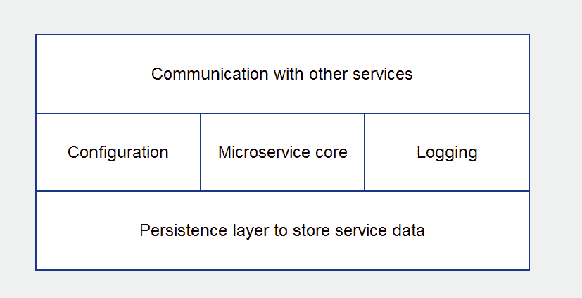

微服务的内部外观

当涉及可伸缩性和灵活性时，微服务架构比单片应用程序具有重大优势。微服务允许您无限扩展，利用多种编程语言的功能，并优雅地容忍故障。

# 从单片应用程序迁移到微服务

现在，假设你有一个单片应用，你的业务正在增长，你的客户要求更多功能，你需要迁移到既灵活又可扩展的架构。是时候使用微服务了。迁移时需要牢记的第一个关键原则是，没有一套黄金步骤可以确保从单片应用成功迁移到微服务。我们需要遵循的步骤因情况而异，因组织而异。话虽如此，本章中有一些非常有用的概念和想法，可以帮助您做出明智的决策。

# 人与技术

从单片应用转向微服务时最容易被忽视的因素之一是**人员因素**。我们通常考虑技术和架构，但是谁来编写代码、管理项目和重新设计应用的团队呢？从单片应用转向微服务是一个需要在组织中进行适当规划的范式转变。

在决定转向微服务后，我们需要考虑的第一件事是参与开发过程的团队结构。通常，以下是负责单片应用的团队：

+   开发人员习惯于在单一编程语言中工作的特定部分的应用中工作

+   IT 基础设施团队通常只需更新托管单片应用及其数据库的少数服务器，部署就完成了。

+   团队负责人拥有应用的一部分，而不是从 A 到 Z 的整个软件服务

如前所述，微服务迁移代表了一种范式转变。这意味着在转向微服务架构时，组织需要采用一种新的思维方式。考虑以下内容：

+   开发人员需要分成较小的团队，每个团队应负责一个或多个微服务。开发人员需要习惯于负责整个软件服务，而不是一堆软件模块或类。当然，如果组织足够大，你仍然可以让开发人员负责微服务中的特定模块。然而，如果开发人员接受培训，将产品视为整个微服务，这将产生更好设计的微服务。开发人员还需要习惯于使用适合工作的编程语言。例如，Java 对于数据处理和流水线很重要，Go 非常适合构建快速可靠的微服务，C#适用于 Windows 服务，等等。

+   IT 基础设施团队需要了解水平扩展、冗余、可扩展的云平台以及部署大量服务所涉及的规划过程。

+   团队负责人将承担从 A 到 Z 的整个软件服务的责任。他们需要考虑实施细节，比如如何扩展服务、是否与其他服务共享数据库或拥有自己的数据库，以及服务如何与其他服务通信。

# 将单片应用切割成片

现在我们已经讨论了迁移的人员方面，让我们深入了解技术细节。几乎每个人都同意的一个黄金法则是，从头开始编写所有内容，忽略现有单片应用中的所有代码（也称为大爆炸重写）并不是一个好主意。相反，从单片应用迁移到微服务的最佳方法是随着时间的推移逐步削减单片应用。每个分离的部分都成为一个微服务。对于每个新的微服务，我们需要确保它仍然可以与单片应用以及其他新的微服务进行通信。如果这种方法进行顺利，单片应用将随着时间的推移不断缩小，直到成为一个微服务。

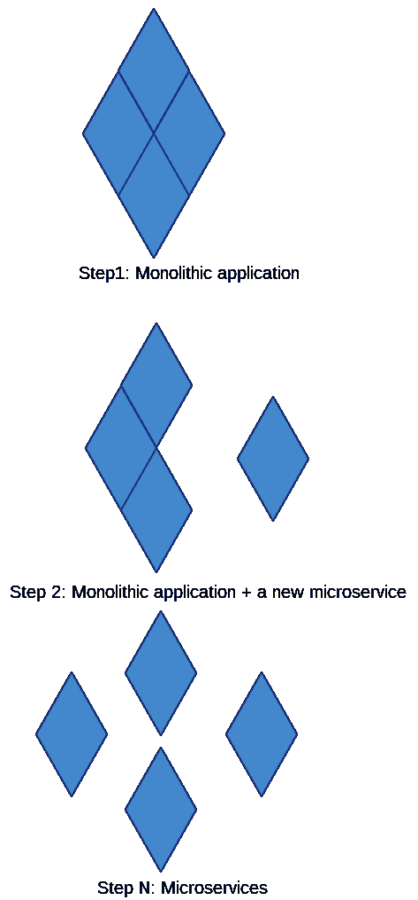

单片应用随时间缩小

这听起来很简单；然而，在现实生活中，通常并不是那么直截了当。让我们讨论一些规划策略，使逐步逐步的方法更具可执行性。

# 我们如何分解代码？

我们需要问的一个关键技术问题是，我们应该如何精确地分解单片应用的代码？以下是一些重要的要点：

+   如果一个应用程序编写得很好，不同类或软件模块之间会有清晰明显的分离。这使得切割代码变得更容易。

+   另一方面，如果代码中没有清晰的分离，我们需要在开始将代码片段移动到新的微服务之前对现有代码进行一些重构。

+   通常最好的做法是，不要在单片应用中添加新的代码或功能，而是尝试将新功能分离成一个新的微服务。

# 粘合代码

为了使新的微服务适应原始应用而不破坏其功能，微服务需要能够与原始应用交换信息。为了实现这一点，我们可能需要编写一些粘合代码，将新代码与旧代码链接起来。粘合代码通常包括一些 API 接口，作为原始应用和微服务之间的通信渠道。粘合代码还将包括使新的微服务与现有应用程序配合工作所需的任何代码：

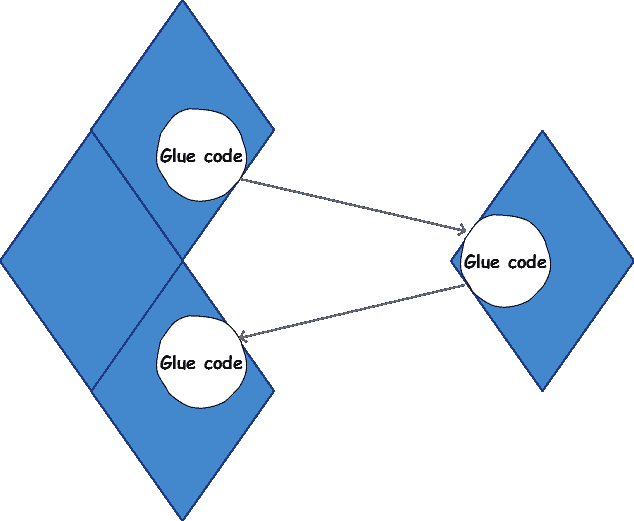

粘合代码

粘合代码可能是临时的，也可能是永久的，这取决于我们的应用程序。有时，粘合代码可能需要进行一些数据建模转换或与旧数据库进行通信以使事情正常运行。

如果您的应用程序是一个 Web 应用程序，粘合代码可能包括一个临时的 Web HTTP API，可以将您新分离的微服务与您的视图层连接起来。

# 微服务设计模式

在本节中，我们将讨论一些重要的设计模式和架构方法，这些方法可以帮助我们构建强大而有效的云就绪微服务。让我们开始吧。

# 牺牲性架构

**牺牲性架构**是一个重要的设计方法，通常没有得到应有的关注。Martin Folwer 在 2014 年提到了这一点，可以在[`martinfowler.com/bliki/SacrificialArchitecture.html`](https://martinfowler.com/bliki/SacrificialArchitecture.html)找到。

牺牲架构的核心思想是，我们应该以一种易于在未来替换的方式编写我们的软件。为了更好地理解前面的陈述，让我们考虑一个例子情景。假设几年前，我们构建了一个计算机网络应用程序，该应用程序利用我们的开发人员设计的自定义数据序列化格式。今天，我们需要用更现代的编程语言重写该应用程序，以处理更多的数据负载和用户请求。这个任务无论如何都不会有趣或容易，因为我们的应用程序依赖于只有应用程序的原始开发人员才能理解的自定义序列化和通信协议。

现在，如果我们使用了更标准化的序列化格式，比如协议缓冲区，那会怎么样？重写或更新应用程序的任务将变得更加容易和高效，因为协议缓冲区受到广泛的编程语言和框架支持。使用标准序列化格式构建我们的应用程序，而不是自定义的格式，这就是牺牲架构的意义所在。

当我们设计我们的软件时考虑到牺牲架构，升级、重构和/或演变我们的应用程序的任务变得更加简单。如果我们的单片应用程序设计时考虑到了牺牲架构，将应用程序的部分分离成微服务就变得容易了。

如果我们在编写我们的粘合代码时考虑到了牺牲架构，那么在未来演变粘合代码或完全摆脱它并用其他东西替换它将变得更加容易。如果我们在构建新的微服务时考虑到了牺牲架构，我们就给自己快速、无痛和高效地增长和演变微服务的能力。

# 一个四层的参与平台

**四层参与平台**是一种以整个应用程序为目标的架构方法。它在 Forrester 研究中被描述为[`go.forrester.com/blogs/13-11-20-mobile_needs_a_four_tier_engagement_platform/`](https://go.forrester.com/blogs/13-11-20-mobile_needs_a_four_tier_engagement_platform/)。这种架构非常适合面向移动和网络时代的现代应用程序。该架构允许可伸缩性、灵活性和性能。它还使得集成云服务和内部微服务变得非常容易和高效。

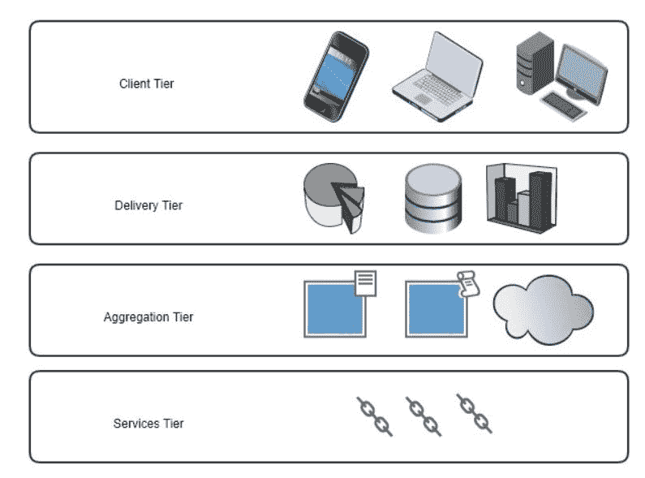

四层参与架构

这种架构背后的主要思想是，整个应用程序应该分为四个主要层或层：

+   **客户层**：这一层负责用户体验；它根据用户的上下文环境定制用户体验。上下文环境包括用户设备类型、用户位置、时间等。例如，如果您的产品用户使用智能手表，那么客户层应该呈现适合智能手表的内容。如果他们使用平板电脑，那么适合平板电脑的用户界面将迎接用户。如果用户正在查看来自中国的数据，客户层需要以中文显示信息。如果用户正在查看来自加拿大的数据，信息需要以英文显示。

+   **交付层**：交付层负责按照客户层的要求向用户交付优化的数据。这是通过进行即时优化来实现的，例如图像压缩或带宽减少。该层可以利用监控工具来跟踪用户活动，然后利用算法利用这些信息来提供更好的客户体验。这一层也是我们使用缓存算法和技术来确保为我们的客户提供更好性能的地方。

+   **聚合层：**这一层是将来自不同来源的数据聚合成稳定和统一的数据模型的地方，然后将其交给前面的层。这一层的任务包括以下内容：

+   在层之间充当 API 中心，提供服务可发现性和数据访问给前面的层。

+   集成来自内部服务（例如内部微服务）和外部服务（例如 AWS 云服务）的输出。

+   从不同来源类型合并数据，例如，从一个来源读取 base64 编码的消息，从另一个来源读取 JSON 编码的消息，然后将它们链接在一起形成统一的数据模型。

+   将数据编码为适合交付给用户的格式。

+   指定基于角色的数据访问。

+   **服务层：**这一层由我们的外部和内部服务组成。它为各层提供原始数据和功能。这些层由一组可部署的内部和外部服务组成。服务层是我们与数据库（如 MySQL 或 DynamoDB）通信的地方；我们会在这里使用第三方服务，如 AWS S3 或 Twilio。这一层应该被设计为可插拔的，这意味着我们可以随意地向其中添加或移除服务。

如果我们使用上述的架构模式设计我们的现代应用程序，我们将获得无限的灵活性和可扩展性。例如，我们可以在客户端层针对新的用户设备类型，而无需在其他层中改变太多代码。我们可以在服务层中添加或移除微服务或云服务，而无需在其上层改变太多代码。我们可以在聚合层中支持新的编码格式，如 Thrift 或协议缓冲区，而无需在其他层上改变太多代码。四层参与平台目前正在被 Netflix 和 Uber 等公司使用。

# 领域驱动设计中的有界上下文

**领域驱动设计**（**DDD**）是一种流行的设计模式，我们可以用它来内部设计微服务。领域驱动设计通常针对可能会随着时间呈指数增长的复杂应用程序。如果您的单片应用程序已经通过 DDD 设计，那么迁移到微服务架构将是直接的。否则，如果您期望新的微服务在范围和复杂性上增长，那么考虑 DDD 可能是一个好主意。

领域驱动设计是一个庞大的主题。维基百科文章可以在[`en.wikipedia.org/wiki/Domain-driven_design`](https://en.wikipedia.org/wiki/Domain-driven_design)找到。然而，为了本节的目的，我们将介绍一些简要的概念，这些概念可以帮助我们获得对 DDD 的实际理解。然后，从那里，您将了解为什么这种设计方法对于复杂的微服务架构是有益的。

领域驱动设计的理念是，一个复杂的应用程序应该被视为在一个*领域*内运行。领域简单地定义为知识或活动的范围。我们软件应用程序的领域可以被描述为与软件目的相关的一切。因此，例如，如果我们软件应用程序的主要目标是促进社交活动的规划，那么规划社交活动就成为我们的领域。

一个域包含*上下文*；每个上下文代表域的一个逻辑部分，人们在其中使用相同的语言。在上下文中使用的语言只能根据它所属的上下文来理解。

根据我的经验，没有例子很难理解上下文是什么。所以，让我们举一个简单的例子。假设社交活动应用背后的组织是一个大型组织，拥有销售部门、营销部门和支持部门。这意味着这个组织的领域驱动设计可能需要包括以下三个主要上下文：销售上下文、营销上下文和支持上下文。

销售人员使用的一些语言只对销售人员相关。例如，销售漏斗、销售机会或销售管道的概念对销售非常重要，但对支持部门可能并不相关。这就是为什么销售上下文可以包括销售漏斗的概念，但在支持上下文中你不会经常找到这种语言或概念。

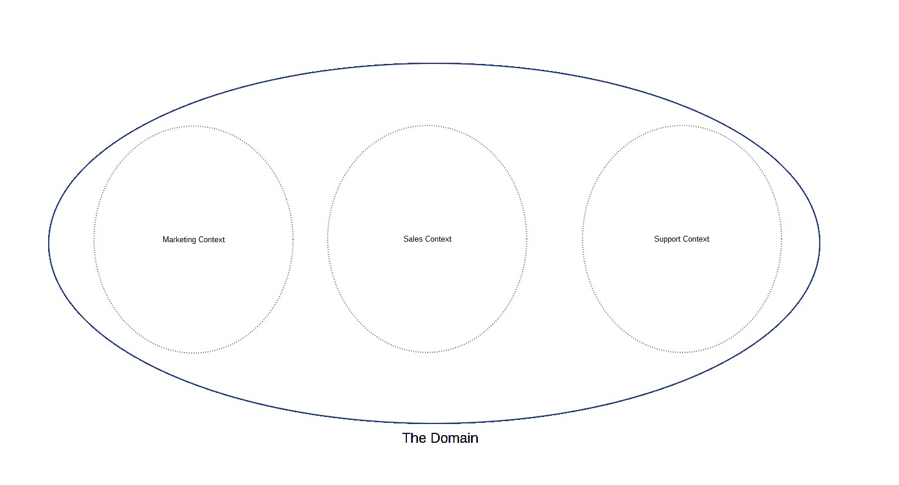

领域

领域还包含模型。每个模型都是描述领域中独立概念的抽象。模型最终会被转化为软件模块或对象。模型通常存在于上下文中。例如，在销售上下文中，我们需要模型来表示销售合同、销售漏斗、销售机会、销售管道和客户等，而在支持上下文中，我们需要模型来显示工单、客户和缺陷。以下是一个简单的图表，显示了销售上下文和支持上下文中的一些模型：

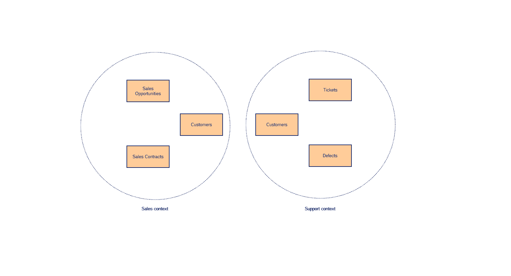

销售和支持上下文

不同的上下文可以共享相同的语言或概念，但关注不同的方面。在我们的大型组织示例中，销售人员使用的一个词可能并不总是对支持人员来说意味着相同的词。例如，对于销售部门来说，*客户*代表着一个可能从组织购买产品但尚未购买的客户。另一方面，对于支持部门来说，客户可能是已经购买产品、购买了支持合同并且正在遇到产品问题的客户。因此，这两个上下文共享客户的概念；然而，当涉及到这个概念时，它们关心的是不同的事情。

同一种语言在不同环境中可能意味着不同的事情，这引入了领域驱动设计世界中的一个关键概念，即有界上下文。有界上下文是共享概念的上下文，但它们实现了自己的概念模型。例如，*客户*的概念在销售上下文中由一个模型表示，反映了销售部门关心的客户版本。客户的概念也根据支持上下文中的版本进行建模。虽然它们是两个模型，但它们仍然是相互关联的。这是因为，归根结底，它们都代表了社交活动策划公司的客户。以下是一个简单的图表，显示了这种情况：

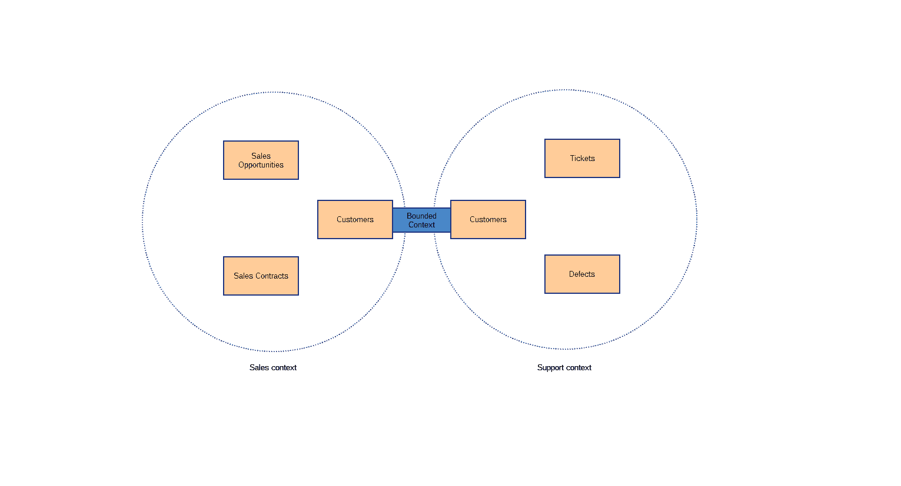

销售和支持上下文

上下文和有界上下文是领域驱动设计和微服务相遇的地方。这是复杂现代微服务的关键设计因素，因为上下文可以很容易地映射到微服务。如果你试图定义有界上下文，你会发现自己不仅在实践中定义了微服务应该是什么，还在定义应该在微服务之间共享什么信息来构建整个应用程序。有界上下文的简单定义是它是一个作为更大应用程序一部分的自包含逻辑块。这个定义也可以毫无添加地应用于描述一个设计良好的微服务。有时，一个有界上下文可以被划分为多个服务，但这通常取决于应用程序的复杂程度。

在我们的例子中，我们最终会有一个处理销售操作的微服务和一个处理支持操作的微服务。

如果您的单体应用程序已经根据 DDD 原则进行了设计，那么迁移到微服务架构会变得更容易。这是因为从形成界限上下文的代码过渡到自包含的微服务会是有意义的。

另一方面，如果您的单体应用程序没有以这种方式设计，但应用程序复杂且不断增长，那么可以利用 DDD 原则来构建未来的微服务。

# 数据一致性

支撑应用程序的数据库是一个至关重要的组成部分，在迁移到微服务架构时必须极其小心谨慎地处理和尊重。在单体应用程序的世界中，您可能会处理连接到单体应用程序的少量数据库（一个或两个）通过一个庞大的数据处理层，如下所示：

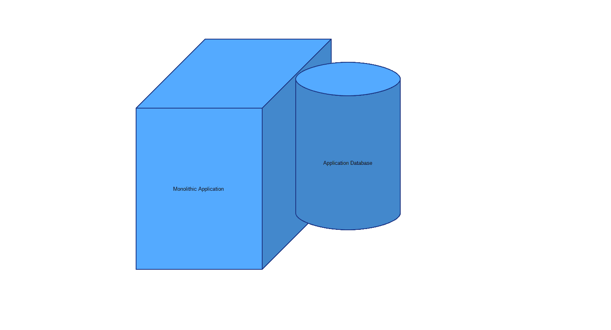

单体应用程序与数据库

然而，在微服务和分布式云架构的情况下，情况可能大不相同。这是因为架构可能包括更广泛的数据模型和数据库引擎，以满足分布式微服务的需求。微服务可以拥有自己的数据库，与其他应用程序共享数据库，或同时使用多个数据库。在现代微服务架构中，数据一致性和建模是一个非常棘手的挑战，我们需要在失控之前通过良好的应用程序设计来解决。

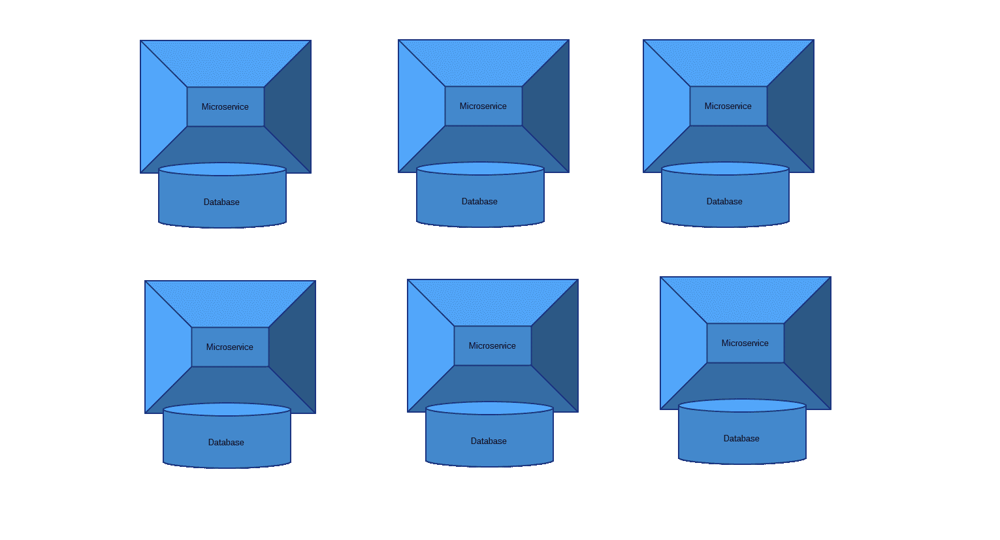

在接下来的部分中，我们将讨论一些策略，以便在从单体应用程序范式到微服务中打破数据模型时牢记。

# 数据一致性的事件驱动架构

我们可以利用的关键设计模式之一，用于保护微服务架构中的数据一致性的是事件驱动设计。微服务中数据一致性难以维护的原因是，每个微服务通常负责整个应用程序的一部分数据。应用程序微服务处理的数据存储的总和代表了应用程序的总状态。因此，这意味着当一个微服务更新其数据库时，受此数据更改影响的其他微服务需要知道这一点，以便它们可以采取适当的行动并更新自己的状态。

让我们以本章的界限上下文部分中的销售和支持微服务示例为例。如果一个新客户购买了产品，销售微服务将需要更新自己的数据库，以反映新客户的状态，即实际付费客户，而不仅仅是潜在客户。这个事件还需要通知支持微服务，以便它可以更新自己的数据库，以反映有一个新的付费客户，无论何时需要都应该得到客户或技术支持。

这种微服务之间的事件通信就是微服务世界中的事件驱动设计。微服务之间的消息队列或消息代理可以用来在微服务之间通信事件消息。消息代理在第四章中详细讨论，*使用消息队列的异步微服务架构*。需要在某个事件发生时通知的微服务将必须订阅这些事件。

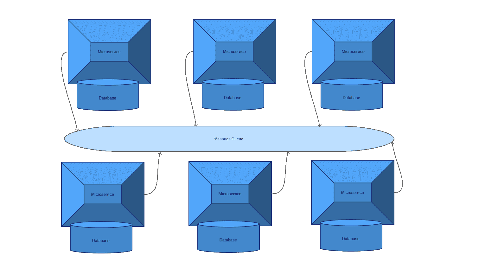

例如，支持服务将需要订阅消息队列上代表客户购买产品的事件主题。销售微服务在客户购买产品时触发此事件。由于支持服务订阅了该事件，它将在不久后收到事件的通知，其中将包括新客户的信息。从那里，支持服务将能够执行自己的逻辑，以确保支持组织随时为客户提供帮助，甚至可能为新客户触发欢迎邮件。

现在，这听起来都很好，但如果支持微服务在接收新客户事件之前失败了怎么办？这意味着支持服务最终将不知道新客户的情况，因此不会对新客户的相关信息进行任何逻辑处理，也不会将其添加到支持数据库中。这是否意味着当客户以后寻求帮助时，支持团队不会帮助，因为他们在系统中看不到客户？显然，我们不希望发生这种情况。一种方法是拥有一个存储客户数据的中央数据库，该数据库将在不同的微服务之间共享，但如果我们寻求一种灵活的设计，每个微服务都完全负责自己的整个状态，该怎么办。这就是事件溯源和 CQRS 概念出现的地方。

# 事件溯源

事件溯源的基本思想是，我们需要利用记录的事件流来形成状态，而不是完全依赖于本地数据库来读取状态。为了使其工作，我们需要存储所有当前和过去的事件，以便以后可以检索它们。

我们需要一个例子来巩固这个理论定义。假设支持服务在接收新客户事件之前失败并崩溃了。如果支持服务不使用事件溯源，那么当它重新启动时，它将在自己的数据库中找不到客户信息，也永远不会知道这个客户。然而，如果它使用事件溯源，那么它不仅会查看本地数据库，还会查看与所有其他微服务共享的事件存储。事件存储将记录我们的微服务之间触发的任何事件。在事件存储中，支持服务将能够重放最近触发的新客户事件，并且会发现这个客户目前不存在于本地支持微服务数据库中。支持服务可以将这些信息处理为正常情况。

再次强调，这种设计能够成功的关键技巧是永远不要丢弃任何事件，无论是过去的还是新的。这是通过将它们保存在事件存储中来实现的；以下是它的样子：

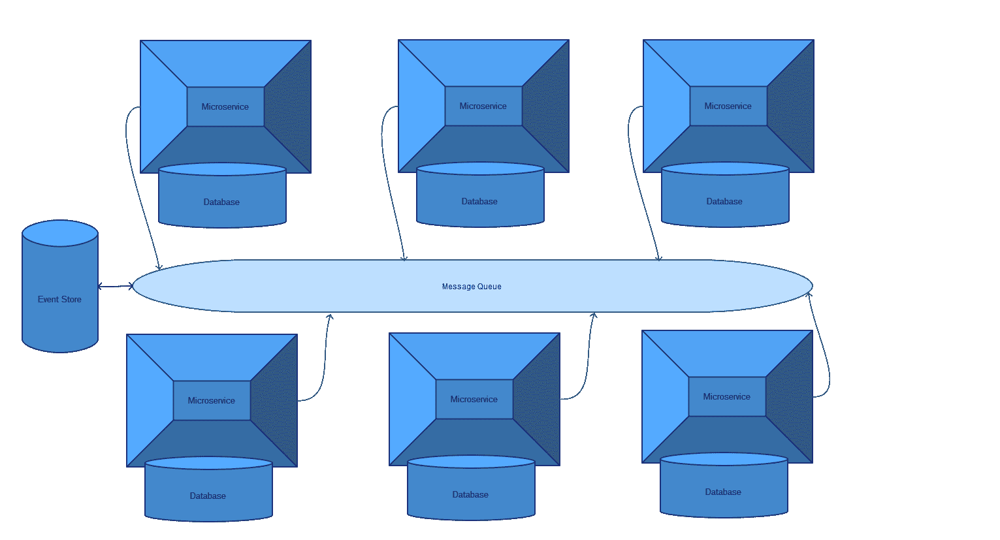

实现事件存储有多种方法；它可以是 SQL 数据库、NoSQL 数据库，甚至是支持永久保存事件的消息队列。Kafka 就是一个消息队列的例子，它声称也是事件溯源的良好引擎。

处理事件溯源有多种方法；我们在本节中涵盖的场景代表了一种使用事件存储和快照的方法。在这种情况下，快照是支持微服务本地数据库，它也试图保持快照状态。然而，最终状态仍然预期在事件存储中。

还有其他实现事件溯源的方法，其中不使用快照，整个状态始终必须从事件存储中派生。

事件溯源的缺点是它可能在复杂性上呈指数级增长。这是因为在某些环境中，我们可能需要重放大量事件，以构建系统的当前状态，这需要大量的处理和复杂性。我们需要运行的查询以形成从不同重放事件中联接数据的数据模型可能会变得非常痛苦。

控制事件溯源复杂性的一种流行方法是 CQRS。

# CQRS

**命令查询责任分离**（**CQRS**）的基本理念是，命令（指与更改数据相关的任何操作，如添加、更新或删除）应该与查询（指与读取数据相关的任何操作）分开。在微服务架构中，这意味着一些服务应该负责命令，而其他服务应该负责查询。

CQRS 的一个关键优势是关注点的分离。这是因为我们将写入关注点与读取关注点分开，并允许它们独立扩展。例如，假设我们使用一个复杂的应用程序，我们需要不同的数据视图可用。我们希望将所有客户数据存储在弹性搜索集群中，以便能够高效地搜索并检索它们的信息。与此同时，我们希望将所有客户数据存储在图数据库中，因为我们希望以图形方式查看数据。

在这种情况下，我们将创建微服务，负责从事件流（消息队列）中查询客户事件，然后通过事件溯源在接收到新的客户事件时更新弹性搜索和图数据库。这些服务将成为 CQRS 的查询部分。另一方面，我们将有其他微服务负责在需要时触发新事件。这些服务最终将成为 CQRS 的命令部分。

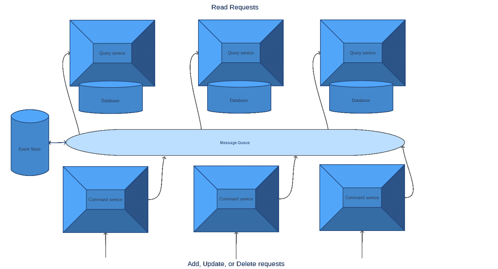

这些读写微服务然后可以与我们的其他服务一起工作，形成我们的应用程序。

# 摘要

在本章中，我们深入探讨了从单体应用程序迁移到微服务应用程序的实际方面。我们仔细研究了一些高级设计模式和架构，可以利用它们来从单体应用程序切换到微服务应用程序。本章结束了我们对本书的学习之旅。

在下一章中，我们将讨论一些技术和主题，您可以在掌握本书中的知识后开始探索。
