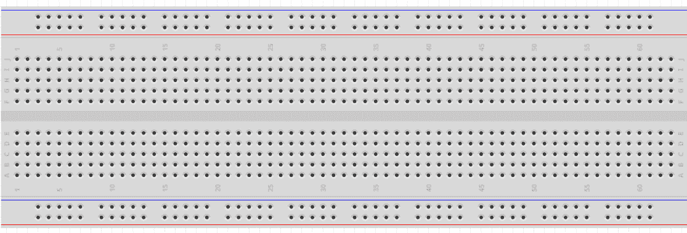
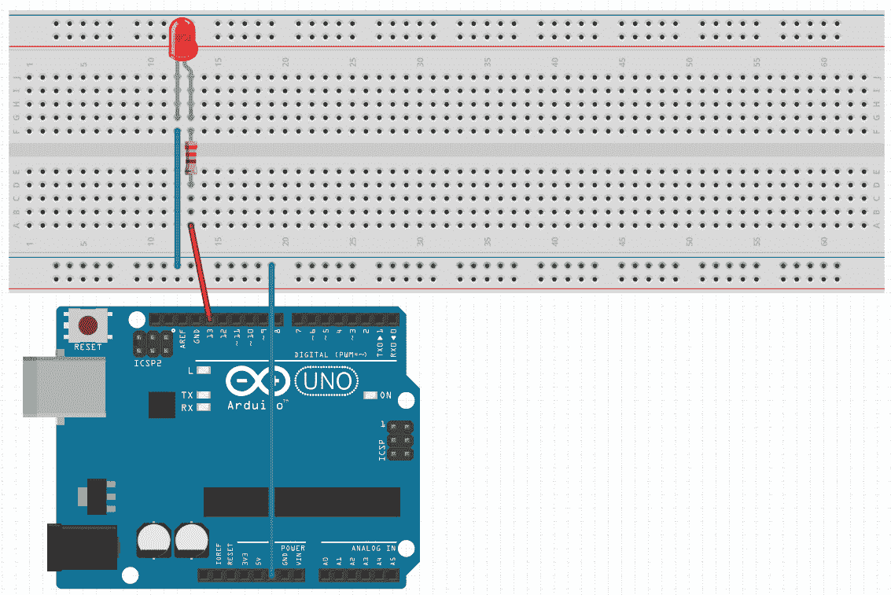
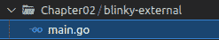
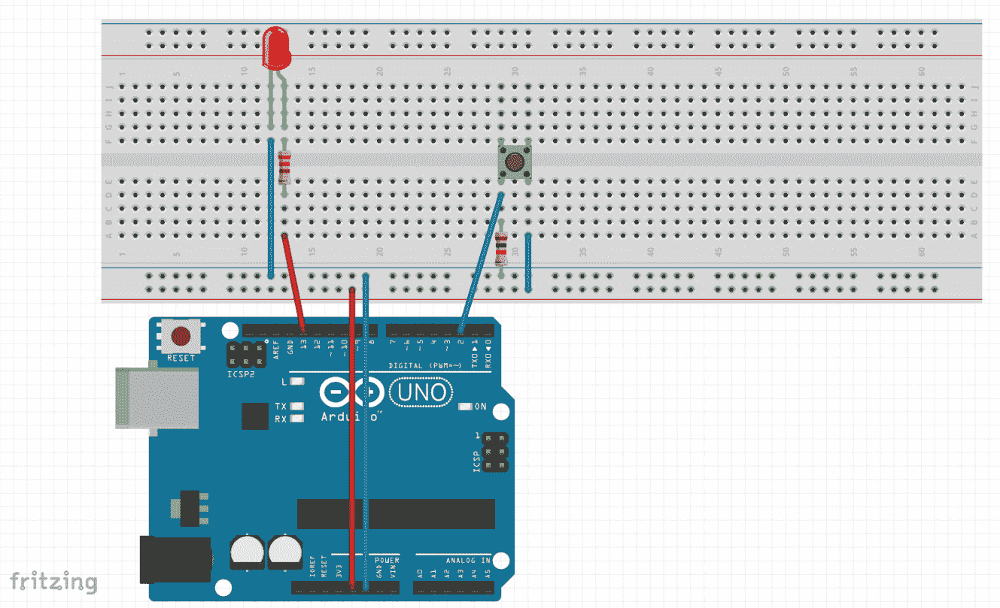
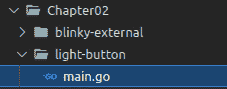

# 第二章：*第二章*：构建交通灯控制系统

在上一章中，我们设置了 TinyGo 和我们的 IDE，并且我们现在知道如何构建和将我们的程序烧录到 Arduino UNO 上。现在我们将利用这些知识更进一步。

在本章中，我们将构建一个交通灯控制系统。我们将把项目分解成小步骤，其中我们构建并测试每个组件。最后，我们将把所有东西组合在一起。我们将使用多个 LED、面包板、GPIO 端口和按钮来中断正常流程，将人行横道灯切换为绿色。到本章结束时，你将知道如何控制外部 LED、读取按钮的状态、使用 GPIO 端口、如何区分电阻以及如何在 TinyGo 中利用 Goroutines。

在本章中，我们将介绍以下主题：

+   点亮外部 LED

+   当按下按钮时点亮单个 LED

+   建立交通灯

+   建立带人行横道灯的交通灯

# 技术要求

要构建交通灯控制系统，我们需要一些组件。为了构建完整的项目，我们需要以下内容：

1.  Arduino UNO

1.  面板

1.  五个 LED

1.  多条跳线

1.  多个 220 欧姆电阻

1.  一个按钮

1.  一个 10K 欧姆电阻

你可以在此 GitHub 仓库中找到本章的所有代码示例：[`github.com/PacktPublishing/Creative-DIY-Microcontroller-Projects-with-TinyGo-and-WebAssembly/tree/master/Chapter02`](https://github.com/PacktPublishing/Creative-DIY-Microcontroller-Projects-with-TinyGo-and-WebAssembly/tree/master/Chapter02)

本章的“代码在行动”视频可以在这里找到：[`bit.ly/2RpvF2a`](https://bit.ly/2RpvF2a)

# 点亮外部 LED

在我们开始构建更复杂的电路之前，让我们先点亮一个外部 LED。一旦这个工作正常，我们将逐步扩展电路。我们从一个红色 LED 开始。点亮外部 LED 与点亮板载 LED 略有不同。我们需要一个可以放置 LED 的东西，我们还需要一些电线以及基本的电阻知识，这将帮助我们防止 LED 损坏。这就是为什么我们要逐个检查每个组件。

### 使用面包板

**面包板**用于原型设计，因为它们不需要你直接焊接组件。我们将使用面包板构建所有项目。

面板通常由两部分组成：

+   电源总线

+   水平行

面板每一侧都有一个电源总线。电源总线提供+（正）车道和-（地）车道。正车道是红色的，地车道是蓝色的。单个插槽在电源总线内部相连。

单行槽位之间也是相连的。一个槽位中的信号也可以在下一个槽位中找到。除非我们放入一根电缆来创建连接，否则不同的水平行之间是不相连的。下面是面包板的外观：



图 2.1 – 面包板 – 图片来自 Fritzing

### 理解 LED 基础

Arduino UNO 的工作电压为 5V，这对大多数 LED 来说太高了。因此，我们需要将电压降低到 LED 可以处理的水平。为此，我们将使用 220 欧姆电阻从线路中抽取电流，以保护 LED 免受损坏。如果您没有 220 欧姆电阻，也可以使用 470 欧姆；220 欧姆到 1K 欧姆（1K = 1,000）之间的任何值都可以。

如果您想确保电阻符合 LED 的需求，也可以按照以下方式计算电阻值：

*R = (V**s* – V**led**) / I**led*

其中：

+   R 是电阻值。

+   Vs 是源电压。

+   Vled 是 LED 上的电压降。

+   Iled 是通过 LED 的电流。

    注意

    LED 有 *阳极*（+）和 *阴极*（-）引脚。阳极引脚较长。

    不同的颜色需要不同的电压。当使用相同电阻和电压为不同颜色的 LED 时，您会发现某些颜色比其他颜色更亮。

### 使用 GPIO 端口

**GPIO** 代表 **通用输入输出**。这意味着我们可以将这些引脚用于数字信号的输入和输出。我们可以将 GPIO 引脚设置为 *高* 或 *低*，或者从端口读取 *高* 或 *低* 值。

注意

我们从不应该从单个 GPIO 端口中抽取超过最大 40.0 mA（毫安）的电流。否则，我们可能会永久损坏硬件。

### 搭建电路

现在让我们在面包板上搭建我们的第一个电路：

1.  在水平行的 *G* 列中放入一个红色 LED。将阴极放入 *G12*，将阳极放入 *G13*。

1.  将 *F12* 连接到电源总线上的地线。

1.  使用 220 欧姆电阻将 *F13* 和 *E13* 连接起来。（220 欧姆到 1,000 欧姆之间的任何值都可以。）

1.  将 GPIO 端口的 *Pin 13* 连接到 *A13*。

1.  将 GND 端口连接到电源总线上的地线。

    注意

    您面包板上的描述可能与我使用的不同。如果是这样，您需要根据下一张图来构建电路。

电路现在应该看起来像以下这样：



图 2.2 – 电路图片 – 图片来自 Fritzing

### 编写代码

我们首先在我们的项目工作区中创建一个名为 `Chapter02` 的新文件夹。这个文件夹将用于本章的所有部分。在 `Chapter02` 文件夹内，我们创建一个 `blinky-external` 文件夹，并在其中创建一个新的 `main.go` 文件。

结构应该看起来像以下这样：



图 2.3 - 编写代码的项目结构

我们导入`machine`和`time`包，并将以下代码放入`main`函数中：

1.  声明并初始化一个名为`outputConfig`的变量，使用新的`PinConfig`以输出模式：

    ```go
    outputConfig := machine.PinConfig{Mode: machine.
                    PinOutput}
    ```

1.  声明并初始化一个名为`greenLED`的变量，其值为`machine.D13`：

    ```go
    greenLED := machine.D13
    ```

1.  使用我们之前创建的`outputConfig`实例配置 LED，通过将其作为参数传递给`Configure`函数：

    ```go
    redLED.Configure(outputConfig)
    ```

1.  然后我们无限循环：

    ```go
    for {
    ```

1.  将`redLED`设置为`Low`（关闭）：

    ```go
      redLED.Low()
    ```

1.  睡眠半秒钟。如果不睡眠，LED 将以极高的速率开启和关闭，因此每次状态改变后我们都会睡眠：

    ```go
      time.Sleep(500 * time.Millisecond)
    ```

1.  将`redLED`设置为`High`（开启）：

    ```go
      redLED.High()
    ```

1.  睡眠半秒钟：

    ```go
      time.Sleep(500 * time.Millisecond)
    }
    ```

1.  现在使用以下命令使用`tinygo flash`命令闪烁程序：

    ```go
    tinygo flash –target=arduino Chapter02/blinky-external/main.go
    ```

当闪烁进度完成并且 Arduino 重新启动时，红色 LED 应该以 500 毫秒的间隔闪烁。

恭喜你，你刚刚构建了你的第一个电路并编写了第一个控制外部硬件的程序！既然我们现在知道如何在面包板上连接和控制外部 LED，我们可以继续构建一个更复杂的电路。让我们在下一节中这样做。

# 当按钮被按下时点亮 LED

到目前为止，我们只使用了代码来直接控制硬件组件。现在让我们尝试读取按钮的状态以控制 LED。我们需要以下组件：

+   至少 6 根跳线

+   一个 LED（颜色不重要）

+   一个 220 欧姆电阻

+   一个 4 针按钮（按下按钮）

+   一个 10K 欧姆电阻

现在让我们继续构建电路。

## 构建电路

以下电路扩展了我们之前构建的电路。所以，如果你仍然组装了之前的电路，你只需要添加按钮部分。下一个电路由两个组件组组成。第一个组用于控制 LED，第二个组用于读取按钮状态。

### 添加 LED 组件

我们从 LED 电路开始：

1.  将一个 LED 的阴极放在 G12，阳极放在 G13\。

1.  使用 220 欧姆电阻将*F13*与*D13*连接。

1.  使用跳线将 GPIO 端口中的*D13*端口与*A13*连接。

1.  使用跳线将*F12*与电源总线的地线连接。

### 添加按钮组件

现在我们将添加一个按钮：

1.  使用跳线将`A31`与电源总线的正线连接。

1.  使用 10K 欧姆电阻将电源总线的地线与`B29`连接。

1.  将`D29`与端口`D2`连接。

1.  将按钮的一个引脚放在`E29`，一个放在`E31`，一个放在`F29`，最后一个引脚放在`F31`。

我们现在的电路应该看起来类似于以下这样：



](img/Figure_2.4_B16555.jpg)

图 2.4 – 电路 – 从 Fritzing 获取的图像

注意

在我们开始为这个电路编写代码之前，我们需要了解这些按钮是如何工作的。

由于按钮如果放置不正确在面包板上将无法工作，让我们再次看看按钮。

按钮上的 4 个引脚分为两组，每组两个引脚。因此，两个引脚相互连接。查看按钮的背面，我们应该能够看到两个相对的引脚相互连接。因此，当你将按钮旋转 90°放置时，按钮可能不会按预期工作。

## 编程逻辑

在深入代码之前，我们将在`Chapter02`文件夹内创建一个名为`light-button`的新文件夹，并在其中创建一个`main.go`文件，包含一个空的`main`函数，使用以下命令：




图 2.5 – 逻辑的文件夹结构

现在我们来看看`main`函数和上拉电阻。

### 主函数

我们希望在按钮被按下时点亮 LED。为了实现这一点，我们需要从引脚读取并使用以下步骤检查其状态：

1.  使用`PinConfig`在`PinOutput`模式下初始化`outPutConfig`变量。这个配置将被用来控制 LED 引脚：

    ```go
    outputConfig := machine.PinConfig{Mode: machine.
                    PinOutput}
    ```

1.  使用`PinConfig`在`PinInput`模式下初始化`inputConfig`变量。这个配置正在用于读取按钮状态的引脚，因此它需要是一个输入：

    ```go
    inputConfig := machine.PinConfig{Mode: machine.PinInput}
    ```

1.  使用`machine.D13`的值初始化`led`变量，这是我们连接到`led`的引脚：

    ```go
    led := machine.D13
    ```

1.  通过传递`outputConfig`作为参数配置`led`为输出，这是连接到按钮的引脚：

    ```go
    led.Configure(outputConfig)
    ```

1.  使用`machine.D2`的值初始化`buttonInput`变量：

    ```go
    buttonInput := machine.D2
    ```

1.  将`buttonInput`配置为输入，通过传递`inputConfig`作为参数：

    ```go
    buttonInput.Configure(inputConfig)
    ```

1.  由于我们不希望程序在检查按钮状态一次后就终止，我们使用一个无限循环来重复并永远检查：

    ```go
    for {
    ```

1.  检查按钮的当前状态。如果按钮被按下，它将为真：

    ```go
      if buttonInput.Get() {
    ```

1.  如果按钮被按下，我们将点亮 LED：

    ```go
        led.High()
    ```

1.  我们在这里调用`continue`，所以我们不会执行`led.Low()`调用：

    ```go
        continue
       }
    ```

1.  如果按钮没有被按下，我们将 LED 关闭：

    ```go
        led.Low()
    }
    ```

    注意

    不要忘记导入`machine`包，否则代码将无法编译。

现在使用`tinygo flash`命令烧录程序：

```go
tinygo flash –target=arduino Chapter02/light-button/main.go
```

在成功烧录后，当你按下按钮时，LED 应该会点亮。

### 上拉电阻

你可能想知道为什么按钮电路中需要一个 10K 欧姆的电阻。10K 欧姆电阻用于防止信号/引脚悬空。悬空引脚是坏的，因为一个处于悬空状态的输入引脚是不确定的。当我们尝试从一个引脚读取值时，我们期望得到一个数字值 - 1 或 0，或真或假。悬空意味着值可以在 1 和 0 之间快速变化，这发生在没有上拉或下拉电阻的情况下。以下是一些关于悬空引脚的进一步阅读：[`www.mouser.com/blog/dont-leave-your-pins-floating`](https://www.mouser.com/blog/dont-leave-your-pins-floating)。

作为 10K 欧姆外部电阻的替代，可以使用内部电阻。

配置输入引脚使用内部电阻的方法如下：

```go
inputConfig := machine.PinConfig{
               Mode: machine.PinInputPullup
}
```

我们现在已经学会了如何使用输入信号控制 LED，这个信号是由按钮提供的。下一步是构建交通信号灯流程来控制三个 LED。

# 构建交通信号灯

我们知道如何点亮一个 LED，也知道如何使用按钮输入点亮一个 LED。下一步是构建一个使用三个 LED 的电路，并编写代码以正确顺序点亮它们。

## 构建电路

构建电路需要以下组件：

+   三个 LED（最好是红、黄、绿）

+   三个 220 欧姆电阻

+   七根跳线

我们首先通过以下步骤设置组件：

1.  将 Arduino 的*GND*连接到电源总线的任何地端口。

1.  将第一个（红色）LED 的阴极放置在*G12*，阳极放置在*G13*。

1.  将第二个（黄色）LED 的阴极放置在*G15*，阳极放置在*G16*。

1.  将第三个（绿色）LED 的阴极放置在*G18*，阳极放置在*G19*。

1.  使用 220 欧姆电阻将*F13*与*D13*连接。

1.  使用 220 欧姆电阻将*F16*与*D16*连接。

1.  使用 220 欧姆电阻将*F19*与*D19*连接。

1.  使用跳线将*F13*连接到电源总线上的*Ground*。

1.  使用跳线将*F16*连接到电源总线上的*Ground*。

1.  使用跳线将*F19*连接到电源总线上的*Ground*。

1.  使用跳线将端口*D13*连接到*A12*。

1.  使用跳线将端口*D16*连接到*A12*。

1.  使用跳线将端口*D19*连接到*A12*。

您的电路现在应该类似于以下图示：

![图 2.6 – 交通信号灯电路 – 图片来自 Fritzing

![img/Figure_2.6_B16555.jpg]

图 2.6 – 交通信号灯电路 – 图片来自 Fritzing

我们现在已经成功设置了电路。现在我们可以继续编写一些代码来控制 LED。

## 创建文件夹结构

我们首先在`Chapter02`文件夹内的`main.go`文件中创建一个名为`traffic-lights-simple`的新文件夹，并从空的`main`函数开始。现在，您的项目结构应该如下所示：

![图 2.7 - 电路的文件夹结构

![img/Figure_2.7_B16555.jpg]

图 2.7 - 电路的文件夹结构

## 编写逻辑

我们已经成功设置了项目结构以继续。我们将实现以下流程：

*红灯 -> 黄红灯 -> 绿灯 -> 黄灯 -> 红灯*

这是一种典型的有三个灯泡的交通信号灯流程。

我们将配置三个引脚为输出，之后我们想要无限循环并按照此流程点亮 LED。

在`main`函数内部，我们编写以下代码：

1.  使用`PinOutPut`模式初始化一个名为`outputConfig`的新变量为`PinConfig`：

    ```go
    outputConfig := machine.PinConfig{Mode: machine.
                    PinOutput}
    ```

1.  初始化一个名为`redLED`的新变量，其值为`machine.D13`，并配置为输出：

    ```go
    redLED := machine.D13
    redLED.Configure(outputConfig)
    ```

1.  初始化一个名为`yellowLED`的新变量，其值为`machine.D12`，并配置为输出：

    ```go
    yellowLED := machine.D12
    yellowLED.Configure(outputConfig)
    ```

1.  初始化一个名为`greenLED`的新变量，其值为`machine.D11`，并配置为输出：

    ```go
    greenLED := machine.D11
    greenLED.Configure(outputConfig)
    ```

我们现在已经初始化了变量作为输出引脚。下一步是按正确顺序点亮 LED。我们基本上有四个阶段，只需要按顺序重复即可模拟真实的交通灯。让我们逐一来看：

1.  我们将无限循环处理各个阶段：

    ```go
    for {
    ```

1.  对于*红色阶段*，打开红色 LED 并等待一秒钟：

    ```go
        redLED.High()
        time.Sleep(time.Second)
    ```

1.  对于*红黄阶段*，打开黄色 LED 并等待一秒钟：

    ```go
        yellowLED.High()
        time.Sleep(time.Second)
    ```

1.  对于*绿色阶段*，关闭黄色和红色 LED，打开绿色 LED 并等待一秒钟：

    ```go
        redLED.Low()
        yellowLED.Low()
        greenLED.High()
        time.Sleep(time.Second)
    ```

1.  对于*黄色阶段*，关闭绿色 LED 并打开黄色 LED，然后等待一秒钟，再次关闭黄色 LED，这样我们就可以干净地再次开始*红色阶段*：

    ```go
        greenLED.Low()
        yellowLED.High()
        time.Sleep(time.Second)
        yellowLED.Low()
    }
    ```

函数的完整内容可在以下 URL 找到：

[`github.com/PacktPublishing/Programming-Microcontrollers-and-WebAssembly-with-TinyGo/blob/master/Chapter02/traffic-lights-simple/main.go`](https://github.com/PacktPublishing/Programming-Microcontrollers-and-WebAssembly-with-TinyGo/blob/master/Chapter02/traffic-lights-simple/main.go)

注意

不要忘记导入`time`和`machine`包。

我们现在已经组装并编程了一个完整的交通灯流程。下一步是将我们构建的一切结合起来完成我们的项目。

# 建立带人行道灯的交通灯

我们现在将结合本章所学和所做的一切，创建一个更加逼真的交通灯系统。我们将通过组装一个包含前一步骤中的三个灯泡交通灯的电路，并添加由按钮控制的两个灯泡的人行道灯来实现这一点。

## 组装电路

对于本章的最终项目，我们需要以下内容：

+   五个 LED：最好有两个红色，一个黄色和两个绿色

+   五个 220 欧姆电阻，每个 LED 一个

+   一个 10K 欧姆电阻作为按钮的上拉电阻

+   一个四针按钮

+   14 根跳线

我们首先按照以下步骤设置三个灯泡的交通灯：

1.  将第一个 LED（红色）的阴极连接到*G12*，阳极连接到*G13*。

1.  将第二个 LED（黄色）的阴极连接到*G15*，阳极连接到*G16*。

1.  将第三个 LED（绿色）的阴极连接到*G18*，阳极连接到*G19*。

1.  使用 220 欧姆电阻将*F13*与*D13*连接。

1.  使用 220 欧姆电阻将*F16*与*D16*连接。

1.  使用 220 欧姆电阻将*F19*与*D19*连接。

1.  使用跳线将引脚*D13*与*A13*连接。

1.  使用跳线将引脚*D12*与*A16*连接。

1.  使用跳线将引脚*D11*与*A10*连接。

1.  使用跳线将*F12*与电源总线上的地线连接。

1.  使用跳线将*F15*与电源总线上的地线连接。

1.  使用跳线将*F18*与电源总线上的地线连接。

现在按照以下步骤组装人行道灯：

1.  将第四个 LED（红色）的阴极连接到*G22*，阳极连接到*G23*。

1.  将第五个 LED（绿色）的阴极连接到*G25*，阳极连接到*G26*。

1.  使用 220 欧姆电阻将*F23*与*D23*连接。

1.  使用 220 欧姆电阻将*F26*与*D26*连接。

1.  使用跳线将引脚*D5*与*A23*连接。

1.  使用跳线将引脚*D4*与*A26*连接。

1.  使用跳线将*F22*与电源总线上的地连接。

1.  使用跳线将*F24*与电源总线上的地连接。

现在我们只需要组装按钮并连接电源总线：

1.  将一个按钮放置在*E29*和*F29*的左引脚上，右引脚在*E31*和*F31*上。

1.  使用 10K 欧姆电阻将电源总线上的地与*B29*连接。

1.  使用跳线将引脚*D2*与*C29*连接。

1.  使用跳线将*A31*与电源总线上的正极连接。

1.  使用跳线将电源总线上的正极连接到 Arduino UNO 的 5V 端口。

1.  使用跳线将电源总线上的地连接到 Arduino UNO 的地端口。

当你完成组装后，你的电路应该看起来像这样：

![图 2.8 – 由按钮控制的交通灯和行人灯的电路 – 图片来自 Fritzing

一个按钮 – 图片来自 Fritzing

![img/Figure_2.8_B16555.jpg]

图 2.8 – 由按钮控制的交通灯和行人灯的电路 – 图片来自 Fritzing

太好了，我们现在已经完全组装了本章的最终项目。我们现在可以编写一些代码来使这个项目变得生动起来。

## 设置项目结构

我们首先在`Chapter02`文件夹内创建一个名为`traffic-lights-pedestrian`的新文件夹。在新文件夹内，我们创建一个名为`main.go`的新文件，并在其中创建一个空的`main`函数。

我们的项目结构现在应该看起来像以下这样：

![图 2.9 - 项目的结构

![img/Figure_2.9_B16555.jpg]

图 2.9 - 项目的结构

## 编写逻辑

我们将把程序分成三个部分：

+   初始化逻辑

+   主逻辑

+   `交通灯`逻辑

### 初始化逻辑

我们需要初始化一个`stopTraffic`变量，并按照以下步骤配置 LED 引脚为输出引脚：

1.  我们首先在包级别声明一个名为`stopTraffic`的`bool`变量。这个变量将用作我们两个逻辑部分之间的通信通道：

    ```go
    var stopTraffic bool
    ```

1.  在`main`方法中，我们首先将`stopTraffic`的值设置为`false`：

    ```go
    stopTraffic = false
    ```

1.  我们在`PinOutput`模式下声明并初始化一个名为`outputConfig`的新变量，并将其传递给所有 LED 引脚：

    ```go
    outputConfig := machine.PinConfig{Mode: machine.
                    PinOutput}
    ```

1.  我们初始化一些新变量：`greenLED`的值为`machine.D11`，`yellowLED`的值为`machine.D12`，`redLED`的值为`machine.D13`。然后，我们将每个 LED 变量配置为输出引脚：

    ```go
    greenLED := machine.D11
    greenLED.Configure(outputConfig)
    yellowLED := machine.D12
    yellowLED.Configure(outputConfig)
    redLED := machine.D13
    redLED.Configure(outputConfig)
    ```

1.  我们初始化一些新变量：`pedestrianGreen`的值为`machine.D4`，`pedestrianRed`的值为`machine.D5`。然后，我们将每个 LED 变量配置为输出引脚：

    ```go
    pedestrianGreen := machine.D4
    pedestrianGreen.Configure(outputConfig)
    pedestrianRed := machine.D5
    pedestrianRed.Configure(outputConfig)
    ```

1.  我们声明并初始化一个名为`inputConfig`的新变量，使用`PinConfig`在`PinInput`模式中。然后，我们声明并初始化一个名为`buttonInput`的新变量，其值为`machine.D2`，并将`buttonInput`配置为输入引脚：

    ```go
    inputConfig := machine.PinConfig{Mode: machine.PinInput}
    buttonInput := machine.D2
    buttonInput.Configure(inputConfig)
    ```

初始化到此为止。我们已经设置了所有引脚和一个布尔变量在包级别。

注意

引脚常量，如`machine.D13`，是`machine.Pin`类型。

### 编写 trafficLights 逻辑

我们现在将编写完整的逻辑来控制电路中的所有 LED。这将是我们第一次需要将代码的一些部分移动到其他函数中。

为了做到这一点，我们首先编写一个名为`trafficLights`的新函数，该函数*接受所有五个 LED 引脚作为参数*，并且没有返回值。在函数内部，我们从一个空的、无休止的循环开始。我们的函数现在应该看起来像以下这样：

```go
func trafficLights(redLED, greenLED, yellowLED, pedestrianRED, 
    pedestrianGreen machine.Pin) {
      for {
      }
}
```

所有逻辑都将放置在`for`循环中。循环中的实际逻辑包括两部分：

+   处理按钮信号以停止交通和控制行人灯

+   控制正常交通灯的流量

我们从处理按钮的信号开始。为了做到这一点，我们在`if`中检查`stopTraffic`，并且还有一个空的`else`分支。它看起来像以下这样：

```go
        if stopTraffic {
    } else {
}
```

因此，当`stopTraffic`为`true`时，我们希望将我们的交通灯相位设置为*红色*。我们还希望将行人灯相位设置为*绿色*3 秒钟，然后回到*红色*，之后将`stopTraffic`设置为`false`，因为我们已经处理了一次信号。

让我们使用以下步骤来实现这个逻辑：

1.  将交通灯相位设置为红色：

    ```go
    redLED.High()
    yellowLED.Low()
    greenLED.Low()
    ```

1.  将行人灯相位设置为绿色 3 秒钟：

    ```go
    pedestrianGreen.High()
    pedestrianRED.Low()
    time.Sleep(3 * time.Second)
    ```

1.  将行人灯相位设置为*红色*：

    ```go
    pedestrianGreen.Low()
    pedestrianRED.High()
    ```

1.  将`stopTraffic`设置为`false`，因为我们已经处理了信号：

    ```go
    stopTraffic = false
    ```

1.  在`else`块中，我们只需将行人灯状态重置为红色：

    ```go
    pedestrianGreen.Low()
    pedestrianRED.High()
    ```

好的，这是响应`stopTraffic`信号的部分。在`if-else`块下面，我们将实现控制交通灯流量的实际逻辑，这与之前所做的相同。所以我们从*红色*相位开始，过渡到*红色-黄色*相位，然后到*绿色*，然后到*黄色*，然后重置*黄色*以便能够干净地再次开始，如下所示：

```go
redLED.High()
time.Sleep(time.Second)
yellowLED.High()
time.Sleep(time.Second)
redLED.Low()
yellowLED.Low()
greenLED.High()
time.Sleep(time.Second)
greenLED.Low()
yellowLED.High()
time.Sleep(time.Second)
yellowLED.Low()
```

在`trafficLights`函数中，我们只需做这些。

### 实现主要逻辑

现在我们只需要同时运行`trafficLights`函数和处理按钮输入。这就是**goroutines**发挥作用的地方。由于微控制器只有一个处理器核心，它使用单个线程工作，所以我们不能真正并行执行任务。由于我们在 Arduino UNO 上使用 goroutines，我们需要一些额外的构建参数。我们将在程序烧录时学习这些参数。在我们的例子中，我们希望在按钮上有一个监听器，同时仍然能够逐步处理交通灯过程。逻辑包括三个步骤：

1.  使用`red`相位初始化行人灯。

1.  在 goroutine 中运行`trafficLights`函数。

1.  处理按钮输入。

对于第一部分，我们只需要将`pedestrianRED` LED 设置为`高`，将`pedestrianGreen` LED 设置为`低`：

```go
pedestrianRed.High()
pedestrianGreen.Low()
```

现在我们只需调用`trafficLights`，并通过 goroutine 传递所有必要的参数：

```go
go trafficLights(redLED, greenLED, yellowLED, pedestrianRed, pedestrianGreen)
```

对于最后一步，我们需要一个无限循环来检查`buttonInput`，并在按钮被按下时将`stopTraffic`设置为`true`。我们还需要它在之后睡眠 50 毫秒：

```go
for {
  if buttonInput.Get() {
    stopTraffic = true
  }
  time.Sleep(50 * time.Millisecond)
}
```

注意

在处理按钮输入的循环中添加睡眠时间是必要的，因为调度器需要时间来运行 goroutine。goroutine 在主函数睡眠时被处理。此外，其他阻塞函数，如从通道读取，也可以用来给调度器时间来处理其他任务。

既然我们已经完成了逻辑，现在是时候将程序烧录到控制器上了。由于我们在项目中使用了 goroutine，我们需要向`tinygo flash`命令传递额外的参数：

```go
tinygo flash -scheduler tasks -target=arduino Chapter02/traffic-lights-pedestrian/main.go
```

由于 ATmega328p 资源非常有限，因此默认情况下在使用此微控制器的板上禁用调度器。Arduino UNO 就是这样一块板。当使用其他微控制器时，我们通常不需要通过设置此参数来覆盖默认调度器。

我们现在已经成功地将程序烧录到了 Arduino Uno。交通灯应该开始循环所有相位，行人灯应保持在*红灯*相位。当点击按钮时，交通灯应该结束循环，然后行人灯应切换到*绿灯*相位，而交通灯保持在*红灯*相位 3 秒钟。

注意

由于 Arduino Uno 上的内存非常有限，使用 goroutine 可能只在不太复杂的项目中有效，例如这个项目。

# 摘要

我们学习了如何构建一个完全功能的交通灯系统，行人灯由按钮控制。我们通过分别构建项目的每个部分并在最后组装它们来实现这一点。

我们学习了如何使用面包板，电阻上的颜色代码如何工作，为什么在控制 LED 时使用电阻，以及外部 LED 的组装方法。我们还学习了如何使用按钮，如何使用上拉电阻防止信号浮空，以及如何在 TinyGo 中利用 goroutine。

在下一章中，我们将学习如何从 4x4 键盘读取输入以及如何控制伺服电机。我们将利用这些知识来构建一个当输入正确密码时开启的安全锁。

# 问题

1.  为什么我们在 LED 阳极和 GPIO 端口之间放置一个电阻？

1.  我们如何阻止信号浮空？

1.  为什么在检查按钮状态后我们会进入睡眠状态？

1.  你会如何修改代码以实现以下行为？

    a. 当按钮被按下时，关闭交通灯的红灯和绿灯，并让黄灯闪烁。

    b. 当按钮再次被按下时：返回正常相位旋转。

# 进一步阅读

+   电阻色环转换计算器: [`www.digikey.com/en/resources/conversion-calculators/conversion-calculator-resistor-color-code`](https://www.digikey.com/en/resources/conversion-calculators/conversion-calculator-resistor-color-code)

+   TinyGo 中的 Goroutines: [`aykevl.nl/2019/02/tinygo-goroutines`](https://aykevl.nl/2019/02/tinygo-goroutines)
