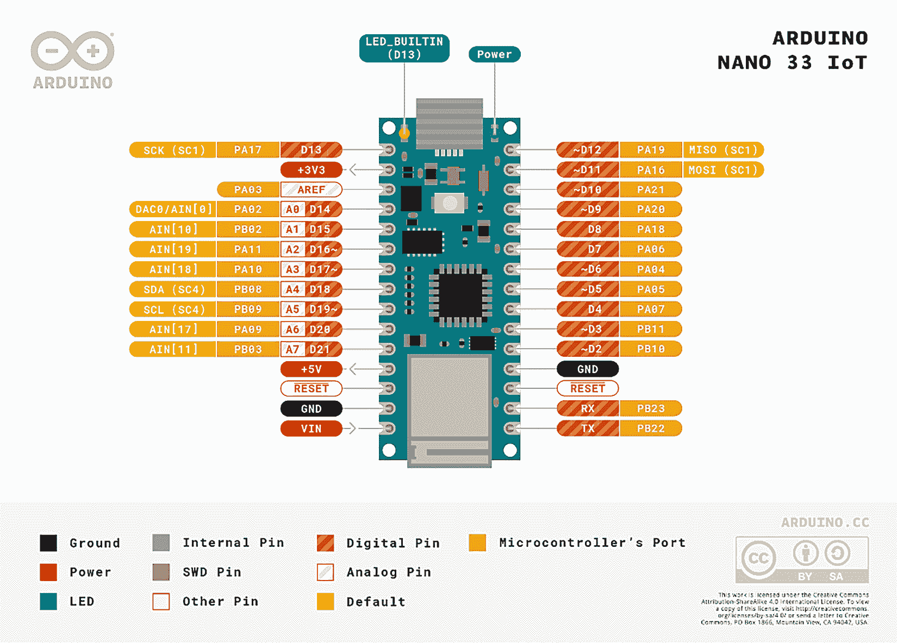
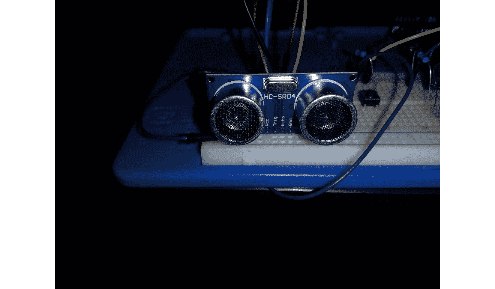
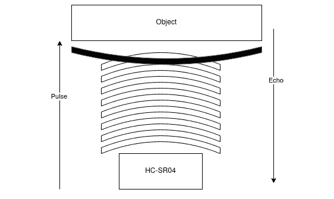
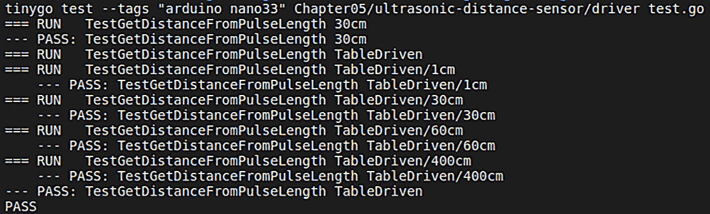
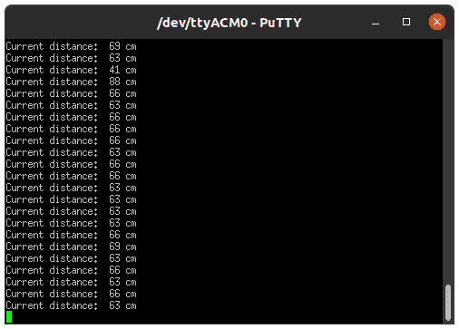
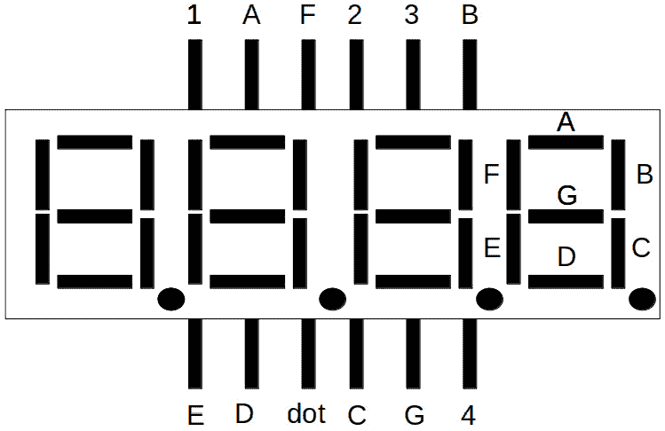
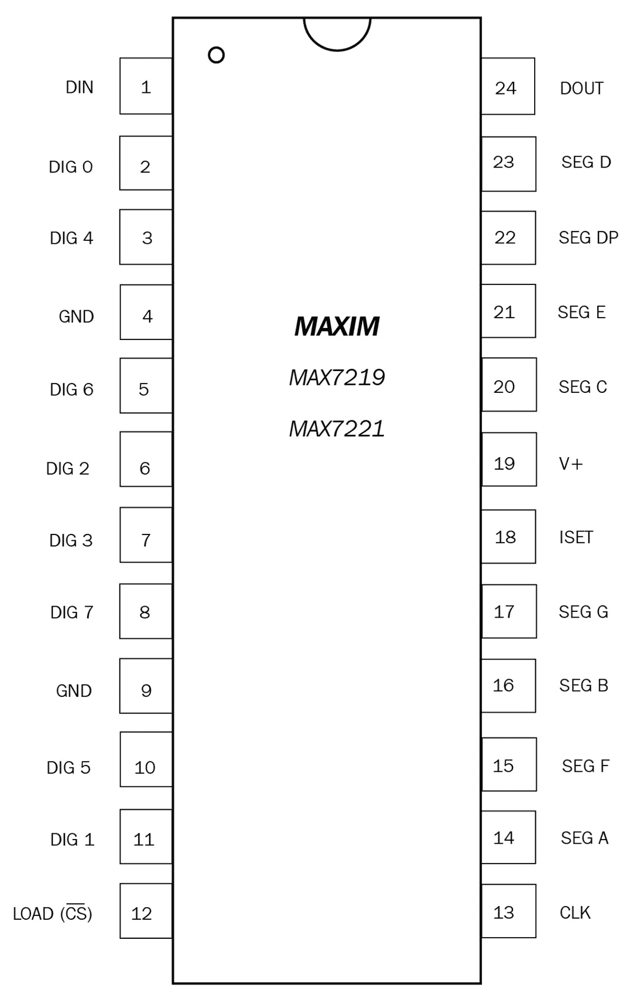
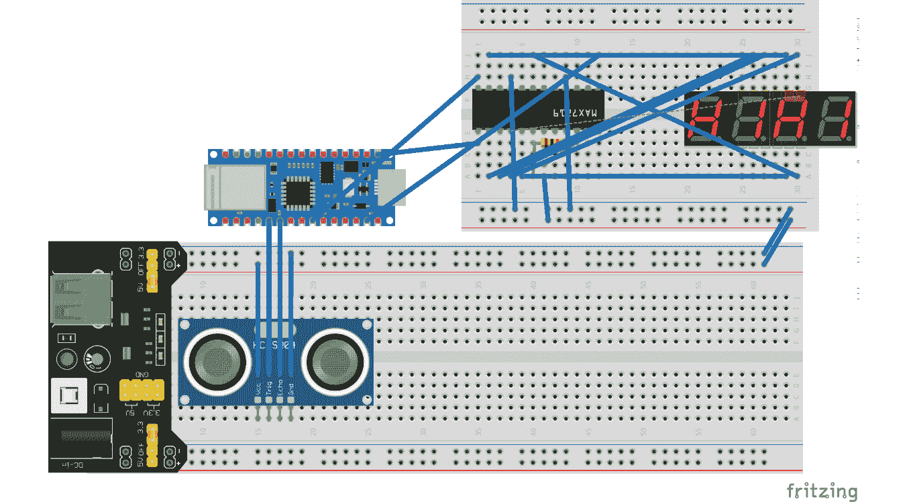
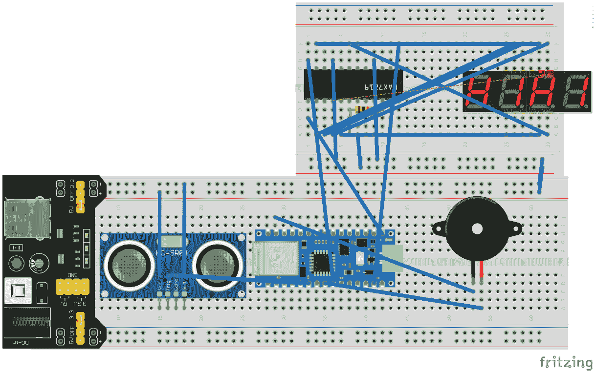

# 第五章：*第五章*：构建非接触式洗手计时器

在*第四章*“构建植物浇水系统”中，我们学习了 ADC 接口的工作原理，并利用这一知识编写了电容式土壤湿度传感器和水位传感器的库。我们还编写了一个小型库来控制蜂鸣器，并学习了继电器的工作原理，利用这些知识使用我们的代码控制水泵。然后，我们利用所有这些知识构建了一个自动植物浇水系统。

在本章中，我们将构建一个非接触式洗手计时器。完成本章学习后，您将了解超声波传感器的工作原理以及如何使用它们来测量距离。我们将利用这些知识来创建一个传感器，当手在传感器 20 至 30 厘米之间时，可以启动计时器。计时器随后将在 7 段显示器上显示。在实现这一功能的同时，我们还将了解 MAX7219 芯片及其如何用于控制不同类型的显示器。

本章将涵盖以下主要内容：

+   介绍 Arduino Nano 33 IoT

+   测量距离

+   使用 7 段显示器

+   整合所有内容

# 技术要求

我们将需要以下组件来完成这个项目：

+   一个 Arduino Nano 33 IoT

+   一个 HC-SR04 传感器

+   一个外部电源模块

+   HS420561K 4 位 7 段显示器共阴极

+   一个 MAX7219 或 MAX7221 串行输入/输出共阴极显示驱动器

+   一个 10,000 欧姆电阻

+   一个 1,000 欧姆电阻

+   一个 2,000 欧姆电阻

+   2 块面包板

+   跳线电缆

大多数组件都是所谓的 Arduino 入门套件的一部分。如果您没有这样的套件，它们可以在任何电子产品商店购买。

您可以在 GitHub 上找到本章的代码：[`github.com/PacktPublishing/Creative-DIY-Microcontroller-Projects-with-TinyGo-and-WebAssembly/tree/master/Chapter05`](https://github.com/PacktPublishing/Creative-DIY-Microcontroller-Projects-with-TinyGo-and-WebAssembly/tree/master/Chapter05)

本章的“代码在行动”视频可以在此处找到：[`bit.ly/3e2IYgG`](https://bit.ly/3e2IYgG)

# 介绍 Arduino Nano 33 IoT

我们已经达到一个阶段，TinyGo 对 Arduino UNO 的支持已经达到极限。在撰写本文时，无法使用 Arduino UNO 解决当前和后续章节的这个问题。原因是缺少我发起的相应`Pull`请求。此外，TinyGo 编译器工具链中的 Alf 和 Vegard 的 RISC（**AVR**）后端在当前 TinyGo 版本中存在一些问题，代码无法编译。因此，让我们看看另一个完全由 TinyGo 支持的板——Arduino Nano 33 IoT。与 UNO 相比，Nano 33 IoT 是一款性能强大的板。以下是它的技术规格：

+   **微控制器**：AMD21 Cortex®-M0+ 32 位低功耗 ARM MCU

+   **无线模块**：U-blox NINA-W102

+   **工作电压**：3.3V

+   **输入电压（限制）**: 2V

+   **每个 I/O 引脚的直流电流**: 7 mA

+   **时钟速度**: 48 MHz

+   **CPU 闪存**: 256 KB

+   **SRAM**: 32 KB

+   **GPIO 引脚**: 14

+   **模拟输入引脚**: 8 (8/10/12 位)

+   **模拟输出引脚**: 1 (10 位)

因此，Arduino Nano 33 IoT 在 3.3V 而不是 5V 供电时具有更高的时钟速度、更多的 RAM 和更多的闪存。此外，Nano 33 IoT 还具备 Wi-Fi 通信功能。

现在，让我们简要地了解一下 Arduino Nano 33 IoT 的 5V 输出能力。

注意

虽然 Arduino Nano 33 IoT 有一个 5V 输出引脚，但该引脚默认是禁用的。要激活该引脚，需要进行一些焊接。

当通过 USB 为 Arduino Nano 33 IoT 供电时，我们也在`Vin`引脚上有一个 5V 电流，但该引脚的目的是为 Arduino 供电。我们将处理需要 5V 输入的设备，但这不是问题；我们只是将使用外部电源为这些设备供电。

现在我们对它有了基本的了解，让我们来看看引脚图。以下图表显示了 Arduino Nano 33 IoT 的引脚图：



图 5.1 – Arduino Nano 33 IoT 引脚图

引脚图来源可以在[`store.arduino.cc/arduino-nano-33-iot`](https://store.arduino.cc/arduino-nano-33-iot)找到。

在本节中，我们简要地了解了 Arduino Nano 33 IoT 的技术规格。然而，在我们能够在项目中使用它之前，我们需要安装一些依赖项。

## 安装 Bossa

为了将程序烧录到 Arduino Nano 33 IoT 上，需要 Bossa。

首先，让我们看看在 Mac 系统上的安装过程：

+   您可以使用以下命令简单地安装依赖项：

    ```go
    msi:

    ```

    [`github.com/shumatech/BOSSA/releases/download/1.9.1/bossa-x64-1.9.1.msi`](https://github.com/shumatech/BOSSA/releases/download/1.9.1/bossa-x64-1.9.1.msi)

    ```go

    ```

+   当执行`msi`时，请选择以下安装路径：

    ```go
    bossa to the path using the following command: 

    ```

    set PATH=%PATH%;"c:\Program Files\BOSSA";

    ```go

    ```

+   为了在 Linux 系统上安装`bossa`，请执行以下命令：

    ```go
    sudo apt install libreadline-dev libwxgtk3.0-gtk3-dev
    git clone https://github.com/shumatech/BOSSA.git
    cd BOSSAmakesudo 
    cp bin/bossac /usr/local/bin
    ```

要验证安装成功，请使用以下命令：

```go
bossac –help
```

关于如何安装所需依赖项的最新信息可以在[`tinygo.org/microcontrollers/arduino-nano33-iot/`](https://tinygo.org/microcontrollers/arduino-nano33-iot/)找到。

我们现在已经设置了在 Arduino Nano 33 IoT 上烧录程序的所需依赖项。让我们继续本章的第一个项目。

# 学习测量距离

如果你曾经好奇无接触式肥皂分配器或无接触式吹风机是如何检测到它们下面有手的，那么它们很可能正在使用 HC-SR04 超声波传感器。我们将使用这个传感器来测量物体与传感器之间的距离。让我们从 HC-SR04 传感器开始。

## 理解 HC-SR04 传感器

HC-SR04 传感器以 40k Hz 的频率发射超声波，这些超声波穿过空气，如果发射的脉冲与路径上的任何物体碰撞，就会反弹。该传感器不能用作其他超声波脉冲的检测器，因为它只能注册它自己发出的确切脉冲的回声。通常，这些传感器看起来与以下照片中的类似：



图 5.2 – HC-SR04 传感器

这个传感器有以下技术规格：

+   它的检测范围从 2 到 400 厘米。

+   它的电流小于 2 mA。

+   它的工作电压为 5V。

+   它的分辨率为 0.3 厘米。

+   它的角度小于 15 度。

传感器有以下三个端口：

+   *VCC*：这个用于给传感器供电。

+   *TRIG*：这个触发脉冲。

+   *ECHO*：这个接收脉冲的回声。

现在，让我们看看超声波脉冲是如何精确地用来测量发送器和物体之间的距离的。传感器发射八个脉冲，这些脉冲穿过空气。如果它们击中一个物体，它们会被反射并作为回声返回，如下面的图所示：



图 5.3 – 八个脉冲和一个回声

当识别到回声时，传感器的**回声**引脚将被设置为高电平，持续的时间与脉冲离开并返回传感器所需的时间完全相同。现在，我们只需要进行一些数学计算来计算距离。

脉冲以 340 m/s 的速度传播，这是空气中的声速。这也可以表示为 0.034 m/μs（微秒）。如果物体距离传感器大约 30 厘米，脉冲需要传播大约 882 微秒。**回声**引脚将被设置为高电平，正好与脉冲需要传播整个路径的时间一样长；这就是为什么我们需要将结果除以 2。最后一步，我们将旅行时间除以 0.034，以得到以厘米为单位的旅行距离。

下面是如何实现这个例子的：

```go
Time = Distance / Speed  
t = s/v 
t = 30cm / 0.034m/us
t = 882.352941176us
```

让我们重新排列这个公式来得到`距离`：

```go
Distance = Time * Speed 
30cm = 882.352941176us * 0.34m/us
```

现在我们已经学会了如何使用超声波传感器，从理论上讲，我们现在可以通过实时尝试来验证这个理论。

## 组装电路

在我们开始组装电路之前，我们需要确保传感器的回声引脚，它将被连接到 Arduino 的输入引脚，确实发送 3.3V 信号而不是 5V 信号。为此，我们可以使用**分压器**。传感器的回声引脚输出 5V，但 Arduino Nano 33 IoT 不应该连接到 5V，因为这可能会永久损坏 Arduino。这就是为什么我们使用分压器的理由。

计算**输出电压**（**Vout**）的公式如下：

```go
Vout = Vs * R2 / (R1 + R2)
```

在这里，`Vs`是源电压，`R2`是连接到源电压的电阻，`R1`是连接到地线的电阻。

因此，我们需要一个 2,000 欧姆的电阻作为 R2，以及一个 1,000 欧姆的电阻作为 R1。这将导致以下方程：

*3.333V = 5 * 2,000 / (1,000 + 2,000)*

现在我们已经学会了如何构建分压器，我们可以继续按照以下步骤组装电路：

1.  将 HC-SR04 传感器放置在面包板上，将*VCC*引脚放在面包板的*J*行上。

1.  使用跳线将电源总线上的*VCC*通道与传感器的*VCC*连接起来。

1.  使用跳线将电源总线上的*GND*通道与传感器的*GND*连接起来。使用跳线将 Arduino 的*D2*与传感器的*Trig*连接起来。

1.  使用 2,000 欧姆电阻通过跳线将`GND`与面包板上的*C53*连接起来。

1.  使用 1,000 欧姆电阻通过面包板跳线将*Echo*与*A53*连接起来。

1.  现在，使用跳线将 Arduino 的*D3*与面包板上的*B53*连接起来。我们可以在这里读取 3.3V 的*Echo*信号。

1.  在面包板上放置一个外部电源。注意将跳线设置为**5V**。

这是我们编写和测试库所需的一切。您的电路现在应该类似于以下图示：

![Figure 5.4 – The HC-SR04 circuit (image taken from Fritzing)

![img/Figure_5.4_B16555.jpg]

图 5.4 – HC-SR04 电路（图片来自 Fritzing）

我们现在已经学会了超声波传感器的工作原理，并组装了电路。正如前几章所做的那样，这里我们也首先创建一个库来控制传感器。

## 编写库

我们将编写一个库，该库有一个函数，返回传感器到物体的当前距离，或者如果物体超出范围，则返回`0`。我们首先在项目内部创建一个名为`Chapter05`的新文件夹。在新的`Chapter05`文件夹内，创建一个名为`ultrasonic-distance-sensor`的新文件夹，并创建一个名为`driver.go`的新文件。将包命名为`hcsr04`。您的文件夹结构应如下所示：

![Figure 5.5 – The project structure for writing a library

![img/Figure_5.5_B16555.jpg]

图 5.5 – 编写库的项目结构

现在我们已经设置了项目结构，我们可以开始编写实际的逻辑。为此，执行以下步骤：

1.  在包级别定义一个新的常量，命名为`speedOfSound`，并将其值设置为`0.0343`，这是每微秒厘米的声速：

    ```go
    const speedOfSound = 0.0343
    ```

1.  接下来，定义一个新的接口，命名为 HCSR04，如下面的代码所示：

    ```go
    type Device interface {
            Configure()
            GetDistance() uint16
            GetDistanceFromPulseLength(
                float32) uint16
    }
    ```

1.  然后，我们定义一个新的`struct`，称为`hcsr04`，它包含`trigger`和`echo``pins`以及微秒级的`timeout`，如下面的代码所示：

    ```go
    type device struct {
            trigger machine.Pin
            echo machine.Pin
            timeout int64
    }
    ```

1.  接下来，我们添加一个名为`NewHCSR04`的函数，它接受一个`trigger`和`echo`引脚以及厘米单位的`maxDistance`，并返回`HCSR04`：

    ```go
    func NewDevice(trigger, echo machine.Pin, maxDistance
        float32) HCSR04 {
    ```

1.  计算微秒级的`timeout`。我们将`maxDistance`乘以`2`，因为脉冲需要到达物体并返回。然后将结果除以`speedOfSound`：

    ```go
    timeout := int64(maxDistance * 2 / speedOfSound)
    ```

1.  创建一个新的`hcsr04`实例，设置`trigger`、`echo`和`timeout`，并返回新实例的指针：

    ```go
    return &device{
            trigger: trigger,
            echo: echo,
            timeout: timeout,
    }
    }
    ```

1.  添加一个名为`Configure`的函数，它是一个指针接收器，将`trigger`配置为输出，将`echo`引脚配置为输入：

    ```go
    func (sensor *device) Configure() {
        sensor.trigger.Configure(
            machine.PinConfig{Mode: machine.PinOutput},
        )
        sensor.echo.Configure(
            machine.PinConfig{Mode: machine.PinInput},
        )
    }
    ```

1.  添加`sendPulse`函数，该函数将`trigger`拉高`10`微秒，然后再次将`trigger`设置为低。这将触发 HC-SR04 传感器中的八个超声波脉冲：

    ```go
    func (sensor *device) sendPulse() {
        sensor.trigger.High()
        time.Sleep(10 * time.Microsecond)
        sensor.trigger.Low()
    }
    ```

1.  添加一个名为`GetDistance`的新函数，它返回`uint16`并且是一个指针接收器。首先，该函数发送脉冲并监听回声。当 echo 引脚读取高值时，我们收到回声：

    ```go
    func (sensor *device) GetDistance() uint16 {
        i := 0
        timeoutTimer := time.Now()
        sensor.sendPulse()
        for {
            if sensor.echo.Get() {
                timeoutTimer = time.Now()
                break
            } 
            i++
    ```

1.  检查`i`是否大于`15`。我们这样做是为了节省一些时间，因为与获取当前时间戳相比，比较一个整数是一个非常快的操作。如果自我们的计时器开始以来经过的时间大于我们配置的`timeout`，则返回`0`，我们可以将其用作`timeout`值：

    ```go
    if i > 15 {
        microseconds := time.Since(timeoutTimer).
            Microseconds()
        if microseconds > sensor.timeout {
            return 0
        }
    }
    }
    ```

    现在我们必须测量`echo`引脚被设置为高时的时间：

    ```go
    var pulseLength float32
    i = 0
    for {
        if !sensor.echo.Get() {
            microseconds := time.Since(timeoutTimer).
                Microseconds()
            pulseLength = float32(microseconds)
            break
        }
        i++
        if i > 15 {
            microseconds := time.Since(timeoutTimer).
                Microseconds()
            if microseconds > sensor.timeout {
                return 0
            }
        }
    }
    return sensor.GetDistanceFromPulseLength(pulseLength)
    }
    ```

1.  添加一个名为`GetDistanceFromPulseLength`的函数，它接受`pulseLength`作为参数，返回厘米距离，并且是一个指针接收器：

    ```go
    func (sensor *hcsr04) GetDistanceFromPulseLength(
        pulseLength float32) uint16 {
    ```

1.  由于`pulseLength`参数是信号到达目标并返回所需的时间，我们需要将其除以`2`：

    ```go
    pulseLength = pulseLength / 2
    ```

1.  为了得到厘米的结果，我们需要将`pulseLength`乘以`speedOfSound`：

    ```go
    result := pulseLength * speedOfSound
    ```

1.  将`result`作为`uint16`返回，因为我们不关心小数位：

    ```go
    return uint16(result)
    }
    ```

这就是我们需要为库的所有代码。从现在起，我们可以使用这个库通过 HCSR-04 传感器来测量距离。

在我们继续在真实世界的示例中测试库之前，让我们使用`GetDistanceFromPulseLength`函数简要地看看如何在 TinyGo 中进行单元测试。

## TinyGo 中的单元测试

TinyGo 支持单元测试，这在您有复杂的逻辑且不想在尝试查找错误时将每个更改都闪存到微控制器上时非常有用。让我们看看目前以实用方式支持的内容。为此，在`ultrasonic-distance-sensor`文件夹内创建一个名为`driver_test.go`的新文件，并将包命名为`hcsr04_test`。项目结构应类似于以下内容：


图 5.6 – 第一个单元测试的项目结构

现在，让我们在 TinyGo 中添加我们的第一个单元测试。为此，执行以下步骤：

1.  添加一个名为`TestGetDistanceFromPulseLength_30cm`的新函数：

    ```go
    func TestGetDistanceFromPulseLength_30cm(t *testing.T)
    {
    ```

1.  创建一个新的`HCSR04`实例。我们实际上不需要为这个测试添加参数，因为这些参数将不会使用；然而，我们仍然可以添加一些正确的参数：

    ```go
    sensor := hcsr04.NewHCSR04(
        machine.D2, machine.D3, 100)
    ```

1.  根据给定的`pulseLength`参数计算`distance`，这正好是 30 厘米距离的脉冲长度：

    ```go
    distance := sensor.GetDistanceFromPulseLength(
                1749.27113703)
    ```

1.  检查`distance`是否等于`30`。如果不等于，我们则失败测试并记录一些信息，如下所示：

    ```go
    if distance != 30 {
        t.Error("Expected distance: 30cm", "actual 
            distance: ", distance, "cm")
    }
    }
    ```

这是我们 TinyGo 中的第一个单元测试。不要忘记导入 `testing` 包。就像在正常的程序代码中一样，我们可以使用标准的 Golang 包。你可以使用以下命令运行测试：

```go
tinygo test --tags "arduino_nano33" Chapter05/ultrasonic-distance-sensor/driver_test.go
```

TinyGo 内部大量使用 `arduino_nano33`，用于决定构建当前代码所需的哪些包和文件。如果我们省略 `–tags` 参数，测试将无法编译，因为那时将缺少 `machine` 包。

测试的输出应该看起来像以下内容：

```go
=== RUN   TestGetDistanceFromPulseLength_30cm
--- PASS: TestGetDistanceFromPulseLength_30cm
```

现在我们知道我们可以利用非常简单的测试来测试 TinyGo 中的逻辑。让我们更进一步，进行**基于表的测试**。执行以下步骤：

1.  下一步是在其他测试下方添加一个新函数，称为 `TestGetDistanceFromPulseLength_TableDriven`。代码片段如下：

    ```go
    func TestGetDistanceFromPulseLength_TableDriven(
        t *testing.T) {
    ```

1.  添加四个测试用例，每个测试用例都有一个 `Name`、预期的 `Result` 和我们用作输入的 `PulseLength`，如下所示：

    ```go
    var testCases = [4]struct {
        Name string
        Result uint16
        PulseLength float32
    }{
        { 
            Name: "1cm", 
            Result: 1, 
            PulseLength: 58.8235294117},
        { 
            Name: "30cm", 
            Result: 30, 
            PulseLength: 1749.27113703},
        { 
            Name: "60cm", 
            Result: 60, 
            PulseLength: 3498.54227405},
        { 
            Name: "400cm", 
            Result: 400, 
            PulseLength: 23323.6151603},
    }
    ```

1.  创建一个 `HCSR04` `Device` 实例的新实例。它应该看起来像以下代码片段：

    ```go
    sensor := hcsr04.NewDevice(
              machine.D2, machine.D3, 100)
    ```

1.  现在我们可以为数组中的每个 `testCase` 运行一个测试。这看起来像以下代码：

    ```go
    for _, testCase := range testCases {
        t.Run(testCase.Name, func(t *testing.T) {
    ```

1.  计算 `distance`。并检查我们得到的结果是否与预定义的测试用例不同：

    ```go
    distance := sensor.GetDistanceFromPulseLength(
        testCase.PulseLength)
    if distance != testCase.Result {
        t.Error("Expected distance:", testCase.Name,
            "actual distance: ", distance, "cm")
    }
    })
    }
    }
    ```

这就是测试的全部内容。现在，让我们使用以下命令再次运行测试：

```go
tinygo test --tags "arduino_nano33" Chapter5/ultrasonic-distance-sensor/driver_test.go
```

输出现在应该看起来像以下内容：



图 5.7 – tinygo 测试输出

注意

由于目前不支持为 Windows 构建二进制文件，前面的 `tinygo test` 命令将在 Windows 系统上失败。Windows 用户的一个选择是使用 WSL 进行单元测试。另一个可能性是使用 `–target` 参数设置构建目标。Windows 支持构建 **wasm** 或 **wasi** 目标，但由于我们的代码依赖于 `machine` 包，这在这个特定测试中不会工作。这是因为 `machine` 包对 wasm 和 wasi 目标不可用。

现在我们知道我们也可以在 TinyGo 中使用基于表的测试。在撰写本文时，测试包的大部分功能似乎已经实现。目前，似乎只有 `Helper()` 函数尚未实现。然而，可能还有一两个小问题我没有发现，它们可能不会正常工作。此外，我们已经检查过我们计算距离的逻辑似乎按预期工作。

在这个基础上，我们可以继续编写一个小型示例程序来测试我们代码在真实硬件上的其余部分。

## 为库编写示例程序

我们现在已经验证了从脉冲长度输入计算距离的公式似乎是正确的。因此，我们可以继续前进，创建一个将测量距离输出到串行的示例。为此，首先，我们需要在`Chapter05`文件夹内创建一个新的文件夹，命名为`ultrasonic-distance-sensor-example`。此外，我们还需要创建一个新的`main.go`文件，并包含一个空的`main`函数。项目结构应类似于以下内容：


图 5.8 – 示例程序的工程结构

示例逻辑包括初始化传感器，然后每秒打印一次距离。所有这些都在`main`函数内部完成。它看起来像以下代码片段：

```go
sensor := hcsr04.NewHCSR04(machine.D2, machine.D3, 80)
sensor.Configure()
for {
    distance := sensor.GetDistance()
    if distance != 0 {
        println("Current distance:", distance, "cm")
}
    time.Sleep(time.Second)
}
```

这是示例的完整代码。库被导入并命名为`hcsr04`别名。现在，让我们使用以下命令将程序烧录到 Arduino Nano 33 IoT 上：

```go
tinygo flash --target=arduino-nano33 Chapter05/ultrasonic-distance-sensor-example/main.go
```

要检查输出，我们可以使用在*第三章*“使用键盘构建安全锁”中创建的相同的`PuTTY`配置文件。打开 PuTTY 并选择**微控制器**配置文件。确保在之前已经将 USB 线插入与 Arduino UNO 相同的端口。根据传感器与任何物体之间的当前距离，输出应类似于以下屏幕截图：



图 5.9 – PuTTy 中的传感器读数

在本节中，我们编写了一个 HC-SR04 传感器的库，学习了 TinyGo 中也同样可以进行单元测试，然后编写了一个示例项目来测试这个库。因此，我们现在能够测量距离，这是项目的前半部分。

在下一节中，我们将探讨 7 段显示器，因为我们需要 7 段显示器在我们的最终项目中显示计时器。

# 使用 4 位 7 段显示器

7 段显示器可以用于多种用途。其中之一是显示时间，这正是我们最终项目想要做的。但我们如何控制它们呢？

4 位显示器有 12 个引脚：每个数字（从 0 到 9）一个引脚，每个段一个引脚，还有一个点引脚。因此，要显示任何内容，我们必须向要设置的数字发送高电平信号，然后只需将所有引脚设置为高电平，这是我们用来表示要显示的字符的方式。

例如，如果我们想在第四位显示字符“1”，我们会将引脚 4 以及 B 和 C 引脚设置为高电平。

为了更好地理解这一点，请查看以下图表：



图 5.10 – 7 段显示器引脚图

从前面的图中，你可以看到引脚 1 到 4 被用来选择数字。

7 段 A-G 引脚被用来控制段，而**点**引脚被用来设置点。

因此，要控制 12 个引脚有点困难，因为那样的话，在控制显示器时我们只剩下 2 个数字引脚。这就是为什么我们使用另一个设备来控制显示器：一个 MAX7219。下一节将解释如何做到这一点。

## 使用 MAX7219

MAX7219（和 Max7221）是一个 *串行接口*，8 位 LED *显示驱动器*。简而言之，我们可以使用仅四根线来控制这个芯片，它可以控制多达八个 7 段数字。

要向该芯片发送数据，我们只需将负载引脚拉低，发送包含要设置的寄存器的 1 字节数据和设置段和点的 1 字节数据。然后，我们将负载引脚拉高，并处理已写入的 16 位。然后，芯片将解码数据并设置所有输出引脚。以下图是芯片的引脚图，仅供参考：



图 5.11 – MAX7219 和 MAX7221 引脚图

这些芯片通常用于 8x8 LED 矩阵。所以，如果你有这样的设备，你可以小心地使用镊子移除芯片。*移除芯片可能会永久损坏芯片!* 这些芯片在大多数微控制器组件商店也都可以自由购买。在我们开始为这个芯片编写库之前，让我们首先组装我们的电路。为此，执行以下步骤：

1.  取另一个面包板；一个半尺寸的就足够了。

1.  将 MAX7219 放置在面包板上。*CLK* 引脚应位于 *E1*，而 *LOAD* 引脚应位于 *G1*。

1.  将 7 段显示器放置在面包板上。`E` 引脚应位于 `D25`，而 `1` 引脚应位于 *F25* 或 *G25*（取决于哪个更适合）。

1.  将 MAX7219 的 *DIG0* 连接到显示器的 *Digit1*。

1.  将 MAX7219 的 *DIG1* 连接到显示器的 *Digit2*。

1.  将 MAX7219 的 *DIG2* 连接到显示器的 *Digit3*。

1.  将 MAX7219 的 *DIG3* 连接到显示器的 *Digit4*。

1.  将 MAX7219 的 *SEGA* 连接到显示器的 *A*。

1.  将 MAX7219 的 *SEGB* 连接到显示器的 *B*。

1.  将 MAX7219 的 *SEGC* 连接到显示器的 *C*。

1.  将 MAX7219 的 *SEGD* 连接到显示器的 *D*。

1.  将 MAX7219 的 *SEGE* 连接到显示器的 *E*。

1.  将 MAX7219 的 *SEGF* 连接到显示器的 *F*。

1.  将 MAX7219 的 *SEGG* 连接到显示器的 *G*。

1.  将 MAX7219 的 *SEGDP* 连接到显示器的 *DOT*。

1.  将两个面包板电源总线上的 *GND* 通道连接起来。

1.  使用跳线将两个面包板电源总线上的 *VCC* 通道连接起来。

1.  使用一个 **10,000-Ohm** 电阻将 *ISET* 连接到 MAX7219 的 VCC。这是一个控制显示器亮度的硬件解决方案。

1.  将 Arduino 的 *D13* 连接到 MAX7219 的 *CLK*。

1.  将 Arduino 的 *D6* 连接到 MAX7219 的 *LOAD*。

1.  将 Arduino 的 *D11* 连接到 MAX7219 的 *DIN*。

1.  将 Arduino 的 *D5* 连接到蜂鸣器的 *VCC*。

1.  将蜂鸣器的 *GND* 与电源总线上的 *GND* 连接。

    当所有这些步骤都完成后，结果现在应该看起来类似于以下图示：



图 5.12 – 最终电路图

现在，让我们通过编写一个小型库来与这个芯片通信，更好地理解 MAX7219 的工作原理。

## 编写控制 MAX7219 的库

我们不仅想学习如何在单个项目中使用 MAX7219，还想创建一个库，我们可以在所有未来的项目中使用，甚至超出本书的范围。

首先，我们需要在 `Chapter05` 文件夹中创建一个新的文件夹，命名为 `max7219spi`。在新建的文件夹中创建两个名为 `registers.go` 和 `device.go` 的文件，并使用 `MAX7219spi` 作为包名。项目结构应如下所示：


图 5.13 – 控制 MAX7219 的项目结构

现在，我们已经准备好继续前进并编写一些代码。我们将在下一节中实现所需的寄存器。

### Registers.go

在 `registers.go` 文件中，我们放置了一些代表寄存器地址的常量。我们将在使用代码中的常量时解释这些常量：

```go
const ( 
    REG_NOOP byte = 0x00
    REG_DIGIT0 byte = 0x01
    REG_DIGIT1 byte = 0x02
    REG_DIGIT2 byte = 0x03
    REG_DIGIT3 byte = 0x04
    REG_DIGIT4 byte = 0x05
    REG_DIGIT5 byte = 0x06
    REG_DIGIT6 byte = 0x07
    REG_DIGIT7 byte = 0x08
    REG_DECODE_MODE byte = 0x09
    REG_INTENSITY byte = 0x0A
    REG_SCANLIMIT byte = 0x0B
    REG_SHUTDOWN byte = 0x0C
    REG_DISPLAY_TEST byte = 0x0F
)
```

这就是这个文件的全部内容。有关这些常量的进一步解释也可以在数据手册[`datasheets.maximintegrated.com/en/ds/MAX7219-MAX7221.pdf`](https://datasheets.maximintegrated.com/en/ds/MAX7219-MAX7221.pdf)中找到。现在，我们将实现驱动程序。

### Device.go

在这个文件中，我们可以定义一个接口来实现其方法。该接口将提供一个向 MAX7219 写入数据的函数，以及一些方便的函数来为我们的示例启动显示测试。要实现它，请按照以下步骤：

1.  按照以下方式定义包含所有功能的 `Device` 接口：

    ```go
    type Device interface {
        WriteCommand(register, data byte)
        Configure()
        StartShutdownMode()
        StopShutdownMode()
        StartDisplayTest()
        StopDisplayTest()
        SetDecodeMode(digitNumber uint8)
        SetScanLimit(digitNumber uint8)
    }
    ```

1.  然后，定义一个包含 `load` 的 `device` 结构体。我们将在使用这些引脚时详细解释它们：

    ```go
    type device struct {
        bus machine.SPI
        load machine.Pin 
    }
    ```

1.  然后，定义一个名为 `NewDevice` 的函数，它创建一个新的 `device` 实例，并设置 `load` 引脚以及 SPI `总线`：

    ```go
    func NewDevice(
            load machine.Pin, bus machine.SPI) Device {
        return &device{
            load: load,
            bus: bus,
        }
    }
    ```

1.  定义一个名为 `WriteCommand` 的函数，它接受 2 个字节作为其参数。第一个字节是 `register`，第二个字节是设置的数据。对于寄存器，我们使用 `registers.go` 文件中的常量。我们通过将 `load` 引脚拉低来向 MAX7219 写入数据。接下来，我们写入 `register` 字节，然后是 `payload`，然后我们将 `load` 引脚拉高。将 `load` 引脚拉高会触发 MAX7219 加载并处理数据：

    ```go
    func (driver *device) WriteCommand(
            register, data byte) {
        driver.load.Low()
        driver.writeByte(register)
        driver.writeByte(data)
        driver.load.High()
    }
    ```

1.  定义一个名为 `Configure` 的函数，将 `load` 引脚设置为输出：

    ```go
    func (driver *device) Configure() {
        outPutConfig := machine.PinConfig{
            Mode: machine.PinOutput,
        }
        driver.load.Configure(outPutConfig)
    }
    ```

1.  定义一个名为 `SetScanLimit` 的函数，告诉 MAX7219 我们将在程序中使用多少位。MAX7219 中的数字从 0 开始，因此我们需要从我们的数字数量中减去 1，如下所示：

    ```go
    func (driver *device) SetScanLimit(digitNumber uint8) {
        driver.WriteCommand(REG_SCANLIMIT, byte(
            digitNumber-1))
    }
    ```

1.  接下来，定义一个名为`SetDecodeMode`的函数，该函数告诉 MAX7219 应该解码多少位。解码模式将有助于我们以后，因为它将我们的输入转换为匹配 7 段显示屏的输出以显示字符。MAX7219 为此目的有一个预定义的字符集：

    ```go
    func (driver *device) SetDecodeMode(digitNumber uint8) {
    ```

1.  切换到`digitNumber`输入；如果我们只使用一个数字，我们告诉 MAX7219 只*解码第一个数字*：

    ```go
    switch digitNumber {
    case 1: driver.WriteCommand(REG_DECODE_MODE, 0x01)
    ```

    如果我们使用两个、三个或四个数字，我们告诉 MAX7219*解码前四个数字*：

    ```go
    case 2, 3, 4: driver.WriteCommand(
        REG_DECODE_MODE, 0x0F)
    ```

1.  解码所有数字：

    ```go
    case 8: driver.WriteCommand(REG_DECODE_MODE, 0xFF)
    ```

1.  如果输入为 0 或大于 8，我们告诉 MAX7219*不进行解码*：

    ```go
    default: driver.WriteCommand(REG_DECODE_MODE, REG_SHUTDOWN register. This looks like the following snippet:

    ```

    func (driver *device) StartShutdownMode() {

    driver.WriteCommand(REG_SHUTDOWN, 0x00)

    }

    func (driver *device) StopShutdownMode() {

    driver.WriteCommand(REG_SHUTDOWN, 0x01)

    }

    ```go

    ```

1.  现在，我们希望能够启动和停止显示测试模式。*显示测试激活所有连接的 LED*。这看起来如下所示：

    ```go
    func (driver *device) StartDisplayTest() {
        driver.WriteCommand(REG_DISPLAY_TEST, 0x01)
    }
    func (driver *device) StopDisplayTest() {
        driver.WriteCommand(REG_DISPLAY_TEST, 0x00)
    }
    ```

1.  定义一个名为`writeByte`的函数，该函数接收一个字节并将其写入 MAX7219。在这里，我们使用 SPI 接口。首先，SPI 实现内部拉低时钟引脚，然后它取字节中的每个位，并将数据引脚设为低电平以表示 0，设为高电平以表示 1。在数据线位被设置后，它拉高时钟引脚：

    ```go
    func (driver *device) writeByte(data byte) {
        driver.bus.Transfer(data)
    }
    ```

这是我们需要的 MAX7219 的所有内容。

在下一节中，我们将创建一个位于此设备之上的小型抽象层。我们的抽象层将实现 7 段显示屏的具体细节。我们已经以非常通用的方式实现了 MAX7219 包，这是故意的，以便我们可以根据这个包构建 7 段显示屏和 8x8 LED 矩阵的抽象层。

## 编写控制 hs42561k 显示屏的库

这个库使用 MAX7219 库来设置它用于 7 段显示屏的使用，并提供一个便利函数来设置特定数字的字符。我们首先在`Chapter05`文件夹内创建一个名为`hs42561k`的新文件夹，并创建两个名为`constants.go`和`device.go`的文件。然后，将包命名为`hs42561k`。项目结构应类似于以下内容：


图 5.14 – 控制 hs42561k 显示屏的项目结构

我们从`constants.go`文件开始。这个文件将包含一些常量和返回字符字符串的便利函数。为此，执行以下步骤：

1.  为所有字符添加常量。这些值取自 MAX7219 数据表。如果我们使用这些值，MAX7219 将设置显示屏上的正确引脚，这要归功于集成的解码器：

    ```go
    const (
        Zero Character = 0
        One Character = 1
        Two Character = 2
        Three Character = 3
        Four Character = 4
        Five Character = 5
        Six Character = 6
        Seven Character = 7
        Eight Character = 8
        Nine Character = 9
        Dash Character = 10
        E Character = 11
        H Character = 12
        L Character = 13
        P Character = 14
        Blank Character = 15
        Dot Character = 128
    )
    ```

1.  现在，让我们添加`Character`结构体，它实现了`String`函数。`String`函数在调试时非常有用。我们在示例中截断了列表；当然，你也可能想添加`One`到`Eight`的情况：

    ```go
    type Character byte
    func (char Character) String() string {
        switch char {
        case Zero:
            return "0"
            [...]
        case Nine:
            return "9"
        case Dash:
            return "-"
        case E:
            return "E"
        case H:
            return "H"
        case L:
            return "L"
        case P:
            return "P"
        case Blank:
            return ""
        case Dot:
            return "."
        }
        return ""
    }
    ```

这是 `constants.go` 文件中我们需要的所有内容。

现在，让我们按照以下步骤实现 `device.go` 文件：

1.  添加一个名为 `Device` 的接口，其中包含 `Configure` 函数和 `SetDigit` 函数：

    ```go
    type Device interface {
        Configure()
        SetDigit(digit byte, character Character) error
    }
    ```

1.  添加一个名为 `device` 的 `struct`，它包含我们想要控制的数字数量以及 MAX7219 设备的引用：

    ```go
    type device struct {
        digitNumber uint8
        displayDevice MAX7219spi.Device
    }
    ```

1.  添加一个名为 `NewDevice` 的函数，该函数返回一个 `Device` 实例：

    ```go
    func NewDevice(displayDevice MAX7219spi.Device,
        digitNumber uint8) Device {
            return &device{
                displayDevice: displayDevice,
                digitNumber: digitNumber,
            }
    }
    ```

1.  添加一个名为 `Configure` 的函数。`Configure` 函数用于初始化显示驱动器。它通过设置正确的 `decode mode` 和 `scan limit` 函数以及停止关闭模式以将显示屏带入操作模式来实现，如下面的代码片段所示：

    ```go
    func (device *device) Configure() {
        device.displayDevice.StopDisplayTest()
        device.displayDevice.SetDecodeMode(
            device.digitNumber)
        device.displayDevice.SetScanLimit(
            device.digitNumber)
        device.displayDevice.StopShutdownMode()
    ```

1.  在每个数字旁边写 `blank`，这样我们就可以从一个干净的显示屏开始，就像以下代码所示：

    ```go
    for i := 1; i < int(device.digitNumber); i++ {
        device.displayDevice.WriteCommand(byte(i),
            byte(Blank))
    }
    }
    ```

1.  现在，我们可以定义一个用于无效数字选择的 *错误*：

    ```go
    var ErrIllegalDigit = errors.New("Invalid digit
        selected")
    ```

1.  下一步是定义一个名为 `SetDigit` 的函数，该函数将给定的字符设置为给定的数字：

    ```go
    func (device *device) SetDigit(digit byte, character 
        Character) error {
    ```

1.  如果我们有一个无效的数字编号，我们需要验证 `digit` 输入并返回一个错误。这是因为我们无法在不存在数字上显示值：

    ```go
    if uint8(digit) > device.digitNumber {
        return ErrIllegalDigit
    }
    ```

1.  最后一步是将 `character` 写入给定的 `digit`，如下面的代码片段所示：

    ```go
    device.displayDevice.WriteCommand(
        digit, byte(character))
    return nil
    }
    ```

这是显示驱动器的完整逻辑。

现在，让我们添加一个小型示例项目来验证我们的代码是否按预期工作。为此，我们在 `Chapter05` 文件夹内创建一个名为 `hs42561k-spi-example` 的新文件夹，并创建一个包含空 `main` 函数的新 `main.go` 文件。项目结构应如下所示：


图 5.15 – 验证 hs42561k-spi-example 代码的项目结构

现在，我们可以在新的 `main.go` 文件中添加逻辑。按照以下步骤设置我们的示例程序：

1.  首先，我们添加一个包含所有可能字符的 `Character` 数组。以下是我们想要显示的字符：

    ```go
    var characters = [17]hs42561k.Character{
        hs42561k.Zero,
        hs42561k.One,
        hs42561k.Two,
        hs42561k.Three,
        hs42561k.Four,
        hs42561k.Five,
        hs42561k.Six,
        hs42561k.Seven,
        hs42561k.Eight,
        hs42561k.Nine,
        hs42561k.Dash,
        hs42561k.E,
        hs42561k.H,
        hs42561k.L,
        hs42561k.P,
        hs42561k.Blank,
        hs42561k.Dot,
    }
    ```

1.  配置 `SPI0` 接口。`SDO` 是我们的输出引脚，而 `SCK` 是我们的时钟引脚。我们以 10 MHz 的 `frequency` 发送数据，最 **重要** 的位首先发送。根据数据表，10 MHz 是 MAX7219 可以处理的最大频率：

    ```go
    err := machine.SPI0.Configure(machine.SPIConfig{ 
        SDO: machine.D11,
        SCK: machine.D13,
        LSBFirst: false,
        Frequency: 10000000,
    })
    ```

1.  我们检查是否有错误，如果有错误，则打印错误信息。这些信息有助于我们在调试时使用：

    ```go
    if err != nil {
        println("failed to configure spi:", err.Error())
    }
    ```

1.  使用 `D6` 作为加载引脚和 `machine.SPI0` 作为 SPI 总线初始化 MAX7219 显示驱动器：

    ```go
    displayDriver := max7219spi.NewDevice(
        machine.D6, machine.SPI0)
    displayDriver.Configure()
    ```

1.  现在，我们需要用 4 个数字初始化 `display`。完成此步骤后，显示屏就准备好使用了：

    ```go
    display := hs42561k.NewDevice(displayDriver, 4)
    display.Configure()
    ```

1.  对于 `characters` 中的每个 `character`，将 `character` 设置为所有数字，并暂停半秒钟。这样，我们可以测试我们是否能够在每个数字上显示每个可能的字符：

    ```go
    for {
        for _, character := range characters {
            println("writing", "characterValue:",
                character.String())
            display.SetDigit(4, character)
            display.SetDigit(3, character)
            display.SetDigit(2, character)
            display.SetDigit(1, character)
            time.Sleep(500 * time.Millisecond)
        }
    }
    }
    ```

这是完整的示例程序。我们可以继续使用以下命令来烧录程序：

```go
tinygo flash --target=arduino-nano33 Chapter05/hs42561k-spi-example/main.go
```

如果一切如预期进行，显示器现在应该开始打印每个可能的字符。

我们现在已经学会了如何控制 7 段显示器，了解了 MAX7219 显示器驱动器，编写了显示器驱动器和显示器的库，还编写了一个示例程序。在下一节中，我们将使用这些库和超声波距离传感器来构建本章的最终项目。

# 将所有这些组合起来

在本章的最终项目中，我们将利用前面章节所学的所有知识。我们将使用超声波距离传感器来识别传感器附近的手部动作。我们使用 7 段显示器从 20 倒数到 0，并且我们将使用蜂鸣器，为计时器的开始和结束提供额外的信号。在德国，官方建议我们洗手至少 20 秒，这就是为什么我们也会添加一个 20 秒的计时器。将这些全部组合起来，我们将创建一个非接触式洗手计时器。

在我们开始编写控制洗手计时器的代码之前，我们需要添加一个蜂鸣器。我们可以通过以下步骤来添加它：

1.  将蜂鸣器的*GND*引脚连接到*D53*，并将蜂鸣器的*VCC*引脚连接到`D54`。如果蜂鸣器的引脚太靠近，只需将蜂鸣器插入并相应地连接以下两根线。

1.  使用跳线将 Arduino 的*GND*引脚与面包板上的*A53*连接。

1.  使用跳线将 Arduino 的*D5*引脚与面包板上的*A54*连接。

电路应该看起来类似于以下图示：

.




Figure 5.16 – The touchless handwash timer circuit

现在我们已经设置了电路，我们可以继续编写逻辑。我们首先在`Chapter05`文件夹中创建一个名为`touchless-handwash-timer`的新文件夹。然后，我们创建一个名为`main.go`的新文件，其中包含一个空的`main`函数。项目结构应该如下所示：


Figure 5.17 – The project structure for the handwash timer

现在，在`main`函数内部按照以下步骤实现非接触式洗手计时器的逻辑：

1.  第一步是初始化`SPI0`接口，如下所示：

    ```go
    err := machine.SPI0.Configure(machine.SPIConfig{
           SDO: machine.D11,
           SCK: machine.D13,
           LSBFirst: false,
           Frequency: 10000000,
    })
    ```

1.  如果发生错误，我们将打印出来。这样做使我们能够通过监控串行端口输出来调试程序：

    ```go
    if err != nil {
        println("failed to configure spi:", err.Error())
    }
    ```

1.  现在我们想要初始化`display`：

    ```go
    displayDriver := max7219spi.NewDevice(
        machine.D6, machine.SPI0)
    displayDriver.Configure()
    display := hs42561k.NewDevice(displayDriver, 4)
    display.Configure()
    ```

1.  完成这些后，我们可以继续初始化`distanceSensor`：

    ```go
    distanceSensor := hcsr04.NewHCSR04(
        machine.D2, machine.D3, 60)
    distanceSensor.Configure()
    ```

1.  现在，我们初始化`buzzer`。如果你跳过了*第四章*，*构建植物浇水系统*，只需从[`github.com/PacktPublishing/Creative-DIY-Microcontroller-Projects-with-TinyGo-and-WebAssembly/tree/master/Chapter04/buzzer`](https://github.com/PacktPublishing/Creative-DIY-Microcontroller-Projects-with-TinyGo-and-WebAssembly/tree/master/Chapter04/buzzer)导入 buzzer 包：

    ```go
    buzzer := buzzer.NewBuzzer(machine.D5)
    buzzer.Configure()
    ```

1.  现在，我们获取并打印`currentDistance`。打印距离有助于我们在以后出现问题时调试程序。如下所示：

    ```go
    for {
        currentDistance := distanceSensor.GetDistance()
        println("current distance:", currentDistance)
    ```

1.  如果`currentDistance`在`12`到`25`厘米之间，激活计时器。这在上面的代码片段中显示：

    ```go
    if currentDistance >= 12 && currentDistance <= 25 {
        println("timer activated")
        handleTimer(display, displayDriver, buzzer)
    }
    ```

1.  现在我们必须暂停`100`毫秒。我们这样做是为了防止回声重叠：

    ```go
    time.Sleep(100 * time.Millisecond)
    }
    ```

1.  最后一个函数是`handleTimer`函数，它接受`display`、`displayDriver`和`buzzer`作为参数：

    ```go
    func handleTimer(display hs42561k.Device,
        displayDriver max7219spi.Device, buzzer
            buzzer.Buzzer) {
    ```

1.  首先，我们确保`display`处于操作模式：

    ```go
    display.Configure()
    ```

1.  现在，我们让`buzzer`鸣响两次以指示计时器已启动：

    ```go
    buzzer.Beep(100*time.Millisecond, 2)
    ```

1.  然后，我们从`20`计数到`0`。这代表我们的计时器正在运行的 20 秒，如下所示：

    ```go
    for i := 20; i > 0; i-- {
        println("counting:", i)
    ```

1.  如果我们还有超过 10 秒的时间，我们需要设置第三个`digit`。因为我们需要设置多个数字，我们将设置数字`3`和`4`，如下所示：

    ```go
    if i >= 10 {
        display.SetDigit(3, hs42561k.Character(i/10))
    ```

    此外，我们还需要处理所有带有尾随 0 的数字。这看起来与以下代码片段类似：

    ```go
    if i%10 == 0 {
        display.SetDigit(4, hs42561k.Character(0))
    } else {
        display.SetDigit(4, hs42561k.Character(i-10))
    }
    ```

    现在，我们需要处理所有小于 10 的数字。这在上面的代码片段中实现：

    ```go
    } else {
        display.SetDigit(3, hs42561k.Blank)
        display.SetDigit(4, hs42561k.Character(i))
    }
    time.Sleep(time.Second)
    }
    ```

1.  计时器运行结束后，我们将两个使用的数字重置为`blank`：

    ```go
    display.SetDigit(3, hs42561k.Blank)
    display.SetDigit(4, hs42561k.Blank)
    ```

    让`buzzer`鸣响半秒钟以指示计时器已完成：

    ```go
    buzzer.Beep(500*time.Millisecond, 1)
    ```

1.  将显示驱动器置于关机模式：

    ```go
    displayDriver.StartShutdownMode()
    ```

这就是我们需要的所有代码。现在，通过以下命令将代码烧录到 Arduino 上尝试一下：

```go
tinygo flash –target=arduino-nano33 Chapter05/touchless-handwash-timer/main.go
```

我们已经成功构建并烧录了程序。现在，是时候尝试一下了。

因此，我们将本章构建的所有组件组合成这个最终项目，并使用这些组件来识别传感器前方一定距离内的运动以启动计时器。这是本章的最终项目。

# 摘要

在本章中，我们学习了 Arduino Nano 33 IoT 的技术规格以及如何计算物体与超声波距离传感器之间的距离。此外，我们还学习了传感器内部的工作原理，并为它编写了库。我们还了解到 TinyGo 支持单元测试，并为超声波距离传感器库编写了一些测试。然后，我们学习了如何使用 MAX7219 串行接口显示驱动器来控制 7 段显示器，并为 MAX7219 和 7 段显示器编写了库。在本章的最后，我们将所有驱动器组合成一个单一的项目，并且只需要添加少量控制逻辑来构建一个非接触式洗手计时器。

在下一章中，我们将学习如何使用 16x02 LCD 和 ST7735 TFT 显示屏。

# 问题

1.  是否可以从 Arduino Nano 33 IoT 上绘制出 5V 输出？

1.  为什么在计算到物体的距离时，要将`pulseLength`除以 2？

1.  将代码修改为从 120 开始倒数至 0。使用三位数字来显示剩余的秒数。
