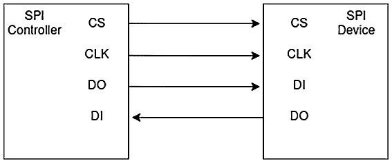

# 第六章：*第六章*：使用 I2C 和 SPI 接口构建用于通信的显示屏

在上一章中，我们学习了如何使用 7 段显示屏显示数据，MAX7219 芯片的工作原理，超声波距离传感器的工作原理，以及如何编写所有这些的库。我们使用 SPI 接口来完成这些操作。

在完成本章内容后，我们将了解如何使用不同类型的显示屏以及哪些显示屏使用不同的接口进行通信。我们将通过使用可以通过 I2C 总线连接的显示屏来学习 I2C 接口的工作原理。了解这一点后，我们将学习如何读取和解释用户输入。之后，我们将学习如何在显示屏上绘制形状和文本。最后，我们将学习如何构建一个可以在微控制器上运行的游戏。有了这些知识，我们将能够理解使用各种显示屏进行通信的整体概念。

在本章中，我们将涵盖以下主要主题：

+   探索 TinyGo 驱动程序

+   在 16x2 LCD 显示屏上显示文本

+   在显示屏上显示用户输入

+   构建命令行界面

+   显示简单游戏

# 技术要求

我们将需要以下组件来完成此项目：

+   Arduino Nano 33 IoT

+   配备 I2C 接口的 HD44780 1602 LCD 显示屏

+   ST7735 显示屏

+   1 个面包板

+   1 个 10k 欧姆电阻

+   1 个 4 针按钮

+   跳线

您可以在 GitHub 上找到本章的代码：[`github.com/PacktPublishing/Creative-DIY-Microcontroller-Projects-with-TinyGo-and-WebAssembly/tree/master/Chapter06`](https://github.com/PacktPublishing/Creative-DIY-Microcontroller-Projects-with-TinyGo-and-WebAssembly/tree/master/Chapter06)

本章的“代码在行动”视频可以在以下链接找到：[`bit.ly/2Qo8Jji`](https://bit.ly/2Qo8Jji)

# 探索 TinyGo 驱动程序

在*第三章*“使用键盘构建安全锁”，我们学习了 TinyGo 驱动程序存储库。让我们简要了解一下如何在存储库中查找驱动程序和示例。

当你计划一个新的项目时，检查驱动程序存储库是否为你计划使用的设备提供了驱动程序总是好的。这将加快你的项目进度，并使其更容易实现。

驱动程序存储库分为两部分：

+   驱动程序

+   示例

驱动程序直接位于存储库的根目录下。所有示例都位于一个示例文件夹中。

我们想在示例中使用具有 I2C 接口的 hd44780 LCD 显示屏，因此让我们检查是否可以在驱动程序存储库中找到它。参考以下截图：


图 6.1 – hd44780i2c 驱动程序

如我们所见，该软件包以它所使用的设备和接口（**I2C**）命名。有时，一个驱动程序包在一个包中提供多个接口供使用。大多数驱动程序在名称中省略了额外的接口。

要找到显示如何使用包的示例代码，请导航到`examples`文件夹，并查找与驱动程序包名称完全相同的文件夹。以下屏幕截图显示了**hd47780i2c**驱动程序的示例代码：


图 6.2 – hd44780i2c 驱动器示例

现在我们已经知道有一个用于我们想要使用的显示屏的驱动程序，并且知道在哪里可以找到该驱动程序的示例代码，让我们继续并使用该驱动程序。

# 在 HD44780 16x2 LCD 显示屏上显示文字

HD44780 16x2 LCD 显示屏便宜且易于使用。如果我们只想显示文字，这种类型的显示屏可以做到这一点，并且是首选设备。它有 16 个引脚，如果我们想在项目中结合更多设备，这会太多。这就是为什么使用 I2C 显示屏驱动器来控制显示屏是一种相当常见的做法。这与我们在上一章中使用 MAX7219 驱动 7 段显示屏的概念类似。

HD44780 16x2 显示屏可以与焊接在其上的 I2C 驱动器一起购买，或者它可以不带有 I2C 驱动器。显示屏可能有不同的颜色配置，涉及背景和文字颜色。它们通常看起来与以下图像中的类似：


图 6.3 – HD44780 正面

当显示屏带有 I2C 驱动器时，通常是一个 LCM1602 IIC，它提供四个端口：

+   GND

+   VCC

+   SDA

+   SCL

因此，当使用 LCM1602 时，我们只需要将*GND*和*VCC*连接到电源总线；其余的两根线用于*SDA*和*SCL*。LCM1602 IIC 板上有一个电位器，可以用来调整显示屏的对比度。以下图像显示了这样一个 LCM1602 IIC，它已经被焊接在 HD44780 的背面：


图 6.4 – LCM1602 IIC 焊接在 HD44780 的背面

注意

大多数 HD47780 显示屏在 5V 下运行，但有些只需要 3.3V。因此，仔细检查你显示屏的数据表，以防止可能的损坏！

现在，我们对 HD44780 有了初步的了解，并且可以利用 LCM1602 IIC 来节省一些引脚。现在，让我们继续并构建电路。

## 构建电路

在我们可以在显示屏上显示任何内容之前，我们需要构建电路。只需按照以下步骤操作即可：

1.  确保电源跳线位于 5V。如果可能你有 3.3V 的显示屏，那么将跳线设置为 3.3V。

1.  将显示屏的*GND*引脚连接到电源总线上的*GND*线路。

1.  将显示屏的*VCC*引脚连接到电源总线上的*VCC*线路。

1.  将*A14*连接到面包板（*GND*）与电源总线上的*GND*线路。

1.  将*A9*连接到面包板（*SCL*）与显示屏的*SCL*引脚。

1.  将*A8*连接到面包板（*SDA*）与显示屏的*SDA*引脚。

电路现在应该看起来类似于以下图像：


图 6.5 – 16x02 I2C 显示电路（图片来自 Fritzing）

注意

16x02 I2C LCD Fritzing 组件已从以下链接获取：

[`github.com/e-radionicacom/e-radionica.com-Fritzing-Library-parts-`](https://github.com/e-radionicacom/e-radionica.com-Fritzing-Library-parts-)。

这是我们设置硬件设备所需的所有内容。然而，在我们开始编写代码之前，我们需要了解 I2C。

## 理解 I2C

I2C 是一种同步双线串行总线，其中所用的数据线是双向的。有时，**I2C**也被称为**双线接口**（**TWI**）。一根线用于提供**时钟**，而另一根线用于**传输数据**。

I2C 总线允许多个设备在同一总线上进行通信。与**外围接口**（**SPI**）总线不同，I2C 总线不需要**芯片选择**（**CS**）引脚；相反，它只需在消息中包含接收设备的地址。

一个 I2C 消息包含以下部分：

+   **启动条件**：启动条件表示正在发送一条新消息。

+   **地址帧**：地址帧包含应接收消息的设备的地址。

+   **读/写位**：此位用于指示数据是否从控制器发送到设备，或者是否从设备请求数据。

+   **ACK/NACK 位**：接收设备会通知发送方之前的数据帧是否已成功接收。

+   **数据帧**：一个消息可以包含 1 到 n 个 8 位的数据帧。

+   **停止条件**：停止条件表示消息已完全发送。

以下图像可视化了一个包含 16 位数据的消息：


图 6.6 – I2C 消息

注意

如果您不知道要使用的设备的地址，您可以通过迭代所有可能的地址并检查设备是否在地址上发送 ACK 来使用 ACK 位。如果是这样，您就找到了地址。

现在我们对 I2C 是什么以及它是如何工作的有了初步的了解，我们可以编写第一个使用 I2C 控制显示的程序。

## 编写代码

我们将首先在我们的项目中创建一个名为`Chapter06`的新文件夹。在`Chapter06`文件夹内，创建一个名为`hd44780-text-display`的新文件夹，并在其中创建一个包含空`main`函数的新`main.go`文件。现在，项目结构应如下所示：


图 6.7 – 项目结构

现在，按照以下步骤显示第一段文本：

1.  导入驱动程序：

    ```go
    "tinygo.org/x/drivers/hd44780i2c"
    ```

1.  在`main`函数内部，配置 I2C 接口并将时钟的`频率`设置为`400KHz`：

    ```go
    machine.I2C0.Configure(machine.I2CConfig{
        Frequency: machine.TWI_FREQ_400KHZ,
    })
    ```

1.  创建一个新的 `hd44780i2c` 实例，并将 `I2C` 接口以及 `address` 作为参数传递。大多数 LCM1602 IIC 应该监听在 `0x27` 地址，但有些模块监听在 `0x3F`：

    ```go
    lcd := hd44780i2c.New(machine.I2C0, 0x27)
    ```

1.  通过设置列（宽度）和行（高度）来配置显示屏。我们需要这样做，因为这个驱动器也支持 20x4 和其他类型的显示屏：

    ```go
    lcd.Configure(hd44780i2c.Config{
        Width: 16, 
        Height: 2, 
    })
    ```

1.  打印文本。`\n` 被驱动器解释，所有跟在 `\n` 后面的字符都被写入下一行。我们可以用以下代码做到这一点：

    ```go
    lcd.Print([]byte(" Hello World \n LCD 16x02"))
    ```

1.  现在，让我们通过闪烁代码来测试它。使用以下命令：

    ```go
    tinygo flash --target=arduino-nano33 Chapter6/hd44780-text-display/main.go
    ```

你现在应该能看到屏幕上打印的文本。

让我们看看当我们尝试在屏幕上打印超过 16x2 个字符时会发生什么。要做到这一点，只需将以下片段添加到我们的 `main` 函数的末尾：

```go
time.Sleep(5 * time.Second)
lcd.Print([]byte("We just print more text, to see what 
    happens, when we overflow the 16x2 character limit"))
```

现在，再次闪烁程序并查看结果。我们可以观察到，在达到第 32 个字符后，光标跳回到位置 x = 0 和 y = 0，并从这里继续打印。然而，我们希望在显示屏上打印超过 32 个字符，并且我们希望能够阅读所有这些字符。为了做到这一点，我们必须创建一个小动画。执行以下步骤：

1.  在 `main` 函数的末尾，暂停 `5` 秒并调用 `animation` 函数，并将 `lcd` 作为参数传递，如下面的代码片段所示：

    ```go
    time.Sleep(5 * time.Second)
    animation(lcd)
    ```

1.  我们需要定义一个名为 `animation` 的函数，它接受 `lcd` 作为参数：

    ```go
    func animation(lcd hd44780i2c.Device) {
    ```

1.  现在，我们需要定义我们想要打印的文本：

    ```go
    text := []byte(" Hello World \n Sent by \n Arduino 
        Nano \n 33 IoT \n powered by \n TinyGo")
    ```

1.  我们必须清除显示屏以移除之前打印的所有内容。这也将光标重置到第一个位置（0,0）：

    ```go
    lcd.ClearDisplay()
    ```

1.  现在，让我们打印一个单个字符。在这里我们需要进行一些类型转换，因为显示驱动器只接受 `[]byte` 作为参数。为此，请参考以下代码：

    ```go
    for {
        for i := range text {
            lcd.Print([]byte(string(text[i])))
            time.Sleep(150 * time.Millisecond)
        }
    ```

1.  当消息完全写入显示屏后，我们暂停 `2` 秒并再次清除显示屏。这为下一次迭代提供了一个干净的开始：

    ```go
    time.Sleep(2 * time.Second)
    lcd.ClearDisplay()
    }
    }
    ```

现在，再次闪烁更新后的程序。字符应该会依次出现。

现在我们已经了解了如何使用显示驱动器打印硬编码的文本以及如何创建简单的动画，让我们显示一些动态接收到的文本。

# 在显示屏上显示用户输入

在本节中，我们将打印用户的输入到显示屏上。输入是通过计算机发送到微控制器的 **串行（UART**），然后将其打印到显示屏上。

在 *第二章* 中，*构建交通灯控制系统*，我们学习了如何使用 UART 向计算机发送消息，并使用 PuTTY 观察它们。现在，我们将使用这个接口进行双向通信。对于这个项目，我们使用与上一节相同的硬件设置，这意味着我们可以直接进入代码。

首先，在 `Chapter06` 文件夹内创建一个名为 `hd44780-user-input` 的新文件夹。然后，在这个新创建的文件夹内，添加一个包含空 `main()` 函数的 `main.go` 文件。现在，项目的结构应该类似于以下内容：


图 6.8 – 项目结构

按照以下步骤实现程序：

1.  将 `carriageReturn` 的十六进制值保存为一个常量。稍后，我们将检查接收到的字节是否等于这个 `carriageReturn` 值：

    ```go
    const carriageReturn = 0x0D
    ```

1.  将 `uart` 接口保存在一个变量中，这样我们就不必每次都输入 `machine.UART0`：

    ```go
    var (
        uart = machine.UART0
    )
    ```

1.  在 `main` 函数中，首先初始化显示屏驱动程序：

    ```go
    machine.I2C0.Configure(machine.I2CConfig{
        Frequency: machine.TWI_FREQ_400KHZ,
    })
    lcd := hd44780i2c.New(machine.I2C0, 0x27) // some 
                            // modules have address 0x3F
    err := lcd.Configure(hd44780i2c.Config{
            Width: 16, // required
            Height: 2, // required
            CursorOn: false,
            CursorBlink: false,
    })
    if err != nil {
        println("failed to configure display")
    }
    ```

1.  让用户知道我们可以输入一些内容，然后将其打印到显示屏上：

    ```go
    lcd.Print([]byte(" Type to print "))
    ```

1.  我们希望在接收到第一个输入后立即清除显示屏。这就是为什么我们保存这个状态：

    ```go
    hadInput := false
    ```

1.  如果缓冲区中没有数据，我们不想做任何事情。TinyGo 使用环形缓冲区内部缓冲传入的数据：

    ```go
    for {
        if uart.Buffered() == 0 {
            continue
        }
    ```

1.  如果遇到第一个输入，我们必须清除显示屏并保存我们之前输入的状态：

    ```go
    if !hadInput {
        hadInput = true
        lcd.ClearDisplay()
    }
    ```

1.  接下来，我们从缓冲区读取一个字节，并记录任何可能的错误：

    ```go
    data, err := uart.ReadByte()
    if err != nil {
        println(err.Error())
    }
    ```

1.  如果接收到 `carriageReturn`，例如用户按下了 *Enter* 键，我们还想在新的一行打印。我们将该字符打印到显示屏以及 `uart`，以便 PuTTY 的输出和显示屏上的输出行为相似：

    ```go
    if data == carriageReturn {
        lcd.Print([]byte("\n"))
        uart.Write([]byte("\r\n"))
        continue
    }
    ```

1.  最后一步是将数据简单地打印到两个输出上：

    ```go
    lcd.Print([]byte{data})
    uart.WriteByte(data)
    }
    }
    ```

现在，我们可以从连接到微控制器的计算机接收数据并将其打印到显示屏上。通过以下命令将程序烧录到微控制器来尝试它：

```go
tinygo  flash –target=arduino-nano33 Chapter06/hd44780-user-input/main.go
```

现在，启动 PuTTy，连接到 `microcontroller` 配置文件，并开始输入以检查程序是否运行正确。如果一切正常，PuTTY 应该也会打印出你所写的内容，类似于以下截图所示：


图 6.9 – PuTTY 输出

UART 接口是一个串行接口，这意味着它也可以用于在两个微控制器之间发送和接收数据。在 Arduino Nano 33 IoT 上，**发送**（**TX**）引脚用于发送数据，而**接收**（**RX**）引脚用于接收数据。

在本节中，我们学习了如何从 UART 接口读取和解释单个字节，以及如何在不使用 `print()` 或 `println()` 函数的情况下手动将数据发送回 UART 接口。我们将在下一节中使用这些知识来学习如何解释更长的数据字符串。

# 构建一个 CLI

在本节中，我们将解析用户的输入，并将输入与预定义的命令进行比较。然后，这些命令将由微控制器执行。对于这个项目，我们将使用与上一个项目相同的硬件设置。

我们将首先在 `Chapter06` 文件夹内创建一个名为 `hd44780-cli` 的新文件夹。然后，我们必须创建一个包含空 `main` 函数的 `main.go` 文件。现在，项目的结构应该类似于以下内容：


图 6.10 – 项目结构

现在项目结构已经设置好，我们可以实现逻辑。要做到这一点，请按照以下步骤操作：

1.  在 `main` 函数上方，首先定义一些常量。`commandConstant` 代表需要发送到微控制器的命令。我们将在代码中使用这些常量，并将它们与用户输入进行比较，以确定是否输入了 CLI 命令：

    ```go
    const (
        carriageReturn = 0x0D
        homeCommand = "#home"
        clearCommand = "#clear"
    )
    ```

1.  将 UART 接口保存在一个变量中。我们也可以始终使用 `machine.UART0` 来写，但通过这种方式，我们可以提高可读性：

    ```go
    var (
        uart = machine.UART0
    )
    ```

1.  在 `main` 函数内部，我们初始化显示屏，如下所示：

    ```go
    machine.I2C0.Configure(machine.I2CConfig{
        Frequency: machine.TWI_FREQ_400KHZ,
    })
    lcd := hd44780i2c.New(machine.I2C0, 0x27) 
    err := lcd.Configure(hd44780i2c.Config{
          Width: 16,
          Height: 2,
          CursorOn: false,
          CursorBlink: false,
    })
    if err != nil {
    println("failed to configure display")
    }
    ```

1.  现在，让我们调用 `homeScreen` 函数（我们将在实现它之后解释这个函数的功能）：

    ```go
    homeScreen(lcd)
    ```

1.  接下来，定义一个 `commandBuffer`。这是一个简单的字符串，我们用它来存储命令的部分：

    ```go
    var commandBuffer string
    ```

1.  `commandIndex` 正在被用来计算 `commandBuffer` 内部的字符数。如果索引大于最长命令的长度，那么我们知道我们可以重置缓冲区：

    ```go
    var commandIndex uint8
    ```

1.  我们将使用 `commandStart` 布尔值作为信号，因此我们需要将后续的任何字符追加到 `commandBuffer` 中：

    ```go
    commandStart := false
    ```

1.  就像在先前的项目中一样，我们将使用 `hadInput` 标志在接收到第一个输入时清除屏幕：

    ```go
    hadInput := false
    ```

1.  如果内部接收缓冲区中没有字符，我们不需要做任何事情：

    ```go
    for {
        if uart.Buffered() == 0 {
            continue
    }
    ```

1.  在收到第一个输入后，清除显示屏。我们将在实现它之前，在接下来的几步中解释 `clearDisplay` 函数：

    ```go
    if !hadInput {
        hadInput = true
        clearDisplay(lcd)
    }
    ```

1.  然后，我们从缓冲区中读取一个字节，如下所示：

    ```go
    data, err := uart.ReadByte()
    if err != nil {
        println(err.Error())
    }
    ```

1.  检查我们是否收到了 **井号 (#)**。这是表示将跟随一个命令的指示器：

    ```go
    if string(data) == "#" {
        commandStart = true
        uart.Write([]byte("\ncommand started\n"))
    }
    ```

1.  当我们收到命令的开始时，我们将所有后续字符追加到 `commandBuffer` 中。这是按照以下方式完成的：

    ```go
    if commandStart {
        commandBuffer += string(data)
        commandIndex++
    }
    ```

1.  要检查 `commandBuffer` 中是否可能有一个完整的命令，我们必须切换我们的 `commandBuffer`：

    ```go
    switch commandBuffer {
    ```

1.  如果 `commandBuffer` 的内容等于 `homeCommand`，我们执行 `homeScreen` 函数并重置命令。我们还必须在 UART 接口中写回输入数据：

    ```go
    case homeCommand:
        uart.WriteByte(data)
        homeScreen(lcd)
        commandStart = false
        commandIndex = 0
        commandBuffer = ""
        continue
    ```

1.  如果 `commandBuffer` 的内容等于 `clearCommand`，我们必须执行 `clearDisplay` 函数并重置命令：

    ```go
    case clearCommand:
        uart.WriteByte(data)
        clearDisplay(lcd)
        commandStart = false
        commandIndex = 0
        commandBuffer = ""
        continue
    }
    ```

1.  如果 `commandIndex` 大于我们最长命令的长度，我们必须重置命令：

    ```go
    if commandIndex > 5 {
        commandStart = false
        commandIndex = 0
        commandBuffer = ""
        uart.Write([]byte("\nresetting command state\n"))
    }
    ```

1.  如果我们收到一个 `carriageReturn`，我们必须打印一个新行：

    ```go
    if data == carriageReturn {
        lcd.Print([]byte("\n"))
        uart.Write([]byte("\r\n"))
        continue
    }
    ```

1.  然后，我们打印接收到的数据，如下所示：

    ```go
    lcd.Print([]byte{data})
    uart.WriteByte(data)
    }
    ```

1.  现在，定义 `homeScreen` 函数，当输入匹配 `homeScreen` 命令时会被调用。我们必须清除显示屏并再次打印第一个输入：

    ```go
    func homeScreen(lcd hd44780i2c.Device) {
        println("\nexecuting command homescreen\n")
        clearDisplay(lcd)
        lcd.Print([]byte(" TinyGo UART \n CLI "))
    }
    ```

1.  现在，定义 `clearDisplay` 函数，当输入匹配 `clearDisplay` 命令时调用该函数。我们在这里只是使用了显示器的 `ClearDisplay` 函数：

    ```go
    func clearDisplay(lcd hd44780i2c.Device) {
        println("\nexecuting command cleardisplay\n")
        lcd.ClearDisplay()
    }
    ```

现在，使用以下命令烧录程序：

```go
tinygo flash –target=arduino-nano33 Chapter06/hd44780-cli
```

现在，让我们尝试我们的程序。

启动 PuTTY 并选择微控制器配置文件。输入一些内容并使用我们在代码中定义的 `#home` 和 `#clear` 命令。现在 PuTTY 的输出应该类似于以下内容：


图 6.11 – PuTTY 中的 CLI 输出

有了这个，我们已经验证了程序按预期工作。这样的系统可以用来用另一个微控制器控制微控制器，而不仅仅是显示某些内容——它还可以用来请求传感器读数或触发其他事情。

在本节中，我们学习了如何一次解释多个输入字符，以及如何设置简单的 CLI 以执行通过 UART 发送的命令。在下一节中，我们将更深入地了解 SPI，因为我们将在最终项目中使用 SPI 驱动的显示屏。

# 理解 SPI

SPI 是一个具有控制器和一个或多个设备的总线系统。控制器选择一个设备，该设备应向控制器发送数据，或者将从控制器接收数据。

SPI 总线上的设备也可以级联在一起。**级联**是一种将多个设备排成一行的布线方案。

两个设备之间的 SPI 通信使用以下四个引脚：

1.  **CS**: **芯片选择**选择总线上应接收或发送数据的设备。

1.  **CLK**: **时钟**设置传输（DO）和接收（DI）线的频率。

1.  **DO**: **数据输出**或**数字输出**将数据传输到接收设备。

1.  **DI**: **数据输入**或**数字输入**从控制器接收数据。

以下图显示了 SPI 控制器和 SPI 设备的一对一连接：



图 6.12 – SPI 通信

以下图显示了控制器和两个设备之间的 SPI 连接。在这里，我们使用两个 CS 引脚来向接收设备发送信号。这是控制器正在与之通信的设备：


图 6.13 – 控制器和两个设备之间的 SPI 通信

以下图显示了设备如何级联在一起。第一个设备的 *DO* 引脚连接到下一个设备的 *DI* 引脚，同时它们共享 *CLK* 和 *CS* 线：


图 6.14 – 与级联设备的 SPI 通信

现在我们对 SPI 有更好的理解，让我们使用 ST7735 显示屏构建一个电路。

# 显示简单游戏

在本节中，我们将学习如何使用 SPI 接口来使用另一种显示类型。由于我们想要显示不仅仅是纯文本，我们需要一种新的显示类型。我们还将发现两个额外的 TinyGo 仓库，它们提供了在处理显示时方便的功能。在本节中我们将使用的显示设备是一款 1.8 英寸的 TFT ST7735 显示器，分辨率为 160x128 像素。因此，让我们简要了解一下该显示器的技术规格。

ST7735 显示器提供了一个可选的 SD 卡槽。该显示器在 TFT-LCD 模块上具有 262K 色彩深度。正在使用 SPI 接口。要在显示器上绘制内容，我们需要八个引脚。我们已经使用了 SPI，但因为我们没有深入探讨它，因为设备可以以不同的方式排列在 SPI 总线上。所以，在我们使用示例项目中的显示器之前，让我们更好地了解 SPI 的工作原理。

## 构建电路

与之前的项目一样，我们将使用外部电源。我们还需要一个 ST7735 显示器、Arduino Nano 33 IoT 和一些跳线。为了正确设置一切，请按照以下步骤操作：

1.  将电源总线上的 *GND* 通道连接到面包板上的 *J50 (GND)* 引脚。

1.  将面包板上的 *E31 (LED)* 引脚连接到面包板上的 *A53 (D2)* 引脚。

1.  将面包板上的 *E32 (SCK)* 引脚连接到面包板上的 *J63 (D13)* 引脚。

1.  将面包板上的 *E33 (SDA)* 引脚连接到面包板上的 *A62 (D11)* 引脚。

1.  将面包板上的 *E34 (AO)* 引脚连接到面包板上的 *A56 (D5)* 引脚。

1.  将面包板上的 *E35 (RESET)* 引脚连接到面包板上的 *A57 (D6)* 引脚。

1.  将面包板上的 *E36 (CS)* 引脚连接到面包板上的 *A58 (D7)* 引脚。

1.  将电源总线上的 *GND* 通道连接到面包板上的 *E37 (GND)* 引脚。

1.  将电源总线上的 *VCC* 通道连接到面包板上的 *E38 (VCC)* 引脚。

1.  将 ST7735 显示器放置，使 *LED* 引脚位于 *A31*，*VCC* 引脚位于 *A37*。

这是我们需要连接到显示器的所有内容。现在设置应该看起来如下：


图 6.15 – ST7735 电路

注意

1.8 英寸 TFT 显示器 Fritzing 部分由 vanepp 制作：[`forum.fritzing.org/u/vanepp`](https://forum.fritzing.org/u/vanepp)。

现在我们已经设置了硬件，让我们实现一些逻辑。

## 使用 ST7735 显示器

TinyGo 为 ST7735 显示器提供了驱动程序。这意味着我们可以使用现有的驱动程序。此外，TinyGo 还提供了两个额外的包，名为 `TinyFont` 和 `TinyDraw`，我们都会使用。首先，让我们看看 `TinyDraw` 包。

`TinyDraw` 是位于 GitHub 上 TinyGo 组织内部的一个仓库。您可以在 [`github.com/tinygo-org/tinydraw`](https://github.com/tinygo-org/tinydraw) 找到它。

`TinyDraw`仍然处于早期阶段，这意味着它尚未针对性能或内存使用进行优化。然而，它提供了有用的功能，例如绘制矩形、圆形、填充矩形和填充圆形等。由于显示驱动程序的 API 几乎（或完全）相同，它与大多数接口驱动程序兼容。现在，在我们看到它的实际应用之前，让我们先看看`TinyFont`包。

就像`TinyDraw`一样，`TinyFont`是 GitHub 上 TinyGo 组织内部的一个仓库。您可以在[`github.com/tinygo-org/tinyfont`](https://github.com/tinygo-org/tinyfont)找到它。

`TinyFont`提供了一个 API，允许您使用`TinyFont`包中包含的字体在显示上绘制文本。它还允许您创建自己的自定义字体。`TinyFont`还利用了大多数 TinyGo 显示驱动程序共享相同接口的事实。

现在，让我们设置一个使用 ST7735、TinyDraw 和 TinyFont 的项目。为此，在`Chapter06`文件夹内创建一个名为`st7735`的新文件夹，并在其中创建一个包含空`main()`函数的新`main.go`文件。现在，项目的结构应该类似于以下内容：

![Figure 6.16 – Project structure![Figure 6.16 – Project structure 图 6.16 – 项目结构现在，让我们深入代码。我们需要导入以下包来完成此项目：```go"tinygo.org/x/drivers/st7735""tinygo.org/x/tinydraw""tinygo.org/x/tinyfont""tinygo.org/x/tinyfont/freemono"```要为这个显示编写第一个测试程序，请按照以下步骤操作：1.  在`main`函数上方，定义我们将要在程序中使用的颜色集：    ```go    var (        white = color.RGBA{255, 255, 255, 255}        red = color.RGBA{255, 0, 0, 255}        blue = color.RGBA{0, 0, 255, 255}        green = color.RGBA{0, 255, 0, 255}        black = color.RGBA{0, 0, 0, 255}    )    ```1.  配置`SPI0`接口，频率为 12 MHz。我们不需要传递 SCK 和 DO 引脚，因为当没有传递引脚时，`Configure`函数将使用该板默认的 SPI 引脚：    ```go    machine.SPI0.Configure(machine.SPIConfig{        Frequency: 12000000,    })    ```1.  设置显示所需的引脚：    ```go    resetPin := machine.D6    dcPin := machine.D5    csPin := machine.D7    backLightPin := machine.D2    ```1.  获取`st7735`显示的新实例：    ```go    display := st7735.New(machine.SPI0, resetPin, dcPin,         csPin, backLightPin)    ```1.  调用`Configure`函数。此函数将启动序列传输到显示。在此调用之后，显示即可使用：    ```go    display.Configure(st7735.Config{})    ```1.  从显示中获取`width`和`height`属性：    ```go    width, height := display.Size()    ```1.  绘制四个矩形。每个矩形应占据屏幕的四分之一，并具有不同的颜色。该函数接受 x 轴上的位置、y 轴上的位置、要绘制的矩形的宽度和高度，以及矩形的颜色。我们将使用此作为显示的测试。这是一个很好的显示测试：    ```go    display.FillRectangle(0, 0, width/2, height/2, white)    display.FillRectangle(width/2, 0, width/2,         height/2, red)    display.FillRectangle(0, height/2, width/2,         height/2, green)    display.FillRectangle(width/2, height/2,         width/2, height/2, blue)    ```1.  在我们继续绘制更高级的图形之前，让我们通过以下命令闪烁程序来测试程序：    ```go    tinygo flash –target=arduino-nano33 Chapter6/st7735/main.go    ```1.  一旦程序成功烧录到微控制器上，你应该会看到四个矩形。这看起来类似于以下内容：![Figure 6.17 – ST7735 显示四个矩形![Figure 6.17 – ST7735 显示四个矩形图 6.17 – ST7735 显示四个矩形现在，让我们使用`TinyDraw`绘制一些更复杂的形状，并使用`TinyFont`绘制一些文本。为此，请按照以下步骤操作：1.  在`main`函数的末尾，添加一个 3 秒的睡眠，这样我们就有机会真正看到显示测试：    ```go    time.Sleep(3 * time.Second)    ```1.  初始化一个计数器，它将用于显示我们绘制动画的次数：    ```go    i := 0    ```1.  用`black`填充屏幕以清除显示：    ```go    for {        display.FillScreen(black)    ```1.  在屏幕的底部绘制一个白色矩形。它应该有`32`像素的高度，这将给我们留下 128x128 像素：    ```go    tinydraw.FilledRectangle(&display, 0, 0, 128, 32,         white)    ```1.  由于我们已经将显示屏倒置安装，我们将写入旋转的文本：    ```go    tinyfont.WriteLineRotated(&display,         &freemono.Bold9pt7b, 110, 145, "TinyDraw", red,         tinyfont.ROTATION_180)    ```1.  在黑色方形的中心，绘制三个大小和颜色不同的同心圆：    ```go    tinydraw.FilledCircle(&display, 64, 96, 32, green)    tinydraw.FilledCircle(&display, 64, 96, 24, blue)    tinydraw.FilledCircle(&display, 64, 96, 16, red)    ```1.  现在，在圆圈下方用绿色绘制`TinyFont`文本：    ```go    tinyfont.WriteLineRotated(&display,         &freemono.Bold9pt7b, 110, 40, "TinyFont", green,         tinyfont.ROTATION_180)    ```1.  在白色矩形上绘制动画将运行多少次的计数：    ```go    counterText := fmt.Sprintf("Count: %v", i)    tinyfont.WriteLineRotated(&display, &freemono.Bold9pt7b, 123, 2, counterText, black, tinyfont.ROTATION_180)    ```1.  我们需要稍作等待，否则我们无法看到结果。这是因为它将在下一次迭代中被覆盖：    ```go    time.Sleep(2 * time.Second)    i++    }    ```现在，再次闪烁程序。在测试屏幕后，你应该看到以下类似的结果：

图 6.18 – 测试程序的输出结果

在本节中，我们学习了如何在显示屏上绘制基本形状和写入文本。下一步合乎逻辑的是编写一个在微控制器上运行的程序。

## 开发一个游戏

在本节中，我们将开发一个非常简单的游戏，该游戏由一个代表敌人的红色方块组成，它试图到达屏幕的末端。一条绿色线将代表我们的家园区域，红色方块不应该穿越。我们还将有一个代表玩家的绿色方块，以及一个代表我们可以射击以阻止红色方块入侵我们家园区域的子弹的较小的绿色方块。我们将添加一个按钮，它将充当触发器并射击小绿色方块。因此，合乎逻辑的第一步是将按钮添加到我们的面包板上。为此，请按照以下步骤操作：

1.  将按钮放置在面包板上，使一个引脚位于*E23*，其他引脚位于一边的*E25*和另一边的*F25*和*F23*。

1.  将 Arduino 的*+3V3*输出连接到面包板上的*J23*。

1.  使用一个**10K 欧姆电阻**将电源总线上的*GND*线路连接到*J25*。

1.  将*D25*连接到面包板上的*A60 (D9)*。

这是我们需要添加到电路中的所有内容。现在它应该看起来如下所示：


图 6.19 – 带按钮的最终电路

现在，为本章的最后一个项目创建一个新的文件夹。将文件夹命名为`tinygame`，并将其放入`Chapter06`文件夹中。然后，创建一个包含空`main()`函数的新`main.go`文件。现在，项目的结构应该如下所示：


图 6.20 – 项目结构

要实现逻辑，请按照以下步骤操作：

1.  添加一个`bool`变量来保存`buttonPressed`状态。我们将全局定义它，因此我们不需要使用通道或其他方式在将要使用的 goroutines 之间传递状态。这只是一个简单方便的方法：

    ```go
    var buttonPressed bool
    ```

1.  定义`enemySize`、`bulletSize`以及游戏区域的像素宽度和高度属性：

    ```go
    const enemySize = 8
    const bulletSize = 4
    const width = 128
    const height = 160
    ```

1.  添加两个变量来存储我们的`currentScore`和`highscore`：

    ```go
    var highscore int = 0
    var currentScore int = 0
    ```

1.  定义我们将要使用的颜色集：

    ```go
    var (
        white = color.RGBA{255, 255, 255, 255}
        red = color.RGBA{255, 0, 0, 255}
        blue = color.RGBA{0, 0, 255, 255}
        green = color.RGBA{0, 255, 0, 255}
        black = color.RGBA{0, 0, 0, 255}
    )
    ```

1.  现在，我们需要将代码移动到`main`函数内部。在这里，分配`buttonPin`并将其配置为输入：

    ```go
    buttonPin := machine.D9
    buttonPin.Configure(machine.PinConfig{Mode: 
              machine.PinInput})
    ```

1.  在启动阶段更新`highscore`。在这里，`highscore`是`0`：

    ```go
    updateHighscore(0)
    ```

1.  初始化显示，如下所示：

    ```go
    machine.SPI0.Configure(machine.SPIConfig{
        Frequency: 12000000,
    })
    resetPin := machine.D6
    dcPin := machine.D5
    csPin := machine.D7
    backLightPin := machine.D2
    display := st7735.New(machine.SPI0, resetPin, dcPin,
               csPin, backLightPin)
    display.Configure(st7735.Config{})
    ```

1.  在一个新的 goroutine 中运行`checkButton`函数，使其非阻塞。这使我们能够在`main` goroutine 中更新游戏循环：

    ```go
    go checkButton(buttonPin)
    ```

1.  无限循环并在每轮游戏结束后用黑色填充屏幕以擦除屏幕上的所有内容：

    ```go
    for {
        display.FillScreen(black)
        updateGame(display)
    }
    ```

1.  无限循环并检查按钮的状态。如果按钮被按下，我们更新`buttonPressed`状态。每次检查后，我们休眠`20`毫秒，因为我们需要一个阻塞调用，以便调度器可以再次处理其他 goroutines：

    ```go
    func checkButton(buttonPin machine.Pin) {
        for {
            if buttonPin.Get() {
                buttonPressed = true
            }
            time.Sleep(20 * time.Millisecond)
        }
    }
    ```

1.  `updateHighscore`函数接受一个`score`，检查这个新的`score`是否大于`highscore`，如果是，则更新`highscore`并将`highscore`打印到串行端口：

    ```go
    func updateHighscore(score int) {
        if score <= highscore && score != 0 {
            return
        }
        highscore = score
        println(fmt.Sprintf(" TinyInvader Highscore: %d", 
            highscore))
    }
    ```

这样，我们就实现了按钮按下的检查，一个更新`highscore`的函数，以及一个在游戏结束后立即开始新一轮游戏的`main` goroutine。现在，让我们实现实际的游戏逻辑。为此，请遵循以下步骤：

1.  通常，最好将游戏物理的更新（如玩家的移动、子弹和敌人）与动画分开，分别放在逻辑的不同部分。当为其他平台开发游戏时，这两部分将独立更新，这样它们就不依赖于相同的帧率。然而，为了简化，我们将有一个单独的游戏循环，它不仅更新位置，还将绘制到屏幕上。`updateGame`函数代表游戏的主要逻辑：

    ```go
    func updateGame(display st7735.Device) {
    ```

1.  定义一些将存储敌人位置的变量：

    ```go
    var enemyPosX, enemyPosY int16
    ```

1.  为了防止敌人从游戏区域上方开始，我们必须减去其大小：

    ```go
    enemyPosY = height - enemySize
    ```

1.  接下来，我们需要在变量中存储子弹的位置：

    ```go
    var bulletPosY int16
    ```

1.  我们在一个布尔变量中存储是否发射了射击的状态：

    ```go
    shotFired := false
    ```

1.  我们在一个布尔变量中存储是否可以发射新射击的状态。我们将其初始化为`true`，因为我们希望在游戏开始时玩家能够发射射击：

    ```go
    canFire := true
    ```

1.  游戏刚刚开始，所以`currentScore`是`0`：

    ```go
    currentScore = 0
    ```

1.  如果按钮被按下，我们将重置`buttonPressed`状态，因为我们将会处理它。只要子弹仍在游戏区域内飞行，我们就不能再次射击：

    ```go
    for {
        if buttonPressed {
            buttonPressed = false  
            if canFire {
                shotFired = true
                canFire = false
            }
    }
    ```

1.  如果已经发射了射击，我们更新子弹：

    ```go
    if shotFired {
    ```

1.  这里，我们更新位置并绘制它：

    ```go
    bulletPosY = updateBullet(display, bulletPosY)
    ```

    如果子弹离开游戏区域，我们将重置其位置并重置`shotFired`和`canFire`状态。这允许玩家再次射击：

    ```go
    if bulletPosY > height {
        shotFired = false
        canFire = true
        bulletPosY = 0
    }
    ```

1.  接下来，我们检查子弹是否在水平轴上与敌人相撞。为此，我们使用一个比子弹本身稍大的碰撞盒：

    ```go
    if enemyPosX >= 54 && enemyPosX <= 64 {
    ```

1.  现在，我们检查垂直轴上的碰撞。这次，碰撞盒的大小与`bulletSize`相同。这些碰撞盒在我的测试中证明效果相当不错：

    ```go
    if enemyPosY >= bulletPosY && enemyPosY <= bulletPosY+bulletSize {
    ```

1.  如果我们击中敌人，我们增加分数：

    ```go
    currentScore++
    ```

1.  现在，我们必须在敌人上方画一个黑色盒子，让它消失：

    ```go
    display.FillRectangle(enemyPosX-1, enemyPosY,
        enemySize, enemySize, black)
    ```

1.  重置敌人的位置。这将使敌人在其出生位置重生：

    ```go
    enemyPosY = height - enemySize
    enemyPosX = 0
    ```

1.  更新`highscore`，如下所示：

    ```go
    updateHighscore(currentScore)
        }
      }
    }
    ```

1.  更新并绘制敌人的位置：

    ```go
    enemyPosX, enemyPosY = updateEnemy(display, enemyPosX, enemyPosY)
    ```

1.  如果敌人通过了我们的主区域，我们就输了。如果发生这种情况，我们就返回，这样函数外部的循环就可以再次运行并开始新的一局：

    ```go
    if enemyPosY < enemySize {
        return
    }
    ```

1.  绘制主区域：

    ```go
    display.FillRectangle(0, 4, width, 1, green)
    ```

1.  绘制玩家：

    ```go
    display.FillRectangle(58, 0, 6, 6, green)
    ```

1.  睡眠`12`毫秒。如果我们不在这里睡眠，敌人和子弹会在屏幕上移动得太快，看起来会闪烁，这看起来不太好。所以，我们使用这个小技巧来减慢速度并减少闪烁：

    ```go
    time.Sleep(12 * time.Millisecond)
      }
    }
    ```

    现在我们已经实现了主要游戏逻辑，我们只需要在玩游戏之前创建更新子弹和敌人的逻辑。

    通过在 y 轴上增加 2 来更新子弹的位置。在其后面画一个黑色盒子，这样它就不会在显示屏上留下痕迹：

    ```go
    func updateBullet(display st7735.Device, posY int16)
        int16 {
        display.FillRectangle(58, posY-2, bulletSize, 2, 
            black)
        display.FillRectangle(58, posY, bulletSize, 
            bulletSize, green)
        return posY + 2
    }
    ```

我们最后需要做的就是更新敌人。为此，遵循以下最后几个步骤：

1.  首先，我们必须定义我们将用来清除敌人之前位置的矩形的坐标和宽度：

    ```go
    func updateEnemy(display st7735.Device, posX, posY 
            int16) (int16, int16) {
        var clearX, clearY, clearWidth int16
    ```

1.  现在，我们必须计算我们需要清除敌人的位置：

    ```go
    clearX = posX - 1
    clearY = posY
    clearWidth = 1
    ```

1.  如果敌人到达左侧，我们需要完全移除其矩形，因为敌人将在屏幕的另一侧再次重生：

    ```go
    if posX == 0 {
        clearY = posY + enemySize
        clearX = width – enemySize
        clearWidth = enemySize
    }
    ```

1.  现在，我们必须清除敌人并绘制敌人到其新的位置。我们必须这样做以防止敌人在显示屏上留下痕迹：

    ```go
    display.FillRectangle(clearX, clearY, clearWidth, enemySize, black)
    display.FillRectangle(posX, posY, enemySize, enemySize, red)
    ```

1.  更新敌人在 x 轴上的位置：

    ```go
    posX++
    ```

1.  如果敌人在 x 轴上到达屏幕边缘，它们也会在 y 轴上移动：

    ```go
    if posX > width-enemySize {
        posX = 0
        posY -= enemySize
    }
    ```

1.  返回新的位置：

    ```go
    return posX, posY
    }
    ```

这就是这个游戏所需的所有逻辑。现在，让我们来玩一玩。使用以下命令闪存程序：

```go
tinygo flash –target=arduino-nano33 Chapter06/tinygame/main.go
```

注意

我们不需要在这里指定一个调度器，因为默认情况下`atsamd21`不会禁用调度器。

一旦你玩了几轮游戏，你就可以开始考虑如何扩展游戏：

+   我们可以再添加两个按钮，以便我们可以左右移动玩家。

+   我们可以让玩家一次射击多个子弹。

+   敌人的移动可以是随机的，这样它们就不总是从右向左移动。

+   我们可以添加一个摇杆来控制玩家的位置。

+   可以生成多个敌人。

+   敌人可以掉落不同类型的道具，玩家可以捡起这些道具。

+   我们可以添加一个蜂鸣器来为游戏添加声音。

+   我们可以在每一轮结束时显示最高分。

这是开始深入探索`#tinygame`、`#tinygo`和`#packtbookgame`世界之前的最后一章，也请别忘了使用`@Nooby_Games`标签提及我。当然，你还可以在其他所有社交媒体渠道、博客等上分享你的游戏。你还可以在本书的 GitHub 仓库中打开一个 issue 来展示你的成果。这样，我也可以测试你的游戏。

# 摘要

在本章中，我们学习了 I2C 接口是什么以及如何使用它。我们还学习了如何使用 16x02 LCD 显示屏，如何显示静态文本，如何显示动画，以及如何构建一个小型 CLI（命令行界面），该 CLI 可以通过 UART 接收命令并控制显示屏。

然后，我们对 SPI 接口有了更深入的了解，并使用它来控制 1.8 英寸 TFT 显示屏。我们绘制了一些基本形状，然后使用`TinyDraw`绘制圆形和矩形，使用`TinyFont`绘制文本。到此为止，我们已经使用了微控制器的重要接口，因此我们现在有了在未来的项目中连接和控制任何所需设备的技能。

在本章的最后，我们利用本章学到的知识构建了一个简单的游戏，该游戏由一个按钮控制，并在 1.8 英寸 TFT 显示屏上显示。

在下一章，我们将学习如何使用 TinyGo 构建**WebAssembly**页面，以及如何使用集成在 Arduino Nano 33 IoT 板上的**Wi-Fi 芯片**。

# 问题

1.  监听 I2C 总线的设备是如何知道消息是针对该设备的？

1.  监听 SPI 总线的设备是如何知道消息是针对该设备的？
