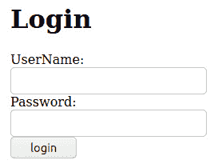
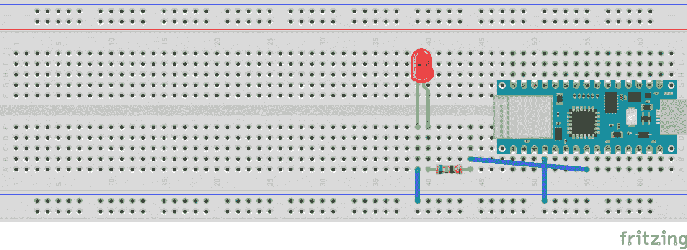
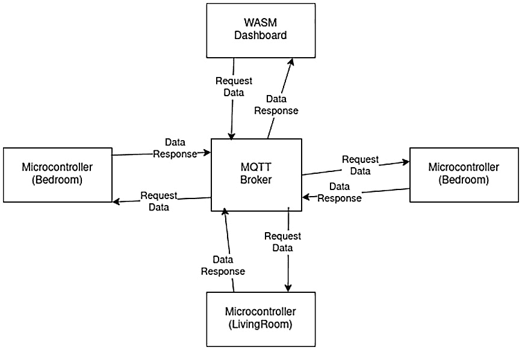

# 第八章：*第八章*：通过 TinyGo Wasm 仪表板自动化和监控您的家

在上一章中，我们学习了如何使用 Arduino Nano 33 IoT 板上的 Wi-Fi 芯片来发送**消息队列遥测协议**（**MQTT**）消息。然后我们消费了包含天气数据和天气警报的消息，并在**WebAssembly**（**Wasm**）仪表板上显示它们，但我们无法从仪表板内部控制任何东西。现在我们将改变这一点。

在完成本章学习后，我们将知道如何通过添加登录页面来保护我们的 Wasm 应用。我们还将了解在客户端应用程序验证凭据时的安全方面。在构建登录视图后，我们将学习如何在我们要构建的仪表板内部发送和接收数据。通过这样做，我们还将学习一些新技术，这些技术将帮助我们通过动态添加和删除内容来帮助我们。通过操作**文档对象模型**（**DOM**），我们将知道如何通过 MQTT 进行双向通信。最后，我们将了解控制 130V（其中**V**代表**伏特**）或 230V 设备的可能性。

了解所有这些将使我们能够构建各种智能家居项目，而不仅仅是这本书中的项目。在本章中，我们将涵盖以下主要主题：

+   构建智能家居仪表板

+   构建智能家居客户端

+   从微控制器请求数据

# 技术要求

我们将需要以下组件来完成此项目：

+   Arduino Nano 33 IoT 板

+   面包板

+   一个**发光二极管**（**LED**）

+   一个 68 欧姆电阻

+   跳线

您可以在以下链接在 GitHub 上找到本章的代码：[`github.com/PacktPublishing/Creative-DIY-Microcontroller-Projects-with-TinyGo-and-WebAssembly/tree/master/Chapter08`](https://github.com/PacktPublishing/Creative-DIY-Microcontroller-Projects-with-TinyGo-and-WebAssembly/tree/master/Chapter08)

本章的“代码在行动”视频可以在以下链接找到：[`bit.ly/3uPLI7X`](https://bit.ly/3uPLI7X)

# 构建智能家居仪表板

在完成这本书后，你可能想要构建许多酷炫的项目，这些项目可能包括 LED 灯带或由运动传感器控制的灯光，或者你可能给窗帘添加一个电机，根据光强度或时间打开或关闭它们。这些将是非常酷的项目，但现在想象一下，你正坐在沙发上想看电影，但太阳太亮了，没有超过启动控制窗帘的电机阈值。在这种情况下我们能做什么呢？我们是站起来手动关闭窗帘，还是在我们智能手机或平板电脑上打开一个 Wasm 应用，只需按一下应用上的按钮就能控制窗帘的电机？你也可能想检查客厅里的 LED 灯带是否仍然开启，但你不想起床去检查。在这种情况下，有一个提供其状态的仪表板会很好。在本节中，我们将构建一个 Wasm 应用，它提供一个登录页面，用户在登录之前可以输入用户名和密码。然后页面应过渡到一个仪表板，提供启用或禁用特定房间灯光的功能。

我们将从一个可重用的 MQTT JavaScript 组件开始，直到创建一个与 TinyGo 兼容的 MQTT 库。

## 创建可重用的 MQTT 组件

在*第七章*，“在 TinyGo Wasm 仪表板上显示天气警报”，我们将 MQTT 客户端嵌入到`wasm.js`文件中。这对于项目来说效果很好，但不可重用。因此，我们现在将创建一个可重用的组件。

要做到这一点，首先为这个项目创建一个名为`Chapter08`的新文件夹。在新建的文件夹内，创建一个名为`light-control`的新文件夹。这个新文件夹将包含 Wasm 应用所需的所有文件。

现在，在`light-control`文件夹内创建一个新文件，并将其命名为`mqtt.js`。项目结构现在应该看起来像这样：


图 8.1 – 项目结构

在`mqtt.js`文件中，按照以下步骤实现它：

1.  首先，我们定义一个变量来保存 MQTT 客户端和 MQTT 代理的常量。我们再次使用`strict`模式，以防止我们使用未定义的变量。`strict`模式还可以消除一些静默错误，并将它们转换为抛出错误，并使 JavaScript 引擎能够执行在其他情况下不可能的优化。使用`strict`模式可能会导致执行速度更快。如果代理不在本地运行，`host`和`port`值*必须设置为您的 MQTT 代理*的主机和端口。以下代码片段显示了代码：

    ```go
    'use strict';
    var mqtt;
    const host = "192.2.0.23";
    const port = 9001;
    const cname = "home-automation-dashboard";
    ```

1.  然后，我们添加一个函数，当连接到 MQTT 代理成功建立时，它简单地记录到控制台，如下所示：

    ```go
    function onConnect() {
        console.log("Successfully connected to mqtt broker");
    }
    ```

1.  由于 Wasm 应用程序正在客户端执行，我们可能会失去与 MQTT 代理的连接。这可能是由于不稳定的 Wi-Fi 连接造成的。如果发生这种情况，我们希望尝试创建一个新的连接。我们可以通过运行以下代码来完成此操作：

    ```go
    function onConnectionLost(err) {
        if (err.errorCode !== 0) {
            console.log("onConnectionLost:" + 
                err.errorMessage);
        }
        MQTTconnect();
    }
    ```

1.  我们现在需要为`messageArrived`事件添加一个回调。当收到新消息时，我们希望调用由 Go 代码导出的消息处理程序。它的工作方式如下：

    ```go
    function onMessageArrived(message) {
        console.log(
            "onMessageArrived:" + message.payloadString);
        handleMessage(message.payloadString);
    }
    ```

1.  接下来，我们希望能够发布消息。在这种情况下，我们设置`1`，以确保消息确实被消费者接收。此外，我们不需要保留消息。在未来的项目中，您还可以参数化 QOS 级别和`retain`标志。代码如下所示：

    ```go
    function publish(topic, message) {
        mqtt.send(topic, message, 1, false);
    }
    ```

1.  建立与 MQTT 代理的连接，如下所示：

    ```go
    function MQTTconnect() {
        console.log("mqtt client: connecting to " + host + 
            ":" + port);
        mqtt = new Paho.MQTT.Client(host, port, cname);
        var options = {
            timeout: 3,
            onSuccess: onConnect,
        };
        mqtt.onConnectionLost = onConnectionLost;
        mqtt.onMessageArrived = onMessageArrived;
        mqtt.connect(options);
    }
    ```

这就是我们需要用于我们的可重用 MQTT 组件的所有内容。当将其集成到项目中时，我们只需要做以下操作：

1.  在 Go 代码中公开一个`handleMessage()`函数。

1.  在 JavaScript 文件中将`hostname`、`port`和`cname`值设置为 MQTT 代理。

下一步是设置所谓的粘合代码，它将 JavaScript 代码与 Go 代码连接起来。

## 设置 Wasm 实例化代码

Wasm 实例化代码每次几乎都是相同的。只有当我们想在其中添加一些特定于项目的代码时，它才会改变。因此，让我们快速在`light-control`文件夹内创建一个名为`wasm.js`的新文件。现在，运行以下标准代码以在新的文件中初始化一个 Wasm 应用程序：

```go
'use strict';
const WASM_URL = 'wasm.wasm';
var wasm;
function init() {
    const go = new Go();
    if ('instantiateStreaming' in WebAssembly) {
        WebAssembly.instantiateStreaming(fetch(WASM_URL), 
                go.importObject).then(function (obj) {
            wasm = obj.instance;
            go.run(wasm);
        })
    } else {
        fetch(WASM_URL).then(resp =>
            resp.arrayBuffer()
        ).then(bytes =>
            WebAssembly.instantiate(bytes, 
                    go.importObject).then(function (obj) {
                wasm = obj.instance;
                go.run(wasm);
            })
        )
    }
}
init();
```

这几乎与*第七章*，“在 TinyGo Wasm 仪表板上显示天气警报”部分中的代码相同，但这次我们没有在文件中包含 MQTT 客户端代码。您可以使用此文件在本书之外的所有项目中。

下一步是添加`wasm_exec.js`文件。我们可以从 TinyGo GitHub 仓库下载它，或者从我们的本地安装中复制它。在基于 Unix 的系统上，您可以使用以下命令来复制文件：

```go
cp /usr/local/tinygo/targets/wasm_exec.js /path/to/Chapter08/light-control
```

`wasm_exec.js`文件的路径在 Windows 上不同。当使用前面的命令时，您需要插入自己的 TinyGo 安装路径。路径基本上遵循以下模式：

```go
/path/to/your/tinygo/installation/target/wasm_exec.js
```

这就是我们需要的所有 JavaScript 代码。我们现在可以继续创建我们的**超文本标记语言**（**HTML**）模板文件。

## 创建 HTML 模板

在*第七章*，“在 TinyGo Wasm 仪表板上显示天气警报”部分中，在*实现天气应用程序*部分，我们在 HTML 文件中定义了我们的基本结构，但这次我们的 HTML 模板将会更短。我们只包括所需的标题并定义一个空的身体元素，因为我们将在 Go 代码内部使用 DOM 操作动态创建所有 HTML 元素。

为了做到这一点，在`light-control`文件夹内创建一个名为`index.html`的新文件。主体元素需要获取一个`id`值，因为我们将通过 ID 来识别该元素。我们还在标题中导入了所有需要的 JavaScript 文件。它看起来是这样的：

```go
<!DOCTYPE html>
<html>
<head>
    <meta charset="utf-8" />
    <title>TinyGo Home Automation</title>
    <meta name="viewport" content="width=device-width,
        initial-scale=1" />
    <script src="img/wasm_exec.js" 
        type="text/javascript"></script>
    <script src="img/wasm.js" type="text/javascript"></script>
    <script src="img/mqtt.js" type="text/javascript"></script>
    <script src="https://cdnjs.cloudflare.com/ajax/libs/paho-
        mqtt/1.0.1/mqttws31.min.js" 
        type="text/javascript"></script>
</head>
<body id="body-component"></body>
</html>
```

这就是 HTML 模板所需的所有内容。下一步是编写登录视图。

## 实现登录视图逻辑

登录组件需要将登录视图添加到 HTML 文档中，并实现处理用户输入的逻辑。让我们在`light-control`文件夹内创建一个名为`login`的新文件夹，并在新创建的文件夹内创建一个名为`userinfo.go`的新文件。

`userinfo.go`文件简单地持有`UserInfo`元素，其外观如下：

```go
type UserInfo struct {
    LoggedIn bool
    UserName string
    LoggedInAt time.Time
}
```

现在，我们在`login`文件夹内创建一个新的`login.go`文件，并按照以下步骤实现视图：

1.  我们需要登录的用户名和密码值，因此我们定义如下：

    ```go
    const user = "tinygo"
    const password = "secure1234"
    ```

1.  我们只需要获取文档一次，所以我们只需将其存储在包级变量中，如下所示：

    ```go
    var doc = tinydom.GetDocument()
    ```

1.  现在，我们定义一个只需要持有通道的服务。该通道随后被用来将登录的用户名传播到其他组件。代码如下所示：

    ```go
    type Service struct {
        channel chan string
    }
    ```

1.  我们定义一个构造函数，它接受一个通道并返回一个新的`Service`实例，如下所示：

    ```go
    func NewService(channel chan string) *Service {
        return &Service{channel: channel}
    }
    ```

1.  下一步是实现创建视图的逻辑。我们希望通过告诉浏览器通过推送新的状态来改变**统一资源定位符**（**URL**），来模拟一个多页应用。实现此功能的代码如下所示：

    ```go
    func (service *Service) RenderLogin() {
        tinydom.GetWindow().PushState(nil, "login", "/login")
    ```

1.  现在，我们创建一个新的`div`标签，它将包含所有后续元素，如下所示：

    ```go
    div := doc.CreateElement("div").
           SetId("login-component")
    ```

1.  我们首先设置一个`h1`，同时告诉用户组件的名称，如下所示：

    ```go
    h1 := doc.CreateElement("h1").
          SetInnerHTML("Login")
    ```

1.  现在，我们创建一个包含输入字段的表单。因此，我们简单地创建一个新的`form`实例，并创建一个新的`userName`输入字段以及相应的标签，其工作原理如下：

    ```go
    loginForm := form.New()
    userNameLabel := label.
          New().
          SetFor("userName").
          SetInnerHTML("UserName:")
    userName := input.
          New(input.TextInput).
          SetId("userName")
    ```

1.  现在，我们想要添加一个类型为`password`的输入字段，它会隐藏输入。为此，运行以下代码：

    ```go
    passwordLabel := label.
          New().
          SetFor("password").
          SetInnerHTML("Password:")
    password := input.
          New(input.PasswordInput).
          SetId("password")
    ```

1.  由于我们现在有了两个输入字段，我们需要一个按钮来触发`click`和`keyPress`事件，我们可以使用这些事件来触发`login`逻辑。以下是实现此功能的代码：

    ```go
    login := input.New(input.ButtonInput).
          SetValue("login").
    AddEventListener("click", 
              js.FuncOf(service.onClick)).
    AddEventListener("keypress", 
              js.FuncOf(service.onKeyPress))
    ```

1.  我们现在已经在`loginForm`内部创建了所有需要的组件，因此我们可以继续将它们附加到`loginForm`中，如下所示：

    ```go
    loginForm.AppendChildrenBr(
          userNameLabel,
          userName,
          passwordLabel,
          password,
          login,
    )
    ```

1.  最后一件要做的事情是将前面的元素添加到`div`中。我们将在`div`中添加所有内容，这样我们就可以轻松地再次删除这些元素。为了显示新创建的元素，我们只需将`div`添加到主体中，如下所示：

    ```go
    div.AppendChildren(h1, loginForm.Element)
    body := doc.GetElementById("body-component")
    body.AppendChild(div)
    }
    ```

现在，我们可以创建视图本身。这里唯一缺少的是处理`login`按钮的`EventListener`逻辑以及登录逻辑本身。为此，请按照以下最后几个步骤为此组件执行：

1.  当用户点击 `login` 按钮时，我们只想尝试登录。以下代码片段说明了这一点：

    ```go
    func (service *Service) onClick(this js.Value, args 
            []js.Value) interface{} {
        service.login()
        return nil
    }
    ```

1.  当输入按钮获得焦点并且用户按下 *Enter* 按钮时，我们还想尝试登录。我们将在以下代码片段中展示如何将事件 `args` 包装成一个提供便利函数的 `tinydom` 事件：

    ```go
    func (service *Service) onKeyPress(this js.Value, args 
            []js.Value) interface{} {
        if len(args) != 1 {
            println("bad number of arguments in keyPress 
                event")
            return nil
        }
        event := tinydom.Event{Value: args[0]}
        if event.Key() == "Enter" {
            service.login()
        }
        return nil
    }
    ```

1.  `login` 函数从 `username` 和 `password` 输入字段获取输入，并将它们与我们的定义凭证进行比较。当发现无效凭证时，我们触发一个警报。这个函数中最重要的部分是需要将写入通道的调用包裹在一个 goroutine 中。如果我们没有围绕它包裹一个 goroutine，代码将无法编译。请参考以下代码：

    ```go
    func (service *Service) login() {
        userElem := input.FromElement(
            doc.GetElementById("userName"))
        userName := userElem.Value()
        if userName != user {
            tinydom.GetWindow().Alert("Invalid username or 
                password")
            return
        }
        passwordElem := input.FromElement(
            doc.GetElementById("password"))
        passwordInput := passwordElem.Value()
        if passwordInput != password {
            tinydom.GetWindow().Alert("Invalid username or 
                password")
            return
        }
        go func() {
            service.channel <- userName
        }()
    }
    ```

太好了！我们已经完成了登录组件。但这个视图在浏览器中会是什么样子呢？让我们查看以下截图来找出答案：




![图 8.3 – 二进制文件中泄露的凭证

要在 Wasm 二进制文件中找到凭证，我只需在文本编辑器中打开二进制文件并搜索密码。那么，我们还有哪些其他可能性来确保凭证的安全？以下是一些选项：

+   向一个 **REpresentational State Transfer** (**REST**) **应用程序编程接口** (**API**) 发起 HTTP 调用，以验证凭证。

+   使用任何能够与 **Open Authorization 2** (**OAuth 2**) 服务通信的 JavaScript 库。

可能有很多其他可能性，但它们都归结为将实际的凭证验证逻辑移动到任何类型的外部 API。但就我们的范围而言，这个解决方案足够好，可以在客户端内部验证凭证。下一步是实现仪表板组件。

## 实现仪表板组件

我们现在将实现我们的智能家居仪表板。仪表板将包含一系列组件及其关联的动作，这些动作由按钮表示。我们还希望在用户 5 分钟不活动后注销用户。在我们深入代码之前，我们需要在 `light-control` 文件夹内创建一个名为 `dashboard` 的新文件夹，并在其中创建一个名为 `dashboard.go` 的新文件。现在，按照以下步骤实现逻辑：

1.  我们保存了对当前文档的引用，如下所示：

    ```go
    var doc = tinydom.GetDocument()
    ```

1.  服务对象持有一个我们用来发出注销信号的通道。`UserInfo`对象将稍后用于检查`loginTime`，它将被用作不活动计时器。我们还从`UserInfo`中获取`UserName`。代码如下所示：

    ```go
    type Service struct {
        user login.UserInfo
        logoutChannel chan struct{
    }
    ```

    构造函数需要获取从`wasm.go`文件发送到通道的注销事件注入的通道。代码如下所示：

    ```go
    func New(logout chan struct{}) *Service {
        return &Service{
            logoutChannel: logout,
        }
    }
    ```

1.  我们希望能够在 Go 代码内部触发对 MQTT 代理的连接尝试，因此我们调用位于`mqtt.js`文件中的`js`函数，如下所示：

    ```go
    func (service *Service) ConnectMQTT() {
        println("connecting to mqtt")
        js.Global().
            Get("MQTTconnect").
            Invoke()
    }
    ```

1.  现在，我们定义一个可以作为事件监听器回调使用的函数。由于此函数是在 JavaScript 内部被调用的，我们需要满足一个接受`js.Value`和`[]js.Value`参数并返回`interface{}`的函数签名，如下所示：

    ```go
    func (service *Service) logout(this js.Value, args 
            []js.Value) interface{} {
        service.logoutChannel <- struct{}{}
        return nil
    }
    ```

1.  `bedroomOn`函数被用作 JavaScript 代码的回调，当用户点击`On`按钮时将被调用。代码如下所示：

    ```go
    func (service *Service) bedroomOn(this js.Value, args 
        []js.Value) interface{} {
    ```

1.  当用户执行任何操作时，我们需要检查活动计时器是否超时。我们通过检查`loggedInAt`时间戳来完成此操作。如果用户超过 5 分钟未活动，我们将执行注销，如下所示：

    ```go
    if time.Now().After(service.user.LoggedInAt.Add(5 * 
            time.Minute)) {
        println("timeOut: perform logout")
        service.logout(js.ValueOf(nil), nil
        )return nil
    }
    ```

1.  现在，我们只需在 JavaScript 代码中调用`publish`函数并重置`loggedInAt`计时器，如下所示：

    ```go
    println("turning lights on")
    // room # module # action
    js.Global().Get("publish").Invoke("home/bedroom/lights", 
        "on")
    service.user.LoggedInAt = time.Now()
    return nil
    ```

1.  关闭灯光的方式与打开灯光的方式类似。唯一的区别是消息的有效负载。我们在这里发送`off`而不是`on`，如下所示：

    ```go
    func (service *Service) bedroomOff(this js.Value, args 
        []js.Value) interface{} {
        if time.Now().After(service.user.LoggedInAt.Add(5 *
                time.Minute)) {
            println("timeOut: perform logout")
            service.logout(js.ValueOf(nil), nil)
            return nil
        }
        println("turning lights off")
        js.Global().Get("publish").Invoke("home/bedroom
            /lights","off")
        service.user.LoggedInAt = time.Now()
        return nil
    }
    ```

我们已成功实现了完整控制逻辑。现在，我们需要实现创建视图的逻辑。以下是完成此操作的必要步骤：

1.  当我们创建仪表板视图时，我们了解哪个用户刚刚登录，因此我们如下存储此信息：

    ```go
    func (service *Service) RenderDashboard(user 
            login.UserInfo) {
        service.user = user
    ```

1.  就像在登录视图中一样，我们告诉浏览器通过推送新的状态显示另一个 URL，如下所示：

    ```go
    tinydom.GetWindow().
        PushState(nil, "dashboard", "/dashboard")
    ```

1.  我们创建一个新的`div`元素并设置一个`Id`值，以便我们可以在稍后识别该元素，在注销时将其删除。代码如下所示：

    ```go
    body := doc.GetElementById("body-component")
    div := doc.CreateElement("div").
            SetId("dashboard-component")
    ```

1.  现在，我们通过以下方式向用户问候他们的名字：

    ```go
    h1 := doc.CreateElement("h1").
            SetInnerHTML("Dashboard")
    h2 := doc.CreateElement("h2").
            SetInnerHTML(fmt.Sprintf("Hello %s", 
                service.user.UserName))
    ```

1.  由于我们希望有一种简单的方法向仪表板添加新组件，我们使用表格来控制组件。这样，我们就可以简单地稍后添加新的表格行。当然，我们也可以创建新的自定义组件或使用任何其他类型的结构，但向表格中添加行更容易理解。整个过程如下所示：

    ```go
    tableElement := table.New().
        SetHeader("Component", "Actions")
    tbody := doc.CreateElement("tbody")
    tr := doc.CreateElement("tr")
    componentNameElement := doc.CreateElement("td").
        SetInnerHTML("Bedroom Lights")
    componentControlElement := doc.CreateElement("td")
    onButton := input.New(input.ButtonInput).
        SetValue("On").
        AddEventListener("click", 
            js.FuncOf(service.bedroomOn))
    offButton := input.New(input.ButtonInput).
        SetValue("Off").
        AddEventListener("click", 
            js.FuncOf(service.bedroomOff))
    componentControlElement.AppendChildren(onButton, 
        offButton)
    tr.AppendChildren(componentNameElement, 
        componentControlElement)
    tbody.AppendChildren(tr)
    tableElement.SetBody(tbody)
    ```

1.  除了基于不活动的注销外，我们还想让用户有手动注销的可能性。以下是设置此功能的方法：

    ```go
    logout := input.New(input.ButtonInput).
        SetValue("logout").
        AddEventListener("click", js.FuncOf(service.logout),
    )
    ```

1.  最后一步是将所有子元素附加到`div`，然后将`div`附加到主体中，如下面的代码片段所示：

    ```go
    div.AppendChildren(
        h1,
        h2,
        tableElement.Element,
        tinydom.GetDocument().CreateElement("br"),
        logout,
    )
    body.AppendChild(div)
    }
    ```

太好了！我们现在已经完全实现了创建视图所需的逻辑。当由浏览器渲染时，视图看起来类似于以下这样：


图 8.4 – 仪表板视图

现在，我们只需要在应用本身完成之前实现主要逻辑。

## 实现主要逻辑

我们将把不同组件（登录、仪表板）的逻辑拆分到单独的文件中。我们现在在`light-control`文件夹中创建的`wasm.go`文件将包含`main()`函数，并用于控制应用中的流程。

现在我们将介绍一个新的库，称为`tinydom`。`tinydom`库封装了`syscall/js` API，并提供了一些额外的数据类型，如`Video`、`Form`或`Label`。使用这个库，我们可以节省大量的`tinydom`在`js.Value`类型上的工作，它与`syscall/js` API 完全兼容。您可以使用以下命令安装`tinydom`：

```go
go get github.com/Nerzal/tinydom
```

现在已经设置好了，让我们继续按照以下步骤实现逻辑：

1.  在`main`函数上方，我们定义了一些变量。我们将在`main`函数外部定义它们，因为我们将在函数内部使用它们。代码如下所示：

    ```go
    var window = tinydom.GetWindow()
    var loginService *login.Service
    var loginState login.UserInfo
    var dashboardService dashboard.Service
    ```

1.  我们使用`main`函数来渲染登录屏幕，并设置登录和注销事件处理器。这是通过以下方式完成的：

    ```go
    func main() {
        loginState = login.UserInfo{}
        loginChannel := make(chan string, 1)
        loginService = login.NewService(loginChannel)
        loginService.RenderLogin()
        go onLogin(loginChannel)
        logoutChannel := make(chan  struct{}, 1)
        go onLogout(logoutChannel)
        dashboardService = dashboard.New(logoutChannel)
        wait := make(chan struct{}, 0)
        <-wait
    }
    ```

1.  当从通道接收到登录事件时，我们初始化`loginState`，连接到 MQTT，并渲染仪表板视图，如下所示：

    ```go
    func onLogin(channel chan string) {
        for {
            userName := <-channel
            println(userName, "logged in!")
            loginState.UserName = username
            loginState.LoggedIn = true
            loginState.LoggedInAt = time.Now()
            removeLoginComponent()
            dashboardService.ConnectMQTT()
            dashboardService.RenderDashboard(loginState)
        }
    }
    ```

1.  为了从视图中移除一个对象，我们只需从 DOM 中移除它。我们通过获取 body 元素并移除具有`login-component` ID 的子元素来实现，如下所示：

    ```go
    func removeLoginComponent() {
        doc := tinydom.GetDocument()
        doc.GetElementById("body-component").
            RemoveChild(doc.GetElementById(
                "login-component"))
    }
    ```

1.  我们还希望能够移除仪表板视图，以便能够返回到登录视图。我们通过运行以下代码来实现：

    ```go
    func removeDashboardComponent() {
        doc := tinydom.GetDocument()
        doc.GetElementById("body-component").
            RemoveChild(doc.GetElementById(
                "dashboard-component"))
    }
    ```

1.  当我们从通道接收到注销事件时，我们移除仪表板视图，重置登录状态，并再次渲染登录视图，如下所示：

    ```go
    func onLogout(channel chan struct{}) {
        for {
            <-channel
            println("handling logout event")
            removeDashboardComponent()
            loginState = login.UserInfo{}
            loginService.RenderLogin()
        }
    }
    ```

这就是我们的主要逻辑所需的所有内容。下一步是实现一个为客户端提供应用的服务器。

## 提供应用服务

提供应用服务与在*第七章*中提供应用服务的方式类似，*在 TinyGo Wasm 仪表板上显示天气警报*，但我们在这里添加了一个额外的技巧。当用户刷新页面或尝试访问我们通过推送状态设置的 URL 之一时，服务器通常不会意识到这些 URL。这就是为什么我们将客户端重定向到正确的 URL。我们通过简单地重定向用户到根 URL 来处理这种情况。

现在，将以下代码添加到位于新创建的`wasm-server`文件夹中的`main.go`文件中，该文件夹位于`Chapter08`文件夹内：

```go
const dir = "Chapter08/html"
var fs = http.FileServer(http.Dir(dir))
func main() {
    log.Print("Serving " + dir + " on http://localhost:8080")
    http.ListenAndServe(":8080", 
        http.HandlerFunc(handleRequest))
}
func handleRequest(
        resp http.ResponseWriter, req *http.Request) {
    resp.Header().Add("Cache-Control", "no-cache")
    if strings.HasSuffix(req.URL.Path, ".wasm") {
        resp.Header().Set("content-type", "application/wasm")
    }
    requestURI := req.URL.RequestURI()
    if strings.Contains(requestURI, "dashboard") ||
        strings.Contains(requestURI, "login") {
        http.Redirect(resp, req, "http://localhost:8080", 
            http.StatusMovedPermanently)
        return
}
fs.ServeHTTP(resp, req)
}
```

我们已经完成了应用及其提供应用的服务器。现在让我们构建并运行一切。我们将使用**Makefile**来完成此示例，但您也可以使用 Docker 容器、shell 脚本或类似的东西。我们需要构建 Wasm 应用，复制所有依赖项，并启动服务器。Makefile 方法如下所示：

```go
light-control:
rm -rf Chapter08/html
mkdir Chapter08/html
tinygo build -o Chapter08/html/wasm.wasm -target wasm -no-debug Chapter08/light-control/wasm.go
cp Chapter08/light-control/wasm_exec.js Chapter08/html/
cp Chapter08/light-control/wasm.js Chapter08/html/
cp Chapter08/light-control/mqtt.js Chapter08/html/
cp Chapter08/light-control/index.html Chapter08/html/
go run Chapter08/wasm-server/main.go
```

为了运行服务器，我们使用以下命令：

```go
make light-control
```

当这成功后，继续通过在浏览器中访问以下 URL 来尝试我们的应用：

```go
localhost:8080
```

当使用 Mosquitto Docker 容器时，别忘了检查容器是否已启动，并且容器没有运行。只需使用以下命令启动它：

```go
docker start mosquitto
```

由于我们已经成功构建了一个能够向 MQTT 代理发布消息的 Wasm 应用，我们现在可以继续创建一个消费这些消息的客户端，这正是我们将在下一节中要做的。

# 构建智能家居客户端

智能家居基本上是基于*前提条件*来*激活和停用*事物。例如，我们可能想在夜间有人进入房间时打开灯光。在这本书的整个过程中，我们已经根据前提条件激活和停用了许多事物，但它们大多数都没有连接到网络。现在我们将学习如何通过网络发送信号。这些信号将被用作前提条件。完成本节后，我们将为构建自己的智能家居客户端做好准备，这些客户端可以通过网络触发。

将在 Arduino Nano 33 IoT 上运行的客户端将简单地连接到 MQTT 代理，并订阅一个主题。当有消息进入该主题时，我们需要反序列化消息并执行消息中定义的操作。

对于我们的示例项目，我们将要实现 LED 的开关。当然，单个 LED 可能不足以照亮整个卧室，所以我们将在本节末尾讨论其他实际解决方案。让我们先设置电路。

## 设置电路

这个项目的电路相当简单。只需按照以下步骤设置一切：

1.  将一个阴极在*E40*上的 LED 放置在面包板上。

1.  将 A41（*GND*）与电源总线上的*GND*通道连接。

1.  将 LED 的阳极与 D4 引脚连接，并在之间放置一个 68 欧姆的电阻。如果你没有 68 欧姆的电阻，你也可以使用一个 100 欧姆的。将*B52*与电源总线上的*GND*通道连接。

结果应该看起来像这样：



图 8.5 – 灯光控制电路（图片来自 Fritzing）

如果你不确定你的 LED 有哪些技术规格，因为你根本就没有数据表，请查看以下 URL。这里提供了一个电阻计算器，以及不同 LED 颜色的良好电压：

[`www.digikey.de/en/resources/conversion-calculators/conversion-calculator-led-series-resistor`](https://www.digikey.de/en/resources/conversion-calculators/conversion-calculator-led-series-resistor)

太好了！我们现在已经设置完毕，准备实现逻辑。

## 实现逻辑

对于我们的最终项目，我们需要在`Chapter08`文件夹内创建一个名为`light-control-client`的新文件夹，并在其中创建一个名为`main.go`的新文件。`main`函数的逻辑仅用于初始化一切，而实际的逻辑将位于单独的函数中。要实现它，请按照以下步骤操作：

1.  在主函数上方，我们添加了 Wi-Fi 凭证和 LED 引脚的常量。我们只需将 SSID 和密码替换为我们自己的数据，如下所示：

    ```go
    const ssid = ""
    const password = ""
    const bedroomLight = machine.D4
    ```

1.  现在，在主函数内部，我们想要控制 LED。为此，我们需要将引脚配置为输出，如下面的代码片段所示：

    ```go
    time.Sleep(5 * time.Second)
    bedroomLight.Configure(machine.PinConfig{Mode: 
        machine.PinOutput})
    ```

1.  下一步是建立 Wi-Fi 连接，如下面的代码片段所示：

    ```go
    wifiClient := wifi.New(ssid, password)
    println("configuring nina wifi chip")
    err := wifiClient.Configure()
    if err != nil {
        printError("could not configure wifi client", err)
    }
    println("checking firmware")
    wifiClient.CheckHardware()
    wifiClient.ConnectWifi()
    ```

1.  现在，我们需要连接到 MQTT 代理。你需要将 IP 地址替换为你的 MQTT 代理的 IP 地址，如下所示：

    ```go
    mqttClient := mqttclient.New("tcp://192.168.2.102:1883", 
        "lightControl")
    println("connecting to mqtt broker")
    err = mqttClient.ConnectBroker()
    if err != nil {
        printError("could not configure mqtt", err)
    }
    println("connected to mqtt broker")
    ```

1.  为了订阅一个主题，我们需要提供 QOS 级别和一个当该主题上的消息到达时被调用的函数，如下所示：

    ```go
    err = mqttClient.Subscribe(
          "home/bedroom/lights", 
          0, 
          HandleActionMessage,
    )
    if err != nil {
    printError("could not subscribe to topic", err)
    }
    ```

1.  最后一步是添加一个阻塞函数，以便程序不会终止，如下面的代码片段所示：

    ```go
    println("subscribed to topic, waiting for messages")
    select {}
    ```

这就是我们初始化所需的一切。我们现在只需要实现处理传入消息的逻辑。为此，请按照以下步骤操作：

1.  首先，我们需要通过分割字符串来反序列化传入的消息，然后根据接收到的房间调用相应的函数。如果我们收到无效的消息或完成消息的处理，我们将消息`Ack`，如下所示：

    ```go
    func HandleActionMessage(client mqtt.Client, message 
            mqtt.Message) {
        println("handling incoming message")
        payload := string(message.Payload())
        controlBedroom(client, payload)
        message.Ack()
    }
    ```

1.  在下一步中，我们只需根据提供的模块和动作执行正确的函数。完整的函数在以下代码片段中实现：

    ```go
    func controlBedroom(module, action string) {
        switch action {
        case "on":
            controlBedroomlights(client, true)
        case "off":
            controlBedroomlights(client, false)
        default:
            println("unknown action:", action)
        }
    }
    ```

1.  现在，我们只需激活或关闭 LED，如下所示：

    ```go
    func controlBedroomlights(action bool) {
        if action {
            bedroomLight.High()
        } else {
            bedroomLight.Low()
        }
    }
    ```

1.  我们希望在初始化一切的同时停止执行并重复打印错误。为此，我们使用以下辅助函数：

    ```go
    func printError(message string, err error) {
        for {
            println(message, err.Error())
            time.Sleep(time.Second)
        }
    }
    ```

这就是我们实现客户端所需的一切。我们现在可以继续使用以下命令闪存程序：

```go
tinygo flash --target arduino-nano33 Chapter08/light-control-client/main.go
```

当程序运行时，我们现在可以使用 Wasm 应用来打开和关闭 LED。所以，现在就试试吧。

好的——你尝试了；一切按预期工作，现在你想知道下一步是什么。如果出了问题，LED 从未激活或关闭怎么办？

在这种情况下，我强烈建议在 PuTTY 中查看串行端口的输出。如果那里看起来一切正常，你可以尝试通过 MQTT Explorer 向代理发送 MQTT 消息。如果你仍然没有运气，你应该检查你的接线；如果其他方法都不起作用，你可能想尝试直接从 GitHub 仓库闪存代码。

现在一切按预期工作，你可能会认为只能激活和关闭灯光是件好事，但关于在仪表板上显示灯光的当前状态怎么办？让我们作为下一步来做这件事。

# 从微控制器请求数据

我们可能想知道客厅里的灯是开着还是关着，而不必走到房间里去。所以，如果 Wasm 应用程序能够请求灯的状态并显示它，那就太好了。

现在，让我们假设我们有一个或多个微控制器在不同的房间里监听消息。对于这个例子，我们不希望微控制器持续报告灯的状态，因为这会导致不必要的网络流量。所以，我们继续发送一个请求数据的消息。微控制器订阅了状态主题，并接收到了消息。在收到状态请求后，它们通过各自发送状态消息来回答。

这个过程在以下图中表示：



图 8.6 – 架构图

为了实现这种行为，一个微控制器就足够了。所以，让我们继续并相应地更新我们的代码。为此，请按照以下步骤操作：

1.  在 `wasm.js` 文件中，我们订阅了 `home/status` 主题。这是微控制器将要发布状态消息的主题。我们还想在连接建立时调用一个 `go` 函数。请参考以下代码：

    ```go
    function onConnect() {
        console.log("Successfully connected to mqtt broker");
        mqtt.subscribe("home/status")
        handleOnConnect()
    }
    ```

1.  在 `dashboard.go` 文件中，我们在 `Service` 结构体中添加了一个 `Boolean` 来保存卧室灯的状态，如下所示：

    ```go
    type Service struct {
        user login.UserInfo
        bedroomLights bool
        logoutChannel chan bool
    }
    ```

1.  我们需要将 `handleMessage` 函数暴露给 JavaScript 代码，以便在收到新消息时调用它。我们还向 JavaScript 代码暴露了一个 `handleConnect` 函数，该函数在连接到代理时被调用。代码如下所示：

    ```go
    func New(logout chan bool) Service {
        js.Global().
        Set("handleMessage", js.FuncOf(handleMessage))
        js.Global().
        Set("handleOnConnect", js.FuncOf(handleOnConnect))
        return Service{
            logoutChannel: logout,
        }
    }
    ```

1.  由于我们想在表格中添加一个新列，我们需要添加一个新的列标题。我们可以使用以下代码来完成此操作：

    ```go
    tableElement := table.New().
        SetHeader(
            "Component",
            "Actions",
            "Status",
        )
    ```

1.  现在，我们想在表格中添加一个新的“状态”列，因此我们需要在 `RenderDashboard` 函数中添加一些代码行。在 `controlElement` 下方，我们添加一个新的 `statusElement`，如下所示：

    ```go
    componentControlElement := doc.CreateElement("td")
    statusElement := doc.CreateElement("td").
                    SetId("bedroom-light-status").
                    SetInnerHTML("off")
    ```

1.  由于我们添加了一个列，我们需要将其添加到表格行中。我们可以通过运行以下代码来完成此操作：

    ```go
    tr.AppendChildren(
        componentNameElement, 
        componentControlElement, 
        statusElement,
    )
    ```

1.  现在，我们添加了一个新的函数，它允许我们请求状态。我们使用 `home/status-request` 主题来达到这个目的。这在上面的代码片段中有说明：

    ```go
    func requestStatus() {
        js.Global().
        Get("publish").
        Invoke("home/status-request", "")
    }
    ```

1.  由于我们现在有了请求状态的能力，我们只需要调用它来获取状态更新。我们在 MQTT 连接建立后立即这样做，如下所示：

    ```go
    func handleOnConnect(this js.Value, args []js.Value) 
            interface{} {
        requestStatus()
        return nil
    }
    ```

1.  我们需要添加的最后一件事情是处理消息。所以，让我们将消息拆分为房间、组件和动作，并根据房间和组件调用正确的函数，如下所示：

    ```go
    func handleMessage(this js.Value, args []js.Value) 
    interface{} {
        message := args[0].String()
        println("status message arrived:", message)
        messageParts := strings.Split(message, "#")
        room := messageParts[0]
        component := messageParts[1]
        switch room {
            case "bedroom":
                switch component {
                    case "lights":
                        doc.GetElementById("bedroom-light-
                            status").
                        SetInnerHTML(messageParts[2])default:
                            println("unknown component:", 
                                component)}
            default:
                println("unknown room:", room)}
        return nil
    }
    ```

我们已经成功地将所有需要添加的内容添加到了 Wasm 应用程序中。现在，让我们扩展 `light-control-client` 程序的逻辑。为此，请按照以下步骤操作：

1.  我们需要保存灯的当前状态，因此我们在包级别添加了一个新变量，如下所示：

    ```go
    var bedroomLightStatus = false
    ```

1.  在`main`函数中，我们订阅了`home/status-request`主题，如下面的代码片段所示：

    ```go
    err = mqttClient.Subscribe("home/status-request", 0, 
        HandleStatusRequestMessage)
    if err != nil {
        printError("could not subsribe to topic", err)
    }
    ```

1.  现在我们需要实现状态请求的处理程序。我们简单地报告状态，并在之后`Ack`消息，如下面的代码片段所示：

    ```go
    func HandleStatusRequestMessage(client mqtt.Client, 
           message mqtt.Message) {
        reportStatus(client)
        message.Ack()
    }
    ```

1.  `reportStatus`函数只需要检查并报告状态。这可以通过运行以下代码来完成：

    ```go
    func reportStatus(client mqtt.Client) {
        status := "off"
        if bedroomLightStatus {
            status = "on"
        }
        token := client.Publish(
                   "home/status", 
                   0, 
                   false, 
                   fmt.Sprintf("bedroom#lights#%s", status),
        )
        if token.Wait() && token.Error() != nil {
            println(token.Error())
        }
    }
    ```

1.  在`HandleActionMessage`函数中，我们需要将`mqtt.Client`作为附加参数传递给`controlBedroom`函数。我们可以通过运行以下代码来实现：

    ```go
    controlBedroom(
        client,
        splittedString[1],
        splittedString[2],
    )
    ```

1.  现在，我们还需要将`mqtt.Client`添加到`controlBedroom`参数列表中。我们可以通过运行以下代码来实现：

    ```go
    func controlBedroom(client mqtt.Client, module, action 
        string) {
    ```

1.  我们随后将客户端传递给`controlBedroomlights`函数，如下所示：

    ```go
    controlBedroomlights(client, true)
    ```

1.  最后一步是在`controlBedroomLights`函数中更新和报告状态。我们也在这里更新状态，以便在点击**开**/**关**按钮后，在 Wasm 应用中获取反馈。下面的代码片段显示了这一代码：

    ```go
    func controlBedroomlights(client mqtt.Client, action 
            bool) {
        if action {
            bedroomLight.High()
            bedroomLightStatus = true
        } else {
            bedroomLight.Low()
            bedroomLightStatus = false
        }
        reportStatus(client)
    }
    }
    ```

太棒了！现在客户端可以在 Wasm 应用中检查灯光的状态。

好吧，恭喜！你已经完成了这本书中的所有项目。现在让我们来看看可能的替代解决方案，以替代我们当前的实现。

## 检查其他实现想法

通过在 Wasm 应用中按下一个按钮来点亮一个小型 LED 灯很令人兴奋，但就家庭自动化而言，这实际上并没有太大的帮助。LED 可以被看作是你能想到的任何东西的占位符。我们已经实现了触发任何类型动作的逻辑。我们有哪些可能性来控制真正的灯光或其他组件？

### 使用智能插座

一种选择是使用智能插座，这些插座可以通过 Wi-Fi 或蓝牙进行控制。大多数它们不提供公开 API，需要你逆向工程信号来控制它们，但也有一些制造商为他们的产品提供了 API 参考。

这的一个例子是 NETIO PowerBOX 3Px，这是一个支持许多 API 的插座，如 MQTT、HTTP、**JavaScript 对象表示法**（**JSON**）、**传输控制协议**（**TCP**）等。另一个例子是 WIFIPLUG——他们也生产具有公开 API 的智能插座。

### 使用继电器

在构建我们的自动植物浇水系统时，我们已经学会了如何控制继电器。一些继电器和板子支持高达 230V 和 10 **安培**（**A**）的电压，这足以供电几乎任何电气设备。尽管继电器可能能够处理 230V 或 130V 的电压，但你永远不应该操作主电压。使用高达 12V 的电流可以构建许多优秀的项目。

### 使用 TLS

在开发 **物联网**（**IoT**）应用程序时，考虑安全性非常重要。在撰写本文时，Arduino Nano 33 IoT 的 Wi-Fi 驱动程序实现不支持 TLS。这是一个正在积极工作的主题，并肯定会很快实现。因此，在实现操作超出您本地网络的功能时，您应该确保使用 TLS。此外，如前所述，在实现登录视图时，我们了解到将凭据嵌入到 Wasm 中不如将凭据嵌入到二进制文件中安全。

我们现在已经了解到，有多个智能插座制造商提供了开放 API，这使得它们很容易被集成到我们的项目中**安全地**。我们还了解到，我们可以利用继电器来控制 LED 灯带或其他设备。

# 摘要

在本章中，我们学习了如何构建一个完全且动态创建视图的 Wasm 应用程序。我们通过操作 DOM 来学习这一点。我们还学习了如何在 Wasm 中处理用户输入以及如何创建可重复使用的 JavaScript 组件，以便在未来的 Wasm 项目中使用。

然后，我们学习了如何通过实现一个能够切换由 LED 表示的灯光的仪表板，从 Wasm 应用程序内部发布 MQTT 消息。

这本书的任务是让您更接近编程微控制器和 Wasm，并教您如何用很少的代码实现小型项目——希望您会玩得很开心。您现在已经学到了实现您自己的项目想法所需的一切。

# 问题

1.  为什么在 Wasm 代码内部验证凭据不安全？

1.  在 Wasm 代码内部验证凭据有哪些替代方案？
