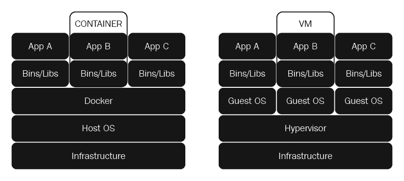
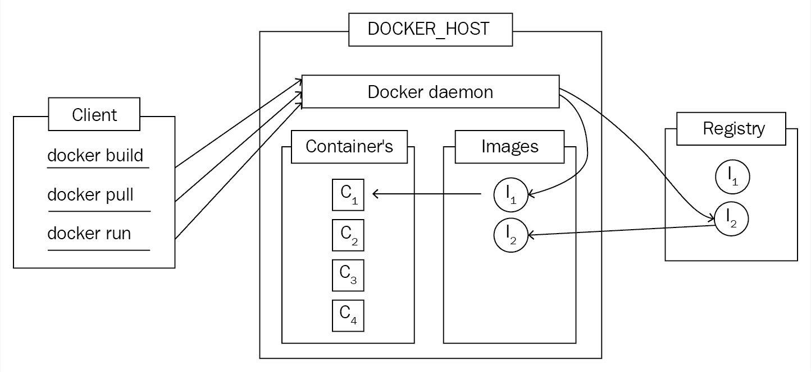

# 第一章：Go 的开发环境

Go 是为 21 世纪应用程序开发而构建的现代编程语言。在过去的十年里，硬件和技术有了显著的进步，大多数其他语言没有利用这些技术进步。正如我们将在整本书中看到的，Go 允许我们构建利用多核系统提供的并发性和并行性的网络应用程序。

在本章中，我们将看一些在书的其余部分工作所需的主题，比如：

+   Go 配置——`GOROOT`、`GOPATH`等。

+   Go 包管理

+   整本书中使用的项目结构

+   容器技术以及如何使用 Docker

+   在 Go 中编写测试

## GOROOT

为了运行或构建一个 Go 项目，我们需要访问 Go 二进制文件及其库。在 Unix 系统上，典型的 Go 安装（安装说明可以在[`golang.org/dl/`](https://golang.org/dl/)找到）会将 Go 二进制文件放在`/usr/bin/go`。然而，也可以在不同的路径上安装 Go。在这种情况下，我们需要设置`GOROOT`环境变量指向我们的 Go 安装路径，并将其附加到我们的`PATH`环境变量中。

## GOPATH

程序员倾向于在许多项目上工作，将源代码与非编程相关文件分开是一个好习惯。将源代码放在一个单独的位置或工作空间是一个常见的做法。每种编程语言都有其自己的约定，规定语言相关项目应该如何设置，Go 也不例外。

`GOPATH`是开发人员必须设置的最重要的环境变量。它告诉 Go 编译器在哪里找到项目和其依赖项的源代码。`GOPATH`中有一些需要遵循的约定，它们与文件夹层次结构有关。

### src/

这个目录将包含我们项目和它们依赖项的源代码。一般来说，我们希望我们的源代码有版本控制，并且托管在云上。如果我们或其他人能够轻松地使用我们的项目，那将是很好的。这需要我们做一些额外的设置。

假设我们的项目托管在`http://git-server.com/user-name/my-go-project`。我们想要在本地系统上克隆和构建这个项目。为了使其正常工作，我们需要将其克隆到`$GOPATH/src/git-server.com/user-name/my-go-project`。当我们第一次为 Go 项目构建依赖项时，我们会看到`src/`文件夹中有许多包含我们项目依赖项的目录和子目录。

### pkg/

Go 是一种编译型编程语言；我们有我们想要在项目中使用的源代码和依赖项的代码。一般来说，每次构建一个二进制文件，编译器都必须读取我们项目和依赖项的源代码，然后将其编译成机器代码。每次编译我们的主程序时编译未更改的依赖项会导致非常缓慢的构建过程。这就是**目标文件**存在的原因；它们允许我们将依赖项编译成可重用的机器代码，可以直接包含在我们的 Go 二进制文件中。

这些目标文件存储在`$GOPATH/pkg`中；它们遵循与`src/`类似的目录结构，只是它们位于一个子目录中。这些目录往往遵循`<OS>_<CPU-Architecture>`的命名模式，因为我们可以为多个系统构建可执行二进制文件：

```go
$ tree $GOPATH/pkg
pkg
└── linux_amd64
 ├── github.com
 │ ├── abbot
 │ │ └── go-http-auth.a
 │ ├── dimfeld
 │ │ └── httppath.a
 │ ├── oklog
 │ │ └── ulid.a
 │ ├── rcrowley
 │ │ └── go-metrics.a
 │ ├── sirupsen
 │ │ └── logrus.a
 │ ├── sony
 │ │ └── gobreaker.a
 └── golang.org
 └── x
 ├── crypto
 │ ├── bcrypt.a
 │ ├── blowfish.a
 │ └── ssh
 │ └── terminal.a
 ├── net
 │ └── context.a
 └── sys  
```

### bin/

Go 将我们的项目编译和构建成可执行二进制文件，并将它们放在这个目录中。根据构建规范，它们可能在当前系统或其他系统上可执行。为了使用`bin/`目录中可用的二进制文件，我们需要设置相应的`GOBIN=$GOPATH/bin`环境变量。

## 包管理

在过去，所有程序都是从头开始编写的——每个实用函数和运行代码的库都必须手工编写。现在，我们不希望经常处理低级细节；从头开始编写所有所需的库和实用程序是不可想象的。Go 带有丰富的库，这对于我们大多数需求来说已经足够了。然而，可能我们需要一些标准库提供的额外库或功能。这样的库应该可以在互联网上找到，并且我们可以下载并将它们添加到我们的项目中以开始使用它们。

在前一节*GOPATH*中，我们讨论了所有项目都保存在`$GOPATH/src/git-server.com/user-name/my-go-project`形式的合格路径中。这对于我们可能拥有的任何依赖项都是正确的。在 Go 中处理依赖项有多种方法。让我们看看其中一些。

### go get

`go get`是标准库提供的用于包管理的实用程序。我们可以通过运行以下命令来安装新的包/库：

```go
$ go get git-server.com/user-name/library-we-need
```

这将下载并构建源代码，然后将其安装为二进制可执行文件（如果可以作为独立可执行文件使用）。`go get`实用程序还会安装我们项目所需的所有依赖项。

`go get`实用程序是一个非常简单的工具。它将安装 Git 存储库上的最新主提交。对于简单的项目，这可能足够了。然而，随着项目在大小和复杂性上的增长，跟踪使用的依赖版本可能变得至关重要。不幸的是，`go get`对于这样的项目并不是很好，我们可能需要看看其他包管理工具。

### glide

`glide`是 Go 社区中最广泛使用的包管理工具之一。它解决了`go get`的限制，但需要开发人员手动安装。以下是安装和使用`glide`的简单方法：

```go
$ curl https://glide.sh/get | sh
$ mkdir new-project && cd new-project
$ glide create
$ glide get github.com/last-ent/skelgor # A helper project to generate project skeleton.
$ glide install # In case any dependencies or configuration were manually added.
$ glide up # Update dependencies to latest versions of the package.
$ tree
.
├── glide.lock
├── glide.yaml
└── vendor
 └── github.com
 └── last-ent
 └── skelgor
 ├── LICENSE
 ├── main.go
 └── README.md  
```

如果您不希望通过`curl`和`sh`安装`glide`，还有其他选项可在项目页面上更详细地描述，该页面位于[`github.com/masterminds/glide`](https://github.com/masterminds/glide)。 

### go dep

`go dep`是 Go 社区正在开发的新的依赖管理工具。现在，它需要 Go 1.7 或更新版本进行编译，并且已经准备好供生产使用。然而，它仍在进行更改，并且尚未合并到 Go 的标准库中。

## 项目结构

一个项目可能不仅仅包括项目的源代码，例如配置文件和项目文档。根据偏好，项目的结构方式可能会发生很大变化。然而，最重要的是要记住整个程序的入口是通过`main`函数，这是在`main.go`中作为约定实现的。

本书中将构建的应用程序将具有以下初始结构：

```go
$ tree
.
├── common
│ ├── helpers.go
│ └── test_helpers.go
└── main.go
```

## 使用书中的代码

本书中讨论的源代码可以通过两种方式获得：

+   使用`go get -u github.com/last-ent/distributed-go`

+   从网站下载代码包并将其提取到`$GOPATH/src/github.com/last-ent/distributed-go`

完整书籍的代码现在应该可以在`$GOPATH/src/github.com/last-ent/distributed-go`中找到，每章的特定代码将在该特定章节编号的目录中找到。

例如，

第一章的代码 -> `$GOPATH/src/github.com/last-ent/distributed-go/chapter1`

第二章的代码 -> `$GOPATH/src/github.com/last-ent/distributed-go/chapter2`

等等。

每当我们在任何特定章节中讨论代码时，都意味着我们在相应章节的文件夹中。

## 容器

在整本书中，我们将编写 Go 程序，这些程序将被编译为二进制文件，并直接在我们的系统上运行。然而，在后面的章节中，我们将使用`docker-compose`来构建和运行多个 Go 应用程序。这些应用程序可以在我们的本地系统上运行而没有任何真正的问题；然而，我们的最终目标是能够在服务器上运行这些程序，并能够通过互联网访问它们。

在 20 世纪 90 年代和 21 世纪初，将应用程序部署到互联网的标准方式是获取服务器实例，将代码或二进制文件复制到实例上，然后启动程序。这在一段时间内运行良好，但很快就开始出现了复杂性。以下是其中一些：

+   在开发人员的机器上运行的代码可能在服务器上无法运行。

+   在服务器实例上运行良好的程序可能在将最新补丁应用到服务器操作系统时失败。

+   作为服务的一部分添加每个新实例时，必须运行各种安装脚本，以便我们可以使新实例与所有其他实例保持一致。这可能是一个非常缓慢的过程。

+   必须特别注意确保新实例及其上安装的所有软件版本与我们的程序使用的 API 兼容。

+   还必须确保所有配置文件和重要的环境变量都被复制到新实例；否则，应用程序可能会在没有或几乎没有线索的情况下失败。

+   通常在本地系统上运行的程序版本与测试系统上运行的程序版本与生产系统上运行的程序版本都配置不同，这意味着我们的应用程序可能会在这三种类型的系统中的一种上失败。如果发生这种情况，我们最终将不得不花费额外的时间和精力来尝试弄清楚问题是否特定于某个实例、某个系统等等。

如果我们能以明智的方式避免这种情况发生，那将是很好的。**容器**试图使用操作系统级别的虚拟化来解决这个问题。这是什么意思呢？

所有程序和应用程序都在称为**用户空间**的内存部分中运行。这使操作系统能够确保程序无法引起重大的硬件或软件问题。这使我们能够从用户空间应用程序中可能发生的任何程序崩溃中恢复过来。

容器的真正优势在于它们允许我们在隔离的用户空间中运行应用程序，我们甚至可以自定义用户空间的以下属性：

+   连接的设备，如网络适配器和 TTY

+   CPU 和 RAM 资源

+   主机操作系统可访问的文件和文件夹

然而，这如何帮助我们解决之前提到的问题呢？为此，让我们深入了解一下**Docker**。

### Docker

现代软件开发在产品开发和产品部署到服务器实例中广泛使用容器技术。Docker 是 Docker, Inc（[`www.docker.com`](https://www.docker.com/)）推广的容器技术，截至目前为止，它是最广泛使用的容器技术。另一个主要的替代品是由 CoreOS 开发的**rkt**（[`coreos.com/rkt`](https://coreos.com/rkt)），但在本书中，我们只会关注 Docker。

#### Docker 与虚拟机（VM）相比

迄今为止，看了 Docker 的描述，我们可能会想它是否是另一个虚拟机。然而，这并不是这样，因为虚拟机需要我们在机器或超级用户之上运行完整的客户操作系统，以及所有所需的二进制文件。在 Docker 的情况下，我们使用操作系统级别的虚拟化，这允许我们在隔离的用户空间中运行我们的容器。

VM 的最大优势是我们可以在系统上运行不同类型的操作系统，例如 Windows、FreeBSD 和 Linux。然而，在 Docker 的情况下，我们可以运行任何 Linux 版本，唯一的限制是它必须是 Linux：



Docker 容器与虚拟机

Docker 容器的最大优势是，由于它在 Linux 上作为一个独立的进程运行，因此它轻量级且不知道主机操作系统的所有功能。

#### 理解 Docker

在我们开始使用 Docker 之前，让我们简要了解一下 Docker 的使用方式，结构以及完整系统的主要组件是什么。

以下列表和附带的图片应该有助于理解 Docker 管道的架构：

+   **Dockerfile**：它包含了构建运行我们程序的镜像的指令。

+   **Docker 客户端**：这是用户用来与 Docker 守护程序交互的命令行程序。

+   **Docker 守护程序**：这是一个守护程序应用程序，用于监听管理构建或运行容器以及将容器推送到 Docker 注册表的命令。它还负责配置容器网络、卷等。

+   **Docker 镜像**：Docker 镜像包含构建可在安装了 Docker 的任何 Linux 机器上执行的容器二进制文件所需的所有步骤。

+   **Docker 注册表**：Docker 注册表负责存储和检索 Docker 镜像。我们可以使用公共 Docker 注册表或私有注册表。Docker Hub 被用作默认的 Docker 注册表。

+   **Docker 容器**：Docker 容器与我们迄今讨论的容器不同。Docker 容器是 Docker 镜像的可运行实例。Docker 容器可以被创建、启动、停止等。

+   **Docker API**：我们之前讨论过的 Docker 客户端是与 Docker API 交互的命令行界面。这意味着 Docker 守护程序不需要在与 Docker 客户端相同的机器上运行。本书中将使用的默认设置是使用 UNIX 套接字或网络接口与本地系统上的 Docker 守护程序通信：



Docker 架构

#### 测试 Docker 设置

让我们确保我们的 Docker 设置完美运行。对于我们的目的，Docker 社区版应该足够了([`www.docker.com/community-edition`](https://www.docker.com/community-edition))。安装完成后，我们将通过运行一些基本命令来检查它是否正常工作。

让我们首先检查我们安装了什么版本：

```go
$ docker --version
Docker version 17.12.0-ce, build c97c6d6
```

让我们试着深入了解一下我们的 Docker 安装的细节：

```go
$ docker info
Containers: 38
 Running: 0
 Paused: 0
 Stopped: 38
Images: 24
Server Version: 17.12.0-ce 
```

在 Linux 上，当您尝试运行 docker 命令时，可能会出现**Permission denied**错误。为了与 Docker 交互，您可以在命令前加上`sudo`，或者您可以创建一个“docker”用户组并将您的用户添加到该组中。有关更多详细信息，请参阅链接[`docs.docker.com/install/linux/linux-postinstall/.`](https://docs.docker.com/install/linux/linux-postinstall/)

让我们尝试运行一个 Docker 镜像。如果您还记得关于 Docker 注册表的讨论，您就知道我们不需要使用 Dockerfile 构建 Docker 镜像，就可以运行 Docker 容器。我们可以直接从 Docker Hub（默认的 Docker 注册表）拉取它并将镜像作为容器运行：

```go
$ docker run docker/whalesay cowsay Welcome to GopherLand!  

Unable to find image 'docker/whalesay:latest' locally
Trying to pull repository docker.io/docker/whalesay ...
sha256:178598e51a26abbc958b8a2e48825c90bc22e641de3d31e18aaf55f3258ba93b: Pulling from docker.io/docker/whalesay
e190868d63f8: Pull complete
909cd34c6fd7: Pull complete
0b9bfabab7c1: Pull complete
a3ed95caeb02: Pull complete
00bf65475aba: Pull complete
c57b6bcc83e3: Pull complete
8978f6879e2f: Pull complete
8eed3712d2cf: Pull complete
Digest: sha256:178598e51a26abbc958b8a2e48825c90bc22e641de3d31e18aaf55f3258ba93b
Status: Downloaded newer image for docker.io/docker/whalesay:latest
 ________________________
< Welcome to GopherLand! >
 ------------------------
    \
     \
    \ 
     ## .
     ## ## ## ==
     ## ## ## ## ===
     /""""""""""""""""___/ ===
  ~~~ {~~ ~~~~ ~~~ ~~~~ ~~ ~ / ===- ~~~
     \______ o __/
    \ __/
     \__________/

```

前面的命令也可以像这样执行，只需使用`docker run ...`，这更方便：

```go
$ docker pull docker/whalesay & docker run docker/whalesay cowsay Welcome to GopherLand!
```

一旦我们有了一长串构建的镜像，我们可以列出它们所有，同样也适用于 Docker 容器：

```go
$ docker images
REPOSITORY TAG IMAGE ID CREATED SIZE
docker.io/docker/whalesay latest 6b362a9f73eb 2 years ago 247 MB
$ docker container ls --all 
CONTAINER ID IMAGE COMMAND CREATED STATUS PORTS NAMES 
a1b1efb42130 docker/whalesay "cowsay Welcome to..." 5 minutes ago Exited (0) 5 minutes ago frosty_varahamihira 

```

最后，值得注意的是，随着我们不断使用 docker 来构建和运行镜像和容器，我们将开始创建一堆“悬空”的镜像，我们可能不会再真正使用。但是，它们最终会占用存储空间。为了摆脱这样的“悬空”镜像，我们可以使用以下命令：

```go
$ docker rmi --force 'docker images -q -f dangling=true'
# list of hashes for all deleted images.
```

#### Dockerfile

现在我们已经掌握了 Docker 的基础知识，让我们来看看在本书中将用作模板的`Dockerfile`文件。

接下来，让我们看一个例子：

```go
FROM golang:1.10
# The base image we want to use to build our docker image from. 
# Since this image is specialized for golang it will have GOPATH = /go 

ADD . /go/src/hello
# We copy files & folders from our system onto the docker image 

RUN go install hello 
# Next we can create an executable binary for our project with the command,
'go install' ENV NAME Bob
# Environment variable NAME will be picked up by the program 'hello' 
and printed to console.ENTRYPOINT /go/bin/hello
# Command to execute when we start the container # EXPOSE 9000 # Generally used for network applications. Allows us to connect to the
application running inside the container from host system's localhost. 
```

##### main.go

让我们创建一个最基本的 Go 程序，这样我们就可以在 Docker 镜像中使用它。它将获取`NAME`环境变量并打印`<NAME> is your uncle.`然后退出：

```go
package main 

import ( 
    "fmt" 
    "os" 
) 

func main() { 
    fmt.Println(os.Getenv("NAME") + " is your uncle.") 
} 
```

现在我们已经把所有的代码都放好了，让我们使用`Dockerfile`文件构建 Docker 镜像：

```go
$ cd docker
$ tree
.
├── Dockerfile
└── main.go"
0 directories, 2 files $ # -t tag lets us name our docker images so that we can easily refer to them $ docker build . -t hello-uncle Sending build context to Docker daemon 3.072 kB Step 1/5 : FROM golang:1.9.1 ---> 99e596fc807e Step 2/5 : ADD . /go/src/hello ---> Using cache ---> 64d080d7eb39 Step 3/5 : RUN go install hello ---> Using cache ---> 13bd4a1f2a60 Step 4/5 : ENV NAME Bob ---> Using cache ---> cc432fe8ffb4 Step 5/5 : ENTRYPOINT /go/bin/hello ---> Using cache ---> e0bbfb1fe52b Successfully built e0bbfb1fe52b $ # Let's now try to run the docker image. $ docker run hello-uncle Bob is your uncle. $ # We can also change the environment variables on the fly. $ docker run -e NAME=Sam hello-uncle Sam is your uncle. 
```

## 在 Go 中进行测试

测试是编程的重要部分，无论是在 Go 中还是在任何其他语言中。Go 有一种直接的方法来编写测试，在本节中，我们将看一些重要的工具来帮助测试。

我们需要遵循一些规则和约定来测试我们的代码。它们可以列举如下：

+   源文件和相关的测试文件放置在同一个包/文件夹中

+   任何给定源文件的测试文件的名称是`<source-file-name>_test.go`

+   测试函数需要以"Test"前缀开头，并且函数名的下一个字符应该是大写的

在本节的其余部分，我们将查看三个文件及其相关的测试：

+   `variadic.go`和`variadic_test.go`

+   `addInt.go`和`addInt_test.go`

+   `nil_test.go`（这些测试没有任何源文件）

在此过程中，我们将介绍我们可能使用的任何进一步的概念。

### variadic.go

为了理解第一组测试，我们需要了解什么是变参函数以及 Go 如何处理它。让我们从定义开始：

*Variadic 函数是在函数调用期间可以接受任意数量的参数的函数。*

鉴于 Go 是一种静态类型语言，对变参函数的唯一限制是传递给它的不定数量的参数应该是相同的数据类型。但是，这并不限制我们传递其他变量类型。如果传递了参数，则函数将接收到一个元素的切片，否则为`nil`。

让我们看一下代码，以便更好地理解：

```go
// variadic.go 

package main 

func simpleVariadicToSlice(numbers ...int) []int { 
   return numbers 
} 

func mixedVariadicToSlice(name string, numbers ...int) (string, []int) { 
   return name, numbers 
} 

// Does not work. 
// func badVariadic(name ...string, numbers ...int) {} 
```

我们在数据类型之前使用`...`前缀来定义函数作为变参函数。请注意，每个函数只能有一个变参参数，并且它必须是最后一个参数。如果我们取消注释`badVariadic`行并尝试测试代码，我们会看到这个错误。

### variadic_test.go

我们想要测试两个有效的函数，`simpleVariadicToSlice`和`mixedVariadicToSlice`，以验证前一节中定义的各种规则。但是，为了简洁起见，我们将测试这些：

+   `simpleVariadicToSlice`：这是为了没有参数，三个参数，以及查看如何将切片传递给变参函数

+   `mixedVariadicToSlice`：这是为了接受一个简单的参数和一个变参参数

现在让我们看一下测试这两个函数的代码：

```go
// variadic_test.go 
package main 

import "testing" 

func TestSimpleVariadicToSlice(t *testing.T) { 
    // Test for no arguments 
    if val := simpleVariadicToSlice(); val != nil { 
        t.Error("value should be nil", nil) 
    } else { 
        t.Log("simpleVariadicToSlice() -> nil") 
    } 

    // Test for random set of values 
    vals := simpleVariadicToSlice(1, 2, 3) 
    expected := []int{1, 2, 3} 
    isErr := false 
    for i := 0; i < 3; i++ { 
        if vals[i] != expected[i] { 
            isErr = true 
            break 
        } 
    } 
    if isErr { 
        t.Error("value should be []int{1, 2, 3}", vals) 
    } else { 
        t.Log("simpleVariadicToSlice(1, 2, 3) -> []int{1, 2, 3}") 
    } 

    // Test for a slice 
    vals = simpleVariadicToSlice(expected...) 
    isErr = false 
    for i := 0; i < 3; i++ { 
        if vals[i] != expected[i] { 
            isErr = true 
            break 
        } 
    } 
    if isErr { 
        t.Error("value should be []int{1, 2, 3}", vals) 
    } else { 
        t.Log("simpleVariadicToSlice([]int{1, 2, 3}...) -> []int{1, 2, 3}") 
    } 
} 

func TestMixedVariadicToSlice(t *testing.T) { 
    // Test for simple argument & no variadic arguments 
    name, numbers := mixedVariadicToSlice("Bob") 
    if name == "Bob" && numbers == nil { 
        t.Log("Recieved as expected: Bob, <nil slice>") 
    } else { 
        t.Errorf("Received unexpected values: %s, %s", name, numbers) 
    } 
} 
```

### 在`variadic_test.go`中运行测试

让我们运行这些测试并查看输出。在运行测试时，我们将使用`-v`标志来查看每个单独测试的输出：

```go
$ go test -v ./{variadic_test.go,variadic.go} 
=== RUN TestSimpleVariadicToSlice 
--- PASS: TestSimpleVariadicToSlice (0.00s) 
 variadic_test.go:10: simpleVariadicToSlice() -> nil 
 variadic_test.go:26: simpleVariadicToSlice(1, 2, 3) -> []int{1, 2, 3} 
 variadic_test.go:41: simpleVariadicToSlice([]int{1, 2, 3}...) -> []int{1, 2, 3} 
=== RUN TestMixedVariadicToSlice 
--- PASS: TestMixedVariadicToSlice (0.00s) 
 variadic_test.go:49: Received as expected: Bob, <nil slice> 
PASS 
ok command-line-arguments 0.001s   
```

### addInt.go

`variadic_test.go`中的测试详细说明了变参函数的规则。但是，您可能已经注意到`TestSimpleVariadicToSlice`在其函数体中运行了三个测试，但`go test`将其视为单个测试。Go 提供了一种很好的方法来在单个函数内运行多个测试，我们将在`addInt_test.go`中查看它们。

对于这个例子，我们将使用一个非常简单的函数，如下所示：

```go
// addInt.go 

package main 

func addInt(numbers ...int) int { 
    sum := 0 
    for _, num := range numbers { 
        sum += num 
    } 
    return sum 
} 
```

#### addInt_test.go

您可能还注意到在`TestSimpleVariadicToSlice`中，我们重复了很多逻辑，而唯一变化的因素是输入和期望值。一种测试风格，称为**表驱动开发**，定义了运行测试所需的所有数据的表，迭代表的“行”，并对它们运行测试。

让我们看一下我们将要测试的没有参数和变参参数：

```go
// addInt_test.go 

package main 

import ( 
    "testing" 
) 

func TestAddInt(t *testing.T) { 
    testCases := []struct { 
        Name     string 
        Values   []int 
        Expected int 
    }{ 
        {"addInt() -> 0", []int{}, 0}, 
        {"addInt([]int{10, 20, 100}) -> 130", []int{10, 20, 100}, 130}, 
    } 

    for _, tc := range testCases { 
        t.Run(tc.Name, func(t *testing.T) { 
            sum := addInt(tc.Values...) 
            if sum != tc.Expected { 
                t.Errorf("%d != %d", sum, tc.Expected) 
            } else { 
                t.Logf("%d == %d", sum, tc.Expected) 
            } 
        }) 
    } 
} 
```

#### 在 addInt_test.go 中运行测试

现在让我们运行这个文件中的测试，并且我们期望`testCases`表中的每一行被视为一个单独的测试：

```go
$ go test -v ./{addInt.go,addInt_test.go} 
=== RUN TestAddInt 
=== RUN TestAddInt/addInt()_->_0 
=== RUN TestAddInt/addInt([]int{10,_20,_100})_->_130 
--- PASS: TestAddInt (0.00s) 
 --- PASS: TestAddInt/addInt()_->_0 (0.00s) 
 addInt_test.go:23: 0 == 0 
 --- PASS: TestAddInt/addInt([]int{10,_20,_100})_->_130 (0.00s) 
 addInt_test.go:23: 130 == 130 
PASS 
ok command-line-arguments 0.001s   
```

### nil_test.go

我们还可以创建不特定于任何特定源文件的测试；唯一的标准是文件名需要采用`<text>_test.go`的形式。`nil_test.go`中的测试阐明了语言的一些有用特性，开发人员在编写测试时可能会发现有用。它们如下：

+   `httptest.NewServer`*:* 想象一下我们需要针对发送数据的服务器测试我们的代码的情况。启动和协调一个完整的服务器来访问一些数据是困难的。`http.NewServer`为我们解决了这个问题。

+   `t.Helper`：如果我们使用相同的逻辑来通过或失败很多`testCases`，将这个逻辑分离到一个单独的函数中是有意义的。然而，这会扭曲测试运行调用堆栈。我们可以通过注释测试中的`t.Helper()`并重新运行`go test`来看到这一点。

我们还可以格式化我们的命令行输出以打印漂亮的结果。我们将展示一个简单的例子，为通过的案例添加一个勾号，为失败的案例添加一个叉号。

在测试中，我们将运行一个测试服务器，在其上进行 GET 请求，然后测试预期输出与实际输出：

```go
// nil_test.go 

package main 

import ( 
    "fmt" 
    "io/ioutil" 
    "net/http" 
    "net/http/httptest" 
    "testing" 
) 

const passMark = "\u2713" 
const failMark = "\u2717" 

func assertResponseEqual(t *testing.T, expected string, actual string) { 
    t.Helper() // comment this line to see tests fail due to 'if expected != actual' 
    if expected != actual { 
        t.Errorf("%s != %s %s", expected, actual, failMark) 
    } else { 
        t.Logf("%s == %s %s", expected, actual, passMark) 
    } 
} 

func TestServer(t *testing.T) { 
    testServer := httptest.NewServer( 
        http.HandlerFunc( 
            func(w http.ResponseWriter, r *http.Request) { 
                path := r.RequestURI 
                if path == "/1" { 
                    w.Write([]byte("Got 1.")) 
                } else { 
                    w.Write([]byte("Got None.")) 
                } 
            })) 
    defer testServer.Close() 

    for _, testCase := range []struct { 
        Name     string 
        Path     string 
        Expected string 
    }{ 
        {"Request correct URL", "/1", "Got 1."}, 
        {"Request incorrect URL", "/12345", "Got None."}, 
    } { 
        t.Run(testCase.Name, func(t *testing.T) { 
            res, err := http.Get(testServer.URL + testCase.Path) 
            if err != nil { 
                t.Fatal(err) 
            } 

            actual, err := ioutil.ReadAll(res.Body) 
            res.Body.Close() 
            if err != nil { 
                t.Fatal(err) 
            } 
            assertResponseEqual(t, testCase.Expected, fmt.Sprintf("%s", actual)) 
        }) 
    } 
    t.Run("Fail for no reason", func(t *testing.T) {
        assertResponseEqual(t, "+", "-")
    })
} 
```

#### 在 nil_test.go 中运行测试

我们运行了三个测试，其中两个测试案例将通过，一个将失败。这样我们就可以看到勾号和叉号的效果。

```go
$ go test -v ./nil_test.go 
=== RUN TestServer 
=== RUN TestServer/Request_correct_URL 
=== RUN TestServer/Request_incorrect_URL 
=== RUN TestServer/Fail_for_no_reason 
--- FAIL: TestServer (0.00s) 
 --- PASS: TestServer/Request_correct_URL (0.00s) 
 nil_test.go:55: Got 1\. == Got 1\.  
 --- PASS: TestServer/Request_incorrect_URL (0.00s) 
 nil_test.go:55: Got None. == Got None. 
  --- FAIL: TestServer/Fail_for_no_reason (0.00s)   
 nil_test.go:59: + != - 
 FAIL exit status 1 FAIL command-line-arguments 0.003s 
```

## 总结

在本章中，我们首先看了成功运行 Go 项目的基本设置。然后我们看了如何为我们的 Go 项目安装依赖以及如何构建项目结构。我们还研究了容器背后的重要概念，它们解决了什么问题，以及我们将如何在本书中使用它们以及一个示例。接下来，我们看了如何在 Go 中编写测试，并且在这个过程中，我们学到了一些有趣的概念，比如处理可变参数函数和其他有用的测试函数。

在下一章中，我们将开始研究 Go 编程的核心基础之一——goroutines 以及在使用它们时需要牢记的重要细节。
