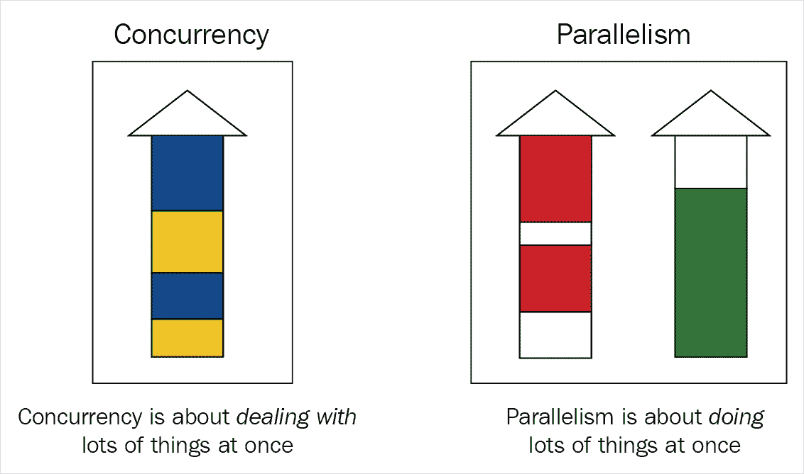
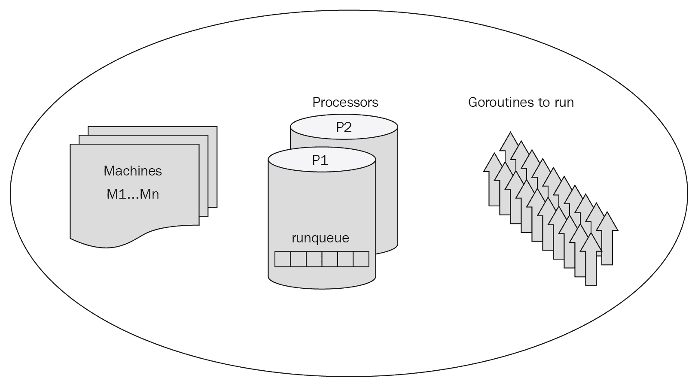
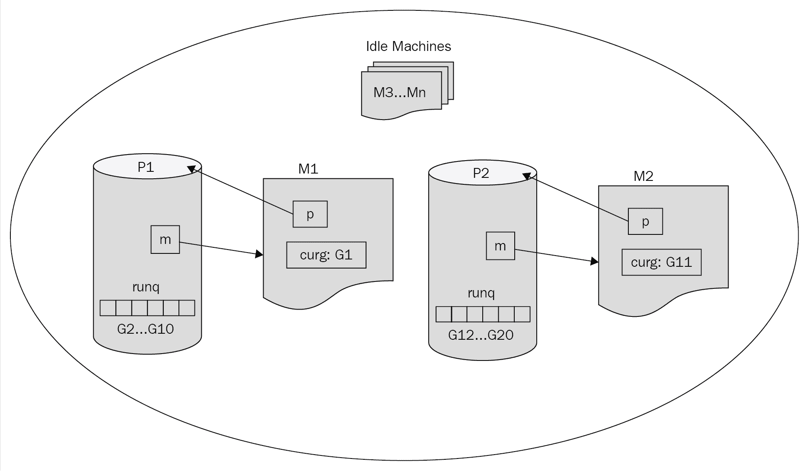
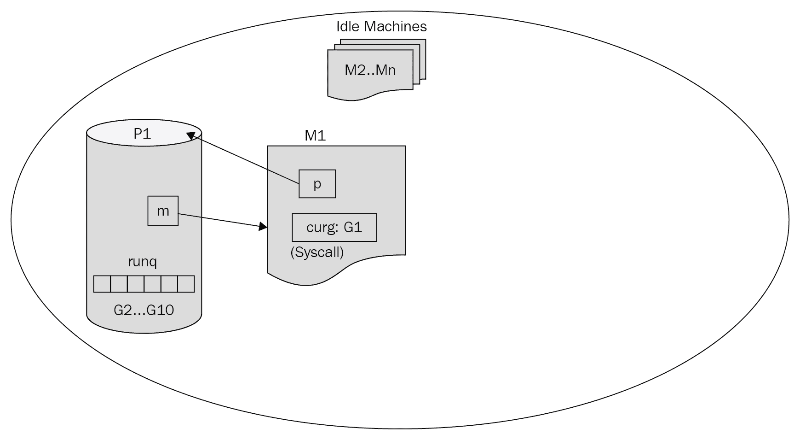
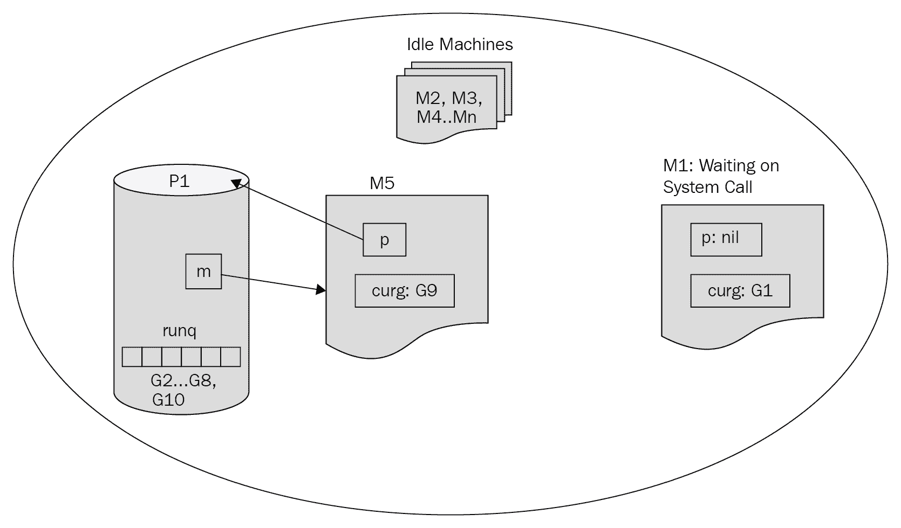
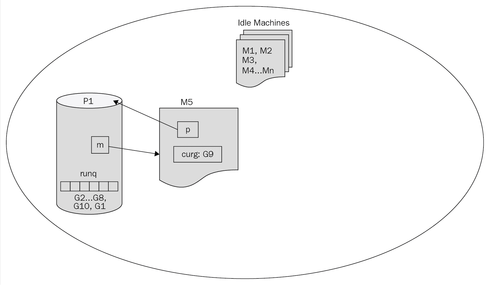
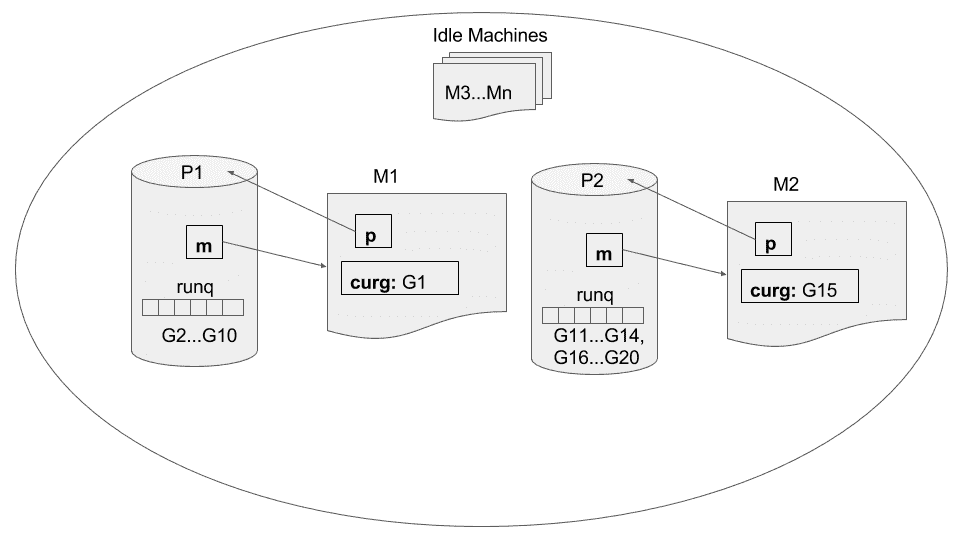
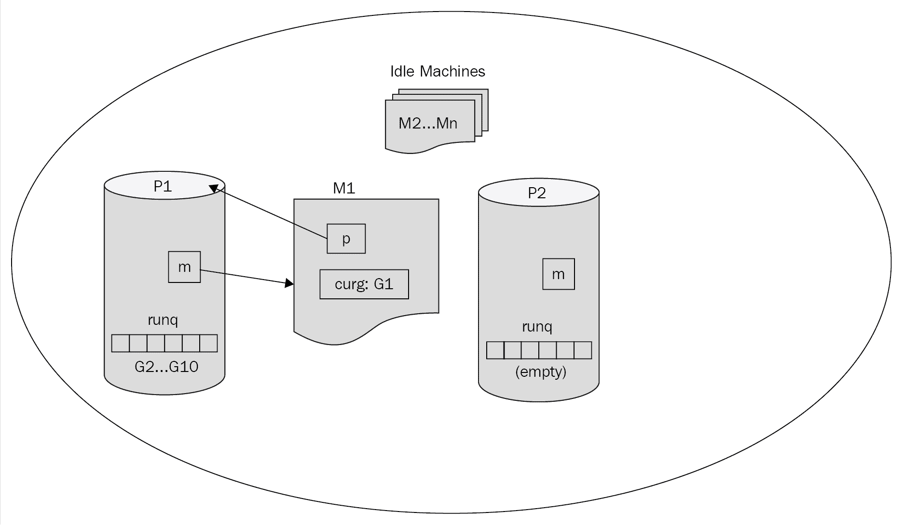
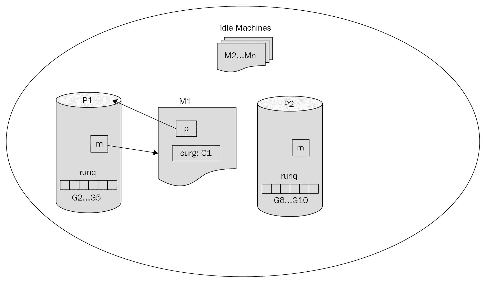

# 第二章：理解 Goroutines

在过去的十年里，软件开发和编程已经取得了相当大的进步。许多以前被认为是学术和低效的概念开始在现代软件解决方案中找到位置。其中两个概念是协程（Go 中的 goroutines）和通道。从概念上讲，它们随着时间的推移而发展，并且它们在每种编程语言中的实现方式也不同。在许多编程语言中，比如 Ruby 或 Clojure，它们被实现为库，但在 Go 中，它们作为一种本地特性在语言中实现。正如我们将看到的，这使得该语言真正现代化，相当高效，并且是一种先进的编程语言。

在本章中，我们将通过查看 goroutines 和以下主题来尝试理解 Go：

+   并发和并行

+   Go 的运行时调度程序

+   在使用 goroutines 时要注意的事项

## 并发和并行

计算机和软件程序很有用，因为它们可以快速完成大量繁重的工作，还可以同时做多件事情。我们希望我们的程序能够同时做多件事情，也就是说，多任务处理，编程语言的成功可能取决于编写和理解多任务处理程序的难易程度。

并发和并行是我们在研究多任务处理时经常遇到的两个术语，它们经常被互换使用。然而，它们意味着两个截然不同的事情。

Go 博客上给出的标准定义（[`blog.golang.org/concurrency-is-not-parallelism`](https://blog.golang.org/concurrency-is-not-parallelism)）如下：

+   **并发性**：*并发性是指同时处理很多事情*。这意味着我们在一段时间内设法同时完成多项任务。但是，我们一次只做一件事。这往往发生在一个任务在等待时，程序决定在空闲时间运行另一个任务。在下图中，这是通过在蓝色任务的空闲时段运行黄色任务来表示的。

+   **并行性**：*并行性是指同时做很多事情*。这意味着即使我们有两个任务，它们也在不间断地工作，没有任何间断。在图中，这表明绿色任务是独立运行的，并且不受红色任务的影响：



重要的是要理解这两个术语之间的区别。让我们通过一些具体的例子来进一步阐述两者之间的区别。

### 并发

让我们通过一个简单的例子来看看并发的概念，以及我们如何执行一些日常例行任务。

想象一下你开始一天，需要完成六件事：

+   预订酒店。

+   预订机票

+   订购一件连衣裙

+   支付信用卡账单

+   写电子邮件

+   听有声读物

完成它们的顺序并不重要，对于一些任务，比如写电子邮件或听有声读物，你不需要一次完成它们。以下是完成任务的一种可能方式：

1.  订购一件连衣裙。

1.  写电子邮件的三分之一。

1.  预订酒店。

1.  听 10 分钟的有声读物。

1.  支付信用卡账单。

1.  写电子邮件的另外三分之一。

1.  预订机票。

1.  听 20 分钟的有声读物。

1.  完成写电子邮件。

1.  继续听有声读物直到入睡。

在编程术语中，我们**同时**执行了上述任务。我们度过了一整天，从任务列表中选择了特定的任务，并开始处理它们。对于某些任务，我们甚至决定将它们分成几部分，在其他任务之间处理这些部分。

最终我们将编写一个程序，以并发的方式执行所有前面的步骤，但让我们一步一步来。让我们首先构建一个按顺序执行任务的程序，然后逐渐修改它，直到它成为纯并发代码并使用 goroutines。程序的进展将分为三个步骤：

1.  串行任务执行。

1.  使用 goroutines 的串行任务执行。

1.  并发任务执行。

#### 代码概述

代码将由一组打印出其分配任务的函数组成。在写电子邮件或听有声读物的情况下，我们进一步将任务细分为更多函数。具体如下：

+   `writeMail`，`continueWritingMail1`，`continueWritingMail2`

+   `listenToAudioBook`，`continueListeningToAudioBook`

#### 串行任务执行

让我们首先实现一个以线性方式执行所有任务的程序。根据我们之前讨论的代码概述，以下代码应该很简单：

```go
package main 

import ( 
    "fmt" 
) 

// Simple individual tasks 
func makeHotelReservation() { 
    fmt.Println("Done making hotel reservation.") 
} 
func bookFlightTickets() { 
    fmt.Println("Done booking flight tickets.") 
} 
func orderADress() { 
    fmt.Println("Done ordering a dress.") 
} 
func payCreditCardBills() { 
    fmt.Println("Done paying Credit Card bills.") 
} 

// Tasks that will be executed in parts 

// Writing Mail 
func writeAMail() { 
    fmt.Println("Wrote 1/3rd of the mail.") 
    continueWritingMail1() 
} 
func continueWritingMail1() { 
    fmt.Println("Wrote 2/3rds of the mail.") 
    continueWritingMail2() 
} 
func continueWritingMail2() { 
    fmt.Println("Done writing the mail.") 
} 

// Listening to Audio Book 
func listenToAudioBook() { 
    fmt.Println("Listened to 10 minutes of audio book.") 
    continueListeningToAudioBook() 
} 
func continueListeningToAudioBook() { 
    fmt.Println("Done listening to audio book.") 
} 

// All the tasks we want to complete in the day. 
// Note that we do not include the sub tasks here. 
var listOfTasks = []func(){ 
    makeHotelReservation, bookFlightTickets, orderADress, 
    payCreditCardBills, writeAMail, listenToAudioBook, 
} 

func main() { 
    for _, task := range listOfTasks { 
        task() 
    } 
} 
```

我们接受每个主要任务，并按简单的顺序开始执行它们。执行上述代码应该产生预期之外的输出，如下所示：

```go
Done making hotel reservation.
Done booking flight tickets.
Done ordering a dress.
Done paying Credit Card bills.
Wrote 1/3rd of the mail.
Wrote 2/3rds of the mail.
Done writing the mail.
Listened to 10 minutes of audio book.
Done listening to audio book.
```

#### 使用 goroutines 进行串行任务执行

我们列出了一系列任务，并编写了一个程序以线性和顺序的方式执行它们。但是，我们希望同时执行这些任务！让我们首先为分割任务引入 goroutines，看看效果如何。我们只会展示代码片段，其中代码实际上发生了变化：

```go
/******************************************************************** 
  We start by making Writing Mail & Listening Audio Book concurrent. 
*********************************************************************/ 
// Tasks that will be executed in parts 

// Writing Mail 
func writeAMail() { 
    fmt.Println("Wrote 1/3rd of the mail.") 
    go continueWritingMail1()  // Notice the addition of 'go' keyword. 
} 
func continueWritingMail1() { 
    fmt.Println("Wrote 2/3rds of the mail.") 
    go continueWritingMail2()  // Notice the addition of 'go' keyword. 
} 
func continueWritingMail2() { 
    fmt.Println("Done writing the mail.") 
} 

// Listening to Audio Book 
func listenToAudioBook() { 
    fmt.Println("Listened to 10 minutes of audio book.") 
    go continueListeningToAudioBook()  // Notice the addition of 'go'   keyword. 
} 
func continueListeningToAudioBook() { 
    fmt.Println("Done listening to audio book.") 
} 
```

以下是可能的输出：

```go
Done making hotel reservation.
Done booking flight tickets.
Done ordering a dress.
Done paying Credit Card bills.
Wrote 1/3rd of the mail.
Listened to 10 minutes of audio book.
```

哎呀！这不是我们期望的。`continueWritingMail1`，`continueWritingMail2`和`continueListeningToAudioBook`函数的输出缺失；原因是我们使用了 goroutines。由于 goroutines 没有等待，`main`函数中的代码继续执行，一旦控制流到达`main`函数的末尾，程序就会结束。我们真正想做的是在`main`函数中等待，直到所有 goroutines 都执行完毕。我们可以通过两种方式实现这一点——使用通道或使用`WaitGroup`。由于我们有第三章，*通道和消息*专门讨论通道，让我们在本节中使用`WaitGroup`。

为了使用`WaitGroup`，我们必须记住以下几点：

+   使用`WaitGroup.Add(int)`来计算我们将作为逻辑的一部分运行多少 goroutines。

+   使用`WaitGroup.Done()`来表示 goroutine 完成了其任务。

+   使用`WaitGroup.Wait()`来等待直到所有 goroutines 都完成。

+   将`WaitGroup`实例传递给 goroutines，以便它们可以调用`Done()`方法。

基于这些观点，我们应该能够修改源代码以使用`WaitGroup`。以下是更新后的代码：

```go
package main 

import ( 
    "fmt" 
    "sync" 
) 

// Simple individual tasks 
func makeHotelReservation(wg *sync.WaitGroup) { 
    fmt.Println("Done making hotel reservation.") 
    wg.Done()
} 
func bookFlightTickets(wg *sync.WaitGroup) { 
    fmt.Println("Done booking flight tickets.") 
    wg.Done() 
} 
func orderADress(wg *sync.WaitGroup) { 
    fmt.Println("Done ordering a dress.") 
    wg.Done() 
} 
func payCreditCardBills(wg *sync.WaitGroup) { 
    fmt.Println("Done paying Credit Card bills.") 
    wg.Done() 
} 

// Tasks that will be executed in parts 

// Writing Mail 
func writeAMail(wg *sync.WaitGroup) { 
    fmt.Println("Wrote 1/3rd of the mail.") 
    go continueWritingMail1(wg) 
} 
func continueWritingMail1(wg *sync.WaitGroup) { 
    fmt.Println("Wrote 2/3rds of the mail.") 
    go continueWritingMail2(wg) 
} 
func continueWritingMail2(wg *sync.WaitGroup) { 
    fmt.Println("Done writing the mail.") 
    wg.Done() 
} 

// Listening to Audio Book 
func listenToAudioBook(wg *sync.WaitGroup) { 
    fmt.Println("Listened to 10 minutes of audio book.") 
    go continueListeningToAudioBook(wg) 
} 
func continueListeningToAudioBook(wg *sync.WaitGroup) { 
    fmt.Println("Done listening to audio book.") 
    wg.Done() 
} 

// All the tasks we want to complete in the day. 
// Note that we do not include the sub tasks here. 
var listOfTasks = []func(*sync.WaitGroup){ 
    makeHotelReservation, bookFlightTickets, orderADress, 
    payCreditCardBills, writeAMail, listenToAudioBook, 
} 

func main() { 
    var waitGroup sync.WaitGroup 
    // Set number of effective goroutines we want to wait upon 
    waitGroup.Add(len(listOfTasks)) 

    for _, task := range listOfTasks{ 
        // Pass reference to WaitGroup instance 
        // Each of the tasks should call on WaitGroup.Done() 
        task(&waitGroup) 
    } 
    // Wait until all goroutines have completed execution. 
    waitGroup.Wait() 
}
```

以下是一种可能的输出顺序；请注意`continueWritingMail1`和`continueWritingMail2`在`listenToAudioBook`和`continueListeningToAudioBook`之后执行：

```go
Done making hotel reservation.
Done booking flight tickets.
Done ordering a dress.
Done paying Credit Card bills.
Wrote 1/3rd of the mail.
Listened to 10 minutes of audio book.
Done listening to audio book.
Wrote 2/3rds of the mail.
Done writing the mail.
```

#### 并发任务执行

在上一节的最终输出中，我们可以看到`listOfTasks`中的所有任务都是按顺序执行的，最大并发的最后一步是让顺序由 Go 运行时决定，而不是由`listOfTasks`中的顺序。这听起来可能是一项费力的任务，但实际上这是非常简单实现的。我们只需要在`task(&waitGroup)`前面加上`go`关键字：

```go
func main() { 
    var waitGroup sync.WaitGroup 
    // Set number of effective goroutines we want to wait upon 
    waitGroup.Add(len(listOfTasks)) 

    for _, task := range listOfTasks { 
        // Pass reference to WaitGroup instance 
        // Each of the tasks should call on WaitGroup.Done() 
        go task(&waitGroup) // Achieving maximum concurrency 
    } 

    // Wait until all goroutines have completed execution. 
    waitGroup.Wait() 
```

以下是可能的输出：

```go
Listened to 10 minutes of audio book.
Done listening to audio book.
Done booking flight tickets.
Done ordering a dress.
Done paying Credit Card bills.
Wrote 1/3rd of the mail.
Wrote 2/3rds of the mail.
Done writing the mail.
Done making hotel reservation.
```

如果我们看一下这种可能的输出，任务是按以下顺序执行的：

1.  听有声读物。

1.  预订机票。

1.  订购一件连衣裙。

1.  支付信用卡账单。

1.  写一封电子邮件。

1.  预订酒店。

现在我们对并发是什么以及如何使用`goroutines`和`WaitGroup`编写并发代码有了一个很好的了解，让我们深入了解并行性。

### 并行性

想象一下，你需要写几封电子邮件。它们将会很长、很费力，而让自己保持愉快的最好方法是在写邮件的同时听音乐，也就是说，在“并行”写邮件的同时听音乐。如果我们想编写一个模拟这种情况的程序，以下是一种可能的实现：

```go
package main 

import ( 
    "fmt" 
    "sync" 
    "time" 
) 

func printTime(msg string) { 
    fmt.Println(msg, time.Now().Format("15:04:05")) 
} 

// Task that will be done over time 
func writeMail1(wg *sync.WaitGroup) { 
    printTime("Done writing mail #1.") 
    wg.Done() 
} 
func writeMail2(wg *sync.WaitGroup) { 
    printTime("Done writing mail #2.") 
    wg.Done() 
} 
func writeMail3(wg *sync.WaitGroup) { 
    printTime("Done writing mail #3.") 
    wg.Done() 
} 

// Task done in parallel 
func listenForever() { 
    for { 
        printTime("Listening...") 
    } 
} 

func main() { 
    var waitGroup sync.WaitGroup 
    waitGroup.Add(3) 

    go listenForever() 

    // Give some time for listenForever to start 
    time.Sleep(time.Nanosecond * 10) 

    // Let's start writing the mails 
    go writeMail1(&waitGroup) 
    go writeMail2(&waitGroup) 
    go writeMail3(&waitGroup) 

    waitGroup.Wait() 
} 
```

程序的输出可能如下：

```go
Done writing mail #3\. 19:32:57
Listening... 19:32:57
Listening... 19:32:57
Done writing mail #1\. 19:32:57
Listening... 19:32:57
Listening... 19:32:57
Done writing mail #2\. 19:32:57
```

数字代表时间，以`小时:分钟:秒`表示，可以看到它们是并行执行的。您可能已经注意到，并行代码看起来几乎与最终并发示例的代码相同。然而，在`listenForever`函数中，我们在一个无限循环中打印`Listening...`。如果前面的示例没有使用协程编写，输出将继续打印`Listening...`，永远不会到达`writeMail`函数调用。

现在我们了解了如何使用协程来运行并发程序，让我们看看 Go 是如何允许我们做到这一点的。接下来我们将看一下 Go 运行时使用的调度器。

## Go 的运行时调度器

Go 程序连同运行时在多个 OS 线程上进行管理和执行。运行时使用一种称为**M:N**调度器的调度策略，它将 M 个协程调度到 N 个 OS 线程上。因此，每当我们需要运行或切换到不同的协程时，上下文切换将会很快，这也使我们能够利用 CPU 的多个核进行并行计算。

对 Go 的运行时和调度器有一个扎实的理解会非常有趣和有用，现在是一个详细了解它们的好时机。

从 Go 调度器的角度来看，主要有三个实体：

+   协程（G）

+   OS 线程或机器（M）

+   上下文或处理器（P）

让我们看看它们做了什么。我们还将查看这些实体的部分结构定义，以便更好地了解调度是如何实现和运行的。

### 协程

它是包含程序/函数实际指令的逻辑执行单元。它还包含有关协程的其他重要信息，例如堆栈内存、它正在运行的机器（M）以及调用它的 Go 函数。以下是协程结构中可能有用的一些元素：

```go
// Denoted as G in runtime 
type g struct { 
    stack         stack // offset known to runtime/cgo 
    m               *m    // current m; offset known to arm liblink 
    goid           int64 
    waitsince   int64   // approx time when the g become blocked 
    waitreason string  // if status==Gwaiting 
    gopc          uintptr // pc of go statement that created this goroutine 
    startpc       uintptr // pc of goroutine function 
    timer         *timer  // cached timer for time.Sleep 

    // ... 
} 
```

一个有趣的事情是，当我们的 Go 程序启动时，首先启动一个名为主协程的协程，它负责在启动我们的程序之前设置运行时空间。典型的运行时设置可能包括最大堆栈大小、启用垃圾回收等。

### OS 线程或机器

最初，OS 线程或机器由 OS 创建和管理。随后，调度器可以请求创建或销毁更多的 OS 线程或机器。这是协程将要执行的实际资源。它还维护有关主协程、当前正在其上运行的 G、**线程本地存储**（**tls**）等信息：

```go
// Denoted as M in runtime 
type m struct { 
    g0               *g         // goroutine with scheduling stack 
    tls               [6]uintptr // thread-local storage (for x86 extern register) 
    curg            *g         // current running goroutine 
    p                 puintptr   // attached p for executing go code (nil if not executing go code) 
    id                 int32 
    createstack [32]uintptr // stack that created this thread. 
    spinning      bool        // m is out of work and is actively looking for work 

    // ... 
} 
```

### 上下文或处理器

我们有一个全局调度器负责启动新的 M，注册 G 和处理系统调用。然而，它不处理协程的实际执行。这是由一个名为**处理器**的实体来完成的，它有自己的内部调度器和一个名为运行队列（代码中的`runq`）的队列，其中包含将在当前上下文中执行的协程。它还处理在各种协程之间的切换等：

```go
// Denoted as P in runtime code 
type p struct { 
    id     int32 
    m     muintptr // back-link to associated m (nil if idle) 
    runq [256]guintptr 

    //... 
} 
```

从 Go 1.5 开始，Go 运行时可以在程序生命周期的任何时刻运行最大数量的`GOMAXPROCS` Ps。当然，我们可以通过设置`GOMAXPROCS`环境变量或调用`GOMAXPROCS()`函数来更改这个数字。

### 使用 G、M 和 P 进行调度

当程序准备开始执行时，运行时已经设置好了机器和处理器。运行时会请求操作系统启动足够数量的机器（M），GOMAXPROCS 数量的处理器来执行 goroutine（G）。重要的是要理解 M 是实际的执行单元，G 是逻辑执行单元。然而，它们需要 P 来实际执行 G 对 M。让我们看一个可能的场景来更好地解释调度过程。首先让我们看看我们将在场景中使用的组件：

+   我们有一组准备运行的 M：M1...Mn

+   我们还有两个 P：P1 和 P2，分别带有运行队列—runq1 和 runq2

+   最后但并非最不重要的，我们还有 20 个 goroutine，G1...G20，我们希望作为程序的一部分执行

Go 的运行时和所有组件，M1...Mn，P1 和 P2，以及 G1...G20，如下图所示：



鉴于我们有两个处理器，全局调度器理想情况下会在两个处理器之间平均分配 goroutine。假设 P1 被分配为处理 G1...G10 并将它们放入其运行队列，同样 P2 将 G11...G20 放入其运行队列。接下来，P1 的调度器从其运行队列中弹出一个 goroutine 来运行，G1，选择一个机器来运行它，M1，同样 P2 在 M2 上运行 G11。这可以通过以下图示进行说明：



一个进程的内部调度器还负责将当前的 goroutine 与它想要执行的下一个 goroutine 进行切换。如果一切顺利，调度器会出于以下三个可能的原因之一切换当前的 goroutine：

+   当前执行的时间片已经结束：进程将使用**schedtick**（每次调度器调用时递增）来跟踪当前 goroutine 执行了多长时间，一旦达到一定的时间限制，当前 goroutine 将被放回运行队列，下一个 goroutine 将被选中执行。

+   执行完成：简而言之，goroutine 已经执行完所有指令。在这种情况下，它不会被放回运行队列。

+   等待系统调用：在某些情况下，goroutine 可能需要进行系统调用，结果会导致 goroutine 被阻塞。鉴于我们有一些处理器，阻塞这样一个昂贵的资源是没有意义的。好消息是，在 Go 中，处理器不需要等待系统调用；相反，它可以离开等待的 M 和 G 组合，系统调用后会被全局调度器接管。与此同时，处理器可以从可用的机器中选择另一个 M，从其运行队列中选择另一个 goroutine，并开始执行。这可以通过以下图示进行解释：



前面的图解释了处理器 P1 在机器 M1 上运行 goroutine G1。现在 G1 将开始进行系统调用。这可以通过以下图示进行说明：



前面的图解释了处理器 P1 由于系统调用从机器 M1 和 goroutine G1 中分离。P1 选择一个新的机器 M5，并选择一个新的 goroutine G9 来执行：



在前面的图中，G1-M1 系统调用已经完成。现在 G1 被放回 P1 的运行队列，M1 被添加到空闲机器的集合中。

在本节的最后部分，我们将讨论调度器中实施的另一种策略，称为**work-stealing**。

假设处理器 P1 有 10 个 goroutines，P2 有 10 个 goroutines。然而，事实证明 P1 中的 goroutines 很快就完成了，现在 P1 的运行队列中没有 goroutines 了。如果 P1 空闲并等待全局调度器提供更多工作，那将是一场悲剧。通过工作窃取策略的帮助，P1 开始与其他处理器进行检查，如果另一个处理器的运行队列中有 goroutines，它将“窃取”其中一半并开始执行它们。这确保了我们最大程度地利用了程序的 CPU 使用率。让我们提出两个有趣的问题：

+   如果一个处理器意识到它无法再窃取任何任务怎么办？处理器会等待一小段时间，期望有新的 goroutines，如果没有创建，处理器就会被终止。

+   处理器能否窃取超过一半的运行队列？即使我们有很多处理器在工作，工作窃取策略也总是会窃取目标处理器运行队列的一半。

这可以用以下图示说明：



上图显示了两个处理器 P1 和 P2，在两台机器上执行各自运行队列中的一个 goroutine。假设当 P1 在运行时，处理器 P2 的任务已经完成。如下图所示：



处理器 P2 已经耗尽了它的运行队列，没有更多的 goroutines 可以执行。多亏了工作窃取策略，P2 已经“窃取”了 P1 运行队列中一半的 goroutines，并可以开始执行它们，如下图所示：



## 在使用 goroutines 时要注意的事项

到这个点，我们应该已经对 goroutines 和调度器的工作原理有了很好的理解。现在让我们来看看在使用 goroutines 时可能会让我们感到意外的一些事情。

### 单个 goroutine 使整个程序停止

我们知道 goroutines 在多个线程和多个核心上运行。那么当一个线程发生 panic 时会发生什么？下面是一个可以让我们模拟这种情况的例子。我们将创建许多类似的 goroutines，它们的唯一目的是取一个数字，并在从分母减去 10 后将其除以自身。这对大多数情况都有效，除了当数字是`10`时。以下代码实现了所描述的功能：

```go
package main 

import ( 
    "fmt" 
    "sync" 
) 

func simpleFunc(index int, wg *sync.WaitGroup) { 
    // This line should fail with Divide By Zero when index = 10 
    fmt.Println("Attempting x/(x-10) where x = ", index, " answer is : ", index/(index-10)) 
    wg.Done() 
} 

func main() { 
    var wg sync.WaitGroup 
    wg.Add(40) 
    for i := 0; i < 40; i += 1 { 
        go func(j int) { 
            simpleFunc(j, &wg) 
        }(i) 
    } 

    wg.Wait() 
}
```

先前代码的输出可能如下所示：

```go
Attempting x/(x-10) where x = 39 answer is : 1 Attempting x/(x-10) where x = 20 answer is : 2... Attempting x/(x-10) where x = 37 answer is : 1 Attempting x/(x-10) where x = 11 answer is : 11 panic: runtime error: integer divide by zerogoroutine 15 [running]:main.simpleFunc(0xa, 0xc42000e280) ...exit status 2
```

基本上，许多 goroutines 被放入运行队列中，并以随机顺序执行，它们的输出被打印到控制台。然而，一旦执行了索引==10 的 goroutine，它引发了一个 panic，该 panic 没有被函数处理，导致整个程序停止并以状态码`2`退出。这表明即使一个未被处理的错误或 panic 也会使整个程序停止！

然而，如果因为我们遇到了一个我们本来可以优雅处理的 panic 而导致程序崩溃是没有意义的。Go 允许我们使用一个名为`recover`的适当命名的函数从 panic 中恢复。让我们看看如何在先前的代码示例中使用`recover`：

```go
package main 

import ( 
    "fmt" 
    "sync" 
) 

func simpleFunc(index int, wg *sync.WaitGroup) { 
    // functions with defer keyword are executed at the end of the function 
    // regardless of whether the function was executed successfully or not. 
    defer func() { 
        if r := recover(); r != nil { 
            fmt.Println("Recovered from", r) 
        } 
    }() 

    // We have changed the order of when wg.Done is called because 
    // we should call upon wg.Done even if the following line fails. 
    // Whether a defer function exists or not is dependent on whether it is registered 
    // before or after the failing line of code. 
    defer wg.Done() 
    // This line should fail with Divide By Zero when index = 10 
    fmt.Println("Attempting x/(x-10) where x = ", index, " answer is : ", index/(index-10)) 
} 

func main() { 
    var wg sync.WaitGroup 
    wg.Add(40) 
    for i := 0; i < 40; i += 1 { 
        go func(j int) { 
            simpleFunc(j, &wg) 
        }(i) 
    } 

    wg.Wait() 
}
```

先前代码的输出可能如下所示：

```go
Attempting x/(x-10) where x = 39 answer is : 1 Attempting x/(x-10) where x = 14 answer is : 3 Recovered from runtime error: integer divide by zero Attempting x/(x-10) where x = 3 answer is : 0 ...Attempting x/(x-10) where x = 29 answer is : 1 Attempting x/(x-10) where x = 9 answer is : -9 
```

### Goroutines 是不可预测的

在本章中，我们首先看了 Go 如何使我们能够编写并发的代码，并在一定程度上实现并行。然后我们讨论了 Go 如何在机器和处理器上调度 goroutines。我们可能能够推断 goroutines 将如何分布在机器和处理器上，这反过来可能让我们编写非标准或 hacky 的 Go 代码。

考虑*并行性*部分的代码，我们试图模拟在听音乐的同时写几封电子邮件。以下是代码的输出，供快速参考：

```go
Done writing mail #3\. 19:32:57
Listening... 19:32:57
Listening... 19:32:57
Done writing mail #1\. 19:32:57
Listening... 19:32:57
Listening... 19:32:57
Done writing mail #2\. 19:32:57
```

现在我们可以很容易地推断出至少有两个 P，其中一个被用于打印`Listening...`的 goroutine，而另一个 P 则处理与写邮件相关的 goroutines。

这一切都很好，但考虑一种情况，即`GOMAXPROCS`设置为`1`，或者系统硬件能力较低，可能导致较少的机器。这可能导致 goroutine 打印`Listening...`永远运行，永远不会将控制权交给其他 goroutines。实际上，Go 编译器应该检测到这种情况，并相应地计划 goroutines 的调度。然而，最好是规划我们的代码，这样我们就不必依赖 Go 的调度器及其当前的实现。

## 总结

Goroutines 是并发的，到一定程度上是并行的；然而，我们应该将它们视为并发。Goroutines 的执行顺序是不可预测的，我们不应该依赖它们按任何特定顺序执行。

我们还应该注意处理 goroutines 中的错误和恐慌，因为即使它们在并行执行，一个 goroutine 中的恐慌也会导致整个程序崩溃。最后，goroutines 可能会在系统调用上阻塞，但这不会阻塞程序的执行，也不会减慢整个程序的性能。

我们看了一些 Go 运行时调度器背后的设计概念，以了解为什么会发生所有这些。

也许你会想为什么我们在本章没有讨论通道。原因是，通过不依赖通道，我们能够以它们最基本的形式来看待 goroutines。这使我们能够更深入地了解 goroutines 的概念和实现。

在下一章中，我们将看一下通道以及它们如何进一步增强 goroutines 的功能。
