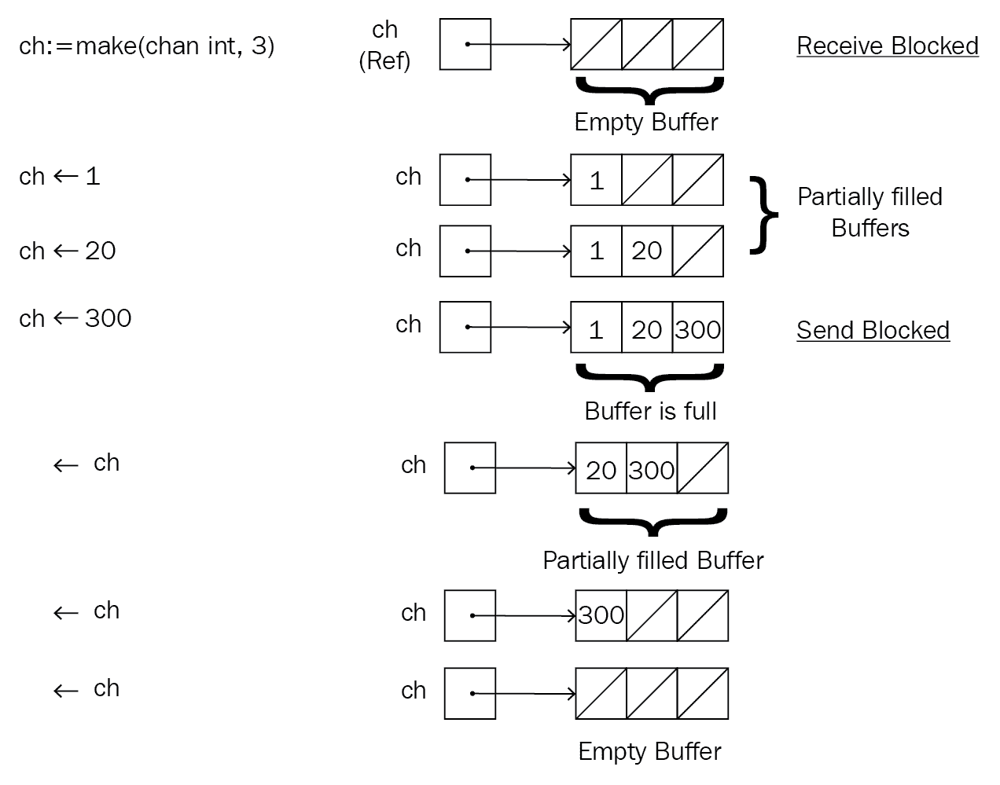

# 第三章：通道和消息

在第二章中，*理解 Goroutines*，我们看到了 goroutines 的工作原理，如何以并发的方式使用它们，以及可能发生的一些常见错误。它们简单易用，但受限于它们只能生成其他 goroutines 并等待系统调用。实际上，goroutines 比前一章展示的更有能力，为了发挥它们的全部潜力，我们需要了解如何使用通道，这是本章的目标。在这里，我们将讨论以下主题：

+   控制并行性

+   通道和数据通信

+   通道的类型

+   关闭和复用通道

## 控制并行性

我们知道，生成的 goroutines 将尽快开始执行，并以同时的方式执行。然而，当这些 goroutines 需要在一个具有较低限制的共同源上工作时，就会存在固有的风险。这可能导致共同源明显减慢或在某些情况下甚至失败。正如你可能猜到的那样，这在计算机科学领域并不是一个新问题，有许多处理它的方法。正如我们将在整个章节中看到的，Go 提供了一些机制来以简单直观的方式控制并行性。让我们从一个模拟负担共同源问题的例子开始，然后继续解决它。

想象一个收银员需要处理订单，但一天只能处理 10 个订单。让我们看看如何将其作为一个程序来呈现：

```go
// cashier.go 
package main 

import ( 
    "fmt" 
    "sync" 
) 

func main() { 
    var wg sync.WaitGroup 
    // ordersProcessed & cashier are declared in main function 
    // so that cashier has access to shared state variable 'ordersProcessed'. 
    // If we were to declare the variable inside the 'cashier' function, 
    // then it's value would be set to zero with every function call. 
    ordersProcessed := 0 
    cashier := func(orderNum int) { 
        if ordersProcessed < 10 { 
            // Cashier is ready to serve! 
            fmt.Println("Processing order", orderNum) 
            ordersProcessed++ 
        } else { 
            // Cashier has reached the max capacity of processing orders. 
            fmt.Println("I am tired! I want to take rest!", orderNum) 
        } 
        wg.Done() 
    } 

    for i := 0; i < 30; i++ { 
        // Note that instead of wg.Add(60), we are instead adding 1 
        // per each loop iteration. Both are valid ways to add to WaitGroup as long as we can ensure the right number of calls. 
        wg.Add(1) 
        go func(orderNum int) { 
            // Making an order 
            cashier(orderNum) 
        }(i) 

    } 
    wg.Wait() 
} 
```

程序的可能输出如下：

```go
Processing order 29
Processing order 22
Processing order 23
Processing order 13
Processing order 24
Processing order 25
Processing order 21
Processing order 26
Processing order 0
Processing order 27
Processing order 14
I am tired! I want to take rest! 28
I am tired! I want to take rest! 1
I am tired! I want to take rest! 7
I am tired! I want to take rest! 8
I am tired! I want to take rest! 2
I am tired! I want to take rest! 15
...
```

前面的输出显示了一个收银员在接受 10 个订单后不堪重负。然而，值得注意的是，如果你多次运行前面的代码，你可能会得到不同的输出。例如，在某些运行中，所有 30 个订单可能会被处理！

这是因为所谓的**竞争条件**。数据竞争（或竞争条件）发生在多个参与者（在我们的情况下是 goroutines）试图访问和修改一个共享状态时，这会导致 goroutines 的读写不正确。

我们可以尝试以两种方式解决这个问题：

+   增加订单处理限制

+   增加收银员的数量

增加限制只有在一定程度上是可行的，超过这个限制将会开始降低系统的性能，或者在收银员的情况下，工作既不高效也不 100%准确。相反，通过增加收银员的数量，我们可以开始连续处理更多订单，而不改变限制。有两种方法：

+   没有通道的分布式工作

+   使用通道的分布式工作

### 没有通道的分布式工作

为了在收银员之间平均分配工作，我们需要预先知道订单的数量，并确保每个收银员接收的工作都在他/她的限制范围内。这不是最实际的解决方案，因为在现实世界的情况下，我们需要跟踪每个收银员处理了多少订单，并将剩余的订单转给其他收银员。然而，在我们寻找正确解决方法之前，让我们花时间更好地理解无控制并行性的问题，并尝试解决它。以下代码尝试以天真的方式解决它，这应该为我们提供一个良好的开始：

```go
// wochan.go 

package main 

import ( 
   "fmt" 
   "sync" 
) 

func createCashier(cashierID int, wg *sync.WaitGroup) func(int) { 
   ordersProcessed := 0 
   return func(orderNum int) { 
         if ordersProcessed < 10 { 
               // Cashier is ready to serve! 
               //fmt.Println("Cashier ", cashierID, "Processing order", orderNum, "Orders Processed", ordersProcessed) 
               fmt.Println(cashierID, "->", ordersProcessed) 
               ordersProcessed++ 
         } else { 
               // Cashier has reached the max capacity of processing orders. 
               fmt.Println("Cashier ", cashierID, "I am tired! I want to take rest!", orderNum) 
         } 
         wg.Done() 
   } 
} 

func main() { 
   cashierIndex := 0 
   var wg sync.WaitGroup 

   // cashier{1,2,3} 
   cashiers := []func(int){} 
   for i := 1; i <= 3; i++ { 
         cashiers = append(cashiers, createCashier(i, &wg)) 
   } 

   for i := 0; i < 30; i++ { 
         wg.Add(1) 

         cashierIndex = cashierIndex % 3 

         func(cashier func(int), i int) { 
               // Making an order 
               go cashier(i) 
         }(cashiers[cashierIndex], i) 

         cashierIndex++ 
   } 
   wg.Wait() 
} 
```

以下是可能的一个输出：

```go
Cashier 2 Processing order 7
Cashier 1 Processing order 6
Cashier 3 Processing order 8
Cashier 3 Processing order 29
Cashier 1 Processing order 9
Cashier 3 Processing order 2
Cashier 2 Processing order 10
Cashier 1 Processing order 3
...
```

我们将 30 个可用订单分配给收银员`1`、`2`和`3`，所有订单都成功处理，没有人抱怨累了。但是，请注意，使这项工作需要我们付出很多努力。我们必须创建一个函数生成器来创建收银员，通过`cashierIndex`跟踪要使用哪个收银员等等。最糟糕的部分是前面的代码是不正确的！从逻辑上看，它可能看起来是在做我们想要的事情；但是，请注意，我们正在生成多个 goroutine，它们正在处理具有共享状态`ordersProcessed`的变量！这就是我们之前讨论的数据竞争。好消息是我们可以在`wochan.go`中以两种方式检测到它：

+   在`createCashier`函数中，用`fmt.Println(cashierID, "->", ordersProcessed)`替换`fmt.Println("Cashier ", cashierID, "Processing order", orderNum)`。以下是一个可能的输出：

```go
     3 -> 0
     3 -> 1
     1 -> 0
     ...
     2 -> 3
     3 -> 1 # Cashier 3 sees ordersProcessed as 1 but three lines above, Cashier 3 
 was at ordersProcessed == 4!
     3 -> 5
     1 -> 4
     1 -> 4 # Cashier 1 sees ordersProcessed == 4 twice.
     2 -> 4
     2 -> 4 # Cashier 2 sees ordersProcessed == 4 twice.
     ...
```

+   前面的观点证明了代码是不正确的；然而，我们不得不猜测代码中可能存在的问题，然后进行验证。Go 为我们提供了工具来检测数据竞争，这样我们就不必担心这类问题。我们只需使用`-race`标志测试、运行、构建或安装包（在运行的情况下是文件）。让我们在我们的程序上运行它并查看输出：

```go
      $ go run -race wochan.go 
      Cashier 1 Processing order 0
      Cashier 2 Processing order 1
      ==================
      WARNING: DATA RACE
      Cashier 3 Processing order 2
      Read at 0x00c4200721a0 by goroutine 10:
      main.createCashier.func1()
     wochan.go:11 +0x73

      Previous write at 0x00c4200721a0 by goroutine 7:
      main.createCashier.func1()
     wochan.go:14 +0x2a7

      Goroutine 10 (running) created at:
      main.main.func1()
     wochan.go:40 +0x4a
      main.main()
     wochan.go:41 +0x26e

      Goroutine 7 (finished) created at:
      main.main.func1()
     wochan.go:40 +0x4a
      main.main()
     wochan.go:41 +0x26e
      ==================
      Cashier 2 Processing order 4
      Cashier 3 Processing order 5
      ==================
      WARNING: DATA RACE
      Read at 0x00c420072168 by goroutine 9:
      main.createCashier.func1()
     wochan.go:11 +0x73

      Previous write at 0x00c420072168 by goroutine 6:
      main.createCashier.func1()
     wochan.go:14 +0x2a7

      Goroutine 9 (running) created at:
      main.main.func1()
     wochan.go:40 +0x4a
      main.main()
     wochan.go:41 +0x26e

      Goroutine 6 (finished) created at:
      main.main.func1()
     wochan.go:40 +0x4a
      main.main()
     wochan.go:41 +0x26e
      ==================
      Cashier 1 Processing order 3
      Cashier 1 Processing order 6
      Cashier 2 Processing order 7
      Cashier 3 Processing order 8
      ...
      Found 2 data race(s)
      exit status 66
```

如图所示，`-race`标志帮助我们检测数据竞争。

这是否意味着当我们有共享状态时我们无法分配我们的任务？当然可以！但是我们需要使用 Go 提供的机制来实现这一目的：

+   互斥锁、信号量和锁

+   通道

互斥锁是一种互斥锁，它为我们提供了一种同步机制，允许只有一个 goroutine 在任何给定时间访问特定的代码或共享状态。正如已经说明的，对于同步问题，我们可以使用互斥锁或通道，Go 建议使用正确的构造来解决正确的问题。然而，在实践中，使用通道为我们提供了更高级的抽象和更大的灵活性，尽管互斥锁也有其用途。因此，在本章和本书中，我们将使用通道。

### 使用通道进行分布式工作

现在我们对三件事情很确定：我们想要正确地将订单分配给收银员，我们想要确保每个收银员处理正确数量的订单，我们想要使用通道来解决这个问题。在解决使用通道解决收银员问题之前，让我们先看一下通道的基本语法和用法。

#### 什么是通道？

通道是一种通信机制，允许我们在 goroutine 之间传递数据。它是 Go 中的内置数据类型。数据可以使用原始数据类型之一传递，或者我们可以使用结构创建自己的复杂数据类型。

以下是一个简单的示例，演示如何使用通道：

```go
// simchan.go 
package main 

import "fmt" 

// helloChan waits on a channel until it gets some data and then prints the value. 
func helloChan(ch <- chan string) { 
    val := <- ch 
    fmt.Println("Hello, ", val) 
} 

func main() { 
    // Creating a channel 
    ch := make(chan string) 

    // A Goroutine that receives data from a channel 
    go helloChan(ch) 

    // Sending data to a channel. 
    ch <- "Bob" 
} 
```

如果我们运行前面的代码，它将打印以下输出：

```go
Hello, Bob
```

使用通道的基本模式可以通过以下步骤来解释：

1.  创建通道以接受要处理的数据。

1.  启动等待通道数据的 goroutine。

1.  然后，我们可以使用`main`函数或其他 goroutine 将数据传递到通道中。

1.  监听通道的 goroutine 可以接受数据并处理它们。

使用通道的优势在于多个 goroutine 可以在同一个通道上等待并同时执行任务。

#### 使用 goroutine 解决收银员问题

在尝试解决问题之前，让我们首先制定我们想要实现的目标：

1.  创建一个接受所有订单的通道`orderChannel`。

1.  启动所需数量的收银员 goroutine，从`orderChannel`接受有限数量的订单。

1.  开始将所有订单放入`orderChannel`。

让我们看一个可能的解决方案，试图使用前面的步骤解决收银员问题：

```go
// wichan.go 
package main 

import ( 
    "fmt" 
    "sync" 
) 

func cashier(cashierID int, orderChannel <-chan int, wg *sync.WaitGroup) { 
    // Process orders upto limit. 
    for ordersProcessed := 0; ordersProcessed < 10; ordersProcessed++ { 
        // Retrieve order from orderChannel 
        orderNum := <-orderChannel 

        // Cashier is ready to serve! 
        fmt.Println("Cashier ", cashierID, "Processing order", orderNum, "Orders Processed", ordersProcessed) 
        wg.Done() 
    } 
} 

func main() { 
    var wg sync.WaitGroup 
    wg.Add(30) 
    ordersChannel := make(chan int) 

    for i := 0; i < 3; i++ { 
        // Start the three cashiers 
        func(i int) { 
            go cashier(i, ordersChannel, &wg) 
        }(i) 
    } 

    // Start adding orders to be processed. 
    for i := 0; i < 30; i++ { 
        ordersChannel <- i 
    } 
    wg.Wait() 
} 
```

通过使用`-race`标志运行前面的代码，我们可以看到代码在没有任何数据竞争的情况下运行：

```go
$ go run -race wichan.go 
Cashier 2 Processing order 2 Orders Processed 0
Cashier 2 Processing order 3 Orders Processed 1
Cashier 0 Processing order 0 Orders Processed 0
Cashier 1 Processing order 1 Orders Processed 0
...
Cashier 0 Processing order 27 Orders Processed 9
```

代码非常简单，易于并行化，并且在不引起任何数据竞争的情况下运行良好。

## 通道和数据通信

Go 是一种静态类型的语言，这意味着给定的通道只能发送或接收单一数据类型的数据。在 Go 的术语中，这被称为通道的**元素类型**。Go 通道将接受任何有效的 Go 数据类型，包括函数。以下是一个接受和调用函数的简单程序的示例：

```go
// elems.go 
package main 

import "fmt" 

func main() { 
    // Let's create three simple functions that take an int argument 
    fcn1 := func(i int) { 
        fmt.Println("fcn1", i) 
    } 
    fcn2 := func(i int) { 
        fmt.Println("fcn2", i*2) 
    } 
    fcn3 := func(i int) { 
        fmt.Println("fcn3", i*3) 
    } 

    ch := make(chan func(int)) // Channel that sends & receives functions that take an int argument 
    done := make(chan bool)    // A Channel whose element type is a boolean value. 

    // Launch a goroutine to work with the channels ch & done. 
    go func() { 
        // We accept all incoming functions on Channel ch and call the functions with value 10\. 
        for fcn := range ch { 
            fcn(10) 
        } 
        // Once the loop terminates, we print Exiting and send true to done Channel. 
        fmt.Println("Exiting") 
        done <- true 
    }() 

    // Sending functions to channel ch 
    ch <- fcn1 
    ch <- fcn2 
    ch <- fcn3 

    // Close the channel once we are done sending it data. 
    close(ch) 

    // Wait on the launched goroutine to end. 
    <-done 
} 
```

前面的代码的输出如下：

```go
fcn1 10
fcn2 20
fcn3 30
Exiting
```

在前面的代码示例中，我们说通道`ch`的元素类型为`func(int)`，通道`done`的元素类型为`bool`。代码中还有很多有趣的细节，但我们将在接下来的部分讨论它们。

### 消息和事件

到目前为止，我们一直在使用术语*数据*来指代从通道发送和接收的值。虽然到目前为止这可能很容易理解，但 Go 使用两个特定的术语来描述通过通道进行通信的数据类型。它们被称为**消息**和**事件**。在代码方面它们是相同的，但这些术语用于帮助我们理解被发送的数据的*类型*。简而言之：

+   消息通常是我们希望 goroutine 处理并在需要时对其进行操作的值。

+   事件用于表示某个*事件*已发生。接收到的实际值可能并不像接收值的行为那样重要。请注意，尽管我们使用术语*事件*，它们仍然是一种*消息*类型。

在前面的代码示例中，发送到`ch`的值是消息，而发送到`done`的值是事件。需要注意的重要一点是，事件通道的元素类型往往是`struct{}{}`、`bool`或`int`。

现在我们了解了通道元素类型、消息和事件是什么，让我们来看看不同类型的通道。

## 通道的类型

Go 为我们提供了三种主要的通道类型变体。它们可以被广泛地分类为：

+   无缓冲

+   缓冲

+   单向（只发送和只接收类型的通道）

### 无缓冲通道

这是 Go 中可用的基本通道类型。使用起来非常简单——我们将数据发送到通道，然后在另一端接收数据。有趣的部分是，任何在无缓冲通道上操作的 goroutine 都将被阻塞，直到发送方和接收方的 goroutine 都可用。例如，考虑以下代码片段：

```go
ch := make(chan int) 
go func() {ch <- 100}     // Send 100 into channel.                
                             Channel: send100          
go func() {val := <- ch}  // Goroutine waiting on channel.        
                             Channel: recv1         
go func() {val := <- ch}  // Another goroutine waiting on channel.
                             Channel: recv2
```

我们有一个元素类型为`int`的通道`ch`。我们启动了三个 goroutine；一个将消息`100`发送到通道（`send100`），另外两个 goroutine（`recv1`和`recv2`）在通道上等待。`send100`被阻塞，直到`recv1`或`recv2`中的任一个开始监听通道以接收消息。如果我们假设`recv2`接收了由`send100`发送到通道的消息，那么`recv1`将等待，直到在通道上发送另一条消息。如果前面的四行是通道上的唯一通信，那么`recv1`将等待直到程序结束，然后将被 Go 运行时突然终止。

### 缓冲通道

考虑这样一种情况，我们能够向通道发送的消息比接收消息的 goroutine 处理的消息多。如果我们使用无缓冲通道，程序将显著减慢，因为我们必须等待每条消息被处理后才能放入另一条消息。如果通道能够存储这些额外的消息或“缓冲”消息，那将是理想的。这正是缓冲通道所做的。它维护一个消息队列，goroutine 将以自己的速度消耗它。然而，即使缓冲通道也有限制容量；我们需要在通道创建时定义队列的容量。

那么，我们如何使用带缓冲的通道呢？从语法上讲，它与使用无缓冲通道是相同的。带缓冲通道的行为可以解释如下：

+   **如果带缓冲通道为空**：在通道上接收消息将被阻塞，直到通过通道发送消息

+   **如果带缓冲通道已满**：在通道上发送消息将被阻塞，直到至少从通道接收到一条消息，从而为新消息腾出空间放在通道的缓冲区或队列中

+   **如果带缓冲通道部分填充，即既不满也不空**：在通道上发送或接收消息都不会被阻塞，通信是瞬时的



通过带缓冲通道进行通信

### 单向缓冲

消息可以从通道发送和接收。然而，当 goroutine 使用通道进行通信时，它们通常只用于单一目的：要么从通道发送，要么接收。Go 允许我们指定 goroutine 使用的通道是用于发送还是接收消息。它通过单向通道的帮助来实现这一点。一旦通道被标识为单向，我们就不能对其执行其他操作。这意味着单向发送通道不能用于接收消息，单向接收通道不能用于发送消息。任何尝试这样做的行为都将被 Go 编译器识别为编译时错误。

以下是正确使用单向通道的示例：

```go
// unichans.go 
package main 

import ( 
    "fmt" 
    "sync" 
) 

func recv(ch <-chan int, wg *sync.WaitGroup) { 
    fmt.Println("Receiving", <-ch) 
    wg.Done() 
} 

func send(ch chan<- int, wg *sync.WaitGroup) { 
    fmt.Println("Sending...") 
    ch <- 100 
    fmt.Println("Sent") 
    wg.Done() 
} 

func main() { 
    var wg sync.WaitGroup 
    wg.Add(2) 

    ch := make(chan int) 
    go recv(ch, &wg) 
    go send(ch, &wg) 

    wg.Wait() 
} 
```

预期输出将如下所示：

```go
Sending...
Receiving 100 # (or) Sent
Sent # (or) Receiving 100  
```

现在，让我们尝试在接收通道上发送消息并看看会发生什么。我们只会在前面的示例中看到更改的函数：

```go
// unichans2.go 
// ... 
// Changed function 
func recv(ch <-chan int, wg *sync.WaitGroup) { 
    fmt.Println("Receiving", <-ch) 
    fmt.Println("Trying to send") // signalling that we are going to send over channel. 
    ch <- 13                      // Sending over channel 
    wg.Done() 
} 
```

现在，如果我们尝试运行或构建更新后的程序，我们将会得到以下错误：

```go
$ go run unichans.go 
# command-line-arguments
unichans.go:11: invalid operation: ch <- 13 (send to receive-only type <-chan int)  
```

那么，如果我们使用带缓冲的通道，程序会如何行为？由于未填充的通道不会阻塞，`send` 协程将消息发送到通道，然后继续执行。`recv` 协程在开始执行时从通道中读取，然后打印它：

```go
// buffchan.go 
package main 

import ( 
    "fmt" 
    "sync" 
) 

func recv(ch <-chan int, wg *sync.WaitGroup) { 
    fmt.Println("Receiving", <-ch) 
    wg.Done() 
} 

func send(ch chan<- int, wg *sync.WaitGroup) { 
    fmt.Println("Sending...") 
    ch <- 100 
    fmt.Println("Sent") 
    wg.Done() 
} 

func main() { 
    var wg sync.WaitGroup 
    wg.Add(2) 

    // Using a buffered channel. 
    ch := make(chan int, 10) 
    go recv(ch, &wg) 
    go send(ch, &wg) 

    wg.Wait() 
} 
```

输出将如下所示：

```go
Sending...
Sent
Receiving 100
```

## 关闭通道

在前面的部分中，我们已经看过三种类型的通道以及如何创建它们。在本节中，让我们看看如何关闭通道以及这可能会影响在这些通道上发送和接收消息。当我们不再想在通道上发送任何消息时，我们关闭通道。通道关闭后的行为对于每种类型的通道都是不同的。让我们深入了解一下：

+   **无缓冲关闭通道**：发送消息将导致恐慌，接收消息将立即产生通道元素类型的零值。

+   **带缓冲关闭通道**：发送消息将导致恐慌，但在通道的队列中首先产生所有值。一旦队列耗尽，通道将开始产生通道元素类型的零值。

以下是一个阐述前两点的程序：

```go
// closed.go 
package main 

import "fmt" 

type msg struct { 
    ID    int 
    value string 
} 

func handleIntChan(intChan <-chan int, done chan<- int) { 
    // Even though there are only 4 elements being sent via channel, we retrieve 6 values. 
    for i := 0; i < 6; i++ { 
        fmt.Println(<-intChan) 
    } 
    done <- 0 
} 

func handleMsgChan(msgChan <-chan msg, done chan<- int) { 
    // We retrieve 6 values of element type struct 'msg'. 
    // Given that there are only 4 values in the buffered channel, 
    // the rest should be zero value of struct 'msg'. 
    for i := 0; i < 6; i++ { 
        fmt.Println(fmt.Sprintf("%#v", <-msgChan)) 
    } 
    done <- 0 
} 

func main() { 
    intChan := make(chan int) 
    done := make(chan int) 

    go func() { 
        intChan <- 9 
        intChan <- 2 
        intChan <- 3 
        intChan <- 7 
        close(intChan) 
    }() 
    go handleIntChan(intChan, done) 

    msgChan := make(chan msg, 5) 
    go func() { 
        for i := 1; i < 5; i++ { 
            msgChan <- msg{ 
                ID:    i, 
                value: fmt.Sprintf("VALUE-%v", i), 
            } 
        } 
        close(msgChan) 
    }() 
    go handleMsgChan(msgChan, done) 

    // We wait on the two channel handler goroutines to complete. 
    <-done 
    <-done 

    // Since intChan is closed, this will cause a panic to occur. 
    intChan <- 100 
} 
```

程序的一个可能输出如下：

```go
9
2
3
7
0
0
main.msg{ID:1, value:"VALUE-1"}
main.msg{ID:2, value:"VALUE-2"}
main.msg{ID:3, value:"VALUE-3"}
main.msg{ID:4, value:"VALUE-4"}
main.msg{ID:0, value:""}
main.msg{ID:0, value:""}
panic: send on closed channel

goroutine 1 [running]:
main.main()
     closed.go:58 +0x194

    Process finished with exit code 2

```

最后，以下是一些有关关闭通道和已关闭通道的进一步有用的要点：

+   无法确定通道是否已关闭。我们能做的最好的事情是检查我们是否能够成功地从通道中检索到消息。我们知道检索通道的默认语法是 `msg := <- ch`。然而，还有一种检索的变体：`msg, ok := <-ch`。第二个参数告诉我们检索是否成功。如果通道关闭，`ok` 将为 `false`。这可以用来告诉通道何时已关闭。

+   `msg, ok := <-ch` 是在迭代通道时的常见模式。因此，Go 允许我们对通道进行`range`。当通道关闭时，`range`循环结束。

+   关闭已关闭的通道、空通道或只接收通道将导致恐慌。只有双向通道或只发送通道可以关闭。

+   关闭通道并不是强制性的，对于垃圾收集器（GC）也是无关紧要的。如果 GC 确定通道不可达，无论通道是打开的还是关闭的，通道都将被垃圾回收。

## 多路复用通道

多路复用描述了我们使用单一资源来对多个信号或操作进行操作的方法。这种方法在电信和计算机网络中被广泛使用。我们可能会发现自己处于这样一种情况：我们有多种类型的任务需要执行。但是，它们只能在互斥状态下执行，或者它们需要在共享资源上工作。为此，我们使用 Go 中称为通道多路复用的模式。在深入讨论如何实际多路复用通道之前，让我们尝试自己实现它。

假设我们有一组通道，并且我们希望在数据发送到通道时立即对其进行操作。以下是我们希望这样做的一种天真的方法：

```go
// naiveMultiplexing.go 
package main 

import "fmt" 

func main() { 
    channels := 5{ 
        make(chan int), 
        make(chan int), 
        make(chan int), 
        make(chan int), 
        make(chan int), 
    } 

    go func() { 
        // Starting to wait on channels 
        for _, chX := range channels { 
            fmt.Println("Receiving from", <- chX) 
        } 
    }() 

    for i := 1; i < 6; i++ { 
        fmt.Println("Sending on channel:", i) 
        channels[i] <- 1 
    } 
} 
```

前面程序的输出如下：

```go
Sending on channel: 1
fatal error: all goroutines are asleep - deadlock!

goroutine 1 [chan send]:
main.main()
 /home/entux/Documents/Code/GO-WORKSPACE/src/distributed-go/ch3/naiveSwitch.go:23 +0x2b1

goroutine 5 [chan receive]:
main.main.func1(0xc4200160c0, 0xc420016120, 0xc420016180, 0xc4200161e0, 0xc420016240)
 GO-WORKSPACE/src/distributed-go/ch3/naiveSwitch.go:17 +0xba
created by main.main
 GO-WORKSPACE/src/distributed-go/ch3/naiveSwitch.go:19 +0x18b

```

在 goroutine 中的循环中，第一个通道从未被等待，这导致了 goroutine 中的死锁。多路复用帮助我们在多个通道上等待，而不会在任何通道上阻塞，同时在通道上有消息时对其进行操作。

在多路复用通道时，有一些重要的要点需要记住：

+   **语法**：

```go
      select { 
      case <- ch1: 
        // Statements to execute if ch1 receives a message 
      case val := <- ch2: 
        // Save message received from ch2 into a variable and
        execute statements for ch2 
      }
```

+   在执行`select`时，可能会有多个`case`准备好接收消息。在这种情况下，`select`不会执行所有`case`，而是随机选择一个执行，然后退出`select`语句。

+   然而，如果我们希望在`select`语句的`case`中对发送到所有通道的消息做出反应，前面的观点可能会受到限制。然后我们可以将`select`语句放在`for`循环中，它将确保处理所有消息。

+   尽管`for`循环将处理发送到所有通道的消息，但循环仍会被阻塞，直到有消息可用。可能存在我们不希望阻塞循环迭代，而是执行一些“默认”操作的情况。这可以通过`select`语句中的`default` case 来实现。

+   基于前面两点的更新语法是：

```go
      for { 
        select { 
            case <- ch1: 
            // Statements to execute if ch1 receives a message 
            case val := <- ch2: 
            // Save message received from ch2 into a variable and
            execute statements for ch2 
            default: 
            // Statements to execute if none of the channels has yet
            received a message. 
        } 
      } 
```

+   对于缓冲通道，接收消息的顺序不是保证的。

以下是在不被任何通道阻塞的情况下对所有所需通道进行多路复用的正确方法，并继续处理发送的所有消息：

```go
// multiplexing.go 

package main 

import ( 
    "fmt" 
) 

func main() { 
    ch1 := make(chan int) 
    ch2 := make(chan string) 
    ch3 := make(chan int, 3) 
    done := make(chan bool) 
    completed := make(chan bool) 

    ch3 <- 1 
    ch3 <- 2 
    ch3 <- 3 
    go func() { 
        for { 

            select { 
                case <-ch1: 
                      fmt.Println("Received data from ch1") 
                case val := <-ch2: 
                      fmt.Println(val) 
                case c := <-ch3: 
                      fmt.Println(c) 
                case <-done: 
                      fmt.Println("exiting...") 
                      completed <- true 
                      return 
            } 
        } 
    }() 

    ch1 <- 100 
    ch2 <- "ch2 msg" 
    // Uncomment us to avoid leaking the 'select' goroutine! 
    //close(done) 
    //<-completed 
} 
```

以下是前面程序的输出：

```go
1
Received data from ch1
2
3
```

不幸的是，该程序存在一个缺陷：它泄漏了处理`select`的 goroutine。这也在`main`函数末尾附近的注释中指出。当我们有一个正在运行但无法直接访问的 goroutine 时，通常会发生这种情况。即使 goroutine 的引用未被存储，GC 也不会对其进行垃圾回收。因此，我们需要一种机制来停止并从这样的 goroutine 返回。通常，这可以通过创建一个专门用于从 goroutine 返回的通道来实现。

在前面的代码中，我们通过`done`通道发送信号。如果我们取消注释这些行然后运行程序，输出将如下：

```go
1
2
3
Received data from ch1
ch2 msg
exiting...
```

## 总结

在本章中，我们探讨了控制并行性的原因，并对涉及共享状态的任务的复杂性有了更深入的了解。我们以一个超负荷的收银员的例子作为一个需要解决的编程问题，并通过通道进行实验，并进一步探讨了不同类型的通道以及使用它们涉及的微妙之处。例如，我们看到关闭的缓冲通道和非缓冲通道都会在我们尝试向它们发送消息时引发恐慌，并且从它们接收消息会根据通道是缓冲的以及通道是空的还是满的而导致不同的结果。我们还看到了如何在不阻塞任何通道的情况下等待多个通道上的消息的方法。

在后面的章节中，从第五章 *介绍 Goophr* 到第八章 *部署 Goophr*，我们将开发一个分布式网络应用。这需要我们具备基本的知识，如何使用 HTTP 协议与网络服务器进行交互，而不是使用网络浏览器。这些知识不仅在与我们的应用程序交互时会派上用场，而且在作为开发人员与标准网络交互时也会派上用场。这将是下一章第四章 *RESTful 网络* 的主题，我们将看看我们将使用的工具和协议来与我们的网络应用程序进行交互。
