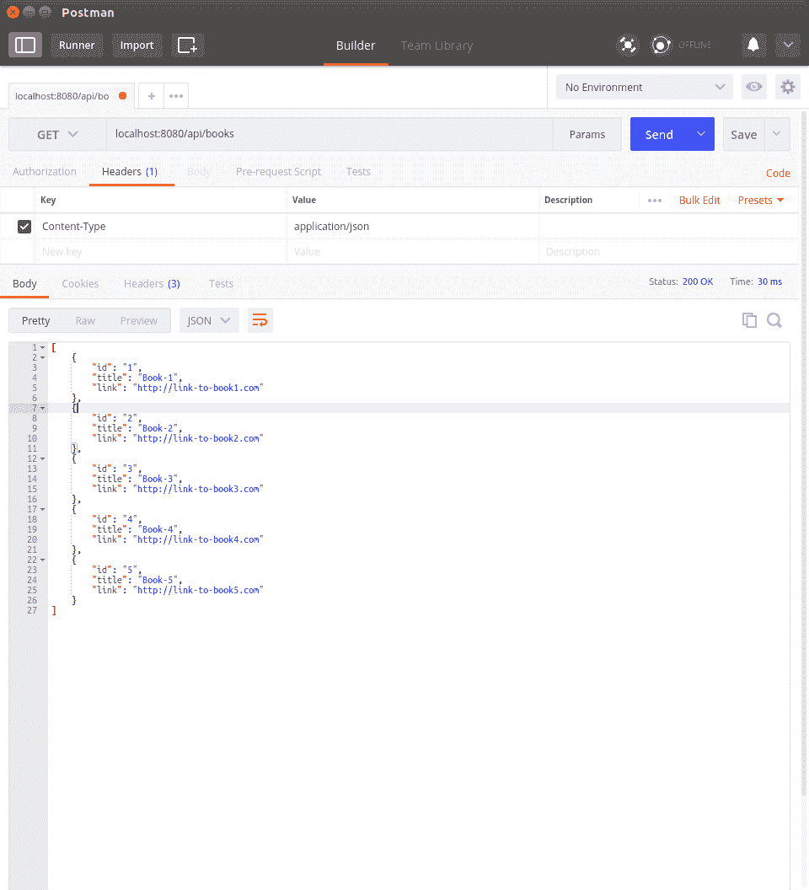
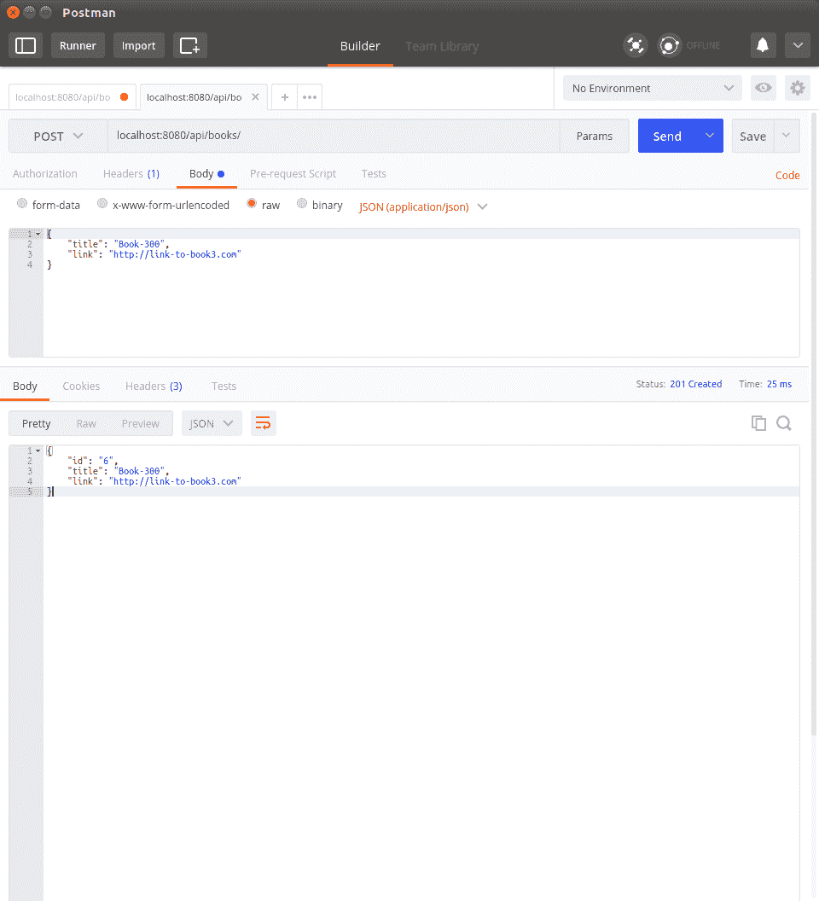

# 第四章：RESTful Web

在之前的章节中，我们看了 Go 语言中最重要的两个组件——goroutines 和 channels。在接下来的章节中，我们将使用 Go 构建一个分布式应用程序，了解如何为互联网或者在我们的情况下是 Web 编写应用程序非常重要。在本章中，我们将介绍使用 REST 网络协议构建 Web 应用程序的一种特定方式。我们还将学习如何与基于 REST 的 Web 应用程序进行交互。我们将按以下方式进行介绍：

+   对 HTTP 和会话的简要介绍

+   构建 REST 服务器的基础知识

+   设计一个简单的 REST 服务器

+   与 REST 服务器交互的工具

## HTTP 和会话

在本节中，我们将简要介绍 HTTP 协议及其随时间的演变。还讨论服务器如何使用 HTTP 会话跟踪用户状态。当我们尝试理解 REST 协议的工作原理时，这些知识将会派上用场。

### HTTP 的简要历史

为了更好地理解 REST 协议的优势，让我们先来了解一下 REST 网络协议出现之前互联网的使用方式。1990 年代的互联网主要用于存储和共享使用**HTTP**（**超文本传输协议**）标记的文档。对于本章来说，HTTP 可以总结如下：

+   HTTP 是一个网络通信协议，以 HTTP 请求开始，以 HTTP 响应结束。

+   早期的 HTTP 响应由纯文本文档组成，但很快 HTML 格式开始流行，因为它允许更多样式化的文档。

+   Web 浏览器带来了互联网的新时代：仅仅显示不同字体权重的文本文档已经不够了。CSS 和 JavaScript 开始出现，使这些文档可以定制化和更加交互。所有这些进步导致了我们现在所说的*web*。

+   可以使用 URL 和 HTTP 方法与 Web 服务器进行交互。有九种 HTTP 方法，但是在本书的目的中，我们只对其中的五种感兴趣：

+   `GET`：在发送简单的 HTTP 请求时使用

+   `POST`：当我们想在发送 HTTP 请求时包含有价值的信息时使用

+   `PUT`，`PATCH`和`DELETE`：从技术上讲，它们与`POST`方法相同，尽管在功能上有所不同

我们将在下一节重新讨论这些 HTTP 方法，并对它们进行更详细的探讨。

### HTTP 会话

HTTP 协议本身是无状态的；也就是说，它不知道谁在访问网页，谁可以向页面发送 POST 请求等等。在这个时期（1990 年代）的大多数 HTTP 服务器中，它们可以被视为文件服务器；也就是说，它们通过互联网提供静态文件。然而，现代的网络体验更加广泛。想象一下访问 Gmail 或 Facebook，网站知道我们是谁，我们看到的是为我们动态生成的定制内容。它们保持我们正在阅读的文章或正在撰写的邮件的“状态”。如果我们关闭浏览器一段时间后返回网站，它可以让我们回到我们离开的地方。鉴于 HTTP 协议和 HTTP 服务器是无状态的，这些网站如何跟踪所有这些内容并将它们链接回正确的用户呢？答案是 HTTP 会话。

当我们从浏览器登录网站时，我们提供凭据来识别自己。服务器回复的响应也包括一个标记，这个标记将在不久的将来用来识别我们。这个标记可以是会话 ID、cookie、认证头等形式。Web 服务器维护这些标记和相应的用户 ID 的表。在我们登录网站后，浏览器总是在每个请求中的头部发送相应的标记给服务器。因此，Web 服务器能够跟踪每个用户并向任何给定的用户显示正确的内容。服务器是如何做到这一点的呢？它在服务器端维护所有的状态信息！

## REST 协议

即使在 20 世纪 90 年代，计算机和互联网技术仍然迅速发展，而 Web 浏览器也在同时不断进化。这意味着 Web 服务器本身可以开始将一些工作转移到 Web 客户端；也就是说，Web 浏览器。慢慢地，这开始引导开发人员尝试不同的软件架构来开发 Web 应用程序。到 2010 年，REST 协议成为设计现代 Web 应用程序的最普遍方式。

**REST**（**表述状态转移协议**）首次由*Roy Fielding*在他的开创性论文中描述，题为*基于网络的软件架构的体系结构风格和设计*（[`www.ics.uci.edu/~fielding/pubs/dissertation/fielding_dissertation.pdf`](https://www.ics.uci.edu/~fielding/pubs/dissertation/fielding_dissertation.pdf)）。这种设计 Web 应用程序的方式有许多优点。它是实用的，CPU 使用效率高，网络负载小，对于不断增加的互联网流量更具扩展性等。以下是使用 REST 软件架构的一些属性和好处。

### 服务器和客户端架构

在*HTTP 会话*部分，我们描述了一个大部分工作都由服务器完成，浏览器负责将用户输入传递给服务器，解析服务器返回的 HTML 文档，并在浏览器中呈现给用户。REST 允许我们将应用程序分成服务器和客户端。服务器（后端）负责执行业务逻辑，客户端（前端）负责将用户交互传递给服务器。这可能听起来并没有太多改变；然而，REST 架构的其余属性将更加明显。

### 标准数据格式

REST 围绕着使用标准数据格式在后端和前端之间通信状态和数据。这导致了后端和前端的解耦。这意味着我们不再局限于只使用 Web 浏览器与服务器通信，这反过来意味着我们的服务器现在能够与 Web 应用程序、命令行应用程序等进行交互。REST 允许我们使用任何类型的数据格式进行通信，尽管 JSON 格式已经成为 REST 协议通信的通用语言。

### 资源

由于我们的前端和后端是分开的，我们需要在两者之间通信状态和数据。在前端，我们需要显示我们提供的服务的所有可用实体。这些实体被称为**资源**。

考虑一个提供 REST 接口（REST API）的服务器，它在我们的个人图书馆中有一本书的列表。在这种情况下，*书籍列表*是资源，我们可以在特定的端点从后端请求关于每本书的信息。对于我们的例子，端点可以是`<URL>/api/books`。`/api`前缀通常在 REST 应用程序中使用，表示我们正在与后端 URL 交互。资源通常可以被认为是数据的集合，就像数据库表的行。

### 重用 HTTP 协议

我们在前一小节*资源*中定义了端点，但是我们如何与它们交互呢？REST 是建立在 HTTP 协议之上的，并且它使用 HTTP 方法或在 REST 的情况下使用动词来与服务器交互。让我们以前面的例子`/api/books`为例，来了解它是如何使用的。

#### GET

REST 使用`GET`动词来检索特定资源类型的项目。鉴于我们有很多项目，可以检索特定资源项目以及检索所有可用的资源项目。通常通过提供项目的 id 来检索特定资源项目。以下显示了用于检索的两种`GET`形式：

+   `/api/books`：返回图书馆中所有书籍的列表

+   `/api/books/<id>`：返回图书馆中特定书籍的信息

#### POST

REST 使用`POST`动词来创建特定资源类型的新项目。资源创建可能需要额外的信息，这些信息在`POST`请求的正文中提供。作为正文的一部分提供的信息必须是 REST 服务器可以处理的数据格式。对`/api/books`进行 POST 表示我们想要向图书馆的书籍列表中添加一本新书。

#### PUT 和 PATCH

这些采用`/api/books/<id>`的形式。这些方法仅适用于已经存在的资源。它们将使用请求的正文更新给定资源的数据或新状态。`PUT`期望提供资源的新状态，包括未更改的字段。`PATCH`可以被认为是`PUT`的更轻松版本，因为我们不需要提供完整的新状态，而只需要更新的字段。

#### DELETE

REST 使用`DELETE`动词来删除特定的资源项目。它采用`/api/resource/<id>`的形式。它根据`<id>`删除特定的资源。REST 支持删除给定资源类型的所有项目，尽管这没有意义，因为现在用户可能会意外删除资源类型的所有项目。出于这个原因和许多其他原因，没有服务器实际实现这个功能。

### 可升级的组件

考虑到我们需要对 UI 进行更改，而这不会影响服务器逻辑的情况。如果网站没有根据客户端和服务器架构进行拆分，我们将不得不升级整个网站，这将是一项非常耗时的任务。由于前端和后端的拆分，我们可以只对所需的系统进行更改和升级。因此，我们可以确保最小的服务中断。

## REST 服务器的基础知识

现在我们了解了 REST 应用程序应该如何行为，让我们来构建一个吧！我们将首先构建一个简单的 Web 服务器，然后通过描述设计决策和 API 定义来设计图书 REST 服务器，最后根据设计构建 REST 服务器。

### 一个简单的 Web 服务器

Go 为我们提供了一个内置的用于构建 Web 服务器的库，`net/http`。对于我们想要在服务器上创建的每个端点，我们必须做两件事：

1.  为端点创建一个处理程序函数，接受两个参数，一个用于写入响应，另一个用于处理传入的请求。

1.  使用`net/http.HandleFunc`注册端点。

以下是一个简单的 Web 服务器，它接受所有传入的请求，将它们记录到控制台，然后返回`Hello, World!`消息。

```go
// helloServer.go 

package main 

import ( 
    "fmt" 
    "log" 
    "net/http" 
) 

func helloWorldHandler(w http.ResponseWriter, r *http.Request) { 
    msg := fmt.Sprintf("Received request [%s] for path: [%s]", r.Method, r.URL.Path) 
    log.Println(msg) 

    response := fmt.Sprintf("Hello, World! at Path: %s", r.URL.Path) 
    fmt.Fprintf(w, response) 
} 

func main() { 
    http.HandleFunc("/", helloWorldHandler) // Catch all Path 

    log.Println("Starting server at port :8080...") 
    http.ListenAndServe(":8080", nil) 
} 
```

在浏览器中请求 URL 时，以下是一些示例请求和响应：

```go
http://localhost:8080/ --> Hello, World! at Path: / 
http://localhost:8080/asdf htt--> Hello, World! at Path: /asdf 
http://localhost:8080/some-path/123 --> Hello, World! at Path: /some-path/123 
```

以下是服务器的输出：

```go
2017/10/03 13:35:46 Starting server at port :8080... 
2017/10/03 13:36:01 Received request [GET] for path: [/] 
2017/10/03 13:37:22 Received request [GET] for path: [/asdf] 
2017/10/03 13:37:40 Received request [GET] for path: [/some-path/123] 
```

请注意，即使我们提供了多个路径，它们都默认为`/`路径。

### 设计 REST API

我们已经了解了 HTTP 背后的历史和 REST 协议的核心概念。我们构建了一个简单的 Web 服务器，以展示构建 REST 服务器所需的一些服务器端代码。现在是时候利用我们迄今为止学到的一切来设计和构建一个 REST 服务器了。

我们将首先定义我们的 REST API 的数据格式，然后创建一个符合我们定义的 REST API 规范的 Web 服务器。

#### 数据格式

在这一部分，我们将描述书籍资源的格式，然后我们将开始定义每个 REST API 交互以及这些交互的预期结果。

##### 书籍资源

以下是书籍资源的基本定义。它是一个 JSON 数组，格式为`"<key>": "<value-type>"`，尽管应用中使用的实际实体将包含真实值：

```go
{ 
    "id": "string", 
    "title": "string", 
    "link": "string" 
} 
```

##### GET /api/books

这个 REST API 调用将检索书籍资源类型的所有项目的列表。在我们的示例中，响应的 JSON 格式包括书籍资源类型的数组。然而，这种返回格式并不是返回项目的唯一方式。另一种但更流行的格式包括一个带有"数据"键的 JSON 对象，其中包含实际结果和服务器可能希望在响应中发送的任何其他键。

现在让我们看一下我们在示例中将使用的简单格式：

```go
// Request 
GET "<URL>/api/books/" 

// Response 
[ 
  { 
     "id": "1", 
     "title": "book1", 
     "link": "http://link-to-book-1.com" 
   }, 
   { 
     "id": "2", 
     "title": "book2", 
     "link": "http://link-to-book-2.com" 
   } 
 ] 
```

##### GET /api/books/<id>

这种`GET`调用将基于提供的`<id>`检索单个书籍资源项目。一般来说，响应的 JSON 对象将是定义的资源类型，尽管服务器可能决定根据服务的逻辑添加或删除某些字段。对于我们的 API，我们将返回我们资源类型中定义的所有字段。

让我们看一个例子，当我们尝试检索 id 为`"1"`的书籍资源时：

```go
// Request 
GET "<URL>/api/books/1" 

// Response 
{ 
   "id": "1", 
   "title": "book1", 
   "link": "http://link-to-book-1.com" 
 } 
```

##### POST /api/books

这个 REST API 调用将创建一个新的书籍资源类型的项目。然而，为了创建一个新的项目，我们需要提供所有必要的数据。可能有不需要任何额外信息的`POST`请求。但在我们的情况下，我们需要发送诸如`title`和`link`之类的信息作为请求的负载。

在这个例子中，我们想要创建一个标题为`"book5"`，链接为`"http://link-to-book5.com"`的书籍项目。请注意，由于我们的服务器已经有两个书籍资源类型的项目，新项目将以`"3"`的 id 创建；这是根据我们服务器的实现。其他 REST 服务器可能会有不同的行为。

```go
// Request 
POST "<URL>/api/books" 

// payload 
{ 
   "title": "book5", 
   "link": "http://link-to-book-5.com" 
 } 

 // response 
 { 
    "id": "3", 
    "title": "book5", 
    "link": "http://link-to-book-5.com" 
  } 
```

##### PUT /api/books/<id>

我们将在我们的 REST API 中使用`PUT`来更新特定的资源类型。我们的 API 中定义的`PUT`对接受不完整数据的负载非常严格，也就是说，它将拒绝不完整的负载。

在这个例子中，我们将修改新创建的书籍`"3"`，并将其链接更改为指向`"http://link-to-book-15.com"`：

```go
// Request 
PUT "<URL>/api/books/3" 

// payload 
{ 
   "title": "book5", 
   "link": "http://link-to-book-15.com" 
 } 

 // response 
 { 
    "id": "3", 
    "title": "book5", 
    "link": "http://link-to-book-15.com" 
  }
```

##### DELETE /api/books/<id>

这是用于删除特定书籍资源的 REST API 调用。这种请求不需要主体，只需要书籍 id 作为 URL 的一部分，如下一个例子所示。

在这个例子中，我们将删除书籍`2`。请注意，我们不会在响应中返回任何内容；其他 REST 服务器可能会返回已删除的项目：

```go
  // Request 
  DELETE "<URL>/api/books/2" 

  // Response 
  [] 
```

##### 不成功的请求

我们可能会发送构造不良的请求、对不可用实体的请求或不完整的负载。对于所有这些情况，我们将发送相关的 HTTP 错误代码。根据服务器的实现，可能会返回单个错误代码。一些服务器返回标准的错误代码"404"，以增加安全性，不让恶意用户尝试查找他们不拥有的资源类型的项目。

#### 设计决策

我们已经定义了我们的 REST API，接下来我们想要实现服务器。在编写任何代码之前，制定我们希望服务器实现的目标非常重要。以下是服务器的一些规格：

+   我们需要提取`<id>`用于`PUT`、`DELETE`和单个资源`GET`请求。

+   我们希望记录每个传入的请求，类似于`helloWorldHandler`。

+   复制这么多的工作是繁琐的，也是不好的编码实践。我们可以利用闭包和函数文字来为我们创建新的函数，这些函数将合并前两点的任务。

+   为了保持示例简单，我们将使用`map[string]bookResource`来存储所有书籍资源的状态。所有操作将在此映射上进行。在现实世界的服务器中，我们通常会使用数据库来存储这些资源。

+   Go 服务器可以处理并发请求，这意味着我们应该确保书籍资源的映射免受竞争条件的影响。

让我们看看基于我们设计的代码可能是什么样子。

#### 书籍 API 的 REST 服务器

我们将程序分为以下部分：

```go
$ tree 
. 
├── books-handler 
│ ├── actions.go 
│ ├── common.go 
│ └── handler.go 
└── main.go 

1 directory, 5 files 
```

现在让我们看看每个文件的源代码。

##### 主要.go

`main.go`源文件主要负责组装和运行 Web 服务器的代码。实际响应 HTTP 请求的逻辑分布在其他文件中：

```go
// restServer/main.go 

package main 

import ( 
    "fmt" 
    "log" 
    "net/http" 

    booksHandler "github.com/last-ent/distributed-go/chapter4/books-handler" 
) 

func main() { 
    // Get state (map) for books available on REST server. 
    books := booksHandler.GetBooks() 
    log.Println(fmt.Sprintf("%+v", books)) 

    actionCh := make(chan booksHandler.Action) 

    // Start goroutine responsible for handling interaction with the books map 
    go booksHandler.StartBooksManager(books, actionCh) 

    http.HandleFunc("/api/books/", booksHandler.MakeHandler(booksHandler.BookHandler, "/api/books/", actionCh)) 

    log.Println("Starting server at port 8080...") 
    http.ListenAndServe(":8080", nil) 
} 
```

##### books-handler/common.go

此源文件中的代码是通用逻辑，可能会在多个请求之间共享：

通常，最好的做法是识别与特定处理程序无关的逻辑，然后将其移入`common.go`或类似的源文件，这样可以更容易找到它们并减少重复的代码。

```go
// restServer/books-handler/common.go 

package booksHandler 

import ( 
    "encoding/json" 
    "fmt" 
    "log" 
    "net/http" 
) 

// bookResource is used to hold all data needed to represent a Book resource in the books map. 
type bookResource struct { 
    Id    string 'json:"id"' 
    Title string 'json:"title"' 
    Link  string 'json:"link"' 
} 

// requestPayload is used to parse request's Payload. We ignore Id field for simplicity. 
type requestPayload struct { 
    Title string 'json:"title"' 
    Link  string 'json:"link"' 
} 

// response struct consists of all the information required to create the correct HTTP response. 
type response struct { 
    StatusCode int 
    Books      []bookResource 
} 

// Action struct is used to send data to the goroutine managing the state (map) of books. 
// RetChan allows us to send data back to the Handler function so that we can complete the HTTP request. 
type Action struct { 
    Id      string 
    Type    string 
    Payload requestPayload 
    RetChan chan<- response 
} 

// GetBooks is used to get the initial state of books represented by a map. 
func GetBooks() map[string]bookResource { 
    books := map[string]bookResource{} 
    for i := 1; i < 6; i++ { 
        id := fmt.Sprintf("%d", i) 
        books[id] = bookResource{ 
            Id:    id, 
            Title: fmt.Sprintf("Book-%s", id), 
            Link:  fmt.Sprintf("http://link-to-book%s.com", id), 
        } 
    } 
    return books 
} 

// MakeHandler shows a common pattern used reduce duplicated code. 
func MakeHandler(fn func(http.ResponseWriter, *http.Request, string, string, chan<- Action), 
    endpoint string, actionCh chan<- Action) http.HandlerFunc { 

    return func(w http.ResponseWriter, r *http.Request) { 
        path := r.URL.Path 
        method := r.Method 

        msg := fmt.Sprintf("Received request [%s] for path: [%s]", method, path) 
        log.Println(msg) 

        id := path[len(endpoint):] 
        log.Println("ID is ", id) 
        fn(w, r, id, method, actionCh) 
    } 
} 

// writeResponse uses the pattern similar to MakeHandler. 
func writeResponse(w http.ResponseWriter, resp response) { 
    var err error 
    var serializedPayload []byte 

    if len(resp.Books) == 1 { 
        serializedPayload, err = json.Marshal(resp.Books[0]) 
    } else { 
        serializedPayload, err = json.Marshal(resp.Books) 
    } 

    if err != nil { 
        writeError(w, http.StatusInternalServerError) 
        fmt.Println("Error while serializing payload: ", err) 
    } else { 
        w.Header().Set("Content-Type", "application/json") 
        w.WriteHeader(resp.StatusCode) 
        w.Write(serializedPayload) 
    } 
} 

// writeError allows us to return error message in JSON format. 
func writeError(w http.ResponseWriter, statusCode int) { 
    jsonMsg := struct { 
        Msg  string 'json:"msg"' 
        Code int    'json:"code"' 
    }{ 
        Code: statusCode, 
        Msg:  http.StatusText(statusCode), 
    } 

    if serializedPayload, err := json.Marshal(jsonMsg); err != nil { 
        http.Error(w, http.StatusText(http.StatusInternalServerError), http.StatusInternalServerError) 
        fmt.Println("Error while serializing payload: ", err) 
    } else { 
        w.Header().Set("Content-Type", "application/json") 
        w.WriteHeader(statusCode) 
        w.Write(serializedPayload) 
    } 
} 
```

##### books-handler/actions.go

此源文件包含处理每个 HTTP 请求方法调用的函数：

```go
// restServer/books-handler/actions.go 

package booksHandler 

import ( 
    "net/http" 
) 

// actOn{GET, POST, DELETE, PUT} functions return Response based on specific Request type. 

func actOnGET(books map[string]bookResource, act Action) { 
    // These initialized values cover the case: 
    // Request asked for an id that doesn't exist. 
    status := http.StatusNotFound 
    bookResult := []bookResource{} 

    if act.Id == "" { 

        // Request asked for all books. 
        status = http.StatusOK 
        for _, book := range books { 
            bookResult = append(bookResult, book) 
        } 
    } else if book, exists := books[act.Id]; exists { 

        // Request asked for a specific book and the id exists. 
        status = http.StatusOK 
        bookResult = []bookResource{book} 
    } 

    act.RetChan <- response{ 
        StatusCode: status, 
        Books:      bookResult, 
    } 
} 

func actOnDELETE(books map[string]bookResource, act Action) { 
    book, exists := books[act.Id] 
    delete(books, act.Id) 

    if !exists { 
        book = bookResource{} 
    } 

    // Return the deleted book if it exists else return an empty book. 
    act.RetChan <- response{ 
        StatusCode: http.StatusOK, 
        Books:      []bookResource{book}, 
    } 
} 

func actOnPUT(books map[string]bookResource, act Action) { 
    // These initialized values cover the case: 
    // Request asked for an id that doesn't exist. 
    status := http.StatusNotFound 
    bookResult := []bookResource{} 

    // If the id exists, update its values with the values from the payload. 
    if book, exists := books[act.Id]; exists { 
        book.Link = act.Payload.Link 
        book.Title = act.Payload.Title 
        books[act.Id] = book 

        status = http.StatusOK 
        bookResult = []bookResource{books[act.Id]} 
    } 

    // Return status and updated resource. 
    act.RetChan <- response{ 
        StatusCode: status, 
        Books:      bookResult, 
    } 

} 

func actOnPOST(books map[string]bookResource, act Action, newID string) { 
     // Add the new book to 'books'. 
     books[newID] = bookResource{ 
         Id:    newID, 
         Link:  act.Payload.Link, 
         Title: act.Payload.Title, 
    } 

    act.RetChan <- response{ 
        StatusCode: http.StatusCreated, 
        Books:      []bookResource{books[newID]}, 
    } 
} 
```

##### books-handler/handler.go

`handler.go`源文件包含处理和处理书籍请求所需的所有逻辑。请注意，除了包含处理 HTTP 请求的逻辑外，它还处理了服务器上书籍状态的维护：

```go
// restServer/books-handler/handler.go 

package booksHandler 

import ( 
    "encoding/json" 
    "fmt" 
    "io/ioutil" 
    "log" 
    "net/http" 
) 

// StartBooksManager starts a goroutine that changes the state of books (map). 
// Primary reason to use a goroutine instead of directly manipulating the books map is to ensure 
// that we do not have multiple requests changing books' state simultaneously. 
func StartBooksManager(books map[string]bookResource, actionCh <-chan Action) { 
    newID := len(books) 
    for { 
        select { 
        case act := <-actionCh: 
            switch act.Type { 
            case "GET": 
                actOnGET(books, act) 
            case "POST": 
                newID++ 
                newBookID := fmt.Sprintf("%d", newID) 
                actOnPOST(books, act, newBookID) 
            case "PUT": 
                actOnPUT(books, act) 
            case "DELETE": 
                actOnDELETE(books, act) 
            } 
        }  
    } 
} 

/* BookHandler is responsible for ensuring that we process only the valid HTTP Requests. 

 * GET -> id: Any 

 * POST -> id: No 
 *      -> payload: Required 

 * PUT -> id: Any 
 *     -> payload: Required 

 * DELETE -> id: Any 
*/ 
func BookHandler(w http.ResponseWriter, r *http.Request, id string, method string, actionCh chan<- Action) { 

     // Ensure that id is set only for valid requests 
     isGet := method == "GET"
     idIsSetForPost := method == "POST" && id != ""
     isPutOrPost := method == "PUT" || method == "POST"
     idIsSetForDelPut := (method == "DELETE" || method == "PUT") && id != ""
     if !isGet && !(idIsSetForPost || idIsSetForDelPut || isPutOrPost) {
         writeError(w, http.StatusMethodNotAllowed) 
         return 
     } 

     respCh := make(chan response) 
     act := Action{ 
         Id:      id, 
         Type:    method, 
         RetChan: respCh, 
     } 

     // PUT & POST require a properly formed JSON payload 
     if isPutOrPost { 
         var reqPayload requestPayload 
         body, _ := ioutil.ReadAll(r.Body) 
         defer r.Body.Close() 

         if err := json.Unmarshal(body, &reqPayload); err != nil { 
             writeError(w, http.StatusBadRequest) 
             return 
         } 

         act.Payload = reqPayload 
     } 

     // We have all the data required to process the Request. 
     // Time to update the state of books. 
     actionCh <- act 

     // Wait for respCh to return data after updating the state of books. 
     // For all successful Actions, the HTTP status code will either be 200 or 201\. 
     // Any other status code means that there was an issue with the request. 
     var resp response 
     if resp = <-respCh; resp.StatusCode > http.StatusCreated { 
         writeError(w, resp.StatusCode) 
         return 
     } 

     // We should only log the delete resource and not send it back to user 
     if method == "DELETE" { 
         log.Println(fmt.Sprintf("Resource ID %s deleted: %+v", id, resp.Books)) 
         resp = response{ 
             StatusCode: http.StatusOK, 
             Books:      []bookResource{}, 
         } 
     } 

     writeResponse(w, resp) 
 } 
```

尽管我们已经从头开始创建了一个 REST 服务器，但这并不是一个完整的 REST 服务器。为了使编写 REST 服务器成为可能，许多重要细节已被省略。但实际上，我们应该使用现有的库之一来帮助我们构建一个合适的 REST 服务器。

到目前为止一切顺利，但根据我们迄今为止看到的代码，我们如何与 REST 服务器以及基于该代码的服务器进行交互？让我们在下一节中看看这个问题。

## 如何进行 REST 调用

到目前为止，我们已经使用 Web 浏览器进行了 HTTP 请求。这适用于普通的 HTTP 服务器或对 REST 服务器进行简单的`GET`请求。但是，浏览器将无法代表我们进行其他类型的 REST 调用。

大多数 Web 应用程序使用 JavaScript、Ajax 和其他前端技术与 REST 服务器进行交互。但是，我们不必创建一个完整的 Web 前端来与 REST 服务器进行交互；我们可以利用一些工具，还可以编写程序来代替我们进行 REST 调用。

### cURL

cURL 是一个免费的命令行工具，用于在计算机网络上进行交互。它可以用于多种协议的通信，包括 HTTP、HTTPS、FTP、SCP 等。让我们对在前一节中创建的服务器进行 REST 调用。为了提高可读性，我们可以使用`jq`库。 

#### GET

现在让我们看看使用 cURL 命令进行 HTTP 请求。根据服务器的状态，进行`GET`请求可能会有不同的输出：

```go
$ # List all books on server 
$ # Note that we use '-L' flag while using cURL. 
$ # This takes care of any http redirections that might be required. 
$ curl -L localhost:8080/api/books | jq # GET CALL 
 % Total % Received % Xferd Average Speed Time Time Time Current 
 Dload Upload Total Spent Left Speed 
100 46 100 46 0 0 9721 0 --:--:-- --:--:-- --:--:-- 11500 
100 311 100 311 0 0 59589 0 --:--:-- --:--:-- --:--:-- 59589 
[ 
 { 
 "id": "3", 
 "title": "Book-3", 
 "link": "http://link-to-book3.com" 
 }, 
 { 
 "id": "4", 
 "title": "Book-4", 
 "link": "http://link-to-book4.com" 
 }, 
 { 
 "id": "5", 
 "title": "Book-5", 
 "link": "http://link-to-book5.com" 
 }, 
 { 
 "id": "1", 
 "title": "Book-1", 
 "link": "http://link-to-book1.com" 
 }, 
 { 
 "id": "2", 
 "title": "Book-2", 
 "link": "http://link-to-book2.com" 
 } 
] 

$ curl localhost:8080/api/books/3 | jq # GET a single resource. 
 % Total % Received % Xferd Average Speed Time Time Time Current 
 Dload Upload Total Spent Left Speed 
100 61 100 61 0 0 13255 0 --:--:-- --:--:-- --:--:-- 15250 
{ 
 "id": "3", 
 "title": "Book-3", 
 "link": "http://link-to-book3.com" 
} 
```

#### DELETE

假设我们有一个 id 为`"2"`的书籍，我们可以使用 cURL 进行删除，如下所示：

```go
$ # We can make other method calls by providing -X flag with method name in caps. 
$ curl -LX DELETE localhost:8080/api/books/2 | jq # DELETE a resource. 
 % Total % Received % Xferd Average Speed Time Time Time Current 
 Dload Upload Total Spent Left Speed 
100 2 100 2 0 0 337 0 --:--:-- --:--:-- --:--:-- 400 
[] 
$ curl -L localhost:8080/api/books | jq # GET all books after resource deletion. 
 % Total % Received % Xferd Average Speed Time Time Time Current 
 Dload Upload Total Spent Left Speed 
100 46 100 46 0 0 21465 0 --:--:-- --:--:-- --:--:-- 46000 
100 249 100 249 0 0 91008 0 --:--:-- --:--:-- --:--:-- 91008 
[ 
 { 
 "id": "5", 
 "title": "Book-5", 
 "link": "http://link-to-book5.com" 
 }, 
 { 
 "id": "1", 
 "title": "Book-1", 
 "link": "http://link-to-book1.com" 
 }, 
 { 
 "id": "3", 
 "title": "Book-3", 
 "link": "http://link-to-book3.com" 
 }, 
 { 
 "id": "4", 
 "title": "Book-4", 
 "link": "http://link-to-book4.com" 
 } 
] 
```

#### PUT

让我们更新具有 id 为`"4"`的现有书籍资源：

```go
$ # We can use -d flag to provide payload in a Request 
$ curl -H "Content-Type: application/json" -LX PUT -d '{"title": "New Book Title", "link": "New Link"}' localhost:8080/api/books/4 | jq 
 % Total % Received % Xferd Average Speed Time Time Time Current 
 Dload Upload Total Spent Left Speed 
100 100 100 53 100 47 13289 11785 --:--:-- --:--:-- --:--:-- 17666 
{ 
 "id": "4", 
 "title": "New Book Title", 
 "link": "New Link" 
} 
$ curl -L localhost:8080/api/books | jq # GET all books after updating a resource 
 % Total % Received % Xferd Average Speed Time Time Time Current 
 Dload Upload Total Spent Left Speed 
100 46 100 46 0 0 9886 0 --:--:-- --:--:-- --:--:-- 11500 
100 241 100 241 0 0 47024 0 --:--:-- --:--:-- --:--:-- 47024 
[ 
 { 
 "id": "1", 
 "title": "Book-1", 
 "link": "http://link-to-book1.com" 
 }, 
 { 
 "id": "3", 
 "title": "Book-3", 
 "link": "http://link-to-book3.com" 
 }, 
 { 
 "id": "4", 
 "title": "New Book Title", 
 "link": "New Link" 
 }, 
 { 
 "id": "5", 
 "title": "Book-5", 
 "link": "http://link-to-book5.com" 
 } 
] 
```

#### POST

现在我们知道如何使用 cURL 向服务器发送有效负载，让我们创建一个新的书籍资源项：

```go
$ curl -H "Content-Type: application/json" -LX POST -d '{"title":"Ultra New Book", "link": "Ultra New Link"}' localhost:8080/api/books/ | jq # POST ie., create a new resource. 
 % Total % Received % Xferd Average Speed Time Time Time Current 
 Dload Upload Total Spent Left Speed 
100 111 100 59 100 52 99k 89655 --:--:-- --:--:-- --:--:-- 59000 
{ 
 "id": "6", 
 "title": "Ultra New Book", 
 "link": "Ultra New Link" 
} 
 % Total % Received % Xferd Average Speed Time Time Time Current 
 Dload Upload Total Spent Left Speed 
100 46 100 46 0 0 8234 0 --:--:-- --:--:-- --:--:-- 9200 
100 301 100 301 0 0 46414 0 --:--:-- --:--:-- --:--:-- 46414 
[ 
 { 
 "id": "4", 
 "title": "New Book Title", 
 "link": "New Link" 
 }, 
 { 
 "id": "5", 
 "title": "Book-5", 
 "link": "http://link-to-book5.com" 
 }, 
 { 
 "id": "1", 
 "title": "Book-1", 
 "link": "http://link-to-book1.com" 
 }, 
 { 
 "id": "6", 
 "title": "Ultra New Book", 
 "link": "Ultra New Link" 
 }, 
 { 
 "id": "3", 
 "title": "Book-3", 
 "link": "http://link-to-book3.com" 
 } 
] 
```

以下是快速参考命令：

+   `curl -L localhost:8080/api/books | jq # GET CALL`

+   `curl localhost:8080/api/books/3 | jq # 获取单个资源。`

+   `curl -LX DELETE localhost:8080/api/books/2 | jq # 删除一个资源。`

+   `curl -H "Content-Type: application/json" -LX PUT -d '{"title": "New Book Title", "link": "New Link"}' localhost:8080/api/books/4 | jq`

+   `curl -H "Content-Type: application/json" -LX POST -d '{"title":"Ultra New Book", "link": "Ultra New Link"}' localhost:8080/api/books/ | jq # POST 即创建一个新资源。`

以下是服务器的控制台输出：

```go
$ go run main.go 
2017/10/09 21:07:50 map[5:{Id:5 Title:Book-5 Link:http://link-to-book5.com} 1:{Id:1 Title:Book-1 Link:http://link-to-book1.com} 2:{Id:2 Title:Book-2 Link:http://link-to-book2.com} 3:{Id:3 Title:Book-3 Link:http://link-to-book3.com} 4:{Id:4 Title:Book-4 Link:http://link-to-book4.com}] 
2017/10/09 21:07:50 Starting server at port 8080... 
2017/10/09 21:07:56 Received request [GET] for path: [/api/books/] 
2017/10/09 21:07:56 ID is 
2017/10/09 21:09:18 Received request [GET] for path: [/api/books/3] 
2017/10/09 21:09:18 ID is 3 
2017/10/09 21:11:38 Received request [DELETE] for path: [/api/books/2] 
2017/10/09 21:11:38 ID is 2 
2017/10/09 21:11:38 Resource ID 2 deleted: [{Id:2 Title:Book-2 Link:http://link-to-book2.com}] 
2017/10/09 21:12:16 Received request [GET] for path: [/api/books/] 
2017/10/09 21:12:16 ID is 
2017/10/09 21:15:22 Received request [PUT] for path: [/api/books/4] 
2017/10/09 21:15:22 ID is 4 
2017/10/09 21:16:01 Received request [GET] for path: [/api/books/] 
2017/10/09 21:16:01 ID is 
2017/10/09 21:17:07 Received request [POST] for path: [/api/books/] 
2017/10/09 21:17:07 ID is 
2017/10/09 21:17:36 Received request [GET] for path: [/api/books/] 
2017/10/09 21:17:36 ID is 
```

需要牢记的一点是，即使我们使用重定向标志`-L`，对于 POST 请求，请求体也不会被发送。我们需要确保将其发送到最终解析的端点。

这应该给我们一个如何使用 REST 客户端的基本概念。

### Postman

现在让我们看一个可以用来进行 REST 调用的基于 GUI 的工具**Postman**([`www.getpostman.com/`](https://www.getpostman.com/))。为了简洁起见，我们将看一个`GET`和一个`POST`调用。

以下屏幕截图说明了如何使用 Postman 进行`GET`请求。请注意，Postman 允许我们以易于阅读的格式查看返回的 JSON：



GET /api/books

以下屏幕截图显示了如何进行`POST`请求。请注意，我们可以很容易地提供一个 JSON 有效负载：



POST /api/books

希望前面的部分和这些屏幕截图足以让我们了解如何使用 Postman。

### net/http

让我们看看如何从 Go 程序中以编程方式发送`GET`和`POST`：

```go
package main 

import ( 
    "bytes" 
    "encoding/json" 
    "fmt" 
    "io/ioutil" 
    "net/http" 
) 

type bookResource struct { 
    Id    string 'json:"id"' 
    Title string 'json:"title"' 
    Link  string 'json:"link"' 
} 

func main() { 
    // GET 
    fmt.Println("Making GET call.") 
    // It is possible that we might have error while making an HTTP request 
    // due to too many redirects or HTTP protocol error. We should check for this eventuality. 
    resp, err := http.Get("http://localhost:8080/api/books")
    if err != nil {
        fmt.Println("Error while making GET call.", err) 
        return 
    } 

    fmt.Printf("%+v\n\n", resp)

    // The response body is a data stream from the server we got the response back from. 
    // This data stream is not in a useable format yet. 
    // We need to read it from the server and convert it into a byte stream. 
    body, _ := ioutil.ReadAll(resp.Body) 
    defer resp.Body.Close() 

    var books []bookResource 
    json.Unmarshal(body, &books) 

    fmt.Println(books) 
    fmt.Println("\n") 

    // POST 
    payload, _ := json.Marshal(bookResource{ 
        Title: "New Book", 
        Link:  "http://new-book.com", 
    }) 

    fmt.Println("Making POST call.") 
    resp, err = http.Post( 
        "http://localhost:8080/api/books/", 
        "application/json", 
        bytes.NewBuffer(payload), 
    ) 
    if err != nil { 
        fmt.Println(err) 
    } 

    fmt.Printf("%+v\n\n", resp)

    body, _ = ioutil.ReadAll(resp.Body) 
    defer resp.Body.Close() 

    var book bookResource 
    json.Unmarshal(body, &book) 

    fmt.Println(book) 

    fmt.Println("\n") 
} 
```

以下是运行程序时的控制台输出：

```go
$ go run main.go 

Making GET call. 
&{Status:200 OK StatusCode:200 Proto:HTTP/1.1 ProtoMajor:1 ProtoMinor:1 Header:map[Content-Type:[application/json] Date:[Mon, 09 Oct 2017 20:07:43 GMT] Content-Length:[488]] Body:0xc4200f0040 ContentLength:488 TransferEncoding:[] Close:false Uncompressed:false Trailer:map[] Request:0xc42000a900 TLS:<nil>} 

[{2 Book-2 http://link-to-book2.com} {3 Book-3 http://link-to-book3.com} {4 Book-4 http://link-to-book4.com} {5 Book-5 http://link-to-book5.com} {6 New Book http://new-book.com} {7 New Book http://new-book.com} {8 New Book http://new-book.com} {1 Book-1 http://link-to-book1.com}] 

Making POST call. 
&{Status:201 Created StatusCode:201 Proto:HTTP/1.1 ProtoMajor:1 ProtoMinor:1 Header:map[Content-Type:[application/json] Date:[Mon, 09 Oct 2017 20:07:43 GMT] Content-Length:[58]] Body:0xc4200f0140 ContentLength:58 TransferEncoding:[] Close:false Uncompressed:false Trailer:map[] Request:0xc4200fc100 TLS:<nil>} 

{9 New Book http://new-book.com} 
```

有关`net/http`库的更多详细信息可以在[`golang.org/pkg/net/http/`](https://golang.org/pkg/net/http/)找到。

## 总结

在本章中，我们讨论了 HTTP 和会话的简要历史。接下来，我们看了 REST 协议旨在解决的问题以及它们是如何引起关注的。然后，我们深入了解了 REST 协议是什么，如何设计基于它的应用程序，如何基于我们的设计构建 REST 服务器，最后我们看了使用 cURL、Postman 和 Go 程序与 REST 服务器交互的不同方式。您可以自由选择与 REST 服务器交互的方式。但是，在本书的其余部分，我们将看到使用 cURL 与 REST 服务器交互。

现在我们已经讨论了开发分布式和面向 Web 的应用程序所必需的所有重要主题。在下一章，第五章，*介绍 Goophr*，我们可以开始讨论分布式文档索引器在概念层面上是什么，以及如何设计它，规划数据通信等等。
