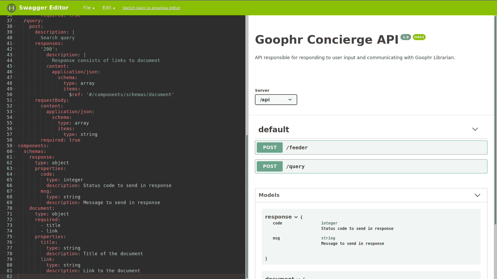
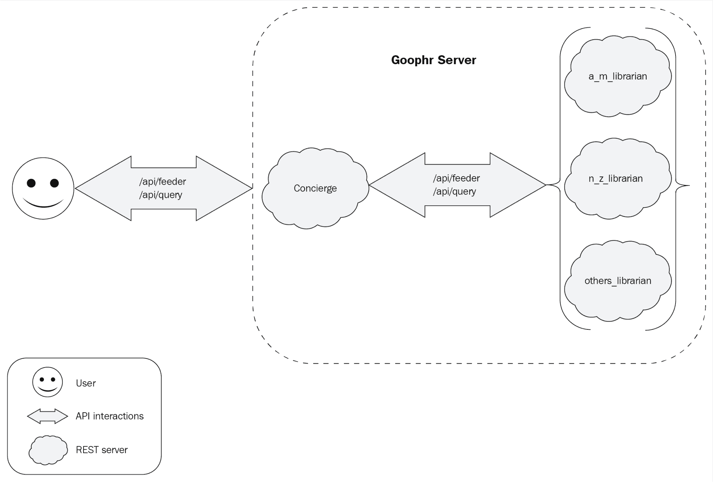

# 第五章：介绍 Goophr

既然我们已经对 goroutines、通道、REST 和一些用于开发 Go 应用程序的工具有了扎实的了解，让我们利用这些知识来构建一个分布式 Web 应用程序。这个应用程序的目的将是索引和搜索文档。在本章中，我们将阐述这样一个应用程序的设计结构，并且我们还将看一下我们将在项目中使用的一些剩余主题和工具。

本章可以大致分为两个部分：

+   设计概述

+   项目结构

## Goophr 是什么？

我们将构建一个应用程序来索引和搜索文档。这是我们每次使用 Google、Bing 或 DuckDuckGo 等搜索门户之一访问互联网时使用的功能。这也是一些网站借助搜索引擎提供的功能。

在接下来的几章中，我们将构建一个搜索引擎应用程序，从现有技术（如 Google、Solr 搜索引擎和 goroutines）中汲取灵感。我们的应用程序名称是对这三种技术的一种玩耍。

想象一下在任何搜索门户上搜索短语；在提交查询后，我们会得到一个包含来自我们搜索短语的术语的文本摘录的链接列表。很多时候，前几个链接往往是我们正在寻找的相关网页或文档。如何可能获得最相关文档的列表？Google 或其他搜索引擎实现这一点的方式非常复杂；他们有一个大型的计算机科学家团队不断调整搜索引擎。

我们不打算构建任何复杂的东西。通过拥有一个谦逊而实用的目标，我们可以创建一个最小但可用的搜索引擎。不过，首先让我们定义应用程序的目的和标准。

## 设计概述

既然我们已经简要描述了我们想要构建的应用程序以及构建它的原因，让我们来看看我们想要作为搜索引擎实现的功能列表：

+   它应该接受在 POST 请求中提供的文档链接并下载它们

+   它应该处理和索引下载的文档

+   它应该处理搜索查询，并以包含搜索词的摘录的文档列表作出响应

+   返回的文档列表应按文档中搜索词的出现次数较多的顺序排列

虽然我们列出了四个功能，但我们可以将应用程序分为两个主要组件：

+   **Goophr 礼宾员**：这是负责索引并返回搜索查询的文档列表的组件

+   **Goophr 图书管理员**：这是负责处理用户交互并与第一个组件交互的组件

这两个组件将作为两个 REST 服务器运行，并且所有交互都将遵循 REST 协议。因此，让我们为我们的组件定义 API 定义！在第四章中，*RESTful Web*，您注意到我们用来定义通过 REST 协议进行通信的各种 API 端点和数据定义的方法非常冗长和繁琐。如果我们有一种正式的方法来编写 API 定义，那不是更好吗？好消息是，随着 REST 协议的普及，有许多解决方案，其中一个解决方案是最广泛使用的行业标准——OpenAPI 格式。

## OpenAPI 规范

OpenAPI 让我们以标准化的方式定义 RESTful API，并且可以在不受任何特定编程语言或框架的约束下进行定义。这为我们提供了一个强大的抽象，可以定义一个 API，该 API 的初始实现可以是 Java 或 Python 中的 RESTful 服务器；同时，我们也可以将代码库移植到 Go 中，服务的行为几乎不需要或只需要进行很少的更改。

让我们列出 OpenAPI 规范的一般结构，并使用它来重新定义第四章中描述的`Books API`，*RESTful Web*。

如果我们看一下`Books API`标题，我们可以定义以下元素来描述 API：

+   我们服务器的 URL

+   关于 API 意图的基本信息

+   我们 API 中可用的路径

+   API 中每个路径可用的方法

+   请求和响应的可能描述和示例有效载荷

+   请求和响应有效载荷的模式

考虑到这些要点，让我们来看看`Books API`的 OpenAPI 规范：

```go
# openapi/books.yaml

openapi: 3.0.0
servers: 
  - url: /api 
info: 
  title: Books API 
  version: '1.0' 
  description: ; 
    API responsible for adding, reading and updating list of books. 
paths: 
  /books: 
    get: 
      description: | 
        Get list of all books 
      responses: 
        '200': 
          description: | 
            Request successfully returned list of all books 
          content: 
            application/json: 
              schema: 
                $ref: '#/components/schemas/response' 
  /books/{id}: 
    get: 
      description: | 
        Get a particular books with ID 'id' 
      responses: 
        '200': 
          description: | 
            Request was successfully completed. 
          content: 
            application/json: 
              schema: 
                $ref: '#/components/schemas/document' 
      parameters: 
        - in: query 
          name: id 
          schema: 
            type: integer 
          description: Book ID of the book to get. 
    post: 
      description: | 
        Get a particular books with ID 'id' 
      responses: 
        '200': 
          description: | 
            Request was successfully completed. 
          content: 
            application/json: 
              schema: 
                $ref: '#/components/schemas/payload' 
      requestBody: 
        content: 
          application/json: 
            schema: 
                $ref: '#/components/schemas/document' 
    put: 
      description: | 
        Update the data of a Book with ID 'id' with the payload sent in the request body. 
      responses: 
        '200': 
          description: | 
            Request was successfully completed. 
          content: 
            application/json: 
              schema: 
                $ref: '#/components/schemas/payload' 
      requestBody: 
        content: 
          application/json: 
            schema: 
                $ref: '#/components/schemas/document' 
    delete: 
      description: | 
        Get a particular books with ID 'id' 
      responses: 
        '200': 
          description: | 
            Request was successfully completed. 
      parameters: 
        - in: query 
          name: id 
          schema: 
            type: integer 
          description: Book ID of the book to get. 
components: 
  schemas: 
    response: 
      type: array 
      items: 
        $ref: '#/components/schemas/document' 

    document: 
      type: object 
      required: 
        - title 
        - link 
      properties: 
        id: 
          type: integer 
          description: Book ID 
        title: 
          type: string 
          description: Title of the book 
        link:  
          type: string 
          description: Link to the book 

    payload: 
      type: object 
      required: 
        - title 
        - link 
      properties: 
        title: 
          type: string 
          description: Title of the book 
        link:  
          type: string 
          description: Link to the book 
```

### Goophr Concierge API 定义

Goophr Concierge 是面向用户的组件，它有两个责任——索引新文档和返回查询结果。非正式地，我们可以定义 API 如下：

+   `/api/feeder`：这是用户上传文档的 API 端点

+   如果有效载荷完整且正确，POST 请求将添加新文档

+   `/api/query`：用户搜索针对此 API 端点查询的短语或术语

+   POST 请求包含带有搜索术语的有效载荷，并将返回文档列表

这个简单的 API 描述是为了我们的理解。现在让我们看看如何使用 OpenAPI 规范来制定它：

```go
# openapi/concierge.yaml

openapi: 3.0.0

servers: 
  - url: /api 
info: 
  title: Goophr Concierge API 
  version: '1.0' 
  description: > 
    API responsible for responding to user input and communicating with Goophr 
    Librarian. 
paths: 
  /feeder: 
    post: 
      description: | 
        Register new document to be indexed. 
      responses: 
        '200': 
          description: | 
            Request was successfully completed. 
          content: 
            application/json: 
              schema: 
                $ref: '#/components/schemas/response' 
        '400': 
          description: > 
            Request was not processed because payload was incomplete or 
            incorrect. 
          content: 
            application/json: 
              schema: 
                $ref: '#/components/schemas/response' 
      requestBody: 
        content: 
          application/json: 
            schema: 
              $ref: '#/components/schemas/document' 
        required: true 
  /query: 
    post: 
      description: | 
        Search query 
      responses: 
        '200': 
          description: | 
            Response consists of links to document 
          content: 
            application/json: 
              schema: 
                type: array 
                items: 
                  $ref: '#/components/schemas/document' 
      requestBody: 
        content: 
          application/json: 
            schema: 
              type: array 
              items: 
                type: string 
        required: true 
components: 
  schemas: 
    response: 
      type: object 
      properties: 
        code: 
          type: integer 
          description: Status code to send in response 
        msg: 
          type: string 
          description: Message to send in response 
    document: 
      type: object 
      required: 
        - title 
        - link 
      properties: 
        title: 
          type: string 
          description: Title of the document 
        link: 
          type: string 
          description: Link to the document
```

借助 API 描述，前面的 OpenAPI 定义应该是不言自明的。有关 OpenAPI 规范的详细信息可以在[`swagger.io/specification/`](https://swagger.io/specification/)找到。我们可以使用 Swagger 提供的工具([`editor.swagger.io/`](https://editor.swagger.io/))来更好地可视化表示我们的 API 定义。

以下是在 Swagger Editor 中查看的 Goophr Concierge OpenAPI 的屏幕截图：



在 Swagger Editor 上查看 OpenAPI

#### Goophr 图书管理员 API 定义

Goophr Librarian 实际上是一组文档索引的维护者，它的责任是向索引添加术语，并根据索引中可用的术语返回搜索术语的查询结果。

非正式地，我们可以定义 API 如下：

+   `/api/index`**：**Goophr Concierge 调用此 API 端点以将术语添加到实际索引

+   POST 请求将术语添加到索引

+   `/api/query`：Goophr Concierge 调用此端点来查询用户提交的搜索术语

+   POST 请求返回搜索术语的结果

以下是 Goophr 图书管理员的 OpenAPI 定义。

```go
# openapi/librarian.yaml

openapi: 3.0.0
servers: 
  - url: /api 
info: 
  title: Goophr Librarian API 
  version: '1.0' 
  description: | 
    API responsible for indexing & communicating with Goophr Concierge. 
paths: 
  /index: 
    post: 
      description: | 
        Add terms to index. 
      responses: 
        '200': 
          description: | 
            Terms were successfully added to the index. 
        '400': 
          description: > 
            Request was not processed because payload was incomplete or 
            incorrect. 
          content: 
            application/json: 
              schema: 
                $ref: '#/components/schemas/error' 
      requestBody: 
        content: 
          application/json: 
            schema: 
              $ref: '#/components/schemas/terms' 
        description: | 
          List of terms to be added to the index. 
        required: true 
  /query: 
    post: 
      description: | 
        Search for all terms in the payload. 
      responses: 
        '200': 
          description: | 
            Returns a list of all the terms along with their frequency, 
            documents the terms appear in and link to the said documents. 
          content: 
            application/json: 
              schema: 
                $ref: '#/components/schemas/results' 
        '400': 
          description: > 
            Request was not processed because payload was incomplete or 
            incorrect. 
          content: 
            application/json: 
              schema: 
                $ref: '#/components/schemas/error' 
    parameters: [] 
components: 
  schemas: 
    error: 
      type: object 
      properties: 
        msg: 
          type: string 
    term: 
      type: object 
      required: 
        - title 
        - token 
        - doc_id 
        - line_index 
        - token_index 
      properties: 
        title: 
          description: | 
            Title of the document to which the term belongs. 
          type: string 
        token: 
          description: | 
            The term to be added to the index. 
          type: string 
        doc_id: 
          description: | 
            The unique hash for each document. 
          type: string 
        line_index: 
          description: | 
            Line index at which the term occurs in the document. 
          type: integer 
        token_index: 
          description: | 
            Position of the term in the document. 
          type: integer 
    terms: 
      type: object 
      properties: 
        code: 
          type: integer 
        data: 
          type: array 
          items: 
            $ref: '#/components/schemas/term' 
    results: 
      type: object 
      properties: 
        count: 
          type: integer 
        data: 
          type: array 
          items: 
            $ref: '#/components/schemas/result' 
    result: 
      type: object 
      properties: 
        doc_id: 
          type: string 
        score: 
          type: integer
```

这两个 API 规范描述了两个组件如何相互交互，以及用户如何与它们交互。但是，这并不是完整的图片，因为即使我们只显示了两个 API 定义，实际的实现将有三个 Librarian 实例！

用户通过与 Concierge 通过`/api/feeder`和`/api/query`进行交互。Concierge 可以通过`/api/index`和`/api/query`与三个 librarian 实例进一步交互。下图显示了应用程序在广义上的外观：



Goophr 应用程序的设计

考虑到当我们需要构建一个真正的 Web 应用程序，该应用程序将被多个用户使用；在这种情况下，我们希望有多个我们的服务实例运行，以便它们可以同时为所有用户提供服务。我们可能还将我们的应用程序拆分为多个 API，并且我们需要深入了解如何设计我们的系统来处理这样的分布式工作负载。因此，为了了解如何处理这样的系统，我们将使用三个 Librarian 实例。

## 项目结构

根据上图，我们已经设计了我们的应用程序，其中包括一个 Goophr Concierge 实例和三个 Goophr Librarian 实例。为了保持我们的代码可管理，我们将把源代码分成两个主要实体和一个根级别的`docker-compose`文件：

+   `Concierge`

+   `图书管理员`

+   `docker-compose.yaml`

在第一章*，Go 的开发环境*中，我们讨论了如何创建和运行 docker 镜像。`docker run ...`对于单个镜像效果很好，但当我们想要创建一个相互交互的 docker 镜像网络时，可能会变得复杂。为了保持设置简单，我们将使用`docker-compose`（[`docs.docker.com/compose/overview/`](https://docs.docker.com/compose/overview/)）。简而言之，`docker-compose`需要一个**YAML**（**另一种标记语言**）文件，其中包含具体信息，例如要给正在运行的 docker 镜像命名，要在哪些端口上运行它们，以及要使用哪个`Dockerfile`来构建这些 docker 镜像。

以下是我们项目中将使用的`docker-compose.yaml`文件：

```go
version: '3' 

services: 
  concierge: 
    build: concierge/. 
    ports: 
      - "6060:9000" 
  a_m_librarian: 
    build: librarian/. 
    ports: 
      - "7070:9000" 
  n_z_librarian: 
      build: librarian/. 
      ports: 
        - "8080:9000" 
  others_librarian: 
      build: librarian/. 
      ports: 
        - "9090:9000"
```

请注意，`a_m_librarian`，`n_z_librarian`和`others_librarian`都是从由`librarian/Dockerfile`定义的相同 docker 镜像构建的。这比使用原始的`docker`命令启动和配置多个实例更容易。

这是我们将要开始的项目结构：

```go
$ tree . ├── concierge │ ├── api │ │ ├── feeder.go │ │ └── query.go │ ├── common │ │ ├── helpers.go │ │ └── state.go │ ├── Dockerfile │ └── main.go ├── docker-compose.yaml └── librarian ├── api │ ├── index.go │ └── query.go ├── common │ ├── helpers.go │ └── state.go ├── Dockerfile └── main.go 
```

尽管我们已经建立了一个精心设计的结构，但目前，唯一具有任何有用代码的文件是`concierge/main.go`，`concierge/Dockerfile`，`librarian/main.go`和`librarian/Dockerfile`（为了方便起见，从现在开始，我们将使用简写符号`{concierge,librarian}`/`{main.go,Dockerfile}`来表示这些文件。这种表示法受到 Bash 的启发。）

让我们来看一下`main.go`和`Dockerfile`。这两个文件对于两个组件来说几乎是相同的。为了简洁起见，我们将分别展示这两种文件，并展示它们的区别所在。

让我们从`main.go`开始：

```go
// {concierge,librarian}/main.go 
package main 

import "fmt" 

func main() { 
    fmt.Println("Hello from Concierge!")  // Or, Hello from Librarian! 
} 
```

现在让我们来看一下`Dockerfile`：

```go
# {concierge,librarian}/Dockerfile FROM golang:1.9.1 # In case of librarian, '/concierge' will be replaced with '/librarian' ADD . /go/src/github.com/last-ent/distributed-go/chapter5/goophr/concierge WORKDIR /go/src/github.com/last-ent/distributed-go/chapter5/goophr/concierge RUN go install github.com/last-ent/distributed-go/chapter5/goophr/concierge ENTRYPOINT /go/bin/concierge EXPOSE 9000 
```

如果我们运行完整的代码库，我们应该会看到类似以下的输出：

```go
$ docker-compose up --build
# ...
Creating goophr_a_m_librarian_1 ... 
Creating goophr_concierge_1 ... 
Creating goophr_m_z_librarian_1 ... 
Creating goophr_others_librarian_1 ... 
Creating goophr_a_m_librarian_1 
Creating goophr_m_z_librarian_1 
Creating goophr_others_librarian_1 
Creating goophr_others_librarian_1 ... done 
Attaching to goophr_a_m_librarian_1, goophr_m_z_librarian_1, goophr_concierge_1, goophr_others_librarian_1 
a_m_librarian_1 | Hello from Librarian! 
m_z_librarian_1 | Hello from Librarian! 
others_librarian_1 | Hello from Librarian! 
concierge_1 | Hello from Concierge! 
goophr_a_m_librarian_1 exited with code 0 
goophr_m_z_librarian_1 exited with code 0 
goophr_concierge_1 exited with code 0 
goophr_others_librarian_1 exited with code 0 
```

## 摘要

在本章中，我们首先描述了我们将在接下来的三章中构建的应用程序。然后我们将应用程序分成了两个主要组件——Goophr Concierge 和 Goophr Librarian。接下来，我们看了一下我们将在应用程序中使用的项目结构。我们还讨论了 OpenAPI，这是描述 REST API 的行业标准，并用它来定义我们的 Concierge 和 Librarian 的 API。最后，我们看了一下如何使用`docker-compose`运行我们的分布式应用程序。

在下一章中，我们将看一下 Goophr Concierge，它将与用户交互以上传文档，并响应用户的搜索查询。
