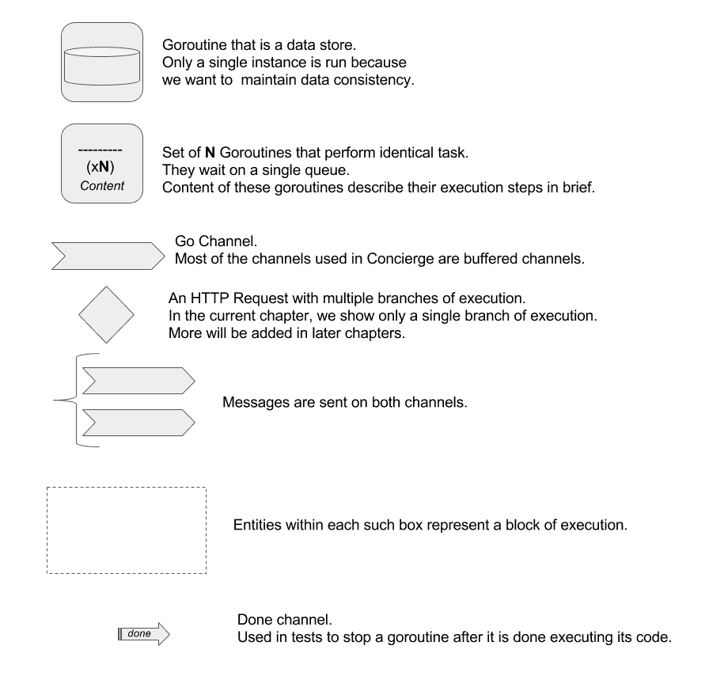
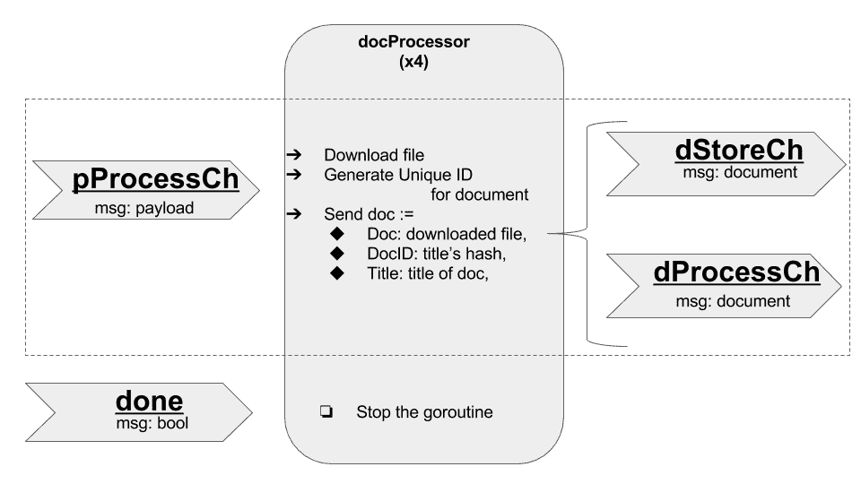
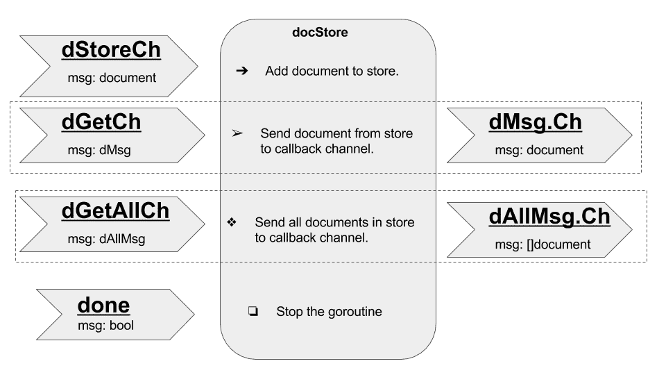
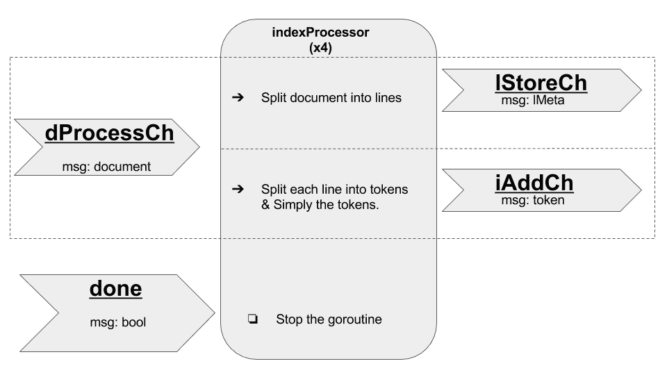
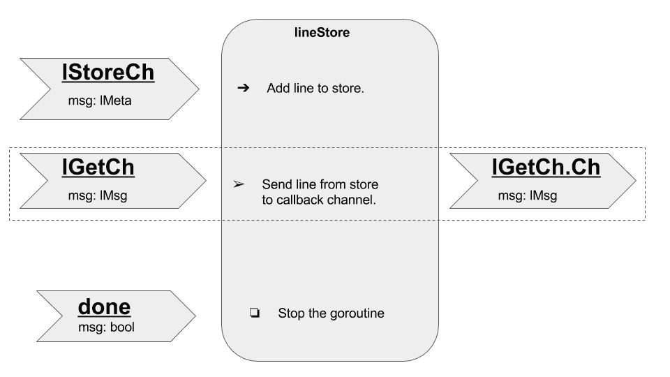
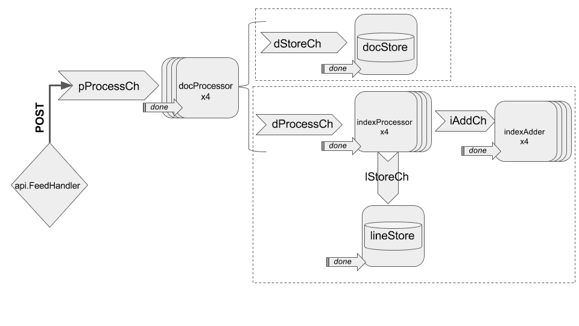

# 第六章：Goophr Concierge

在前一章第五章中，*介绍 Goophr*，我们将我们的应用程序分成了两个组件：Concierge 和 Librarian。在本章中，我们将看一下 Concierge 的设计和实现。本章的主要部分如下：

+   深入了解文档馈送器和查询处理程序 API

+   解释 Concierge 的架构和逻辑流的图表

+   Concierge 的测试

## 重新审视 API 定义

让我们再次查看 Concierge 的 API 定义，并讨论定义对 API 和应用程序预期行为的传达：

```go
# openapi/concierge.yaml

openapi: 3.0.0
servers: 
  - url: /api 
info: 
  title: Goophr Concierge API 
  version: '1.0' 
  description: > 
    API responsible for responding to user input and communicating with Goophr 
    Librarian. 
paths: 
  /feeder: 
    post: 
      description: | 
        Register new document to be indexed. 
      responses: 
        '200': 
          description: | 
            Request was successfully completed. 
          content: 
            application/json: 
              schema: 
                $ref: '#/components/schemas/response' 
        '400': 
          description: > 
            Request was not processed because payload was incomplete or incorrect. 
          content: 
            application/json: 
              schema: 
                $ref: '#/components/schemas/response' 
      requestBody: 
        content: 
          application/json: 
            schema: 
              $ref: '#/components/schemas/document' 
        required: true 
  /query: 
    post: 
      description: | 
        Search query 
      responses: 
        '200': 
          description: | 
            Response consists of links to document 
          content: 
            application/json: 
              schema: 
                type: array 
                items: 
                  $ref: '#/components/schemas/document' 
      requestBody: 
        content: 
          application/json: 
            schema: 
              type: array 
              items: 
                type: string 
        required: true 
components: 
  schemas: 
    response: 
      type: object 
      properties: 
        code: 
          type: integer 
          description: Status code to send in response 
        msg: 
          type: string 
          description: Message to send in response 
    document: 
      type: object 
      required: 
        - title 
        - link 
      properties: 
        title: 
          type: string 
          description: Title of the document 
        link: 
          type: string 
          description: Link to the document 
```

根据 API 定义，我们可以说明如下：

+   所有与 Concierge 的通信都使用 JSON 格式进行。

+   Concierge 有两个端点，分别是`/api/feeder`和`/api/query`

+   `/api/feeder`：这使用`POST`方法添加新文档

+   `/api/query`：这使用`POST`方法接收搜索查询词，并返回与搜索词相关的文档列表

现在让我们详细看看每个端点。

## 文档馈送器 - REST API 端点

`/api/feeder`的主要目的是接收要索引的文档，处理它们，并将处理后的数据转发给图书管理员以添加到索引中。这意味着我们需要准确处理文档。但是，“处理文档”是什么意思呢？

它可以定义为以下一系列连续的任务：

1.  我们依赖有效载荷为我们提供标题和文档链接。我们下载链接的文档并在我们的索引中使用它。

1.  文档可以被视为一个大的文本块，可能会有多个具有相同标题的文档。我们需要能够唯一标识每个文档，并且能够轻松地检索它们。

1.  搜索查询的结果期望所提供的单词出现在文档中。这意味着我们需要从文档中提取所有单词，并跟踪单词在文档中的位置。

1.  区分“HELLO”、“hello”和“HELLO!!!”有意义吗？在它们出现的文本上下文中，它们确实传达了不同的含义。但是，对于索引来说，这取决于我们想要使索引变得多么复杂和准确。对于我们的情况，我们保持实现简单，因此我们规范化单词，也就是说，我们将单词的所有这些变体视为单个单元/令牌。此外，我们不索引代词、冠词、介词等。

对于搜索引擎来说，代词、冠词等被称为**停用词**，通常在索引中被忽略。主要原因是，虽然它们为用户提供了有价值的信息，但它们往往对索引几乎没有相关性。

1.  最后，我们想将所有这些令牌添加到由图书管理员维护的索引中。

在 Concierge 的源代码中，每个前述任务都由特定的函数处理。以下是显示每个任务的相关函数的列表：

+   任务 1：`api.FeedHandler`和`api.docProcessor`

+   任务 2：`api.docStore`和`api.lineStore`

+   任务 3 和任务 4：`api.indexProcessor`和`common.SimplifyToken`

+   任务 5：`api.indexAdder`

## 查询处理程序 - REST API 端点

同样，如果我们考虑在`/api/query`处理搜索查询的情况，我们应该能够从有效载荷中获取搜索词，从图书管理员的各个实例请求结果，处理它们，然后以搜索相关性的降序返回搜索结果给用户。但是，由于我们尚未实现图书管理员，我们将在第八章中稍后讨论此端点的实现，*部署 Goophr*，分布式搜索索引。

## 约定

Concierge 的源代码有很多组成部分。在没有任何先前理解的情况下直接跳入代码可能不是最好的方法。相反，我们将把前几节中定义的任务作为流程图呈现出来。然而，首先让我们简要看一下我们在图表和代码中使用的符号和命名约定。

### 代码约定

以下是 Concierge 中的实体：

+   **有效负载**（**p**）：这代表接收到的用于向索引添加新文档的有效负载。

+   **文档**（**d**）：这代表表示唯一文档的所有元数据。

+   **行**（**l**）：这代表文档中单行的所有元数据。

+   **标记**（**t**）：这代表文档中每个标记的所有元数据。

+   **消息**（**xMsg**）：对于给定的实体**x**，它提供了用于识别唯一实体和返回唯一实体的回调通道的信息。

+   **处理通道**（**xProcessCh**）：对于给定的实体**x**，该通道由**xProcessor** goroutine 使用来消耗和处理实体。

+   **存储**（或**数据存储**）：Concierge 还负责存储和维护系统中所有文档和行的信息。

+   **存储通道**（xStoreCh）：对于给定的实体**x**，该通道用于更新实体的存储。

+   **获取通道**（**xGetCh**或**xGetAllCh**）：这些通道由存储使用，提供一种机制来使用回调通道检索实体。

+   **done**：这是一个特殊的通道，一旦关闭，将停止所有正在运行的 goroutines。我们应该小心关闭这个通道，而不是在上面发送消息，原因是发送消息只会向一个 goroutine 发出停止信号。相反，如果我们关闭通道，所有监听该通道的 goroutines 都将收到停止消息。

让我们看一些例子，以便我们对约定有完美的理解：

+   **dStoreCh**：这是用于向文档存储添加新文档的通道

+   **dGetCh**：这是从文档存储获取单个文档的通道

### 图表约定

接下来，让我们看一下我们将在图表中使用的符号：



现在，让我们通过逻辑流程图来可视化 Concierge 的逻辑。 

## 逻辑流程图

我们可以将 Concierge 的逻辑分为五个主要部分。我们将解决每个单独部分所需的逻辑流程，然后最后将它们合并在一起，以获得我们试图实现的整体情况。

### 文档处理器

首先，我们想要接受发送到端点的有效负载并开始处理文档。假设`api.FeedHandler`接受、验证并将有效负载发送到**pProcessCh**：



### 文档存储

让我们来考虑一下**dStoreCh**，这是用于添加和检索文档的通道：



### 索引处理器

除了添加到`docstore`中，`docProcessor`还将文档发送到`indexProcessor`，后者负责存储文档中的行并将行转换为标记：



### 行存储

`indexProcessor`将文档拆分为行，`lineStore`负责存储它们，并在查询时返回它们：



`indexProcessor`还将行拆分为标记，并将它们添加到`iAddCh`通道。`indexAdder`负责将这些标记添加到索引（图书管理员）中。


### 综合流程图

现在我们已经定义了每个单独部分，您可能已经注意到它们相互衔接，并且它们之间有一些共享的组件。现在让我们整合所有这些流程图：



这可能是一个很好的机会，让你自己尝试构建 Concierge。但是，请阅读以下三个设计要点，以完全了解系统。

#### 队列工作者

在综合流程图中，您可能已经注意到我们运行了四个`docProcessor`、`indexProcessor`和`indexAdder`的实例。这样做的原因是这些 goroutine 处理的任务是尴尬地并行的，也就是说，它们可以在没有副作用的情况下并行运行。这使我们能够并行处理文档，加快处理速度。

#### 单个存储

相比之下，我们将`docStore`和`lineStore`作为单个实例运行，因为我们希望为这些存储保持一致的状态。

#### 缓冲通道

对于我们代码中的几乎所有通道，我们将使用容量为 8 的缓冲通道。这样可以避免在`docProcessors`忙碌时阻塞`api.FeedHandler`端点。另外，由于队列工作者和单个存储，`lStoreCh`和`dStoreCh`的容量分别为 16。

## Concierge 源代码

现在我们已经详细讨论了 Concierge 的设计，让我们根据这些设计要点实现 Concierge。我们将在第八章，*部署 Goophr*中讨论`api/query.go`和 Dockerfile 的实现。让我们看看项目结构和源代码：

```go
$ tree 
. 
└── goophr 
    └── concierge 
        ├── api 
        │   ├── feeder.go 
        │   ├── feeder_test.go 
        │   └── query.go 
        ├── common 
        │   ├── helpers.go 
        ├── Dockerfile 
        └── main.go 

4 directories, 6 files 
```

现在让我们看看每个文件的源代码：

**main.go**：

```go
package main 

import ( 
    "net/http" 

    "github.com/last-ent/distributed-go/chapter6/goophr/concierge/api" 
    "github.com/last-ent/distributed-go/chapter6/goophr/concierge/common" 
) 

func main() { 
    common.Log("Adding API handlers...") 
    http.HandleFunc("/api/feeder", api.FeedHandler) 

    common.Log("Starting feeder...") 
    api.StartFeederSystem() 

    common.Log("Starting Goophr Concierge server on port :8080...") 
    http.ListenAndServe(":8080", nil) 
} 
```

**common/helpers.go**：

```go
package common 

import ( 
    "fmt" 
    "log" 
    "regexp" 
    "strings" 
) 

// Log is used for simple logging to console. 
func Log(msg string) { 
    log.Println("INFO - ", msg) 
} 

// Warn is used to log warning messages to console. 
func Warn(msg string) { 
    log.Println("---------------------------") 
    log.Println(fmt.Sprintf("WARN: %s", msg)) 
    log.Println("---------------------------") 
} 

var punctuations = regexp.MustCompile('^\p{P}+|\p{P}+$') 

// List of stop words that we want to ignore in our index. 
var stopWords = []string{ 
    "a", "about", "above", "after", "again", "against", "all", "am", "an", "and", "any", "are", "aren't", "as", "at", 
    "be", "because", "been", "before", "being", "below", "between", "both", "but", "by", "can't", "cannot", "could", 
    "couldn't", "did", "didn't", "do", "does", "doesn't", "doing", "don't", "down", "during", "each", "few", "for", 
    "from", "further", "had", "hadn't", "has", "hasn't", "have", "haven't", "having", "he", "he'd", "he'll", "he's", 
    "her", "here", "here's", "hers", "herself", "him", "himself", "his", "how", "how's", "i", "i'd", "i'll", "i'm", 
    "i've", "if", "in", "into", "is", "isn't", "it", "it's", "its", "itself", "let's", "me", "more", "most", "mustn't", 
    "my", "myself", "no", "nor", "not", "of", "off", "on", "once", "only", "or", "other", "ought", "our", "ours", 
    "ourselves", "out", "over", "own", "same", "shan't", "she", "she'd", "she'll", "she's", "should", "shouldn't", 
    "so", "some", "such", "than", "that", "that's", "the", "their", "theirs", "them", "themselves", "then", "there", 
    "there's", "these", "they", "they'd", "they'll", "they're", "they've", "this", "those", "through", "to", "too", 
    "under", "until", "up", "very", "was", "wasn't", "we", "we'd", "we'll", "we're", "we've", "were", "weren't", "what", 
    "what's", "when", "when's", "where", "where's", "which", "while", "who", "who's", "whom", "why", "why's", "with", 
    "won't", "would", "wouldn't", "you", "you'd", "you'll", "you're", "you've", "your", "yours", "yourself", "yourselves"} 

// SimplifyToken is responsible to normalizing a string token and 
// also checks whether the token should be indexed or not. 
func SimplifyToken(token string) (string, bool) { 
    simpleToken := strings.ToLower(punctuations.ReplaceAllString(token, "")) 

    for _, stopWord := range stopWords { 
        if stopWord == simpleToken { 
            return "", false 
        } 
    } 

    return simpleToken, true 
} 
```

**api/feeder.go**：

```go
package api 

import ( 
    "crypto/sha1" 
    "encoding/json" 
    "fmt" 
    "io/ioutil" 
    "net/http" 
    "strings" 
    "time" 

    "github.com/last-ent/distributed-go/chapter6/goophr/concierge/common" 
) 

type payload struct { 
    URL   string 'json:"url"' 
    Title string 'json:"title"' 
} 

type document struct { 
    Doc   string 'json:"-"' 
    Title string 'json:"title"' 
    DocID string 'json:"DocID"'

} 

type token struct { 
    Line   string 'json:"-"' 
    Token  string 'json:"token"' 
    Title  string 'json:"title"' 
    DocID  string 'json:"doc_id"' 
    LIndex int    'json:"line_index"' 
    Index  int    'json:"token_index"' 
} 

type dMsg struct { 
    DocID string 
    Ch    chan document 
} 

type lMsg struct { 
    LIndex int 
    DocID  string 
    Ch     chan string 
} 

type lMeta struct { 
    LIndex int 
    DocID  string 
    Line   string 
} 

type dAllMsg struct { 
    Ch chan []document 
} 

// done signals all listening goroutines to stop. 
var done chan bool 

// dGetCh is used to retrieve a single document from store. 
var dGetCh chan dMsg 

// lGetCh is used to retrieve a single line from store. 
var lGetCh chan lMsg 

// lStoreCh is used to put a line into store. 
var lStoreCh chan lMeta 

// iAddCh is used to add token to index (Librarian). 
var iAddCh chan token 

// dStoreCh is used to put a document into store. 
var dStoreCh chan document 

// dProcessCh is used to process a document and convert it to tokens. 
var dProcessCh chan document 

// dGetAllCh is used to retrieve all documents in store. 
var dGetAllCh chan dAllMsg 

// pProcessCh is used to process the /feeder's payload and start the indexing process. 
var pProcessCh chan payload 

// StartFeederSystem initializes all channels and starts all goroutines. 
// We are using a standard function instead of 'init()' 
// because we don't want the channels & goroutines to be initialized during testing. 
// Unless explicitly required by a particular test. 
func StartFeederSystem() { 
    done = make(chan bool) 

    dGetCh = make(chan dMsg, 8) 
    dGetAllCh = make(chan dAllMsg) 

    iAddCh = make(chan token, 8) 
    pProcessCh = make(chan payload, 8) 

    dStoreCh = make(chan document, 8) 
    dProcessCh = make(chan document, 8) 
    lGetCh = make(chan lMsg) 
    lStoreCh = make(chan lMeta, 8) 

    for i := 0; i < 4; i++ { 
        go indexAdder(iAddCh, done) 
        go docProcessor(pProcessCh, dStoreCh, dProcessCh, done) 
        go indexProcessor(dProcessCh, lStoreCh, iAddCh, done) 
    } 

    go docStore(dStoreCh, dGetCh, dGetAllCh, done) 
    go lineStore(lStoreCh, lGetCh, done) 
} 

// indexAdder adds token to index (Librarian). 
func indexAdder(ch chan token, done chan bool) { 
    for { 
        select { 
        case tok := <-ch: 
            fmt.Println("adding to librarian:", tok.Token) 

        case <-done: 
            common.Log("Exiting indexAdder.") 
            return 
        } 
    } 
} 

// lineStore maintains a catalog of all lines for all documents being indexed. 
func lineStore(ch chan lMeta, callback chan lMsg, done chan bool) { 
    store := map[string]string{} 
    for { 
        select { 
        case line := <-ch: 
            id := fmt.Sprintf("%s-%d", line.DocID, line.LIndex) 
            store[id] = line.Line 

        case ch := <-callback: 
            line := "" 
            id := fmt.Sprintf("%s-%d", ch.DocID, ch.LIndex) 
            if l, exists := store[id]; exists { 
                line = l 
            } 
            ch.Ch <- line 
        case <-done: 
            common.Log("Exiting docStore.") 
            return 
        } 
    } 
} 

// indexProcessor is responsible for converting a document into tokens for indexing. 
func indexProcessor(ch chan document, lStoreCh chan lMeta, iAddCh chan token, done chan bool) { 
    for { 
        select { 
        case doc := <-ch: 
            docLines := strings.Split(doc.Doc, "\n") 

            lin := 0 
            for _, line := range docLines { 
                if strings.TrimSpace(line) == "" { 
                    continue 
                } 

                lStoreCh <- lMeta{ 
                    LIndex: lin, 
                    Line:   line, 
                    DocID:  doc.DocID, 
                } 

                index := 0 
                words := strings.Fields(line) 
                for _, word := range words { 
                    if tok, valid := common.SimplifyToken(word); valid { 
                        iAddCh <- token{ 
                            Token:  tok, 
                            LIndex: lin, 
                            Line:   line, 
                            Index:  index, 
                            DocID:  doc.DocID, 
                            Title:  doc.Title, 
                        } 
                        index++ 
                    } 
                } 
                lin++ 
            } 

        case <-done: 
            common.Log("Exiting indexProcessor.") 
            return 
        } 
    } 
} 

// docStore maintains a catalog of all documents being indexed. 
func docStore(add chan document, get chan dMsg, dGetAllCh chan dAllMsg, done chan bool) { 
    store := map[string]document{} 

    for { 
        select { 
        case doc := <-add: 
            store[doc.DocID] = doc 
        case m := <-get: 
            m.Ch <- store[m.DocID] 
        case ch := <-dGetAllCh: 
            docs := []document{} 
            for _, doc := range store { 
                docs = append(docs, doc) 
            } 
            ch.Ch <- docs 
        case <-done: 
            common.Log("Exiting docStore.") 
            return 
        } 
    } 
} 

// docProcessor processes new document payloads. 
func docProcessor(in chan payload, dStoreCh chan document, dProcessCh chan document, done chan bool) { 
    for { 
        select { 
        case newDoc := <-in: 
            var err error 
            doc := "" 

            if doc, err = getFile(newDoc.URL); err != nil { 
                common.Warn(err.Error()) 
                continue 
            } 

            titleID := getTitleHash(newDoc.Title) 
            msg := document{ 
                Doc:   doc, 
                DocID: titleID, 
                Title: newDoc.Title, 
            } 

            dStoreCh <- msg 
            dProcessCh <- msg 
        case <-done: 
            common.Log("Exiting docProcessor.") 
            return 
        } 
    } 
} 

// getTitleHash returns a new hash ID everytime it is called. 
// Based on: https://gobyexample.com/sha1-hashes

func getTitleHash(title string) string {

    hash := sha1.New() 
    title = strings.ToLower(title) 

    str := fmt.Sprintf("%s-%s", time.Now(), title) 
    hash.Write([]byte(str)) 

    hByte := hash.Sum(nil) 

    return fmt.Sprintf("%x", hByte) 
} 

// getFile returns file content after retrieving it from URL. 
func getFile(URL string) (string, error) { 
    var res *http.Response 
    var err error 

    if res, err = http.Get(URL); err != nil { 
        errMsg := fmt.Errorf("Unable to retrieve URL: %s.\nError: %s", URL, err) 

        return "", errMsg 

    } 
    if res.StatusCode > 200 { 
        errMsg := fmt.Errorf("Unable to retrieve URL: %s.\nStatus Code: %d", URL, res.StatusCode) 

        return "", errMsg 
    } 

    body, err := ioutil.ReadAll(res.Body) 
    defer res.Body.Close() 

    if err != nil { 
        errMsg := fmt.Errorf("Error while reading response: URL: %s.\nError: %s", URL, res.StatusCode, err.Error()) 

        return "", errMsg 
    } 

    return string(body), nil 
} 

// FeedHandler start processing the payload which contains the file to index. 
func FeedHandler(w http.ResponseWriter, r *http.Request) { 
    if r.Method == "GET" { 
        ch := make(chan []document) 
        dGetAllCh <- dAllMsg{Ch: ch} 
        docs := <-ch 
        close(ch) 

        if serializedPayload, err := json.Marshal(docs); err == nil { 
            w.Write(serializedPayload) 
        } else { 
            common.Warn("Unable to serialize all docs: " + err.Error()) 
            w.WriteHeader(http.StatusInternalServerError) 
            w.Write([]byte('{"code": 500, "msg": "Error occurred while trying to retrieve documents."}')) 
        } 
        return 
    } else if r.Method != "POST" { 
        w.WriteHeader(http.StatusMethodNotAllowed) 
        w.Write([]byte('{"code": 405, "msg": "Method Not Allowed."}')) 
        return 
    } 

    decoder := json.NewDecoder(r.Body) 
    defer r.Body.Close() 

    var newDoc payload 
    decoder.Decode(&newDoc) 
    pProcessCh <- newDoc 

    w.Write([]byte('{"code": 200, "msg": "Request is being processed."}')) 
} 
```

**api/feeder_test.go**：

```go
package api 

import ( 
    "fmt" 
    "net/http" 
    "net/http/httptest" 
    "testing" 
) 

func TestGetTitleHash(t *testing.T) { 

    h1 := getTitleHash("A-Title") 
    h2 := getTitleHash("Diff Title") 
    hDup := getTitleHash("A-Title") 

    for _, tc := range []struct { 
        name     string 
        hashes   []string 
        expected bool 
    }{ 
        {"Different Titles", []string{h1, h2}, false}, 
        {"Duplicate Titles", []string{h1, hDup}, false}, 
        {"Same hashes", []string{h2, h2}, true}, 
    } { 
        t.Run(tc.name, func(t *testing.T) { 
            actual := tc.hashes[0] == tc.hashes[1] 
            if actual != tc.expected { 
                t.Error(actual, tc.expected, tc.hashes) 
            } 
        }) 
    } 
} 

func TestGetFile(t *testing.T) { 
    doc := "Server returned text!" 
    testServer := httptest.NewServer(http.HandlerFunc(func(w http.ResponseWriter, r *http.Request) { 
        w.Write([]byte(doc)) 
    })) 
    defer testServer.Close() 

    rDoc, err := getFile(testServer.URL) 
    if err != nil { 
        t.Error("Error while retrieving document", err) 
    } 
    if doc != rDoc { 
        t.Error(doc, "!=", rDoc) 
    } 
} 

func TestIndexProcessor(t *testing.T) { 
    ch1 := make(chan document, 1) 
    ch2 := make(chan lMeta, 1) 
    ch3 := make(chan token, 3) 
    done := make(chan bool) 

    go indexProcessor(ch1, ch2, ch3, done) 

    ch1 <- document{ 
        DocID: "a-hash", 
        Title: "a-title", 
        Doc:   "Golang Programming rocks!", 
    } 

    for i, tc := range []string{ 
        "golang", "programming", "rocks", 
    } { 
        t.Run(fmt.Sprintf("Testing if '%s' is returned. at index: %d", tc, i), func(t *testing.T) { 
            tok := <-ch3 
            if tok.Token != tc { 
                t.Error(tok.Token, "!=", tc) 
            } 
            if tok.Index != i { 
                t.Error(tok.Index, "!=", i) 
            } 
        }) 
    } 
    close(done) 

} 
```

### 运行测试

在`api/feeder_test.go`中，我们有三个主要的测试用例场景：

+   测试是否为每个新文档生成了唯一的哈希值

+   测试发送到`/api/feeder`端点的有效负载是否返回预期的文档内容

+   测试以确保文档的索引工作正常

在运行测试后，以下是预期的输出：

```go
    $ go test -v ./... 
    ? github.com/last-ent/distributed-go/chapter6/goophr/concierge [no test files] 
    === RUN TestGetTitleHash 
    === RUN TestGetTitleHash/Different_Titles 
    === RUN TestGetTitleHash/Duplicate_Titles 
    === RUN TestGetTitleHash/Same_hashes 
    --- PASS: TestGetTitleHash (0.00s) 
    --- PASS: TestGetTitleHash/Different_Titles (0.00s) 
    --- PASS: TestGetTitleHash/Duplicate_Titles (0.00s) 
    --- PASS: TestGetTitleHash/Same_hashes (0.00s) 
    === RUN TestGetFile 
    --- PASS: TestGetFile (0.00s) 
    === RUN TestIndexProcessor 
    === RUN TestIndexProcessor/Testing_if_'golang'_is_returned._at_index:_1 
    === RUN TestIndexProcessor/Testing_if_'programming'_is_returned._at_index:_2 
    === RUN TestIndexProcessor/Testing_if_'rocks'_is_returned._at_index:_3 
    --- PASS: TestIndexProcessor (0.00s) 
    --- PASS: TestIndexProcessor/Testing_if_'golang'_is_returned._at_index:_1 (0.00s) 
    --- PASS: TestIndexProcessor/Testing_if_'programming'_is_returned._at_index:_2 (0.00s) 
    --- PASS: TestIndexProcessor/Testing_if_'rocks'_is_returned._at_index:_3 (0.00s) 
    PASS 
    ok github.com/last-ent/distributed-go/chapter6/goophr/concierge/api 0.004s
    ? github.com/last-ent/distributed-go/chapter6/goophr/concierge/common [no test files] 

```

### Concierge 服务器

让我们尝试将书籍*《黑客：计算机革命的英雄》*发布到 Concierge 端点`/api/feeder`。我们需要在另一个终端窗口中运行 Concierge 服务器：

```go
    $ curl -X POST -d '{"title": "Hackers: Heroes of Computer Revolution", "url": "http://www.gutenberg.org/cache/epub/729/pg729.txt"}' http://localhost:8080/api/feeder | jq 
     % Total % Received % Xferd Average Speed Time Time Time Current
     Dload Upload Total Spent Left Speed
    100 162 100 51 100 111 51 111 0:00:01 --:--:-- 0:00:01 54000
    {
     "code": 200,
     "msg": "Request is being processed."
    }
```

接下来，让我们看看服务器上会发生什么：

```go
    $ go run main.go
    2017/11/18 21:05:57 INFO - Adding API handlers...
    2017/11/18 21:05:57 INFO - Starting feeder...
    2017/11/18 21:05:57 INFO - Starting Goophr Concierge server on port :8080...
    // ...
    adding to librarian: gutenberg-tm 
    adding to librarian: including 
    adding to librarian: make 
    adding to librarian: u.s 
    adding to librarian: project 
    adding to librarian: gutenberg 
    /...

```

## 摘要

在本章中，我们深入研究了 Concierge 的`feeder`组件。我们设计了系统，并使用逻辑流程图来理解代码的各个部分是如何交互的。接下来，我们用测试和一个真实的例子来测试我们的代码。

在下一章，第七章，*Goophr 图书管理员*中，我们将深入探讨 Goophr 图书管理员的设计和实现。
