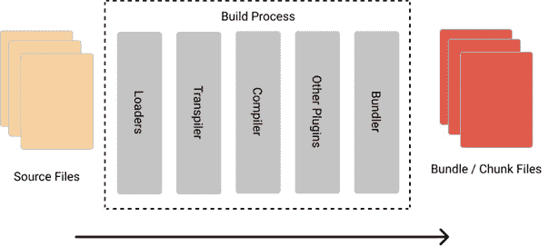
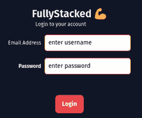
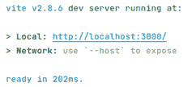

# 第七章：前端框架

在本章中，我们将从高层次的角度审视现代网络开发者可用的当前 JavaScript 框架。我们将比较一些流行的框架，如 Svelte、React 和 Vue，然后在 Vue 中创建一个简单的应用，并以使用流行的 Vue Router 添加导航结束。这将为我们后来从*第六章*，*转向 API-First*时与 API 服务器通信奠定基础。

本章完成后，我们将涵盖以下内容：

+   理解服务器端渲染与单页应用之间的区别

+   查看不同的前端框架

+   使用 Vue 框架创建应用

+   理解 Vue 框架中的路由

本章为前端领域铺平了道路。在本章和下一章中，我们将学习前端开发的不同部分。

# 技术要求

本章中使用的所有源代码都可以从[`github.com/PacktPublishing/Full-Stack-Web-Development-with-Go/tree/main/Chapter07`](https://github.com/PacktPublishing/Full-Stack-Web-Development-with-Go/tree/main/Chapter07)中检出。

请确保您已按照 Node.js 文档中的说明在本地机器上安装了所有必要的工具：[`docs.npmjs.com/downloading-and-installing-node-js-and-npm`](https://docs.npmjs.com/downloading-and-installing-node-js-and-npm)。

# 服务器端渲染与单页应用

在*第四章*，*服务和嵌入 HTML 内容*中，我们将应用作为服务器端渲染应用创建。这意味着所有内容、资产，包括 HTML，都是在后端生成的，并在每个页面请求时发送。这并没有什么问题；我们的出版商 Packt 在其[`www.packtpub.com/`](https://www.packtpub.com/)网站上使用**服务器端渲染**（**SSR**）。作为一项技术，SSR 被 WordPress 和其他许多内容变化较少且可能交互性较低的网站所使用。

我们将为我们的应用使用的 SSR（服务器端渲染）的替代方案是**客户端渲染**（**CSR**）。CSR 通过客户端以 JavaScript 和其他资源的*包*的形式获取应用，动态执行 JavaScript 和应用，并将绑定到一个接管页面渲染的元素上。应用在浏览器中动态创建和渲染每个路由。这一切都是在不需要重新加载包或内容的情况下完成的。

通过转向客户端渲染，它通过允许应用操作文档模型、通过 API 获取额外的内容和数据以及通常在不需要不断重新加载页面的情况下更接近用户可能从桌面应用中期望的性能来提高应用的用户交互性和响应性。

当我们谈论响应性时，我们描述的是应用程序状态变化自动反映在**文档对象模型**（**DOM**）中的情况。这是我们将要探索的所有框架的关键属性，包括 React、Vue 和 Svelte。

# 介绍 React、Vue 以及更多

如果 JavaScript 社区喜欢做的事情有一件，那就是创建新的框架！

我们将探索和对比一些最受欢迎的框架，并查看它们共有的部分以及主要的不同点。

## React

React 是可用的最受欢迎的 JavaScript 库之一。它由 Meta（前身为 Facebook）创建并维护，并且受到了 Facebook 内部用于创建 PHP 组件的前任的极大启发。

React 使用 `.jsx` 和 `.vue` 文件，并将它们构建成一个最终包，可以部署为静态文件。我们将在后面的章节中探讨这一点。



图 7.1：现代 JavaScript SPA 构建过程

React 是创建应用程序的一个非常受欢迎的选择，其一个优势是在构建应用程序时有许多不同的选项可供选择，例如 Redux、Flux、BrowserRouter 或 React Router。这种灵活性很好，但可能会导致冲突和关于“唯一正确的方法”的强烈观点。React 团队通过不断强调 React 是一个库而不是框架来避免这个问题，因此选择应用程序的组件取决于个人。

React 与其他框架类似，它有一个完整的生命周期模型，可以在运行时“挂钩”以覆盖默认值（例如，`render` 和 `shouldComponentUpdate`）。

## Svelte

Svelte 处于一个有趣的中间位置，被包括作为 React 和 Vue 这两个重量级选手的替代品。Svelte 采用将更多内容推入编译步骤的方法，消除了需要像比较虚拟 DOM 来将代码转换为纯 JavaScript 这样的技术。这种方法意味着浏览器需要做的工作更少，但它仍然具有与 React 和 Vue 类似的构建过程来构建包。Svelte 提供了自己的首选路由器，称为 SvelteKit，但存在替代方案，Svelte 可以成为其他产品的轻量级替代品。从更成熟的参与者来看，Svelte 是一个相当新的项目，并且背后没有那么多资源，但它对于小型项目来说仍然是可行的。

## Vue

我们将要介绍的最后一个框架是 Vue，这是我们用于构建前端应用程序的首选框架。

对于我来说，最初的最大吸引力是 Vue 的上一个版本（版本 2）可以通过**内容分发网络**（**CDN**）直接加载和运行，这使得在 2016 年首次发布时进行实验和原型设计变得极其容易。

Vue 提供了一种非常熟悉的语法，这使得它很容易学习——它将表示与逻辑和样式分离，非常轻量级，并且它使用了**单文件**组件（**SFCs**）的概念。

SFC 的概念使得构建简单、范围有限的组件变得极其容易，这些组件可以在项目之间重复使用，而无需学习 React 使用的“不太像 JavaScript”的 JSX。

以下代码是一个简单的组件，它使用 Options API 显示问候语。当 Vue 首次发布时，它默认使用 Options API，但在后续版本中，它已经转向包括一个更新的 Composition API，我们将在后面探讨：

```go
<template>
  <div>
    <Thing @click="greetLog" />
    <p class="greeting">{{ greeting }}</p>
  </div>
</template>
<script>
import Thing from '@/components/thing.vue';
export default {
  name: 'Greeter',
  components: ['Thing'],
  props:{},
  mounted(){},
  methods: {
    greetLog() {  console.log('Greeter') };
  },
  data() {
    return {
      greeting: 'Hello World!'
    }
  }
}
</script>
<style scoped>
.greeting {
  color: red;
  font-weight: bold;
}
</style>
```

**SFC Greeter.vue 的示例**

如前述代码块所示，Vue 的 SFC 设计方法有三个部分：HTML、JavaScript 和样式（通常是 CSS，通常是“scoped”）。这意味着你可以将 `<template>` 的 HTML 风格与小的 Vue 特定添加（如 `@click="functionName"`）结合起来，轻松创建我们的组件。这里使用的 `@click` 注解，看起来接近 HTML，是 Vue 用于扩展并将 HTML 事件绑定到我们的对象的语法——在这种情况下，替换了原生的 `onClick` 属性。

`<script>` 中包含的实例包括一个名称；props，用于从父组件提供属性给组件；`mounted()`，当组件首次添加到 DOM 时调用的函数；components，即被导入供组件使用的组件；其他各种方法；最后是 `data()` 对象，它可以保存我们组件的状态。

SFC 的最后一部分是 `<style>` 部分——我们在这里可以指定非 CSS 语言。例如，如果我们想使用 SCSS 而不是 CSS，我们可以使用 `lang="scss"`。我们还可以添加 `scoped` 关键字，这意味着 Vue 将使用名称混淆来确保我们的 CSS 样式仅限于这个组件实例。

使用 Vue 的另一个好处是它对构建工具采取的具有意见的方法（更倾向于创建 Vite，它利用速度极快的 esbuild 来将包构建时间缩短到毫秒级，与较慢的 React 相比），组件布局，以及路由器（Vue Router），我们将在后面的章节中探讨。Vue 的具有意见的性质与 Golang 本身的具有意见的性质很好地结合在一起，这有助于消除很多关于选择哪种方法和组件来构建你的应用的争论，确保当你引入更多团队成员并将你的成功的全栈应用交付出去时，你可以放心地知道另一个 Vue 开发者不会与你争论你是如何做到的，也不会争论选择的技术——主要是因为他们也会选择同样的技术！

到目前为止，在本节中，我们已经了解了 Vue 框架是什么。在下一节中，我们将通过创建一些简单的应用来学习 Vue 框架。

# 创建 Vue 应用

在上一节中，我们讨论了不同的前端框架，因此在本节中，我们将尝试使用 Vue 构建我们的前端。在本节中，我们将查看如何在 Vue 中编写我们的 UI，并讨论如何将登录页面迁移到 Vue。本节不会教你如何使用 Vue，而是将查看我们使用 Vue 编写示例应用程序前端组件的方式。

# 应用程序和组件

当使用 Vue 编写软件时，应用程序将通过创建应用程序实例来启动。这个实例是我们基于 Vue 的应用程序中的主要对象。一旦我们有一个实例，我们就可以开始使用组件。组件是可重用的 UI 部件，包含三个部分——模板（类似于 HTML）、样式和 JavaScript。通常，在设计前端时，我们会考虑 HTML 元素——div、href 等——但现在我们需要考虑包含所有不同部分的组件。*图 7.2*显示了使用 Vue 重写的登录页面示例。



图 7.2：基于 Vue 的登录

Vue 内部应用程序的概念可以被视为一个包含不同组件的自隔离容器，这些组件可以共享数据。任何网页都可以包含多个应用程序，显示不同类型的数据，即使它们是隔离的，在需要时也可以共享数据。

## 使用 Vue 的登录页面

在本节中，我们将查看如何直接使用登录页面，而不将其转换为组件，并作为浏览器渲染的 Vue 应用程序使用。我们首先需要通过运行以下命令安装依赖项：

```go
npm install
```

这将安装所有不同的依赖项，包括我们将用于提供登录页面的`http-server`模块。通过运行以下命令启动服务器，确保你位于`chapter7/login`目录中：

```go
npm run start
```

你将看到*图 7.3*中所示的输出：


图 7.3：使用 http-server 提供服务

打开你的浏览器，在地址栏中输入 http://127.0.0.1:3000/login.xhtml，你将看到登录页面。

让我们深入代码，看看它是如何协同工作的。以下`login.xhtml`内部的代码片段显示了应用程序初始化代码：

```go
<script type="module">
   import {createApp} from 'vue'
   const app = createApp({
       data() {
           return {
               loginText: 'Login to your account',
               ...
           }
       },
       methods: {
           handleSubmit: function () {
               ...
           }
       }
   }).mount('#app')
</script>
```

代码从 Vue 库中导入`createApp`，并使用它创建一个包含页面内使用的`data()`和`methods`的应用程序。`data()`块声明了页面内将使用的变量，而`methods`包含函数。应用程序被挂载到具有 ID“app”的元素上，在这种情况下，是具有`id=app`的`<div>`。

以下代码片段显示了使用数据的页面部分：

```go
<body class="bg-gray-900">
           ...
               <p class="text-xs text-gray-50">{{ loginText
                 }}</p>
           ...
               <p class="text-xs text-gray-50">
                 {{ emailText }}</p>
           ...
               <p class="text-xs font-bold text-white">
                 {{ passwordText }}</p>
               ...
</body>
```

大括号内的变量（`{{}}`）将在初始化应用程序时填充之前定义的数据。

以下代码片段显示了使用`handleSubmit`函数的部分页面：

```go
<body class="bg-gray-900">
                   ...
               <button @click="handleSubmit"
                       class="px-4 pt-2 pb-2.5 w-full
                              rounded-lg bg-red-500
                              hover:bg-red-600">
                   ...
</body>
```

在按钮元素上点击`@click`将触发在创建 Vue 应用程序对象时定义的函数，该函数将把用户名字段中的数据写入控制台日志。

## 使用 Vite

回到*图 7.1*，构建过程的一部分是打包器。在本节中，我们将查看 Vite，它是 Vue 的打包器。什么是打包器？它是一个构建工具，将你所有的不同资产（HTML、CSS 等）合并到一个文件中，使其易于分发。

在上一节中，我们链接到了一个由 CDN 托管的 Vue 运行时版本。在本节中，我们将使用 Vite 来构建我们的应用程序并生成我们的打包代码。

Vite - 法语中意为“快速”，是由 Vue 本身的团队构建的，旨在提供更快的开发体验，具有极快的热重载，并将其与一个强大的构建阶段相结合，该阶段将转换、压缩和打包你的代码到优化的静态资产，以便部署。参考*图 7.1*以查看构建 SPAs 所使用的所有阶段。

在本节中，我们将查看如何将登录页面编写为组件，并使用它作为由浏览器渲染的 Vue 应用程序。代码可以在`chapter7/npmvue`文件夹中查看。

打开你的终端并运行以下命令：

```go
npm install
npm run dev
```

一旦服务器启动并运行，你将看到*图 7.4*所示的输出。



图 7.4：Vite 服务器输出

打开浏览器，在地址栏中输入`http://localhost:3000`以访问登录页面。让我们进一步调查并查看代码的结构。我们将从以下片段中查看`index.xhtml`页面：

```go
<!DOCTYPE html>
<html lang="en">
 <head>
   ...
 </head>
 <body>
   <div id="app"></div>
   <script type="module" src="img/main.js"></script>
 </body>
</html>
```

前面的`index.xhtml`引用了`main.js`脚本，这是我们注入 Vue 初始化代码的方式。

`<div..>`声明是当在浏览器中渲染时应用程序将被挂载的位置，页面还包括在`src/main.js`中找到的脚本。

`main.js`包含 Vue 应用程序初始化代码，如下所示：

```go
import { createApp } from 'vue'
import App from './App.vue'
createApp(App).mount('#app')
```

`createApp`将使用从`App.vue`导入的`App`对象创建一个应用程序，这将是我们的应用程序的起始组件。与 Vue 相关的代码通常存储在具有`.vue`扩展名的文件中。`App.vue`文件充当应用程序容器，它承载它将使用的组件。在这种情况下，它将使用`Login`组件，如下面的片段所示：

```go
<script setup>
import Login from './components/Login.vue'
</script>
<template>
   <Login />
</template>
```

`<script setup>`标签被称为组合式 API，它是一组允许 Vue 组件被导入的 API。在我们的例子中，我们是从`Login.vue`文件中导入组件。

代码将`Login.Vue`文件作为组件导入，并在`<template>`块中使用它。查看`Login.vue`文件，你会看到它包含创建登录页面所需的 HTML 元素。

`Login.vue`片段可以在以下代码块中看到：

```go
<script>
export default {
 data() {
   return {
     loginText: 'Login to your account',
     ...
   }
 },
 methods: {
   handleSubmit: function () {
     ...
   }
 }
}
</script>
<style>
@import "../assets/minified.css";
</style>
<template>
   ...
       <button @click="handleSubmit"
               class="px-4 pt-2 pb-2.5 w-full rounded-lg
                      bg-red-500 hover:bg-red-600">
     ...
</template>
```

之前示例中按钮所用的类是在`assets`文件夹内的`minified.css`文件中声明的。

我们已经学习了如何使用 Vue 框架创建应用程序，并将所有不同的组件连接在一起。我们还探讨了如何使用 Vite 工具编写基于 Vue 的应用程序。在下一节中，我们将探讨如何将请求路由到不同的 Vue 组件。

# 使用 Vue Router 进行导航

在本节中，我们将探讨 Vue Router 并学习如何使用它。Vue Router 有助于在设计和**单页应用程序**（SPA）时构建前端代码。SPA 是一种将用户呈现为单个 HTML 页面的 Web 应用程序，由于 HTML 页面内的内容更新而不需要刷新页面，因此它更加响应。SPA 需要使用路由器，当从后端更新数据时，路由器将路由到不同的端点。

使用路由器允许更容易地在 URL 路径和组件之间进行映射，从而模拟页面导航。可以使用 Vue Router 配置两种类型的路由——动态路由和静态路由。当 URL 路径基于某种数据动态时，使用动态路由。例如，在`/users/:id`中，路径中的`id`将被填充为一个值，例如`/users/johnny`或`/users/acme`。静态路由是不包含任何动态数据的路由，例如`/users`或`/orders`。

在本节中，我们将探讨静态路由。本节的示例可以在`chapter7/router`文件夹中找到。从`router`文件夹运行以下命令以运行示例应用程序：

```go
npm install
npm run server
```

命令将在端口`8080`上运行一个服务器。打开您的浏览器，在地址栏中输入`http://localhost:8080`。您将看到*图 7**.5*所示的输出：


图 7.5：路由示例应用程序

`App.vue`文件包含 Vue Router 信息，如下所示：

```go
<template>
 <div id="routerdiv">
   <table>
      ...
         <router-link :to="{ name: 'Home'}">Home
         </router-link>
      ...
         <router-link :to="{ name: 'Login'}">Login
         </router-link>
      ...
   </table>
   <router-view></router-view>
 </div>
</template>
```

之前定义的`router-link`路由位于`router/index.js`中，如下所示：

```go
const routes = [
   {
       path: '/',
       name: 'Home',
       component: Home
   },
   {
       path: '/login',
       name: 'Login',
       component: Login
   },
];
```

`<router-link/>`标签定义了应用程序的路由配置，在我们的例子中，它指向位于`router`文件夹下的`index.js`文件内声明的`Home`和`Login`组件，如下所示：

```go
import Vue from 'vue';
import { createRouter, createWebHashHistory } from 'vue-router'
import Home from '../views/Home.vue';
import Login from "../views/Login.vue";
Vue.use(VueRouter);
const routes = [
   {
       path: '/',
       name: 'Home',
       component: Home
   },
   {
       path: '/login',
       name: 'Login',
       component: Login
   },
];
const router = createRouter({
   history: createWebHashHistory(),
   base: process.env.BASE_URL,
   routes
})
export default router
```

每个定义的路由都映射到其相应的组件，这些组件是`Home`和`Login`组件，它们位于`views`文件夹内。

## 登录页面的路由

我们知道`/login`路径映射到`Login`组件，这与我们在上一节中查看的相同组件，即*使用 Vue 的登录页面*。在路由示例中的区别在于脚本的定义方式，如下所示：

```go
<template>
 ...
</template>
<script type="module">
export default {
 data() {
   return {
     loginText: 'Login to your account',
     emailText: 'Email Address',
     passwordText: 'Password',
     username: 'enter username',
     password: 'enter password',
   };
 },
 methods: {
   handleSubmit: function () {
     console.log(this.$data.username)
   }
 }
};
</script>
```

与上一节不同，Vue 初始化代码已移动到`main.js`中，如下所示：

```go
...
const myApp = createApp(App)
myApp.use(router)
myApp.mount('#app')
```

在本节中，我们探讨了如何通过使用 Vue Router 重构应用程序以作为 SPA 运行。

# 摘要

在本章中，我们学习了 Vue 以及如何构建我们的前端结构，使其易于过渡到组件和应用。我们探讨了不同的前端框架，并讨论了它们各自提供的内容。

我们在编写基于 Vue 的网页时，研究了组件和应用是如何协同工作的。我们通过将我们创建的简单 HTML 页面迁移到基于 Vue 的应用程序来测试我们所学的知识。最后，我们学习了 Vue Router 以及如何使用它来简化 SPA 中不同部分的导航。

在吸收了所有这些知识之后，在下一章中，我们将探讨如何将我们的应用编写成一个基于 Vue 的应用程序，该程序将与我们所构建的 REST API 进行通信。
