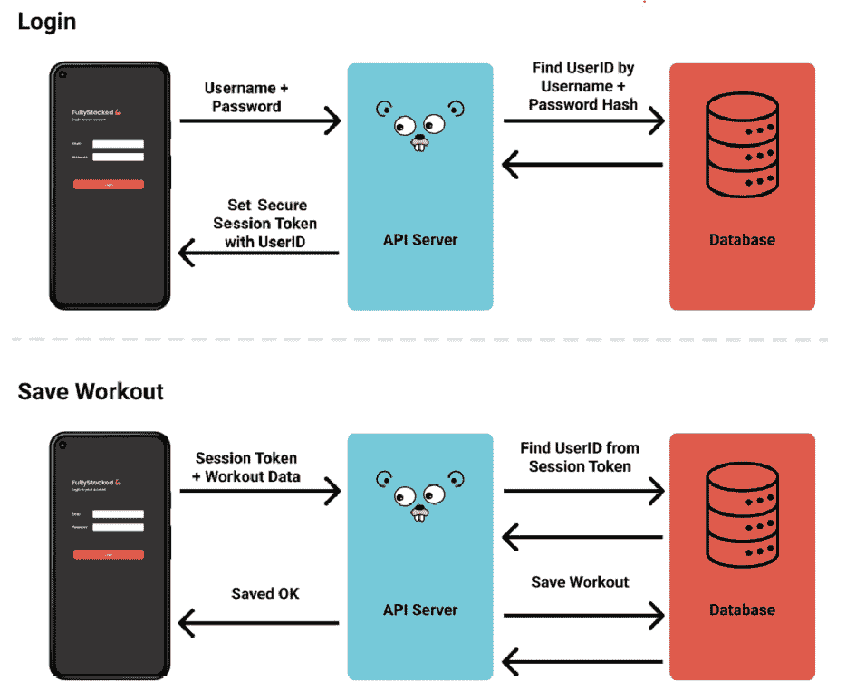
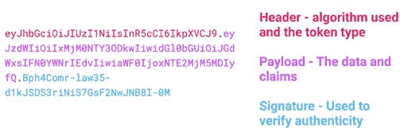
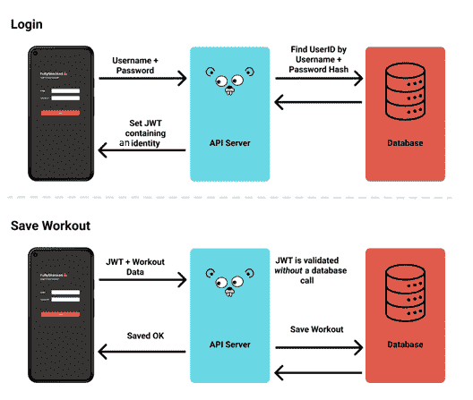

# 第十章：会话管理

在*第九章**，Tailwind，中间件和 CORS*中，我们创建了一个全栈应用程序，具有独立的前端和后端，通过 API 相互通信。

在本章中，我们将把所有现有的知识结合起来，介绍如何创建和验证用于会话管理和中间件的 JSON Web Tokens (JWTs)，设置使用 Vue Router 的基本原则和导航守卫，以及了解错误和“捕获所有”导航守卫。

本章我们将涵盖以下主题：

+   会话管理和 JWTs

+   （重新）介绍 Vue Router

+   导航守卫

+   默认页面和错误页面

到本章结束时，我们将了解如何完成并确保一个为等待用户准备的项目。

# 技术要求

本章中解释的所有源代码都可以在[`github.com/PacktPublishing/Full-Stack-Web-Development-with-Go/tree/main/chapter10`](https://github.com/PacktPublishing/Full-Stack-Web-Development-with-Go/tree/main/chapter10)中查看。

# 会话管理和 JWTs

我们之前在*第六章**，转向 API-First，使用 Gorilla Mux 中间件，查看过使用 cookie 进行会话管理。在我们的应用程序中，我们通过 Gorilla 会话提供的功能创建了一个内存中的 cookie 存储：[`github.com/gorilla/sessions`](https://github.com/gorilla/sessions)。

我们之前实现了我们的中间件，以验证我们的用户是否被批准，通过编码两个值——我们从数据库中查找的用户 ID 和一个`userAuthenticated`布尔值。这对于我们的用例来说效果很好，但我们的实现意味着每次调用我们的 API 后端都需要往返数据库，以检查用户 ID 是否仍然存在，然后才能让调用继续。



图 10.1：使用会话 cookie 的登录和保存 API 工作流程示意图

这种方法是可以的，Gorilla 会话库提供了一些替代后端来加速这个过程，例如使用 Redis 和 SQLite，但我们将探讨使用 JWT 的替代方法。

## 什么是 JWT？

JWT 代表 JSON Web Token。JWT 是一个创建带有可选签名（公共或公共/私有）和/或加密的数据的标准，其有效载荷由 JSON 组成，声明了 JWT 规范中称为声明的多个内容。您可以在`jwt.io`上生成和检查 JWTs，它们被分解为三个部分，包括头部、有效载荷（包含声明）和签名。然后，它们使用.分隔符进行 base64 编码并连接在一起，您可以看到这里。



图 10.2：使用颜色编码的 JWT 各部分示意图

我们感兴趣的部分是有效载荷和声明。存在一些保留的声明，我们应该将其视为规范的一部分，具体如下：

+   **iss**（**发行者**）：JWT 的发行者。

+   **sub**（**主题**）：JWT 的主题（用户）。

+   **aud**（**受众**）：JWT 的目标接收者。

+   **exp**（**过期时间**）：JWT 过期后的时间。

+   **nbf**（**不可用时间**）：JWT 必须在此时间之前不接受处理。

+   **iat**（**发行时间**）：JWT 被发行的时间。这可以用来确定 JWT 的年龄。

+   **jti**（**JWT ID**）：一个唯一的标识符。这可以用来防止 JWT 被重放（允许令牌只使用一次）。

在库中，我们将使用`go-jwt`，可在[`github.com/golang-jwt/jwt`](https://github.com/golang-jwt/jwt)找到。这些标准声明通过 Go 结构体提供，如下所示：

```go
// Structured version of Claims Section, as referenced at
// https://tools.ietf.org/html/rfc7519#section-4.1
type StandardClaims struct {
    Audience  string `json:"aud,omitempty"`
    ExpiresAt int64  `json:"exp,omitempty"`
    Id        string `json:"jti,omitempty"`
    IssuedAt  int64  `json:"iat,omitempty"`
    Issuer    string `json:"iss,omitempty"`
    NotBefore int64  `json:"nbf,omitempty"`
    Subject   string `json:"sub,omitempty"`
}
```

我们可以向这些声明中添加自己的附加声明，并且按照典型的 Go 风格，我们通过将`StandardClaims`嵌入到我们自己的结构体中来实现，我将其称为`MyCustomClaims`，如下所示：

```go
    mySigningKey := []byte("PacktPub")
    // Your claims above and beyond the default
    type MyCustomClaims struct {
        Foo string `json:"foo"`
        jwt.StandardClaims
    }
    // Create the Claims
    claims := MyCustomClaims{
        "bar",
        // Note we embed the standard claims here
        jwt.StandardClaims{
            ExpiresAt: time.Now().Add(time.Minute *
                                      1).Unix(),
            Issuer:    "FullStackGo",
        },
    }
    // Encode to token
    token := jwt.NewWithClaims(jwt.SigningMethodHS256,
                               claims)
    tokenString, err := token.SignedString(mySigningKey)
    fmt.Printf("Your JWT as a string is %v\n", tokenString)
```

如果你执行此代码，你将得到以下输出：

```go
$ go run chapter10/jwt-example.go
Your JWT as a string is eyJhbGciOiJIUzI1NiIsInR5cCI6IkpXVCJ9.ey Jmb28iOiJiYXIiLCJleHAiOjE2NTY3MzY2NDIsImlzcyI6IkZ1bGxTdGFja0dv In0.o4YUzyw1BUukYg5H6CP_nz9gAmI2AylvNXG0YC5OE0M
```

当你运行示例代码或编写自己的代码时，由于`StandardClaims`中的相对过期时间，它看起来会有所不同，如果你尝试解码前面的字符串，很可能会显示已经过期了几秒钟！

你可能想知道为什么你应该关心 JWT，因为你已经看到了基于数据库的中介工作。原因是我们可以节省一次往返数据库，节省时间和带宽。

由于 JWT 是经过签名的，我们可以自信地假设，只要 JWT 按照我们的预期被解码，提供的声明就可以被断言为真实。在我们的基于 JWT 的模型中，我们可以将用户详情和权限编码到 JWT 本身的声明中。



图 10.3：使用 JWT 安全会话的登录和保存 API 工作流程的说明

这看起来都很不错，但在使用 JWT 时存在一些“陷阱”，在我们开始在每个场景中使用它们之前，值得先了解它们。

### “无算法”陷阱

可以创建一个未加密的 JWT，其中“`alg`”头参数值设置为“`none`”，其签名值为空字符串。

由于我们的 JWT 仅仅是 base64 编码的有效载荷，恶意黑客可以解码我们的 JWT，移除签名，将算法参数更改为“none”，然后尝试将其作为有效的 JWT 呈现给我们的 API。

```go
$ Pipe our encoded JWT through the base64 command to decode it
$ echo eyJhbGciOiJIUzI1NiIsInR5cCI6IkpXVCJ9 | base64 -D
{"alg":"HS256","typ":"JWT"}
$ echo '{"alg":"none","typ":"JWT"}' | base64
eyJhbGciOiJub25lIiwidHlwIjoiSldUIn0K
```

重要的是，你使用的库要验证你收到的 JWT 与你提供的算法相同，并且在使用它之前你应该自己验证这一点。

### “注销”陷阱

当你点击退出你的 web 应用时，常见的做法是将 cookie 过期时间设置为过去的日期，然后浏览器将删除 cookie。你还应该从你的数据库和/或应用中删除任何活动的会话信息。问题是，使用 JWT，它可能不会按你预期的样子工作。因为 JWT 是自包含的，它将继续工作并被认为有效，直到它过期——是 JWT 的过期，而不是 cookie 的过期——所以如果有人拦截你的 JWT，他们可以继续访问平台，直到 JWT 过期。

### “黑名单”或“过时数据”陷阱

与退出时的陷阱类似，因为我们的 JWT 是自包含的，存储在其中的数据可以直到刷新时仍然过时。这可能导致访问权限/权限不同步，或者更糟糕的是，在你禁止他们之后，有人仍然能够继续登录你的应用。这在需要实时阻止用户的情况下更糟——例如，在滥用或不良行为的情况下。相反，使用 JWT 模型，用户将继续有权访问，直到令牌过期。

### 使用 JWT 和 cookie 以及我们的中间件

在理解了我们所有的陷阱之后，我们将编写一些简单的中间件和 cookie 处理，以构建来自*第九章*，Tailwind，中间件和 CORS 的简单 API 服务，结合我们在*第五章**，保护后端和中间件*中的知识。

这段代码全部在 GitHub 上的`chapter10/simple-backend`提供。

### 设置 cookie 和验证中间件

为了开始使用我们新的 JWT，我们将为 mux 编写一些中间件以供消费，并将它们注入到我们所有的受保护路由中。和之前一样，我们使用默认库使用的签名，其中我们接收`http.Handler`并返回`handlerFunc`。当成功时，我们调用`next.ServerHTTP(http.ResponseWriter, *http.Request`)以继续并指示请求处理成功：

```go
// JWTProtectedMiddleware verifies a valid JWT exists in
// our cookie and if not, encourages the consumer to login
// again.
func JWTProtectedMiddleware(next http.Handler) http.Handler {
    return http.HandlerFunc(func(w http.ResponseWriter,
                                 r *http.Request) {
        // Grab jwt-token cookie
        jwtCookie, err := r.Cookie("jwt-token")
        if err != nil {
            log.Println("Error occurred reading cookie", err)
            w.WriteHeader(http.StatusUnauthorized)
            json.NewEncoder(w).Encode(struct {
                Message string `json:"message,omitempty"`
            }{
                Message: "Your session is not valid –
                          please login",
            })
            return
        }
        // Decode and validate JWT if there is one
        userEmail, err := decodeJWTToUser(jwtCookie.Value)
        if userEmail == "" || err != nil {
            log.Println("Error decoding token", err)
            w.WriteHeader(http.StatusUnauthorized)
            json.NewEncoder(w).Encode(struct {
                Message string `json:"message,omitempty"`
            }{
                Message: "Your session is not valid –
                          please login",
            })
            return
        }
        // If it's good, update the expiry time
        freshToken := createJWTTokenForUser(userEmail)
        // Set the new cookie and continue into the handler
        w.Header().Add("Content-Type", "application/json")
        http.SetCookie(w, authCookie(freshToken))
        next.ServeHTTP(w, r)
    })
}
```

这段代码正在检查我们的名为`jwt-token`的 cookie，并使用我们新的`decodeJWTToUser`对其进行解码，检查其值是否为有效的条目。在我们的情况下，我们期望`userEmail`，如果它不存在，我们简单地返回一个无效会话消息。在这个例子中，然后我们更新 JWT 的过期时间，并在设置最新的 cookie 后退出函数。

在实践中，我们会更加严格地检查，以确保保留一个小的有效声明窗口，然后我们会回数据库检查用户是否仍然有权访问我们的平台。

我们用于设置和操作 cookie 的功能与我们之前在*第五章**，保护后端和中间件*中的工作非常相似，包括域名、same-site 模式，以及最重要的是 HttpOnly 和 Secure。

我们使用 Secure 作为良好实践来确保它始终通过安全的 HTTPS 发送（除了在本地主机上进行开发时），因为尽管我们可以对我们的 JWT 的安全性有信心，但它仍然可以用诸如 jwt.io 之类的工具进行解码：

```go
var jwtSigningKey []byte
var defaultCookie http.Cookie
var jwtSessionLength time.Duration
var jwtSigningMethod = jwt.SigningMethodHS256
func init() {
    jwtSigningKey = []byte(env.GetAsString(
      "JWT_SIGNING_KEY", "PacktPub"))
    defaultSecureCookie = http.Cookie{
        HttpOnly: true,
        SameSite: http.SameSiteLaxMode,
        Domain:   env.GetAsString("COOKIE_DOMAIN",
                                  "localhost"),
        Secure:   env.GetAsBool("COOKIE_SECURE", true),
    }
    jwtSessionLength = time.Duration(env.GetAsInt(
      "JWT_SESSION_LENGTH", 5))
}
...
func authCookie(token string) *http.Cookie {
    d := defaultSecureCookie
    d.Name = "jwt-token"
    d.Value = token
    d.Path = "/"
    return &d
}
func expiredAuthCookie() *http.Cookie {
    d := defaultSecureCookie
    d.Name = "jwt-token"
    d.Value = ""
    d.Path = "/"
    d.MaxAge = -1
      // set our expiration to some date in the distant
      // past
    d.Expires = time.Date(1983, 7, 26, 20, 34, 58,
                          651387237, time.UTC)
    return &d
}
```

`HttpOnly`标志在我们的 cookie 包中为我们使用，之前还没有提到——那么，它是什么？

好吧，默认情况下，当我们不使用`HttpOnly`时，我们的前端 JavaScript 可以读取和检查 cookie 值。这对于通过前端设置临时状态和存储前端需要操作的状态很有用。这在许多场景下都是可行的，你的应用程序可能结合了多种 cookie 处理技术。

当你使用`HttpOnly`时，浏览器会阻止对 cookie 的访问，通常将任何读取值的返回结果作为空字符串。这对于防止**跨站脚本攻击**（**XSS**）很有用，恶意网站试图访问你的值，并阻止你向第三方/攻击者的网站发送数据。

这并不会阻止我们登录（这不会很有帮助！）。我们仍然可以使用所有 cookie 执行所有 API/后端请求，但我们需要告诉我们的前端应用程序这样做。

在为我们的后端添加了登录功能之后，我们现在将重新审视路由，以便我们可以在我们的应用程序中移动。

# （重新）介绍 Vue Router

在我们深入之前，我们需要快速回顾一下我们的前端和后端是如何通信的，并确保我们知道事情是如何工作的。

你可能还记得从*第九章*，*Tailwind, Middleware, and CORS*，我们设置了我们的`axios`实例（在`src/lib/api.js`下）。通过一些默认设置，这就是`withCredentials`值发挥作用的地方：

```go
export default axios.create({
  baseURL: import.meta.env.VITE_BASE_API_URL,
  withCredentials: true,
  transformRequest: [...axios.defaults.transformRequest,
                     transformSnakeCase],
  transformResponse: [...axios.defaults.transformResponse,
                      transformCamelCase],
});
```

我们希望确保在前后端通信时，我们所有的 Secure 和`HttpOnly`cookie 的工作都得到了保留，`withCredentials`确保所有对后端的请求都应该带有 cookie、认证头等信息。

我们将在介绍导航守卫概念时构建这个`axios`实例。在我们导航应用程序之前，我们将从后端获取/刷新我们的数据，以便在渲染之前。这使我们能够检查用户是否应该查看某些页面，他们是否需要登录，或者他们是否不应该窥探！

由于我们的应用程序现在将我们的 cookie 传递到每个请求中，我们可以现在利用权限，在导航应用程序时使用导航守卫。

# 导航守卫

Vue 中的导航守卫对于已登录用户来说是基本的。与 Vue 的任何核心功能一样，深入研究 Vue 团队提供的出色文档是值得的：[`router.vuejs.org/guide/advanced/navigation-guards.xhtml`](https://router.vuejs.org/guide/advanced/navigation-guards.xhtml)。

正如其名所示，导航守卫是一种根据某些守卫检查结果取消或重新路由用户的方式。它们可以被全局安装——例如，所有内容都在登录/付费墙后面——或者它们可以被放置在单个路由上。

它们在导航请求中按顺序被调用，在组件加载之前。它们也可以用来检索要提供给下一页组件的属性，并使用`router.beforeEach`（**to, from**）的语法。

以前的版本也提供了一个`next`参数，但这个参数已经被弃用，不应该在现代代码中使用。

导航守卫的功能如下：

+   `to`: 提供目标位置，即用户试图导航到的位置

+   `from`: 用户当前所在的位置

守卫处理器的任务是评估是否允许导航。

处理器可以通过返回`false`，一个新的路由位置，用于通过`router.push()`操作浏览器历史记录以允许额外的属性，或者简单地返回`true`来表示导航是被允许的。

使用文档中的简单示例，我们可以在我们的路由上安装一个全局导航守卫，以便在导航之前检查`isAuthenticated`变量的值：

```go
router.beforeEach(async (to, from) => {
  if (
    // make sure the user is authenticated
    !isAuthenticated &&
    // Avoid an infinite redirect
    to.name !== 'Login'
  ) {
    // redirect the user to the login page
    return { name: 'Login' }
  }
  // Otherwise navigation succeeds to 'from'
})
```

将逻辑放入每个路由可能会有些丑陋。我们将做的是在后端公开一个端点，该端点返回一个值，甚至只是一个 20x HTTP 成功响应，在我们的中间件中检查这一点，如果一切顺利，我们将允许导航。

在下面的代码中，我们在后端公开了一个`/profile`端点。这个端点可以返回数据，或者在这个简单的例子中，只返回 200/OK 响应，我们可以用我们的`getCheckLogin()`函数来检查这一点。

我们的`checkAuth()`函数现在检查一个名为`requiresAuth`的可选布尔值元值。如果没有授权要求，我们就可以成功导航；否则，我们尝试访问我们的端点。如果请求出错（非成功），我们将重定向到我们的登录页面；否则，我们允许导航继续：

```go
export function getCheckLogin() {
  return api.get('/profile');
}
export default function checkAuth() {
  return async function checkAuthOrRedirect(to, from) {
    if (!to?.meta?.requiresAuth) {
      // non protected route, allow it
      return;
    }
    try {
      const { data } = await getCheckLogin();
      return;
    } catch (error) {
      return { name: 'Login'};
    }
  };
}
```

这些检查可以在我们的导航守卫中变得非常复杂，但请记住，你会在每次导航时调用这些检查。如果你发现自己经常这样做，你可能需要考虑状态管理，比如 Pinia（Vue 3）或 Vuex（如果你使用 Vue 2）。

要安装这些检查和值，我们只需安装全局处理器，对于受保护的路线，我们提供`meta`布尔值。这在上面的代码片段中显示：

```go
...
const router = createRouter({
  history: createWebHistory(import.meta.env.BASE_URL),
  routes: [
{
    path: '/login',
    Name: 'Login',
    meta: {
      requiresAuth: false,
    },
    props: true,
    component: () => import('@/views/login.vue'),
  },{
    path: '/dashboard,
    Name: 'Dashboard',
    meta: {
      requiresAuth: true,
    },
    props: true,
    component: () => import('@/views/dashboard.vue'),
  }]
});
...
router.beforeEach(checkAuth());
```

元字段是一个有用的功能。它们允许我们将任意信息附加到我们的路由上，在我们的情况下，我们使用元信息作为检查授权的指示器。您可以在[这里](https://v3.router.vuejs.org/guide/advanced/meta.xhtml)了解更多关于元的信息。

通过提供登录和注销状态的能力，我们现在有一个功能齐全的应用程序。为了真正完善我们的应用程序，我们需要为用户提供默认页面和错误页面，以防我们的应用程序出错或他们在其中误入歧途。

# 默认页面和错误页面

我们的现在与后端安全通信，并根据授权正确路由，我们几乎完成了核心功能需求。

对于我们的用户来说，可能还会出现一个最终的场景——可怕的 404——页面未找到错误！幸运的是，Vue Router 使得创建一个通配符的“通配符”路由变得容易，如果用户导航到一个不存在的页面，它将重定向用户到特定的页面。

如你所知，在 Vue 中，所有路由都是通过在特定的 URL 路径上创建规则来定义的。例如，为`/user`路径创建一个路由，如果用户输入 packt.com/user，就会被捕获，但如果用户输入`packt.com/my-user`或任何其他与路径规则设置不精确的词，则不会被捕获。

在 Vue `routervue`-router 4 的版本 4 中定义我们的通配符规则，我们将使用以下路由条目：

```go
{ path: '/:pathMatch(.*)*', name: 'not-found', component: NotFound }
```

我们将把这个作为最后的路由注入到我们的`router.routes`中。路径末尾的通配符匹配意味着我们可以导航到这个页面并捕获预期的路由。或者，如果你觉得这太神奇了，你可以使用`path: ‘/*’`并且不需要担心捕获预期的路由。

对于 404 页面未找到错误的最佳实践是提供错误提示，并给用户一个返回主页或导航到类似页面的方法，但这是你可以为你的`NotFound`组件做出的选择。

# 摘要

激动人心的，我们现在已经拥有了足够的知识来完成全栈应用程序的开发。在本章中，我们介绍了基于 JWT 的令牌，讨论了何时以及为什么要使用它们，并涵盖了一些“陷阱”。然后我们回顾了前后端之间的 cookie 处理，最后转向 Vue Router。

在本章结束时，我们使用 Vue Router，探讨了添加导航守卫，讨论了如何使用元值来增强我们的开发体验并标记页面以进行授权，最后通过设置我们的通配符错误处理路由来完成，以确保我们的用户有良好的体验。

在下一章中，我们将探讨将我们的应用程序投入生产并为我们的第一批用户做好准备。

# 第四部分：发布和部署

本书本部分的目的是了解应用程序发布过程和作为开发过程一部分的云部署。

本部分包括以下章节：

+   *第十一章*，*功能标志*

+   *第十二章*，*构建持续集成*

+   *第十三章*，*Docker 化应用程序*

+   *第十四章*，*云部署*
