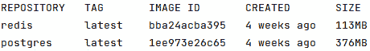

# 第十三章：将应用程序 Docker 化

在本章中，我们将学习 Docker 以及如何将应用程序打包为 Docker 镜像。了解如何将您的应用程序打包为 Docker 镜像将允许您在任何类型的环境和基础设施中部署应用程序，而无需担心设置构建应用程序的基础设施。构建 Docker 镜像将允许您在任何您喜欢的地方运行您的应用程序：构建一次，部署到任何地方。

在本章中，我们将学习以下关键主题：

+   构建 Docker 镜像

+   运行 Docker 镜像

+   从零开始创建 Docker 镜像

+   理解 Docker 镜像文件系统

+   查看 Docker Compose

# 技术要求

本章中解释的所有源代码都可以在[`github.com/PacktPublishing/Full-Stack-Web-Development-with-Go/tree/main/chapter13`](https://github.com/PacktPublishing/Full-Stack-Web-Development-with-Go/tree/main/chapter13)中查看。

# 安装 Docker

Docker 是一个开源平台，用于软件开发，它使得打包和分发程序变得容易。Docker 允许您打包您的应用程序并在不同类型的基础设施（如云环境）中运行。

在本节中，我们将查看如何在本地机器上安装 Docker。不同的操作系统安装 Docker 的步骤不同。请参考 Docker 文档以获取适用于您操作系统的深入安装指南，该指南可在[`docs.docker.com/engine/install/`](https://docs.docker.com/engine/install/)找到。

注意

本章是在 Linux 机器上编写的，因此概述的大多数命令行应用程序仅适用于 Linux。

在我们的开发机器上安装 Docker 的步骤完成后，以下是一些确保一切正常工作的操作。

使用以下命令来检查 Docker 引擎是否正在运行：

```go
systemctl list-units --type=service --state=running   | grep -i docker && systemctl list-units --type=service --state=active  | grep -i containerd
```

如果引擎已正确安装，您将看到以下输出：

```go
  docker.service                     loaded    active running Docker Application Container Engine
  containerd.service             loaded    active running containerd container runtime
```

输出显示了两个不同的服务正在运行 - `docker.service` 和 `containerd.service`。`containerd.service` 服务负责将 Docker 镜像启动到容器中，并确保所有本地机器服务都已设置，以便容器可以在 `docker.service` 服务管理镜像和与 Docker 命令行工具通信的同时运行。

现在我们知道这两个服务都在运行，让我们使用命令行工具来检查与引擎的通信。使用以下命令与引擎通信以列出所有本地可用的镜像 - 注意您可能需要具有 root 权限才能执行此操作，因此可能需要使用 `sudo` 前缀：

```go
docker images
```

在我们的情况下，我们得到如图 *图 13.1* 所示的输出，显示我们已下载了两个镜像。在您的情况下，如果您是第一次安装 Docker，它将是空的。



图 13.1：本地机器上的 Docker 镜像

我们已经在本地机器上成功完成了 Docker 的安装。在下一节中，我们将更详细地介绍如何使用 Docker 以及理解 Docker 镜像。

# 使用 Docker

在本节中，我们将探讨如何使用 Docker 进行日常操作。让我们了解使用 Docker 时提到的概念——镜像和容器：

+   **Docker 镜像**：此镜像是一个包含我们的应用程序的文件，包括所有相关的操作系统文件。

+   **容器**：镜像文件被 Docker 引擎读取和执行。一旦它在本地机器上运行，它就被称为容器。您可以使用 Docker 命令行工具与容器交互。

我们将使用以下命令查看如何使用 Docker 下载和运行一个简单的*Hello World*应用程序：

```go
docker run hello-world
```

打开您的终端并运行以下命令：

```go
$ docker run hello-world
```

此命令将下载镜像文件（如果本地不存在）并执行它。然后您将看到以下消息：

```go
Unable to find image 'hello-world:latest' locally
latest: Pulling from library/hello-world
2db29710123e: Pull complete
Digest: sha256:10d7d58d5ebd2a652f4d93fdd86da8f265f5318c6a73cc5b 6a9798ff6d2b2e67
Status: Downloaded newer image for hello-world:latest
```

一旦图像被下载并作为容器运行，它将输出以下内容：

```go
Hello from Docker!
This message shows that your installation appears to be working correctly.
To generate this message, Docker took the following steps:
 1\. The Docker client contacted the Docker daemon.
 …
 …
 https://docs.docker.com/get-started/
```

现在我们已经尝试了如何将镜像文件作为容器运行，我们将在下一节中更深入地探索 Docker 镜像。

# Docker 镜像

Docker 镜像文件看起来就像您本地机器上的任何其他文件一样，但它们以 Docker 才能理解的特殊格式存储。在本地，镜像文件存储在`/var/lib/docker/image/overlay2`目录中。要查看可用的镜像，您可以查看`repositories.json`文件，其外观如下：

```go
{
  "Repositories": {
    "hello-world": {
      "hello-world:latest":
        "sha256:feb5d9fea6a5e9606aa995e879d862b82
         5965ba48de054caab5ef356dc6b3412",
      "hello-world@sha256:
        10d7d58d5ebd2a652f4d93fdd86da8f265f5318c6a7
       3cc5b6a9798ff6d2b2e67":
         "sha256:feb5d9fea6a5e9606aa995e879d862
          b825965ba48de054caab5ef356dc6b3412"
    },
    "...
    "redis": {
      "redis:latest":
        "sha256:bba24acba395b778d9522a1adf5f0d6bba3e609
         4b2d298e71ab08828b880a01b",
      "redis@sha256:69a3ab2516b560690e37197b71bc61ba24
                    5aafe4525ebdec
       e1d8a0bc5669e3e2":
         "sha256:bba24acba395b778d9522a1adf5f0d6bba3
          e6094b2d298e71ab08828b880a01b"
    }
  }
}
```

让我们进一步探索托管镜像文件的 Docker 目录。我们可以使用以下命令获取镜像信息：

```go
docker images
```

以下输出显示了有关`hello-world`容器的某些信息：

```go
REPOSITORY    TAG       IMAGE ID           CREATED           SIZE
..
hello-world      latest    feb5d9fea6a5   7 months ago   13.3kB
..
```

`hello-world`的镜像 ID 是`feb5d9fea6a5`。让我们尝试使用以下命令在`/var/lib/docker`中找到镜像文件：

```go
sudo find /var/lib/docker -name 'feb5d9fea6a5*'
```

我们将得到以下输出：

```go
/var/lib/docker/image/overlay2/imagedb/content/sha256/feb5d9fea 6a5e9606aa995e879d862b825965ba48de054caab5ef356dc6b3412
```

现在我们使用以下命令查看该文件内部：

```go
sudo cat /var/lib/docker/image/overlay2/imagedb/content/sha256/feb5d9fea6a5e9606aa995e879d862b825965ba48de054caab5ef356dc6b3412
```

您将看到以下输出：

```go
{
  "architecture": "amd64",
  "config": {
    …
    ],
        …
  },
      …
    "Cmd": [
      "/bin/sh",
      "-c",
      "#(nop) ",
      "CMD [\"/hello\"]"
    ],
    "Image": "sha256:b9935d4e8431fb1a7f0989304ec8
              6b3329a99a25f5efdc7f09f3f8c41434ca6d",
    "Volumes": null,
    "WorkingDir": "",
    "Entrypoint": null,
    "OnBuild": null,
    "Labels": {}
  },
  "created": "2021-09-23T23:47:57.442225064Z",
  "docker_version": "20.10.7",
  "history": [
    {
       …
  ],
  "os": "linux",
  "rootfs": {
    "type": "layers",
    "diff_ids": [
      "sha256:e07ee1baac5fae6a26f30cabfe54a36d3402f96afda3
              18fe0a96cec4ca393359"
    ]
  }
}
```

下表概述了前一个 JSON 输出中一些相关字段的意义：

| **字段名称** | **描述** |
| --- | --- |
| `Cmd` | 这是在镜像文件作为容器运行时将要执行的命令。对于`hello-world`示例，当容器启动时，它将执行`hello`可执行文件。 |
| `rootfs` | `rootfs`代表*根文件系统*，这意味着它包含所有必要的操作系统文件，这些文件是作为正常机器启动所必需的。 |

我们之前看到的 JSON 信息也可以使用以下命令查看：

```go
docker image inspect hello-world:latest
```

您将得到如下所示输出：

```go
[
    {
        "Id": "sha256:feb5d9fea6a5e9606aa995e879d862b825
               965ba48de054caab5ef356dc6b3412",
        "RepoTags": [
            "hello-world:latest"
        ],
        "RepoDigests": [
            "hello-world@sha256:10d7d58d5ebd2a652
           f4d93fdd86da8f265f5318c6a73cc5b6a9798ff6d2b2e67"
        ],
        "Parent": "",
        "Comment": "",
        "Created": "2021-09-23T23:47:57.442225064Z",
        "Container": "8746661ca3c2f215da94e6d3f7dfdcafaff5
                      ec0b21c9aff6af3dc379a82fbc72",
        "ContainerConfig": {
            …
            "Cmd": [
                "/bin/sh",
                "-c",
                "#(nop) ",
                "CMD [\"/hello\"]"
            ],
            "Image": "sha256:b9935d4e8431fb1a7f0989304ec86b
                      3329a99a25f5efdc7f09f3f8c41434ca6d",
            …
        },
      …
        "Architecture": "amd64",
        "Os": "linux",
        "Size": 13256,
        "VirtualSize": 13256,
        "GraphDriver": {
            "Data": {
                "MergedDir":
                  "/var/lib/docker/overlay2/c0d9b295437ab
                   cdeb9caeec51dcbde1b11b0aeb3dd9e469f35
                   7889defed757d9/merged",
                "UpperDir":
                  "/var/lib/docker/overlay2/c0d9b295437ab
                   cdeb9caeec51dcbde1b11b0aeb3dd9e469f357
                   889defed757d9/diff",
                "WorkDir":
                  "/var/lib/docker/overlay2/c0d9b295437ab
                   cdeb9caeec51dcbde1b11b0aeb3dd9e469f357
                   889defed757d9/work"
            },
            "Name": "overlay2"
        },
                    …]
```

输出中一个有趣的信息片段是`GraphDriver`字段，它指向包含提取的 Docker 镜像的`/var/lib/docker/overlay2/c0d9b295437abcdeb9caeec51dcbde1b11b` **0aeb3dd9e469f357889defed757d9** 目录。对于 hello-world，它将是`hello`可执行文件，如下所示：

```go
total 16
drwx--x---  3 root root 4096 Apr 30 18:36 ./
drwx--x--- 30 root root 4096 Apr 30 19:21 ../
-rw-------  1 root root    0 Apr 30 19:21 committed
drwxr-xr-x  2 root root 4096 Apr 30 18:36 diff/
-rw-r--r--  1 root root   26 Apr 30 18:36 link
```

查看`diff/`目录，我们看到以下可执行文件：

```go
drwxr-xr-x 2 root root  4096 Apr 30 18:36 .
drwx--x--- 3 root root  4096 Apr 30 18:36 ..
-rwxrwxr-x 1 root root 13256 Sep 24  2021 hello
```

现在，我们已经很好地理解了 Docker 镜像是如何在本地存储的，在下一节中，我们将查看如何使用 Docker 在本地作为容器运行镜像。

# 将镜像作为容器运行

在本节中，我们将查看如何将 Docker 镜像作为容器运行，并检查容器运行时我们可以看到的不同信息。

首先运行一个数据库 Docker 镜像，查看我们可以从容器状态中获得哪些信息。打开终端窗口并运行以下命令以在本地运行 Redis。Redis 是一个开源的基于内存的数据存储，用于存储数据。由于数据存储在内存中，与存储在磁盘上相比，它速度更快。该命令将运行 Redis，监听端口`7777`：

```go
docker run -p 7777:7777  -v /home/user/Downloads/redis-7.0-rc3/data:/data redis --port 7777
```

确保将`/home/user/Downloads/redis-7.0-rc3/data`目录更改为您自己的本地目录，因为 Docker 将使用此目录来存储 Redis 数据文件。

当容器运行时，你会看到以下信息：

```go
1:C 05 May 2022 11:20:08.723 # oO0OoO0OoO0Oo Redis is starting oO0OoO0OoO0Oo
1:C 05 May 2022 11:20:08.723 # Redis version=6.2.6, bits=64, commit=00000000, modified=0, pid=1, just started
1:C 05 May 2022 11:20:08.723 # Configuration loaded
1:M 05 May 2022 11:20:08.724 * monotonic clock: POSIX clock_gettime
1:M 05 May 2022 11:20:08.724 * Running mode=standalone, port=7777.
…
1:M 05 May 2022 11:20:08.724 * Ready to accept connections
```

让我们使用 Docker 命令行工具来查看这个容器的运行状态。为了做到这一点，我们需要通过运行`docker ps`命令来获取容器的 ID；在我们的情况下，输出如下：

```go
CONTAINER ID   IMAGE      COMMAND                  CREATED         STATUS         PORTS                                                 NAMES
e1f58f395d06   redis      "docker-entrypoint.s…"   5 minutes ago   Up 5 minutes   6379/tcp, 0.0.0.0:7777->7777/tcp, :::7777->7777/tcp   reverent_dhawan
```

Redis 容器的 ID 是`e1f58f395d06`。使用此信息，我们将使用`docker inspect`来查看运行容器的不同属性。如下使用`docker inspect`：

```go
docker inspect e1f58f395d06
```

你将得到如下所示的信息输出：

```go
[[
    {
        ...
        "Mounts": [
            {
                "Type": "bind",
                "Source": "/home/user/Downloads/redis-7.0-
                           rc3/data",
                "Destination": "/data",
                "Mode": "",
                "RW": true,
                "Propagation": "rprivate"
            }
        ],
        "Config": {
            ...
            "Env": [
                "PATH=/usr/local/sbin:/usr/local/bin:
                      /usr/sbin:/usr/bin:/sbin:/bin",
                "GOSU_VERSION=1.14",
                ...
            ],
            ...
        },
        "NetworkSettings": {
            ...
            "Ports": {
                "6379/tcp": null,
                "7777/tcp": [
                    {
                        "HostIp": "0.0.0.0",
                        "HostPort": "7777"
                    },
                    {
                        "HostIp": "::",
                        "HostPort": "7777"
                    }
                ]
            },
            ...
            "Networks": {
                "bridge": {
                    ...
                }
            }
        }
    }
]
```

输出显示了关于 Redis 容器运行状态的大量信息。我们感兴趣的主要是网络和挂载。`NetworkSettings`部分显示了容器的网络配置，指示主机到容器的网络映射参数——容器正在使用端口`7777`，并且相同的端口在本地机器上暴露。

另一个有趣的事情是`Mounts`参数，它指向`/home/user/Downloads/redis-7.0-rc3/data`到容器内部`/data`本地主机目录的映射。挂载就像是从容器目录到本地机器目录的重定向。使用挂载确保在容器关闭时所有数据都保存在本地机器上。

我们已经了解了容器是什么以及如何查看容器的运行状态。现在，我们已经对镜像和容器有了很好的理解，我们将在本节中查看如何创建我们自己的镜像。

# 构建和打包镜像

在上一节中，我们学习了 Docker 镜像以及如何查看运行中容器的状态；我们还了解了 Docker 镜像是如何在本地存储的。在本节中，我们将探讨如何通过编写 `Dockerfile` 来创建我们自己的 Docker 镜像。

我们将查看 `chapter13/embed` 文件夹内的示例应用程序的构建。该示例应用程序与我们讨论过的*第四章**，即“服务与嵌入 HTML 内容”中的相同。该应用程序将运行一个监听端口 `3333` 的 HTTP 服务器，以提供嵌入的 HTML 页面。

我们将使用以下 `Dockerfile` 来构建 Docker 镜像：

```go
# 1\. Compile the app.
FROM golang:1.18  as builder
WORKDIR /app
COPY . .
RUN CGO_ENABLED=0 GOOS=linux go build -a -o bin/embed
# 2\. Create final environment for the compiled binary.
FROM alpine:latest
RUN apk --update upgrade && apk --no-cache add curl ca-certificates && rm -rf /var/cache/apk/*
RUN mkdir -p /app
# 3\. Copy the binary from step 1 and set it as the default command.
COPY --from=builder /app/bin/embed /app
WORKDIR /app
CMD /app/embed
```

让我们逐步分析命令的不同部分，以了解它在做什么。第一步是使用预构建的 Golang 1.18 Docker 镜像编译应用程序。这个镜像包含构建 Go 应用程序所需的所有工具。我们使用 `WORKDIR` 命令指定 `/app` 作为工作目录，并在最后一行使用 `COPY` 命令复制所有源文件，并使用标准的 `go build` 命令行编译源代码。

```go
FROM golang:1.18  as builder
WORKDIR /app
COPY . .
RUN CGO_ENABLED=0 GOOS=linux go build -a -o bin/embed
```

在成功编译应用程序后，下一步是准备将托管应用程序的运行时环境。在这种情况下，我们使用预构建的 Alpine Linux 操作系统 Docker 镜像。Alpine 是一个在尺寸上较小的 Linux 发行版，这使得它在创建用于在应用程序上运行的 Docker 镜像时非常理想。

接下来，我们想要做的是通过使用 `-update upgrade` 命令确保操作系统是最新的。这确保了操作系统包含所有最新的更新，包括安全更新。最后一步是创建一个新的 `/app` 目录，用于存储应用程序的二进制文件：

```go
FROM alpine:latest
RUN apk --update upgrade && apk --no-cache add curl ca-certificates && rm -rf /var/cache/apk/*
RUN mkdir -p /app
```

最后一步是将上一步创建的标记为 `builder` 的二进制文件复制到新的 `/app` 目录中。`CMD` 命令指定了当 Docker 镜像作为容器执行时要运行的命令——在这种情况下，我们想要运行由参数 `/app/embed` 指定的示例应用程序 `embed`：

```go
COPY --from=builder /app/bin/embed /app
WORKDIR /app
CMD /app/embed
```

现在我们已经了解了 `Dockerfile` 所做的工作，让我们创建 Docker 镜像。使用以下命令构建镜像：

```go
docker build  --tag chapter13 .
```

你将看到如下所示的输出，展示了 Docker 构建镜像时进行的不同步骤和过程：

```go
Sending build context to Docker daemon   29.7kB
Step 1/10 : FROM golang:1.18  as builder
 ---> 65b2f1fa535f
Step 2/10 : WORKDIR /app
 ---> Using cache
 ---> 7ab996f8148c
…
Step 5/10 : FROM alpine:latest
 ---> 0ac33e5f5afa
…
Step 8/10 : COPY --from=builder /app/bin/embed /app
…
Step 10/10 : CMD /app/embed
 ---> Using cache
 ---> ade99a01b92e
Successfully built ade99a01b92e
Successfully tagged chapter13:latest
```

一旦你收到“成功标记”的消息，构建过程就完成了，镜像已准备好在你的本地机器上使用。

新镜像将被标记为 `chapter13`，当我们使用 `docker images` 命令时，它将看起来如下：

```go
REPOSITORY    TAG           IMAGE ID       CREATED             SIZE
…
chapter13     latest        ade99a01b92e   33 minutes ago      16.9MB
…
golang        1.18          65b2f1fa535f   14 hours ago        964MB
…
hello-world   latest        feb5d9fea6a5   7 months ago        13.3kB
```

使用以下命令运行新创建的镜像：

```go
docker  run -p 3333:3333 chapter13
```

该命令将以容器形式运行镜像，并使用 `-p` 端口参数，将容器内的端口 `3333` 映射到主机上的相同端口 `3333`。打开你的浏览器，输入 `http://localhost:3333`，你将看到如图 *图 13**.2* 所示的 HTML 登录页面：


图 13.2：从 Docker 容器中提供 Web 应用程序

在下一节中，我们将了解 Docker Compose。

# Docker Compose

Docker 提供了另一个名为 Docker Compose 的工具，允许开发者同时运行多个容器。考虑一下这样的用例，你正在构建一个需要临时内存存储来存储购物车信息的服务器；这需要使用外部应用程序，如 Redis，它提供了一个内存数据库。

在这种场景下，我们的应用程序依赖于 Redis 正常运行，这意味着我们需要在运行应用程序的同时运行 Redis。还有许多其他不同类型的用例，其中将需要使用 Docker Compose。Docker Compose 文档提供了如何在本地机器上安装它的完整分步指南：[`docs.docker.com/compose/install/`](https://docs.docker.com/compose/install/)。

Docker Compose 实际上是一个文件，概述了我们想要使用的不同容器。让我们尝试运行位于 `chapter13/embed` 文件夹内的示例 Docker Compose 文件。打开终端并确保你位于 `chapter13/embed` 文件夹中，然后执行以下命令：

```go
docker compose -f compose.yaml up
```

你将得到以下输出：

```go
[+] Running 7/7
   ⠿ cache Pulled 11.6s
   ⠿ 213ec9aee27d Already exists  0.0s
   ⠿ c99be1b28c7f Pull complete    1.4s
   ⠿ 8ff0bb7e55e3 Pull complete   1.8s
   ⠿ 477c33011f3e Pull complete   4.8s
   ⠿ 2bbc51a93257 Pull complete   4.8s
   ⠿ 2d27eae19281 Pull complete   4.9s
[+] Building 7.3s (15/15) FINISHED
 => [internal] load build definition from Dockerfile    0.0s
 => => transferring dockerfile: 491B                    0.0s
 => [internal] load .dockerignore                       0.0s
 => => transferring context: 2B                         0.0s
 => [internal] load metadata for docker.io/library/alpine:latest 0.0s
 => [internal] load metadata for docker.io/library/golang:1.18   0.0s
 => [builder 1/4] FROM docker.io/library/golang:1.18             0.3s
 => [stage-1 1/5] FROM docker.io/library/alpine:latest           0.1s
 => [internal] load build context                                0.2s
 => => transferring context: 18.81kB                             0.0s
 => [stage-1 2/5] RUN apk --update upgrade && apk --no-cache add curl ca-certificates && rm -rf /var/cache/apk/*   5.5s
 => [builder 2/4] WORKDIR /app  0.2s
 => [builder 3/4] COPY . .   0.1s
 => [builder 4/4] RUN CGO_ENABLED=0 GOOS=linux go build -a -o bin/embed 6.4s
 => [stage-1 3/5] RUN mkdir -p /app  1.4s
 => [stage-1 4/5] COPY --from=builder /app/bin/embed /app  0.1s
 => [stage-1 5/5] WORKDIR /app  0.0s
 => exporting to image  0.1s
 => => exporting layers  0.1s
 => => writing image sha256:84621b13c179c03eed57a23c66974659eae 4b50c97e3f8af13de99db1adf4c06  0.0s
 => => naming to docker.io/library/embed-server  0.0s
[+] Running 3/3
 ⠿ Network embed_default     Created 0.1s
 ⠿ Container embed-cache-1   Created 0.1s
 ⠿ Container embed-server-1  Created 0.1s
Attaching to embed-cache-1, embed-server-1
embed-server-1  | 2022/09/10 06:24:30 Server Version : 0.0.1
embed-cache-1   | 1:C 10 Sep 2022 06:24:30.898 # oO0OoO0OoO0Oo Redis is starting oO0OoO0OoO0Oo
embed-cache-1   | 1:C 10 Sep 2022 06:24:30.898 # Redis version=7.0.4, bits=64, commit=00000000, modified=0, pid=1, just started
...
embed-cache-1   | 1:M 10 Sep 2022 06:24:30.899 * Running mode=standalone, port=6379.
embed-cache-1   | 1:M 10 Sep 2022 06:24:30.899 # Server initialized
...
embed-cache-1   | 1:M 10 Sep 2022 06:24:30.899 * Loading RDB produced by version 6.2.7
embed-cache-1   | 1:M 10 Sep 2022 06:24:30.899 * RDB age 10 seconds
...
embed-cache-1   | 1:M 10 Sep 2022 06:24:30.899 * Ready to accept connections
```

一切运行起来后，你应该能够通过打开浏览器并在地址栏中输入 `http://localhost:3333` 来访问服务器。

Docker Compose 文件如下所示：

```go
version: '3'
services:
 server:
   build: .
   ports:
     - "3333:3333"
 cache:z
   image: redis:7.0.4-alpine
   restart: always
   ports:
     - '6379:6379'
```

该文件概述了需要运行的两个容器——服务器指向我们的应用程序服务器，而 `build` 参数使用的是 `.` 点表示法。这告诉 Docker Compose，构建此容器镜像的源（Dockerfile）位于本地目录中，而缓存服务是一个 Redis 服务器，它将从 Docker 远程仓库中拉取，具体版本为 7.0.4。

# 摘要

在本章中，我们学习了 Docker 是什么以及如何使用它。构建应用程序是谜题的一部分，但要将它们打包以部署到云环境中，则需要开发者了解 Docker 以及如何为他们的应用程序构建 Docker 镜像。我们探讨了 Docker 在本地机器上存储镜像的方式，并检查了运行容器的状态。

我们了解到，当容器运行时，会产生大量信息，这些信息可以帮助我们了解容器运行的情况以及运行应用程序所使用的参数。我们还学习了 `Dockerfile` 的相关知识，并使用它将我们的示例应用程序打包进容器中，以便作为一个单独的 Docker 镜像运行。

在下一章中，我们将通过将我们的镜像部署到云环境中来应用本章所获得的知识。
