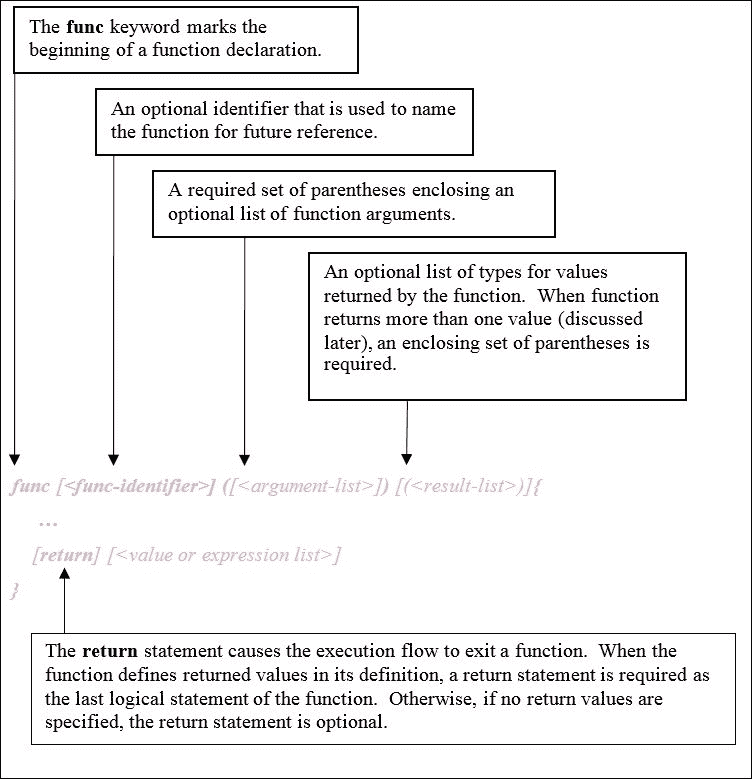

# 第五章。Go 中的函数

Go 语法中的一项*杰作*是其对高阶函数的支持，正如在 Python 或 Ruby 等动态语言中所发现的那样。正如我们在本章中将要看到的，函数也是一个具有值的类型实体，这个值可以被分配给一个变量。在本章中，我们将探讨 Go 中的函数，包括以下主题：

+   Go 函数

+   传递参数值

+   匿名函数和闭包

+   高阶函数

+   错误信号处理

+   延迟函数调用

+   函数恐慌和恢复

# Go 函数

在 Go 中，函数是一等、有类型的编程元素。声明的函数字面量始终具有类型和值（定义的函数本身），并且可以选择绑定到命名标识符。因为函数可以用作数据，所以它们可以被分配给变量或作为其他函数的参数传递。

## 函数声明

在 Go 中声明函数采用以下一般形式，如图所示。这种规范形式用于声明命名和匿名函数。



在 Go 中，最常见的函数定义形式包括函数字面量中的函数的指定标识符。为了说明这一点，以下表格显示了几个程序的源代码，其中包含具有不同参数和返回类型组合的命名函数的定义。

| **代码** | **描述** |
| --- | --- |

|

```go
package main import (
  "fmt"
  "math"
)func printPi() {
  fmt.Printf("printPi()
    %v\n", math.Pi)
} func main() {
  printPi() }               ("fmt" "math" ) func
printPi() {
  fmt.Printf("printPi()
    %v\n", math.Pi)
}
func main() { printPi() }
```

golang.fyi/ch05/func0.go | 一个名为 `printPi` 的函数。它不接受任何参数，也不返回任何值。注意，当没有返回值时，`return` 语句是可选的。|

|

```go
package main   
import "fmt"   

func avogadro() float64 {   
   return 6.02214129e23   
}   

func main() {   
   fmt.Printf("avogadro()
   = %e 1/mol\n",   
   avogadro())   
}   

```

golang.fyi/ch05/func1.go | 一个名为 `avogadro` 的函数。它不接受任何参数，但返回一个 `float64` 类型的值。注意，当返回值作为函数签名的一部分声明时，需要 `return` 语句。|

|

```go
package main   
import "fmt"    
func fib(n int) {   
  fmt.Printf("fib(%d):
    [", n)
  var p0, p1 uint64 = 0,
    1   
  fmt.Printf("%d %d ",
    p0, p1)   
  for i := 2; i <= n; i++
  {   
    p0, p1 = p1, p0+p1
    fmt.Printf("%d ",p1)
  }   
  fmt.Println("]")   
}   
func main() {   
  fib(41)   
}
```

golang.fyi/ch05/func2.go | 这定义了函数 `fib`。它接受参数 `n`，类型为 `int`，并打印出最多到 `n` 的斐波那契数列。同样，没有返回值，因此省略了 `return` 语句。|

|

```go
package main   
import (   
  "fmt"   
  "math"   
)    
func isPrime(n int) bool {   
  lim :=
  int(math.Sqrt
  (float64(n)))
  for p := 2; p <= lim;
  p++ {
    if (n % p) == 0 {   
      return false   
    }  }   
  return true   
}   
func main() {   
  prime := 37
  fmt.Printf
  ("isPrime(%d)  =
  %v\n", prime,
  isPrime(prime))
}
```

golang.fyi/ch05/func3.go | 最后一个例子定义了 `isPrime` 函数。它接受一个 `int` 类型的参数，并返回一个 `bool` 类型的值。由于函数被声明为返回 `bool` 类型的值，因此在执行流程中的最后一个逻辑语句必须是一个返回该声明类型的 `return` 语句。|

### 注意

**函数签名**

指定参数类型、结果类型及其声明的顺序的集合被称为函数的签名。这是帮助识别函数的另一个独特特征。两个函数可能有相同数量的参数和结果值；然而，如果这些元素的顺序不同，那么函数的签名就不同。

## 函数类型

通常，在函数字面量中声明的名称标识符用于通过调用表达式调用函数，其中函数标识符后面跟着参数列表。这是我们到目前为止在书中看到的情况，以下示例展示了调用`fib`函数：

```go
func main() { 
   fib(41) 
} 

```

然而，当函数的标识符不带括号出现时，它被视为具有类型和值的普通变量，如下面的程序所示：

```go
package main 
import "fmt" 

func add(op0 int, op1 int) int { 
   return op0 + op1 
} 

func sub(op0, op1 int) int { 
   return op0 - op1 
} 

func main() { 
   var opAdd func(int, int) int = add 
   opSub := sub 
   fmt.Printf("op0(12,44)=%d\n", opAdd(12, 44)) 
   fmt.Printf("sub(99,13)=%d\n", opSub(99, 13)) 
}  

```

golang.fyi/ch05/functype.go

函数的类型由其签名确定。当函数具有相同数量、相同类型且顺序相同的参数时，它们被认为是同一类型的。在之前的示例中，`opAdd`变量被声明为具有类型`func (int, int) int`。这与声明的函数`add`和`sub`的签名相同。因此，`opAdd`变量被分配了`add`函数变量。这允许`opAdd`以调用`add`函数的方式被调用。

同样，对于`opSub`变量也是如此。它被分配了由函数标识符`sub`和类型`func (int, int)`表示的值。因此，`opSub(99,13)`调用了第二个函数，该函数返回减法的结果。

## 可变参数

函数的最后一个参数可以声明为**可变参数**（**可变长度参数**），通过在参数类型之前附加省略号（`…`）来实现。这表示在调用函数时，可以传递零个或多个该类型的值。

以下示例实现了两个接受可变参数的函数。第一个函数计算传递值的平均值，第二个函数将作为参数传递的数字求和：

```go
package main 
import "fmt" 

func avg(nums ...float64) float64 { 
   n := len(nums) 
   t := 0.0 
   for _, v := range nums { 
         t += v 
   } 
   return t / float64(n) 
} 

func sum(nums ...float64) float64 { 
   var sum float64 
   for _, v := range nums { 
         sum += v 
   } 
   return sum 
} 

func main() { 
   fmt.Printf("avg([1, 2.5, 3.75]) =%.2f\n", avg(1, 2.5, 3.75)) 
   points := []float64{9, 4, 3.7, 7.1, 7.9, 9.2, 10} 
   fmt.Printf("sum(%v) = %.2f\n", points, sum(points...)) 
} 

When no parameters are provided, the function receives an empty slice. The astute reader may be wondering, "Is it possible to pass in an existing slice of values as variadic arguments?" Thankfully, Go provides an easy idiom to handle such a case. Let's examine the call to the  `sum` function in the following code snippet:

```

points := []float64{9, 4, 3.7, 7.1, 7.9, 9.2, 10}

fmt.Printf("sum(%v) = %f\n", points, sum(points...))

```go

A slice of floating-point values is declared and stored in variable `points`. The slice can be passed as a variadic parameter by adding ellipses to the parameter in the `sum(points...)` function call.
```

## 函数结果参数

Go 函数可以被定义为返回一个或多个结果值。到目前为止，在书中，我们遇到的大多数函数都被定义为返回单个结果值。一般来说，一个函数能够返回由逗号分隔的多个结果值，具有不同的类型（参见上一节，*函数声明*）。

为了说明这个概念，让我们检查以下简单的程序，该程序定义了一个实现欧几里得除法算法（参见[`en.wikipedia.org/wiki/Division_algorithm`](http://en.wikipedia.org/wiki/Division_algorithm)）的函数。`div`函数返回商和余数值作为其结果：

```go
package main 
import "fmt" 

func div(op0, op1 int) (int, int) { 
   r := op0 
   q := 0 
   for r >= op1 { 
         q++ 
         r = r - op1 
   } 
   return q, r 
} 

func main() { 
   q, r := div(71, 5) 
   fmt.Printf("div(71,5) -> q = %d, r = %d\n", q, r) 
} 

```

golang.fyi/ch05/funcret0.go

`**return**` 关键字后面跟着与函数签名中声明的结果匹配的结果值数量。在先前的例子中，`div` 函数的签名指定了两个 `int` 值作为结果值。在函数内部，该函数定义了 `int` 变量 `p` 和 `r`，在函数完成后作为结果值返回。这些返回值必须与函数签名中定义的类型匹配，否则可能会出现编译错误。

具有多个结果值的函数必须在正确的上下文中调用：

+   它们必须分别分配给相同类型的标识符列表

+   它们只能包含在期望相同数量返回值的表达式中

这在以下源代码片段中得到了说明：

```go
q, r := div(71, 5) 
fmt.Printf("div(71,5) -> q = %d, r = %d\n", q, r) 

```

### 命名结果参数

通常，可以使用变量标识符及其类型来指定函数签名的结果列表。当使用命名标识符时，它们作为常规声明的变量传递给函数，并且可以根据需要访问和修改。在遇到 `return` 语句时，最后分配的结果值将被返回。这在下述源代码片段中得到了说明，这是先前程序的改写：

```go
func div(dvdn, dvsr int) (q, r int) { 
   r = dvdn 
   for r >= dvsr { 
         q++ 
         r = r - dvsr 
   } 
   return 
} 

```

golang.fyi/ch05/funcret1.go

注意到 `return` 语句是裸露的；它省略了所有标识符。如前所述，`q` 和 `r` 中分配的值将被返回给调用者。为了可读性、一致性或风格，您可以选择不使用裸露的 `return` 语句。将标识符的名称附加到 `return` 语句（如 `return q, r`）是完全可以接受的。

# 传递参数值

在 Go 中，所有传递给函数的参数都是按值传递的。这意味着在调用函数内部创建了一个传递值的局部副本。没有传递参数值按引用传递的固有概念。以下代码通过在 `dbl` 函数内部修改传递的参数 `val` 的值来演示这一机制：

```go
package main 
import ( 
   "fmt" 
   "math" 
) 

func dbl(val float64) { 
   val = 2 * val // update param 
   fmt.Printf("dbl()=%.5f\n", val) 
} 

func main() { 
   p := math.Pi 
   fmt.Printf("before dbl() p = %.5f\n", p) 
   dbl(p) 
   fmt.Printf("after dbl() p = %.5f\n", p) 
} 

```

golang.fyi/ch05/funcpassbyval.go

当程序运行时，它会产生以下输出，记录了在传递给 `dbl` 函数之前 `p` 变量的状态。更新是在 `dbl` 函数内部传递的参数变量本地进行的，最后是调用 `dbl` 函数后 `p` 变量的值：

```go
$> go run funcpassbyval.go
before dbl() p = 3.14159
dbl()=6.28319
after dbl() p = 3.14159

```

前面的输出显示，分配给变量 `p` 的原始值在传递给似乎在内部更新其值的函数之后保持不变。这是因为 `dbl` 函数中的 `val` 参数接收了传递参数的局部副本。

## 实现按引用传递

虽然按值传递在许多情况下是合适的，但需要注意的是，Go 可以通过使用指针参数值来实现按引用语义。这允许被调用的函数超出其词法作用域，并改变由指针参数引用的位置存储的值，就像以下示例中的`half`函数所做的那样：

```go
package main 
import "fmt" 

func half(val *float64) { 
   fmt.Printf("call half(%f)\n", *val) 
   *val = *val / 2 
} 

func main() { 
   num := 2.807770 
   fmt.Printf("num=%f\n", num) 
   half(&num) 
   fmt.Printf("half(num)=%f\n", num) 
} 

```

golang.fyi/ch05/funcpassbyref.go

在先前的示例中，`main()`中对`half(&num)`函数的调用就地更新了其`num`参数引用的原始值。因此，当代码执行时，它显示了`num`的原始值和调用`half`函数后的值：

```go
$> go run funcpassbyref.go
num=2.807770
call half(2.807770)
half(num)=1.403885

```

如前所述，Go 函数参数是按值传递的。即使函数接受指针值作为其参数，这也是正确的。Go 仍然创建并传递指针值的本地副本。在先前的示例中，`half`函数通过`val`参数接收到的指针值的副本。代码使用指针运算符（`*`）进行解引用并就地操作由`val`引用的值。当`half`函数退出并超出作用域时，其更改可以通过调用`main`函数来访问。

## 匿名函数和闭包

函数可以写成字面量，而不需要命名标识符。这些被称为匿名函数，可以将它们赋给变量以供以后调用，如下面的示例所示：

```go
package main 
import "fmt" 

var ( 
   mul = func(op0, op1 int) int { 
         return op0 * op1 
   } 

   sqr = func(val int) int { 
         return mul(val, val) 
   } 
) 

func main() { 
   fmt.Printf("mul(25,7) = %d\n", mul(25, 7)) 
   fmt.Printf("sqr(13) = %d\n", sqr(13)) 
}  

```

golang.fyi/ch05/funcs.go

之前的程序显示了两个声明并绑定到`mul`和`sqr`变量的匿名函数。在两种情况下，函数都接受参数并返回一个值。在`main()`的后面，这些变量被用来调用绑定到它们的函数代码。

## 调用匿名函数字面量

值得注意的是，匿名函数不必绑定到标识符。函数字面量可以直接作为返回函数结果的表达式进行评估。这是通过在函数字面量末尾添加一个括号内的参数值列表来完成的，如下面的程序所示：

```go
package main 
import "fmt" 

func main() { 
   fmt.Printf( 
         "94 (°F) = %.2f (°C)\n", 
         func(f float64) float64 { 
               return (f - 32.0) * (5.0 / 9.0) 
         }(94), 
   ) 
} 

fmt.Printf(). The function itself is defined to accept a parameter and returns a value of type float64.
```

```go
fmt.Printf( 
   "94 (°F) = %.2f (°C)\n", 
   func(f float64) float64 { 
         return (f - 32.0) * (5.0 / 9.0) 
   }(94), 
) 

```

由于函数字面量以括号内的参数列表结束，因此函数作为表达式被调用。

## 闭包

Go 函数字面量是闭包。这意味着它们对其封装代码块外部声明的非局部变量具有词法可见性。以下示例说明了这一点：

```go
package main 
import ( 
   "fmt" 
   "math" 
) 

func main() { 
   for i := 0.0; i < 360.0; i += 45.0 { 
         rad := func() float64 { 
               return i * math.Pi / 180 
         }() 
         fmt.Printf("%.2f Deg = %.2f Rad\n", i, rad) 
   } 
} 

```

github.com/vladimirvivien/learning-go/ch05/funcs.go

在先前的程序中，函数字面量代码块`func() float64 {return deg * math.Pi / 180}()`被定义为将度数转换为弧度的表达式。在循环的每次迭代中，在封闭的函数字面量和外部非局部变量`i`之间形成一个闭包。这提供了一种更简单的语法，其中函数自然地访问非局部值，而无需求助于其他手段，如指针。

### 注意

在 Go 中，词法封闭的值可以在创建封闭的外部函数超出作用域很长时间后仍然与其封闭相关联。垃圾收集器将在这些封闭值变得无界时处理清理工作。

# 高阶函数

我们已经确定 Go 函数是与类型绑定的值。因此，一个 Go 函数可以接受另一个函数作为参数，也可以返回一个函数作为结果值，这描述了被称为高阶函数的概念，这是一个从数学中采纳的概念。虽然 `struct` 等类型允许程序员抽象数据，但高阶函数提供了一种封装和抽象行为的方式，这些行为可以组合在一起形成更复杂的行为。

为了使这个概念更清晰，让我们检查以下程序，它使用一个高阶函数 `apply` 来完成三件事情。它接受一个整数切片和一个函数作为参数。它将指定的函数应用于切片中的每个元素。最后，`apply` 函数还返回一个函数作为其结果：

```go
package main 
import "fmt" 

func apply(nums []int, f func(int) int) func() { 
   for i, v := range nums { 
         nums[i] = f(v) 
   } 
   return func() { 
         fmt.Println(nums) 
   } 
} 

func main() { 
   nums := []int{4, 32, 11, 77, 556, 3, 19, 88, 422} 
   result := apply(nums, func(i int) int { 
         return i / 2 
   }) 
   result() 
} 

```

golang.fyi/ch05/funchighorder.go

在程序中，`apply` 函数通过一个匿名函数调用，将切片中的每个元素减半，如下面的代码片段所示：

```go
nums := []int{4, 32, 11, 77, 556, 3, 19, 88, 422} 
result := apply(nums, func(i int) int { 
   return i / 2 
}) 
result() 

As you explore this book, and the Go language, you will continue to encounter usage of higher-order functions. It is a popular idiom that is used heavily in the standard libraries. You will also find higher-order functions used in some concurrency patterns to distribute workloads (see Chapter 9, *Concurrency*).
```

# 错误信号和处理

在这一点上，让我们讨论在函数调用时如何惯用信号和处理错误。如果您使用过 Python、Java 或 C# 等语言，您可能熟悉在出现不希望的状态时通过抛出异常来中断执行流程。

正如我们将在本节中探讨的，Go 对错误信号和错误处理采用了简化的方法，将责任放在程序员身上，要求在调用函数返回后立即处理可能出现的错误。Go 不鼓励通过在执行程序中无差别地短路异常来中断执行，希望它将在调用堆栈的更高处得到适当处理。在 Go 中，传统的错误信号方式是在函数执行过程中出现问题时返回一个类型为 `error` 的值。因此，让我们更详细地看看这是如何实现的。

## 信号错误

为了更好地理解前一段落中描述的内容，让我们从一个例子开始。以下源代码实现了 Jon Bentley 流行书籍 *Programming Pearls*（第二版）中第 2 列描述的字母表程序。该代码读取字典文件（`dict.txt`）并将所有具有相同字母表的单词分组。如果代码不太清楚，请参阅 [golang.fyi/ch05/anagram1.go](http://learning.golang.fyi/ch05/anagram1.go)，以了解程序每个部分的注释说明。

```go
package main 

import ( 
   "bufio" 
   "bytes" 
   "fmt" 
   "os" 
   "errors" 
) 

// sorts letters in a word (i.e. "morning" -> "gimnnor") 
func sortRunes(str string) string { 
   runes := bytes.Runes([]byte(str)) 
   var temp rune 
   for i := 0; i < len(runes); i++ { 
         for j := i + 1; j < len(runes); j++ { 
               if runes[j] < runes[i] { 
                     temp = runes[i] 
                     runes[i], runes[j] = runes[j], temp 
               } 

         } 
   } 
   return string(runes) 
} 

// load loads content of file fname into memory as []string 
func load(fname string) ([]string, error) { 
   if fname == "" { 
         return nil, errors.New( 
               "Dictionary file name cannot be empty.")  
   } 

   file, err := os.Open(fname) 
   if err != nil { 
         return nil, err 
   } 
   defer file.Close() 

   var lines []string 
   scanner := bufio.NewScanner(file) 
   scanner.Split(bufio.ScanLines) 
   for scanner.Scan() { 
         lines = append(lines, scanner.Text()) 
   } 
   return lines, scanner.Err() 
} 

func main() { 
   words, err := load("dict.txt")       
   if err != nil { 
         fmt.Println("Unable to load file:", err) 
         os.Exit(1) 
   } 

      anagrams := make(map[string][]string) 
   for _, word := range words { 
         wordSig := sortRunes(word) 
         anagrams[wordSig] = append(anagrams[wordSig], word) 
   } 

   for k, v := range anagrams { 
         fmt.Println(k, "->", v) 
   } 
} 

load function (extracted from the previous example):
```

```go
func load(fname string) ([]string, error) { 
   if fname == "" { 
       return nil, errors.New( 
         "Dictionary file name cannot be empty.")  
   } 

   file, err := os.Open(fname) 
   if err != nil { 
         return nil, err 
   } 
   ... 
} 

load function signals an error occurrence to its callers in two possible instances:
```

+   当预期的文件名（`fname`）为空时

+   当调用 `os.Open()` 失败时（例如，权限错误，或其他情况）

在第一种情况下，当没有提供文件名时，代码使用`errors.New()`创建一个`error`类型的值来退出函数。在第二种情况下，`os.Open`函数返回一个表示文件的指针和一个错误，分别赋值给`file`和`err`变量。如果`err`不是`nil`（表示生成了错误），则`load`函数的执行会提前终止，并将`err`的值返回给调用栈上更高层的调用函数处理。

### 注意

当一个函数有多个结果参数时返回错误，通常习惯于为其他（非错误类型）参数返回零值。在示例中，对于`[]string`类型的返回值返回了`nil`值。虽然这不是必需的，但它简化了错误处理，并避免了函数调用者产生任何混淆。

## 错误处理

```go
load function is handled in the main function:
```

```go
func main() { 
   words, err := load("dict.txt") 
   if err != nil { 
         fmt.Println("Unable to load file:", err) 
         os.Exit(1) 
   } 
   ... 
} 

```

由于`main`函数是调用栈中最顶层的调用者，它通过终止整个程序来处理错误。

这就是 Go 中错误处理机制的全部内容。该语言强制程序员在每次返回`error`类型值的函数调用时都测试错误状态。`if…not…nil error`处理方法可能对某些人来说显得过于冗长，尤其是如果你来自具有正式异常机制的语言。然而，这里的优势是程序可以构建一个健壮的执行流程，程序员总是知道错误可能来自哪里，并适当地处理它们。

## 错误类型

`error`类型是一个内置接口，因此在使用之前必须实现。幸运的是，Go 标准库提供了现成的实现。我们已经使用了一个来自该包的实现，即`errors`：

```go
errors.New("Dictionary file name cannot be empty.")  

```

您还可以使用`fmt.Errorf`函数创建参数化的错误值，如下面的代码片段所示：

```go
func load(fname string) ([]string, error) { 
   if fname == "" { 
         return nil, errors.New( 
             "Dictionary file name cannot be emtpy.") 
   } 

   file, err := os.Open(fname) 
   if err != nil { 
         return nil, fmt.Errorf( 
             "Unable to open file %s: %s", fname, err) 
   } 
   ... 
} 

http://golang.org/src/os/error.go shows the declaration of reusable errors associated with OS file operations:
```

```go
var ( 
   ErrInvalid    = errors.New("invalid argument") 
   ErrPermission = errors.New("permission denied") 
   ErrExist      = errors.New("file already exists") 
   ErrNotExist   = errors.New("file does not exist") 
) 

```

[`golang.org/src/os/error.go`](http://golang.org/src/os/error.go)

您还可以创建自己的`error`接口实现来创建自定义错误。这个主题在第七章，*方法、接口和对象*中再次被提及，书中讨论了扩展类型的概念。

# 延迟函数调用

Go 支持延迟函数调用的概念。在函数调用前放置关键字`defer`会产生有趣的效果，它将函数推入一个内部栈，延迟其执行直到包含函数返回之前。为了更好地解释这一点，让我们从一个简单的程序开始，该程序说明了`defer`的使用：

```go
package main 
import "fmt" 

func do(steps ...string) { 
   defer fmt.Println("All done!") 
   for _, s := range steps { 
         defer fmt.Println(s) 
   } 

   fmt.Println("Starting") 
} 

func main() { 
   do( 
         "Find key", 
         "Aplly break", 
         "Put key in ignition", 
         "Start car", 
   ) 
} 

```

golang.fyi/ch05/defer1.go

之前的示例定义了 `do` 函数，该函数接受可变参数 `steps`。该函数使用 `defer fmt.Println("All done!")` 延迟语句。接下来，该函数遍历 `steps` 切片，并使用 `defer fmt.Println(s)` 延迟输出每个元素。函数 `do` 中的最后一个语句是对 `fmt.Println("Starting")` 的非延迟调用。注意程序执行时打印的字符串值的顺序，如下面的输出所示：

```go
$> go run defer1.go
Starting
Start car
Put key in ignition
Aplly break
Find key
All done!

```

有几个事实可以解释打印输出的反向顺序。首先，回想一下，延迟函数是在其封装函数返回之前执行的。因此，第一个打印的值是由最后一个非延迟方法调用生成的。其次，如前所述，延迟语句被推入一个栈中。因此，延迟调用是按照后进先出的顺序执行的。这就是为什么 `"All done!"` 是输出中最后一个打印的字符串值。

## 使用 defer

```go
load function calls file.Close() right before it returns:
```

```go
func load(fname string) ([]string, error) { 
... 
   file, err := os.Open(fname) 
   if err != nil { 
         return nil, err 
   } 
   defer file.Close() 
... 
} 

```

golang.fyi/ch05/anagram2.go

在 Go 中，打开-defer-关闭资源的模式被广泛使用。通过在打开或创建资源后立即放置延迟意图，可以使代码读起来更自然，并减少资源泄漏的可能性。

# 函数 panic 和恢复

在本章的早期，提到 Go 没有其他语言提供的传统异常机制。然而，在 Go 中，有一种突然退出执行函数的方法，称为函数 panic。相反，当程序处于 panic 状态时，Go 提供了一种恢复和重新控制执行流程的方法。

## 函数 panic

```go
write function to panic when there is a file error:
```

```go
package main 
... 
func write(fname string, anagrams map[string][]string) { 
   file, err := os.OpenFile( 
         fname,  
         os.O_WRONLY+os.O_CREATE+os.O_EXCL,  
         0644, 
   ) 
   if err != nil { 
         msg := fmt.Sprintf( 
               "Unable to create output file: %v", err, 
         ) 
         panic(msg) 
   } 
   ... 
} 

func main() { 
   words, err := load("dict.txt") 
   if err != nil { 
         fmt.Println("Unable to load file:", err) 
         os.Exit(1) 
   } 
   anagrams := mapWords(words) 
   write("out.txt", anagrams) 
} 

write function calls the panic function if os.OpenFile() method errors out. When the program calls the main function, if there is an output file already in the working directory, the program will panic and crash as shown in the following stack trace, indicating the sequence of calls that caused the crash:
```

```go
> go run anagram2.go 
panic: Unable to create output file: open out.txt: file exists
goroutine 1 [running]:
main.write(0x4e7b30, 0x7, 0xc2080382a0)
/Go/src/github.com/vladimirvivien/learning-go/ch05/anagram2.go:72 +0x1a3 
main.main()
Go/src/github.com/vladimirvivien/learning-go/ch05/anagram2.go:103 +0x1e9
exit status 2

```

## 函数 panic 恢复

当函数 panic 时，如前所述，它可以崩溃整个程序。这可能取决于你的需求。然而，在 panic 序列开始后，可以重新获得控制。为此，Go 提供了一个内置的函数，称为 `recover`。

Recover 与 panic 一起工作。对函数 recover 的调用返回传递给 panic 的值。下面的代码显示了如何从上一个示例中引入的 panic 调用中恢复。在这个版本中，为了清晰起见，将 `write` 函数移动到 `makeAnagram()` 内部。当从 `makeAnagram()` 调用 `write` 函数并无法打开文件时，它将 panic。然而，现在添加了额外的代码来恢复：

```go
package main 
... 
func write(fname string, anagrams map[string][]string) { 
   file, err := os.OpenFile( 
         fname,  
         os.O_WRONLY+os.O_CREATE+os.O_EXCL,  
         0644, 
   ) 
   if err != nil { 
         msg := fmt.Sprintf( 
               "Unable to create output file: %v", err, 
         ) 
         panic(msg) 
   } 
   ... 
} 

func makeAnagrams(words []string, fname string) { 
   defer func() { 
         if r := recover(); r != nil { 
               fmt.Println("Failed to make anagram:", r) 
         } 
   }() 

   anagrams := mapWords(words) 
   write(fname, anagrams) 
} 
func main() { 
   words, err := load("") 
   if err != nil { 
         fmt.Println("Unable to load file:", err) 
         os.Exit(1) 
   } 
   makeAnagrams(words, "") 
} 

```

golang.fyi/ch05/anagram3.go

要能够从展开的 panic 序列中恢复，代码必须对 recover 函数进行延迟调用。在前面的代码中，这是通过在 `makeAnagrams` 函数中将 `recover()` 包裹在匿名函数字面量中来实现的，如下面的代码片段所示：

```go
defer func() { 
   if r := recover(); r != nil { 
         fmt.Println("Failed to make anagram:", r) 
   } 
}() 

```

当延迟的 `recover` 函数执行时，程序有机会重新获得控制并防止 panic 崩溃正在运行的程序。如果 `recover()` 返回 `nil`，则表示没有当前 panic 正在沿着调用栈展开，或者 panic 已经在下游被处理。

现在，当程序执行时，它不会因为堆栈跟踪而崩溃，而是恢复并优雅地显示问题，如下面的输出所示：

```go
> go run anagram3.go
Failed to make anagram: Unable to open output file for creation: open out.txt: file exists

```

### 注意

你可能想知道为什么我们在调用`panic`函数时传递了一个字符串，却在测试`recover`函数返回的值时使用了一个`nil`。这是因为`panic`和`recover`都接受一个空的接口类型。正如你将要学习的，空的接口类型是一个泛型类型，它具有在 Go 的类型系统中表示任何类型的能力。我们将在第七章，*方法、接口和对象*的讨论中了解更多关于空接口的内容。

# 摘要

本章向读者展示了 Go 函数的探索。它从命名函数声明的概述开始，然后讨论了函数参数。本章深入讨论了函数类型和函数值。章节的最后部分讨论了错误处理、panic 和恢复的语义。下一章将继续讨论函数；然而，它是在 Go 包的上下文中进行的。它解释了包作为 Go 函数（和其他代码元素）的逻辑分组的作用，以形成可共享和可调用的代码模块。
