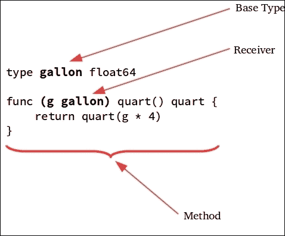
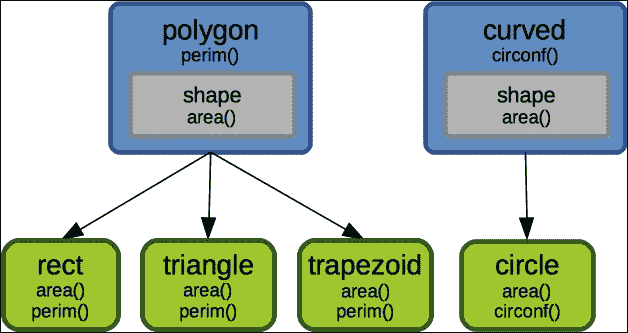

# 第八章。方法、接口和对象

使用你目前掌握的技能，你可以使用到目前为止所涵盖的基本概念编写一个有效的 Go 程序。正如你将在本章中看到的，Go 的类型系统可以支持超越简单函数的惯用法。虽然 Go 的设计者并没有打算创建一个具有深层类层次结构的面向对象语言，但该语言完全能够支持具有高级功能的类型组合，以表达复杂对象结构的创建，以下将涵盖这些主题：

+   Go 方法

+   Go 中的对象

+   接口类型

+   类型断言

# Go 方法

一个 Go 函数可以被定义为具有缩小到特定类型的范围。当一个函数的范围缩小到类型时，或者附加到类型上，它被称为*方法*。方法定义的方式就像任何其他 Go 函数一样。然而，其定义包括一个*方法接收器*，这是一个放在方法名称之前额外的参数，用于指定方法附加的主类型。

为了更好地说明这个概念，以下图突出了定义方法时涉及的不同部分。它显示了通过`g gallon`接收器参数附加到`type gallon`基于接收器的`quart`方法：



如前所述，方法具有类型的范围。因此，它只能通过使用*点符号*的声明值（具体或指针）访问附加的类型。以下程序展示了如何使用这种表示法访问声明的方法`quart`：

```go
package main 
import "fmt" 

type gallon float64 

func (g gallon) quart() float64 { 
   return float64(g * 4) 
} 
func main(){ 
    gal := gallon(5) 
    fmt.Println(gal.quart()) 
} 

```

golang.fyi/ch08/method_basic.go

在前面的例子中，`gal`变量被初始化为`gallon`类型。因此，可以通过`gal.quart()`使用`quart`方法。

在运行时，接收器参数提供了对方法基本类型分配的值的访问。在示例中，`quart`方法接收`g`参数，它传递了声明的类型的值副本。因此，当`gal`变量初始化为`5`时，对`gal.quart()`的调用将接收器参数`g`设置为`5`。因此，以下代码将打印出`20`的值：

```go
func main(){ 
    gal := gallon(5) 
    fmt.Println(gal.quart()) 
} 

```

重要的是要注意，方法接收器的基本类型不能是指针（也不能是接口）。例如，以下代码将无法编译：

```go
type gallon *float64    
func (g gallon) quart() float64 {
  return float64(g * 4)
}

```

下面的示例展示了实现一个更通用液体体积转换程序的源代码的较长版本。每个体积类型都接收其相应的方法来暴露该类型所具有的行为：

```go
package main 
import "fmt" 

type ounce float64 
func (o ounce) cup() cup { 
   return cup(o * 0.1250) 
} 

type cup float64 
func (c cup) quart() quart { 
   return quart(c * 0.25) 
} 
func (c cup) ounce() ounce { 
   return ounce(c * 8.0) 
} 

type quart float64 
func (q quart) gallon() gallon { 
   return gallon(q * 0.25) 
} 
func (q quart) cup() cup { 
   return cup(q * 4.0) 
} 

type gallon float64 
func (g gallon) quart() quart { 
   return quart(g * 4) 
} 

func main() { 
    gal := gallon(5) 
    fmt.Printf("%.2f gallons = %.2f quarts\n", gal, gal.quart()) 
    ozs := gal.quart().cup().ounce() 
    fmt.Printf("%.2f gallons = %.2f ounces\n", gal, ozs) 
} 

```

github.com/vladimirvivien/learning-go/ch08/methods.go

例如，将`5`加仑转换为盎司可以通过在给定值上调用适当的转换方法来完成，如下所示：

```go
gal := gallon(5) 
ozs := gal.quart().cup().ounce() 

```

整个实现使用了一种简单但有效的典型结构来表示数据类型和行为。阅读代码时，它清晰地表达了其预期的含义，而不依赖于任何重类的结构。

### 注意

**方法集**

通过接收器参数附加到类型的方法数量被称为该类型的*方法集*。这包括具体的和指针值接收器。方法集的概念在确定类型相等性、接口实现以及支持*空接口*的空方法集概念中非常重要（本章中均有讨论）。

## 值和指针接收器

到目前为止，尚未讨论的方法的一个方面是接收器是正常的函数参数。因此，它们遵循 Go 函数的按值传递机制。这意味着被调用的方法会从声明的类型中获取原始值的副本。

接收器参数可以是基类型的值或指针。例如，以下程序显示了两个方法，`half`和`double`；它们都直接更新各自的方法接收器参数`g`的值：

```go
package main
import "fmt" 
type gallon float64 
func (g gallon) quart() float64 { 
  return float64(g * 4) 
} 
func (g gallon) half() { 
  g = gallon(g * 0.5) 
} 
func (g *gallon) double() { 
  *g = gallon(*g * 2) 
} 
func main() { 
  var gal gallon = 5 
  gal.half() 
  fmt.Println(gal) 
  gal.double() 
  fmt.Println(gal) 
} 

```

golang.fyi/ch08/receiver_ptr.go

在`half`方法中，代码通过`g = gallon(g * 0.5)`更新接收器参数。正如你所预期的那样，这不会更新原始声明的值，而是更新存储在`g`参数中的副本。因此，当在`main`中调用`gal.half()`时，原始值保持不变，以下将打印`5`：

```go
func main() { 
   var gal gallon = 5 
   gal.half() 
   fmt.Println(gal) 
} 

*gallon type, which is updated using *g = gallon(*g * 2). So when the following is invoked in main, it would print a value of 10:
```

```go
func main() { 
   var gal gallon = 5 
   gal.double() 
   fmt.Println(gal) 
} 

```

指针接收器参数在 Go 中广泛使用。这是因为它们使得表达既携带状态又具有行为的对象原语成为可能。正如下一节所示，指针接收器，连同其他类型特性，是创建 Go 中对象的基础。

# Go 中的对象

上一节中冗长的介绍性材料是为了引出对 Go 中对象的讨论。已经提到，Go 并非设计成作为传统的面向对象语言。Go 中没有定义对象或类关键字。那么，我们为什么还要讨论 Go 中的对象呢？好吧，结果是 Go 完美地支持了面向对象的习惯用法和面向对象编程的实践，而没有其他面向对象语言中发现的经典层次结构和复杂继承结构的沉重负担。

让我们在下表中回顾一下通常归因于面向对象语言的一些原始特性。

| **对象特性** | **Go** | **注释** |
| --- | --- | --- |
| 对象：存储状态并公开行为的类型 | 是 | 在 Go 中，所有类型都可以实现这一点。没有称为类或对象的特殊类型来完成这项工作。任何类型都可以接收一组方法来定义其行为，尽管`struct`类型在其它语言中通常称为对象最为接近。 |
| 组合 | 是 | 使用`struct`或`interface`（稍后讨论）等类型，可以创建对象并通过组合表达它们的多态关系。 |
| 通过接口的子类型 | 是 | 定义了一组行为（方法）的类型，其他类型可以实施这些行为。稍后你将看到它是如何用于实现对象子类化的。 |
| 模块化和封装 | 是 | Go 在核心上支持物理和逻辑模块化，具有诸如包和可扩展的类型系统以及代码元素可见性等概念。 |
| 类型继承 | 否 | Go 不支持通过继承实现多态。新声明的命名类型并不继承其底层类型的所有属性，并且被类型系统以不同的方式处理。因此，很难像在其他语言中找到的那样通过类型谱系实现继承。 |
| 类 | 否 | Go 中没有作为对象基础的类类型的概念。Go 中的任何数据类型都可以用作对象。 |

如前表所示，Go 支持通常归因于面向对象编程的大多数概念。本章的剩余部分将涵盖主题和示例，展示如何将 Go 用作面向对象编程语言。

## 结构体作为对象

几乎所有的 Go 类型都可以通过存储状态并公开能够访问和修改这些状态的方法来充当对象的角色。然而，`struct`类型提供了其他语言中传统上归因于对象的全部特性，例如：

+   能够包含方法

+   能够通过组合进行扩展

+   能够被子类型化（借助 Go 的`interface`类型）

本章的剩余部分将基于使用`struct`类型来讨论对象。

## 对象组合

```go
fuel, engine, vehicle, truck, and plane:
```

```go
type fuel int 
const ( 
    GASOLINE fuel = iota 
    BIO 
    ELECTRIC 
    JET 
) 
type vehicle struct { 
    make string 
    model string 
} 

type engine struct { 
   fuel fuel 
   thrust int 
} 
func (e *engine) start() { 
   fmt.Println ("Engine started.") 
} 

type truck struct { 
   vehicle 
   engine 
   axels int 
   wheels int 
   class int 
} 
func (t *truck) drive() { 
   fmt.Printf("Truck %s %s, on the go!\n", t.make, t.model)           
} 

type plane struct { 
   vehicle 
   engine 
   engineCount int 
   fixedWings bool 
   maxAltitude int 
} 
func (p *plane) fly() { 
   fmt.Printf( 
          "Aircraft %s %s clear for takeoff!\n", 
          p.make, p.model, 
       ) 
} 

```

Go 使用*组合优于继承*原则，通过`struct`类型支持的类型嵌入机制来实现多态。在 Go 中，没有通过类型继承实现多态的支持。回想一下，每个类型都是独立的，并且被认为与其他所有类型都不同。实际上，上述模型中的语义略有错误。类型`truck`和`plane`被显示为由`vehicle`类型组成（或具有`has-a`关系），这听起来并不正确。相反，更合适，或者至少更正确的表示方式是通过子类型关系来显示类型`truck`和`plane`是`vehicle`的子类型。在章节的后面部分，我们将看到如何使用`interface`类型来实现这一点。

## 字段和方法提升

```go
t of type truck and p for plane. The former is initialized using a struct literal and the latter is updated using dot notation:
```

```go
func main() { 
   t := &truck { 
         vehicle:vehicle{"Ford", "F750"}, 
         engine:engine{GASOLINE+BIO,700}, 
         axels:2, 
         wheels:6, 
         class:3,     
   } 
   t.start() 
   t.drive() 

   p := &plane{} 
   p.make = "HondaJet" 
   p.model = "HA-420" 
   p.fuel = JET 
   p.thrust = 2050 
   p.engineCount = 2 
   p.fixedWings = true 
   p.maxAltitude = 43000 
   p.start() 
   p.fly() 

} 

struct type embedding mechanism promotes fields and methods when accessed using dot notation. For instance, the following fields (make, mode, fuel, and thrust), are all declared in types that are embedded inside of the plane type:
```

```go
p.make = "HondaJet" 
p.model = "HA-420" 
p.fuel = JET 
p.thrust = 2050 

```

前面的字段是从它们的嵌入类型提升而来的。当它们作为`plane`类型的成员访问时，实际上它们分别来自`vehicle`和`engine`类型。为了避免歧义，字段的名称可以像下面这样进行限定：

```go
p.vehicle.make = "HondaJet" 
p.vehicle.model = "HA-420" 
p.engine.fuel = JET 
p.engine.thrust = 2050 

```

方法也可以以类似的方式提升。例如，在之前的代码中，我们看到了`t.start()`和`p.start()`方法的调用。然而，`truck`和`plane`这两种类型都不是名为`start()`的方法的接收者。正如前面程序所示，`start()`方法是为`engine`类型定义的。由于`engine`类型嵌入在`truck`和`plane`类型中，`start()`方法在作用域中被提升到这些封装类型，因此是可访问的。

## 构造函数

```go
plane and truck types:
```

```go
type truck struct { 
   vehicle 
   engine 
   axels int 
   wheels int 
   class int 
} 
func newTruck(mk, mdl string) *truck { 
   return &truck {vehicle:vehicle{mk, mdl}} 
} 

type plane struct { 
   vehicle 
   engine 
   engineCount int 
   fixedWings bool 
   maxAltitude int 
}   
func newPlane(mk, mdl string) *plane { 
   p := &plane{} 
   p.make = mk 
   p.model = mdl 
   return p 
} 

```

golang.fyi/ch08/structobj2.go

虽然不是必需的，但提供一个函数来帮助初始化复合值，如结构体，可以提高代码的可用性。它提供了一个封装可重复初始化逻辑的地方，可以强制执行验证要求。在先前的示例中，构造函数`newTruck`和`newPlane`都传入了制造和型号信息以创建和初始化它们各自的价值。

# 接口类型

当你与已经使用 Go 语言一段时间的人交谈时，他们几乎总是将接口列为他们最喜欢的语言特性之一。Go 语言中接口的概念，与其他语言如 Java 类似，是一组方法，作为描述行为的模板。然而，Go 语言的接口是由`interface{}`字面量指定的类型，用于列出满足接口的一组方法。以下示例展示了如何将`shape`变量声明为接口：

```go
var shape interface { 
    area() float64 
    perim() float64 
} 

shape variable is declared and assigned an unnamed type, interface{area()float64; perim()float64}. Declaring variables with unnamed interface literal types is not really practical. Using idiomatic Go, an interface type is almost always declared as a named type. The previous snippet can be rewritten to use a named interface type, as shown in the following example:
```

```go
type shape interface { 
   area() float64 
   perim() float64 
} 
var s shape 

```

## 实现接口

Go 语言中接口的有趣之处在于它们的实现和使用方式。实现 Go 语言接口是隐式进行的。不需要单独的元素或关键字来指示实现的意图。任何定义了`interface`类型方法集的类型都会自动满足其实现。

以下源代码展示了`rect`类型作为`shape`接口类型的实现。`rect`类型被定义为具有接收器方法`area`和`perim`的结构体。这一事实自动使`rect`成为`shape`的实现：

```go
type shape interface { 
   area() float64 
   perim() float64 
} 

type rect struct { 
   name string 
   length, height float64 
} 

func (r *rect) area() float64 { 
   return r.length * r.height 
} 

func (r *rect) perim() float64 { 
   return 2*r.length + 2*r.height 
} 

```

golang.fyi/ch08/interface_impl.go

## 使用 Go 接口进行子类型化

```go
rect (defined previously) and triangle, are able to be passed to the shapeInfo(shape) function to return a string value containing shape calculations:
```

```go
type triangle struct { 
   name string 
   a, b, c float64 
} 

func (t *triangle) area() float64 { 
   return 0.5*(t.a * t.b) 
} 

func (t *triangle) perim() float64 { 
   return t.a + t.b + math.Sqrt((t.a*t.a) + (t.b*t.b)) 
} 

func (t *triangle) String() string { 
   return fmt.Sprintf( 
         "%s[sides: a=%.2f b=%.2f c=%.2f]", 
         t.name, t.a, t.b, t.c, 
   ) 
} 
func shapeInfo(s shape) string { 
   return fmt.Sprintf( 
         "Area = %.2f, Perim = %.2f", 
         s.area(), s.perim(), 
   ) 
} 

func main() { 
   r := &      rect{"Square", 4.0, 4.0} 
   fmt.Println(r, "=>", shapeInfo(r)) 

   t := &      triangle{"Right Triangle", 1,2,3} 
   fmt.Println(t, "=>", shapeInfo(t)) 
} 

```

golang.fyi/ch08/interface_impl.go

## 实现多个接口

接口的隐式机制允许任何命名类型同时满足多个接口类型。这仅仅是通过确保给定类型的方法集与要实现的每个`interface`类型的方法相交来实现的。让我们重新实现之前的代码，以展示这是如何完成的。引入了两个新的接口`polygon`和`curved`，以更好地捕捉和分类形状的信息和行为，如下面的代码片段所示：

```go
type shape interface { 
   area() float64 
} 

type polygon interface { 
   perim() 
} 

type curved interface { 
   circonf() 
} 
type rect struct {...} 
func (r *rect) area() float64 { 
   return r.length * r.height 
} 
func (r *rect) perim() float64 { 
   return 2*r.length + 2*r.height 
} 

type triangle struct {...} 
func (t *triangle) area() float64 { 
   return 0.5*(t.a * t.b) 
} 
func (t *triangle) perim() float64 { 
   return t.a + t.b + math.Sqrt((t.a*t.a) + (t.b*t.b)) 
} 

type circle struct { ... } 
func (c *circle) area() float64 { 
   return math.Pi * (c.rad*c.rad) 
} 
func (c *circle) circonf() float64 { 
   return 2 * math.Pi * c.rad 
} 

```

## 接口嵌入

`interface`类型的另一个有趣之处在于它支持类型嵌入（类似于`struct`类型）。这为您提供了以最大化类型重用的方式来结构化类型。继续使用形状示例，以下代码片段通过将形状嵌入到其他两个类型中，重新组织并减少了之前的接口数量，从三个减少到两个：

```go
type shape interface { 
   area() float64 
} 

type polygon interface { 
   shape 
   perim() 
} 

type curved interface { 
   shape 
   circonf() 
} 

```

golang.fyi/ch08/interface_impl3.go

以下插图展示了接口类型如何组合，以便“是...的”关系仍然满足代码组件之间的关系：



当嵌入接口类型时，封装类型将继承嵌入类型的函数集。如果嵌入类型导致方法签名冲突，编译器将报错。嵌入成为一个关键特性，尤其是在代码使用类型检查进行类型验证时。它允许类型汇总类型信息，从而减少不必要的断言步骤（类型断言将在后面讨论）。

## 空接口类型

`interface{}`类型，或空`interface`类型，是具有空方法集的`interface`类型的字面表示。根据我们之前的讨论，可以推断出*所有类型都实现了空接口*，因为所有类型都可以有一个包含零个或多个成员的方法集。

当一个变量被分配`interface{}`类型时，编译器会放宽其构建时的类型检查。然而，该变量仍然携带可以在运行时查询的类型信息。以下代码说明了这是如何工作的：

```go
func main() { 
   var anyType interface{} 
   anyType = 77.0 
   anyType = "I am a string now" 
   fmt.Println(anyType) 

   printAnyType("The car is slow") 
   m := map[string] string{"ID":"12345", "name":"Kerry"} 
   printAnyType(m) 
   printAnyType(1253443455) 
} 

func printAnyType(val interface{}) { 
   fmt.Println(val) 
} 

```

golang.fyi/ch08/interface_empty.go

在前面的代码中，`anyType`变量被声明为`interface{}`类型。它能够分配不同类型的值而不会引起编译器的抱怨：

```go
anyType = 77.0 
anyType = "I am a string now" 

```

`printAnyType()`函数接受一个`interface{}`类型的参数。这意味着函数可以传递任何有效类型的值，如下所示：

```go
printAnyType("The car is slow") 
m := map[string] string{"ID":"12345", "name":"Kerry"} 
printAnyType(m) 
printAnyType(1253443455) 

```

空接口对于习惯性的 Go 语言至关重要。将类型检查延迟到运行时使得语言感觉更加动态，而没有完全牺牲强类型。Go 提供了诸如类型断言（将在下一节介绍）等机制，以在运行时查询接口携带的类型信息。

# 类型断言

当一个接口（空或非空）被赋值给一个变量时，它携带了可以在运行时查询的类型信息。类型断言是 Go 语言中一种机制，可以习惯性地将一个（`interface`类型）变量缩小到存储在变量中的具体类型和值。以下示例在`eat`函数中使用类型断言来选择在`eat`函数中要选择的`food`类型：

```go
type food interface { 
   eat() 
} 

type veggie string 
func (v veggie) eat() { 
   fmt.Println("Eating", v) 
} 

type meat string 
func (m meat) eat() { 
   fmt.Println("Eating tasty", m) 
} 

func eat(f food) { 
   veg, ok := f.(veggie) 
   if ok { 
         if veg == "okra" { 
               fmt.Println("Yuk! not eating ", veg) 
         }else{ 
               veg.eat() 
         } 

         return 
   } 

   mt, ok := f.(meat) 
   if ok { 
         if mt == "beef" { 
               fmt.Println("Yuk! not eating ", mt) 
         }else{ 
               mt.eat() 
         } 
         return 
   } 

   fmt.Println("Not eating whatever that is: ", f) 
} 

f parameter to a specific type of food. If the type is asserted to be meat, then the code continues to test the value of the mt variable:
```

```go
mt, ok := f.(meat) 
if ok { 
   if mt == "beef" { 
         fmt.Println("Yuk! not eating ", mt) 
   }else{ 
         mt.eat() 
   } 
   return 
} 

```

类型断言表达式也可以只返回值，如下所示：

*value := <interface_variable>**.**(具体类型名称)*

这种断言形式是有风险的，因为如果接口变量中存储的值不是断言的类型，运行时将导致程序崩溃。只有在你有其他安全措施来防止或优雅地处理崩溃的情况下，才使用这种形式。

最后，当你的代码需要在运行时测试多个类型时，一个更优雅的断言方法是使用类型`switch`语句。它使用`switch`语句的语义，通过 case 子句从接口值中查询静态类型信息。上一个与食物相关的示例中的`eat`函数可以更新为使用类型`switch`而不是`if`语句，如下所示：

```go
func eat(f food) { 
   swtich morsel := f.(type){ 
   case veggie: 
         if morsel == "okra" { 
               fmt.Println("Yuk! not eating ", mosel) 
         }else{ 
               mosel.eat() 
         } 
   case meat: 
         if morsel == "beef" { 
               fmt.Println("Yuk! not eating ", mosel) 
         }else{ 
               mosel.eat() 
         }            
   default: 
         fmt.Println("Not eating whatever that is: ", f) 
   } 
} 

```

golang.fyi/interface_assert2.go

注意代码的可读性要好得多。它可以支持任意数量的案例，并且通过视觉线索清晰地布局，使得推理变得容易。`switch`类型还通过简单地指定一个默认情况来处理任何在情况子句中未明确处理的类型，从而消除了 panic 问题。

# 摘要

本章试图提供一个广泛且相对全面的视角，涵盖 Go 语言中的一些重要主题，包括方法、接口和对象。章节从使用接收器参数将方法附加到类型开始介绍。接下来，读者被引入对象以及如何在 Go 语言中创建惯用的基于对象的编程。最后，本章全面概述了接口类型及其在 Go 语言中支持对象语义的使用。下一章将带领读者了解一个使 Go 语言在开发者中如此受欢迎的最基本概念：并发！
