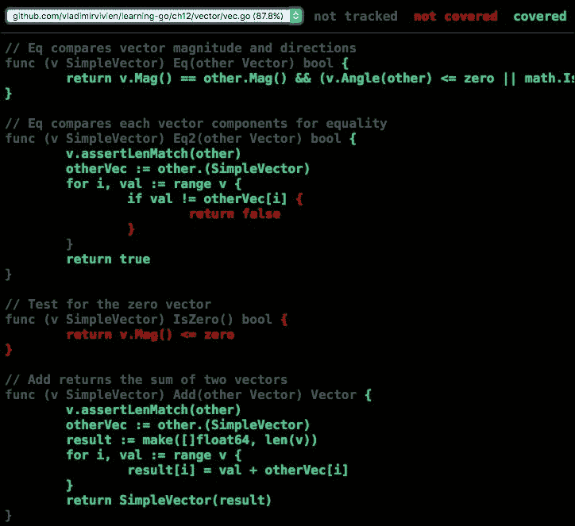

# 第十二章。代码测试

测试是现代软件开发实践中的关键仪式。Go 通过提供 API 和命令行工具，将测试直接带入开发周期，以无缝创建和集成自动化测试代码。在这里，我们将介绍 Go 测试套件，包括以下内容：

+   Go 测试工具

+   编写 Go 测试

+   HTTP 测试

+   测试覆盖率

+   代码基准测试

# Go 测试工具

在编写任何测试代码之前，让我们先讨论 Go 中自动化测试的工具。与`go build`命令类似，`go test`命令旨在编译并执行指定包中的测试源文件，如下所示命令所示：

```go
$> go test .

```

之前的命令将在当前包中执行所有测试函数。尽管看起来很简单，但之前的命令完成了几个复杂的步骤，包括：

+   编译当前包中找到的所有测试文件

+   从测试文件生成一个带有插桩的二进制文件

+   执行代码中的测试函数

当`go test`命令针对多个包时，测试工具会生成多个测试二进制文件，它们独立执行和测试，如下所示：

```go
$> go test ./... 

```

## 测试文件名

测试命令使用导入路径标准（见第六章，*Go 包和程序*)来指定要测试的包。在指定的包内，测试工具将编译所有具有`*_test.go`名称模式的文件。例如，假设我们有一个项目，在名为`vec.go`的文件中有一个简单的数学向量类型的实现，其测试文件的合理名称应该是`vec_test.go`。

## 测试组织

传统上，测试文件与被测试的代码保存在同一个包（目录）中。这是因为没有必要分离测试文件，因为它们被排除在编译程序的二进制文件之外。以下是一个典型的 Go 包的目录布局，在这个例子中是标准库中的`fmt`包。它显示了与常规源代码在同一目录下的所有测试文件：

```go
$>tree go/src/fmt/
├── doc.go
├── export_test.go
├── fmt_test.go
├── format.go
├── norace_test.go
├── print.go
├── race_test.go
├── scan.go
├── scan_test.go
└── stringer_test.go

```

除了拥有更简单的项目结构外，将文件放在一起使得测试函数能够完全看到被测试的包。这有助于访问和验证那些对测试代码来说是透明的包元素。当你的函数被放置在与要测试的代码分开的包中时，它们将失去访问非导出元素的能力。

# 编写 Go 测试

```go
Add, Sub, and Scale methods (see the full source code listed at https://github.com/vladimirvivien/learning-go/ch12/vector/vec.go). Notice that each method implements a specific behavior as a unit of functionality, which will make it easy to test:
```

```go
type Vector interface { 
    Add(other Vector) Vector 
    Sub(other Vector) Vector 
    Scale(factor float64) 
    ... 
} 

func New(elems ...float64) SimpleVector { 
    return SimpleVector(elems) 
} 

type SimpleVector []float64 

func (v SimpleVector) Add(other Vector) Vector { 
   v.assertLenMatch(other) 
   otherVec := other.(SimpleVector) 
   result := make([]float64, len(v)) 
   for i, val := range v { 
         result[i] = val + otherVec[i] 
   } 
   return SimpleVector(result) 
} 

func (v SimpleVector) Sub(other Vector) Vector { 
   v.assertLenMatch(other) 
   otherVec := other.(SimpleVector) 
   result := make([]float64, len(v)) 
   for i, val := range v { 
         result[i] = val - otherVec[i] 
   } 
   return SimpleVector(result) 
} 

func (v SimpleVector) Scale(scale float64) { 
   for i := range v { 
         v[i] = v[i] * scale 
   } 
} 
... 

```

golang.fyi/ch12/vector/vec.go

## 测试函数

文件`vec_test.go`中的测试源代码定义了一系列函数，通过独立测试其每个方法来测试类型`SimpleVector`（见前述章节）的行为：

```go
import "testing" 

func TestVectorAdd(t *testing.T) { 
   v1 := New(8.218, -9.341) 
   v2 := New(-1.129, 2.111) 
   v3 := v1.Add(v2) 
   expect := New( 
       v1[0]+v2[0], 
       v1[1]+v2[1], 
   ) 

   if !v3.Eq(expect) { 
       t.Logf("Addition failed, expecting %s, got %s",  
          expect, v3) 
       t.Fail() 
   } 
   t.Log(v1, "+", v2, v3) 
} 

func TestVectorSub(t *testing.T) { 
   v1 := New(7.119, 8.215) 
   v2 := New(-8.223, 0.878) 
   v3 := v1.Sub(v2) 
   expect := New( 
       v1[0]-v2[0], 
       v1[1]-v2[1], 
   ) 
   if !v3.Eq(expect) { 
       t.Log("Subtraction failed, expecting %s, got %s",  
           expect, v3) 
           t.Fail() 
   } 
   t.Log(v1, "-", v2, "=", v3) 
} 

func TestVectorScale(t *testing.T) { 
   v := New(1.671, -1.012, -0.318) 
   v.Scale(7.41) 
   expect := New( 
       7.41*1.671, 
       7.41*-1.012, 
       7.41*-0.318, 
   ) 
   if !v.Eq(expect) { 
       t.Logf("Scalar mul failed, expecting %s, got %s",  
           expect, v) 
       t.Fail() 
   } 
   t.Log("1.671,-1.012, -0.318 Scale", 7.41, "=", v) 
} 

The source code of a test function usually sets up an expected value, which is pre-determined based on knowledge of the tested code. That value is then compared to the calculated value returned by the code being tested. For instance, when adding two vectors, we can calculate the expected result using the rules of vector additions, as shown in the following snippet:
```

```go
v1 := New(8.218, -9.341) 
v2 := New(-1.129, 2.111) 
v3 := v1.Add(v2) 
expect := New( 
    v1[0]+v2[0], 
    v1[1]+v2[1], 
) 

v1 and v2, and stored in the variable expect. Variable v3, on the other hand, stores the actual value of the vector, as calculated by the tested code. This allows us to test the actual versus the expected, as shown in the following:
```

```go
if !v3.Eq(expect) { 
    t.Log("Addition failed, expecting %s, got %s", expect, v3) 
    t.Fail() 
} 

false, then the test has failed. The code uses t.Fail() to signal the failure of the test function. Signaling failure is discussed in more detail in the Reporting failure section.
```

## 运行测试

如本章引言部分所述，测试函数使用 `go test` 命令行工具执行。例如，如果我们从 package vector 内运行以下命令，它将自动运行该包的所有测试函数：

```go
$> cd vector
$> go test .
ok    github.com/vladimirvivien/learning-go/ch12/vector     0.001s

```

测试也可以通过指定相对于命令发出位置的子包（或使用包通配符 `./...` 的所有包）来执行，如下所示：

```go
$> cd $GOPATH/src/github.com/vladimirvivien/learning-go/ch12/
$> go test ./vector
ok    github.com/vladimirvivien/learning-go/ch12/vector     0.005s

```

### 执行测试的过滤

在开发大量测试函数的过程中，在调试阶段通常希望专注于一个函数（或一组函数）。Go 测试命令行工具支持 `-run` 标志，该标志指定一个正则表达式，仅执行名称与指定表达式匹配的函数。以下命令将仅执行测试函数 `TestVectorAdd`：

```go
$> go test -run=VectorAdd -v
=== RUN   TestVectorAdd
--- PASS: TestVectorAdd (0.00s)
PASS
ok    github.com/vladimirvivien/learning-go/ch12/vector     0.025s

```

使用 `-v` 标志确认只执行了一个测试函数 `TestVectorAdd`。作为另一个例子，以下命令执行所有以 `VectorA.*$` 结尾或匹配函数名 `TestVectorMag` 的测试函数，同时忽略其他所有内容：

```go
> go test -run="VectorA.*$|TestVectorMag" -v
=== RUN   TestVectorAdd
--- PASS: TestVectorAdd (0.00s)
=== RUN   TestVectorMag
--- PASS: TestVectorMag (0.00s)
=== RUN   TestVectorAngle
--- PASS: TestVectorAngle (0.00s)
PASS
ok    github.com/vladimirvivien/learning-go/ch12/vector     0.043s

```

## 测试日志

```go
t.Logf("Vector = %v; Unit vector = %v\n", v, expect):
```

```go
func TestVectorUnit(t *testing.T) { 
   v := New(5.581, -2.136) 
   mag := v.Mag() 
   expect := New((1/mag)*v[0], (1/mag)*v[1]) 
   if !v.Unit().Eq(expect) { 
       t.Logf("Vector Unit failed, expecting %s, got %s",  
           expect, v.Unit()) 
       t.Fail() 
   } 
   t.Logf("Vector = %v; Unit vector = %v\n", v, expect) 
}  

```

golang.fyi/ch12/vector/vec_test.go

如前所述，Go 测试工具在没有测试失败的情况下运行测试时输出最小化。然而，当提供详细输出标志 `*-v*` 时，工具将输出测试日志。例如，在 package vector 中运行以下命令将静音所有日志语句：

```go
> go test -run=VectorUnit
PASS
ok    github.com/vladimirvivien/learning-go/ch12/vector     0.005s

```

当提供详细输出标志 `-v` 时，如以下命令所示，测试运行时打印日志输出：

```go
$> go test -run=VectorUnit -v
=== RUN   TestVectorUnit
--- PASS: TestVectorUnit (0.00s)
vec_test.go:100: Vector = [5.581,-2.136]; Unit vector =
[0.9339352140866403,-0.35744232526233]
PASS
ok    github.com/vladimirvivien/learning-go/ch12/vector     0.001s

```

## 报告失败

默认情况下，Go 测试运行时认为测试成功，如果测试函数运行并正常返回而没有 panic。例如，以下测试函数是错误的，因为其预期值没有正确计算。然而，测试运行时始终将其报告为通过，因为它没有包含任何报告失败的代码：

```go
func TestVectorDotProd(t *testing.T) { 
    v1 := New(7.887, 4.138).(SimpleVector) 
    v2 := New(-8.802, 6.776).(SimpleVector) 
    actual := v1.DotProd(v2) 
    expect := v1[0]*v2[0] - v1[1]*v2[1] 
    if actual != expect { 
        t.Logf("DotPoduct failed, expecting %d, got %d",  
          expect, actual) 
    } 
} 

```

golang.fyi/ch12/vec_test.go

这种假阳性条件可能被忽视，尤其是在详细输出标志关闭的情况下，最小化了任何表明它是错误的视觉线索：

```go
$> go test -run=VectorDot
PASS
ok    github.com/vladimirvivien/learning-go/ch12/vector     0.001s

```

修复之前测试的一种方法是通过使用 `testing.T` 类型的 `Fail` 方法来指示失败，如下面的代码片段所示：

```go
func TestVectorDotProd(t *testing.T) { 
... 
    if actual != expect { 
        t.Logf("DotPoduct failed, expecting %d, got %d",  
          expect, actual) 
        t.Fail() 
    } 
} 

```

因此，现在当测试执行时，它正确地报告了它是错误的，如下面的输出所示：

```go
$> go test -run=VectorDot
--- FAIL: TestVectorDotProd (0.00s)
vec_test.go:109: DotPoduct failed, expecting -97.460462, got -41.382286
FAIL
exit status 1
FAIL  github.com/vladimirvivien/learning-go/ch12/vector     0.002s

Errorf method, which is equivalent to calling the Logf and Fail methods:
```

```go
func TestVectorMag(t *testing.T) { 
    v := New(-0.221, 7.437) 
    expected := math.Sqrt(v[0]*v[0] + v[1]*v[1]) 
    if v.Mag() != expected { 
   t.Errorf("Magnitude failed, execpted %d, got %d",  
        expected, v.Mag()) 
    } 
} 

```

golang.fyi/ch12/vector/vec.go

类型 `testing.T` 还提供了 `Fatal` 和 `Formatf` 方法，作为将消息的日志记录和测试函数的立即终止结合起来的方式。

## 跳过测试

```go
RUN_ANGLE is set. Otherwise, it will skip the test:
```

```go
func TestVectorAngle(t *testing.T) { 
   if os.Getenv("RUN_ANGLE") == "" { 
         t.Skipf("Env variable RUN_ANGLE not set, skipping:") 
   } 
   v1 := New(3.183, -7.627) 
   v2 := New(-2.668, 5.319) 
   actual := v1.Angle(v2) 
   expect := math.Acos(v1.DotProd(v2) / (v1.Mag() * v2.Mag())) 
   if actual != expect { 
         t.Logf("Vector angle failed, expecting %d, got %d", 
            expect, actual) 
         t.Fail() 
   } 
   t.Log("Angle between", v1, "and", v2, "=", actual) 
} 

```

注意代码使用了 `Skipf` 方法，这是 `testing.T` 类型的 `SkipNow` 和 `Logf` 方法的组合。当在没有环境变量的情况下执行测试时，它输出以下内容：

```go
$> go test -run=Angle -v
=== RUN   TestVectorAngle
--- SKIP: TestVectorAngle (0.00s)
 vec_test.go:128: Env variable RUN_ANGLE not set, skipping:
PASS
ok    github.com/vladimirvivien/learning-go/ch12/vector     0.006s 

```

当提供环境变量时，如以下 Linux/Unix 命令所示，测试将按预期执行（请咨询您的操作系统了解如何设置环境变量）：

```go
> RUN_ANGLE=1 go test -run=Angle -v
=== RUN   TestVectorAngle
--- PASS: TestVectorAngle (0.00s)
 vec_test.go:138: Angle between [3.183,-7.627] and [-2.668,5.319] = 3.0720263098372476
PASS
ok    github.com/vladimirvivien/learning-go/ch12/vector     0.005s

```

## 表驱动测试

在 Go 中，你经常会遇到的一种技术是使用表格驱动测试。这是指将一组输入和预期输出存储在数据结构中，然后使用它来循环不同的测试场景。例如，在下面的测试函数中，`cases` 变量，其类型为 `[]struct{vec SimpleVector; expected float64}`，用于存储几个向量值及其预期的幅度值，用于测试向量方法 `Mag`：

```go
func TestVectorMag(t *testing.T) { 
   cases := []struct{ 
         vec SimpleVector 
         expected float64 

   }{ 
       {New(1.2, 3.4), math.Sqrt(1.2*1.2 + 3.4*3.4)}, 
       {New(-0.21, 7.47), math.Sqrt(-0.21*-0.21 + 7.47*7.47)}, 
       {New(1.43, -5.40), math.Sqrt(1.43*1.43 + -5.40*-5.40)}, 
       {New(-2.07, -9.0), math.Sqrt(-2.07*-2.07 + -9.0*-9.0)}, 
   } 
   for _, c := range cases { 
       mag := c.vec.Mag() 
       if mag != c.expected { 
         t.Errorf("Magnitude failed, execpted %d, got %d",  
              c.expected, mag) 
       } 
   } 
} 

```

golang.fyi/ch12/vector/vec.go

在循环的每次迭代中，代码都会将 `Mag` 方法计算出的值与预期值进行比较。使用这种方法，我们可以测试输入和它们各自的输出的多种组合，就像前面代码中所做的那样。根据需要，这种技术可以扩展以包括更多参数。例如，可以使用名称字段为每个案例命名，这在测试案例数量较多时很有用。或者，为了更加复杂，可以在测试案例结构体中包含一个函数字段，以指定为每个相应案例使用的自定义逻辑。

# HTTP 测试

```go
https://github.com/vladimirvivien/learning-go/ch12/service/serv.go):
```

```go
package main 

import ( 
   "encoding/json" 
   "fmt" 
   "net/http" 

   "github.com/vladimirvivien/learning-go/ch12/vector" 
) 
func add(resp http.ResponseWriter, req *http.Request) { 
   var params []vector.SimpleVector 
   if err := json.NewDecoder(req.Body).Decode(&params);  
       err != nil { 
         resp.WriteHeader(http.StatusBadRequest) 
         fmt.Fprintf(resp, "Unable to parse request: %s\n", err) 
         return 
   } 
   if len(params) != 2 { 
         resp.WriteHeader(http.StatusBadRequest) 
         fmt.Fprintf(resp, "Expected 2 or more vectors") 
         return 
   } 
   result := params[0].Add(params[1]) 
   if err := json.NewEncoder(resp).Encode(&result); err != nil { 
         resp.WriteHeader(http.StatusInternalServerError) 
         fmt.Fprintf(resp, err.Error()) 
         return 
   } 
} 
... 
func main() { 
   mux := http.NewServeMux() 
   mux.HandleFunc("/vec/add", add) 
   mux.HandleFunc("/vec/sub", sub) 
   mux.HandleFunc("/vec/dotprod", dotProd) 
   mux.HandleFunc("/vec/mag", mag) 
   mux.HandleFunc("/vec/unit", unit) 

   if err := http.ListenAndServe(":4040", mux); err != nil { 
         fmt.Println(err) 
   } 
} 

```

golang.fyi/ch12/service/serv.go

每个函数（`add`、`sub`、`dotprod`、`mag` 和 `unit`）实现了 `http.Handler` 接口。这些函数用于处理来自客户端的 HTTP 请求，并从 `vector` 包中计算相应的操作。请求和响应都使用 JSON 格式进行格式化，以简化处理。

## 测试 HTTP 服务器代码

```go
httptest.ResponseRecorder to test the server's add method:
```

```go
import ( 
   "net/http" 
   "net/http/httptest" 
   "strconv" 
   "strings" 
   "testing" 

   "github.com/vladimirvivien/learning-go/ch12/vector" 
) 

func TestVectorAdd(t *testing.T) { 
   reqBody := "[[1,2],[3,4]]" 
   req, err := http.NewRequest( 
        "POST", "http://0.0.0.0/", strings.NewReader(reqBody)) 
   if err != nil { 
         t.Fatal(err) 
   } 
   actual := vector.New(1, 2).Add(vector.New(3, 4)) 
   w := httptest.NewRecorder() 
   add(w, req) 
   if actual.String() != strings.TrimSpace(w.Body.String()) { 
         t.Fatalf("Expecting actual %s, got %s",  
             actual.String(), w.Body.String(), 
         ) 
   } 
} 

```

代码使用 `reg, err := http.NewRequest("POST", "http://0.0.0.0/", strings.NewReader(reqBody))` 创建一个新的 `"POST"` 方法的 `*http.Request` 值，一个假 URL，以及一个请求体变量 `reqBody`，该请求体被编码为 JSON 数组。在代码的后面部分，`w := httptest.NewRecorder()` 用于创建一个 `httputil.ResponseRecorder` 值，该值用于调用 `add(w, req)` 函数以及创建的请求。在 `add` 函数执行期间记录在 `w` 中的值与存储在 `atual` 中的预期值通过 `if actual.String() != strings.TrimSpace(w.Body.String()){...}` 进行比较。

## 测试 HTTP 客户端代码

为 HTTP 客户端编写测试代码更为复杂，因为你实际上需要一个正在运行的服务器来进行适当的测试。幸运的是，`httptest` 包提供了 `httptest.Server` 类型，可以用来程序化地创建服务器以测试客户端请求，并向客户端发送模拟响应。

为了说明，让我们考虑以下代码，它部分展示了之前提到的向量服务器 HTTP 客户端的实现（请参阅完整的代码列表[`github.com/vladimirvivien/learning-go/ch12/client/client.go`](https://github.com/vladimirvivien/learning-go/ch12/client/client.go)）。`add` 方法将 `vec0` 和 `vec2` 参数编码为 JSON 对象，这些对象通过 `c.client.Do(req)` 发送到服务器。响应从 JSON 数组解码到类型为 `vector.SimpleVector` 的变量 `result`：

```go
type vecClient struct { 
    svcAddr string 
    client *http.Client 
} 
func (c *vecClient) add( 
   vec0, vec1 vector.SimpleVector) (vector.SimpleVector, error) { 
   uri := c.svcAddr + "/vec/add" 

   // encode params 
   var body bytes.Buffer 
    params := []vector.SimpleVector{vec0, vec1} 
   if err := json.NewEncoder(&body).Encode(&params); err != nil { 
         return []float64{}, err 
   } 
   req, err := http.NewRequest("POST", uri, &body) 
   if err != nil { 
        return []float64{}, err 
   } 

   // send request 
   resp, err := c.client.Do(req) 
   if err != nil { 
       return []float64{}, err 
   } 
   defer resp.Body.Close() 

   // handle response 
   var result vector.SimpleVector 
   if err := json.NewDecoder(resp.Body). 
        Decode(&result); err != nil { 
        return []float64{}, err 
    } 
    return result, nil 
} 

```

golang.fyi/ch12/client/client.go

我们可以使用类型`httptest.Server`来创建测试客户端发送的请求的代码，并将数据返回给客户端代码以进行进一步检查。函数`httptest.NewServer`接受一个类型为`http.Handler`的值，其中封装了服务器的测试逻辑。然后该函数返回一个新的正在运行的 HTTP 服务器，准备在系统选择的端口上提供服务。

下面的测试函数展示了如何使用`httptest.Server`来测试前面展示的客户端代码中的`add`方法。请注意，在创建服务器时，代码使用类型`http.HandlerFunc`，这是一个适配器，它接受一个函数值以生成一个`http.Handler`。这种便利性允许我们跳过创建一个单独的类型来实现新的`http.Handler`：

```go
import( 
    "net/http" 
    "net/http/httptest" 
    ... 
) 
func TestClientAdd(t *testing.T) { 
   server := httptest.NewServer(http.HandlerFunc( 
         func(resp http.ResponseWriter, req *http.Request) { 
             // test incoming request path 
             if req.URL.Path != "/vec/add" { 
                 t.Errorf("unexpected request path %s",  
                    req.URL.Path) 
                   return 
               } 
               // test incoming params 
               body, _ := ioutil.ReadAll(req.Body) 
               params := strings.TrimSpace(string(body)) 
               if params != "[[1,2],[3,4]]" { 
                     t.Errorf("unexpected params '%v'", params) 
                     return 
               } 
               // send result 
               result := vector.New(1, 2).Add(vector.New(3, 4)) 
               err := json.NewEncoder(resp).Encode(&result) 
               if err != nil { 
                     t.Fatal(err) 
                     return 
               } 
         }, 
   )) 
   defer server.Close() 
   client := newVecClient(server.URL) 
   expected := vector.New(1, 2).Add(vector.New(3, 4)) 
   result, err := client.add(vector.New(1, 2), vector.New(3, 4)) 
   if err != nil { 
         t.Fatal(err) 
   } 
   if !result.Eq(expected) { 
         t.Errorf("Expecting %s, got %s", expected, result) 
   } 
} 

```

golang.fyi/ch12/client/client_test.go

测试函数首先设置`server`及其处理函数。在`http.HandlerFunc`的函数内部，代码首先确保客户端请求正确的路径`"/vec/add"`。接下来，代码检查客户端的请求体，确保适当的 JSON 格式和加法操作的参数有效。最后，处理函数将预期的结果编码为 JSON，并将其作为响应发送给客户端。

代码使用系统生成的`server`地址通过`newVecClient(server.URL)`创建一个新的`client`。方法调用`client.add(vector.New(1, 2), vector.New(3, 4))`向测试服务器发送请求，以计算其参数列表中两个值的向量加法。如前所述，测试服务器仅模拟真实服务器的代码，并返回计算出的向量值。`result`与`expected`值进行比较，以确保`add`方法正常工作。

# 测试覆盖率

在编写测试时，了解实际代码中有多少被测试（或覆盖）是很重要的。这个数字是测试逻辑对源代码渗透程度的指示。无论你是否同意，在许多软件开发实践中，测试覆盖率是一个关键的指标，因为它衡量了代码被测试的程度。

幸运的是，Go 测试工具自带了一个内置的覆盖率工具。使用带有`-cover`标志的 Go 测试命令会对原始源代码进行覆盖率逻辑的配置。然后运行生成的测试二进制文件，提供包的整体覆盖率概要，如下所示：

```go
$> go test -cover
PASS
coverage: 87.8% of statements
ok    github.com/vladimirvivien/learning-go/ch12/vector     0.028s

```

结果显示，代码经过良好测试，覆盖率为`87.8%`。我们可以使用测试工具提取有关测试代码部分的更多详细信息。为此，我们使用`-coverprofile`标志将覆盖率指标记录到文件中，如下所示：

```go
$> go test -coverprofile=cover.out

```

## 覆盖工具

一旦覆盖率数据被保存，可以使用`go tool cover`命令以文本表格格式展示。以下显示了之前生成的覆盖率文件中每个测试函数覆盖率分解的部分输出：

```go
$> go tool cover -func=cover.out
...
learning-go/ch12/vector/vec.go:52:  Eq          100.0%
learning-go/ch12/vector/vec.go:57:  Eq2         83.3%
learning-go/ch12/vector/vec.go:74:  Add         100.0%
learning-go/ch12/vector/vec.go:85:  Sub         100.0%
learning-go/ch12/vector/vec.go:96:  Scale       100.0%
...

```

`cover` 工具可以将覆盖率指标叠加到实际代码上，提供视觉辅助来显示代码的已覆盖（和未覆盖）部分。使用 `-html` 标志可以生成一个使用之前收集的覆盖率数据的 HTML 页面：

```go
 $> go tool cover -html=cover.out

```

命令将打开已安装的默认网页浏览器并显示覆盖率数据，如下面的截图所示：



之前的截图仅显示了生成的 HTML 页面的一部分。它显示了绿色的已覆盖代码和红色的未覆盖代码。其他内容以灰色显示。

# 代码基准

基准测试的目的是衡量代码的性能。Go 测试命令行工具支持自动生成和测量基准指标。与单元测试类似，测试工具使用基准函数来指定要测量的代码部分。基准函数使用以下函数命名模式和签名：

*func Benchmark<Name>(*testing.B)*

基准函数的预期名称应以 *benchmark* 开头，并接受类型为 `*testing.B` 的指针值。以下是一个基准测试 `SimpleVector` 类型的 `Add` 方法（之前已介绍）的函数：

```go
import ( 
    "math/rand" 
    "testing" 
    "time" 
) 
... 
func BenchmarkVectorAdd(b *testing.B) { 
   r := rand.New(rand.NewSource(time.Now().UnixNano())) 
   for i := 0; i < b.N; i++ { 
         v1 := New(r.Float64(), r.Float64()) 
         v2 := New(r.Float64(), r.Float64()) 
         v1.Add(v2) 
   } 
} 

```

golang.fyi/ch12/vector/vec_bench_test.go

Go 的测试运行时通过注入指针 `*testing.B` 作为参数来调用基准函数。该值定义了与基准框架交互的方法，例如日志记录、失败信号和其他类似于 `testing.T` 类型的功能。类型 `testing.B` 还提供了额外的基准特定元素，包括一个整数字段 `N`。它打算用作基准函数应使用的迭代次数，以进行有效的测量。

被基准测试的代码应放置在由 `N` 界定的 `for` 循环内，如前一个示例所示。为了使基准测试有效，循环每次迭代的输入大小不应有差异。例如，在先前的基准测试中，每次迭代始终使用大小为 `2` 的向量（而向量的实际值是随机化的）。

## 运行基准测试

基准函数只有在测试命令行工具接收到 `-bench` 标志时才会执行。以下命令运行当前包中的所有基准函数：

```go
$> go test -bench=.
PASS
BenchmarkVectorAdd-2           2000000           761 ns/op
BenchmarkVectorSub-2           2000000           788 ns/op
BenchmarkVectorScale-2         5000000           269 ns/op
BenchmarkVectorMag-2           5000000           243 ns/op
BenchmarkVectorUnit-2          3000000           507 ns/op
BenchmarkVectorDotProd-2       3000000           549 ns/op
BenchmarkVectorAngle-2         2000000           659 ns/op
ok    github.com/vladimirvivien/learning-go/ch12/vector     14.123s

```

在分析基准测试结果之前，让我们了解之前发出的命令。`go test -bench=.` 命令首先执行包中的所有测试函数，然后是所有基准函数（你可以通过在命令中添加详细标志 `-v` 来验证这一点）。

与 `-run` 标志类似，`-bench` 标志指定了一个正则表达式，用于选择要执行的基准函数。`-bench=.` 标志匹配所有基准函数的名称，如前例所示。然而，以下仅运行名称中包含模式 `"VectorA"` 的基准函数。这包括 `BenchmarkVectorAngle()` 和 `BenchmarkVectorAngle()` 函数：

```go
$> go test -bench="VectorA"
PASS
BenchmarkVectorAdd-2     2000000           764 ns/op
BenchmarkVectorAngle-2   2000000           665 ns/op
ok    github.com/vladimirvivien/learning-go/ch12/vector     4.396s

```

## 跳过测试函数

如前所述，当执行基准测试时，测试工具也会运行所有测试函数。这可能不是所希望的，尤其是如果你在包中有大量测试时。在基准执行期间跳过测试函数的一个简单方法是将 `-run` 标志设置为与任何测试函数都不匹配的值，如下所示：

```go
> go test -bench=. -run=NONE -v
PASS
BenchmarkVectorAdd-2           2000000           791 ns/op
BenchmarkVectorSub-2           2000000           777 ns/op
...
BenchmarkVectorAngle-2         2000000           653 ns/op
ok    github.com/vladimirvivien/learning-go/ch12/vector     14.069s

```

之前的命令仅执行基准函数，如部分详尽输出所示。`-run` 标志的值完全是任意的，可以设置为任何会导致它跳过测试函数执行的值。

## 基准报告

与测试不同，基准报告总是详尽的，并显示多个列的指标，如下所示：

```go
$> go test -run=NONE -bench="Add|Sub|Scale"
PASS
BenchmarkVectorAdd-2     2000000           800 ns/op
BenchmarkVectorSub-2     2000000           798 ns/op
BenchmarkVectorScale-2   5000000           266 ns/op
ok    github.com/vladimirvivien/learning-go/ch12/vector     6.473s

```

第一列包含基准函数的名称，每个名称后跟一个数字，该数字反映了 *GOMAXPROCS* 的值，该值可以在测试时使用 `-cpu` 标志设置（适用于并行运行基准测试）。

下一个列显示每个基准循环的迭代次数。例如，在上一个报告中，前两个基准函数循环了 200 万次，而最后一个基准函数迭代了 500 万次。报告的最后一列显示了执行测试函数的平均时间。例如，在基准函数 `BenchmarkVectorScale` 中执行的 `Scale` 方法的 500 万次调用平均花费了 266 纳秒来完成。

## 调整 N

默认情况下，测试框架会逐渐调整 `N` 以确保在 *一秒* 内获得稳定且有意义的指标。您不能直接更改 `N`。但是，您可以使用 `-benchtime` 标志来指定基准运行时间，从而影响基准期间的迭代次数。例如，以下命令运行基准测试了 `5` 秒：

```go
> go test -run=Bench -bench="Add|Sub|Scale" -benchtime 5s
PASS
BenchmarkVectorAdd-2    10000000           784 ns/op
BenchmarkVectorSub-2    10000000           810 ns/op
BenchmarkVectorScale-2  30000000           265 ns/op
ok    github.com/vladimirvivien/learning-go/ch12/vector     25.877s

```

注意，尽管每个基准的迭代次数（五倍或更多）有剧烈的跳跃，但每个基准函数的平均性能时间仍然保持合理的一致性。这些信息为您提供了关于代码性能的宝贵见解。这是观察代码或负载变化对性能影响的好方法，如以下章节所述。

## 比较基准

基准测试代码的另一个有用方面是对比实现类似功能的不同算法的性能。使用性能基准测试算法将表明哪些实现可能更计算和内存高效。

例如，如果两个向量具有相同的幅度和相同的方向（或者它们之间有一个零角度值），则称这两个向量相等。我们可以使用以下源代码片段来实现这个定义：

```go
const zero = 1.0e-7  
... 
func (v SimpleVector) Eq(other Vector) bool { 
   ang := v.Angle(other) 
   if math.IsNaN(ang) { 
         return v.Mag() == other.Mag() 
   } 
   return v.Mag() == other.Mag() && ang <= zero 
} 

```

golang.fyi/ch12/vector/vec.go

当前面的方法进行基准测试时，它产生了以下结果。它的每 300 万次迭代平均运行时间为半个毫秒：

```go
$> go test -run=Bench -bench=Equal1
PASS
BenchmarkVectorEqual1-2  3000000           454 ns/op
ok    github.com/vladimirvivien/learning-go/ch12/vector     1.849s

```

基准测试结果并不差，特别是与之前看到的其他基准测试方法相比。然而，如果我们想提高 `Eq` 方法的性能（可能是因为它是程序的一个关键部分），我们可以使用 `-benchmem` 标志来获取有关基准测试测试的更多信息：

```go
$> go test -run=bench -bench=Equal1 -benchmem
PASS
BenchmarkVectorEqual1-2  3000000 474 ns/op  48 B/op  2 allocs/op

```

`-benchmem` 标志会导致测试工具显示两列额外的信息，这些信息提供了内存分配的指标，如前一个输出所示。我们看到 `Eq` 方法总共分配了 48 字节，每个操作有两次分配调用。

在我们没有其他东西可以与之比较之前，这并没有告诉我们太多。幸运的是，还有一个我们可以尝试的相等性算法。这个算法基于这样一个事实：如果两个向量具有相同数量的元素，并且每个元素都相等，那么这两个向量也是相等的。这个定义可以通过遍历向量并比较其元素来实现，如下面的代码所示：

```go
func (v SimpleVector) Eq2(other Vector) bool { 
   v.assertLenMatch(other) 
   otherVec := other.(SimpleVector) 
   for i, val := range v { 
         if val != otherVec[i] { 
               return false 
         } 
   } 
   return true 
} 

```

golang.fyi/ch12/vector/vec.go

现在我们来基准测试 `Eq` 和 `Eq2` 相等性方法，看看哪个更高效，如下所示：

```go
$> go test -run=bench -bench=Equal -benchmem
PASS
BenchmarkVectorEqual1-2   3000000   447 ns/op   48 B/op   2 allocs/op
BenchmarkVectorEqual2-2   5000000   265 ns/op   32 B/op   1 allocs/op

```

根据基准报告，方法 `Eq2` 在两个相等性方法中表现更优。它运行时间大约是原始方法的一半，分配的内存也少得多。由于这两个基准测试都使用了类似的数据输入，我们可以有信心地说第二个方法比第一个方法更好。

### 注意

根据 Go 版本、机器大小和架构的不同，这些基准测试数字会有所变化。然而，结果总是显示 Eq2 方法更高效。

这段讨论只是比较基准测试的表面。例如，之前的基准测试使用相同大小的输入。有时观察输入大小变化时的性能变化是有用的。我们可以比较相等性方法在输入大小从 3、10、20 或 30 个元素变化时的性能曲线。如果算法对大小敏感，使用这样的属性扩展基准测试将揭示任何瓶颈。

# 摘要

本章提供了对 Go 语言中编写测试实践的广泛介绍。它讨论了几个关键主题，包括使用`go test`工具来编译和执行自动化测试。读者学习了如何编写测试函数以确保他们的代码得到适当的测试和覆盖。本章还讨论了测试 HTTP 客户端和服务器的话题。最后，本章介绍了基准测试作为使用内置 Go 工具自动化、分析和衡量代码性能的一种方法。
