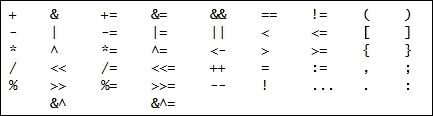

# 第一章。准备... 稳定... 开始！

设计模式一直是数十万件软件的基础。自从 1994 年*四人帮*（Erich Gamma、Richard Helm、Ralph Johnson 和 John Vlissides）编写了《设计模式：可复用面向对象软件元素》一书，并在 C++和 Smalltalk 中提供了示例以来，二十三个经典模式已经在大多数主要语言中重新实现，并且它们几乎被用于你了解的每一个项目中。

*四人帮*发现，他们许多项目中都存在许多小型架构，他们开始以更抽象的方式重写它们，并发布了著名的书籍。

本书是对*四人帮*和当今最常见的设计模式以及一些 Go 中最常见的并发模式的全面解释和实现。

但 Go 是什么...？

# 一点历史

在过去的 20 年里，我们在计算机科学领域经历了令人难以置信的增长。存储空间大幅增加，RAM 经历了实质性的增长，CPU... 好吧... 简单来说就是更快。它们的增长是否与存储和 RAM 内存一样大？实际上并非如此，CPU 行业在 CPU 可以提供速度方面已经达到了极限，主要是因为它们变得如此之快，以至于在散发热量的同时无法获得足够的能量来工作。CPU 制造商现在在每个计算机上提供更多的核心。这种情况与许多系统编程语言的设计背景相冲突，这些语言并非为多处理器 CPU 或作为单一机器运作的大规模分布式系统而设计。在谷歌，当他们在 Java 或 C++等非为并发设计的语言中努力开发分布式应用程序时，他们意识到这已经不仅仅是一个问题。

同时，我们的程序更大、更复杂、更难以维护，并且有很多坏习惯的空间。虽然我们的计算机有更多的核心和更快的速度，但我们在编写代码或分布式应用程序时并没有更快。这是 Go 的目标。

Go 的设计始于 2007 年，当时三位谷歌工程师在研究一种可以解决像谷歌那样的大规模分布式系统中常见问题的编程语言。创造者包括：

+   Rob Pike：Plan 9 和 Inferno OS。

+   Robert Griesemer：曾在谷歌的 V8 JavaScript 引擎工作，该引擎为谷歌 Chrome 提供动力。

+   Ken Thompson：曾在贝尔实验室和 Unix 团队工作。他参与了 Plan 9 操作系统的设计和 UTF-8 编码的定义。

2008 年，编译器完成，团队得到了 Russ Cox 和 Ian Lance Taylor 的帮助。2009 年，团队开始开源项目，并在 2012 年 3 月经过超过五十次发布后达到了 1.0 版本。

# 安装 Go

任何 Go 安装都需要两个基本的东西：语言二进制文件在您的磁盘上的某个位置，以及系统中的**GOPATH**路径，您的项目和您从其他人那里下载的项目将存储在这里。

在以下行中，我们将探讨如何在 Linux、Windows 和 OS X 中安装 Go 二进制文件。有关如何安装 Go 最新版本的详细说明，您可以参考官方文档[`golang.org/doc/install`](https://golang.org/doc/install)。

## Linux

要在 Linux 中安装 Go，您有两个选项：

+   **简单选项**：使用您的发行版包管理器：

    +   RHEL/Fedora/Centos 用户使用 YUM/DNF：`sudo yum install -y golang`

    +   Ubuntu/Debian 用户使用 APT：`sudo apt-get install -y golang`

+   **高级**：从[`golang.org`](https://golang.org)下载最新发行版。

我建议使用第二个选项并下载一个发行版。Go 的更新保持向后兼容性，您通常不需要担心频繁更新 Go 二进制文件。

### Go Linux 高级安装

在 Linux 中高级安装 Go 需要您从**golang**网页下载二进制文件。进入[`golang.org`](https://golang.org)后，点击**下载 Go**按钮（通常在右侧），每个发行版都有一些**特色下载**选项。选择**Linux**发行版以下载最新稳定版本。

### 注意

在[`golang.org`](https://golang.org)您还可以下载语言的测试版。

假设我们已经将`tar.gz`文件保存在下载文件夹中，所以让我们将其解压并移动到不同的路径。按照惯例，Go 二进制文件通常放置在`/usr/local/go`目录中：

```go
tar -zxvf go*.*.*.linux-amd64.tar.gz
sudo mv go /usr/local/go

```

在解压时，请记住将星号（`*`）替换为您下载的版本。

现在我们已经将 Go 安装在了`/usr/local/go`路径下，所以现在我们必须将`bin`子文件夹添加到我们的`PATH`中，以及我们的 GOPATH 中的`bin`文件夹。

```go
mkdir -p $HOME/go/bin

```

使用`-p`我们告诉 bash 创建所有必要的目录。现在我们需要将 bin 文件夹路径添加到我们的 PATH 中，在您的`~/.bashrc`文件末尾添加以下行：

```go
export PATH=$PATH:/usr/local/go/bin

```

检查我们的`go/bin`目录是否可用：

```go
$ go version
Go version go1.6.2 linux/amd64

```

## Windows

要在 Windows 中安装 Go，您需要管理员权限。打开您喜欢的浏览器并导航到`https://golang.org`。一旦到达那里，点击**下载 Go**按钮并选择**Microsoft Windows**发行版。将开始下载一个`*.msi`文件。

通过双击 MSI 安装程序来执行安装程序。安装程序将出现，要求您接受**最终用户许可协议**（**EULA**）并选择安装的目标文件夹。我们将继续使用默认路径，在我的情况下是`C:\Go`。

安装完成后，你将需要将位于`C:\Go\bin`的**二进制 Go**文件夹添加到你的 Path 中。为此，你必须转到控制面板并选择**系统**选项。一旦进入系统，选择**高级**选项卡并点击**环境变量**按钮。在这里，你会找到一个包含当前用户和系统变量的窗口。在系统变量中，你会找到**Path**变量。点击它并点击**编辑**按钮以打开一个文本框。你可以在当前行的末尾添加你的路径，添加`;C:\Go\bin`（注意路径开头的分号）。在最近的 Windows 版本（Windows 10）中，你将有一个管理器来轻松添加变量。

## Mac OS X

在 Mac OS X 中，安装过程与 Linux 非常相似。打开你喜欢的浏览器并导航到[`golang.org`](https://golang.org)，然后点击**下载 Go**。从出现的可能分布列表中，选择**Apple OS X**。这将下载一个`*.pkg`文件到你的下载文件夹。

一个窗口将引导你完成安装过程，在这个过程中你需要输入管理员密码，以便它可以将 Go 二进制文件放入`/usr/local/go/bin`文件夹，并赋予适当的权限。现在，打开**终端**来测试安装，输入以下命令：

```go
$ go version
Go version go1.6.2 darwin/amd64

```

如果你看到了安装的版本，那么一切正常。如果它不起作用，请检查你是否正确地遵循了每个步骤，或者参考[`golang.org`](https://golang.org)上的文档。

## 设置工作空间 - Linux 和 Apple OS X

Go 总是在同一个工作空间下工作。这有助于编译器找到你可能正在使用的包和库。这个工作空间通常被称为**GOPATH**。

在开发 Go 软件时，GOPATH 在你的工作环境中扮演着非常重要的角色。当你代码中导入一个库时，它将在你的`$GOPATH/src`中搜索这个库。当你安装一些 Go 应用时，二进制文件将被存储在`$GOPATH/bin`中。

同时，所有你的源代码都必须存储在`$GOPATH/src`文件夹内的有效路径中。例如，我将我的项目存储在 GitHub 上，我的用户名是*Sayden*，所以对于一个名为**minimal-mesos-go-framework**的项目，我将有如下文件夹结构`$GOPATH/src/github.com/sayden/minimal-mesos-go-framework`，这反映了在 GitHub 上存储此仓库的 URI：

```go
mkdir -p $HOME/go

```

`$HOME/go`路径将是我们的`$GOPATH`的目的地。我们必须设置一个环境变量，将我们的`$GOPATH`指向这个文件夹。要设置环境变量，再次使用你喜欢的文本编辑器打开文件`$HOME/.bashrc`，并在其末尾添加以下行：

```go
export GOPATH=${HOME}/go

```

保存文件并打开一个新的终端。为了检查一切是否正常工作，只需向`$GOPATH`变量写入一个 echo 命令，如下所示：

```go
echo $GOPATH
/home/mcastro/go

```

如果前一个命令的输出指向你选择的 Go 路径，那么一切正确，你可以继续编写你的第一个程序。

# 从 Hello World 开始

没有一本好书是不包含“Hello World”示例的。我们的“Hello World”示例非常简单，打开您喜欢的文本编辑器，在`$GOPATH/src/[your_name]/hello_world`下创建一个名为`main.go`的文件，并包含以下内容：

```go
package main 

func main(){ 
println("Hello World!") 
} 

```

保存文件。要运行我们的程序，打开操作系统的终端窗口：

+   在 Linux 中，转到程序，找到一个名为**终端**的程序。

+   在 Windows 中，按 Windows + R，在新窗口中输入不带引号的`cmd`，然后按*Enter*。

+   在 Mac OS X 中，按 Command + Space 打开 spotlight 搜索，输入不带引号的`terminal`。终端应用必须高亮，然后按 Enter。

一旦我们进入终端，导航到我们创建`main.go`文件的文件夹。这应该在您的`$GOPATH/src/[your_name]/hello_world`下，并执行它：

```go
go run main.go
Hello World!

```

那就结束了。`go run [file]`命令会编译并执行我们的应用程序，但不会生成可执行文件。如果你想只构建它并得到一个可执行文件，你必须使用以下命令来构建应用程序：

```go
go build -o hello_world

```

没有发生任何事情。但如果你在当前目录中搜索（Linux 和 Mac OS X 中的`ls`命令；Windows 中的`dir`命令），你会找到一个名为`hello_world`的可执行文件。我们在构建时使用`-o hello_world`命令给这个可执行文件命名。你现在可以执行这个文件：

```go
/hello_world
Hello World!

```

我们的消息出现了！在 Windows 中，你只需输入`.exe`文件名即可获得相同的结果。

### 小贴士

`go run [my_main_file.go]`命令会构建并执行应用程序，而不会生成中间文件。`go build -o [filename]`命令将创建一个可执行文件，我可以将其带到任何地方，并且没有依赖项。

# 集成开发环境 - IDE

**IDE**（集成开发环境）基本上是一个用户界面，帮助开发者通过提供一套工具来加速开发过程中的常见任务，如编译、构建或管理依赖项。IDE 是强大的工具，需要一些时间来掌握，本书的目的不是解释它们（例如，Eclipse 这样的 IDE 有自己的书籍）。

在 Go 中，你有许多选择，但只有两个完全针对 Go 开发的**LiteIDE**和**Intellij Gogland**。虽然 LiteIDE 不是最强大的，但 IntelliJ 已经投入了大量努力使 Gogland 成为一个非常好的编辑器，具有自动完成、调试、重构、测试、可视化覆盖、检查等功能。以下是一些常见的 IDE 或文本编辑器，它们具有 Go 插件/集成：

+   IntelliJ Idea

+   Sublime Text 2/3

+   Atom

+   Eclipse

但你还可以找到 Go 插件：

+   Vim

+   Visual Studio 和 Visual Code

在撰写本书时，IntelliJ Idea 和 Atom IDE 支持使用名为**Delve**的插件进行调试。IntelliJ Idea 捆绑了官方的 Go 插件。在 Atom 中，您需要下载一个名为**Go-plus**的插件和一个您可以通过搜索`Delve`找到的调试器。

# 类型

类型给用户提供了使用助记名称存储值的能力。所有编程语言都有与数字相关的类型（例如存储整数、负数或浮点数），与字符（例如存储单个字符）相关的类型，与字符串（例如存储完整的单词）相关的类型等等。Go 语言具有大多数编程语言中常见的类型：

+   `bool` 关键字用于布尔类型，它表示 `True` 或 `False` 状态。

+   许多数值类型是最常见的：

    +   `int` 是有符号整数类型，因此 int 类型在 32 位机器上表示从 -2147483648 到 2147483647 的数字。

    +   `byte` 类型表示从 0 到 255 的数字。

    +   `float32` 和 `float64` 类型分别是所有 IEEE-754 64 位/负位浮点数的集合。

    +   你还有 `signed int` 类型，如 `rune`，它是 `int32` 类型的别名，一个从 -2147483648 到 2147483647 的数字，以及 `complex64` 和 `complex128`，它们是所有具有 `float32`/ `float64` 实部和虚部的复数集合，如 *2.0i*。

+   `string` 关键字用于字符串类型，表示用引号括起来的字符数组，如 `"golang"` 或 `"computer"`。

+   `array` 是一个由单个类型的元素组成的编号序列，具有固定的大小（关于数组将在本章后面详细说明）。固定大小的数字列表或单词列表被认为是数组。

+   `slice` 类型是底层数组的片段（关于这一点将在本章后面详细说明）。这种类型在开始时可能有点令人困惑，因为它看起来像数组，但我们将看到实际上它们更强大。

+   结构是由其他对象或类型组成的对象。

+   指针（关于这一点将在本章后面详细说明）就像我们程序内存中的方向（是的，就像你不知道里面是什么的邮箱）。

+   函数很有趣（关于这一点将在本章后面详细说明）。你还可以将函数定义为变量，并将它们传递给其他函数（是的，一个使用函数的函数，你喜欢《盗梦空间》这部电影吗？）。

+   `interface` 对于语言来说非常重要，因为它们提供了我们经常需要的许多封装和抽象功能。我们将在本书中广泛使用接口，它们将在后面更详细地介绍。

+   `map` 类型是无序的键值结构。因此，对于给定的键，你有一个关联的值。

+   通道是 Go 语言中并发程序的通信原语。我们将在第八章 *处理 Go 的 CSP 并发* 中更详细地探讨通道。

# 变量和常量

变量是计算机内存中的空间，用于存储在程序执行期间可以修改的值。变量和常量具有与前面文本中描述的类型相同。尽管如此，你不需要明确写出它们的类型（尽管你可以这样做）。这种避免显式类型声明的特性被称为 **推断类型**。例如：

```go
    //Explicitly declaring a "string" variable 
    var explicit string = "Hello, I'm a explicitly declared variable" 

```

在这里，我们声明了一个名为`explicit`的字符串类型变量（使用关键字`var`），并将其值定义为`Hello World!`。

```go
    //Implicitly declaring a "string". Type inferred 
inferred := ", I'm an inferred variable " 

```

但在这里，我们正在做完全相同的事情。我们避免了`var`关键字和`string`类型声明。内部，Go 编译器将变量的类型推断为字符串类型。这样，你就不必为每个变量定义编写太多的代码。

以下行使用`reflect`包来收集有关变量的信息。我们使用它来打印两个变量的类型（代码中的`TypeOf`变量）：

```go
    fmt.Println("Variable 'explicit' is of type:", 
        reflect.TypeOf(explicit)) 
    fmt.Println("Variable 'inferred' is of type:", 
        reflect.TypeOf(inferred)) 

```

当我们运行程序时，结果如下：

```go
$ go run main.go
Hello, I'm a explicitly declared variable
Hello, I'm an inferred variable
Variable 'explicit' is of type: string
Variable 'inferred' is of type: string

```

如我们所料，编译器也将隐式变量的类型推断为字符串。两者都将预期的输出写入控制台。

# 运算符

运算符用于执行算术运算并在许多事物之间进行比较。以下运算符由 Go 语言保留：



最常用的运算符是算术运算符和比较运算符。算术运算符如下：

+   `+`运算符用于求和

+   `-`运算符用于减法

+   `*`运算符用于乘法

+   `/`运算符用于除法

+   `%`运算符用于除法余数

+   `++`运算符用于将当前变量的值加 1

+   `--`运算符用于将当前变量的值减 1

另一方面，比较运算符用于检查两个语句之间的差异：

+   `==`运算符用于检查两个值是否相等

+   `!=`运算符用于检查两个值是否不同

+   `>`运算符用于检查左值是否大于右值

+   `<`运算符用于检查左值是否小于右值

+   `>=`运算符用于检查左值是否大于或等于右值

+   `<=`运算符用于检查左值是否小于或等于右值

+   `&&`运算符用于检查两个值是否为`true`

你还有位移运算符，用于执行值的左移或右移二进制位移，以及取反运算符，用于取反某些值。我们将在接下来的章节中大量使用这些运算符，所以现在不必过于担心，只需记住，你不能像这些运算符一样在你的代码中设置任何变量、字段或函数的名称。

### 小贴士

10 的倒数是多少？10 的相反数是多少？-10？不正确。10 的二进制是`1010`，如果我们对每个数字取反，我们将得到`0101`或`101`，这是数字 5。

# 流程控制

流程控制是指根据条件决定执行代码的哪个部分或执行多少次代码的能力。在 Go 中，它使用熟悉的命令式子句如 if、else、switch 和 for 来实现。语法易于理解。让我们回顾 Go 中的主要流程控制语句。

## if...else 语句

Go 语言，像大多数编程语言一样，有`if…else`条件语句用于流程控制。语法与其他语言类似，但不需要在括号中封装条件：

```go
ten := 10 
if ten == 20 { 
    println("This shouldn't be printed as 10 isn't equal to 20") 
} else { 
    println("Ten is not equals to 20"); 
} 

```

`else...if` 条件以类似的方式工作，你也不需要括号，并且它们被声明为程序员所期望的方式：

```go
if "a" == "b" ||  10 == 10 || true == false { 
    println("10 is equal to 10") 
  } else if 11 == 11 &&"go" == "go" { 
  println("This isn't print because previous condition was satisfied"); 
    } else { 
        println("In case no condition is satisfied, print this") 
    } 
} 

```

### 注意

Go 没有类似于 `condition ? true : false` 的三元条件。

## switch 语句

`switch` 语句也类似于大多数命令式语言。你取一个变量并检查它的可能值：

```go
number := 3 
switch(number){ 
    case 1: 
        println("Number is 1") 
    case 2: 
        println("Number is 2") 
    case 3: 
        println("Number is 3") 
} 

```

## for…range 语句

`_for_` 循环也与常见的编程语言类似，但你也不使用括号。

```go
for i := 0; i<=10; i++ { 
    println(i) 
} 

```

如果你具有计算机科学背景，你可能已经想象到了，我们推断出一个定义为 `0` 的 `int` 变量，并在条件 (`i<=10`) 满足的情况下执行括号内的代码。最后，对于每次执行，我们将 `1` 添加到 `i` 的值上。这段代码将打印从 0 到 10 的数字。你还有一个特殊的语法来遍历数组或切片，即 `range`：

```go
for index, value := range my_array { 
    fmt.Printf("Index is %d and value is %d", index, value) 
} 

```

首先，`fmt`（格式化）是一个非常常用的 Go 包，我们将广泛使用它来给我们在控制台打印的消息赋予形状。

关于 for，你可以使用 `range` 关键字来检索 `my_array` 这样的集合中的每个项目，并将它们分配给临时变量。它还会给你一个 `index` 变量，以了解你正在检索的值的位臵。这相当于写出以下内容：

```go
for index := 0, index < len(my_array); index++ { 
    value := my_array[index] 
    fmt.Printf("Index is %d and value is %d", index, value) 
} 

```

### 小贴士

`len` 方法用于了解集合的长度。

如果你执行此代码，你会看到结果是相同的。

# 函数

函数是一小段代码，它围绕着你想要执行的操作，并返回一个或多个值（或无）。它们是开发者维护结构、封装和代码可读性的主要工具，同时也允许经验丰富的程序员对其函数进行适当的单元测试。

函数可以是非常简单或极其复杂的。通常，你会发现简单的函数也更容易维护、测试和调试。在计算机科学领域还有一个非常好的建议：*一个函数必须只做一件事，但必须做得非常好*。

## 函数看起来是什么样子？

函数是一段具有自己的变量和流程的代码，它不会影响括号内外（但全局包或程序变量）之外的内容。Go 中的函数具有以下组成：

```go
func [function_name] (param1 type, param2 type...) (returned type1, returned type2...) { 
    //Function body 
} 

```

根据前面的定义，我们可以有以下示例：

```go
func hello(message string) error { 
    fmt.Printf("Hello %s\n", message) 
    return nil 
} 

```

函数可以调用其他函数。例如，在我们的上一个 `hello` 函数中，我们接收一个类型为字符串的消息参数，并调用一个不同的函数 `fmt.Printf("Hello %s\n", message)`，将我们的参数作为参数。函数也可以在调用其他函数时用作参数，或者被返回。

为你的函数选择一个好的名字非常重要，这样它就可以在不写太多注释的情况下非常清楚地表达其功能。这看起来可能有点微不足道，但选择一个好的名字并不容易。一个简短的名字必须显示函数的功能，并让读者想象它处理的是哪种错误，或者它是否在进行某种类型的日志记录。在你的函数内部，你想要做的是满足特定行为所需的一切，同时也要控制预期的错误，并正确地封装它们。

因此，编写一个函数不仅仅是简单地写几行代码来完成你需要的功能，这就是为什么编写单元测试很重要的原因，让它们保持小而简洁。

## 匿名函数是什么？

匿名函数是没有名字的函数。当你想从一个不需要上下文的函数中返回一个函数，或者你想将一个函数传递给另一个函数时，这很有用。例如，我们将创建一个接受一个数字并返回一个函数的函数，该函数接受第二个数字并将其加到第一个数字上。第二个函数没有声明性的名字（因为我们已经将其分配给了一个变量），这就是为什么它被称为匿名函数：

```go
func main(){ 
    add := func(m int){ 
         return m+1 
} 

    result := add(6) 

    //1 + 6 must print 7 
    println(result) 
} 

```

`add` 变量指向一个匿名函数，该函数将指定的参数加一。正如你所看到的，它只能在父函数 `main` 的作用域内使用，不能在其他任何地方调用。

匿名函数是非常强大的工具，我们将在设计模式中广泛使用。

## 闭包

闭包与匿名函数非常相似，但功能更强大。它们之间的关键区别是匿名函数在其内部没有上下文，而闭包有。让我们重写之前的例子，以添加任意数字而不是一个：

```go
func main(){ 
    addN := func(m int){ 
        return func(n int){ 
            return m+n 
        }            
    } 

    addFive := addN(5) 
    result := addN(6)  
    //5 + 6 must print 7 

    println(result) 
}
```

`addN` 变量指向一个返回另一个函数的函数。但返回的函数具有其内部的 `m` 参数的上下文。每次调用 `addN` 都会创建一个新的函数，具有固定的 `m` 值，因此我们可以有多个 `addN` 主函数，每个函数增加不同的值。

闭包的这种能力对于创建库或处理不支持的数据类型的函数非常有用。

## 创建错误、处理错误和返回错误。

错误在 Go 中被广泛使用，可能得益于其简单性。要创建一个错误，只需调用 `errors.New(string)` 并传入你想要创建的错误文本。例如：

```go
err := errors.New("Error example") 

```

正如我们之前看到的，我们可以将错误返回给函数。在 Go 代码中，处理错误时你会广泛看到以下模式：

```go
func main(){ 
    err := doesReturnError() 
    if err != nil { 
        panic(err) 
    } 
} 

func doesReturnError() error { 
    err := errors.New("this function simply returns an error") 
    return err 
} 

```

## 具有不确定数量参数的函数

函数可以被声明为 *可变参数*。这意味着它的参数数量可以变化。这样做的作用是为函数的作用域提供一个数组，该数组包含函数被调用时使用的参数。如果你不希望用户在使用此函数时被迫提供一个数组，这很方便。例如：

```go
func main() { 
    fmt.Printf("%d\n", sum(1,2,3)) 
    fmt.Printf("%d\n", sum(4,5,6,7,8)) 
} 

func sum(args ...int) (result int) { 
    for _, v := range args { 
        result += v 
    } 
    return 
} 

```

在这个例子中，我们有一个`sum`函数，它将返回所有参数的总和，但请更仔细地看看我们调用`sum`的`main`函数。正如你所看到的，我们首先用三个参数调用`sum`，然后又用五个参数调用。对于`sum`函数来说，你传递多少个参数并不重要，因为它将其参数视为一个整体数组。因此，在我们的`sum`定义中，我们只是简单地遍历数组，将每个数字加到`result`整数上。

### 返回类型的命名

你有没有意识到我们已经给返回类型起了一个名字？通常，我们的声明会被写成`func sum(args int) int`，但你也可以给函数内部用作返回值的变量命名。在返回类型中命名变量也会将其初始化为零值（在这种情况下，`int`将被初始化为零）。最后，你只需要返回函数（不带值），它将从作用域中获取相应的变量作为返回值。这也使得跟踪返回变量所遭受的修改变得更容易，以及确保你没有返回一个被修改的参数。

# 数组、切片和映射

数组是计算机编程中最广泛使用的一种类型。它们是其他类型的列表，你可以通过使用列表中的位置来访问它们。数组的唯一缺点是它的大小不能被修改。切片允许使用可变大小的数组。`maps`类型将使我们能够在 Go 中拥有类似字典的结构。让我们看看每个是如何工作的。

## 数组

数组是一个单一类型的元素编号序列。你可以在一个唯一的变量中存储 100 个不同的无符号整数，三个字符串或 400 个`bool`值。它们的大小不能改变。

你必须在创建数组时声明其长度以及类型。你还可以在创建时分配一些值。例如，这里你有 100 个`int`值，它们的值都是`0`：

```go
var arr [100]int 

```

或者一个已分配`strings`的 3 大小数组：

```go
arr := [3]string{"go", "is", "awesome"} 

```

这里有一个我们稍后初始化的 2 个`bool`值的数组：

```go
var arr [2]bool 
arr[0] = true 
arr[1] = false 

```

### 零初始化

在我们之前的例子中，我们已经初始化了一个大小为`2`的`bool`值数组。由于语言中零初始化的特性，我们不需要将`arr[1]`赋值为`false`。Go 将初始化`bool`数组中的每个值都为`false`。我们将在本章后面更深入地探讨零初始化。

## 切片

切片与数组类似，但它们的大小可以在运行时改变。这是通过切片的底层结构实现的，该结构是一个数组。因此，就像数组一样，你必须指定切片的类型和大小。因此，使用以下行来创建一个切片：

```go
mySlice := make([]int, 10) 

```

这个命令创建了一个包含十个元素的底层数组。如果我们需要通过例如添加一个新数字来改变切片的大小，我们将数字追加到切片中：

```go
mySlice := append(mySlice, 5) 

```

`append`的语法形式为（[要添加项的数组]，[要添加的项]）并返回新的切片，它不会修改实际的切片。删除项也是如此。例如，让我们按照以下方式删除数组中的第一个项：

```go
mySlice := mySlice[1:] 

```

是的，就像在数组中一样。但删除第二个项怎么办？我们使用相同的语法：

```go
mySlice = append(mySlice[:1], mySlice[2:]...) 

```

我们从零索引（包含）到第一个索引（不包含）的所有元素，以及从第二个索引（包含）到数组末尾的每个元素，实际上删除了切片中第二个位置的值（索引 1，因为我们从 0 开始计数）。正如你所看到的，我们使用不确定参数语法作为第二个参数。

## 映射

映射就像字典一样--对于每个单词，我们都有一个定义，但我们可以使用任何类型作为单词或定义，并且它们永远不会按字母顺序排序。我们可以创建指向数字、指向`interfaces`和`structs`指向`int`以及`int`指向`function`的字符串映射。你不能使用切片、函数和映射作为键。最后，你通过使用关键字`make`并指定键类型和值类型来创建映射：

```go
myMap := make(map[string]int) 
myMap["one"] = 1 
myMap["two"] = 2 
fmt.Println(myMap["one"]) 

```

当解析 JSON 内容时，你也可以使用它们来获取`string[interface]`映射：

```go
myJsonMap := make(map[string]interface{}) 
jsonData := []byte(`{"hello":"world"}`) 
err := json.Unmarshal(jsonData, &myJsonMap) 
if err != nil { 
panic(err) 
} 
fmt.Printf("%s\n", myJsonMap["hello"]) 

```

`myJsonMap`变量是一个将存储 JSON 内容并需要将其指针传递给`Unmarshal`函数的映射。`jsonData`变量声明了一个包含 JSON 对象典型内容的字节数组；我们使用这个作为模拟对象。然后，我们将 JSON 的内容解包到存储`myJsonMap`变量内存位置的映射中。在确认转换无误且 JSON 字节数组没有语法错误后，我们可以使用类似 JSON 的语法访问映射的内容。

# 可见性

可见性是函数或变量属性，使其对程序的不同部分可见。因此，一个变量只能在声明的函数、整个包或整个程序中使用。

我该如何设置变量或函数的可见性？嗯，一开始可能会有些困惑，但操作实际上非常简单：

+   大写定义是公开的（在整个程序中可见）。

+   小写是私有的（在包级别不可见）并且函数定义（函数内的变量）仅在函数的作用域内可见。

这里你可以看到一个`public`函数的例子：

```go
package hello 

func Hello_world(){ 
    println("Hello World!") 
} 

```

在这里，`Hello_world`是一个全局函数（在整个源代码和第三方用户代码中可见的函数）。所以，如果我们的包名为`hello`，我们可以通过使用`hello.Hello_world()`方法从包外部调用这个函数。

```go
package different_package 

import "github.com/sayden/go-design-patters/first_chapter/hello" 

func myLibraryFunc() { 
hello.Hello_world() 
} 

```

如您所见，我们处于`different_package`包中。我们必须使用关键字`import`导入我们想要使用的包。路径是你的`$GOPATH/src`中的路径，它包含我们要查找的包。这个路径方便地与 GitHub 账户或其他任何**并发版本系统**(**CVS**)仓库的 URL 相匹配。

# 零初始化

零初始化有时会引起混淆。对于许多类型，即使你没有为定义提供值，它们也会有默认值。以下是各种类型的零初始化：

+   `bool`类型的`false`初始化。

+   为`int`类型使用`0`值。

+   为`float`类型使用`0.0`。

+   为`string`类型使用`""`（空字符串）。

+   使用`nil`关键字为指针、函数、接口、切片、通道和映射。

+   对于没有字段的结构的空`struct`。

+   用于具有字段的结构的零初始化`struct`。结构的零值定义为所有字段都初始化为零值。

在 Go 语言编程中，零初始化很重要，因为如果你必须返回`int`类型或`struct`，你将无法返回`nil`值。记住这一点，例如，在必须返回`bool`值的函数中。想象一下，你想知道一个数是否能被另一个数整除，但你传递了`0`（零）作为除数。

```go
func main() { 
    res := divisibleBy(10,0) 
    fmt.Printf("%v\n", res) 
} 

func divisibleBy(n, divisor int) bool { 
    if divisor == 0 { 
        //You cannot divide by zero 
        return false 
    } 

    return (n % divisor == 0) 
} 

```

这个程序的输出是`false`，但这是不正确的。一个数除以零是一个错误，并不是说 10 不能被零整除，而是按照定义，一个数不能被零除。零初始化使这种情况变得尴尬。那么，我们如何解决这个问题呢？考虑以下代码：

```go
func main() { 
    res, err := divisibleBy(10,0) 
    if err != nil { 
log.Fatal(err) 
    } 

    log.Printf("%v\n", res) 
} 

func divisibleBy(n, divisor int) (bool, error) { 
    if divisor == 0 { 
        //You cannot divide by zero 
        return false, errors.New("A number cannot be divided by zero") 
    } 

    return (n % divisor == 0), nil 
} 

```

我们再次将`10`除以`0`，但现在这个函数的输出是`一个数不能被零除`。错误被捕获，程序优雅地结束。

# 指针和结构

指针是每个 C 或 C++程序员头痛的首要来源。但它们是实现非垃圾回收语言中高性能代码的主要工具之一。幸运的是，Go 的指针通过提供具有垃圾回收功能的性能指针和易用性，实现了两者的最佳结合。

对于它的批评者来说，Go 语言没有继承，而是倾向于组合。与其谈论 Go 语言中的对象*是*什么，不如说你的对象*有*其他。因此，你不必有一个继承自`vehicle`类（汽车是一种车辆）的`car`结构，而可以有一个包含`car`结构的`vehicle`结构。

## 指针是什么？为什么它们很好？

指针既受憎恨，又受喜爱，同时也非常有用。理解指针是什么可能很困难，所以让我们用一个现实世界的解释来尝试。正如我们在本章前面提到的，指针就像一个邮箱。想象一下一栋楼里的一堆邮箱；它们都有相同的大小和形状，但每个都指向楼内的不同房子。仅仅因为所有邮箱大小相同，并不意味着每个房子的大小都相同。我们甚至可以有两个房子相连，一个房子曾经在那里但现在有了商业许可证，或者一个完全空着的房子。所以，指针就像是邮箱，它们大小相同，但都指向一个房子。这栋楼是我们的内存，房子是我们指针指向的类型以及它们分配的内存。如果你想在你家里收到东西，简单地发送你房子的地址（发送指针）要比发送整个房子容易得多，这样你的包裹就可以存放在里面。但它们也有一些缺点，比如如果你发送了你的地址和你的房子（它所指向的变量），发送后你的房子（变量）消失了，或者它的类型所有者改变了——你将陷入麻烦。

这有什么用呢？想象一下，你有一个变量中有 4 GB 的数据，你需要将它传递给另一个函数。如果没有指针，整个变量将被克隆到将要使用它的函数的作用域中。所以，你会占用 8 GB 的内存，使用这个变量两次，希望第二个函数不会再次在另一个函数中使用，以增加这个数字。

你可以使用指针将一个非常小的引用传递给第一个函数，这样只需克隆这个小引用，你就可以保持内存使用量低。

虽然这不是最学术或最精确的解释，但它给出了一个很好的指针概念，而不必解释栈或堆是什么，或者它们在 x86 架构中是如何工作的。

Go 中的指针与 C 或 C++ 中的指针相比非常有限。你不能使用指针算术，也不能创建一个指针来引用堆栈中的确切位置。

Go 中的指针可以声明如下：

```go
number := 5 

```

这里 `number := 5` 代码代表我们的 4 GB 变量，`pointer_to_number` 包含对这个变量的引用（用 ampersand 表示），这是指向变量（你放在这个“房子/类型/变量”邮箱里的那个）的方向。让我们打印变量 `pointer_to_number`，它是一个简单的变量：

```go
println(pointer_to_number) 
0x005651FA 

```

那这个数字是什么？嗯，这是指向我们变量的内存方向。我怎样才能打印出房子的实际值呢？嗯，用星号（`*`）告诉编译器取指针所引用的值，也就是我们的 4 GB 变量。

```go
 println(*pointer_to_number) 
5 

```

## 结构体

结构体是 Go 中的一个对象。它们与面向对象中的类有一些相似之处，因为它们都有字段。结构体可以实现接口并声明方法。但在 Go 中，没有继承。缺乏继承看起来很有限，但实际上，*组合优于继承* 是语言的要求。

要声明一个结构体，你必须在它的名字前加上关键字 `type`，并在其后加上关键字 `struct`，然后你可以在括号内声明任何字段或方法，例如：

```go
type Person struct { 
    Name string 
    Surname string 
    Hobbies []string 
    id string 
} 

```

在这段代码中，我们声明了一个具有三个公共字段（`Name`、`Age` 和 `Hobbies`）和一个私有字段（`id`，如果你还记得本章中的 *可见性* 部分，Go 中的小写字段表示私有字段，仅在同一包内可见）的 `Person` 结构体。有了这个 `struct`，我们现在可以创建任意数量的 `Person` 实例。现在我们将编写一个名为 `GetFullName` 的函数，该函数将给出结构体所属的姓名和姓氏的组合：

```go
func (person *Person) GetFullName() string { 
    return fmt.Sprintf("%s %s", person.Name, person.Surname) 
} 

func main() { 
    p := Person{ 
        Name: "Mario", 
        Surname: "Castro", 
        Hobbies: []string{"cycling", "electronics", "planes"}, 
        id: "sa3-223-asd", 
    } 

    fmt.Printf("%s likes %s, %s and %s\n", p.GetFullName(), p.Hobbies[0], p.Hobbies[1], p.Hobbies[2]) 
} 

```

方法定义的方式与函数类似，但略有不同。有一个 `(p *Person)` 指向创建的 `struct` 实例的指针（回想一下本章中的 *指针* 部分）。这就像在 Java 中使用关键字 `this` 或者在 Python 中使用 `self` 来引用指向的对象。

你可能想知道为什么 (`p *Person`) 有指针运算符来反映 `p` 实际上是一个指针而不是一个值？这是因为你也可以通过移除指针签名以值的方式传递 `Person`。在这种情况下，将传递 `Person` 值的一个副本到函数中。这有一些影响，例如，如果你通过值传递修改了 `p`，那么这些更改不会反映在源 `p` 上。但我们的 `GetFullName()` 方法呢？

```go
func (person Person) GetFullName() string { 
    return fmt.Sprintf("%s %s", person.Name, person.Surname) 
} 

```

其控制台输出在外观上没有影响，但在评估函数之前已经传递了一个完整的副本。但如果在这里修改 `person`，源 `p` 不会受到影响，新的 `person` 值将只在这个函数的作用域内可用。

在 `main` 函数中，我们创建了一个名为 `p` 的结构体实例。正如你所见，我们使用了隐式表示法来创建变量（`:=` 符号）。要设置字段，你必须引用字段名，冒号，值，然后是逗号（别忘了最后的逗号！）。要访问实例化结构体的字段，我们只需通过它们的名称来引用，如 `p.Name` 或 `p.Surname`。你使用相同的语法来访问结构体的方法，如 `p.GetFullName()`。

这个程序的输出是：

```go
$ go run main.go 
Mario Castro likes cycling, electronics and planes

```

结构体也可以包含另一个结构体（组合）并实现接口方法，除了它们自己的方法之外，但什么是接口方法呢？

# 接口

接口在面向对象编程、函数式编程（特性）和，尤其是，在设计模式中是必不可少的。Go 的源代码到处都是接口，因为它们提供了通过函数帮助实现解耦代码所需的抽象。作为程序员，当你编写库或编写将来需要添加新功能的代码时，你也需要这种类型的抽象。

接口在开始时可能难以理解，但一旦你了解了它们的行为，就能提供非常优雅的解决方案来解决常见问题。在这本书中，我们将广泛使用它们，所以请特别关注这一部分。

## 接口 - 签订合同

接口实际上非常简单但功能强大。它通常被定义为实现它的对象之间的合同，但在我看来，这种解释对于初学者来说还不够清晰。

水管也是一种合同；无论你通过它传递什么，都必须是液体。任何人都可以使用管道，管道将运输你放入其中的任何液体（而不了解内容）。水管是强制用户必须传递液体（而不是其他东西）的接口。

让我们再考虑另一个例子：火车。火车的轨道就像一个接口。火车必须用指定的值构建（实现）其宽度，以便它可以进入铁路，但铁路永远不会确切知道它携带的是什么（乘客或货物）。例如，铁路的接口将具有以下方面：

```go
type RailroadWideChecker interface { 
    CheckRailsWidth() int 
} 

```

`RailroadWideChecker`是我们火车必须实现的类型，以提供有关其宽度的信息。火车将验证火车不会太宽或太窄，无法使用其铁路：

```go
type Railroad struct { 
    Width int 
} 

func (r *Railroad) IsCorrectSizeTrain(r RailRoadWideChecker) bool { 
    return r.CheckRailsWidth() != r.Width 
} 

```

`Railroad`是通过一个包含有关该站铁路宽度信息的虚拟站对象实现的，并且有一个`IsCorrectSizeTrain`方法来检查火车是否符合铁路的需求。`IsCorrectSizeTrain`方法接收一个接口对象，它是指向实现此接口的火车的指针，并返回火车宽度和铁路宽度之间的验证：

```go
Type Train struct { 
    TrainWidth int 
} 

func (p *Train) CheckRailsWidth() int { 
    return p.TrainWidth 
} 

```

现在我们已经创建了一列旅客火车。它有一个字段来包含其宽度，并实现了我们的`CheckRailsWidth`接口方法。这种结构被认为满足了`RailRoadWideChecker`接口的需求（因为它实现了接口所要求的方法）。

因此，现在，我们将创建一个宽度为`10`个单位的铁路和两列火车——一列宽度为`10`个单位，适合铁路尺寸，另一列宽度为`15`个单位，无法使用铁路。

```go
func main(){ 
    railroad := Railroad{Width:10} 

    passengerTrain := Train{TrainWidth: 10} 
    cargoTrain := Train {TrainWidth: 15} 

    canPassengerTrainPass := railroad.IsCorrectSizeTrain(passengerTrain) 
    canCargoTrainPass := railroad.IsCorrectSizeTrain(cargoTrain) 

    fmt.Printf("Can passenger train pass? %b\n", canPassengerTrainPass) 
    fmt.Printf("Can cargo train pass? %b\n", canCargoTrainPass) 
} 

```

让我们剖析这个`main`函数。首先，我们创建了一个名为`railroad`的铁路对象，其长度为`10`个单位。然后创建了两个火车，一个是`10`个单位宽的客运火车，另一个是`15`个单位宽的货运火车。然后，我们将这两个对象传递给接受`RailroadWideChecker`接口的铁路方法。铁路本身并不知道每列火车的单独宽度（我们将有一个庞大的火车列表），但它有一个火车必须实现的接口，以便它可以询问每列火车的宽度，并返回一个值告诉您火车是否可以使用铁路。最后，`printf`函数调用的输出如下：

```go
Can passenger train pass? true
Can cargo train pass? false

```

正如我之前提到的，接口在本书中被广泛使用，所以即使对于读者来说仍然看起来有些混乱，也没有关系，因为书中会有大量的示例。

# 测试和 TDD

当您编写某个库的第一行代码时，引入许多错误是困难的。但一旦源代码越来越大，破坏事物就变得更容易了。团队在增长，现在很多人在编写相同的源代码，新的功能被添加到您最初编写的代码之上。由于某个函数的修改，代码停止工作，而现在没有人能够追踪到这个问题。

这是在企业中测试试图减少的常见场景（它并不完全解决这个问题，它不是圣杯）。当您在开发过程中编写单元测试时，您可以检查是否有一些新功能破坏了旧功能，或者您当前的新功能是否实现了所有预期的需求。

Go 有一个强大的测试包，它还允许您在 TDD 环境中轻松工作。检查您的代码片段而不需要编写一个使用它的完整主应用程序也非常方便。

## 测试包

在每种编程语言中，测试都非常重要。Go 语言的创造者深知这一点，并决定在核心包中提供所有必要的测试库和包。您不需要任何第三方库来进行测试或代码覆盖率。

允许测试 Go 应用程序的包被称为`testing`。我们将创建一个小应用程序，该程序通过命令行接收两个数字并将它们相加：

```go
func main() { 
    //Atoi converts a string to an int 
    a, _ := strconv.Atoi(os.Args[1]) 
    b, _ := strconv.Atoi(os.Args[2]) 

    result := sum(a,b) 
    fmt.Printf("The sum of %d and %d is %d\n", a, b, result) 
} 

func sum(a, b int) int { 
    return a + b 
} 

```

让我们在终端中运行我们的程序来获取总和：

```go
$ go run main.go 3 4
The sum of 3 and 4 is 7

```

顺便说一下，我们正在使用`strconv`包将字符串转换为其他类型，在这种情况下，转换为`int`。`Atoi`方法接收一个字符串并返回一个`int`和一个`error`，为了简单起见，我们在这里忽略它（通过使用下划线）。

### 小贴士

如果需要，您可以通过使用下划线来忽略变量返回值，但通常您不想忽略错误。

好的，所以让我们编写一个测试来检查求和的正确结果。我们正在创建一个名为`main_test.go`的新文件。按照惯例，测试文件的命名方式是它们要测试的文件名加上`_test`后缀：

```go
func TestSum(t *testing.T) { 
    a := 5 
    b := 6 
    expected := 11 

    res := sum(a, b) 
    if res != expected { 
        t.Errorf("Our sum function doens't work, %d+%d isn't %d\n", a, b, res) 
    } 
} 

```

在 Go 中进行测试是通过编写以`Test`前缀开头的方法、一个测试名称以及注入名为`t`的`testing.T`指针来实现的。与其它语言不同，Go 中没有断言或特殊的测试语法。你可以使用 Go 语法来检查错误，并在失败的情况下通过`t`传递有关错误的信息。如果代码在`Test`函数的末尾没有出现错误，则该函数通过了测试。

要在 Go 中运行测试，你必须使用`go test -v`命令（`-v`是为了从测试中获得详细输出）关键字，如下所示：

```go
$ go test -v
=== RUN   TestSum
--- PASS: TestSum (0.00s)
PASS
ok   github.com/go-design-patterns/introduction/ex_xx_testing 0.001s

```

我们的测试是正确的。让我们看看如果我们故意破坏某些东西，并将测试的预期值从`11`更改为`10`会发生什么：

```go
$ go test
--- FAIL: TestSum (0.00s)
 main_test.go:12: Our sum function doens't work, 5+6 isn't 10
FAIL
exit status 1
FAIL  github.com/sayden/go-design-patterns/introduction/ex_xx_testing 0.002s

```

测试失败了（正如我们所预期的）。测试包提供了你在测试中设置的信息。让我们让它再次工作并检查测试覆盖率。将变量`expected`的值从`10`再次更改为`11`，然后运行命令`go test -cover`来查看代码覆盖率：

```go
$ go test -cover
PASS
coverage: 20.0% of statements
ok  github.com/sayden/go-design-patterns/introduction/ex_xx_testing 0.001s

```

`-cover`选项为我们提供了关于给定包的代码覆盖率信息。不幸的是，它并不提供关于整体应用覆盖率的信息。

## 什么是 TDD？

TDD 是**测试驱动开发**的缩写。它包括在编写函数之前先编写测试（而不是我们在编写`sum`函数之前所做的那样）。

TDD 改变了编写代码和结构代码的方式，以便它可以被测试（你可以在 GitHub 上找到很多代码，甚至可能是你过去写的代码，可能非常难以测试，如果不是不可能的话）。

那么，它是如何工作的呢？让我们用一个现实生活中的例子来解释这一点——想象一下你在夏天，你想以某种方式感到凉爽。你可以建一个泳池，装满冷水，然后跳进去。但在 TDD 的术语中，步骤将是：

1.  你跳进一个将要建泳池的地方（你编写一个你知道会失败的测试）。

1.  疼痛……而且你也不酷（是的……测试失败了，正如我们所预测的）。

1.  你建一个泳池并装满冷水（你编写功能代码）。

1.  你跳进了泳池（你再次重复了第 1 点测试）。

1.  你现在感觉冷了。太棒了！对象完成（测试通过）。

1.  去冰箱拿一瓶啤酒到泳池边。喝。双倍酷（重构代码）。

所以让我们重复之前的例子，但这次是乘法。首先，我们将编写将要测试的函数的声明：

```go
func multiply(a, b int) int { 
    return 0 
} 

```

现在我们来编写一个测试，以检查之前函数的正确性：

```go
import "testing" 

func TestMultiply(t *testing.T) { 
    a := 5 
    b := 6 
    expected := 30 

    res := multiply(a, b) 
    if res != expected { 
        t.Errorf("Our multiply function doens't work, %d*%d isn't %d\n", a, b, res) 
    } 
} 

```

我们通过命令行来测试它：

```go
$ go test
--- FAIL: TestMultiply (0.00s)
main_test.go:12: Our multiply function doens't work, 5+6 isn't 0
FAIL
exit status 1
FAIL    github.com/sayden/go-designpatterns/introduction/ex_xx_testing/multiply 
0.002s

```

很好。就像我们的泳池例子中水还没到那里一样，我们的函数返回了一个错误值。所以现在我们有一个函数声明（但尚未定义）和一个失败的测试。现在我们必须通过编写函数并执行测试来使测试通过：

```go
func multiply(a, b int) int { 
 return a*b 
} 

```

我们再次执行我们的测试套件。在正确编写代码后，测试应该通过，这样我们就可以继续到重构过程：

```go
$ go test
PASS
ok      github.com/sayden/go-design-patterns/introduction/ex_xx_testing/multiply    
0.001s

```

太好了！我们已经按照 TDD 开发了 `multiply` 函数。现在我们必须重构我们的代码，但我们不能让它更简单或更易读，这样循环就可以被认为是闭合的。

在这本书中，我们将编写许多测试来定义我们希望在模式中实现的功能。TDD（测试驱动开发）提倡封装和抽象（就像设计模式一样）。

# 图书馆

到目前为止，我们的大多数示例都是应用程序。应用程序由其 `main` 函数和包定义。但使用 Go，你也可以创建纯库。在库中，包不需要命名为 `main`，也不需要 `main` 函数。

由于库不是应用程序，你不能用它们构建二进制文件，你需要使用 `main` 包来使用它们。

例如，让我们创建一个算术库来对整数执行常见操作：加法、减法、乘法和除法。我们不会深入到实现的细节，而是关注 Go 库的特定之处：

```go
package arithmetic 

func Sum(args ...int) (res int) { 
    for _, v := range args { 
        res += v 
    } 
    return 
} 

```

首先，我们需要为我们的库起一个名字；我们通过给整个包命名来设置这个名字。这意味着这个文件夹中的每个文件都必须有这个包名，而且在这种情况下，整个文件组也构成了名为 **arithmetic** 的库（因为它只包含一个包）。这样，我们就不会需要引用这个库的文件名，提供库名和路径就足够导入和使用它了。我们定义了一个 `Sum` 函数，它接受你需要的任意数量的参数，并且在该函数的作用域内将返回一个整数，称为 `res`。这允许我们将返回的值初始化为 `0`。我们定义了一个包（不是 `main` 包，而是一个库包），并命名为 `arithmetic`。由于这是一个库包，我们不能直接从命令行运行它，所以我们将为它创建一个 `main` 函数或一个单元测试文件。为了简单起见，我们将创建一个 `main` 函数来运行一些操作，但让我们先完成库：

```go
func Subtract(args ...int) int { 
    if len(args) < 2 { 
        return 0 
    } 

    res := args[0] 
    for i := 1; i < len(args); i++ { 
        res -= args[i] 
    } 
    return res 
} 

```

`Subtraction` 代码将在参数数量少于零时返回 `0`，如果它有两个或更多参数，则返回所有参数的减法结果：

```go
func Multiply(args ...int) int { 
    if len(args) < 2 { 
        return 0 
    } 

    res := 1 
    for i := 0; i < len(args); i++ { 
        res *= args[i] 
    } 
    return res 
} 

```

`Multiply` 函数以类似的方式工作。当参数少于两个时返回 `0`，当有两个或更多参数时返回所有参数的乘积。最后，`Division` 代码略有变化，因为它会在被要求除以零时返回错误：

```go
func Divide(a, b int) (float64, error) { 
    if b == 0 { 
        return 0, errors.New("You cannot divide by zero") 
    }  
    return float64(a) / float64(b), nil 
} 

```

因此，现在我们的库已经完成，但我们需要一个 `main` 函数来使用它，因为库不能直接转换为可执行文件。我们的 `main` 函数看起来如下：

```go
package main 

import ( 
"fmt" 

"bitbucket.org/mariocastro/go-design-patterns/introduction/libraries/arithmetic" 
) 

func main() { 
    sumRes := arithmetic.Sum(5, 6) 
    subRes := arithmetic.Subtract(10, 5) 
    multiplyRes := arithmetic.Multiply(8, 7) 
    divideRes, _ := arithmetic.Divide(10, 2) 

    fmt.Printf("5+6 is %d. 10-5 is %d, 8*7 is %d and 10/2 is %f\n", sumRes, subRes, multiplyRes, divideRes) 
} 

```

我们正在对我们定义的每个函数执行操作。更仔细地看看`import`子句。它正在从其文件夹中获取我们编写的库，该文件夹位于`$GOPATH`中，与[`bitbucket.org/`](https://bitbucket.org/)中的 URL 相匹配。然后，为了使用库中定义的每个函数，你必须在每个方法之前命名库的包名。

### 注意

你是否意识到我们使用的是大写命名的函数？由于我们之前看到的可见性规则，包中的导出函数必须具有大写名称，否则它们将不会在包的作用域之外可见。因此，考虑到这个规则，你无法在包内调用小写命名的函数或变量，并且包调用将始终跟随大写名称。

让我们回顾一下关于库的一些命名约定：

+   同一文件夹中的每个文件都必须包含相同的包名。文件不需要以任何特殊的方式命名。

+   一个文件夹代表库中的一个包名。文件夹名称将在导入路径中使用，并且不需要反映包名（尽管建议对父包使用包名）。

+   一个库是一个或多个包的集合，代表一个树，你通过所有包文件夹的父包来导入。

+   你通过包名来调用库中的内容。

# Go get 工具

Go get 是一个从 CVS 仓库获取第三方项目的工具。你不需要使用`git clone`命令，可以使用 Go get 来获得一系列附加的好处。让我们用一个例子来说明，使用 CoreOS 的**ETCD**项目，这是一个著名的分布式键值存储。

CoreOS 的 ETCD 托管在 GitHub 上，网址为[`github.com/coreos/etcd.git`](https://github.com/coreos/etcd.git)。要使用 Go get 工具下载此项目源代码，我们必须在终端中输入它将在我们的 GOPATH 中具有的结果导入路径：

```go
$ go get github.com/coreos/etcd

```

注意我们刚刚输入了最相关的信息，以便 Go get 能够找出其余的信息。根据项目状态，你会得到一些输出，但之后，while，它将消失。但发生了什么？

+   Go get 在`$GOPATH/src/github.com/coreos`中创建了一个文件夹。

+   它在那个位置克隆了项目，因此现在 ETCD 的源代码在`$GOPATH/src/github.com/coreos/etcd`中可用。

+   Go get 克隆了 ETCD 可能需要的任何仓库。

+   如果项目不是一个库，它尝试安装该项目。这意味着，它已经生成了一个 ETCD 的二进制文件，并将其放置在`$GOPATH/bin`文件夹中。

通过简单地输入`go get [项目]`命令，你将从系统中的项目获取所有这些材料。然后在你的 Go 应用程序中，你只需通过导入源中的路径就可以使用任何库。所以对于 ETCD 项目，它将是：

```go
import "github.com/coreos/etcd" 

```

熟悉 Go get 工具的使用非常重要，当你想要从 Git 仓库获取项目时，停止使用`git clone`。这将在你尝试导入不包含在 GOPATH 中的项目时节省你一些麻烦。

# 管理 JSON 数据

JSON 是**JavaScript 对象表示法**的缩写，正如其名所示，它是 JavaScript 的本地格式。它已经变得非常流行，并且是今天通信中最常用的格式。Go 语言通过`JSON`包提供了非常好的 JSON 序列化/反序列化支持，该包为你做了大部分脏活。首先，当与 JSON 一起工作时，有两个概念需要学习：

+   **序列化**：当你序列化结构体或对象的实例时，你正在将其转换为它的 JSON 对应物。

+   **反序列化**：当你以字节数组的形式反序列化一些数据时，你正在尝试将一些 JSON 期望数据转换为已知的结构体或对象。你还可以以快速但不太安全的方式将数据`反序列化`到`map[string]interface{}`中，我们将在下面看到。

让我们看看序列化字符串的例子：

```go
import ( 
"encoding/json" 
"fmt" 
) 

func main(){ 
    packt := "packt" 
    jsonPackt, ok := json.Marshal(packt) 
    if !ok { 
        panic("Could not marshal object")  
    }  
    fmt.Println(string(jsonPackt)) 
} 
$ "pack"

```

首先，我们定义了一个名为`packt`的变量来存储`packt`字符串的内容。然后，我们使用了`json`库来使用`Marshal`命令与我们的新变量。这将返回一个新的`bytearray`，其中包含 JSON 和一个标志，以提供`boolOK`操作结果。当我们打印字节数组的内容（之前的字符串转换）时，预期的值就会出现。注意，`packt`实际上出现在引号之间，因为 JSON 表示就是这样。

## 编码包

你是否意识到我们已经导入了`encoding/json`包？为什么它以`encoding`开头？如果你查看 Go 语言的源代码到`src/encoding`文件夹，你会找到许多有趣的编码/解码包，例如 XML、HEX、二进制，甚至是 CSV。

现在让我们看看一个稍微复杂一点的例子：

```go
type MyObject struct { 
    Number int 
    `json:"number"` 
    Word string 
} 

func main(){ 
    object := MyObject{5, "Packt"} 
    oJson, _ := json.Marshal(object) 
    fmt.Printf("%s\n", oJson) 
} 
$ {"Number":5,"Word":"Packt"}

```

便利的是，它也与结构体配合得很好，但如果我们不想在 JSON 数据中使用大写字母怎么办？你可以在结构体声明中定义 JSON 的输出/输入名称：

```go
type MyObject struct { 
    Number int 
    Word string 
} 

func main(){ 
    object := MyObject{5, "Packt"} 
    oJson, _ := json.Marshal(object) 
    fmt.Printf("%s\n", oJson) 
} 
$ {"number":5,"string":"Packt"}

```

我们不仅将键的名称转换为小写，甚至还将`Word`键的名称改为字符串。

足够的序列化，我们将以字节数组的形式接收 JSON 数据，但过程非常相似，只是有一些变化：

```go
type MyObject struct { 
Number int`json:"number"` 
Word string`json:"string"` 
} 

func main(){ 
    jsonBytes := []byte(`{"number":5, "string":"Packt"}`) 
    var object MyObject 
    err := json.Unmarshal(jsonBytes, &object) 
    if err != nil { 
        panic(err) 
    } 
    fmt.Printf("Number is %d, Word is %s\n", object.Number, object.Word) 
} 

```

这里的主要区别是，你必须首先为结构体分配空间（使用零值），然后将引用传递给`Unmarshal`方法，以便它尝试填充。当你使用`Unmarshal`时，第一个参数是包含 JSON 信息的字节数组，而第二个参数是我们想要填充的结构体的引用（这就是为什么我们使用反引号的原因）。最后，让我们使用一个通用的`map[string]interface{}`方法来存储 JSON 内容：

```go
type MyObject struct { 
    Number int     `json:"number"` 
    Word string    `json:"string"` 
} 

func main(){ 
    jsonBytes := []byte(`{"number":5, "string":"Packt"}`) 
    var dangerousObject map[string]interface{} 
    err := json.Unmarshal(jsonBytes, &dangerousObject) 
    if err != nil { 
        panic(err) 
    } 

    fmt.Printf("Number is %d, ", dangerousObject["number"]) 
    fmt.Printf("Word is %s\n", dangerousObject["string"]) 
    fmt.Printf("Error reference is %v\n",  
dangerousObject["nothing"])
} 
$ Number is %!d(float64=5), Word is Packt 
Error reference is <nil> 

```

结果中发生了什么？这就是我们为什么将这个对象描述为危险的原因。如果你在使用此模式时调用了一个不存在的 JSON 键，你可以指向一个`nil`位置。不仅如此，就像示例中那样，它还可能将一个值解释为`float64`，而实际上它只是一个`byte`，浪费了大量的内存。

所以，当你需要快速访问相对简单且你能够控制的 JSON 数据时，请记住只使用`map[string]interface{}`。

# Go 工具

Go 附带了一系列有用的工具，以简化日常的开发过程。同样，在 GitHub 的 golang 页面中，也有一些由 Go 团队支持的工具，但它们不是编译器的一部分。

大多数项目使用`gofmt`等工具，以便所有代码库看起来相似。Godoc 帮助我们找到 Go 文档中的有用信息，以及`goimport`命令来自动导入我们正在使用的包。让我们看看它们。

## golint 工具

一个 linter 分析源代码以检测错误或改进。`golint` linter 可在[`github.com/golang/lint`](https://github.com/golang/lint)上安装（它没有捆绑在编译器中）。它非常容易使用，并集成到一些 IDE 中，在保存源代码文件时运行（例如 Atom 或 Sublime Text）。你还记得我们讨论变量时运行的隐式/显式代码吗？让我们对它进行 lint 检查：

```go
//Explicitly declaring a "string" variable 
var explicit string = "Hello, I'm a explicitly declared variable" 

//Implicitly declaring a "string". 
Type inferred inferred := ", I'm an inferred variable " 

$ golint main.go

```

`main.go:10:21:`命令应该从`explicitString`变量的声明中省略类型字符串；它将从右侧推断出来。

它告诉我们 Go 编译器实际上会从代码中推断出这种变量的类型，你不需要声明它的类型。那么接口部分中的`Train`类型呢？

```go
Type Train struct { 
    TrainWidth int 
} 

$ golint main.go

```

`main.go:5:6:`导出的`Train`类型应该有一个注释或者保持未导出。

在这种情况下，它告诉我们一个公共类型，如`Train`类型，必须进行注释，以便用户可以通过生成的文档了解其行为。

## gofmt 工具

gofmt 工具与编译器捆绑在一起，已经可以访问它。它的目的是提供一组缩进、格式化、间距和其他规则，以实现美观的 Go 代码。例如，让我们以 Hello World 的代码为例，通过在所有地方插入空格来使其变得有些奇怪：

```go
package main 

func  main(){ 
    println("Hello World!") 
} 

$ gofmt main.go 
package main 

func main() { 
        println("Hello World!") 
} 

```

gofmt 命令再次正确地打印出来。更重要的是，我们可以使用`-w`标志来覆盖原始文件：

```go
$ gofmt -w main.go

```

现在我们将正确地修正我们的文件。

## godoc 工具

Go 文档相当详细且冗长。你可以找到关于任何你想要实现的主题的详细信息。`godoc`工具还帮助你直接从命令行访问这些文档。例如，我们可以查询`encoding/json`包：

```go
$godoc cmd/encoding/json
[...]
FUNCTIONS
func Compact(dst *bytes.Buffer, src []byte) error
Compact appends to dst the JSON-encoded src with insignificant space
characters elided.
func HTMLEscape(dst *bytes.Buffer, src []byte)
[...]

```

你还可以使用 **grep**，这是一个 Linux 和 Mac 的 bash 工具，来查找关于某些功能的具体信息。例如，我们将使用 grep 来查找提及解析 JSON 文件文本的内容：

```go
$ godoc cmd/encoding/json | grep parse

```

`Unmarshal` 命令解析 JSON 编码的数据，并将结果存储在正在解析的对象中。

`golint` 命令警告的一件事是使用与描述的函数同名注释的开头。这样，如果你不记得解析 JSON 的函数名，你可以使用 `godoc` 与 `grep` 一起搜索 `parse`，这样行的开头总是函数名，就像在 `Unmarshal` 命令之前的示例中那样。

## goimport 工具

`goimport` 工具在 Go 中是必不可少的。有时你记得你的包非常清楚，以至于你不需要搜索太多就能记住它们的 API，但在导入时记住它们所属的项目则更困难。`goimport` 命令通过在 `$GOPATH` 中搜索你可能会使用的包来帮助你，为你自动提供项目的 `import` 行。如果你配置你的 IDE 在保存时运行 `goimport`，这样在源文件中使用了所有使用的包时，它们会自动导入，这非常有用。它也可以反过来工作--如果你从一个包中删除了你使用的函数，而这个包不再被使用，它将删除 `import` 行。

# 在 GitHub 上为 Go 开源项目做出贡献

关于 Go 打包系统的一个重要事项是它需要在 GOPATH 内有适当的文件夹结构。这在使用 GitHub 项目时引入了一个小问题。我们习惯于分叉一个项目，克隆我们的分叉并开始工作，在将拉取请求提交到原始项目之前。错误！

当你分叉一个项目时，你会在 GitHub 中以你的用户名创建一个新的仓库。如果你克隆这个仓库并开始工作，项目中所有新的导入引用都将指向你的仓库，而不是原始仓库！想象一下原始仓库中的以下情况：

```go
package main 
import "github.com/original/a_library" 
[some code] 

```

然后，你创建一个分支，并添加一个名为 `a_library/my_library` 的子文件夹，其中包含你想要从主包中使用的库。结果将是以下内容：

```go
package main 
import ( 
    "github.com/original/a_library" 
    "github.com/myaccount/a_library/my_library" 
) 

```

现在如果你提交这一行，包含你已推送代码的原始仓库仍然会从你的账户再次下载这段代码，并使用下载的引用！而不是项目中的那些引用！

因此，这个问题的解决方案很简单，只需将 `git clone` 命令替换为指向原始库的 `go get`：

```go
$ go get github.com/original/a_library
$ cd $GOPATH/src/github.com/original/a_library
$ git remote add my_origin https://github.com/myaccount/a_libbrary

```

通过这种修改，你可以在原始代码中正常工作，无需担心，因为引用将保持正确。一旦完成，你只需提交并推送到远程仓库。

```go
$ git push my_origin my_brach

```

这样，你现在可以访问 GitHub 网页用户界面并打开拉取请求，而不会将你账户的引用污染到实际原始代码中。

# 摘要

在这一章之后，你必须熟悉 Go 语言的语法以及与编译器捆绑的一些命令行工具。我们将并发能力留到后面的章节，因为它们很大，而且一开始理解起来相当复杂，这样读者可以先学习语言的语法，熟悉并对其有信心，然后他们可以跳到理解**通信顺序过程**（**CSP**）并发模式和分布式应用。下一步是从创建型设计模式开始。
