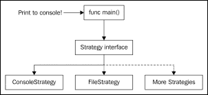
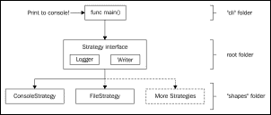
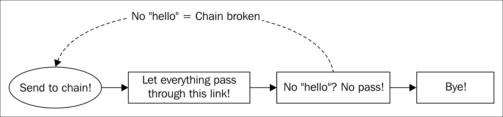
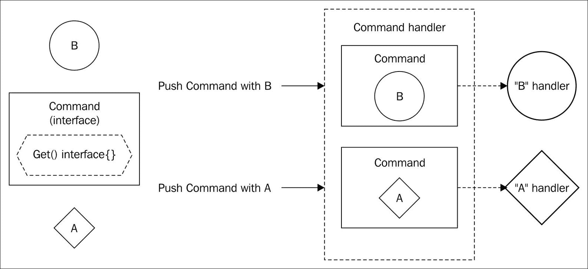

# 第五章。行为模式 - 策略、责任链和命令设计模式

我们将要看到的最后一组常见模式是行为模式。现在，我们不会定义结构或封装对象创建，而是将处理行为。

在行为模式中我们需要处理什么？好吧，现在我们将使用策略模式封装行为，例如算法或命令模式中的执行。

正确的行为设计是在了解如何处理对象创建和结构之后的最后一步。正确定义行为是良好软件设计的最后一步，因为总的来说，良好的软件设计让我们能够轻松地改进算法和修复错误，而最佳的算法实现并不能拯救我们免受糟糕的软件设计的影响。

# 策略设计模式

策略模式可能是行为模式中最容易理解的一个。我们在开发前几个模式时已经使用过它几次，但没有停下来讨论它。现在我们将。

## 描述

策略模式使用不同的算法来实现一些特定的功能。这些算法隐藏在接口后面，当然，它们必须是可互换的。所有算法都以不同的方式实现相同的功能。例如，我们可以有一个 `Sort` 接口和几种排序算法。结果是相同的，某个列表被排序了，但我们可能使用了快速排序、归并排序等等。

你能猜到我们在前几章什么时候使用了策略模式吗？三，二，一... 好吧，当我们使用 `io.Writer` 接口时，我们大量使用了策略模式。`io.Writer` 接口定义了一种写入策略，其功能始终相同——写入某些内容。我们可以将其写入标准输出、某个文件或用户定义的类型，但最终我们做的都是同一件事——写入。我们只是改变了写入的策略（在这种情况下，我们改变了写入的位置）。

## 目标

策略模式的目标非常明确。该模式应该做到以下几点：

+   提供一些算法以实现某些特定的功能

+   所有类型都以不同的方式实现相同的功能，但策略模式的客户端不受影响

问题在于这个定义涵盖了巨大的可能性范围。这是因为策略模式实际上用于各种场景，许多软件工程解决方案都包含某种策略。因此，最好通过一个真实示例来观察它的实际应用。

## 渲染图像或文本

对于这个例子，我们将做一些不同的事情。我们不仅要在控制台上打印文本，还要在文件上绘制对象。

在这种情况下，我们将有两种策略：控制台和文件。但库的用户不需要处理它们背后的复杂性。

关键特性是“调用者”不知道底层库是如何工作的，他只知道定义的策略上可用的信息。这在上面的图中可以很好地看到：



在这个图中，我们选择了打印到控制台，但我们不会直接处理**ConsoleStrategy**类型，我们总是使用代表它的接口。**ConsoleStrategy**类型将隐藏打印到控制台的实施细节，在`main`函数中的调用者。**FileStrategy**也隐藏了其实现细节以及任何未来的策略。

## 接受标准

一个策略必须有一个非常明确的目标，我们将有两种方式来实现它。我们的目标如下：

+   提供一种方式向用户展示一个对象（一个正方形）是文本还是图像

+   用户在启动应用程序时必须在图像或文本之间进行选择

+   应用程序必须能够添加更多的可视化策略（例如音频）

+   如果用户选择文本，必须在控制台上打印单词*Square*

+   如果用户选择图像，将在文件上打印一个白色正方形在黑色背景上的图像

## 实现

我们不会为这个示例编写测试，因为这将是相当复杂的，检查屏幕上是否出现了图像（尽管使用**OpenCV**，一个令人印象深刻的计算机视觉库，并非不可能）。我们将直接定义我们的策略接口，每个打印策略都必须实现（在我们的情况下，文件和控制台类型）：

```go
type PrintStrategy interface { 
  Print() error 
} 

```

那就是全部。我们的策略定义了一个简单的`Print()`方法，该方法返回一个`error`（在处理文件等时，返回错误类型是强制性的）。需要实现`PrintStrategy`的类型将被称为`ConsoleSquare`和`ImageSquare`类型：

```go
type ConsoleSquare struct {} 

type ImageSquare struct { 
  DestinationFilePath string 
} 

```

`ConsoleSquare`结构不需要任何内部字段，因为它总是会打印单词`Square`到控制台。`ImageSquare`结构将存储一个用于打印正方形的图像文件的目标字段。我们将从`ConsoleSquare`类型的实现开始，因为它是最简单的：

```go
func(c *ConsoleSquare) Print() error { 
  println("Square")  
  return nil 
} 

```

非常简单，但图像更复杂。我们不会花太多时间详细解释`image`包是如何工作的，因为代码很容易理解：

```go
func (t *ImageSquare) Print() error { 
  width := 800 
  height := 600 

  origin := image.Point{0, 0} 

  bgImage := image.NewRGBA(image.Rectangle{ 
    Min: origin, 
    Max: image.Point{X: width, Y: height}, 
  }) 

  bgColor := image.Uniform{color.RGBA{R: 70, G: 70, B: 70, A:0}} 
  quality := &jpeg.Options{Quality: 75} 

  draw.Print(bgImage, bgImage.Bounds(), &bgColor, origin, draw.Src) 

```

然而，这里有一个简短的说明：

+   我们定义了一个图像的大小（`width`和`height`变量）为 800 像素宽和 600 像素高。这些将成为我们图像的大小限制，任何超出这个范围的书写将不可见。

+   `origin`变量存储一个`image.Point`，这是一个表示任何二维空间中位置的类型。我们将这个点的位置设置为*(0, 0)*，即图像的左上角。

+   我们需要一个代表我们背景的位图，这里我们称之为 `bgImage`。在图像包中有一个非常方便的函数来创建 `image.RGBA` 类型，称为 `image.NewRGBA`。我们需要传递一个矩形给这个函数，这样它就知道图像的边界。一个矩形由两个 `image.Point` 类型表示--其上左角点（`Min` 字段）和其下右角点（`Max` 字段）。我们使用 `origin` 作为上左角，并使用具有 `width` 和 `height` 值的新点作为下右角点。

+   图像将具有灰色背景颜色（`bgColor`）。这是通过实例化一个表示均匀颜色的 `image.Uniform` 类型来完成的（因此得名）。`image.Uniform` 类型需要一个实现 `RGBA() (r, g, b, a uint32)` 方法的 `color.Color` 接口实例。`color.Color` 类型是任何实现该方法的类型，该方法返回红色、绿色、蓝色和透明度颜色的 `uint32` 值（RGBA）。Alpha 是像素透明度的值。`color` 包方便地提供了一个名为 `color.RGBA` 的类型用于此目的（以防我们不需要实现自己的，即我们的情况）。

+   当以某些格式存储图像时，我们必须指定图像的质量。它不仅会影响质量，当然也会影响文件的大小。在这里，它被定义为 75；100 是我们能设置的最大质量。如您所见，我们在这里使用 `jpeg` 包来设置一个名为 `Options` 的类型的值，它简单地存储质量值，没有更多要应用的价值。

+   最后，`draw.Print` 函数将具有我们定义在相同图像边界上的特性的像素写入提供的图像（`bgImage`）。`draw.Print` 方法的第一个参数是目标图像，我们使用了 `bgImage`。第二个参数是要在目标图像中绘制的对象的边界，我们使用了图像的相同边界，但如果我们想要一个更小的矩形，我们也可以使用任何其他边界。第三个参数是用来着色边界的颜色。`Origin` 变量用于指定边界的左上角必须放置的位置。在这种情况下，边界的大小与图像相同，因此我们需要将其设置为原点。最后一个指定的参数是操作类型；只需将其保留在 `draw.Src` 参数中即可。

现在我们必须绘制一个正方形。这个操作本质上与绘制背景相同，但在这个情况下，我们是在之前绘制的 `bgImage` 上绘制一个正方形：

```go
  squareWidth := 200 
  squareHeight := 200 
  squareColor := image.Uniform{color.RGBA{R: 255, G: 0, B: 0, A: 1}} 
  square := image.Rect(0, 0, squareWidth, squareHeight) 
  square = square.Add(image.Point{ 
    X: (width / 2) - (squareWidth / 2), 
    Y: (height / 2) - (squareHeight / 2), 
  }) 
  squareImg := image.NewRGBA(square) 

  draw.Print(bgImage, squareImg.Bounds(), &squareColor, origin, draw.Src) 

```

正方形将是一个 200*200 像素的红色。当使用 `Add` 方法时，`Rect` 类型的原点会被转换到提供的点；这是为了在图像上居中正方形。我们创建了一个带有正方形 `Rect` 的图像，并在 `bgImage` 图像上再次调用 `Print` 函数来在其上绘制红色正方形：

```go
  w, err := os.Create(t.DestinationFilePath) 
  if err != nil { 
    return fmt.Errorf("Error opening image") 
  } 
  defer w.Close() 

  if err = jpeg.Encode(w, bgImage, quality); err != nil { 
    return fmt.Errorf("Error writing image to disk") 
  } 

  return nil 
} 

```

最后，我们将创建一个文件来存储图像的内容。该文件将存储在`ImageSquare`结构体的`DestinationFilePath`字段提供的路径中。为了创建一个文件，我们使用`os.Create`，它返回`*os.File`。与每个文件一样，使用后必须关闭，所以不要忘记使用`defer`关键字来确保在方法结束时关闭它。

### 小贴士

延迟执行，还是不延迟执行？

有些人问为什么一定要使用`defer`？直接在函数末尾不使用`defer`不是一样吗？实际上不是。如果在方法执行过程中发生错误并返回这个错误，如果它在函数的末尾，`Close`方法将不会执行。你可以在返回之前关闭文件，但你必须在每个错误检查中这样做。使用`defer`，你不必担心这个问题，因为延迟函数总是执行（无论是否有错误）。这样，我们确保文件被关闭。

为了解析参数，我们将使用`flag`包。我们之前已经使用过它，但让我们回顾一下它的用法。标志是一个用户在执行我们的应用程序时可以传递的命令。我们可以通过使用`flag`包中定义的`flag.[type]`方法来定义一个标志。我们希望从控制台读取用户想要使用的输出。这个标志将被称为`output`。一个标志可以有一个默认值；在这种情况下，它将具有用于打印到控制台的值`console`。所以，如果用户在没有参数的情况下执行程序，它将打印到控制台：

```go
var output = flag.String("output", "console", "The output to use between 'console' and 'image' file") 

```

我们最后的步骤是编写主函数：

```go
func main(){ 
    flag.Parse() 

```

记住，在使用标志时，在主函数中首先要做的是使用`flag.Parse()`方法来解析它们！忘记这一步是非常常见的：

```go
var activeStrategy PrintStrategy 

switch *output { 
case "console": 
  activeStrategy = &TextSquare{} 
case "image": 
  activeStrategy = &ImageSquare{"/tmp/image.jpg"} 
default: 
  activeStrategy = &TextSquare{} 
} 

```

我们定义了一个变量来存储用户选择的策略，称为`activeStrategy`。但检查一下`activeStrategy`变量是否具有`PrintStrategy`类型，以便它可以填充任何`PrintStrategy`变量的实现。当用户写入`**--output=console**`命令时，我们将`activeStrategy`设置为`TextSquare`的新实例，当我们写入`**--output=image**`命令时，它将是一个`ImageSquare`。

最后，这里是设计模式执行：

```go
  err := activeStrategy.Print() 
  if err != nil { 
    log.Fatal(err) 
  } 
}

```

我们的`activeStrategy`变量是一个实现`PrintStrategy`类型的类型，或者是`TextSquare`或`ImageSquare`类。用户将在运行时选择他想要为每个特定情况使用的策略。此外，我们还可以编写一个工厂方法模式来创建策略，这样策略的创建也将与主函数解耦，并在不同的独立包中抽象化。想想看：如果我们把策略创建放在不同的包中，这也将允许我们把这个项目作为一个库来使用，而不仅仅是一个独立的程序。

现在，我们将执行这两个策略；`TextSquare`实例将在控制台上打印单词`Square`来给我们一个正方形：

```go
$ go run main.go --output=console
Square

```

它按预期工作。回忆一下标志的工作方式，我们必须使用`--`（双横线）和定义的标志，在我们的例子中是`output`。然后你有两个选项--使用`=`（等于）并立即为标志写入值，或者写入`<space>`和标志的值。在这种情况下，我们已将输出默认值定义为控制台，所以以下三个执行是等效的：

```go
$ go run main.go --output=console
Square
$ go run main.go --output console
Square
$ go run main.go
Square

```

现在我们必须尝试文件策略。如前所述，文件策略将以深灰色背景将红色方块打印到文件中，作为一个图像：

```go
$ go run main.go --output image

```

没有发生任何事情？但实际上一切工作正常。这实际上是一种不好的做法。用户在使用你的应用程序或库时必须始终有一些形式的反馈。此外，如果他们使用你的代码作为库，他们可能有一个特定的输出格式，所以直接打印到控制台可能不是很好。我们将在稍后解决这个问题。现在，使用你最喜欢的文件浏览器打开文件夹`/tmp`，你会看到一个名为`image.jpg`的文件，其中包含我们的红色方块，背景为深灰色。

## 解决我们库中的小问题

我们的代码中存在一些问题：

+   它不能作为一个库使用。我们在`main`包中编写了关键代码（策略创建）。

    **解决方案**：将命令行应用程序的策略创建抽象为两个不同的包。

+   没有任何策略正在对文件或控制台进行任何日志记录。我们必须提供一个方式，让外部用户可以将其集成到他们的日志策略或格式中。

    **解决方案**：注入一个`io.Writer`接口作为依赖项，以充当日志接收器。

+   我们的`TextSquare`类总是写入控制台（`io.Writer`接口的一个实现）和`ImageSquare`总是写入文件（`io.Writer`接口的另一个实现）。这太耦合了。

    **解决方案**：注入一个`io.Writer`接口，以便`TextSquare`和`ImageSquare`可以写入任何可用的`io.Writer`实现（文件和控制台，但还包括字节缓冲区、二进制编码器、`JSON`处理器……数十个包）。

因此，为了将其作为库使用并解决第一个问题，我们将遵循 Go 文件结构中用于应用程序和库的常见方法。首先，我们将我们的主包和函数放在根包之外；在这种情况下，在一个名为`cli`的文件夹中。通常也把这个文件夹称为`cmd`或甚至`app`。然后，我们将我们的`PrintStrategy`接口放在根包中，现在它将被称为`strategy`包。最后，我们将在一个具有相同名称的文件夹中创建一个`shapes`包，我们将把文本和图像策略都放在这个文件夹中。因此，我们的文件结构将如下所示：

+   **根包**: strategy

    文件：`print_strategy.go`

+   **子包**: shapes

    文件：`image.go`，`text.go`，`factory.go`

+   **子包**: cli

    文件：`main.go`

我们将修改我们的接口以适应我们之前写下的需求：

```go
type PrintStrategy interface { 
  Print() error 
  SetLog(io.Writer) 
  SetWriter(io.Writer) 
} 

```

我们添加了 `SetLog(io.Writer)` 方法来为我们的类型添加日志策略；这是为了向用户提供反馈。此外，它还有一个 `SetWriter` 方法来设置 `io.Writer` 策略。这个接口将位于根包的 `print_strategy.go` 文件中。所以最终的架构看起来像这样：



`TextSquare` 和 `ImageSquare` 策略都必须满足 `SetLog` 和 `SetWriter` 方法，这些方法只是简单地在其字段上存储一些对象，因此，为了避免重复实现，我们可以创建一个实现这些方法的结构体，并将这个结构体内嵌在策略中。顺便说一句，这正是我们之前看到的组合模式：

```go
type PrintOutput struct { 
  Writer    io.Writer 
  LogWriter io.Writer 
} 

func(d *PrintOutput) SetLog(w io.Writer) { 
  d.LogWriter = w 
} 

func(d *PrintOutput) SetWriter(w io.Writer) { 
  d.Writer = w 
} 

```

因此，现在如果我们要修改它们的 `Writer` 和 `logger` 字段，每个策略都必须内嵌 `PrintOutput` 结构体。

我们还需要修改我们的策略实现。`TextSquare` 结构体现在需要一个字段来存储输出 `io.Writer`（它将要写入的地方，而不是总是写入控制台）和日志写入器。这两个字段可以通过内嵌 `PrintOutput` 结构体来提供。`TextSquare` 结构体也存储在 `shapes` 包内的 `text.go` 文件中。所以，结构体现在是这样的：

```go
package shapes 

type TextSquare struct { 
  strategy.PrintOutput 
} 

```

因此，现在 `Print()` 方法略有不同，因为我们不再直接使用 `println` 函数将内容写入控制台，而是必须写入存储在 `Writer` 字段中的任何 `io.Writer`：

```go
func (t *TextSquare) Print() error { 
  r := bytes.NewReader([]byte("Circle")) 
  io.Copy(t.Writer, r) 
  return nil 
} 

```

`bytes.NewReader` 是一个非常有用的函数，它接受一个字节数组并将它们转换为 `io.Reader` 接口。我们需要 `io.Reader` 接口来使用 `io.Copy` 函数。`io.Copy` 函数也非常有用，因为它接受一个 `io.Reader`（作为第二个参数）并将其管道传输到 `io.Writer`（它的第一个参数）。所以，在任何情况下我们都不会返回错误。然而，直接使用 `t.Writer` 的 `Write` 方法来做会更简单：

```go
func (t *TextSquare) Print() error { 
  t.Writer.Write([]byte("Circle")) 
  return nil 
} 

```

你可以使用你喜欢的任何方法。通常，你会使用 `Write` 方法，但了解 `bytes.NewReader` 函数也很好。

你是否意识到，当我们使用 `t.Writer` 时，实际上是在访问 `PrintOutput.Writer`？`TextSquare` 类型有一个 `Writer` 字段，因为 `PrintOutput` 结构体有这个字段，并且它被内嵌在 `TextSquare` 结构体中。

### 小贴士

内嵌不是继承。我们在 `TextSquare` 结构体上内嵌了 `PrintOutput` 结构体。现在我们可以像访问 `TextSquare` 字段一样访问 `PrintOutput` 字段。这感觉有点像继承，但这里有一个非常重要的区别：`TextSquare` 不是一个 `PrintOutput` 值，但它在其组合中有一个 `PrintOutput`。这意味着如果你有一个期望 `PrintOutput` 的函数，你不能仅仅因为 `TextSquare` 内嵌了 `PrintOutput` 就传递 `TextSquare`。

但是，如果你有一个接受 `PrintOutput` 实现的接口的函数，你可以传递 `TextSquare` 如果它内嵌了 `PrintOutput`。这正是我们在我们的例子中所做的。

`ImageSquare`结构现在就像`TextSquare`一样，内嵌了`PrintOutput`：

```go
type ImageSquare struct { 
  strategy.PrintOutput 
} 

```

`Print`方法也需要修改。现在，我们不再从`Print`方法创建文件，因为这破坏了单一责任原则。文件实现了`io.Writer`接口，所以我们将文件在外部打开，并将其注入到`Writer`字段。所以，我们只需要修改`Print()`方法的末尾，我们之前是写入文件的：

```go
draw.Print(bgImage, squareImg.Bounds(), &squareColor, origin, draw.Src) 

if i.Writer == nil { 
  return fmt.Errorf("No writer stored on ImageSquare") 
} 
if err := jpeg.Encode(i.Writer, bgImage, quality); err != nil { 
  return fmt.Errorf("Error writing image to disk") 
} 

if i.LogWriter != nil { 
  io.Copy(i.LogWriter, "Image written in provided writer\n") 
} 

return nil 

```

如果你检查我们的前一个实现，在`draw`之后，你可以看到我们使用了`Print`方法，我们使用`os.Create`创建了一个文件，并将其传递给`jpeg.Encode`函数。我们已经删除了这部分关于创建文件的内容，并用一个检查替换了它，检查字段中的`Writer`（`if i.Writer != nil`）。然后，在`jpeg.Encode`中，我们可以用`i.Writer`字段的内容替换我们之前使用的文件值。最后，如果我们提供了日志策略，我们再次使用`io.Copy`来记录一些消息到`LogWriter`。

我们还必须抽象出用户创建`PrintStrategy`实现实例所需的知识，我们将使用工厂方法：

```go
const ( 
  TEXT_STRATEGY  = "text" 
  IMAGE_STRATEGY = "image" 
) 

func NewPrinter(s string) (strategy.Output, error) { 
  switch s { 
  case TEXT_STRATEGY: 
    return &TextSquare{ 
      PrintOutput: strategy.PrintOutput{ 
        LogWriter: os.Stdout, 
      }, 
    }, nil 
  case IMAGE_STRATEGY: 
    return &ImageSquare{ 
      PrintOutput: strategy.PrintOutput{ 
        LogWriter: os.Stdout, 
      }, 
    }, nil 
  default: 
    return nil, fmt.Errorf("Strategy '%s' not found\n", s) 
  } 
} 

```

我们有两个常量，每个策略都有一个：`TEXT_STRATEGY`和`IMAGE_STRATEGY`。这些是必须提供给工厂以检索每个方框绘制策略的常量。我们的工厂方法接收一个参数`s`，它是一个包含之前常量之一的字符串。

每个策略都有一个`PrintOutput`类型内嵌，默认将日志输出到`stdout`，但你可以稍后通过使用`SetLog(io.Writer)`方法来覆盖它。这种方法可以被认为是一个原型的工厂。如果不是已识别的策略，将返回适当的错误信息。

我们现在有一个库。我们在`strategy`和`shapes`包之间拥有所需的所有功能。现在我们将编写一个名为`main`的包和函数，在一个名为`cli`的新文件夹中：

```go
var output = flag.String("output", "text", "The output to use between "+ 
  "'console' and 'image' file") 

func main() { 
  flag.Parse() 

```

再次，就像之前一样，`main`函数首先解析控制台上的输入参数以收集所选策略。现在我们可以使用变量 output 来创建一个策略，而不需要 Factory：

```go
activeStrategy, err := shapes.NewPrinter(*output) 
if err != nil { 
  log.Fatal(err) 
} 

log.Fatal method if any error is found (such as an unrecognized strategy).
```

现在我们将通过使用我们的库来实现业务需求。对于`TextStrategy`的目的，我们希望写入，例如，到`stdout`。对于图像的目的，我们将写入到`/tmp/image.jpg`。就像之前一样。所以，根据之前的声明，我们可以写入：

```go
switch *output { 
case shapes.TEXT_STRATEGY: 
  activeStrategy.SetWriter(os.Stdout) 
case shapes.IMAGE_STRATEGY: 
  w, err := os.Create("/tmp/image.jpg") 
  if err != nil { 
    log.Fatal("Error opening image") 
  } 
  defer w.Close() 

  activeStrategy.SetWriter(w) 
} 

```

在`TEXT_STRATEGY`的情况下，我们使用`SetWriter`来设置`io.Writer`为`os.Stdout`。在`IMAGE_STRATEGY`的情况下，我们在我们的任何一个文件夹中创建一个图像，并将文件变量传递给`SetWriter`方法。记住，`os.File`实现了`io.Reader`和`io.Writer`接口，所以将其作为`io.Writer`传递给`SetWriter`方法是完全合法的：

```go
err = activeStrategy.Print() 
if err != nil { 
  log.Fatal(err) 
} 

```

最后，我们调用用户选择的策略的`Print`方法，并检查可能的错误。现在让我们尝试运行这个程序：

```go
$ go run main.go --output text
Circle

```

它按预期工作。那么图像策略呢？

```go
$ go run main.go --output image
Image written in provided writer

```

如果我们在 `/tmp/image.jpg` 中进行检查，我们可以在暗色背景上找到我们的红色方块。

## 关于策略模式的最后几句话

我们已经学会了一种强大的方法来封装不同的结构体中的算法。我们还使用了嵌入而不是继承来在类型之间提供跨功能性，这在我们的应用中会非常实用。你会发现自己在各个地方结合策略，就像我们在第二个例子中看到的那样，在那里我们使用了通过使用 `io.Writer` 接口进行日志记录和写入的策略，以及一个用于字节流操作的策略。

# 责任链设计模式

我们下一个模式被称为**责任链**。正如其名所示，它由一个链组成，在我们的情况下，链中的每个链接都遵循单一职责原则。

## 描述

单一职责原则意味着一个类型、函数、方法或任何类似的抽象必须只有一个单一职责，并且它必须做得相当好。这样，我们可以将许多实现一个特定功能的函数应用到结构体、切片、映射等中。

当我们非常频繁地以逻辑方式应用许多这些抽象时，我们可以将它们链在一起按顺序执行，例如，例如，一个日志链。

日志记录链是一组类型，它将某些程序的输出记录到多个 `io.Writer` 接口。我们可以有一个记录到控制台的类型，一个记录到文件的类型，以及一个记录到远程服务器的类型。每次你想进行一些日志记录时，你可以调用三个类型，但只调用一个并引发连锁反应会更优雅。

但是，我们也可以有一个检查链，如果其中一个检查失败，就断开链并返回一些内容。这就是身份验证和授权中间件的工作方式。

## 目标

责任链模式的目标是为开发者提供一种在运行时链式执行操作的方法。操作被链在一起，每个链接将执行一些操作并将请求传递给下一个链接（或不会传递）。以下是这个模式遵循的目标：

+   根据某些输入在运行时动态链式执行操作

+   将请求通过处理器链传递，直到其中一个可以处理它，在这种情况下，链可以停止

## 多日志记录器链

我们将要开发一个多日志记录器解决方案，我们可以按我们想要的方式链式使用。我们将使用两个不同的控制台日志记录器和一个是通用日志记录器：

1.  我们需要一个简单的日志记录器，它带有前缀 *First logger* 记录请求的文本，并将其传递给链中的下一个链接。

1.  第二个日志记录器将在传入的文本包含单词 `hello` 时写入控制台，并将请求传递给第三个日志记录器。但是，如果没有，链将被断开，并且它将立即返回。

1.  第三个日志记录器类型是一个通用日志记录器，称为 `WriterLogger`，它使用 `io.Writer` 接口进行日志记录。

1.  `WriterLogger` 的具体实现将写入文件，并代表链中的第三个链接。

这些步骤的实现描述如下图所示：



## 单元测试

对于链的第一个要做的，就像往常一样，是定义接口。责任链接口通常至少有一个 `Next()` 方法。`Next()` 方法当然是执行链中下一个链接的方法：

```go
type ChainLogger interface { 
  Next(string) 
} 

```

我们示例接口上的 `Next` 方法接受我们想要记录的消息，并将其传递给链中的下一个链接。正如接受标准所写，我们需要三个记录器：

```go
type FirstLogger struct { 
  NextChain ChainLogger 
} 

func (f *FirstLogger) Next(s string) {} 

type SecondLogger struct { 
  NextChain ChainLogger 
} 

func (f *SecondLogger) Next(s string) {} 

type WriterLogger struct { 
  NextChain ChainLogger 
  Writer    io.Writer 
} 
func (w *WriterLogger) Next(s string) {} 

```

`FirstLogger` 和 `SecondLogger` 类型结构完全相同--两者都实现了 `ChainLogger` 并有一个指向下一个 `ChainLogger` 的 `NextChain` 字段。`WriterLogger` 类型与 `FirstLogger` 和 `SecondLogger` 类型相同，但还有一个字段用于写入其数据，因此你可以向它传递任何 `io.Writer` 接口。

就像我们之前做的那样，我们将实现一个 `io.Writer` 结构体以用于我们的测试。在我们的测试文件中，我们定义以下结构体：

```go
type myTestWriter struct { 
  receivedMessage string 
} 

func (m *myTestWriter) Write(p []byte) (int, error) { 
  m.receivedMessage += string(p) 
  return len(p), nil 
} 

func(m *myTestWriter) Next(s string){ 
  m.Write([]byte(s)) 
} 

```

我们将传递一个 `myTestWriter` 结构体实例到 `WriterLogger`，这样我们就可以跟踪测试中记录的内容。`myTestWriter` 类实现了来自 `io.Writer` 接口的通用 `Write([]byte) (int, error)` 方法。记住，如果它有 `Write` 方法，则它可以作为 `io.Writer` 使用。`Write` 方法简单地将字符串参数存储到 `receivedMessage` 字段中，这样我们就可以在测试中检查其值。

这是第一个测试函数的开始：

```go
func TestCreateDefaultChain(t *testing.T) { 
  //Our test ChainLogger 
  myWriter := myTestWriter{} 

  writerLogger := WriterLogger{Writer: &myWriter} 
  second := SecondLogger{NextChain: &writerLogger} 
  chain := FirstLogger{NextChain: &second} 

```

让我们详细描述这几行，因为它们相当重要。我们创建了一个具有默认 `myTestWriter` 类型的变量，我们将将其用作链中最后一个链接的 `io.Writer` 接口。然后我们创建了链接链的最后一部分，即 `writerLogger` 接口。在实现链时，你通常从链的最后一部分开始，在我们的情况下，它是一个 `WriterLogger`。`WriterLogger` 将数据写入 `io.Writer`，所以我们传递 `myWriter` 作为 `io.Writer` 接口。

然后，我们创建了一个 `SecondLogger`，它是我们链中的中间链接，并指向 `writerLogger`。正如我们之前提到的，`SecondLogger` 仅在消息包含单词 `hello` 时记录并传递消息。在生产应用程序中，它可能是一个仅记录错误的记录器。

最后，链中的第一个链接具有变量名链，它指向第二个记录器。所以，总结一下，我们的链看起来是这样的：`FirstLogger` | `SecondLogger` | `WriterLogger`。

这将是我们的测试默认设置：

```go
t.Run("3 loggers, 2 of them writes to console, second only if it founds " + 
  "the word 'hello', third writes to some variable if second found 'hello'", 
  func(t *testing.T){ 
    chain.Next("message that breaks the chain\n") 

    if myWriter.receivedMessage != "" { 
      t.Fatal("Last link should not receive any message") 
    } 

    chain.Next("Hello\n") 

    if !strings.Contains(myWriter.receivedMessage, "Hello") { 
      t.Fatal("Last link didn't received expected message") 
    } 
}) 

```

继续使用 Go 1.7 或更高版本的测试签名，我们定义一个内部测试，其描述如下：*三个日志记录器，其中两个写入控制台，第二个仅在找到单词 'hello' 时写入，第三个在第二个找到 'hello' 时写入某个变量*。这相当详细，如果其他人需要维护此代码，则非常容易理解。

首先，我们在`Next`方法上使用一条消息，这条消息不会达到链中的第三个链接，因为它不包含单词`hello`。我们检查`receivedMessage`变量的内容，默认情况下它是空的，以查看它是否已更改，因为它不应该改变。

接下来，我们再次使用链变量，它是链中的第一个链接，并传递消息`"Hello\n"`。根据测试的描述，它应该使用`FirstLogger`记录，然后在`SecondLogger`中记录，最后在`WriterLogger`中记录，因为它包含单词`hello`，而`SecondLogger`会允许它通过。

测试检查`myWriter`，链中的最后一个链接，它在名为`receivedMessage`的变量中存储了过去的消息，是否包含我们在链中传递的第一个单词：hello。让我们运行它，看看它是否会失败：

```go
go test -v .
=== RUN   TestCreateDefaultChain
=== RUN   TestCreateDefaultChain/3_loggers,_2_of_them_writes_to_console,_second_only_if_it_founds_the_word_'hello',_third_writes_to_some_variable_if_second_found_'hello'
--- FAIL: TestCreateDefaultChain (0.00s)
--- FAIL: TestCreateDefaultChain/3_loggers,_2_of_them_writes_to_console,_second_only_if_it_founds_the_word_'hello',_third_writes_to_some_variable_if_second_found_'hello' (0.00s)
 chain_test.go:33: Last message didn't received expected message
FAIL
exit status 1
FAIL

```

测试在第一次检查中通过了，但在第二次检查中没有通过。嗯……理想情况下，在完成任何实现之前，不应该有任何检查通过。记住，在测试驱动开发中，测试必须在第一次启动时失败，因为它们测试的代码尚未实现。零初始化错误会误导我们，因为测试通过了这个检查。我们可以用两种方式解决这个问题：

+   将`ChainLogger`的签名改为返回一个错误：`Next(string)`错误。这样，我们就会在返回错误时断开链。这在一般情况下是一个更方便的方法，但会引入相当多的模板代码。

+   将`receivedMessage`字段更改为指针。指针的默认值是 nil，而不是空字符串。

我们现在将使用第二种选项，因为它更简单，也很有效。所以让我们将`myTestWriter`结构的签名更改为以下内容：

```go
type myTestWriter struct { 
  receivedMessage *string 
} 

func (m *myTestWriter) Write(p []byte) (int, error) { 
  if m.receivedMessage == nil { 
         m.receivedMessage = new(string) 
} 
  tempMessage := fmt.Sprintf("%s%s", m.receivedMessage, p) 
  m.receivedMessage = &tempMessage 
  return len(p), nil 
} 

func (m *myTestWriter) Next(s string) { 
  m.Write([]byte(s)) 
} 

```

检查`receivedMessage`的类型现在带有星号（`*`），以表示它是一个指向字符串的指针。`Write`函数也需要更改。现在我们必须检查`receivedMessage`字段的值，因为，作为每个指针，它被初始化为 nil。然后我们必须首先将消息存储在一个变量中，这样我们就可以在下一行的赋值`(m.receivedMessage = &tempMessage)`中获取地址。

因此，现在我们的测试代码也需要做一些改变：

```go
t.Run("3 loggers, 2 of them writes to console, second only if it founds "+ 
"the word 'hello', third writes to some variable if second found 'hello'", 
func(t *testing.T) { 
  chain.Next("message that breaks the chain\n") 

  if myWriter.receivedMessage != nil { 
    t.Error("Last link should not receive any message") 
  } 

  chain.Next("Hello\n") 

  if myWriter.receivedMessage == "" || !strings.Contains(*myWriter.receivedMessage, "Hello") { 
    t.Fatal("Last link didn't received expected message") 
  } 
}) 

```

现在我们正在检查`myWriter.receivedMessage`实际上是`nil`，所以肯定没有在这个变量上写入任何内容。此外，我们必须将第二个 if 更改为首先检查成员是否为 nil，然后再检查其内容，否则它可能会在测试中抛出 panic。让我们再次测试它：

```go
go test -v . 
=== RUN   TestCreateDefaultChain 
=== RUN   TestCreateDefaultChain/3_loggers,_2_of_them_writes_to_console,_second_only_if_it_founds_the_word_'hello',_third_writes_to_some_variable_if_second_found_'hello' 
--- FAIL: TestCreateDefaultChain (0.00s) 
--- FAIL: TestCreateDefaultChain/3_loggers,_2_of_them_writes_to_console,_second_only_if_it_founds_the_word_'hello',_third_writes_to_some_variable_if_second_found_'hello' (0.00s) 
        chain_test.go:40: Last link didn't received expected message 
FAIL 
exit status 1 
FAIL

```

它再次失败了，而且测试的前半部分仍然正确地通过了，没有实现代码。那么我们现在应该怎么做？我们需要更改 `myWriter` 类型的签名，以便在两个检查中使测试失败，并且在第二次检查中再次失败。在这种情况下，我们可以忽略这个小问题。在编写测试时，我们必须非常小心，不要对它们过于着迷；单元测试是帮助我们编写和维护代码的工具，但我们的目标是编写功能，而不是测试。这一点很重要，因为你可以编写出非常疯狂的单元测试。

## 实现

现在我们必须实现第一个、第二个和第三个日志记录器，分别称为 `FirstLogger`、`SecondLogger` 和 `WriterLogger`。根据第一项验收标准，`FirstLogger` 日志记录器是最简单的一个：*我们需要一个简单的日志记录器，它使用前缀 First logger: 记录请求的文本，并将其传递给链中的下一个链接*。所以让我们来做这件事：

```go
type FirstLogger struct { 
  NextChain ChainLogger 
} 

func (f *FirstLogger) Next(s string) { 
  fmt.Printf("First logger: %s\n", s) 

  if f.NextChain != nil { 
    f.NextChain.Next(s) 
  } 
} 

```

实现相当简单。使用 `fmt.Printf` 方法格式化和打印传入的字符串，我们追加文本 `First Logger:`。然后，我们检查 `NextChain` 类型实际上有一些内容，并通过调用其 `Next(string)` 方法将其传递给控制。测试不应该通过，所以我们将继续使用 `SecondLogger` 日志记录器：

```go
type SecondLogger struct { 
  NextChain ChainLogger 
} 

func (se *SecondLogger) Next(s string) { 
  if strings.Contains(strings.ToLower(s), "hello") { 
    fmt.Printf("Second logger: %s\n", s) 

    if se.NextChain != nil { 
      se.NextChain.Next(s) 
    } 

    return 
  } 

  fmt.Printf("Finishing in second logging\n\n") 
} 

```

如第二项验收标准所述，`SecondLogger` 的描述是：*第二个日志记录器将在传入文本包含单词 "hello" 时写入控制台，并将请求传递给第三个日志记录器*。首先，它检查传入的文本是否包含文本 `hello`。如果是真的，它将消息打印到控制台，并追加文本 `Second logger:`，然后将消息传递给链中的下一个链接（检查前面的实例，是否存在第三个链接）。

但是如果它不包含文本 `hello`，链就会被打破，并打印出消息 `Finishing in second logging`。

我们将以 `WriterLogger` 类型来最终确定：

```go
type WriterLogger struct { 
  NextChain ChainLogger 
  Writer    io.Writer 
} 

func (w *WriterLogger) Next(s string) { 
  if w.Writer != nil { 
    w.Writer.Write([]byte("WriterLogger: " + s)) 
  } 

  if w.NextChain != nil { 
    w.NextChain.Next(s) 
  } 
} 

```

`WriterLogger` 结构体的 `Next` 方法检查 `Writer` 成员中是否存储了现有的 `io.Writer` 接口，并将传入的消息写入其中，并在其后面追加文本 `WriterLogger:`。然后，就像之前的链接一样，检查是否有更多的链接来传递消息。

现在测试将成功通过：

```go
go test -v .
=== RUN   TestCreateDefaultChain
=== RUN   TestCreateDefaultChain/3_loggers,_2_of_them_writes_to_console,_second_only_if_it_founds_the_word_'hello',_third_writes_to_some_variable_if_second_found_'hello'
First logger: message that breaks the chain
Finishing in second logging
First logger: Hello
Second logger: Hello
--- PASS: TestCreateDefaultChain (0.00s)
 --- PASS: TestCreateDefaultChain/3_loggers,_2_of_them_writes_to_console,_second_only_if_it_founds_the_word_'hello',_third_writes_to_some_variable_if_second_found_'hello' (0.00s)
PASS
ok

```

测试的前半部分打印出两条消息--`First logger:` 消息打破了链，这是为 `FirstLogger` 预期的消息。但是它在 `SecondLogger` 中停止了，因为没有在传入的消息中找到 `hello` 这个单词；这就是为什么它会打印出 `Finishing in second logging` 字符串。

测试的后半部分接收到的消息是 `Hello`。所以 `FirstLogger` 打印，`SecondLogger` 也打印。第三个日志记录器根本不打印到控制台，而是打印到测试中定义的 `myWriter.receivedMessage` 行。

## 那么闭包呢？

有时定义一个更灵活的链链接以进行快速调试可能很有用。我们可以使用闭包来做到这一点，这样链接功能就由调用者定义。闭包链接看起来是什么样子？类似于 `WriterLogger` 记录器：

```go
type ClosureChain struct { 
  NextChain ChainLogger 
  Closure   func(string) 
} 

func (c *ClosureChain) Next(s string) { 
  if c.Closure != nil { 
    c.Closure(s) 
  } 

  if c.NextChain != nil { 
    c.Next(s) 
  } 
} 

```

`ClosureChain` 类型具有 `NextChain`，就像往常一样，以及一个 `Closure` 成员。看看 `Closure` 的签名：`func(string)`。这意味着它是一个接受 `string` 并不返回任何内容的函数。

`ClosureChain` 类的 `Next(string)` 方法检查 `Closure` 成员是否已存储，并使用传入的字符串执行它。像往常一样，链接检查是否有更多链接以传递消息，因为链中的每个链接都会传递消息。

那么，我们如何现在使用它呢？我们将定义一个新的测试来展示其功能：

```go
t.Run("2 loggers, second uses the closure implementation", func(t *testing.T) { 
  myWriter = myTestWriter{} 
  closureLogger := ClosureChain{ 
    Closure: func(s string) { 
      fmt.Printf("My closure logger! Message: %s\n", s) 
      myWriter.receivedMessage = &s 
    }, 
  } 

  writerLogger.NextChain = &closureLogger 

  chain.Next("Hello closure logger") 

  if *myWriter.receivedMessage != "Hello closure logger" { 
    t.Fatal("Expected message wasn't received in myWriter") 
  } 
}) 

```

这个测试的描述使它很清楚：“2 个记录器，第二个使用闭包实现”。我们简单地使用两个 `ChainLogger` 实现，并在第二个链接中使用 `closureLogger`。我们创建了一个新的 `myTestWriter` 来存储消息的内容。在定义 `ClosureChain` 时，我们在创建 `closureLogger` 时直接在 `Closure` 成员上定义了一个匿名函数。它打印 `"My closure logger! Message: %s\n"`，并用传入的消息替换 "%s"。然后，我们将传入的消息存储在 `myWriter` 上，以便稍后检查。

在定义这个新链接后，我们使用上一个测试中的第三个链接，将闭包作为第四个链接添加，并传递消息 `Hello closure logger`。我们在消息的开头使用 `Hello` 这个词，以确保消息会通过 `SecondLogger`。

最后，`myWriter.receivedMessage` 的内容必须包含传递的文本：`Hello closure logger`。这是一个相当灵活的方法，但有一个缺点：在定义这样的闭包时，我们无法以非常优雅的方式测试其内容。让我们再次运行测试：

```go
go test -v . 
=== RUN   TestCreateDefaultChain 
=== RUN   TestCreateDefaultChain/3_loggers,_2_of_them_writes_to_console,_second_only_if_it_founds_the_word_'hello',_third_writes_to_some_variable_if_second_found_'hello' 
First logger: message that breaks the chain 
Finishing in second logging 

First logger: Hello 
Second logger: Hello 
=== RUN   TestCreateDefaultChain/2_loggers,_second_uses_the_closure_implementation 
First logger: Hello closure logger 
Second logger: Hello closure logger 
My closure logger! Message: Hello closure logger 
--- PASS: TestCreateDefaultChain (0.00s) 
    --- PASS: TestCreateDefaultChain/3_loggers,_2_of_them_writes_to_console,_second_only_if_it_founds_the_word_'hello',_third_writes_to_some_variable_if_second_found_'hello' (0.00s) 
    --- PASS: TestCreateDefaultChain/2_loggers,_second_uses_the_closure_implementation (0.00s) 
PASS 
ok

```

看看第三个 `RUN`：消息正确地通过了第一个、第二个和第三个链接，到达了打印预期 `My closure logger! Message: Hello closure logger` 消息的闭包。

在某些接口中添加闭包方法实现非常有用，因为它在使用库时提供了相当多的灵活性。你可以在 Go 代码中经常找到这种方法，其中最著名的是 `net/http` 包。我们之前在结构模式中使用 `HandleFunc` 函数定义 HTTP 请求的处理程序。

## 组合起来

我们学习了一个强大的工具，用于实现动作的动态处理和状态管理。责任链模式被广泛使用，也用于创建**有限状态机**（**FSM**）。它也可以与装饰器模式互换使用，区别在于当你装饰时，你改变了对象的结构，而当你使用链时，你为链中的每个链接定义了一个行为，这也可以中断链。

# 命令设计模式

为了结束这一章，我们还将看到**命令**模式——这是一个微小的设计模式，但仍然经常使用。你需要一种方法来连接真正无关的类型？那么为它们设计一个命令。

## 描述

命令设计模式与策略设计模式非常相似，但有一些关键的区别。在策略模式中，我们关注算法的更改，而在命令模式中，我们关注对某物或某些类型的抽象或调用。

命令模式通常被视为一个容器。你可以在 UI 上放置用户交互的信息，比如“点击登录”，并将其作为命令传递。你不需要在命令中包含与“点击登录”操作相关的复杂性，只需操作本身即可。

有机世界的例子可以是快递公司的盒子。我们可以把它放在上面，但作为一个快递公司，我们对其内容的直接管理不如对盒子的管理感兴趣。

在处理通道时，将大量使用命令模式。通过通道，你可以发送任何消息，但如果我们需要从通道的接收端获取响应，一个常见的做法是创建一个带有附加的响应通道的命令，我们在那里监听。

同样，一个很好的例子是多玩家视频游戏，其中每个用户的每个操作都可以作为命令通过网络发送给其他用户。

## 目标

当使用命令设计模式时，我们试图将某种动作或信息封装在一个轻量级的包装中，该包装必须在其他地方进行处理。它与策略模式类似，但实际上，命令可以在其他地方触发预配置的策略，因此它们并不相同。以下是该设计模式的目标：

+   将一些信息放入一个盒子中。只有接收者会打开盒子并知道其内容。

+   将某些操作委托到其他地方。

行为也在以下图中得到解释：



我们有一个**命令**接口，其中包含一个**Get() interface{}**方法。我们有类型**A**和类型**B**。想法是**A**和**B**实现**命令**接口以返回自身作为`interface{}`。既然它们实现了**命令**，它们就可以在**命令处理器**中使用，而处理器并不关心底层类型。现在**A**和**B**可以穿越处理命令的函数或自由存储命令。但是**B**处理器可以从任何**命令处理器**中取一个对象来“解包”它，并获取其**B**内容以及带有其`A`内容的**A**命令处理器。

我们将信息放入一个盒子（**命令**）中，并将处理它的任务委托给命令处理器。

## 一个简单的队列

我们的第一个示例将会相当简单。我们将把一些信息放入一个命令实现者中，并拥有一个队列。我们将创建许多实现命令模式的类型的实例，并将它们传递给一个队列，该队列将存储命令，直到队列中有三个命令，此时它将处理它们。

## 验收标准

因此，理想的验收标准应该以某种方式反映创建一个可以接受无关类型的盒子和执行命令本身的影响：

+   我们需要一个控制台打印命令的构造函数。当使用这个构造函数与一个 `string` 时，它将返回一个将打印它的命令。在这种情况下，处理程序位于作为盒子和处理器的命令中。

+   我们需要一个数据结构，用于在队列中存储传入的命令，并在队列长度达到三个时打印它们。

## 实现方式

这种模式相当简单，我们将编写几个不同的示例，因此我们将直接实现库以保持内容简洁和简短。经典的命令设计模式通常有一个带有 `Execute` 方法的公共类型结构。我们也将使用这种结构，因为它相当灵活且简单：

```go
type Command interface { 
  Execute() 
} 

```

这足够通用，可以填充许多无关类型！想想看——我们将创建一个类型，当使用 `Execute()` 方法时，它将打印到控制台，但它也可以打印一个数字或发射火箭！关键在于关注调用，因为处理程序也在命令中。因此，我们需要一些实现此接口并打印某种消息的类型：

```go
type ConsoleOutput struct { 
  message string 
} 

func (c *ConsoleOutput) Execute() { 
  fmt.Println(c.message) 
} 

```

`ConsoleOutput` 类型实现了 `Command` 接口，并将成员 `message` 打印到控制台。

如第一项验收标准所述，我们需要一个 `Command` 构造函数，它接受一个消息字符串并返回 `Command` 接口。它的签名是 `func CreateCommand(s string) Command`：

```go
 func CreateCommand(s string) Command { 
   fmt.Println("Creating command") 

   return &ConsoleOutput{ 
         message: s, 
   } 
} 

```

对于命令 `queue`，我们将定义一个非常简单的类型 `CommandQueue`，用于在队列中存储实现 `Command` 接口的任何类型：

```go
type CommandQueue struct { 
  queue []Command 
} 

func (p *CommandQueue) AddCommand(c Command) { 
  p.queue = append(p.queue, c) 

  if len(p.queue) == 3 { 
    for _, command := range p.queue { 
      command.Execute() 
    } 

    p.queue = make([]Command, 3) 
  } 
} 

```

`CommandQueue` 类型存储了一个 `Commands` 接口数组的引用。当队列数组达到三个项目时，它将执行队列字段中存储的所有命令。如果还没有达到所需的长度，它只是存储该命令。

我们将创建五个命令，足以触发命令队列机制，并将它们添加到队列中。每次创建一个命令时，控制台将打印出消息 `Creating command`。当我们创建第三个命令时，自动命令执行器将被启动，打印出前三个消息。我们再创建并添加两个命令，但由于我们没有再次达到第三个命令，它们不会被打印，只会打印出 `Creating command` 消息：

```go
func main() { 
  queue := CommandQueue{} 

  queue.AddCommand(CreateCommand("First message")) 
  queue.AddCommand(CreateCommand("Second message")) 
  queue.AddCommand(CreateCommand("Third message")) 

  queue.AddCommand(CreateCommand("Fourth message")) 
  queue.AddCommand(CreateCommand("Fifth message")) 
} 

```

让我们运行`main`程序。我们的定义说明命令每处理三条消息一次，我们将创建总共五条消息。前三条消息必须打印，但第四和第五条消息不打印，因为我们没有达到第六条消息来触发命令处理：

```go
$go run command.go
Creating command
Creating command
Creating command
First message
Second message
Third message
Creating command
Creating command

```

如您所见，第四和第五条消息没有按预期打印，但我们知道命令已经被创建并存储在数组中。它们只是没有被处理，因为队列正在等待一个额外的命令来触发处理器。

## 更多示例

之前的例子展示了如何使用一个命令处理器来执行命令的内容。但使用命令模式的一种常见方式是将信息委托给不同的对象，而不是执行。

例如，我们不会打印到控制台，而是创建一个提取信息的命令：

```go
type Command interface { 
  Info() string 
} 

```

在这种情况下，我们的`Command`接口将有一个名为`Info`的方法，它将从其实现者那里检索一些信息。我们将创建两个实现；一个将返回命令创建到执行之间经过的时间：

```go
type TimePassed struct { 
  start time.Time 
} 

func (t *TimePassed) Info() string { 
  return time.Since(t.start).String() 
} 

```

`time.Since`函数返回从提供的参数存储的时间开始经过的时间。我们通过在`time.Time`类型上调用`String()`方法来返回经过时间的字符串表示。我们新的`Command`的第二个实现将返回消息`Hello World!`：

```go
type HelloMessage struct{} 

func (h HelloMessage) Info() string { 
  return "Hello world!" 
} 

```

我们的`main`函数将简单地创建每种类型的实例，然后等待一秒钟，并打印每个`Command`返回的信息：

```go
func main() { 
  var timeCommand Command 
  timeCommand = &TimePassed{time.Now()} 

  var helloCommand Command 
  helloCommand = &HelloMessage{} 

  time.Sleep(time.Second) 

  fmt.Println(timeCommand.Info()) 
  fmt.Println(helloCommand.Info()) 
} 

```

`time.Sleep`函数使当前 goroutine 的执行停止指定的时间（一秒）。所以，回想一下——`timeCommand`变量存储了程序开始的时间，它的`Info()`方法返回自我们给该类型赋值以来经过时间的字符串表示。`helloCommand`变量在调用其`Info()`方法时返回消息`Hello World!`。在这里，我们没有再次实现`Command`处理器以保持简单，但我们可以将控制台视为处理器，因为我们只能打印 ASCII 字符，就像通过`Info()`方法检索到的那些字符一样。

让我们运行`main`函数：

```go
go run command.go
1.000216755s
Hello world!

```

这里我们到了。在这种情况下，我们通过使用命令模式来检索一些信息。一种类型存储`时间`信息，而另一种则不存储任何信息，它简单地返回相同的简单字符串。每次运行`main`函数都会返回不同的已过时间，所以如果时间与示例中的时间不匹配，请不要担心。

## 命令的责任链

你还记得责任链设计模式吗？我们是在链接之间传递一个`字符串`消息以打印其内容。但我们可以使用之前的命令来检索信息以记录到控制台。我们将主要重用我们已经编写的代码。

`Command`接口将来自返回字符串的先前示例中的类型接口：

```go
type Command interface { 
  Info() string 
} 

```

我们还将使用`TimePassed`类型的`Command`实现：

```go
type TimePassed struct { 
  start time.Time 
} 

func (t *TimePassed) Info() string { 
  return time.Since(t.start).String() 
} 

```

记住，这个类型在其`Info()`字符串方法中返回对象创建的经过时间。我们还需要从本章的*责任链设计模式*部分获取`ChainLogger`接口，但这次它将在其`Next`方法中传递命令而不是字符串：

```go
type ChainLogger interface { 
  Next(Command) 
} 

```

为了简单起见，我们将使用相同的类型来表示链中的两个链路。这个链路非常类似于责任链模式示例中的`FirstLogger`类型，但这次它将附加消息`Elapsed time from creation:`并在打印之前等待 1 秒钟。我们将称之为`Logger`而不是`FirstLogger`：

```go
type Logger struct { 
  NextChain ChainLogger 
} 

func (f *Logger) Next(c Command) { 
  time.Sleep(time.Second) 

  fmt.Printf("Elapsed time from creation: %s\n", c.Info()) 

  if f.NextChain != nil { 
    f.NextChain.Next(c) 
  } 
} 

```

最后，我们需要一个`main`函数来执行接受`Command`指针的链。

```go
func main() { 
  second := new(Logger) 
  first := Logger{NextChain: second} 

  command := &TimePassed{start: time.Now()} 

  first.Next(command) 
} 

```

行行分析，我们创建了一个名为`second`的变量，它指向一个`Logger`；这将是我们链中的第二个链路。然后我们创建了一个名为`first`的变量，它将是链中的第一个链路。第一个链路指向`second`变量，即链中的第二个链路。

然后，我们创建一个`TimePassed`的实例来使用它作为`Command`类型。这个命令的起始时间是执行时间（`time.Now()`方法返回执行时刻的时间）。

最后，我们在`first.Next(command)`语句中将`Command`接口传递给链。这个程序的输出如下：

```go
go run chain_command.go
Elapsed time from creation: 1.0003419s
Elapsed time from creation: 2.000682s

```

结果输出反映在以下图中：具有时间字段的命令被推送到第一个知道如何执行任何类型命令的链路。然后它将命令传递给第二个也知道如何执行命令的链路：

这种方法隐藏了每个`Command`执行背后的复杂性，使其从每个链路上的命令处理器中隐藏。一个命令背后隐藏的功能可以是简单的，也可以是极其复杂的，但这里的想法是重用处理器来管理许多不同类型的无关实现。

## 总结命令模式

命令是一个非常小的设计模式；它的功能很容易理解，但因其简单性而被广泛使用。它看起来非常类似于策略模式，但请记住，策略模式是关于拥有许多算法来完成某些特定任务，但所有这些算法都完成相同的任务。在命令模式中，你有许多任务要执行，而且并非所有任务都需要相等。

因此，简而言之，命令模式是关于执行封装和委托，以便只有接收者或接收者触发执行。

# 概述

我们在行为模式中迈出了第一步。本章的目标是向读者介绍算法和执行封装的概念，使用适当的接口和结构。通过策略，我们封装了算法，通过责任链处理器和命令设计模式执行。

现在，我们掌握了关于策略模式的知识，我们可以将我们的应用程序与其算法解耦，仅用于测试，这是一个非常有用的功能，可以在不同类型中注入模拟，这在几乎不可能进行测试的情况下几乎是不可能的。但这也适用于任何可能需要根据某些上下文采取不同方法的情况（例如，缩短列表；某些算法的性能取决于列表的分布）。

责任链模式为任何类型的中间件和插件式库打开了大门，以提升某些部分的功能。许多开源项目使用责任链来处理 HTTP 请求和响应，以便提取信息传递给最终用户（例如，cookie 信息）或检查认证细节（只有在我数据库中有你的记录时，我才会让你通过到下一个链接）。

最后，命令模式是处理 UI 的最常见模式，但在许多其他场景中也非常有用，在这些场景中，我们需要在许多无关的类型之间进行某种类型的处理（例如，通过通道传递的消息）。
