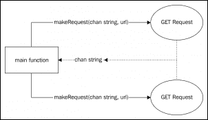
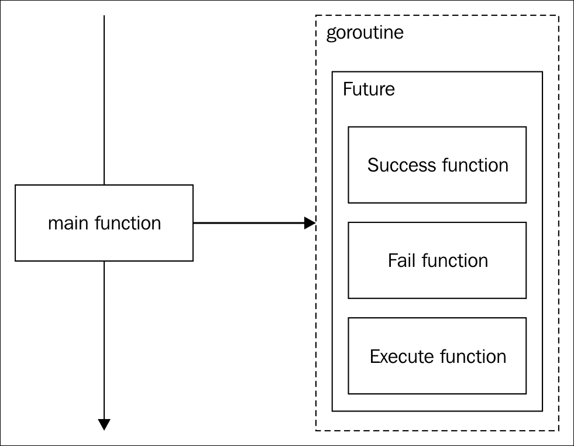
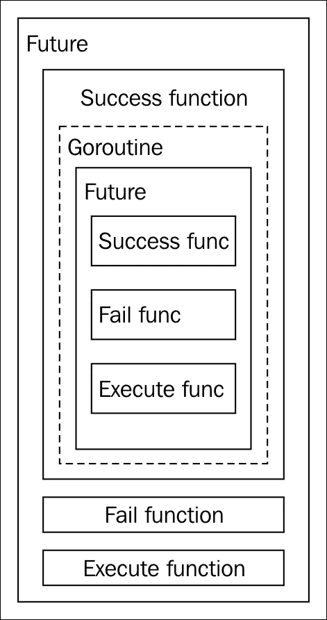
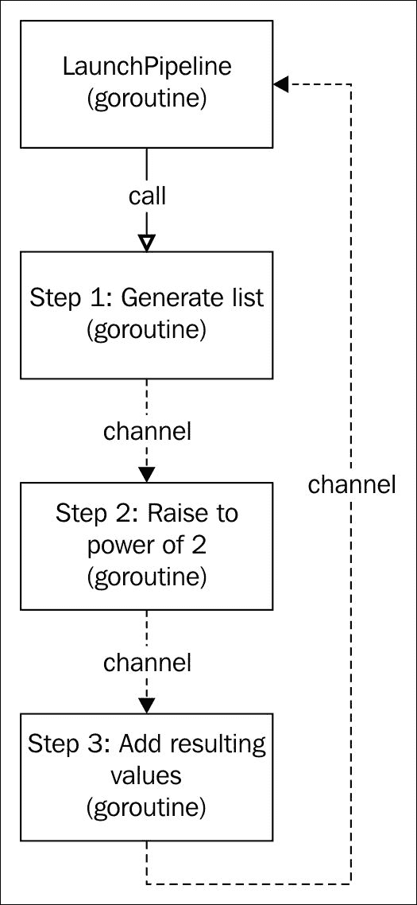
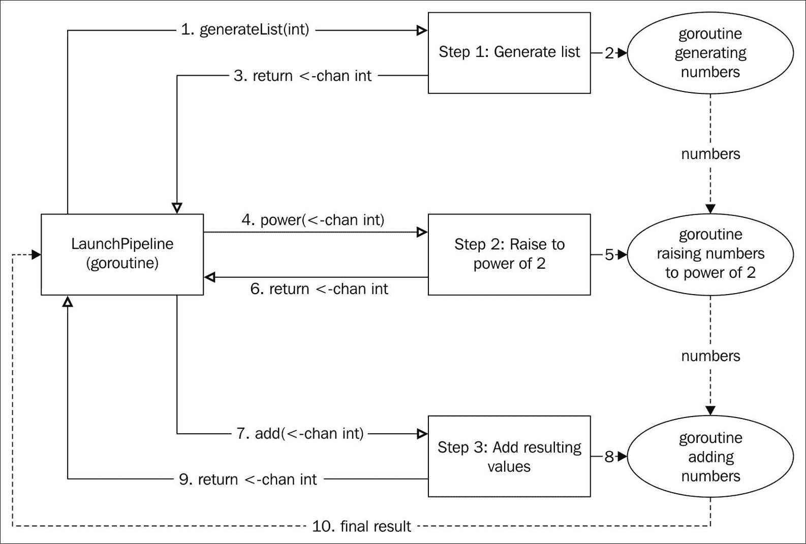

# 第九章. 并发模式 - 障碍、未来和管道设计模式

现在我们已经熟悉了并发和并行性的概念，并且我们已经理解了如何通过使用 Go 的并发原语来实现它们，我们可以看到一些关于并发工作和并行执行的模式。在本章中，我们将看到以下模式：

+   障碍是一个非常常见的模式，尤其是在我们需要等待多个 Goroutine 的响应后才能让程序继续之前

+   未来模式允许我们编写一个算法，该算法最终（或不会）由同一个 Goroutine 或不同的 Goroutine 执行

+   管道是一个强大的模式，用于构建复杂的同步 Goroutine 流，这些 Goroutine 根据某种逻辑相互连接

快速浏览一下这三种模式的描述。它们都描述了某种逻辑，用于在时间上同步执行。记住，我们现在正在使用前几章中看到的所有工具和模式来开发并发结构。在使用创建型模式时，我们处理的是对象的创建。在使用结构型模式时，我们学习如何构建惯用的结构，而在行为模式中，我们主要使用算法进行管理。现在，在并发模式中，我们将主要管理具有多个 *流程* 的应用程序的定时执行和顺序执行。

# 障碍并发模式

我们将从障碍模式开始。其目的是简单的——设置一个障碍，直到我们得到所有需要的结果，这在并发应用程序中相当常见。

## 描述

想象一下这种情况，我们有一个微服务应用程序，其中一个服务需要通过合并其他三个微服务的响应来组合其响应。这就是障碍模式可以帮助我们的地方。

我们的障碍模式可能是一个服务，它将阻塞其响应，直到它已经与一个或多个不同的 Goroutine（或服务）返回的结果组合。那么我们有什么具有阻塞性质的原始类型呢？嗯，我们可以使用一个锁，但在 Go 中更惯用使用无缓冲通道。

## 目标

如其名所示，障碍模式试图阻止执行，直到它准备好完成。障碍模式的目标如下：

+   将类型值与来自一个或多个 Goroutine 的数据组合。

+   控制任何传入数据管道的正确性，以确保不会返回不一致的数据。我们不希望得到一个部分填充的结果，因为其中一个管道返回了错误。

## 一个 HTTP GET 聚合器

对于我们的示例，我们将编写一个在微服务应用程序中非常典型的情况——一个执行两个 HTTP `GET`调用并将它们合并成一个单独的响应，该响应将在控制台上打印的应用程序。

我们的小应用程序必须以不同的 Goroutine 执行每个请求，并在控制台上打印结果，如果两个响应都是正确的。如果任何一个返回错误，那么我们只打印错误。

设计必须是并发的，这样我们就可以利用我们的多核 CPU 并行进行调用：



在前面的图中，实线代表调用，虚线代表通道。气球是 Goroutine，所以我们有两个由`main`函数（这也可以被认为是一个 Goroutine）启动的 Goroutine。这两个函数将通过它们在`makeRequest`调用时接收到的**公共通道**与`main`函数通信。

## 验收标准

在这个应用程序中，我们的主要目标是获取两个不同调用的合并响应，因此我们可以这样描述我们的验收标准：

+   在控制台上打印对`http://httpbin.org/headers`和`http://httpbin.org/User-Agent` URL 的两个调用的合并结果。这些是一些公共端点，它们响应来自传入连接的数据。它们在测试目的上非常受欢迎。您需要互联网连接来完成这个练习。

+   如果任何一个调用失败，则不能打印任何结果——只打印错误消息（如果两个调用都失败了，则打印错误消息）。

+   当两个调用都完成时，输出必须打印为一个组合结果。这意味着我们不能先打印一个调用的结果，然后再打印另一个调用的结果。

## 单元测试 - 集成测试

为并发设计编写单元测试或集成测试有时可能很棘手，但这不会阻止我们编写我们出色的单元测试。我们将有一个单独的`barrier`方法，它接受一组定义为`string`类型的端点。屏障将对每个端点进行`GET`请求，并在打印之前组合结果。在这种情况下，我们将编写三个集成测试来简化我们的代码，这样我们就不需要生成模拟响应：

```go
package barrier 

import ( 
    "bytes" 
    "io" 
    "os" 
    "strings" 
    "testing" 
) 

func TestBarrier(t *testing.T) { 
  t.Run("Correct endpoints", func(t *testing.T) { 
    endpoints := []string{"http://httpbin.org/headers",  "http://httpbin.org/User-Agent"
    } 
  }) 

  t.Run("One endpoint incorrect", func(t *testing.T) { 
    endpoints := []string{"http://malformed-url",  "http://httpbin.org/User-Agent"} 
  }) 

  t.Run("Very short timeout", func(t *testing.T) { 
    endpoints := []string{"http://httpbin.org/headers",  "http://httpbin.org/User-Agent"} 
  }) 
} 

```

我们有一个单独的测试，将执行三个子测试：

+   第一次测试是对正确的端点进行两次调用

+   第二次测试将有一个错误的端点，因此它必须返回一个错误

+   最后一次测试将返回最大超时时间，这样我们就可以强制一个超时错误

我们将有一个名为`barrier`的函数，它将接受字符串形式的未确定数量的端点。它的签名可能如下所示：

```go
func barrier(endpoints ...string) {} 

```

如您所见，`barrier`函数不返回任何值，因为它的结果将在控制台上打印。之前，我们已经编写了一个`io.Writer`接口的实现来模拟操作系统`stdout`库的写入。为了改变一下，我们将捕获`stdout`库而不是模拟一个。一旦您理解了 Go 中的并发原语，捕获`stdout`库的过程并不困难：

```go
func captureBarrierOutput(endpoints ...string) string { 
    reader, writer, _ := os.Pipe() 

    os.Stdout = writer 
    out := make(chan string) 

    go func() { 
      var buf bytes.Buffer 
      io.Copy(&buf, reader) 
      out <- buf.String() 
    }() 

    barrier(endpoints...) 

    writer.Close() 
    temp := <-out 

    return temp 
} 

```

不要被这段代码吓倒；它实际上非常简单。首先我们创建了一个管道；我们之前在 第三章 中做过，*结构型模式 - 适配器、桥接和组合设计模式*，当我们讨论适配器设计模式时。为了回忆，管道允许我们将 `io.Writer` 接口连接到 `io.Reader` 接口，以便读者的输入是 `Writer` 的输出。我们将 `os.Stdout` 定义为写入者。然后，为了捕获 `stdout` 输出，我们需要一个不同的 Goroutine，它在我们在控制台写入时监听。正如你所知，如果我们写入，我们不会捕获，如果我们捕获，我们就不会写入。这里的关键字是 `while`；如果你在某个定义中找到这个单词，那么你可能需要一个并发结构。所以我们使用 `go` 关键字启动一个不同的 Goroutine，在将缓冲区的内容通过通道发送之前，将读取器的输入复制到一个字节缓冲区中（我们应该之前创建这个通道）。

在这一点上，我们有一个监听 Goroutine，但我们还没有打印任何内容，所以我们调用提供的（尚未编写的）函数 `barrier`。接下来，我们必须关闭写入者，以向 Goroutine 发送信号，表示不再有输入将发送给它。我们称为 `out` 的通道阻塞执行，直到接收到某个值（由我们启动的 Goroutine 发送的值）。最后一步是返回从控制台捕获的内容。

好的，所以我们有一个名为 `captureBarrierOutput` 的函数，它将捕获 `stdout` 中的输出并将它们作为字符串返回。我们现在可以编写测试了：

```go
t.Run("Correct endpoints", func(t *testing.T) { 
    endpoints := []string{"http://httpbin.org/headers", "http://httpbin.org/User-Agent"
    } 

 result := captureBarrierOutput(endpoints...)
 if !strings.Contains(result, "Accept-Encoding") || strings.Contains (result, "User-Agent") 
  {
 t.Fail()
 }
 t.Log(result) 
}) 

```

所有测试都非常容易实现。总的来说，是 `captureBarrierOutput` 函数调用了 `barrier` 函数。因此，我们传递端点并检查返回的结果。我们指向 [`httpbin.org`](http://httpbin.org) 的组合响应必须在每个端点的响应中包含文本 *Accept-Encoding* 和 *User-Agent*。如果我们找不到这些文本，测试将失败。为了调试目的，我们记录响应，以便我们可以在 go test 的 `-v` 标志下检查它：

```go
t.Run("One endpoint incorrect", func(t *testing.T) { 
  endpoints := []string
  {
    "http://malformed-url", "http://httpbin.org/User-Agent"} 

 result := captureBarrierOutput(endpoints...)
 if !strings.Contains(result, "ERROR") {
 t.Fail()
 }
 t.Log(result) 
}) 

```

这次我们使用了错误的端点 URL，因此响应必须返回一个以单词 *ERROR* 开头的错误，这个错误我们将自己在 `barrier` 函数中编写。

最后一个函数将 HTTP `GET` 客户端的超时时间减少到最小值 1 毫秒，因此我们强制超时：

```go
t.Run("Very short timeout", func(t *testing.T) { 
  endpoints := []string
  {
    "http://httpbin.org/headers", "http://httpbin.org/User-Agent"} 
 timeoutMilliseconds = 1
 result := captureBarrierOutput(endpoints...)
 if !strings.Contains(result, "Timeout") {
 t.Fail()
 }
 t.Log(result) 
  }) 

```

`timeoutMilliseconds` 变量将是一个包变量，我们将在实现过程中稍后定义。

## 实现

我们需要定义一个名为 `timeoutMilliseconds` 的包变量。让我们从这里开始：

```go
package barrier 

import ( 
    "fmt" 
    "io/ioutil" 
    "net/http" 
    "time" 
) 

var timeoutMilliseconds int = 5000 

```

初始超时延迟为 5 秒（5,000 毫秒），我们将在我们的代码中需要这些包。

好的，所以我们需要一个函数来为每个端点 URL 启动一个 Goroutine。你还记得我们是如何在 Goroutines 之间实现通信的吗？没错——通道！因此，我们需要一个通道来处理响应，另一个通道来处理错误。

但我们可以进一步简化它。我们将收到两个正确响应，两个错误，或者一个响应和一个错误；在任何情况下，总是有两个响应，所以我们可以将错误和响应合并到一个合并类型中：

```go
type barrierResp struct { 
    Err  error 
    Resp string 
} 

```

因此，每个 Goroutine 都会发送回一个`barrierResp`类型的值。这个值将包含`Err`字段的值或`Resp`字段的值。

流程很简单：我们创建一个大小为 2 的通道，用于接收`barrierResp`类型的响应，我们启动两个请求并等待两个响应，然后检查是否有任何错误：

```go
func barrier(endpoints ...string) { 
    requestNumber := len(endpoints) 

    in := make(chan barrierResp, requestNumber) 
    defer close(in) 

    responses := make([]barrierResp, requestNumber) 

    for _, endpoint := range endpoints { 
        go makeRequest(in, endpoint) 
    } 

    var hasError bool 
    for i := 0; i < requestNumber; i++ { 
        resp := <-in 
        if resp.Err != nil { 
            fmt.Println("ERROR: ", resp.Err) 
            hasError = true 
        } 
        responses[i] = resp 
    } 

    if !hasError { 
        for _, resp := range responses { 
            fmt.Println(resp.Resp) 
        } 
    } 
} 

```

根据之前的描述，我们创建了一个缓冲通道`in`，使其大小与传入的端点相同，并延迟关闭通道。然后，我们为每个端点和响应通道启动了一个名为`makeRequest`的函数。

现在，我们将循环两次，一次针对每个端点。在循环中，我们阻塞执行，等待从`in`通道的数据。如果我们发现错误，我们将打印带有前缀单词*ERROR*的错误信息，正如我们在测试中预期的那样，并将`hasErrorvar`设置为 true。在两个响应之后，如果我们没有找到任何错误（`hasError== false`），我们将打印每个响应，并将通道关闭。

我们仍然缺少`makeRequest`函数：

```go
func makeRequest(out chan<- barrierResp, url string) { 
    res := barrierResp{} 
    client := http.Client{ 
        Timeout: time.Duration(time.Duration(timeoutMilliseconds) * time.Millisecond), 
    } 

    resp, err := client.Get(url) 
    if err != nil { 
        res.Err = err 
        out <- res 
        return 
    } 

    byt, err := ioutil.ReadAll(resp.Body) 
    if err != nil { 
        res.Err = err 
        out <- res 
        return 
    } 

    res.Resp = string(byt) 
    out <- res 
} 

```

`makeRequest`函数是一个非常直接的函数，它接受一个通道来输出`barrierResp`值，以及一个请求的 URL。我们创建一个`http.Client`，并将其超时字段设置为`timeoutMilliseconds`包变量的值。这就是我们如何改变`in`函数测试的超时延迟。然后，我们简单地发起`GET`调用，获取响应，将其解析为字节切片，并通过`out`通道发送。

我们通过填充一个名为`res`的`barrierResp`类型变量来完成所有这些操作。如果在执行`GET`请求或解析结果体时发现错误，我们将填充`res.Err`字段，将其发送到`out`通道（该通道与原始 Goroutine 的另一侧相连），并退出函数（这样我们就不小心通过`out`通道发送两个值了）。

是时候运行测试了。请记住，你需要一个互联网连接，否则前两个测试将会失败。我们首先尝试有两个正确端点的测试：

```go
go test -run=TestBarrier/Correct_endpoints -v .
=== RUN   TestBarrier
=== RUN   TestBarrier/Correct_endpoints
--- PASS: TestBarrier (0.54s)
 --- PASS: TestBarrier/Correct_endpoints (0.54s)
 barrier_test.go:20: {
 "headers": {
 "Accept-Encoding": "gzip", 
"Host": "httpbin.org",
"User-Agent": "Go-http-client/1.1"
 }
 }
 {
 "User-Agent": "Go-http-client/1.1"
 } 
 ok

```

完美。我们有一个包含`headers`键的 JSON 响应，还有一个包含`User-Agent`键的 JSON 响应。在我们的集成测试中，我们寻找的是存在的字符串`User-Agent`和`Accept-Encoding`，所以测试已经成功通过。

现在，我们将运行一个包含错误端点的测试：

```go
go test -run=TestBarrier/One_endpoint_incorrect -v .
=== RUN   TestBarrier
=== RUN   TestBarrier/One_endpoint_incorrect
--- PASS: TestBarrier (0.27s)
 --- PASS: TestBarrier/One_endpoint_incorrect (0.27s)
 barrier_test.go:31: ERROR:  Get http://malformed-url: dial tcp: lookup malformed-url: no such host
ok

```

我们可以看到，我们遇到了一个错误，`http://malformed-url` 返回了一个 *没有这样的主机* 错误。对这个 URL 的请求必须返回一个以 `ERROR:` 开头的文本，正如我们在验收标准中所述，这就是为什么这个测试是正确的（我们没有出现假阳性）。

### 注意

在测试中，理解“假阳性”和“假阴性”测试的概念非常重要。假阳性测试大致描述为当它不应该通过条件时通过测试（结果：全部通过）而假阴性则正好相反（结果：测试失败）。例如，我们可能在请求时测试是否返回了一个字符串，但返回的字符串可能是完全空的！这将导致假阴性，即使我们在检查故意不正确的行为时（对 `http://malformed-url` 的请求），测试也不会失败。

最后的测试将超时时间减少到 1 毫秒：

```go
go test -run=TestBarrier/Very_short_timeout -v .     
=== RUN   TestBarrier 
=== RUN   TestBarrier/Very_short_timeout 
--- PASS: TestBarrier (0.00s) 
    --- PASS: TestBarrier/Very_short_timeout (0.00s) 
        barrier_test.go:43: ERROR:  Get http://httpbin.org/User-Agent: net/http: request canceled while waiting for connection (Client.Timeout exceeded while awaiting headers) 
        ERROR:  Get http://httpbin.org/headers: net/http: request canceled while waiting for connection (Client.Timeout exceeded while awaiting headers) 

ok

```

再次，测试成功通过，我们得到了两个超时错误。URL 是正确的，但我们没有在不到一毫秒的时间内收到响应，因此客户端返回了一个超时错误。

## 使用障碍设计模式等待响应

障碍模式以其可组合性打开了微服务编程的大门。它可以被认为是一种结构模式，就像你可以想象的那样。

障碍模式不仅对网络请求有用；我们还可以用它将一些任务拆分成多个 Goroutine。例如，一个昂贵的操作可以被拆分成几个较小的操作，分布在不同的 Goroutine 中，以最大化并行性并实现更好的性能。

# Future 设计模式

Future 设计模式（也称为 **Promise**）是实现异步编程并发结构的一种快速简单的方法。我们将利用 Go 中的第一类函数来开发 *Futures*。

## 描述

简而言之，我们将在不同的 Goroutine 中执行之前定义每个动作的可能行为。Node.js 使用这种方法，默认提供事件驱动编程。这里的想法是实现一个 *发射并忘记*，它处理动作中所有可能的结果。

为了更好地理解它，我们可以讨论一个在执行成功或失败的情况下嵌入行为的类型。



在前面的图中，`main` 函数在一个新的 Goroutine 中启动了一个 **Future**。它不会等待任何事情，也不会接收 Future 的任何进度。它实际上只是发射并忘记它。

这里有趣的是，我们可以在一个 Future 中启动一个新的 Future，并在同一个 Goroutine（或新的）中嵌入尽可能多的 Future。想法是利用一个 Future 的结果来启动下一个。例如：



这里，我们有相同的 Future。在这种情况下，如果`Execute`函数返回了正确的结果，则执行`Success`函数，并且只有在这种情况下，我们才会执行一个新的 Goroutine，其中包含另一个 Future（或者甚至没有 Goroutine）。

这是一种懒惰编程，其中 Future 可以无限期地调用自己，或者直到满足某些规则为止。这个想法是在事先定义行为，并让未来解决可能的解决方案。

## 目标

使用 Future 模式，我们可以启动许多新的 Goroutine，每个 Goroutine 都有一个动作和它自己的处理程序。这使得我们能够做到以下事情：

+   将动作处理程序委托给不同的 Goroutine

+   在它们之间堆叠许多异步调用（一个异步调用在其结果中调用另一个异步调用）

## 一个简单的异步请求者

我们将开发一个非常简单的示例，以尝试理解 Future 是如何工作的。在这个例子中，我们将有一个返回字符串或错误的函数，但我们想并发地执行它。我们已经学习了如何做到这一点。使用通道，我们可以启动一个新的 Goroutine，并处理从通道传入的结果。

但在这种情况下，我们必须处理结果（字符串或错误），我们不想这样做。相反，我们将定义在成功的情况下要做什么，在出错的情况下要做什么，并让 Goroutine 执行完毕后不再关注。

## 接受标准

我们对这个任务没有功能需求。相反，我们将有技术需求：

+   将函数执行委托给不同的 Goroutine

+   函数将返回一个字符串（可能）或一个错误

+   处理程序必须在执行函数之前已经定义

+   设计必须是可重用的

## 单元测试

因此，正如我们提到的，我们将使用一等函数来实现这种行为，并且我们需要三种特定的函数类型：

+   `type SuccessFunc func(string)`: 如果一切顺利，`SuccessFunc`函数将被执行。它的字符串参数将是操作的结果，因此这个函数将由我们的 Goroutine 调用。

+   `type FailFunc func(error)`: `FailFunc`函数处理相反的结果，即当出现问题时，并且，正如你所看到的，它将返回一个错误。

+   `type ExecuteStringFunc func() (string, error)`: 最后，`ExecuteStringFunc`函数是一个类型，它定义了我们想要执行的操作。也许它将返回一个字符串或一个错误。不用担心这一切似乎很复杂；稍后会更清楚。

因此，我们创建`future`对象，定义成功行为，定义失败行为，并传递一个要执行的`ExecuteStringFunc`类型。在实现文件中，我们需要一个新的类型：

```go
type MaybeString struct {} 

```

我们还将在`_test.go`文件中创建两个测试：

```go
package future 

import ( 
  "errors" 
  "testing" 
  "sync" 
) 

func TestStringOrError_Execute(t *testing.T) { 
  future := &MaybeString{} 
  t.Run("Success result", func(t *testing.T) { 
    ... 
  }) 
  t.Run("Error result", func(t *testing.T) { 
  ... 
  }) 
} 

```

我们将通过链式调用定义函数，就像你通常在 Node.js 中看到的那样。这样的代码紧凑，并不特别难懂：

```go
t.Run("Success result", func(t *testing.T) { 
 future.Success(func(s string) {
 t.Log(s)
 }).Fail(func(e error) {
 t.Fail()
 })
 future.Execute(func() (string, error) {
 return "Hello World!", nil
 }) 
}) 

```

`future.Success` 函数必须在 `MaybeString` 结构体中定义，以便接受一个 `SuccessFunc` 函数，如果一切顺利，该函数将被执行，并返回相同的 `future` 对象指针（这样我们就可以继续链式调用）。`Fail` 函数也必须在 `MaybeString` 结构体中定义，并且必须接受一个 `FailFunc` 函数，稍后返回指针。在两种情况下，我们都返回指针，这样我们就可以定义 `Fail` 和 `Success` 或反之。

最后，我们使用 `Execute` 方法传递一个 `ExecuteStringFunc` 类型（一个不接受任何参数并返回字符串或错误的函数）。在这种情况下，我们返回一个字符串和 nil，所以我们期望 `SuccessFunc` 函数将被执行，并将结果记录到控制台。如果执行了失败函数，测试失败，因为对于返回的 nil 错误，不应该执行 `FailFunc` 函数。

但我们在这里仍然缺少一些东西。我们说函数必须在不同的 Goroutine 中异步执行，所以我们必须以某种方式同步这个测试，以免它过早完成。再次强调，我们可以使用一个通道或 `sync.WaitGroup`：

```go
t.Run("Success result", func(t *testing.T) { 
 var wg sync.WaitGroup
 wg.Add(1) 
    future.Success(func(s string) { 
      t.Log(s) 

 wg.Done() 
    }).Fail(func(e error) { 
      t.Fail() 

 wg.Done() 
    }) 

    future.Execute(func() (string, error) { 
      return "Hello World!", nil 
    }) 
 wg.Wait() 
  }) 

```

我们在之前的通道中已经见过 WaitGroups。这个 WaitGroup 被配置为等待一个信号（`wg.Add(1)`）。`Success` 和 `Fail` 方法将触发 `WaitGroup` 的 `Done()` 方法，以便允许执行继续并完成测试（这就是为什么 `Wait()` 方法在最后）。记住，每个 `Done()` 方法都会从 WaitGroup 中减去一个，而我们只添加了一个，所以我们的 `Wait()` 方法只会阻塞，直到执行了一个 `Done()` 方法。

利用我们关于创建 `Success` 结果单元测试的知识，很容易通过将 `t.Fail()` 方法调用从错误切换到成功来创建一个失败的单元测试，这样如果执行了成功的调用，测试就会失败：

```go
t.Run("Failed result", func(t *testing.T) { 
 var wg sync.WaitGroup
 wg.Add(1)
 future.Success(func(s string) {
 t.Fail()
 wg.Done()
 }).Fail(func(e error) {
 t.Log(e.Error())
 wg.Done()
 })
 future.Execute(func() (string, error) {
 return "", errors.New("Error ocurred")
 })
 wg.Wait() 
}) 

```

如果你像我一样使用 IDE，你的 `Success`、`Fail` 和 `Execute` 方法调用必须显示为红色。这是因为我们在实现文件中缺少方法的声明：

```go
package future 

type SuccessFunc func(string) 
type FailFunc func(error) 
type ExecuteStringFunc func() (string, error) 

type MaybeString struct { 
  ... 
} 

func (s *MaybeString) Success(f SuccessFunc) *MaybeString { 
  return nil 
} 

func (s *MaybeString) Fail(f FailFunc) *MaybeString { 
  return nil 
} 

func (s *MaybeString) Execute(f ExecuteStringFunc) { 
  ... 
} 

```

我们的测试看起来已经准备好执行了。让我们试一试：

```go
go test -v .
=== RUN   TestStringOrError_Execute
=== RUN   TestStringOrError_Execute/Success_result
fatal error: all goroutines are asleep - deadlock!
goroutine 1 [chan receive]:
testing.(*T).Run(0xc4200780c0, 0x5122e9, 0x19, 0x51d750, 0xc420041d30)
 /usr/lib/go/src/testing/testing.go:647 +0x316
testing.RunTests.func1(0xc4200780c0)
 /usr/lib/go/src/testing/testing.go:793 +0x6d
testing.tRunner(0xc4200780c0, 0xc420041e20)
 /usr/lib/go/src/testing/testing.go:610 +0x81
testing.RunTests(0x51d758, 0x5931e0, 0x1, 0x1, 0x50feb4)
 /usr/lib/go/src/testing/testing.go:799 +0x2f5
testing.(*M).Run(0xc420041ee8, 0xc420014550)
 /usr/lib/go/src/testing/testing.go:743 +0x85
main.main()
 go-design-patterns/future/_test/_testmain.go:54 +0xc6
...continue

```

好吧... 测试失败了，是的... 但不是可控的方式。为什么是这样？我们还没有任何实现，所以既没有 `Success` 也没有 `Fail` 函数被执行。我们的 WaitGroup 无限期地等待一个永远不会到达的 `Done()` 方法调用，所以它无法继续并完成测试。这就是 *所有 Goroutines 都处于休眠状态 - 死锁* 的含义。在我们的具体例子中，这意味着 *没有人会调用 Done()，所以我们处于死锁状态!*。

### 注意

多亏了 Go 编译器和运行时执行器，我们可以轻松地检测死锁。想象一下，如果 Go 运行时无法检测死锁，我们就会在不知道出了什么问题的情况下，有效地卡在一个空白屏幕上。

那我们该如何解决这个问题呢？一个简单的方法是使用超时，在等待一段时间后调用 `Done()` 方法。对于这段代码，等待 1 秒是安全的，因为它没有进行长时间运行的操作。

我们将在我们的`test`文件中声明一个`timeout`函数，该函数等待一秒钟，然后打印一条消息，将测试设置为失败，并通过调用其`Done()`方法让 WaitGroup 继续：

```go
func timeout(t *testing.T, wg *sync.WaitGroup) { 
  time.Sleep(time.Second) 
  t.Log("Timeout!") 

  t.Fail() 
  wg.Done() 
} 

```

每个子测试的最终外观类似于我们之前的`"Success result"`示例：

```go
t.Run("Success result", func(t *testing.T) { 
  var wg sync.WaitGroup 
  wg.Add(1) 

  //Timeout! 
  go timeout(t, wg) 
  // ... 
}) 

```

让我们看看当我们再次执行测试时会发生什么：

```go
go test -v .
=== RUN   TestStringOrError_Execute
=== RUN   TestStringOrError_Execute/Success_result
=== RUN   TestStringOrError_Execute/Failed_result
--- FAIL: TestStringOrError_Execute (2.00s)
 --- FAIL: TestStringOrError_Execute/Success_result (1.00s)
 future_test.go:64: Timeout!
 --- FAIL: TestStringOrError_Execute/Failed_result (1.00s)
 future_test.go:64: Timeout!
FAIL
exit status 1
FAIL

```

我们的测试失败了，但是以受控的方式。看看`FAIL`行末尾——注意经过的时间是 1 秒，因为它已经被超时触发，正如我们在日志消息中看到的那样。

是时候转向实现了。

## 实现

根据我们的测试，实现必须以链式方式在`MaybeString`类型中采取`SuccessFunc`、`FailFunc`和`ExecuteStringFunc`函数，并异步启动`ExecuteStringFunc`函数以根据`ExecuteStringFunc`函数返回的结果调用`SuccessFunc`或`FailFunc`函数。

链式实现是通过在类型中存储函数并返回类型的指针来完成的。我们当然是在谈论我们之前声明的类型方法：

```go
type MaybeString struct { 
  successFunc SuccessFunc 
  failFunc    FailFunc 
} 

func (s *MaybeString) Success(f SuccessFunc) *MaybeString { 
  s.successFunc = f 
  return s 
} 

func (s *MaybeString) Fail(f FailFunc) *MaybeString { 
  s.failFunc = f 
  return s 
} 

```

我们需要两个字段来存储`SuccessFunc`和`FailFunc`函数，分别命名为`successFunc`和`failFunc`字段。这样，对`Success`和`Fail`方法的调用只是将传入的函数存储到我们的新字段中。它们只是返回特定`MaybeString`值的指针的设置器。这些类型方法接受`MaybeString`结构的指针，所以别忘了在`func`声明后在`MaybeString`后加上"`*`"。

执行方法接受`ExecuteStringFunc`方法并异步执行它。这看起来很简单，对吧？

```go
func (s *MaybeString) Execute(f ExecuteStringFunc) { 
  go func(s *MaybeString) { 
    str, err := f() 
    if err != nil { 
      s.failFunc(err) 
    } else { 
      s.successFunc(str) 
    } 
  }(s) 
} 

```

看起来很简单，因为它确实很简单！我们启动执行`f`方法（一个`ExecuteStringFunc`）的 Goroutine，并获取其结果——可能是一个字符串和一个错误。如果存在错误，我们调用`MaybeString`结构中的`failFunc`字段。如果没有错误，我们调用`successFunc`字段。我们使用 Goroutine 来委托函数执行和错误处理，这样我们的 Goroutine 就不必执行它。

让我们现在运行单元测试：

```go
go test -v .
=== RUN   TestStringOrError_Execute
=== RUN   TestStringOrError_Execute/Success_result
=== RUN   TestStringOrError_Execute/Failed_result
--- PASS: TestStringOrError_Execute (0.00s)
 --- PASS: TestStringOrError_Execute/Success_result (0.00s)
 future_test.go:21: Hello World!
 --- PASS: TestStringOrError_Execute/Failed_result (0.00s)
 future_test.go:49: Error ocurred
PASS
ok 

```

太棒了！看看执行时间现在几乎为零，所以我们的超时并没有被执行（实际上，它们被执行了，但测试已经完成，结果已经声明）。

更重要的是，现在我们可以使用我们的`MaybeString`类型异步执行任何不接受任何参数并返回字符串或错误的函数。不接受任何参数的函数似乎有点无用，对吧？但我们可以使用闭包将上下文引入此类函数。

让我们编写一个`setContext`函数，它接受一个字符串作为参数，并返回一个`ExecuteStringFunc`方法，该方法返回带有后缀`Closure!`的前一个参数：

```go
func setContext(msg string) ExecuteStringFunc { 
  msg = fmt.Sprintf("%d Closure!\n", msg) 

  return func() (string, error){ 
    return msg, nil 
  } 
} 

```

因此，我们可以编写一个新的测试，使用这个闭包：

```go
t.Run("Closure Success result", func(t *testing.T) { 
    var wg sync.WaitGroup 
    wg.Add(1) 
    //Timeout! 
    go timeout(t, &wg) 

    future.Success(func(s string) { 
      t.Log(s) 
      wg.Done() 
    }).Fail(func(e error) { 
      t.Fail() 
      wg.Done() 
    }) 
    future.Execute(setContext("Hello")) 
    wg.Wait() 
  }) 

```

`setContext`函数返回一个可以直接传递给`Execute`函数的`ExecuteStringFunc`方法。我们使用一个任意文本调用`setContext`函数，我们知道这个文本将会被返回。

让我们再次执行我们的测试。现在一切都要顺利！

```go
go test -v .
=== RUN   TestStringOrError_Execute
=== RUN   TestStringOrError_Execute/Success_result
=== RUN   TestStringOrError_Execute/Failed_result
=== RUN   TestStringOrError_Execute/Closure_Success_result
--- PASS: TestStringOrError_Execute (0.00s)
 --- PASS: TestStringOrError_Execute/Success_result (0.00s)
 future_test.go:21: Hello World!
 --- PASS: TestStringOrError_Execute/Failed_result (0.00s)
 future_test.go:49: Error ocurred
 --- PASS: TestStringOrError_Execute/Closure_Success_result (0.00s)
 future_test.go:69: Hello Closure!
PASS
ok

```

它也给了我们一个 OK。闭包测试显示了我们在之前解释过的行为。通过取一个消息`"Hello"`并将其与另一个消息（`"Closure!"`）连接起来，我们可以改变我们想要返回的文本的上下文。现在将其扩展到 HTTP `GET`调用、数据库调用或任何你能想象的事情。它只需要通过返回一个字符串或错误来结束。记住，然而，在`setContext`函数内部但不在我们返回的匿名函数之外的所有内容都不是并发的，它们将在调用 execute 之前异步执行，所以我们必须尽量在匿名函数内放置尽可能多的逻辑。

## 将 Future 组合起来

我们已经看到通过使用函数类型系统来实现异步编程的一个好方法。然而，我们也可以通过设置一个包含`Success`、`Fail`和`Execute`方法及其满足的类型，并使用模板模式来异步执行它们，就像我们在本章之前所看到的那样，而不使用函数来完成它。这取决于你！

# 流水线设计模式

本章我们将看到的第三个也是最后一个模式是流水线模式。你将在你的并发结构中大量使用这个模式，我们可以将其视为最有用的模式之一。

## 描述

我们已经知道什么是流水线。每次我们编写执行某些逻辑的任何函数时，我们都在编写一个流水线：如果*这个*，那么*那个*，否则*其他什么*。通过使用几个相互调用的函数，流水线模式可以变得更加复杂。它们甚至可以在它们的输出执行中形成循环。

Go 中的流水线模式以类似的方式工作，但流水线中的每个步骤都将位于不同的 Goroutine 中，并且将通过通道进行通信和同步。

## 目标

在创建流水线时，我们主要寻找以下好处：

+   我们可以创建一个多步算法的并发结构

+   我们可以通过将算法分解为不同的 Goroutines 来利用多核机器的并行性

然而，仅仅因为我们将算法分解为不同的 Goroutines 并不意味着它就会执行得最快。我们一直在谈论 CPU，所以理想情况下，算法必须是 CPU 密集型的，以便利用并发结构。创建 Goroutines 和通道的开销可能会使算法变得更小。

## 并发多操作

我们将为我们的示例做一些数学运算。我们将生成一个从 1 开始到某个任意数字 N 结束的数字列表。然后我们将每个数字平方，并将结果数字加到一个唯一的结果中。所以，如果*N=3*，我们的列表将是[1,2,3]。在将它们平方后，我们的列表变为[1,4,9]。如果我们将这些结果相加，结果值是 14。

## 接受标准

从功能上讲，我们的 Pipeline 模式需要将每个数字平方，然后对所有数字求和。它将被分为一个数字生成器和两个操作，所以：

1.  从 1 生成一个到 N 的列表，其中 N 可以是任何整数。

1.  将生成的列表中的每个数字平方。

1.  将每个结果数字加到最终结果中并返回它。

## 从测试开始

我们将创建一个只管理一切的功能。我们将称这个函数为`LaunchPipeline`以简化事情。它将接受一个整数作为参数，这将是我们列表中的 N 数字，即项目数量。在实现文件中的声明如下所示：

```go
package pipelines 

func LaunchPipeline(amount int) int { 
  return 0 
} 

```

在我们的测试文件中，我们将使用切片的切片创建一个测试表：

```go
package pipelines 

import "testing" 

func TestLaunchPipeline(t *testing.T) { 
  tableTest := [][]int{ 
    {3, 14}, 
    {5, 55}, 
  } 
  // ... 
} 

```

我们的数据表是整数类型的切片的切片。在每一片中，第一个整数代表列表大小，第二个位置代表列表中的项目。实际上，它是一个矩阵。当传递 3 时，必须返回 14。当传递 5 时，必须返回 55。然后我们必须遍历这个表，并将每个数组的第一个索引传递给`LaunchPipeline`函数：

```go
  // ... 

  var res int 
  for _, test := range tableTest { 
    res = LaunchPipeline(test[0]) 
    if res != test[1] { 
      t.Fatal() 
    } 

    t.Logf("%d == %d\n", res, test[1]) 
  } 
} 

```

使用`range`，我们得到矩阵中的每一行。每一行都包含在一个临时变量`test`中。`test[0]`代表`N`，`test[1]`代表期望的结果。我们比较期望的结果与`LaunchPipeline`函数返回的值。如果它们不相同，测试失败：

```go
go test -v .
=== RUN   TestLaunchPipeline
--- FAIL: TestLaunchPipeline (0.00s)
 pipeline_test.go:15: 
FAIL
exit status 1
FAIL

```

## 实现

我们实现的关键是将每个操作分离到不同的 Goroutine 中，并通过通道将它们连接起来。`LaunchPipeline`函数是负责协调所有操作的函数，如下面的图所示：



操作包括三个步骤：生成一个数字列表，将它们平方，然后加和结果数字。

这个 Pipeline 模式中的每个步骤都将具有以下结构：

```go
func functionName(in <-chan int) (<-chan int){ 
  out := make(chan bool, 100) 

  go func(){ 
    for v := range in { 
      // Do something with v and send it to channel out 
} 

close(out) 
   }() 

  return out 
} 

```

这个函数代表一个常见的步骤。让我们按照 Go 调度器可能执行的顺序来分析它：

1.  `functionName`函数通常接收一个通道来获取值（`in <-chan int`）。我们称它为`in`函数，正如单词 incoming。在这个函数的作用域内，我们不能通过它发送值；这就是为什么箭头指向关键字`chan`的外面。

1.  `functionName` 函数返回一个通道 (`<-chan in`)，函数调用者只能从中取值（再次，由指向关键字 `chan` 的箭头表示）。这也意味着通过该通道传递的任何值都必须在函数的作用域内生成。

1.  在函数的第一行，我们创建了一个名为 `out` 的通道，它将是函数的返回值（在这个列表中的*第 2 点*）。

1.  然后，我们将启动一个新的 Goroutine。它的作用域将在返回此函数后进入，所以让我们继续。

1.  我们返回之前创建的 `out` 通道。

1.  最终，在执行函数并返回通道 `out` 之后，Goroutine 执行。它将从 `in` 通道中取值，直到它被关闭。所以，这个函数的调用者负责关闭这个通道，否则 Goroutine 将永远不会结束！

1.  当 `in` 通道关闭时，for 循环结束，我们关闭 `out` 通道。任何使用此通道的 Goroutine 都不会收到最后发送的任何新值。

唯一不完全符合这种方法的步骤是第一个步骤，它接收一个数字，代表列表的上限阈值，而不是一个输入值的通道。因此，如果我们为我们的管道中的每个步骤编码这个操作，最终的图示看起来更像这样：



虽然想法完全相同，但现在我们可以看到，接收通道并发送它们到管道中的下一个步骤的是 `LaunchPipeline` 函数。使用这个图，我们可以清楚地通过跟随箭头的数字来看到管道创建的流程。实线箭头代表函数调用，虚线箭头代表通道。

让我们更仔细地看看代码。

### 列表生成器

操作的第一步是列表生成。列表从 `1` 开始，我们将接收一个表示更高阈值的整数。我们必须将列表中的每个数字传递到下一个步骤：

```go
func generator(max int) <-chan int { 
  outChInt := make(chan int, 100) 

  go func() { 
    for i := 1; i <= max; i++ { 
      outChInt <- i 
    } 

    close(outChInt) 
  }() 
  return outChInt 
} 

```

如我们之前提到的，这是我们将在每个步骤中遵循的模式：创建一个通道，启动将数据通过通道发送的 Goroutine，并立即返回通道。这个 Goroutine 将从 `1` 迭代到最大参数，即我们列表的最高阈值，并将每个数字通过通道发送。发送完每个数字后，通道被关闭，因此无法再通过它发送更多数据，但已缓冲的数据可以被检索。

### 将数字提升到平方

第二步将接收来自第一步通道（即从参数中获取）的每个输入数字，并将其提升到平方。每个结果都必须通过一个新的通道发送到第三步：

```go
func power(in <-chan int) <-chan int { 
  out := make(chan int, 100) 

  go func() { 
    for v := range in { 
      out <- v * v 
    } 
    close(out) 
  }() 
  return out 
} 

```

我们再次使用相同的模式：创建一个通道，并在返回创建的通道的同时启动 Goroutine。

### 注意

`for-range` 循环会无限期地从通道中取值，直到通道关闭。

### 最终的归约操作

第三步和最后一步接收第二步中的每一个数字，并将它们持续添加到一个局部值中，直到连接通道关闭：

```go
func sum(in <-chan int) <-chan int { 
  out := make(chan int, 100) 
  go func() { 
    var sum int 

    for v := range in { 
      sum += v 
    } 

    out <- sum 
    close(out) 
  }()

  return out 
} 

```

函数 `sum` 也接受一个通道作为参数（来自 *步骤 2* 返回的通道）。它也遵循相同的模式创建通道、启动 Goroutine 并返回一个通道。Goroutine 会持续向名为 `sum` 的变量添加值，直到 `in` 通道关闭。当 `in` 通道关闭时，`sum` 的值会被发送到 `out` 通道，并且它立即关闭。

### 启动管道模式

最后，我们可以实现 `LaunchPipeline` 函数：

```go
func LaunchPipeline(amount int) int { 
  firstCh := generator(amount) 
  secondCh := power(firstCh) 
  thirdCh := sum(secondCh) 

  result := <-thirdCh 

  return result 
} 

```

函数 `generator` 首先返回传递给 `power` 函数的通道。`power` 函数返回传递给 `sum` 函数的第二个通道。`sum` 函数最终返回将接收唯一值（结果）的第一个通道。现在让我们尝试测试一下：

```go
go test -v .
=== RUN   TestLaunchPipeline
--- PASS: TestLaunchPipeline (0.00s)
 pipeline_test.go:18: 14 == 14
 pipeline_test.go:18: 55 == 55
PASS
ok

```

太棒了！值得提一下，`LaunchPipeline` 函数不需要为每个通道分配资源，它可以重写如下：

```go
func LaunchPipeline(amount int) int { 
  return <-sum(power(generator(amount))) 
} 

```

`generator` 函数的结果直接传递给 `power` 函数，而 `power` 函数的结果传递给 `sum` 函数。

## 关于管道模式的最后几句话

使用管道模式，我们可以非常容易地创建复杂的并发工作流程。在我们的例子中，我们创建了一个线性工作流程，但它也可以有条件语句、池以及输入和输出行为。我们将在下一章中看到一些这些内容。

# 概述

并发设计模式在难度上是一个进步，需要一些时间来掌握。作为并发程序员，我们最大的错误是按照并行性（我如何使其并行？或者我如何在一个新线程中运行它？）而不是按照并发结构来思考。

纯函数（给定相同的输入始终产生相同输出（不对其作用域之外的事物产生影响）的函数）有助于这种设计。

并发编程需要练习，而且需要更多的练习。一旦你理解了基本原语，Go 就会变得简单。图表可以帮助你理解数据可能的流动，但理解所有这些的最佳方式仅仅是练习。

在接下来的章节中，我们将看到如何使用一组管道工作线程来完成一些工作，而不是使用一个唯一的管道。我们还将学习如何在并发结构中创建发布/订阅模式，并看到当我们使用并发构建时，相同的模式会有多么不同。
