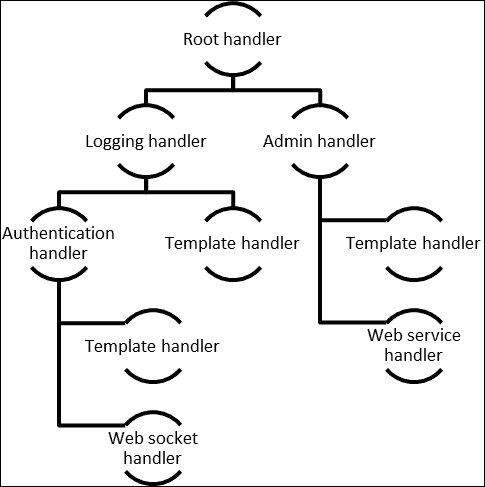
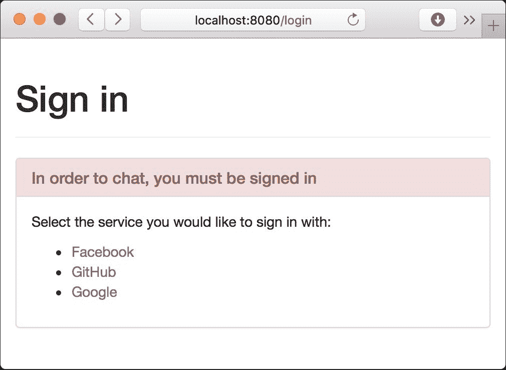
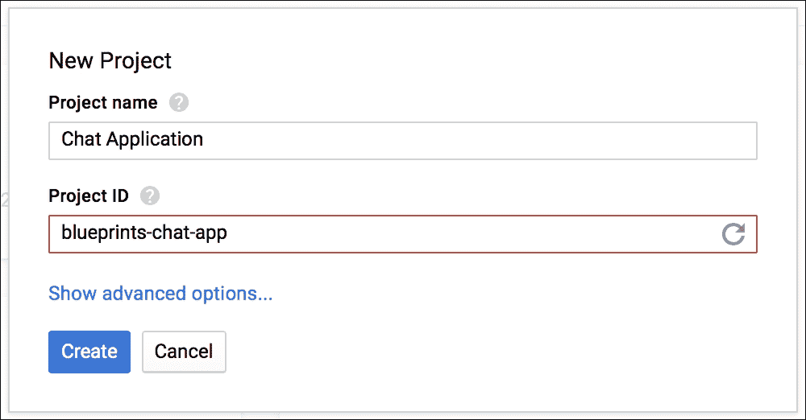
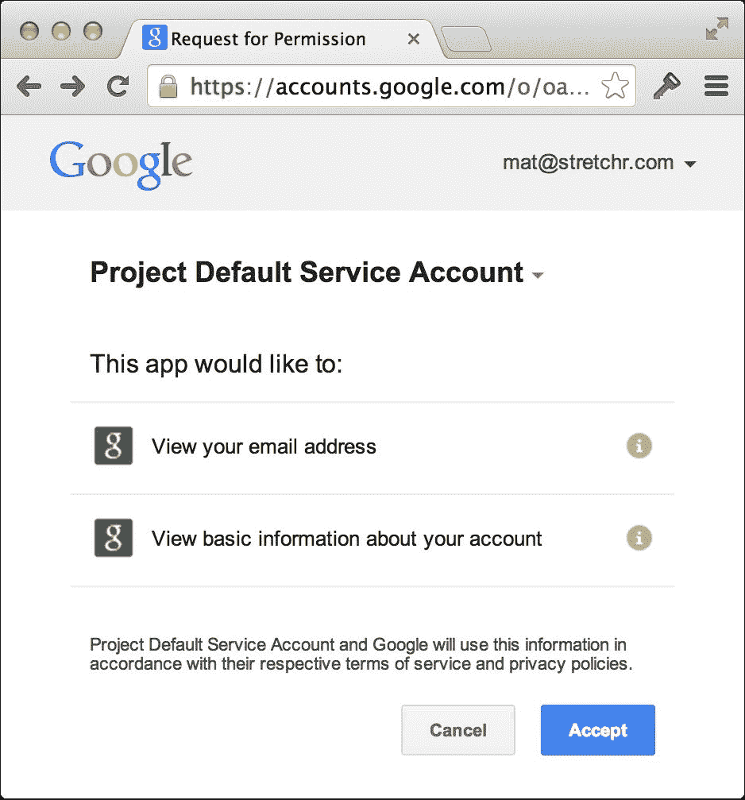
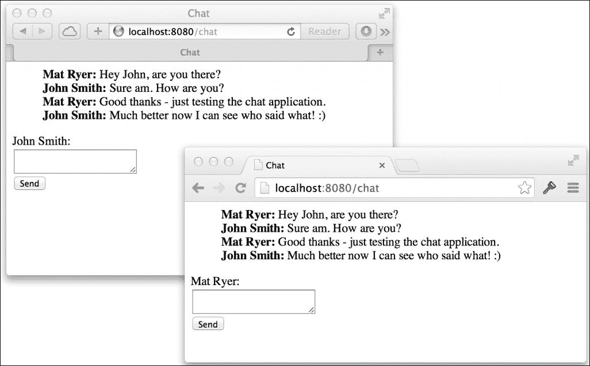

# 第二章：添加用户账户

在上一章中，我们构建的聊天应用专注于从客户端到服务器以及从服务器返回的高性能消息传输。然而，目前的情况是，我们的用户不知道他们将和谁交谈。解决这个问题的方法之一是构建某种注册和登录功能，并让我们的用户在打开聊天页面之前创建账户并验证身份。

每当我们准备从头开始构建某样东西时，我们必须问自己，别人之前是如何解决这个问题（真正原创的问题极其罕见）的，以及是否已经存在我们可以利用的开放解决方案或标准。授权和认证几乎不能被认为是新问题，尤其是在网络世界中，有许多不同的协议可供选择。那么我们如何决定最佳选择呢？一如既往，我们必须从用户的角度来看待这个问题。

现在，许多网站都允许你使用存在于各种社交媒体或社区网站上的账户进行登录。这节省了用户在决定尝试不同的产品和服务时，反复输入所有账户信息的繁琐工作。这对新网站的转化率也有积极的影响。

在本章中，我们将增强我们的聊天代码库以添加授权功能，这将允许我们的用户使用 Google、Facebook 或 GitHub 进行登录，你将看到添加其他登录端口是多么简单。为了加入聊天，用户必须首先登录。在此之后，我们将使用授权数据来增强用户体验，以便每个人都知道房间里是谁，谁说了什么。

在本章中，你将学习到：

+   使用装饰器模式将`http.Handler`类型包装起来，以便为处理器添加额外的功能

+   使用动态路径提供 HTTP 端点

+   使用`gomniauth`开源项目访问认证服务

+   使用`http`包获取和设置 cookie

+   将对象编码为 Base64，然后再将其转换回正常格式

+   通过 Websocket 发送和接收 JSON 数据

+   向模板提供不同类型的数据

+   使用你自己的类型通道

# 处理到底

对于我们的聊天应用，我们实现了自己的`http.Handler`类型（房间），以便轻松编译、执行并将 HTML 内容传递给浏览器。由于这是一个非常简单但功能强大的接口，我们在添加 HTTP 处理功能时将尽可能继续使用它。

为了确定用户是否有权继续操作，我们将创建一个授权包装处理器，该处理器将执行检查，并且只有当用户被授权时，才会将执行传递给内部处理器。

我们的外部处理器将满足与内部对象相同的`http.Handler`接口，允许我们包装任何有效的处理器。实际上，我们即将编写的认证处理器也可以在需要时封装在类似的包装器中。



应用到 HTTP 处理器的链式模式

上述图示显示了如何在更复杂的 HTTP 处理器场景中应用此模式。每个对象都实现了`http.Handler`接口。这意味着一个对象可以被传递给`http.Handle`方法以直接处理请求，或者它可以被提供给另一个对象，该对象可以添加某种额外功能。`Logging`处理器可能在调用内部处理器的`ServeHTTP`方法前后写入日志文件。因为内部处理器只是另一个`http.Handler`，任何其他处理器都可以被`Logging`处理器包装（或装饰）。

通常，一个对象会包含决定哪个内部处理器应该被执行的逻辑。例如，我们的认证处理器将传递执行给包装的处理器，或者通过向浏览器发出重定向来处理请求本身。

现在已经有了足够的理论；让我们编写一些代码。在`chat`文件夹中创建一个名为`auth.go`的新文件：

```go
package main 
import ("net/http") 
type authHandler struct { 
  next http.Handler 
} 
func (h *authHandler) ServeHTTP(w http.ResponseWriter, r  *http.Request) { 
  _, err := r.Cookie("auth") 
  if err == http.ErrNoCookie { 
    // not authenticated 
    w.Header().Set("Location", "/login") 
    w.WriteHeader(http.StatusTemporaryRedirect) 
    return 
  }  
  if err != nil { 
    // some other error 
   http.Error(w, err.Error(), http.StatusInternalServerError) 
   return 
  }  
  // success - call the next handler 
  h.next.ServeHTTP(w, r) 
} 
func MustAuth(handler http.Handler) http.Handler { 
  return &authHandler{next: handler} 
} 

```

`authHandler`类型不仅实现了`ServeHTTP`方法（满足`http.Handler`接口），还在`next`字段中存储（包装）`http.Handler`。我们的`MustAuth`辅助函数简单地创建一个包装任何其他`http.Handler`的`authHandler`。这就是允许我们在`main.go`中轻松添加授权的模式的例子。

让我们调整以下根映射行：

```go
http.Handle("/", &templateHandler{filename: "chat.html"}) 

```

让我们更改第一个参数，使其明确表示用于聊天的页面。接下来，让我们使用`MustAuth`函数将`templateHandler`包装为第二个参数：

```go
http.Handle("/chat", MustAuth(&templateHandler{filename:  "chat.html"})) 

```

使用`MustAuth`函数包装`templateHandler`会导致执行首先通过`authHandler`；如果请求已认证，它将只运行到`templateHandler`。

`authHandler`中的`ServeHTTP`方法会寻找一个名为`auth`的特殊 cookie，如果 cookie 缺失，它将使用`http.ResponseWriter`上的`Header`和`WriteHeader`方法将用户重定向到登录页面。请注意，我们使用下划线字符丢弃 cookie 本身，只捕获返回的错误；这是因为在这个阶段我们只关心 cookie 是否存在。

构建并运行聊天应用程序，尝试访问`http://localhost:8080/chat`：

```go
go build -o chat
./chat -host=":8080"

```

### 小贴士

您需要删除您的 cookies 以清除之前的认证令牌或任何可能遗留在通过 localhost 提供其他开发项目的其他 cookies。

如果您查看浏览器地址栏，您会注意到您立即被重定向到`/login`页面。由于我们目前无法处理该路径，您将只会得到**404 页面未找到**错误。

# 制作一个漂亮的社交登录页面

到目前为止，我们并没有太多关注使我们的应用程序看起来很漂亮；毕竟，这本书是关于 Go 语言，而不是用户界面开发。然而，没有理由去构建丑陋的应用程序，因此我们将构建一个既美观又实用的社交登录页面。

Bootstrap 是一个用于在网络上开发响应式项目的前端框架。它提供了 CSS 和 JavaScript 代码，以一致且美观的方式解决许多用户界面问题。虽然使用 Bootstrap 构建网站往往看起来很相似（尽管有众多方法可以自定义 UI），但它对于应用程序的早期版本或没有设计师的开发商来说是一个很好的选择。

### 小贴士

如果你使用 Bootstrap 提出的语义标准构建你的应用程序，那么为你的网站或应用程序创建一个 Bootstrap 主题将变得容易，而且你知道它将完美地嵌入到你的代码中。

我们将使用托管在 CDN 上的 Bootstrap 版本，这样我们就不必担心通过我们的聊天应用程序下载和提供自己的版本。这意味着为了正确渲染我们的页面，即使在开发过程中，我们也需要一个活跃的互联网连接。

如果你更喜欢下载并托管你自己的 Bootstrap 版本，你可以这样做。将文件保存在一个 `assets` 文件夹中，并在你的 `main` 函数中添加以下调用（它使用 `http.Handle` 通过你的应用程序提供资源）：

```go
http.Handle("/assets/", http.StripPrefix("/assets",    http.FileServer(http.Dir("/path/to/assets/"))))

```

### 注意

注意 `http.StripPrefix` 和 `http.FileServer` 函数返回的对象满足我们通过 `MustAuth` 辅助函数实现的装饰器模式中的 `http.Handler` 接口。

在 `main.go` 中，让我们为登录页面添加一个端点：

```go
http.Handle("/chat", MustAuth(&templateHandler{filename:  "chat.html"})) 
http.Handle("/login", &templateHandler{filename: "login.html"}) 
http.Handle("/room", r) 

```

显然，我们不希望在我们的登录页面中使用 `MustAuth` 方法，因为它将导致无限重定向循环。

在我们的 `templates` 文件夹内创建一个名为 `login.html` 的新文件，并插入以下 HTML 代码：

```go
<html> 
  <head> 
    <title>Login</title> 
    <link rel="stylesheet" href="https://maxcdn.bootstrapcdn.com
     /bootstrap/3.3.6/css/bootstrap.min.css"> 
  </head> 
  <body> 
    <div class="container"> 
      <div class="page-header"> 
        <h1>Sign in</h1> 
      </div> 
      <div class="panel panel-danger"> 
        <div class="panel-heading"> 
          <h3 class="panel-title">In order to chat, you must be signed
          in</h3> 
        </div> 
        <div class="panel-body"> 
          <p>Select the service you would like to sign in with:</p> 
          <ul> 
            <li> 
              <a href="/auth/login/facebook">Facebook</a> 
            </li> 
            <li> 
              <a href="/auth/login/github">GitHub</a> 
            </li> 
            <li> 
              <a href="/auth/login/google">Google</a> 
            </li> 
          </ul> 
        </div> 
      </div> 
    </div> 
  </body> 
</html> 

```

重新启动网络服务器并导航到 `http://localhost:8080/login`。你会注意到现在它显示了我们的 **登录** 页面：



# 动态路径的端点

Go 标准库中 `http` 包的匹配模式并不是最全面和功能最丰富的实现。例如，Ruby on Rails 使得在路径中拥有动态段变得容易得多。你可以像这样映射路由：

```go
"auth/:action/:provider_name" 

```

Rails 然后提供了一个数据映射（或字典），其中包含它从匹配的路径中自动提取的值。所以如果你访问 `auth/login/google`，那么 `params[:provider_name]` 将等于 `google`，而 `params[:action]` 将等于 `login`。

`http` 包默认允许我们指定的最多是路径前缀，我们可以通过在模式末尾留下一个尾随斜杠来利用它：

```go
"auth/" 

```

然后，我们必须手动解析剩余的段以提取适当的数据。这对于相对简单的情况是可以接受的。由于我们目前只需要处理几个不同的路径，例如以下路径，这符合我们的需求：

+   `/auth/login/google`

+   `/auth/login/facebook`

+   `/auth/callback/google`

+   `/auth/callback/facebook`

### 小贴士

如果您需要处理更高级的路由情况，您可能需要考虑使用专用包，例如`goweb`、`pat`、`routes`或`mux`。对于像我们这样极其简单的情况，内置功能就足够了。

我们将创建一个新的处理器来驱动我们的登录过程。在`auth.go`中添加以下`loginHandler`代码：

```go
// loginHandler handles the third-party login process. 
// format: /auth/{action}/{provider} 
func loginHandler(w http.ResponseWriter, r *http.Request) { 
  segs := strings.Split(r.URL.Path, "/") 
  action := segs[2] 
  provider := segs[3] 
  switch action { 
  case "login": 
    log.Println("TODO handle login for", provider) 
      default: 
        w.WriteHeader(http.StatusNotFound) 
        fmt.Fprintf(w, "Auth action %s not supported", action) 
  } 
} 

```

在前面的代码中，我们在提取`action`和`provider`的值之前，使用`strings.Split`将路径分解成段。如果已知动作值，我们将运行特定的代码；否则，我们将输出错误信息并返回一个`http.StatusNotFound`状态码（在 HTTP 状态码的术语中是`404`）。

### 注意

我们现在不会使代码无懈可击。但值得注意的是，如果有人用少量段击中`loginHandler`，我们的代码会崩溃，因为它会期望`segs[2]`和`segs[3]`存在。

作为额外加分项，看看您是否能保护您的代码免受此影响，并在有人击中`/auth/nonsense`时返回一个友好的错误消息而不是让它崩溃。

我们的`loginHandler`只是一个函数，而不是实现`http.Handler`接口的对象。这是因为，与其他处理器不同，我们不需要它存储任何状态。Go 标准库支持这一点，因此我们可以使用`http.HandleFunc`函数以类似于我们之前使用`http.Handle`的方式将其映射。在`main.go`中更新处理器：

```go
http.Handle("/chat", MustAuth(&templateHandler{filename:  "chat.html"})) 
http.Handle("/login", &templateHandler{filename: "login.html"}) 
http.HandleFunc("/auth/", loginHandler) 
http.Handle("/room", r) 

```

重新构建并运行聊天应用：

```go
go build -o chat
./chat -host=":8080"

```

访问以下 URL 并注意终端中记录的输出：

+   `http://localhost:8080/auth/login/google`输出`TODO handle login for google`

+   `http://localhost:8080/auth/login/facebook`输出`TODO handle login for facebook`

我们已经成功实现了一个动态路径匹配机制，到目前为止只是打印出`TODO`消息；我们需要将其与授权服务集成，以便使我们的登录过程生效。

# 开始使用 OAuth2

OAuth2 是一个开放授权标准，旨在允许资源所有者通过访问令牌交换握手，允许客户端代表访问私有数据（如墙贴或推文）。即使您不想访问私有数据，OAuth2 也是一个很好的选择，允许人们使用现有的凭据登录，而不必将这些凭据暴露给第三方网站。在这种情况下，我们是第三方，我们希望允许我们的用户使用支持 OAuth2 的服务登录。

从用户的角度来看，OAuth2 流程如下：

1.  用户选择他们希望登录到客户端应用的提供商。

1.  用户将被重定向到提供者的网站（包含客户端应用 ID 的 URL），在那里他们被要求允许客户端应用。

1.  用户从 OAuth2 服务提供者登录并接受第三方应用请求的权限。

1.  用户将被重定向到客户端应用，并带有请求代码。

1.  在后台，客户端应用将授权代码发送给提供者，提供者发送回一个身份验证令牌。

1.  客户端应用使用访问令牌向提供者发送授权请求，例如获取用户信息或墙帖子。

为了避免重复造轮子，我们将查看一些已经为我们解决这个问题的一些开源项目。

## 开源 OAuth2 包

安德鲁·杰拉德自 2010 年 2 月以来一直在核心 Go 团队工作，即在 Go 1.0 正式发布前两年。他的 `goauth2` 包（见 [`github.com/golang/oauth2`](https://github.com/golang/oauth2)）是 OAuth2 协议的一个优雅实现，完全用 Go 编写。

安德鲁的项目启发了 `gomniauth`（见 [`github.com/stretchr/gomniauth`](https://github.com/stretchr/gomniauth)）。作为 Ruby 的 `omniauth` 项目的开源 Go 替代方案，`gomniauth` 提供了一个统一的解决方案来访问不同的 OAuth2 服务。在未来，当 OAuth3（或下一代授权协议）出现时，理论上 `gomniauth` 可以承担实现细节的痛苦，而用户代码保持不变。

对于我们的应用，我们将使用 `gomniauth` 来访问 Google、Facebook 和 GitHub 提供的 OAuth 服务，因此请确保您已通过运行以下命令安装它：

```go
go get github.com/stretchr/gomniauth

```

### 小贴士

`gomniauth` 的一些项目依赖项保存在 Bazaar 存储库中，因此您需要前往 [`wiki.bazaar.canonical.com`](http://wiki.bazaar.canonical.com) 下载它们。

# 告知授权提供者您的应用信息

在我们请求授权提供者帮助我们的用户登录之前，我们必须告诉他们关于我们的应用信息。大多数提供者都有某种类型的网络工具或控制台，您可以在其中创建应用以启动此过程。以下是一个来自 Google 的示例：



为了识别客户端应用，我们需要创建一个客户端 ID 和密钥。尽管 OAuth2 是一个开放标准，但每个提供者都有自己的语言和机制来设置这些内容。因此，您很可能会不得不在每个案例中与用户界面或文档进行交互来找出解决方案。

在撰写本文时，在 **Google Cloud Console** 中，您需要导航到 **API Manager** 并点击 **Credentials** 部分。

在大多数情况下，为了增加安全性，你必须明确指定请求将来自哪个主机 URL。目前，由于我们正在本地托管我们的应用在`localhost:8080`，你应该使用它。你还将被要求提供一个重定向 URI，这是我们聊天应用中的端点，用户在成功登录后将被重定向到该端点。回调将是`loginHandler`中的另一个操作，因此 Google 客户端的重定向 URL 将是`http://localhost:8080/auth/callback/google`。

一旦你完成了你想要支持的提供者的授权过程，你将为每个提供者获得一个客户端 ID 和密钥。请记住这些详细信息，因为在我们设置聊天应用中的提供者时我们需要它们。

### 注意

如果我们将我们的应用程序托管在真实域名上，我们必须创建新的客户端 ID 和密钥，或者更新我们的授权提供者上的适当 URL 字段，以确保它们指向正确的位置。无论如何，为了安全起见，拥有不同的一套开发和生产密钥是良好的实践。

# 实现外部日志记录

```go
main.go (just underneath the flag.Parse() line toward the top of the main function):
```

```go
// setup gomniauth 
gomniauth.SetSecurityKey("PUT YOUR AUTH KEY HERE") 
gomniauth.WithProviders( 
  facebook.New("key", "secret", 
    "http://localhost:8080/auth/callback/facebook"), 
  github.New("key", "secret", 
    "http://localhost:8080/auth/callback/github"), 
  google.New("key", "secret", 
    "http://localhost:8080/auth/callback/google"), 
) 

```

你应该用你之前记录的实际值替换`key`和`secret`占位符。第三个参数代表回调 URL，它应该与你在提供者网站上创建客户端时提供的 URL 相匹配。注意第二个路径段是`callback`；虽然我们还没有实现它，但这是我们处理授权过程响应的地方。

如同往常，你需要确保所有适当的包都已导入：

```go
import ( 
  "github.com/stretchr/gomniauth/providers/facebook" 
  "github.com/stretchr/gomniauth/providers/github" 
  "github.com/stretchr/gomniauth/providers/google" 
) 

```

### 注意

Gomniauth 需要`SetSecurityKey`调用，因为它在客户端和服务器之间发送带有签名校验和的状态数据，这确保了状态值在传输过程中没有被篡改。安全密钥在创建哈希时使用，使得不知道确切的安全密钥几乎不可能重新创建相同的哈希。你应该用你选择的密钥或短语替换`some long key`。

## 登录

现在我们已经配置了 Gomniauth，当用户到达我们的`/auth/login/{provider}`路径时，我们需要将用户重定向到提供者的授权页面。我们只需更新`auth.go`中的`loginHandler`函数：

```go
func loginHandler(w http.ResponseWriter, r *http.Request) { 
  segs := strings.Split(r.URL.Path, "/") 
  action := segs[2] 
  provider := segs[3] 
  switch action { 
  case "login": 
    provider, err := gomniauth.Provider(provider) 
    if err != nil { 
      http.Error(w, fmt.Sprintf("Error when trying to get provider 
      %s: %s",provider, err), http.StatusBadRequest) 
      return 
    } 
    loginUrl, err := provider.GetBeginAuthURL(nil, nil) 
    if err != nil { 
      http.Error(w, fmt.Sprintf("Error when trying to GetBeginAuthURL            
      for %s:%s", provider, err), http. StatusInternalServerError) 
      return 
    } 
    w.Header.Set("Location", loginUrl) 
    w.WriteHeader(http.StatusTemporaryRedirect) 
    default: 
      w.WriteHeader(http.StatusNotFound) 
      fmt.Fprintf(w, "Auth action %s not supported", action) 
  } 
} 

```

在这里我们做两件主要的事情。首先，我们使用`gomniauth.Provider`函数来获取与 URL 中指定的对象（如`google`或`github`）匹配的提供者对象。然后，我们使用`GetBeginAuthURL`方法来获取我们必须将用户发送到以启动授权过程的位置。

### 注意

`GetBeginAuthURL(nil, nil)`参数分别代表状态和选项，我们不会在我们的聊天应用中使用它们。

第一个参数是一个编码并签名的数据状态映射，它被发送到认证提供者。提供者不对状态做任何处理；它只是将其发送回我们的回调端点。如果，例如，我们希望用户在认证过程介入之前返回他们尝试访问的原始页面，这很有用。对于我们的目的，我们只有`/chat`端点，所以我们不需要担心发送任何状态。

第二个参数是一个包含额外选项的映射，这些选项将被发送到认证提供者，从而以某种方式修改认证过程的行为。例如，您可以指定自己的`scope`参数，这允许您请求访问提供者额外信息的权限。有关可用选项的更多信息，请在互联网上搜索 OAuth2，或阅读每个提供者的文档，因为这些值因服务而异。

如果我们的代码在`GetBeginAuthURL`调用中没有收到错误，我们只需将用户的浏览器重定向到返回的 URL。

如果发生错误，我们使用`http.Error`函数以`非 200`状态码输出错误信息。

重新构建并运行聊天应用程序：

```go
go build -o chat
./chat -host=":8080"

```

### 提示

我们将在整本书中继续手动停止、重新构建和运行我们的项目，但有一些工具会通过监视更改并自动重新启动 Go 应用程序来为您处理这些操作。如果您对此类工具感兴趣，请查看[`github.com/pilu/fresh`](https://github.com/pilu/fresh)和[`github.com/codegangsta/gin`](https://github.com/codegangsta/gin)。

通过访问`http://localhost:8080/chat`打开主聊天页面。由于我们尚未登录，我们被重定向到登录页面。点击**Google**选项使用您的 Google 账户登录，您会注意到您被展示了一个特定的 Google 登录页面（如果您尚未登录到 Google）。一旦登录，您将看到一个页面，要求您在查看您账户的基本信息之前允许我们的聊天应用程序：



这是我们聊天应用程序用户在登录时将体验到的相同流程。

点击**接受**后，您会注意到您被重定向到我们的应用程序代码，但显示了一个`Auth action callback not supported`错误。这是因为我们尚未在`loginHandler`中实现回调功能。

## 处理提供者的响应

一旦用户在提供者网站上点击**接受**（或如果他们点击**取消**的等效选项），他们将被重定向到我们应用程序的回调端点。

快速查看返回的完整 URL，我们可以看到提供者给我们的授权码：

```go
http://localhost:8080/auth/callback/google?code=4/Q92xJ- BQfoX6PHhzkjhgtyfLc0Ylm.QqV4u9AbA9sYguyfbjFEsNoJKMOjQI 

```

我们不必担心如何处理这段代码，因为 Gomniauth 会为我们处理；我们只需跳转到实现我们的回调处理程序。然而，了解这一点是值得的，即这段代码将由身份验证提供者交换为允许我们访问私有用户数据的令牌。为了增加安全性，这一额外步骤是在服务器之间而不是在浏览器中幕后发生的。

在 `auth.go` 中，我们准备为我们的操作路径段添加另一个 switch case。在默认 case 之前插入以下代码：

```go
case "callback": 
  provider, err := gomniauth.Provider(provider) 
  if err != nil { 
    http.Error(w, fmt.Sprintf("Error when trying to get provider %s: %s",    
    provider, err), http.StatusBadRequest) 
    return 
  } 
  creds, err :=  provider.CompleteAuth(objx.MustFromURLQuery(r.URL.RawQuery)) 
  if err != nil { 
    http.Error(w, fmt.Sprintf("Error when trying to complete auth for 
    %s: %s", provider, err), http.StatusInternalServerError) 
    return 
  } 
  user, err := provider.GetUser(creds) 
  if err != nil { 
    http.Error(w, fmt.Sprintf("Error when trying to get user from %s: %s", 
    provider, err), http.StatusInternalServerError) 
    return 
  } 
  authCookieValue := objx.New(map[string]interface{}{ 
    "name": user.Name(), 
  }).MustBase64() 
  http.SetCookie(w, &http.Cookie{ 
    Name:  "auth", 
    Value: authCookieValue, 
    Path:  "/"}) 
  w.Header().Set("Location", "/chat") 
  w.WriteHeader(http.StatusTemporaryRedirect) 

```

当身份验证提供者在用户授予权限后重定向用户时，URL 指定这是一个回调操作。我们像之前一样查找身份验证提供者，并调用其 `CompleteAuth` 方法。我们将请求的 `RawQuery` 解析到 `objx.Map`（Gomniauth 使用的多功能映射类型），`CompleteAuth` 方法使用这些值与提供者完成 OAuth2 提供者握手。如果一切顺利，我们将获得一些授权凭证，我们可以用这些凭证访问用户的基本数据。然后我们使用提供者的 `GetUser` 方法，Gomniauth 将使用指定的凭证访问有关用户的一些基本信息。

一旦我们获取了用户数据，我们将在 JSON 对象中对 `Name` 字段进行 **Base64 编码**，并将其存储为 `auth` 甜点的值以供以后使用。

### 小贴士

Base64 编码数据确保它不会包含任何特殊或不可预测的字符，这在将数据传递到 URL 或将其存储在甜点中的情况下很有用。记住，尽管 Base64 编码的数据看起来是加密的，但你仍然可以轻松地将 Base64 编码的数据解码回原始文本，只需一点努力。有一些在线工具可以为你做这件事。

设置甜点后，我们将用户重定向到聊天页面，我们可以安全地假设这是原始目的地。

重新构建并运行代码后，访问 `/chat` 页面，你会注意到注册流程正常工作，我们最终被允许返回到聊天页面。大多数浏览器都有一个检查器或控制台——这是一个允许你查看服务器发送给你的甜点的工具——你可以用它来查看 `auth` 甜点是否出现：

```go
go build -o chat
./chat -host=":8080"

```

在我们的例子中，甜点值是 `eyJuYW1lIjoiTWF0IFJ5ZXIifQ==`，这是 `{"name":"Mat Ryer"}` 的 Base64 编码版本。记住，我们在聊天应用程序中从未输入过名字；相反，当我们选择使用 Google 登录时，Gomniauth 向 Google 请求了一个名字。以这种方式存储未签名的甜点对于偶然信息，如用户的名字，是可以的；然而，你应该避免使用未签名的甜点存储任何敏感信息，因为这很容易被他人访问和更改数据。

## 展示用户数据

将用户数据放在 cookie 中是一个好的开始，但非技术人员永远不会知道它的存在，因此我们必须将数据带到前台。我们将通过增强`templateHandler`来实现这一点，首先将用户数据传递给模板的`Execute`方法；这允许我们在 HTML 中使用模板注解来向用户显示用户数据。

更新`main.go`中的`templateHandler`的`ServeHTTP`方法：

```go
func (t *templateHandler) ServeHTTP(w http.ResponseWriter, r  *http.Request) { 
  t.once.Do(func() { 
    t.templ =  template.Must(template.ParseFiles(filepath.Join("templates",  
    t.filename))) 
  }) 
  data := map[string]interface{}{ 
    "Host": r.Host, 
  } 
  if authCookie, err := r.Cookie("auth"); err == nil { 
    data["UserData"] = objx.MustFromBase64(authCookie.Value) 
  } 
  t.templ.Execute(w, data) 
} 

```

我们不是仅仅将整个`http.Request`对象作为数据传递给我们的模板，而是在一个可能有两个字段的数据对象`map[string]interface{}`定义中创建一个新的，这两个字段是`Host`和`UserData`（后者只有在存在`auth`cookie 时才会出现）。通过指定映射类型后跟大括号，我们能够在创建映射的同时添加`Host`条目，同时完全避免使用`make`关键字。然后我们将这个新的`data`对象作为第二个参数传递给模板上的`Execute`方法。

现在我们将一个 HTML 文件添加到模板源中，以显示名称。更新`chat.html`中的`chatbox`表单：

```go
<form id="chatbox"> 
  {{.UserData.name}}:<br/> 
  <textarea></textarea> 
  <input type="submit" value="Send" /> 
</form> 

```

`{{.UserData.name}}`注解告诉模板引擎在`textarea`控件之前插入我们的用户名。

### 小贴士

由于我们正在使用`objx`包，别忘了运行`go get http://github.com/stretchr/objx`并导入它。额外的依赖项会增加项目的复杂性，因此你可能决定从包中复制粘贴适当的函数，甚至编写自己的代码，在 Base64 编码的 cookie 和回之间进行序列化和反序列化。

或者，你可以通过复制整个源代码到你的项目（在名为`vendor`的根级文件夹中）来**供应商**依赖项。Go 在构建时，首先会在`vendor`文件夹中查找任何导入的包，然后再在`$GOPATH`中查找（由`go get`放置在那里）。这允许你修复依赖项的确切版本，而不是依赖于源包自你编写代码以来没有发生变化的事实。

有关在 Go 中使用供应商的更多信息，请查看 Daniel Theophanes 关于该主题的帖子，网址为[`blog.gopheracademy.com/advent-2015/vendor-folder/`](https://blog.gopheracademy.com/advent-2015/vendor-folder/)，或搜索`vendoring in Go`。

重新构建并再次运行聊天应用，你将注意到在聊天框之前添加了你的名字：

```go
go build -o chat
./chat -host=":8080"

```

## 通过附加数据增强消息

到目前为止，我们的聊天应用只在客户端和服务器之间以字节切片或`[]byte`类型传输消息；因此，我们房间的转发通道具有`chan []byte`类型。为了在消息本身之外发送数据（例如，谁发送了它以及何时发送），我们增强了我们的转发通道，并且也增强了我们在两端与 WebSocket 交互的方式。

定义一个新的类型，通过在`chat`文件夹中创建一个名为`message.go`的新文件来替换`[]byte`切片：

```go
package main 
import ( 
  "time" 
) 
// message represents a single message 
type message struct { 
  Name    string 
  Message string 
  When    time.Time 
} 

```

`message` 类型将封装消息字符串本身，但我们还添加了 `Name` 和 `When` 字段，分别存储用户的姓名和消息发送的时间戳。

由于 `client` 类型负责与浏览器通信，它需要传输和接收的不仅仅是单个消息字符串。既然我们正在与一个 JavaScript 应用程序（即运行在浏览器中的聊天客户端）通信，而 Go 标准库有一个出色的 JSON 实现，这似乎是将额外信息编码在消息中的完美选择。我们将更改 `client.go` 中的 `read` 和 `write` 方法，以使用套接字的 `ReadJSON` 和 `WriteJSON` 方法，并将编码和解码我们的新 `message` 类型：

```go
func (c *client) read() { 
  defer c.socket.Close() 
  for { 
    var msg *message 
    err := c.socket.ReadJSON(&msg) 
    if err != nil { 
      return 
    } 
    msg.When = time.Now() 
    msg.Name = c.userData["name"].(string) 
    c.room.forward <- msg  
} 
}  
func (c *client) write() { 
  defer c.socket.Close() 
  for msg := range c.send { 
    err := c.socket.WriteJSON(msg) 
    if err != nil { 
      break 
    } 
  } 
} 

```

当我们从浏览器接收消息时，我们预计只会填充 `Message` 字段，这就是为什么我们在前面的代码中自己设置了 `When` 和 `Name` 字段。

你会注意到，当你尝试构建前面的代码时，它会抱怨一些事情。主要原因是我们试图将 `*message` 对象发送到我们的 `forward` 和 `send chan []byte` 通道。在我们更改通道类型之前，这是不允许的。在 `room.go` 中，将 `forward` 字段更改为 `chan *message` 类型，并在 `client.go` 中对 `send chan` 类型做同样的更改。

我们必须更新初始化我们通道的代码，因为类型已经更改。或者，你可以等待编译器提出这些问题，并在过程中修复它们。在 `room.go` 中，你需要进行以下更改：

+   将 `forward: make(chan []byte)` 改为 `forward: make(chan *message)`

+   将 `r.tracer.Trace("Message received: ", string(msg))` 改为 `r.tracer.Trace("Message received: ", msg.Message)`

+   将 `send: make(chan []byte, messageBufferSize)` 改为 `send: make(chan *message, messageBufferSize)`

编译器还会对客户端缺少用户数据提出抱怨，这是一个合理的观点，因为 `client` 类型对我们添加到 cookie 中的新用户数据一无所知。更新 `client` 结构体以包含一个新的通用 `map[string]interface{}`，称为 `userData`：

```go
// client represents a single chatting user. 
type client struct { 
  // socket is the web socket for this client. 
  socket *websocket.Conn 
  // send is a channel on which messages are sent. 
  send chan *message 
  // room is the room this client is chatting in. 
  room *room 
  // userData holds information about the user 
  userData map[string]interface{} 
} 

```

用户数据来自我们通过 `http.Request` 对象的 `Cookie` 方法访问的客户端 cookie。在 `room.go` 中，更新 `ServeHTTP` 并进行以下更改：

```go
func (r *room) ServeHTTP(w http.ResponseWriter, req *http.Request) { 
  socket, err := upgrader.Upgrade(w, req, nil) 
  if err != nil { 
    log.Fatal("ServeHTTP:", err) 
    return 
  } 
  authCookie, err := req.Cookie("auth") 
  if err != nil { 
    log.Fatal("Failed to get auth cookie:", err) 
    return 
  } 
  client := &client{ 
    socket:   socket, 
    send:     make(chan *message, messageBufferSize), 
    room:     r, 
    userData: objx.MustFromBase64(authCookie.Value), 
  } 
  r.join <- client 
  defer func() { r.leave <- client }() 
  go client.write() 
  client.read() 
} 

```

我们使用 `http.Request` 类型的 `Cookie` 方法在传递给客户端之前获取我们的用户数据。我们正在使用 `objx.MustFromBase64` 方法将我们的编码 cookie 值转换回可用的 map 对象。

现在我们已经将套接字上发送和接收的类型从 `[]byte` 更改为 `*message`，我们必须通知我们的 JavaScript 客户端我们正在发送 JSON 而不是纯字符串。此外，我们必须要求它在用户提交消息时将 JSON 发送回服务器。在 `chat.html` 中，首先更新 `socket.send` 调用：

```go
socket.send(JSON.stringify({"Message": msgBox.val()})); 

```

我们使用`JSON.stringify`将指定的 JSON 对象（仅包含`Message`字段）序列化为字符串，然后将其发送到服务器。我们的 Go 代码将解码（或反序列化）JSON 字符串到一个`message`对象，将客户端 JSON 对象的字段名与我们的`message`类型的字段名相匹配。

最后，更新`socket.onmessage`回调函数以期望 JSON 格式，并添加发送者的名字到页面中：

```go
socket.onmessage = function(e) { 
  var msg = JSON.parse(e.data); 
  messages.append( 
    $("<li>").append( 
      $("<strong>").text(msg.Name + ": "), 
      $("<span>").text(msg.Message) 
    ) 
  ); 
} 

JSON.parse function to turn the JSON string into a JavaScript object and then access the fields to build up the elements needed to properly display them.
```

构建并运行应用程序，如果可能的话，在两个不同的浏览器中使用两个不同的账户登录（或者邀请一个朋友帮助你测试它）：

```go
go build -o chat
./chat -host=":8080"

```

以下截图显示了聊天应用程序的浏览器聊天界面：



# 摘要

在本章中，我们通过要求用户在使用 OAuth2 服务提供商进行身份验证后才能加入对话，向我们的聊天应用程序添加了一个有用且必要的功能。我们使用了几个开源包，如`Gomniauth`，这大大减少了我们本应处理的跨服务器复杂度。

当我们将`http.Handler`类型包装起来时，我们实现了一个模式，使我们能够轻松地指定哪些路径需要用户认证，哪些是可用的，即使没有`auth`cookie。我们的`MustAuth`辅助函数允许我们以流畅和简单的方式生成包装类型，而不会给我们的代码增加混乱和困惑。

我们看到了如何使用 cookies 和 Base64 编码来安全（尽管不是安全地）地在各自的浏览器中存储特定用户的会话状态，并利用这些数据在常规连接和通过 web sockets 中进行操作。我们增加了对模板可用数据的控制，以便将用户名提供给 UI，并了解了如何在特定条件下仅提供某些数据。

由于我们需要在 web socket 上发送和接收额外的信息，我们了解到将原生类型的通道更改为与我们的类型（如我们的`message`类型）一起工作的通道是多么容易。我们还学习了如何通过 socket 传输 JSON 对象，而不仅仅是字节的切片。多亏了 Go 的类型安全性和为通道指定类型的能力，编译器帮助我们确保不会通过`chan *message`发送除`message`对象之外的内容。尝试这样做会导致编译器错误，立即提醒我们。

从构建聊天应用到现在看到聊天者的名字，在可用性方面是一个巨大的进步。但它非常正式，可能不会吸引习惯于更加视觉体验的现代网络用户。我们缺少聊天者的图片，在下一章中，我们将探讨不同的实现方式。我们可以在用户上传后，允许用户通过从 OAuth2 提供者、Gravatar 网络服务或本地磁盘拉取个人资料图片（头像）来更好地在我们的应用中代表自己。

作为额外作业，看看你是否可以利用我们放入`message`类型的`time.Time`字段来告诉用户消息发送的时间。
