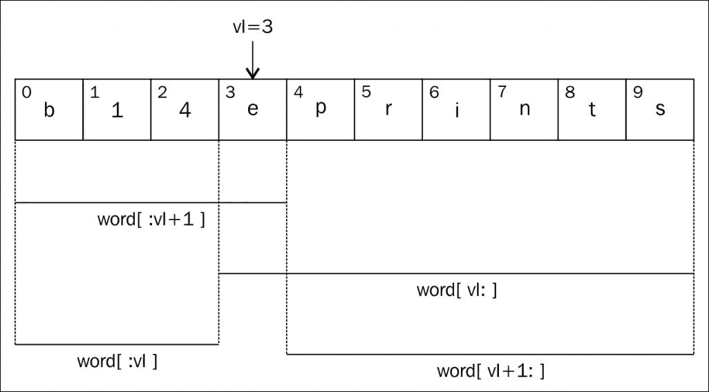
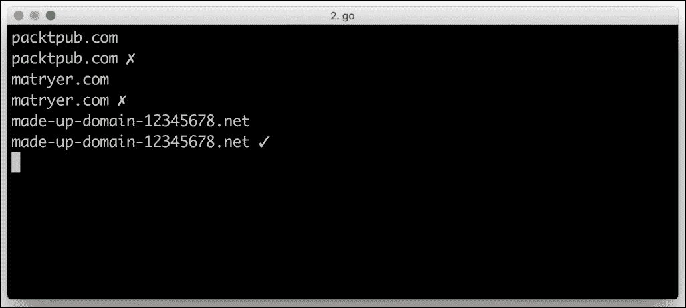
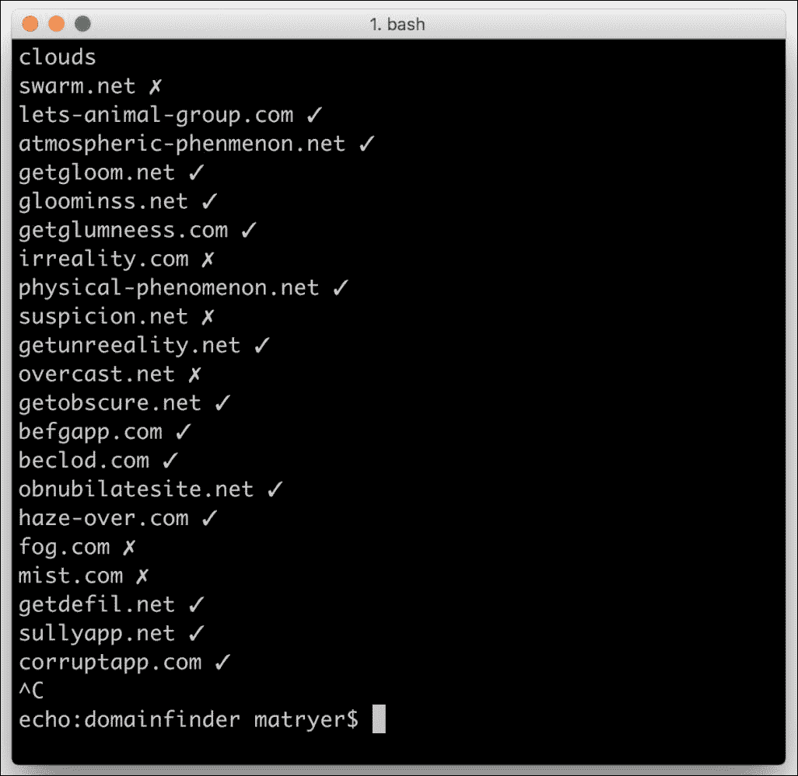

# 第四章. 命令行工具查找域名

我们迄今为止构建的聊天应用程序准备好席卷全球，但在我们邀请朋友们加入对话之前，我们需要选择一个有效、吸引人且可用的域名，并将其指向运行我们的 Go 代码的服务器。我们不会长时间坐在我们最喜欢的域名提供商面前尝试不同的名称，而是将开发一些命令行工具来帮助我们找到正确的名称。在这个过程中，我们将看到 Go 标准库如何允许我们与终端和其他执行应用程序接口；我们还将探索一些构建命令行程序的模式和惯例。

在本章中，你将学习：

+   如何使用最少的代码文件构建完整的命令行应用程序

+   如何确保我们构建的工具可以使用标准流与其他工具组合

+   如何与简单的第三方 JSON RESTful API 交互

+   如何在 Go 代码中利用标准输入和输出管道

+   如何逐行读取流式源

+   如何构建一个 WHOIS 客户端来查找域名信息

+   如何在环境变量中存储和使用敏感或部署特定的信息

# 命令行工具的管道设计

我们将构建一系列使用标准流（`stdin` 和 `stdout`）与用户和其他工具通信的命令行工具。每个工具将通过标准输入管道逐行读取输入，以某种方式处理它，然后逐行将输出打印到标准输出管道，以便下一个工具或用户。

默认情况下，标准输入连接到用户的键盘，标准输出从运行命令的终端打印出来；然而，两者都可以使用 **重定向元字符** 进行重定向。可以将输出重定向到 Windows 上的 `NUL` 或 Unix 机器上的 `/dev/null`，或者将其重定向到将输出保存到磁盘的文件。或者，您可以使用 `|` 管道字符将一个程序的输出管道到另一个程序的输入；我们将利用这个特性将我们的各种工具连接起来。例如，您可以使用以下代码在终端中将一个程序的输出管道到另一个程序的输入：

```go
echo -n "Hello" | md5

```

`echo` 命令的输出将是字符串 `Hello`（不带引号），然后通过 **管道** 传递给 `md5` 命令；这个命令将接着计算 `Hello` 的 MD5 哈希值：

```go
8b1a9953c4611296a827abf8c47804d7

```

我们的工具将处理字符串的行，其中每一行（由换行符分隔）代表一个字符串。在没有任何管道重定向的情况下运行，我们将能够直接与使用默认输入和输出的程序交互，这在测试和调试我们的代码时将非常有用。

# 五个简单的程序

在本章中，我们将构建五个小型程序，最后我们将它们组合在一起。这些程序的关键特性如下：

+   **Sprinkle**：此程序将通过添加一些适合网络的点缀词来增加找到可用域名的机会。

+   **Domainify**：此程序将通过删除不可接受的字符来确保单词适合作为域名。一旦完成，它将用连字符替换空格，并在末尾添加适当的顶级域名（如`.com`和`.net`）。

+   **Coolify**：此程序将通过调整元音来将一个无聊的普通词变成 Web 2.0 风格。

+   **同义词**：此程序将使用第三方 API 来查找同义词。

+   **可用性**：此语法将使用第三方 API 来查找同义词。可用性：此程序将使用适当的**WHOIS**服务器检查域名是否可用。

五个程序对于一个章节来说可能看起来很多，但不要忘记在 Go 中整个程序可以有多小。

## Sprinkle

我们的第一个程序通过添加一些糖分术语来增强传入的单词，以提高找到可用名称的机会。许多公司使用这种方法来保持核心信息的连贯性，同时能够负担得起`.com`域名。例如，如果我们传入单词`chat`，它可能会输出`chatapp`；或者，如果我们传入`talk`，我们可能会得到`talk time`。

Go 的`math/rand`包使我们能够摆脱计算机的预测性。它通过在决策过程中引入随机元素，使我们的程序看起来具有智能。

要使我们的 Sprinkle 程序工作，我们将：

+   定义一个转换数组，使用特殊常量来指示原始单词将出现的位置

+   使用`bufio`包从`stdin`读取输入，并使用`fmt.Println`将输出写入`stdout`

+   使用`math/rand`包随机选择一个要应用的转换

### 小贴士

我们的所有程序都将位于`$GOPATH/src`目录下。例如，如果你的 GOPATH 是`~/Work/projects/go`，你将在`~/Work/projects/go/src`文件夹中创建你的程序文件夹。

在`$GOPATH/src`目录下，创建一个名为`sprinkle`的新文件夹，并添加一个包含以下代码的`main.go`文件：

```go
package main 
import ( 
  "bufio" 
  "fmt" 
  "math/rand" 
  "os" 
  "strings" 
  "time" 
) 
const otherWord = "*" 
var transforms = []string{  
otherWord, 
  otherWord + "app", 
  otherWord + "site", 
  otherWord + "time", 
  "get" + otherWord, 
  "go" + otherWord, 
  "lets " + otherWord, 
  otherWord + "hq", 
} 
func main() { 
  rand.Seed(time.Now().UTC().UnixNano()) 
  s := bufio.NewScanner(os.Stdin) 
  for s.Scan() { 
    t := transforms[rand.Intn(len(transforms))] 
    fmt.Println(strings.Replace(t, otherWord, s.Text(), -1)) 
  } 
} 

```

从现在开始，假设你将自行解决适当的`import`语句。如果你需要帮助，请参阅提供的提示，见附录，*稳定 Go 环境的良好实践*。

上述代码代表了我们完整的 Sprinkle 程序。它定义了三件事：一个常量、一个变量以及必要的 `main` 函数，该函数作为 Sprinkle 的入口点。`otherWord` 常量字符串是一个有用的标记，它允许我们指定原始单词在每个可能的转换中应该出现的位置。它让我们能够编写如 `otherWord+"extra"` 这样的代码，这清楚地表明在这个特定情况下，我们想在原始单词的末尾添加单词 "extra"。

可能的转换存储在我们声明的字符串切片 `transforms` 变量中。在上述代码中，我们定义了一些不同的转换，例如在单词末尾添加 `app` 或在其前面添加 `lets`。请随意添加更多；越有创意越好。

在 `main` 函数中，我们首先使用当前时间作为随机种子。计算机实际上不能生成随机数，但改变随机算法的种子数字可以给人一种它可以的错觉。我们使用纳秒作为当前时间，因为每次程序运行时它都是不同的（前提是在每次运行之前系统时钟没有被重置）。如果我们跳过这一步，`math/rand` 包生成的数字将是确定的；每次运行程序时它们都是相同的。

然后，我们创建一个 `bufio.Scanner` 对象（通过调用 `bufio.NewScanner`），并告诉它从 `os.Stdin` 读取输入，它代表标准输入流。在我们的五个程序中，这将成为一个常见的模式，因为我们总是要从标准 *in* 读取并写入标准 *out*。

### 小贴士

`bufio.Scanner` 对象实际上接受 `io.Reader` 作为其输入源，因此我们可以使用多种类型。如果您正在为此代码编写单元测试，您可以指定自己的 `io.Reader` 以供扫描器读取，从而无需您担心模拟标准输入流。

作为默认情况，扫描器允许我们读取由定义的分隔符分隔的字节块，例如回车和换行符字符。我们可以为扫描器指定自己的分割函数，或者使用标准库中内置的选项。例如，有 `bufio.ScanWords`，它通过在空白处而不是换行符处断开来扫描单个单词。由于我们的设计指定每行必须包含一个单词（或短语），因此默认的逐行设置是理想的。

对 `Scan` 方法的调用告诉扫描器从输入中读取下一个字节数组（下一行），然后它返回一个 `bool` 值，指示它是否找到了任何内容。这就是我们能够将其用作 `for` 循环的条件的原因。当有内容要处理时，`Scan` 返回 `true`，并执行 `for` 循环的主体；当 `Scan` 达到输入的末尾时，它返回 `false`，循环被中断。所选的字节存储在扫描器的 `Bytes` 方法中，我们使用的方便的 `Text` 方法将 `[]byte` 切片转换为字符串。

在 `for` 循环内部（因此对于每一行输入），我们使用 `rand.Intn` 从 `transforms` 切片中选择一个随机项，并使用 `strings.Replace` 将原始单词插入到 `otherWord` 字符串出现的位置。最后，我们使用 `fmt.Println` 将输出打印到默认标准输出流。

### 注意

`math/rand` 包提供的随机数不安全。如果你想要编写用于安全目的的利用随机数的代码，你必须使用 `crypto/rand` 包。

让我们构建我们的程序并玩玩它：

```go
go build -o sprinkle
./sprinkle

```

一旦程序开始运行，它将使用默认行为从终端读取用户输入。它使用默认行为是因为我们没有将任何内容管道输入或指定读取来源。输入 `chat` 并按回车键。我们代码中的扫描器注意到单词末尾的换行符，并运行变换它的代码，输出结果。例如，如果你多次输入 `chat`，你会看到以下输出：

```go
chat
go chat
chat
lets chat
chat
chat app

```

Sprinkle 永远不会退出（这意味着 `Scan` 方法永远不会返回 `false` 来中断循环），因为终端仍在运行；在正常执行中，输入管道将由生成输入的程序关闭。要停止程序，请按 *Ctrl + C*。

在我们继续之前，让我们尝试运行 Sprinkle，指定不同的输入源。我们将使用 `echo` 命令生成一些内容，并通过管道字符将其传递到我们的 Sprinkle 程序：

```go
echo "chat" | ./sprinkle

```

程序将随机变换单词，打印出来，然后退出，因为 `echo` 命令在终止和关闭管道之前只生成一行输入。

我们已经成功完成了我们的第一个程序，它具有非常简单但有用的功能，正如我们将看到的。

### 提示

作为额外的作业，而不是像我们之前那样硬编码 `transformations` 数组，看看你是否可以通过标志或将其存储在文本文件或数据库中来实现外部化。

## Domainify

Sprinkle 输出的某些单词包含空格，也许还有在域名中不允许的其他字符。因此，我们将编写一个名为 Domainify 的程序；它将一行文本转换为可接受的域名段，并在末尾添加一个合适的 **顶级域名** (**TLD**)。在 `sprinkle` 文件夹旁边创建一个新的文件夹，命名为 `domainify`，并添加一个名为 `main.go` 的文件，其中包含以下代码：

```go
package main 
var tlds = []string{"com", "net"} 
const allowedChars = "abcdefghijklmnopqrstuvwxyz0123456789_-" 
func main() { 
  rand.Seed(time.Now().UTC().UnixNano()) 
  s := bufio.NewScanner(os.Stdin) 
  for s.Scan() { 
    text := strings.ToLower(s.Text()) 
    var newText []rune 
    for _, r := range text { 
      if unicode.IsSpace(r) { 
        r = '-' 
      } 
      if !strings.ContainsRune(allowedChars, r) { 
        continue 
      } 
      newText = append(newText, r) 
    } 
    fmt.Println(string(newText) + "." +         
                tlds[rand.Intn(len(tlds))]) 
  } 
} 

```

你会注意到 Domainify 和 Sprinkle 程序之间有一些相似之处：我们使用`rand.Seed`设置随机种子，生成一个包装`os.Stdin`读取器的`NewScanner`方法，并扫描每一行直到没有更多输入。

我们首先将文本转换为小写，并构建一个新的`rune`类型切片，称为`newText`。`rune`类型仅包含出现在`allowedChars`字符串中的字符，这是`strings.ContainsRune`函数告诉我们的。如果`rune`是一个空格，我们通过调用`unicode.IsSpace`来确定，我们将其替换为一个连字符，这在域名中是一种可接受的实践。

### 注意

遍历字符串返回每个字符的索引和一个`rune`类型，这是一个表示字符本身的数值（具体来说，是`int32`）。有关 runes、字符和字符串的更多信息，请参阅[`blog.golang.org/strings`](http://blog.golang.org/strings)。

最后，我们将`newText`从`[]rune`切片转换为字符串，并在打印之前添加`.com`或`.net`，然后使用`fmt.Println`打印出来。

让我们构建并运行 Domainify：

```go
go build -o domainify
./domainify

```

输入一些这些选项以查看`domainify`的反应：

+   Monkey

+   Hello Domainify

+   "What's up?"

+   One (two) three!

你可以看到，例如，`One (two) three!`可能会产生`one-two-three.com`。

我们现在将组合 Sprinkle 和 Domainify 来观察它们是如何一起工作的。在你的终端中，导航到`sprinkle`和`domainify`的父文件夹（可能是`$GOPATH/src`），并运行以下命令：

```go
./sprinkle/sprinkle | ./domainify/domainify

```

在这里，我们运行了`sprinkle`程序，并将其输出管道传输到`domainify`程序。默认情况下，`sprinkle`使用终端作为输入，而`domanify`输出到终端。再次尝试输入`chat`几次，并注意输出与 Sprinkle 之前输出的相似，但现在它们是域名中可接受的。正是这种程序之间的管道连接使我们能够组合命令行工具。

### 提示

仅支持`.com`和`.net`顶级域名相当有限。作为额外的作业，看看你是否可以通过命令行标志接受一个 TLDs 列表。

## Coolify

通常，像`chat`这样的常见单词的域名已经被占用，一个常见的解决方案是在单词的元音上玩弄。例如，我们可能会移除`a`并使其变为`cht`（这实际上更不可能可用）或者添加`a`以产生`chaat`。虽然这显然对酷度没有实际影响，但它已经成为一种流行但略显过时的方法，可以确保听起来像原始单词的域名。

我们的第三个程序 Coolify 将允许我们玩转通过输入进入的单词的元音，并将修改后的版本写入输出。

在`sprinkle`和`domainify`旁边创建一个名为`coolify`的新文件夹，并创建一个包含以下代码的`main.go`代码文件：

```go
package main 
const ( 
  duplicateVowel bool   = true 
  removeVowel    bool   = false 
)  
func randBool() bool { 
  return rand.Intn(2) == 0 
} 
func main() { 
  rand.Seed(time.Now().UTC().UnixNano()) 
  s := bufio.NewScanner(os.Stdin) 
  for s.Scan() { 
    word := []byte(s.Text()) 
    if randBool() { 
      var vI int = -1 
      for i, char := range word { 
        switch char { 
        case 'a', 'e', 'i', 'o', 'u', 'A', 'E', 'I', 'O', 'U': 
          if randBool() { 
            vI = i 
          } 
        } 
      } 
      if vI >= 0 { 
        switch randBool() { 
        case duplicateVowel: 
          word = append(word[:vI+1], word[vI:]...) 
        case removeVowel: 
          word = append(word[:vI], word[vI+1:]...) 
        } 
      } 
    } 
    fmt.Println(string(word)) 
  } 
} 

```

虽然前面的 Coolify 代码看起来与 Sprinkle 和 Domainify 的代码非常相似，但它稍微复杂一些。在代码的顶部，我们声明了两个常量，`duplicateVowel` 和 `removeVowel`，这有助于使 Coolify 代码更易于阅读。`switch` 语句决定是否复制或删除元音。此外，使用这些常量，我们能够非常清楚地表达我们的意图，而不是仅仅使用 `true` 或 `false`。

我们然后定义了一个辅助函数 `randBool`，它随机返回 `true` 或 `false`。这是通过请求 `rand` 包生成一个随机数并确认该数字是否为零来完成的。它将是 `0` 或 `1`，所以有一半的机会它是 `true`。

Coolify 的 `main` 函数与 Sprinkle 和 Domainify 的 `main` 函数以相同的方式开始，设置 `rand.Seed` 方法并创建标准输入流的扫描器，然后在执行输入行的循环体之前。我们首先调用 `randBool` 来决定是否甚至要变异一个单词，因此 Coolify 只会影响通过它的单词的一半。

我们然后遍历字符串中的每个 rune 并寻找元音。如果我们的 `randBool` 方法返回 `true`，我们保留元音字符在 `vI` 变量中的索引。如果不，我们继续在字符串中寻找另一个元音，这允许我们从单词中随机选择一个元音，而不是总是修改同一个元音。

一旦我们选择了一个元音，我们再次使用 `randBool` 来随机决定采取什么行动。

### 注意

这就是有用的常量发挥作用的地方；考虑以下替代的 `switch` 语句：

```go
switch randBool() { 
  case true:
    word = append(word[:vI+1], word[vI:]...)
  case false:
    word = append(word[:vI], word[vI+1:]...) }

```

```go
true and false don't express any context. On the other hand, using duplicateVowel and removeVowel tells anyone reading the code what we mean by the result of randBool.
```

在切片后面的三个点使得每个项目都能作为单独的参数传递给 `append` 函数。这是一种将一个切片附加到另一个切片的惯用方法。在 `switch` 案例中，我们进行一些切片操作，要么复制元音，要么完全删除它。我们再次对 `[]byte` 切片进行切片，并使用 `append` 函数构建一个新的切片，该切片由原始单词的各个部分组成。以下图表显示了我们在代码中访问的字符串的哪些部分：



以 `blueprints` 作为示例单词的值，并假设我们的代码已选择第一个 `e` 字符作为元音（因此 `vI` 为 `3`），以下表格将说明单词的每个新切片将代表什么：

| **代码** | **值** | **描述** |
| --- | --- | --- |
| `word[:vI+1]` | blue | 这描述了从单词开头到所选元音的切片。`+1` 是必需的，因为冒号后面的值不包括指定的索引；相反，它切片到那个值。 |
| `word[vI:]` | eprints | 这描述了从所选元音开始并包括所选元音的切片。 |
| `word[:vI]` | blu | 这描述了从单词开头到所选元音之前的切片。 |
| `word[vI+1:]` | 打印 | 这描述了从所选元音之后的项到切片末尾的切片。 |

修改单词后，我们使用 `fmt.Println` 打印它。

让我们构建 Coolify 并尝试使用它看看它能做什么：

```go
go build -o coolify
./coolify

```

当 Coolify 运行时，尝试输入 `blueprints` 来查看它提出了什么样的修改：

```go
blueprnts
bleprints
bluepriints
blueprnts
blueprints
bluprints

```

让我们看看 Coolify 如何通过将它们的名称添加到我们的管道链中来与 Sprinkle 和 Domainify 互动。在终端中，使用 `cd` 命令返回父文件夹，并运行以下命令：

```go
./coolify/coolify | ./sprinkle/sprinkle | ./domainify/domainify

```

我们首先通过添加额外的部分来丰富一个单词，并通过调整元音使其更加酷，最后将其转换成一个有效的域名。通过输入几个单词并查看代码的建议来尝试一下。

### 小贴士

Coolify 只作用于元音；作为一个额外的练习，看看你是否能让代码对遇到的每个字符都进行操作，以看看会发生什么。

## Synonyms

到目前为止，我们的程序只修改了单词，但为了真正让我们的解决方案活起来，我们需要能够集成一个提供单词同义词的第三方 API。这允许我们在保留原始意义的同时建议不同的域名。与 Sprinkle 和 Domainify 不同，Synonyms 将为每个给定的单词写出多个响应。我们通过管道连接程序一起的架构意味着这不会成为太大的问题；事实上，我们甚至不必担心它，因为这三个程序中的每一个都能够从输入源中读取多行。

大型同义词词典，[`bighugelabs.com/`](http://bighugelabs.com/)，提供了一个非常干净简单的 API，允许我们通过发送单个 HTTP `GET`请求来查找同义词。

### 小贴士

在未来，如果我们使用的 API 发生变化或消失（毕竟，我们在处理互联网），你将在 [`github.com/matryer/goblueprints`](https://github.com/matryer/goblueprints) 找到一些选项。

在你能够使用大型同义词词典之前，你需要一个 API 密钥，你可以通过在 [`words.bighugelabs.com/`](http://words.bighugelabs.com/) 上注册服务来获取。

### 使用环境变量进行配置

你的 API 密钥是一段敏感的配置信息，你不希望与他人分享。我们可以在代码中将它存储为 `const`。然而，这意味着我们无法在不分享密钥的情况下分享我们的代码（特别是如果你喜欢开源项目的话）。此外，也许更重要的是，如果密钥过期或你想使用另一个密钥，你将不得不重新编译整个项目（你不想陷入这种境地）。

一个更好的解决方案是使用环境变量来存储密钥，因为这将允许你轻松地更改它，如果你需要的话。你也可以为不同的部署有不同的密钥；也许你可以有一个用于开发或测试的密钥，另一个用于生产。这样，你可以为特定的代码执行设置一个特定的密钥，这样你就可以轻松地在密钥之间切换，而无需更改系统级别的设置。此外，不同的操作系统以类似的方式处理环境变量，所以如果你正在编写跨平台代码，它们是一个完美的选择。

创建一个名为`BHT_APIKEY`的新环境变量，并将 API 密钥设置为它的值。

### 注意

对于运行 bash shell 的机器，你可以修改你的`~/.bashrc`文件或类似文件，以包含以下`export`命令：

```go
 `export BHT_APIKEY=abc123def456ghi789jkl` 

```

在 Windows 机器上，你可以导航到计算机属性，并在**高级**部分查找**环境变量**。

### 消费 Web API

在网页浏览器中发出请求，显示了当寻找单词`love`的同义词时 JSON 响应数据的结构：

```go
{ 
  "noun":{ 
    "syn":[ 
      "passion", 
      "beloved", 
      "dear" 
    ] 
  }, 
  "verb":{ 
    "syn":[ 
      "love", 
      "roll in the hay", 
      "make out" 
    ], 
    "ant":[ 
      "hate" 
    ] 
  } 
} 

```

一个真实的 API 将返回比这里打印的更多实际单词，但结构才是最重要的。它代表一个对象，其中键描述了单词的类型（动词、名词等）。此外，值是包含以`syn`或`ant`（分别代表同义词和反义词）为键的字符串数组的对象；我们感兴趣的是同义词。

为了将这个 JSON 字符串数据转换成我们可以在代码中使用的东西，我们必须使用`encoding/json`包中的功能将其解码成我们自己的结构。因为我们正在编写可能在我们项目范围之外有用的东西，所以我们将通过可重用的包来消费 API，而不是直接在我们的程序代码中。在你的其他程序文件夹（在`$GOPATH/src`）旁边创建一个名为`thesaurus`的新文件夹，并将以下代码插入一个名为`bighuge.go`的新文件中：

```go
package thesaurus 
import ( 
  "encoding/json" 
  "errors" 
  "net/http" 
) 
type BigHuge struct { 
  APIKey string 
} 
type synonyms struct { 
  Noun *words `json:"noun"` 
  Verb *words `json:"verb"` 
} 
type words struct { 
  Syn []string `json:"syn"` 
} 
func (b *BigHuge) Synonyms(term string) ([]string, error) { 
  var syns []string 
  response, err := http.Get("http://words.bighugelabs.com/api/2/"  + 
   b.APIKey + "/" + term + "/json") 
  if err != nil { 
    return syns, errors.New("bighuge: Failed when looking for  synonyms    
     for "" + term + """ + err.Error()) 
  } 
  var data synonyms 
  defer response.Body.Close() 
  if err := json.NewDecoder(response.Body).Decode(&data); err !=  nil { 
    return syns, err 
  } 
  if data.Noun != nil { 
    syns = append(syns, data.Noun.Syn...) 
  } 
  if data.Verb != nil { 
    syns = append(syns, data.Verb.Syn...) 
  } 
  return syns, nil 
} 

```

在前面的代码中，我们定义的`BigHuge`类型包含必要的 API 密钥，并提供了一个`Synonyms`方法，它将负责访问端点、解析响应并返回结果。这段代码中最有趣的部分是`synonyms`和`words`结构。它们用 Go 术语描述了 JSON 响应格式，即包含名词和动词对象的对象，这些对象反过来包含一个名为`Syn`的字符串切片。标签（每个字段定义后面的反引号中的字符串）告诉`encoding/json`包将哪些字段映射到哪些变量；这是必需的，因为我们已经给了它们不同的名字。

### 小贴士

通常在 JSON 中，键名是小写的，但我们必须在我们的结构中使用大写名称，这样`encoding/json`包也会知道字段存在。如果我们不这样做，包将简单地忽略这些字段。然而，类型本身（`synonyms`和`words`）不需要被导出。

`Synonyms`方法接受一个`term`参数，并使用`http.Get`向包含 API 密钥值以及`term`值的 API 端点发起网络请求。如果由于某种原因网络请求失败，我们将调用`log.Fatalln`，这将错误写入标准错误流，并以非零退出代码（实际上是一个退出代码`1`）退出程序。这表示发生了错误。

如果网络请求成功，我们将响应体（另一个`io.Reader`）传递给`json.NewDecoder`方法，并要求它将字节解码到我们的`synonyms`类型的`data`变量中。我们延迟关闭响应体，以便在使用 Go 的内置`append`函数将`noun`和`verb`同义词连接到我们随后返回的`syns`切片之前保持内存清洁。

虽然我们已经实现了`BigHuge`同义词库，但这并不是唯一的选择，我们可以通过向我们的包中添加`Thesaurus`接口来表达这一点。在`thesaurus`文件夹中，创建一个名为`thesaurus.go`的新文件，并将以下接口定义添加到该文件中：

```go
package thesaurus 
type Thesaurus interface { 
  Synonyms(term string) ([]string, error) 
} 

```

这个简单的接口仅仅描述了一个方法，该方法接受一个`term`字符串，并返回包含同义词的字符串切片或错误（如果发生错误）。我们的`BigHuge`结构已经实现了这个接口，但现在，其他用户可以为其他服务添加可互换的实现，例如[`www.dictionary.com/`](http://www.dictionary.com/)或 Merriam-Webster 在线服务。

接下来，我们将在程序中使用这个新包。在终端中，将目录向上移动一级到`$GOPATH/src`，创建一个名为`synonyms`的新文件夹，并将以下代码插入到该文件夹中一个名为`main.go`的新文件中：

```go
func main() { 
  apiKey := os.Getenv("BHT_APIKEY") 
  thesaurus := &thesaurus.BigHuge{APIKey: apiKey} 
  s := bufio.NewScanner(os.Stdin) 
  for s.Scan() { 
    word := s.Text() 
    syns, err := thesaurus.Synonyms(word) 
    if err != nil { 
      log.Fatalln("Failed when looking for synonyms for  "+word+", err) 
    } 
    if len(syns) == 0 { 
      log.Fatalln("Couldn't find any synonyms for " + word +  ") 
    } 
    for _, syn := range syns { 
      fmt.Println(syn) 
    } 
  } 
} 

```

现在你再次管理你的导入时，你将编写一个完整的程序，该程序能够通过集成 Big Huge Thesaurus API 查找单词的同义词。

在前面的代码中，我们的`main`函数首先通过`os.Getenv`调用获取`BHT_APIKEY`环境变量的值。为了保护你的代码，你可能需要再次检查以确保值已正确设置；如果没有，则报告错误。目前，我们将假设一切配置正确。

接下来，前面的代码开始看起来有些熟悉，因为它再次从`os.Stdin`读取每一行输入，并调用`Synonyms`方法来获取替换词的列表。

让我们构建一个程序，看看当我们输入单词`chat`时，API 返回了什么样的同义词：

```go
go build -o synonyms
./synonyms
chat
confab
confabulation
schmooze
New World chat
Old World chat
conversation
thrush
wood warbler
chew the fat
shoot the breeze
chitchat
chatter

```

你得到的结果很可能与我们列出的不同，因为我们正在调用一个实时 API。然而，重要的是，当我们向程序提供一个单词或术语作为输入时，它返回一个同义词列表作为输出，每行一个。

### 获取域名建议

通过组合本章中构建的四个程序，我们已经有了一个有用的工具来建议域名。我们现在需要做的就是以适当的方式将程序的输出管道传输到输入。在终端中，导航到父文件夹并运行以下单行命令：

```go
./synonyms/synonyms | ./sprinkle/sprinkle | ./coolify/coolify |  ./domainify/domainify

```

因为`synonyms`程序在我们的列表中排在第一位，所以它将接收来自终端的输入（无论用户决定输入什么）。同样，因为`domainify`在链中排在最后，所以它将打印输出到终端供用户查看。在这个过程中，单词行将通过其他程序进行管道传输，给每个程序一个施展魔法的机会。

输入几个词以查看一些域名建议；例如，当你输入`chat`并按回车键时，你可能看到以下内容：

```go
getcnfab.com
confabulationtim.com
getschmoozee.net
schmosee.com
neew-world-chatsite.net
oold-world-chatsite.com
conversatin.net
new-world-warblersit.com
gothrush.net
lets-wood-wrbler.com
chw-the-fat.com

```

你得到的建议数量实际上取决于同义词的数量。这是因为它是唯一一个输出行数多于输入行的程序。

我们还没有解决我们最大的问题：我们不知道建议的域名实际上是否可用。所以我们仍然需要坐下来逐个将它们输入到网站上。在下一节中，我们将解决这个问题。

## Available

我们最后的程序，Available，将连接到 WHOIS 服务器以获取传递给它的域的详细信息，当然，如果没有返回详细信息，我们可以安全地假设该域名可供购买。不幸的是，WHOIS 规范（见[`tools.ietf.org/html/rfc3912`](http://tools.ietf.org/html/rfc3912)）非常小，并且不包含有关当请求域名详细信息时 WHOIS 服务器应该如何回复的信息。这意味着程序化解析响应变成了一项繁琐的工作。为了解决这个问题，我们现在将仅与一个 WHOIS 服务器集成，我们可以确信当它没有该域的记录时，响应中会有“无匹配”字样。

### 注意

一个更健壮的解决方案是拥有一个 WHOIS 接口，具有定义良好的结构来显示详细信息，也许还有当域名不存在时的错误消息，以及针对不同 WHOIS 服务器的不同实现。正如你可以想象的那样，这是一个相当大的项目；它非常适合开源努力。

在其他文件夹旁边创建一个名为`available`的新文件夹，并向其中添加一个`main.go`文件，包含以下函数代码：

```go
func exists(domain string) (bool, error) { 
  const whoisServer string = "com.whois-servers.net" 
  conn, err := net.Dial("tcp", whoisServer+":43") 
  if err != nil { 
    return false, err 
  } 
  defer conn.Close() 
  conn.Write([]byte(domain + "rn")) 
  scanner := bufio.NewScanner(conn) 
  for scanner.Scan() { 
    if strings.Contains(strings.ToLower(scanner.Text()), "no match") { 
      return false, nil 
    } 
  } 
  return true, nil 
} 

```

`exists` 函数通过调用 `net.Dial` 打开到指定 `whoisServer` 实例的 `43` 端口的连接来实现 WHOIS 规范中存在的内容。然后我们延迟关闭连接，这意味着无论函数如何退出（成功、错误，甚至恐慌），`Close()` 都会在 `conn` 连接上被调用。一旦连接打开，我们只需写入域名后跟 `rn`（回车和换行字符）。这就是规范告诉我们的全部内容，所以从现在起我们就得自己动手了。

实际上，我们正在寻找响应中提到“没有匹配”的内容，这就是我们将如何决定域名是否存在（在这种情况下，`exists` 实际上是在询问 WHOIS 服务器是否有我们指定的域名的记录）。我们使用我们最喜欢的 `bufio.Scanner` 方法来帮助我们遍历响应中的行。将连接传递给 `NewScanner` 是可行的，因为 `net.Conn` 实际上也是一个 `io.Reader`。我们使用 `strings.ToLower` 以免担心大小写敏感，并使用 `strings.Contains` 来检查是否有任何一行包含 `no match` 文本。如果有，我们返回 `false`（因为域名不存在）；否则，我们返回 `true`。

`com.whois-servers.net` WHOIS 服务支持 `.com` 和 `.net` 域名，这就是为什么 Domainify 程序只添加这些类型的域名。如果你使用了一个提供更广泛域名 WHOIS 信息的服务器，你可以添加对其他顶级域（TLD）的支持。

让我们添加一个 `main` 函数，使用我们的 `exists` 函数来检查传入的域名是否可用。以下代码中的勾号和叉号符号是可选的，如果你的终端不支持它们，你可以自由地将它们替换为简单的 `Yes` 和 `No` 字符串。

将以下代码添加到 `main.go` 中：

```go
var marks = map[bool]string{true: "✔", false: "✖"}
func main() {
s := bufio.NewScanner(os.Stdin)
for s.Scan() {
domain := s.Text()
fmt.Print(domain, " ")
exist, err := exists(domain)
if err != nil {
log.Fatalln(err)
}
fmt.Println(marks[!exist])
time.Sleep(1 * time.Second)
}
} 

```

### 注意

我们可以在代码中愉快地使用勾号和叉号字符，因为所有 Go 代码文件都是 UTF-8 兼容的。实际上获取这些字符的最佳方式是搜索网络并使用复制粘贴选项将它们带入我们的代码。否则，有平台依赖的方式可以获取这样的特殊字符。

在上一个 `main` 函数的代码中，我们简单地遍历通过 `os.Stdin` 进来的每一行。这个过程帮助我们使用 `fmt.Print` 打印出域名（但不是 `fmt.Println`，因为我们还不想要换行符），调用我们的 `exists` 函数来检查域名是否存在，并使用 `fmt.Println` 打印出结果（因为我们确实想要在末尾有一个换行符）。

最后，我们使用 `time.Sleep` 来告诉进程在一秒钟内什么也不做，以确保我们对 WHOIS 服务器不要太苛刻。

### 提示

大多数 WHOIS 服务器都会以各种方式受限，以防止你占用过多的资源。因此，放慢速度是一种合理的做法，以确保我们不会让远程服务器生气。

考虑这也对单元测试意味着什么。如果一个单元测试实际上正在向远程 WHOIS 服务器发送真实请求，每次你的测试运行时，你都会对你的 IP 地址进行统计。一个更好的方法是对 WHOIS 服务器进行存根以模拟响应。

顶部的`marks`映射是一个将`bool`响应从`exists`映射到可读文本的好方法，允许我们只需使用`fmt.Println(marks[!exist])`在单行中打印出响应。我们说*不存在*，因为我们的程序正在检查域名是否可用（逻辑上，这是否存在于 WHOIS 服务器中的对立面）。

在修复 main.go 文件的导入语句后，我们可以尝试运行 Available，通过输入以下命令来查看域名是否可用：

```go
go build -o available
./available

```

一旦 Available 开始运行，输入一些域名，并查看结果出现在下一行：



如您所见，对于不可用的域名，我们在它们旁边得到一个小十字标记；然而，当我们使用随机数字创建域名时，我们看到它确实是可用的。

# 组合所有五个程序

现在我们已经完成了所有五个程序，是时候将它们全部组合起来，这样我们就可以使用我们的工具为我们的聊天应用程序找到一个可用的域名。最简单的方法是使用我们在本章中一直在使用的技术：在终端中使用管道连接输出和输入。

在终端中，导航到五个程序的父文件夹，并运行以下单行代码：

```go
./synonyms/synonyms | ./sprinkle/sprinkle | ./coolify/coolify |  ./domainify/domainify | ./available/available

```

一旦程序开始运行，输入一个起始词，看看它如何生成建议，然后再检查它们的可用性。

例如，输入`chat`可能会使程序执行以下操作：

1.  单词`chat`进入`synonyms`，这导致一系列同义词：

    +   confab

    +   confabulation

    +   schmooze

1.  同义词流入`sprinkle`；在这里，它们被添加了网络友好的前缀和后缀，如下所示：

    +   confabapp

    +   goconfabulation

    +   schmooze time

1.  这些新词流入`coolify`；在这里，元音可能被调整：

    +   confabaapp

    +   goconfabulatioon

    +   schmoooze time

1.  修改后的单词随后流入`domainify`；在这里，它们被转换成有效的域名：

    +   confabaapp.com

    +   goconfabulatioon.net

    +   schmooze-time.com

1.  最后，域名流入`available`；在这里，它们会与 WHOIS 服务器进行核对，以查看是否有人已经注册了该域名：

    +   confabaapp.com 

    +   goconfabulatioon.net 

    +   schmooze-time.com 

## 一款程序统治一切

通过管道将程序连接起来运行是一种优雅的架构形式，但它的界面并不优雅。具体来说，每次我们想要运行我们的解决方案时，我们必须输入一个长而混乱的行，其中每个程序都列出来并通过管道字符分隔。在本节中，我们将编写一个 Go 程序，该程序使用 `os/exec` 包来运行每个子程序，同时将一个程序的输出通过管道传递到下一个程序的输入，正如我们的设计一样。

在其他五个程序旁边创建一个名为 `domainfinder` 的新文件夹，并在该文件夹内创建另一个名为 `lib` 的新文件夹。`lib` 文件夹是我们将保存子程序构建的地方，但我们不想每次更改时都复制粘贴。相反，我们将编写一个脚本来构建子程序并将二进制文件复制到 `lib` 文件夹中。

在 Unix 机器上创建一个名为 `build.sh` 的新文件或在 Windows 上创建一个名为 `build.bat` 的新文件，并将以下代码插入到其中：

```go
#!/bin/bash 
echo Building domainfinder... 
go build -o domainfinder 
echo Building synonyms... 
cd ../synonyms 
go build -o ../domainfinder/lib/synonyms 
echo Building available... 
cd ../available 
go build -o ../domainfinder/lib/available 
cd ../build 
echo Building sprinkle... 
cd ../sprinkle 
go build -o ../domainfinder/lib/sprinkle 
cd ../build 
echo Building coolify... 
cd ../coolify 
go build -o ../domainfinder/lib/coolify 
cd ../build 
echo Building domainify... 
cd ../domainify 
go build -o ../domainfinder/lib/domainify 
cd ../build 
echo Done.
```

上述脚本简单地构建了我们的所有子程序（包括我们尚未编写的 `domainfinder`），告诉 `go build` 将它们放置在我们的 `lib` 文件夹中。确保通过执行 `chmod +x build.sh` 或类似操作为新脚本赋予执行权限。从终端运行此脚本，并检查 `lib` 文件夹以确保它确实放置了我们的子程序的二进制文件。

### 小贴士

目前不必担心 `没有可构建的 Go 源文件` 错误；这只是 Go 告诉我们 `domainfinder` 程序没有 `.go` 文件可以构建。

在 `domainfinder` 内创建一个名为 `main.go` 的新文件，并将以下代码插入到文件中：

```go
package main 
var cmdChain = []*exec.Cmd{ 
  exec.Command("lib/synonyms"), 
  exec.Command("lib/sprinkle"), 
  exec.Command("lib/coolify"), 
  exec.Command("lib/domainify"), 
  exec.Command("lib/available"), 
} 
func main() { 
  cmdChain[0].Stdin = os.Stdin 
  cmdChain[len(cmdChain)-1].Stdout = os.Stdout 
  for i := 0; i < len(cmdChain)-1; i++ { 
    thisCmd := cmdChain[i] 
    nextCmd := cmdChain[i+1] 
    stdout, err := thisCmd.StdoutPipe() 
    if err != nil { 
      log.Fatalln(err) 
    } 
    nextCmd.Stdin = stdout 
  } 
  for _, cmd := range cmdChain { 
    if err := cmd.Start(); err != nil { 
      log.Fatalln(err) 
    } else { 
      defer cmd.Process.Kill() 
    } 
  } 
  for _, cmd := range cmdChain { 
    if err := cmd.Wait(); err != nil { 
      log.Fatalln(err) 
    } 
  } 
}
```

`os/exec` 包为我们提供了在 Go 程序中运行外部程序或命令所需的一切。首先，我们的 `cmdChain` 切片包含我们想要按顺序连接的 `*exec.Cmd` 命令。

在 `main` 函数的顶部，我们将第一个程序的 `Stdin`（标准输入流）与该程序的 `os.Stdin` 流绑定，并将最后一个程序的 `Stdout`（标准输出流）与该程序的 `os.Stdout` 流绑定。这意味着，就像之前一样，我们将通过标准输入流获取输入并将输出写入标准输出流。

我们接下来的代码块是通过迭代每个项目并将它的 `Stdin` 设置为之前程序的 `Stdout` 流来连接子程序的。

以下表格显示了每个程序及其输入来源和输出去向的描述：

| **程序** | **输入（标准输入）** | **输出（标准输出）** |
| --- | --- | --- |
| 同义词 | 与 `domainfinder` 相同的 `Stdin` | sprinkle |
| sprinkle | 同义词 | coolify |
| coolify | sprinkle | domainify |
| domainify | coolify | available |
| available | domainify | 与 `domainfinder` 相同的 `Stdout` |

我们随后遍历每个命令，调用`Start`方法，该方法在后台运行程序（与`Run`方法相反，它将阻塞我们的代码直到子程序存在，这会不好，因为我们将不得不同时运行五个程序）。如果发生任何错误，我们使用`log.Fatalln`退出；然而，如果程序成功启动，我们将延迟调用以终止进程。这有助于我们确保子程序在我们`main`函数退出时退出，这将是`domainfinder`程序结束时。

一旦所有程序开始运行，我们再次遍历每个命令并等待其完成。这是为了确保`domainfinder`不会提前退出并过早地杀死所有子程序。

再次运行`build.sh`或`build.bat`脚本，注意`domainfinder`程序的行为与我们之前看到的行为相同，但界面更加优雅。

以下截图显示了当我们输入`clouds`时我们程序的输出；我们找到了相当多的可用域名选项：



# 摘要

在本章中，我们了解到五个小型命令行程序在组合在一起时可以产生强大的结果，同时保持模块化。我们避免了程序之间的紧密耦合，这样它们仍然可以单独使用。例如，我们可以使用我们的 Available 程序仅检查我们手动输入的域名是否可用，或者我们可以像命令行同义词词典一样使用我们的`synonyms`程序。

我们了解到如何使用标准流构建这些类型程序的不同流程，以及标准输入和标准输出的重定向如何让我们能够非常容易地玩转不同的流程。

当我们想要从 Big Huge Thesaurus 获取同义词时，我们了解到在 Go 中消费 JSON RESTful API web 服务是多么简单。我们还消费了非 HTTP API，当我们打开到 WHOIS 服务器的连接并使用原始 TCP 写入数据时。

我们看到`math/rand`包如何通过允许我们在代码中使用伪随机数和决策来带来一点多样性和不可预测性，这意味着每次我们运行程序时，我们都会得到不同的结果。

最后，我们构建了`domainfinder`超级程序，将所有子程序组合在一起，为我们解决方案提供了一个简单、干净且优雅的界面。

在下一章中，我们将通过探索如何使用消息队列技术连接程序，使它们可以跨多台机器分布式运行，从而将我们迄今为止学到的某些想法进一步发展。
