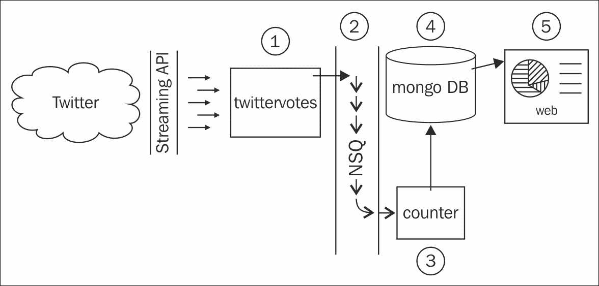

# 第五章：构建分布式系统和处理灵活数据

在本章中，我们将探讨可转移的技能，这些技能使我们能够使用无模式数据和分布式技术来解决大数据问题。本章中我们将构建的系统将为我们准备一个未来，在这个未来中，所有民主选举都在 Twitter 上在线进行，当然。我们的解决方案将通过查询 Twitter 的流式 API 以获取特定哈希标签的提及来收集和计票，并且每个组件都将能够进行水平扩展以满足需求。我们的用例既有趣又引人入胜，但本章真正关注的是我们将学习到的核心概念和我们将做出的具体技术选择。这里讨论的想法可以直接应用于任何需要真实规模能力的系统。

### 注意

**水平扩展**指的是向系统中添加节点，例如物理机器，以提高其可用性、性能和/或容量。像 Google 这样的大数据公司可以通过添加经济实惠且易于获得的硬件（通常称为通用硬件）来扩展，这得益于他们编写软件和构建解决方案的方式。

**垂直扩展**等同于增加单个节点可用的资源，例如向一个盒子添加额外的 RAM 或具有更多核心的处理器。

在本章中，你将：

+   了解分布式**NoSQL**数据存储，特别是如何与 MongoDB 交互

+   了解**分布式消息队列**，在我们的案例中，是 Bit.ly 的 NSQ 以及如何使用`go-nsq`包轻松发布和订阅事件

+   通过 Twitter 的流式 API 实时传输推文数据并管理长时间运行的网路连接

+   学习如何正确停止具有许多内部 goroutines 的程序

+   了解如何使用低内存通道进行信号传递

# 系统设计

在分布式系统中，许多组件将以不同的方式相互通信，因此绘制一个基本设计通常很有用。我们不希望在这个阶段花费太多时间，因为我们的设计可能会随着我们陷入细节而演变，但我们将查看一个高级概述，以便我们可以讨论组成部分及其如何组合在一起：



以下图表显示了我们将要构建的系统的基本概述：

+   Twitter 是我们所有人都知道并喜爱的社交媒体网络。

+   Twitter 的流式 API 允许长时间运行的连接，推文数据可以尽可能快地传输。

+   `twittervotes`是我们将编写的程序，它通过 Twitter API 提取相关推文数据，决定正在投票的内容（而不是推文正文中提到的选项），然后将投票推送到 NSQ。

+   NSQ 是一个开源的实时分布式消息平台，旨在进行大规模操作，由 Bit.ly 开发和维护。NSQ 在其实例之间传输消息，使其对任何表示对投票数据感兴趣的人可用。

+   `counter` 是我们将编写的程序，它监听消息队列上的投票，并定期将结果保存到 MongoDB 数据库中。它从 NSQ 接收投票消息，并保持内存中的计分，定期推送更新以持久化数据。

+   MongoDB 是一个开源的文档数据库，旨在进行大规模操作。

+   `web` 是一个将暴露我们在下一章中编写的实时结果的 Web 服务器程序。

可以争论说，可以编写一个单一的 Go 程序来读取推文、计数投票并将它们推送到用户界面，但这样的解决方案，虽然是一个很好的概念证明，但在规模上会非常有限。在我们的设计中，任何组件都可以随着对该特定功能的需求的增加而进行水平扩展。如果我们有相对较少的投票但很多人查看数据，我们可以保持 `twittervotes` 和 `counter` 实例的数量，并添加更多的 `web` 和 MongoDB 节点，反之亦然。

### 注意

我们设计的另一个关键优势是冗余；由于我们可以同时运行许多组件实例，如果一个我们的盒子消失了（例如，由于系统崩溃或断电），其他可以填补空缺。现代架构通常将此类系统分布到地理范围，以防止局部自然灾害。如果我们以这种方式构建解决方案，所有这些选项都可以使用。

我们在本章中选择了特定的技术，因为它们与 Go 的联系（例如，NSQ 完全用 Go 编写）以及经过良好测试的驱动程序和包的可用性。然而，从概念上讲，你可以根据需要添加各种替代方案。

## 数据库设计

我们将称我们的 MongoDB 数据库为 `ballots`。它将包含一个名为 `polls` 的单个集合，我们将在这里存储投票细节，例如标题、选项和结果（在一个单独的 JSON 文档中）。投票的代码看起来可能像这样：

```go
{ 
  "_id": "???", 
  "title": "Poll title", 
  "options": ["one", "two", "three"], 
  "results": { 
    "one": 100, 
    "two": 200, 
    "three": 300 
  } 
} 

```

`_id` 字段是 MongoDB 自动生成的每个项目的唯一字符串。`options` 字段包含一个字符串选项数组；这些是我们将在 Twitter 上寻找的哈希标签。`results` 字段是一个映射，其中键代表选项，值代表每个项目的总投票数。

# 安装环境

我们在本章中编写的代码具有真实的外部依赖项，我们需要在开始构建我们的系统之前设置这些依赖项。

### 小贴士

如果你在安装任何依赖项时遇到困难，请务必查看[`github.com/matryer/goblueprints`](https://github.com/matryer/goblueprints)中的章节注释。

在大多数情况下，必须在运行我们的程序之前启动像 `mongod` 和 `nsqd` 这样的服务。由于我们正在编写分布式系统的组件，我们必须同时运行每个程序，这就像打开许多终端窗口一样简单。

## 介绍 NSQ

NSQ 是一个消息队列，允许一个程序向另一个或多个程序发送消息或事件，这些程序可以是在同一台机器上本地运行的，也可以是通过网络连接的不同节点上的。NSQ 保证至少将每条消息投递一次，这意味着它会将未投递的消息缓存起来，直到所有感兴趣的各方都收到它们。这意味着即使我们停止 `counter` 程序，也不会错过任何投票。你可以将这种能力与“火光即忘”的消息队列进行对比，其中信息被认为过时，因此如果信息没有及时投递，并且消息的发送者不关心消费者是否收到它们，那么这些信息就会被遗忘。

消息队列抽象允许系统中的不同组件在不同的地方运行，前提是它们能够通过网络连接到队列。你的程序与其他程序解耦；相反，你的设计开始关注专用微服务的输入输出，而不是通过单体程序的数据流。

NSQ 转移原始字节，这意味着如何将这些字节编码成数据取决于我们。例如，根据我们的需求，我们可以将数据编码为 JSON 或二进制格式。在我们的案例中，我们将以字符串的形式发送投票选项，而不进行任何额外的编码，因为我们只共享单个数据字段。

我们首先需要安装并运行 NSQ：

1.  在浏览器中打开 [`nsq.io/deployment/installing.html`](http://nsq.io/deployment/installing.html)（或搜索 `install nsq`）并遵循适合你环境的说明。你可以下载预编译的二进制文件，或者从源代码构建自己的版本。如果你已经安装了 homebrew，安装 NSQ 只需输入以下命令：

    ```go
    brew install nsq

    ```

1.  安装 NSQ 后，你需要将 `bin` 文件夹添加到你的 `PATH` 环境变量中，以便在终端中可以使用这些工具。

1.  为了验证 NSQ 是否正确安装，打开终端并运行 `nsqlookupd`；如果程序成功启动，你应该会看到类似以下输出的内容：

    ```go
    nsqlookupd v0.2.27 (built w/go1.3)
    TCP: listening on [::]:4160
    HTTP: listening on [::]:4161

    ```

    我们将使用默认端口与 NSQ 交互，所以请注意输出中列出的 TCP 和 HTTP 端口，因为我们在代码中会引用它们。

1.  按 *Ctrl + C* 停止当前进程；我们稍后会正确启动它们。

我们将从 NSQ 安装中使用的关键工具是 `nsqlookupd` 和 `nsqd`。`nsqlookupd` 程序是一个守护进程，它管理分布式 NSQ 环境中的拓扑信息；它跟踪特定主题的所有 `nsqd` 生产者，并为客户端提供查询此类信息的接口。`nsqd` 程序是一个守护进程，为 NSQ 执行繁重的工作，例如接收、排队和向感兴趣的一方投递消息。

### 注意

想要了解更多关于 NSQ 的信息和背景，请访问 [`nsq.io/`](http://nsq.io/)。

### NSQ 驱动程序 for Go

NSQ 工具本身是用 Go 编写的，因此 Bit.ly 团队已经有一个 Go 包，它使得与 NSQ 交互变得非常简单。我们将需要使用它，所以你可以在终端中使用 `go get` 获取它：

```go
go get github.com/bitly/go-nsq

```

## 介绍 MongoDB

MongoDB 是一个文档数据库，它允许你存储和查询 JSON 文档及其中的数据。每个文档都会进入一个集合，可以用来将文档分组在一起，而不会对其中数据强制任何模式。与传统的关系型数据库管理系统（如 Oracle、Microsoft SQL Server 或 MySQL）中的行不同，文档具有不同的形状是完全可接受的。例如，一个 `people` 集合可以同时包含以下三个 JSON 文档：

```go
{"name":"Mat","lang":"en","points":57} 
{"name":"Laurie","position":"Scrum Master"} 
{"position":"Traditional Manager","exists":false} 

```

这种灵活性允许具有不同结构的数据共存，而不会影响性能或浪费空间。如果你预计你的软件会随着时间的推移而演变，这将是极其有用的，因为我们确实应该始终这样做。

MongoDB 被设计成在扩展的同时，在单机安装（如我们的开发机）上也非常易于使用。当我们为生产部署应用程序时，我们很可能会安装一个更复杂的、多分片、复制的系统，该系统分布在许多节点和位置，但就目前而言，只需运行 `mongod` 即可。

访问 [`www.mongodb.org/downloads`](http://www.mongodb.org/downloads) 以获取 MongoDB 的最新版本并安装它，确保像往常一样将 `bin` 文件夹注册到你的 `PATH` 环境变量中。

为了验证 MongoDB 是否成功安装，运行 `mongod` 命令，然后按 *Ctrl + C* 停止它。

### MongoDB Go 驱动程序

Gustavo Niemeyer 通过他在 [`labix.org/mgo`](http://labix.org/mgo) 上托管的 `mgo`（发音为 *mango*）包，出色地简化了与 MongoDB 的交互，该包可以通过以下命令进行 *go get*：

```go
go get gopkg.in/mgo.v2

```

## 启动环境

现在我们已经安装了所有需要的组件，我们需要启动我们的环境。在本节中，我们将：

+   启动 `nsqlookupd` 以便我们的 `nsqd` 实例可被发现

+   启动 `nsqd` 并告诉它使用哪个 `nsqlookupd`

+   为数据服务启动 `mongod`

每个这些守护进程都应该在自己的终端窗口中运行，这样我们只需按 *Ctrl + C* 就可以轻松停止它们。

### 提示

记住本节的页码，因为你很可能在阅读本章时会多次回到这里。

在终端窗口中，运行以下命令：

```go
nsqlookupd

```

请注意默认的 TCP 端口是 `4160`，然后在另一个终端窗口中运行以下命令：

```go
nsqd --lookupd-tcp-address=localhost:4160

```

确保在 `--lookupd-tcp-address` 标志中的端口号与 `nsqlookupd` 实例的 TCP 端口匹配。一旦你启动 `nsqd`，你将注意到来自 `nsqlookupd` 和 `nsqd` 的输出打印到终端；这表明这两个进程正在互相通信。

在另一个窗口或标签页中，通过运行以下命令来启动 MongoDB：

```go
mongod --dbpath ./db

```

`dbpath`标志告诉 MongoDB 将数据库的数据文件存储在哪里。你可以选择任何你喜欢的位置，但你需要确保在`mongod`运行之前文件夹存在。

### 提示

通过在任何时候删除`dbpath`文件夹，您可以有效地擦除所有数据并重新开始。这在开发过程中特别有用。

现在我们已经启动了环境，我们准备开始构建我们的组件。

# 从 Twitter 读取投票

在你的`$GOPATH/src`文件夹中，与其他项目并列，为这一章创建一个名为`socialpoll`的新文件夹。这个文件夹本身不会是一个 Go 包或程序，但它将包含我们的三个组件程序。在`socialpoll`内部创建一个名为`twittervotes`的新文件夹，并添加必要的`main.go`模板（这很重要，因为没有`main`函数的`main`包无法编译）：

```go
package main 
func main(){} 

```

我们的`twittervotes`程序将：

+   使用`mgo`从 MongoDB 数据库中加载所有投票，并从每个文档的`options`数组中收集所有选项

+   打开并维护与 Twitter 流式 API 的连接，寻找任何提及的选项

+   确定哪个选项被提及，并将该选项推送到匹配过滤器的每个推文的 NSQ

+   如果 Twitter 的连接断开（这在 Twitter 流式 API 规范中的长时间运行连接中很常见），在短暂的延迟后（这样我们不会向 Twitter 发送过多的连接请求），重新连接并继续

+   定期重新查询 MongoDB 以获取最新的投票，并刷新与 Twitter 的连接，以确保我们始终在寻找正确的选项

+   当用户通过按*Ctrl + C*终止程序时，优雅地停止自身

## 使用 Twitter 进行授权

为了使用流式 API，我们需要从 Twitter 的应用管理控制台获取认证凭据，这与我们在第三章“三种实现个人头像的方法”中为 Gomniauth 服务提供商所做的方式非常相似。请访问[`apps.twitter.com`](https://apps.twitter.com)并创建一个名为`SocialPoll`（名称必须是唯一的，所以你可以在这里玩得开心；名称的选择也不会影响代码）的新应用。当你的应用创建完成后，访问**API 密钥**标签页，找到**您的访问令牌**部分，在那里你需要创建一个新的访问令牌。稍作延迟后，刷新页面并注意，实际上你拥有两组密钥和密钥：一个 API 密钥和一个密钥，以及一个访问令牌和相应的密钥。遵循良好的编码实践，我们将把这些值设置为环境变量，这样我们的程序就可以访问它们，而无需在我们源文件中硬编码它们。在本章中我们将使用的密钥如下：

+   `SP_TWITTER_KEY`

+   `SP_TWITTER_SECRET`

+   `SP_TWITTER_ACCESSTOKEN`

+   `SP_TWITTER_ACCESSSECRET`

你可以随意设置环境变量，但由于应用程序依赖于它们才能工作，创建一个名为 `setup.sh`（用于 bash shell）或 `setup.bat`（在 Windows 上）的新文件是个好主意，因为你可以将这些文件存入源代码仓库。在 `setup.sh` 中插入以下代码，通过从 Twitter 应用页面复制适当的值：

```go
#!/bin/bash 
export SP_TWITTER_KEY=yC2EDnaNrEhN5fd33g... 
export SP_TWITTER_SECRET=6n0rToIpskCo1ob... 
export SP_TWITTER_ACCESSTOKEN=2427-13677... 
export SP_TWITTER_ACCESSSECRET=SpnZf336u... 

```

在 Windows 上，代码看起来可能如下所示：

```go
SET SP_TWITTER_KEY=yC2EDnaNrEhN5fd33g... 
SET SP_TWITTER_SECRET=6n0rToIpskCo1ob... 
SET SP_TWITTER_ACCESSTOKEN=2427-13677... 
SET SP_TWITTER_ACCESSSECRET=SpnZf336u... 

```

使用源代码或调用命令来设置适当的值，或者将它们添加到你的 `.bashrc` 或 `C:\cmdauto.cmd` 文件中，以避免每次打开新终端窗口时都运行它们。

如果你不确定如何操作，只需搜索 `在 Linux 上设置环境变量` 或类似的内容，互联网会帮助你。

### 提取连接

Twitter 流式 API 支持长时间保持打开的 HTTP 连接，鉴于我们解决方案的设计，我们需要访问 `net.Conn` 对象以便从发生请求的 goroutine 外部关闭它。我们可以通过为我们创建的 `http.Transport` 对象提供一个自己的 `dial` 方法来实现这一点。

在 `twittervotes` 目录内创建一个名为 `twitter.go` 的新文件（这是所有与 Twitter 相关内容将存放的地方），并插入以下代码：

```go
var conn net.Conn 
func dial(netw, addr string) (net.Conn, error) { 
  if conn != nil { 
    conn.Close() 
    conn = nil 
  } 
  netc, err := net.DialTimeout(netw, addr, 5*time.Second) 
  if err != nil { 
    return nil, err 
  } 
  conn = netc 
  return netc, nil 
} 

```

我们定制的 `dial` 函数首先确保 `conn` 已关闭，然后打开一个新的连接，同时保持 `conn` 变量更新为当前连接。如果连接中断（Twitter 的 API 会不时这样做）或由我们关闭，我们可以重新连接而不必担心僵尸连接。

我们将定期自己关闭连接并启动一个新的连接，因为我们希望定期从数据库重新加载选项。为此，我们需要一个函数来关闭连接，并关闭 `io.ReadCloser`，我们将使用它来读取响应体。将以下代码添加到 `twitter.go` 中：

```go
var reader io.ReadCloser 
func closeConn() { 
  if conn != nil { 
    conn.Close() 
  } 
  if reader != nil { 
    reader.Close() 
  } 
} 

```

现在，我们可以在任何时候调用 `closeConn` 来断开与 Twitter 的当前连接并整理事物。在大多数情况下，我们的代码将再次从数据库加载选项并立即打开一个新的连接，但如果我们正在关闭程序（响应于 *Ctrl + C* 的按键），那么我们可以在退出之前调用 `closeConn`。

### 读取环境变量

接下来，我们将编写一个函数来读取环境变量，并设置我们需要的 `OAuth` 对象，以便对请求进行身份验证。将以下代码添加到 `twitter.go` 文件中：

```go
var ( 
  authClient *oauth.Client 
  creds *oauth.Credentials 
) 
func setupTwitterAuth() { 
  var ts struct { 
    ConsumerKey    string `env:"SP_TWITTER_KEY,required"` 
    ConsumerSecret string `env:"SP_TWITTER_SECRET,required"` 
    AccessToken    string `env:"SP_TWITTER_ACCESSTOKEN,required"` 
    AccessSecret   string `env:"SP_TWITTER_ACCESSSECRET,required"` 
  } 
  if err := envdecode.Decode(&ts); err != nil { 
    log.Fatalln(err) 
  } 
  creds = &oauth.Credentials{ 
    Token:  ts.AccessToken, 
    Secret: ts.AccessSecret, 
  } 
  authClient = &oauth.Client{ 
    Credentials: oauth.Credentials{ 
      Token:  ts.ConsumerKey, 
      Secret: ts.ConsumerSecret, 
    }, 
  } 
} 

```

在这里，我们定义一个`struct`类型来存储我们需要用 Twitter 进行认证的环境变量。由于我们不需要在其他地方使用这个类型，我们将其定义在内联，并创建一个名为`ts`的匿名类型变量（这就是为什么我们有`var ts struct...`这样的代码）。然后我们使用 Joe Shaw 的`envdecode`包来帮我们拉取这些环境变量。你需要运行`go get github.com/joeshaw/envdecode`，并且还需要导入`log`包。我们的程序将尝试加载所有标记为`required`的字段的适当值，如果失败则返回错误，这提醒人们程序没有 Twitter 凭证将无法工作。

在`struct`中每个字段旁边的反引号内的字符串被称为标签，并且可以通过反射接口访问，这就是`envdecode`知道要查找哪些变量的方式。我们向这个包中添加了`required`参数，这表示如果任何环境变量缺失（或为空）都是错误。

一旦我们有了密钥，我们使用它们从 Gary Burd 的`go-oauth`包中创建`oauth.Credentials`和`oauth.Client`对象，这将允许我们使用 Twitter 授权请求。

现在我们有了控制底层连接和授权请求的能力，我们就可以编写实际构建授权请求并返回响应的代码了。在`twitter.go`中添加以下代码：

```go
var ( 
  authSetupOnce sync.Once 
  httpClient    *http.Client 
) 
func makeRequest(req *http.Request, params url.Values) (*http.Response, error) { 
  authSetupOnce.Do(func() { 
    setupTwitterAuth() 
    httpClient = &http.Client{ 
      Transport: &http.Transport{ 
        Dial: dial, 
      }, 
    } 
  }) 
  formEnc := params.Encode() 
  req.Header.Set("Content-Type", "application/x-www-form- urlencoded") 
  req.Header.Set("Content-Length", strconv.Itoa(len(formEnc))) 
  req.Header.Set("Authorization",  authClient.AuthorizationHeader(creds, 
  "POST",   
  req.URL, params)) 
  return httpClient.Do(req) 
} 

```

我们使用`sync.Once`来确保初始化代码只运行一次，尽管我们可能多次调用`makeRequest`。在调用`setupTwitterAuth`方法之后，我们使用一个`http.Transport`函数创建一个新的`http.Client`函数，该函数使用我们自定义的`dial`方法。然后，我们设置适当的头信息，通过编码包含我们查询选项的指定`params`对象，以实现与 Twitter 的授权。

## 从 MongoDB 读取

为了加载投票，并因此搜索 Twitter 的选项，我们需要连接到并查询 MongoDB。在`main.go`中添加两个函数`dialdb`和`closedb`：

```go
var db *mgo.Session 
func dialdb() error { 
  var err error 
  log.Println("dialing mongodb: localhost") 
  db, err = mgo.Dial("localhost") 
  return err 
} 
func closedb() { 
  db.Close() 
  log.Println("closed database connection") 
} 

```

这两个函数将使用`mgo`包连接到并断开本地运行的 MongoDB 实例，并将`mgo.Session`（数据库连接对象）存储在名为`db`的全局变量中。

### 小贴士

作为附加任务，看看你能否找到一个优雅的方法来使 MongoDB 实例的位置可配置，这样你就不需要本地运行它。

假设 MongoDB 正在运行并且我们的代码能够连接，我们需要加载投票对象并从文档中提取所有选项，然后我们将使用这些选项来搜索 Twitter。将以下`loadOptions`函数添加到`main.go`中：

```go
type poll struct { 
  Options []string 
} 
func loadOptions() ([]string, error) { 
  var options []string 
  iter := db.DB("ballots").C("polls").Find(nil).Iter() 
  var p poll 
  for iter.Next(&p) { 
    options = append(options, p.Options...) 
  } 
  iter.Close() 
  return options, iter.Err() 
} 

```

我们的投票文档包含的不仅仅是 `Options`，但我们的程序对其他任何东西都不关心，因此我们不需要膨胀我们的 `poll` 结构体。我们使用 `db` 变量从 `ballots` 数据库访问 `polls` 集合，并调用 `mgo` 包的流畅的 `Find` 方法，传递 `nil`（表示没有过滤）。

### 注意

流畅式接口（最初由 Eric Evans 和 Martin Fowler 提出）是指一种旨在通过允许你链式调用方法来使代码更易于阅读的 API 设计。这是通过每个方法返回上下文对象本身来实现的，以便可以直接调用另一个方法。例如，`mgo` 允许你编写如下查询：`query := col.Find(q).Sort("field").Limit(10).Skip(10)`

然后，我们通过调用 `Iter` 方法来获取一个迭代器，这允许我们逐个访问每个投票。这是一种非常节省内存的读取投票数据的方式，因为它始终只使用一个 `poll` 对象。如果我们使用 `All` 方法，我们将使用的内存量将取决于我们数据库中的投票数量，这可能是我们无法控制的。

当我们有一个投票时，我们使用 `append` 方法来构建 `options` 切片。当然，随着数据库中数百万个投票的增加，这个切片也会变得很大且难以管理。对于这种规模，我们可能会运行多个 `twittervotes` 程序，每个程序都专注于投票数据的一部分。一种简单的方法是将投票根据标题开头的字母分组，例如 A-N 组和 O-Z 组。一种稍微复杂的方法是在 `poll` 文档中添加一个字段，以更受控的方式对其进行分组，可能基于其他组的统计数据，这样我们就能在许多 `twittervotes` 实例之间平衡负载。

### 小贴士

内置的 `append` 函数实际上是一个 `可变参数` 函数，这意味着你可以传递多个元素给它进行追加。如果你有一个正确类型的切片，你可以在末尾添加 `...`，这模拟了将切片的每个项目作为不同的参数传递。

最后，我们在返回选项和迭代过程中发生的任何错误（通过在 `mgo.Iter` 对象中调用 `Err` 方法）之前关闭迭代器并清理任何使用的内存。

## 从 Twitter 读取

现在我们能够加载选项并授权请求 Twitter API。我们准备好编写代码来初始化连接，并持续从流中读取，直到我们调用我们的`closeConn`方法或 Twitter 因某种原因关闭连接。流中包含的结构是复杂的，包含有关发推文的人、时间以及推文中出现的各种链接或用户提及的信息（更多详情请参考 Twitter 的 API 文档）。然而，我们只对推文文本本身感兴趣；所以，不用担心所有其他噪音，并将以下结构添加到`twitter.go`中：

```go
type tweet struct { 
  Text string 
} 

```

### 小贴士

这可能感觉不完整，但想想它如何使其他可能看到我们代码的程序员对我们的意图更加清晰：推文有一些文本，这就是我们关心的全部。

使用这个新的结构，在`twitter.go`中添加以下`readFromTwitter`函数，该函数接受一个只发送通道`votes`；这是该函数如何通知我们程序它已经注意到 Twitter 上的投票：

```go
func readFromTwitter(votes chan<- string) { 
  options, err := loadOptions() 
  if err != nil { 
    log.Println("failed to load options:", err) 
    return 
  } 
  u, err := url.Parse("https://stream.twitter.com/1.1/statuses
  /filter.json") 
  if err != nil { 
    log.Println("creating filter request failed:", err) 
    return 
  } 
  query := make(url.Values) 
  query.Set("track", strings.Join(options, ",")) 
  req, err := http.NewRequest("POST",u.String(),strings.NewReader
  (query.Encode())) 
  if err != nil { 
    log.Println("creating filter request failed:", err) 
    return 
  } 
  resp, err := makeRequest(req, query) 
  if err != nil { 
    log.Println("making request failed:", err) 
    return 
  } 
  reader := resp.Body 
  decoder := json.NewDecoder(reader) 
  for { 
    var t tweet 
    if err := decoder.Decode(&t); err != nil { 
      break 
    } 
    for _, option := range options { 
      if strings.Contains( 
        strings.ToLower(t.Text), 
        strings.ToLower(option), 
      ) { 
        log.Println("vote:", option) 
        votes <- option 
      } 
    } 
  } 
} 

```

在前面的代码中，在从所有投票数据中加载选项（通过调用`loadOptions`函数）之后，我们使用`url.Parse`创建一个描述 Twitter 上适当端点的`url.URL`对象。我们构建一个名为`query`的`url.Values`对象，并将选项作为逗号分隔的列表设置。根据 API，我们使用编码后的`url.Values`对象作为正文，并连同查询对象本身一起传递给`makeRequest`。如果一切顺利，我们从请求的正文创建一个新的`json.Decoder`，并通过调用`Decode`方法在一个无限`for`循环中持续读取。如果出现错误（可能是由于连接被关闭），我们简单地退出循环并退出函数。如果有推文要读取，它将被解码到`t`变量中，这将使我们能够访问`Text`属性（推文本身的 140 个字符）。然后我们遍历所有可能的选项，如果推文提到了它，我们就通过`votes`通道发送它。这种技术还允许推文同时包含多个投票，你可能或可能不会根据选举规则决定是否更改这一点。

### 注意

`votes`通道是只发送的（这意味着我们不能从它接收），因为它属于`chan<- string`类型。想象一下那个告诉我们消息将如何流动的小箭头：要么进入通道（`chan<-`），要么从它出来（`<-chan`）。这是向其他程序员或我们未来的自己表达意图的绝佳方式——很明显，我们永远不会使用我们的`readFromTwitter`函数来读取投票；相反，我们只会将它们发送到该通道。

当`Decode`返回错误时终止程序不是一个非常健壮的解决方案。这是因为 Twitter API 文档指出，连接有时会断开，客户端在消费服务时应考虑这一点。而且记住，我们也将定期终止连接，因此我们需要考虑一种在连接断开时重新连接的方法。

### 信号通道

在 Go 语言中，通道的一个重要作用是在不同 goroutine 中运行的代码之间传递事件。当我们编写下一个函数时，我们将看到一个真实世界的例子。

函数的目的是启动一个 goroutine，该 goroutine 会持续调用`readFromTwitter`函数（使用指定的`votes`通道接收投票），直到我们发出停止信号。一旦停止，我们希望通过另一个信号通道得到通知。函数的返回值将是一个`struct{}`类型的通道：一个信号通道。

信号通道有一些有趣的特性值得仔细研究。首先，通道中发送的类型是一个空的`struct{}`，其实例实际上占用零字节，因为它没有字段。所以，`struct{}{}`是一个很好的内存高效选项，用于信号事件。有些人使用`bool`类型，这也是可以的，尽管`true`和`false`都占用一个字节的内存。

### 注意

前往[`play.golang.org`](http://play.golang.org)亲自尝试一下。

`bool`类型的大小为 1：

```go
 `fmt.Println(reflect.TypeOf(true).Size()) = 1` 

```

另一方面，`struct{}{}`的大小为零：

```go
fmt.Println(reflect.TypeOf(struct{}{}).Size()) = 0

```

信号通道也有一个缓冲区大小为 1，这意味着执行不会因为读取通道中的信号而被阻塞。

我们将在代码中使用两个信号通道：一个是我们传递给函数的，告诉我们的 goroutine 应该停止；另一个（由函数提供）在停止完成后发出信号。

在`twitter.go`中添加以下函数：

```go
func startTwitterStream(stopchan <-chan struct{}, votes chan<- string) <-chan struct{} { 
  stoppedchan := make(chan struct{}, 1) 
  go func() { 
    defer func() { 
      stoppedchan <- struct{}{} 
    }() 
    for { 
      select { 
      case <-stopchan: 
        log.Println("stopping Twitter...") 
        return 
      default: 
        log.Println("Querying Twitter...") 
        readFromTwitter(votes) 
        log.Println("  (waiting)") 
        time.Sleep(10 * time.Second) // wait before
         reconnecting 
      } 
    } 
  }() 
  return stoppedchan 
} 

```

在前面的代码中，第一个参数`stopchan`是一个类型为`<-> struct{}`的通道，一个只读信号通道。这个通道在外部代码中会发出信号，这将告诉我们的 goroutine 停止。记住，在这个函数内部它是只读的；实际的通道本身将能够发送。第二个参数是`votes`通道，投票将通过这个通道发送。我们函数的返回类型也是一个`<-> struct{}`类型的信号通道：一个只读通道，我们将用它来表示我们已经停止。

这些通道是必要的，因为我们的函数会触发自己的 goroutine 并立即返回；如果没有这些，调用代码将无法知道生成的代码是否仍在运行。

在`startTwitterStream`函数中，我们首先创建我们的`stoppedchan`参数，并在函数退出时延迟发送`struct{}{}`以表示我们已经完成。请注意，`stoppedchan`是一个普通通道，因此尽管它被返回为只接收，我们仍然可以在函数内部发送它。

我们然后启动一个无限`for`循环，在其中从两个通道中选择一个。第一个是`stopchan`（第一个参数），这表明是时候停止并返回（从而触发`stoppedchan`上的延迟信号）。如果没有发生这种情况，我们将调用`readFromTwitter`（传递`votes`通道），这将去加载数据库中的选项并打开到 Twitter 的连接。

当 Twitter 连接断开时，我们的代码将返回，我们使用`time.Sleep`函数暂停 10 秒钟。这是为了让 Twitter API 休息，以防它因为过度使用而关闭了连接。一旦我们休息完毕，我们重新进入循环，再次检查`stopchan`，看看调用代码是否想要我们停止。

为了使这个流程更清晰，我们正在记录关键语句，这不仅有助于我们调试代码，还可以让我们窥视这个有些复杂的机制的内部工作。

### 注意

信号通道是解决所有代码都位于单个包内部简单情况的一个很好的解决方案。如果你需要跨越 API 边界，从 Go 1.7 开始推广到标准库的上下文包是处理截止日期、取消和停止的推荐方式。

## 发布到 NSQ

一旦我们的代码成功注意到 Twitter 上的投票并将它们发送到`votes`通道，我们需要一种方法将它们发布到 NSQ 主题；毕竟，这是`twittervotes`程序的目的。

我们将编写一个名为`publishVotes`的函数，它将接受`votes`通道，这次类型为`<-chan string`（一个只接收通道），并发布从它接收到的每个字符串。

### 注意

在我们之前的函数中，`votes`通道的类型是`chan<- string`，但这次它的类型是`<-chan string`。你可能认为这是一个错误，甚至认为这意味着我们不能为两者使用相同的通道，但你错了。我们稍后创建的通道将使用`make(chan string)`创建，既不接收也不只发送，可以在这两种情况下使用。在参数中使用`<-`操作符的原因是为了使通道将要被用于什么目的更加清晰，或者在它是返回类型的情况下，防止用户意外地在用于接收的通道上发送，或者反之亦然。如果他们错误地使用这样的通道，编译器实际上会生成一个错误。

一旦`votes`通道关闭（这是外部代码告诉我们的函数停止工作的方式），我们将停止发布，并通过返回的停止信号通道发送一个信号。

将`publishVotes`函数添加到`main.go`中：

```go
func publishVotes(votes <-chan string) <-chan struct{} { 
  stopchan := make(chan struct{}, 1) 
  pub, _ := nsq.NewProducer("localhost:4150",
   nsq.NewConfig()) 
  go func() { 
    for vote := range votes { 
      pub.Publish("votes", []byte(vote)) // publish vote 
    } 
    log.Println("Publisher: Stopping") 
    pub.Stop() 
    log.Println("Publisher: Stopped") 
    stopchan <- struct{}{} 
  }() 
  return stopchan 
} 

```

再次强调，我们首先做的事情是创建 `stopchan`，我们稍后返回，这次不是延迟信号，而是通过向 `stopchan` 发送 `struct{}{}` 来直接执行。

### 注意

我们处理 `stopchan` 的不同之处在于展示替代选项。在一个代码库中，你应该选择你喜欢的一种风格并坚持下去，直到社区中出现标准；在这种情况下，我们都应该采用那个标准。关闭 `stopchan` 而不是向其发送任何内容也是可能的，这将也会解除等待该通道的代码的阻塞。但一旦通道被关闭，就不能重新打开。

然后，我们通过调用 `NewProducer` 并使用默认配置连接到 `localhost` 上的默认 NSQ 端口来创建一个 NSQ 生产者。我们启动一个 goroutine，它使用 Go 语言的一个出色的内置功能，允许我们通过在通道上执行正常的 `for...range` 操作来持续地从通道中拉取值（在我们的例子中，是 `votes` 通道）。每当通道没有值时，执行将被阻塞，直到有值到来。如果 `votes` 通道被关闭，`for` 循环将退出。

### 小贴士

要了解更多关于 Go 中通道的力量，强烈建议你寻找约翰·格雷厄姆-卡明（John Graham-Cumming）的博客文章和视频，特别是他在 2014 年 Gophercon 上展示的题为 *A Channel Compendium* 的文章，其中包含通道的简要历史，包括其起源（有趣的是，约翰也是那位成功请愿英国政府正式道歉，对已故的伟大艾伦·图灵（Alan Turing）进行处理的先生）。

当循环退出（`votes` 通道被关闭后），发布者被停止，随后发送 `stopchan` 信号。在 `publishVotes` 函数中有什么异常之处吗？我们违反了 Go 的一个基本规则，即忽略了一个错误（将其分配给下划线变量；因此忽略它）。作为额外的练习，捕获错误并以适当的方式处理它。

## 优雅地启动和停止程序

当我们的程序终止时，我们想在真正退出之前做几件事情，即关闭我们与 Twitter 的连接并停止 NSQ 发布者（它实际上注销了对队列的兴趣）。为了实现这一点，我们必须覆盖默认的 *Ctrl + C* 行为。

### 小贴士

接下来的代码块都放在 `main` 函数中；它们被拆分，这样我们可以在继续之前讨论每个部分。

在 `main` 函数内部添加以下代码：

```go
var stoplock sync.Mutex // protects stop 
stop := false 
stopChan := make(chan struct{}, 1) 
signalChan := make(chan os.Signal, 1) 
go func() {  
  <-signalChan 
  stoplock.Lock() 
  stop = true 
  stoplock.Unlock() 
  log.Println("Stopping...") 
  stopChan <- struct{}{} 
  closeConn() 
}() 
signal.Notify(signalChan, syscall.SIGINT, syscall.SIGTERM) 

```

在这里，我们创建一个带有相关`sync.Mutex`函数的`stop`布尔值，这样我们就可以同时从多个 goroutine 中访问它。然后我们创建另外两个信号通道，`stopChan`和`signalChan`，并使用`signal.Notify`请求 Go 在有人尝试停止程序时（无论是使用`SIGINT`中断还是`SIGTERM`终止 POSIX 信号）将信号发送到`signalChan`。`stopChan`函数是我们表示我们希望我们的进程终止的方式，我们将其作为参数传递给后续的`startTwitterStream`。 

我们随后运行一个 goroutine，该 goroutine 通过尝试从`signalChan`读取信号来阻塞等待，这就是在这个情况下`<-`操作符的作用（它正在尝试从通道中读取）。由于我们不关心信号的类型，所以我们没有麻烦地捕获通道返回的对象。一旦收到信号，我们将`stop`设置为`true`并关闭连接。只有当指定的信号之一被发送时，goroutine 的其余代码才会运行，这就是我们能够在退出程序之前执行拆卸代码的原因。

在主函数中添加以下代码片段以打开并延迟关闭数据库连接：

```go
if err := dialdb(); err != nil { 
  log.Fatalln("failed to dial MongoDB:", err) 
} 
defer closedb() 

```

由于`readFromTwitter`方法每次都会从数据库重新加载选项，而且我们希望在不重新启动程序的情况下保持程序更新，因此我们将引入最后一个 goroutine。这个 goroutine 将简单地每分钟调用一次`closeConn`，导致连接死亡并再次调用`readFromTwitter`。在`main`函数的底部插入以下代码以启动所有这些进程，然后等待它们优雅地停止：

```go
// start things 
votes := make(chan string) // chan for votes 
publisherStoppedChan := publishVotes(votes) 
twitterStoppedChan := startTwitterStream(stopChan, votes) 
go func() { 
  for { 
    time.Sleep(1 * time.Minute) 
    closeConn() 
    stoplock.Lock() 
    if stop { 
      stoplock.Unlock() 
      return 
    } 
    stoplock.Unlock() 
  } 
}() 
<-twitterStoppedChan 
close(votes) 
<-publisherStoppedChan 

```

首先，我们创建本节中一直在讨论的`votes`通道，这是一个简单的字符串通道。请注意，它既不是发送（`chan<-`）通道，也不是接收（`<-chan`）通道；实际上，创建这样的通道几乎没有意义。然后我们调用`publishVotes`，传入`votes`通道以便从中接收，并捕获返回的停止信号通道作为`publisherStoppedChan`。同样，我们调用`startTwitterStream`，传入主函数开头的`stopChan`函数以及要发送到该通道的`votes`通道，并捕获结果停止信号通道作为`twitterStoppedChan`。

然后，我们启动我们的刷新 goroutine，该 goroutine 在休眠一分钟并通过调用`closeConn`关闭连接之前立即进入一个无限`for`循环。如果`stop`布尔值已经被设置为`true`（在之前的 goroutine 中），我们将退出循环；否则，我们将循环并等待另一分钟，然后再关闭连接。`stoplock`的使用很重要，因为我们有两个 goroutine 可能会同时尝试访问 stop 变量，但我们想避免冲突。

一旦 goroutine 开始运行，我们就通过尝试从中读取来阻塞 `twitterStoppedChan`。当成功时（这意味着在 `stopChan` 上发送了信号），我们将关闭 `votes` 通道，这将导致发布者的 `for...range` 循环退出，并停止发布者本身，之后将在 `publisherStoppedChan` 上发送信号，我们在退出之前等待这个信号。

## 测试

为了确保我们的程序能正常工作，我们需要做两件事：首先，我们需要在数据库中创建一个投票，其次，我们需要查看消息队列内部，以确认消息确实是由 `twittervotes` 生成的。

在终端中运行 `mongo` 命令以打开一个数据库外壳，允许我们与 MongoDB 交互。然后，输入以下命令以添加一个测试投票：

```go
> use ballots
switched to db ballots
> db.polls.insert({"title":"Test poll","options":
     ["happy","sad","fail","win"]})

```

上述命令向 `ballots` 数据库中的 `polls` 集合添加了一个新条目。我们使用了一些常见的词汇作为选项，这些词汇可能会被推特上的人提及，这样我们就可以观察真实的推文被翻译成消息。你可能注意到我们的投票对象缺少 `results` 字段；这是可以的，因为我们处理的是非结构化数据，文档不需要遵循严格的模式。我们将在下一节中编写的 `counter` 程序将为我们稍后添加并维护 `results` 数据。

按 *Ctrl *+ *C* 退出 MongoDB 外壳，并输入以下命令：

```go
nsq_tail --topic="votes" --lookupd-http-
     address=localhost:4161

```

`nsq_tail` 工具连接到指定的消息队列主题，并输出它注意到的任何消息。这是我们验证 `twittervotes` 程序是否发送消息的地方。

在一个独立的终端窗口中，让我们构建并运行 `twittervotes` 程序：

```go
go build -o twittervotes
./twittervotes

```

现在切换回运行 `nsq_tail` 的窗口，并注意确实有消息在响应实时推特活动时生成。

### 小贴士

如果你看不到太多活动，尝试查找推特上的热门话题标签，并添加另一个包含这些选项的投票。

# 计数投票

我们将要实现的第二个程序是 `counter` 工具，它将负责监视 NSQ 中的投票，计数它们，并确保 MongoDB 与最新的数字保持更新。

在 `twittervotes` 旁边创建一个名为 `counter` 的新文件夹，并将以下代码添加到一个新的 `main.go` 文件中：

```go
package main 
import ( 
  "flag" 
  "fmt" 
  "os" 
) 
var fatalErr error 
func fatal(e error) { 
  fmt.Println(e) 
  flag.PrintDefaults() 
  fatalErr = e 
} 
func main() { 
  defer func() { 
    if fatalErr != nil { 
      os.Exit(1) 
    } 
  }() 
} 

fatal function to record that an error has occurred. Note that only when our main function exits will the deferred function run, which in turn calls os.Exit(1) to exit the program with an exit code of 1. Because the deferred statements are run in LIFO (last in, first out) order, the first function we defer will be the last function to be executed, which is why the first thing we do in the main function is defer the exiting code. This allows us to be sure that other functions we defer will be called *before* the program exits. We'll use this feature to ensure that our database connection gets closed regardless of any errors.
```

## 连接到数据库

考虑清理资源，如数据库连接的最佳时间是在成功获取资源后立即进行；Go 的 `defer` 关键字使这变得简单。在主函数的底部添加以下代码：

```go
log.Println("Connecting to database...") 
db, err := mgo.Dial("localhost") 
if err != nil { 
  fatal(err) 
  return 
} 
defer func() { 
  log.Println("Closing database connection...") 
  db.Close() 
}() 
pollData := db.DB("ballots").C("polls") 

mgo fluent API to keep a reference of the ballots.polls data collection in the pollData variable, which we will use later to make queries.
```

## 在 NSQ 中消费消息

为了计数投票，我们需要消费 NSQ 中 `votes` 主题的消息，并且我们需要一个地方来存储它们。将以下变量添加到 `main` 函数中：

```go
var counts map[string]int 
var countsLock sync.Mutex 

```

在 Go 中，一个 map 和一个锁 (`sync.Mutex`) 是一个常见的组合，因为我们会有多个 goroutine 尝试访问同一个 map，我们需要避免在同时修改或读取时破坏它。

将以下代码添加到`main`函数中：

```go
log.Println("Connecting to nsq...") 
q, err := nsq.NewConsumer("votes", "counter", nsq.NewConfig()) 
if err != nil { 
  fatal(err) 
  return 
} 

```

`NewConsumer`函数允许我们设置一个对象，该对象将监听`votes` NSQ 主题，因此当`twittervotes`在该主题上发布投票时，我们可以在本程序中处理它。如果`NewConsumer`返回错误，我们将使用我们的`fatal`函数记录它并返回。

接下来，我们将添加处理来自 NSQ 的消息（投票）的代码：

```go
q.AddHandler(nsq.HandlerFunc(func(m *nsq.Message) error { 
  countsLock.Lock() 
  defer countsLock.Unlock() 
  if counts == nil { 
    counts = make(map[string]int) 
  } 
  vote := string(m.Body) 
  counts[vote]++ 
  return nil 
})) 

```

我们在`nsq.Consumer`上调用`AddHandler`方法，并传递一个函数，该函数将在接收到`votes`主题上的每条消息时被调用。

当收到投票时，我们首先做的事情是锁定`countsLock`互斥锁。接下来，我们推迟互斥锁的解锁，直到函数退出。这确保了在`NewConsumer`运行期间，我们是唯一允许修改映射的人；其他人必须等待我们的函数退出后才能使用它。在互斥锁存在的情况下，对`Lock`方法的调用会阻塞执行，只有当通过调用`Unlock`释放锁时才会继续。这就是为什么每个`Lock`调用都必须有一个`Unlock`对应调用是至关重要的；否则，我们的程序将陷入死锁。

每次我们收到投票时，我们检查`counts`是否为`nil`，如果是，就创建一个新的映射，因为一旦数据库已经更新了最新的结果，我们希望重置一切并从零开始。最后，我们将给定键的`int`值增加一，并返回`nil`，表示没有错误。

尽管我们已经创建了我们的 NSQ 消费者并添加了我们的处理函数，但我们仍然需要连接到 NSQ 服务，我们将通过添加以下代码来完成：

```go
if err := q.ConnectToNSQLookupd("localhost:4161");
 err !=nil { 
  fatal(err) 
  return 
} 

```

### 注意

重要的是要注意，我们实际上是在连接到`nsqlookupd`实例的 HTTP 端口，而不是 NSQ 实例；这种抽象意味着我们的程序不需要知道消息是从哪里来的，以便消费它们。如果我们无法连接到服务器（例如，如果我们忘记启动它），我们会得到一个错误，我们会在立即返回之前将错误报告给我们的致命函数。

## 保持数据库更新

我们代码将监听投票并保持结果映射在内存中，但到目前为止，这些信息被限制在我们的程序内部。接下来，我们需要添加将结果定期推送到数据库的代码。添加以下`doCount`函数：

```go
func doCount(countsLock *sync.Mutex, counts *map[string]int, pollData *mgo.Collection) { 
  countsLock.Lock() 
  defer countsLock.Unlock() 
  if len(*counts) == 0 { 
    log.Println("No new votes, skipping database update") 
    return 
  } 
  log.Println("Updating database...") 
  log.Println(*counts) 
  ok := true 
  for option, count := range *counts { 
    sel := bson.M{"options": bson.M{"$in":
     []string{option}}} 
    up := bson.M{"$inc": bson.M{"results." +
     option:count}} 
    if _, err := pollData.UpdateAll(sel, up); err != nil { 
      log.Println("failed to update:", err) 
      ok = false 
    } 
  } 
  if ok { 
    log.Println("Finished updating database...") 
    *counts = nil // reset counts 
  } 
}  

```

当我们的`doCount`函数运行时，我们首先做的事情是锁定`countsLock`并推迟其解锁。然后我们检查`counts`映射中是否有任何值。如果没有，我们只是记录我们正在跳过更新，并等待下一次。

我们将所有参数作为指针接收（注意类型名前的 `*` 字符），因为我们想确保我们正在与底层数据本身交互，而不是它的副本。例如，`*counts = nil` 这行代码实际上会将底层映射重置为 `nil`，而不是仅仅使我们的本地副本无效。如果有一些投票，我们将遍历 `counts` 映射，提取选项和自上次更新以来的投票数，并使用一些 MongoDB 魔法来更新结果。

### 注意

MongoDB 内部存储 **BSON**（即 **Binary JSON**）文档，它们比正常的 JSON 文档更容易遍历，这就是为什么 `mgo` 包附带 `mgo/bson` 编码包。当使用 `mgo` 时，我们经常会使用 `bson` 类型，如 `bson.M` 映射，来描述 MongoDB 的概念。

我们首先使用 `bson.M` 简写类型创建更新操作的选择器，它类似于创建 `map[string]interface{}` 类型。我们创建的选择器看起来像这样：

```go
{ 
  "options": { 
    "$in": ["happy"] 
  } 
} 

```

在 MongoDB 中，前面的 BSON 指定我们想要选择 `"happy"` 是 `options` 数组中项之一的投票。

接下来，我们使用相同的技巧生成更新操作，看起来像这样：

```go
{ 
  "$inc": { 
    "results.happy": 3 
  } 
} 

```

在 MongoDB 中，前面的 BSON 指定我们想要增加 `results.happy` 字段三个值。如果投票中没有 `results` 映射，将会创建一个，如果没有 `happy` 键在 `results` 中，则默认为零。

然后，我们在 `pollsData` 查询中调用 `UpdateAll` 方法向数据库发出命令，这将反过来更新所有匹配选择器的投票（与只更新一个的 `Update` 方法形成对比）。如果出现问题，我们将报告它并将 `ok` 布尔值设置为 `false`。如果一切顺利，我们将 `counts` 映射设置为 `nil`，因为我们想重置计数器。

我们将 `updateDuration` 作为常量指定在文件顶部，这将使我们在测试程序时更容易更改。在 `main` 函数上方添加以下代码：

```go
const updateDuration = 1 * time.Second 

```

接下来，我们将添加 `time.Ticker` 并确保我们的 `doCount` 函数在响应 *Ctrl + C* 时使用的同一个 `select` 块中被调用。

## 响应 Ctrl + C

在我们的程序准备就绪之前要做的最后一件事是设置一个 `select` 块，该块定期调用 `doCount`，并确保我们的 `main` 函数在退出之前等待操作完成，就像我们在 `twittervotes` 程序中所做的那样。在 `main` 函数的末尾添加以下代码：

```go
ticker := time.NewTicker(updateDuration)
 termChan := make(chan os.Signal, 1) 
signal.Notify(termChan, syscall.SIGINT, syscall.SIGTERM,syscall.SIGHUP) 
for { 
  select { 
  case <-ticker.C:
   doCount(&countsLock, &counts,pollData)  case <- termChan:ticker.Stop() 
    q.Stop() 
  case <-q.StopChan: 
    // finished 
    return 
  } 
} 

```

`time.Ticker` 函数是一种类型，它为我们提供了一个通道（通过 `C` 字段），在指定的间隔（在我们的例子中，是 `updateDuration`）发送当前时间。我们使用这个通道在 `select` 块中调用 `doCount` 函数，同时 `termChan` 和 `q.StopChan` 处于安静状态。

为了处理终止，我们采用了与之前略有不同的策略。我们捕获终止事件，当我们按下*Ctrl* + *C*时，这将导致一个信号传到`termChan`。接下来，我们启动一个无限循环，在其中我们使用`select`结构来允许我们在接收到`termChan`或消费者`StopChan`上的任何东西时运行代码。

实际上，我们只有在按下*Ctrl* + *C*后才会首先收到`termChan`信号，此时我们停止`time.Ticker`并要求消费者停止监听投票。然后执行重新进入循环并阻塞，直到消费者通过在其`StopChan`函数上发出信号来报告它确实已经停止。当这种情况发生时，我们就完成了，然后退出，此时我们的延迟语句运行，如果你还记得，它会清理数据库会话。

# 运行我们的解决方案

是时候看到我们的代码在行动了。确保你有`nsqlookupd`、`nsqd`和`mongod`在单独的终端窗口中运行，如下所示：

```go
nsqlookupd
nsqd --lookupd-tcp-address=127.0.0.1:4160
mongod --dbpath ./db

```

如果你还没有这样做，请确保`twittervotes`程序正在运行。然后，在`counter`文件夹中，构建并运行我们的计数程序：

```go
go build -o counter
./counter

```

你应该会看到周期性的输出，描述`counter`正在做什么，例如以下内容：

```go
No new votes, skipping database update
Updating database...
map[win:2 happy:2 fail:1]
Finished updating database...
No new votes, skipping database update
Updating database...
map[win:3]
Finished updating database...

```

### 小贴士

由于我们实际上是在响应 Twitter 上的真实活动，所以输出当然会变化。

我们可以看到我们的程序正在从 NSQ 接收投票数据并向数据库报告更新结果。我们可以通过打开 MongoDB shell 并查询投票数据来确认这一点，以查看`results`映射是否正在更新。在另一个终端窗口中，打开 MongoDB shell：

```go
mongo

```

要求它使用选票数据库：

```go
> use ballots
switched to db ballots

```

使用不带参数的`find`方法来获取所有投票（在末尾添加`pretty`方法以获取格式良好的 JSON）：

```go
> db.polls.find().pretty()
{
 "_id" : ObjectId("53e2a3afffbff195c2e09a02"),
 "options" : [
 "happy","sad","fail","win"
 ],
 "results" : {
 "fail" : 159, "win" : 711,
 "happy" : 233, "sad" : 166,
 },
 title" : "Test poll"
}

```

`results`映射确实被更新了，在任何时刻，它都包含每个选项的总票数。

# 摘要

在本章中，我们覆盖了很多内容。我们学习了使用信号通道优雅地关闭程序的不同技术，这在我们的代码在退出前需要做一些工作的情况下尤为重要。我们看到了在程序开始时推迟报告致命错误可以给其他延迟函数一个在进程结束前执行的机会。

我们还发现了使用`mgo`包与 MongoDB 交互是多么容易，以及如何在描述数据库概念时使用 BSON 类型。`bson.M`作为`map[string]interface{}`的替代方案，帮助我们使代码更加简洁，同时在我们处理非结构化或无模式数据时仍然提供所需的所有灵活性。

我们了解了消息队列以及它们如何允许我们将系统的组件分解成隔离和专业的微服务。我们首先运行了`nsqlookupd`查找守护进程，然后运行单个`nsqd`实例并将它们通过 TCP 接口连接起来。然后我们能够在`twittervotes`中发布投票并连接到查找守护进程，为我们的`counter`程序中发送的每个投票运行一个处理函数。

虽然我们的解决方案实际上执行的是一个相当简单的任务，但我们在本章中构建的架构能够完成一些相当了不起的事情。

我们消除了`twittervotes`和计数程序需要在同一台机器上运行的必要性——只要它们都能连接到适当的 NSQ，无论它们在哪里运行，它们都将按预期工作。

我们可以将 MongoDB 和 NSQ 节点分布到许多物理机器上，这意味着我们的系统具有巨大的可扩展性——当资源开始不足时，我们可以添加新的盒子来应对需求。

当我们添加其他需要查询和读取投票结果的应用程序时，我们可以确信我们的数据库服务是高度可用且能够交付的。

我们可以将数据库扩展到地理范围，复制数据进行备份，这样在灾难发生时我们不会丢失任何东西。

我们可以构建一个多节点、容错性的 NSQ 环境，这意味着当我们的`twittervotes`程序发现有趣的推文时，总会有一个地方可以发送数据。

我们可以编写更多从不同来源生成投票的程序；唯一的要求是它们知道如何将消息放入 NSQ。

在下一章中，我们将构建我们自己的 RESTful 数据服务，通过这个服务我们将公开我们的社交投票应用程序的功能。我们还将构建一个网络界面，让用户可以创建他们自己的投票并可视化结果。
