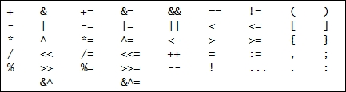

# 第一章：准备...开始...Go！

设计模式已经成为数以千计的软件基础。自从*四人帮*（Erich Gamma，Richard Helm，Ralph Johnson 和 John Vlissides）在 1994 年用 C++和 Smalltalk 编写了《设计模式：可复用面向对象软件的元素》一书以来，这二十三种经典模式已经在今天的大多数主要语言中重新实现，并且它们已经在你所知道的几乎每个项目中被使用。

*四人帮*发现他们的许多项目中存在许多小型架构，他们开始以更抽象的方式重写它们，并发布了这本著名的书。

这本书是对*四人帮*最常见的设计模式和今天的模式以及一些 Go 中最惯用的并发模式的全面解释和实现。

但 Go 是什么...？

# 一点历史

在过去的 20 年里，我们在计算机科学领域经历了令人难以置信的增长。存储空间大幅增加，RAM 也有了实质性的增长，而 CPU...嗯...就是更快了。它们的增长是否和存储和 RAM 内存一样多？实际上并不是，CPU 行业已经达到了 CPU 可以提供的速度极限，主要是因为它们变得如此快，以至于在散热时无法获得足够的电力。CPU 制造商现在在每台计算机上都提供了更多的核心。这种情况与许多系统编程语言的背景相冲突，这些语言并不是为多处理器 CPU 或充当唯一机器的大型分布式系统而设计的。在 Google，他们意识到这已经不仅仅是一个问题，而是在努力开发像 Java 或 C++这样没有考虑并发性的语言的分布式应用程序时变得更加困难。

与此同时，我们的程序变得更大、更复杂、更难以维护，而且存在很多不良实践的空间。虽然我们的计算机拥有更多的核心并且更快，但我们在开发代码和分布式应用程序时并没有变得更快。这就是 Go 的目标。

Go 设计始于 2007 年，由三名谷歌员工研究一种可以解决像谷歌这样的大规模分布式系统中常见问题的编程语言。创作者是：

+   Rob Pike：Plan 9 和 Inferno 操作系统。

+   Robert Griesemer：曾在谷歌的 V8 JavaScript 引擎工作，该引擎为 Google Chrome 提供动力。

+   Ken Thompson：曾在贝尔实验室和 Unix 团队工作。他参与设计了 Plan 9 操作系统以及 UTF-8 编码的定义。

2008 年，编译器完成了，团队得到了 Russ Cox 和 Ian Lance Taylor 的帮助。团队于 2009 年开始了开源项目的旅程，并在 2012 年 3 月经过 50 多次发布后达到了 1.0 版本。

# 安装 Go

任何 Go 安装都需要两个基本的东西：语言的二进制文件在您的磁盘上的某个位置，以及系统中的**GOPATH**路径，您的项目和您从其他人那里下载的项目将存储在其中。

在接下来的几行中，我们将探讨如何在 Linux、Windows 和 OS X 中安装 Go 二进制文件。有关如何安装最新版本的 Go 的详细说明，您可以参考官方文档[`golang.org/doc/install`](https://golang.org/doc/install)。

## Linux

在 Linux 中安装 Go 有两种选择：

+   **简单选项**：使用你的发行包管理器：

+   RHEL/Fedora/Centos 用户使用 YUM/DNF：`sudo yum install -y golang`

+   Ubuntu/Debian 用户使用 APT：`sudo apt-get install -y golang`

+   **高级**：从[`golang.org`](https://golang.org)下载最新的发行版。

我建议使用第二种方法并下载一个发行版。Go 的更新保持向后兼容性，通常不需要频繁更新 Go 二进制文件。

### Go Linux 高级安装

在 Linux 中高级安装 Go 需要你从**golang**网页下载二进制文件。进入[`golang.org`](https://golang.org)，点击**Download Go**按钮（通常在右侧），每个发行版都有一些**Featured Downloads**选项。选择**Linux**发行版下载最新的稳定版本。

### 注意

在[`golang.org`](https://golang.org)上，您也可以下载语言的 beta 版本。

假设我们已经将`tar.gz`文件保存在 Downloads 文件夹中，所以让我们解压它并将它移动到另一个路径。按照惯例，Go 二进制文件通常放在`/usr/local/go`目录中：

```go
tar -zxvf go*.*.*.linux-amd64.tar.gz
sudo mv go /usr/local/go

```

在提取时，请记住用您下载的版本替换星号（`*`）。

现在我们的 Go 安装在`/usr/local/go`路径中，所以现在我们必须将`bin`子文件夹添加到我们的`PATH`和 GOPATH 中的`bin`文件夹。

```go
mkdir -p $HOME/go/bin

```

使用-p 我们告诉 bash 创建所有必要的目录。现在我们需要将 bin 文件夹路径附加到我们的 PATH，在您的`~/.bashrc`的末尾添加以下行：

```go
export PATH=$PATH:/usr/local/go/bin

```

检查我们的`go/bin`目录是否可用：

```go
$ go version
Go version go1.6.2 linux/amd64

```

## Windows

要在 Windows 中安装 Go，您需要管理员权限。打开您喜欢的浏览器，导航到`https://golang.org`。一旦到达那里，点击**Download Go**按钮，然后选择**Microsoft Windows**发行版。一个`*.msi`文件将开始下载。

双击执行 MSI 安装程序。一个安装程序将出现，要求您接受**最终用户许可协议**（**EULA**）并选择安装的目标文件夹。我们将继续使用默认路径，在我的情况下是`C:\Go`。

安装完成后，您需要将位于`C:\Go\bin`的**二进制 Go**文件夹添加到您的 Path。为此，您必须转到控制面板，并选择**系统**选项。在系统中，选择**高级**选项卡，然后点击**环境变量**按钮。在这里，您会找到当前用户和系统变量的变量窗口。在系统变量中，您会找到**Path**变量。点击它，然后点击**编辑**按钮打开一个文本框。您可以通过在当前行的末尾添加`;C:\Go/bin`来添加您的路径（注意路径开头的分号）。在最近的 Windows 版本（Windows 10）中，您将有一个简单添加变量的管理器。

## Mac OS X

在 Mac OS X 中，安装过程与 Linux 非常相似。打开您喜欢的浏览器，导航到[`golang.org`](https://golang.org)，并点击**Download Go**。从出现的可能的发行版列表中，选择**Apple OS X**。这将在您的下载文件夹中下载一个`*.pkg`文件。

一个窗口将引导您完成安装过程，在这个过程中，您需要输入管理员密码，以便它可以将 Go 二进制文件放在`/usr/local/go/bin`文件夹中，并赋予适当的权限。现在，打开**终端**，通过在终端上输入以下内容来测试安装：

```go
$ go version
Go version go1.6.2 darwin/amd64

```

如果您看到已安装的版本，一切都很好。如果不起作用，请检查您是否正确地按照每个步骤进行了操作，或者参考[`golang.org`](https://golang.org)上的文档。

## 设置工作空间 - Linux 和 Apple OS X

Go 将始终在相同的工作空间下工作。这有助于编译器找到您可能正在使用的包和库。这个工作空间通常被称为**GOPATH**。

在开发 Go 软件时，GOPATH 在您的工作环境中起着非常重要的作用。当您在代码中导入一个库时，它将在您的`$GOPATH/src`中搜索这个库。当您安装一些 Go 应用程序时，二进制文件将存储在`$GOPATH/bin`中。

同时，所有源代码必须存储在`$GOPATH/src`文件夹中的有效路径中。例如，我将我的项目存储在 GitHub 中，我的用户名是*Sayden*，所以，对于一个名为**minimal-mesos-go-framework**的项目，我的文件夹结构将如下所示：`$GOPATH/src/github.com/sayden/minimal-mesos-go-framework`，这反映了此存储库在 GitHub 上存储的 URI。

```go
mkdir -p $HOME/go

```

`$HOME/go`路径将成为我们的`$GOPATH`的目的地。我们必须设置一个环境变量，将我们的`$GOPATH`指向这个文件夹。要设置环境变量，请再次用您喜欢的文本编辑器打开文件`$HOME/.bashrc`，并在其末尾添加以下行：

```go
export GOPATH=${HOME}/go

```

保存文件并打开一个新的终端。要检查一切是否正常工作，只需像这样向`$GOPATH`变量写一个 echo：

```go
echo $GOPATH
/home/mcastro/go

```

如果前面的命令的输出指向您选择的 Go 路径，则一切正确，您可以继续编写您的第一个程序。

# 从 Hello World 开始

如果没有一个 Hello World 示例，这本书就不会是一本好书。我们的 Hello World 示例不能更简单，打开您喜欢的文本编辑器，在我们的`$GOPATH/src/[your_name]/hello_world`中创建一个名为`main.go`的文件，内容如下：

```go
package main 

func main(){ 
println("Hello World!") 
} 

```

保存文件。要运行我们的程序，请打开操作系统的终端窗口：

+   在 Linux 中，转到程序并找到一个名为**Terminal**的程序。

+   在 Windows 中，按下 Windows + R，键入`cmd`（不带引号）在新窗口中按*Enter*。

+   在 Mac OS X 中，按 Command + Space 打开聚光灯搜索，键入`terminal`（不带引号）。终端应用程序必须被突出显示，然后按 Enter。

一旦我们在终端中，导航到我们创建`main.go`文件的文件夹。这应该在您的`$GOPATH/src/[your_name]/hello_world`下，并执行它：

```go
go run main.go
Hello World!

```

这就是全部。`go run [file]`命令将编译并执行我们的应用程序，但不会生成可执行文件。如果只想构建它并获得一个可执行文件，您必须使用以下命令构建应用程序：

```go
go build -o hello_world

```

什么也没有发生。但是，如果在当前目录中搜索（在 Linux 和 Mac OS X 中使用`ls`命令，在 Windows 中使用`dir`命令），您将找到一个名为`hello_world`的可执行文件。我们在构建时给可执行文件命名为`-o hello_world`。现在您可以执行此文件：

```go
/hello_world
Hello World!

```

我们的消息出现了！在 Windows 中，您只需要键入`.exe`文件的名称即可获得相同的结果。

### 提示

`go run [my_main_file.go]`命令将构建并执行应用程序，而不生成中间文件。`go build -o [filename]`命令将创建一个可执行文件，我可以随身携带，没有依赖关系。

# 集成开发环境 - IDE

**IDE**（集成开发环境）基本上是一个用户界面，它通过提供一组工具来加快开发过程中的常见任务，如编译、构建或管理依赖项，来帮助开发人员编写他们的程序。IDE 是强大的工具，需要一些时间来掌握，而本书的目的并不是解释它们（像 Eclipse 这样的 IDE 有自己的书籍）。

在 Go 中，您有许多选择，但只有两个是完全面向 Go 开发的**LiteIDE**和**Intellij Gogland**。LiteIDE 虽然不是最强大的，但 Intellij 已经付出了很多努力，使 Gogland 成为一个非常好的编辑器，具有完成、调试、重构、测试、可视化覆盖、检查等功能。以下是具有 Go 插件/集成的常见 IDE 或文本编辑器：

+   IntelliJ Idea

+   Sublime Text 2/3

+   Atom

+   Eclipse

但您也可以找到以下 Go 插件：

+   Vim

+   Visual Studio 和 Visual Code

截至撰写本文时，IntelliJ Idea 和 Atom IDE 具有使用名为**Delve**的插件进行调试的支持。IntelliJ Idea 捆绑了官方的 Go 插件。在 Atom 中，您必须下载一个名为**Go-plus**的插件和一个调试器，您可以通过搜索单词`Delve`找到。

# 类型

类型使用户能够使用助记符名称存储值。所有编程语言都有与数字相关的类型（用于存储整数、负数或浮点数，例如）与字符相关的类型（用于存储单个字符）与字符串相关的类型（用于存储完整的单词）等。Go 语言具有大多数编程语言中常见的类型：

+   `bool`关键字是布尔类型，表示`True`或`False`状态。

+   许多数字类型是最常见的：

+   `int`类型在 32 位机器上表示从 0 到 4294967295 的数字，在 64 位机器上表示从 0 到 18446744073709551615 的数字。

+   `byte`类型表示从 0 到 255 的数字。

+   `float32`和`float64`类型分别是所有 IEEE-754 64/-位浮点数的集合。

+   您还有`signed int`类型，如`rune`，它是`int32`类型的别名，表示从-2147483648 到 2147483647 的数字，以及`complex64`和`complex128`，它们是所有具有`float32`/`float64`实部和虚部的复数的集合，例如*2.0i*。

+   `string`关键字表示字符串类型，表示用引号括起来的字符数组，例如`"golang"`或`"computer"`。

+   `array`是单一类型和固定大小的元素的编号序列（本章后面会详细介绍数组）。一组数字或具有固定大小的单词列表被认为是数组。

+   `slice`类型是底层数组的一个段（本章后面会详细介绍）。这种类型在开始时有点令人困惑，因为它看起来像一个数组，但实际上，它们更强大。

+   结构是由其他对象或类型组成的对象。

+   指针（本章后面会详细介绍）就像程序内存中的方向（是的，就像你不知道里面装了什么的邮箱）。

+   函数很有趣（本章后面会详细介绍）。您还可以将函数定义为变量，并将它们传递给其他函数（是的，一个使用函数的函数，你喜欢《盗梦空间》电影吗？）。

+   `interface`对于语言来说非常重要，因为它们提供了许多封装和抽象功能，这些功能我们经常需要。我们将在本书中广泛使用接口，并在后面更详细地介绍它们。

+   `map`类型是无序的键值结构。因此，对于给定的键，您有一个关联的值。

+   通道是 Go 语言中用于并发程序的通信原语。我们将在第八章《处理 Go 的 CSP 并发》中更详细地了解通道。

# 变量和常量

变量是计算机内存中的空间，用于存储在程序执行期间可以修改的值。变量和常量具有与前文描述的类型相同的类型。尽管如此，您不需要显式地编写它们的类型（尽管您可以这样做）。避免显式类型声明的这种属性称为**推断类型**。例如：

```go
    //Explicitly declaring a "string" variable 
    var explicit string = "Hello, I'm a explicitly declared variable" 

```

在这里，我们声明了一个名为`explicit`的字符串类型变量（使用关键字`var`）。同时，我们将值定义为`Hello World!`。

```go
    //Implicitly declaring a "string". Type inferred 
inferred := ", I'm an inferred variable " 

```

但在这里，我们做的事情完全相同。我们避免了`var`关键字和`string`类型声明。Go 的编译器会内部推断（猜测）变量的类型为字符串类型。这样，您就不必为每个变量定义编写更少的代码。

以下行使用`reflect`包来收集有关变量的信息。我们使用它来打印代码中的`TypeOf`变量的类型。

```go
    fmt.Println("Variable 'explicit' is of type:", 
        reflect.TypeOf(explicit)) 
    fmt.Println("Variable 'inferred' is of type:", 
        reflect.TypeOf(inferred)) 

```

当我们运行程序时，结果如下：

```go
$ go run main.go
Hello, I'm a explicitly declared variable
Hello, I'm an inferred variable
Variable 'explicit' is of type: string
Variable 'inferred' is of type: string

```

正如我们所预期的，编译器也将隐式变量的类型推断为字符串。两者都已将预期的输出写入控制台。

# 运算符

运算符用于执行算术运算并在许多事物之间进行比较。以下运算符由 Go 语言保留。



最常用的运算符是算术运算符和比较运算符。算术运算符如下：

+   用于求和的`+`运算符

+   `-`运算符用于减法

+   `*`运算符用于乘法

+   `/`运算符用于除法

+   `%`运算符用于除法余数

+   `++`运算符用于将当前变量加 1

+   `--`运算符用于从当前变量中减去 1

另一方面，比较器用于检查两个语句之间的差异：

+   `==`运算符用于检查两个值是否相等

+   `!=`运算符用于检查两个值是否不同

+   `>`运算符用于检查左值是否大于右值

+   `<`运算符用于检查左值是否小于右值

+   `>=`运算符用于检查左值是否大于或等于右值

+   `<=`运算符用于检查左值是否小于或等于右值

+   `&&`运算符用于检查两个值是否为`true`

你还有移位器来对值进行左移或右移的二进制移位，以及一个取反操作符来反转一些值。在接下来的章节中，我们将大量使用这些运算符，所以现在不要太担心它们，只要记住你不能在你的代码中像这些运算符那样设置任何变量、字段或函数的名称。

### 提示

10 的倒数值是多少？10 的负值是多少？-10？不正确。10 在二进制代码中是`1010`，所以如果我们对每个数字取反，我们将得到`0101`或`101`，这是数字 5。

# 流程控制

流程控制是指在条件下决定代码的哪一部分或多少次执行某些代码的能力。在 Go 中，它是使用熟悉的命令式子句如 if、else、switch 和 for 来实现的。语法很容易理解。让我们来回顾一下 Go 中的主要流程控制语句。

## if... else 语句

Go 语言，像大多数编程语言一样，有用于流程控制的`if…else`条件语句。语法与其他语言类似，但你不需要在括号中封装条件：

```go
ten := 10 
if ten == 20 { 
    println("This shouldn't be printed as 10 isn't equal to 20") 
} else { 
    println("Ten is not equals to 20"); 
} 

```

`else...if`条件以类似的方式工作，你也不需要括号，它们被声明为程序员所期望的那样：

```go
if "a" == "b" ||  10 == 10 || true == false { 
    println("10 is equal to 10") 
  } else if 11 == 11 &&"go" == "go" { 
  println("This isn't print because previous condition was satisfied"); 
    } else { 
        println("In case no condition is satisfied, print this") 
    } 
} 

```

### 注意

Go 没有像`condition ? true : false`这样的三元条件。

## switch 语句

`switch`语句也与大多数命令式语言类似。你取一个变量并检查可能的值：

```go
number := 3 
switch(number){ 
    case 1: 
        println("Number is 1") 
    case 2: 
        println("Number is 2") 
    case 3: 
        println("Number is 3") 
} 

```

## for…range 语句

`_for_`循环也与常见的编程语言类似，但你也不使用括号

```go
for i := 0; i<=10; i++ { 
    println(i) 
} 

```

如果你有计算机科学背景，你可能已经想象到了，我们推断出一个定义为`0`的`int`变量，并在括号中执行代码，同时条件（`i<=10`）得到满足。最后，对于每次执行，我们将`i`的值加 1。这段代码将打印出从 0 到 10 的数字。你还有一个特殊的语法来遍历数组或切片，即`range`：

```go
for index, value := range my_array { 
    fmt.Printf("Index is %d and value is %d", index, value) 
} 

```

首先，`fmt`（格式）是一个非常常见的 Go 包，我们将广泛使用它来给控制台中打印的消息赋予形状。

关于 for，你可以使用`range`关键字来检索集合中的每个项目，比如`my_array`，并将它们分配给临时变量的值。它还会给你一个`index`变量来知道你正在检索的值的位置。它相当于写下面的内容：

```go
for index := 0, index < len(my_array); index++ { 
    value := my_array[index] 
    fmt.Printf("Index is %d and value is %d", index, value) 
} 

```

### 提示

`len`方法用于知道集合的长度。

如果你执行这段代码，你会发现结果是一样的。

# 函数

函数是围绕你想要执行的某些操作的一小部分代码，并返回一个或多个值（或者什么也不返回）。它们是开发人员维护结构、封装和代码可读性的主要工具，但也允许有经验的程序员对他或她的函数进行适当的单元测试。

函数可以非常简单，也可以非常复杂。通常，你会发现简单的函数也更容易维护、测试和调试。在计算机科学世界中也有一个非常好的建议，那就是：*一个函数必须只做一件事，但必须做得非常好*。

## 函数是什么样子的？

函数是一段代码，有自己的变量和流程，不会影响到开放和关闭括号之外的任何东西，但会影响全局包或程序变量。Go 语言中的函数具有以下组成部分：

```go
func [function_name] (param1 type, param2 type...) (returned type1, returned type2...) { 
    //Function body 
} 

```

根据前面的定义，我们可以有以下例子：

```go
func hello(message string) error { 
    fmt.Printf("Hello %s\n", message) 
    return nil 
} 

```

函数可以调用其他函数。例如，在我们之前的`hello`函数中，我们接收一个类型为字符串的消息参数，并调用一个不同的函数`fmt.Printf("Hello %s\n", message)`并将我们的参数作为参数。函数也可以在调用其他函数时用作参数，或者被返回。

为你的函数选择一个好的名字非常重要，这样它就非常清楚它是关于什么的，而不需要写太多的注释。这可能看起来有点琐碎，但选择一个好的名字并不容易。一个简短的名字必须显示函数的功能，并让读者想象它正在处理什么错误，或者是否在进行任何类型的日志记录。在你的函数中，你希望做任何特定行为需要的一切，但也要控制预期的错误并适当地包装它们。

因此，编写函数不仅仅是简单地写出几行代码来完成你需要的功能，这就是为什么编写单元测试、使它们小而简洁是很重要的。

## 什么是匿名函数？

匿名函数是没有名字的函数。当你想要从另一个函数返回一个不需要上下文的函数，或者当你想要将一个函数传递给另一个函数时，这是很有用的。例如，我们将创建一个接受一个数字并返回一个接受第二个数字并将其加到第一个数字的函数。第二个函数没有声明的名称（因为我们将其分配给一个变量），所以它被称为匿名函数：

```go
func main(){ 
    add := func(m int){ 
         return m+1 
} 

    result := add(6) 

    //1 + 6 must print 7 
    println(result) 
} 

```

`add`变量指向一个匿名函数，该函数将指定参数加一。正如你所看到的，它只能在其父函数`main`的作用域中使用，不能从其他任何地方调用。

匿名函数是非常强大的工具，在设计模式中我们会广泛使用它们。

## 闭包

闭包与匿名函数非常相似，但更加强大。它们之间的关键区别在于匿名函数在自身内部没有上下文，而闭包有。让我们重新编写前面的例子，以便添加任意数量而不是一个：

```go
func main(){ 
    addN := func(m int){ 
        return func(n int){ 
            return m+n 
        }            
    } 

    addFive := addN(5) 
    result := addN(6)  
    //5 + 6 must print 7 

    println(result) 
}
```

`addN`变量指向一个返回另一个函数的函数。但是返回的函数在其中具有`m`参数的上下文。每次调用`addN`都会创建一个具有固定`m`值的新函数，因此我们可以有主`addN`函数，每个函数都添加不同的值。

闭包的这种能力非常有用，可以用来创建库或处理不支持类型的函数。

## 创建错误，处理错误和返回错误。

错误在 Go 中被广泛使用，可能是因为它的简单性。要创建一个错误，只需调用`errors.New(string)`并提供你想要在错误中创建的文本。例如：

```go
err := errors.New("Error example") 

```

正如我们之前所见，我们可以向函数返回错误。在 Go 代码中，你会经常看到以下模式来处理错误：

```go
func main(){ 
    err := doesReturnError() 
    if err != nil { 
        panic(err) 
    } 
} 

func doesReturnError() error { 
    err := errors.New("this function simply returns an error") 
    return err 
} 

```

## 具有不确定数量参数的函数

函数可以声明为*可变参数*。这意味着它的参数数量可以变化。这样做的作用是为函数的作用域提供一个包含函数调用时使用的参数的数组。如果你不想在使用这个函数时强制用户提供一个数组，这是很方便的。例如：

```go
func main() { 
    fmt.Printf("%d\n", sum(1,2,3)) 
    fmt.Printf("%d\n", sum(4,5,6,7,8)) 
} 

func sum(args ...int) (result int) { 
    for _, v := range args { 
        result += v 
    } 
    return 
} 

```

在这个例子中，我们有一个`sum`函数，它将返回所有参数的总和，但是仔细看一下我们在`main`函数中调用`sum`的地方。现在你可以看到，首先我们用三个参数调用`sum`，然后用五个参数调用。对于`sum`函数来说，你传递多少参数都无所谓，因为它将其参数视为一个数组。因此，在我们的`sum`定义中，我们只是遍历数组，将每个数字加到`result`整数上。

### 命名返回类型

你是否意识到我们给返回类型取了一个名字？通常，我们的声明会写成`func sum(args int) int`，但你也可以给你在函数中用作返回值的变量取一个名字。在返回类型中命名变量也会将其零值化（在这种情况下，一个`int`会被初始化为零）。最后，你只需要返回函数（无需值），它就会取相应的变量作为返回值。这也更容易跟踪返回变量所经历的变化，以及确保你没有返回一个经过变异的参数。

# 数组、切片和映射

数组是计算机编程中最常用的类型之一。它们是可以通过它们在列表中的位置访问的其他类型的列表。数组的唯一缺点是它的大小不能被修改。切片允许使用大小可变的数组。`maps`类型将让我们在 Go 中拥有类似字典的结构。让我们看看每个是如何工作的。

## 数组

数组是单一类型元素的编号序列。您可以在一个唯一的变量中存储 100 个不同的无符号整数，三个字符串或 400 个布尔值。它们的大小不能被改变。

你必须在创建数组时声明数组的长度以及类型。你也可以在创建时赋值。例如，这里有 100 个值为`0`的`int`值：

```go
var arr [100]int 

```

或者一个大小为 3 的`strings`数组已经被赋值：

```go
arr := [3]string{"go", "is", "awesome"} 

```

这里有一个我们稍后初始化的包含 2 个布尔值的数组：

```go
var arr [2]bool 
arr[0] = true 
arr[1] = false 

```

### 零初始化

在我们之前的例子中，我们初始化了一个大小为 2 的布尔值数组。我们不需要将`arr[1]`赋值为`false`，因为语言的零初始化特性。Go 将会将布尔数组中的每个值初始化为`false`。我们稍后会更深入地了解零初始化。

## 切片

切片类似于数组，但它们的大小可以在运行时改变。这得益于切片的底层结构是一个数组。因此，就像数组一样，你必须指定切片的类型和大小。因此，使用以下行来创建一个切片：

```go
mySlice := make([]int, 10) 

```

这个命令创建了一个包含十个元素的基础数组。如果我们需要改变切片的大小，例如添加一个新的数字，我们可以将数字附加到切片上：

```go
mySlice := append(mySlice, 5) 

```

append 的语法是（[要附加项的数组]，[要附加的项]），并返回新的切片，它不会修改实际的切片。删除项也是如此。例如，让我们删除数组的第一个项如下：

```go
mySlice := mySlice[1:] 

```

是的，就像数组一样。但是删除第二个项呢？我们使用相同的语法：

```go
mySlice = append(mySlice[:1], mySlice[2:]...) 

```

我们取从零索引（包括）到第一个索引（不包括）的所有元素，以及从第二个索引（包括）到数组末尾的每个元素，有效地删除了切片中第二个位置的值（索引 1，因为我们从 0 开始计数）。正如你所看到的，我们使用了未确定参数的语法作为第二个参数。

## 映射

映射就像字典一样——对于每个单词，我们有一个定义，但我们可以使用任何类型作为单词或定义，它们永远不会按字母顺序排序。我们可以创建指向数字的字符串映射，指向`interfaces`的字符串映射，指向`int`和`int`到`function`的`structs`映射。你不能使用切片、函数和映射作为键。最后，你可以使用关键字`make`来创建映射，并指定键类型和值类型：

```go
myMap := make(map[string]int) 
myMap["one"] = 1 
myMap["two"] = 2 
fmt.Println(myMap["one"]) 

```

在解析 JSON 内容时，您还可以使用它们来获取`string[interface]`映射：

```go
myJsonMap := make(map[string]interface{}) 
jsonData := []byte(`{"hello":"world"}`) 
err := json.Unmarshal(jsonData, &myJsonMap) 
if err != nil { 
panic(err) 
} 
fmt.Printf("%s\n", myJsonMap["hello"]) 

```

`myJsonMap`变量是一个将存储 JSON 内容并且我们需要将其指针传递给`Unmarshal`函数的映射。 `jsonData`变量声明了一个字节数组，其中包含 JSON 对象的典型内容；我们将其用作模拟对象。然后，我们解析 JSON 的内容，将结果存储在`myJsonMap`变量的内存位置。在检查转换是否正确以及 JSON 字节数组没有语法错误后，我们可以以类似 JSON 的语法访问映射的内容。

# 可见性

可见性是函数或变量可见于程序不同部分的属性。因此，变量只能在声明的函数中使用，在整个包中使用或在整个程序中使用。

如何设置变量或函数的可见性？嗯，一开始可能会有点混乱，但实际上并不复杂：

+   大写定义是公共的（在整个程序中可见）。

+   小写是私有的（在包级别不可见），函数定义（函数内的变量）只在函数范围内可见。

在这里，您可以看到一个`public`函数的示例：

```go
package hello 

func Hello_world(){ 
    println("Hello World!") 
} 

```

在这里，`Hello_world`是一个全局函数（在整个源代码和代码的第三方用户中可见的函数）。因此，如果我们的包叫做`hello`，我们可以通过使用“hello.Hello_world（）”方法从包外调用这个函数。

```go
package different_package 

import "github.com/sayden/go-design-patters/first_chapter/hello" 

func myLibraryFunc() { 
hello.Hello_world() 
} 

```

正如您所看到的，我们在`different_package`包中。我们必须使用关键字 import 导入我们想要使用的包。然后路径就是包含我们要查找的包的路径在您的$GOPATH/src 中。这个路径方便地匹配了 GitHub 账户或任何其他**Concurrent Versions System**（**CVS**）存储库的 URL。

# 零初始化

零初始化有时会引起混淆。它们是许多类型的默认值，即使您没有为定义提供值，它们也会被赋值。以下是各种类型的零初始化：

+   对于`bool`类型使用`false`初始化。

+   对于`int`类型使用`0`值。

+   对于`float`类型使用`0.0`。

+   对于`string`类型使用“”（空字符串）。

+   对于指针、函数、接口、切片、通道和映射使用`nil`关键字。

+   对于没有字段的结构使用空`struct`。

+   对于具有字段的结构，零初始化的`struct`。结构的零值被定义为其字段也被初始化为零值的结构。

在 Go 中编程时，零初始化是重要的，因为如果您必须返回一个`int`类型或一个`struct`，您将无法返回一个`nil`值。例如，在必须返回一个`bool`值的函数中，请记住这一点。想象一下，您想知道一个数字是否能被另一个数字整除，但您将`0`（零）作为除数。

```go
func main() { 
    res := divisibleBy(10,0) 
    fmt.Printf("%v\n", res) 
} 

func divisibleBy(n, divisor int) bool { 
    if divisor == 0 { 
        //You cannot divide by zero 
        return false 
    } 

    return (n % divisor == 0) 
} 

```

这个程序的输出是`false`，但这是不正确的。被零除的数字是一个错误，不是 10 不能被零整除，而是根据定义，一个数字不能被零整除。零初始化在这种情况下使事情变得尴尬。那么，我们如何解决这个错误呢？考虑以下代码：

```go
func main() { 
    res, err := divisibleBy(10,0) 
    if err != nil { 
log.Fatal(err) 
    } 

    log.Printf("%v\n", res) 
} 

func divisibleBy(n, divisor int) (bool, error) { 
    if divisor == 0 { 
        //You cannot divide by zero 
        return false, errors.New("A number cannot be divided by zero") 
    } 

    return (n % divisor == 0), nil 
} 

```

我们再次将`10`除以`0`，但现在这个函数的输出是“一个数字不能被零整除”。错误被捕获，程序优雅地结束了。

# 指针和结构

指针是每个 C 或 C++程序员头痛的主要原因。但它们是非垃圾收集语言中实现高性能代码的主要工具之一。幸运的是，对于我们来说，Go 的指针通过提供具有垃圾收集器功能和易用性的高性能指针，实现了两全其美。

另一方面，对于它的批评者来说，Go 缺乏继承，而更倾向于组合。与其谈论在 Go 中 *是* 的对象，不如谈论你的对象 *有其他的*。所以，你可以有一个包含 `car` 结构的 `vehicle` 结构，而不是一个继承类 `vehicle` 的 `car` 结构（汽车是一种车辆）。

## 指针是什么？为什么它们很好？

指针同时受到憎恨、喜爱和非常有用。理解指针是什么可能很困难，所以让我们试着用一个现实世界的解释。正如我们在本章前面提到的，指针就像一个邮箱。想象一栋建筑里有一堆邮箱；它们都有相同的大小和形状，但每个邮箱都指向建筑物内的不同房子。只是因为所有邮箱的大小都一样，并不意味着每个房子都有相同的大小。我们甚至可以有几栋房子连接在一起，一个曾经存在但现在拥有商业许可的房子，或者一个完全空的房子。所以指针就是邮箱，它们都是相同大小的，指向一个房子。建筑物是我们的内存，房子是我们的指针引用的类型和它们分配的内存。如果你想在你的房子里收到一些东西，只需简单地发送你的房子的地址（发送指针）而不是发送整个房子，这样你的包裹就被放在里面了。但它们也有一些缺点，比如如果你发送了你的地址，然后你的房子（它引用的变量）在发送后消失了，或者它的类型所有者发生了变化——你就会陷入麻烦。

这有什么用？想象一下，你以某种方式有一个 4 GB 的变量，你需要将它传递给另一个函数。没有指针，整个变量都会被克隆到将要使用它的函数的范围内。所以，你将有 8 GB 的内存被使用，通过两次使用这个变量，希望第二个函数不会再在另一个函数中使用它，以进一步增加这个数字。

你可以使用指针将一个非常小的引用传递给第一个函数，这样只需克隆一个小引用，就可以保持内存使用量较低。

虽然这不是最学术的、也不是最准确的解释，但它给出了指针是什么的一个很好的观点，而不解释堆栈或堆在 x86 架构中是如何工作的。

与 C 或 C++ 指针相比，Go 中的指针非常有限。你不能使用指针算术，也不能创建一个指向栈中确切位置的指针。

在 Go 中，指针可以这样声明：

```go
number := 5 

```

这里的 `number := 5` 代码表示我们的 4 GB 变量，`pointer_to_number` 包含对此变量的引用（用 & 表示）。这是指向变量的方向（你放在这个 `house/type/variable` 的邮箱里）。让我们打印变量 `pointer_to_number`，这是一个简单的变量：

```go
println(pointer_to_number) 
0x005651FA 

```

那个数字是什么？嗯，是我们内存中变量的方向。我如何打印房子的实际值？嗯，通过一个星号（`*`），我们告诉编译器取指针引用的值，也就是我们的 4 GB 变量。

```go
 println(*pointer_to_number) 
5 

```

## 结构

结构是 Go 中的一个对象。它与面向对象编程中的类有一些相似之处，因为它们有字段。结构可以实现接口并声明方法。但是，例如，在 Go 中，没有继承。缺乏继承看起来是有限的，但实际上，*组合优于继承* 是这种语言的要求。

要声明一个结构，你必须用关键字 `type` 作为前缀，用关键字 `struct` 作为后缀，然后在括号之间声明任何字段或方法，例如：

```go
type Person struct { 
    Name string 
    Surname string 
    Hobbies []string 
    id string 
} 

```

在这段代码中，我们声明了一个`Person`结构，其中有三个公共字段（`Name`，`Age`和`Hobbies`）和一个私有字段（`id`，如果你回忆一下本章的*可见性*部分，Go 中的小写字段指的是私有字段，只在同一个包内可见）。有了这个`struct`，我们现在可以创建任意多个`Person`的实例。现在我们将编写一个名为`GetFullName`的函数，该函数将给出`struct`所属的名字和姓氏的组合：

```go
func (person *Person) GetFullName() string { 
    return fmt.Sprintf("%s %s", person.Name, person.Surname) 
} 

func main() { 
    p := Person{ 
        Name: "Mario", 
        Surname: "Castro", 
        Hobbies: []string{"cycling", "electronics", "planes"}, 
        id: "sa3-223-asd", 
    } 

    fmt.Printf("%s likes %s, %s and %s\n", p.GetFullName(), p.Hobbies[0], p.Hobbies[1], p.Hobbies[2]) 
} 

```

方法的定义方式与函数类似，但略有不同。有一个`(p *Person)`，它指的是指向`struct`创建的实例的指针（回忆一下本章的*指针*部分）。这就像在 Java 中使用关键字`this`或在 Python 中引用指向对象时使用`self`一样。

也许你在想为什么(`p *Person`)有指针运算符来反映`p`实际上是一个指针而不是一个值？这是因为你也可以通过删除指针签名来传递 Person 的值。在这种情况下，将传递 Person 值的副本给函数。这有一些影响，例如，如果你通过值传递 p 进行更改，那么在源`p`中不会反映出这些更改。但是我们的`GetFullName()`方法呢？

```go
func (person Person) GetFullName() string { 
    return fmt.Sprintf("%s %s", person.Name, person.Surname) 
} 

```

它的控制台输出在外观上没有影响，但在评估函数之前进行了完全复制。但是，如果我们在这里修改`person`，源`p`不会受到影响，新的`person`值只会在此函数的范围内可用。

在`main`函数中，我们创建了一个名为`p`的结构的实例。正如你所看到的，我们使用了隐式表示法来创建变量（`:=`符号）。要设置字段，你必须引用字段的名称，冒号，值和逗号（不要忘记最后的逗号！）。要访问实例化结构的字段，我们只需通过它们的名称引用它们，如`p.Name`或`p.Surname`。你可以使用相同的语法来访问结构的方法，如`p.GetFullName()`。

该程序的输出是：

```go
$ go run main.go 
Mario Castro likes cycling, electronics and planes

```

结构也可以包含另一个结构（组合）并实现接口方法，除了它们自己的方法之外，但是，什么是接口方法？

# 接口

接口在面向对象编程、函数式编程（`traits`）以及设计模式中至关重要。Go 的源代码中到处都是接口，因为它们提供了通过函数提供所需的抽象来交付无耦合的代码。作为程序员，当你编写库时，也需要这种类型的抽象，但也需要在编写将来需要新功能维护的代码时使用这种抽象。

接口在开始时很难理解，但一旦理解了它们的行为并为常见问题提供了非常优雅的解决方案，就会变得非常容易。我们将在本书中广泛使用它们，因此请特别关注本节。

## 接口 - 签署合同

接口是一种非常简单但强大的东西。它通常被定义为实现它的对象之间的合同，但对于接口世界的新手来说，这种解释并不够清晰。

水管也是一种合同；你通过它传递的任何东西都必须是液体。任何人都可以使用这根管子，管子将运输你放入其中的任何液体（而不知道其内容）。水管是强制要求用户必须传递液体（而不是其他东西）的接口。

让我们考虑另一个例子：火车。火车的铁轨就像一个接口。火车必须使用指定的值构建（实现）其宽度，以便它可以进入铁路，但铁路永远不知道它究竟装载了什么（乘客或货物）。因此，例如，铁路的接口将具有以下方面：

```go
type RailroadWideChecker interface { 
    CheckRailsWidth() int 
} 

```

`RailroadWideChecker`是我们的火车必须实现的类型，以提供有关其宽度的信息。火车将验证火车的宽度是否过宽或过窄以使用其铁路：

```go
type Railroad struct { 
    Width int 
} 

func (r *Railroad) IsCorrectSizeTrain(r RailRoadWideChecker) bool { 
    return r.CheckRailsWidth() != r.Width 
} 

```

`铁路`由一个虚构的车站对象实现，该对象包含有关该车站铁路宽度的信息，并具有一个方法来检查火车是否符合铁路的需求，即`IsCorrectSizeTrain`方法。`IsCorrectSizeTrain`方法接收一个实现了该接口的火车的指针，并返回火车宽度与铁路之间的验证：

```go
Type Train struct { 
    TrainWidth int 
} 

func (p *Train) CheckRailsWidth() int { 
    return p.TrainWidth 
} 

```

现在我们已经创建了一列乘客列车。它有一个字段来包含其宽度，并实现了我们的`CheckRailsWidth`接口方法。这个结构被认为满足`RailRoadWideChecker`接口的需求（因为它实现了接口要求的方法）。

现在，我们将创建一个宽度为`10`个单位的铁路和两列火车--一列宽度为`10`个单位的火车符合铁路尺寸，另一列宽度为`15`个单位的火车无法使用铁路。

```go
func main(){ 
    railroad := Railroad{Width:10} 

    passengerTrain := Train{TrainWidth: 10} 
    cargoTrain := Train {TrainWidth: 15} 

    canPassengerTrainPass := railroad.IsCorrectSizeTrain(passengerTrain) 
    canCargoTrainPass := railroad.IsCorrectSizeTrain(cargoTrain) 

    fmt.Printf("Can passenger train pass? %b\n", canPassengerTrainPass) 
    fmt.Printf("Can cargo train pass? %b\n", canCargoTrainPass) 
} 

```

让我们解析这个`main`函数。首先，我们创建了一个名为`railroad`的宽度为`10`个单位的铁路对象。然后，分别为乘客和货物创建了宽度为`10`和`15`个单位的两列火车。然后，我们将这两个对象传递给接受`RailroadWideChecker`接口的铁路方法。铁路本身不知道每列火车的宽度（我们将有一个巨大的火车列表），但它有一个火车必须实现的接口，以便它可以询问每个宽度并返回一个值，告诉您火车是否可以或不能使用铁路。最后，对`printf`函数的调用输出如下：

```go
Can passenger train pass? true
Can cargo train pass? false

```

正如我之前提到的，接口在本书中被广泛使用，所以即使对读者来说它看起来仍然很困惑，因为在本书中将有大量的例子。

# 测试和 TDD

当您编写某个库的第几行时，很难引入许多错误。但是一旦源代码变得越来越大，就会变得更容易出错。团队壮大了，现在有很多人在编写相同的源代码，新功能是在您最初编写的代码之上添加的。现在，由于某个函数的某些修改，代码停止工作，现在没有人能够追踪到。

这是企业中测试试图减少的常见情况（它并不能完全解决问题，不是圣杯）。在开发过程中编写单元测试时，您可以检查一些新功能是否破坏了旧功能，或者您当前的新功能是否符合需求中的所有预期。

Go 语言有一个强大的测试包，使您也可以很容易地在 TDD 环境中工作。它还非常方便，可以在不需要编写使用它的整个主应用程序的情况下检查代码的部分。

## 测试包

在每种编程语言中，测试都非常重要。Go 的创建者知道这一点，并决定在核心包中提供所有测试所需的库和包。您不需要任何第三方库进行测试或代码覆盖。

允许测试 Go 应用程序的包称为`testing`。我们将创建一个小应用程序，通过命令行提供两个数字并对其进行求和：

```go
func main() { 
    //Atoi converts a string to an int 
    a, _ := strconv.Atoi(os.Args[1]) 
    b, _ := strconv.Atoi(os.Args[2]) 

    result := sum(a,b) 
    fmt.Printf("The sum of %d and %d is %d\n", a, b, result) 
} 

func sum(a, b int) int { 
    return a + b 
} 

```

让我们在终端中执行我们的程序以得到总和：

```go
$ go run main.go 3 4
The sum of 3 and 4 is 7

```

顺便说一下，我们正在使用`strconv`包将字符串转换为其他类型，这种情况下是转换为`int`。`Atoi`方法接收一个字符串并返回一个`int`和一个`error`，为简单起见，我们在这里忽略了（使用下划线）。

### 提示

如果需要，您可以使用下划线忽略变量返回，但通常不希望忽略错误。

好的，现在让我们编写一个测试，检查求和的正确结果。我们正在创建一个名为`main_test.go`的新文件。按照惯例，测试文件的命名方式与它们测试的文件相同，加上`_test`后缀：

```go
func TestSum(t *testing.T) { 
    a := 5 
    b := 6 
    expected := 11 

    res := sum(a, b) 
    if res != expected { 
        t.Errorf("Our sum function doens't work, %d+%d isn't %d\n", a, b, res) 
    } 
} 

```

在 Go 中进行测试是通过编写以前缀`Test`开头的方法，一个测试名称和名为`t`的`testing.T`指针的注入来完成的。与其他语言相反，在 Go 中没有断言，也没有用于测试的特殊语法。您可以使用 Go 语法来检查错误，并在失败时使用`t`调用有关错误的信息。如果代码在没有出现错误的情况下到达`Test`函数的末尾，则该函数已通过测试。

要在 Go 中运行测试，您必须使用`go test -v`命令（`-v`是为了从测试中接收详细输出）关键字，如下所示：

```go
$ go test -v
=== RUN   TestSum
--- PASS: TestSum (0.00s)
PASS
ok   github.com/go-design-patterns/introduction/ex_xx_testing 0.001s

```

我们的测试是正确的。让我们看看如果我们故意破坏事情并将测试的预期值从`11`改为`10`会发生什么：

```go
$ go test
--- FAIL: TestSum (0.00s)
 main_test.go:12: Our sum function doens't work, 5+6 isn't 10
FAIL
exit status 1
FAIL  github.com/sayden/go-design-patterns/introduction/ex_xx_testing 0.002s

```

测试失败了（正如我们预料的那样）。测试包提供了您在测试中设置的信息。让我们再次使其工作，并检查测试覆盖率。将变量`expected`的值从`10`更改为`11`，然后运行命令`go test -cover`以查看代码覆盖率：

```go
$ go test -cover
PASS
coverage: 20.0% of statements
ok  github.com/sayden/go-design-patterns/introduction/ex_xx_testing 0.001s

```

`-cover`选项为我们提供了有关给定包的代码覆盖率的信息。不幸的是，它不提供有关整体应用程序覆盖率的信息。

## 什么是 TDD？

TDD 是**测试驱动开发**的缩写。它包括在编写函数之前先编写测试（而不是我们之前所做的，先编写`sum`函数，然后再编写`test`函数）。

TDD 改变了编写代码和结构代码的方式，以便可以进行测试（您可以在 GitHub 上找到很多代码，甚至您以前可能编写的代码可能非常难以测试，甚至是不可能的）。

那么，它是如何工作的呢？让我们用一个现实生活的例子来解释一下--想象一下你在夏天，你想要得到一些清凉。你可以建造一个游泳池，把它装满冷水，然后跳进去。但是在 TDD 术语中，步骤将是：

1.  你跳进一个将要建造游泳池的地方（你写一个你知道会失败的测试）。

1.  它很疼...而且你也不酷（是的...测试失败了，正如我们预料的那样）。

1.  你建造了一个游泳池，把它装满冷水（你编写了功能）。

1.  你跳进游泳池（你再次重复第 1 点的测试）。

1.  你现在很冷。太棒了！对象完成了（测试通过）。

1.  去冰箱拿一瓶啤酒到游泳池。喝。双倍的美妙（重构代码）。

所以让我们重复之前的例子，但是用乘法。首先，我们将写下我们要测试的函数的声明：

```go
func multiply(a, b int) int { 
    return 0 
} 

```

现在让我们编写一个测试，检查之前函数的正确结果：

```go
import "testing" 

func TestMultiply(t *testing.T) { 
    a := 5 
    b := 6 
    expected := 30 

    res := multiply(a, b) 
    if res != expected { 
        t.Errorf("Our multiply function doens't work, %d*%d isn't %d\n", a, b, res) 
    } 
} 

```

然后我们通过命令行进行测试：

```go
$ go test
--- FAIL: TestMultiply (0.00s)
main_test.go:12: Our multiply function doens't work, 5+6 isn't 0
FAIL
exit status 1
FAIL    github.com/sayden/go-designpatterns/introduction/ex_xx_testing/multiply 
0.002s

```

很好。就像在我们的游泳池例子中水还没有到位一样，我们的函数返回的值也是不正确的。所以现在我们有了一个函数声明（但还没有定义），以及失败的测试。现在我们必须通过编写函数并执行测试来使测试通过以检查：

```go
func multiply(a, b int) int { 
 return a*b 
} 

```

然后我们再次执行我们的测试套件。在正确编写我们的代码之后，测试应该通过，这样我们就可以继续进行重构过程：

```go
$ go test
PASS
ok      github.com/sayden/go-design-patterns/introduction/ex_xx_testing/multiply    
0.001s

```

太棒了！我们已经按照 TDD 开发了`multiply`函数。现在我们必须重构我们的代码，但我们不能使它更简单或更可读，所以循环可以被认为是封闭的。

在本书中，我们将编写许多测试，定义我们在模式中要实现的功能。TDD 促进了封装和抽象（就像设计模式一样）。

# 库

到目前为止，我们大多数的例子都是应用程序。应用程序由其`main`函数和包定义。但是在 Go 中，您也可以创建纯库。在库中，包的名称不需要被称为 main，也不需要`main`函数。

由于库不是应用程序，因此无法使用它们构建二进制文件，您需要使用将使用它们的`main`包。

例如，让我们创建一个算术库，对整数执行常见操作：求和、减法、乘法和除法。我们不会深入讨论实现的细节，而是专注于 Go 库的特殊之处：

```go
package arithmetic 

func Sum(args ...int) (res int) { 
    for _, v := range args { 
        res += v 
    } 
    return 
} 

```

首先，我们需要为我们的库命名；我们通过为整个包命名来设置这个名称。这意味着此文件夹中的每个文件也必须具有此包名称，所有文件组成的整个库在这种情况下也被称为**arithmetic**（因为它只包含一个包）。这样，我们就不需要引用此库的文件名，只需提供库名称和路径即可导入和使用它。我们定义了一个`Sum`函数，它接受您需要的任意数量的参数，并返回一个整数，在函数的范围内，它将被称为`res`。这使我们能够将我们返回的值初始化为`0`。我们定义了一个包（不是`main`包，而是一个库包），并将其命名为`arithmetic`。由于这是一个库包，我们无法直接从命令行运行它，因此我们必须为其创建`main`函数或单元测试文件。为了简单起见，我们将创建一个`main`函数，现在运行一些操作，但让我们先完成库：

```go
func Subtract(args ...int) int { 
    if len(args) < 2 { 
        return 0 
    } 

    res := args[0] 
    for i := 1; i < len(args); i++ { 
        res -= args[i] 
    } 
    return res 
} 

```

`Subtraction`代码将在参数数量少于零时返回`0`，如果有两个或更多参数，则返回所有参数的减法：

```go
func Multiply(args ...int) int { 
    if len(args) < 2 { 
        return 0 
    } 

    res := 1 
    for i := 0; i < len(args); i++ { 
        res *= args[i] 
    } 
    return res 
} 

```

`Multiply`函数的工作方式类似。当参数少于两个时，它返回`0`，当参数为两个或更多时，它返回所有参数的乘积。最后，`Division`代码有些变化，因为如果要求它除以零，它将返回一个错误：

```go
func Divide(a, b int) (float64, error) { 
    if b == 0 { 
        return 0, errors.New("You cannot divide by zero") 
    }  
    return float64(a) / float64(b), nil 
} 

```

现在我们的库已经完成，但我们需要一个`main`函数来使用它，因为库不能直接转换为可执行文件。我们的主函数如下所示：

```go
package main 

import ( 
"fmt" 

"bitbucket.org/mariocastro/go-design-patterns/introduction/libraries/arithmetic" 
) 

func main() { 
    sumRes := arithmetic.Sum(5, 6) 
    subRes := arithmetic.Subtract(10, 5) 
    multiplyRes := arithmetic.Multiply(8, 7) 
    divideRes, _ := arithmetic.Divide(10, 2) 

    fmt.Printf("5+6 is %d. 10-5 is %d, 8*7 is %d and 10/2 is %f\n", sumRes, subRes, multiplyRes, divideRes) 
} 

```

我们正在对我们定义的每个函数执行操作。仔细看一下`import`子句。它从与[`bitbucket.org/`](https://bitbucket.org/)中的 URL 匹配的`$GOPATH`中的文件夹中获取我们编写的库。然后，要使用库中定义的每个函数，您必须在每个方法之前命名库的包名称。

### 注意

您是否意识到我们使用大写名称来调用我们的函数？根据我们之前看到的可见性规则，包中的导出函数必须具有大写名称，否则它们将在包的范围之外不可见。因此，根据此规则，您无法在包中调用小写函数或变量，并且包调用将始终后跟大写名称。

让我们回顾一下关于库的一些命名约定：

+   同一文件夹中的每个文件必须包含相同的包名称。文件不需要以任何特殊方式命名。

+   文件夹代表库中的包名称。文件夹名称将用于导入路径，不需要反映包名称（尽管建议为父包）。

+   一个库是一个或多个代表树的包，您通过所有包文件夹的父级导入。

+   您通过包名称调用库中的内容。

# Go get 工具

Go get 是一个从 CVS 存储库获取第三方项目的工具。您可以使用 Go get 而不是使用`git clone`命令来获得一系列的附加好处。让我们以 CoreOS 的 ETCD 项目为例，这是一个著名的分布式键值存储。

CoreOS 的 ETCD 托管在 GitHub 上，网址为[`github.com/coreos/etcd.git`](https://github.com/coreos/etcd.git)。要使用 Go get 工具下载此项目的源代码，我们必须在终端中输入它在 GOPATH 中将具有的导入路径：

```go
$ go get github.com/coreos/etcd

```

请注意，我们只是输入了最相关的信息，以便 Go get 找出其余部分。您将获得一些输出，取决于项目的状态，但之后，它将消失。但发生了什么？

+   Go get 已在`$GOPATH/src/github.com/coreos`中创建了一个文件夹。

+   它已在该位置克隆了项目，因此现在 ETCD 的源代码可在`$GOPATH/src/github.com/coreos/etcd`中使用。

+   Go get 已克隆了 ETCD 可能需要的任何存储库。

+   如果它不是库，它会尝试安装项目。这意味着它已生成了 ETCD 的二进制文件，并将其放在`$GOPATH/bin`文件夹中。

只需键入`go get [project]`命令，您就可以从系统中获取项目的所有材料。然后在您的 Go 应用程序中，您可以通过导入源路径来使用任何库。因此，对于 ETCD 项目，它将是：

```go
import "github.com/coreos/etcd" 

```

非常重要的是，您要熟悉使用 Go get 工具，并在想要从 Git 存储库获取项目时停止使用`git clone`。这将在尝试导入不包含在 GOPATH 中的项目时为您节省一些麻烦。

# 管理 JSON 数据

JSON 是**JavaScript 对象表示**的首字母缩写，正如名称所暗示的那样，它是 JavaScript 的本地格式。它已变得非常流行，并且是今天通信中使用最多的格式。Go 对 JSON 序列化/反序列化有很好的支持，`JSON`包为您完成了大部分繁重的工作。首先，在处理 JSON 时有两个概念需要学习：

+   **Marshal**：当您对结构或对象的实例进行编组时，您正在将其转换为其 JSON 对应项。

+   **Unmarshal**：当您对某些数据进行解组时，以字节数组的形式，您正在尝试将一些预期为 JSON 的数据转换为已知的结构或对象。您还可以以一种快速但不太安全的方式将其*解组*为`map[string]interface{}`，以解释数据，我们将在下面看到。

让我们看一个编组字符串的示例：

```go
import ( 
"encoding/json" 
"fmt" 
) 

func main(){ 
    packt := "packt" 
    jsonPackt, ok := json.Marshal(packt) 
    if !ok { 
        panic("Could not marshal object")  
    }  
    fmt.Println(string(jsonPackt)) 
} 
$ "pack"

```

首先，我们定义了一个名为`packt`的变量来保存`packt`字符串的内容。然后，我们使用`json`库使用我们的新变量执行`Marshal`命令。这将返回一个带有 JSON 和提供`boolOK`操作结果的新`bytearray`。当我们打印字节数组的内容（先转换为字符串），预期值将出现。请注意，`packt`实际上出现在引号之间，就像 JSON 表示一样。

## 编码包

您是否意识到我们已导入了`encoding/json`包？为什么它以`encoding`为前缀？如果您查看 Go 的源代码到`src/encoding`文件夹，您将找到许多有趣的编码/解码包，例如 XML、HEX、二进制，甚至 CSV。

现在有点复杂的东西：

```go
type MyObject struct { 
    Number int 
    `json:"number"` 
    Word string 
} 

func main(){ 
    object := MyObject{5, "Packt"} 
    oJson, _ := json.Marshal(object) 
    fmt.Printf("%s\n", oJson) 
} 
$ {"Number":5,"Word":"Packt"}

```

方便的是，它也与结构非常配合得很好，但是如果我不想在 JSON 数据中使用大写字母怎么办？您可以在结构声明中定义 JSON 的输出/输入名称：

```go
type MyObject struct { 
    Number int 
    Word string 
} 

func main(){ 
    object := MyObject{5, "Packt"} 
    oJson, _ := json.Marshal(object) 
    fmt.Printf("%s\n", oJson) 
} 
$ {"number":5,"string":"Packt"}

```

我们不仅将键的名称改为小写，甚至还将`Word`键的名称更改为字符串。

足够的编组，我们将接收 JSON 数据作为字节数组，但是过程非常相似，有一些变化：

```go
type MyObject struct { 
Number int`json:"number"` 
Word string`json:"string"` 
} 

func main(){ 
    jsonBytes := []byte(`{"number":5, "string":"Packt"}`) 
    var object MyObject 
    err := json.Unmarshal(jsonBytes, &object) 
    if err != nil { 
        panic(err) 
    } 
    fmt.Printf("Number is %d, Word is %s\n", object.Number, object.Word) 
} 

```

这里的重大区别在于您首先必须为结构分配空间（具有零值），然后将引用传递给`Unmarshal`方法，以便它尝试填充它。当您使用`Unmarshal`时，第一个参数是包含 JSON 信息的字节数组，而第二个参数是我们要填充的结构的引用（这就是为什么我们使用了`&`）。最后，让我们使用通用的`map[string]interface{}`方法来保存 JSON 的内容：

```go
type MyObject struct { 
    Number int     `json:"number"` 
    Word string    `json:"string"` 
} 

func main(){ 
    jsonBytes := []byte(`{"number":5, "string":"Packt"}`) 
    var dangerousObject map[string]interface{} 
    err := json.Unmarshal(jsonBytes, &dangerousObject) 
    if err != nil { 
        panic(err) 
    } 

    fmt.Printf("Number is %d, ", dangerousObject["number"]) 
    fmt.Printf("Word is %s\n", dangerousObject["string"]) 
    fmt.Printf("Error reference is %v\n",  
dangerousObject["nothing"])
} 
$ Number is %!d(float64=5), Word is Packt 
Error reference is <nil> 

```

结果发生了什么？这就是为什么我们描述这个对象是危险的。如果在使用这种模式时调用 JSON 中不存在的键，你可能会指向一个`nil`位置。不仅如此，就像在例子中一样，它也可能将一个值解释为`float64`，而实际上是一个`byte`，浪费了大量内存。

所以记住，当你需要快速访问相当简单的 JSON 数据并且你控制了之前描述的类型场景时，只需使用`map[string]interface{}`。

# Go 工具

Go 带有一系列有用的工具，以便每天都能简化开发过程。此外，在 GitHub 的 golang 页面上，有一些工具得到了 Go 团队的支持，但它们并不是编译器的一部分。

大多数项目都使用诸如`gofmt`之类的工具，以便整个代码库看起来相似。Godoc 帮助我们在 Go 的文档中找到有用的信息，而`goimport`命令则自动导入我们正在使用的包。让我们来看看它们。

## golint 工具

一个 linter 分析源代码以检测错误或改进。`golint` linter 可以在[`github.com/golang/lint`](https://github.com/golang/lint)上安装（它不随编译器捆绑）。它非常容易使用，并且集成在一些 IDE 中，可以在保存源代码文件时运行（例如 Atom 或 Sublime Text）。你还记得我们在谈论变量时运行的隐式/显式代码吗？让我们来 lint 它：

```go
//Explicitly declaring a "string" variable 
var explicit string = "Hello, I'm a explicitly declared variable" 

//Implicitly declaring a "string". 
Type inferred inferred := ", I'm an inferred variable " 

$ golint main.go

```

`main.go:10:21:`命令应该省略`explicitString`变量的声明中的字符串类型；它将从右侧推断出来。

它告诉我们，Go 编译器实际上会从代码中推断出这种类型的变量，你不需要声明它的类型。接口部分的`Train`类型呢？

```go
Type Train struct { 
    TrainWidth int 
} 

$ golint main.go

```

导出的`Train`类型应该有一个注释或者保持不导出。

在这种情况下，它告诉我们，像`Train`这样的公共类型必须被注释，以便用户可以阅读生成的文档了解其行为。

## gofmt 工具

`gofmt`工具已经随编译器捆绑在一起。它的目的是提供一组缩进、格式化、间距和其他规则，以实现漂亮的 Go 代码。例如，让我们拿 Hello World 的代码，并在每个地方插入空格，使它看起来有点奇怪：

```go
package main 

func  main(){ 
    println("Hello World!") 
} 

$ gofmt main.go 
package main 

func main() { 
        println("Hello World!") 
} 

```

`gofmt`命令再次正确打印出来。而且，我们可以使用`-w`标志来覆盖原始文件：

```go
$ gofmt -w main.go

```

现在我们的文件将被正确纠正。

## godoc 工具

Go 文档非常广泛和冗长。你可以找到关于任何你想要实现的主题的详细信息。`godoc`工具还可以帮助你直接从命令行访问这些文档。例如，我们可以查询`encoding/json`包：

```go
$godoc cmd/encoding/json
[...]
FUNCTIONS
func Compact(dst *bytes.Buffer, src []byte) error
Compact appends to dst the JSON-encoded src with insignificant space
characters elided.
func HTMLEscape(dst *bytes.Buffer, src []byte)
[...]

```

你还可以使用**grep**，这是 Linux 和 Mac 的一个 bash 实用程序，来查找有关某些功能的特定信息。例如，我们将使用 grep 来查找提到解析 JSON 文件的文本：

```go
$ godoc cmd/encoding/json | grep parse

```

`Unmarshal`命令解析 JSON 编码的数据，并将结果存储在被解析的对象中。

`golint`命令警告的一件事是使用与描述函数相同的名称开头的注释。这样，如果你忘记了解析 JSON 的函数名称，你可以使用`godoc`和`grep`搜索`parse`，这样行的开头将始终是函数名称，就像在`Unmarshal`命令之前的例子中一样。

## goimport 工具

`goimport`工具在 Go 中是必不可少的。有时您对自己的包如此了解，以至于不需要搜索太多就能记住它们的 API，但在导入时更难记住它们所属的项目。`goimport`命令通过搜索您的`$GOPATH`中的包出现来为您提供项目`import`行，这对您非常有帮助。如果您配置您的 IDE 在保存时运行`goimport`，那么源文件中使用的所有包都将自动导入。它也可以反过来运行-如果您从包中删除了您正在使用的函数，并且不再使用该包，它将删除`import`行。

# 在 GitHub 上为 Go 开源项目做贡献

关于 Go 打包系统的一个重要事项是，它需要在 GOPATH 中有适当的文件夹结构。这在与 GitHub 项目一起工作时会引入一个小问题。我们习惯于 fork 一个项目，克隆我们的 fork 并开始工作，然后再提交拉取请求到原始项目。错了！

当您 fork 一个项目时，您在 GitHub 上的用户名下创建了一个新的存储库。如果您克隆此存储库并开始使用它，项目中的所有新的导入引用将指向您的存储库，而不是原始存储库！想象一下原始存储库中的以下情况：

```go
package main 
import "github.com/original/a_library" 
[some code] 

```

然后，您可以 fork 并添加一个名为`a_library/my_library`的库的子文件夹，您希望从主包中使用。结果将如下所示：

```go
package main 
import ( 
    "github.com/original/a_library" 
    "github.com/myaccount/a_library/my_library" 
) 

```

现在，如果您提交了这行代码，包含您推送的代码的原始存储库将再次从您的帐户下载此代码，并使用下载的引用！而不是项目中包含的引用！

因此，解决此问题的方法很简单，就是用指向原始库的`go get`命令替换`git clone`命令：

```go
$ go get github.com/original/a_library
$ cd $GOPATH/src/github.com/original/a_library
$ git remote add my_origin https://github.com/myaccount/a_libbrary

```

通过这种修改，您可以在原始代码中正常工作，而不必担心引用会出错。完成后，您只需提交并推送到您的远程存储库。

```go
$ git push my_origin my_brach

```

这样，您现在可以访问 GitHub 的 Web 用户界面，并在不污染实际原始代码的情况下打开拉取请求。

# 总结

在这第一章之后，您必须熟悉 Go 的语法和一些与编译器捆绑在一起的命令行工具。我们将并发能力留到后面的章节，因为它们在一开始就很庞大和复杂，所以读者首先要学习语言的语法，熟悉并对其有信心，然后才能开始理解**通信顺序进程**（**CSP**）并发模式和分布式应用程序。接下来的步骤是从创建设计模式开始。
