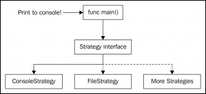
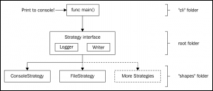
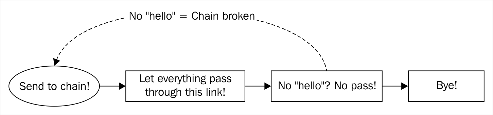
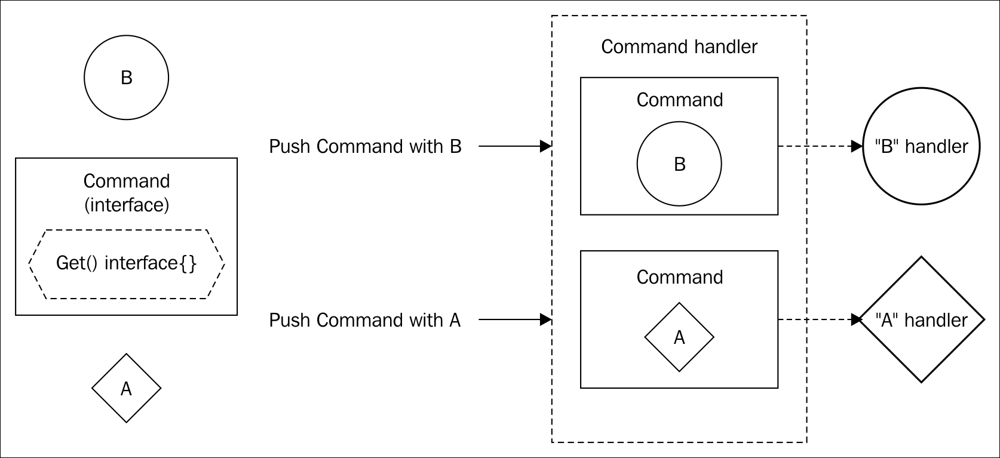

# 第五章。行为模式-策略，责任链和命令设计模式

我们将看到的最后一组常见模式是行为模式。现在，我们不会定义结构或封装对象创建，而是要处理行为。

行为模式中有什么要处理的？嗯，现在我们将封装行为，例如策略模式中的算法或命令模式中的执行。

正确的行为设计是在了解如何处理对象创建和结构之后的最后一步。正确定义行为是良好软件设计的最后一步，因为总的来说，良好的软件设计让我们能够轻松改进算法并轻松修复错误，而最佳算法实现将无法拯救我们免受糟糕的软件设计。

# 策略设计模式

策略模式可能是行为模式中最容易理解的。在开发之前的模式时，我们已经使用了几次，但没有停下来谈论它。现在我们将。

## 描述

策略模式使用不同的算法来实现特定功能。这些算法隐藏在接口后面，并且它们必须是可互换的。所有算法以不同的方式实现相同的功能。例如，我们可以有一个`Sort`接口和一些排序算法。结果是相同的，某个列表被排序，但我们可以使用快速排序，归并排序等。

你能猜到我们在前几章中何时使用了策略模式吗？ 三，二，一...嗯，在我们使用`io.Writer`接口时，我们大量使用了策略模式。 `io.Writer`接口定义了写入的策略，功能始终相同-写入某些内容。我们可以将其写入标准输出，写入某个文件或写入用户定义的类型，但最终做的事情是相同的-写入。我们只是改变了写入的策略（在这种情况下，我们改变了写入的位置）。

## 目标

策略模式的目标非常明确。模式应该做到以下几点：

+   提供一些算法来实现特定功能

+   所有类型以不同的方式实现相同的功能，但策略的客户端不受影响

问题在于这个定义涵盖了广泛的可能性。这是因为策略模式实际上用于各种场景，并且许多软件工程解决方案都包含某种策略。因此最好通过一个真实的例子来看它的实际应用。

## 渲染图像或文本

对于这个例子，我们将做一些不同的事情。我们不仅要在控制台上打印文本，还要在文件上绘制对象。

在这种情况下，我们将有两种策略：控制台和文件。但是库的用户不必处理它们背后的复杂性。

关键特征是“调用者”不知道底层库是如何工作的，他只知道定义的策略上可用的信息。这在下图中很明显：



在这个图表中，我们选择打印到控制台，但我们不会直接处理**ConsoleStrategy**类型，我们将始终使用代表它的接口。**ConsoleStrategy**类型将隐藏打印到控制台的实现细节给`main`函数中的调用者。**FileStrategy**也隐藏其实现细节以及任何未来的策略。

## 验收标准

策略必须有一个非常明确的目标，我们将有两种实现它的方式。我们的目标将如下：

+   提供一种方法向用户显示文本或图像中的对象（正方形）

+   用户在启动应用程序时必须选择图像或文本

+   应用程序必须能够添加更多的可视化策略（例如音频）

+   如果用户选择文本，则必须在控制台中打印单词* Square *

+   如果用户选择图像，将在文件上打印一个白色正方形在黑色背景上的图像

## 实施

我们不打算为这个例子编写测试，因为检查图像是否出现在屏幕上将会非常复杂（虽然使用**OpenCV**，一个令人印象深刻的计算机视觉库，这并非不可能）。我们将直接开始定义每个打印策略必须实现的策略接口（在我们的情况下，文件和控制台类型）：

```go
type PrintStrategy interface { 
  Print() error 
} 

```

就这些了。我们的策略定义了一个简单的`Print()`方法，返回一个`error`（在处理文件时，必须返回错误类型）。需要实现`PrintStrategy`的类型将被称为`ConsoleSquare`和`ImageSquare`类型：

```go
type ConsoleSquare struct {} 

type ImageSquare struct { 
  DestinationFilePath string 
} 

```

`ConsoleSquare`结构不需要任何内部字段，因为它将始终将单词`Square`打印到控制台。`ImageSquare`结构将存储一个字段，用于打印正方形的图像文件的目的地。我们将从实现`ConsoleSquare`类型开始，因为它是最简单的：

```go
func(c *ConsoleSquare) Print() error { 
  println("Square")  
  return nil 
} 

```

非常简单，但图像更复杂。我们不会花太多时间详细解释`image`包的工作原理，因为代码很容易理解：

```go
func (t *ImageSquare) Print() error { 
  width := 800 
  height := 600 

  origin := image.Point{0, 0} 

  bgImage := image.NewRGBA(image.Rectangle{ 
    Min: origin, 
    Max: image.Point{X: width, Y: height}, 
  }) 

  bgColor := image.Uniform{color.RGBA{R: 70, G: 70, B: 70, A:0}} 
  quality := &jpeg.Options{Quality: 75} 

  draw.Print(bgImage, bgImage.Bounds(), &bgColor, origin, draw.Src) 

```

然而，这里有一个简短的解释：

+   我们为图像定义了一个大小（`width`和`height`变量），宽度为 800 像素，高度为 600 像素。这些将是我们图像的大小限制，任何超出该大小的内容都将不可见。

+   `origin`变量存储一个`image.Point`，表示任何二维空间中的位置的类型。我们将此点的位置设置为*(0, 0)*，即图像的左上角。

+   我们需要一个位图来表示我们的背景，这里我们称之为`bgImage`。在图像包中有一个非常方便的函数，用于创建`image.RGBA`类型，称为`image.NewRGBA`。我们需要向此函数传递一个矩形，以便它知道图像的边界。矩形由两个`image.Point`类型表示--它的左上角点（`Min`字段）和它的右下角点（`Max`字段）。我们使用`origin`作为左上角，一个具有`width`和`height`值的新点作为右下角点。

+   图像将具有灰色背景颜色（`bgColor`）。这是通过实例化`image.Uniform`类型来实现的，该类型表示均匀颜色（因此得名）。`image.Uniform`类型需要`color.Color`接口的实例。`color.Color`类型是实现`RGBA() (r, g, b, a uint32)`方法以返回红色、绿色、蓝色和 alpha 颜色（RGBA）的`uint32`值的任何类型（RGBA）。 Alpha 是像素透明度的值。`color`包方便地提供了一个名为`color.RGBA`的类型（如果我们不需要实现自己的类型，这就是我们的情况）。

+   在存储图像的某些格式时，我们必须指定图像的质量。当然，这不仅会影响质量，还会影响文件的大小。在这里，它被定义为 75；100 是我们可以设置的最大质量。正如您所看到的，我们在这里使用`jpeg`包来设置一个名为`Options`的类型的值，它只是存储质量的值，没有更多的值可应用。

+   最后，`draw.Print`函数将以我们在相同图像边界上定义的特征写入所提供的图像（`bgImage`）上的像素。`draw.Print`方法的第一个参数接受目标图像，我们使用了`bgImage`。第二个参数是要在目标图像中绘制的对象的边界，我们使用了图像的相同边界，但如果需要更小的矩形，我们也可以使用其他边界。第三个参数是要用于给边界上色的颜色。`Origin`变量用于告诉边界的左上角必须放置在哪里。在这种情况下，边界与图像大小相同，所以我们需要将其设置为原点。指定的最后一个参数是操作类型；只需将其保留在`draw.Src`参数中。

现在我们必须画正方形。这个操作本质上与绘制背景相同，但在这种情况下，我们是在之前绘制的`bgImage`上绘制一个正方形：

```go
  squareWidth := 200 
  squareHeight := 200 
  squareColor := image.Uniform{color.RGBA{R: 255, G: 0, B: 0, A: 1}} 
  square := image.Rect(0, 0, squareWidth, squareHeight) 
  square = square.Add(image.Point{ 
    X: (width / 2) - (squareWidth / 2), 
    Y: (height / 2) - (squareHeight / 2), 
  }) 
  squareImg := image.NewRGBA(square) 

  draw.Print(bgImage, squareImg.Bounds(), &squareColor, origin, draw.Src) 

```

正方形将是 200*200 像素的红色。使用`Add`方法时，`Rect`类型的原点被转换为提供的点；这是为了将正方形居中放置在图像上。我们使用正方形`Rect`创建一个图像，并再次在`bgImage`图像上调用`Print`函数来绘制红色正方形：

```go
  w, err := os.Create(t.DestinationFilePath) 
  if err != nil { 
    return fmt.Errorf("Error opening image") 
  } 
  defer w.Close() 

  if err = jpeg.Encode(w, bgImage, quality); err != nil { 
    return fmt.Errorf("Error writing image to disk") 
  } 

  return nil 
} 

```

最后，我们将创建一个文件来存储图像的内容。文件将存储在`ImageSquare`结构的`DestinationFilePath`字段中提供的路径中。要创建文件，我们使用返回`*os.File`的`os.Create`。与每个文件一样，在使用后必须关闭它，因此不要忘记使用`defer`关键字来确保在方法完成时关闭它。

### 提示

推迟，还是不推迟？

有些人问为什么要使用`defer`？不使用`defer`在函数末尾简单写入会不会一样？实际上并不是。如果在方法执行期间发生任何错误，并且您返回此错误，则如果它位于函数末尾，则`Close`方法将不会被执行。您可以在返回之前关闭文件，但您必须在每个错误检查中都这样做。使用`defer`，您不必担心这一点，因为延迟函数始终执行（无论有无错误）。这样，我们确保文件被关闭。

为了解析参数，我们将使用`flag`包。我们以前使用过它，但让我们回顾一下它的用法。标志是用户在执行我们的应用程序时可以传递的命令。我们可以使用`flag.[type]`方法在`flag`包中定义标志。我们想要从控制台读取用户想要使用的输出。这个标志将被称为`output`。标志可以有一个默认值；在这种情况下，当打印到控制台时，它将具有值`console`。

```go
var output = flag.String("output", "console", "The output to use between 'console' and 'image' file") 

```

我们的最后一步是编写主函数：

```go
func main(){ 
    flag.Parse() 

```

记住，在使用标志时，主函数中的第一件事是使用`flag.Parse()`方法解析它们！很容易忘记这一步：

```go
var activeStrategy PrintStrategy 

switch *output { 
case "console": 
  activeStrategy = &TextSquare{} 
case "image": 
  activeStrategy = &ImageSquare{"/tmp/image.jpg"} 
default: 
  activeStrategy = &TextSquare{} 
} 

```

我们为用户选择的策略定义了一个变量，称为`activeStrategy`。但要检查`activeStrategy`变量是否具有`PrintStrategy`类型，以便可以用`PrintStrategy`变量的任何实现来填充它。当用户写入`**--output=console**`命令时，我们将`activeStrategy`设置为`TextSquare`的新实例，并在写入`**--output=image**`命令时设置为`ImageSquare`。

最后，这是设计模式的执行：

```go
  err := activeStrategy.Print() 
  if err != nil { 
    log.Fatal(err) 
  } 
}

```

我们的`activeStrategy`变量是一个实现`PrintStrategy`的类型，可以是`TextSquare`或`ImageSquare`类。用户将在运行时选择他想要在每种特定情况下使用的策略。此外，我们可以编写一个工厂方法模式来创建策略，这样策略的创建也将与主函数解耦，并抽象成一个不同的独立包。想想看：如果我们将策略创建放在一个不同的包中，这也将允许我们将这个项目作为一个库来使用，而不仅仅是一个独立的应用程序。

现在我们将执行两种策略；`TextSquare`实例将通过在控制台上打印单词`Square`来给我们一个正方形：

```go
$ go run main.go --output=console
Square

```

它已经按预期工作。回想一下标志的工作方式，我们必须使用`--`（双破折号）和定义的标志，例如我们的情况下的`output`。然后你有两个选项——使用`=`（等号）并立即写入标志的值，或者写入`<空格>`和标志的值。在这种情况下，我们已经将输出的默认值定义为控制台，因此以下三个执行是等效的：

```go
$ go run main.go --output=console
Square
$ go run main.go --output console
Square
$ go run main.go
Square

```

现在我们要尝试文件策略。如前所述，文件策略将在文件中打印一个红色的正方形作为带有深灰色背景的图像：

```go
$ go run main.go --output image

```

什么都没发生？但一切都正确地工作了。这实际上是不好的做法。用户在使用您的应用程序或库时必须始终有某种反馈。此外，如果他们正在将您的代码作为库使用，也许他们对输出有特定的格式，因此直接打印到控制台是不好的。我们稍后将解决这个问题。现在，用您喜欢的文件浏览器打开`/tmp`文件夹，您将看到一个名为`image.jpg`的文件，其中有我们的红色正方形和深灰色背景。

## 在我们的库中解决小问题

我们的代码中有一些问题：

+   它不能作为一个库来使用。我们在`main`包（策略创建）中编写了关键代码。

**解决方案**：将命令行应用程序中的策略创建抽象到两个不同的包中。

+   没有任何策略在文件或控制台上进行记录。我们必须提供一种方法来读取一些日志，外部用户可以将其集成到他们的日志策略或格式中。

**解决方案**：注入一个`io.Writer`接口作为日志接收器的依赖。

+   我们的`TextSquare`类总是写入控制台（实现了`io.Writer`接口），而`ImageSquare`总是写入文件（另一个实现了`io.Writer`接口）。这种耦合度太高了。

**解决方案**：注入一个`io.Writer`接口，以便`TextSquare`和`ImageSquare`可以写入任何可用的`io.Writer`实现（文件和控制台，还有字节缓冲区、二进制编码器、`JSON`处理程序等等数十个包）。

因此，为了将其作为一个库来使用并解决第一个问题，我们将遵循 Go 文件结构中应用程序和库的常见方法。首先，我们将把我们的主包和函数放在根包之外；在这种情况下，放在一个名为`cli`的文件夹中。通常也会将此文件夹称为`cmd`或者`app`。然后，我们将把我们的`PrintStrategy`接口放在根包中，现在将被称为`strategy`包。最后，我们将在一个同名的文件夹中创建一个`shapes`包，其中我们将放置文本和图像策略。因此，我们的文件结构将如下所示：

+   **根包**：策略

文件：`print_strategy.go`

+   **子包**：形状

文件：`image.go`，`text.go`，`factory.go`

+   **子包**：cli

文件：`main.go`

我们将稍微修改我们的接口以满足我们之前编写的需求：

```go
type PrintStrategy interface { 
  Print() error 
  SetLog(io.Writer) 
  SetWriter(io.Writer) 
} 

```

我们已经添加了`SetLog(io.Writer)`方法来向我们的类型添加一个记录器策略；这是为了向用户提供反馈。它还有一个`SetWriter`方法来设置`io.Writer`策略。这个接口将位于根包中的`print_strategy.go`文件中。因此，最终的架构看起来像这样：



`TextSquare`和`ImageSquare`策略都必须满足`SetLog`和`SetWriter`方法，这些方法只是简单地在它们的字段上存储一些对象，所以我们可以创建一个实现它们的结构，并将这个结构嵌入到策略中，而不是重复实现两次。顺便说一句，这就是我们之前看到的组合模式：

```go
type PrintOutput struct { 
  Writer    io.Writer 
  LogWriter io.Writer 
} 

func(d *PrintOutput) SetLog(w io.Writer) { 
  d.LogWriter = w 
} 

func(d *PrintOutput) SetWriter(w io.Writer) { 
  d.Writer = w 
} 

```

所以现在每个策略必须嵌入`PrintOutput`结构，如果我们想修改它们的`Writer`和`logger`字段。

我们还需要修改我们的策略实现。`TextSquare`结构现在需要一个字段来存储输出的`io.Writer`（它将写入的地方，而不是总是写入控制台）和`log`写入器。这两个字段可以通过嵌入`PrintOutput`结构来提供。`TextSquare`结构也存储在 shapes 包的文件`text.go`中。因此，该结构现在是这样的：

```go
package shapes 

type TextSquare struct { 
  strategy.PrintOutput 
} 

```

所以现在`Print()`方法略有不同，因为我们不再直接使用`println`函数写入控制台，而是要写入存储在`Writer`字段中的任何`io.Writer`：

```go
func (t *TextSquare) Print() error { 
  r := bytes.NewReader([]byte("Circle")) 
  io.Copy(t.Writer, r) 
  return nil 
} 

```

`bytes.NewReader`是一个非常有用的函数，它接受一个字节数组并将其转换为`io.Reader`接口。我们需要一个`io.Reader`接口来使用`io.Copy`函数。`io.Copy`函数也非常有用，因为它接受一个`io.Reader`（作为第二个参数）并将其传输到一个`io.Writer`（作为第一个参数）。因此，在任何情况下我们都不会返回错误。然而，直接使用`t.Writer`的`Write`方法更容易：

```go
func (t *TextSquare) Print() error { 
  t.Writer.Write([]byte("Circle")) 
  return nil 
} 

```

你可以使用你更喜欢的任何方法。通常，你会使用`Write`方法，但了解`bytes.NewReader`函数也很好。

你是否注意到当我们使用`t.Writer`时，实际上是在访问`PrintOutput.Writer`？`TextSquare`类型有一个`Writer`字段，因为`PrintOutput`结构体有它，并且它被嵌入到`TextSquare`结构体中。

### 提示

嵌入不是继承。我们在`TextSquare`结构体中嵌入了`PrintOutput`结构体。现在我们可以像访问`TextSquare`字段一样访问`PrintOutput`字段。这感觉有点像继承，但这里有一个非常重要的区别：`TextSquare`不是`PrintOutput`值，而是在其组合中有一个`PrintOutput`。这是什么意思？如果你有一个期望`PrintOutput`的函数，你不能传递`TextSquare`，只是因为它嵌入了`PrintOutput`。

但是，如果你有一个接受`PrintOutput`实现的接口的函数，你可以传递`TextSquare`，如果它嵌入了`PrintOutput`。这就是我们在示例中所做的。

`ImageSquare`结构现在与`TextSquare`类似，都嵌入了`PrintOutput`：

```go
type ImageSquare struct { 
  strategy.PrintOutput 
} 

```

`Print`方法也需要修改。现在，我们不再从`Print`方法中创建文件，因为这违反了单一职责原则。文件实现了`io.Writer`，所以我们将在`ImageSquare`结构体之外打开文件，并将其注入`Writer`字段。因此，我们只需要修改`Print()`方法的结尾，我们在其中写入文件：

```go
draw.Print(bgImage, squareImg.Bounds(), &squareColor, origin, draw.Src) 

if i.Writer == nil { 
  return fmt.Errorf("No writer stored on ImageSquare") 
} 
if err := jpeg.Encode(i.Writer, bgImage, quality); err != nil { 
  return fmt.Errorf("Error writing image to disk") 
} 

if i.LogWriter != nil { 
  io.Copy(i.LogWriter, "Image written in provided writer\n") 
} 

return nil 

```

如果你检查我们之前的实现，在使用`draw`之后，你会发现我们使用了`Print`方法，我们用`os.Create`创建了一个文件，并将其传递给`jpeg.Encode`函数。我们已经删除了关于创建文件的部分，并用一个检查替换了它，查找字段中的`Writer`（`if i.Writer != nil`）。然后，在`jpeg.Encode`中，我们可以用之前使用的文件值替换`i.Writer`字段的内容。最后，如果提供了日志策略，我们再次使用`io.Copy`来将一些消息记录到`LogWriter`中。

我们还需要从用户那里抽象出创建`PrintStrategy`实现者实例所需的知识，为此我们将使用工厂方法：

```go
const ( 
  TEXT_STRATEGY  = "text" 
  IMAGE_STRATEGY = "image" 
) 

func NewPrinter(s string) (strategy.Output, error) { 
  switch s { 
  case TEXT_STRATEGY: 
    return &TextSquare{ 
      PrintOutput: strategy.PrintOutput{ 
        LogWriter: os.Stdout, 
      }, 
    }, nil 
  case IMAGE_STRATEGY: 
    return &ImageSquare{ 
      PrintOutput: strategy.PrintOutput{ 
        LogWriter: os.Stdout, 
      }, 
    }, nil 
  default: 
    return nil, fmt.Errorf("Strategy '%s' not found\n", s) 
  } 
} 

```

我们有两个常量，分别是我们的两种策略：`TEXT_STRATEGY`和`IMAGE_STRATEGY`。这些常量必须提供给工厂以检索每个方形抽屉策略。我们的工厂方法接收一个参数`s`，它是一个包含前述常量之一的字符串。

每个策略都嵌入了一个默认记录器到`stdout`的`PrintOutput`类型，但是你可以通过使用`SetLog(io.Writer)`方法来覆盖它。这种方法可以被认为是原型的工厂。如果它不是一个被识别的策略，将返回一个适当的错误消息。

现在我们有了一个库。我们在`strategy`和`shapes`包之间拥有了所有需要的功能。现在我们将在一个名为`cli`的新文件夹中编写`main`包和函数：

```go
var output = flag.String("output", "text", "The output to use between "+ 
  "'console' and 'image' file") 

func main() { 
  flag.Parse() 

```

就像之前一样，`main`函数首先通过解析控制台上的输入参数来开始，以获取所选择的策略。我们现在可以使用变量 output 来创建一个不需要工厂的策略：

```go
activeStrategy, err := shapes.NewPrinter(*output) 
if err != nil { 
  log.Fatal(err) 
} 

```

有了这段代码，我们有了我们的策略，或者如果发现任何错误（比如一个未被识别的策略），我们会在`log.Fatal`方法中停止程序执行。

现在我们将使用我们的库来实现业务需求。对于`TextStrategy`，我们想要写入，例如，到`stdout`。对于图像，我们将写入到`/tmp/image.jpg`。就像之前一样。因此，根据前述陈述，我们可以写：

```go
switch *output { 
case shapes.TEXT_STRATEGY: 
  activeStrategy.SetWriter(os.Stdout) 
case shapes.IMAGE_STRATEGY: 
  w, err := os.Create("/tmp/image.jpg") 
  if err != nil { 
    log.Fatal("Error opening image") 
  } 
  defer w.Close() 

  activeStrategy.SetWriter(w) 
} 

```

在`TEXT_STRATEGY`的情况下，我们使用`SetWriter`将`io.Writer`设置为`os.Stdout`。在`IMAGE_STRATEGY`的情况下，我们在我们的任何一个文件夹中创建一个图像，并将文件变量传递给`SetWriter`方法。记住，`os.File`实现了`io.Reader`和`io.Writer`接口，所以将它作为`io.Writer`传递给`SetWriter`方法是完全合法的：

```go
err = activeStrategy.Print() 
if err != nil { 
  log.Fatal(err) 
} 

```

最后，我们调用用户选择的任何策略的`Print`方法并检查可能的错误。现在让我们尝试一下程序：

```go
$ go run main.go --output text
Circle

```

它已经按预期工作。那么图片策略呢？

```go
$ go run main.go --output image
Image written in provided writer

```

如果我们在`/tmp/image.jpg`中检查，我们可以在黑色背景上找到我们的红色方块。

## 关于策略模式的最后一句话

我们已经学会了一种将算法封装在不同的结构体中的强大方式。我们还使用了嵌入而不是继承来在类型之间提供交叉功能，这在我们的应用程序中经常会派上用场。你会发现自己在这里和那里组合策略，就像我们在第二个例子中看到的那样，我们通过使用`io.Writer`接口有日志和写入的策略，有一个用于字节流操作的策略。

# 责任链设计模式

我们的下一个模式被称为**责任链**。顾名思义，它由一条链组成，在我们的情况下，链的每个链接都遵循单一职责原则。

## 描述

单一职责原则意味着一个类型、函数、方法或任何类似的抽象必须只有一个单一的职责，并且必须做得很好。这样，我们可以将许多实现一个特定功能的函数应用到某个结构体、切片、映射等中。

当我们经常以一种逻辑的方式应用许多这些抽象时，我们可以将它们链接起来按顺序执行，比如，例如一个日志链。

日志链是一组类型，将某个程序的输出记录到多个`io.Writer`接口。我们可以有一个记录到控制台的类型，一个记录到文件的类型，以及一个记录到远程服务器的类型。每次想要进行一些记录时，你可以进行三次调用，但是只进行一次调用并引发一次链式反应更加优雅。

但是，我们也可以有一系列检查，并且如果其中一个失败，就中断链并返回一些东西。这就是认证和授权中间件的工作方式。

## 目标

责任链的目标是为开发人员提供一种在运行时链接操作的方法。这些操作相互链接，每个链接将执行某些操作并将请求传递给下一个链接（或不传递）。以下是此模式遵循的目标：

+   在运行时根据某些输入动态地链接操作

+   通过一系列处理器传递请求，直到其中一个可以处理它，此时链可能会停止

## 多记录器链

我们将开发一个多记录器解决方案，可以按我们想要的方式进行链接。我们将使用两个不同的控制台记录器和一个通用记录器：

1.  我们需要一个简单的记录器，记录带有前缀*First logger*的请求文本，并将其传递给链中的下一个链接。

1.  第二个记录器将在控制台上写入文本，如果传入文本包含单词`hello`，则将请求传递给第三个记录器。但是，如果没有，则链将被中断并立即返回。

1.  第三个记录器类型是一个名为`WriterLogger`的通用记录器，它使用`io.Writer`接口进行记录。

1.  `WriterLogger`的具体实现写入文件，代表链中的第三个链接。

这些步骤的实现如下图所示：



## 单元测试

链的第一件事，通常是定义接口。责任链接口通常至少有一个`Next()`方法。`Next()`方法是执行链中下一个链接的方法：

```go
type ChainLogger interface { 
  Next(string) 
} 

```

我们示例接口的`Next`方法接受我们想要记录的消息，并将其传递给链中的下一个链接。如验收标准所述，我们需要三个记录器：

```go
type FirstLogger struct { 
  NextChain ChainLogger 
} 

func (f *FirstLogger) Next(s string) {} 

type SecondLogger struct { 
  NextChain ChainLogger 
} 

func (f *SecondLogger) Next(s string) {} 

type WriterLogger struct { 
  NextChain ChainLogger 
  Writer    io.Writer 
} 
func (w *WriterLogger) Next(s string) {} 

```

`FirstLogger`和`SecondLogger`类型具有完全相同的结构--都实现`ChainLogger`，并具有指向下一个`ChainLogger`的`NextChain`字段。`WriterLogger`类型等同于`FirstLogger`和`SecondLogger`类型，但还具有一个字段用于将其数据写入，因此您可以将任何`io.Writer`接口传递给它。

与以前一样，我们将实现一个`io.Writer`结构以在测试中使用。在我们的测试文件中，我们定义以下结构：

```go
type myTestWriter struct { 
  receivedMessage string 
} 

func (m *myTestWriter) Write(p []byte) (int, error) { 
  m.receivedMessage += string(p) 
  return len(p), nil 
} 

func(m *myTestWriter) Next(s string){ 
  m.Write([]byte(s)) 
} 

```

我们将传递`myTestWriter`结构的实例给`WriterLogger`，以便在测试中跟踪被记录的内容。`myTestWriter`类实现了`io.Writer`接口的常见`Write([]byte) (int, error)`方法。请记住，如果它具有`Write`方法，它可以被用作`io.Writer`。`Write`方法简单地将字符串参数存储到`receivedMessage`字段中，以便我们稍后在测试中检查其值。

这是第一个测试函数的开始：

```go
func TestCreateDefaultChain(t *testing.T) { 
  //Our test ChainLogger 
  myWriter := myTestWriter{} 

  writerLogger := WriterLogger{Writer: &myWriter} 
  second := SecondLogger{NextChain: &writerLogger} 
  chain := FirstLogger{NextChain: &second} 

```

让我们稍微描述一下这几行，因为它们非常重要。我们创建一个默认的`myTestWriter`类型的变量，我们将在链的最后一个链接中用作`io.Writer`接口。然后我们创建链的最后一部分，`writerLogger`接口。在实现链时，通常从链的最后一部分开始，在我们的例子中是`WriterLogger`。`WriterLogger`写入`io.Writer`，因此我们将`myWriter`作为`io.Writer`接口传递。

然后我们创建了一个`SecondLogger`，即我们链中的中间链接，指向`writerLogger`。如前所述，`SecondLogger`只是在包含单词`hello`的情况下记录并传递消息。在生产应用程序中，它可能是仅错误记录器。

最后，链中的第一个链接具有变量名`chain`。它指向第二个记录器。因此，总结一下，我们的链如下所示：`FirstLogger` | `SecondLogger` | `WriterLogger`。

这将是我们测试的默认设置：

```go
t.Run("3 loggers, 2 of them writes to console, second only if it founds " + 
  "the word 'hello', third writes to some variable if second found 'hello'", 
  func(t *testing.T){ 
    chain.Next("message that breaks the chain\n") 

    if myWriter.receivedMessage != "" { 
      t.Fatal("Last link should not receive any message") 
    } 

    chain.Next("Hello\n") 

    if !strings.Contains(myWriter.receivedMessage, "Hello") { 
      t.Fatal("Last link didn't received expected message") 
    } 
}) 

```

继续使用 Go 1.7 或更高版本的测试签名，我们定义了一个内部测试，描述如下：*三个记录器，其中两个写入控制台，第二个只有在找到单词'hello'时才写入，第三个只有在第二个找到'hello'时才写入一些变量*。如果有人需要维护这段代码，这是非常描述性的，也很容易理解。

首先，我们使用`Next`方法上的消息，它不会到达链中的第三个链接，因为它不包含`hello`这个词。我们检查`receivedMessage`变量的内容，它默认为空，看看它是否已经改变，因为它不应该改变。

接下来，我们再次使用链变量，我们链中的第一个链接，并传递消息`"Hello\n"`。根据测试的描述，它应该使用`FirstLogger`进行记录，然后在`SecondLogger`中，最后在`WriterLogger`中，因为它包含`hello`这个词，而`SecondLogger`会让它通过。

测试检查`myWriter`，链中存储了过去消息的最后一个链接，是否包含我们在链中首次传递的单词：hello。让我们运行它，看看它是否失败：

```go
go test -v .
=== RUN   TestCreateDefaultChain
=== RUN   TestCreateDefaultChain/3_loggers,_2_of_them_writes_to_console,_second_only_if_it_founds_the_word_'hello',_third_writes_to_some_variable_if_second_found_'hello'
--- FAIL: TestCreateDefaultChain (0.00s)
--- FAIL: TestCreateDefaultChain/3_loggers,_2_of_them_writes_to_console,_second_only_if_it_founds_the_word_'hello',_third_writes_to_some_variable_if_second_found_'hello' (0.00s)
 chain_test.go:33: Last message didn't received expected message
FAIL
exit status 1
FAIL

```

测试通过了测试的第一个检查，但没有通过第二个检查。嗯...理想情况下，在任何实现之前都不应该通过任何检查。请记住，在测试驱动的开发中，测试必须在第一次启动时失败，因为它们正在测试的代码尚未实现。零初始化误导了我们，使得测试通过了。我们可以用两种方法解决这个问题：

+   将`ChainLogger`的签名更改为返回一个错误：`Next(string)` error。这样，我们将通过返回错误来打破链。这通常是一个更方便的方法，但现在会引入相当多的样板代码。

+   将`receivedMessage`字段更改为指针。指针的默认值是 nil，而不是空字符串。

现在我们将使用第二个选项，因为它更简单，而且也相当有效。所以让我们将`myTestWriter`结构的签名更改为以下内容：

```go
type myTestWriter struct { 
  receivedMessage *string 
} 

func (m *myTestWriter) Write(p []byte) (int, error) { 
  if m.receivedMessage == nil { 
         m.receivedMessage = new(string) 
} 
  tempMessage := fmt.Sprintf("%s%s", m.receivedMessage, p) 
  m.receivedMessage = &tempMessage 
  return len(p), nil 
} 

func (m *myTestWriter) Next(s string) { 
  m.Write([]byte(s)) 
} 

```

检查`receivedMessage`的类型现在是否有星号（`*`），以指示它是一个指向字符串的指针。`Write`函数也需要更改。现在我们必须检查`receivedMessage`字段的内容，因为像每个指针一样，它被初始化为 nil。然后我们必须首先将消息存储在一个变量中，这样我们就可以在赋值的下一行中取地址（`m.receivedMessage = &tempMessage`）。

所以现在我们的测试代码也应该有所改变：

```go
t.Run("3 loggers, 2 of them writes to console, second only if it founds "+ 
"the word 'hello', third writes to some variable if second found 'hello'", 
func(t *testing.T) { 
  chain.Next("message that breaks the chain\n") 

  if myWriter.receivedMessage != nil { 
    t.Error("Last link should not receive any message") 
  } 

  chain.Next("Hello\n") 

  if myWriter.receivedMessage == "" || !strings.Contains(*myWriter.receivedMessage, "Hello") { 
    t.Fatal("Last link didn't received expected message") 
  } 
}) 

```

现在我们正在检查`myWriter.receivedMessage`是否实际上是`nil`，因此可以确定变量上确实没有写入任何内容。此外，我们必须更改第二个 if 语句，首先检查成员是否为 nil，然后再检查其内容，否则测试可能会引发恐慌。让我们再次测试一下：

```go
go test -v . 
=== RUN   TestCreateDefaultChain 
=== RUN   TestCreateDefaultChain/3_loggers,_2_of_them_writes_to_console,_second_only_if_it_founds_the_word_'hello',_third_writes_to_some_variable_if_second_found_'hello' 
--- FAIL: TestCreateDefaultChain (0.00s) 
--- FAIL: TestCreateDefaultChain/3_loggers,_2_of_them_writes_to_console,_second_only_if_it_founds_the_word_'hello',_third_writes_to_some_variable_if_second_found_'hello' (0.00s) 
        chain_test.go:40: Last link didn't received expected message 
FAIL 
exit status 1 
FAIL

```

它再次失败了，而且再次，测试的前半部分在没有实现代码的情况下正确通过了。那么现在我们该怎么办呢？我们必须更改`myWriter`类型的签名，使得测试在两个检查中都失败，而且只在第二个检查中失败。嗯，在这种情况下，我们可以忽略这个小问题。在编写测试时，我们必须非常小心，不要对它们过于疯狂；单元测试是帮助我们编写和维护代码的工具，但我们的目标是编写功能，而不是测试。这一点很重要，因为你可能会对工程化单元测试感到非常疯狂。

## 实施

现在我们必须分别实现第一个、第二个和第三个名为`FirstLogger`、`SecondLogger`和`WriterLogger`的记录器。`FirstLogger`记录器是最简单的，正如第一个验收标准中所描述的那样：*我们需要一个简单的记录器，记录请求的文本，并在前缀为 First logger:的情况下将其传递给链中的下一个链接*。所以让我们来做吧：

```go
type FirstLogger struct { 
  NextChain ChainLogger 
} 

func (f *FirstLogger) Next(s string) { 
  fmt.Printf("First logger: %s\n", s) 

  if f.NextChain != nil { 
    f.NextChain.Next(s) 
  } 
} 

```

实现起来非常简单。使用 `fmt.Printf` 方法对传入的字符串进行格式化和打印，我们附加了文本 `First Logger:`。然后，我们检查 `NextChain` 类型是否实际上有一些内容，并通过调用其 `Next(string)` 方法将控制权传递给它。测试还没有通过，所以我们将继续使用 `SecondLogger` 记录器：

```go
type SecondLogger struct { 
  NextChain ChainLogger 
} 

func (se *SecondLogger) Next(s string) { 
  if strings.Contains(strings.ToLower(s), "hello") { 
    fmt.Printf("Second logger: %s\n", s) 

    if se.NextChain != nil { 
      se.NextChain.Next(s) 
    } 

    return 
  } 

  fmt.Printf("Finishing in second logging\n\n") 
} 

```

如第二个验收标准所述，`SecondLogger` 的描述是：*如果传入的文本包含单词 "hello"，第二个记录器将在控制台上写入并将请求传递给第三个记录器*。首先，它检查传入的文本是否包含文本 `hello`。如果是，它会将消息打印到控制台，并附加文本 `Second logger:`，并将消息传递给链中的下一个链接（检查之前的实例是否存在第三个链接）。

但如果它不包含文本 `hello`，链就会断开，并打印消息 `Finishing in second logging`。

我们将以 `WriterLogger` 类型结束：

```go
type WriterLogger struct { 
  NextChain ChainLogger 
  Writer    io.Writer 
} 

func (w *WriterLogger) Next(s string) { 
  if w.Writer != nil { 
    w.Writer.Write([]byte("WriterLogger: " + s)) 
  } 

  if w.NextChain != nil { 
    w.NextChain.Next(s) 
  } 
} 

```

`WriterLogger` 结构的 `Next` 方法检查 `Writer` 成员中是否存储了现有的 `io.Writer` 接口，并将传入的消息写入其中，附加文本 `WriterLogger:`。然后，就像之前的链接一样，检查是否有更多的链接来传递消息。

现在测试将成功通过：

```go
go test -v .
=== RUN   TestCreateDefaultChain
=== RUN   TestCreateDefaultChain/3_loggers,_2_of_them_writes_to_console,_second_only_if_it_founds_the_word_'hello',_third_writes_to_some_variable_if_second_found_'hello'
First logger: message that breaks the chain
Finishing in second logging
First logger: Hello
Second logger: Hello
--- PASS: TestCreateDefaultChain (0.00s)
 --- PASS: TestCreateDefaultChain/3_loggers,_2_of_them_writes_to_console,_second_only_if_it_founds_the_word_'hello',_third_writes_to_some_variable_if_second_found_'hello' (0.00s)
PASS
ok

```

测试的前半部分打印了两条消息——`First logger:` 打破了链，这是 `FirstLogger` 的预期消息。但它在 `SecondLogger` 中停止，因为在传入的消息中找不到 `hello` 一词；这就是为什么它打印了 `Finishing in second logging` 字符串。

测试的后半部分接收到消息 `Hello`。所以 `FirstLogger` 打印，`SecondLogger` 也打印。第三个记录器根本不打印到控制台，而是打印到我们在测试中定义的 `myWriter.receivedMessage` 行。

## 那么闭包呢？

有时，为了快速调试，定义链中更灵活的链接可能会很有用。我们可以使用闭包来实现这一点，以便链接功能由调用者定义。闭包链接是什么样子的？类似于 `WriterLogger` 记录器：

```go
type ClosureChain struct { 
  NextChain ChainLogger 
  Closure   func(string) 
} 

func (c *ClosureChain) Next(s string) { 
  if c.Closure != nil { 
    c.Closure(s) 
  } 

  if c.NextChain != nil { 
    c.Next(s) 
  } 
} 

```

`ClosureChain` 类型有一个 `NextChain`，和一个 `Closure` 成员。看一下 `Closure` 的签名：`func(string)`。这意味着它是一个接受 `string` 并且不返回任何东西的函数。

`ClosureChain` 的 `Next(string)` 方法检查 `Closure` 成员是否已存储，并使用传入的字符串执行它。和往常一样，该链接检查更多的链接以传递消息，就像链中的每个链接一样。

那么，我们现在如何使用它呢？我们将定义一个新的测试来展示它的功能：

```go
t.Run("2 loggers, second uses the closure implementation", func(t *testing.T) { 
  myWriter = myTestWriter{} 
  closureLogger := ClosureChain{ 
    Closure: func(s string) { 
      fmt.Printf("My closure logger! Message: %s\n", s) 
      myWriter.receivedMessage = &s 
    }, 
  } 

  writerLogger.NextChain = &closureLogger 

  chain.Next("Hello closure logger") 

  if *myWriter.receivedMessage != "Hello closure logger" { 
    t.Fatal("Expected message wasn't received in myWriter") 
  } 
}) 

```

这个测试的描述很清楚：`"2 loggers, second uses the closure implementation"`。我们简单地使用两个 `ChainLogger` 实现，并且在第二个链接中使用 `closureLogger`。我们创建了一个新的 `myTestWriter` 来存储消息的内容。在定义 `ClosureChain` 时，我们在创建 `closureLogger` 时直接在 `Closure` 成员上定义了一个匿名函数。它打印 `"My closure logger! Message: %s\n"`，并用传入的消息替换 "%s"。然后，我们将传入的消息存储在 `myWriter` 上，以便稍后检查。

在定义了这个新链接之后，我们使用了上一个测试的第三个链接，将闭包添加为第四个链接，并传递了消息 `Hello closure logger`。我们在开头使用单词 `Hello`，以确保消息将通过 `SecondLogger`。

最后，`myWriter.receivedMessage` 的内容必须包含传递的文本：`Hello closure logger`。这是一种非常灵活的方法，但有一个缺点：在定义这样的闭包时，我们无法以非常优雅的方式测试其内容。让我们再次运行测试：

```go
go test -v . 
=== RUN   TestCreateDefaultChain 
=== RUN   TestCreateDefaultChain/3_loggers,_2_of_them_writes_to_console,_second_only_if_it_founds_the_word_'hello',_third_writes_to_some_variable_if_second_found_'hello' 
First logger: message that breaks the chain 
Finishing in second logging 

First logger: Hello 
Second logger: Hello 
=== RUN   TestCreateDefaultChain/2_loggers,_second_uses_the_closure_implementation 
First logger: Hello closure logger 
Second logger: Hello closure logger 
My closure logger! Message: Hello closure logger 
--- PASS: TestCreateDefaultChain (0.00s) 
    --- PASS: TestCreateDefaultChain/3_loggers,_2_of_them_writes_to_console,_second_only_if_it_founds_the_word_'hello',_third_writes_to_some_variable_if_second_found_'hello' (0.00s) 
    --- PASS: TestCreateDefaultChain/2_loggers,_second_uses_the_closure_implementation (0.00s) 
PASS 
ok

```

看一下第三个 `RUN`：消息正确地通过第一个、第二个和第三个链接到达闭包，打印了预期的 `My closure logger! Message: Hello closure logger` 消息。

在某些接口中添加闭包方法实现非常有用，因为它在使用库时提供了相当大的灵活性。你可以在 Go 代码中经常发现这种方法，最著名的是`net/http`包的方法`HandleFunc`，我们之前在结构模式中使用它来定义 HTTP 请求的处理程序。

## 将其放在一起

我们学到了一个强大的工具，可以实现动态处理操作和状态处理。责任链模式被广泛使用，也用于创建**有限状态机**（**FSM**）。它也可以与装饰者模式互换使用，不同之处在于装饰时改变对象的结构，而链式定义了链中每个链接的行为，也可能会破坏它。

# 命令设计模式

最后，我们还将看到**命令**模式--一个小型的设计模式，但仍然经常使用。需要一种方法来连接真正不相关的类型吗？那就为它们设计一个命令。

## 描述

命令设计模式与策略设计模式非常相似，但也有关键的区别。在策略模式中，我们专注于改变算法，而在命令模式中，我们专注于调用某些东西或者对某种类型进行抽象。

命令模式通常被视为一个容器。你可以将用户界面上的用户交互信息（如`点击登录`）放入命令中并传递。命令中不需要包含与`点击登录`操作相关的复杂性，只需要包含操作本身。

有机世界的一个例子是快递公司的包裹。我们可以在上面放任何东西，但作为快递公司，我们更感兴趣的是管理包裹而不是直接管理其内容。

在处理通道时，命令模式将被大量使用。通过通道可以发送任何消息，但是，如果我们需要从通道的接收端获得响应，一种常见的方法是创建一个命令，附加一个第二个响应通道，我们在这里进行监听。

类似地，一个很好的例子是多人游戏，每个用户的每一次操作都可以通过网络发送给其他用户作为命令。

## 目标

在使用命令设计模式时，我们试图将某种操作或信息封装在一个轻量级的包裹中，这个包裹必须在其他地方进行处理。这类似于策略模式，但实际上，命令可以触发其他地方预先配置的策略，因此它们并不相同。以下是这种设计模式的目标：

+   把一些信息放进一个盒子里。只有接收者才会打开盒子并知道其中的内容。

+   将某些操作委托给其他地方。

行为也可以在以下图表中解释：



这里有一个**命令**接口，带有一个**Get() interface{}**方法。我们有一个类型**A**和一个类型**B**。想法是**A**和**B**实现**命令**接口，将自己作为`interface{}`返回。现在它们实现了**命令**，它们可以在不太关心底层类型的**命令处理程序**中自由使用。现在**A**和**B**可以在处理命令的函数中传递或存储命令。但是**B**处理程序可以从任何**命令**处理程序中获取对象来“解包”它，并获取其**B**内容，以及**A**命令处理程序和其`A`内容。

我们把信息放在一个盒子里（**命令**），并将如何处理它委托给命令的处理程序。

## 一个简单的队列

我们的第一个例子将会很简单。我们将把一些信息放入一个命令实现者中，并创建一个队列。我们将创建许多实现命令模式的类型的实例，并将它们传递给一个队列，直到队列中有三个命令时，它将对它们进行处理。

## 验收标准

因此，理解命令的理想验收标准应该在某种程度上反映出可以接受不相关类型并执行命令本身的盒子的创建：

+   我们需要一个控制台打印命令的构造函数。当使用这个构造函数和一个 `string` 时，它将返回一个打印它的命令。在这种情况下，处理程序在充当盒子和处理程序的命令内部。

+   我们需要一个数据结构，它可以将传入的命令存储在队列中，并在队列达到三个长度时打印它们。

## 实施

这种模式非常简单，我们将编写一些不同的示例，因此我们将直接实现库以保持轻便和简短。经典的命令设计模式通常具有具有 `Execute` 方法的通用类型结构。我们也将使用这个结构，因为它非常灵活和简单：

```go
type Command interface { 
  Execute() 
} 

```

这足够通用，可以填充很多不相关的类型！想想看——我们将创建一个类型，当使用 `Execute()` 方法时会打印到控制台，但它也可以打印数字或发射火箭！关键在于专注于调用，因为处理程序也在命令中。因此，我们需要一些实现这个接口并打印到控制台某种消息的类型：

```go
type ConsoleOutput struct { 
  message string 
} 

func (c *ConsoleOutput) Execute() { 
  fmt.Println(c.message) 
} 

```

`ConsoleOutput` 类型实现了 `Command` 接口，并打印了名为 `message` 的成员到控制台。

根据第一个验收标准的定义，我们需要一个接受消息字符串并返回 `Command` 接口的 `Command` 构造函数。它将具有签名 `func CreateCommand(s string) Command`：

```go
 func CreateCommand(s string) Command { 
   fmt.Println("Creating command") 

   return &ConsoleOutput{ 
         message: s, 
   } 
} 

```

对于命令 `queue`，我们将定义一个非常简单的类型 `CommandQueue`，用于存储实现了 `Command` 接口的任何类型的队列：

```go
type CommandQueue struct { 
  queue []Command 
} 

func (p *CommandQueue) AddCommand(c Command) { 
  p.queue = append(p.queue, c) 

  if len(p.queue) == 3 { 
    for _, command := range p.queue { 
      command.Execute() 
    } 

    p.queue = make([]Command, 3) 
  } 
} 

```

`CommandQueue` 类型存储了一个 `Commands` 接口的数组。当队列数组达到三个项目时，它会执行队列字段中存储的所有命令。如果还没有达到所需的长度，它只是存储命令。

我们将创建五个命令，足以触发命令队列机制，并将它们添加到队列中。每次创建一个命令时，消息 `Creating command` 将被打印到控制台。当我们创建第三个命令时，自动命令执行器将被启动，打印前三条消息。我们创建并添加两个命令，但因为我们还没有再次达到第三个命令，它们不会被打印，只会打印 `Creating command` 消息：

```go
func main() { 
  queue := CommandQueue{} 

  queue.AddCommand(CreateCommand("First message")) 
  queue.AddCommand(CreateCommand("Second message")) 
  queue.AddCommand(CreateCommand("Third message")) 

  queue.AddCommand(CreateCommand("Fourth message")) 
  queue.AddCommand(CreateCommand("Fifth message")) 
} 

```

让我们运行 `main` 程序。我们的定义说，命令每三条消息处理一次，我们将创建总共五条消息。前三条消息必须被打印，但第四条和第五条不会被打印，因为我们没有达到第六条消息来触发命令处理：

```go
$go run command.go
Creating command
Creating command
Creating command
First message
Second message
Third message
Creating command
Creating command

```

正如您所看到的，第四条和第五条消息没有被打印，这是预期的，但我们知道命令已经被创建并存储在数组中。它们只是没有被处理，因为队列正在等待一个命令来触发处理器。

## 更多例子

前面的例子展示了如何使用一个命令处理程序来执行命令的内容。但使用命令模式的常见方式是将信息委托给不同的对象，而不是执行。

例如，我们将创建一个提取信息的命令，而不是打印到控制台：

```go
type Command interface { 
  Info() string 
} 

```

在这种情况下，我们的 `Command` 接口将有一个名为 `Info` 的方法，它将从其实现者那里检索一些信息。我们将创建两个实现；一个将返回自创建命令到执行之间经过的时间：

```go
type TimePassed struct { 
  start time.Time 
} 

func (t *TimePassed) Info() string { 
  return time.Since(t.start).String() 
} 

```

`time.Since` 函数返回自提供参数中存储的时间以来经过的时间。我们通过调用 `time.Time` 类型的 `String()` 方法返回传递时间的字符串表示。我们的新 `Command` 的第二个实现将返回消息 `Hello World!`：

```go
type HelloMessage struct{} 

func (h HelloMessage) Info() string { 
  return "Hello world!" 
} 

```

我们的`main`函数将简单地创建每种类型的实例，然后等待一秒，并打印每个`Command`返回的信息：

```go
func main() { 
  var timeCommand Command 
  timeCommand = &TimePassed{time.Now()} 

  var helloCommand Command 
  helloCommand = &HelloMessage{} 

  time.Sleep(time.Second) 

  fmt.Println(timeCommand.Info()) 
  fmt.Println(helloCommand.Info()) 
} 

```

`time.Sleep`函数会暂停当前 goroutine 的执行指定的时间（一秒）。因此，回顾一下，`timeCommand`变量存储了程序启动时的时间，它的`Info()`方法返回了自我们给定类型值到调用`Info()`方法时经过的时间的字符串表示。`helloCommand`变量在调用其`Info()`方法时返回消息`Hello World!`。这里我们没有再次实现`Command`处理程序，以保持简单，但我们可以将控制台视为处理程序，因为我们只能在控制台上打印 ASCII 字符，就像`Info()`方法检索到的字符一样。

让我们运行`main`函数：

```go
go run command.go
1.000216755s
Hello world!

```

就在这里。在这种情况下，我们使用命令模式来检索一些信息。一个类型存储`time`信息，而另一个类型不存储任何信息，只是返回相同的简单字符串。每次运行`main`函数都会返回不同的经过时间，所以不用担心时间与示例中的时间不匹配。

## 命令的责任链

你还记得责任链设计模式吗？我们之前是在链接之间传递`string`消息来打印其内容。但我们也可以使用之前的命令来检索信息并记录到控制台上。我们将主要重用我们已经编写的代码。

`Command`接口将是前面示例中返回`string`的接口类型：

```go
type Command interface { 
  Info() string 
} 

```

我们还将使用`TimePassed`类型的`Command`实现：

```go
type TimePassed struct { 
  start time.Time 
} 

func (t *TimePassed) Info() string { 
  return time.Since(t.start).String() 
} 

```

请记住，这种类型返回的是从对象创建到其`Info() string`方法的经过时间。我们还需要来自本章*责任链设计模式*部分的`ChainLogger`接口，但这次它将在其`Next`方法中传递`Command`而不是`string`：

```go
type ChainLogger interface { 
  Next(Command) 
} 

```

为了简单起见，我们将在链中使用相同的类型作为两个链接。这个链接与责任链示例中的`FirstLogger`类型非常相似，但这次它会附加消息`Elapsed time from creation:`，并且在打印之前等待 1 秒。我们将其称为`Logger`而不是`FirstLogger`：

```go
type Logger struct { 
  NextChain ChainLogger 
} 

func (f *Logger) Next(c Command) { 
  time.Sleep(time.Second) 

  fmt.Printf("Elapsed time from creation: %s\n", c.Info()) 

  if f.NextChain != nil { 
    f.NextChain.Next(c) 
  } 
} 

```

最后，我们需要一个`main`函数来执行接受`Command`指针的链：

```go
func main() { 
  second := new(Logger) 
  first := Logger{NextChain: second} 

  command := &TimePassed{start: time.Now()} 

  first.Next(command) 
} 

```

逐行创建一个名为`second`的变量，指向`Logger`的指针；这将成为我们链中的第二个链接。然后创建一个名为`first`的变量，它将成为链中的第一个链接。第一个链接指向`second`变量，即链中的第二个链接。

然后，我们创建一个`TimePassed`的实例来用作`Command`类型。这个命令的开始时间是执行时间（`time.Now()`方法返回执行时的时间）。

最后，我们将`Command`接口传递给链的`first.Next(command)`语句。该程序的输出如下：

```go
go run chain_command.go
Elapsed time from creation: 1.0003419s
Elapsed time from creation: 2.000682s

```

结果输出反映在以下图表中：带有时间字段的命令被推送到知道如何执行任何类型命令的第一个链接。然后它将命令传递给第二个链接，它也知道如何执行命令：

这种方法将每个`Command`执行的复杂性隐藏在每个链接的命令处理程序后面。命令背后隐藏的功能可以是简单的，也可以是非常复杂的，但这里的想法是重用处理程序来管理许多不相关实现的类型。

## 总结命令模式

命令是一个非常微小的设计模式；它的功能非常容易理解，但由于其简单性而被广泛使用。它看起来非常类似于策略模式，但请记住，策略是关于拥有许多算法来实现特定任务，但所有这些算法都实现了相同的任务。在命令模式中，您有许多任务需要执行，并不是所有的任务都需要相等。

因此，简而言之，命令模式是关于执行封装和委托，以便只有接收者或接收者触发该执行。

# 总结

我们已经迈出了行为模式的第一步。本章的目标是向读者介绍使用适当的接口和结构来封装算法和执行的概念。通过策略，我们封装了算法，通过责任链处理程序和命令设计模式执行。

现在，通过我们对策略模式的了解，我们可以将应用程序与其算法大大解耦，仅用于测试，这是一个非常有用的功能，可以在几乎不可能测试的不同类型中注入模拟。但也适用于任何可能根据某些上下文需要不同方法的情况（例如对列表进行排序；根据列表的分布，某些算法的性能会更好）。

责任链模式打开了任何类型的中间件和类似插件的库的大门，以改进某些部分的功能。许多开源项目使用责任链来处理 HTTP 请求和响应，以提取信息给最终用户（例如 cookie 信息）或检查身份验证细节（只有在我的数据库中有您的情况下，我才会让您通过到下一个链接）。

最后，命令模式是 UI 处理中最常见的模式，但在许多其他场景中也非常有用，其中我们需要在代码中传递许多不相关类型之间进行某种处理（例如通过通道传递的消息）。
