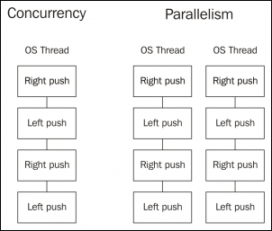
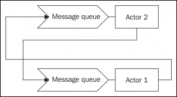
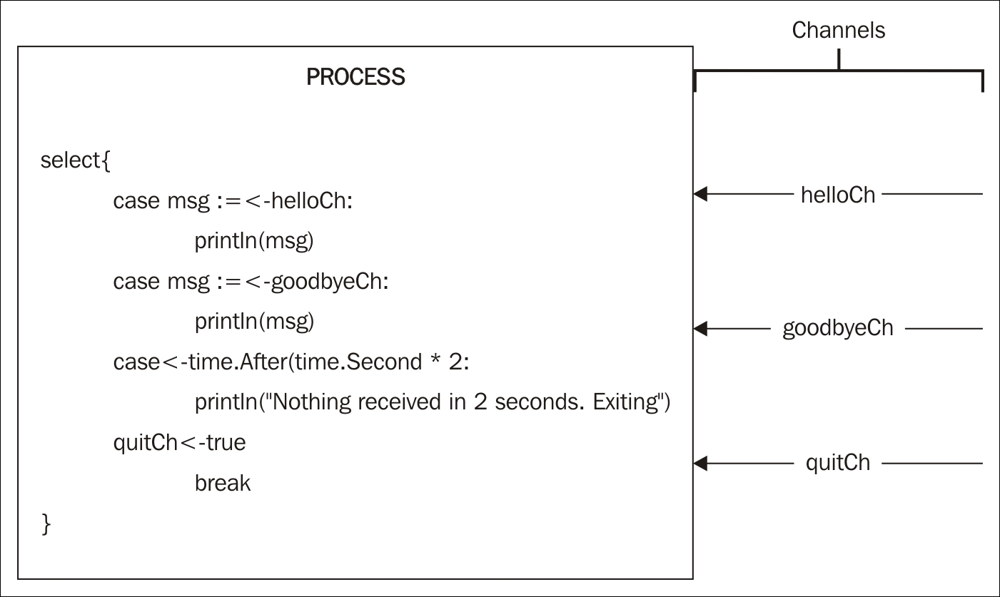

# 第八章。Gos 并发简介

我们刚刚完成了在面向对象编程语言中广泛使用的*四人帮*设计模式。在过去的几十年里，它们已经被广泛使用（甚至在它们被明确定义在一本书中之前）。

在本章中，我们将看到 Go 语言中的并发性。我们将学习，通过多个核心和多个进程，应用程序可以帮助我们实现更好的性能和无限的可能性。我们将看看如何以并发安全的方式使用一些已知的模式。

# 一点历史和理论

当我们谈论 Go 的并发性时，不可能不谈论历史。在过去的几十年里，我们看到 CPU 速度的提高，直到我们达到了当前硬件材料、设计和架构所施加的硬件限制。当我们达到这一点时，我们开始尝试第一台多核计算机，第一台双 CPU 主板，然后是心脏中有多个核心的单 CPU。

不幸的是，我们正在使用的语言仍然是在我们拥有单核 CPU 时创建的语言，比如 Java 或 C++。虽然它们是很棒的系统语言，但它们在设计上缺乏适当的并发支持。你可以通过使用第三方工具或开发自己的工具在项目中的这两种语言中开发并发应用（这并不是一件很容易的任务）。

Go 的并发是在考虑到这些警告的情况下设计的。创作者们希望有垃圾回收和程序化语言，对新手来说很熟悉，但同时又可以轻松编写并发应用，而不影响语言的核心。

我们在早期章节中已经经历过这一点。我们开发了 20 多种设计模式，却没有提到并发。这清楚地表明，Go 语言的并发特性完全与核心语言分离，同时又是其一部分，这是抽象和封装的完美例子。

在计算机科学中有许多并发模型，最著名的是出现在诸如**Erlang**或**Scala**等语言中的 actor 模型。另一方面，Go 使用**通信顺序进程**（**CSP**），它对并发有不同的方法。

## 并发与并行

许多人误解了两者之间的区别，甚至认为它们是相同的。Rob Pike，Go 的创始人之一，有一次流行的演讲，*并发不等于并行*，我非常同意。作为这次演讲的快速总结，我们可以得出以下结论：

+   并发是同时处理许多事情的能力

+   并行性是同时做很多事情的能力

通过设计正确的并发工作结构，并发能够实现并行。

例如，我们可以想象一辆自行车的机制。当我们踩踏时，通常是向下踩踏板产生力量（这种推动会使我们的另一条腿上升到相反的踏板）。我们不能同时用两条腿推动，因为曲柄不允许我们这样做。但这种设计允许建造一辆平行自行车，通常称为**串联自行车**。串联自行车是两个人可以同时骑的自行车；他们都踩踏板并施加力量给自行车。

在自行车的例子中，并发是设计一辆自行车，用两条腿（Goroutines）可以自己产生动力来移动自行车。这种设计是并发和正确的。如果我们使用串联自行车和两个人（两个核心），解决方案是并发的、正确的和并行的。但关键是，通过并发设计，我们不必担心并行性；如果我们的并发设计是正确的，我们可以将其视为额外的功能。事实上，我们可以只用一个人使用串联自行车，但自行车的并发设计仍然是正确的。



在并发方面，左侧有一个由同一 CPU 核心顺序执行的设计和结构。一旦有了这个设计和结构，通过在不同的线程上重复这个结构，就可以实现并行。

这就是 Go 通过简单地不太担心并行执行而更多地关注并发设计和结构来简化关于并发和并行程序的推理。将一个大任务分解成可以并发运行的小任务通常会在单核计算机上提供更好的性能，但如果这种设计也可以并行运行，我们可能会实现更高的吞吐量（或者不会，这取决于设计）。

实际上，我们可以通过将环境变量`GOMAXPROCS`设置为所需的核心数来设置 Go 应用程序中使用的核心数。这不仅在使用调度程序（如**Apache Mesos**）时很有用，而且还可以更好地控制 Go 应用程序的工作和性能。

因此，要总结一下，重要的是要记住，并发是关于结构，而并行是关于执行。我们必须考虑以更好的方式使我们的程序并发，通过将它们分解成更小的工作片段，如果可能且允许的话，Go 的调度器将尝试使它们并行化。

## CSP 与基于 actor 的并发

最常见且可能直观的思考并发的方式接近 actor 模型的工作方式。



在 actor 模型中，如果**Actor 1**想要与**Actor 2**通信，那么**Actor 1**必须首先了解**Actor 2**；例如，它必须有它的进程 ID，可能是从创建步骤中获得，并将消息放在其收件箱队列中。放置消息后，**Actor 1**可以继续其任务，而不会被阻塞，即使**Actor 2**无法立即处理消息。

另一方面，CSP 引入了一个新的实体-通道。通道是进程之间进行通信的方式，因为它们是完全匿名的（不像 actor，我们需要知道它们的进程 ID）。在 CSP 的情况下，我们没有进程 ID 用于通信。相反，我们必须创建一个通道给进程，以允许传入和传出的通信。在这种情况下，我们知道接收者是它用来接收数据的通道：


在这个图表中，我们可以看到这些进程是匿名的，但我们有一个 ID 为 1 的通道，即**通道 1**，将它们连接在一起。这种抽象并没有告诉我们每一侧通道上有多少个进程；它只是简单地连接它们，并允许它们通过通道进行通信。

关键在于通道隔离了两个极端，以便进程 A 可以通过一个通道发送数据，这些数据将由潜在的一个或多个对 A 透明的进程处理。它也在相反的情况下起作用；进程 B 可以一次从许多通道接收数据。

# Goroutines

在 Go 中，我们通过使用 Goroutines 来实现并发。它们就像在计算机上同时运行应用程序的进程；实际上，Go 的主循环也可以被认为是一个 Goroutine。Goroutines 在我们使用 actor 的地方使用。它们执行一些逻辑然后消失（或者如果有必要，保持循环）。

但是 Goroutines 不是线程。我们可以启动成千上万甚至百万个并发的 Goroutines。它们非常廉价，堆栈增长很小。我们将使用 Goroutines 来执行我们想要并发工作的代码。例如，通过三个 Goroutines 并行设计三个服务的调用来组成一个响应，可能并行进行服务调用，并且第四个 Goroutine 接收它们并组成响应。这里的重点是什么？如果我们有一台有四个核心的计算机，我们可能可以并行运行这个服务调用，但如果我们使用一台单核心的计算机，设计仍然是正确的，调用将在一个核心中并发执行。通过设计并发应用程序，我们不需要担心并行执行。

回到自行车的比喻，我们用两条腿踩踏自行车踏板。这是两个 Goroutines 同时踩踏踏板。当我们使用双人自行车时，我们总共有四个 Goroutines，可能在并行工作。但我们也有两只手来控制前后刹车。这是我们双人自行车上的八个 Goroutines。实际上，我们刹车时不踩踏板，踩踏板时不刹车；这是一个正确的并发设计。我们的神经系统传输关于何时停止踩踏板和何时开始刹车的信息。在 Go 中，我们的神经系统由通道组成；在玩弄 Goroutines 之后，我们将会看到它们。

## 我们的第一个 Goroutine

现在足够的解释了。让我们动手吧。对于我们的第一个 Goroutine，我们将在一个 Goroutine 中打印消息`Hello World!`。让我们从我们到目前为止一直在做的事情开始：

```go
package main 

func main() { 
  helloWorld() 
} 

func helloWorld(){ 
  println("Hello World!") 
} 

```

运行这段小代码片段将在控制台中简单地输出`Hello World!`：

```go
$ go run main.go
Hello World!

```

一点也不令人印象深刻。要在新的 Goroutine 中运行它，我们只需要在对函数的调用前加上关键字`go`：

```go
package main 

func main() { 
  go helloWorld() 
} 

func helloWorld(){ 
  println("Hello World!") 
} 

```

通过这个简单的词，我们告诉 Go 启动一个新的 Goroutine 来运行`helloWorld`函数的内容。

所以，让我们运行它：

```go
$ go run main.go 
$

```

什么？什么都没打印！为什么？当你开始处理并发应用程序时，事情变得复杂起来。问题在于`main`函数在`helloWorld`函数被执行之前就结束了。让我们一步一步地分析一下。`main`函数开始并安排一个新的 Goroutine 来执行`helloWorld`函数，但当函数结束时，函数并没有被执行——它仍然在调度过程中。

所以，我们`main`函数的问题在于`main`函数必须等待 Goroutine 被执行后才能结束。所以让我们停顿一秒钟，给 Goroutine 一些空间：

```go
package main 
import "time" 

func main() { 
  go helloWorld() 

  time.Sleep(time.Second) 
} 

func helloWorld(){ 
  println("Hello World!") 
} 

```

`time.Sleep`函数有效地使主 Goroutine 在继续（并退出）之前休眠一秒钟。如果我们现在运行这个程序，我们必须得到这个消息：

```go
$ go run main.go
Hello World!

```

我想你现在一定已经注意到了程序在结束之前会有一个小的冻结时间。这是休眠的函数。如果你正在做很多任务，你可能想把等待时间延长到你想要的任何时间。只要记住，在任何应用程序中，`main`函数不能在其他 Goroutines 之前结束。

## 匿名函数作为新的 Goroutines 启动

我们已经定义了`helloWorld`函数，以便可以使用不同的 Goroutine 启动它。这并不是严格必要的，因为你可以直接在函数的作用域中启动代码片段：

```go
package main 
import "time" 

func main() { 
  go func() { 
    println("Hello World") 
  }() 
  time.Sleep(time.Second) 
} 

```

这也是有效的。我们使用了一个匿名函数，并使用`go`关键字在一个新的 Goroutine 中启动它。仔细看函数的闭括号——它们后面跟着开括号和闭括号，表示函数的执行。

我们也可以向匿名函数传递数据：

```go
package main 
import "time" 

func main() { 
  go func(msg string) { 
    println(msg) 
  }("Hello World") 
  time.Sleep(time.Second) 
} 

```

这也是有效的。我们定义了一个接收字符串的匿名函数，然后打印接收到的字符串。当我们在不同的 Goroutine 中调用函数时，我们传递了要打印的消息。在这个意义上，以下示例也是有效的：

```go
package main 
import "time" 

func main() { 
  messagePrinter := func(msg string) { 
    println(msg) 
  } 

  go messagePrinter("Hello World") 
  go messagePrinter("Hello goroutine") 
  time.Sleep(time.Second) 
} 

```

在这种情况下，我们在`main`函数的范围内定义了一个函数，并将其存储在名为`messagePrinter`的变量中。现在我们可以通过使用`messagePrinter（string）`签名并发打印任意数量的消息：

```go
$ go run main.go
Hello World
Hello goroutine

```

我们刚刚触及了 Go 中并发编程的表面，但我们已经可以看到它可以非常强大。但我们绝对必须解决这个休眠期的问题。WaitGroups 可以帮助我们解决这个问题。

## WaitGroups

WaitGroup 位于同步包（`sync`包）中，帮助我们同步许多并发的 Goroutines。它非常容易使用-每当我们必须等待一个 Goroutine 完成时，我们向组中添加`1`，一旦它们全部添加，我们要求组等待。当 Goroutine 完成时，它会说`Done`，WaitGroup 将从组中取出一个：

```go
package main 

import ( 
  "sync" 
  "fmt" 
) 

func main() { 
  var wait sync.WaitGroup 
  wait.Add(1) 

  go func(){ 
    fmt.Println("Hello World!") 
    wait.Done() 
  }() 
  wait.Wait() 
} 

```

这是一个最简单的 WaitGroup 示例。首先，我们创建了一个变量来保存它，称为`wait`变量。接下来，在启动新的 Goroutine 之前，我们告诉 WaitGroup“嘿，你必须等待一件事情完成”，使用`wait.Add（1）`方法。现在我们可以启动 WaitGroup 必须等待的`1`，在这种情况下是打印`Hello World`并在 Goroutine 结束时说`Done`（使用`wait.Done（）`方法）的先前 Goroutine。最后，我们指示 WaitGroup 等待。我们必须记住，函数`wait.Wait（）`可能在 Goroutine 之前执行。

让我们再次运行代码：

```go
$ go run main.go 
Hello World!

```

现在它只等待必要的时间，而不是在退出应用程序之前多等待一毫秒。请记住，当我们使用`Add（value）`方法时，我们向 WaitGroup 添加实体，当我们使用`Done（）`方法时，我们减去一个。

实际上，`Add`函数接受一个增量值，因此以下代码等同于上一个：

```go
package main 

import ( 
  "sync" 
  "fmt" 
) 

func main() { 
  var wait sync.WaitGroup 
  wait.Add(1) 

  go func(){ 
    fmt.Println("Hello World!") 
    wait.Add(-1) 
  }() 
  wait.Wait() 
} 

```

在这种情况下，我们在启动 Goroutine 之前添加了`1`，并在其末尾添加了`-1`（减去 1）。如果我们预先知道要启动多少个 Goroutines，我们也可以只调用一次`Add`方法：

```go
package main 
import ( 
  "fmt" 
  "sync" 
) 

func main() { 
  var wait sync.WaitGroup 

  goRoutines := 5 
  wait.Add(goRoutines) 

  for i := 0; i < goRoutines; i++ { 
    go func(goRoutineID int) { 
      fmt.Printf("ID:%d: Hello goroutines!\n", goRoutineID) 
      wait.Done() 
    }(i) 
  } 
  wait.Wait() 
} 

```

在这个例子中，我们将创建五个 Goroutines（如`goroutines`变量中所述）。我们事先知道这一点，所以我们只需将它们全部添加到 WaitGroup 中。然后，我们将使用`for`循环启动相同数量的`goroutine`变量。每当一个 Goroutine 完成时，它都会调用 WaitGroup 的`Done（）`方法，该方法实际上在主循环的末尾等待。

同样，在这种情况下，代码在启动所有 Goroutines（如果有的话）之前到达`main`函数的末尾，并且 WaitGroup 使主流程的执行等待，直到所有`Done`消息被调用。让我们运行这个小程序：

```go
$ go run main.go 

ID:4: Hello goroutines!
ID:0: Hello goroutines!
ID:1: Hello goroutines!
ID:2: Hello goroutines!
ID:3: Hello goroutines!

```

我们之前没有提到，但我们已将迭代索引作为参数`GoroutineID`传递给每个 Goroutine，以便用消息`Hello goroutines！`打印它。您可能还注意到 Goroutines 不按顺序执行。当然！我们正在处理一个不保证 Goroutines 执行顺序的调度程序。这是编写并发应用程序时要牢记的事情。实际上，如果我们再次执行它，我们不一定会得到相同的输出顺序：

```go
$ go run main.go
ID:4: Hello goroutines!
ID:2: Hello goroutines!
ID:1: Hello goroutines!
ID:3: Hello goroutines!
ID:0: Hello goroutines!

```

# 回调

现在我们知道如何使用 WaitGroups，我们还可以介绍回调的概念。如果您曾经使用过像 JavaScript 这样广泛使用回调的语言，这一部分对您来说将是熟悉的。回调是将在不同函数的上下文中执行的匿名函数。

例如，我们想要编写一个将字符串转换为大写的函数，同时使其异步化。我们如何编写这个函数以便使用回调？有一个小技巧——我们可以有一个接受一个字符串并返回一个字符串的函数：

```go
func toUpperSync(word string) string { 
  //Code will go here 
} 

```

因此，将这个函数的返回类型（一个字符串）作为匿名函数的第二个参数，如下所示：

```go
func toUpperSync(word string, f func(string)) { 
  //Code will go here 
} 

```

现在，`toUpperSync`函数不返回任何内容，但也接受一个函数，巧合的是，这个函数也接受一个字符串。我们可以用通常返回的结果来执行这个函数。

```go
func toUpperSync(word string, f func(string)) { 
  f(strings.ToUpper(word)) 
} 

```

我们用提供的单词调用`strings.ToUpper`方法的结果来执行`f`函数（它返回大写的`parameter`）。我们也写`main`函数：

```go
package main 

import ( 
  "fmt" 
  "strings" 
) 

func main() { 
  toUpperSync("Hello Callbacks!", func(v string) {   
    fmt.Printf("Callback: %s\n", v) }) 
} 

func toUpperSync(word string, f func(string)) { 
  f(strings.ToUpper(word)) 
} 

```

在我们的主要代码中，我们已经定义了我们的回调。正如你所看到的，我们传递了测试`Hello Callbacks!`来将其转换为大写。接下来，我们传递回调以执行将我们的字符串转换为大写的结果。在这种情况下，我们只是在控制台上打印文本，并在其前面加上文本`Callback`。当我们执行这段代码时，我们得到以下结果：

```go
$ go run main.go
Callback: HELLO CALLBACKS!

```

严格来说，这是一个同步回调。要使它异步，我们必须引入一些并发处理：

```go
package main 
import ( 
  "fmt" 
  "strings" 
  "sync" 
) 

var wait sync.WaitGroup 

func main() { 
  wait.Add(1) 

  toUpperAsync("Hello Callbacks!", func(v string) { 
    fmt.Printf("Callback: %s\n", v) 
    wait.Done() 
  }) 

  println("Waiting async response...") 
  wait.Wait() 
} 

func toUpperAsync(word string, f func(string)) { 
  go func(){ 
    f(strings.ToUpper(word)) 
  }() 
} 

```

这是异步执行的相同代码。我们使用 WaitGroups 来处理并发（稍后我们将看到通道也可以用于此）。现在，我们的函数`toUpperAsync`就像其名字所暗示的那样是异步的。我们通过在调用回调时使用关键字`go`在不同的 Goroutine 中启动了回调。我们写了一条小消息来更准确地显示并发执行的顺序性质。我们等待直到回调信号它已经完成，然后我们可以安全地退出程序。当我们执行这个时，我们得到以下结果：

```go
$ go run main.go 

Waiting async response...
Callback: HELLO CALLBACKS!

```

正如你所看到的，程序在执行`toUpperAsync`函数的回调之前就已经到达了`main`函数的末尾。这种模式带来了许多可能性，但也让我们面临一个被称为回调地狱的大问题。

## 回调地狱

术语**回调地狱**通常用来指代当许多回调被堆叠在一起时。当它们增长过多时，这使得它们难以理解和处理。例如，使用与之前相同的代码，我们可以堆叠另一个异步调用与先前打印到控制台的内容：

```go
func main() { 
  wait.Add(1) 

  toUpperAsync("Hello Callbacks!", func(v string) { 
    toUpperAsync(fmt.Sprintf("Callback: %s\n", v), func(v string) { 
      fmt.Printf("Callback within %s", v) 
      wait.Done() 
    }) 
  }) 
  println("Waiting async response...") 
  wait.Wait() 
} 

```

（我们省略了导入、包名和`toUpperAsync`函数，因为它们没有改变。）现在我们在`toUpperAsync`函数中有一个`toUpperAsync`函数，如果我们愿意，我们可以嵌套更多。在这种情况下，我们再次传递我们先前在控制台上打印的文本，以便在下一个回调中使用。内部回调最终在控制台上打印它，得到以下输出：

```go
$ go run main.go 
Waiting async response...
Callback within CALLBACK: HELLO CALLBACKS!

```

在这种情况下，我们可以假设外部回调将在内部回调之前执行。这就是为什么我们不需要在 WaitGroup 中再添加一个。

关键在于我们在使用回调时必须小心。在非常复杂的系统中，太多的回调很难理解和处理。但是经过谨慎和理性的处理，它们是强大的工具。

# 互斥锁

如果你正在处理并发应用程序，你必须处理多个资源可能访问某个内存位置。这通常被称为**竞争条件**。

简单来说，竞争条件类似于两个人同时试图拿到最后一块披萨的时刻——他们的手碰到了一起。用变量替换披萨，用 Goroutines 替换他们的手，我们就有了一个完美的类比。

在这里，有一个人物在晚餐桌上解决这些问题——一个父亲或母亲。他们把披萨放在另一张桌子上，我们必须在拿到我们的披萨之前请求站起来的许可。不管所有的孩子同时问，他们只会允许一个孩子站起来。

好吧，互斥锁就像我们的父母。他们会控制谁可以访问披萨——我的意思是，一个变量——他们不会允许其他人访问它。

要使用互斥锁，我们必须主动锁定它；如果它已经被锁定（另一个 Goroutine 正在使用它），我们必须等待直到它再次解锁。一旦我们获得对互斥锁的访问权，我们可以再次锁定它，进行任何必要的修改，然后再次解锁它。我们将通过一个示例来看看这个过程。

## 使用互斥锁的示例-并发计数器

互斥锁在并发编程中被广泛使用。在 Go 语言中可能没有那么常见，因为它在并发编程中使用通道的更具惯性的方式，但是值得看看它们在通道不太适用的情况下是如何工作的。

对于我们的示例，我们将开发一个小型并发计数器。这个计数器将在`Counter`类型中的整数字段中添加一个。这应该以一种并发安全的方式完成。

我们的`Counter`结构定义如下：

```go
type Counter struct { 
  sync.Mutex 
  value int 
} 

```

`Counter`结构有一个`int`类型的字段，用于存储计数的当前值。它还嵌入了`sync`包中的`Mutex`类型。嵌入这个字段将允许我们锁定和解锁整个结构，而无需主动调用特定字段。

我们的`main`函数启动了 10 个 Goroutines，它们尝试将`Counter`结构的字段值加一。所有这些都是并发完成的。

```go
package main 

import ( 
  "sync" 
  "time" 
) 

func main() { 
  counter := Counter{} 

  for i := 0; i < 10; i++ { 
    go func(i int) { 
      counter.Lock() 
      counter.value++ 
      defer counter.Unlock() 
    }(i) 
  } 
  time.Sleep(time.Second) 

  counter.Lock() 
  defer counter.Unlock() 

  println(counter.value) 
} 

```

我们创建了一个名为`Counter`的类型。使用`for`循环，我们启动了总共 10 个 Goroutines，就像我们在*作为新 Goroutines 启动的匿名函数*部分看到的那样。但是在每个 Goroutine 内部，我们都锁定了计数器，以便没有更多的 Goroutines 可以访问它，将一个添加到字段值中，然后再次解锁，以便其他人可以访问它。

最后，我们将打印计数器持有的值。它必须是 10，因为我们启动了 10 个 Goroutines。

但是，我们如何知道这个程序是线程安全的呢？好吧，Go 自带了一个非常方便的内置功能，叫做“竞争检测器”。

## 介绍竞争检测器

我们已经知道什么是竞争条件。简而言之，当两个进程尝试在同一时间访问同一资源，并且在那一刻涉及一个或多个写操作（两个进程都在写入，或者一个进程在写入而另一个在读取）时，就会使用它。

Go 有一个非常方便的工具来帮助诊断竞争条件，你可以在你的测试或主应用程序中直接运行。所以让我们重用我们刚刚为*互斥锁*部分编写的示例，并使用竞争检测器运行它。这就像在我们的程序的命令执行中添加`-race`命令行标志一样简单：

```go
$ go run -race main.go 
10

```

嗯，这不是很令人印象深刻，是吗？但实际上它告诉我们，在这个程序的代码中没有检测到潜在的竞争条件。让我们通过在修改`counter`之前不锁定它来使`-race`标志的检测器警告我们可能存在竞争条件： 

```go
for i := 0; i < 10; i++ { 
  go func(i int) { 
    //counter.Lock() 
    counter.value++ 
    //counter.Unlock() 
  }(i) 
} 

```

在`for`循环内，在将`1`添加到字段值之前和之后，注释掉`Lock`和`Unlock`调用。这将引入竞争条件。让我们再次运行相同的程序，并激活竞争标志：

```go
$ go run -race main.go 
==================
WARNING: DATA RACE
Read at 0x00c42007a068 by goroutine 6:
 main.main.func1()
 [some_path]/concurrency/locks/main.go:19 +0x44
Previous write at 0x00c42007a068 by goroutine 5:
 main.main.func1()
 [some_path]/concurrency/locks/main.go:19 +0x60
Goroutine 6 (running) created at:
 main.main()
 [some_path]/concurrency/locks/main.go:21 +0xb6
Goroutine 5 (finished) created at:
 main.main()
 [some_path]/concurrency/locks/main.go:21 +0xb6
==================
10
Found 1 data race(s)
exit status 66

```

我已经减少了一些输出，以便更清楚地看到事情。我们可以看到一个大写的警告消息，上面写着“警告：数据竞争”。但这个输出很容易理解。首先，它告诉我们，我们的`main.go`文件上的*第 19 行*代表的某个内存位置正在读取某个变量。但在同一文件的*第 19 行*上也有一个写操作！

这是因为`++`操作需要读取当前值并写入一个值。这就是为什么竞争条件在同一行中，因为每次执行它时，它都会读取并写入`Counter`结构中的字段。

但是让我们记住，竞争检测器是在运行时工作的。它不会静态分析我们的代码！这是什么意思？这意味着我们的设计中可能存在潜在的竞争条件，竞争检测器不会检测到。例如：

```go
package main 

import "sync" 

type Counter struct { 
  sync.Mutex 
  value int 
} 

func main() { 
  counter := Counter{} 

  for i := 0; i < 1; i++ { 
    go func(i int) { 
      counter.value++ 
    }(i) 
  } 
} 

```

我们将保留前面示例中显示的代码。我们将从代码中删除所有锁定和解锁，并启动一个单个 Goroutine 来更新`value`字段：

```go
$ go run -race main.go
$

```

没有警告，所以代码是正确的。好吧，我们知道，按设计，它不是。我们可以将执行的 Goroutines 数量提高到两个，然后看看会发生什么：

```go
for i := 0; i < 2; i++ { 
  go func(i int) { 
    counter.value++ 
  }(i) 
} 

```

让我们再次执行程序：

```go
$ go run -race main.go
WARNING: DATA RACE
Read at 0x00c42007a008 by goroutine 6:
 main.main.func1()
 [some_path]concurrency/race_detector/main.go:15 +0x44
Previous write at 0x00c42007a008 by goroutine 5:
 main.main.func1()
 [some_path]/concurrency/race_detector/main.go:15 +0x60
Goroutine 6 (running) created at:
 main.main()
 [some_path]/concurrency/race_detector/main.go:16 +0xad
Goroutine 5 (finished) created at:
 main.main()
 [some_path]/concurrency/race_detector/main.go:16 +0xad
==================
Found 1 data race(s)
exit status 66

```

现在是的，竞争条件被检测到了。但是如果我们将正在使用的处理器数量减少到只有一个，我们也会有竞争条件吗？

```go
$ GOMAXPROCS=1 go run -race main.go
$

```

似乎没有检测到竞争条件。这是因为调度程序首先执行了一个 Goroutine，然后执行了另一个，所以最终没有发生竞争条件。但是，使用更多的 Goroutines，即使只使用一个核心，它也会警告我们有关竞争条件。

因此，竞争检测器可以帮助我们检测代码中发生的竞争条件，但它不会保护我们免受不立即执行竞争条件的糟糕设计。这是一个非常有用的功能，可以帮我们避免很多麻烦。

# 通道

通道是语言中允许我们编写并发应用程序的第二个原语。我们在*通信顺序进程*部分已经谈到了一些关于通道的内容。

通道是我们在进程之间进行通信的方式。我们可以共享一个内存位置，并使用互斥锁来控制进程的访问。但是通道为我们提供了一种更自然的方式来处理并发应用程序，这也在我们的程序中产生了更好的并发设计。

## 我们的第一个通道

如果我们不能在它们之间创建一些同步，那么使用许多 Goroutines 似乎是相当困难的。只要它们被同步，执行顺序可能就不重要了。通道是在 Go 中编写并发应用程序的第二个关键特性。

现实生活中的电视频道是将一个发射（来自工作室）连接到数百万台电视机（接收器）的东西。Go 中的通道以类似的方式工作。一个或多个 Goroutines 可以作为发射器，一个或多个 Goroutine 可以作为接收器。

还有一件事，通道默认情况下会阻塞 Goroutines 的执行，直到接收到消息。这就好像我们最喜欢的电视节目延迟发射，直到我们打开电视，这样我们就不会错过任何东西。

在 Go 中如何实现这一点？

```go
package main 

import "fmt" 

func main() { 
  channel := make(chan string) 
  go func() { 
    channel <- "Hello World!" 
  }() 

  message := <-channel 
  fmt.Println(message) 
} 

```

在 Go 中创建通道时，我们使用创建切片时使用的相同语法。使用`make`关键字创建通道，我们必须传递关键字`chan`和通道将传输的类型，本例中为字符串。有了这个，我们就有了一个名为`channel`的阻塞通道。接下来，我们启动一个 Goroutines，向通道发送消息`Hello World!`。这由直观的箭头表示，显示了流向--`Hello World!`文本传递给（`<-`）通道。这就像在变量中进行赋值一样，所以我们只能通过先写通道，然后箭头，最后是要传递的值来传递东西给通道。我们不能写`"Hello World!" -> channel`。

正如我们之前提到的，这个通道会阻塞 Goroutines 的执行，直到接收到消息。在这种情况下，`main`函数的执行会在启动的 Goroutines 的消息到达通道的另一端的行`message := <-channel`之前停止。在这种情况下，箭头指向相同的方向，但是放在通道之前，表示数据正在从通道中提取并分配给一个名为`message`的新变量（使用新的赋值"`:=`"运算符）。

在这种情况下，我们不需要使用 WaitGroup 来同步`main`函数和创建的 Goroutines，因为通道的默认性质是阻塞直到接收到数据。但是反过来呢？如果 Goroutine 发送消息时没有接收器，它会继续吗？让我们编辑这个例子来看看：

```go
package main 

import ( 
  "fmt" 
  "time" 
) 

func main() { 
  channel := make(chan string) 

  var waitGroup sync.WaitGroup 

  waitGroup.Add(1) 
  go func() { 
    channel <- "Hello World!" 
    println("Finishing goroutine") 
    waitGroup.Done() 
  }() 

  time.Sleep(time.Second) 
  message := <-channel 
  fmt.Println(message) 
  waitGroup.Wait() 
} 

```

我们将再次使用`Sleep`函数。在这种情况下，我们在 Goroutine 完成时打印一条消息。最大的区别在于`main`函数。现在，在我们监听通道获取数据之前，我们等待一秒钟：

```go
$ go run main.go

Finishing goroutine
Hello World!

```

输出可能会有所不同，因为再次强调，执行顺序没有保证，但现在我们可以看到，直到一秒钟过去之前都没有消息被打印出来。在初始延迟之后，我们开始监听通道，接收数据并打印出来。因此，发射器也必须等待来自通道另一侧的提示才能继续执行。

总之，通道是通过一端发送数据，另一端接收数据的方式，在 Goroutines 之间进行通信（就像管道一样）。在它们的默认状态下，发射器 Goroutine 将阻塞其执行，直到接收器 Goroutine 接收数据。接收器 Goroutine 也是一样，它将阻塞，直到某个发射器通过通道发送数据。因此，你可以有被动的监听器（等待数据）或被动的发射器（等待监听器）。

## 缓冲通道

缓冲通道的工作方式与默认的非缓冲通道类似。你也可以通过使用箭头来传递和获取值，但与非缓冲通道不同的是，发送者不需要等待某个 Goroutine 接收它们发送的数据：

```go
package main 

import ( 
  "fmt" 
  "time" 
) 

func main() { 
  channel := make(chan string, 1) 

  go func() { 
    channel <- "Hello World!" 
    println("Finishing goroutine") 
  }() 

  time.Sleep(time.Second) 

  message := <-channel 
  fmt.Println(message) 
} 

```

这个例子与我们用于通道的第一个例子类似，但现在我们在`make`语句中将通道的容量设置为 1。通过这样做，我们告诉编译器，在被阻塞之前，该通道可以容纳一个字符串。因此，第一个字符串不会阻塞发射器，但第二个会。让我们运行这个例子：

```go
$ go run main.go

Finishing goroutine
Hello World!

```

现在我们可以随意运行这个小程序，输出将始终按照相同的顺序。这一次，我们启动了并发函数并等待了一秒钟。以前，匿名函数在第二秒过去并且有人可以接收到发送的数据之前是不会继续的。在这种情况下，使用缓冲通道，数据被保存在通道中并释放 Goroutine 以继续执行。在这种情况下，Goroutine 总是在等待时间过去之前完成。

这个新通道的大小为 1，因此第二个消息会阻塞 Goroutine 的执行：

```go
package main 

import ( 
  "fmt" 
  "time" 
) 

func main() { 
  channel := make(chan string, 1) 

  go func() { 
    channel <- "Hello World! 1" 
    channel <- "Hello World! 2" 
    println("Finishing goroutine") 
  }() 

  time.Sleep(time.Second) 

  message := <-channel 
  fmt.Println(message) 
} 

```

在这里，我们添加了第二个`Hello world! 2`消息，并为其提供了一个索引。在这种情况下，该程序的输出可能如下所示：

```go
$ go run main.go
Hello World! 1

```

表示我们刚刚从通道缓冲区中取出了一条消息，我们已经打印出来了，并且`main`函数在启动的 Goroutine 完成之前就结束了。当发送第二条消息时，Goroutine 被阻塞，直到另一端接收了第一条消息。然后它打印出来得如此之快，以至于没有时间打印出消息来显示 Goroutine 的结束。如果你在控制台上不断执行程序，sooner or later 调度器会在主线程之前完成 Goroutine 的执行。

## 方向性通道

关于 Go 通道的一个很酷的特性是，当我们将它们用作参数时，我们可以限制它们的方向性，使它们只能用于发送或接收。如果通道在受限方向上被使用，编译器会报错。这个特性为 Go 应用程序应用了新的静态类型级别，并使代码更易理解和更易读。

我们将用通道来举一个简单的例子：

```go
package main 

import ( 
  "fmt" 
  "time" 
) 

func main() { 
  channel := make(chan string, 1) 

 go func(ch chan<- string) { 
    ch <- "Hello World!" 
    println("Finishing goroutine") 
  }(channel) 

  time.Sleep(time.Second) 

  message := <-channel 
  fmt.Println(message) 
} 

```

在我们启动新的 Goroutine `go func(ch chan<- string)`的那一行，声明了传递给这个函数的通道只能用作输入通道，你不能监听它。

我们也可以传递一个只用作接收器通道的通道：

```go
func receivingCh(ch <-chan string) { 
  msg := <-ch 
  println(msg) 
} 

```

正如你所看到的，箭头位于`chan`关键字的相反方向，表示从通道中提取操作。请记住，通道箭头总是指向左边，以指示接收通道，它必须指向左边，以指示插入通道，它必须指向右边。

如果我们试图通过这个*只接收*通道发送一个值，编译器会抱怨：

```go
func receivingCh(ch <-chan string) { 
  msg := <-ch 
  println(msg) 
  ch <- "hello" 
} 

```

这个函数有一个只接收通道，我们将尝试通过它发送消息`hello`。让我们看看编译器说了什么：

```go
$ go run main.go
./main.go:20: invalid operation: ch <- "hello2" (send to receive-only type <-chan string)

```

它不喜欢它，并要求我们纠正它。现在代码更加可读和安全，我们只是在`chan`参数的前面或后面放置了一个箭头。

## 选择语句

`select`语句也是 Go 中的一个关键特性。它用于在一个 Goroutine 中处理多个通道输入。事实上，它打开了许多可能性，在接下来的章节中我们将广泛使用它。



在`select`结构中，我们要求程序在一个或多个通道之间选择接收它们的数据。我们可以将这些数据保存在一个变量中，并在完成选择之前对其进行处理。`select`结构只执行一次；不管它是否在监听多个通道，它只会执行一次，代码将继续执行。如果我们希望它多次处理相同的通道，我们必须将其放在一个`for`循环中。

我们将创建一个小应用程序，将消息`hello`和消息`goodbye`发送到同一个 Goroutine 中，该 Goroutine 将打印它们，并在五秒内没有收到其他消息时退出。

首先，我们将创建一个通用函数，用于通过通道发送一个字符串：

```go
func sendString(ch chan<- string, s string) { 
  ch <- s 
} 

```

现在我们可以通过简单调用`sendString`方法向通道发送一个字符串。现在是接收者的时间了。接收者将从两个通道接收消息--一个发送`hello`消息的通道，一个发送`goodbye`消息的通道。你也可以在之前的图表中看到这一点：

```go
func receiver(helloCh, goodbyeCh <-chan string, quitCh chan<- bool) { 
  for { 
    select { 
    case msg := <-helloCh: 
      println(msg) 
    case msg := <-goodbyeCh: 
      println(msg) 
    case <-time.After(time.Second * 2): 
      println("Nothing received in 2 seconds. Exiting") 
      quitCh <- true 
      break 
    } 
  } 
} 

```

让我们从参数开始。这个函数接受三个通道--两个接收通道和一个用于通过它发送东西的通道。然后，它使用`for`关键字开始一个无限循环。这样我们就可以永远保持对两个通道的监听。

在`select`块的范围内，我们必须为我们想要处理的每个通道使用一个 case（你是否意识到它与`switch`语句有多么相似？）。让我们一步一步地看看这三种情况：

+   第一种情况接收来自`helloCh`参数的传入数据，并将其保存在一个名为`msg`的变量中。然后它打印出这个变量的内容。

+   第二种情况接收来自`goodbyeCh`参数的传入数据，并将其保存在一个名为`msg`的变量中。然后它也打印出这个变量的内容。

+   第三种情况非常有趣。它调用`time`函数。之后，如果我们检查它的签名，它接受一个时间和持续时间值，并返回一个接收通道。这个接收通道将在指定的持续时间过去后接收一个时间，`time`的值。在我们的例子中，我们使用它返回的通道作为超时。因为每次处理后`select`都会重新启动，计时器也会重新启动。这是一个非常简单的方法，可以为等待一个或多个通道的响应的 Goroutine 设置一个计时器。

`main`函数准备就绪：

```go
package main 
import "time" 

func main() { 
  helloCh := make(chan string, 1) 
  goodbyeCh := make(chan string, 1) 
  quitCh := make(chan bool) 
  go receiver(helloCh, goodbyeCh, quitCh) 

  go sendString(helloCh, "hello!") 

  time.Sleep(time.Second) 

  go sendString(goodbyeCh, "goodbye!") 
  <-quitCh 
} 

```

再一步一步地，我们创建了这个练习中需要的三个通道。然后，我们在一个不同的 Goroutine 中启动了我们的`receiver`函数。这个 Goroutine 由 Go 的调度程序处理，我们的程序继续执行。我们启动了一个新的 Goroutine，向`helloCh`参数发送消息`hello`。同样，这将在 Go 的调度程序决定时最终发生。

我们的程序再次继续，并等待一秒。在这个间歇中，Go 的调度程序将有时间执行接收者和第一条消息（如果尚未执行），所以`hello!`消息将在间歇期间出现在控制台上。

一个新的消息通过`goodbye`通道以`goodbye!`文本的形式发送到一个新的 Goroutine 中，我们的程序再次继续执行，等待在`quitCh`参数中接收到一条消息的行。

我们已经启动了三个 Goroutine--接收者仍在运行，第一个消息在消息被`select`语句处理时已经完成，第二个消息几乎立即被打印并完成了。所以此刻只有接收者在运行，如果在接下来的两秒内没有收到其他消息，它将处理来自`time`结构的传入消息。在`channel`类型之后，打印一条消息以表明它正在退出，向`quitCh`发送一个`true`，并中断它正在循环的无限循环。

让我们运行这个小应用程序：

```go
$ go run main.go

hello!
goodbye!
Nothing received in 2 seconds. Exiting

```

结果可能并不令人印象深刻，但概念是清晰的。我们可以使用 select 语句在同一个 Goroutine 中处理许多传入的通道。

## 也可以对通道进行范围遍历！

我们将看到关于通道的最后一个特性是对通道进行范围遍历。我们谈论的是范围关键字。我们已经广泛使用它来遍历列表，我们也可以用它来遍历通道：

```go
package main 

import "time" 

func main() { 
  ch := make(chan int) 

  go func() { 
    ch <- 1 
    time.Sleep(time.Second) 

    ch <- 2 

    close(ch) 
  }() 
  for v := range ch { 
    println(v) 
  } 
} 

```

在这种情况下，我们创建了一个非缓冲通道，但它也可以使用缓冲通道。我们在一个新的 Goroutine 中启动一个函数，该函数通过通道发送数字"1"，等待一秒，发送数字"2"，然后关闭通道。

最后一步是对通道进行范围遍历。语法与列表范围非常相似。我们将从通道中存储传入的数据到变量`v`，并将这个变量打印到控制台。范围会一直迭代，直到通道关闭，从通道中获取数据。

你能猜出这个小程序的输出吗？

```go
$ go run main.go

1
2

```

同样，并不令人印象深刻。它打印数字"1"，然后等待一秒，打印数字"2"，然后退出应用程序。

根据这个并发应用程序的设计，范围会迭代可能从通道中传入的数据

通道

直到并发 Goroutine 关闭这个通道。在那一刻，范围结束，应用程序可以退出。

范围在从通道中获取数据时非常有用，并且通常用于多个不同的 Goroutine 向同一个通道发送数据的扇入模式中。

# 使用所有这些-并发单例

既然我们知道如何创建 Goroutines 和通道，我们将把所有的知识放在一个单一的包中。回想一下前几章，当我们解释单例模式时--它是一种只能在我们的代码中存在一次的结构或变量。对这个结构的所有访问都应该使用所描述的模式，但实际上，它并不是并发安全的。

现在我们将考虑并发编写。我们将编写一个并发计数器，就像我们在*互斥*部分中编写的那样，但这次我们将使用通道来解决它。

## 单元测试

为了限制对`singleton`实例的并发访问，只有一个 Goroutine 能够访问它。我们将使用通道访问它--第一个通道用于添加一个，第二个通道用于获取当前计数，第三个通道用于停止 Goroutine。

我们将使用从两个不同的`singleton`实例启动的 10,000 个不同的 Goroutine 添加 10,000 次。然后，我们将引入一个循环来检查`singleton`的计数，直到达到 5,000，但我们将在开始循环之前写下计数是多少。

一旦计数达到 5,000，循环将退出并退出运行的 Goroutine--测试代码看起来像这样：

```go
package channel_singleton 
import ( 
  "testing" 
  "time" 
  "fmt" 
) 

func TestStartInstance(t *testing.T) { 
  singleton := GetInstance() 
  singleton2 := GetInstance() 

  n := 5000 

  for i := 0; i < n; i++ { 
    go singleton.AddOne() 
    go singleton2.AddOne() 
  } 

  fmt.Printf("Before loop, current count is %d\n", singleton.GetCount()) 

  var val int 
  for val != n*2 { 
    val = singleton.GetCount() 
    time.Sleep(10 * time.Millisecond) 
  } 
  singleton.Stop() 
} 

```

在这里，我们可以看到我们将使用的完整测试。在创建两个`singleton`实例之后，我们创建了一个`for`循环，从每个实例中启动`AddOne`方法 5,000 次。这还没有发生；它们正在被调度，最终将被执行。我们打印`singleton`实例的计数，以清楚地看到这种可能性；根据计算机的不同，它将打印出一个大于 0 且小于 10,000 的数字。

在停止持有计数的 Goroutine 之前的最后一步是进入一个循环，检查计数的值，并在值不是预期值（10,000）时等待 10 毫秒。一旦达到这个值，循环将退出，我们可以停止`singleton`实例。

由于要求非常简单，我们将直接跳转到实施。

## 实施

首先，我们将创建将保存计数的 Goroutine：

```go
var addCh chan bool = make(chan bool) 
var getCountCh chan chan int = make(chan chan int) 
var quitCh chan bool = make(chan bool) 

func init() { 
  var count int 

  go func(addCh <-chan bool, getCountCh <-chan chan int, quitCh <-chan bool) { 
    for { 
      select { 
      case <-addCh: 
        count++ 
      case ch := <-getCountCh: 
        ch <- count 
      case <-quitCh: 
        return 
      } 
    } 
  }(addCh, getCountCh, quitCh) 
} 

```

我们创建了三个通道，正如我们之前提到的：

+   `addCh`通道用于与添加一个计数的动作进行通信，并接收一个`bool`类型，只是为了发出“添加一个”的信号（虽然我们可以发送数字，但我们不需要）。

+   `getCountCh`通道将返回一个将接收计数的当前值的通道。花点时间思考一下`getCountCh`通道-它是一个接收整数类型的通道的通道。听起来有点复杂，但当我们完成示例时，它会更有意义，不用担心。

+   `quitCh`通道将通知 Goroutine 应该结束其无限循环并结束自身。

现在我们有了执行我们想要的操作所需的通道。接下来，我们启动 Goroutine，将通道作为参数传递。正如你所看到的，我们正在限制通道的方向，以提供更多的类型安全性。在这个 Goroutine 内部，我们创建了一个无限的`for`循环。这个循环不会停止，直到在其中执行了一个中断。

最后，`select`语句，如果你还记得，是一种同时从不同通道接收数据的方法。我们有三种情况，因此我们监听了作为参数输入的三个传入通道：

+   `addCh`情况将计数增加一。请记住，每次迭代只能执行一个情况，以便没有 Goroutine 可以访问当前计数，直到我们完成添加一个。

+   `getCountCh`通道接收一个接收整数的通道，因此我们捕获了这个新通道，并通过它发送当前值到另一端。

+   `quitCh`通道中断`for`循环，因此 Goroutine 结束。

最后一件事。在任何包中，`init()`函数将在程序执行时执行，因此我们不需要担心从我们的代码中特别执行此函数。

现在，我们将创建测试所期望的类型。我们将看到所有的魔术和逻辑都隐藏在这种类型中，对最终用户来说（正如我们在测试代码中看到的）：

```go
type singleton struct {} 

var instance singleton 
func GetInstance() *singleton { 
  return &instance 
} 

```

`singleton`类型的工作方式类似于第二章中的工作方式，*创建模式-单例，生成器，工厂，原型和抽象工厂*，但这次它不会保存计数值。我们为其创建了一个名为`instance`的本地值，并在调用`GetInstance()`方法时返回指向此实例的指针。这样做并不是严格必要的，但我们不需要在每次访问计数变量时分配`singleton`类型的新实例。

首先，`AddOne()`方法将不得不将当前计数加一。如何？通过向`addCh`通道发送`true`。这很简单：

```go
func (s *singleton) AddOne() { 
  addCh <- true 
} 

```

这个小片段将依次触发我们的 Goroutine 中的`addCh`情况。`addCh`情况只是执行`count++`并完成，让`select`通道控制流执行`init`函数中的下一个指令：

```go
func (s *singleton) GetCount() int { 
  resCh := make(chan int) 
  defer close(resCh) 
  getCountCh <- resCh 
  return <-resCh 
} 

```

`GetCount`方法每次被调用时都会创建一个通道，并推迟在函数结束时关闭它的操作。这个通道是无缓冲的，正如我们在本章中之前看到的那样。无缓冲通道会阻塞执行，直到它接收到一些数据。因此，我们将这个通道发送到`getCountCh`，它也是一个通道，并且有效地期望一个`chan int`类型通过它发送当前计数值。`GetCount()`方法将不会返回，直到`count`变量的值到达`resCh`通道。

你可能会想，为什么我们不在两个方向上使用相同的通道来接收计数的值？这样我们就可以避免分配。如果我们在`GetCount()`方法中使用相同的通道，我们将在这个通道中有两个监听器--一个在`select`语句中，在文件的开头的`init`函数中，一个在那里，所以当发送值时它可以解析到任何一个：

```go
func (s *singleton) Stop() { 
  quitCh <- true 
  close(addCh) 
  close(getCountCh) 
  close(quitCh) 
} 

```

最后，我们必须在某个时刻停止 Goroutine。`Stop`方法向`singleton`类型的 Goroutine 发送值，以触发`quitCh`情况并打破`for`循环。下一步是关闭所有通道，以便不再通过它们发送数据。当你知道你不会再使用一些通道时，这非常方便。

执行测试并查看时间：

```go
$ go test -v .
=== RUN   TestStartInstance
Before loop, current count is 4911
--- PASS: TestStartInstance (0.03s)
PASS
ok

```

输出的代码很少，但一切都按预期工作。在测试中，我们在进入循环之前打印了计数的值，直到达到值 10000。正如我们之前看到的，Go 调度器将尝试使用尽可能多的 OS 线程来运行 Goroutines 的内容，通过使用`GOMAXPROCS`配置来配置。在我的电脑上，它设置为`4`，因为我的电脑有四个核心。但关键是我们可以看到在启动 Goroutine（或 10000 个）和下一个执行行之后会发生很多事情。

但互斥锁的使用呢？

```go
type singleton struct { 
  count int 
  sync.RWMutex 
} 

var instance singleton 

func GetInstance() *singleton { 
  return &instance 
} 

func (s *singleton) AddOne() { 
  s.Lock() 
  defer s.Unlock() 
  s.count++ 
} 

func (s *singleton) GetCount()int { 
  s.RLock() 
  defer s.RUnlock() 
  return s.count 
} 

```

在这种情况下，代码要简洁得多。正如我们之前看到的，我们可以在`singleton`结构中嵌入互斥锁。计数也保存在`count`字段中，`AddOne()`和`GetCount()`方法锁定和解锁值以确保并发安全。

还有一件事。在这个`singleton`实例中，我们使用的是`RWMutex`类型，而不是已知的`sync.Mutex`类型。这里的主要区别在于`RWMutex`类型有两种锁--读锁和写锁。通过调用`RLock`方法执行读锁，只有在当前存在写锁时才会等待。同时，它只会阻止写锁，因此可以并行进行许多读操作。这是有道理的；我们不希望因为另一个 Goroutine 也在读取值（它不会改变）而阻塞想要读取值的 Goroutine。`sync.RWMutex`类型帮助我们在代码中实现这种逻辑。

# 摘要

我们已经看到了如何使用互斥锁和通道编写并发的 Singleton。虽然通道的例子更复杂，但它也展示了 Go 并发的核心力量，因为你可以通过简单地使用通道实现复杂的事件驱动架构。

请记住，如果你以前没有编写过并发代码，开始以舒适的方式并发思考可能需要一些时间。但这并不是练习不能解决的问题。

我们已经看到了设计并发应用程序以实现程序并行性的重要性。我们已经处理了大部分 Go 的原语，编写了并发应用程序，现在我们可以编写常见的并发设计模式。
